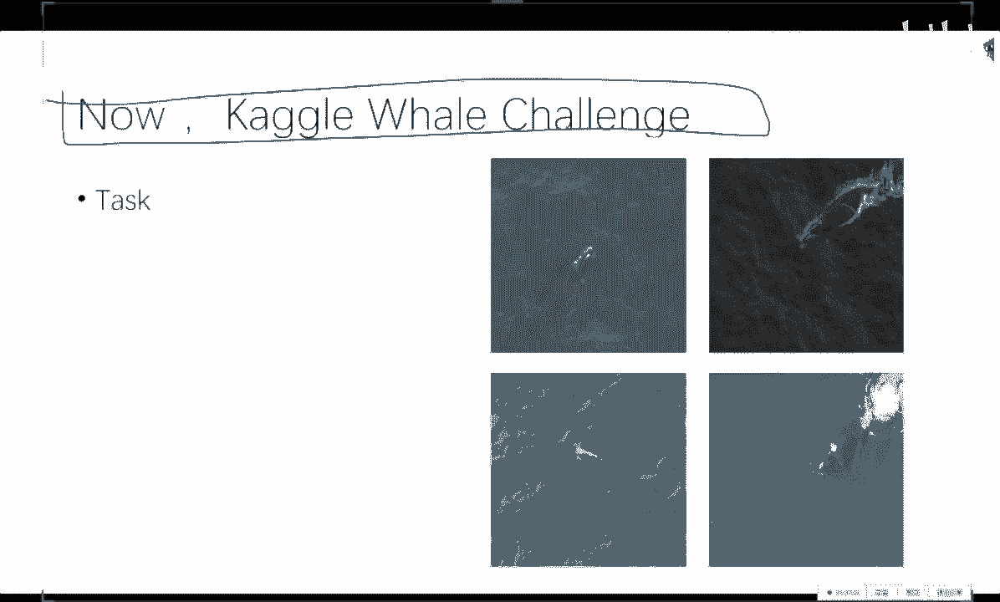
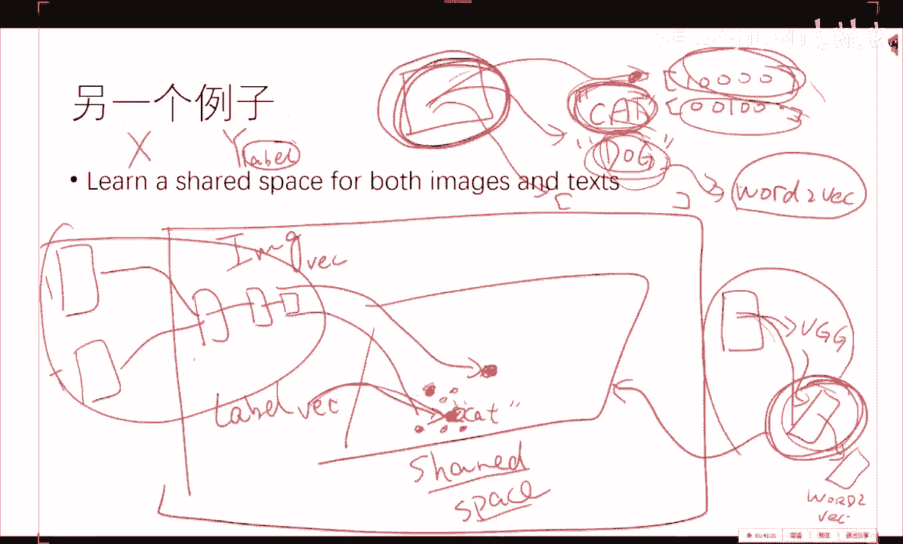
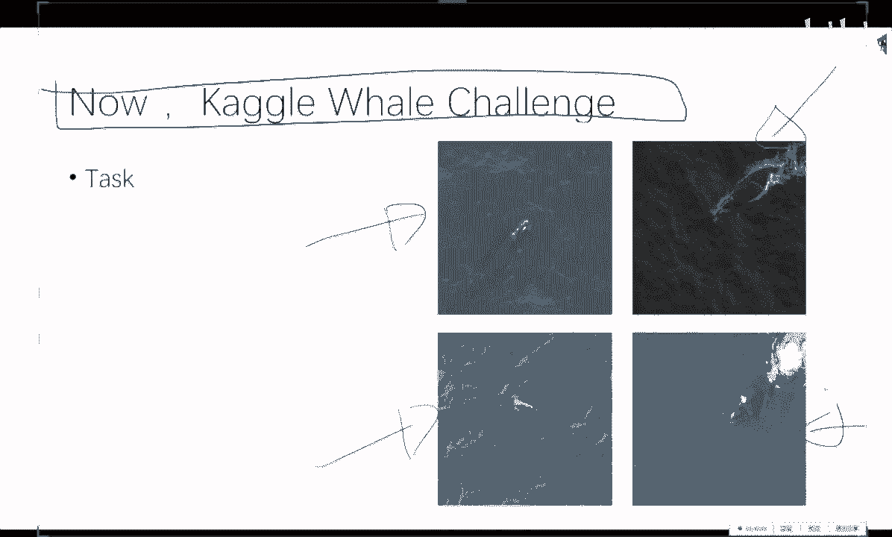
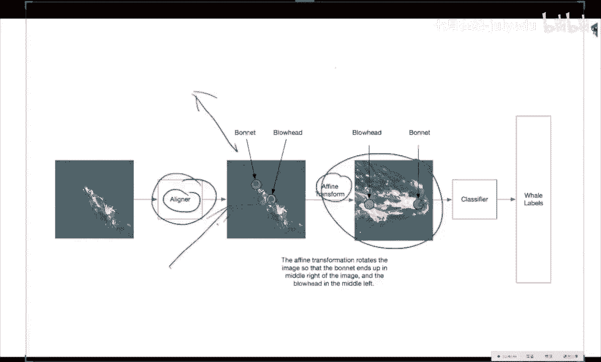

# 人工智能—kaggle实战公开课（七月在线出品） - P9：以鲸鱼识别为例，利用深度学习解决Kaggle竞赛中的图像分类问题 - 七月在线-julyedu - BV1jh411y7Fh

啊，比如说这个例子，我们想做呃。就是说我我们有什么，我们有CN跟RN啊。我们想做什么？我们想做这个呃呃输入一个图片啊，输出它的这个tenion啊，输输出。

这个图像图片最后这个啊captioning某一个词在具体某一个位置的一个一个注意力啊，我们怎么办呢？啊，这个是我们想做的。啊么我们有的是第一，我们有这个CN啊。

CN我刚才说过了CN的这个就是我刚才说的CN把一个图像变成一个。变成一个tensor的表示，汇比变成1个4096的，这是4096维的一个向量。这个的表示它的这个monty instance。

它这个mounty instance的这个信息就包含进去了，就是说它每一个这个小柱柱代表了图像中的一个区域，这个是它的核心。而这个事情是需要从机器学习的那个角度来看的。

那么我们这个attension其实就是关键就是利用了这个表示啊，就是他把这个tensor的这个东西拿出来了。这个每一个点就。这个每一个框框其实代表的就是这么一个小柱柱。

而这个框框是能够回溯到具体的这个图像中的区域的。然后我再针对于这些instance，我利用RN，我每次做一个soft maxoft max回归的是我需要attention的这个这个inst的这个ID啊。

所以呃一个是呃呃呃。这些instance的一个啊。一个线性叠加，再加上我的这个caption的这个word。

我就能每一次的预测出来一个呃这个呃需要attentionatend到的这个instance的这个位置。就是很简单的一个事情。那么其实比如说你回到了这个呃两年前，你自己想当时还没有我退身啊，两年半前啊。

应该是两年半前吧。如果你回到两年半前，别人想告诉你说，请给我做一个attention啊，你怎么做呢？如果你对CNN的这个真正背后的这个意义比较了解，然后又懂1点RN的话啊。

这个事情你也就啊其实也是一个并没有什么啊，你你也就能自己也就能做出来的一个事情。这个是我希望大家啊掌握的一个一个方向。再比如说一个例子，就是说我们呃能不能就是说我们想做什么？

我们想做一个呃一个一个所谓的这个影空间，这个share space。就是以前我们对图像，我们这是一个图像，这是一个label。而我们对这个label的编码是一个one hot enr，对吧？1000。

或者是00100对吧？那么其实我们现在一个每一个label，它是一个英文词啊。比如说这这个它是一个比如说它它是一个cat。或者他是一个dog。但是诸位你们如果稍微关注一下NLP的话。

我们NLP里头其实有一个东西叫做wordl to vector的，对不对？work vector的表示是比这种one号ing表示不知道好到哪去了。所以说我们如果要做一个分类问题。

我们把这个label背后的语义信息所忽视的话，直接强行的回归到一个不包含任何语义信息的这么一个label里头去，肯定是呃不够圆满的吧。那么有没有可能我们把这个这些label当做一些词。

然后用一种inbedding的方式嵌入成了一个向量。然后我们学出来。就就不做分类任务了，就做一个回归任务了。或者说换一句的角度，从呃比较数学的角度讲，就是说。

这是图像image它的一种ebedding对吧？它的一种ebedding它这然后这个label啊。它的一种inbedding，然后我们学出来就是每一个label我们在。一个空间中在这儿。

就比如说这个是cat啊，它的一种嵌入啊，然后这个图像它的这个嵌入，比如说在这个共享的这个空间中啊，它大概图像在这个点。然后我们通过监督学习的方式。

尽可能的让标注有cat这个label的这些图像都跟cat这个label比较近。啊，这个事情啊也有人做了啊，但是这个事情也是非常straightfor的一个。一个应用啊，我说明白了没有？

就比如说我们这个是一个图像，我们走进了一个VGG啊。然后走进微微机机制之后，我们又有一层，然后再再一层这一层我们回归的是word。To vector。而那么如果是这样做回归的话。

那么我们这一层其实就是我们的这个所谓的shared space。嗯。好好。那么这个是一些word to vectorctor的一个介绍。其实我想说的是，我们想做word to vector。

就是说比如说你给我一个就是w to vector，它关键的假设是这样，我们想知道一个词儿，一个词的定义是根据它周围的词所所决定的。那么如果比如说你在时间倒流回到2003年。别人给你提出一个任务。

请我给你个词儿，我给你个word。请你能不能给我一个这个vector，这个ve而这个vector跟这个word是有，就这个vector是包含一定语义信息的，这个是我们想做的对吧？

这我这我这是我一旦一再强调的，这个是我们想做的事情。那我们能做什么呢？我们能做的是，那么如果我们基于这个信念的话，我们是能做SVD的啊。

我们把这个cocurnce这个mtrix做一个SVD分解分解之后的每一行其实就是这个就其实就是一种 to vector的一种嵌入。但是他的你看这是SVD嵌入出来的入嵌入的也很好。

但是它的问题就在于它这个方法吃不进去很大的数据。那么呃用一个单引层的神经网络来做同样的一个任务啊，他就做的比较好。这个这个就不说了啊，这个就是啊啊NP那帮人的事情。但是如果你们这个做做做CV的话。

你们心里要清楚，我们这个图像嵌入跟这个文本的嵌入这种多模态的学习是可以学出来一个一个你叫一个引空间也好，叫一个share space也好，然后在这个share space中，你就能做一些其他的一些。

事情了，而这种approach呃是呃机器学习这边过来的啊，所以希望大家也能够呃多关注一些啊这种玩意儿啊。OK那么现在我们说这个cargo challenge啊，这个其实呃可以当一个。嗯。

如果花了两个小时讲这个，我相信。大家也会觉得比较浪费时间的。啊，做C微的W to vectorctor不是很懂哈那。

我们来讲一下。他这样。我们输入一个词儿，对吧？输出这个词儿，周围所有词就是这个是一个很有野心的一个很简单粗暴的一个词。比如说嗯一句话吧，嗯话在哪？输入的是这个词啊。

输出是请你把周围这些词全给我做一个prediction。因为神经网络它是能monty taskask的，就是它就全就全就都输出了。然后输出之后呢。

我们每每每一个词我们会有一个叫做lookup table，这是一个lookup。他这些这个是ID啊，就比如比如说这个词儿ID是一啊，ID是2，就是你的这个字典在这儿，这个是word。

to vector的一个emdding。那么每一次更新的时候呢，我刚开始初始化的时候，我全部是一个随机的300维的一些向量。然后如果啊。这个词儿啊那到了这个词儿了。

我我把这个这个字字典中的这个inbeddding我拿出来，我做一次训练更新。更新之后呢，我不因为我做backpro，我是能把这个输入这一层也做，就是说我也能对这个X，我也能对X进行更新的。

你们做你们做图像的，肯定你们也知道，如果我们要做这个stll呃，就是这个。Transfer。就是你们是能对这个image做梯度的，对不对？这个你们是会的吧，就是你你们是能对image。

做这个做做这个梯梯度的。那么NLRP一样，它也是我back个 purple给你回去，我也要对X做一个upateX updateate之后，我把X这个upate的这个新表示，我对对这个表做一个更新啊。

然后就这么迭代的用一种单隐藏的一个神经网络来训练就行。它其实并不是深度学习啊，它就是一个神经网络，它一点也不深啊，大概这个是嗯谷歌他们那个。经典的一个方法是1个300维的一个。一个表示。

啊啊CV的 word好，抱歉啊。啊，C维 world vector是这样。好。CV其实不是CV的word to vector，就是说CV要利用到word to vector是这样。

我们现在不是有有一个图像，有一个 inputput的X嘛？我们有一个Y，对不对？我们这个Y有可能是一些label，对不对？而且有有可能是monkey label，对不对？

就是有有有可能一个图像它对应的三个label，下一个图像对应了5个label，下一个图像对应的两个label。而这些label，我们如果用one halt code的方式是不是不是很好啊？

因为他没有什么语义信息，我们想借用NLRP中的一些知识，我们对这些lal做一种嵌入啊，这个没有问题，对不对？那我们没有嵌入之后呢。

我们是不是就能那么我们是不是就能给他就是说我我们学习出来一个一个输入到输出的这个回归问题。嗯。而不是一个简单的分类问题。而如果做回归问题的话，我们倒数第二层的这个激活层的这些值。从嵌入的角度讲。

它其实就学出来了一个隐含的空间，让这个。图像跟这个label映射到了一个空间里头，使得空间里的同样label的图像跟label长得比较近。这是一种方式。

另外一种方式是我的这个text跟这个image它共同的进行一种训练啊，然后呃再做一个监督式的学习。这个跟任务就就有关了，不同的任务，不同的干。那么这种做法呢就是多模态的做法。

这种做法呢就纯粹的monti label的一个做法。

那我。好，那么呃呃呃。这个tsask呃呃很简单啊，就是说他们有这么4000多张从海上拍的这个鲸鱼的照片啊。呃，给你一张新照片，请给我分类是哪一种鲸鱼啊。

就一个一个所谓的fu green的一个分类的问题啊，那我们看看。

他这个训练仪就是4237张啊，一共是427种。但是他。比较扯的地方是有一些的这个。这个鲸鱼的类别啊，这个是一个鲸鱼类别的一个分布啊。

嗯每一个是它的这个类别的一个1个ID有些类别在训呃在给你的这个训练集中只出现了一张。这个是一个小问题啊，需要需要处理的一个一个技巧啊，那么就是。拿到这个问题。OK你有个图像，我有个label。

那么最最最b line的方法就是OK那么我们把这个图像我们res稍微切一下，撂到一个微基金net里头去。我们算一个label啊，这个应该是嗯就是嗯大家学过第二节课之后就应该会的事情。

因为我们想干的是啊对图像进行分类，我们有的是一个从网上下了个危机G啊，那么我们肯定第一步就先这么干，看看效果怎么样。如果这这一步的就是做深度学习的事情最好我我还是建议大家嗯这种迭代的敏捷开发好一点。

就是先先做个最烂的。然后一一步一步迭代的这来来做。如果我们这么做完之后，准确率已经差不多99%以上了，那你就不用再做其他的事情了，但是很可能不可能有这么好，但是你也是要从b斯烂往往往下做，对吧？

从b斯烂往下做。那么这么做完之后就会有很大的问题是什么呢？如果你对这个模型，你给它做节卷机，把它那个。把他的那个呃就是说呃把把他所关注的那些点plot出来一下之后，你就会你就会发现。

这些海面上的这些波纹其实是这个分类器所关注的一些地方。而这个事情是你不想发生的一件事情。你就明明是在对鲸鱼的这个脑袋进行分类啊，到最后这个分类器却很多分类器，就分类器在很多情况下再看一些海面上的波纹。

那这个肯定是比较missleading的一个事情啊，那么你要干的下一件事情呢？就是说啊我想解决这个问题。那我一种可能的方式是什么呢？一种可能的方式就是说啊这个东西切的还是不够。

我能不能只把这个大脑袋切出来啊，就是说我输入一个已经reess过的1个2562乘256的一个图图像。那么我们来一个这个这个这个所谓的localizer。

我们把这个图像给它切成啊这个么只包含这个脑袋的一个所谓的证证件照，然后再撂到一个呃V机机网里头再训练啊，这个这个的原有。不是因为我们上一步分析过了。

我们发现啊这个这个海面上的这些东西是我们困扰我们的一个事情。我们才这么做的。OK那我们这么做，那我们怎么做这个怎么样找到这个bunding box呢啊，那么最简单的方法就是我刚说了。

我们不会做bing box。但是我们会做回归啊，那我们就标注一些bunding box，我们回归这个bing box的。四个点就行嗯，这这是最简单暴力的方法。那我们我们基于这个方法，我们做这个。

RRCN或者是faster。而且也可以就是说我们有各种各样比较奇奇怪怪的方法来找到这些。bunding boxesOK那么这个是第一种改进方式啊，做完了之后呢，还会还会有一个问题，就是啊啊对对。

就是说我我我们会会什么，我们会分类或者回归。我们想做什么，想获得bing box。那我们要干的事情就是说我们对这个bing box的这个。这个点做一个回归就行啊。

那么那么我们下下一个事情要要做的就是所谓的这个aligner，就是说我们要对齐，因为。这个脑袋的脑袋的脑袋的脑袋的这个这个指向啊，也是影响这个。就因为脑袋指向是比较随机的。而一个神经网络。

他并不知道这个是一个很不很不重要的一个点。他以为就是他他会学习出来一些规则，会会以为是在去。在这个角度上，它是这一类，在那个角度上，它是那一类。

那么我们需要就是说我们第二步就是我们会我们需要找出来他的头呃，跟他的脖子这两个关键点。然后根据这关键点，我们做一个做一个旋转变换，我我们就能都他们都给我都都给我扭成这个角度啊。那么我们怎么找关键点呢？

哎，那这又是一个典型的一个回归问题，只要我们标注足够多的数据，我们回归这两个坐标就行。回归完这两个坐标之后，我计算一下这个坐标跟这个平面的这个夹角，我们给它硬拧过去再ress一下就行。

那么这个是第二个trick，就是说我们怎么样的做这个aligner啊，那么一样，我们想要的是关键点检测，这是我们想要的，这个是你们CV中的问题，但是我们机器学习中的东西只有一个分类跟一个回回归器啊。

怎么办啊，啊，有分类器不好使，回归器的话，哎，我既然关键点了，那我就回归就很那么简单粗暴的把这个把这个点当做一个回归问题回归一下，背后有什么理论依据没有。但是很work啊，那就行了啊。

那就是反正就就这么干了啊，那么就把这个。

这个就能这么做。好。

