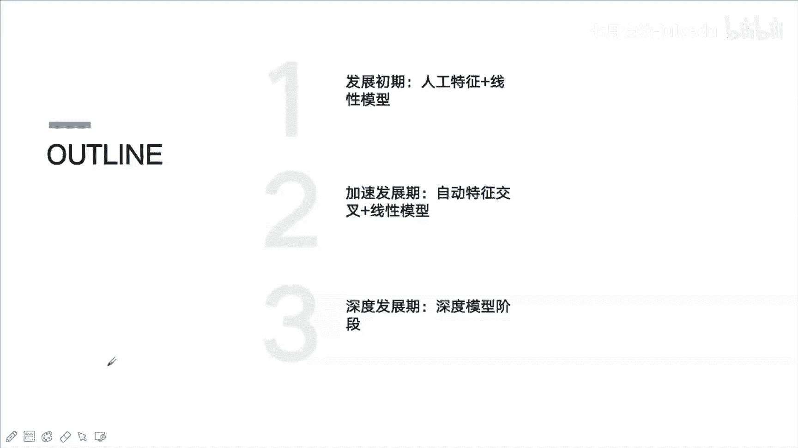
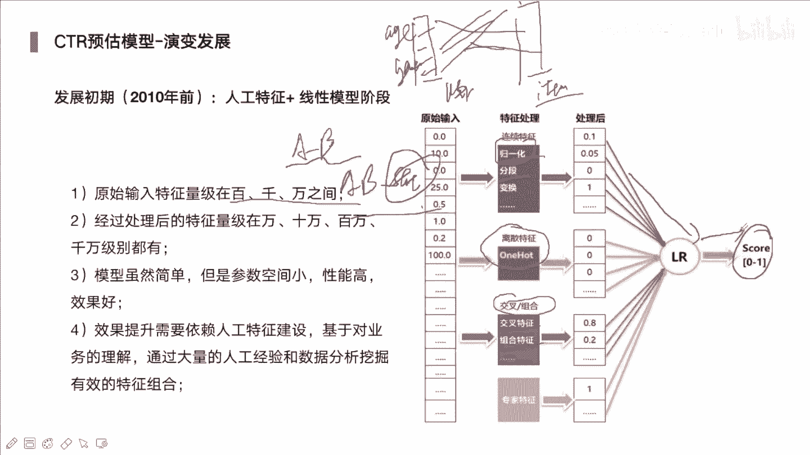
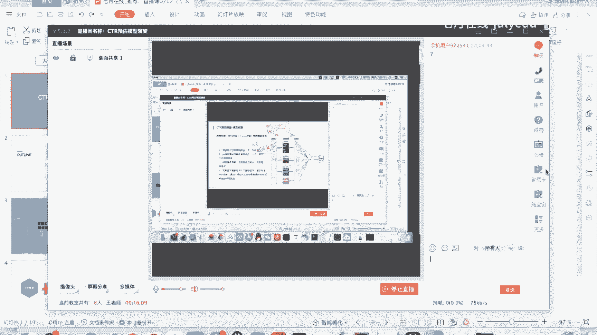
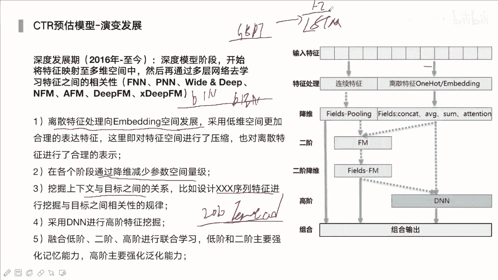
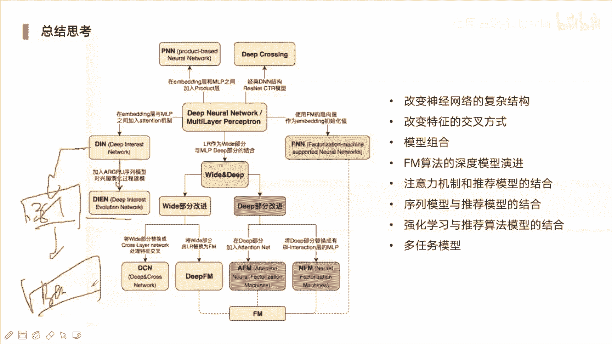

# 人工智能—推荐系统公开课（七月在线出品） - P10：【公开课】CTR预估模型演变 - 七月在线-julyedu - BV1Ry4y127CV

🎼。

好的啊，今天呢我们这个主题呢嗯是以CTR预估的模型演变为主。那主要带大家去介绍一下，就是说关于CTR预估，对吧？它的模型的一个发展，从最开始的LR这种的线性模型到现在对吧？

像结合bttranser中比较复杂的模型。那这节课呢都会基本上都会涉及到的对啊。

。主要分三个部分啊，第一阶段是它的发展初期啊，也就是大概就在17年时候，其实啊那时候那更多的是人工特征，然后加上LR的线性模型。呃，初期的时候进忙的时候其来说深度学习发展的还是比较缓慢的啊。

第二阶段呢是加速发展期。你考虑到像一些人工特征的话，那本身来说。整体我们需要做的事情对吧？还是非常多的，需要我们构造大量的一些特征。但是有时候我们可能考虑不到啊，那这时候呢我们看能否去借助模型，对吧？

比如说像自动自动交叉呢，像常见的那种数模型，像叉GbolikeGBMkbo啊，这种话它就是说在进行数分类的时候，对吧？那每一次分类呢，它其实就会选择一个比如说信息增益啊，最高的一个。

一个一个节点进行分裂。那下一次在分裂的时候呢，就相当于一个特征交叉的一过程了。对。那，还有一种话是FM那种模型，那它可以有效来去捕获那种二阶的交叉特征。因为像原本的线性LR模型，对吧？

它其实来说不能够去学习到特征的一个交叉的属性的。造化阶段的话就是深度学习模型，它的一个发展阶段了啊，就像最开始比如说DN那是比较传统的对吧？也是用的也比较多的啊。

那DN再去结合LR就是w and deep呃，那DN再去结合FM啊。呃，还有的话就是说我们将DN的吧再去结合呃attention那FM也可以去结合attention啊，就这种各式各样的一些组合。

那它都是在深度发展期的时候，对吧？慢慢的演变出来的。其实我们去学习到或者说去掌握一些固定的或者经典的一些结构，你会发现其实很多的一些呃比表现的一些路呢。

它其实都是在基础上去进行组合或者变换出来的一些模型啊，其实都大同小异，只是说它变容。原本的话比如说像那种deepFM对吧？和NFM那dPFM的话，它可能是一种那种并性的结构，对吧？

一部分是FM一部分是地部层啊，那像NFM的话，那它可能就是说前面部分是先进行FFM然后再去结合DN啊。

Okay。嗯，那在讲模型之前呢，其实还要大家去。其实我们可以看到模型它的一个本质还是为了想去获得在原始数据里面，对吧？获得更多的一个信息学习到掌握更多的一信息啊，如果只是1个LR的话。

它其实是学不到那种二阶的一个信息的。所以说二阶信息的话，其实我们可以把它看作为一个特征。如果说我们进行了二阶交叉特征之后呢，再加上未入模型当中，那已经将这种信息已经可以辅助模型学习到了。

那如果说我们可以把它转换成一种比如说像这种FM这种结构。那其实它也是去去做这种特征的一个交叉的对，就以在原本的数据基础上，对吧？那我们能够去。获得越多越多的一些信息，或者说不管是它是一个显性的。

或者说是一个隐性的，都是对于我们最后结果提升非常关键的一个点的啊。

그。Okay。那我们还要去考虑，就是说应用场景啊，其实来说不同场景对吧？其实我们可能考虑的一些模型或者说我们想要的一些结构啊，也是不一样的，包括用户的一些行为啊，比如说我们在大规模那种稀疏的一个场景下。

那我们选用什么一样的模型，那另外如果说缺失值信息非常多的而且数据量非常小的一个情况下，那我们又该选用什么样的个模型，其实会以看到很多像那种比如说金融风控对吧？这种领域下，呃又或者说像那种推荐领域下。

那他们其实来说所适用的模型也是不一样的可能像那种金融风控这种领域，对吧？它其实模型来说的话，那可能不会考虑是特别复杂。更多是考虑是可解释性啊，然后再去结合一些呃策略规则，那像推荐领域，对吧？

那我们想要的是进。种精准的一些信息的挖掘，提取出用户的一些兴趣。所以说这个领域的话，我们考虑更多是那种深层次的一些交叉啊，或者说结合一些，比如说我们将序列位到模型里面。

让模型能够学习到用户的一个他的个序列表示，或者他的一个兴趣。对，这就是比如说像LSTM种，或者说是attention，或者说是transformer这样的一些结构。那这个就是说结合不同领域啊。

那我们考虑不一样的一些模型结构。呃，什么意思啊？发个问号是听不到吗？嗯，622541。谁应该可以闹吧。包括画面啊，有问题的话，大家可以就是。都可以发出来的啊，咱们可以讨论。Okay。

有问题我可以发出来啊，我们可以讨论的啊。给我们继续啊。Okay。CTR呢它是常用在呃推荐领域，或者说是其推荐里面，它也会分就搜索推荐、广告推荐、视频推荐，然后还有那些短视频啊，短视频，还有信息流推荐。

啊，还有一些音乐推荐啊，其中其实它所用的场景非常多的，但。都会有两个点的。其实是第一个话是召回这块啊，只是说可能不同场景对吧？我们的召回可能复杂的复杂性复杂度可能不一样啊。

比如像那种比如说像那种呃电影的对吧？或者说那种小说这种推荐，对吧？它其实本身来说的话，它的物料对吧？可能说你说电影对吧？其实也没有多少也没有多少部，对吧？你卡了一些条件之后。

那其实剩下的一些电影或者说候选集就没有多少了。可能这时候我们召回可能不会用特别复杂的一些算法。啊，那如果说对于那种电商场景，对吧？那这里面的它物料非常多了，可能就是千万百万这样的一些商品。

那如果说直接拿这些当成候选集的话，那其实我们训练模型。我们去训练的话，肯定是整个时间那花费要非常大。对啊，所以这时候我们才会去结合比较精细点的一个召回方式啊，去将我们的一个候选集进行的一个压缩。

那原本的话，它可能就是说对应的是几百万对吧？或者几万个，那我们压缩成上千个或压缩成几百个。对，然后这时候呢我们再去将这些。教回到结果端作为我们这个候选级。那。这候选级什么意思？就是说一个用户对吧？

他去产生一次请求，就比如说他刚一次，然开始去登录到淘宝或登到京东，对吧？那这就是一次请求。这个请求的时候，那我们就会从召回过来，对吧？从召回册来会去得到一些候选集，就是说可能会有有一有对应100个商品。

那然后这时候再去经过我们的排序模型，再对这10个商品，我们做一个预测，有它的一个点击的概率啊，来去进行排序，这样子有可能的top多少个段，然后展示给用户啊。所以说这就是个从后选集到最后展示的一个过程了。

那在排序阶段的话，其实我们要做的可能比嗯召回的话，其实模型这块其实来说的话，我觉得因为召回我们可能可能要需要去进行那种多路召回啊，可能十几二十个召回都是有的啊，像那种大厂对吧。

他们都是我觉得至少都有10个召回的呃链路的对啊，可能是十几路的召回。那排序的话，那就只有一个模型了。对，不断的去优化啊。但排级的话，我们还要去勾造各种的一些特征组合，去挖掘不一样的。

或者来自于不管是你的上游下游，或者说它的搜索信息，或者说用户测或item测这样的一些特征啊。都是为了让我们预测的结果更加准确一些。然后最后再去输出，我们最后要需要去展示的。当然这只是大体介绍。

其实来说我们排序完之后呢，还会有一个rera的一个过程啊，因为我们如果说我们在进行给他推进时候，对吧？如果说我们top10的吧，全都是一种品类下的一个商品的话，那其实很影响用户的一个体验的。

所以这个时候我们在rera的时候可能会进行一个打散啊，然后再去考虑它的一个多样性的一个情况。那下面呢就是我们今天的一个核心内容了，CTR预估模型的一个演变发展啊。在初期的时候对吧？那那个时候呢。

主要就是以人工特征加LR这种模型为主了。对啊，那个时候其实模型是非常简单的对啊，我们不需要说它其简单的一个线性的一个就可以了，线性模型啊，LR对。啊，所以它是相对于数模型，相对于N恩来说，对吧？

它的复杂度是非常低的啊。所以这时候他本身模型学习能力就没有那么强。所以这时候我们要把各种可能性，对吧？去构造成一些特征。对啊，所以说我们在输入的特征量级呢，可能就是有成百上千或上万个这样的一些特征啊。

就各种交叉。因为模型本身不能交叉。所以说我们要人工的各种各样的一个交叉。不管是一阶呀或者二阶呀，其实就是说我们可能一列对吧？这一列是对应user测的。他的各种各样特征，对吧？可能他的年龄、年龄、性别。

对吧？找特征另外一次的话是对应iteom测特征。item它是泛指，比如说商品呀啊泛指于视频呀，看我们是推荐什么了。对，然后进行这样的迪卡耳机啊。然后这样两两之间进行交叉。交叉完之后呢。

我们再去构造一些统计特征。比如说我们将年龄对吧？和对应ite，然后进行一个组合，然后统计这个年龄段对于这个ite，对吧？它的整体的点击次数或者它的一个CTR的一个值啊，就是鲜应的一个CTR的值啊。

或者说它的一个呃曝光次数点击次数，这样都可以去统计的啊，比较多另外一个问题呢，其实我们还要对这些特征做一个处理啊。对，比如说像那种连续性的特征，对吧？那我们肯定要去进行归一化。

你可以把它归一划成这种0到一之间这样的一个值，另外你也可以进行分头，把它变换成一个离散性的一个特征类别性特征。对啊。因为像LR的话，我们最后全部都要把它进行，要不然就进行规一化。

要不然就把它全部类别特征全部转为one后的这种形式的。哦，比如说像在。呃，电商这种场景对吧？一个item对吧？它整个我们的物料对吧，可能item有千万量级的对，所以说你展现的出来维维度也是非常高的。啊。

也就是千万尾这样的一个量级的啊。那用户也是一样的。很容易就到上亿或者说1亿这样的一些这样的一个维度啊。另外的话就是一个交叉特征了，一种是交叉，一种是组合。组合的话，比如说就是A andB这样的一个组合。

Oh。另外一种的话就是A andB，然后再去结合一个统计特征，对吧啊。看你去统计什么了，这样。Yeah。然后最后处理完之后呢，再去经过LR。对，然后最后sigmed得到最后的一个分数啊。

这是初期的时候啊，那其实更多的话需要我们来去做很多特征。那个时候其实你看。嗯，如果说你是在比较早的时候入职做推荐的时候，那时候更多的是我们去挖特征，去考虑一些策略啊，来去做些事情的。

。那下个阶段呢就是一个加速发展期了。对自动交叉哈特征，然后再结合线性模型的一个阶段啊，比如说经典的像GPT加LR，这是facebook对吧？他们推出来的GPT的它就是来去获取。那些类别特征。

其实就是说啊可能我们输的话里面对吧？有连续特征，有类别特征，那最后把它它就转换成成零一这样的一个值了啊，然后再去结合LR。那像FM的话啊，它本身来说就是来去获取二阶的一个特征交叉。对。Okay。

FFM的话，它是在FM基础上做了一个升级的啊，像FM的话，它本身有一个。玉。这样一个概念。对啊，就说我们将特征对吧？分成，比如说我们有年龄性别，对吧？它可能是一个域的啊。

然后另外一个域可能是对应的iteom测的一些，对吧？然后呢，它会对于这种域域之间，对吧？然后进行这样的一个特征交叉，就变成了一个二阶的了。对啊。那FM特点就是说。他不管是怎么来交他对吧。

不管是跟哪个域的来交叉，它本身会有1个VI的这个VI就它的一个呃权重。对啊。不管对哪个，它权重都是一样的对，所以这样的话全都是一视同仁的这样一种交叉。但是在实际当中，我们不管是呃一个用户也好。

或者说一个特征也好，对吧？它跟不同特征交叉应该是重要性是不一样的，或者说那种前前面啊，或者说权重应该是有所差异的啊。所以这时候才会去引入了就是说FM这种FFM这种这种这种形式。对。嗯。

比如说我们有K给于对吧？原本来说的话，那我们它的复杂度又会成一个K了。对，因为原本这个权重对吧？权重这个系数，那它的话是。唯一的是固定的对，那这个时候呢，它会变成一个K个K个啊。

就是说它对于不同的域的一个结合，对吧？它权重也是不一样的，就变成了VIJ这种这种形式了。对啊。Yes。这样的话他就是说我们再去进行结合时候，对吧？它本身权重会发生。呃，会发生一些变化，对。

会有一些差异啊。这就考虑到一些不同特征的一个组合，对吧？它的一个影响差异啊，是存在不一样的。其实就跟那个权重是一样的啊，我们遇到不一样的一些交叉的时候，那我们应该适应性的去对我们的特征，对吧？

或者说我们权重会发生一些改变啊。Okay。这种话其实也是结合比较多的。像。D配FM这种形式的，或者说AFM这种形式啊。嗯。那我们看这个图吧，输入特征对吧？然后再去呃，可能前期的话就是说到LR这种。

但是的话我们再去结合这种二阶这种形式。像FM的话，它其实就是一阶和二阶的一个组合的。我们后面可以看它对应的一个结构啊，下面就是高阶了GBT融化。它其实就是这种高阶，你可以怎么去理解呢？

比如说它的分裂的一个或者它的一个深度数的一个深度啊。也代表它的一个接数啊，越深的话，其实你这种交叉的一个次数会变得越来越多啊。第一次你可能选择性别某个性别，我们做一个分裂。那第二次你到了一个年龄。

第三次的话，你可能到对应的一个品牌啊，这些就是说年龄、性别、品牌这样的一个交叉。下面的话就是具体来讲FM和FFM。那第一个公式的话，它就是对应的是FM。前这个部分其实很好理解。前面部分的话。

第一个部分就是LR了。あ。第二部分。就是FM新加的啊，就是一个二阶交叉了。可以看到量特征之间对吧？它进行交叉的时候，嗯，前面的话就对应它两个特征的一个权重了。对啊。这时候你发现就是说I的话。

它是固定不变的对你看它是跟着它前面XI来去走的，所以说没有差异性。但是你看FFM。他这块变得更加细致一些了啊。就是说那除了就是说前面I跟着XI走的话，同时呢它对于不同域，对吧？那它还有对应的一个嗯。

不一样的一个权重啊。就先找到对应呃，比如说我们XI对吧？那可能我们有很多的一个权重啊。那比如对域的话，F2的域的话，它有对应的1个VIF2。那这是VIFEVI呃FN对，是这样的一个形式。呃。

其实并不是说我们再去加入FII用FM这种模型之后，我们就可以不去构建特征了。你可以这样去考虑，就是说你看原本的话，我们输入特征全都是一阶，对吧？它可以自动来进行二阶特征交叉的一个学习。

如果说我们输入的是二阶的话。那我们再去输入到我们FM里面的话，那会变成三阶啊。更甚至是变成四阶这样的一个组合啊。所以有时候我们也是很有必要的来去构建一些特征的啊，让他学习的力度深度更加深一些。呃。

刚才说的FM的缺点就是说它对于不同的玉，对吧？它的特征权重都是一样的，就这种一视同仁的对，就是VI不发生变化啊。呃，FM的话，它的复杂度。也是比较比较低的对它复杂度。

你看它是这种NNNN次的这样的一个交叉，就是N方N乘以N的这样的一个时间复杂度。Okay。但是FFM的话，它的一个复杂度，那又是不一样了。对，因为我们又考虑到的对应的个域的一个权重。对。

所以说它的复杂度。前面要乘一个K的对于我们有K的域嘛，然后再去。播放。所以说FM本身它的一个效率上面。呃，或者说我们可以理理害它的参数量啊，又会变得非常大了。对啊，但是FM的话。

它可能就是说虽然说它没有考虑到对应不同域，对吧？我们应该是B样的权重，但是呢它的效率是非常快的啊。这是他们两者最明显的一个差异。对，或者说是优缺点。但是在实际场景下，对吧？啊。

我们更多的是去考虑用FM来去使用的。其实像很多大厂对吧？那他们都会去用depFM。啊，当然其实我们也会看到，就是说有deep FM对吧？dep FFM。对，但这个复杂度是非常高的啊。嗯。

这个是FM和FFM啊。下面呢就是GBT加LR的一个。呃，这种形式啊这种形式的话，那GPTT它的哪个部分结果，对吧？是输入到LR里面的。我们知道其实来说GPT的话，它是一个树不断再去生长，对吧？

我们会构建N个树。那第一棵树我们学习完之后呢，第二棵树来取你和上一棵树的一个残差。对啊，像我们这个例子，对吧？它就是构建了两棵树啊，构建了两棵树。那第一棵树的话，它最后叶子节点是有三个叶子节点的。

第二个树叶节点是有两个叶的节点。那你不管是哪个样本，对吧？你比如说经过第一棵树的时候，它肯定会落到某一个叶的节点上面。如果它落在第一棵叶的节点上面，它有一。后面全是零。那对于第二棵树。啊。

看这个样本落在哪棵树上，哪棵叶界点上，第一个零，第二个是一。那这样的话，我们就得到了一个这种离散型，这种读热编码弯后这种形式的一个特征。它最后特征就是10001。将这部分对吧？

我们直接去输入到我们的RR模型里面就可以了。对他是这样来去进行组合的。因为本身LR的话，它是不能获取。或者说能够去提取这样的一些特征组合交叉的这样的一个信息的。这时候我们借助GBT对吧？

它有这样的一个能力，那我们可以去将这个能力，对吧？来去得到一个特征再去赋予给LR。嗯。那这就是GBT加和加RR它的一个特点了。对。嗯，这个的话是在15年还是在14年的时候。

facebook然后提出来的对，但其实我在之前参加一些比赛的时候，对吧？嗯，也尝试用用也尝试用这种形式啊。当时我是怎么用呢？我是其实没有用加R，我是GPT对吧？加上DN这样来去结合的对。

但其实效果并没有那么明显，对或者提升并没有那么多啊，所以说一直也在考虑这个东西，它是不是有非常好的一个效果。其实我们如果说了解到一些公司他们去做的一些算法，对吧？基本上没有用这种形式，你要不然就用R。

对吧？你要不然就用GBT啊，但这种形式是非常非常少的啊。下面呢就是一个重头戏了，就是深度学习这些模型了。对。我觉得是一个百花齐放的一个阶段啊。其实来说也很好理解这个部分，对吧？它其实就分成几个方向了啊。

不同方向啊，有的话我们考虑的是从这种特征交叉的一个方向来去考虑啊。另外的话是考虑就是说从。嗯，用户的一些兴趣，或者说一些呃一些表达这块来去考虑。比如说像那种DIN对吧？这种形式啊。啊。

又或者说像那种DIE，或者说BST啊这种模型啊。这种更多的话是去结合一些。那种L。呃，attention或者结合那种GRU啊这样的一些结构来去补来去。捕获用户的一些兴趣啊。这个阶段的话。

它其实就是说我们将第一个话是离散特征，对吧？处理像inbeddding空间的一个发展。对它都会去经过一个look up embedding层。对，将我们那种从稀疏型特征，对吧？

全部转换成一个embedding啊。就用这种稠密的一些向量，对吧？来去表达我们原本的这样的离散特征。可能我们原本的维度是非常高的对。百维啊、千维或者说上亿维这样当对。

但是我们经过这种inbedding之后呢，我们其实是进行一个压缩过程。用一个向量来去表达它原本特征的一个含义。同时呢他也会去经过不断的去迭代学习。对啊来去调整这个inbodyiding。

第二个是在各阶段对吧，通过降维来去减少参数空间的一个量级啊。哦，其实像我们公司对吧？现在我们的模型对吧？可能可能就是百亿参数啊，百亿几百亿两个参数的。去想想光user和对应的ite对吧？

它本身参数量就非常大了，已经啊可能就已经几十亿了。再去结合你其他的一些呃，你几层MIP下来啊，再去结合。呃，对应的传梭嘛，那参数量其实是非常大的对啊。挖掘上下文与目标的关系，比如设计什么序列特征。

对吧啊。这种shift特征的话，其实就是说我们将前后的一些关系，对吧？来去。引到我们模型里面了。对。你想想原本的那种数模型，对吧？它会考虑到这种上下文的关系吗？这种因素。除非你去构造一些特征啊。

你可以把这个信息引入到模型里面。对你如果不去构造的话，你是很难去获取到这样这些序列的一些信息的。比如说像20我看看呃，2020年腾讯广告扫码大赛。啊。这个比赛呢它是给到了用户对吧？

点击广告的一个序列或点击广告的日志，对吧？来去预测用户的年龄和性别的。那大多数选手对吧？刚开始可能去用那种letGBM或者GBT这种模型。啊，还有的话可能会去用LSDM中序列模型。

序练模型直接能够比GPT多上个1到2个点。Oh。提升是非常大的。那非常关键的原因就是说LILSTM的话，它能够去学习到那这个序列的一个向量的一个表示。对。

因为就是说我们要去从这个序列里面来去了解到用户的一个特性。比如说她是一个女性的话，那她的序列应该是什么样子的对啊，但是呢这个T他就缺少这种特性了，他就很难去铺获这样的信息了。除非你去对它去列对吧？

里面不是有对应的一个item，对吧？或者说广告ID对吧？你再去经过ctor或者说deepwork来去得到每个对应的向量，然后这时候我们再去进行一个聚合，对吧？这种类似于mepopo这样的一个操作啊。

这其实也是能够获得到获得用户序列的一个表达的对。但这种表达话其实来说，有时候他是比较粗糙的啊。一个说你是很难去捕获他的一个趋势性的。对。你说你里面去进行mepo令吧，他每个权重你怎么来去调节啊？

所以这时候的话有时候还会去考虑去结合attention，或者结合就是transformal都是比GBT的效果好很多的对。所以说目前而言，对吧？我们再去做推荐。相关的场景的时候。

那他可能会涉及到这些序列这样一个问题。所以说我们去用到那些。能够去捕获序列这样一个信息的结构啊是非常有效的，而且提升非常大的对。再也不是说像两三年前对吧，才还在去用DPF那样模型。

那这时候我们肯定会将transformer结构加入到我们DPFM里面。我们可以把DPFM作为我们的一个框架，作为我们这个base模型。对我们可以再去引入transformer这样一的模块。

和它进行一个组合。

嗯，像我们的话，现在更多的是跟业界去对齐。对啊，比如说我们可能刚开始的时候，我们只用DCN这样一个模型是非常简单的啊。可论我们之前对吧？用的是DCN模型。那低森特点就是说它能够我们后面有低森啊。

低三特点化，它能够捕获到对吧？特征的一个交叉。这种交叉和FM交叉是不一样的对它的结构它能捕获到一些高阶的一个交叉。你可以去设置它的一个接数，三阶也好，四阶也好啊。那DCN呢也许来说。

我们这个基本被散出来了。这时候我们可以考虑到，就是说我们业务来去考虑我们的业务可能就是说会有多个目标。那多个目标的话，你就考虑有多任务建模了。那这时候我们会去考虑去用MMOE。大家可以去查一下MMOE。

或者说PLE。这样个模型。对。这种模型的话，大家也可以有兴趣再去了解一下，像这种MMOE或者PLE这种模型，对吧？它的一个这种多任务模型它有什么样的一个特点啊？那我们可以我该给大家讲一下。

其实这种多任务共享，对吧？它其实分成两种，一种是硬共享，一种是软共享啊。Yeah。分成两种形式啊，再往下呢，我们考虑到有我们没有去考虑到用户长期兴趣或他的一个行为序列。那大家也许有听过。

就是说长期用户兴趣建模。对啊，那这时候呢我们会去引入transformer模块。그。那这个里面的话transformer里面的话，我们会考虑什么呢？比如用户点击序列。他点击序列。

或者用户他的一个下单序列。对。通过这样一个训练来够捕获到用户的一个兴趣的个变化。那这时候感觉好像已经到头了，我们还能考虑什么呢？实时性的一个变化。你可能原来你的模型段是DT加一。做更新的。

那下一步呢你进行增量更新。这两可以，也许就是说你4小时更新一次。你再不的话，你变成online learning。1小时更新一次。对。因为用户兴趣他短时那个兴趣。你如果说你模型学不到的话。

一其实会损失很多信息的对，所以说我们能够去尽快的去更新我们的模型。比如说近期出现一些新的一些。呃，商品对吧？啊，对，但是之前你没有这样个信息，你可能会延迟半天。对。那你对他学习肯定是非常弱的。

如果说我们这个时间也能跟得上了，然后模型到上面那个部分了，再往下，你可以怎么再去更新呢？transform mode它下一步更新是到什么呢？是到bt了。大家了解的话有bt。Oh， for。Reca。

得用bo来去做推荐。对。再往后的话。我们如何去解决一些能启动的问题？那这时候我们是不是可以考虑就是说结合知识图谱的问题来去知识图谱这样的一些技术来去帮我们解决能启动这样个问题的对啊。

就是我们再去引入更多的图相关的个信息。啊，这也是目前很多大厂来去。构建的基础的一个能力就是graphuff。K G Guuff。会共享的。Okay。这就是一个就是说我们可以考虑的它的一个方向了。

如果说我们制度部搞完之后呢，你还要想什么方向的话，那我可以其实很明确的说，其实。你基本上大部分你再往后的话，你可能经过一个月，你也没有多少提升的对。这时候的话其实就变得非常卷了。其实越到后面越卷的哈。

其实啊。啊，遇到后面，其实你把那个哈陈窗告做完之后，遇到后面你就非常卷的，它不一定会有效果的。有时候你看论文对吧，感觉是有效果，但其实不一定不一定能对。这时候如果说没有新的业务，你还再去做原来的业务。

不断的去优化的话，可能有七八个人一块去优化。那其实再往后的话，你想再去有一个好的一个成绩的话，对吧？你就变得非常难了。对，这多话，你可能除非你去发些论文啊。

但是我觉得发论文对大多数人来说的话还是比较难的。啊，包括我其实我个人也不是去发论这个方向的，更多是偏实战这种方向的啊。Yeah。那我更多可能会去看论文。对看论文。

然后分析这个东西能否去适用到我们这个业务场景上面。啊，其实能做到这一点，我觉得已经很不错了。因为推荐这种场景，对吧？其实我们要不断来去跟进现在最新的一个前沿的。而不是一直在停留。

因为我们不管再去面试也好，对吧？他们也会去关注到你是否去关注比较新的一些内容呢。OK我们回到模型。再往下部分的话是FN和PAN对，这两种的话也是用的比较少的一个部分。对啊，我们简单的去过一下FN的话。

它是将FM引像亮度啊作为引白点。啊，就下面这部分吧。作为初始值后面再去经过我们DN那PN的话，它其实进行了一个product这样的一个。交叉的对啊，就内衣这样的一个过程。

就两样两两样特征经过这样的一个内机之后，那作为我们的一个初始的一个，就是说我们在inbe层和MIP层之间啊加了两样之间的一个内机，这种内机对吧？它和。第一N这MIP的一个交叉是不一样的。就内机的话。

它是两个向量之间，对吧？两个向量之间。😊，哎，两个向量之间我们进行了一个内接。但是在MRP里面的话，它是弄种每个元素点，对吧？啊，我们这样进行一个组合交叉呀，对吧？好。Yeah。对，两个是不一样的。

这种交叉的话，它是一种隐视的对啊，是到具体的一个神经元这样的一个。但下面的话，它是对于善量之间。这样的一个交叉的两者差异还两者还要有明显差异的嗯。开论当然是有用的了，起码你能了解现在最新的一个方向啥的。

对啊。我们部门每周都会进行那啥呢？呃，内部的一个分享的对啊，大家分享的也都是去介绍一些最新的一个论文的，或者他看到论文。Yeah。嗯。呃，我觉得一个业务点对吧？你们一直去优化，一直去优化。

肯定会到瓶颈的。对，所以更多的是其实像很多团队对吧？他们都开始去找一些新的业务来去做了。对。嗯，像我了像我了解到的一些，比如快手呀，台文团队对吧？可能。七八个人对吧？同时来去做这一个点。啊。Yeah。

同时做这一点，不是每个人都可以有提升的。对。不一定每一个部分都会有每个人都做东西都有成效啊。而且这种这种这种这种内种的话，其实来说非常的压抑。其实工作的时候。啊，如果说能有比较多的一个业务，对吧？

其实也不会产生这样的一个问题的。像字杰队吧，他有一些团队对吧？开始去往外卷了。对，找其他部门的，找其他公司来去做一些PK。对他们去接其他公司的一些项目来做PK对啊。

这就是其实内部已经没有什么项目或者业务让他们去去做了。对？如果说还是一直在这个业务下面，对吧？那大部分人来说的话，都在去优化这一个部分。啊，一个人来说，其实来说整体的提升是比较慢的。

另外来说的话确实是非常卷。所以这时候看能不能去找些新的业务啊。我觉得一般公司来而言，对吧？一般公司而言的话还。到达不了，就是说非常卷的一个呃状态吧。对啊。首先要跟业界对齐吧。对啊。

看有没有到现在就是说最新的这个这个模型的一个阶段吧。那如果还没到的话，那其实我觉得还有很多提升方向的啊。

。再往下的话是wed and deep。哦。和李培回吗？啊，这两种话其实就非常像的对啊。都是说将嗯。两个部分我们并行结合起来。对啊，Y deep的话，那一部分就是LR。另外部分是DN对吧？啊。

然后我们两者拼接起来，然后再去经过ss mode。啊，基偶函数。那D排FM的话，它其实也是分成两个部分的啊对。那一个是FM部分FM错。Yes。第二个是隐藏层，就是我们FCMMP层。

然后两者我们再去进行抗开的一块儿。然后再取到我们的一个signma计函数。这者结构我觉得也是非常明显的，也就非常显而易见能够看出他们这个差异。好，他们这一个特点。再往下就是深度交叉网络啊。

dip cross network这个它的话就是将两个部分结合的。第一个部分的话是我们叫叉网络部分。Yes。Yeah。第二部分的话就是我们那个DN那个部分了。

它的重点呢是在于我们交叉网络它是怎么来去做的。这里的话我们可以把它理解成一个残插网络的一个结构啊，残差网络结构。那比如说我们第一层对吧？是X0乘以X撇。嗯，然后词嗯然后乘以权重。

然后加上我们的一个biS，再加上我们的X。比如说我们第零层对吧？那就是X0再去乘以个X0，然后再去加上我们权重，再去乘以权重，加上我们的bi，再去加上X0。这是第一层。那第二层呢是X0。

再去乘以个我们的X1乘以W，再去加上我们的B再去。加上我们的。X一。第三层呢就X0再去乘以个我们的X到二了，对吧？到二了，W加上by再加上X2。嗯。首先，X0它始终都会存在的对啊。

另外的话就是说不断的来去和最新的一个交叉对吧，来去做这样的一个组合。而且我们可以去决定它的一个深度啊，多深啊，像我们其实我们的base就是用DC的，我们设的是一个三层的。就含三层啊。

这种交叉也是非常直接的。对，当时我们去我们去对比过D排FM和DCN那个效果的啊，DCN的话是稍微高一点。对。嗯，305这个同学说需要补补高数和概率论和心代数吗？呃，没有呃，其实还好其实还好。

像但是我觉得你要去了解一些。呃，基本的一些比如说求导啊，对吧？还有一些那种新代数里面举证的一些乘法呀，或者说呃因为它里面会涉及到各种的一些，比如说么因式分解呀，这种的该论呃，该论里面就比较少了。对。

比较少一些的。高等数学里面的话就是涉及到一些。各种求导。哦。就种比较基础的比较基础的啊，再往深的话，其实平时也用不到。反正我在工作当中的话，其实这东西都用不了多少人啊。你不在面试的时候对吧？

你可能要去复习一下。对，比如说你要去推导的一些。比如说你怎么去推到它的一个损失函数啊，怎么来去推导X机bos是吧啊，它的一个表达式怎么来去推导的啊。然后另外的话。我们再去进行一些求导的一个过程啊。

怎么来去写的？对。不需要太深的，基本上你去我看看网上嘛搜一下学机忆学习深度学习需要掌握的数学，基本就就已经可以了。对。像那个啥比较经典的花书对吧？深度学习那本书里面，它不是前面部分会有几张，对吧？

专门介介绍数学的那这些内容其实也不多的啊，可以去看那个部分就可以了。再往下的话就是一个获取到用户兴趣了。那兴趣网络。嗯，这里的话给大家介绍就是主要介绍是DNN这个部分。B影他考虑什么呢？BN。

它是是加入了attention，但是attention的话，它不会考虑到一个先后顺序的对，所以说但是的话先后顺序对吧？因为用户兴趣也会随着时间发生变化的，所以说DIN它里面是考虑的是深度兴趣进化网络。

对兴趣的一个进化，它的发展。它里面去引入了一个双向的1个GRU啊。但是它这个复杂度，因为LFTM这种这种序练模型，它这复杂度非常高的啊，所以说它这个应用还是不是很广泛。对，但DN的话是应用非常广泛的啊。

嗯。如果说我们不考虑attention情况下，对吧？attention它是来源于。嗯，NP里面的对，就是说我们看到一个事段吧，或者说我们看到一个句子时对吧？句里面每一个词它重要性是不一样的。

肯定有词特别重要。啊，如果说我们看到一个画面数，对吧？有的是有的部分他肯定会。一眼让我们看到。对。会非常显眼，非常吸引呃吸引我们的注意力。但有的话，那我们其实可能一眼看不到他，或者说注意不到它。

那这就是一个attention，它的一个大概的一个含义吧。对，或者说一个直观的一个介绍。啊，就是说不同部分的话，它的权重应该是不一样的对它的重要性应该也是存在一个差异的。就跟我们看到一个图片一样。

有的地方可能权重高一些，我们明显看到它它权重高。有的地方我们可能第一眼看不到它，对吧？或者它重要性并并不是那么高。对，那它的重要性的话，它的权重甚在就会变得低一些啊，这块衡量权重的话，呃。

像DN里面它衡量权重的话，它是用到了一个激活单元对。机构单元的话，它就是说我们先将用户历史的一些序列，对吧？如果说我们不用机构单元，不用这种attention的话，那我们肯定会将用户序列对吧？

进行一个聚合的。比如说ererage或者说mepo或者somepo。啊，这种一个平均尺化层这样一个操作将聚合起来。聚合起来的话就是来去描述对用户的一个描述了啊。那如果说到边N的话。

他就是考虑就是说我们来去学习到呃一个权重。对，因为权重的话，原本我们可能就是说看这个公式，对吧？VU的话就是VO的一个向量表示了。原本来说我们。把嗯WI对吧？我们把它看作每一个权重都是一样的对。

全相等的那就是一个。加权的一个平均就是求平均了。但是在DN里面的话，我们我们需要去计算这个W。就说每一个item对吧？它对应的。他给予这个用户的一个权重，重要性是不一样的。那我们就需要用到G这个函数。

就是我们激活单元这个部分，对吧？来去学习。这个W。这里面的话他就是。嗯，结合什么呢？结合了一个我们输的几个书的一个向量，输向量分成两个部分。第一个的话是它序列里面对应这个item的一个向量。

另外是我们候选级的ite向量的对，然后再去加上他们的差值合并起来。然后再去维入到全链接层，然后最后得它对应的一个权重啊。这他的一个过程。大家大概去了解还可以了，可能很多人还没有接触过这个部分。

突然讲到GDN算是我觉得就是说比较一个进阶的，或者说比较。深的一个知识点呢。对，因为它牵扯到的多话，不只是。我们前面说的DN对吧？不不是前面说的DN这样的一些结构。

也会牵扯到一些嗯那种NP的一些知识的啊。后面部分也是一样的，就是BST。X为序列 transformable model。这个部分的话呃，它其实更加复杂一些了。对，原本来说对吧？

我们是将比如说看这是我们的一个目标候选的iteID对吧？啊，我们如果变成DN的话，DN他是怎么去做呢？是每一个ite和它去计算的权重。权重得出来之后呢，我们将这些部分全部聚合起来。OK就可以了。

这是DN的做法，那transformer它是怎么做呢？我们先去得到每一个item，对吧？你看这是用户序列的一个里面，它有N个ite，就它历史点击过N个商品。啊，那对应每个商品都有它一个限量的一个表示。

那这个时候呢，我们去将其输入到transformer里面。然后进行transformer里面，它就分成两个部分的。第一个是mty head server for attention。这说明什么意思呢？

多头多头意思就是说我们原本它经过inbank图之后呢，它变成了1个32位的一个向量，对吧？我们把它分成4份儿。每一份的话是8位的一个商量。Yeah。这就是多头。

每一个头的话再去经过CF attention。就是自注意力机制。对，然后呢这个爱这个部分，还有nor么这个部分的话，一个是爱的话就是表示了一个残差的一个结构。n么的话是对应的是就BN大家了解吗？

ba normalization。但这里的话它用的是lay normalization。暗层的这种。标准化。对。那拜尺的话，它是按整个列对样本来进行的。两者还有差异的，我们可以去呃一个是BN。

一个是LN，这也是面试当中经常会去碰到的。就是我们在如果说去用到过transformal，那可能大概率会去问为什么它用的是LNlear normalization。

而不是用的是specch normalization。对，这样的一个差异。这个完之后呢，它又经过了一个前馈神经网络FFN。会得到之后得到对应的向量。那这时候对应是量的话，它在其。

拼接起来又变成了1个32维向量了。对，就到这个部分了。Yeah。然后这几个我们进行一个聚合，再和这个拼接起来。然后再去经过三层的FCA全A层，再去到sigode。这是我们BST它的一个结构了。

BST的话，我记得是在2020年还2019年的一个论文了。对我觉得是比较新的一个论文了。再往下的话，给到了一个关于这种CTR模型，它的一个演变的一个结构图。

这个图的话也是非常经典的对我觉得也是流传在各大网站里面。啊，各大社区里面的对啊，它也是涵盖了一直到像DIEN这种2020年这样一个论文是比较新的了。对。但其实再往深的话，还能考虑更深的一些发展。啊。

比如DN的话继续发展。这时加入到了他的一个transformer模型，不是加入了LSTM。那我们这时候会变成这是BST。这样结构自一发展就bt这种这种结构，对吧？再切个推荐。对。这些这里面的结构的话。

它其实是其实是有。那种我觉得挺好理解的对啊。嗯，他其实有一种套路在里面的。其实啊。大家可以下面再去详细的去看他们是怎么去结合的。啊，不管你是并行串行，你是加attention。

还是说加SNM或加那种序列化的LOSSTM这种模型，那都是按照套路来的。

嗯，这个要看你们的一个其实。嗯，transformment里面它分两个结构，一个是呃incor，一个是decor。对，那我们这块用的是in color，而且只用了一层。只用到了一层。对。

所以说我们为什么不用多层呢？还是考虑到它的一个复杂性的一个问题的。哦，我们要控制在一个请求，对吧？我们要在4毫秒。左右就要完成。对。这是像淘宝啊、京东对吧？或者拼多多对吧？他们的一个要求。其实啊。

当然我们这节课其实讲到了模型，只是所有推荐里面，对吧？非常少的一部分很少的一部分。对。很小的一部分。那其实这些模型演变它有更细致的一些结构。他这个更具体的优缺一点。

对他的一个怎么该怎么去实现的那实现当中会发现什么一个问题呢？其实我们这节合多没有讲到的对，我们只是让大家去快速去了解一下像CTR模型，对吧？它这个演变它未来的一个发展方向具体是什么样子的。

那更加细致的话，或者说更加多的一些知识点。那我们会在嗯。推荐系统高级小班当中第1期当中。给大家介绍到对，那我们这个高一小班呢，它有它的一个特点。那最主要就是说我们会有多个老师。会讲不同的一个模块。

那每个老师可能擅长方向是不一样的啊，那我可能更加擅长的一些就是说算法的一些优化。对，或者擅长一些特征工程。对，或擅长一些比如算法竞赛这样的一些问题的那有有的老师他可能更擅长一些工程化这样的一个实现。对。

所以说我们也是去将多个老师他们的一些。最厉害的之处对吧？来去做一个整合，来去让我们这个课程变得更加的。呃，更加全面或者更加的讲的更加细致一些。对人家就是说能够理解起来，变得非常容易，能够就是说。

可以说那种深入浅出吧。对，也许看起来内容是非常多的。但是我们把它作为一个细致的划分之后，或者细致的一个归纳之后，那其实理解起来就变得非常快了。更重要一点的就是说我们会去结合真正的工业场景当中，对吧？

会结合一些业务场景去考虑一些问题。其实推荐里面对吧？它除了我们所了解到召回排序，那还有很多点呢像。召回里面的吧，它又分成那个啥啊。然后还有粗排，对粗排里面呃排里面有粗排呀、金牌，还有重排。那重排的话。

他有很多策略在里面的对，还有一些的话就是说我们可能会面临到一些。嗯，比如说那种bios的一些问题，对吧？啊，比如说流行度偏差，选择边界偏差啊，这样一些位呃还有一些位置偏差这些问题。那推荐小班的话。

他就是我们从最基本的一些理论开始出发，然后去实践我们很多经典的一些模型。然后呢再去结合真实的业务场景。然后最后我们再去进行多个项目。那项目的话也会去包含像比较经典的像那种电商推荐。啊。

还有我们也会是讲到一些多任务这样的一些问题的对，那都是能够去对齐前沿的。包括像知识图谱，那也是推荐高级小班里面所包含的一些内容。那大家有兴趣的话呃。

这个算法是用于广告点击率。不仅是广告点击率啊，那很多的问题都可以去用的。并不局限的并不局限的啊。呃，其实我们来说的话，我们实时特征的话，你学习实质特征的话，其实它和离듬特征也是一样的对啊。指数实特征。

它其实变得，比如说我们最近15分钟，最近半小时。那这些特征我们其实已经去把它保存好了。对，而不是去现场的来去。再去嗯我这都是去构建历史特征，只是说它和离线特征的一个工程架构是不一样的对啊。你在提取时候。

不仅要提取实特征呀，你还来去提取它对应的离呃离线特征的对啊。4毫秒意思就是说我们有这个请求，对吧？用户发生请求，我们能在4毫秒之内。给他返回这个返馈这个结果。就比如说你去到比如说淘宝京东里面，对吧？

你去刷新一下，对它的时间就在这个范围之内，几毫秒范围之内啊，只说不同的应用，对吧？他可能对这个东西的一个限制也是不一样的。Yes。我们到时候也会去讲到实时通知这块该怎么来去进行构建的对。都会有的。嗯。

是TP999后面那个。

大有兴趣的话可以去咨询助教，或者说进入到我们这个网站里面来去看具体的我们的一个整体大纲，还有我们的一些。呃，项目对啊。ok。😊。

Okay。如果一个模型效果不好，一般你们怎么分析啊？嗯，其实如果说原本的问题对吧？你都比如bug这种问题对吧？这种错误我们先去排除掉，我们先保证他没有这样的问题。那我们会去分析怎么分析呢？就是说。呃。

想想。嗯。我们可能会去考虑，就是说将用户对吧？或者将商品我们进行一个分层。对。你有时候可能说你现场没有提升，对吧？或者说持平这样的。这时候可能会存在一个问题，就是说有一部分用户的话，他可能提升比较大。

但有一部分用户可能没有提升。对，那这个时候呢。我们会去就是说将这部分用户先区分开来，就是说对用户或对于商品我们简单的一个分层。对哪一部分或者哪一个品类下面我们预测比较差一些啊。

然后先去定位到哪一部分效果好，哪一部分效果差。对。然后再去看看这部分为什么效果好呢？或这部分为什么效果差呢？是不是因为我们特征这块提取的话，可能对这部分可能覆盖率比较低一些啊。

或者对这部分就是说可能确实没有什么区分性啊，离线AOC提升线上CTR没有提升这个排查思路一般是什么啊。呃，一般来说离线的话，我们就是看的是他的1个JAOC来去看的JAOC对。

就按用户嘛来去计算他的AOC的对，因为我们线上的时候也会存在一些问题的对，因为线上的话，其实它的一个整体的场景，对吧？和我们去离线来去构建场景是不一样的。

线上可能会存在很多的一些比如说选择性偏差位置偏差这样的一些影响。另外呢，其实我们会像我是做广广告推荐的，会受到什么样的一个影响呢？是一些出价的一些影响。对，一些广告调他可能是你可能本身来说。

你预测的区分度还挺好的对，但是呢。广告主的他的一个出价。提的非常高。对这个量级完全已经打破原本CTR它这个分布量级了。就是你原本可能C调你非常低，或者你AOC可能原本非常低的，但是我出价高呀啊。

我就可以去拿到这个曝光，拿到这个流量啊，这就会有这就会可能导致这样一个问题的对啊。呃，我们像去写那种数据流，对吧？这样东东西的时候，那我们会去用sla。

然后也会去结合C加加C加的话是去比如说来去写一些逻辑这样的一个结构了。逻辑这块就是特征的一些逻辑这样的对啊。然后模型这块的话，那我们更多的话。也是用对tens blue来去写的对。顺厕走了。呃。

我觉得这块的话，我觉得大家不要太去不要太纠结。对啊。去掌握就是说sparkpyythontenflow啊，t框架，那其实就可以了啊，很多公司它这个技术站可能会有一些差异。对，但这个其实都不是问题的。

我们不用啊，派特宠不用了。我了解到了解到公司都不用这东西的。这个用太少了，这个学术借口用比较多吧。公司里面还是主要以陈师傅的为主。OK大家如果有更多问题的话，我们可以在群里面讨论啊。

也可以对群里面可以去艾特我啊。我也可以去找助教，跟助教聊。对，然后他把拉群里，咱们再去聊聊也可以啊啊，行，那我们今天课分享到此结束。混着来的。😊，科s也会用的啊，这个布局限。好的。那我们这次结束啦。

拜拜。

