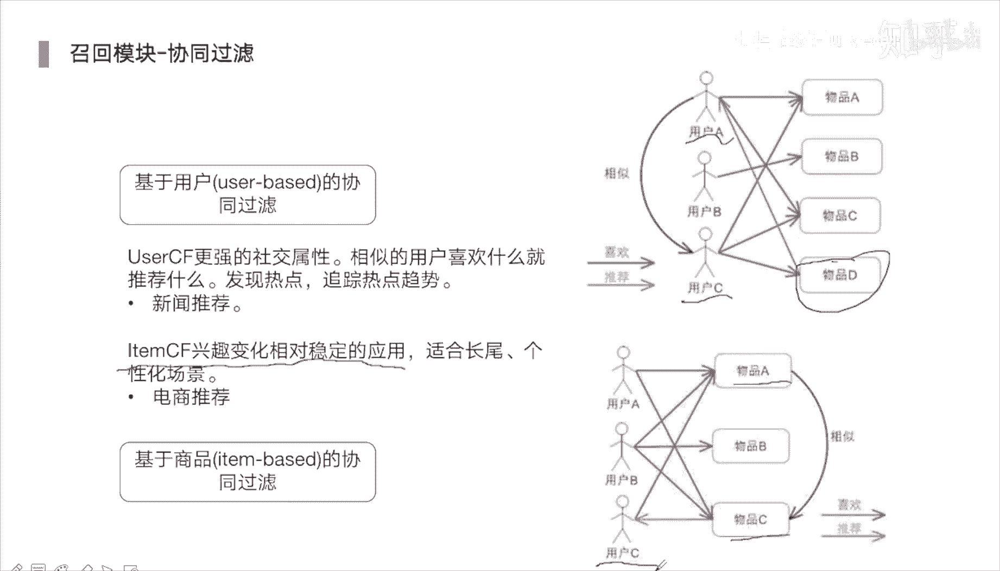

# 人工智能—推荐系统公开课（七月在线出品） - P13：【公开课】快速入门推荐系统串讲 - 七月在线-julyedu - BV1Ry4y127CV

🎼。

还有一分钟，我们的直播马上开始。那我们直播中呢也欢迎各位同学提问啊，有什么问题我们都可以在讨论区里面发言的。欢迎同学们积极踊跃提问啊。好，ok我们现在正式开始啊。😊，那我们今天呢大家去入门。

对快速去了解那推荐系统。那主要是围绕两个部分，两个模块，一个是召回，另外一个是排序。那我是今天的老师啊，分享人。王老师，那目前呢我是在呃互联网大厂里面来从事的是。推荐广告相关的工作。OK嗯。

主要呢是分成了可以分成四个部分啊，一个推荐系统介绍。那第二个是召回模块，第三个是排序模块。最后呢我们再去做一个简单的一个总结。那这次直播当中呢，我们也会发出一些奖品，像VIP月卡，还有现金的优惠券。

大家可以进入我们的答疑群。嗯，然后呢想去进达一群领课件的话，可以加老师的微信啊。大可以加老师的微信，然后群里面可以进行讨论提问，然后领奖品。那领奖品的方式，其实就是说我会给大家提问，对吧？

大家可以去回答问题，然后也可以向我提问。那提问或者说是呃或者说是回答问题的话，都是可以领奖品的。ok我们言归正传，看始今天的主要内容啊。

那推荐系统呢现在是一个。一直以来是比较火的一个领域啊。那像很多的一些我们所用的很多产品，对吧？啊，像抖音呀，或者说像京东的电商平台呀，或者百度，或者说看一些视频呀，像youtube里面。

那我们所看到内容，它都是经过推荐系统所展示给你的。这已是已经是很多的一些APP对吧？很多的一些网页，他们的一个标配了。那因为有这样的一个推荐之后呢，才会更好的来去获得，更好的来去根据我们的一些兴趣。

我们的一些胃口来对症下药，对吧？比如说你想最近想去看什么衣服。那哎这时候电商可能就给你推个衣服了。你可能在电商里面搜完衣服之后，你发现你在抖音里面，他又给你推类似的一些衣服了。对啊。

这些都是获取到你的一些行为日志数据来去做的一个决策。然后将这些东西推给你。而且呢像很多大厂队吧，它的一个收入来源收入来源。对啊，很大一部分就是来源于像推荐。那推荐里面也有像广告的推荐，对吧？

还有相当自然量的一些商品的一些推荐啊，这在场大厂里面都是属于那种商业化的一个团队了啊，商业化就是比较核心团队了。你如果说你能够让指标有一个1%的一个提升。

那的收入可能你一天的一个广告收入或推荐收入就可以达到上千万，那如果说你的指标有1%的提升。那你这一天收入就可以多上个几十万。所以说我们能够如果说能够掌握这荐系统，同时呢能够去发现或者说找到一些优化点。

不管是在哪种模块下，那我们将这种嗯点优化好之后，那其带来收益是非常大的。这也是很多大厂就是舍得舍得给做推荐的同学，对吧？呃，总是给他们就是说比较高的工资的一个很大的一个原因了。

接下来我们来去了解一下它的整体的一个流程是什么样子的。啊，那第一个的话还是数据。对啊，数据不管你的模型，你的一些算法再怎么牛逼。对啊，你没有数据的一个支撑，那其他就是个空壳啊。

也是也学习不到比较好的一些信息，也学习不到用户的一些行为兴趣，也不会变得非常的一些鲁棒啊，所以说数据是非常关键的这些数据呢全都是平台里面所产生的各式各样的一些交互的一日志。比如说在电商场景里面。啊。

我们这是电商场景，那它里面数据都有上都有什么数据呢？啊，比如说像一些哎浏览的一些数据，最基本的我们展示给用户了，然后用户去浏览。那浏览他可能。进一步会点击。那点击完之后，他可能会去加入到购物车。

大家可以去想一下，你不管是在淘宝还是在嗯京东里面，对吧？你看到商品之后啊，你点进之后，它是不是有两个对应的按钮，一个是加入购物车，一个是直接购买。所以说对应的也会多两种行为加入购物车，然后购买啊。

那这样数据有了之后呢，我们就可以根据这些数据，这些日志来去提取出关键的一个信息。啊，从里面来去提取出用户的一个兴趣。我们不管是在电商还是在什么那种短视频平台，对吧？都是以提取用户的兴趣。

刻画用户的需求兴趣为主为关键的那这都是来源于他历史的一个行为的一个数据啊，行为的信息。比如他定期对吧？经常去浏览一些美食。那他的兴趣肯定是美食了。对啊，那他最近的话可能在经常去点击一些哎衣服相关的产品。

那我们接下来给他去推衣服产品，那很大概率他可能会去点击或者说是购买。OK有了数据之后呢，我们就开始去利用推荐系统技术了。那第一个是召回啊，这召回是什么意思呢？啊，我们电商里面的商品对吧？

其实有很多的有千万或者说上亿条商品的，上亿个SKU的对ite的这些商品短视频也是一样的，千万百万上亿，那也是存在的那那我们怎么样从这里面来去选选择一些比较关键的对我们不可能把这些商品，对吧？

全部推荐给用户，也不可能对接商品，我们依次去建模。这样的话这个数据是非常非常大的对啊，所以说呢我们召回就是从这个非常大的集合里面去做第一步的一个筛选。原本的是1000万。

那我们可以从里面去筛选11000或者100个商品来去输入到第二步排序。这时候的话你给到排序这块建模其实压力又变得比较小了。对啊？排序这块的话，我们可能会去构建很多的一些特征。

这些特征呢就是为了帮助我们去描述用户的兴趣，商品的特性。上下文的一些关系。全都是在排序这个阶段我们去做的事情。嗯。那我们排序完之后，我们可能得到就是说按它这个概率对吧？来进行排序。对。

就是看他对哪些商品购买概率比较高嘛。然后依次排序完之后，这是一个二分类的一个问题。那比如100商品，我们排序完之后取top10个展示给用户。这个时候并不完全对并不完全正确啊啊。

因为这个top10如果完全都是单一品类的用户，单一品类的商品或单一品类的视频。如果说你看到一个页面的话，全都是这同一类型的一个，全都是鞋子啊，或者说你看视频全都是美食。就时候你会变得非常的厌倦。

非常感觉非常的就是说呃很没有意思。其实这很这会会非常影响用户体验的啊。😊，就会把用户兴趣变得越来越变得单一单单一化。嗯，所以这时候我们也要考虑到一个就是说这个系统的一个生态的一个发展啊。

也要考虑到用户的一个体验的。这时候我们会进入到一个rera的部分啊。当然我们展示这些商品，它怎么组合会更好一些，也是在rera部分我们做工作。最后推荐合适商品展现给用户。就是我们再去在淘宝也好。

天猫也好，或者在抖音也好，知乎也好，我们能看到的信息都是经过这样的逻辑哎，都建出来的。

这块就是说的是召回排序，对吧？它每个阶段嗯。第一阶段是召回嘛。对我们可能就是说整体的数据量啊，millions millionsill对吧？然后我这这阶段需要的是处理数据量非常大的。

因为我们要从整一个整一个视频库里面或商品库里面去筛选。所以速度要快，模型不太复杂，使用较小特征。第二部分的话是排序啊，可能我这时候将100个哎给到排序ranking这个部分来去做。

这时候我们可能要去有更多特征来去辅助我们。辅助模型做更好更精准的判断。

这就是一个简单的一个流程了。okK再提醒大家啊，大家可以去加入我们的答疑群，加入群的方式的话，我们可以去加老师的微信啊。那我们每阶段都会提问的。然后大家有什么问题也可以提出来，我们可以去交流沟通啊。

ok接下来开始到我们的核心部分了，召回模块。😊，召回这个部分的话，其实是嗯能做的工作是非常多的对啊，能做工作也是非常多的嗯。一般我们召回可能可能像大厂里面对吧？做召回的话，可能有那种多路召回。

可能要有十几个。不同的召回召回策略。对啊。但排序的话。只是一个模型而已。对啊。因为召回的话，我们可以就是同步进行吧。对啊。

OK呃，召回的话就是说我们去缩小搜索范围啊，就像我们这个下面这个漏斗一样。对啊。所有的iteite的话，你可以指的是商品，也可以指的是一个新闻，也可以指的是一个文章，也可以指代是一个视频。对啊。

然后我们去选择候选的iteem，原本的话可能是百万，那我们候选到100啊。这是第一步就是缩小搜索范围。第二个的话是通过局部来去拟合整体啊。就跟盲人摸象一样。对啊。你的。一某一种召回策略对吧？

它不可能将整个大项所有的内容全部涵盖到涵盖到位的。你如果全部涵盖到位的话，你直接将所有的ite全部作为候选计算了。但这又违背了我们召回的一个初衷。啊，所以说我们需要是从多个角度就跟哎第一个人。

我们从像鼻例这部分出发这个方向出发，哎，我们去召回10个商品。第二个同第二个第二个同学呢，我们从象尾巴这块出发，哎，我们再去召回10个商品。然后最后我们将每个部位对吧？就类类比于每个召回的方向。

将其整合起来，最后构造出几百个哎，或者说100个上千个这样的一个候选的商品。所以赵回他是做这样的一件事情的对啊。我们尽量从多个角度都考量到位，考虑到位啊。有时候用户他不一定是跟着根据自己的兴趣出发的。

你完全去如果说你完全去考虑他历史的一个行为拉去他召回的话，你有时候可能会忽略一点什么信息呢？如果说用户他历史没有数据怎么办？这时候我们可能会从呃那种热度呀，最近哪些商品比较热，哪些视频比较热的来去出发。

就比如说我们去刷抖音应时，对吧？啊，你可能最近的兴趣点，对吧？O不在这里，但最近有一个大众的一个兴趣，或者最近有个实时热点，那这样一个信息，它其实就是召回的信息的。

他可能会去有一个这有一个实时热点召回啊，实时的大众兴趣召回，然后推给你。

就是从不同角度全方位的去考虑。接下来的话，对于召回，其实嗯不管召回也是或者排序，我们都需要进行效果的一个评估的。嗯。而且现在评估的其实考虑的点也是越来越来越多越来越多。对啊。尤其是对于不同的一个平台啊。

如果说我们围绕的是以CTR，就是依照点击率啊，它核心是点击率，核心是点击率啊，但是还有很多指标我们也需要去去考虑的。啊，比如说我们看知乎对吧？里面唉。他可能很多的一些文章，对吧？

有那种标题党的对或者说公众号发文章，有一些标题党的，但里面内容的话，其实你并不感兴趣。如果你整个平台全都是这样的文章的话，它点击率是非常高的。对，但是会随着时间的推移。

他用户肯定他整体的流量肯定会降低的啊，因为用户感觉到这个体验好差呀，全都那些标题党。对啊，所以说他还会考虑什么呢？考虑一个就是说用户的个体验。对交互的体验。啊，或者说你浏览了一个市场，观看那个市场。

对啊。另外对于召回的话，其实我们还要考虑它的一个覆盖度。这个覆盖度其实就是我刚刚说的还有多样性啊。我刚说的就是说召回他尽量的话是从多个角度来去出发，尽量去覆盖多方面的一个item。

多方向的一个一个一个商品，或者说视频。那准确度也是非常关键的。肯定要准。对啊。在准的前提下，我们再去考虑覆盖度多样性啊。还有一个是时效性。时效性的话，这个有时候也要看你具体的一个平台。啊。

时效性的一个召回啊也非常关键的。你如果都是召回也比较老的对那新的你得不到展示，得不到展示，那其实会影响到很多就是新的。因为那些新的商品，对吧？或新的视频，它刚开始它是没有流量的它数据是非常小的对啊。

如果说你完全只考虑历史比较热的话，它会陷入就是说推荐里面的一个热度偏差，或者说马太效应这样子个问题。这是我们需要根据具体的业务考量的不一样的一个指标。另外的话就是我们需要进行离线评估呀。

看它的覆盖度呀或者los呀。像上测试的话，我们可以去看它CTR或者人均阅读啊，这是评估这块我们可能要去考虑的事情。那么再往下。

接下来我们去讲一些嗯召回模块里面的一些一些经典的经典的一些呃模型。对经典的一些算法。那最经典的话就是CF了，协同过滤啊协同过滤。那系能过滤的话。嗯，在0几年的时候其实就已经有了。对啊，比较早。

包括虽然它比较早，虽然比较早，但是目前而言，对吧？嗯大厂里面他还是会用的。像对应的iteom CF或userCF还有很多的一些行动过滤。呃，还有一些像神经网络，就是NCF神经网络和CF的一个结合的对啊。

也是用的是非常多的啊，也是必不可少的。Yeah。那我们可以去看一下啊，嗯这里的话行成过滤是同时使用user和item之间的相似性来进行推荐。那我们这块给个例子，嗯，如果用户A和用户B比较相似，对吧？嗯。

用并且用户B喜欢视频一则系统可以向用户A推荐视频一。就比如说小红小红小呃，比如小美和小和小丽对吧？她俩之间的相似度是非常高的。你可以看到这块。他俩相似度非常高的对，所以说呢哎小美和小丽相似度非常高。

那我们可以将小丽她喜欢的一些商品啊推荐给小小美啊。这种是没有什么问题的对啊。这种话就是一个典型的userCF了。对啊。根据两个用户比较相似，那我们会将用户他喜欢的东西推荐给另外一个用户啊。

这里面的话它是首先呢它是要计算。他们之间的一个相似性打分的啊。然后通过这块是它对于每一个不同的一个化妆品的一个评分。对啊，然后呢我们将这些。构建成一个。类似这种形式的对啊。那没有的话。

我们这块标为零分标为零分。但零分的话，实际当中我们可以去考虑这个问题啊，零分其实并不合适。啊，我没有对某一个商品，某一个化妆品打分，并不代表我不喜欢它。对，这个我们可能我们经常可能只是围绕着某一个视频。

美食视频去看。啊，但并不代表我不喜欢音乐，就在我们在在抖音里面是一样的对啊，你给我推荐音乐，我这样可能也也会喜欢的。对啊，是这样的，这样一回事，只是说哦一直没有推荐给他退啊，这个这块兴趣哎。

我们还没有探索到，还没有发现到，因为没有这样数据的反馈。所以这点是需要出注意的啊，一般的话我们可以考虑就是说对这种画我们进行一个简单的一个填充啊，或者说更细一点的话。

填充话其实要考虑的是用哪种填充方式了对啊。一般用均子值中位数填充就可以了。然后再去利用鱼神相似性来去计算他的个得分就可以了啊。

那下面的话我们来去讲一下user CF和iteom CF这两种是怎么样来去来去来去推的啊，我们首先来去看user CFuser CF。UCF的话，它的核心是找到相似的人。你了解到相似的人之后呢。

我们可以把另外，比如说这里面对吧？我们看一看图呃，我们的右边右上角图。嗯，euser A用户A和用户C两者是比较相似的。然后我们就可以把无物品。D物品D的话，A是没有交互过的。我们可以把D推荐给A。嗯。

这就是use着CF，我们可以做事情。那UCF的话，因为它是依靠于系用户用户来去做这样推荐的，它更强的是有那种社交属性的一个平台。嗯，如果大家平时在玩那个啥的话，玩视频号的对公众唉微信里面的视频号。啊。

它里面不是各种视频吗？它里面的话有有几个会去考虑，就是说根据你的好友，把好友看过的视频推荐给你。嗯。好友点过视频，他会优先推荐给你的。所以说视频号是一个具有非常强的视频属性的唉，社交属性的一个平台。

对啊，他就是为了去挖掘用户之间的这样的一个社交属性的对，加强这种社交属性的你俩关系比较好，那我们来去推你看过的视频给我，哎，我可能会更更感兴趣一些。对啊。啊，经常可能用户哎人们就想去看看你的身边朋友。

他们再去看什么视频，或者说你去菜市场去买东西，对吧？你发现哎，张大妈去买了一个商，买了个商品，哎，他跟你一说，然后你又过去去买了。对啊，都会受这样的影响的。所以说U的CF也是这样的一个出发点。

那还有呢像iteomCF啊。iteCF的话，它的兴趣变化相对于稳定的一个应用。电商里面经常用商iteom CF。因为电商里面用户的用户这个属性是不稳定的。啊，优惑属性是不稳定的。

他的兴趣会经常发生变化的。但商品的属性是非常稳定的，我们可以找到相似的商品。具有比较高的相似性的商品。那我们可以看图里面物品A和物品C具有高的相似性。因为A的话，物品A被ABC都。

都喜欢过C的话被AB喜欢过，所以这两个比较相似一些啊。对，因为B的话只被用户B喜欢过啊。所以说所以说。所以说物品A和物品C是更相似的。那这个时候我们找到这两个相似性之后，我们发现B。😊。

他没有和C发生过交互。我们就可以把C物品推荐给用户C了。Okay。一个是找相似用户，一个是找相似商品。这两种的话。嗯，我们现在一直还在用，对，效果一直还都比较好嗯。

那我们继续往下看啊。下面这种话是关联召回关联召回。对啊，这种话也是呃因为我之前嘛经常参加一些比赛。像主要是参加那个什么卡go，还有天池里面的。那里面会。也会举办一些推荐相关的比赛。对啊。

那我当时的话就是用这种关联召回的方式啊，直接能够拿到就是说top10的一个名次了。那这种方法是怎么做呢？如何去挖掘这种关联性呢？挖掘商品的关联性。哎，这就是我们关联召回里面关键点了。对啊。

根据关联性来去给商品进行打分。

OK那我们来去看一下，我们这块举个简单例子啊，以小冯为例啊，比如小冯他去购买了很多商品啊。我们时间的话由远及近啊。橙汁是最近的，伊利牛奶是最远的。这是一个用户，他的一个日志，他的。嗯，交互的一个日志。

他交过很多商品。对这里面每个商品。与其其余商品都是属于关联商品的。就如说少房他买了威化饼干，又买了奥利奥，那我们可以理解成这两个商品是具有关联性的。嗯，大家有没有了解过像就是啤酒尿布，啤酒尿布啊。

就发现很多人他去买了啤酒之后，对吧？很大概率也会去买尿布啊，这是国外的国外给出来的一个给出来的一个一个结论啊。对啊，所以这两者具有很强关联性啊。Yeah。那有了关联性之后呢。

我们要去考虑这关联性我们怎么给它打分啊？关联性其实比如说像威化饼干和奥利奥，对吧？还有威化饼干和伊利伊利牛奶。这两对儿他们的关联性分数是否应该是一致的？理论来说的话应该是有存在差异的。呃。

为什么可以为什么可以这样这样说呢？呃，一个是说时间的一个差异啊，时间一的差异。我今天所买的一些商品，对吧？和我上个月买的一些商品。他们之间差异性肯定是非常大的，大概率是非常大的对啊。

所以说我们可以根据时间远近来去构建一个，比如说是类似于像样一个。时间衰减的这样的一个参数，这样一个呃权重系数啊，另外是除了时间这种或者说位置这以外，还有一个是它的一个。方向方向。对啊。

方向又该怎么去理解呢？比如说我们买了个手机对吧？接下来我们大概率会去买手机壳。啊，这种从手机到手机壳这种方向这样出现的商品，对吧？手机到手机壳这量商品按这种方向，手机壳嗯手机到手机壳这种方向的。

它的出现频率肯定是大于从手机壳到手机的。所以呢这两者之间的一个分数又是不一样的。对，就是一个正向和逆向的。那对应到我们这例子里面，就是说威化饼干到奥利奥是正向的。威化饼干到饼干。是逆向的啊。

正逆的话我们也会去考虑它的一个分数的。okK我们第一步先去计算小冯他所交互的所有商品里面。商品与商品之间关联的一个分数。接着我们除了小小冯以外，还有小李、小赵小王都可以去计算，然后将这些分数累加起来。

比如说小房里面酸奶到饼干的分数是0。6。那小王里面的话算到算奶到饼干的分数是0。5。我们最后会去统计一个总分的，就酸奶到饼干，它的总分应该是所有的。人对应酸奶饼干的一个分数总和，它就的分数1。1。

有账分数呢就是得到了这两个商品的一个打分了。接下来我们会根据一个用户，对吧？他所交付的商品。然后找到与它相似性比较高的打分比较高的商品，然后排序就可以了。比如威化饼干，对吧？它可能跟面包呀。

有可能跟面包关联性比较强一些，分数比较高高，分数比较高一些。苹果的话可能跟西瓜的分数比较高一些。然后最后得到最后的分数。然后再做一个排序，就可以得到最后的一个推荐。的一个结果了嗯。O。

大家有个问题的话都可以提问啊，也是欢迎大家积极踊跃的。😊，提问我们都可以交流的。因为时间缘故啊不可能讲特别细啊，我们继续下面部分。

下面的话刚才是讲到了一些基于协同过滤关联规的这种方式啊。下面我可以记记录一些。嗯，向量化的一些召回的。嗯。下列号召回的话，其实我们可以理解成多种啊。一种话。

比如说像那种我们可以经过wood director或者说deep work。来去得到的呃物品的一个向量，然后计算物品之间向量的相似度，然后来去召回。另外一种的话，我们会去经过DN的方式啊。

DN的方式来去得到用户inbedding和物品inbedding。比如说我们离线的话，先去构建好用户的特征和物品特征，然后他们去输入到我们的模型里面。然后从模型里面的话，我们可以去提取到什么呢？

可以提取到用户的inbedding，还有物品的inbedding。我们将其存储起来。然后我们到线上的时候。现看的时候，就是用户I登录到了我们平台之后呢，我们可以去提取出用户的inbedding。

然后通过faceestface的话是一种近似最近灵的方式。快速来去获取到与用户inbedding相似高的top n个物品。就这里了，然后推荐给用户。V的话可以之后去查一下，这也是比较经典的。

也是大厂里面，他们也是按用这种方式来去做计算的。如果说你是一个呃就是你不用这种金丝化的方式，对吧？呃，你挨个去计算，挨个去计算，因为我当时做过实验，对吧？呃，3000万3000万个商品，对吧？

你挨个去做计算计算每个商品，它与其他商品的一个相似性打分，就按预算相预算相同度来去计算。你大概需要七八个小时啊，但是你如果用f这种形式的话。半小时可以解决了。啊，所以说效率非常快的啊。

接下来讲一个比较经典的youtubeDN啊，这个应该是。嗯，也是近几年吧。对，在16年还是1几年的时候，那youtube发的一个论文了。对啊。

它就是一个就是说用inbedding向量来去进行召回的那具体怎么做呢？

我们可以先去看我们的输入部分，输入部分其实非常简单的啊，一个是用户他所观看过视频的一个inbedding。这个inbedding我们是预训练好的。

我们可以用what to a或者用prone e或者用depo这个形式来去得到对应视频的inbedding。然后我们根据用户历史看的视频，他历史可能看10个视频。

我们计算这10个视频的inbedding均值就可以了。还有的话是用户搜索的。用户搜索的一个信息。用户搜索信息它是非常强的一个意反映用户的意图的啊，很大很多的一部分的收入或者流量都是从搜索这块进入的。

除了这之外呢，还有一些其他的一些，比如说我们这个视频的一个时间，它的一个年龄。其实啊哦然后我们的个性别啊，还有一些是一些地域的一些embedding啊。这些他都是进行那个拼接完之后。

输入到一个三层的全链接层。Yeah。接下来关键点是如何去提取我们的。user vector用户的inbiing还有。视频的隐卖点。我们最后一个权A层的隐藏，对吧？输出结果隐藏的结果对吧？隐藏输出结果。

就是我们的。User vector。啊。这个部分的话。我们到线上的时候会去用到的啊，我们离线是主要是会去保留的是video它的一个vector。是在soft max部分，对吧？soft max部分。

它里面包含两个部分。一个是我们隐藏的一个输入啊。另外的是我们的嗯参数举证权重举证。对啊。我们将soft max层部分对吧？可以去提取出来对应video的一个向量。这部分下量的话。

我们把它放到我们的离线的数据库里面。然后我们线上的时候。线上的时候怎么去操作呢？我们离线先去得到每一个视频的一个ebedding。线上的时候，因为因为我们为什么将线上线下分开做呢？

呃呃因为用户的影向量对吧？它其实会发生变化的，用户兴趣是不稳定的。对我早上和中午晚上看的视频是不一样的啊，每个阶段我可能可能我在中国可能看一些搞看一些搞笑视频。晚上的话我可能会去听一些音乐啊。

看一些美食的视频。所以用户兴趣是不稳定的，所以我们需要进行线上。推理对啊。但是呢视频的。它的向量对话，它的一个它的一个他的一个信息对吧？是比较稳定的。不会发生比较大的变化。

所以说我们离线可以将用视频的V6它的一个向量保存下来。线上的时候我们用模型经过这套模型，对吧？将用户特征哎输到里面，然后得到优user的一个歪 vectorctor。然后呢，导到下量之后呢。

我们再去数据库里面经过运这种fax方式，对吧？再去找到top N推荐给用户就可以了。这是youtu DN它的一个流程操作的流程。Okay。ok再下一个是DSSM啊。这个话他最开始的时候是做搜索的时候。

哎，搜索的时候会用到的对啊。这个搜索里时候呢，它会去计算，就是我们的刀，我们的query和。document对。他的一个相似性啊。那这个里边的话，我们可以把它。嗯，它是一个双塔的一个形式的啊，两个部分。

我们第一个塔的话是query。啊。query vector我们这个部分其实可以把它理解成一个用user的一个特征。第二部分的话是一个dooc vector。

这个部分我可以把它理解成一个ite的一个embedding。嗯。然后他分别去经过表示层之后。然后有一个。计算它的一个相似性。这个相似性的话，我们有两种方式啊，或者其他方式也可以。一个是计算余弦相似性。

第二种的话，我们计算它的内积。完了之后再去输入到我们对应的soft max，或者说输入到sma。具体你看你怎么你是二分类还是多分类来去做呢？那这是DSSM的一个做法。O我们继续往下。😊。

嗯。刚才我们讲到的是一个那种单的一个inbe项量啊。呃，但是其实大家可以去想用户兴趣。去集合成一个向量，其实是不是感觉会有点问题啊？因为我们的兴趣是多种多样的对啊，即使我们只是在下午，对吧？啊。

我们可能不只是对音乐这个感感兴趣，我可能还有其他兴趣。啊，都可以来去做一些召回的。啊，这个时候呢哎。又有一些学呃学者对吧？他们又做一些研究，哎，我们将能否去提炼出多个用户的兴趣。

然后每个兴趣我们都去进行了一个召回啊。来去都去经过一个线上的一个serving，来去得到多个不同兴趣的一个一个一个结果。当然是可以的。啊，嗯这块给大家展示什么呢？

是一个比较经典的啊IND啊多兴趣提取的一个网络啊，多兴趣提取网络。它里面的核心呢是通过胶囊网络的方式。啊，胶囊网络的话，你呃你可以把它列成什么呢？列成我们将用户的行为的一个行为的一个胶囊，对吧？

它你可以把它列成一个聚合的一个过程聚合的一个过程。😊，啊。聚合过程就将用户的行为将每个行为把它类比对应，就当做一个行为的一个胶囊，对吧？然后将这些行为胶囊呢，我们聚合成一。多个兴趣胶囊。

就是从多到少的一个聚合过程啊。这就是我们这个和中间部分所做的事情呢。其他地方的话就是比较常规的，其他教练比较常规的啊，就是我们看它的输入部分。输入部分的话也是用户他历史的一个行为序列啊。

就个序列里面的话，它是包含三个部分的。第一个部分的话是at my ID。还有category ID，还有。他的品牌ID啊。嗯，为什么要三个三个对应ID的这个inbedding啊？呃。

主要的关系还主要的原因还是因为就是说呢主要还嗯因为有些对吧它的iteID对吧可能比较稀疏一些。对啊，所以说我们可以引入其他的一些sideide information。啊。就其他的一些边缘的一些信息啊。

来去缓解这种冷起问题的。那我们将这些部分，对吧？OK。输入到我们的一个。多兴趣抽取层。那经过多序兴趣抽取层呢，我们可以去得到可以去得到哎多个兴趣的一个网络，多个兴趣的一个向量。那有多个兴趣向量之后呢。

我们再去okK他会经过1个H。多层的一个隐藏层隐藏层啊，这时候我们是有多个兴趣的多个兴趣的，它又去结合了一个attention的一个操作。label array情式哪个操作？

这个部分的话其实就是为了去将其再去进行了一个聚合。那它里面ten的话里面分为三个部分的一个输入。啊，Q的话。是我们这个labelQ是我们labelK和V是相等的。都是用户的兴趣向量。

我们这时候应该是有多个兴趣向量的对，然后我们通过天审之后，我们枪可以将其进行一个聚合，因为它会得到对应的一个权重，然后我们可以进行一个向量之间一个加权操作。这是我们在去train的时候。

我们需要去做的事情。那我们线上推理的时候呢。我们经过H多层的一个隐藏层之后，对吧？我们可以去得到可以去得到多个兴趣网络，多个兴趣的一个商量。然后我们再去再去进行到serving这个部分里面。来去提取。

找到对应item的一个inbedding。其实就跟我们youtube电里面是一样的啊，我们这时候有了。兴趣限量之后呢，我们去计算它和其他iteom的一个余弦相似性，然后找出top N。

然后将这些top N再去做一个排序展示给用户就可以了。这就是MND它大概的一个过程。我们在之后的课程里面啊会去详细的去介绍。对应的胶囊网络模块就是它的一个多兴趣提取层是怎么去做的啊？

ok再往下的话是结合graphra，就是结合图来去进行的一个召回的。这也是比较经典的一个部分啊。呃图的话它是怎么去构建的话，怎么去构建的啊。呃，我们可以把用户也可以把商品对吧。

我们可以看作一个个点一个个点。对。它们之间连接的关系啊，就是边了啊，点和边我们当然就可以构建成一个图了。那有了图之后呢，我们可以去应用什么呢？应用一个是deepwork。啊。

第二个的话是note vector，这两个都比较经典的。但是我们更常用的话可能是用的是de book这种可能更多一些啊。嗯。这里面它是其实就是将depo，我们可以理解成，就是它其实就是一个随机游走。

就是勾下完图之后，对吧？一个随机游走，再去结合一个wo vector里面的，就是类似于skipgram这种这种这种形式ok。啊，只是n direct里面，它考虑到什么呢？

考虑下一个就是说我们再去进行有走投，对吧？我们是要利用。BFS。还是要去就是我们要去利用广度优先搜索呢，还是要去利用深度优先搜索。啊，来去进行随就走。因为两种形式我们所捕捉到的一个结构是不一样的对啊。

我们游走完之后会得到多个对应的一个序列啊，每个序列我们可以把它看作对应的一个。呃，一个句子一句话，那我们多个句子拼接起来就是一个完整的文档了。

这个文档我们可以借助NRP知识嘛NRP里面它就是可以将整个文档输入到我们的文字 vector里面，来得到每一个词它对应的嗯向量就可以了。okK这也是我们这块要去得到的事情。

就是说我们想要去得到对应每一个ite，它的一个向量表征。有这个向量之后呢，我们才可以去构建出哎。item与iteom之间的相似线呀，有相似线，我们可以去打分去排序去进行召回了。Okay。

但这里会存在一个问题啊。嗯，大家可以去考虑一下呃。EGES9要是解决什么问题啊？这块我就当做一个问题给大家提问了啊，EGES是去解决什么问题的？大家可以去在我们的评论区啊，就是我们讨论区。

还有我们对应的。对应的答疑群里面，大家都可以去回答一下的。呃，EGES它是解决什么问题呢？那进入答疑群的话，我们可以去加老师的微信啊。然后老师会拉咱们进入到答疑群里面。然后大家只要回答了问题啊。

回答了问题，或者说也去提问，我们都可以去领奖品啊。那奖品的话是对应的是我们的1个VIP的月卡。2。大家抓紧时间。有问题的话也可以直接在我们的直播间里面，也可以进行评论的讨论的啊。O。10ES的话。

我们就做一个问题啊，大家可以去交流啊。大家有没有了解到的了解过的EGS的？OK我们继续我们继续啊。😊，EES的话，它的核心是引入。

其余的一些信息啊就是S1S2S0这样的信息就是引入sd information。啊，来去缓解对于冷气这一个问题的对啊。

ok我们继续往下。上面的话是知识图谱啊，知识图谱的话嗯也是现在比较火的一个方向的，它也是经常会去应用到召回模块的啊。因为比如说我们像像电商里面对吧？他最近要新上了一个小米手机了，小米手小米手机对吧？

但对于这个SQ这个商品对吧？它其实这个型号历史是没有这样一个数据的啊。那我们怎么样才能判断？因为这个时这个小小这个这一款手机对吧？历史是没有的，但是我们有很多的一些信息。

我们可以借着根据我们的知识图谱里面来去得到很多信息，就是说历史关于小米小米对吧？新上手机对吧？都毕竟是一个爆款热款手机啊，关注度是非常高的。即使历史没有这个型号。对啊，但是只要是新出的。

O它就是一个非常热门的。所以说我们有了这样的一个信息，有了这样知识图谱之后，我们就可以得到这样一个信息的啊。因为我们都是我们会去根据制图里面，我们构建制图谱的时候会去考虑到很多的一些信息的。嗯。

就是考虑什么呢？呃，它的一个属性啊，它可能是最最初的可能是手机。然后是品牌。然后品牌的话，然后它属于对应的一些型号啊，然后一些评论呀，然后热度这样个信息呀啊都可以反映到对应的。因为它是一个知识这种图谱。

我们都可以去扩展到哎对应这个新的一个手机上面的。因为都是和这个新的手机型号是有关联的。对，所以说它是一很好去解决这种时效热点这样一个问题。解种新品上架这个问题。那时效热点问题的话，嗯。

其实我们如果能构建这个完整的非常全面的一个图手，对吧？那里面我们除了引入商品信息，我们也可以引入一些其他的一些近期的比较热的一些信息啊，或者说引入外界的一些外部的一些数据。对啊。

这就很好去帮忙解决这种时效热点问题了。还有一些比如时效性的活动竞争匹配。这都是可以基于商品知识图谱。

可以去挖掘的，可以去得到的。那关键点的是我们该怎么来去构建这样一个知识图谱。这样商品制图不得构建啊。嗯，这里的话是分成两个部分。第一个话是商品多层次语义信息的一个抽取。由商品的信息抽取。它基本的信息。

对啊，它的属性。还有一些的话是。我们要可能要去继要去进行一些统计的。比如说对这个商品对吧？它的一个复购的周期啊。因为我们再去做电商，对吧？也会考虑到付购周期量的问题的啊，比如说用户购买了商品A了，对吧？

他那我们之后会给他再推这个A嘛？短时间内是可能不会推了对啊。但是如果说这个时间大于复购周期的话，那我们可能会再次来去推这个A。对啊，尤其像很多一些快消品啊，快消品可能用户可能跟三差5都会去进行购买的。

比如说像卫生纸对吧？你短经常会去购买食品，对吧？但是像家电的话，他买完了之后，你还要再给他推吗？啊，可能就不太会给他推了。对啊，这时候会考虑一个就是类似于一种时间的一个衰减的一个一个一个参数。

一个权重来回处理这样个问题啊。还有一些的话是产品词，处于实体概念的一些元素，构建商品的层级化突步关系。第二个是用户商品关系的一个建模啊。基于用户图谱交互关系，建模用户兴趣概念，完成新品的一个推荐啊。

就到建模阶段了。我们有这样关系之后呢，我们就可以进行一个兴趣。这些建模了。对啊，根据用户他的一个交互行为。对啊。基于用户图谱交互关系，保证用户体验实现精准复购周期的一个预测。

那这也是制徒我可以去帮助我们去完成事情。以及基于用户图普教关系，实现用户兴趣的演变建模。O我们继续。

下面的话是我们要需要可能要需要考虑事情的，就是基于图谱概念识别用户的一个意图啊。嗯，这里的话其实我们给到了对应的一个三个这样的一个序列啊。第一个序列的话是我们的一个孤立行为的一个建模。对。

孤立行为就是每一次行为它都是一个单独进行的，前后没有关系的啊。但是实际当中的话，我们的序列前后肯定有这种前后因果关系的。第二种的话是连续session那个建模。啊，我们会去考虑呃。

比如说因为我们再去购买购物时，对吧？它里面会分什么呢？会分一个就是说负担和子单的对啊。负担和子担。啊，负单里面会去包含很多子单，子单是我们单一的商品。负单的话，我们一次下单里面包含很多的商品的对啊。

我可以把一个负担看作一个session。也可以考虑一个时间化作一个session都是可以的。比如说间隔半小时对吧？okK它是一个session。又比如说按负担，一个负担，一个session。

这里面都是有很大关系的。再往下是用户意图建模，用户意图建模啊。我们可以把这些信息对吧？原本的DEG对吧？它都是一些商品ite。那下面的话它给到的是C1C2C3，就可以看作什么品类。

或者说可以看作一个兴趣点。啊，可以。进行一个呃构建。比如说第一个D的话，它是个品类，一E和G的话属于一个品类2OK这样。这样的话我是只是建模用户的一个意图。可能他下面阶段呢可能对于一些家电。

他可能更感兴趣一些啊，而不是去预估下一阶段他可能。对于呃手机感兴趣。啊，就是上升一个维度来去建模用户的意图。嗯。

O我们继续往下啊。OK大家有问题可以去，有问题的话，我们都可以在讨论区里面进行交流啊。有问题的话，我们都可以讨论区里面进行交流啊。同时呢我们要去领奖品的话，就可以进入我们达鱼群里面。然后还有领课件。

就是我们最后我们这个的PPT啊，PPT内容啊，我们都可以去加老师的微信，然后去领我们的课件，以及进入到我们的答疑群里面，我们可以做进一步的交流学习。okK下一个模块呢是召回唉，是排序模块。啊。

我们就已经召回好了100个商品啊，接下我们开始进行排序了。😊，还是这个部分的话，嗯，可能我们再去讲，一般来说大家可以看到，在对于外地对吧，我们不管是看一些书也好呀，或者说看一些其他的一些。呃。

分享课程也好，对吧？其实讲特征的是比较少的对，特征工程是比较少的。关键的话还是主要是讲的模型。对啊，我们这次的话还是也是主要是讲模型的对，但是我们在以后的课程当中的话，会去详细的带家去了解特征的嗯。

因为特征的话确实是非常关键的一个点。有时候我们可能在模型这块不断去优化。有时候还抵不过一两个特征的一个效果来得快。如果说我们想要去搭建比较好的一个完整，或者说让线上有一个好的结果的话。

特征和模型都是非常关键的。好，我们接下来去看。呃，这里的话我们可以去我跟大聊一聊，就是说。排序它的一个发展是什么样子呢？其实可能比较早的时候，对吧？

更多的话是需要我们去构建一些人工特征加线性模型的一个阶段。线性模型的话就是LR这种模型的。LR就是logistic，就是逻辑回归了啊。人工特征的话，因为这械模型它里面。嗯，你和能力其实是比较差的对呀。

纯粹的需要我们人工的去。给到模型这样一个信息。啊，让他来去做这种线性的一些啊线性的一些。呃，尼合对呀，它非线性的话其实也很难的啊。所以说我们需要去构建大量的人工特征嗯。再去结合LR。

所以说前期的话可能是比较累的一个工作了，规定特征啊会很多特征加R啊，最后的话是二分类输出0到1之间的个概率结果。OK初期这样的话，那慢慢发展来的话，就是说因为它里面不能够考虑一种特之间交叉信息的。

因为我们做个性化推荐，对吧？我们要推的话是要要准确是非常关键的。

对，所以说精准的一个推荐需要我们要去考虑到非常细的一个力度的。啊。非常细的一个力度。所以这时候我们就需要考虑一些像二阶，一阶的话也许只是一个单位的一个特征，对吧？就是一个比如说年龄，O它是个一阶的。

如果说我们将年龄和性别做一个交叉之后，它就变成个二阶了，年龄性别加地区就变成一个三阶了。又或者说到四五阶六阶这样的啊。力度越细，那越有助于我们做这种更精准的一个预测，更精准的一个推荐。

但是也不能非常特别细。特别细的话啊什么呢？就是变得非常稀疏了啊，这种稀疏的话有时候会产生不拟合的一个风险。这个话就需要我们去掌握一些经济学习知识，才能去理解这样的问题啊。O。在加速发展阶段的时候呢。

慢慢去衍生出了很多的一些呃那种能够去进行自动化特征交叉的一些模型。啊，比如说像FMFFM啊，像GBT加RR叉Gboost这些模型，那都是可以是自动化进行特征交叉的。

呃，FM和FFFFFM的话，它主要是。呃，FM的话，它是在LR基础上，我们可以看它的一个唉结构啊。不难理解啊，前半部分。诶。是LR的一个结构。后半部分的话。

它是FMA上面自动添加了这个二阶特征交叉这个部分呢。啊。这是他们的一个函数的表达形式啊。可以看出来。核心点是进行一个二阶交叉这个部分呢。这是FM它的一个结构。那我们再去看FFM呢。呃。

FM它更加叉的时候，它会有就是说会有很多的一些。就说比如说我们有两个特征，对吧？两个特征啊。或者说我们分成多个多个产费的对吧？产这种概念就说我们厂。我们可能场一和场二进行交叉，和场一和场三进行交叉啊。

它之间的他们的一个W，对吧？它那个V啊就是理解成一个参数权重矩阵。那其实是一样的对啊？就是说他在进行长与场进行交交叉的时候，不会因为厂的变化而去改变到改改变它原本厂的一个参数的一个。举证的啊。

但实际中呢，实际中我们不同的特征，不同场交叉，对吧？它的重要性或者它的参数。应该是发生变化的。啊。所以说引入了一个。厂的概念对啊，形成了新的一种。我们可看到原本的话，它只是VI和VJ，对吧？

但这里也变成了VF2和F1了啊，就是说我们把特征的1个特征，我们分成三个场三个场。如果说VII它属于一场的OK那。😊。

V机也是属于异厂的OK那他们的F对应一样的参指针也是一样的那如果说VI它是二厂的VG是异厂的okK它们两个V就不一样了，就有差异了。所以说有乐场的概念让我们提行交叉的时候，可以去有更多的这个差异性。

变得更加灵活，但是厂的一个引入，让这个模型复杂度又增加了K倍啊，K就是场的个数了。所以说我们更常用的话还是用FM可以看到我们后面其实有deepFM对吧？那为什么没有deepFFM呢？

为啥depFM是非常经典的，但很少有大厂会去用depepFFM呢？对，因为它的一个复杂度唉是扩展到K倍。对啊。因为我们在去上线模型的时候，也会考虑到你的模型参数大小的。下面呢是GBT加RR的一个结构了。

这个也是非常经典结构，这是2014年facebookfacebook对，然后他们发的一篇论文的啊，GPT的核心就是为了去获取到一个高阶的特征交叉信息。然后这个信息对应的就是业子节点。

将它作为LR的个输入。啊，他为什么可以得到高级特征交叉的这样个信息？😡，我们可以看到树在不断分裂的时候，它每一次都会去选选择一个特征对应的分割节点。比如第一次我们分割的时候，我们选择是性别。Yeah。

不太好写。第二次分裂的时候，我们选择是年龄H。😡，这是不是就将年龄和性别做了一个交叉组合了？如果我们的树的深度哎有三层、四层，那是不是就可以得到三阶四阶层交叉组合了？所以说数它是这样来去进行。

或者或者说这样来去获得高阶特征交叉的。然后呢，最后比如说一个样本，对吧？okK它。😊，将其输到模型里面。他去根据它里面每个特征，对吧？来去选择我们落在哪个点哪个页的节点里面。如果说它对应样本，对吧？

一它落在了。比如第一棵树，这第一棵树对吧？😊，它落在这个里面的啊，第二棵树它可能落在另外一个一节点里面的，其余的业节点全都零了OK。这就是第一个样本，他最后得到的。我们新的一个特征了，就是业景点编号了。

어。就这样一种形式。然后将其输到我们的RRLR里面。

St to be to Howardard。因为原本的RR它是不能获得这种只是单纯的一个线性模型，对吧？它不能得到二阶以上的交叉组合的这样信息。OK这个标题怎么怎么都掉了？OK。呃。

接下来是深度发展期吧，就是开始去各种的DN的了，主要是跟DN进行结合了啊，深度模型阶段。啊。这时候的话我们可以通过网络学习那种。复杂的一个非线性结构了。因为里面加活的加了很多的。对应的一些机函数。

对吧啊。第A的话它是主要来去获得的是一个隐视的一个特征交叉。对啊。和我们看到的像FM这种还是有一定差异的。另外呢第三特征它处理的话是像embedding。

因为它都会去经过一个呃embedding look up look up embe啊。把它转换成一个稠密的一个向量OK啊。然后再去进行一些，比如说向量间的一些，哎，我可以进行拼接，也可以进行向量内接。

也可以进行一些向量向量位它对应的位的一个交叉。按那我们也可以进行哎经过DN层。对啊，都是可以的，非常灵活。

我们可以讲几个比较经典的吧，呃，也也还好，像FN和PN对吧？FN和PN。嗯，FN的话呃对应我们指边的结构，它是使用FM得到了影像量。作为inbedding的一个初始值啊。就是先去经过FM得到这影像量。

然后作为inbedding的一个初始值。啊，一般而言的话，我们是随机初始化它这个inbedding的对啊。或者说我们可以经过预训练来去得到。对应离想特论他这一个隐白ing呢对啊。一般其实这种还蛮多的。

像比如说其实我们NRP里面更多一些吧，对，经常进行预训练啊，现在都是bt天下嘛，对吧？我们经过bot来去运训练到它的inbeing。哎，我们可以将其作为一个特征来去用。哎。

将其来去初始化我们的初始化我们的一些item呀，或者说user啊这些都是可以的。那PN的话PNPN它其实在invent层invent的话就是我们。就是进行了一个随机初始化嘛。

10然后和I在MIP之间加入一个。限量机啊。productor的一个操作啊。这其实就是进行一个现在jo哈的一个部分了。PN啊，但这两种的话其实用的是比较少的，基本上不怎么用的。

那我们继续往下。下面两个是非常经典的一个部分了啊，也是我们在去大潮里面，对吧？他在去构建base模型时候经常会去选择的，一个是ve deep。ved的话是谷歌谷歌谷歌的应用商店对吧？

当时啊当时推的一个论门啊，第二个是dPFMDFM的话好像是华为啊，当时华为的呃什么。华为的呃那亚方舟实验室发的论文啊。那这两者的话都是。分成两个部分的啊，第一个话是外的部分外的。这个部分。

和地部层的一个结合。第二个的话，地盘FM的话，它是FM层和地部部分的一个结合。看两个结构是非常像的啊，只是Y的和FM两个进行的一个。嗯，只是说地盘FM它是将Y的部分换成了FM的部分。对啊。

我们可看它最后的一个表达式。😊，S。那sigboard里面的话，它是。分成两个部分的，主要两个部分啊，一个外的部分。一个地部部分。啊，那D排M也是一样的FM的一个。嗯，结果和DN结果两者啊。

然后同时输入到我们sigma里面。那Y的部分外的部分的话，它 wide deep对吧？它两者为什么要这样来去分呢啊。因为外的部分的话，我们是没有做任何的一些没有经过隐藏层，对吧？

没有做各样的一个式各样的一个变化。对啊，直接去到最后我们sigma的部分输入出单元了。所以说它很好的去保留了，很好去将原有历史的一它的一个信息。保留下来了。对，就是有一种记忆性啊，很好的记忆性。

对我没有做任何处理，该什么信息ok我们保留什么信息。啊，那D部部分的话，它是很好的一个分化性的，经这种非线空的变化。对啊。所以它是一个记忆性和泛化性的一个组合。那FM部分的话。

其实就是一个升级了升级了对啊。你可以将FM其实它是列成前半部分，它是个Y的。后半部分的话，它其实就是将Y进行了一个二级交叉了。所以说FM它里面的信息是比Y的信息会更加多的。

这是depFM和Y and deep的一个差别。那在我基之后课程当中啊，就是我们的推荐课程当中，我们会去实现。这两个部分用代码来去实现这两个部分的啊。然后再去将我们数据书里面对比它的效果的一个差异啊。

ok我们继续往下，再往下是非常经典的，就是一个。嗯。考虑到就是说加入到用户的一个行为序列了。对啊，就是用户的兴趣，对吧？其实是会发生变化的对啊。之前那些的话。

它是全都是嗯我可以全都是单个特征的输入到模型里面的。对啊，没有做没有将序列输到模型里面的啊。一个序列才能真正能完整的去描述描述用户的一个兴趣呢。比如说你的兴趣的一个变化。对啊。

你对哪些东西的兴趣更强一些，都可以从这个血液里面我们可以得到的。OK所以说这里主要讲的是DN和DAN这两个都是阿里妈妈的一个论文的。ok我们先去看b斯的一个模型，就基础模型。一般人而言，对吧？

我们将用户序列，对吧？就像youtu BN里面，它是计算它的平均。啊，就是air呃minpo啊，或者说somepolim pulling这样的一些操作啊。计算善量的平均啊，但是。用户他历史这里面的话。

他交互了3个艾。那每个ite他们之间的重要性都是一样的吗？啊。实际当中的话，我们呃按我们的理解应该是存在差异的对啊。因为有一些行为可能就是说其实与我们的目标没有太大关系，与我们的候选题没有太大关系啊。

所以说我们按这个思想思路来去走的话，与我们目标没有太大关系的，我们可以给他权重低一些。与我目标关系比较强的话，我们给他权重高一些。

那怎样来得到这个关系这个这个这个这个怎么来得到它的一个这样一个权重的分数呢？这种关系的分数呢，它里面借助了一个激活单元。这是我们这个部分了。也就这个部分。通过集合单元来去得到对应的W。

VI的话就是我们对应用户历史交互的at，它的一个向量WI就是对应这个用户对于这个W对那个VI它的一个权重。然后这个机构单元里面的输入，它机构单元就是个大大G啊，里面的输入是两个，一个是VA。

VA的话就是我们。的候选。候选的item就是我们的目标的item，就是我们要去预估用户对这个商品，对吧？它的概率就是我们这个目标了啊，VI的话是它历史的历史交互的item。这两个是输入啊。

里面会去经过一个简单的一个。MLPOK啊。知报WI。然后再进行战身操作，就是最后。的一个结果了嗯。这个形式的话是更加的一个贴近于贴近于我们的贴近于真实场景的一个哎结果了。

因为每一个ite和我们交互它的权重都有所差异。啊，所以说我们通过这种形式来去捕捉的捕捉捕捉的。Okay。接下来再给大家留一个问题啊，是。为什么还有DIENDIEN它是做了什么样操作，在DIN的基础上的？

因为当时先发了DIN的DIN阿里巴巴，然后之后的话又发了DIEN。大家可以在。评论区里面。或者说在我们的一个答疑群里面。去进行回答。欢迎大家积极踊跃回答我们的问题。😊，欢迎大家积极踊跃回答我们的问题。

😊，O。okK我们继续往下讲。😊，当然我们在之后的课程当中，就是我们推荐课程当中，我们也会去实现DIN的。当然DIN只是它是19年的论文，对吧？我们也会去实现20年的论文。就实现更新的一些的。

像加入transformer。对，这样子非常深的一些或者outin这样的一些结构。对啊。因为transform现在也是比较流行的，大厂里面也会去用的啊。

Yeah。O我们再给大家说一下，就是说我们要去领领奖品。那如何才能去领奖品呢？一是回答我们的问题。第二个是提问啊，只要在我们的评论区里面，或者说我们答疑群里面提问啊，或者说回答问题啊。

都是可以去领月卡的VIP月卡1个月。啊，以及还有对应的1000元的一个优惠券啊，1000元的优惠券。那进群的方式的话是加老师的微信号，加老师的微信，然后进入答疑群里面。嗯。

加老师的微信就可以进入答疑群里面了。okK我们开着开始到最后一个模块了，就是我们总结与思考了。😊，刚才讲这么多再讲这么多，我们做个简单的一个总结。😊，一是召回的一个多样性啊。召回我们讲究什么呢？😡。

一个是我们缩小我们的候选级的一个区间范围。第二个是从多种角度、多个方向去刻画。用户兴趣的可能性。哦。我们分成三种，它的发展其实可以分成三种，一个是启动期。可能我们初步构建的时候，对吧？然后扩展期优化期。

Yeah。这是一个横向的那纵向的话是向通用化召回，相关性召回个性化召回或到后面就NRP这种这种这种召回了。比如我们关键词。啊，比较新的一些。或者说分类按类别召回。对地域召回。还有一些我们结合就是说。

协协呃协同过滤啊，就iteom vector或向量召回CN双台召回。还有个性化召回，就是我们结合一些DN的方式来去解决了。嗯，这是我们召回多样性的一个发展。啊，就是我们会从启动期。

最开始我们可能会用一些比较简单的方式来去构建。慢慢的我们再往后让我们的召回。这块的基建对吧？变得更加的。强大一些，我们要开始扩展，开始优化了。去加入更多的一些召回啊，就是多物召回嘛。因为你召回召回的话。

如果效果比较好的话啊，你的排序的话，其实它的一个也能很容易达到比较好效果。如果召回比较差的话，其实召回的话，它会影响到就是说你最终排序的一个。嗯，他的一个嗯平静的对啊。召回比较差，你排序做再好。

对它很容易陷入瓶颈的，很难去提升效果的对啊。所以召回这个阶段是非常关键的啊。我们一般工作时候对吧，其实我们。不管是召回还是排序，我们都会去优化的对啊，可能有时候我们可能做排序的，相到瓶颈的时候。

我们可能就去优化召回了啊。大公司的话嗯大公司的话就是说你只会大概率去固定做一个部分了。可能有个小组是做召回的，一个小组是做排序的啊，小小点公司的话都会接触到就整个链路从召回到排序都会接触的啊。

因为大公司的话，你可能。方法都变得比较成熟了，你只能往深的不不断来去进行优化挖掘探索。这个其实是非常耗费时间的啊。

ok再往下的话是排序这块的一个总结啊。这块给到的是一个排序它一些基本的一些模型，它的一个关系的一个图啊。从最开始啊我们是DNN的，就是MLP这样基本的结构，那我们可以考虑到不一样的一些。

比如说考虑到加入attention的一个机制啊，就是我们最后的结，对吧？DNN和DAAN啊，还有期的话我们将加入到一个外的部分，对吧？就是Yd呀，或者说将Y的部分进行改进。有DC有D派FM。

还有的话就是我们将deep部分进行改进。😊，ANFM或者AFM。还有话我们考虑一些呃比如说一些特征的一些交叉的方式，加入到一个productor就是PN。啊，或者说deep cross那种形式啊。

这些都是从不同角度啊进行的一些特征，进行从基本的网络进行一些改进的啊。有一些是比较经典的啊，像我觉得就比较重要的。像DNDAEN。Y deep呃DCNDFFM。嗯，这几个的话我FM都是非常经典的对啊。

像要我们就是说如果你想要从事，对吧？或想要去之后去做推荐的话，做竞拍部分，这些是一定要掌握透彻的。不止它的原理。同时呢还要去进行实战，就是经过我们代码的一个复现，然后再去结合真实的一些项目场景啊。

那这些部分的话，我们欧会在我们的课程当中去包含的啊，这也是给大家介绍，是我们的推荐靠高级小班。是第十一期啊，已经已经经经历过来，已经到第1一期了。对啊，呃，这次期的话我们是和网易和网易进行合作。合作。

然后开班。对啊，那我们这些项目对吧？会。基于网易的数据啊，实战网易的项目啊。就是有网易云音乐，还有网易。呃，网页严选啊，一个是电商的，一个是音乐的推荐系统啊，结合真实数据啊。那大家可以去通过下面的链接。

对吧？哎，进入到我们的呃我们的我们的我们的网站里面来去看具体的一个介绍啊，就是大纲呀内容呀以及真实的一个工业级的项目。

那最后呢。大家。可以去进入到我打一群里面。做进一步的一个交流沟通啊。然后的话还有领今天的奖品，就是说只要回答我们的问题了，以及呃提问了就可以去领到我们的一个月卡VIP月卡啊，那还有对应今天的一个课件啊。

PPT我们都可以加老师的微信啊。进入群里面，然后领我们的这些资料。

O大家有什么问题？😊，我们现在可以去简单的聊一聊，比如说关于推荐的一些一些问题啊，或者说嗯职业发展的问题啊。都可以聊的。

欢迎大家提问啊，跟迎大家交流。那如果没有问题的话，那我们这次的一个分享就到此结束啊，那还没有进群的同学，赶紧去加我们的老师微信，然后进入到答疑群里面。

领奖品。好了，我们这次的直播就到此结束了，各位同学再见。

