# 人工智能—推荐系统公开课（七月在线出品） - P2：大数据到推荐算法工程师的成长之路 - 七月在线-julyedu - BV1Ry4y127CV

哦，那我现在开始了啊，实实在是不好意思，跟大家去。😊。

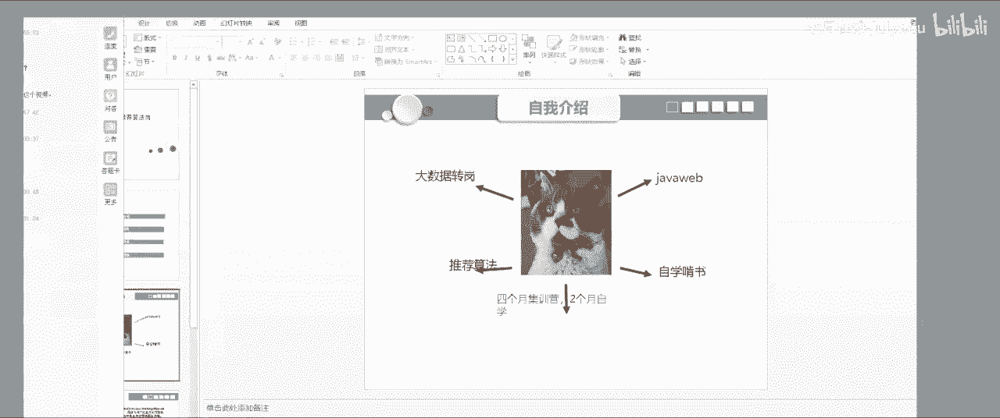

今天然后那电脑前天测还是好的，今天你没有声音了，我声卡有问题啊。嗯，我啊那我开始了，我先自我介绍一下吧。然后我是那个15年毕业的，15年毕业之后，然后我先我先从事的工作是加外b。

因为就是我大学学的是那个学是加外，然后然后第第一份工作，就搞加外 web这一块，然后干了大概有半年的时间，然后然后我就不想干了，我觉得没意思。然后然后加we，然后我就没死掉了。

然后我自己在然后我自己然后又自学大数据，然后大数据那块，然后就是我也我也我也学完了，然后然后又找到一个大大数据的一个岗位，就是大数据大数据嗯大数据岗位，然后我自己又我又干了一段时间。

觉得还是就是有很多就是就也也也学了很多ETL的一些东西，就数据仓库一些东西，但是我始终不知道要这些数到底是干嘛。😊。

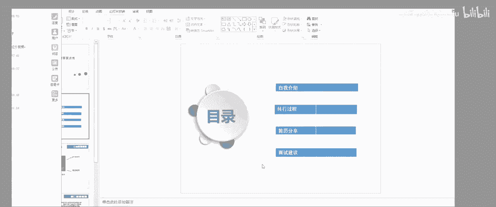

然后就是我慢慢的然后接触到一些sg，爱些算法这些东西。然后我发现就是我可以从大数据，然后转到算法搞。然后。然后然后我自己就是我学习的时候，然后就是先嗯就是以前前面是没有没有想报班，然后自己啃书。

然后啃书我话现在根本就是效率比较低，而且你学东西。呃，呃，大家可以听到吧，就是听怎么可以听清楚吗？啊扣一好吧。好，然后。然后然后我就是然后我又打学学学学推荐算法，然后嗯推荐算法，然后在家里面又是啃树。

然后啃树啃树，我发现我自己根本就啃不动。然后而且知识所有的不成体系。然后最后我还是选择就是报咱们77月7月级运营，然后就通过7月通过7就7月级运营，然后就可以把我的整个知识零散知识。

然后会就是整个系统缺以点，然后成成为一就你有自己，然后形成一套完整的一个知知识架构。嗯，然后就下来我这就是我自己一个一个转岗的一个过程。然，接下来我给大家分享，就是我大概就是自己从7月。

然后学习学到这个东西。

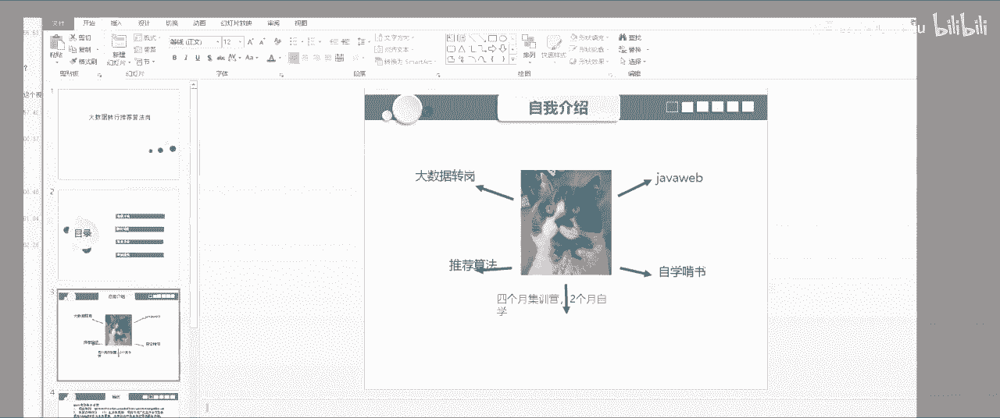

然后然后在7月里面，其实主要就是因为呃从从从因为我我之前是学数学专业的，所以我数学数学那些践行代数和高等代数，其实我都是掌握了的。然后所以说就是看数学这一块，然后比较快一点。

然后嗯然后接下来就是通过还有韩像韩晓王老师讲的一些他们7月在线，就是7月在线上面一些老师又讲的真的是非常到位，而且细节讲的特别好，就是大家我觉得看看7月在线的视频，就是你看一遍肯定是看不懂的。

我几乎每个视频我都看了好几遍，好几遍，然后然后我自己用了一个本子，把上面所有知识点，然后全记下来，然后自己包括把老师识点，然后自己手推了一遍。然后才把一些基术。

然后你你自己就头脑里面有了一些机器机器学习的一些一一些模型之后。一疫情模型之后，然后你你觉得这套算法是有是有一点感觉的。然后嗯。有点感觉的。然后就是我自己在学习这这些算法的时候。

就是我通过不仅仅是把老师上课些PPT还有他视频，我搞会。下面我自己刷了几个例子，刷了几个例子，我就刷几个例子也是不够的。我觉得大家有有精力，你可以把最起码自己去就是你自己就就去拿拍出去写写一个。

比如说写一个写一个那个。写1个决色数，然后去写1个LLR这些现脏大家用python拿后处理结构，就自己把它实现一遍。呃，就是就是无非就是决色数，它就是个递归嘛。

对然后递归递归递归它肯定是有一个有一个有一个有一个终止条件，然后到终止终到那个终止条件时候的，然后数据停停就是嗯停止停止生生长。嗯，听是了所所所以就是我我自己还是自己比较关注。

就是自己自己一个就是真正的比较。我比较关注自己的编码能力，而且我我并不在乎就是我自己到底掌握了多少多少模型。然后是然后然后这里在7月在现场我自己做的项目就是那个park电影推荐系统。

因为我之前是搞大数据的，所以说我对这个大数据这些东西我是不陌生的。嗯，包括包括就是他整个一个就是比如说还有park卡夫卡问这些东西，我自己都比较熟悉。所以说在在嗯在这个就推荐系统，它的环境部分。

其实我是少走很多大路，而且是比较快。然后我自己是在那个阿里云租了租了三台服务器，然后把这个架构然后全部搭起来了。

嗯，打起来之后。

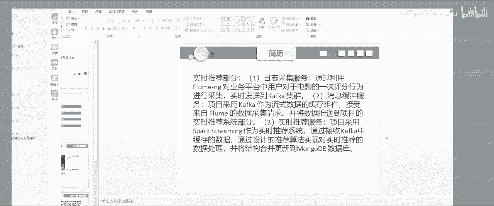

其实代码其实也也也也并不是很难，它就是用了那个spark喵 live的AOS17最小二乘法，就是用那个直径分解。举阵分解，然后最后得到了一个iphoneic之间的一个举证。

这取证就是保存的是I之间的相似度。

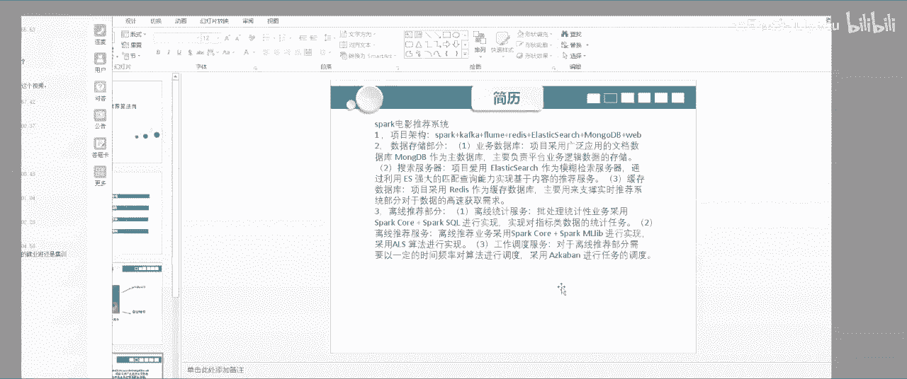

呃，然后这里面我觉得就是我比较就是它离线算法其实没有什么，其实就是你调AOS里面传进去呃，有那个比如说你你你数据嘛，还有那个呃，还有I还有实际上就根据得到一个相似举。

然后AOS这块跟你计算出来相似举阵之后，但实际上这个举证是我我是把它缓存起来了，缓存起来到最后就是用于实施就线上实施的一个状法实施算法就是你点击一条数据之后，然后我就从这相似举阵。

然后直接去获取它的一个相似度。就是实施推荐我就可以用一句话行。其实大家如果要是有堆的概念，其实实施推荐它就是在维一个堆就是你你用户点击下触发一下。然后我就会通过你的你你你你点点击这条数据。

然后和你之前历史行为或然后之做一个计算。作为一计算之后，然后我我会有一个推荐列表，然后我就一直在维护这个这点击一次，然后更信次列表，点击一次更信次列表。

所以这样的话这样的话就是你你用户的一些推荐一个推荐列表都是在实时更新的。所以说你每次推荐东西都是不一样。实施的话，我就我我认为就是这里实时训，大家把它理解成个对接好。

然后这里还有一个tg这一块，然后有一些基于，比如它统计特征，统计特征的话。嗯，统计统计合成的话，比如说他跟近期近期热门就是根据他的那个年年月年月年月还进行一个年月进行一个就是谷物派。谷派之后。

然后根据他的一个评分进行一个量值，然后去套分，这就是一个基于统计统计数据的一个嗯基于统计数据的一个就统就近期热门的一个统计。对然后一些。我看一讲，然后这些历史论门还这这这些都是一个一个道理。

就是这些就是我不想给大家，就是把这个东西讲了一个讲的就是很。很很那个其实他们到就是所有的召晖模型，他其实都一样的。就是你只要理解理解理解一些一些倒牌的一个思想。他实际上就是基于一些倒牌的思想。

然后去靠博。所以我感觉他们的其实招回招晖模型，他一些一些算法其实都是基于这个思想来说。

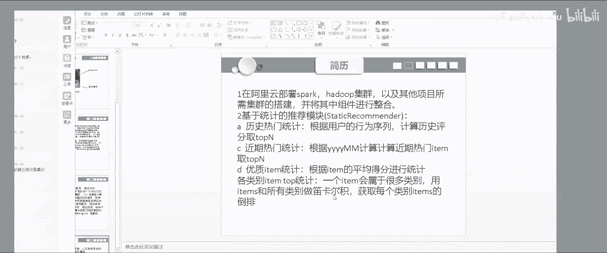

嗯。然后这里有一个机于，就以盈语盈语推荐的。然后这个就是用了1个TFIDFTFIDF。然后我就是根据它的一个呃电影一个名称，然后计算它的词频。视频次频计计算出来之后。

让我计算电影电影电影和电影之间的一相似路，然后再去校本。实际上就是所以所以所以就是我感就是嗯像像这些就是你写了几个模型之后，然后你就有感觉。

就是他他他的些这些无非就是嗯基于就NLP或者就是把这些转化成向量就好了。向量转化成向量之后后计算他们做相似度。只到最后，不管是就是你基于的是一个历史数据评分。

还是基于你的一个基于你的一个那个就是你的一个呃你的那个就是你的一个电影名称，它实际上都是在最后再计算个项似度。所以所以说我认为推荐他实际上就是在做相似度。对。然后这里就是我到最后LOS。

然后最后算算出来是是是200200维，然后最优最优就用了一个网格自器交叉验证，最后得到的是最最优参数是200维。然后还有一个他的一个拉姆达什么的。

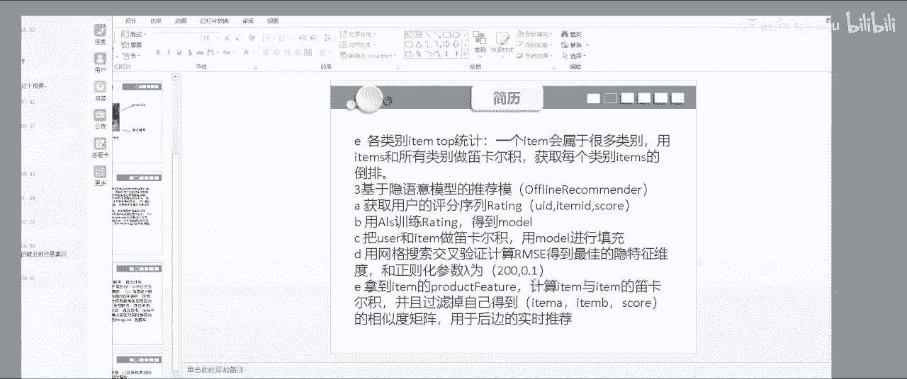

对。然后就是一个呃实时推荐支付刚给大家说一个实时推荐，实时推荐实际上就是你把那些推荐列表删都保存在mongo里面，然后然后从这里面一直一直去更新从在这上更新UI更新推荐列表，然后最取套通。

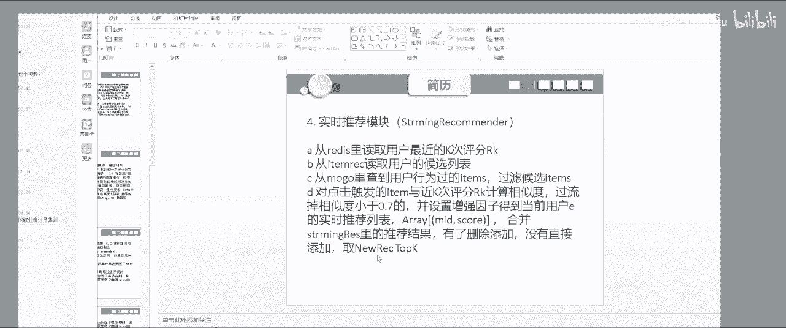

嗯，这是就是我刚这是我刚刚说的通过TFIDS然后计算它的一个就是电影名称的电影名称。之后，你把它引单进之后，计算它的销量和销量程是相似度。然后就最后来后进行一个根据它的相似，然后进行图检。

嗯，然后这里这里实际上就是。哦，语速有点快，兄弟，不好意思，你们大家有什么问题大家提出来。我今天一定会把大家不懂的问题，我都会就我自己怎么样去面试。还有一些问题我都会告诉大家，希望大家还是有余提问一遍。

因为我不知道你提问我还知道你哪些地方有些困惑，我才能给你解答，就是大家还是我平常说话是有点快，需要好都是。是不是有点有点这样，有有点体张，不好意思。大家还有对我的潜励，还有有点不明白的话，我也可以。

我也可以给大家解释一下，然后前面就是我大概说了就是一个一召回算法，它实际上就是是一个召回算法。但是就是你拿到召回算法，拿到候选级时，然后剩下就是排序。排序的话，然后现在比较用。

就用就就是就running to rank嘛。文明突，然后就是然后呃这里面有招就召回算法的话，就是我不仅仅是之前的AOS。当然我觉得你去面试的时候，你只说你用过AOS1个招回算法，我觉得肯定是不够的。

你最好多掌握几个召回算法，然后懂得这几个召回算法，他们之间的一个差别。然后然后这这样才比较好，比如说就是iphone4F还有U4F。而且这里面就我去面试的时候，他就是问这个就是那个。嗯。

去USF他也是也也会去问我，就是嗯比如说就是怎么样去消呃消除消除仓位，然后就类似于类似于这样这样的一个问题。他们也会问问问这些，还有怎么样去当如果要是你的那个一下一下耳机之后，你这用户其实举势非常大。

然后你怎么样去维护这个相似的举动，这也是很多公司现在这个头疼一个地方。因为就每天iphone都不再增加嘛。所以这里然后他问到这个问题，当是就是我自己最好的个解答，就是。

就是因为他们itomite之间计算相似度的时候，计算相似度的时候，就是他他有些itphoneite之间其实是不具有相似度的。所以说这些数据最好就是把它成。其实这样你可以换一个消数算法。

然后嗯比如说就是呃比如说就是那个。通过啊有个类似用照拍索引吧，就是你通过一个类，然后找到这个类，通过这个类别下找到这个类类别下，最受最受欢迎套边，这样就很好的。然后把它的一个你具有相似度的F秒化过滤啊。

就这样从而就达到了一个优化相似度举对的一个目的。然后然后当时我是这样回答的，然后比如说还有al，还有cont base的CD还有LLFM，大家都必须网上有很多这样的解释。大家建议是把这相关算法都记下来。

然后把它还有当时我去面那个去面那家公司。然后他当时就就LFM当然也会问让我当时首推一下LFM的一个公式，当然也不很难。所以以后面试官问到大家也很基础些问题的时候是，你一定要把它打上来。

对你一定要把它打开。嗯。

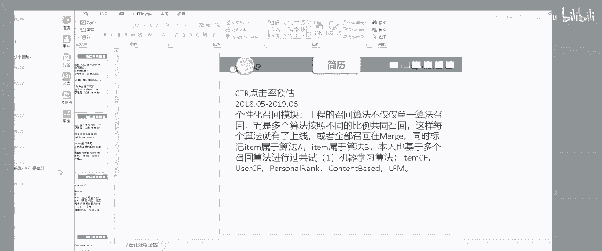

然后比如说这里我还用前面比如说前面是想讲通过那些，比如说就前面就是一些通过一些机器学习做那个做那个就是做召回。但这里比如说你通过深动学习做召回我toctor toctor实际上也是就是把他的at。

然后全部你单定了，你单定，然后计算他们相似度，然后到最后计算他们相似度。所以说他们你不管要用什么模型，他到最后其实计算相似度方式其实都是一样的。

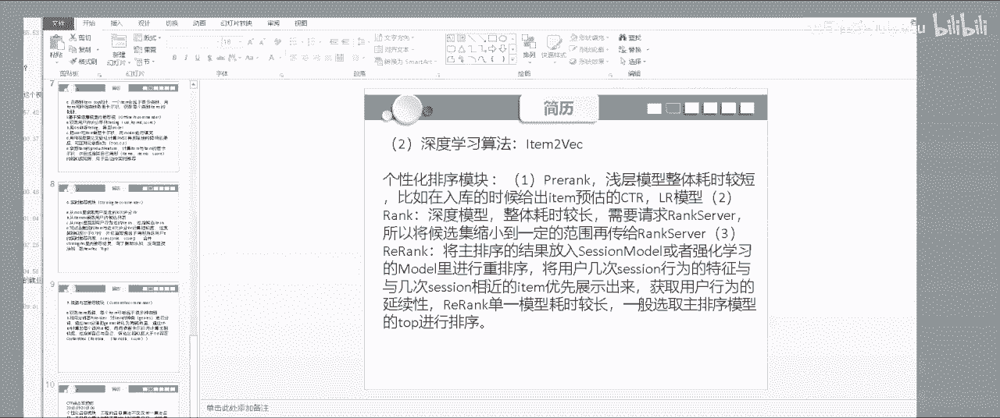

对人要上账任务。然后比如说这里这是我当时做，就是我怎么样通过，就是做做那个排序的时候。嗯，做排序的时候，然后我用的这这几个模型，就刚开始我做排序的时候我用的LR。我用我用LRLRR模型嗯。

LRR模型当时我是没有用那个有特征，特征用的是嗯特征。就是我特征嗯我的特征是没有加入组合的组组合，没有加入那个没有加入组合特征，没有加入组合特征的时候，然后他A1没有嗯看一下看一下。

AAC然后就是这么高。但是你然后接下来我又把LR里面加入总个人AOC是是有明显提高的。然后最后我从LR过滤到GBT然后从B在过滤到GBTT加加LR然后他的AOC都是都是都都是上升的。

就是那这几个模型就是你一定要自己去通过一份数据把这几个去做一些模型融合这几个模型你都要去试一下，然后看一下他们参数之间的变化。嗯，你去给面试官讲的时候也是这些东西。

最能说明实东西你确实做过我觉得也是最最有说服力的一个地方。嗯，比这然后最后然后切换到嘛后当时我的数据数据它是我的我我的一个数据它是有限的。所以这里的参这里的1个AOC其提升并不是明限。

但是你如果数据量越来越越大的话，它AOC可定会提非常明非常的明限。冇。诶声。然后然后我最后最后算就是深度学学习模型，大于它这个LR和CPT组合模型，然后大于CPPT小大于LR。嗯。然后就是8月。

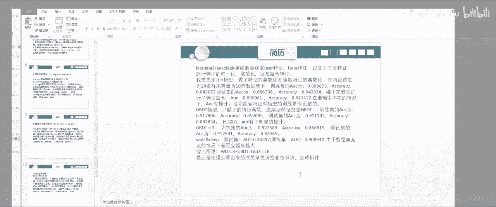

嗯，大家有问题吗？

然后是不提个问题，哪点不明白，大家说出来，不然我不知道大家哪哪你哪里不太明白。对。

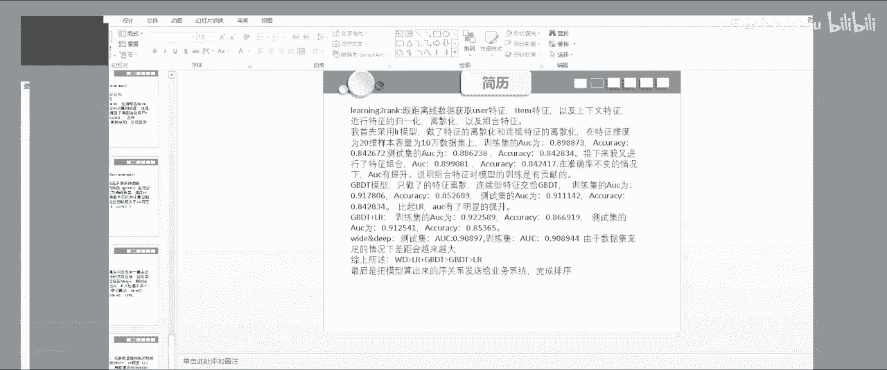

嗯，完考虑过时间那下，我知道你说这个就是。嗯，考虑我吧，你说但是我我知道你意思是当时我是没有考虑的，就是你说iphone4F时间影响。就比如说嗯他的一个比如说我做了，这里面我是做了给他就是给相次的举证。

给他通过时间影响去给他做一个降款嘛，是吧？就是如果如果如果他他用户行为，他两个itom的时间月。Yeah。越就是他越越长的话，他肯定就越越越不具有相似度嘛。然后你给他相似度做一个项材。

这个东西就是你做相似度。这这个实际上就是你不管你考虑时间还是其他因素，就是你在你计算相相似度的时候，你都是给他可以做一个比如说就是给他做一个增益，增就是给他的一个影响，做一个增益，做为一个检。

一个一个增议或者减少，就看你你这个影响就相应诉讼条件到底是什么。对不对？所以说所以我本身你遇到这一点的话，就是给他无非就是你在写显示公式的时候，给他处理他在过一台仓思路，然后加一些加一些公式。

加一些计算方式就可以了。或者是嗯通过他的时，通过他的一个时间间隔长长短，然后做以个。做一个给他上去做一个加强回账。你这就可以了。然后然后就是我还是给大家，就是然后我其我项目就是做就一个召回一个一个排序。

然后还有就是我给大家然后分享一下，就是嗯还有就是我现在在公司做的项目吧。然后我现在在公司，然后就是就用了一个层次聚类，然后弄了一个叉K，然后用了一个叉Gmo，然后还有一些他召回一些策略算法，嗯，就是。

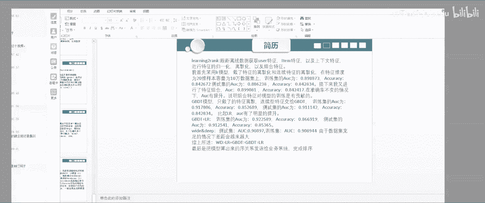

就是然后比如说做，比如还有一些就是你你这个线上，你这你这个线上，然后你的一些你的一些。你好。然后然后就是发现比如就是。嗯嗯就是就是比如说你说比如说，还有一些他的一个命中率啊，命中率，还有一个他他命中率。

还有一个他的一个它的一个转化率T那个R然后通过一些这样的一个指标，然后去衡量去通过一些这指标，然后去衡量你的算法，后带来的真实的一个收益。还还有就是你去面试的时候，然后你把这些那怎么样去衡量你的算法。

你们也要说进去但但实际上但是我知道但是我是这么做的，就是在真实的一个推荐场景中，他肯定不止不止一套召回算法，它肯定是很多道的很多的召回算法。

然后通过一个不同不同不同召回算法的一个算法的上限去按比例进行召回。然后到最后然后再进行排序，他肯定不止一个召回算法。当我写的时候只有一个召回算法写的是比较单笔。大家可以多说几个召回算法。

然后把这些东西都说是你的一个召回算法。这样的话就显你这个项目项目简单肯定是比。哦更老板一点，我觉得这样的。而且因为现在其他就是推荐系统，大数据都说都说只是说1个ALS，但是也也不是怎么好。

所以说我们大概尽量多说几个，你觉得比较好。然后还有。还有就是我认为我就我能找到推荐，我们找推荐就是一个最重要的一个因素，其实不仅你是我背的算法。就是我我对大数据这一块是我我是非常熟悉的。

因为就是在在在大家在大家在推荐算法和其他ARP那不一样。就是我缺荐算法这东西它是要跟跟你的一个大数据流实时流或者离线一些东西合起来。就是大数据那些间你起码都有会比如说最起码写写扣啊，写些一些一些东西。

就是打打加包那些东西你还是要会的。比如说就是人家就最简单的话，就是大家从比如说就，如你一些的一个。海lo夫的一个它的一个呃嗯架构当是有点夸张的。但我觉得就让你就hell夫。

然后问他海lo夫就是它的一个原理。我觉得你起码要说出来，比如买像像 reduce这是比较老师常的。但是但是我觉得你要是在谈说mic，你能把它原理做出来就就很好了。

比如他怎么样进行一些想上他里面实际上就是一个就是就是就是通过哈希哈希分组，然后再再进行再进行一个分复排序，然后最后进行一个归应排序，他说海道夫就这样一个原理。嗯，所以我觉得你能把海报然后说清楚。

他比如我去面试的，人家还问了我一些问题，就是嗯你是怎么样处理，对你你是怎么样处理数据新写调。对，然后这里然后你就大家都回答一下我们，就是大概怎么样处理数据信息。嗯，包括那个像像hello场景。

下面cap场景，或者那个hello或者那个sg场景，大概怎么样去处理数据信息。嗯，对。回边请回家看。你，大家有什么问题就尽快，因为直播的这时间就这么短，大家有什么问题尽量多提一点。

我都会我不知道我想的好不好，但是我会把大家问题都都你想了解到什么，我都会告诉你。嗯。嗯我等大家一下，大家有什么问题提一下，好吧。嗯，实施在线算法问的是什么样的？这个我看一下。

这个我用的是这个我没发你展开说，这个我确实忘记了。但是他就这样算的，就是我用户点击一次，然后我就点击一次点击了一个iteom，然后我就readis里面把我过去历史行为过的一个那些ite，然后我拿出来。

然后拿这一我目前行起，这目前目前点击这个iteom，然后和这里面我历史行为的，比如说你选了10个atom，就和我历史行为过去1个atm，然后做一个。有一个公式，这个这个我确实忘记了。

然后然后进行一个通过他的一个，我当时计算叫ER值，通过ER值，然后进行就相当于。就是通过他。因为我这个我这个。呃，就是我有通过1ER值来衡量这个商品是缓是坏。啊，到最后我和我历史数据然进行一个比对，来。

然后来确定。这个这个呃然后然后来确定它和历史历史我我历史的一个历历史at的一个顺序，然后最后去更新我一个平间内容。对。嗯，并行处理，我是我是这样处理的，就是我觉得你要是了解你要是了解。

就是那个嗯你去了解他的一个，比如说就是去了解那个嗯他的一个那个。就是我我刚说那个一个数据新型，我觉得你了解你要是并行处理的，他大数据都是并行处理。你要是想去了解它的数据新求。

你你首先了解nper就是它这个原理，就是他为什么会数据新新型。因为他他首先这这份数据，我根据哈克取得之后进行分组之后，然后你可能分一个哈奇一个哈奇一个一个K下面的，他数据很少，另外一个K的。

他的数据非常的多。所以说他把一个他把一个并行的任务，然后最后直接跑跑跑成一个串型的任务。所以说你就需要在。在你你你再需要再就是那个reduce端，你需要把这个数据很多的这一块东西。

然后进行一个再进行一个买保定，就把它打散。打散之后，然后它它就变得很。把它把例度打细一点，然后这样考成地型 logo。所以它数据信息本质实际上就是在就是进行一个就是那个comper。

你可以去迈le就查一下comer，就compbiner进行compbiner，然后进行一个。他如果你要是在还还不存面的话，他实际上就是。就是避免大表和小表段位。然后去处理数据清息。

但如果你要在park里那sk就非常方方便了。它通过那个语音算子就通过let map吧，我记得是let map，然后把它打散，然后聚合打散，然后进行这样这样这样你可起解决数据信息。

所以这有数据清息也会经常问。所以大家也很简单，你搜下，网后做下答案，他很多答案。你只要把它对会问到的话，你就很容易搜出来。好，大家然后就是我还有还有一点就是大家说，就是大家去面试的时候。

你的整个的一个技术架构你把你整个的一个技术架构构建起来。你有一你有你自己技术架构之后，然后别人再去问你的知识点，你读这么面，就不只不会是问你这你只会专注的一点，然后别人又不知道。

所以说我觉得你的一个技先不说技术深度吧。但是我觉得你以前有个没有广度之后，然后再去专注一下你的技术深度。我觉这样的话会比较好一点。对，所以说大家是像这几个系统认为就是不一定你要去玩的很多。

但是你最想了解他是干干嘛的，然后大概写一些简单的API，然后继己去。稍微写稍微写一下。对对。然后然后就这样，然后还后还有大就是像像spark，我觉得也大家很值得去。就是因为它有一些有一些算法的话。

它实际上也是需要spark来实现的。就是你不一定有些东西是没法调包的。都是通过数据结构上自己去实现的这些方法。所以这样的话，嗯其实语言不是问题，关键是我觉得这里面最重要的是一种编程思想是在里面。

大家一定要具有。就是你的编视思想才是最重要的，调调包永远都会被取代的。所以说大家不要去调包，有什么东西就就去实现什么功能自己去实现，去把它通过数据结构去把它实现了。我觉得是你编视能定性一定会提高。

而且你去面试的时候，你你问别不会没有问题。但是只要你数数据结构够溜，他问以，你干码写的够放，他就。你会觉得有。能力是可以的。所以我这是我自己一的切身实际的感受，就是大家不要去觉得学会一些就是积极学习。

面学会一些像贝贝啊，学会一些简单的一些一些一些一些一磨线长序去。那我觉得其实本质还是你把数据结构学会。大家把这种编型的思想。对我觉得能能能能像像像目就数据结构，你还是要刷嘛。

比如说那个他今天今天要问你最简单的问问一下你太太还单练单练生和双脸微站和八打排序，那些你起码都能都得能能写的出来吧，像。然后问到像像像我就像。像像一些问到你一些问到你一些像数据结构这些问题。

数据结构肯定会问的。你面试的时候你定。你一定会要求你写数据结构。所以说数据结构我觉得你还是就是你不一定把它完全实现，但是你起码要写出来一版出来，然后再根据面试官一起讨论去优化它，我觉得就可以了。

怎么样去优化他的什么复杂多，空间复杂多，这些大家还是要会的，让你写写一些这些东西。而且那你是算法工程师，我不是叫办公程师。所以说你数据结构就就是我我之前有一个事跟我说不管你想老算法，你数据结构。

一定要得有辑。我觉不是就一样的，这是我给大家一下，就数学后大家经常刷，一定要经常刷。嗯。嗯。然后这里然后自己呃，然后就是。嗯，我对就是我自己对集群还是有点感觉吧，就是对一些集群就是大家。你。

如果有条件的话，先就是你把先把那种搭集群方式，你把集群搭建一点。那你对里面的时间基本就经常明白了。不确得。Yeah。嗯。唔十点啊。主要大家有什么问题可以加我的微信在这里，大家有什么问题的？

我给你说的是计这月是实机。没有说的涉及就业实施行为的这个现象一项。嗯不你说是我不太理解。今为是事性我都不清楚。实施性为离线缺陷，他实际上就是就是我他实际上就是把那个他实际上就是在做AOS之后。

他实际上还是把那个AOSS因为拟离线。算好算好你离线算好他的相似度了嘛。然后他是他把我当时我记得说，我是把这个离线这个相似度，然后缓缓缓存到缓存缓存到内存了。他实施过来。

然后直接从内存里面去拿到这相似度，不是它这个相似度并不是说离线基于基于就离线的一个水准，它实际上只是通过一个因为实施它对时效性要求很高的。你不可能从从从从直接从那个你必须要从内存里面拿取。

所以说你把这个这个东西实际上都缓存内存了。然后从内存里面先取，又它相似度。因为你要计算一个东西，它好不好，你还是要通过它的，你还是要拿它的相似度来计算。所以这个东西只是你中间一个产物。

计算通过你计计算你实施实施推荐的一个产物。对。一直我就是这样。它是把AOS里面的1个D卡机，然后缓存到内存了，然后通过这个内存，然后去取它的一个像素，然后进行计算，然后进行试。然后如果大家还想听一下。

就是那个我现在在做一个那个就是做了一个。一次做了一个剧类剧类的一个算法。现在在公司，我来的这个公司大概是4个月吧，然后做了一个很积的。公司之类的话，就是它是一个做了一个大概类似于防圈划分的一个东西。

如果大家大家如果有想去到美团或者饿了么这样的公司，嗯，你可以过来找我，我可以告诉你一些现在卖外卖的一些物流，或者他现在一个美团饿了么的一个他的一个推荐，还有他这个离线离线，还有他离线推荐算法。

还有他骑手的一个就是路径路径优化路径优化这个算法，这些代码我都已经全部内挂到脑子里面。如果大家想去套槽到美团饿了么，你可以加我微信。然后我去把这些东西。可以去给你去讲一下他们业务。

让后你去面试可能会好一点。对对。嗯。嗯，那大家还有什么问题吗？大家可以活跃提问一下，可以活跃提问到我小什，大家可以活跃提问，还有哪些不清楚，我都会给大家讲明白，就实事推荐这一块我确实忘记了。

但是意思大人给大家说明白了，他实际上就是在临时一个推，你把也是个追究好了。然后不断更新一个列表，就不断点击一次触发一次，然后进新他推定列表。😊，然后具体时呃。

要具体话你我大概如果大家想具体知道是怎么时现的话，嗯，因为我确实忘记了，好多时间没有，然后现是没有看见这块，我我们也是然后没有去看。然后就是我去面试的时候，然后还是就是去大概。

就是因为我之前看过就hello sports时间嘛，然后去讲的时候，然后给面试给面试官然后去。然后这些东西我去讲的很清楚。所以说我觉得一方面我能找实件事，没有公司能力确实O。

所以说我觉得你训在试推建的话，公司能力的话能变得比较OK。然后训练试成功其实比较大。因为现在就是搞机就算，因为单纯的指挥机器学习，嗯也很难面。因为就我们公司去公司这两天招人的话，如果投了很多简历。

就是帮帮从同事长帮他去投很多简历，他们就是一般就这块只要三人荐的。还有一方面就是你这样工能力。验时主推EM这个不会的SEM相对库存。好，我面试是没问过SVM，我们大概说一下原理就可以了。我。😊，没有。

你就用么这些你大概理解他们，但然有些公司我觉得你但你说你把那些。😊，就是你不要再关注些一些量的，我就是你把你你关注点就是推荐。对推荐这一块，你就把推荐你常用的招呼台去，没有算法，总把它搞得清清楚楚。

明明白白，对吧？你有个自己一个知识知识架构，有个知识，你能形成一套一个自己的知识体系。然后去问你的时候，你经常也不是很重要。要有自己的知识体系，就是我当时是把这些所有所有的交微算法，包括他公式。

我自己在本地上全部都注。仲表已经等上了。然后他然后我做一些，他说他的一些排序上岗，我也总结了。全部统一下，到最后基本都就是面试的基法就是完全一是不二的，就基本上来讲大了。所以说。他也你讲的很明白。

PM40。其说做推荐肯定会要的。因为因为你想他他他前面你说一些APP一些你可能他从前端，然后到大数据到ETL一条一条。就他他数据是怎么样的，所以你从数据数据过来，他因为你你你做训练。

你平常训练的数据你都要读取日志的，要读取loglog来处理或者log。所以说他log就是在大数据集群上，对吧？所以说你你经常以后做推荐，你的你的脚本运行也是在这个。对，所以说你应用团件，然后还有。

还有一个大数据，大数据这块，你肯定要知道，不然你怎么跑代码。嗯。环境这关首先很难过去的。所以说你通过大数据的话，把你环境这关过去了，然后你再。当然嗯就是。好正我知道，当然可能大公司分的比较细的话。

可能有效活不会很多。但是你要去一些像我们公司的话，这销活你还是要。你同还个还装干。sk拍到sk我们sk拍sk肯定要给我。Pa你你你不明该sg，但是他要。然后起码HDSS啊。

像haveHHDSS这样的ha然后做些PL那些特征特征处理还是需要的。就这块夜会。大家大家可以提问。

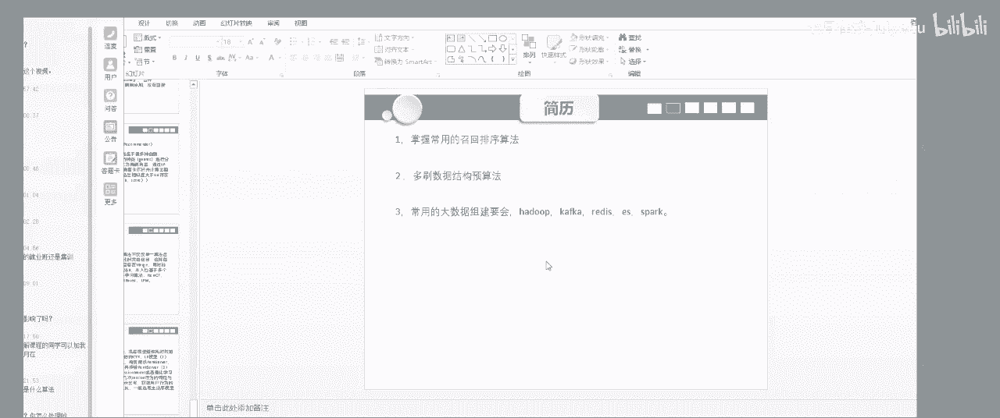

有关flow呢会问吗flow这个我问的是我们公司业我去的公司反正是真没问到flow，他也没问这个当然你会 flow我你真正实现其也并不是很。我觉得就是。

你把那个公东当然他会问问一些就是你外部选的是什么特征，选的是什么征，对不？你什你这是怎么做的做一个demo你去费我们我我公司在目前。😊，是有还没还没用到这块，因为他们之前这套代码是。

是已经就是他就是不敢改的，你知道吧？这一方面吧？就是因为他不敢有太大的改变。就目前还没有修售发品，但是你要去大厂的话，可你发给你交回。包括做去了一家数据服务，目前在这家公司还没有弄用到那个。

但是且有是还没弄到这个真命学期的这些东西。嗯，实时推荐就是实时推荐，因为我刚刚前面写了，我就是你把实施你也什么时堆堆就好了。追的话就是么堆，然后里面有一个推荐内表。

然后里面有一个根据根据你说推荐推荐推荐的一个就是PR值，更PR值然后进行排序。然后每次点击之后，它会更新这个推荐列表，然后进行更新推荐表，然后再根据你的目前的会进行排序更你那的这个这个这个I列表。对。

啊，这个当然这个我确实是忘记了，这个这个你让我给你们说这个这个我嗯或者我再我再总结一下，总结一下，好吧，我把实时推荐这一块，我把它总结成文字，然后我是怎么实现的，我再总结一下，然后我把时间发到给你。😊。

因为这块就是他中间肯定还是有一个有一个数学公式的对，但是我是知道他是把那个实时推荐通过A计算之后，把那相素缓存内存，然后再通过前端然后前端过来点击出发之后。

他有1个P然后根据那个你就推荐那个你历史行的一些，然后进行进行一个数学计算。然后最后得出来一个一个新的个PR值来衡量你这个产品到底是不是对。用不用去更新有什。这还是同选。是跟我信情好的呃。

我在排序可是做模型融合。对，这我先在说了，就是我先用LRLR从从从新模型单一模型到组合模型，从LR过渡到GDT就数模型，然后再从数模型GDT加GP量加啊，然后做做这个，然后GP加，然后再过个老板。

然后我就用这些模型，然后做排序，然后去看到。然后特征的话，这块你肯定是有。你肯定是有atom特征，然后和user特征，到最后把这个两部分特征结合起来，然后去计算去那个去去去去就是学习你的模型嗯。呃。

反正我觉得大家就是就是你能把这些就这些模型你说明白，能把这些知识前你全全部都说明白，对吧？然后然后我现在说赵回还就那些那些算法，你把它搞明白，然后你自己有个完整的项目，能说明白，然后你数据结构在UB。

我觉得你找个，然后在在总点大数据，然后你找一个推荐的工作应该不是很难。因为像我现在觉其推荐的需求现在还是挺大的。因为这两天是我面试完之后，然后去一家公司上班，就每天还是能收到就十来个。

就是就七八个6十来七八个面试邀请还有。所以大家跟着老师视频，7月期不有此训练系统嘛？你就把那个考会嘛，然后去。好吧把然后那那些东西你都把它就全部都列化资源脑子里了，是吧？然后我觉得应该就问题大。

然后数据结构嗯数据结构还还是要发。嗯。我们再再聊5分钟，好吧，到4545。然后大家如果有什么问题尽快提交好吧。挺晚了就像就李想到家睡觉，那有什么问题可以加我微信，就是怎么样都可以。嗯。

其实我自己现在其实也感觉是对。模前这一块就是感觉就面试感觉是没个问题。但时感觉还是。不算不算不算还不算玩还不算玩的很多。😊，就是我看过我，看过这个块频来发的财点信息。就是如果大家有想刷看中的。

就定期举动。嗯，但是我数据结构这一块，我确实下了功夫了。我把我大概就8。把那个。用什么办法？现在公司用的是那个就是王以强说用的是一一个是。召回召回那块召回那块用的是我通。嗯，导粉那块是用的。哎呀。

我们公司召回那话其实比较问，其实我都不想说了。😊，交会的话，然后排序的话是就用于他。然后大概然后有一个，然后还有一个现在现在让我们又好，现在我在因为他他那个就是他推荐和物流是一个体系嘛。

然后推荐这一块现在目前是人比较满，然后再让我去找那个离线。就是他这个物流物流一切算法，所你还问什么骑手调度那一块，骑手调度那一块，然后我现在就比较接触了一个商仓的一个划分，商仓划分算法。

3是划分他上们用的一个图书据类，图书据类，然后它里面用到的一些，但是这里面还有东西的。他从然后里面用到的是一个就是通过一些订单清理度。订单清订单订单之后的清纬度，然后通过这些清纬度，然后去。

得到这些订单经纬度，然后你得到一个那个得到一个那个得到你的一个商铺的一个坐标。对，是的，我我现做的是类似于美团骑手，你可以理解是骑手骑手那一块，然后订单经纬度，然后通过这个东西。

然后通过但是这里面其实他用的全部都的数据结构一些知识，根本就不是，而且。数据结构显示，他这里面用是，比如说他用的是一个上面划分，到最后用了一个，大家可以看一下那个状法。就是要出包粗包扫描算法。

大家可以记一下，或者图包扫描状盘，然后这里面我用了一个，他这里面其实写了很多东西，用了很多堆栈，他这里面写了大量的堆栈。他就是就是这样写了一个，比如说他他大概对栈的话，就是写了一个写了写写了一个栈。

然后里面设设置一个变量。呃凸包凸包凸起的凸包是包裹的包，它这里面实际上是。跟据理跟那个计算计算那个向量向量的差距，计算向量的差机。对。对图包图包扫描算法，它这里面通过计算一些向量差机。

然后去最后形成一个图包。然后这个图包，然后最后形最终形成了一个商传，对个？然后它上去解决了一个问题，解决了一个问题就是解决什么问题，就是。就是嗯以前很多店铺，其实他骑手都是骑手都是。假如我这一个店铺。

我只有我自己骑手。但到以后的话，它商圈肯定要申请一个商形成一个商圈。然后这个商圈里面所有骑手其实都都需要共享。所以我现在就在在做这样一个事情。然后到到后面肯能要优化这样，然后接下来你把这些算法优化之后。

然后可定要优化这个包法，然后用一些但目前我们算法不是怎么尴改。

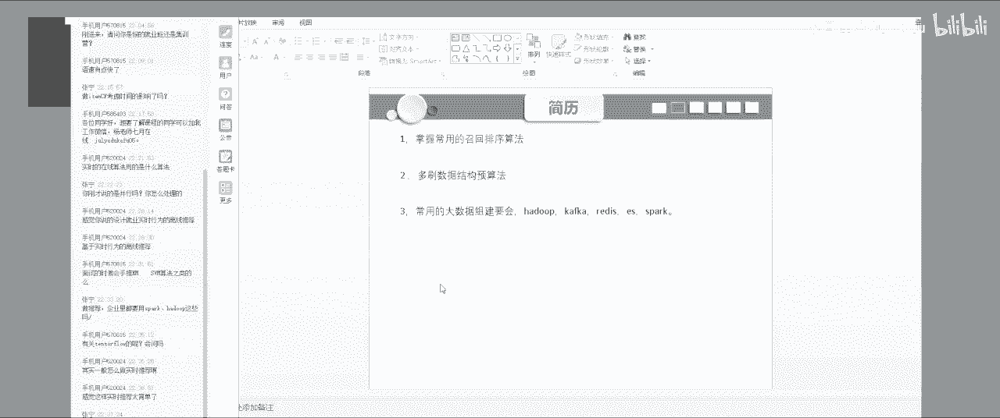

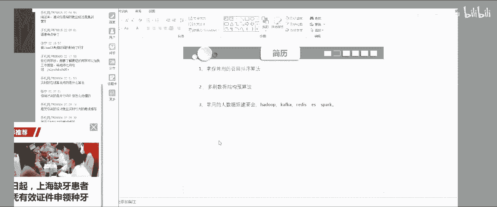

这个东西还不敢改。他不能改，是内化的。但是他这里面确实因为很多都是一些你看到这些他们写的些算法，其实都是一些数据结构的，跟他的一些基础实际上都是很很搭实的。这里面反正我感觉就是通过这个他写的东西。

然上我对。就就是对一个你一个循环，就他你怎么样处理它的边界，对不对？然后还有这里面他这里面有个他是他这里面有一个处理异常的个方法，用一个正态公布，然后去处理异常就是去去。去去那个处理到处理处理那边就。

那么你就大家可以把的方法也可以直也可以记下。通过现在分布，然后分都。然后比如说一些时间平滑，平难平滑。有时间平滑呀，还有有那个做个现象的。这像这样的一些东西。对，如果大家如果想去美团恶魔。

这块业务还是比较好。你想去美团恶么，就是我可以给你讲，他是你的业务。然后你去面试，有面试美团饿什么就是有有这样的面试机会的话，你可以过来找我，然后我去给你讲一下证名。大概的业务，然后你能跟他们准确合话。

应该是。高一点嗯。然后他们里面用了很多，就是写一个大概就是写一个写两个电量，按压，然后写一个电表，电表里面今天是个外务循环，然后这电表从外务循环里面一直向前走。啊，是这样的一个。用很多类似于这样的操作。

就怎么样去然后去从反我其印象最深的这个范围大概用就计算还有后在市场上翻这。他通过这个指定进取来后进行对循环理面这个数据啊后直接累下。啊，这个是不太一样，但是。所以我说这里面上有很多数据结构的东西在里面。

就是他但是你看那个重新他他用了一个一个那个什么。用了一个那个就商商化分析，反身他最后计算的还是相似度，还是一个矩阵，到最后得了还是一个矩证。所以说大家不用太关心一些什么说的特别多，特别繁琐的一些算法。

但我只愿你把那个。就是你把嗯我就是嗯你们了解其中级，其实我觉得其他原理其实都有很多相似的一些地方。对，跟推荐的一些，你说他这一套他又物流上来，跟推荐也也是有很多相处之的。

因为这块有缺陷和物流化是是一个这些体系嘛，有缺陷。好好，大家如果没有什么问题，我今天就到这里了。如果大家想加我微信，可以加我微信，然后我可。嗯，有什么问题回答再。

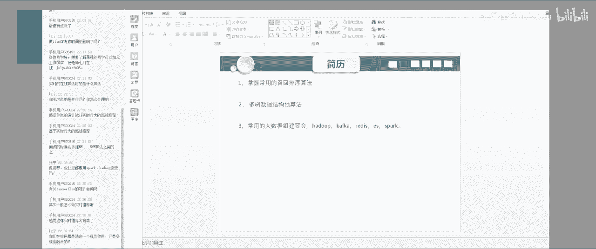