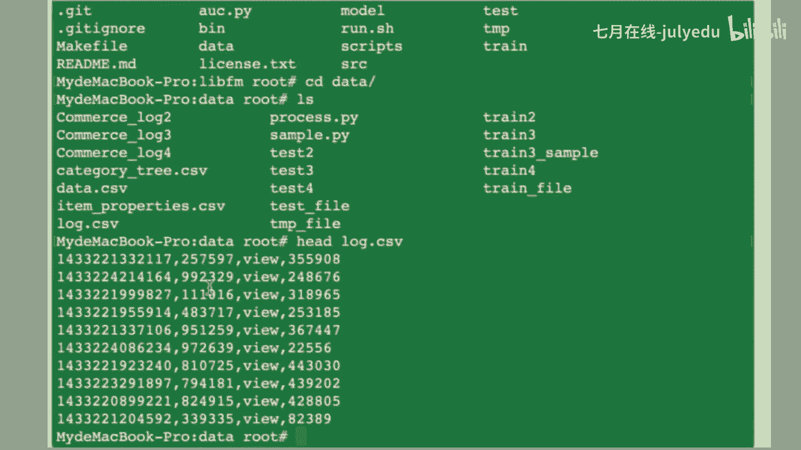
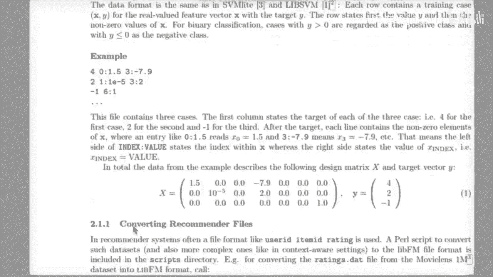
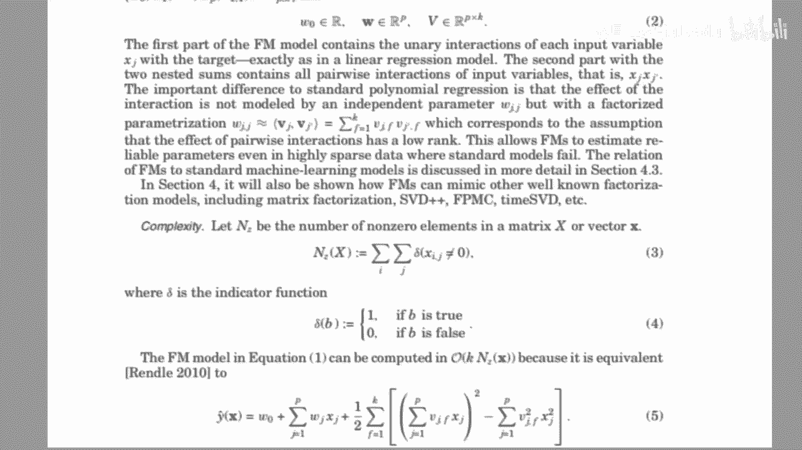

# 人工智能—推荐系统公开课（七月在线出品） - P3：带你实战电商平台的推荐系统 - 七月在线-julyedu - BV1Ry4y127CV

Yeah。好。😊，好，我们现在开始啊。呃，我们今天要做一个事儿，就是啊。应该说做两个事儿吧，就主要是拿那个。呃，我们用这个模型。啊，用模型来对我们的这个数据进行一个训练啊，就是进行一个实际的这个训练。

等于是一个啊实操的这样的一个一个工作。那么。呃。我们的这个model是有的，这个模型就是我们这个最开始的这个。呃，有两个模型啊，一个是这个。呃，立F嘛，这个模型我已经公开给大家了，就之前的这样的一个。

九精子接的这个模型。啊，然后还有一个就是我们在这个广告点击率预估上啊，就是做这个广告点击率预估的这个模型啊，就FTRL这个模型。那这个模型呢今天这个课件呢我没有这个丢到群里啊，这个没有关系啊，这个是。

好，后面后面我讲回来呢，会把这个这个代码公开给大家的啊。嗯。我会把它这个这个代码框下来给大家。嗯，然后我们来。现来做这个事儿。呃，我现在有有一个数据啊，就是什么数据呢？就是就是我们之前那个。

我们第二次提供的后面提供的这个叫做commercial logo的这个。这大家是有的啊，就是时间戳，然后这个us IDD，然后艾 IDD。然后还有就是他的这个啊category。啊。

就是他这个 category数，然后还有一个就是。三个数据对吧？那么这三个数据呢其实是可以去jo的。OK那么呃我们现在要做一件事儿，就是什么呢？我现在拿到这个数据，对吧？那我现在从零开始啥啥都不知道。

等于是那OK那我现在要对它训训练一个模型，对吧？那么呢呃。呃，我现在训练呃，比如说我们现在要针对它的这个，你看我们的针对它的这个呃。他应该是有两个型。到了卡到了三。可以。Yeah。

那我们看一下他的这个啊行为的这个数量。哦。哎，我去这么慢吗？这个un尼克。啊，OK好，已经完事了。那么它是有两个行为，对吧？一个叫transaction，一个叫vi，对吧？呃。

然后我们之前定义就will就是曝光，那么曝光呢是一个是一个反样本，对吧？transaction是正样的，对？它有交易了，对吧transaction的这个英文是交易了。那O那我们就相当于是正反样本是有了。

我们现在假设啊我们现在什么都不知道啊，我们来做这件事情，我们从零开始做，就拿一个model，对吧？我巴拉巴拉找了一个模型。那这个模型叫例拜FM这个大家都有。那么我们就从新开始做。点事。呃。

我们可以看到就是。呃。之前的这个呃稍等一下啊，之前应该是也有这个呃。喂。应该是有这个readme的。就read me就是它这个介绍嘛，对吧？那么我们就先看这这玩意儿，先看这个这个整个的这个log。

那么这个log呢啊其实我们能用哪个呢？就label是可以用的对吧？然后还有就是这个userus ID和艾 ID好ok。呃，那么我们知道有这个有首先有最主要的这个最主要的就是loggo嘛，对吧？

其他的是它的那个feature。那么我们看到就是。啊，这个就是这第二列，第二列是一个user是吧？然后这个是艾OK那么啊好，那么我的问题就是okK那么现在我用这个user和自己用这个艾。

然后来这个直接的这个呃。直接的训练，直接拿进来训练啊，可以吗？这是我的问题，就是直接拿拿过来。比如说我就抽取一下。抽取一下他这一列和这一列，然后直接就丢个模型去训练啊。我应该是的。好。

那么我就直接丢给模型训练是可以的吗？拿过来之后，这个data我就把它的这一列这一列抽取抽取出来。形成这样的一个。这样的一个格式的这样的一个数据拿过来训练。啊，就什么也不看。这样做可以合理吗？嗯。合理吗？

就没人回答嘛去。看一下。和不不呃，就是有谁有哪个同学能够啊回答一下吗？就我我现在假设。呃呃，就这这这一列是user，对吧？这一列是艾，然后这一列是label，那我就拿这三列拿过来训练。这个合理吗？

就是这个事儿。诶诶。为啥为什么不行？有人说合理，有人说不行，那为什么不行？为什么为什么不行不行？那是原因是啥？为啥不行？啊。应该不行，是啥原因？为什么不行？这点原因啊。还有别的同学有有有看法吗？

oneho呃，至少先往ho还还有别的吗？啊。那我现在问你我现在的问题是。时间短续。哦。呃，首先是这样哈，就是我有条件的限制，条件的那个条件的约束，什么约束呢？

就是我的所有的特征就是usCID和这个ite IDD没有别的特征，我们不用别的特征，就用这个ID类的特征。这个立白M那节课大家应该都听过吧。对这个对这个模型应该有所了解吧。我我就不做别的啊。

我们就做这一件事，就把U IDD和艾 IDD丢进去，丢给模型去进行训练。100分M的原理大家清楚吧。

啊。这个。这个模型的原理清楚吧，就这个模型的输入。哦，我我不知道有多少人线下用了这个模型，有谁用过吗？就这个模型我我在前几课前几节课已经。已经已经已经已经给大家演示过了这样的一个就是这么一个小模型。

有多少人用过，有没有人用过，我现在就就是有一个问题。有人用过吗？兄弟们。来给个反馈。为什么没用过这么久了，还有别的人有人有有人用过吗？没用过是吧？好吧，那就是你们没用过吧，我也没办法。

你不去用我有啥办法呢，对不对？

有有人用过吗？就没有一个人去用。那你们都在干啥嘞？是。没有人用。都在用啥。都在干啥？我就不想播了。什么时候用了，我再继续播。有人玩过吗？这这个 model道。有哪位兄弟玩过这个mod的。

我已经我我那节课讲了那么多，我靠这是就跟放屁差不多是吧？没有人没有没有人没有一个人用过。对。

啊，那么这个模型懂是吧？清楚，那这个这个那我现在就问啊，就是咱没用过了，咱就退而求其次啊，你没用过我也没办法，对吧？我也没辙，对吧？然后这个spring四阶说你这个呃你你清楚是吧？

OK那那你知道这个X是啥吗？我现在就问这个X是啥吗？不不是我知道你这个WX是一阶项，那这个X是啥，你不清楚吗？X是啥？X是啥？这个X我不是问WX这一阶项我知道叫一阶项，但X具体是啥？康业平在吗？嗯。

对啊，就是ID啊。对OK。那好，那我的问题就是OK那我现在用这个模型，那我接来就用这两个特征，这个能理解是吧？这个usI和这个艾 ID我就这么闭着眼睛丢进去，你们觉得哪个地方不合理，有没有不合理的地方？

我现在把us IDD和it IDD这两个ID对吧？这两个列都是ID嘛，我丢进去，闭着眼睛丢进去，你们觉得哪个地方不合理，有没有不合理的地方，还是说可以直接就这么训了。有谁有谁看出来问题了没？

现在领导对吧？现在这个团队leader说okK这个有日志已经来了，然后拿这个模型去训练一个拿libFM对吧？现在有一个log点SV对吧？丢给丢给。对吧你你给我训练一个模型出来。然后呢。

你就拿着吭哧吭着拿着UID和艾 IDD这两页对吧？丢进去，然后丢个这个模型，你们觉得哪有会会不会有问题？啊，就就这么就直接这么炫。会有问题吗？摩擦距太大，什么叫摩差距太大是啥意思？摩擦距是什么意思？

标准化，否则迭代次数特别大。什么叫做标准化？标准化什么？我们我们要聊清楚这个事情。摩差距太大，什么叫摩差距？我没听听明白UNA你给我解释一下什么叫摩差距太大。数据标准化。数据怎么标准化。

给我解释一下数据怎么标准化。啊，那个优娜呃，我觉得你说对了一点。我觉得你说对了一点就是。呃，哎呀，我跟你讲凡事就怕讨论，你知道吧？这一讨论啊就能讨论出来每个人的这个这个点在哪啊，我我我就凡事就怕讨论啊。

就怕说啊，一说我就知道你什么什么情况了。这个优量其实说到了一点点啊，说到了一点点。嗯，你说到了一点点。然后这康威平是51334是吧？嗯，你觉得我这么训练可以吗？就丢进去。

然后还有这个UNUNA说了一句话，叫什么X减U除以方差。这个这个是是这个模型要做的事情吗？我现在是这个力部FM这样的一个模型，需要做这件事情吗？需要做这个特征的这个standardize吗？

是。

康瑞平，你觉得有问题吗？就我我现在我现在什么都不干啊，okK我有这一类ID，然后有这类ID丢给列FM，你觉得会有问题吗？你觉得哪会有问题还是没有问题？那个优娜，我提示一下优娜说的是呃，你说到一点啊。

就是从零开始编啊，这这是一个嗯。对，这是一个要做的事情。但说到一点，但是还没说到点上有点靠有点靠。就这么丢进去就就O了。对，然后训练出来一个模型，然后这个模型的AOC到了0。8，很开心。

我这周上了集训营，上了集训营的课啊，我我非常不满意吉训营的这个集训营的这种风气啊，我特别的极其的不满意啊。我今天上了一下集训营的课。嗯，我我这周上了一个集训营的课，我非常不满意吉训营的风气啊。

但我觉得在就业班里面会好很多。就业班里面好很多。都需要往ho，这个不是oneho吗？这个司间，你这个不是oneho，这是tto hot，还是noty hot？这个不是换合同吗？啊，想不出来什么问题啊。

那我来提示，我来告诉你们。啊，这个东西直接丢进去，你也能训练啊。你也能训练，但是有一个问题，你有没有看到这个啊这些ID的这个。啊啊，我不知道你这个one后的是不是啊，我讲了啊。

就是这些ID会不会有重复啊，兄弟们能看出来吗？你能看出来我的点吗？就是你这个usID跟这个艾特 IDD会不会重啊，都是6位数，大哥。

那针对这个立白FM的这样的一个X这样的一个收入，他是不管你是你是UCF，他是不认的，这个不是FFM是有fe的对吧？你用fe你可以区分它这个东西没有feel的。

都是ID。假设这个userID跟这个SID是同一个数。怎么办？兄弟们。对吧明白明白了没？对啊，康玉平，你知道我的意思吗？就你知道我说的点吗？就是这些都是feature，这是都是一位数。

你要你你要把它给拆了。对，就你首先你要check一下，你你这个user IDD跟这个it ID是他妈是不是有重复的。对吧你肯定要想清楚啊，你想想看我举个例子。

假设这个user IDD是这个248676OK那他妈有个艾 IDD也是这个数字，那你丢给这个模型不就有问题吗？

这不是很显然的问题吗？对吧你肯定要你肯定要进行一个重编码吧。

肯定是有无数的人会去。肯定是有无数的人吭哧吭哧闭着眼睛做。假设使用这个模型一定是有的，不用看这种人90%都这么干啊，肯定有啊。他们就没考虑到这个问题。那这个模型学的是什么？这个模型例FM的突出点是什么？

是第一项吗？不是吧，是第二项是吧，他要干什么？

他要学的是这个影像量，对不对？他学的是这个影销量。那对于这个模型来讲，如果你两个IDus IDD一样的，us ID跟ID一样的话，那他不是就当成一个向量去学习了吗？那你觉得对吗？肯定是不对的。

对吧就就这一点，我跟你讲，你从一开始有很多人拿到手据就会犯错啊。肯定的，不用看。如果是放在集训营，10%所有人全部会出错啊。如果是放在就业单，90%人会出错。嗯，就这个意思。

那OK那我们现在来che一下这个事情。我们来check一下，也就是我们的这个呃第二列，对吧？我们的这个第二列第二列是什么ID呢？Yeah。第二类是us IDD是吧？最后一点是I IDD。哦。

那我们去看一下这个呃这个usID有多少个。呃，对于其他的模型呃，要不要处理，不要来问我自己去做。OK不要问我，我也不想回答。呃，我我我是一个这个这个这个篮球爱好者啊，我觉得篮球里面有一句很经典的话。

叫just斯 do it啊。不管这个模型什么。然后那个sppriring斯杰曾经跟我讲过，说那个国庆的时候每天看一篇paper，然后写笔记，我告诉你这个东西等于拉ing。你你做的这些事情是是zero。

啊，那么我看到UCIDUCID有140万个，对吧？有一呃有140万个用户，个是百千万、10万百万。那我觉得我觉得就是你在国庆做的事情等于纳ing。等于什么都没干啊，因为没有什么意义。

因为你们是你其实没有什么做什么笔记没有任何意义。啊，然后我也知道呃。啊，我也知道啊，上网的课很痛苦啊，就很痛苦啊，因为老老李被我骂。啊，就是上我的课会会很痛苦啊。而且有些问题我我我也是拒绝回答的。

但是没办法啊，这就是我的风格啊。我会坚持我会坚持我的这个一贯的风格啊。就包括啊就包括在四期里面有一个同学呃，叫什么来着？我就点名啊，叫做出尘，对吧？

初晨曾经讲过说有没有人在推荐算法里面n director呃。我就说没有啊我就是说没有啊，你你就是第一个啊，就这个意思啊，那你觉得会没有吗？怎么可能吗？对吧这玩意儿出来了都好几年了。哎哦，这是第三个。

那我们看一下第四个。是。啊。啊，根据这个note vector的这样的呃一个结构，后面衍生的这些把s info举呃弄进来的这个这个案例。那篇paper。后来那个康业平当时给我提了一篇paper，对吧？

就是那个淘宝的那篇那篇论文，那个就是B链的那个呃B链的商品的那个推荐，那就是把note vectorctor把他的那个s information把它融合进去了。用note的模式去训练了。

人家都已经发了论文了，你觉得在note vector上没有人用来推荐算法。当然我也能明白说你可能是要要要代码而已。对吧。啊，就我我我其实我觉得其实。是呃，包括我带的团队也好，上我的班，上我的课也好啊。

其实会很痛苦啊，我不会给我不会给大家留任何面子。个十百千万10万2024万对吧？那么这两个这两个呃这两个这样的一个呃。那么我们来试一下啊，ID1。ID2。OK我们看一下。

就是呃两个独立的这个ID加起来是多少。是。呃，16100呃千万10万百万163万对吧？163万的这样的1个ID那么。呃，我们来看这个ID3。嗯，像note这种东西都已经烂大街了啊。

就被无数的人用在了推荐系统里面了啊。你想想看这个那个呃就是淘宝连这个B链的这样的一个及n融合s information的这样的一个paper都已经在去年都已经发出来了。那你觉得他们的推荐团队。

他们的同学没把这个用用到系统里。不是在搞笑吗？对吧？呃，如果这个这个呃如果unic克出来之后，也是16309451，这说明user IDD和艾 IDD之间没有重复。

你就可以你就可以闭着眼睛去用。好，果然有重复吧。哎，你们能看得见吗？

啊，这个是呃这个是140万。说明有23万的重复，对吧？啊，然后呃你们可以给我一些就啊。康一平哎。我说的没问题吧。这样的一个逻辑，有23万的这样的1个ID重复了，那你觉得能训练吗？那肯定不能训练。

是不是对吧？显然是有显然是有问题的对吧？OK好。OK那我们今天做做一件这个事儿，我们就按照错误的方式来做啊。我前面有一个很多的呃，有写了一些代码。あ。我们就按照错误的方式来做。

我们看我们能得到什么样的结果啊，得到什么样的一一个这个呃这个牛逼的结果啊。Oh。那么我我在判断它的label，对吧？是。啊，这个是读取这个logo view的log点CV的这样一件事。

OK那么呃这个已经按照按照我的这个立白FM的这样的一个格式，已经在输出了，也就是。

呃，这你们应该能看得见啊，我把它放到中间来，就这样的一个格式嘛，对吧？就是label嘛。这个之前我在之前也说过了嘛，这件事情。对吧我就先把它给生成，那这是它的value嘛，我就标一嘛。

是一的话就是啊就是呃。他应该没有别的吧。没有别的讲了。OK那就就这样。

那么就这件事情嘛OK。好。那么这个地方我我有一个shuffle嘛是吧？我有一个suffle嘛，我现在就不管那个什么时间戳什么，我先随机先shauffle一下嘛。Yeah。比如说我们现在呃从呃。嗯。

从一开始吧。那么我们先先生成一个loggo，也就是生成一个整个的这个从训练机跟测试机都放在一起，我们先先放在一起，先把它给生成嘛。Oh。268万对吧？个1百千万、10万百万、268万，然后再。确定啊。

那这是没问题的嘛，对吧？那呃数数量几是对的。OK那么。我们可以去看一下，就是。OK就是0。8和0。2嘛，然后我们把这个呃我们用80%的数据去，我们抽一批数据拿拿来训练嘛，对吧？嗯。我们这个训练机。

我们就就是串后面有个编号啊，标标成一就行了。啊，那么呃我们可以去看一下，就是。看一下什么呢？看一下它的这个呃就是正负样本的这个分布的这个分布的比例是不是？是是不是合合理的嘛？是不是这个合理的那这正样本。

这是负样本。这设备是均匀的是吧？对吧它是都是千分之8嘛，对吧？就是千分之8的点击率嘛，千分之8的这个交易率嘛。那么哎我去。OK那么这个是这个是啊这个分布式没有没有失衡嘛，对吧？至少在这个量级上面失衡。

那么O那我可以可以去进行一个。呃，一个训练嘛。那我在这个地方我有这个。这样一个呃呃八维嘛，对吧？就是我前面是八维嘛，然后这个呃。learnrate，然后regization，然后我们迭代30个。

我们试试看试试看是一个什么样的一个。一个结果我看一下啊，也就我们把测试结输出来以后，它有output呃，这个这个叫TMP，我这个TMP就是out的结果，应该就是它的那个。

out的结果就是它的那个结果啊，最终的这样的一个结果，我们来看一下。

，O。那么他现在在训练嘛，那么我之前也讲到说这个训练集跟测试集是没有这个。训练集跟测试集是这个这个准确率是没有这个可参考可可参考性嘛。啊后就看AUC嘛，对吧？Yeah。对。Yeah。OK这个训练完了吗？

啊，这个应该是在这个写这个模型。活动。啊，然后我的问题是这个训练集是这样的一个数据。然后这个测试集是这样的一个数字。那他我我的问题就是啊这个这个训练级这个是0。相当于是准确率是呃99。16%嘛。

你知道是为什么吗？康玉平。你知道为啥吗？然后为什么测试集这个准确率是0。999915？谁知道原因？啊，对啊，好，就这个意思啊。因为我们刚刚已经统计了那个。呃，已经统计了那个那个那个什么嘛。

呃呃就是那个那个准确率嘛。对。所以呃所以。所以呃不是叫比例失衡，这跟比例失衡没有一点关系。比例失衡是一个比例不均匀，是所有点击率预估。所以我们这个模型排序模型里面预估是一个常态的这样的一个呃。啊。

常态的这个这个常态的这个状态，所以比例永远是不平衡的。对吧那他卡一个阈值，怎么卡，你都是对吧？你肯定怎么卡都没这个了，没没有这个合适，都是标标成零就行了，对吧？所以结论就是什么？

结论就是这玩意儿不具备任何参考性，对吧？准确率accurance要用AOC来算。对吧OK那么呃。我不是跟你说了要用AOC吗？所以我的意思就是这个要用AOC啊。对吧所以这个在这个在这个model里面。

它的这个accur是啊不具备参考性的。也就是就是我们当我们把这个FFFM的model把它把它给dump到这个硬盘里面。为啥不用UC？我不是说要用UC吗？

然后我们把这个model要dump到这个硬盘的时候，ok我们来呃我们要去做一件事，就来计算这个AOC嘛，对吧？那么OC的话就是呃我们可以看一下，就是tamp的这样的一个结构。

temp的结构就是相当于是把测试级的这个就我觉得你问的问题都他妈挺尴尬，靠。嗯。然后呃ok那是他预估的值嘛，然后我们把这个拿到这样的一个值，我们来看它的这样的一个。LC是多少嘛？はい。0。5对吧？

有没有问题？肯定有问题。有没有问题？兄弟们，这个0。5有问题吗？肯定有问题，对吧？0。5相当于什么？来，谁告诉我。不是太低了，0。5意味着什么？对，没错啊，优娜说的很对，这玩意儿就是随机啊。

对你瞎猜都是0。5，你怎么猜都是0。5。啊，那么OK那我们现在在找，我们看一下就是呃问题在哪，对吧？嗯。啊。OK那么我们的问题是什么？为什么是0。5啊？肯定有问题。那么第一个问题一旦出现了是0。

5的时候，你会怎么做？兄弟们。我相信诸位从呃一开始入门积极学习的时候，应该大部分都遇到说模型训练，我靠AOC是0。5的情况。那么你一旦你碰到0。5，你怎么做？你的第一步应该做什么？一定有人碰到过0。

5啊，一定有障碍头脑呃，就尤其是入门者啊，障碍头或者是和尚摸不着头脑一定有。如果你碰到0。5，你咋办？啊，那OK那么瑞斯杰说这个呃这个呃。啊，换特征找特征是吧，检查数据，增加特征，还有别的吗？

还有别的吗？没有别人说话了吗？UNA来，你遇到过你没有遇到过0。5吗？你遇到0。5后，你之后你你怎么做？还有这个呃这个优娜，你有没有绿到0。5，你没有是吧？都没有遇到过564127。

你们都没遇到过换模型，还有别的吗？来来来来来，这个都大家都来说一说，你遇到0。5你，你应该怎么办？来给我点反馈啊，我们就来来做这件事情。啊，你在实际当中一定有人遇到过0。5，一定有啊。你们没有遇到过。

都是一开始就0。0。8了。水台。Oh。啊，修改学习率，查数据，训练数据分布不一致。跳餐。没遇到过。好，可以挺好的啊。好，那那我来告诉你们正确答案。就是一般来讲啊。

如果你的这个呃你的这个操作是没什么问题的啊，那么一般来讲你要修改你的配置。对，先看有没有bug。对。先看有没有bug。对，然后再看数据有没有问题。我觉得UNA说的是很对的，就是这个是呃我们的常规思路。

其他包括那个谁说的也还行，就是先查数据。对，一定要先查数据。就是呃谁说的，刚刚有有一个人说了啊，5134说了啊，先查数据。对，基本来讲如果是0。5，你先查代码有没有bug啊，不要想一看0。5，我操。

这他妈太低了，我我他们就开始怀疑人生了，不不要这样做，一定是你的流程上有bug，那我们来看这个0。5是不是流程上的bug，先检查流程就肯定先检查训练数据，对不对？那么信练数据它的输入是什么？

你一定是啊因为立百FM是不会出问题的对吧？那么这个这样你公开一个利润是肯定我们是相信他的那我们不相信，唯一不能信的就是我们自己对吧？那我们我们自己哪些地方改了，得改改了配置，对吧？那这个输入是吧。

data乘移，然后这个输入呢是data testest一O那我们输出的结果是这样的一个结果。OK下面呢是我们的这个learn rate，对吧？learn rate看起来也没有问题，大部分呢用0。

001开始，对吧？我们用0。001，只是说收敛慢一点也没有什么太大问题。那么regization也没有问题。然后这个init呃呃那个standard这个标准差异也没问题。那么迭代30元，这个也没有问题。

O那我们再看我们的这个。再看我们的这样的一个呃，再看我们的这个算AOC的这样的一个结果，是不是算错了？然后啊这个是AOC这个开路的AOC这个我们在之前已经啊用了很多次。okK没问题。

那我们这个输入这个tble是我们这个模型预估的结果。然后我们的问题在哪？在这个地方是吧？我用的是另外一份数测试数据，对不对？ok。是。Yeah。能理解了吗？好吧嗯。O那我们来看我们的这个效果哦。对吧。

0。8。啊，然后不要小看这样的一个东西啊，就这个东西在这这个这个这个大家。这样的一个过程当中会经常出现okK那这个得到的一那这面8对吗？看一平，你觉得对吗？很开心是吧，有0。8了，我操你觉得对吗？

哪不对？来，你觉得0。8是合合理的吗？😡，你觉得0。8合你吗？来看一片。小别，你知道你觉得合理吗？😡，啊，你就完事儿了，对吧？哪不合理，有没有不合理的？这个0。8是不是还有问题？谁能指出这个0。

8问题出在哪？你敢信吗？这又是什么意思呢？假设我是lea导，我带着你们做事儿。😡，对吧你们现在有十几个人来了，今天有1413个人来了是吧，加我一共一共14个人。有13个人来，我带着你们坐事。

你们给我报了个数，你们说你们的AOC到了0。8，你觉得我敢信你吗？😡，你觉得我信吗？我他妈要是信你的，我靠，我我就堪忧了，我就完蛋了。😡，来，谁能告诉我0。8有啥问题？啊，对，没错啊，好好啊。

这UNA说的非常对啊，这就是回到刚开始的是，这是有问题的这个问题就在于呃有数据是重复了，就是你的这个us ID和艾 ID又重复了。okK那么我们都那我们要做唉那么我们要做一件什么事呢？Yeah。

那么我们我们要把它这个进行重编码，对吧？就是要一个呃。这个这个reing code相当于是那我们怎么编？啊，我们相当于这一列是us ID这列是艾 ID对吧？我们拿到这样。

我们相当于有一个这样的一个dict。那么这个dict呢是要去读取这个loggo view的这样的一个loggo view，然后呢把它进行一个呃读一呃唯一的编码。对吧那么怎么去怎么怎么来做件事啊。

假设我们有一个这样的一个dict，那么这个dict呢是做哎。啊，我没有用过label in code，我也不知道你在说啥。Oh。那么怎么去做呢？就是呃。这个叫做我们可以认为它叫做这个叫ID对吧？等于0。

Yeah。啊，我我这里暂定就是我们认为us色的呃是这样的一个是U。us色的这样的一个开头呢是U，因为它这个。嗯。第一列呃第二列是user，我们就U，然后这个叫I，对吧？二三二三。那我们先先先来插U。

对吧？先把U给它插进去。那我们再来插这个iteen，对吧？再把这个ite给它插进去。这地方我们打一个打一个print出来。OK那么这样的话。

我应该是有一个呃我们应该是有一个呃这个这个独一的这样的一个编码了。也就是我们用这样的1个ID啊，就唯一的这样的1个ID这个全局的变量，就是这个ID是全局变量，然后来做这件事情。这个没毛病吧。

这样的一个逻辑，我们来乍一看这个呃。乍一看应该是没毛病的对吧？那么我们要生成数据在这个地方去进行一个生成，对吧？我们所有的这个temp一去用这个呃一旦是涉及到这个t一用这个东西。呃，这个地方是什么呢？

这个是time一，应该是U，对吧？就是有OK。这是I。う。啊，那么这样的话呢呃看起来应该是对的。Yeah。Yeah。看有没有这个代码报错。那么这样的一个数据处理呢，至少来讲我们在开始应该是对的对吧？啊。

140这也就是UCID总要报错了，对吧？呃，这个是康慨的是脑 stringO，那我们就把它改成sring就行了。报的是30号的错误，对吧？哎，我觉得很奇怪啊，就是嗯。哦哦哦哦，我知道他的意思。

看见报错是啥意思。Can only contact string， not in to string， okay。好。然后呃我要说的就是label code，我从来都没有用过啊，我学了继续学习。

学了这么多年，我都不看这个概念。我再强再次强调一遍啊。哎，好，这个地方也报错了。KL这个地方报KL就是说这个呃这个数呃数字呢没有在这个里面，那这是有问题的，对不对？上。う。这样的一个逻辑是有问题的。

说明没有插进去。对吧。呃，可能问题在哪呢？我觉得问题呃，我觉得这样的一个代码的问题在这个地方。Striep。就是它很可能有字符串的这样的一个嗯一个字符串的一个问题。

就是我必须要把它的那个呃把它后面的个空格和那个。涉及到三的都会死追不掉，就是把它那个换行符给它去掉。你再来试一试。因为我所有的编码都编进去了，所以这样的话呢，说明这个代码是有bug的。对吧。啊。

OK那这样的话已经插进去了。现在在在进行这个。那么再进行运行。我们先看一下，就整个运行完一遍啊，看看会不会报错。O那没有报错，你看到有83看着没？这样的编码应该是对的啊，按照这个逻辑来讲，应该是对的。

OK那我们这个时候呢，我们再2。啊，这个比较长啊，较坑。Yeah。那么我们把这样的一个啊，我们经过了这个读一编码，这个叫oneho，明白了吗？这个是我的过程叫oneho。

那么这样的一个过程的这样的一个呃一个一个呃一个code呢，我们来生成这样的一个数据。那么这样做呢才是对的。对吧。okK那我们看一下我们有没有进行那个随机，对吧？

有随机的suffleshauffle是有的。那么好，那么我们来。啊，这是把之前hat打出来的。Yeah。OK那么呃有了这样的一个训练数据跟测试数据之后。啊，我们一样来确认一下，就是呃我们的这个。

是没问题的是吧？对吧这个量子应该也是没问题的。这个数据集应该是没问题的。OK那这个数据就是没问题。那么这样个比例也是没问题的。那我们现在来训练一个毛线，穿一个没哒。Yeah。哎，为什么会有错？Okay。

好，这个print。好，那我知道了。啊。我想想看法，那不需要那样去做，就直接那个什么就行了。把这两行去掉。就O。OK我们拿一个正确的这样的一个结果。啊，我不知道啊。我也不知道。我我不确定啊，兄弟们。

我我不确定，因为我也没串啊，我是现串的。我看看我们看看结果是多少。So。我也不知道挨打哪。我是现串的啊，这个idea是是我我是我呃前前几天想出来的啊，这样去去讲这个事儿。我之前也没这么讲过。

我们现在来现场实验。好，那么已经写写好了，对吧？我们争取一遍过。那么在这个地方要改一下，对吧？我们要是改这个输入。0。8是吧？OK那么结论是0。8，那么这个0。8是质信的吗？是不是直线的？兄弟们。嗯。

是不是执行了这个0。8。来给我一个反馈知情还是不知情？致信O好啊，不错OK那么我的问题就是ok我们。特征太少，你你你你有经验吗？死不人死皆，我觉得你你的经验是零经00，你的经验为0，你知道吗？

你有经验吗？你你你你说了这句话，你不觉得你这句话有问题吗？特征太少。😡，你知道我们用了多少特针吗？我们用了163万个特征，也就是有这个model是有163万个这个呃ID的，163万个vector的。

我们还少。我们来看一下这个模型有多大。这个模型有158兆。这特产少吗？s思杰，你觉得你这个话不不前后逻辑不有问题吗？比较少吗？一共有320万行。这个逻辑少吗？你有经验吗？你的经验在哪？啊。啊。

这样做是合理的啊。首先我呃我要跟这个康玉平说，这样做是合理的。嗯，那么O那我的问题就是。是。那么我的问题就是。啊，那么我们怎么去做？OK那么我们刚刚这个549呃，931说ok那我们执行ok那好。

那我们想啊我需要在我的这个baseline，那我们有一个baseline这样一个model了。这一个model就是呃0。88046，对吧？我们要往上搞，对吧？那怎么搞30轮30轮重要吗？

30轮就已经work了嘛，对吧？不一定work是吧？我们依据今年来讲我们的这个一po应该是呃我们可以设一个配一个比如说我们比如说是30轮对吧？我们不用开我们设一个60轮。

我们看看就是我们的这样的一个呃这样的一个调参啊，调参的这样的一个逻辑是不是能有。我们首先要记录一下啊。这的是30轮对吧？退起来UC是多少来着？Oh。是这样的一个一个逻辑。那我们现在就改改一个变量啊。

一般我们来调三来讲是一个变量。啊，因为这个呃数据是比较快的啊，所以这个训练是比较快的。我们看看我们在训练60的时候，AOC会不会再测试几上OC会不会涨。我们啊我们就加大这样一个轮数。啊。

你说的这样一个啊，你说的这个问题我们后面来解决。啊，我们需要在这个像要在这个model的这样的一个呃。呃，这样的一个呃环境下，我们来看我们这个效果有没有涨，好吧。Yeah。好。0。2838。

我们来看看我们刚刚的re扣的啊。0。8038038跌了，发现了没？Yeah。OK那么这样的一个参数下呃。呃，我想想看哦，对，那没错，没问题。我们没有改修改数据，那是没问题的。在我们在你看在呃十分位。

百分千分位，我们在千分位上跌了一个点，不应该是在万分位上跌了跌了8个点，对吧？这个是跌的。那么okK那么我们为了防止说我们这样的一个呃单一的这样的一个逻辑出了问题，单点出了问题。那么我们呃。

做这样一个训练，我们把它调成100试一试。因为也有可能就是在这个模型训练当中，他有可能会会去去把我们的这个AOC去反复的。那么我们我就觉得我们需要去double check一下。在我们在二分查找的时候。

要要要做这样的一个事情。Okay。嗯，这个要要一个几分钟啊。这过程其实挺枯燥的啊，其实你你就在不断的去根据你的这样的一个啊你的这样的一个 experienceper。

然后不断的来调这个调节你的这样的一个模型啊，就我们每天做的事就这就这种。然后那个康远平说的这个啊ID特征呃个性化呃很严重啊，我觉得你的评价呢你的评价是没问题的啊。

那么呃我你们应该都看过集训云里面的那个有一堂课，叫做这个特征工程这堂课。那么呃我想问一下，就是我们这个ID特特征是呃里面有个概念叫做呃h level特征还是low level。是高维特征还是低位特征？

来com here。来，谁回答一下，我们这个是高伟还lowlay我的ok。呃，它的泛化能力是高的还是低的？来告诉我。对，那么呃他在工业界的学名有一个学名，我不知道你们还记不记得啊，那个是我的PPT。

那个叫自解释特征。叫自己解释自己。什么叫自己解释自己？也就是康卫平说的这个叫做个性化严重的。什么叫个性化严重，这个就是个性化，明白我意思吗？ID类特征就是个性化。因为我代表了我自己我这个ID。那么好。

这个100多马上训练完了。那么我这样训练了100轮，我们来看呃，我们在其实训训练100轮跟训练30轮唯一的差别是什么？也就是啊时间上的差别，对吧？那么我们在这个。呃，掰手指没掰手指，拿掰手指。

我没有掰手指。呃，我们唯一的差距是什么？我们的差距是什么？也就是说我们的训练时间长了，那么这个训练时间长了对我们有好处吗？没有好处是吧？我们训练尝试为了什么？为了担心它模型不够。

就是它出央的这样的一个状态，对不对？对吧。那们来砍价一0了ok。100万是这样的一个逻辑。啊。那我们要记一下。0。8033对吧？那么又又降了，对吧？在万万分位又降了，那么说明什么？30人就够了是吧？

那这对于我们来讲是不是一个好消息？也就是我我花很短的时间我就能够得到一个结果，对吧？OK那么我们对于这个模型这这样就已经完事了吗？没有完事儿，对吧？那我们对一个对这样的一个模型，其实还是没有这个。

还是没有学到啊，学到很好。是因为什么？我们并没有有一个尝试，也就是我们会把这个迭代次数先回回滚回滚成这个30，对吧？那么呃有哪些问题呢？啊，我们看到就很多的paper里面，它讲的ra它的初始化是0。

001，对吧？我们先测一下这个我们测一下这个0。01和0。001的区别。呃，也就是呃这个呃le rate的这个大小说大小决定了什么？来看一遍，你你知道吗？

learn rate的lear rate调大和le rate调小，这个区别是什么？不管什么模型，比如说很多的深度学习模型。那么它有没有它调大和调小有没有风险来。

谁知道hen rate调大和调小有没有什么风险。我 can tell me。风写在哪UNA局部作右no不是。不对。9不9这个答案是错误的，风险在哪？对，没错，UA说的是对的。也就是你在调大的时候。

你这个梯度就会走的很快。那么走的很快呢，它也就是它这个模型的这个参数啊，它就收敛不到那个局局局部最优，它到不了局部最优对，没错，没说的太对，就是啊如果太大的话，它就会跳过它。对，没错，你说的特别好。

然后太小的话，有一个问题是什么呢？就是它走的很慢。所以这个其实大家可以看到就是ADAM的那样一个优化器啊，也在 flow里面，他们有ADMM也就是说在前期的时候，它会让它的步子走的快一些。

然后在这个后期的时候啊，它会让它的步子走的慢一些啊，也有很多的配方里面讲的，就是某些特征这个前面它的梯度grade的很大的时候，它会在训练的后面的时候，它会去进行一个调节。

把这个grade的这个步长给它减小。这个要根据数据来。嗯，那么我们这个啊这基于我们这个任务，这这个这个n rate是。

它这个le rate应该是没有这个操作的，因为我们选不了优化器嘛，我们的优化器就是SGD这样的一个。就在这个地方。就这样的一个参数，它的这个n瑞是不变的嘛，对吧？这个e塔值是不变的。

那我们就不用管了，暂时先不用管这样这样的一工具了，对吧？我们来看看调小 learn rate刚刚是调大还是调小okK也变小了是吧？记录一下。那么啊。看你们应该能够看到到好，那么这个是0。802，这个0。

8046，也就是什么呃，这个den rate小的时候是OK的，说明0。001没有它在这个十分位百分千位，它的千方位小了两个点，看着没？比0。8046小了两个点啊，0。8046两呃2。6个点，对吧？

在千分位小了2。6个点O那么结论是什么？结论也就是这个n rate我呃但是有很多的这个论文呢的 rate呢是0。001，就这个东西，就这个值。很多是这个值。然后呢呃。然后我把它调小了以后。

发现效果好了是吧？OK这就是实际的实际现现象就是这个ok那我完事了嘛，没完事儿是吧？还有一个东西，什么没变？那么它变小了，那我们要回滚什么？回滚就个这样一个参数，对吧？那么啊我们再试一个。

也就是那是不是调小。那么啊我们发现就是调小这个n rate，它的这个AOC是涨的对吧？它在万分呃，在千分位会涨两个点。那么我们再接着调小，那么朝这个方向接着调会不会有啊，是不是看看它是不是呃。

是不是会更好，对吧？我们不用调那么大，就是调到0。005就行。啊，没错，你说的对，也就是呃其实不用网格搜索，其实网络搜索还是有一定的啊。一定的怎么说呢？网络搜索其实。嗯，他会做的很。呃，怎么说呢？

就是他会有一些我觉得网络搜索，你你如果设的不准的话，其实也是会有问题的啊，因为这个不耽误事儿嘛，对吧？我们来看一下UC是多少。0。804啊其实还是在降是吧？那说明那个是最好的对吧？

那我们看看我们第一个的操作是对是最work的那O那我们把这个第一个操餐先给它贴过去。然后我们要做一件什么事，还有还有哪个参数？我们把这个呃就inbedding的参数给它变长嘛，对吧？

然后呃呃我为什么要这么做啊？就是我们来说一件说一件事啊，就是网格搜索其实在工业界不常用。其实没有多少人没有多少这个同学会去做网格搜索。因为为什么？因为你要那个网格搜索怎么说呢？它这个基本上都是经验值。

也就是这就是为什么我一开始这个参数是最好的，就是经验experience。因为没有时间给你去做网格了，就是你在做这件事情，你所有的负载的话都会很大。也就是怎么说呢？嗯，怎么说呢？就是这个事情如果我来做。

我就不需要了啊，我就就拍就行了，拍拍那么一两个值就OK了。是。嗯，其实在呃工业界其实很少啊，基本上基怎么说呢？就是它的参数排定了之后，一般来讲啊就就做的很少了，就大家不不不再去找那些参数了。

基本固定住就就行了。啊，对，就是最开始你你稍微去测一下。是。啊，那么这个这版我刚刚调的啥，对吧？把那个inbedding那个呃参数把它给给调大了是吧？那么inbedding调大了之后啊。

那个数数据量会大，对吧？那那sve model会稍微慢一点啊。啊啊我觉得康玉平说的可以吧啊，可以，你也可以也可以这么做。嗯。我们看Ebedding增大会不会有效果，哎，还有点有一定效果是吧？Okay。

O那么啊我们在做的时候。呃，0。805这个是最高的是吧？好，我们先先就停到这个地方。好，那么那么这个时候呃我在想ok我我是不是调仓的空间不是很大，是不是很大了，对吧？那我们还有什么东西可以做？

突然发现还有这玩意儿，对吧？对不对？是吧突然发现我靠，对吧？我忘了对吧？还有这个东西。是吧那么这个东西有哪些能用的呢？あ。那么这玩意儿这两个东西有哪些能用，那就只能用C了，对吧？那我们现在只有C。

那我们就用C，对吧？那么怎么做我的C是不是要也要encode一下？兄弟们，这玩意儿不会重嘛，对吧？肯定重了，对吧？我肯定要用C，我是一定要用C的那我我用C的时候，我我也要去做一个编码是吧？ns。诶。好。

这叫我们叫Clan得了。那我们这个地方叫Cance呃。那我们得考虑一下有一个问题啊，那么们在做数据处理的时候，其实是有一个有一有一个问题啊。哎呀，我去。就是这个category啊ID和这个啊。

和我看一下啊。这个这俩对吧？是要去放在一起的对吧？它这是一棵一棵树嘛，那么要坐在一起，那我们怎么做？3。哎，哦，4，那就是4了。对吧。我们我们这个四叫C1。然后还有个42的。行啊。

这个叫嗯把它搞成一得了。加成一个2是吧，C以3。然后C1。四二四三。搞了个1就下来。我们看一下我们有多少个C。啊，但是这个C有点问题啊，就是这个cut嗯cate ID这个里面有的。我们看有多少啊。

有1000个C，对吧？其实是有1700个C。为什么1700啊不是1000，有有这个b case在里面。Sure。啊，前面还有空格OK。那么这是有1700个C。OK就是1699个C，那么我们把C打进去。

C烂是吧。这个点C所为这个点是C向下划线哦。triep，那么我们要去重新去编一下。是。四。0对吧。零对吧。C1对吧？O那我把C1搞进去了。那么C管进去之后呃，我们要做一件什么事呢？

也就是我们在UI查了之后，我们对ite，我们要去查一个C，对吧？OK那我们呃。我们可以看到，就是我们对iteen的时候，有这样的一个逻辑，就是啊这个是啊。Yeah。啊。

我们的这个ite ID对应的是啊category ID对吧？valueue对吧？我们要的是一个value和这样一个东西。

就是iteom IDD和这个 categorygory呃ID的这样的一个value。那么ok。这个时候问题来了。我们这个呃我们相当于是有一个itom IDD和这个啊。

这个啊category IDD这样的一个一个映射的这样的一个一个feature，对吧？我们映射这样一个feature。那么。然后我们把它加载到这个d里面，对吧？Yeah。啊，这是我之前写的这个。

我们来做一个这个事情。Yeah。但是我之前写那个也也其实也有点问题。那段代码其实那段code其实有bug。那我们需要得到一个ion cat，对吧？啊，这个爱通 ID，然后再是 category ID。

然后我们来做一下。i then看我们要插进去，对吧？把这个给他插进去。OK那么假设这个没有的话，我们就把它插进去啊。假设有的话，我们也等于它啊，就是这样的一个呃key跟value的这样的一个逻辑。好。

我们做到这个地方的时候啊，我们来running一下啊，看下我们的代码会不会有bug啊。会不会运行出问题？会不会有有有有有哪儿出了问题？报错啊，果然报错。啊，CO没有那个CO点C。没有这个文件是吧？那好。

他已经在运行了。那么在我们在这个地方的时候。加上什么呢？我们是不是要去查一个表啊？对吧。查一个什么表呢？四。I dont cat。啊。我现在不太记得说刚刚之前的那个。

我不太记得之前的那样一个呃那个那个AUC的这个具体值是是多少，但是那个值是有问题的。这个这个这个值多少，它就是一，你也没你也你也是不work的。是这样的一个逻辑，好吧。呃，就是什么意思呢？

就是在对于ID没有重叠码之前，那个AOC是多少都没有意义。我看看它是不是0。84，我们可以试一试。嗯，因为最开始的时候是一嘛，对吧？用衬衣来训练了，我们很快的可以去训练这样的一个。我们很快可以去训练。

就是它是多少，其实没有任没有任何意义。嗯，就他0。9A没意义。嗯，他是0。7，也没意义。Yeah。呃，不仅仅是说编码这个思想，不是说编码思想是说我们做事情逻辑要对，就是你的输入是什么，你的输出是什么？

你的训练集和测试集有没有数据穿业，然后你的这个特征之间有没有overla。呃，是说按照正确的方式去做事儿，明白我的意思吗？就是说你比如说刚刚我们可能大概有一个小时的时间试了那么多组参数，其实不work。

对不对？那那这不过搁这一个一个小时是不是浪费了，不是浪费了。嗯，这是你你的经验，就将来你就知道这些参数你选都不用选。明白吧。这是你的doomain knowledge，你要去学的。

所以我我我还是强调那句话叫just do it。就这个意思，你得去做啊，如果你不做的话。我都在做我这个事儿这种活我已经干了不下无数次了，我都在做，你们有什么理由不去做？嗯，是这样的一个意思。

因为是test一嘛，我们来看一下刚刚是多少啊。0。808对吧？啊，0。8082，那这个是没有意义的。对吧这是错误的测试机。OK那我刚刚已经已经OK了。这地方感觉吹泥穿啊。那么啊。千方位6个点对吧？

其实高了千方位6个点。哦，念了6个点，其实没有什么意义。那么呃我刚刚的意思就是在这个地方，那么我们要去查，也就是说我们的C是有的。哦，那么C已经有了，对吧？那么我们在这个ite里面呢。

就这根据这个ite ID呢，呃这个东西呢是ite ID。那么根据iteom ID去查这个呃ca ID。对，然后再ca ID再去写这个东西。OK没问题。那么我们再来看这样一个逻辑，也就是啊。嗯。

在这个地方有一个加加一个这个啊。我们来把那个太太ID把它给加进去是吧？我们看看呃，首首先我们想知道加这个特征有没有意义。对吧。啊，报错啊，他没有这个key是吧？这K没有，那么这K没有应该是不对的。

那为啥会没有呢？啊，社会有缺失，我知道了，没错，是这样子的。为什么会没有？是因为那个我们的这个iteen那个property里面不会覆盖所有的。我们会有一个衣服衣服。这玩意儿硬。这个我们来做这件事情。

也一样啊，那么if这玩意儿哦ok我们来做这个事儿，我们来把它插进去，就是它这个it IDD。啊，有相应的这个category IDD这样的一个feer。哎，不对。1234。ししも。Okay。

那么这个也就是说我们这个it IDD没有的情况下，我们嗯就。就不用插了，就不用加这个特征了。来，我们来看看我们的这个呃这样一个修改之后的这样修改之后的这样的一个啊特征抽取的这个逻辑是不是有问题。

我们看到我们这个code能不能装起来。OK那人能让起来了。好。那我们就开始训练是吧？那呃训练啊好，那我们开始训练，然后我们就这么做了啊，然后我们就训练出来，然后就得到一个结果。

那我现在的问题是我们这个过程有没有问题，来，谁来告诉我？康月平，你觉得有问题吗？对吧我我把这个特征，现在我们加了一维特征是吧，加了一列。那么这一列是category ID是吧？

有的假设这个ite ID呢没有查到，没有查到这个类目，说明在那个类目表里面没有记录的，它就没有对吧？就只有user跟ID item那么呢没有category ID那么这个呢是有category ID的。

那么我的问题是。My question is这个process有没有问题？康一平，你看出问题来了吗？问题在哪？没看出问题来，还是看出问题来了。就这么个逻辑，把这个ite的这样的一个抛泡贴把它给插进来。

问题在哪？数会不会少，还有别的吗？你为啥会走神，我都不走神，你怎么走神？😡，来sring时间，你看出来了吗？不挺活跃的吗？没问题是吧？好，还有人还有人都没问题了。那我告诉你是有问题的啊。

我我估计你们也看不出来了，一本里们也没怎么看啊，嗯拿我的话不当不当回事儿啊，为什么呢？我们来看看我们的这个这个我们来看看我们真真实的数据是什么情况。这样的一个东西。

这是它的这个ite IDD这是它的category啊ID的这个value6对吧？他有多少行啊？他有78万行是吧，78万行okK。那我们要我们首先要去确认拿到数据后。

第一件事一定是确认你这个数据是不是一一对应的。你有没有做驱重？到了12第二列。第二列是我们的一层ID。我们有41万个iteen，有有类目ID。那么呢这个类目ID的这样的一个映射表呢，有78万行。

这说明了什么？这说明什么？兄弟们来说明什么看不出来吗？那在对应的我们这样的一个对应的我们这样的一个这个逻辑，就是dt直接就是itune IDD插上这个，这会有啥问题。

这不是不是有bug没有看出来bug吗？兄弟们都没看出来，没bug啊，很对。bug在哪里？来。串行。什么叫创行？说了个。这他妈是串行吗？不是。是什么？是一个item可能属于多个类目。

也就是它有多少多个category。对永娜说的是对的。对，就这意思。那什么那怎么改？就在这个地方，我明明有一个ifos，为什么这个ifos会换成一样的了？如果他存在的时候，应该怎么去做呢？对不对？嗯。

对吧我应该去做这件事情。直接在这个方加，也就是。对吧。这样的话应该是对的。来，我们看看我们的这个输出的这个飞线。啊，这段也报错。啊。哦，我来看一下啊。我报错是啥呢？然后他有个映射。哦。

那这个逻辑还不能这么改。那么我们应该把这个什么把这个in扣的把它给提前是吧？你就直接在这个地方去做就行了。对吧。那么这个地方呢就不需要，其实是不需要去硬扣的了。把inco的和这些东西把它干掉。

就有C的地方都不需要有查这个类别特征的地方都不需要。啊，OK那么这个地方是有问题的。也就是呃。incode的这样的一个processor，我知道它的code。这地方要40。

OK那么这样的一个逻辑是对的吗？也就是有一些它是有多的对吧？有多的这个呃。啊，那么我们看到我们的数据。然后我们看到我们的数据就是。是不是有问题产产生的数据，我这个代码应该还是有bug是吧？

为什么会重复呢？对吧。那么我们要做一件什么事儿？说明是什么呢？是。那我们代码应该有bug，那么这个bug在哪啊？就在这个地方啊，它有这个time step。对，没错啊。到了R，这应该是呃。

02112342跟4。啊，逗好。找了4。逗好。高了。三。哦，他这个是默认是空格的那我们就必须要到了。P。OK那么。拿到之后呢，直接去s。好，那么我的问题又来了。前面有一个时间戳，我为什么要把时间戳带上？

我为什么不把时间戳根据这个时序来来做一个啊做一个顺序的这样的一个。做一个顺序的这样的一个一个操作。来，为什么？为啥我为啥不这么做？我为什么不印这不不这么做。来，兄弟们，我为什么不把这个时间戳号带上。

然后把这个iteune IDD对应的这个 category ID按照持序的这样的一个逻辑来加上。为啥谁能告诉我。我为什么不这么做？没有人知道是吧？😡，啊。没有人知道。都在干啥呢？想想清楚了没？

我为什么不这么做？为什么这个有时间说我为什么不让按照他的排个序呢？就是根据这个艾 IDD把它后备排个序呢。跟那个续来不多好嘛，对吧？还有续的这个特征。为啥呢？啊。Oh。没人知道。

来spring时间。Oh。不是都不是。都不是结论是什么？结论是回到我们的这个model。

这个model没有序啊，这个model是没序的，所以你有序也没有意义。就是你把特征整成序其实是没什么意义的。因为这个model学的不是序。不是一个类似于attention aware的。

或者说是1个RN这样的一个东西。所以它没有意义。你做这件事情，明白我意思吗？懂了吧。Yeah。还有别的问题吗？明白我的意思吗？就你是根据model来的，你这个model没有序。

这种东西filil deepFMFFM它跟序没有任何关系。它这个model是学不出去的关系的。啊，好吧，理解了吧。啊。😮，哦，好，那我知道。啊，它是一个空格。那这个地方就不能这么转。

让我们来看一下我们抄的东西。什么意思啊？我为什么要说这句话？我为什么要说这个序的事儿是什么意思？也就是说我们在做呃，我们在做排序任务的时候，你必须要对你这个模型的特性非常非常的了解。

这样你才能够去设计出呃，你才能够去使用更好的特征去做这件事情，也就是不要去走弯路，这也就是为什么很多人试了很多次，搞不上去，就这个原因。因为你对的模你的模型不是足没有足够的理解。

你并没有足够的理解它这个model的这样的一个功能，以及它的这样的一个作用。你正因为你没有足够的理解。所以有一堆人一天到晚不知所谓瞎鸡巴试，明白我意思吗？因为你对你的模型不了解，不是很了解，不是很了解。

Yeah。你得理理理解你的模型的意义用处在哪。Okay。啊，那么好OK那么我们这这个地方啊，你在41行的时候。其时样的时候是有问题的。啊，te姆三这个地方是有问题的。的时候带上0。这个都是。

所以所以结论是什么？结论就是大家没理解，没有理解，真的没有理解，没有理解自己在做些什么。没有理解，没有任何概念。都是在逼着家瞎做。就这么一个简单的东西，其实都有这么多的坑，你们发现了没有？

所以今天我为什么要拉出来说这个事儿？因为所有人都不懂，明白我意思吗？😡，所有人都没明白。就这个意思，你觉得你明白了吗？

为什么我拿1个12年的这样的14年的这个这是13年还是14年这样的一个模型来做这件事情？咱就别说别的了。那就不要再再说别的了啊，上我的课很难受啊，因为老被老被我骂。那么我们现在要去做一件事，就是。嗯。

哦。我们看我们家的这个特征有没有意义啊。呃，我看我的这个券是有券啊。全啊对吧？那我们就券3。是。你知道这就是真正真正可怕的东西，就是在这个地方。就是你觉得你可能懂了。

到你发现你真正做起来发现其实是一堆错误的啊。如果我今天不这么做的话，大家还得都觉得自己很牛逼了。我这个sring斯先在开课之前就说自己要出去试试，你试啥呀，你试。对吧还没上的时候，就说自己要试试。

已经很懂了。有啥好试的吗？81兆的还行。他应该为门应该能打开。要出去试试，我也不知道你试啥。你就试成功了，我觉得那一大概率也就是那面试官瞎了他的狗眼。Oh。嗯，OK那么train三是有了啊。

那么我们今天就补捉train3。最做心啊。OK那么我们穿个t有了，那我们检查一下我们的串，检查下我们的数据啊。哦。好，就是。我们来测一下。看一下比例有没有问题，应该是没问题的对那这个问题是没有的。ok。

OK那我们呃我们来做一件这个事儿，就是我们看看我们这个加了这样的一个Icate ID的这样的一个东西能不能有效啊。我们来看一下，就是呃我们券的这样的。就我们花了这么长的时间。

加了一个category ID的这样的一个特征啊。我们通过了各种精细的这样的一个呃debug的这样一个逻辑。我认为我的代码现在来讲是应该是没有bug了。那么我我们来看我们这个这这么一个东西能不能有效啊。

对吧就骂了你们这么多句，然后呢问了这么多问题，然后我们对吧？又花了一个小时来抽这个 category IDD我们来看看这个特征是有没有效的啊，兄弟们。啊，可能要调可能要调UNA说的是对的。

就是你其实你改了改了feature嘛，你改了feature，你的超餐可能要相应的去调整。但我们要看看这个feature的作用。看看这个feature是不是正向收益，不一定有用。不一定的。

不要以为就是加多了飞险是有用的。不会的，因为特征之间是互相有影响的。如果这个特征不好的话，会有会呃会有问题的。嗯，那这个三的话，这个地方是。嗯，就定那的改嘛，对吧？就之前说的这样的。啊。

大家我们看到我们拿到了一个很惊讶的一个很惊奇的这样的一个数据啊。我们发现了一个事情。叫什么呢？0。7了，看着没？兄弟们什么意思？很惊讶是吧？呃，首先我们发现了哎我们的数据啊。

在AOC的这样的一个呃这样的一个指标上降了百分位，降了一呃，降了110分位降了一个点，这个是降了很大的啊，刚刚的提升调仓的提升都是在千分位上有有有进展啊，0。804这样的直接掉到了0。7。

那么到了这种情况下，我们应该怎么做？是不是已经，你们是不是慌了？是不是觉得不符合认知？那这种情况下，我们要怎么做？去掉好，还别的选择吗？去掉，那就回滚呗，反正我们最好的模型已经有了。就目前来看。

我们这这个最好的model是0。805，对吧？应该没有比0。805大的吧，0。806有吗？没有吧，0。806没有没有，最好的是在这个位置是吧？我们最好的AOC是在这个位置。

OK那我们首先要思考一下是什么导致了降，对吧？我们首先要思考一下我们做的事儿。来，我们来看一下我们的训练数据，我们的训练数据有什么不一样？所有的训练数据都多了一列是吧？一列到两列。是吧。

原来就是他妈的两列是吧，三列。对吧就就一直是这样的。对吧然后呢，现在呢。对吧多了呃，就两列和三列，啥意思？非or变多了，对吧？非or变多到什么呢？什么变多了。embedding变多了，说明什么。

每一列都多出来了，说明每一条样本最后面的这个八尾这个向量影响到了前面的向量是吧？影响了吧，应该是有影响的对吧？变差了，对不对？OK那我们要做一件什么事儿？那我认为什么？在我的这个呃人工经验上来。

我觉得很可能。那么我们在这个相当于是我们的特征数已经翻了，其实是翻倍了是吧？我们的这个模型是变得很大了。虽然没翻倍，但是呢每一个样本呢它这个后边的这个呃就是category的这个ineddding呢。

它都有影响。那我我再做一件什么事，我需要去确认说是不是收敛了。Com them。对，又开始了一轮挑战。对，也就是。呃，你在你需要去呃，我觉得调三不是目的，调高AOC也不是目的。目的是什么？

目的是你要明白你在做什么，你要懂你在做什么，你要懂你这个特征加了是什么原因。变得不好了。那怎么样去把它调好？就是。那么我们做的这样的一个action啊，我我是呃那么我们明白了几个道理，什么呢？第一。

不是所有的特征都是有效的这是第一。那么第二，当你有不好的特征的时候，并不是你原来的参数就一定是最好的那我们可以调一段参数试试看。看看能不能调上去。那么第三什么意思？黑板中的效果好。

但是你发现你自己的效果不好，什么原因是因为人家调好了，然而你没有调好。在实际的推荐系统了，算法的工程师的工作当中，就是这样的。我们经常是五六个人啊，同时用一个算法去训练模型。

但是就是有那么一个人能够把效果做的很好，其他人就是做不上去。为什么算法全部一样，算法的这个梯度下降的逻辑全部都是一样的，都是方式也一样，为什么不为什么做不好。为什么就有那么一个人总能调好。

为什么其他人都调不好？😡，要理解。这个在我们我经常的这个团队里面经常出现这种情况，就是大家用算法。好，你去用吧，模型都一样，都摆在那你随便用。但是就是有人能够把效果做上去，有的些人就是效果做不上去。

为啥？要思考这个问题。明白吧。1。7OK那么我们来看一下。哎，有增长，看着没？Oh。那么60的时候是有增长，大家可以看到是吧？ok。那我们要做一轮呃。稍微pushro实一些的这样的一个操作。100。

或者我们用1个200的，我们先用一维的来去拿去做。是。Yeah。哦，这个UNA说的是对的啊，就是呃如果是我的话，我也会啊啊做这样的一些做这样的操作啊。为什么就是自己花了这个加的特征。

发现特征不太work，那么其实是不甘心的对吧？那么你要想办法让它work。好吧。我也曾经在之前讲过，我曾经有半年啊，就是6个月，6个月对一个算法就没有做出来效果啊，最终还是坚持下来。

那6个月之后我给它弄出来。也就是什么意思呢？也就是你会发现你在做推荐系统是有这样的，就是你每一次尝试都是有一个美好的愿望啊，你你感觉我操这他妈一定能涨啊，你加的这个fiel他妈一定能牛逼。

但是最终的时候你会发现我操就他妈不牛逼，我靠，很气馁啊，这样的一个过程，在我们无数的推荐算法工程师的身上，在他们这个在进阶的这样的一个练习的过程当中，已经无数次的被体验了嗯。不管是呃大厂的也好。

还是小厂的也好，还是学生也好啊，都给我反馈了无数次。哦，我基本上聊下来，我觉得呃我觉得呃我大概也知道你们几个人的水平了啊，就是大概在什么样的层次啊，就是我们聊了这个2个小时。

我对大概对你们有一个初步的了解。我其实我可以拉一个核心技术讨论群了啊，我大概知道你们的水平是什么了。啊，因为多说话，你说的越多，我就能知道你这个。嗯，我基本能够挑出来核心群。是谁？核心的讨论组是谁？

因为我们在推三的时候也有一个核心技术推荐技术讨论层，就是专门去做专门讨论一些核心技术。嗯，我基本上我心里是有谱的。基本聊完，我就大概知道谁谁在前面。啊，我们可以进行这一轮调仓啊。

调完之后我们再看看我们看看我们这个。这个特征是不是work的啊，看看能不能调上去。呃，然后呃我的问题还我的问题呃，还有就是你们觉得0。80805是这个模型的极限吗？谁后看条阳面，你们觉得它的极限是0。

805吗？就已经OK了，极限是0。805，不是。那么你们觉得空间在哪？来，谁能告诉我还有哪些空间能够大幅的提升这样的1个AOC的值，还有哪些空间来。谁能告诉我？啊，就用这样一个模型，我们就用它来做。

就用它来玩，看看能不能把这个值给玩上来。还有别的吗？我们就用它来就用这样一个model来玩。不不用别的model啊，还有别的选择吗？还有别的吗？你们说的都没有说到点上。

还sring斯杰这说了一个完全错误的答案。NBs绝对是一个错误选择。说明你不懂嗯。就是这么结论，就是你不懂。哎，明白吧。来。

who can tell me还有没有别的这个有能够有大幅提升的这样的一个可能性啊。就我们在这个我们的这个以我们的经验来判断。哪些地方还有大幅提升的可能性啊，这种小的这种调参的这种我们就不说了。

有没有大幅的空间，就是在呃经验值来判断。没有是吧，没有了，都想不出来。衍生特征？什么叫衍生特征？我没没听过我没听过衍生特征是什么意思啊？什么叫衍生特征？特征交叉。是。还有别的吗？我觉得你们真的都很渣呀。

我靠。真的懂怕呀。就没就就没有实际动手吧。来电瓶。啊，0。74OK。那么这个是有提升的啊。有要气死。那么我觉得我们来看一下30轮。我们要去做一件事，我们在30轮上我们做一件事儿。月平还在吗？

这已经开药菜走了是吧？5133哦，还在啊啊，不知道在哪去了啊。不我们还有一个特征要去做，就是统计特征。我们统计特征应该抽完了之后去进行离散化，这个应该是有效的啊。以我的经验来看是有效的这就是比赛啊。

我们能做的就是比赛啊，像这种培训机构，像7月在线这种是提供不了说真实的这样一个呃环境的这样的一个呃日志，你数据也拿不到。那我们做的事情就是去为了比赛去准备。那么呃我后面也会带着助教去打一些比赛啊。

打一些比赛。那么我们就是为呃比赛去准备。然后这个玩这些东西就是为了这个啊这个积累经验。那么不是是你把统计特征进行这个抽取。抽取之后呢，然后再进行离散化，丢到这个里边来。

掉到这个model来。然后那个 beside size呢是一个垃圾选择。因为为什么呢？就是这玩意儿对indding的这个东西它是不work的啊，它不它是没没意义的。这个是一个线性模型，它线性组合。

它没有没有没有意义。然后还有就是你说的那个特征交叉，就549931说特征交叉，这也是一个错误回答，这个已经已经在交叉了，还要你还要怎么交叉，这个模型就是在做特征交叉，你还要往哪交叉？

他都已经抽象成了8维特征的呃，八维的inbedding的这个向量了，你还往哪插去？这都不是一个好的，还有一个是就是就是我说的这个统计哈。如果我们把统计特征，这个离散化加完之后。

我觉得基本上来讲后面就是微调啊，你能够up值就不空间就不大了。

家里个没基本就已满了，你明我意思吗？呃，也就是说我们什么意思呢？就是其实你应该练到这样的一个阶段，就练到像我这样的阶段，就是你大概做哪些事儿，对吧？我一看哎，我基本上做哪些事儿，我大概就能判断出哦。

你差不多能够做到什么份上，差不多能够做到什么水平上，对吧？什么东西不要去碰，然后什么东西一定要碰。对吧针对这个模型，哪些feature没有必要做，然后哪些feature有必要做。

这些是这些是是你你你学不到的，没有人会教你的。是在课本上是学不到的，没有什么教科书，会有会有这这玩意儿。那我们在这个特征抽像，哎呀，我操。我们再进行了这样的一个操作哈哦好。0。963。

也就是在增加inbedding的时候，也有一定的效。之前一直想的是FM，我要用这个inbedding的话，使用统一特征的话，这个inbedding但是ID的embedding就可以做相似检索。那么啊。

O我今天就呃我们今天就把这个事情说到这儿。然后这个我我其实只是做了一个抛砖引玉啊，后面我觉得大幅的空间提升在于针对这个就是呃针对这个commerce的这样的一个数据上，大幅的提升在于。

大幅的提升在于commerce的这个呃统计特征的离散化这个地方，其他的东西我觉得做出来可能这个对于AOC来讲可能意义不是很大啊，这是我的判断。那么你们可以去尝试啊，我仅仅仅只做抛砖引玉啊这样的一个逻辑。

那么这个逻辑呢也就是我们真正实战的时候要去考虑的啊。这里面其实呃如果一个不小心可能就就有坑啊，就是我们在做的时候啊，其实我刚刚做了一些很错误的这样的一些呃。

先做了一些错误的这样的一些一些一些action，然后把它变正确了。那么啊很容易去开坑那，就是尤尤其是对吧？动手不多的，经常就出现问题。那么它的数据是不置信的。好，然后呃我们就我们今天就讲到这儿好吧。

然后这个明天还有明天还接接着继续。嗯。这个怎么理解，你自己去理解，好吧，这个这个在集训营里面，集训营里面都有的，你自己去看去。你自己怎么理解，你你自己去理解。😡，这个。对呀，就是离散化。

你你把它离散化之后，然后再把它编码。这个康平你你不知道吗？我靠再去盈扣的嘛。对呀，你再去盈扣的嘛，就按照这个东西来做嘛，对吧？啊啊我觉得。就对于这个模型的话啊，如果是这么做的话。我靠。兄弟。

你你你还在问我这个问题啊，我他妈好尴尬呀，我靠。难道不是在做排序吗？我靠。あ。哎呦，我勒个去，我的妈心好累哦，这玩意儿不是续吗？这不都是core吗，对吧？😡，FM应该是做rere吗？我希望大家多动手。

好吧，just使do it。我我送给大家一句话，就叫贾斯 do do it。

啊，你可以用它的inbe做reco没问题。但是这个排这个这玩意儿也是一个排序模型。我知道你的意思，你用影像量可以，没问题。你认为late vector是可以的。好吧，然后我们今天就到这儿。啊，明天见啊。

Yeah。

