# 人工智能—推荐系统公开课（七月在线出品） - P5：工业界的推荐系统解密 - 七月在线-julyedu - BV1Ry4y127CV

行，然后这节课呢主要是想跟大家聊一下那个呃推荐系统。然后呢，我是呃因为在业界工作，所以说我就跟大家去聊一聊业界的一些推荐系统的一些实践。然后嗯所以说想跟大家去分享一下。嗯。

当然最后那个我们会通过说大概呃四个方面的内容，这个大大家在大纲上应该也有的也都已经看到了啊，然后就是呃推荐系统的网络结构。然后特征和特征工程召回以及金牌四个部分。好吧，然后呢。

我会嗯在每个部分都会花一些时间。然后我讲的过程当中呢，大家如果有问题都可以在评论区来提问。然后我看到了以后，然后都会那个呃尽量去回答。好吧。好，那没什么问题的话，我们就开始讲啊。

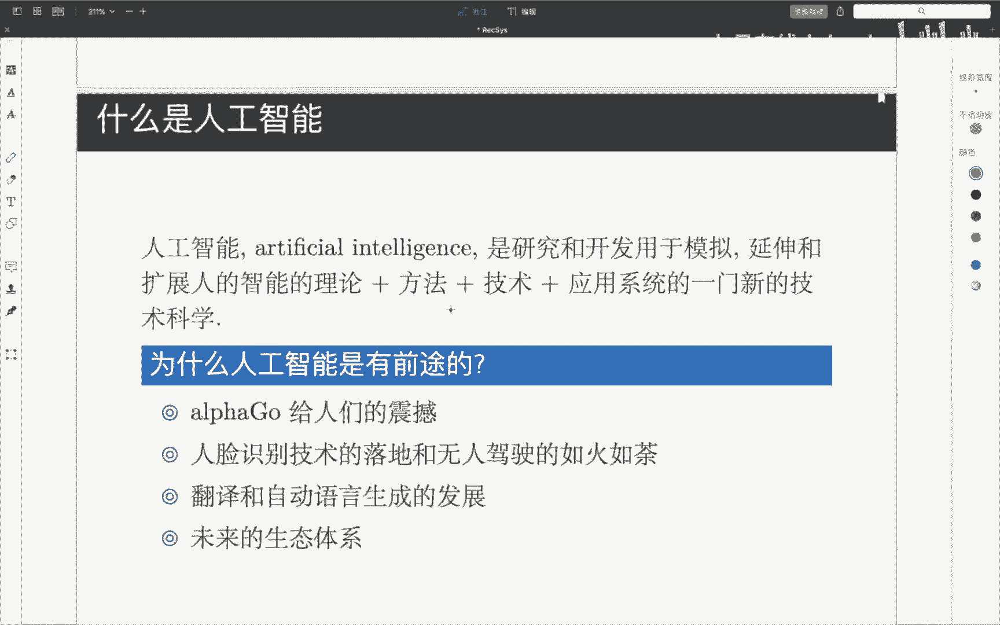

好，那我们开始啊。那个首先跟大家讲一下说什么是人工智能啊。我相信大家就是来听这门课，肯定对人工智能或多或少有一呃有一定的了解，对吧？然后呢，无论是从自己的一些实践，或者说从呃媒体的一些介绍啊。

都应该有过一些了解。那么人工智能是什么呢？这段话是我从百度云网给抄过来的让大家看一下就可以了。那么其实我想分享一下，就是我对人工智能的一些认知啊，然后其实大家也不要去看媒体上吹的那些花里胡哨的一些东西。

其实很多东西我自己感觉都有点夸大其词。但是它人工智能这项领域，它确实是有一定前途的。为什么，我希望从四个点去跟大家去讲。啊，第一个点呢就是说啊阿尔法go给人们就是很大的震撼。

那阿尔法 go其实呃我最开始接触人工智能也是从那个嗯算法的角度去接触的。然后阿尔法购呢算是给普通的呃大众们都逐渐的走入了大家的视野。

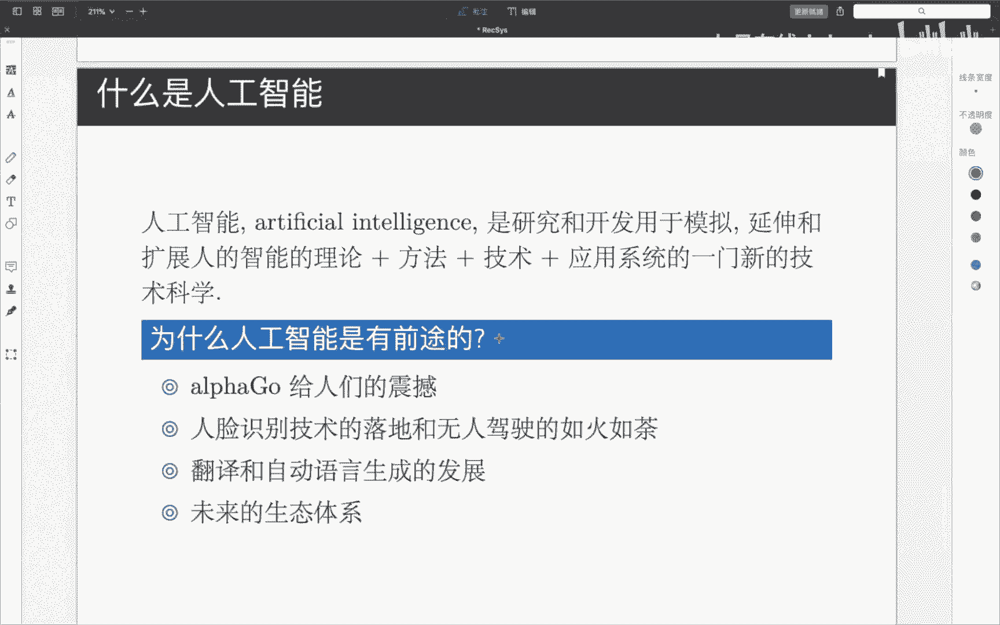

然后因为呃下围棋大家都知道说基本上是很难模拟的。所以说当时他们通过那个呃深度强化学习加蒙特卡罗搜索，把阿排给做出来了以后，然后其实给了很多人一种强烈的震撼。毕竟之前下象棋的呃下国际相机构。

大家已经觉得很厉害了是吧？当然现在都已经可以下星际打dota了，所以说嗯这方面其实未来呃从这个角度讲，它能更多的去模拟人脑它的思维这样一个过程。虽然现在还不行啊，这是第一点。

第二点呢就是说一些呃一些技术，它其实目标呢都是落地，对吧？那么人工智能目前嗯比较大的几个落地点，有一个就是人脸识别技术和无人驾驶啊，这两个呢其实都偏向于像那种啊识别类的这种方向，偏C维的一个方向啊。

然后这个应该大家都知道说有什么摄像头，就拍你的车牌照等等之类这种东西，其实呢都跟这种识别技术是相关的。再下一个呢就是说翻译和自动原生成的一个发展。嗯。

大家应该也能发现说最近这几年呢google他们其实对于这种。嗯翻译嗯的这种嗯有效性啊，以及说可读性啊已经提高了很多很多。所以说就是这些发展，其实背后也是离不开我们这种呃ILP就是自然语处理嗯。

这个领域的它的一个发展。好吧，这是第三点，当然还有很多其他的一些应用。比如说主要的就是我们这堂课想去讲的一个呃推荐这样一个东西。我认为就是根据我的理解，我认为在业界当中，人工智能最主要的三个领域。

就是这里的偏CV类的偏ILP类的和这次偏推荐类的推荐推荐它其实是一个比较大的一个话题。其实呢相当于搜索推荐广告，这三个都比较像。然后呢。

我们一般在业界当中很多的部门也是把他们三个揉到一起来去一起来看好吧，最后一点呢就是说未来的一个生态的一个体系。啊，我们都知道说嗯其实人工智能它带来的并不是它本身这一个岗位。然后呢。

其实很多上下游相关的一个岗位呢，都会有嗯很重要的一个应用。所以说。这个未来的生态呢，是前提也是要你掌握能够掌握说这门的基础知识，然后呢，你才能够说在生态这里呢嗯有一定的了解和发展。好吧，好。

那就是最开始的一个前沿。

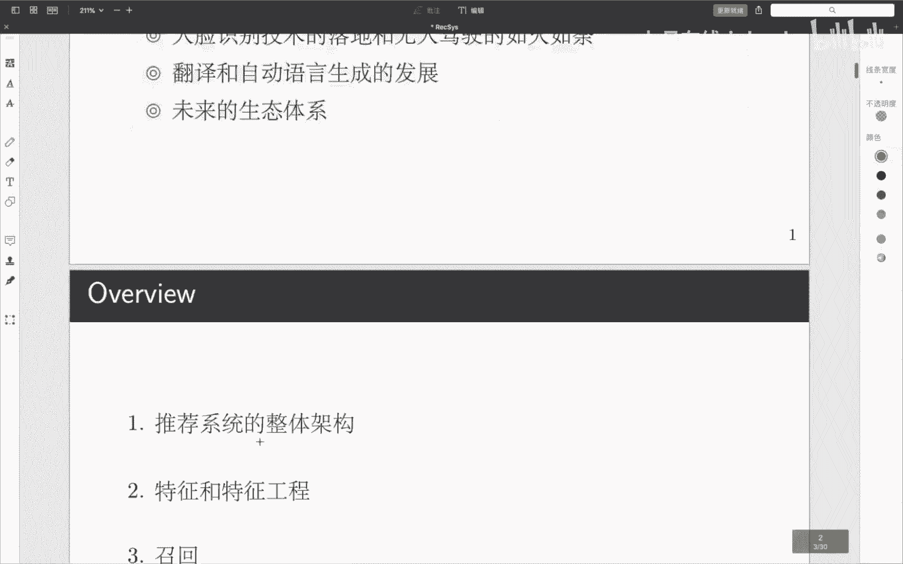

那我们就不多说，我们就开始进入我们的正题部分啊嗯嗯。

首先呢先给大家讲一下一个推荐系统的一个整体的一个架构。这个架构呢嗯这图是我从网上抄的。然后但是这个图基本上反映出来了说呃公司内部的一些网络的一个就是这个推荐系统的一个整体的这样一个情况。

那么它其实有好几层，我们就依次来看，好吧。第一最底下的这层呢，其实是跟离线数据相关的一些数据啊，就大家目前在那个呃公司呃在那个自己去实践的时候呢，如果说没有在业界当中实践过。

其实面向的呃那种离线的数据呢，可能更多的偏向一下什么CSV啊这种类似的TST啊这种数据，对吧？在那在在工业阶当中呢，算ry我关个东西。但是在业绩当中呢，其实啊主肯定不可能这样就数数据方式去存储的嘛。

对吧？所以说业绩当中呢，其实都有一个很成熟的一种呃呃数据的这样一个体系啊，从最源头的基本上都是我们的工程系统在底下都落日志。啊，然后呢它一般呢再会是上游的，通过一些中间层啊。

以及一些业务层啊对它进行消费。啊，然后呢这些其中涉及到了很多技术站啊，比如说说工作系统，他们在落日志的时候，然后呢，是如果说是在实时的一种处理框架。这里比如说这里的话。

它是怎么一步一步的往前去推进过去的。其实相当于一些那种消息率的一种计算。比如说卡不卡。啊，这种消息堆的一种机制啊，这是一个点。第二点呢就是说嗯对于说实时的这种计算而言的话。

我们经常会用一些实时的计算框架，对吧？比如像这里的sstorm啊，这storm以及说sk streaming。然后像flink。这些东西呢其实都是一些实时计算的一些很pular的一些框架，对吧？

他们等他们会怎么去使用呢？等会我们讲特征工程的时候呢，会再提到这里，这里只是先给大家啊抛砖引喻一下，然后下面的话呢，就是说像我们一些离线的一些数据，它基本上存在哪里，对吧？

我们可能就存在说像这种那个fi system里面对吧？等等，以及说have表这种大数据这样一个family以及说像我们在做一些嗯模型的预测的时候呢，我们经常会有一个什么就一个模型的训练，对吧？啊。

以及最终的一个打分。啊，像训练呢它又接触到了很多上下游的一些依赖。比如说它的特征从哪里来？它的label从哪里来？它的打分呢就会接触到说我打分呢也分两个环节，对吧？

比如像我们等会要讲的一个出牌和一个金牌等等之类这些环节，这些呢其实都是在推荐系统中的一些整体的一些架构啊，然后呢，具体的一些重点的，我们等会儿都会慢慢的去进行一些拆解，对吧？然后最上层呢可能有些业务层。

那么业务层，我们在推荐系统当中，嗯经常会有哪些地方会用到我们的推荐系统呢，举体的比较简单的例子，就比如说说大家那个在呃京东东买东西的话，然后你买完东西以后呢，嗯在你的那个结果页上。

也就说其他很多展位上其实都能看到说跟你相似的这些呃东西都是什么啊，比如说你买了一个手机，它可能给你推荐手机壳等等之类一些东西，对吧？这就是一个当然具体的这样例子呢，其实有很多很多，我们就不一个个细讲。

但是呢它基本上也都分为一种最底下的引擎层中间。这种计算层。然后呢，第三层是那种模型的服务层，最上层是最终的业务层，这么几层架构。这个基本上在所有的公司呢都是差不多的，好吧。然后我们再看这一纵。

这一纵的话呢，其实是一个监控层。因为像嗯尤其是像这种ite的这种推荐呢，其实它很多时候跟用户的体验是息息相关的。啊，当我们的模型更新的时候。

我们就要去监控说这个模型的更新是否是满足业务的预期和系统业务的预期的啊，这一般是业务的监控，就比如说说假如说有ABC3个item，然后呢，开始的时候，他们三个是呃均匀的去发，后面呢嗯A发的变多了。

那么你就要去看说A发的变多了，是否是满足你的预期的，对吧？这是一个业务监控，那么系统监控是什么呢？系统监控的话呢，也会去监控说，比如说你这个服务的调用量啊，以及说嗯你现在的这种请求的TPS啊等等之类的。

这些都属于偏我系统监控的一个部分好吧，这些呢都是也是一个系统啊，它比较重要的一个点。好，那关于推荐系统的整体架构呢，我们就暂时先说到这里。然后呢，我们等会儿慢慢去遇到东西的话呢，我们都会去讲。

在本节课的最后呢，我们还会回到这边来再去帮大家再去梳理一下，说我们经过一个多小时的学习，然后呢，又能够对这个张图有一些什么新的了解，好吧。

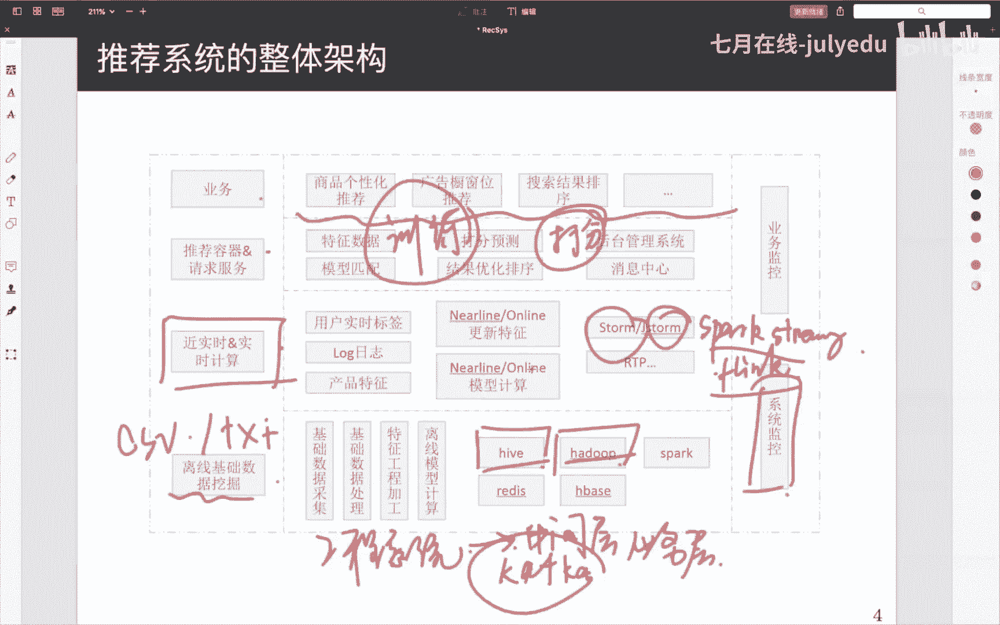

好，大家有问题吗？那个呃推荐系统方向的工程师都有哪些？有算法工程师，有平台研发工程师都需要掌握什么技能。嗯，一般而言我们认为就是嗯我觉得大概有三类吧。我给大家既然有同学这么去问的，我就说一下啊。

第一类的话呢就是平台研发。

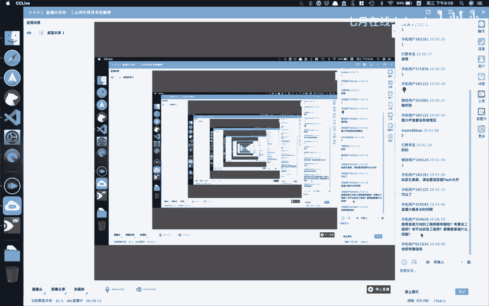

啊，第二类呢是AI系统架构。嗯，第三类呢是纯粹算工程师。嗯嗯其实这三类呢他们嗯都有一定的耦合点，不不能是完全重合的。尤其是这两类，他们的耦合点可能更加多一点。这个平台研发是什么呢？

就比如说一个成熟的业务系统。因为我们的所有的呃呃推荐的都是属于业务的，那么我们一定会有一个业务系统，对吧？啊，就比如说我们一个淘宝，然后呢，大家比如说收银台啊，它就会有一些展位啊。

或者说就是大家一打开了以后进去的那个页面呢，它都会有很多展位，对吧？它背后都有一个业务系统在呈现这些推荐出来的这些讲呃，这些item啊，我们把它称为业务系统，然后呢，AI系统架构，它都包含什么东西呢？

啊，这个包含的话，就比如说像我们刚才所说过的这种model service。就是假如说我训练这个算法工程师呢，他训练出来的一个模型了，然后呢，我需要怎么样去把它部署上线，以及是上线，怎么去对外服务啊。

一般都是业务系统去调用这个model service系统，人mod service系统再返回给这个业务系统等等之类的这是一个点。第二点呢就是系统架构，还包括像那种分布式计算。

就比如说说那种呃老式的那个什么mic克 reduce。以及说亚安管理的方式。你说这两年新起来的那种K8S，就是那个和container的那种方式。啊，这当然这些是偏系统啊部署和运维了。那们式计算的话。

还包括说很多那种实时计算离线计算之类的这些引擎之类的东西，这些都偏向于这种系统架构层。然后呢，最终是算法工程师，就比如说去研发模型，然后去分析数据。

然后以及说呃去自己呃开发一些tle flow的一些功能等等之类的，这些都纯粹的算法工人会做。但其实呢这两部分呢很多时候是要相互合作去做一些事情的。好吧，去回答那个同学的问题。

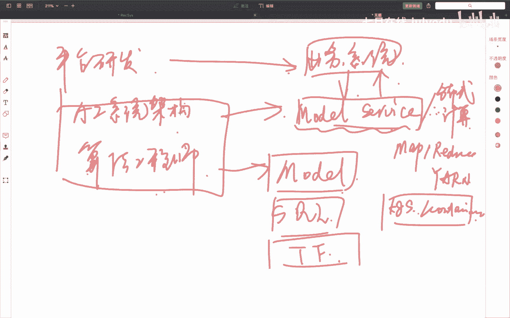

我。spark用的多吗？嗯，sk还好吧，我觉得不同的公司可能有不同的技术站。所以说嗯如果问我spark用的多不多的话呢，呃我也没有办法去回答。我只能说说呃，反正根据我的经验，以及说我的朋友的经验。

反正就是有的公司是用的，有的公司是不用的，好吧。然后scarlar多还是python多，这个其实还好，基本上都是sk的接口嘛。所以说嗯你是用slar还是python，只要你能完成任务。

其实都都可以是吧嗯。

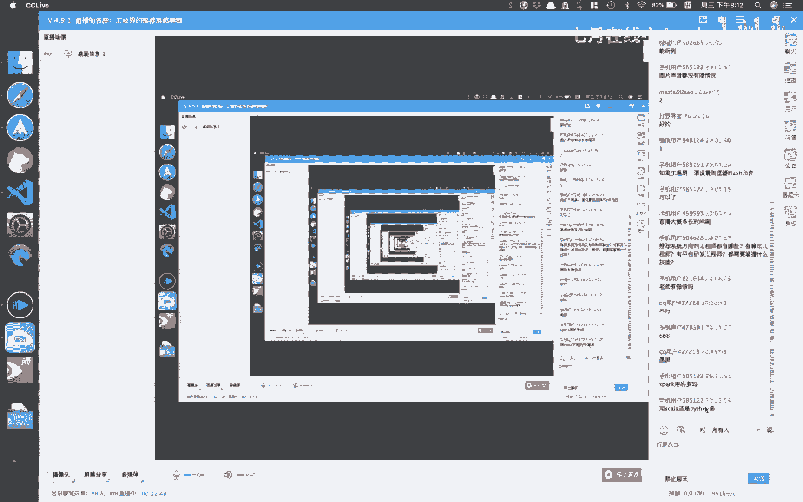

好。那我们继续来讲，大家有问题可以在评论席再去说，好吧。

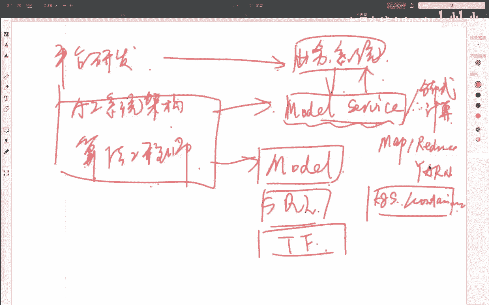

嗯，下一个就是说我们第二部分呢主要来讲一下特征和特征工程。那么讲特征特征工程之前呢，我们首先就要说一个什么叫做一个item，对吧？就好像是一句废话。

但是呢嗯既然说我们的研究对象在推荐系统里面就是一个iteom。那么一定要聊一下说什么是一个iteom啊，item呢一般是只是指一个需要打分的一个个体啊，在搜索当中呢，一般是等待被搜索的个体。

在推荐当中呢，其实就是等待被推荐的一个个体。

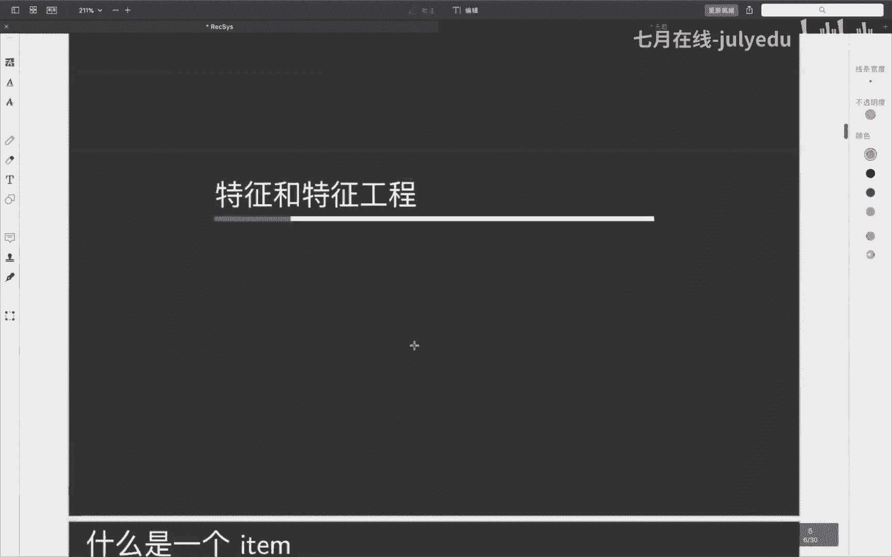

嗯，当然这还是废话，但是在实际的业务当中呢，却往往不是那么简单啊，同一个ite在具有不同属性的时候，到底是不是一个iteom，这是要给大家提一个问题，什么意思呢？就比如说说经常我们这些iteom呢。

它会有一些说嗯一些你怎么把它去归类的这么一个问题啊，就比如说说假如说大家都卖都去卖那个耐克的鞋。对吧然后呢，很可能第一个呢在shop牌ID。一里面第二个呢在上牌ID。2对吧？两个不同的这个商店。

那么我们是说把他们认为已经是不同的item了啊，还是说他们是同一个item，当然是通过shop IDD来对他们进行一些刻画呢。等等这这样的一些问题。其实嗯这个呢也延伸到说我们再去做一些特征工程的时候。

具体能够挖掘出一个item哪方面的一些信息，对吧？就比如说这里所说的一个shop ID呢是其供的一个信息，那可能呢还有一些什么 categoryID啊。等等这类的各种各样的一些信息，对吧？

所以说嗯我们因为我们推荐系统呢最大的目标就说要给不同的人推荐出最合适的一个item。所以说我们肯定是要对这个item刻画的越精确越好。有的时候呢可能说需要把一些比如说这两个呢可能就是说不同的I。

有的时候呢可能就是说他们是同一个iteom ID。但是呢他们在一些属性值上有一些差异，等等之类这些东西啊吧，这些呢是想跟大家说啊，我们对ite的定义，大家都是什么样子的。

我们这这个公开课大概会持续一个半小时，我大概会讲75到80分钟，最后呢还会留10分钟给大家啊最终的一个提问的一个环节，好吧嗯。

好，我们继续。然后我们现在来聊一下iteom特征。那么在iteom当中呢，我们都用过一些什么样的一些特征。第一类呢就是ite的类别啊，刚才其实像我们的这种shop ID啊。啊开过 i d 啊嗯。

其实呢都属于item的类别信息，对吧？完那这些这这一类这些信息呢，其实大家香港人都比较能想到。那我们来多聊一聊第二类信息，就ite的统计类特征。那什么叫ite的统计类特征呢？嗯，我们打个比方。

就比如说说嗯我们在这个呃推荐系统里面有有一些概念啊，我给大家介介绍一下，比如说曝光和点击，这个其实在。

像搜索和广告里面其实都差不太多啊，那么曝光和点击分别指的是什么？就是说我推荐给了你一个iteom啊，然后呢就称为一次曝光。然后呢，你最终是否点击，这嗯就称为一次点击，对吧？啊，但是这一行又是一句废话。

那么这里面呢，我们一般称为曝光不点击的那些label为理由。曝光以后有点击的那些label唯一。好吧，这就是我们在呃推荐系统的二分类里面最常用的一种label的构造方式啊。

当然这不是唯一的这是我们最常用的一种。那么我们经常用到的一种统计类特征是什么？就比如说呃。那呃我们这个ite有多少次曝光？有多少次点击？以及说一个另外一个特征叫CTR啊。CTR的话呢它。

你先把这个公式写完，就cick初页。exposition就是说点击除以曝光就相当于是呃它的全称是click rate，就是一个计算广告里面的一个数语啊，然后呢他意思就是说啊就是一个点击率，对吧？然后呢。

一般而言这个特征呢还是蛮重要的。我当然我们模型最终的预估，就是预估这个东西。我们如果说把这个东西放到模型当中呢，也会帮助我们模型去做一个预估，好吧，这些呢都属于偏统计类的特征。

我们一般都会用到一些像实时计算的一些东西呢，去把它们给算出来，或者说离线计算啊，我们最长的这个呢其实相当于是三个统计类信息，对吧？但是呢我们一般认为说只有这三个还不够。虽然呢我们会把它们做一成扩展。

叫做什么叫做划窗。She。那么什么叫做划窗呢？划窗那些就是说我们像这个东西，它其实是需要有一个时间标度的。就比如说我最近是多久的一个曝光和点击，对吧？因此而言。

我们就会说嗯经常用的一些把它们按照一个时间划窗的位置依次向前滑动。就比如说我们会有啊我们就拿这个啊曝光来说，就比如说最近一小时的一个曝光。

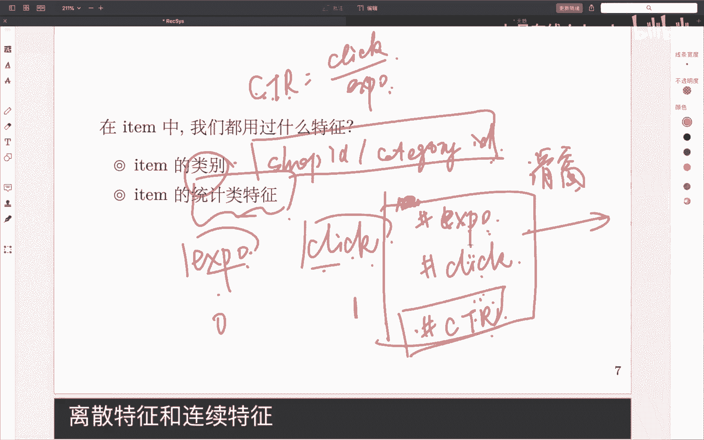

最近3小时的一个保裹。啊，比如说最近12小时的一个包包。这个数据呢是依次向前去滚动的啊，换句话说说嗯，假如说现在呢是8点20，那么这个东西呢就相当于是这个艾特从7点20到8点20的一个曝光次数。

这个呢就以此类推，5点20到8点20。那假如说现在呢我们变成了8点21。那它呢时间呢也要向前有一个跨度，就是7点21到8点21等等之类这些东西。这些呢也是我们最长的一些统计的特征。

同时呢他们又是一列我把它叫做叫做叫做实时特征。

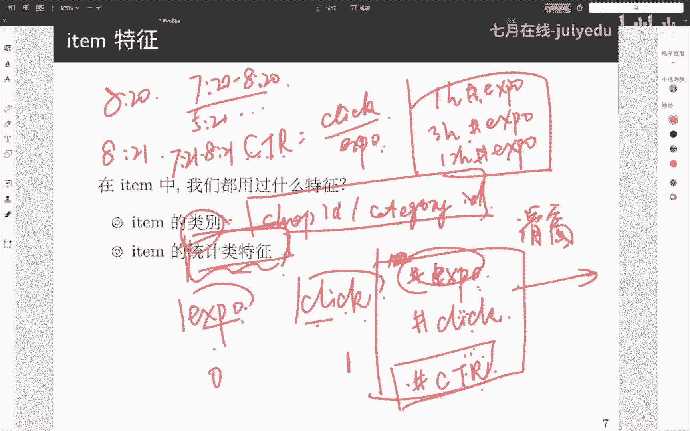

石头扔呢等会我们还会再见到，到时候呢我们会嗯再学多聊两句，好吧，好，这是这里。

好，at套装。

下面呢是离散特征和连续特征。那么为什么我们要区分离散特征和连续特征呢？就是因为说嗯首先这两个特征呢，它们本身表达意义上呢就可能有些区别，典型的离散特征。包括什么，包括想站点。

这种东西性别它它就是一个离线特，它就是一个离散特征，对吧？因为你要么是男性，要么是女性啊，典型的连续作用是什么？就像刚才我们的那些CTR啊，它其实就是一个比较典型的一个连续的特征。

因为大家可以认为这个值是平滑的，你可以在呃0到1之间的任何一个取值，对吧？那么其实很多特征呢，他们没有一个特别清晰的一个概念，你作为dance还是一个spae。比如这个CTR。

再比如说我们经常说的这个age，就是这个年龄。

它其实呢就是一个既能当spas特征，又能当dance特征的一个特征。为什么这么说呢？是因为说我们可以把它当做dance特征，直接说比如说你是20岁，那你就dance类的值就是20就okK。

那你也可以把它当做spae特征去用，怎么用呢？就比如说我们以是每10岁作为一个标度。比如说在11到20岁啊，算是一组，21岁到30岁，算是一组等等之类的。我们把这种过程叫做什么叫做分头。

叫做bucket，对吧？那这种分筒呢，其实大家如果熟悉特征工程的话呢，应该知道说分筒是一个特别常用的把特征从dance特征转到spas特征的这样一种方式啊。那么就我们说到的离散和连续的一个相互转化啊。

从呃连续到离散的一种简单的做法呢，就是通过一个buet的一个方式。从离散到连续呢？我们通过什么方式呢？一般是通过inbedding的这样的方式。啊，什么叫inbed呢？

这个等会儿我们在讲模型的时候会讲到啊，这个我们也是等会儿再说啊。然后呢，最后呢说一下离散特征和连续特征的一个特点啊，这个特点是什么呢？就是说嗯它之所以会有这两种特征，并且有时候会相互转化。

那么我们经常需要面临的一个问题呢？就是说啊我们什么时候选择离散特征，什么选择连续特征啊，这个呢其实很多时候是跟模型相关的。我举两个例子，就比如说像LR。

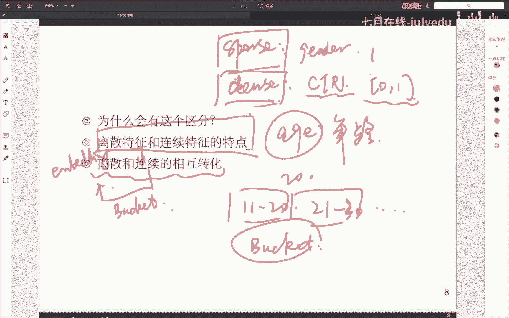

这种线性类线性类模型。啊，他们呢都比较喜欢用什么样的特征呢？他们都比较喜欢用连续呃离散特征。然后呢像那种啊呃呃呃那个GBDT这种数模型，他们呢都比较喜欢用dense类的特征。

原因呢是因为LR它对特征的值呢变化波动呢特别的敏感。然后呢，以及说嗯因为它是一个线性模型，所以说。Y等于贝塔X的时候，当你X上升了一个单位，那么你的Y呢一定上升了一个贝塔这么多的一个单位，对吧？

那么很多时候这样做是不一定合理的。所以说我们就需要把它给spae化，使得说特征之间的变化，不会相互影响。你说LR它本身对特征的敏感度要降低。这是LR为什么偏向于spae类的特征。

而GBT为什么要偏向于d类特征呢？其实GBTT在进行数的分裂的时候，它要进行搜索。那么如果说它要进行啊se类的搜索的话，它的搜有空间会过于庞大。而dense类的话呢，我们可以通过一些呃。

近似值以一些呃特殊的一些，比如说取百分位的一些操作去降低我们的搜索空间的复杂度。所以说GBDT比较喜欢这种dense类的特征，好吧，这是我们离散特征和连续特征的一个特点啊。

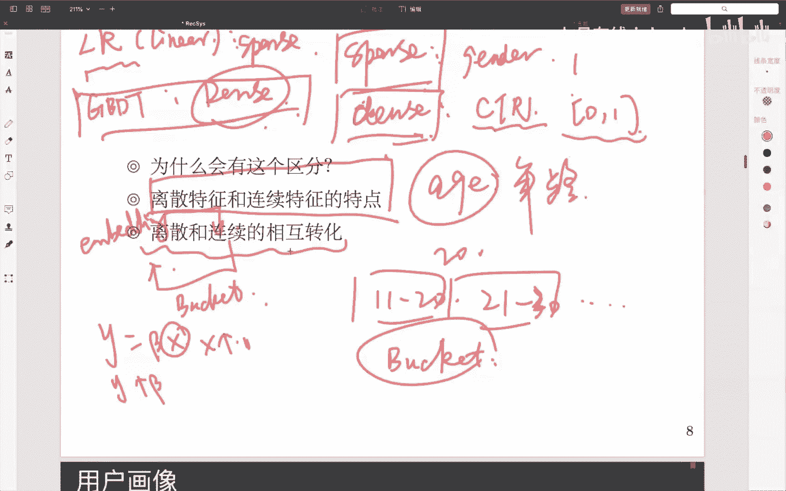

好，我看大家有没有什么问题。🤧She。啊。AI系AI系统架构和算法功能主要什么语言？这个A系统架构的话呢，基本上嗯比较常用的是java和C加加啊，算法工程师的话呢比较常用的是嗯python和C加加。

我是这么理解的。然后spark的模型上线比较困难啊，对，要导出pamo在java里面加载。但是这种service其实嗯也是可以做的。只是说它这个效率可能没有像C加加写的一些serving效率那么高啊。

热度排序属于排序的领域吗？我不太清楚你这个热度排序是什么？是不是像比如说像新浪微博里面的这种嗯这种就比如说那种呃热搜这样一种概念。如果是这个的话呢。

我理解有的时候可能会有一些排序的因素在有的时候可能没有啊，他什么时候会有呢，他有的时候就比如说说嗯给每一个人一个个性化的一个热搜，然后我看到的热搜和你看到的热搜不一样的时候啊这个。嗯。

这个就是一个个性化的。但有很多时候可能就是一个就是一个top chance，就是反正谁被搜索的数量大，那么谁就放到第一位。啊，这就这个时候可能就是纯粹的一种嗯简单的排序规则啊，它没有嗯一个算法在里面。

好吧嗯。好，然后想知道说模型训练的数据流是怎样的，have到spark到探or flow嗯。这个可能也是不同公司不太一样。像我们公司的话呢，主要就是have里面去处理各种数据。处理完了以后。

其实就已经可以放到tflow里面进行消费了，对吧？其实也不太需要sk中间嗯再差异到了。但有的公司确实也用spark。所以说嗯还是看公司的技术站吧。我觉得。然后PPTPPT等会会发的，好吧。嗯。

然后那个呃分筒有哪些方法嗯，分筒的话呢嗯。

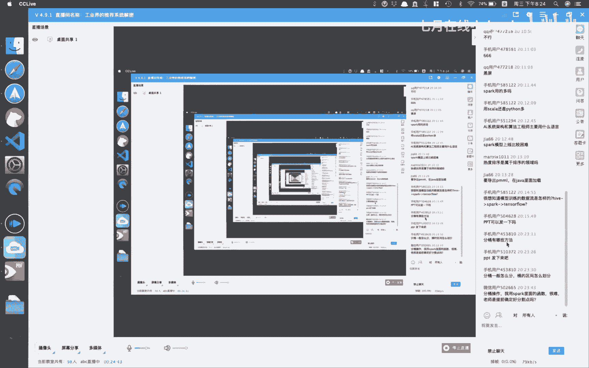

我再举两个方案吧。

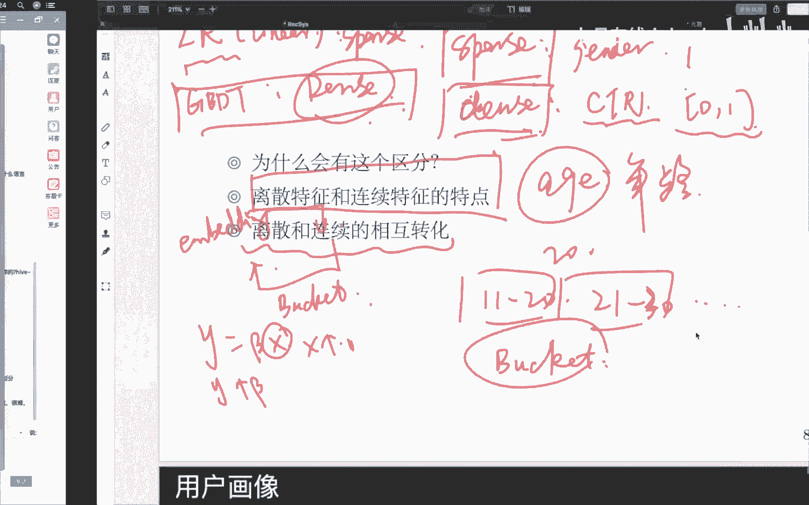

啊，第一个方法呃，这种方法分别是人工分头和自动分头。啊，我们先说人工分头啊，人工分头啊基本上是呃利用统计信息分头。啊，信息分头啊，这是什么意思呢？就最长的一种呢，就比如说说我们又回到说我们。

最喜欢说的这个年龄这个特征啊，然后呢他可以做到一个就是呃比如说按照这也有两种方式，一个是按照人的理解去进行分头。你写到这儿。就比如说我们人呢可能就比如说像这种呃呃30岁啊、40岁啊、50岁啊。

我们认为人他就到了一个年龄段的一个变化的一个范畴，是吧？所以说呢我们就可以比如说呃0到9岁、10到19岁等等之类的，这是一种通过人为的理解的方式进行分桶啊。

这个其实就不太像是统计信息了啊另外一种方式呢是通过那个呃分位数。那那什么叫做通过分位数进行分头呢？分进行分的话，就可能比如说说我们要进行一个特征的一个统计，对吧？

就比如说说那个我们可能就是0到10的过这个呢分为一统10到到20进行分吧？相当于就是10个分位数啊，每个都是10分之1的分位数拿它作为分桶的依据进行分桶好吧。

这些呢都是人工分桶人工分的好处和劣势都很明显好处呢就是说嗯会融入一些人的先验知识在里面啊，以及说统计一些信息呢，基本上有的是有的时候其实都够用啊。

但是它有不太好的地方不太好的地方呢就是说这个分这个分桶方法过于很可能说对于模型的训练结果不一定有效。那么我们就引入第二种方案叫做自动分自动分的话，我们一般就会使用GBT加LR的这种方式进行分桶。

什么意思呢？其实就是通过GBTT分对吧？那么我不知道大家。有没有了解过像这样GPT加R的这样一种模型的这样一种结构啊，GPT加LR呢它其实就是。Yeah。嗯。我想一下怎么画。这个GPT就是数嘛，对吧？

我们就画两棵树就好了，这个意思到了就可以了。然后这两棵树呢嗯我们也各自做各自的那个预测功能，对吧？那么很有可能说第一棵树呢，它顺着这个路径呢啊到了这里，就是这个点呢被我们这个叶节点被我们选到了。

这里呢是这个叶子节点呢，被我们选到了，对吧？那么我们如果说对这些叶子眼进行编号呢，那么它就变成了呃12345678，对吧？相当于第二个叶子节点和第八个叶节点呢被我们选中了，因此而言。

我们这个序列呢就可以被。这样这样相当于是什么？相当于是一种另外一种特征编码的方式表示成了01000001，对吧？这个它大家看到可能是说它是一种呃编码的方式。但它其实呢隐含的是什么？是一种分桶的一种方式。

为什么这么说呢？是因为在数模型当中，每一次在进行呃我们这个呃特征的分裂的时候呢，其实暗含的就是一种分筒。就比如这里呢我们就是拿年龄进行分裂的。它可能说这里呢就是年龄。小于等于20岁。

这年就是年龄大于20岁，对吧？那通过这里进行分层了以后呢，在这里假如说这里呢在比如说是你的那个income。假如说是大于50啊，大于5万吧啊，这样的话呢，这个点其实什么？

相当于就是拿年龄小点20和income。大于5万做的一个交叉，对吧？因此而言，它相当于是利用了这种分桶。这边呢很可能这里运用另外一种分桶，比如说H是什么大于70等等之类的。

这样呢其实就也是不同的分桶这样一个概念，好吧。

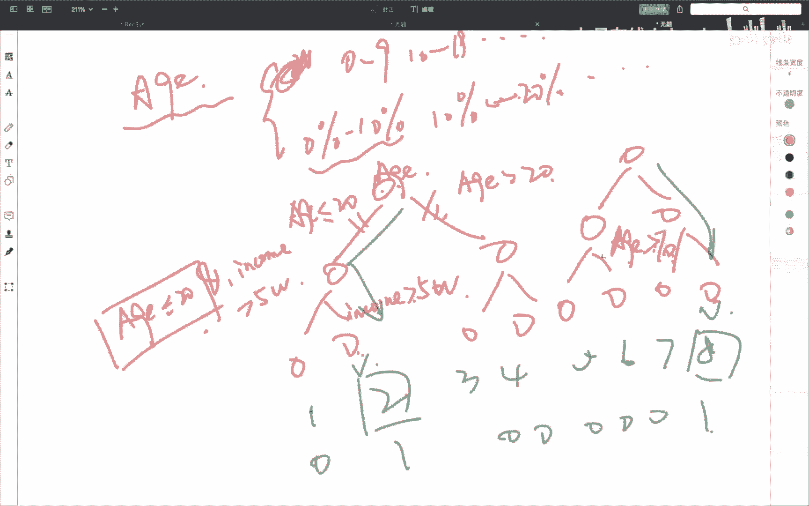

就是这里。Yeah。那。这个说过了是吧，然后sk里面的函数很难会提前确定好分割点嘛，一般都是要提前确定好的。嗯，反正我们公司在用的时候呢，都是要如果要用的话呢。要提前确定好数据统计。

因为这个东西其实不是那么那么简单的好用。原因在于什么？原因在于说说呃这个数据呢你我们考两种情况，一个是离线离线状态下，一个是在线状态下啊，在离线状态下呢。

我们这个数据呢很就是你要分统你要说这种分位数的统计呃，做统计的时候，那你就需要说全局进行统计，对吧？嗯，或者说你进行采样统计这种方式，那在在线的状态下呢，你要对在线数据进行分。

因为数据的它那个分布是在实时进行变化的对吧？你采样可能是说对这个P做了一个呃对就是流式计算中的这一个批次做的这样一个计算，到下一个批次很可能就不适用了，所以说很可能。这个还挺麻烦的，好吧。

代码库可以分享过。嗯，你想要什么样的代码库，你这样一句话不太知道怎么回答你啊嗯。😊，实时特征的训练现在状态是存在一个实时特征，然后曝光发生品就是去储存查询这个特征，生成离线的样本。

攒过7天就可以开始训练了。那比较快的话，可以不用攒7天数据，当天就可以回溯出之前的实时特征，当天就可以开始训练。我不太明白你为什么你要攒7天才能开始训练的。嗯，我们一般训练的时间是会延迟。

但延迟呢都是延迟一个样本周期嗯，什么叫一个样本周期呢？就比如说说嗯像我们这种嗯推荐搜索里面的推荐搜索广告里面的这些样本呢，其实实效性都很强的，就打比方说百度给你推荐的一个广告，对吧？

那你不可能说说啊给你推荐一个以后，你现在你看到了，但你不点等过了一个小时再去点对吧？基本上你一两分钟之内该点就点，不该点的话，你就去干别的事情去了啊。嗯这样的话，几乎覆盖了99%以上的场景。

那么当天的数据基本上就可以直接拿它训练。甚至于说当。🤧的数据2分钟以后就可以拿来训练，对吧？这也是。不好意思，这也是我们呃省赞学项技术的所在是吧？嗯，GPTT工业一般使用叉Gbo的和赖GBM好吧。

后面怎么讲协同过滤，后面是会讲协同过滤的。然后。chgebo并不能控制这这这这些细节类的信息我就不回答了，好吧。😊，这这个分筒的我刚才说了，就是GBDT它本来有这种特征组合这样一种概念。

但是它隐含的是对特征一种重编码，也有一种分桶的一个概念，好吧嗯。需要学一些什么样的一些LRM的一些呃MIO的一些算法呢？啊，算法的话呢，等会我们会提到一些离线的一些算法和一些。

会及到一些传统级忆学算法和目前比较p的一些深度学的一些算法。好吧，离线的一些算法呢，就比如说像我们这种LR啊，就是比较经典的一些算法，还有兽模型深度学习算法呢就是以DN这个家族等我们也会提一些，好吧。

类似比赛常用的深特征工厂的一些代码库。这个问题不太知道怎么回答。呃，你可以先去看看SK2好吧。先行样本聚队，然后将连续特征嗯转化为呃离散特征，可以吗？嗯。先进行样本聚类，然后再将联续特征者害离散特征。

你可以说一下你这样做的一个意义在于什么吗？其实我不是特别的理解。然后。大家比较热情啊，我有一个问题可能回答不完了，我得快点回答，不然等会我要讲不完了啊，离线训练非实时训练，实时离线训练实时特征。

离线训实时特征是没有问题的。像你刚才做那种方式呢，我们业界有一个专有名词叫做特征快照。就是你当时打分的时候用到什么特征呢？嗯，你就直接落下来拿来去做训练，这样的话不会有特征的不一致性啊。

工资新上一个模型，CTR涨了，但是和CTR正相关的另一个目标降了，这个该怎么办呢？这没办法了，这个要看你们业务诉求啊，就是谁比较重要是吧嗯。工业技目前用的大部分还是LR吧，深度学习用的不是那么普及。

我觉得还挺普及的，就是因为。LR是前几年的一个主流的深度战技术战。其实这两年呢大部分公司都开始逐渐往深度学习进行迁移了。因为深度学习以tenflow为基础的一套啊整个一个环境呢。

目前呃生态环境目前已经做的越来越好了。好吧，包括像tenflow的一些呃训练呀，一些serving啊，其实都越来越好了啊。

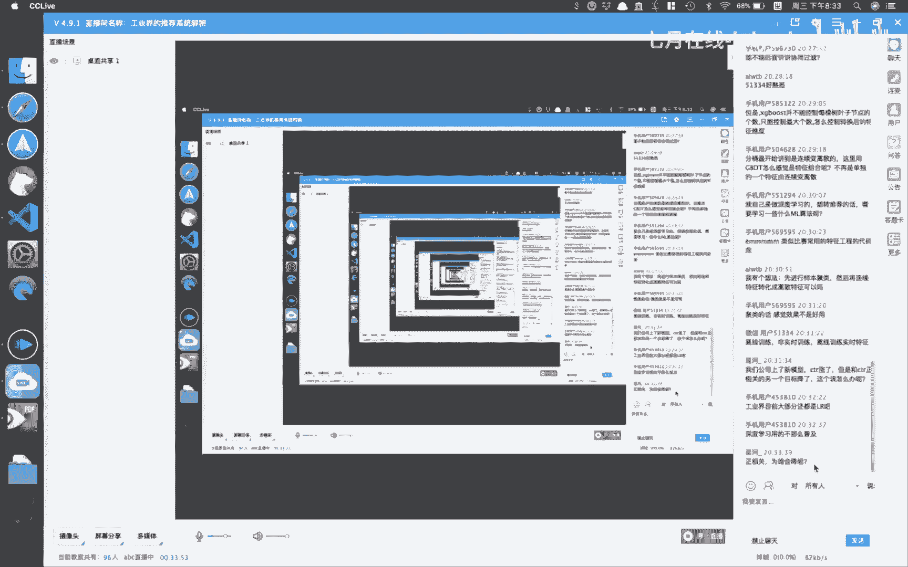

Okay。好，那我们继续。

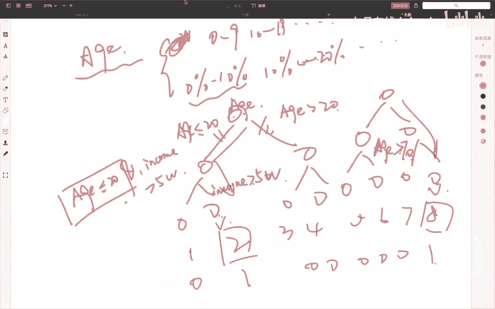

下面呢就是说用户画像啊，这个呢其实呃也是说想跟大家去聊一下，说我们做一个用户建模的话呢，一般都会有一些需要一些什么样的一些用户特征，对吧？这些呢嗯像这个大家就大概看一下就行了。心里有一个数。

就比如说我们有一些基本的特征，像什么年龄性别等等这类一些东西，社会身份类特征。然后呢，这个呢是用户生命周期类特征。这个呢其实是跟公司场景是强相关的啊，就比如说说我们经常会提到一些概念。

比如像什么端活这种东西，就比如说说在我们京东的这样一个客户端，我们用户一些活跃度等这类这些都属于生命周期的特征。生命周期特征呢，一般都跟场景强相关。意思就是说很可能说你在这个场景。

比如京东假如说它有两个阵地啊，就比如说有一个会员阵地和一个普通阵地，那么他就会去统计说你在会员业的这样一个生命周，用户的生命周期，可以在普通页面一些生命周期等等之类的。这些呢共不同的场景建模进行使用。

好吧。类目偏好呢，这些呃这个有可能一般而言嗯像这些偏好呢，因为用户很少会显示的告诉说说那个我喜欢这类的东西，所以这些一般都是通过说用户的一些行为进行一些建模，对吧？就比如说呃你是否是一个吃货。

比如说看你这个买的吃的东西，啊，在你这个总共的买的这些所有的物品当中这样的一个比例等等之类这些东西。然后呢，一般可能还会有一些人为的标注。然后呢，对于那些呃没有呃去那个在我们这个app上活跃很高的人呢。

也可以通过一些模型呢去预测说你的这样一些偏好的一个特征，好吧，然后呢。

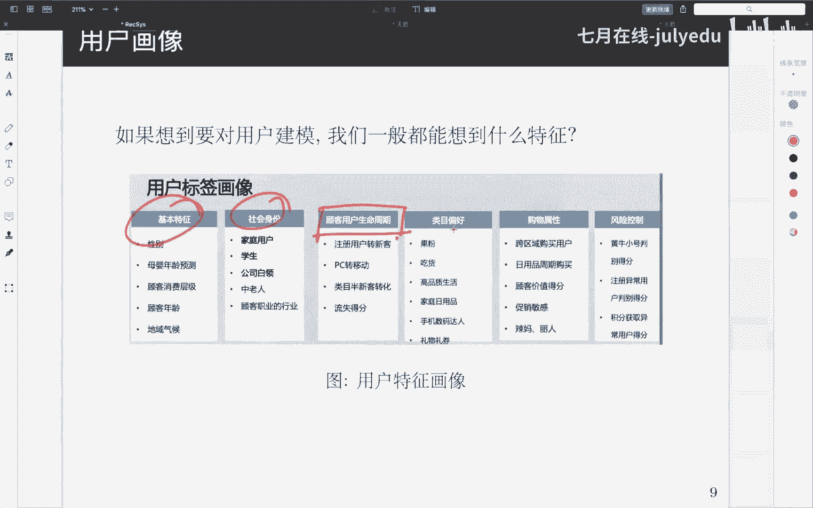

这些其实也差不多啊等等之类的。这个大家可以去了解一下。好，我们继续。然后呢，下面就是用户的特征一些挖掘啊，其实很多时候呢我们大家应该都知道说算程师呢其实就是在去挖掘啊。

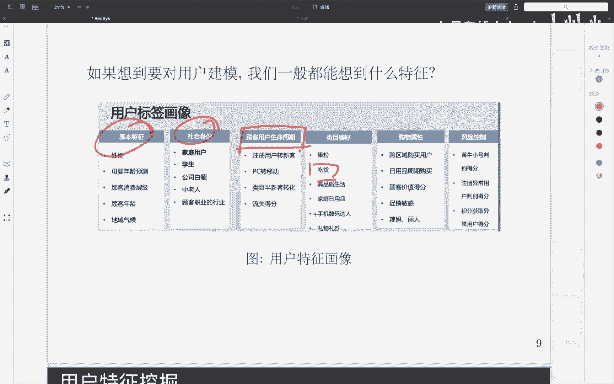

去探索特征。嗯。我们这个挖掘和探索方争呢，其实要来源于很多方面啊，这里想跟大家去聊的一个方面呢，就是说你拥有其实呢是嗯对于说对于目标的一个管理。以及说对于买点数据的。理解。嗯，什么意思呢？

就是说我们先说后一个对于买点数据一个理解。因为在业绩当中呢，很多数据的时候。大部分都是说你要通过说原始的系统去拿一个东西。打比方说说现在呢我们新开辟的一个场景。那么我去建模的时候呢，我发我通过数据统计。

然后比如说一些热力图，一些数据统计，我发现说哎这个用户只要在这个点待着。然后呢，他最终对于我们这个这个这类用户呢都有一类什么样类似的一个行为。但是呢这个用户在这个点，这个数据我拿不到。

那可能说我就需要说让前端帮我去买一些这样的一些买点。你就说我要自己去深入到这个数据背后的那个系统当中呢去提些什么需求之类的东西。然后呢，能够把这些数据落出来等等之类的。

这些呢都是需要说用我们的算法工程师对于呃业务呢要特别的理解，因此而能才能做到说说我们能够把这个特征挖掘的呃，很清晰很透彻很全面，好吧，就是想说这一点。另外一点呢就是目标管理。这个目标管理是什么意思呢？

我们知道说我们深度学习呃，我们的机忆学习呢其实很重要的一个部分呢，就是怎么去设计我们这样一个lo方。对吧那么以及说对应的这个label啊，很多时候呢我们去设计这个问题呢，不像大家想象的那么简单。

就是说我们这个label呢显而易见的就能去设计出来。我打一个比方，就假如说运营啊，有这么一个诉求，就是说我要想优化啊我们这个呃比如说京东这个客户端的这样1个DAU。这就是一个很大很空的一个话题。

因为DAU这个东西呢，你很难直接通过零1进行建模。嗯，有的同学可能会想到说说可以，比如说按照你今天登录的就是零，您今天没登录就是一啊，呃呃这个说法，今天登录的就是一，没登录就是0。那这样来进行建模。

但是这个呢其实有很多问题啊。第一个就是那这个偶然性其实很大的。然后呢，用户没来登录，其实这个不代表说它对于你这个app不感兴趣，对吧？这是一个点，另外还有很多别的点，就比如说嗯你这样一建模的话。

你的样本你。你的样本和它的实际的关联性也不一定有很大啊，一般呢我们都会说想办法把这些问题呢转化成一些跟业务场景相关的一些问题呢进行建模。好吧，嗯，就比如说说我京东可能说我去发一个优惠券。

那么我们通过优惠券这个方式呢去提升我们这样一个啊app的这样一个日活，对吧？那么你只要用了这个优惠券呢，你肯定得来我这进行消费等等之类这些。然后呢，我们就拿这个优惠券是否更实用啊。

作为说我们这样一个灵1啊来优化我们这个app的这样一个日活等等之类的。我就举举一个例子，很多时候呢业务场景问题要比这个要复杂的多。如何呢进行特征和内部的这些挖掘呢，其实是蛮重要的。好吧。

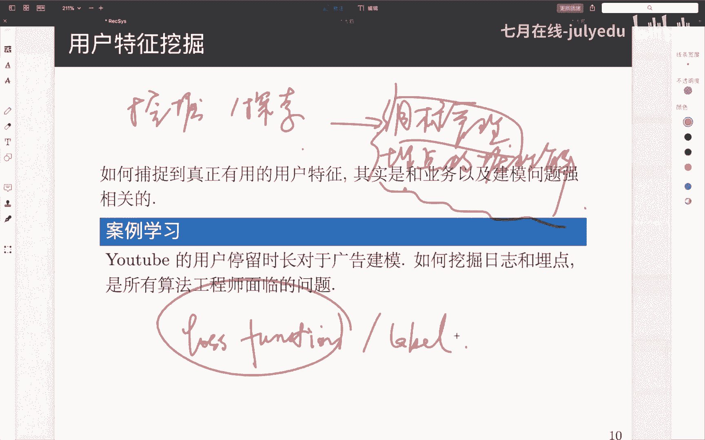

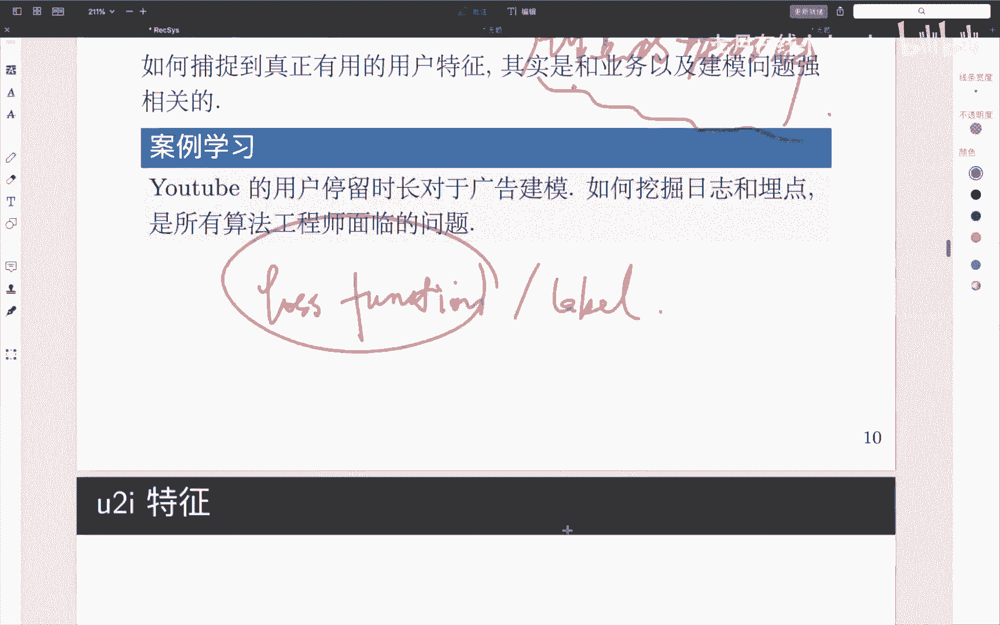

嗯，下面呢就是我们要介绍一个另外一种类型的特征，就叫U toI特征。那么什么叫U toI特征呢？U toI特征的话呢，基本上是属于那种user和item的一些交叉类特征。

比如说说嗯假设我们有两个user，分别是U一和U2，然后两个ite分别是I一和I2。对吧那一个UI特征呢，就比如说说U一有没有浏览过IE啊，呃就是这个user是否浏浏览过这个iteom，对吧？

那这样的话呢，我们就可以看到说这个user它是否浏览过这个IE啊，它是否浏览过这个I2啊，对吧？那么每一个user呢它都会有多少个U toI特征呢，它都会有2个UI特征，对吧？

就相当于是你的UIE特征和你的UI2特征等等之类的这些。这些呢就是U toy特征。你说常见的UtuI特征呢，就像说这个用户他是否浏览过这个iteom，你说这个用户浏览这个iteom的次数。

再加上说刚才我们所说的那种划窗类统计等等之类的，这些都是一些比较常见的一些U toI特征的那些过造方式，好吧。那么最后一个问题呢，就是。U to I特征和特征交叉有一个什么样的一个区别，对吧？

那么U to I特征和特征交叉有什么样的区别呢？我这里的理解就是说呃U to I特征呢更多是强调说一个说user和item的一些交叉。而我们平常所讲的特征交叉呢。

大部分都是说这个user之间内部的一些特征交叉。就比如说像什么年龄和你的收入的一个交叉呀等等之类这些交叉。好吧，像U to I的这种交叉呢，一般跟场景的信号呢，可能相对而言更强一点。

所以说如何合理的去构造U to I特征其实也是很重要的一个点。好，这里是云开特征。

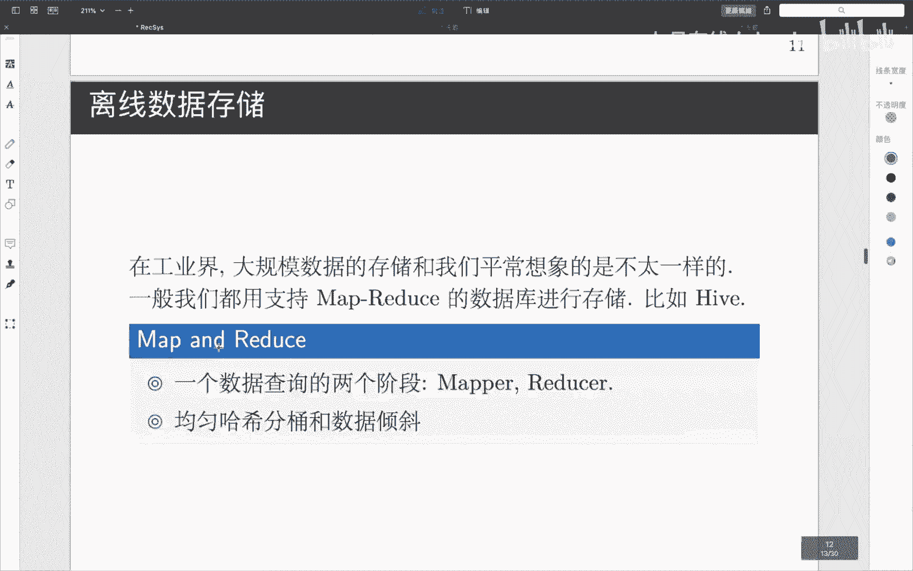

啊，时间关系呢，这个离线数据存储和在线数据存储，这里我就不讲了，我直接跳到下一个步骤，不然的话等会肯定是讲不完了啊，我现在都怕我讲不完了啊，然后我们就这个东西的话呢，可以大家自己离线学呃。

课下再去学习一下。

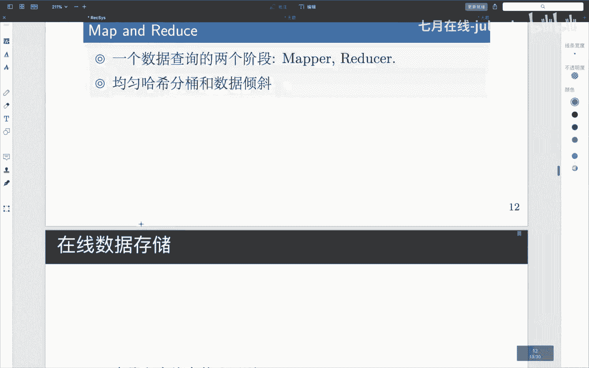

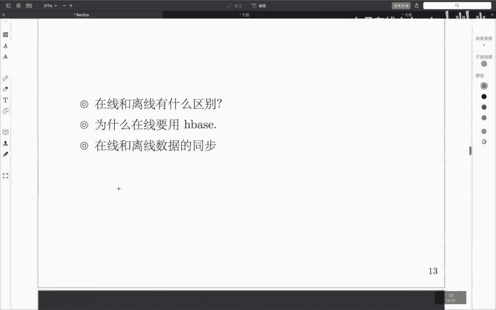

我们讲第二个部分召回。And。然后。嗯，mo lens数据集有图片信息吗？minus这个数据机果好久不用了。这个如果下面有同学比较了解话呢，可以帮忙回答一下。好吧，我不太记得。

然后说呃某个年龄段内的样本大概率是一类，然后呢先聚类，然后看这类样本中某个特征的取取范围啊，然后呢再根据这个范围边界进行分头。嗯这作其实也可以，但是你都已经聚类了。

那其实有的时候也不一定再需要后续一些做法。因为聚类这个操作，很多时候是挺消耗资源的，像一些常用的这类算法，比如说嗯。那种像呃那个那个KNN这这种类型的呃呃不是KKmiss这种剧类算法呢。

很多时候时间复杂度都很高啊，好吧，就是说工业界当中呢，对于剧类的需求呢，其实很多时候嗯也不太好弄。然后怎么表征用户的一个实时兴趣？表征用户实时兴趣的话呢，就可能说说嗯打个比方。

一般都是说看这个用户呃呃我们拿一个具体场景来说吧，就比如说说我们在这样一个信息流推荐当中啊，比如说你在今日头条上去看一个信息流，看一个东西，对吧？那假如说今天呢呃新闻呢全都是新冠肺炎。

然后呢你疯狂的在那点击新冠肺炎这个东西，那么就其实我们背后就可以统计到说你对这个新冠肺炎的这样一些创征呢这样一些呃标签类的东西呢都比较感兴趣，对吧？这样就挖掘到你的实时的这样一些兴趣啊。

所以说我们一般都是通过一个你最近所浏览，或者说点击的这些iteom呢去进行挖掘啊。嗯，这个不好说，好吧。然后user和item的一些交叉特征啊，维度太高，怎么进行处理啊，这个交叉特征的话呢。

我们一般都会把他们最终再给呃我我我拿一个深度学用尽量用的一个方法，就是你可能会交叉很多，对吧？但是没有关系，我们呢都是在深度学习当中呢。

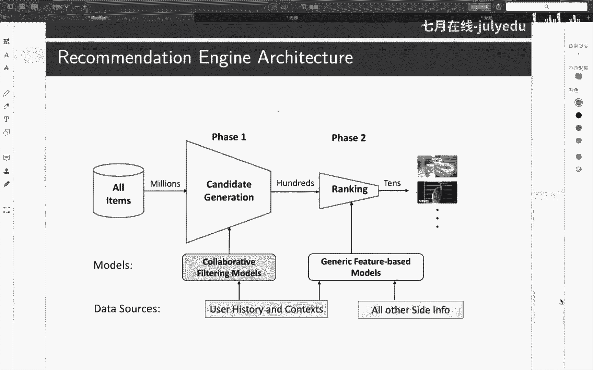

这是我们一个深度学习一个框架，对吧？然后呢嗯我们一般呢都会在一个深度学习当中呢，像这些呢你这个特征维度可能很多，假如可能是10万维这么多呢，虽然都会通过一个inbeddding层。嗯。

把它变成一个很低的一个维度，可能这里呢就变成了9256维了。好吧？所以说嗯这个其实还好。嗯，像嗯在那种大场景的那种s的推荐场景的话呢，基本上特征的维度都是特别特别夸张的，都是上千万维上亿维的。

所以说嗯其实这个不是一个问题啊。

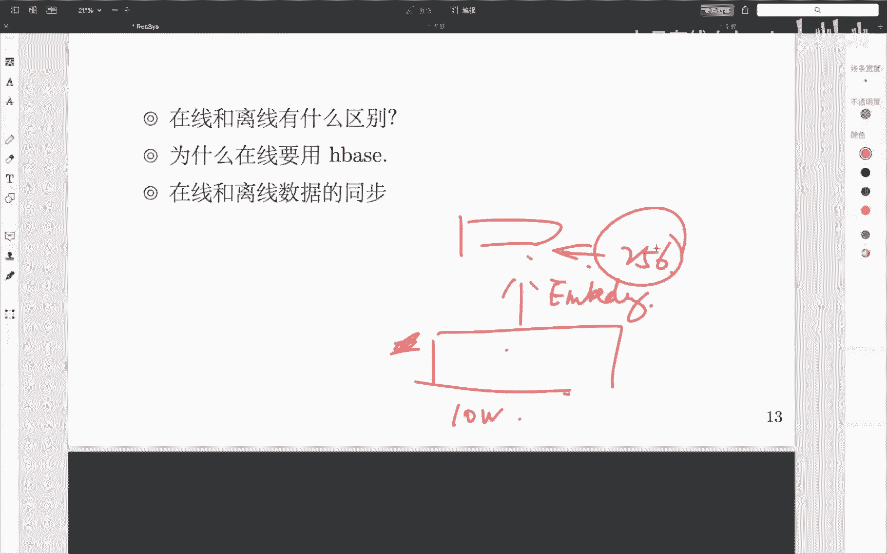

好，那我们继续来讲。

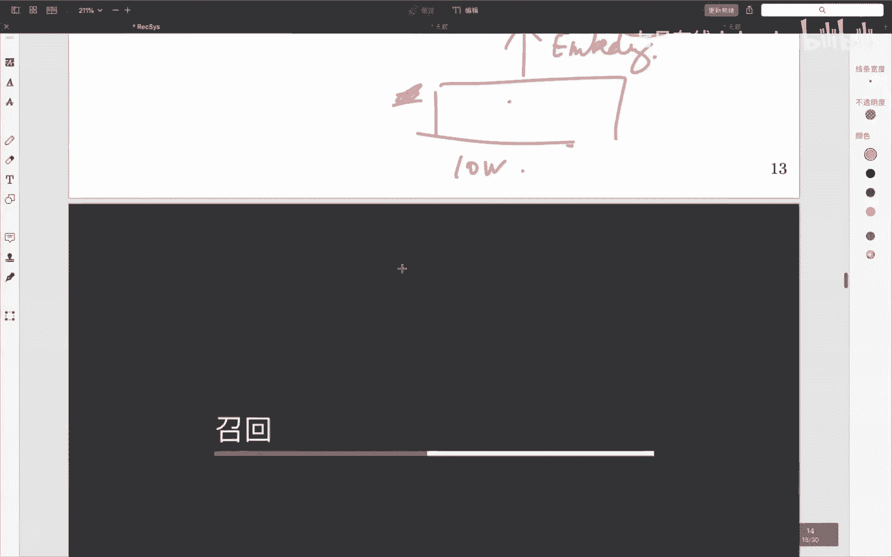

下一个板块呢想跟大家分享的是召回啊，召回这里呢呃常用的呢这我们先说一个整个的这样一个呃。recommendation就是一个推荐呃推荐系统这样一个引擎的这样一个架构。刚才呢我们说过说。

其实呢我们就是有两个部分，一个部分呢就是说我们这样一个金牌。另外一个部分呢就是我们这样的一个召回，召回在前，金牌在后。那么他们分别有什么样的区别呢？召回呢。

一般都是说是从我们这样一个海量级的这样一个ite当中呢，把它们给它弹到很少的这样一个特呃嗯就是那个需要排序的item的这样一个维度。比如说很可能就是十的8次方这么多维，就18次方是1亿，对吧？

这么多个iteom给它变成很少。比如说十的3次方，1000个ite，这个做法呢？一般就是召回。啊，召回他的目标，他大家可以发到发现说它既然是从一个很大量的数字变成一个相对来比较小的一个数字。

所以说呢这里呢一般复杂度呢都比较低。他有这样一个特点，复杂度模型复杂度比较低，然后呢要快速。并且说特征也相对比较少，以及说很可能是一些业务规则。和模型。共同使用的这样一些方式。好吧，这里呢就是召回。

第二个呢就是我们这样等会要讲的这样一个金牌。那么金牌呢，它其实就是从10个3次方个ite里面呢，可能就会选择比如说top10出去啊。这个时候呢，因为10个3次方呢量级已经很少了。

我们就可以把这10个3次方这么多个iteom呢全都进行打分啊，然后呢最终从高到低往的那种台。然后可能就是一个很复杂的一个深度学习模型，有好几层网络啊，我们的这样一个特征呢。

很可能也真的变成了那种上呃10亿位呃10亿位啊，10亿维啊这种东西都是有可能的。好吧就是这里。然后呢，这也说了我们这样一些models。这个models呢在这种呃我们的召回场景中呢比较长的。

就比如像这种协同过滤类的啊，就是我们召回当中经常会用到的一些东西啊，以及说经常会用一些其他的求距离的这样方式啊，然后呢这个呢其实嗯是。这个大家就不用看了，反正就是一些比较复杂的一些模型。好吧。

我问大一下，有有人知道我这个图是哪来的吗？如果有人知道的话，可以在那个评论区回答一下，好吧。然后最后一点就是呃data sources，这个呢其实想跟大家聊，有一个点就叫contexts。

contex呢是一类特殊的特征。我们一般叫他们为什么，叫他们为上下文特征。

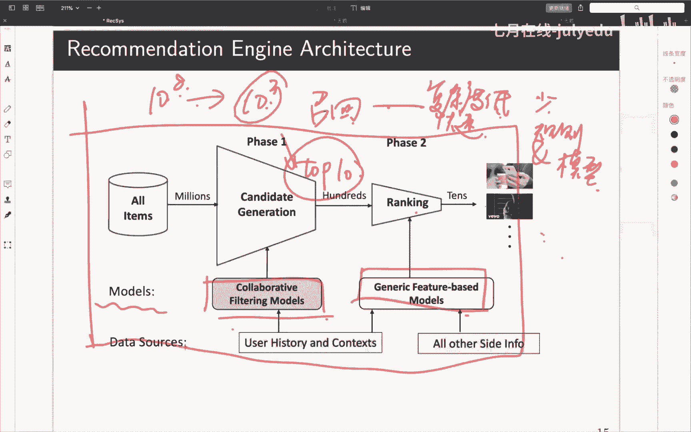

什么叫做上下维特？上下文特征呢？上下文特征指的是一般是在这个系统的实施状态下能拿到那种特征。之前你不知道的那种信息。打个比方，就比如说现在呢是8点50。打家比方说，那这个东西呢就是一个上下文特征。

你之前呢你也不知道这个人什么时候会来你这样一个系统里面待着。那现在的8点50来了，那么他来的这样一个时间呢就是8点50，以及说假如说他可能是用IOS设备进行访问的等等之类。

这些在实时当中才能拿到的一些信息呢，我们一般称担某为上下文特征。上下文特征呢和实时特征是有区别的。上下文特征呢一般都是通过那种上下文那种嗯工程之间。

我们一般有个专有名字叫做透传这种通过这种字段信息这种透传去拿到的。而这种实质特征呢，是你这样一些数据呢，本身就有，只是说到这个具体的时间点呢，你把它们给计算出来了，好吧。打个比方说。

就比如说这样一个ite的CTR类特征。我和你的这个特征呢，这个实时特征值就是一样的。但是很可能你用的是IOS，我用的是安卓。这样咱俩这个摄像文特征呢就不太一致，好吧嗯。

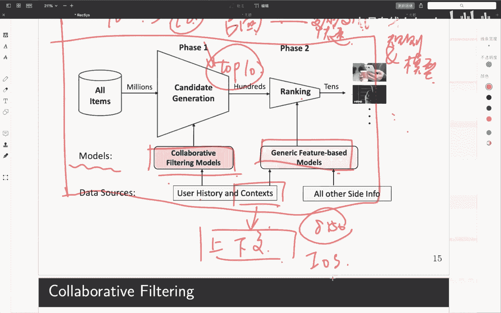

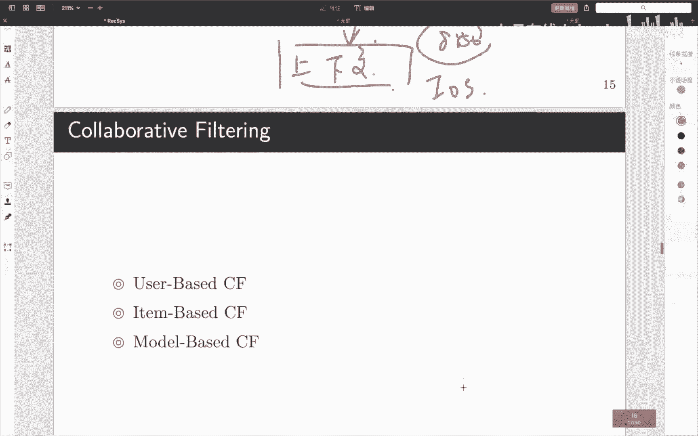

我们继续啊，下面呢就是讲启动过滤。启动过滤呢作为老一辈的这种推荐系统的这样一个典型代表呢，其实现在呢也有他们的一些应用，只是说没有那么广泛了啊，启动过滤，它一般我们要讲的话呢都会讲三种啊。

是基于用户的基于iteom的和基于model的。基于用户的呢基本上就是在求用户和用户的相似度。She。啊，然后呢假如说A和B这两个用户比较相似，那么B看到什么东西呢？就会推荐给A是吧。

这是属于user base的CF。iteom base的CF呢就取的是ite。嗯，和item相关的一些相似度，对吧？他们呢就会通过说比如说呃这个两个item呢有多少个呃。

比如说我们在这种视频推荐的产品当中呢，有边有个col watch。啊，这样的话呢，就比如说这是一种计算item这样一种相似度这样一的方式啊，那么最后呢然后呢通过说这个user呢。

他看了哪些iteem去找这些ite所对应的相似item。这样的话呢就是我们的种iteom based的CF好吧。嗯，这两个概念呢相对比较容易进行混淆。大家怎么去记呢？

反正我记的方法呢就是说user base的CF就是求用户相似度。iteom baseCF呢就是求iteom相似度。那既然你现在有这些相似度呢，那后续你怎么进行使用，其实就比较明显了。好吧，就是这两点。

最后一点呢就是我们这样一个model based的CF，就是说基于模型的这样一种相似度。这种相似度我们这里会去讲什么呢？我们主要会讲SVD和SVD加加这么两个比较常用的模型嗯。

那么我们来看一个具体的问题，好吧，这个问题是这样的，就是说呃因为典型的这种呃推荐，其实有很多迷失呃趋势质这样一个问题啊，那么比如说这个user，它对于这个item。嗯，他有这样自己的一个打分，对吧？

那具体呢就反映到了这个表当中。当然我们知道说这个ite的数量呢极为庞大啊，有很多个电影，我们不可能每一个人呢都全部看完啊，因此而言，就有很多地方都是缺失的。

那么我们的目标呢就是说把那些缺失的地方呢都给它进行补全。啊，补全完了以后呢，那打分高的自然也就是你可能比较喜欢的。因此而言，也就是说呃是最终应该推荐给你的一些方式。好吧。

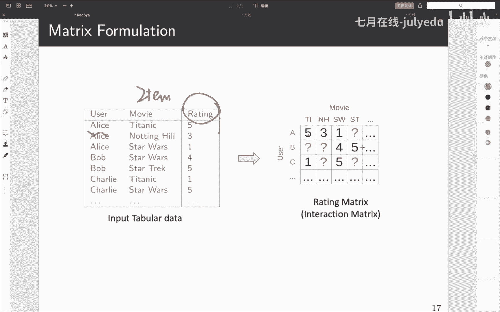

讲这个之前呢，我们先去讲一下SVD它是一个什么样的一个概念啊，SVD呢它本质上呢是一个数学概念，它是一个非企那个奇异矩阵分解，就是它的一个全称啊，它呢相当于是说任何一个矩阵M啊。

它可以不是一个行列式的这样一个形式啊，就不是一个那种呃行和列就是行列式那种都相等这样一种方式啊，甚至于它的runR也是可以小于M啊，或者是N的啊，比他们两个都小。

那么SVD主要做的一个什么样的一个事情呢，它需要相当于拆出来一个左矩阵U和一个右矩阵V啊，这两个矩阵呢分别都是那个叫做。

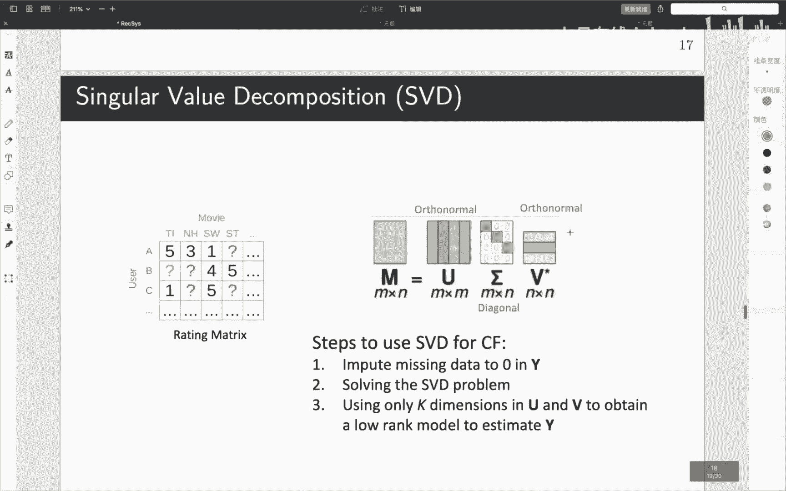

正定矩呃正交矩阵。我。嗯，然后呢以及说中间的一个矩阵西格玛啊，西格玛的对角线呢相当于对应的就是U和V里面的他们的这些呃正交基，他们的这样的一个重要程度，好吧。我们一般认为说这个里面的这个呃这个值呢。

它是越大的话，然后呢呃是它的绝对值越大。比如说-8是比四要大的。然后这个绝对值要大呢，越大呢认为说这个呃它的这样正交机呢是越重要的。好吧，所以说一般呢我们都会通过一些方式呢去对一个矩线做SVD分解。

也比较常的方式呢，就是比如说拿M去乘以M的转质啊，这样的话呢我们就可以去计算出这个好像是计算出那个微矩阵。如果是M的转质乘以M啊，就算是U矩阵，这个具体我可能记串了，好们大概就这么一个意思啊。

然后呢去求它了以后呢。最终对它去做特征根和特征向量的一个分解，就能分解出我们这样一个西igma矩阵。好吧，当然还有一些其他的一些方式，我们刚才讲的是一些最长的一样一个方式。

这个呢就是呃矩阵的SVD分解啊，我们呢最终呢能够通过说嗯去取那些因为大家可以看到说我们这个质呢很可能是说这个黄值呢很可能已经是零了。就只有这两个值呢是有意义的。我们就可以通过说这个西格玛只取前两列。

完了取它对应的这个应该取它对应的前两行吧，这个对它取阵的前两列啊，然后呢最终能够把这个去复原出一个新的矩阵M撇啊，我们一般认为说M和M撇之间，它们的距离呢。是相对而言比较小的。

这个也是我们经常用到一种曲噪的这样一个原理啊。因为如果说你在这个sma里面的这个特征根比较小的话，我刚才说过了，就是你这一个正交基，它不够重要，我们就可以把这个维度直接给它干掉，好吧。

这就是一种渠道的一个逻辑基础，那么我们在这里呢会有一些区别，为什么会有一些区别呢？是因为我们这里呢大家可以看到说打了很多问号，就是说很多值呢？我们是不知道的，不知道的时候呢，我们确实有一些办法。

就比如像这里所说的，我们直接去补零，但补零呢不一定是一个好的办法，为什么这么说呢？是因为如果说补零的话呢，嗯它就会有很多的一个偏差，它只是没看过啊，它并不代表说它不喜欢它。当然我们在这个推荐系统当中呢。

经常会有一个。这样一种bas的这样一种呃现象。什么叫做bas呢？bs指的就是说说嗯很可能是你不看不看它的原因，就是因为你不喜欢它。所以说某种角度上来讲，因为它补1个零呢是有意义的，但是必然是不准确。

因此而言传统的SVD呢在这里是不太适用的。我们就发现发明了一种啊新的一种SVD的一种方式。在我们记忆学习领域。

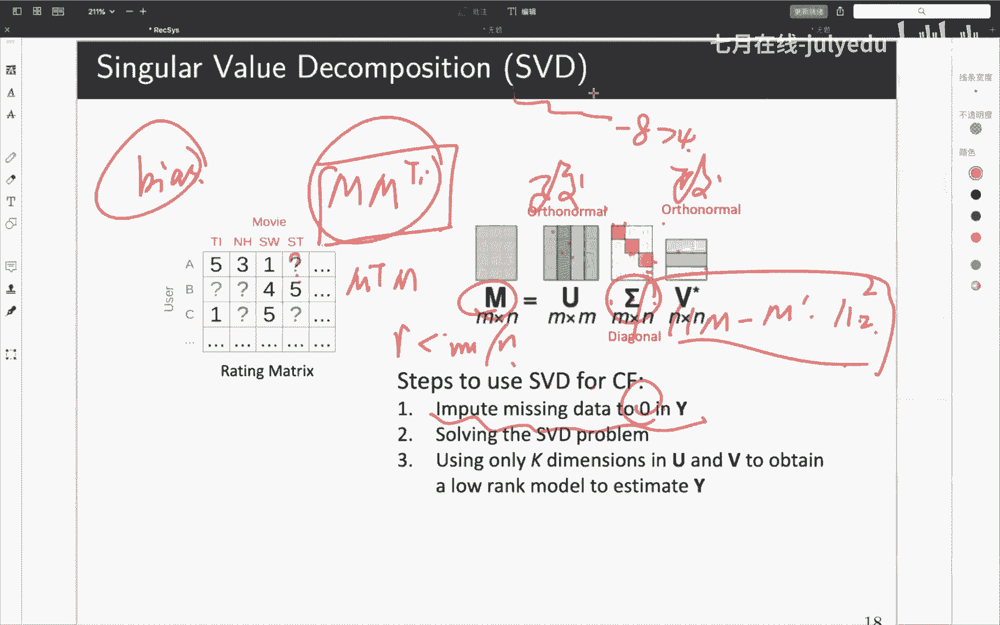

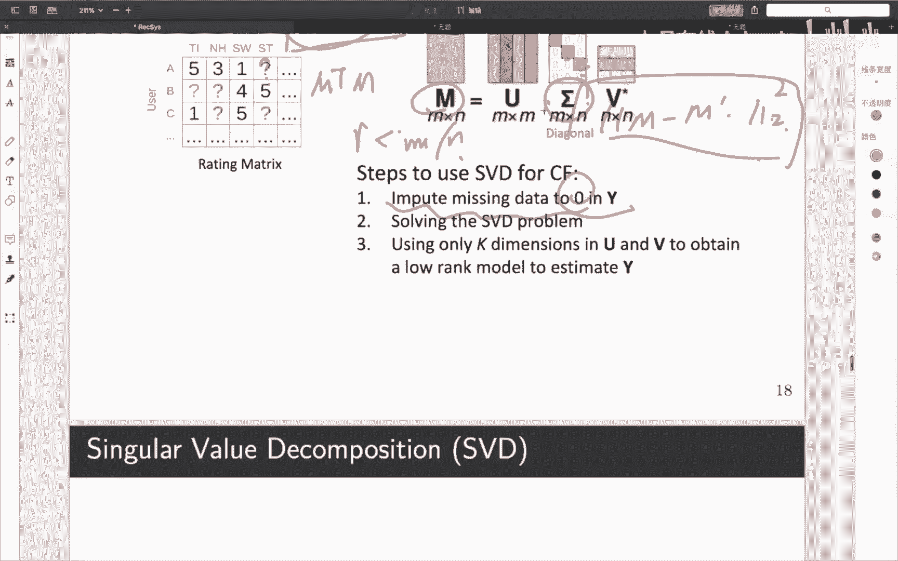

这个东西呢大家不要去忘掉，因为马上呢我们就会见到它。

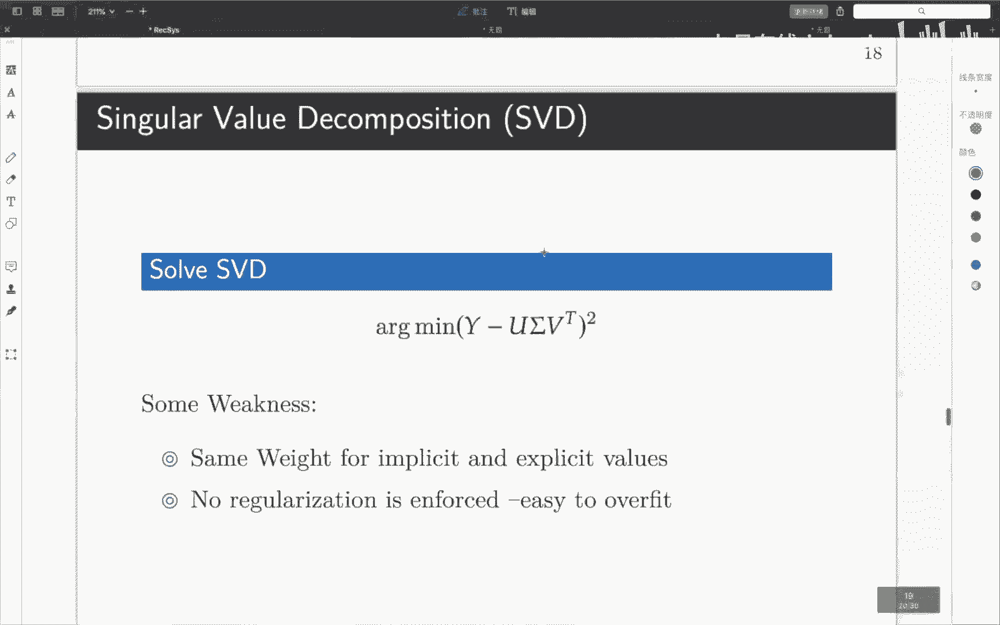

就是这里我们呢刚才这个举例Y，就刚才我们那个M，对吧？我们呢这个是它拆解的这种方式啊，然后呢，我们通过这种方式呢，怎么进行计算？刚才我们说过了啊，它有一些自己的一些，对吧？

我们有一些implicit和Xitvalue，有些值是看不到的对吧？另外一个方式，另外一个原因呢，就是说我们再去求它的这样一个最小值的时候呢，直接这么去求，因为没有正德项的问题。

很可能导致说你这里面特别容易出现一些过敏合的情况，因此而言，我们就使用一种。

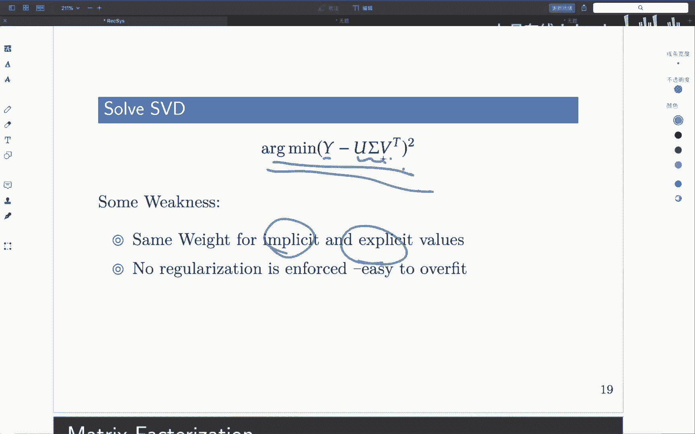

拆分的一种方式啊去做这样一个问题。我们定义们的模型呢是Y等于VU乘以VI啊，或者说我们呃。

VU和VI他认为是什么？就是说对于一个userU和一个对于ite呃I他们的这样的一个呃向量这容表示方式，好吧。如果大家对inbeddding这个概念比较熟悉的话呢。

其实这里都可以认为是user和item，他们各自的这样一个inbedding。然后呢，只是说它们此时的维度相同，他们进行一个内积，就会计算出我们这样一个估计值by height。

那么我们怎么定义我们的lo function呢？我们的lo function呢，其实就是我们这样一个原始这样一个Y，这是我们的label。对吧这里叫个one hatY hat是什么？

是我们这样一个pred的value。对，这里呢就是我们这样一个正则项，对吧？我们对VU和VI施加正则项的这么一个限制，然后让它呢尽量的不去混拟合，那么纳是我们的正则项系数。

这里的这个呢是我们这样一个啊样本的这么一个权重啊，然后这里需要讲的几点。第一点，ID embedding就是这里所说我的U和I呢，其实就是我们最终去呃inbedding这样一个结果。为什么这么说？

是因为说嗯我们embedding的数学概念是什么呢？embe的数学概念其实是。Yeah。对于一个向量空间X，在对一个向量空间Y啊，我们有一个函有一个函数，或者说有一个映射F。

然后使得说把X映射到Y这个空间当中。首先需要强调一点，就是X和Y这两个向量空间呢，它们本身并不一定存在说哪个向量空间一定比另外一个向量空间大啊，比如说X呢是。RMY呢是RN。

那么M和N的大小关系呢其实是不确定的。但是我们在实际的使用当中呢，经常会让M远远大于N，相当于就是把你这样一个spae这样一个特征呢给你压缩成了一个dance的这样一个特征。

且我们称这个dance压缩后的这个结果呢为in。当然这里有一个问题呢，就是说我们N我们要进行对原始成用一个压缩。那么我们的N设置为大多少的大小比较合适，这个的话呢。可以认为是一个模型的一个超参。

可以进行一个调整。这个就类似于呃其实就是我们这样一个深度网络结构当中，每一层的这样一个大小，对吧？就本我们经常想用的层呢是25664这样的一个数字。当然你要用什么128米T256也是可以的，对吧？

这个呢其实就是影是我们这样一个inbedding size的，这是第一点，第二点呢，就是说在这里呢，我们也会通过说很多的实验呢去确定说我们具体inbedding映射到低维的哪一层是比较合适的。好吧。

这是这里。第二个呢就in the product，就是这里好吧，然后最后一个呢就是miple loss functionavaable，就是我们在这里呢其实有很多种可以使用的lo function的。

我们在这里呢是使用的均方误差。当然这里呢有很多种正策项的这样育方式。这个呢就是我们想要前面讲的SVD。

在我们推荐系统当中的model filtering的这model collaborative filtering。的这样一个用法，好吧，相当于我们。怎么做呢？做法其实也很简单。

就是一般呢我们最开始的时候呢，就会说initialize。我们的这样一个呃VU。

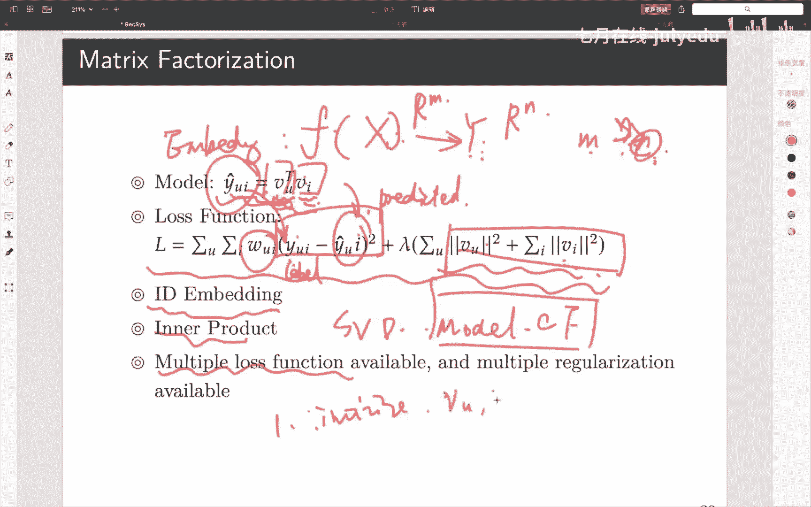

v i 啊。下面呢我们就会说去通过这样一种ds方式呢，对于每一个去求它的这样一个梯度。第三步分呢就进行更新。

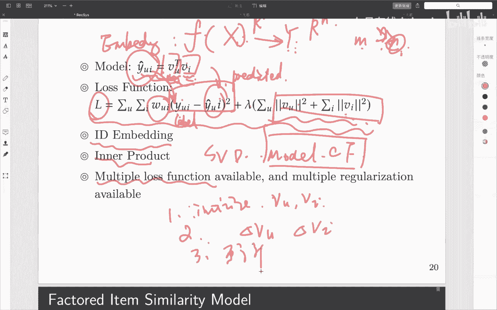

啊，第四部分就判断你的生命条件convergence。如果不收敛的话呢，再回到这里来再输入新的样本，再进行计算M的梯度，再进行更新，以此类推。好吧，这样种方式呢也是我们在继续当中最强的一种方式嗯。

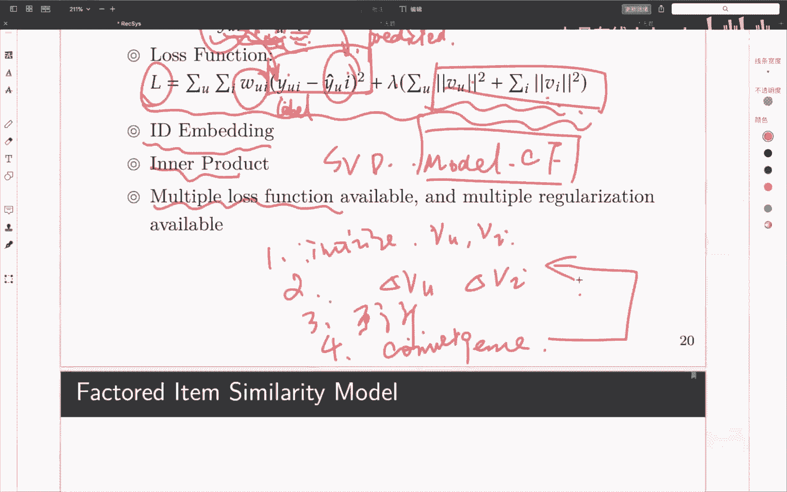

好。

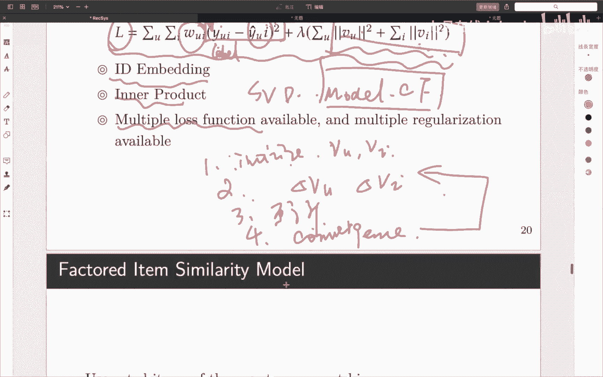

我来看一下大家的问题。然后。不是10万，是2000万，交叉300万，这个直接交叉吗？嗯，所以说我们经这个问题问的呃问的其实是比较贴近于我们工业业当中经常用的一个实践的。

有的时候呢我们并不一定啊会去对所有的东西进行交叉，以及说就算对所有东西进行交叉了以后呢，因为我们的向量呢是极为稀疏的啊，可以理解为说一个user。

假如说呃就比如说阿里假如说它有10亿个at但其实呢它相当于就是样相当于是一个one house这样一个结果，对吧？你可能你不可能去浏览那11个ite全都去浏览。

你可能只会浏览其中的1个300万这么多对吧？因此而你去浏览了300万呢，你呃300万都比较快，你可能只浏览了300个啊你浏览了300个呢，只有300个的，他们的这样一个one house的值呢。

是非零的，其他都是零吧。然后为D位度inbedding对召回的结果怎么去评估呢？这个嗯和呃金牌其实也差不太多，一般都是看你这样1个AUC的这样一个情况。好吧，有的时候可能还要看一些效率啊。

youtube对的。这就是刚才那个图的来源的地方。嗯，上文特征还是不太理解是吧？你想一个例子，就是说现在是9点，对吧？那你9点去请求的这样一个系统，那你和你10点去请求这样一个系统。

他们的上文特征呢分别就是9点和10点啊啊，以及说呃或者说。我拿我们两个人进行举例，好吧，就是咱俩这个时候都在9点去请求，咱的上文特征呢都是9点，但咱俩分别用的不同的设备。

比如说你用的是IOS5用的是安卓的那咱俩的设备这个上文特征呢就不一样。加样的实时特征呢，如果看到都是同一个item呢，也可以是一样的。所以说实时特征呢基本上都我们系统呢自己进行计算的。

而上文特征呢就是说是跟当时当前的状态强相关的，好吧嗯。像阿里这种用户实级的怎么实现us色CF嘛？工业级的解决方案嘛？嗯，一般而言，我们像这种解决方案呢。

可能会取一些像什么呃呃向量那个向量与限量之间的这样一个距离，有一些方式呢去比较高效的求向的一些距离，或者说离线呢先去做一些计算，相当于先把那个你之前呃indding就是跟你相关的那些排序都给你排好。

相当于相当于相对而言会给你变得小一点，以及说我们还可能会做一些业务过滤。就比如说会去看你最近浏览过的浏览过的10个东西，然后呢，把他们的开ddy过员ID给你拿出来。然后呢，这些拿出来了以后呢，然后呢。

最终去拿他们先把几个大类给过滤掉。这样呢摄像级呢也会减小很多。很多时候不全是算法的一些功能，一般都是我们的业务过渡和算法过渡一起去做的，好吧嗯。然后大家是召回是自己写函数，还调换库啊，这个看情况吧。

这个问题也不知道怎么回答你嗯。然后SVD进行矩阵分解是直接处始化两个词矩阵。然后通过拟合存在的呃分数的方式训练这两个词矩阵，还是先补赢，再分解矩阵再拟合。这就是刚才我们所说过的两个不同的方法。

我比较推荐于前一种方法，因为前种方法呢，你可控的地方学相同员更多一点，好吧，分解矩阵的话呢，其实你控的地方就很少。求物品的相似度的时候，我为物品的个数很大怎么办？比如说求任意量啊，对。

一般而言工业界就会有一些那种比较呃性能比较高的那些呃呃求向量之间相似度这样一些库。比如说这位同学这里所提的这样一个fs，好吧。然后。HB在线离线对那块更感兴趣。嗯，这个可能没时间讲的。

因为等会儿还会有金牌要讲，如果大家都对这个比较感兴趣的话呢，可以再有几个人再去说，我再去讲，好吧嗯。然后如果说数据级如数据级的规模太大，然后开销太大怎么解决？嗯数据级的规模太大。

你说的是那种离线在计算增后的时候，还是说线上进行服务的时候呢？这个可能也不太一样。然后召回的item没有label啊，怎么去计算AUC直接上线嘛？有离线能跑评估这样一些指标吗？哎，这是一个好问题。啊。

再再离就是你今天召回出来的这些东西呢嗯。有youtu曾经分享过一篇论文，就是说嗯因为你召回的这些东西呢，嗯它虽然说你在这个场景你把这些东西给召回掉了，但是这些物品总有暴露出来的时候，对吧？

那你就总有一段总有时间能够去学习说这些ite的这样一些些他们就有那一些表现的情况。因为我们在学习继续学习肯定学习的不是一个单点性的这样一个行为，学习都是一个全局性的这样一个行为。因此而言。

你在这里看不到，你总有在其他地方能够看到，对吧？还有呢就是说召回确实是过滤掉的很多东西。那么我们怎么能够尽可能去复原说这些被召回出来的东西，他们如果不会去召回，他们对这样物品这样一个影响。

有的时候可能我们就会对样本呢做一些啊全重一些干预或者一些修正，去帮助我们去学习这样的一些东西，好吧。然后强化学习做推荐系统的效果怎么样？一般用什么样的一些模型？

强化学习目前业极的探索还都相对来言比较初步。因为强化学习它本身有自己的很多局限性啊，以及说嗯这项技术呢很复杂。然后呢，接入成本比较高。像我们做强化学习的而且强化学习它有很多的限制。

就比如说要这个用户与这个环境在在一直在进行交互才可以。但是这样的场景呢，其实并不是很多，好吧嗯。一般而言都是属于那种单条行为。就比如我给你推荐出来这样一个东西，然后你点不点呢，因为我会给你推荐很多东西。

对吧？嗯，当然像阿里啊、京东啊，他们都有自己的一些强化学习的一些实践。但据我所了解，强化学习应该在嗯这些地方也没有特别铺开的进行使用嗯。Yeah。然后超大规模特征在线请求毫秒级响应要做哪些优化。嗯。

这也有很多工业界的一些优化。好吧，嗯，超大规模的一些特征呢，工业界一般都会有一些嗯特征的一些提取库。呃，google曾经发表过一篇文章去讲那个特征提取的。大家有兴趣的话呢，可以自己下去搜索一下。

它呢一般就是一个毫秒级的这样一个呃库，它能够保证说说你很大量的一个特征。然后呢，我们去进行提取性能很高。再一个问题就是说我们一般说这种大量级特征，比如说一级啊这种特征呢。

很多时候都是指的那种弯号的之后的那些结果。但你的原始特征呢，其实并没有特别大原特征可能就是万级10万维的这样一个级别。那这样呢其实用那些在配上那些高性能的C加加去编写的那些特征提取库。

其实性能就相对还好。就是一般涉及到性能的，在工业业当中用的最多的呢都是C加加，好吧。然后SVD先补定再做分解，然后呢，然后你不就已经把那些最终的N那个左矩阵U和右矩阵V都求出来了嘛？最终你这个UC嘛V。

你就能够把这个原始的矩阵M给复原出来了，对吧？Yes。哦召回的概念有点没理解。召回的概念你就可以理召回的召回是什么？就是说从亿级到百到千级，金牌就是从千级到个位数级，这么理解就可以了啊。

然后Hb能做实时特征吗？会出现延迟不够的情况吗？嗯你你这句话问的这个问题呢，嗯我感觉是你对Hb这个东西本身不是特别的了解。Hb它是一个存的这样一个地方，它不是它是一个数据的存储引存储的一个引擎。

它不是一个计算引擎计算引擎呢，我们一般在在线呢会用一些呃实时实时计在线的引擎这样一个工具，像link这样一个东西，一般都是我们flink引擎呢，从Hb里面先把需要算的东西给拿过来。

然后或者说买s一些数据库等等这类各种各样的情况都可能会有。然后呢它进行计算计算完了以后呢，再给塞回到Hb或者说买scle当中去。好吧。所以说这是这个。read是好吧，它是属于计算机的。

就是在那个系统里面的这种c。一般而言我们都会read是靠近呃这边就是如果说这个系统是java好吧，靠近JVM的这样一个c。而那个Hb呢相当于是一个远程缓存。一般而我们都会说有一个呃缓存的这样一个失效期。

嗯，因为我们不可能频繁去读Hb，因为你去频繁读Hb的延迟基本上是毫秒级的。但你读read的延迟呢约等于0，因此而言，一般都是说呃把一些东西呢会加载到呃read这种内存的c当中去啊，当然也会有一些失效期。

或者是有一些预热的一些技术，好吧嗯。然后手动做的特征有多少为？呃，现在的话如果说用那种呃深度学习的话呢，其实都很少去人肉做特征了。因为很多时候那个这种模型可以帮我们去做很多事情，好吧。

但是呃有的时候呢也是需要说人去做一些特征交叉的啊，但特征交叉我们一般也是批量进行特征交叉，也不是单点交叉。算法工程师还需要会C加加吗？一般需要会哪些语言？呃，我觉得是需要会thon和C加加。嗯。

因为像比如说tflow，如果说你想去开发一些tflow算子的话呢，flow大家应该都知道它分为thon端和C加加端。你只会thon端的话呢，你所做的事情是有局限的啊，因为on端的性能普遍比较差啊。

当你需要一些高性能的一些库的时候呢，你还是需要通过C加加去那个进行一些开发好吧。你们只会拍的不会C加加可不可以？当然可以了，我就是可以慢慢学习嘛，对吧啊？😊，然后特征的偏量交叉是什么意思啊？

我们一般都是按域语进行交叉。就比如说刚才我们在这里。

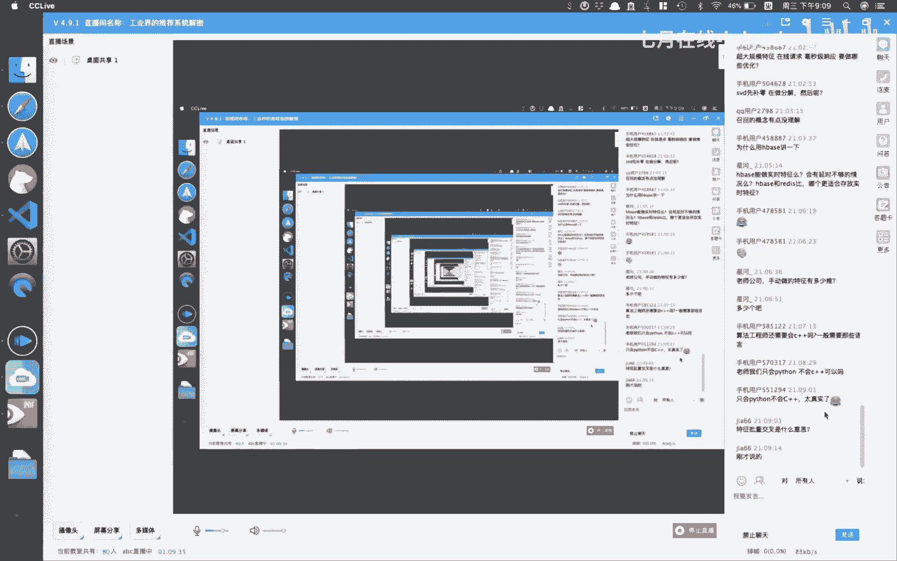

你你那个图在哪？在这对。比如说既然是我们把这个特征分组，像基本的特征呢，很可能就会与全部的都会和ite特ite特征交叉为一拖y特征，这就是一种交叉方式。好吧，我不会说在去这里面再进行筛选。

说比如说性别啊什么之类的这些东西啊，这样呢就是特征的数量就变得更庞大了，但是也会引入很多冗余特征啊。

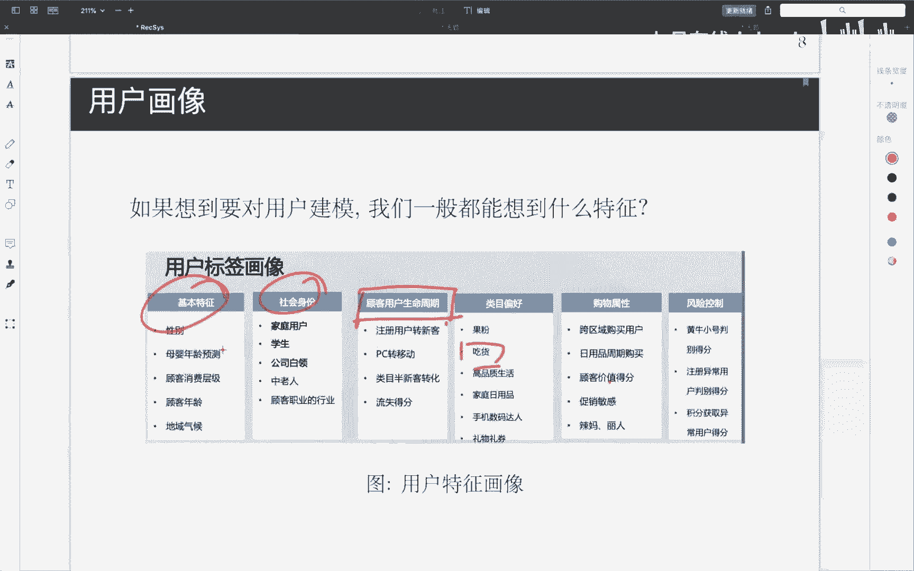

好嗯，我先接着讲好吧嗯。

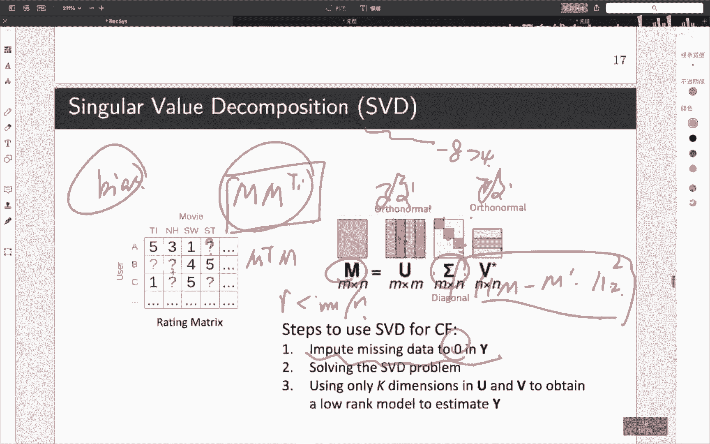

Yeah。🤧然后呢，这里呢我们刚才始讲的是那种model CF对吧？那讲的这些model。不好意思，讲完这个model CF呃model CF的SVD以后呢，我们下面要引入的是SVD加加。

大家可以理解说在这里面呢，其实我们用到的信息是什么？用到的信息呢其实就是说我们用到了这些user和iteom他们相对应的这样一个打分，就是这样一个Y对吧？但是呢我们还可以考虑额外的信息，额外信息是什么？

就比如说这个user曾经对哪些ite打过分，这这个user呢，它曾经看过哪些ite，比如ite一iteom2，一知道ite10对吧？他看过的这些ite，这样本身呢也是对于这个user的这样一个信息。

对吧？但在这个模型当中呢，我们并没有把它显示给用到。那么我们在这里怎么进行使用呢？那么就引入了我们的SVD加加，我们会引入两个新的向量。

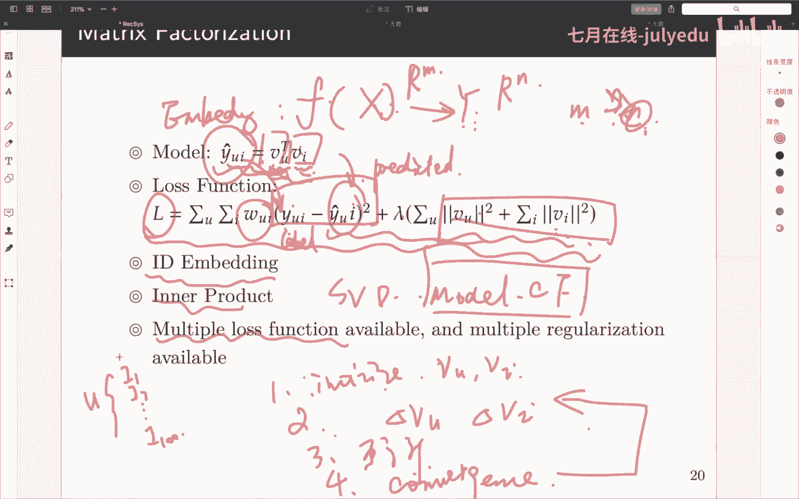

先看这吧。两个一个新的向量，就是这样一个QJ。和这样一个VI对吧？这个QA是什么呢？QA就是指的是我所有打过分的这些item啊，然后呢。

这个叫做user rateiteems of the user to represented him。就是我对哪些东item打过分。

那么我就把那些给我打过分的那些东西呢给他家拿过来去来表示我这样一个user，好吧，所以说呢你可以理解为说这其实是另外一种什么另外一种CF对吧？因为呢我们是拿item去表示这个user，对吧？

我们的目标载体呢是这个item，对吧？当我们把这一部分呢给它加入到我们这样一个协同过滤里面去。

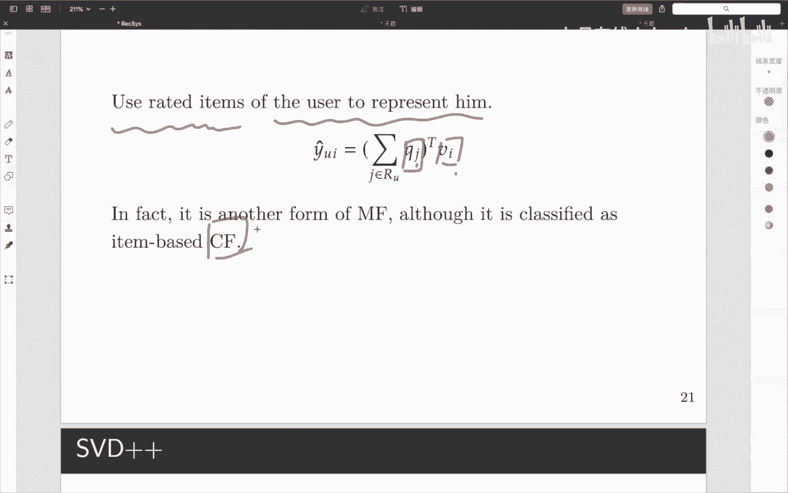

嗯，我们在这里呢有的是什么？不仅是有这个user，它本身的这样一个呃属性，这样一个inbedding，对吧？我们还有的什么？还有的是说这个user它所read的这些items都有什么啊。

我们把它们呢也给它进行相加啊，这些呢最终呢去表示这个user，对吧？这样呢就是。出现了我们这样1个SBD1加加啊，相当于呢他考虑两方面的信息，一个是我单点的打分。一个是说说我曾经看过什么的一个总合打分。

好吧，这里就是SCB1加加啊，这个呢其实是SBD和SBE加加呢是大概在一二十年之前，nflix他们举办一个竞赛的时候，最由得奖的这样一个模型，就是SB加加，它其实也是独领风骚了很长一段时间啊。

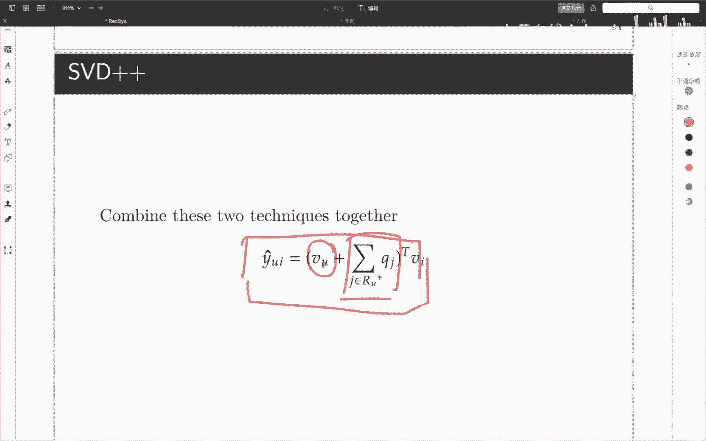

好，那我们继续往下去讲讲我们这样一个ranking金牌。金牌。这里呢我们会讲两个深度学习的一个模型啊，一个是Y and deep。等会呢还我们还会第三行也要讲，然后呢，最终还会讲一下。

那个我们这样1个ESMM好吧，那么ve and deep呢，它相当于是什么？大家可以看我们这样一个网络结构啊，其实呢就是这边呢是我们这样一个外的部分，这边呢就是我们一个dance部分，对吧？

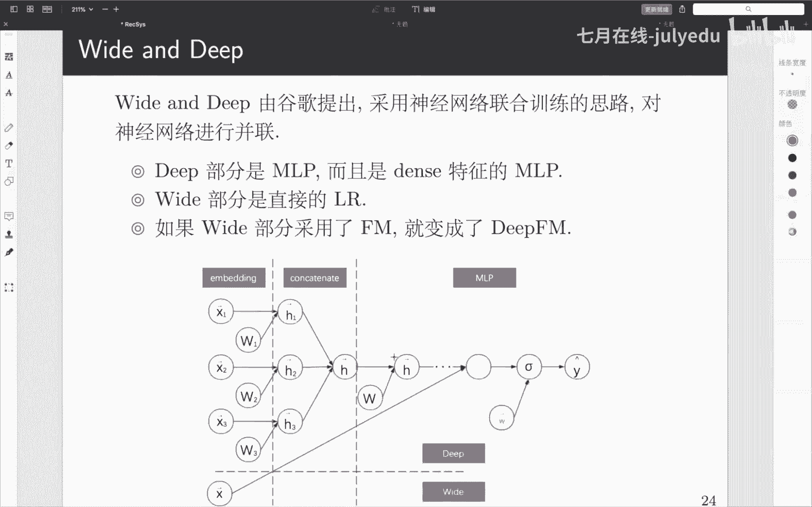

d词部分呢其实大家都了解，就是深度网络的这样一个逐层的这样一个往前的这样一个堆叠，对吧？这层这层这层这层对吧？这边呢相当于是从我们的spas特征呢，或者是其他什么特征呢变成inbedding啊。

然后呢再把我们看开到一起，在逐层网络堆叠，这是我们的这样一个dance部分。而这里呢相当于是我们这样一个外的部分，对吧？也是我们啊这样一个直接。大家可以认为说这里是什么？这里就是我们这样的1个LR模型。

对吧？我们相当于是把我们一个传统的LR模型和一个深度的网络结构呢给它结合到了一起啊。

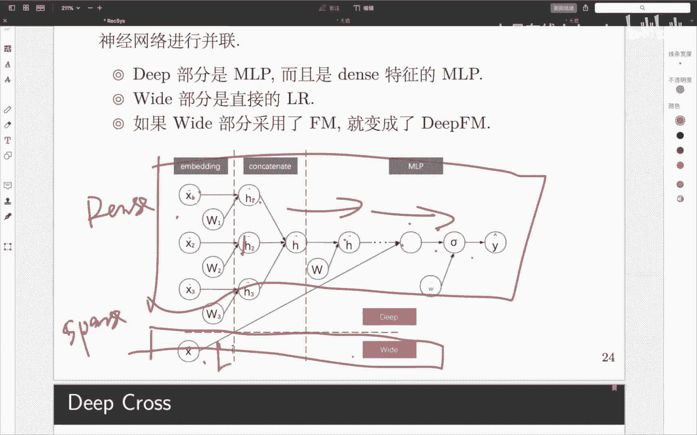

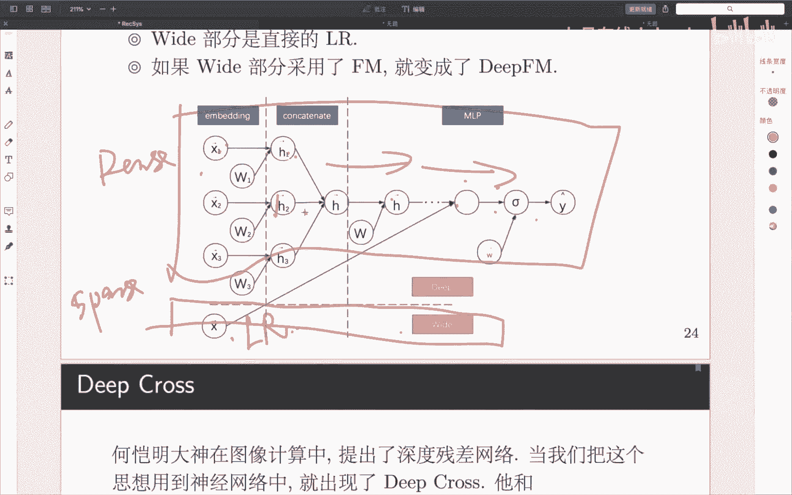

如果说我们这个外的部分呢变成了FMFM大家应该知道吧，叫做嗯。怎么化不了。叫做factize的 machine。哦，知吧。啊，这个也是一个很经典的一个模型。如果大家不了解的话。

建议大家课下去了解一下啊吧。如果说我们外部分呢采用FM，它就变成了个depM。那么之所以要讲外 deep呢，是因为它基本上是所有的这种深度啊模型的这样一个起点啊，因为它代表的深度模型的两个部分。

一个部分呢就是怎么去使用我们这样一个d层一部分呢就是我们这样一个加入加外层能给我们带来什么。一般认为外层表征的是我们这样一些。特别specific的这样一个信息，特别特定的这样一个信息。

而d词层呢表示的表中的是我们什么是我们的一些特别ja的一个信息，对吧？我们从从概念的角度去理解呢，就是说当你这个网络结构逐层往前进行堆叠，进行传递的时候呢，每一层。

他最终呢就是说需要的信息呢进行逐层的这样一个抽象啊，越往上越离你的label近啊，它你这个抽象的这样一种结果呢就越抽象，对吧？曾经我们呃那个有一篇论文呢，它就是连就画了个图，大家应该知道说CN网络结构。

就是对图像做抽取的，对吧？那么我对图像的抽取的时候呢，它可能会有很多个卷积核，你说很多个通道啊，然后呢，我们就会发现说在前边几个卷积呃在卷积每个卷积核能都去滤过的这个图像的不同的部分，对吧？

假如说是一个猫在一个原野上，那有的卷积核可能是过滤这个猫，有的卷积核呢可能是过滤那个天空等的这样一个东西，且越靠近原始数据，这个卷积核所过滤出来的这个东西呢，就越能看出来它是什么东西啊。

越远离它就越看不太出来了，好吧？因此而呢就是越到这边呢是变得越来越粘的。而这个大家怎么去理解呢？就比如说假如说我这个人呢我特别喜欢吃肉啊，那么我喜欢吃肉的时候呢，嗯可能其他人都不喜欢。

如果说我们通过一个全局的大家的视角去学习的话呢，我们模型关注的是globalgbal这样一个因此而可能就把我喜欢吃肉，大家都不喜欢吃肉这个信息呢变成了所有人都不喜欢吃肉。

就11某个人的特定的这样一个信息啊而如果说这里加入外层呢，可能说我们有额外的信息呢被提取出来好吧，就是这样一个呃特别specific的这样一个信息的这么一个学习啊，这个就不讲。大家自己看一下就行。

没时间了。

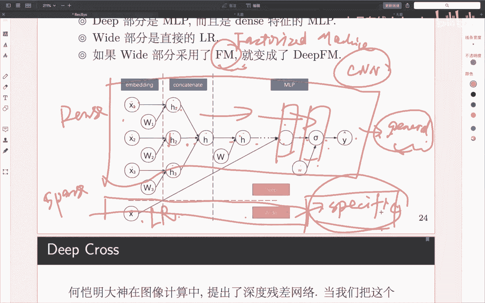

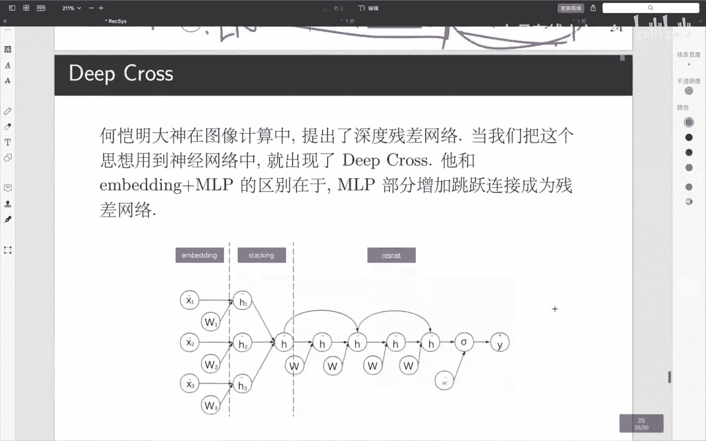

然后呢，最终呢看一下这个呃这个welandrevisit。刚才我们已经说过了啊，然后呢这里再多说一点，就是说这样一个模型呢，其实它是效果特别好易于扩展。这是为什么weland地其实是。呃。

很多时候特别喜欢被很多算法工程师去使用。因为我们建模的时候呢，呃很多时候也要考一个模型的这样一个复杂度和可解释性啊，一般而言，深度模型呢它就不太好可解释，且会偏复杂一点，但它效果可能就会比较好。

所以说我们就倾向于说我们尽量用一些比较简单的模型，这话也好解释啊，以及说我们线上的服务呢延迟也会相对而言比较低。这是这里。最后呢我们再介绍一个阿里的这样一个呃网络结构ESMM。

这个ESMM呢也是我们在呃那个呃呃计算广告里面呢特别常用的这样一个网络结构啊。ESMM呢它所关注的问题呢是这样的。刚才呢我们说了两个阶段就是曝光到点击，对吧？但其实呢我们还有第三个阶段那我们叫做使用。

什么意思？就给你推的这个广告的，你点了它了。但你最后呢你真正的在这个广告给你推荐这个商品发生了消费啊，这才是一个使用，这才是终极目标，你光看你不消费，其实没什么用的，对吧？

我们很多时候需要优化的这样一个漏斗呢，是这点这个load斗，我们称为这个load斗呢，是CVR。我们称这个呢叫做CTR，全集呢叫做CTCR。好。click throw it。

click view it啊，是view啊，这个替成through。嗯。然后嗯CVR其实是不太好预估的，原因是什么呢？是因为我们很多时候的一个东西的点击率呢可能很低，可能连百亿都不到。这意味着什么？

假如我们有一个亿的样本，一个亿样本好像很夸张，很大量，对吧？但真正最后就只有多少样本，就只有100万这么多样本。100万样本呢，很多时候训练一个深度学习的模型呢是远远不够的啊，因此而言呢。

我们就需要说怎么能够建立用好所有的项目空间啊，那么我们阿里巴巴提出的这个ES3M步模型呢，就通过markettytask learning多目标学习的样本方式呢去通知学习CTR和CVR。

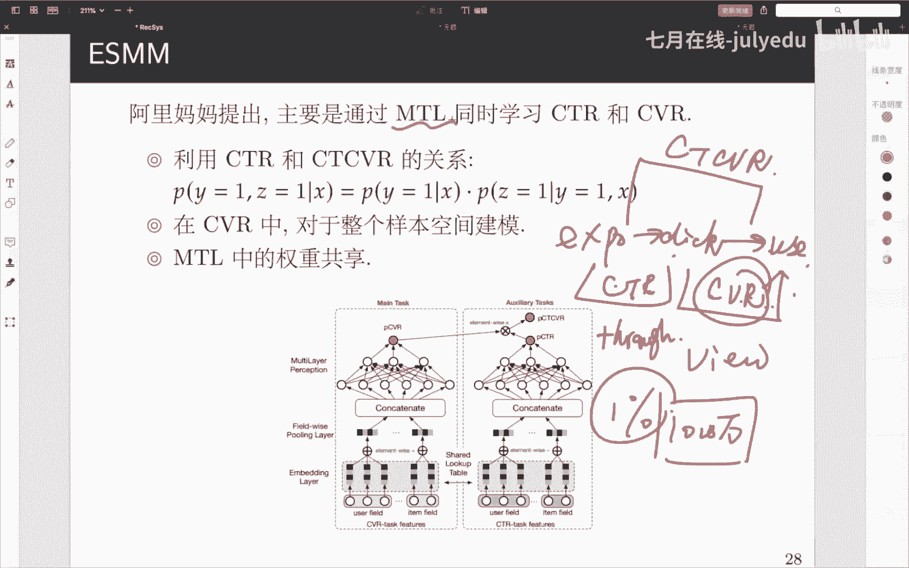

我们这里会有两个塔，一个呢是CTR这个塔，一个呢是CVR这个塔啊，他们呢都分别呢是用各自的样本啊，全量的样本呢进行预估。但是呢由于我们这个CVR呢，它没有办法计算说从这没有点击的那些样本的这样一个对吧？

但是谁可以计算呢？CTR和CDCVR这两个部分呢是可以去计算的。因此而言，我们这两个塔分别计算出CTRCVR以后呢，我们的n呢是通过说CTR的这样一个。和CBR的这样1个CTCBR的这样一个los呢。

去优化说我们这边这个塔和这个塔这两个塔的这样一个网络结构，对吧？然后呢，最终我们去进行线上的预测的时候什么？我们只去去计算说这个塔的这样一个最终的预测值，就不去计算它和它了，好吧，这就是这个。

这个呢其实相当于是怎么能够利用呃利用多目标学习的这样一种方式呢，能够把说我们一个原始的下载空间给它变得更大了一些。好吧，这里呢我们金牌这部分呢，给大家讲了两个模型。

一个是一个是这里我们的S他们分别代表的是说一个特别经典的一个特别战斗一个模型和一个根据场景设计出来的一个特别强相关的这样么一个模型。好吧，因为嗯我们算公师在进行业务的一些呃举呃学习啊。

以及说建模的时候呢，很多时候都是要在一些特别传统的一些模型基础之上呢，加入自己的一些理解，变成一些新的一些网络结构啊，E呢就是一个特别典型的一个例子。以就说大家可能也听说过一些其他一些网络结构。

比如像什么DIN呀什么之类的这些网络结构等等之类的。这些呢其实都是一些特别。

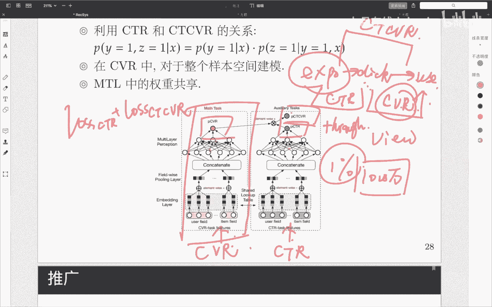

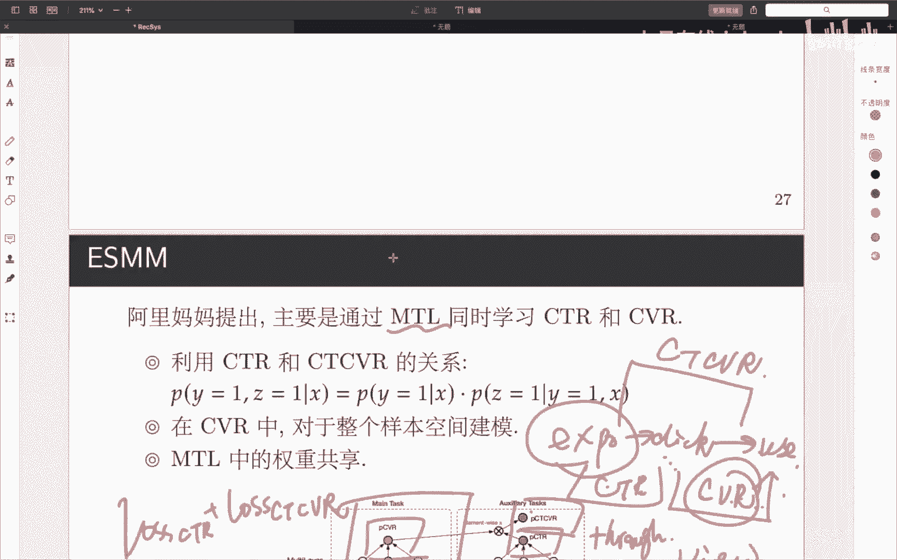

优秀的被设计出来一些网络结构。所以说呢大家也可以通过这些网络结构呢去想一想，背后我们在遇到一个问题的时候，是怎么着一步一步的把这些东西呢给设计出来的，好吧。

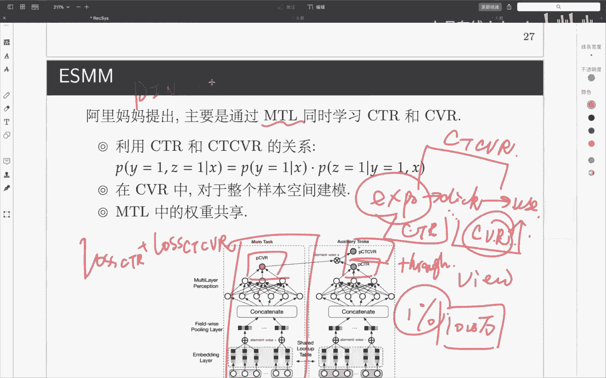

好，那么呃在这个课程最后呢，我们做一下推广啊。然后呢，如果说大家对于呃这推荐系统这门课比较感兴趣，或者说说在这个公开课上呢。因为公开课毕竟很难回答说大家所有问题，并且讲的特别透彻，对吧？

如果大家都比较感兴趣的话呢，也欢迎来报名我们这个推荐武器的这么一个课程。好吧，大家可以去看一下这个网址，然后呢去看一下我们这的课程的网站的这样一个介绍。到时候呢会有三位重量级的老师呢来给大家开这门课嗯。

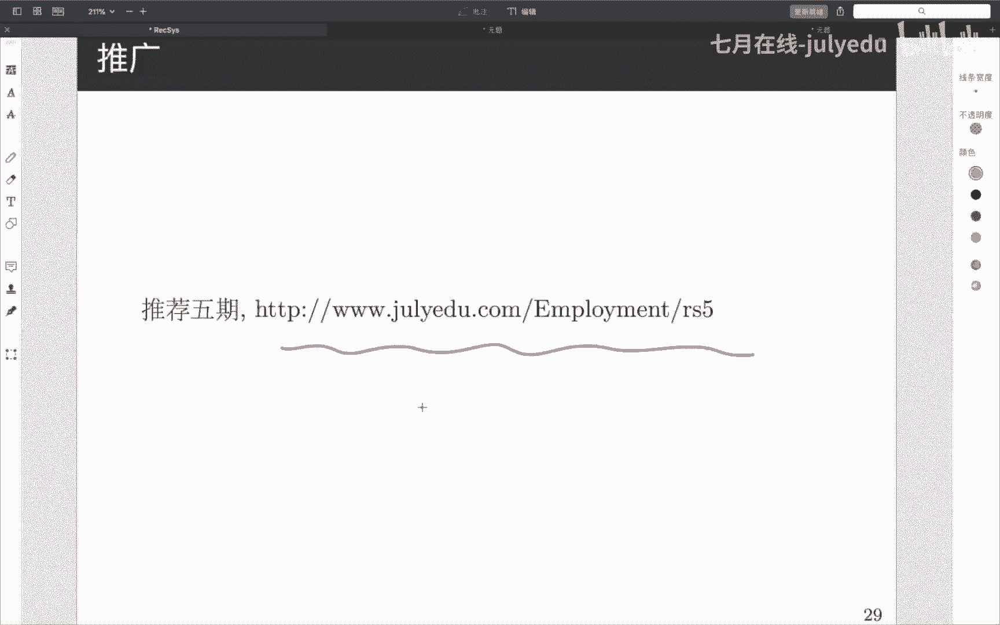

好，那么我们先来看一下。大家这些。问题啊。Yeah。嗯。公式统计特征多吗？有多少个？啥叫公式统计特征，没家看不白你这样一个意思。统计特征的话呢，基本上嗯划商类统计呢呃是用统计类特征。然后呢。

它单纯的at统计类特征，加上U toI之类的，基本上都是偏统计类特征的，好吧。啊，老师的公司是吧，统计特征多不多？嗯，还行。嗯，但是嗯。你要看场景，有的场景呢统计的特征可能就会占特别重要的一个比重啊。

我们也做过说直接拿那个模型。嗯，有一部分呢我专门就不用我们这个CTR这样一个统计的特征，就专门进行一些经典特样一个建模，直接呢去和CTR的特征呢给加总到一起。好吧，这个呢我们也曾经尝试过，效果也还可以。

Yeah。想精确一个语言，推荐C加加还是java的？我觉得你java学精了，C加加应该也能触类旁通。好吧，其实很多语言之间呢都是触类旁通的，就是不要说说那个呃。想一个月我要是学java还是学C加加。嗯。

你想这一个月时间可能都已经学了很多东西了，对不对嗯。java呢是偏向那种业务系统啊，以及说那些呃就那种进传统系统。但像深度学习这边，以及说目前技器实习领域呢，如果说java和C加加进行比较的话呢。

我偏我去建议大家去学一些C加加，好吧。

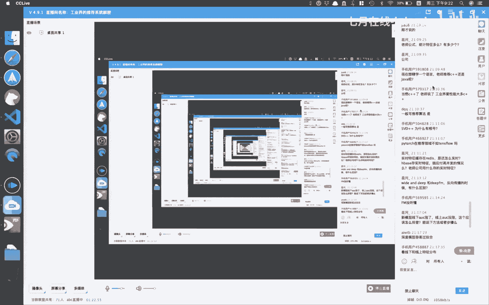

是。SVD加加为什么有根号啊，这个是做了那个叫呃那个那个什么。

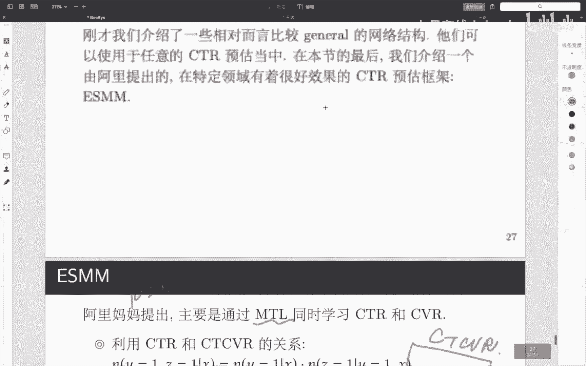

即个嘢。哎，哪里有根号？那个根号我没在这里写，应该是其实呢是有地方做根号的，是在这里有过做过根号。这个我没有写，就是在这里呢大家可以发现说嗯假如说有的user呢可能说对100个ite看过。

另外一个user呢只能看过10个ite特，对吧？那么。

大家量刚就会出现很大的一个差异啊，因此呢我们在这里呢有时候呢会做一些规一化的这样一个操作。我们都会去除以说你所看到过的这些item的这样一个数量，打成这样一个数量。但然这个不能作为完全的规一化，对吧？

完全规一化应该是除以NU但是反正论文中告诉我是除以根号NU。我的理解就是可能说你看的多一点，确实嗯最终他们发现说用根号的效果比较好啊。

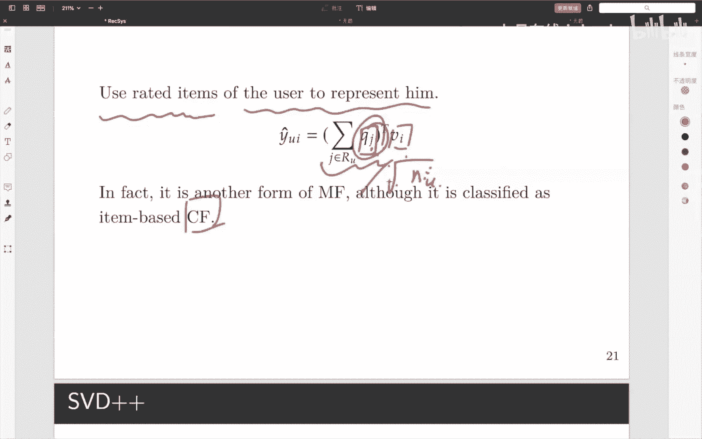

后拍时在推荐领域步selflow嘛是这样的，就是在工业界当中呢呃和学术界当中呢就两种不同的声音的。在工业界当中呢，我们一般需要的是什么？一个是稳定，二个是线上有很好的服务。elflow由于出来的比较早。

并且说它很早的推出到serv，所以说它在工业界站稳了脚跟。工业界一旦就是对一个框架用的比较熟的以后，一般是不会像学术界似的在这每天换着玩的，因为考虑的首先是稳定性和这种迁移的成本？

但拍al是由于写起来手，所以说在学术界呢就比较流行。我估计elflow这种流行，在最近一两年之内趋势都不太会发生变化。因为像我们公司没有看到任何拍al式进来的趋势，所以说我建议大家依然想进业界的话呢。

还是多学一些selflow。尤其是大公司，但是你自己建模着玩的话呢，你用哪个其实都无所谓的。然后实时特征缓存在readd，那还怎么实施啊？这个的话呢嗯实时特特征这种东西我们基本上每次都会去查询Hb的啊。

像那种缓存在呃readd里面的这些东西呢，一般都是一些系统经常会去用到的一些东西。因为你去查特征，你怎么着要去查HbHb查询的这种延迟呢是和你的集群相关的，和你的查询次数是没什么关系的。

你因为我们一般都是批量的去查，然后批量去读。因此而你可以把你的这个实时特征和其他特征呢都放到同一个Hb的集群里面。这样话我们查询起来，一般效率都会比较高啊。Yeah。

we deep和地盘FM反应传播的时候有什么区别，没什么区别，都是通过电视法则进行反应传播，好吧？FM没有听懂啊，这个我没有怎么去讲啊，也没有什么时间了。这个大家可以课下再去看一下资料啊。

然后新模型线下AUC涨了，线上AUC没涨。嗯，这个是供应中经常遇到的一个问题，就是线下AUC炸天。然后线上AUC呢就特别拉线上的效果呢特别垃圾啊，这个的话呢。

建议大家去看一下说说首先整个全链路是否你模型做的一些改造呢，你在系统当中没有感知到啊，这是第一个点。第二点呢就是是否说你这个你要去判察一下说你这个模型和上游模型具差别在于哪里。嗯。

有可能是说说嗯你对哪个item发奖量啊，那个是推荐量变多了，导致说说最终呢这个item的表现特别差，你就要需要看一下你这些模型。

比如说嗯你最终对这个item的这样一个打分的这样一个结果是否和你这个预期的CTR是比较一致的等等这这样一些东西啊，基本上都是通过数据分析一步一步去查情况。深度模型很容易过拟合。对的，但深度模型呢。

所以说它需要特别量量大的数据量嘛。因此同时呢我们也有一些防止过你和一些方法。比如说说我们可以去加一些政策项呀，嗯。

以及说我们也可以去用一些d out normalmalization这样一lay去做这些事情，好吧但drop out和malization这种东西做的不一定效果好。我们曾遇到过说做的效果变差的。

这种东西也要慎用。然后多任务学习一般是怎么架构的，这个问题太宽泛了。嗯，大家可以去一个叫做rur。

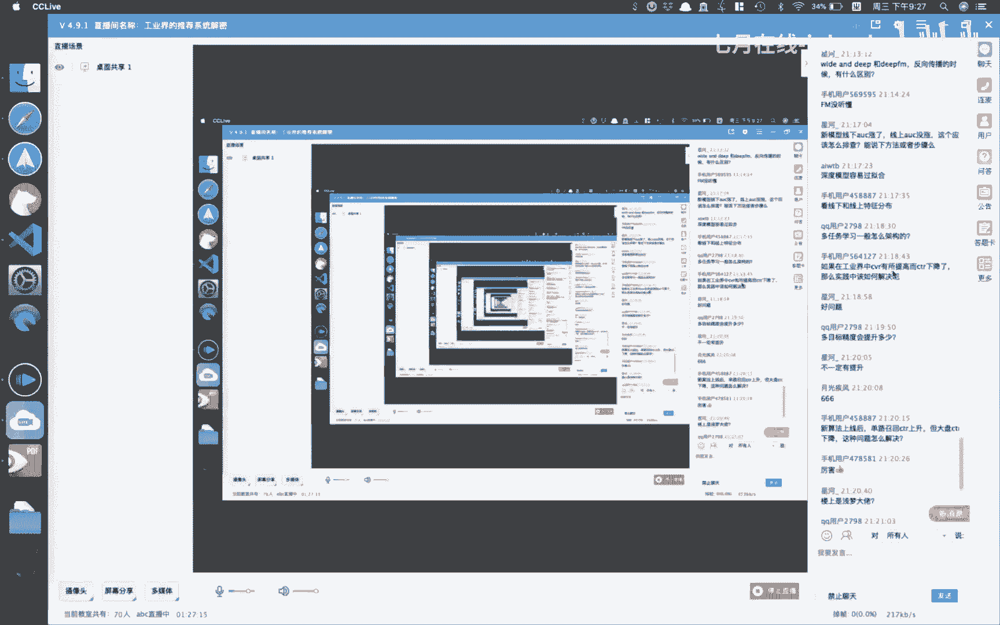

点IO的里面去看一下ruer。点LO。这个网站呢。是一个depperman的一个工程师，他所写的很多他自己的一些文章里面有一篇就是讲说MTL的一些思路的，大家这个可以去看一下，好吧。

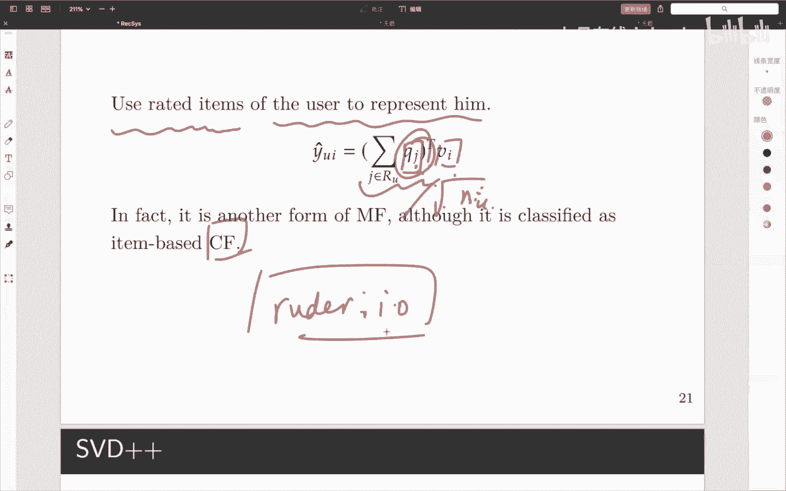

然后。😔，Yeah。这个刚才好像嗯解决了是吧？嗯，就是基本上这些我们也经常遇到，也是通过数据数据分析一步一步去查，这个基本上都是没有一个统一的一个法则，首先要往哪个方向去查。因为哪个方都可能出问题。啊。

大家如果在业界待购应该都知道说业界的系统其实是很混乱的。不像大家想象中那么简单。很可能一个电路出问题就会导致说嗯你这个模型效果就变得特别的奇怪。多目标的精度会提升多少，这我也不知道，好吧。

不一定有会提升吧，我觉得是这样的。嗯，新算法上线后，单路召回的CTR提升，但是大盘的CTR去下降，这种问题怎么去解决？嗯，一般而言我不太清楚你这个情况为什么会出现。因为如果说是你这个桶。

因为我们在去做AB实验的时候，基本上都是同与桶之间进行严格隔离的啊，你这样的话可能就需要去看一下你说这样的话，你是否有AB穿越的这样一个问题。呃，AB是否是正交设计的。

以及说嗯你上实验的时候是否是遵循着先拿小流量，再拿中流量，最后拿大流量这种上线方式。好吧，我觉得可以从这些问题去看一看。Yeah。Yeah。嗯。然后现代工业界有哪些思维和推荐算法结合的应用吗？嗯。

我不太清楚，因为我是专门做推荐搜索广告的。对于CV呢我不是特别的了解。所以这个问题可能如果呃我们的同学当中有哪些大佬的话，可以在评论席当中说一下，好吧。双塔的结果输入出据是一样的吗？嗯，是一样的嗯。

然后基本召核阶段使用的是协同过滤算法，后面排序用的是各种CTR算法也不太一定。因为召合阶段也有可能用CTR算法的一些副产品。比如说我们可能去用一些CTR算法出来一些be，直接进它的相似度。

也可能用一些协同过滤等等之类的。呃，都有可能好吧，这个也不是一概而论的。然后是root点L对，然后是呃做点击预估的时候，你加了特征加特征ACC提了10个填AUC没提升，又加这部分特征吧。嗯。

我建议说就ACC的提升的话呢，也可以线上去尝试一下，好吧，因为像刚才说的，有可能线下AUC提升了，线上没提升。大家可能说线下AUC没提升，线上有可能提升了。但你AUC如果降了，不建议去线上尝试。

因为一般都会变差啊。一般推荐算法自己写还是掉包呢，一般都是需要大家去熟练的掌握一些比较经典的一些网络结构。然后呢，自己在上面呢去进行一些改造，啊吧。

这里面就需要大家去首先要熟悉说经典的一些呃深度学习模型的一些做法。你说大家要对tflow的一些各种的基础知识呢，就比如怎么去写模型啊，然后一些网络结构组网的组网结构啊。

以及一些各种各样的一些中间的操作啊，都要比较熟悉，好吧。Yeah。推荐系统面试一般有什么问题？这个这个问题又变得很宽泛了。问题的话一般都是跟你简历去问你有什么技术站。比如你会你说你会用torflow。

可能我就会问你一些说他们的session是个什么东西等等之类这些问题，对吧？嗯，如果说有项目的话呢，就会从头到尾的去问你说你这个项目呢？从最开始嗯，你怎么准备数据的，怎么去建模的，怎么进行上线的。

怎么进行AB的，怎么进行评估的，怎么进行迭代的，然后你中间都做了什么事情，对吧？这些都需要去进行操作啊。然后偏重哪些？我觉得还是就是你要把你简历中所列到的东西，嗯，你需要了如指掌，好吧。

然后双塔DN和youtubeDN构建训练样本的方式是一样的吗？嗯，双塔DN刚才讲的是一个mar multitask learning的一个双塔DN，对吧？但是嗯如果说那个youtuDN的话呢。

嗯youtuDN其实更主要是偏向于那种。youtu那篇DN那篇作文，它更加偏向的我理解，其实是怎么去介绍说他那个inbedding一些用法，以及它中间的一些各种奇怪的一些操作。

比如说怎么去呃预估说它那个时长的呀，嗯，以及说怎么去做各种那些特征工程的呀等等之类的这些东西，好吧，嗯，以及说怎么防止那种对于序列化建的那种数据穿越等等这样一个东西，它们的侧重点可能不太一样啊。

在学习线上正负样本和离线会有偏差啊，这个怎么去处理？啊，这个是很常见到的一个事情啊，所以说我们一般在学习在进行操作的时候呢，都去做一些采样啊，以及说一些呃其他的一些技巧。

以及说在呃样本补偿补偿可能是在样本层面，也可能是在训练的lo层面都可能去进行操作，好吧。推荐好找工作吗？前景如何？我我是这样理解的，就是刚才我们说了三三大类嘛，推荐所有广告算一类。

然后呢CV算一类LLP算一类，这是三类最大的应用。我认为目前那个LLP和CV的呃。就是那个呃工作的这样一个数量呢，不如推荐搜索这么多啊啊，这是我的一个感受，好吧。Yeah。

然后推荐搜索和广告呢内部也比较相通。所以说基本上你学的一个东西，其他的话也比较能够轻松的触类旁通好吧。好，那时间关系呢，我们这节公约课呢就到这里。那感谢大家的这样一个呃呃收听。然后呢，课下的话呢。

我会把那个PPT呢给发到那个群里面去，好吧，然后呢大家可以去看一下啊，好。多目你想说的多目标吧，懂吧？嗯，业绩有拿到效果的，好吧。好，那没什么问题话，那我就结束这个直播了啊，谢谢大家。😊。

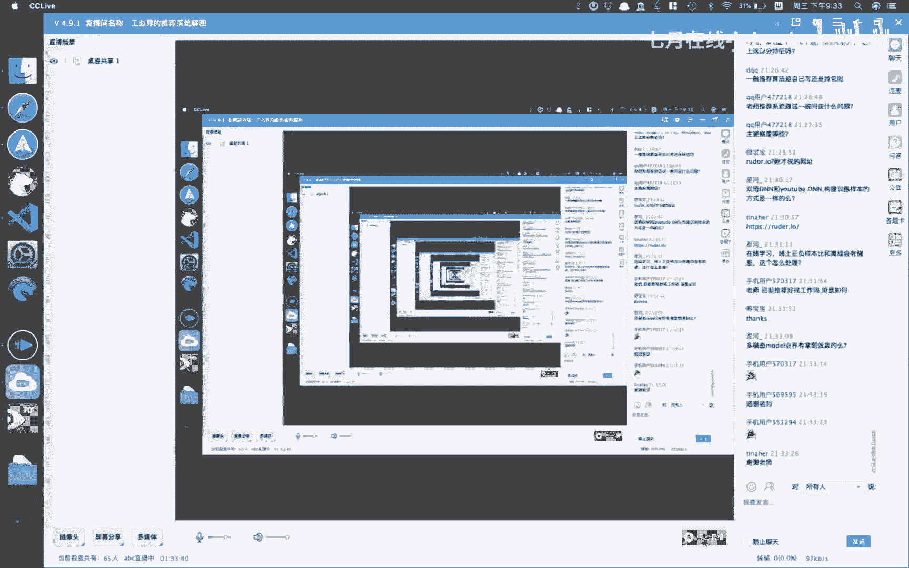