# 人工智能—推荐系统公开课（七月在线出品） - P7：图神经网络在推荐广告场景中的应用 - 七月在线-julyedu - BV1Ry4y127CV

🎼。

。

喂，大家能听到吗？那我们现在正式开始我们今天的这个公开课。呃，我们今天的主题呢是图设计网络在推荐广告场景中的一个应用。那也大家可以叫我吴老师啊。我们今天主题是这个，然后我们今天分享的内容呢分为三大块。

第一个呢是图神经网络的一个介绍。因，既然说是要图神经网络在推荐广告中的应用，肯定得介绍一下，是吧？然后第2块就是图层网络在推荐广告中的一些应用的一些案例。啊，然后第3块呢是图层网络在工业界落地的时候。

它需要有哪些必要的组件。因为我们不仅仅需要有图层网络的一个一些算法，还需要一些呃其他的一个工程组件的一个一个一个组合吧。这个也会介绍一下。

然后最后呢最后我们会留几分钟来介绍一下7月在线的就业班以及提升班。啊，然后中间呢我们会有一些思考和提问跟大家互动。然后针对踊跃呃问问题以及这个回答问题的同学，我们会在课程结束后呢。

送选5名同学送1000块钱的这个视频课程啊，价值1000块钱的视频课程。声音小吗？这边上次。我说话再大声一点吧。行，我再大声一点。不好意思。

我们先进行第一块啊图神经网络的一个介绍。呃，图呢是一个非常非常常用的一个数据结构。呃，比如典型的我们的数社交网络呃，用户商品图、蛋白体结构以及交通路网知识图谱。

这些都是可以描述成graphra的一个一个结构。然后甚至规则的这个网格数据呢，它其实也是图的一种特殊的形式。因此呢图是一个非常值得研究的一个领域。好，第二，我们说graph的研究一般分类有哪几种？

第一种就是经典的图算法，比如这个路径搜索二分图，这个在哪里面能用到呢？比如如果你要去百度地图或高德地图，那么这个RP算法这个路径搜索，也就是说你们会用到graphraft的一些算法。

然后二分图这个在哪用呢？这个最典型的场景就是滴滴啊，滴滴这个分担算法是一个二分图匹配。呃，还有一类问题叫概率图模型，要条件随机场。这个选LP的大家都知道这个CRF对不对？这个用的特别多。

然后第3块就是我们今天介绍的一个主题啊，就是图神经网络。有grab bedding以及机C，这主要包括这两大块。呃，这个知识图谱的一些内容，我们不在这里面做一些设计啊。然后第三个说一下图示你网络。

它最近从16年开始是一个非常火热的一个研究方向。然后这里边有几个原因吧，第一个就是深度学习在其他领域的一个成功，包括C位以及NOP。呃，然后这些都是规则的一些一些网格数据。

然后在不规则的网格数据也想有也享有一个拓伸。那么第二个呢就是广泛的使用场景。上面也说到了很多东西，很多的场景都可以建。呃，建成一个graph的一个问题。呃，这边我列了1个KDD2020的1个选题啊。

看基N它其实是力压群雄的，它就是排名第一。并且这一个是从17年大概就一直是这样一个趋势。

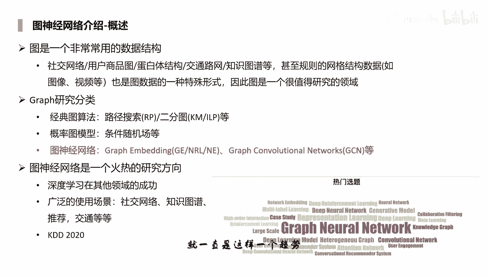

嗯，这边附赠大家1个CV的一个一个全景图。这边是我总结的，到2018年左右的。嗯，这个。这个图给大家售出来其实有两个目的吧。第一个目的就是GNN。我刚才说了GN它的这个出发点是什么？

他是怎么能够想到这样一个问题，就是由于这个CN的。这个在视在视觉领域的一个成功，以及LP深度学习在LP一个成功。所以想这样一次迁移。然后第2块呢，就是想想给大家一个提醒，就是说算法的内核其实是一致的。

不管是CVLP还是推荐广告，还是其他所有的，它其实都是非常非常相关的，底层的东西都是一致的。😊，并且有一个发展的一个先后顺序。一般来说，我们认为CV领先LOP1到2年。然后LOP呢又领先推荐1到2年。

所以如果你要是想做推荐或者正在推荐推荐的同学，你可以多关注一下LLP以及CV的一些最近的发展，里边会给你提供很多的输入，以及一些inight嘛。这个举个最简单的例子啊。

比如你我们现在在用的路这个这个优化器。嗯，最近的在工作中，其实呃我们都知道LPtranser的时候，它用了葛路嘛。我们换成葛路的时候，它就是在某些场景，它能够有一个一定的提升带来一定的业务收益。😊，啊。

当然还有这个attention，嗯，这我给大家提一个问题，大家都知道这个注意力机制。我想问一下，注意力机制最开始来源于。哪里呢？哪一块呢CVLP还是推荐的。哪尔人知道吗？还是说声音会大一些。这我已经。

嗯。啊，其实是CV啊，我看到有有同学回答对了。它其实是CV先有的这样一个思想。然后呢，在LOP里边。嗯，我们都知道是RN加这个tention。呃，然后使得这个这个ten在LOP领域发扬光大。

以及后边又反补给了CV。嗯，好好好，我们不讨论这个声音问题了。😊。

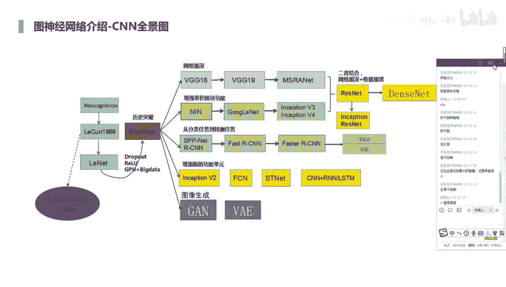

然，我们接着往看。呃，图神经网络，我们第一块介绍graphve me graph embedding。那么我们先说一下什么是inbedding。呃，inbedding呢在数学上是一个函数。

就是一个X到Y。那这样一个函数就是从一个空间映射到另一个空间。啊，通常情况下呢是高纬抽象的空间，映射到一个低为具象的空间。😊，那第二个性质呢就是inbedding一般是。稠密的分布式的表示。😡，啊。呃。

这是一对应于这个oneho编码的。待会我会说一下。然后第二个，为什么会出现ab这个这样一个东西？😊，嗯，第一个原因就是抽象的事物，它本应有一个低V的表示。啊，我们知道啊当你看到一个图片的时候。

图片里面有一只狗，比如最上面这个图像素图。😡，你看到它是一张狗，但是其实它最底层的表示是什么？它最底层的表示是一堆的像素，对不对？那这一堆的像素的表示就是这只狗这个图片在视觉领域的最地位的一个表示。😡。

那同样你看到一个单词dog，那么它本身也应该有一个这样的一个表示，对不对？那这就是我们说的这个呃what vector。以及我们看到这个下边这个虽然是个图片，但是我想表达的是一个哈士奇。

但我们看到一个哈士奇，一个金毛，一个比熊，那么它本身也有自己的性格，对不对？甚至每一只狗它都有自己的性格，它其实也有一个最底层表示啊。那第二个原因呢是计算机比较善于处理地位的信息。

这也是为什么CV发展要较NLRP较要叫快一点。😊，因为他善于处理这样的信息。然后第三个问题是解决汪浩的编码的一个问题。汪浩的编码有什么问题？呃，第一个问题呢就是它随你的物料的呃这个随你的词汇增大而增大。

比如你去做what factor，那么你的你的cos，假设如果有。呃，十万个单词，那你们汪浩的编码就得有10万位。如果有1000万，那么你的汪浩的编码就是100万位，所以它是不固定的。然后第二个问题呢。

就是汪浩的编码，它是一个讨巧的方式。它每一个每一个单词或者每个ite，它只有一个一，对不对？那那你这样的话，你没有办法去表示一个谁和谁相近的这样一个。这样一个关系。

但是inbodydding呢它是可以做到的啊。然后呢，现在 embedding用的很成熟了，从what five开始，然后doote vectornote vector。

以及今天我们讲的这个grambedding啊。都算。

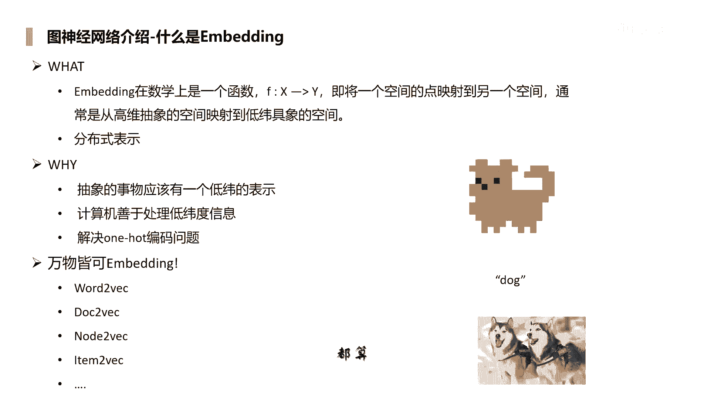

呃，word大家肯定都很熟了，我这里只是秀出来，我这里不再单独讲了，大家只需要看一下最右边这个式子，这个是最原始的推导。大家看到这个式子的时候，有没有。😊，有没有一个。有没有很熟悉？我想问一下。

我想问一下这个狮子。跟soft max有什么关系？😡，有同学知道吗？看着是不是很像一个oft mass一个回归。😊，啊，其实what vector呢它本身最终的优化的一个式子。

就是一个soft max的一个形式。但是它跟soft max区别是什么呢？soft max回归或者我们叫LR回归，它的输入是确定的。比如你对图片做一个二分类，那么你输入的是一堆像素，对不对？

这一堆像素不会再变化了。😊，但是我们做word back的时候，我们本身要求的那个东西就是输入的那个向量，它是它是你要求的。然后还有一个网络中的一个参数也要求。

所以呢它是输入与输出与那个参数都不确定都要优化的一个问题。那它跟softm的区别本质区别什么？就是输入的不确定。啊，这也导致了它的优化方法。s因为我们知道是一个是一个特优化问题，你可以直接求解，对吧？

然后whatner呢就是由于它输入输输入以及里边的参数都不确定。所以我们需要有一个类似于这样一个举值上升SISGD这样一个方法去求的。😊，对吧，然后第二个。我们我要我要增加大家一定的敏感度。

大家知道下边这个式子叫什么吗？😡，不管是soft my，还是what vector下面这个。😡，我们通常叫在叫做EZ。😡，这个Z表示的是配分函数。嗯，就是你对全局做一个计算。拳击做一个求和。

那这个计算是不是很耗时啊，那what vector怎么做的呢？我们都知道副采样对不对？副采样其实它的学名叫做NCE噪声对比估计。😊，嗯，给大家一个提提醒，就是以后你只要遇到这样一个配方函数的计算。

那么首先想到的就是噪声对比估计，也就是我们常说的副采样。😊，啊，关于这个我在PPT里面贴了一个链接，大家可以去了解一下这个副材样，为什么最后的优化是跟原来的式子优化是等价的呢？这样一个证明啊。

有兴趣同学可以再看一下。😊。

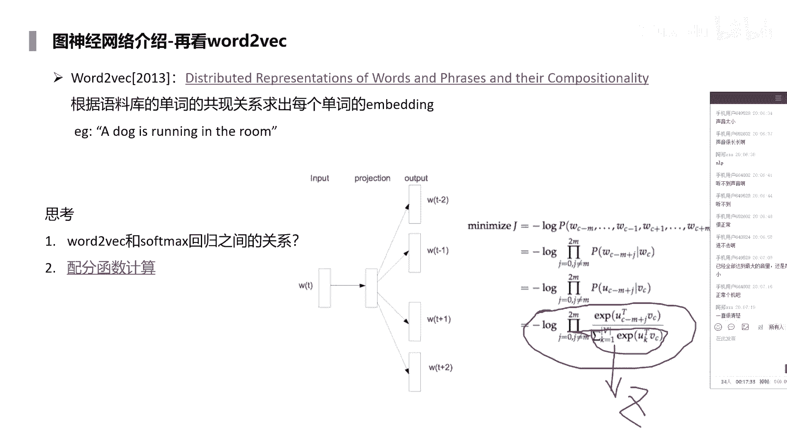

然后现在我们就来看一下gra band的一个全景图。呃，当然这个gradding从16年开始到现在，它已经有很多很多的这样一个分支了。呃，呃。

这里边甚至还没考考虑那个知识图谱的一些transE啊穿A穿H啊这些东西。我们今天呢只介绍一些特别重要，特别必要掌握的。不管你是在工作中以及你去面试，只要说你学过或者了解过grambedding。

那么这些东西一定会被问到的啊，我们只讲这些最必要的东西。😊。

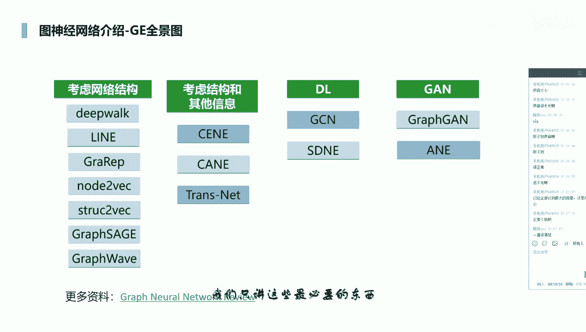

啊，第一个呢就是dep block。这个就是govermentdding的这个我们叫做十祖了啊啊他的思想非常的简单，他就是纯的借鉴了what vector。😊，我们想象一下，假设我现在有一个图。

我要让你去做ground bedding。那么你那么参照word vector，你有什么想法呢？它缺什么？😡，他缺。呃，word vector首先有呃有几个要素，第一个要素是词库词表，对不对？

我们的词对应于这个graph上词表是什么？每每个的no一个 node就是一个单词。你有你这个图上有一个节点，那么你的词表就是一亿。还有一个概念叫句子。我们word vector的时候会有一个句子。

然后句子会做一个Ngram。😊，比如我们就做5gram吧。那么也就是我们用sgram的方法的话，就是用中心词去预测前面两个以后面两个对不对？那我们需要构造这个句子，在图上怎么构造这个句子？

然后第三个这个要素是词库，也就是一堆的句子组成的一个语料，不是词库语料库，一堆的句子组成了一个语料库。那么呢，depwalk其实就是解决了这三个要素。我怎么去从graphra上去做这三个要素。

做成一批句子以及语料库以及词表，然后去按照mo effect方法去优化啊，它其实思想非常的简单。就是随机走，这其实也能看得出来哈，就是在在一个领域初始的时候，我们想做出一点贡献是多么的简单。

像这篇论文引用量应该已经非常非常高了。😊，那具体怎么做的呢？比如我们有一个有一个图，我在这里边简单给大家画一个。假时我给大家画一下。比如这个全值是一，这个权值是2，这个权值是3，这个权值是4。

我这这样一张图，那么从从这个节点开始。我去随机游走，按照什么方式游走呢？这个式子其实看见这个拍VX就是从V到它是表现的一个条件概率嘛。从V节点下一个节点游走到X的一概率。这个Z呢就是这个配方函数。

然后拍VX就是它的全值。比如我这个这个叫一节点吧，这个叫二节点。我的P。然后21。一它的概率等于什么呢？下面就是一加2加3加4，对不对？分之。呃，1到2的全值。我们这个叫二吧。这个节点叫一，那么就是。

啊，行，这方面我就如果大家清楚的话，这个地方我就过快一点。对，这个就是2啊。这样就是一个一个一个它的一个随机游走的一个概率。那么你可以并行的去随机游走多个，然后随机出来一些句子。

然后按照what的一个方法去优化就可以了，对不对？然后这是一个呃为掰的那一个十子。然后下面的line这个算法是在工业学业中用的是非常非常多的了嗯。这个方法这个方法跟前面那个方法呃，建模的一个思路。

它其实已已经有完全不一样的。他已经不借鉴bo factor了，他的思想是我去定义了两种相似度，一个是一阶相似度，一个二阶相似度。一阶相似度就是以边权决定的就是。A和B的边权越大。

那么我认为你们两个的这个相似度越大，一级相似度越大。那么二级相似度指是什么？二级相似度指的是一这个节点跟一节点，假设有5个邻居，二节点也有5个邻居，他们两他们这个邻居的重合度。😊，我们认为是二阶相似度。

下边就是这个图以及这个式子，这个就是这个图，这个就是一阶相似度，这个就是二阶相似度。如果大家可以随时的在公屏上说一些话，我能看到。比如有一些哪个地方想快点，哪个地方想卖点。那么一级相似度。

我们这边比如六和7这个节点，它表示的是一个全局的1个W分之1个WIJ是不是？就你指的就是这个边权越大，然后。他们之间的这个这这个管inbody之后的这个成绩掩盖越大。

那么我们知道这个我们去优化的这个目标是这个。然后呢，你in binding之后，它有一个这样一个概率去表示它们的一个相近程度。那么这两个分布我们应该去怎么衡量呢？这是一个我的思考题。

如何衡量两个分布的差异？大家都不想听理论是吗呃。其实我想跟大家说一点呢，就是你在面试的过程中，这些理论特别是对于这个研究生或者刚毕业的情况下，呃，一般做的项目都是比较简单的。对，都是比较简单的。

然后会主要考察我多年的面试的经验的话，非常重视你们的基础。嗯。我希望你们对这个基础一定要有，因为我里边会有一些引导大家思考的一些问题。这些问题我可以说在我面试的过程中，我会经常问到。

比如你要是了解烂算法，那么我就会问你这些。嗯，我不跟大家讨论了。😔，呃，衡量两个分布的差异方法呢，其实刚才有个同学说了啊，这个交叉熵，也就是我们常说的CE loss啊，还有很多方法。

这个我们统一的叫做散度。😊，这个我附了一个链接，这里边总结了机器学习中常用的散度，比如推土机距离啊，这个呃各种G散度啊，这种乱七八糟的散度，这个都在这里边有描述啊。啊，第二个。

所以第一个其实一阶相似度很容易理解。那二阶相似度怎么理解？二级相似度我们以56这个两个节点来举例子。你看五有这样12345个邻居，6有12345个邻居，这个式子我不给大家详细解。

但是我给大家呃通俗的讲解一下这个二级箱子怎么来的。比如5到一的这个边权，我设为1234啊。然后6到1234的这个边权也是1234。他们的边权也就是完全一样的。那么通过这个式子优化。

我们就得到五和六的相似度是一，它们是完全相似的。你对二级相似度量你是区分不开的。那么如果5跟1234的这个权值是12346跟1234的权值是4321，他们虽然都相连，但是他们的条件概率不一样。

比如5到1的条件概率是1加2加3加410分之1，对不对？那6到1的概率是1加2加3加410分之4，对不对？他们这两个概率是不一样的。他们优化出来结果也不一样。那么你要如果要少一个节点。

比如5只跟123相连，6跟12相连，那么他们只有公共的一个节点，所以他们相似度又不一样。通过这个方程呢，它能够去优化这样不同的一个条件的这样一个呃。呃，最终学出来这个inbed一个相似度。呃。

那么那么这样出现一个问题了，我不知道lan这个算法你们有没有实操过，那么lan。我们能不能两个相似度一起优化，也就是los一阶相似度加lo二阶相似度直接加起来一起优化。啊，其实是不可以的。

由我们去看一下这个例子。比如五和6，在一阶相似度的时候，他们是。他们相似度是多少？是零，对不对？他没有编权。但是你在二级相似度的时候，按我刚才的假设它们是完全相似的，也就是相似度是一。

那么会出现什么情况？一个los使得他们俩无限的接近，另一个los使得他们俩无限的推远。那么这样你是学不出来的。所以正常的做法我们是分别优化的。😊，也就是通过一级限速度求一个inbedding。

通过二级限速度求另外一个gr embedding两个gr embedding，你可以通过poing的方法，不管是conact还是这个averagepoing还是somepo，你给它弄在一起。

最后得到一个gr embedding。😊，嗯，这是我们。这如果说你了解练的话，这个很容易被问到。然后然后这样还有一个启发，就是我们这里考虑了一级相似度、二级相似度。

那么我们可不可以考虑三级相似度、四级相似度呢？如果你了解聊上法肯定会问你啊。啊，完全可以考虑啊，就是下面这一个下面这个我们就不详细解释了，只需要看一下。😊，这个相似度的这样一个呃感觉。

上面所有的这一行A比EB比FCC比G和D比H相似度都是上面比下面大。比如第一个是因为全值大。第二个是因为他们的路径多，从A到A1到A2有4条路径可以走。但是下面这个只有一条，这都是类似的啊。

这样一个算法，大家可以再去看一下。

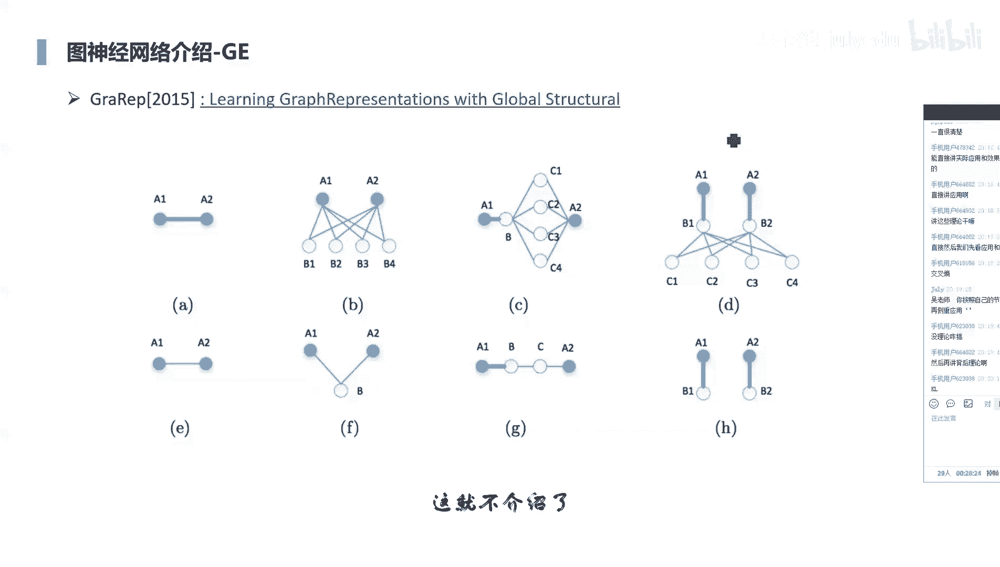

嗯，这就不介绍了。嗯，下面介绍一个比较工业业比较特别常用的一个算法，叫note vector。😊，啊，这个算法肯定很多人也听说过。我在这里也给大家再简单的介绍一下。😊，这个相似度。😊。

这个这个gramme bedding的方法来源呢还是word vector。就他的思想来还是 factor，并且改进了，也就是他的其实最重要的一个贡献就是改进了deep block。😊，嗯。

我们知道deep walk它那个呃ground bedding的方法，我们可以理解为它是1个DFS的。我们看下面那个图。下面这个图从U到A4到A5到A6，这是1个DFS一直往前走，对不对？

这样通过DFS找到一个序列，然后再去做wordl vector，这叫做我们叫做DFS的一个方法啊。然后第二个叫内容相似性。内容相似性的，假设就是我跟谁的边权越大，我跟谁就越相似啊。

这样烂是不是一个典型的这样一个算法，因为他们去去优化U跟S1S2S3S4的相似度。对不对？一节一节相似性的情况下。那么word呃note vector呢。

它是定义的一个二阶的一个readd mark平衡了BFEDF。啊，我们看这个图。看这个图，这个图T是刚刚上一次采样到的节点，V是当前这次采样到的节点。X1X2X3已是下次它要采样的节点。

那么P和Q呢就控制着这个采样的一个一个一个算法。P是控制的回头率。假设P是无限大，它就不回头，一直往前走。假设P是0。1，那么回头的概率就很大十，对不对嗯？嗯，Q呢控制的是BFS与DFS的一个一个平衡。

假设Q等于一。那么你到X1X2X3都是一，是不是全值是一样的。那么他们的就是BFS和DFS不做任何的区分。那么如果Q非常的大。那么他是倾向于。这个BFS的，你看它会倾向于往X1X1走，对不对？

如果要是Q非常的小非常的小，也就是这条边跟这条边很大，那么它就倾向于DFS往前走。😊，嗯，那他采样到这个序列以后呢，就跟deppro是一样的嘛，然后就做what factor的一个呃。一个优化就行了。

就解那个mail。嗯，这里边其中有两个应用，一个是。嗯，一个是腾讯的，一个是facebook的，他们都是一个广告的一个一个应用。呃，looklike大家可能都了解吧，我简单再复述一遍。

就是呃广告主给你了一批种子用户，也就是我我想把这个广告只投在这种子用户上。但是呢广告主其实他的思维是有限的。他只了解这些种子用户。其实我们平台上呢，他取更多的用户呢，我们可以去给他智能的放量。

这个叫在自己跳做叫做智能放量，在其他的里边可能叫looklike定制化受众，对不对？嗯，我可以自动给你放大我的量，就是你给了一批。😊，呃，人，然后我给你再寻找一批跟他相似的人，给你也投放。

然后你的收益是不是就更高了，对吧？嗯，这个n writer在这上面有些应用。😊。

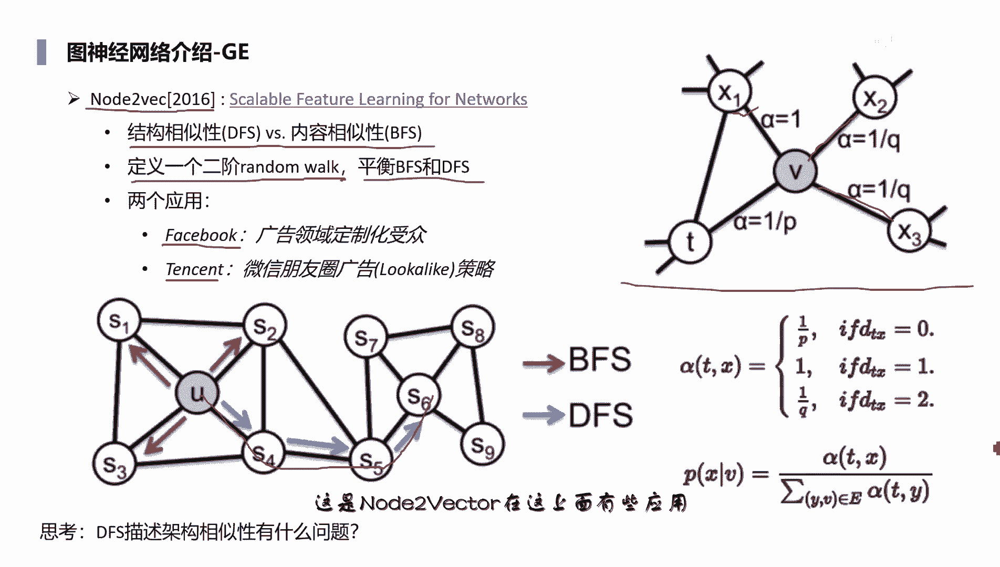

然后我们就去看一下呃这个structure vector，这个是刚才我们介绍的是。现在现在我们刚才我们没有介绍一个概念，叫做结构相似性与与内容相似性。结构相似性指的指的是。呃，刚才我们介绍了一下。

就是BFS，它其实是倾向于内容相似性的内容相似的相似性的定义就是说相邻的节点它具它更相似。那么结构相似性它其实是另一种。比如我们看这个U和这个V。他们在图中的地位周围的环境相似。

那么他们应该具有更大的相似度，这是结构相似性。那么DFS能不能解决这样的问题呢？能一定程度上能因为它你的随机游走可以游走的比较长，能一定程度上。但是如果这个图很大U和V中间隔了很多很多。

那么你U是游走不到V的，也是解决不了这样问题的。对，这就是DFS解决结构相似性有一定的问题。那么str vector怎么弄的呢？它是呃通定义了一个。通过一个分层定义了一种结构相似性。呃，这个是在。

s vector一个最大的应用就是在风控领域。风控领域应该是一个标配的。风控领域呃，这是蚂蚁金服的一个一个一个他们一个在人工智能大会上的一个介绍。

他们相当于相对于note vector AOC从70到9类有了质的飞跃。这个我们后面可以解释一下，为什么str vector相对于note vector在风控这样一个场景下有更好的这样一个适用性嗯。

这样呃这个地方我们先介绍一个这个strstr vector怎么做吧。嗯，我先看一下上面note好像好像有些问题啊。有什么trick，实际效果用起来微乎其微啊，note vector这个。😊。

trick的话一般我们都是直接用的，像line算法用的也比较多。办法对样本加权，呃，这个就是构图的构图的这个方法了，也不是你去不是你去在算法上做改进，而是你在构图上做改进啊。我举个例子啊。

比如你在广告领域，那么我们可以用点击图。😊，以及点击编和转化边。那么我们转化边跟点击边，它应该有一个权值的对换。比如你自己点击的权值是一，那么你转化的权值可能说五也可以是十，也可以是20，这个需要调。

那么这样就对应一个采样的一个概率了。比如你一个user对某些广告非常的高的点击，但是但是对他们转化很低。但是你对另一些广告呢，你转化很高。那我们其实呃广告的优化它最终优化的是广告主价值嘛，所以。

更希望是转化的价值大。所以要让他们去更多的往肯转化的这样一个广告上去随机游走这样一个呃所以广dding其实最最重要的不是这些算法，而是你构图，这是最底层的基础建设。我们接着说这个str vector。

嗯。那么我们。有这个有这样一个图之后，我们怎样去定义这个结构相似性str vector给出了一个一个方案。就是说我们去比较，比如这这个优和V，我们比去比较优和V他的邻居相不相似。

如果他的他的一阶邻居相似。那么我们就去比较他的二阶邻居是不是想死。😡，如果它的二阶领域还相似，我们就去比较三阶，对不对？总能比较到一个不相似。假设U和V在第十0层都是很相似的那他们确实很相似了。

那如果U和另一个节点，比如X节点，它们在一阶相似，二阶相似，但是在三阶就不怎么相似了，那他们的相似，U和X的相似度是不是没有U和V的相似大，对不对？这样就是这样一个思想啊，str就是这样一个思想。

它就是它就是去你比如这个SRUKSRKV嗯，这个东西我就。😊，就是我刚才说的是那样一个邻居，它是邻居的一个度的一个序列。比如U的话，在U这个C节点的度，你可以是初度入度，因为这个是无相图，无相图嘛。

比如C的度是2，然后D的度是3，然后这个度是一，然后这是四，这是8，那么你就等得到一个有有序的一个序列，12348，对不对？然后V呢它也有一个序列。那么你就去比较这两个序列的相似程度，如果相似了。

就再去上层再比较啊，这样一个比较这个相似的用什么算法呢？啊，还有一个算法可以去比较嗯长度不相等的list的一个相似度。具体思想是这样啊，你看这样一个式子，然后当K变大的时候，K就是我说的几切相似度。

K变大是不是等价于CN的感受也变大？一阶的时候感受也只有一，对不对？二阶的时候感受也变成了2。嗯，所以自底向上的一个比较一个相似度。然后就是构造一个分层的图。刚才这个刚才这个我们是FK。

就表示它的第以它的第K层的这样一个相似度构建的一个分层图。然后会必会构建嗯一阶的相似的一个图，二阶的相似一个图，三阶的相似一个图构造好多好多层。然后我们在这样一个分层的这样一个图上给大家大大概画一下。

大概就是这样子啊，这是一个图，这是一个一层图，然后这是一层图。对，真是一层图。然后每一层图的节点都是一样的。然后他以这样方式定义一个一个每层之间的一个一个相似度。比这个是。1到2它的相似度。

这是K等于一的时候，这是K等于2的时候，1到2的相似度。因为刚才那个FK它是一个具体的函数，所以这是一个负相关的。然后还有一个问题就是一和一之间它也得连。这就是刚才说的，我们要去怎么去向上游走。

因为你下边如果比较的差不多了，你要往上游走，对不对？相似相邻这个线同层的这个权值，大家比较容易理解啊，就是按照那个刚才我说的那种方式去构建。然后相邻图我们去怎么构建它的权值呢？啊，首先我都倾向于往上走。

你在下面比较完了之后，我就倾向于往上走，因为上层更能反映你们之间到底是不是相似，对吧？所以这个WUK到K加A，也就是DK层到K加一层，全值一定是大于K呃，这个2到1这一层的。

2到3这一层一定是大于2到42到1这一层的啊。一定是要往上走的。那么那么你2到3它有多大的权值呢？这个取决于你这个一这个节点和二这个节点呢相似的程度是不是。是不是非常的普遍？举个例子呢。

这个式子怎么理解呢？这个式子看起来比较繁琐。大概意思就是说，假设一这个节点。我跟很多节点，比如跟三。跟5。跟5它的相似度都很高。😡，那么说明我这个节点，我这个一这个节点在这一层。我是没法比较的。

就是我太普通了，我必须得往上走，所以它的全职就更加往上走。这个就是代表了一个平均的一个水平。WK。当我当我有多少个节点大于这个平均值。我就权追越大啊这样一个思想啊。呃，下面就可以讨论一下。

为什么风控场景str vector相对于note vector有提升。大家不喜欢学理论，但是呃当你在蚂蚁金服的时候，假设你现在是蚂蚁金服的工程师。你看到str vector这样一个算法之后。

那你说你用不用呢？😡，大家可以想一想。嗯，其实其实最本质的原因是这样的note vector大家想想它首先它通过DFS平衡DFS以及BFS它想获得长远距离的。😊，一个对在推荐领域是没有用的。

不是我我这个是想说它为什么在风控领域用note vector，它是通过平衡DFS和BFS采样，得到一个序列，然后做grounddding，它无法获得长距离的这样一个一个一个结构相似性。

str to vector可以。那么风控场景就需要这种结构相似性。我给你举个例子，你在支付宝里边会有很多的关系。你在淘宝里边，比如关注很多商家，有一些大V，有一些呃有些大的机构，他们都有很多很多的边。

你就是。他的还款能力强不代表你的还款能力就一定强。但是呢如果这样一个商家跟另外一个商家，他们有同样的体量，那他们的还款能力或者借助能力其实是更相似的。也就是这个在社交领域其实也比较像。比如你在微博里边。

你的相似度，你关注了很多大V，但是你跟别人其实可能相似度没有那么大。😊，但是大V跟大V之间，他们在网络中的影响力可能差不多。是这样一个。然后第二个我们还看到这个ZK对不对？我们已经见到很多好多次ZK了。

一定要敏感。😊，看到ZK这个论文中使用的是层次sof我们知道的时候，这个ZK它有两种优化方法，一个就是层次sof max，一个是一个就是NCE，对不对？我们现在目前我们基本常用的都是NCE了。

s很少提了，这里边为什么它可以用of而不是NCE呢？首先可不可以用NCE。😊，那其实肯定可以的，只要看到这个ZK都是可以用NCE的。😊，但是这里也可以用sd max，为什么？这一个一个最主要的原因。呃。

你们想象一下呃，word to vector的时候，层次of max是怎么构图的？怎么建这个数字？哈弗万数是不是哈弗曼树的全职是什么？词频？😡，那你在LOP领域持贫天然就是不公平的。I love。😡。

以及ityou啊这些单词词平非常的高。但是有一些词appreciate啊一些非常长的词啊。它的这个词屏就低，那么它构建的哈弗曼数呢一定是不怎么平衡的。

但是对于ground weddingdding这样一个图，每个节点出现的词频都是一。所以它的它的构建的哈 man数一定是平衡的。所以它可以用你在work vector的话，你用的话效果就没有那么理想。

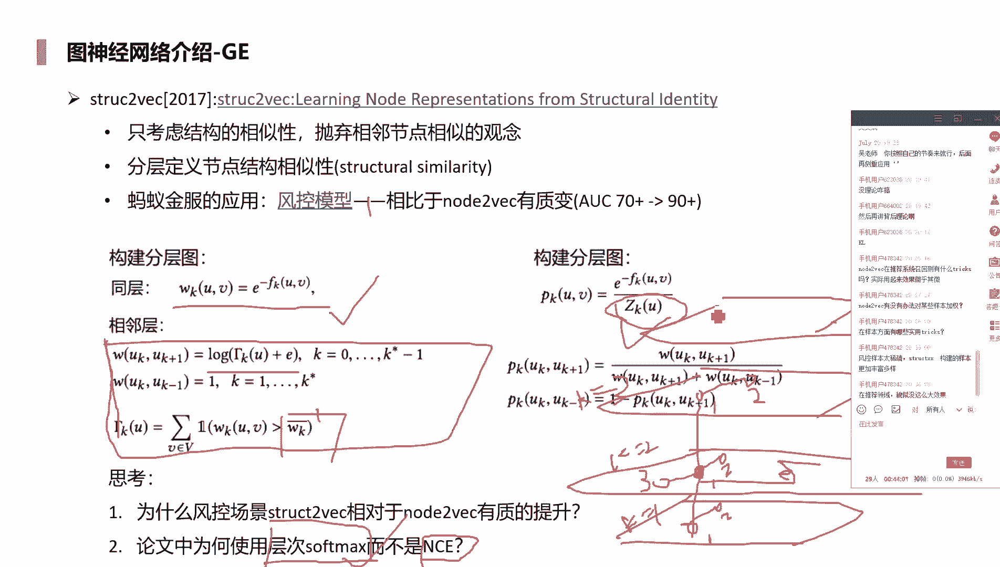

这是一个本质的原因。然后就介绍graphph6这个算法在呃刚才str vector给大家介绍，不是说它在推荐系统有有用，而是呃想给大家介绍一个结构相似性以及内容相似性的一个概念。那。

graphraph s呢是在推荐系统广告大规模落地的情况下，一个非常犀利的武器。这里再介绍一个概念，归纳式学习和直推式学习。刚才所有的介绍到算法都叫归纳式学习。归纳式学习指的是你有了一个图。

那么我可以用任何的算法，note vector threat vector呃line是吧？呃 graph representation这些都可以。你学到了图中每一个节点的inbedding。

然后你给他存到了一个词表里边。不能动了，当你涂变化之后，你需要重新学习的。😡，那么直推是。哦，说错了，刚才是刚才是止推式学习。那么归纳式学习呢，归纳式学习graph就是一个代表。

指的是我既学习你的inbedding。同时呢。我在你。呃，学你inending的时候，我还学到了一个方法论，就是我怎么得到你这个inending。那么这样的时候，当你的图有一定的变化的时候。

我可以迅速的响应你这个变化。你没有见过的这个节点，我能够通过我学到的这个方法论，通过他的邻居聚合到你这样一个节点上，得到你这个节点的一个indding，然后通过不停的这样子，这在推荐系统非常重要。

推荐系统的图第一非常非常的巨大。第二，变化性非常的快。你用户每一次操作都会对这个图产生影响。😊，嗯。然后我们看看一下graphra sgraph这个算法相对于前面那几个非常的好理解。这个算法分两步。

第一个采样，第二个聚合。😊，采样呢呃。采样就是就是你去对一个节点，你去踩它的一阶邻居踩几个，对二阶邻居踩几个。比如你对一阶邻居，你你规定采10个啊，我们看这个图。他只采了3个，对不对？

我们就盘dding嘛，盘顶到10个，然后你二阶领域它也采。采10个，然后你二级领域还是采不到，那你就继续判定是吧？就这样一个采样过程，采完样之后，它就变成了一个标准的一个矩阵了。

因为你每个节点都有10个10个邻距。是吧你判定的也算吧，然后呢，你就去学他的邻居到他的聚合的一个这样一个一个函数。嗯，我们具体的我们去看这个这边左左边这个算法。嗯。

这个H0H0这个XV就是我输入的这个原始的inbedding。嗯，比如如果你是推荐的这个场景下，那就是推荐的原始的inbedding。就是你用其他的方法。第一开始先学到了一inbedding。

然后你再用graphph seek去让它去学到网络的结构。嗯，这样一个东西。然后V就是所有的节点了啊，K大K就是你要采样的这个层次。刚才我们一节领域二节领域采样嘛，从第一层开始。

那么你采样到的对于每一个节点U。你采用了他的几个邻居。对不对？采样完了之后。这样一个这样一个邻居跟他通过一个聚合函数。然后聚合到了第K层，就是你DK层的这个所有邻居的这样一个表示。

就是你先对边上的这一些。做一个聚合。对吧然后呢聚合完了之后，你还需要跟中心这个节点。我们在所有的这个刚才忘了提了，我们在所有的这个gramdding上，其实都有一个呃。暗喻的一个假设就是这样一个自连边。

自联边，你再跟自己V这个节点跟V跟V的一个邻居，然后再去。做为1个NN嘛，慷开的出来，然后做一个N做为一个激活就完了。然后最最后最最个nm这就出来了。所以这个算法非常简单啊。

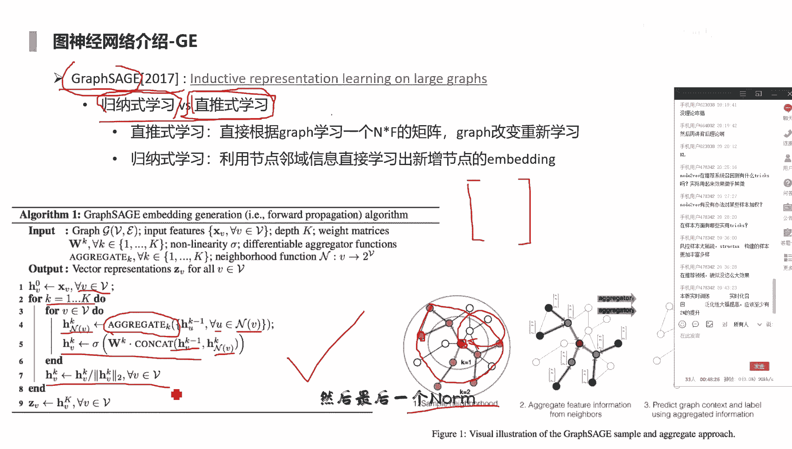

简单有效。我们简单说一下这个采样算法，采样算法一般我们就是random采样了啊，采样。😊，这个K阶的这个一定一定数上一个一个节点就行了。然后聚合算法嘛呢？我们一般有几种，一个是minpo啊。

一个是maxpoing以及LTM这是论文中提到的啊。LSTM的话这这里边要提醒一下，就是每次要shuffle一下呃，问因为是LSTM它是一个序列的算法。但是我们这个采样你是需要跟序没有关系的。

因为你采样的时候，你就跟序没关系。你第一次可能采样1234，你第二次可能采到同样的这几个点，但是可能采到4231，对不对？所以你需要uffle一下，每uffle可以解决了。

G seek后面我们会介绍它在推荐中的一个逻辑，就是拼C个算法。这个算法呃现在应该在很多的推荐场景上都有落地。

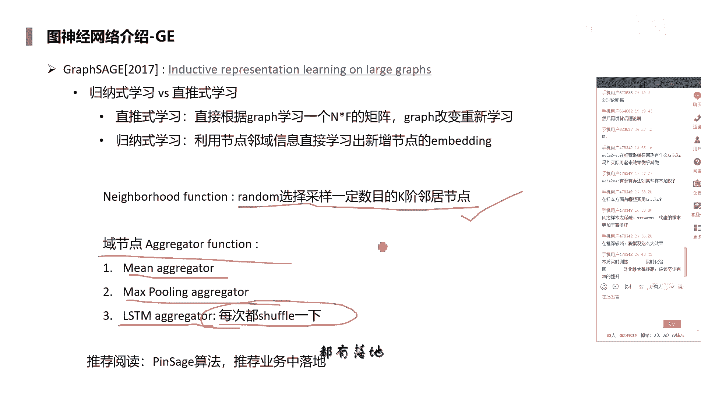

呃，最后一个我只是简单的给大家呃秀出来，呃，也不再给大家讲，这个也是一个结构性的一个一个假设，就是结构相似性的一个假设。呃，问题是非监督，完全非监督。呃。

回顾一下str vectorstr vector我们的假设是什么呢？它的就是一个鲜艳的知识是。😊，呃，节点的结构相似性可以由它邻居的度邻居节点的度的序列来表达，并且可以分层的表达。这是你输入的一个谐音。

哎，但是graph wave的话，它是不需要任何线验的。你只要给我一个图，我通过呃我通过一些方式，我就能够得到你的invent那个函数。inbodydding嗯你大家可以看一下这个这个效果。

这是一个算法，我没有讲的这是str vector的。然后最左边这个是。we with我们可以看到他把这个这个节点分的特别清，每个颜色其实代表一类，它能够分的特别清。所以这个效果还是很不错的。

并且不需要学习，速度非常的快。如果有需要在某些场景中需要结构相似性的话，大家可以试一下。

啊，给大家简单总结一下啊，这这个理论部分我们也。也过了一会儿了啊。啊。ground embedding呢其实最主要的问题。呃。就是你要怎么选。因为广卖到现在我从第一开始给大家售的那个大家族里面。

它有很多很多的算法，实际上一定要跟你的实际问题相关，你选择什么样的模型？嗯。这个我不给大家读了，大家可以看一下啊。总之呢你选用什么样的模型取决于你的问题。然后呢，最重要的是构图，大家一定要记住这句话。

在图神经网络领域，你不是所有的图，都是天然成的。你包括时间网络，它虽然是个天然的图，但是这个图你需要去做一定的refin。比如你的全职需要做一些鲜艳的一些加工。电商领域也是你一定要把这个图构好了。

图构好是你走上上一步的最最关键的一个。

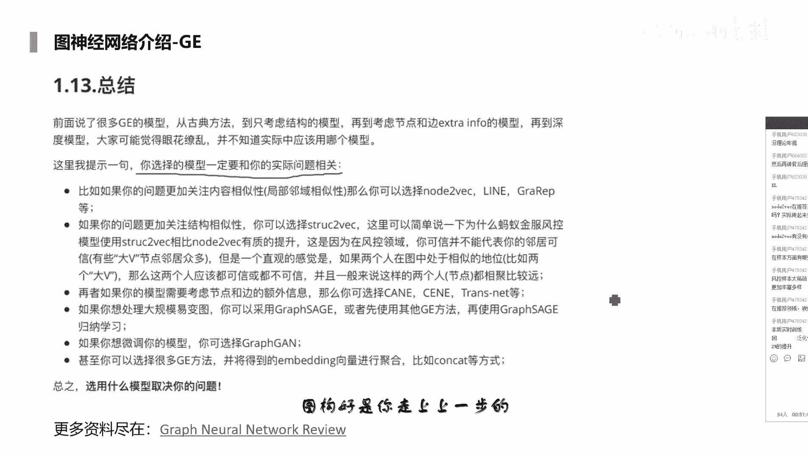

然后GCN的话，这这个g bedding大家。😊，大家听的都已经不喜欢听理论，基C我就更不介绍了。因为基C涉及到普图理论呃，这个普图卷积，所以这方面的这个。这个这个背景知识更多，所以我跟大家不介绍了。

我只给大家类比一下啊GE我们类比在LOP里面是what factor。然后GCN呢类比的一个算法就是CN。我给大家我给大家这个这个实在是在公开课上没办法讲。我给大家呃sha一个资料。

然后后边的话大家有什么问题可以随时。嗯，加我吧，那个也是我写的，大家可以给我邮发邮件，可以讨论。然后基翼一般对应于两阶段建模。也就是我先。那。用一种算法。

比如line在一个图上出了一个inbedding，然后这个inbedding呢再赋能给上游。给上游推荐做了一个特征。然后GCN呢一般都是end to end的。比如你直接做一个分类。嗯。然后呢。

GCN可以生成100点。GCN的你可以做有监督的学习。但是你有监督的学习完之后，比如说你做link presentation呃，link。另个pre呃，就是你做节点预测那个连接预测。你做完连接预测之后。

机身产生的最上层的那个inbedding，你就可以作为一种记忆，然后给上层的任务再用。然后广义的话，机C其实属于机翼的。比如刚才我们说的这个graphph，很多人会叫它叫机CN。其实我不轻愿叫它基C。

因为我我喜欢把基CN嗯用另一种说法来说。然后记翼呢一般都是单层网络，网络，其实它就它参数就很少嘛。然后note都是用用to的方法，就是单层网络。然后GCN的话可以很深，就做的很de，就跟C一样。

一层一层往上套。😊，嗯，但大家只需要记住，GCN可以用来生成inbodydding。就是跟机忆没有多大的没有多大的区别。

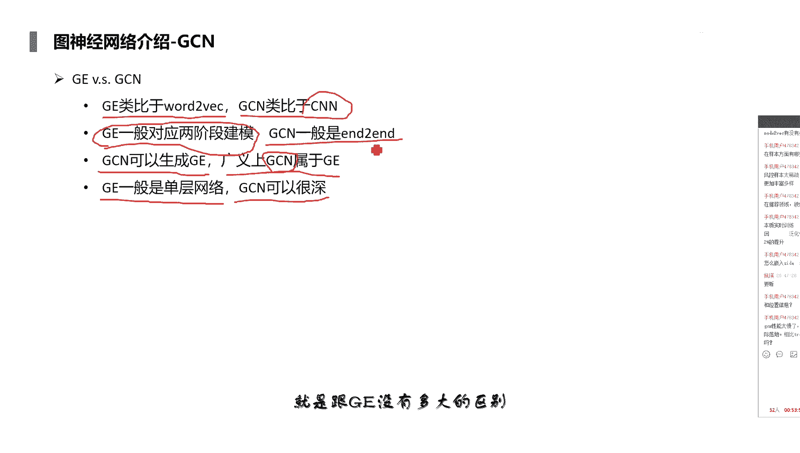

对，有有有小伙伴说了，就是GCN性能太慢了，因为他要在全图领域做一个卷积，工业界GCN落地没有什么好的场景啊，现在还没有，所以我也不打算给大家介绍这方面的理论。有兴趣大家就去这篇文章里边去看吧。

这个这个gitthub里面，然后这个ge他里面有PPT，还有就呃。

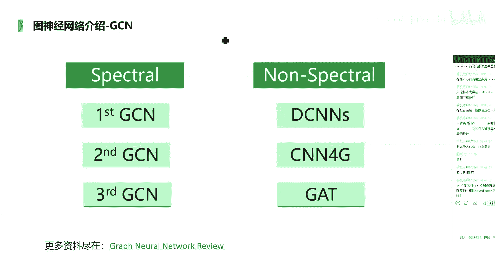

这个文档都有啊。想了解理论的可以去看一下。然后我嗯给大家稍微说一下这个GCN是怎么回事。啊，GCN呢分为两大类，一个就是普通卷积，就是在复利叶域做卷积变换。这个有需要比较深的这个数学的理论。

另一种是非普通卷积。啊，这种卷积也没必要介绍，它其实就是graph6，你可以认为是一种非普通卷积，直接做卷积。然后普通卷积呢有一套统一的理论。但是呢它会受到普拉普拉斯酸子的一个限制。

它所有的所有的理论核心都是这个L拉不拉算子啊，它空空域卷积的更加灵活。但是主要的困难在于选择领域上，比如graph那个领域，有更好的选择算法吗？你random random选择是不是不是特别好呢？

是不是有一些加权的一些选择呢？这些都是工业实践的一些che。很多很多模型千奇百万没有统一的理论啊，更多的是一种实践。然后我们就进入今天的这个这个实践部分，基因在推荐广告中的一些应用的一个案例。

大来大家讲解一下。

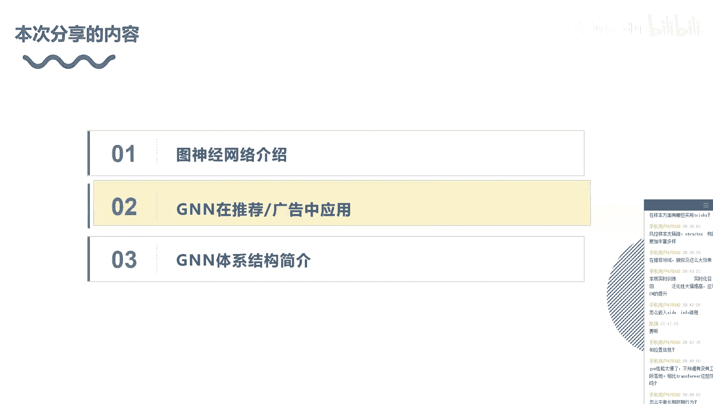

先给大家说一下这个范式。呃。就是基N在推荐广告中，它的应用是有这么两大范式的，一个都是两阶段，一个是N to摁的。end to end的呃这个图大家看一下，首先你有一个graphra对不对？呃。

比如你就是假设以商品的这样一个推荐为例，那么你可以构建商品的呃这个同构图就是商品商品之间的图，你也可以构建user到m之间的一个点击啊收藏啊，加购啊关注啊。

然后这个购买啊退货啊这样一个图对一个易构图类似于一个知识图，然还有 feature的 feature就正常于应对于比如你在做召回的时候，正常的user测的特征atm特征对不对？你做双塔的时候。

可能就是两侧的特征，你要有match就match特征。然后呢这两个作为输入，你的中间的模型是有2块，一个是基N用于处理graph一个是你正常的model用于处理其他的feature。

然后上层的可以做分类，以可以做其他的对不对，然给大家介绍一下有两种这里边中间这一部分还是有两种方式。一。四？就是你以这个model为主模型，GN作为一个附加的组件。比如你要做一个双塔，我给大家画一下。

比如你在召回中用啊。这是有道词，是不是？然后这是I，这是。item的向量，然后你在上层做了一个log，对不对？那么那么你现在有一个有了一个图，你现在有一个graph。然后呢，你在train的时候。

你这个user你每来一个优user，你可以去途中去找这个user，然后找到这个user之后，然后去取得它的邻居，然后然后这个A这个item也是你可以去找。这个都是实时的在寸中，你找。

然后找完之后拿到这个通过GNN它还有一个模型叫GN嘛。其实我画的不太对。他是通过GN去拿的。然后呢，基因去访问这个图。

去给你得到这个user的gram bedding以及iteune的gramdding给你附到这个地方。然后呢，你就可以往上再做卷积了，就是再做这个点击，然后得到loget。对不对？

这就是一个双塔怎么嵌入，就双塔中怎么嵌入基N啊还有一种方式，基N作为主播型。这个后面我们介绍一个案例，基因作为主模型，然后呢，你其他的feature是放在图里边的。你直接出来一个inba。

直接出来一个grba，然后gr emba不用再做任何total，直接做点击了。😡，直接做点击做相似度了啊，这样。然后两阶段的呢，两阶段目前在工业界没有特别成熟的应用。一个问题就是这个问题哎表上啊。

咱有些应用啊。嗯，有一些应用都是不是特别公开的，不是特别好讲。比如这有一个graph。然后graph呢我先通过一个pre的一个一个GNN，然后去得到一个gram emdding，这个是存起来的。

你可以理解为存一个V也可以存存数据库这个这个都无所谓，你可以比如你假设我们存的是KV吧，比如user一个dding一个dding这样存上了或者是这个一个dding然后这样一个other feature。

然后你这个东西是作为主模型的一个特征进去的。然后比如你在金牌金牌里边，啊后作为主模型的一个一个一个一个特征。然后主模型呢可以进行对它一个foon，然后你这个模型也在跑，就一直在更新这个记忆。

然后你这边也在更新，但是这两个更新，你这个更新，这个更新，怎么去解决他们更新的一个冲突啊，这是一个关键的问题。然后上面可以做runing，做其他的是不是？这是一个范式啊。

所有的所有的目前所有的工益的应用不会跑出量翻式。

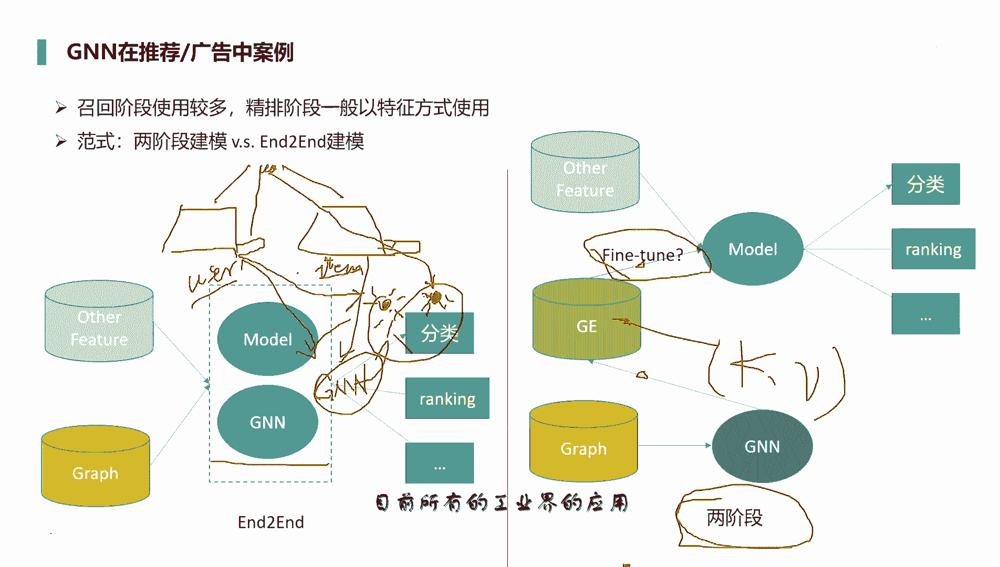

嗯，从一个最nve的拿ive的一个一个方法给大家介绍。这个是2018年的一个文章。这个是这个文章思想就很简单了。我们去在做推荐的时候。推荐的最核心的一个理论就是这个矩证填充吧。

你所有的推荐都可以理解为矩证填充的一个问题。有有一些有有值的这就是你的光 truth，有一些零的就是你要去填的嗯。嗯，那他他的做法呢就是我把这个建成了一个二步图，这user侧跟item册有一些连接。

连接完了之后呢，我去对这个图做一个呃graph medding或者GCN无所谓吧。反正你最终能得到user的一个inbedding。有谊。然后艾特目你能做到1个NY0IE。

对吧然后呢你就可以去做link个pre，就是user uI跟ite I。他们一个相似度，比如你比如你对于这个吧，我这个叫做一，这个叫做一，这个叫做2。那么U一跟I2，它们的相似度边权是是一是吧？

那么你需要去求解它们的inbedding之后的相似度也是一。当然这个一我说的它不是真正的一啊，你这个UE它只跟它相连，那就是一了。呃，如果你UU一还跟这个比如也相连。嗯。好用。跟这个也相连，它是3。

那么你应该让他去inbodydding之后得到的值应该是4分之1啊，3加1分之1，对不对？其实做的就是这样一个事情啊。嗯，这个忘了说一句这个图。这个文章的这个GAE用的就是GCN。

就是多层GCN它不具备落地性，为什么不具备落地性？刚才有同学已经说了，GCN它没办法去。呃，普通理论的基C它是在。这个拉布拉的算子上的，拉布拉的孙子是在。等于整个graph。

他没有办法去做一个采样什么的。所以这个每一次的运算都是在全图上的，在整张图中做相应传递。所以。所以耗时太严重了，工程复杂性太高了，没办法落地，这只是一张，这只是1个PR的一个文章。

大家可以简单的理解一下机C在召回是怎么怎么用的就行了。

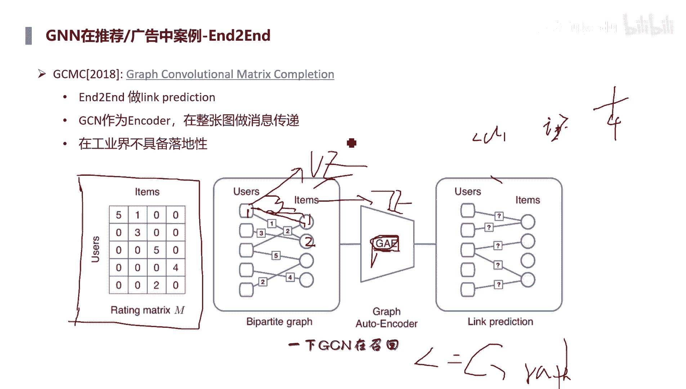

这个文章我们主要介绍一下，就是拼C语。这个是基于graphph seek的这是一个落地，并且工业界的推荐广告啊都在啊沿用他们这个方法，在各自的业务场景都在落地。呃，这个算法是呃这样一个图片的一个公司。

pinter rest和这个sstepford啊共同研究的。大规模呃。graphra基N的一个落地，推荐场景下的一个落地啊，它基于graph6。然后这篇论文呢非常非常值得推荐大家看一下。

因为这篇论文里边有很多的工程实践。我们做算法工程师啊，呃不是说我们去研究这些数学，研究这些算法就好了。我们的title是工程师。也就是我们在正常的工作中，你要有很强的工程能力的。现在在大厂呃。

你有一篇一座的paper，是什么鼎辉的一座paper，这个只能作为加分项。最终面试的时候，还是要求你的工程能力算法能力都要很强。嗯，不管是字节调动还是阿里还是腾讯，面工室同学大家都知道。呃。

如果应届生的话，可能要求会低一点。但是如果社招的话，你的工程能力一定很强。啊，首先我们对这个我们仔细的讲一下。啊，首先就是构图，它怎么构图的呢？呃，首先我们介绍一下这个业务场景。

它这个业务场景是一个图片推荐的一个一个一个公司。你可以理解为抖音。抖音上你划过去的不是一个视频，而是一个的图片。然后你看到很多图片之后呢，你可以加加到你的收藏夹里边。😊，啊，然后如果两个图片。

这个Ps就是一个一个的图片，这个boss就一个的收藏夹boss嗯，然后一个图片如果位于一个收藏夹内，它就连一个线啊，那那如果多个图片位于同一个收藏夹内，那他他们可能就有相似性，对不对？

它就是做这样一个二部图。这样有一个思考，嗯，还是最基基本的问题，就是怎么构图的问题。这个是影响我们最终效果的一个。啊，用的图网络。也包括斯坦福的吗？呃，图网络就是他们共同研究的嘛。

共同在这个公司落地的啊啊。大家思考一下电商场景如何构图呢？其实我刚才已经不小心给大家透漏了一下。😊，嗯，电商场景。呃，下边会有一篇文章来介绍来介绍它怎么构图。呃，有一种方式是你可以只构建商品的图。

有一种场有一种方式你可以只构建呃user的图，还有一种你可以构建易购的图，user跟item之间的一个呃点击啊加购啊呃喜欢呀、收藏啊呃购买呀、退货呀，这样一个呃易购的图啊啊新闻推荐如何构通呢啊。😊。

喜欢推荐。点击啊啊然后以什么停留时长啊，转发呀、评论呀是吧？这些构图。啊，相对于都会相对于这个拼sig的这个沟通话，都要更复杂一些。我们传统的推荐还是一蛮复杂的一个工作。

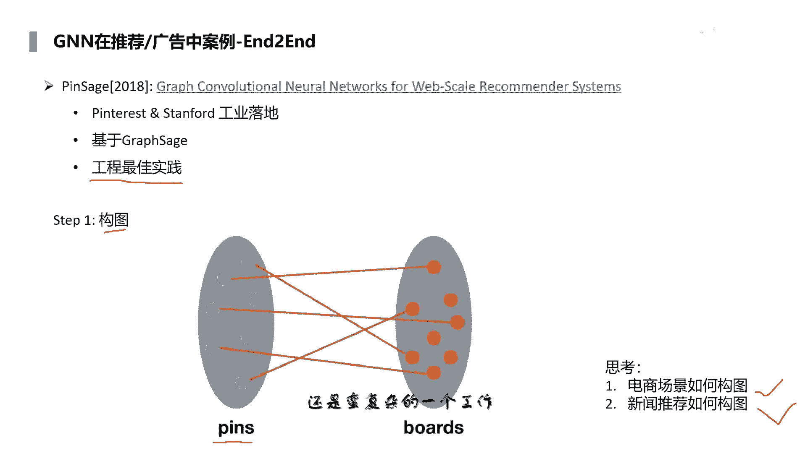

啊，第二部分介绍他这个拼C个这个算法。啊，它的基因模型是什么？我们先看左边这个图啊，我先给大家呃这个形象的解释一下。😊，它首先是基于graph six的graph six我们知道是基于采样以及聚合的嘛。

😡，啊，他这边稍微复杂了一点，但是也没有特别复杂。首先假设我们采样这个A这个节点，我们要最终得到A这个节点的inbedding。😊，他是怎么做的呢？先采样A的邻居，比如说采样啊，他这个里边。

画的里边是全采样了，但是我们一般是采样一定的数量，比如我们采样三个吧，那我们BCD是不是都采样到了？然后对于BCD呢，我们还需要再采样。那么B呢采样了AC，然后C采样了。

这个AEF么F采用了CEE采用了这个CSD采用了A，对不对？就是这样一个图。对吧A采样了A采样了BCD这样采样。采样完了之后，假设我们只采两呃K等于2，也就是我们只采呃凸号凸号两跳的。这样一个领域。

那么呢我我首先我会去对所有的节点。做一个。采样到的所有的这这一部分节点做一个聚合。比如呃。比如这个BCD，其实这里边它少画了哎也没有少画吧，它是最终的边界。对BCD然后A都做一步。

然后B的呢是AC经过聚合得到的B。然后C呢是通过这四个节点聚合的。D通过这个A这个节点聚合的A这个节点是通过BCD聚合的。这个是可以并行计算的。啊，然后呢算完之后，然后这一部分就可以舍弃了。😊。

然后再用刚才计算得到的BCD的inbe，再聚合一次得到A，这就得到了HA2。啊，这得到了HA2。所以他这样一个算法啊啊，具体的我们看一下这个左边这个算法吧，我给大家呃，因为这个算法还是蛮重要的。

我给大家呃也是一个大家喜欢的一个跟具体场景一个结合的一个落地的一个场景。我给大家呃详细的介绍一下啊。😊，首先就是呃。😊，你有所有的节点，这个是V，然后呢你有一个bach size，就是M个节点是吧？

你这个 batch size处理M个节点啊，然后呢你有一个参数K这个K就是我刚才我们说的采样的深度，刚才我们是二，是不是啊，还有一个采样的一个算法。😊，然后我们最终是想得到嗯这个。

本bach size里边所有的节点的im。嗯。然后它采样呢，它这个也是分为两部分，一个是采样，一个是聚合。那么采样这一部分呢，它跟Gs稍微有一点，看着别扭，它是反着来的。比如我K是2的时候，SKS2。

就是M。也就是假设你这个M是假设我我给大家还是具体写一下吧。M比如等于12这两个节点。那么S2呢？就等于2。这是一个领域。S一呢。我看一下S一，首先它是把S。他是把这个S2给了S1，对不对？

复制给了S1。然后对于S2中的。对于S2中的每一个节点就是S。对S2中的每个节点，然后再去取他的邻居。也就是呢最终呢是这个啊我们这个12不太好，我们用AB吧。AB。AB然后这里边首先是AB。

然后再加呢A的邻居就是BCD，对不对？然后呢，再加。然后。呃，B的邻居。B的链就是AC，对不对？他知道它是最终S一的集合是这样一个集合，你把重复的去掉那就行了。那么这就是采样，采样完了之后。

我们就得到了S0S2和S1。啊，S0它还有个S0。我们还会再有这次的。还是重复的啊，对，这个东西还是对这里边，比如说你现在S一已经是等于了。AB。CD啊，它这样一个节点，你去掉重复的嘛。

然后你对这个B中的节点，然后再踩他的邻居，然后就得到了另一波是吧，这就是S0。然后它的聚合算法就是从外向内。因为你S0最大嘛，你S0包含了最边界的情况。

也就是你S0相当于你包含了这个ACAB这这这些东西嘛，你要先把这些给它聚合好了，因为后边聚合再往内聚合的时候，他们就。不动了啊，具体看一下吧。嗯。

首先对于H0HU的每个第零次的一个一个inbedding都是等于原始的inbedding的。这个是S0S0是最大的集合，对不对？最大的集合包含这个A这这都包含嗯。然后从K等于一到K等于到大K。

对于呃我们先看K等于一对于一中的每个节点，对于一中的每个节点是不是ABCD啊，ABCD然后都去首先用他的邻居，那A的邻居是什么？在S0中是不是有啊？A离S06也9了，对于A的邻居，然后以及当前。呃。

对AA的A的所有的邻居，然后聚合一次。然后聚合一次聚合一次之后，执行这个convolve算法。这个算法你就可以理解为是一个聚合，他就是把他的邻居和他，这是他的邻居嘛，这是他的。嗯，比如你要聚合得到A嘛。

你就是A的邻居以及当前这个A的一个inbedding表示，然后去得到聚合之后得到A的下一层的表示。然后再去执行2。这样这个步骤执行完之后，ABCD等于10，是不是都求完了？A是由A的邻居求的。

B是由B的邻居求的，C是由C的邻居D邻求完了之后，然后你再去求S0的。S0的S0的时候是不是就剩就剩AB了？啊，那A的邻居是。A的邻就是BCD对不对啊，B的邻就是这个AC对不对？

你第二层再去拿这个BCD去聚合得到A的。然后去拿AC去得到B的，这样就执行完了。执行完了之后呢，他在对这个白side里边的所有的在做一个呃再做一个变换。哦，这下边是一个cabo算法。

这个ca冒算法也很简单，就是。😊，对所有的邻居先聚合一下，然后再把自己。看开的起来再过1个NN过一个激活函数，然后nmalize一下。这就是最后的结果。这是它的基因模型的一个描述。

然后呢，我们说它训练嗯，它这个是有一个有监督的训练啊，有监督的训练。嗯，其实拼s graph seek它都既可以做有监督的，也可以做无监督的。好吧。😊，嗯，然后这篇文章是做有监督，然后它的正力是什么呢？

就是用户在点击了这个iteomQ之后，如果马上点击了，它设了一个时间，比如5秒之内又点击了iteI。那么我认为I是Q的好的候选。GQ和I是一个正力，那么其他的就是负力。

他最终优化的是这样一个呃my margin ranking的一个 loss。大家呃这里这里说一句吧，呃，这种runing loss其实有很多啊。你还可以是你还可以是这个呃叫什么来着？

叫拉呃拉run的一个los，这都是可以的。这个los无所谓，嗯，这个los的说法就是你去让正力比较接近，然后让复利拉远啊就行了啊。然后复利呢就是通过副采样就行了。啊，刚才确说完了。

我们就说serving。啊，serving呢它有一个优化。它是通过一个mb reduce呃生成这个inbedding，然后进而进行AN的一个解锁。AN解锁我就不说了，就是召回的常用套路。嗯。

最近雷相似的一个检索。嗯，它这个东西为什么要用m reduce生成inbedding呢？呃，这个图先不用看，咱先看一下这个。

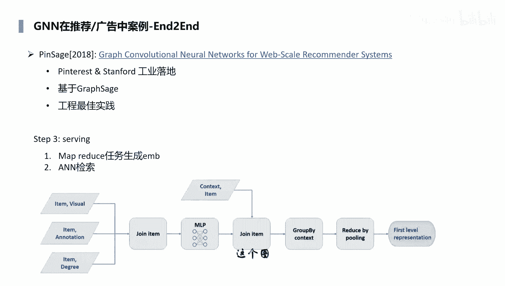

下面这个图。为什么要做？😡，为什么要serving的时候，跟training的时候不一致呢？因为正常的网络，我们知道正常的不管是DN还是什么什么乱七八糟的模型。

我们training跟serving唯一的区别就是不做back word，是不是？啊，这里有一点不同啊，为什么不同呢？是因为它有一个很多的重复计算，比如。😊，你你现在要去求解这所有的这个。

你要按纯节的方式去求解这一组所有的这个最终的imbedding。那么你会去计算，比如这个绿点。你去计算了一次，你第一层的时候计算完之后，第二层你计算到这个绿点，到这个地方，你又计算了一次。是吧。

他有很多的容易计算。嗯。那绿点在这又计算一次在这又计算一次啊，在图很大的时候，你这个是无法无法这个有效的满足servuring嘛啊，所以他做了一个myred这个任务比较简单的，我给大家解释一下，就是。

我第一层把所有的节点。都。都做一个inbedding。这样去一下虫，你先去一下虫。都做一个都做一个这样一个聚合。然后呢，再往上我也不是说为了你我单独算一次它，为了你我单独算一次它，而是我对所有的这些。

因为它是同样的计算，我只算一遍，算完之后存下来。然后我再往上算，如果你要是有10层，我就每一层每一层这样算。我下我下一层的结果是用的上一层的，就是下一层要用的输入是上一层的输出。就这样。

因为ma是一个K嘛，我们的K就直接能够驱重嘛，达到驱重的效果啊，这样就是一个这样一个一个一个。一个概念啊。然后这个文章里边呢，之所以推荐大家读，是因为它有很多呃工业上的一个优化。

是一个非常诚意满满的一个论文。嗯，最佳的工业实践我给大家举几个例子吧，第一个就是邻居采样算法的一个优化，它不是基于redwork进行采样的。而是基于重要性材啊。啊。

具体的具体的呃大家理解一下字面意思就是谁重要谁采样权力就大啊。第二个warm up。这个是在我们训练的时候，呃，工业界大 batch训练的时候都会遇到的一个场景。当你的 batchch非常大的时候。

比如呃几万你一个bach需要求需要优化几万个这个item user item对呃，那么其实你太大的话，你需要有一个war up的一个过程。😊，否则你的训练会容易跑偏啊，第三个是分布式异步训练啊。

这个其实在很多大公司呃，主流的大公司吧，现在都有这个基础设施啊，什么 server啊，什么呃这个啊flow这些它是怎么通过这个异步以及分布式在多个卡上同时训练。

然后梯度再去在每个在某一个就是每一个GPU上算不同的梯度算完之后再去汇总到一个里边，然后最终再传到 server上，然后进行一个异步的更新。也就是你你下一次下一次再优化的时候，你可能用的并不是最新的。

因为它去更新梯度的，它也是异步的这是一个常见的一个套路。但是它也写出来了还有一个就是这个。😊，这个ha negative。啊，这个就叫做呃这个其实我也写过一篇科普的文章，叫做困难，要么挖掘。嗯。

你光用简单的样么，就是你正力用的是正真正的正力，然后你复力就用的随机采样。那么其实你学不到特别好，因为你的复力太好学了嗯，就随便一个网络就学好。还有一个就是ma reduce这样一个东西啊。

它这个had negative是怎么做的呢？呃，其实最简单的呃最简单的这样一个。

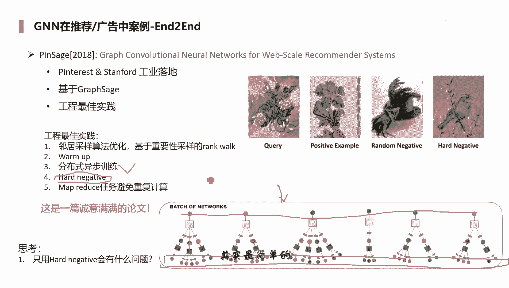

这个正力不是QI嘛，那么负力呢就是Q。跟。呃，假设你Q是 qua嘛，你去查询的时候，你对每个艾特都会有一个排名。IE。海2。哎1000。哎，1001。这样。

然后你可以选择这个I在1000到2000的这样一个ronk来作为它的困难样本。你在这里面选一些，然后再随机复材样，再采几个是吧？这样你就加入了这个困难样本，使得Q能够更好的去跟I去区分。

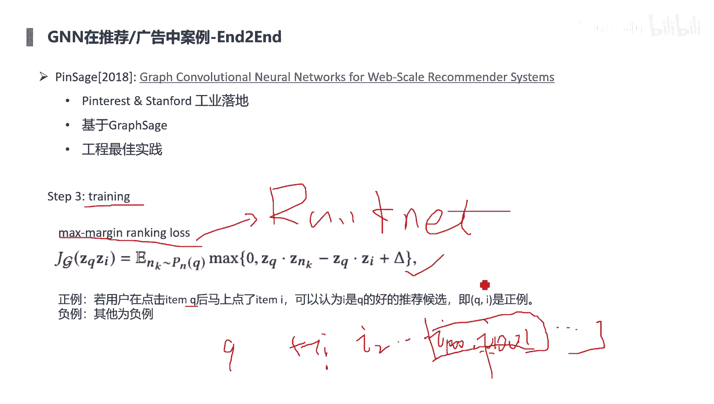

嗯。然后这里给大家提一个问题，嗯，因为困难采样。副采样这个东西呃在工序剧也是一个非常好的一个优化的一个trick。大家大家想一想，为什么它这个文章里边是第一第一开始的时候不是had negative。

而是用一步一步的增加的。就是你第一开始就是用的纯的这个random采样random副采样。然后呢，你会慢慢的去增加had negative的一个比例。嗯。

如果只用had negative会出现什么问题呢？为什么不一下子都用。都用最难分的这个负样本呢，然后让他学的更好的。有了解吗？其实是有一个问题的啊，如果你实践过，你会发现如果你。呃。

一开始就用所有的都是ha那个t，那这个网络会学不好。因为第一开始它的于一般你是初始化的。你第一开始你是没有区分能力的，在你没有区分能力的时候，你就加大难度是不可取的。呃，一般的话就是慢慢的去加入。😊。

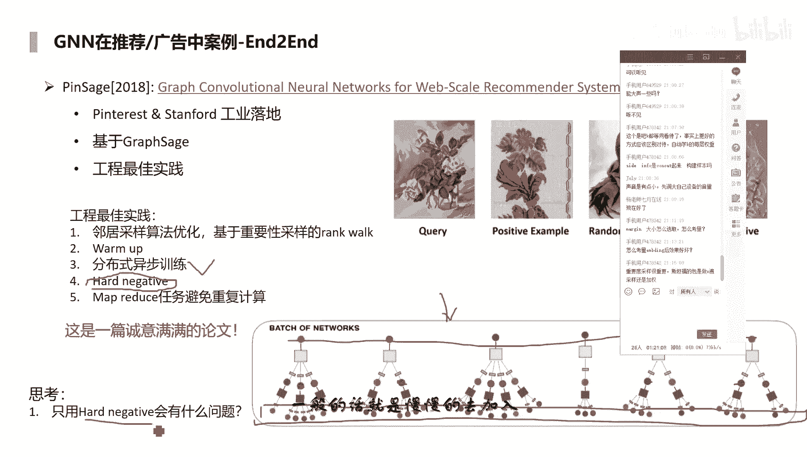

这是一个常见的一个做法。

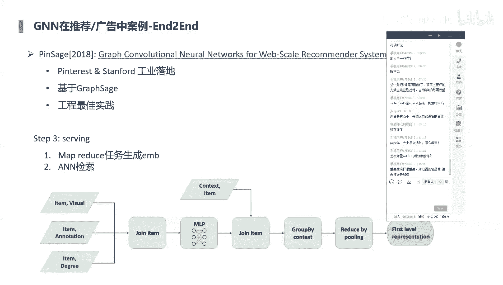

怎么考量inbedding效果好？一般我们现在没有特别好的方法。嗯，要想考量你的inbedding好，必须。呃，必须上线做实验。不用不是上线做实验，首先是offline去看你的上游模型。

下游模型是不是有更好的AC引够好的这个这个NDCG什么的啊，线下的指标要好啊，线下的指标如果好了或者持平了，可以上线去做一个IB测试，完都这样。啊，当然还有一些你可以线下分析的，比如做一些剧类。

然后看一看这个可视化。当然一般这个没有什么呃大的用啊，其实做一些心理位。你做完之后，你还是会想去上线做一把的。所以这个东西一般我们都去看上线的效果。

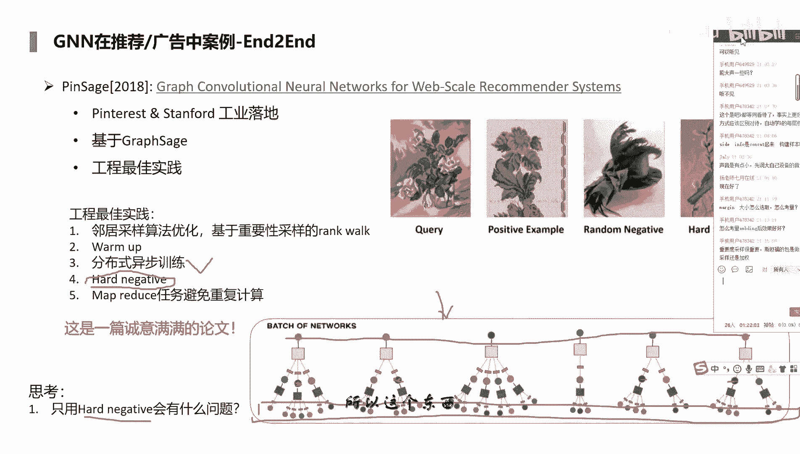

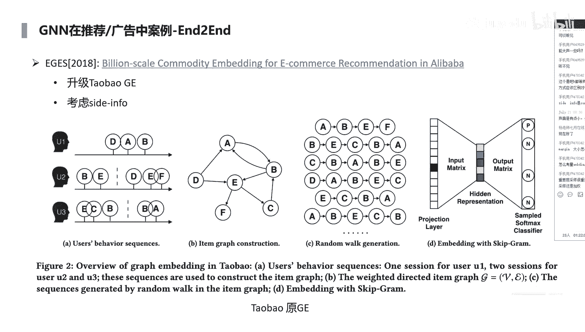

嗯。所以还是最终再强调一句吧，凭时一个这个算法啊，我这边讲的可能可也没有。特别的好吧，特别的细致吧。呃，有里边还有很多的内容，还是推荐大家下去读一读。😊。

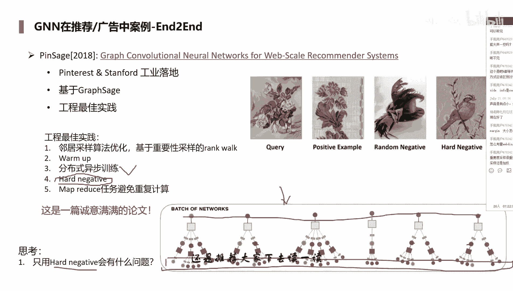

然后再介绍一下这个淘宝。啊，怎么做的grbe领。嗯，刚才说了这个电商怎么构图，这里给大家介绍一个方案。嗯呃这篇文章说的是一个session。

一个session的概念就是你可以理解为比如30秒30秒exsession，也可以理解为它一连串的操作，然后隔了一段时间停了。嗯，然后又回来操作，那就画了一个session啊。

这样一个概念啊如果一个用户一个session内操作的一个商品的序列，那么他们就构成了一个有效的图。比如DAB那么就是。D到A到B这样一个有向图。然后BE。DDEF它就这样构图啊，就这个就是构图的方案。

它这个构图方案也比较简单。然后构完图之后，你可以做一个rundom block。采样是不是采样一些序列，然后去会学的一个grambedding，是不是啊，这是淘宝的语原来的inbedding。

也就是在18年之前，他这个文章发出来之前，嗯，应该是在16年17年的时候用的是这种grambedding来做召回的啊，召回一般我们都是多路召回。这个肯定是其中的语录。

啊，然后在1018年的时候呢，或者17年，他们升级了淘宝的gram白领，他们只做前面这个就考虑很简单嘛，你只有实体的这个信息，你没有任何附加的一个信息。

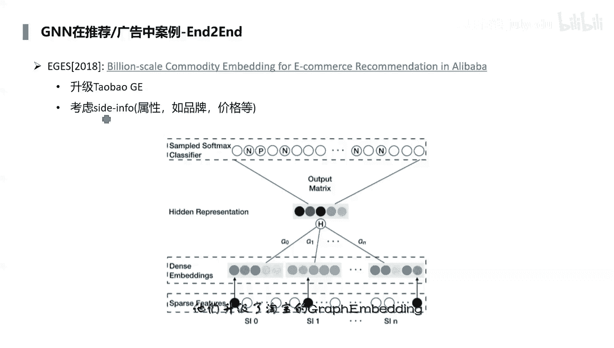

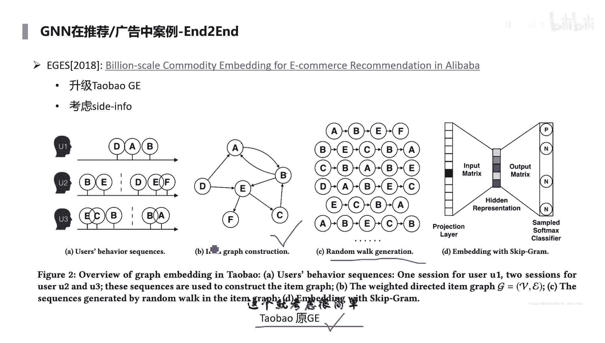

他们后面考虑了一个s infer，s infofer指的就是一些呃商品的一些其他的一个属性。比如说价格呀，一些属性啊、品牌呀什么乱七八糟的啊，这个就是我刚才呃给大家介绍的，不知道这里还记得吗？

这个范式嗯。

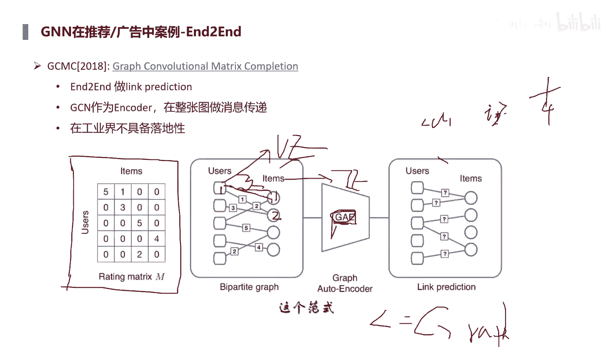

他就用的第二种方式，GN作为主模型，其他的feature作为graphra里边的呃一个一个内容。

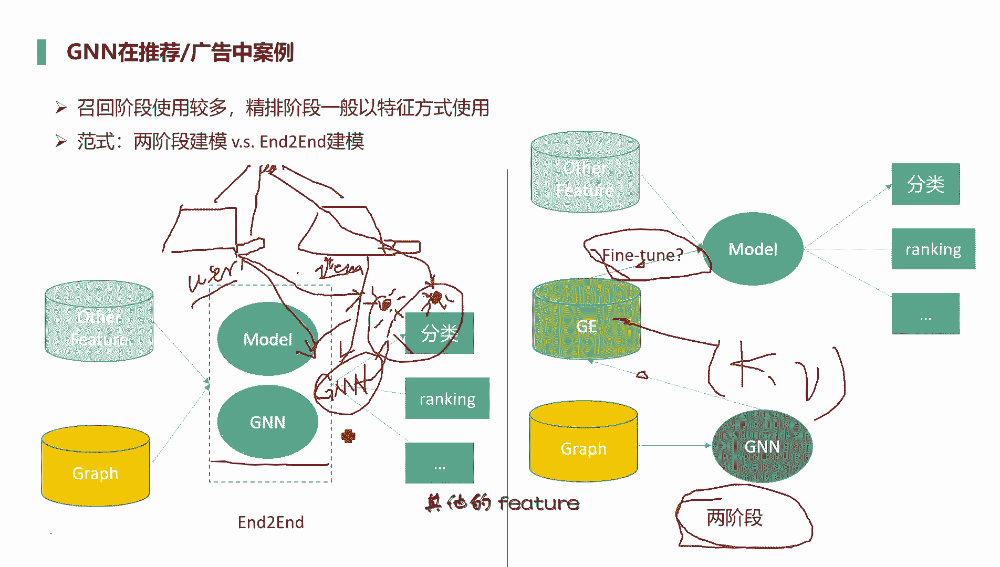

一些属性。嗯。这里边就是说SSISI指的就是第I个ite嘛，第二个item的一个indding啊，理论就是我们刚才用最原始的这个方法求出的embedding。

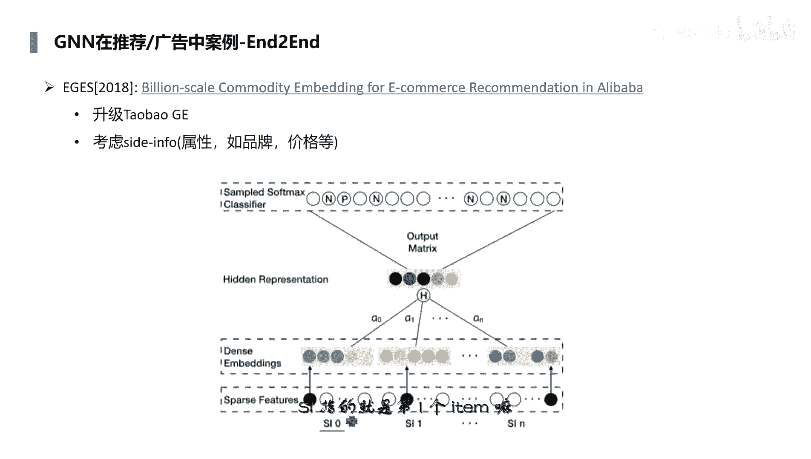

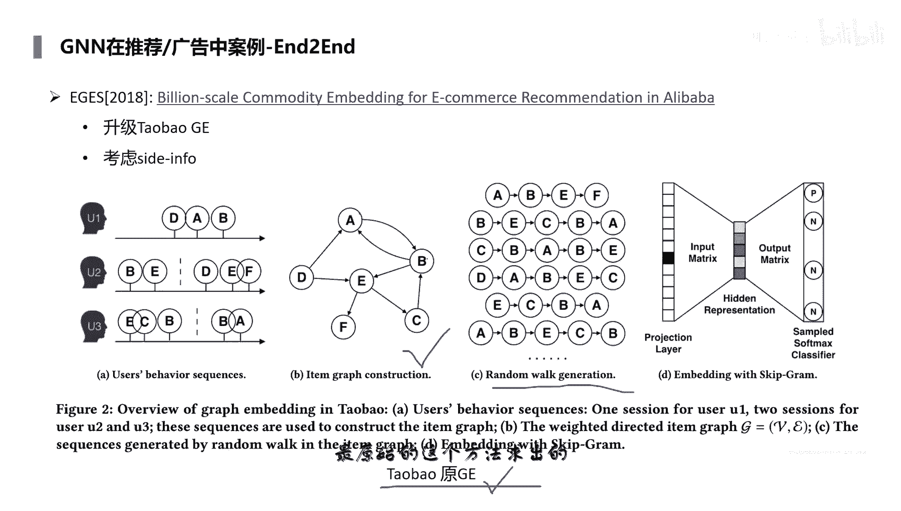

然后呢他求完这个之后，他又把它的一些属性。比如你这个商品是某个品牌的，那么它本身是一个的，是不是它往上做一个indding然后你是有哪些关键词啊，什么价格呀，价格一般做分dding然后这样往上起来。

然后这样其实你已经可以去直接去做呃 vector，也就是那个soft max最后求解那个东西啊，你已经可以做了，它这里还做了一个优化，就是一个重要性一个attention的一个概念。嗯。

因为你某些属性可能没有那么重要有些属性是非常重要的。以它就是有一个attention一个操作，最终得到这个然后再去做一个就跟上面这个图跟上面这个图是完全一致的。

只不过是在这个 embedding的情况下又加了一些其他的东西，这个这个时践还是非常的好的，在很多公司。

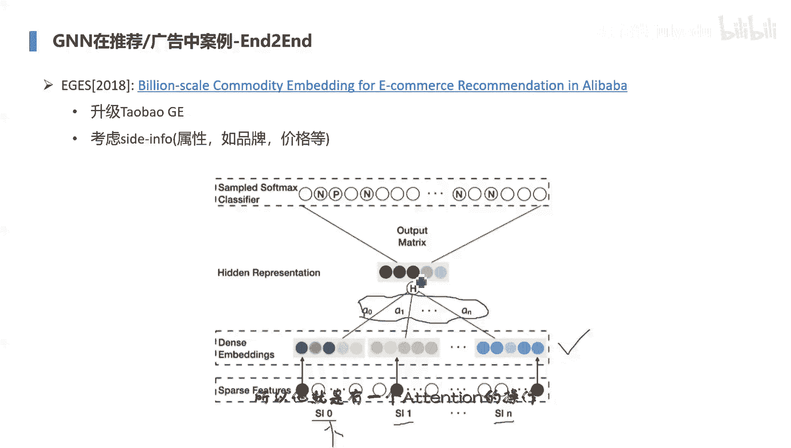

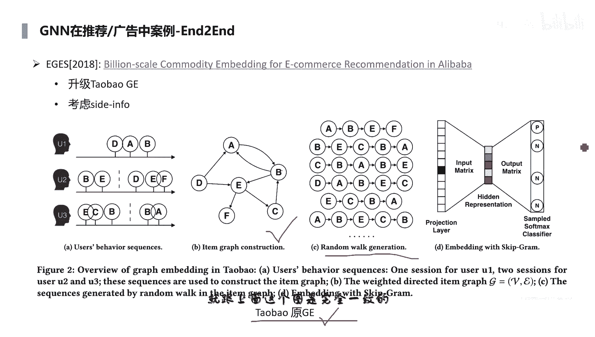

有类似的做法。嗯。

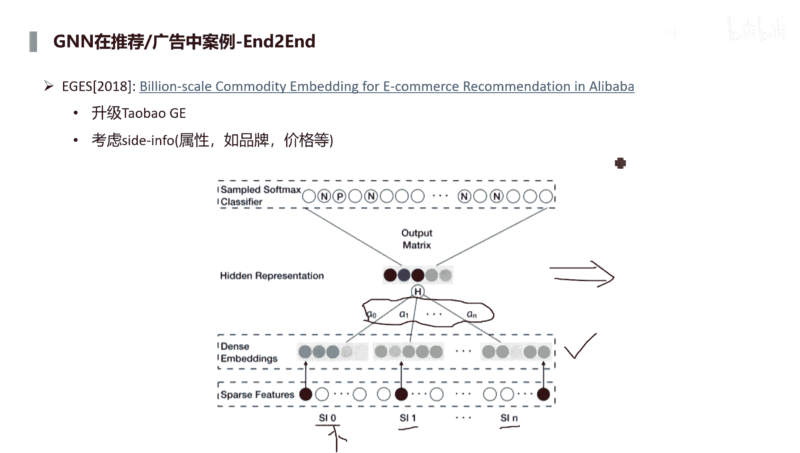

然后两阶段建模呢，我们就不给大家介绍了，呃，也没有找到。呃，因为我们介绍的呃有一个。就是不能去。嗯，只介绍一些公开的内容吧。但是两阶段这个呃大家可以知道，因为很多公司都是在用的。

其实啊我给大家举个例子啊，比如对阿里来说，阿里有很多的数据啊，你在淘宝里边天猫里面它的数据呃虽然是相通的。但是你在淘宝线的话，你去春联模型，你用的就是淘宝的数据。你天猫的时候你用到天猫的数据啊。

1688口碑啊，这些数据都是不通的啊。但是你可以用全站的数据去建一个graphraft啊。😊，并且用GN去出一个记忆。然后呢，你这个机忆就可以赋能各个产品的推荐了啊，举个最简单的呃例子。

比如你淘宝里边某些用户啊，你去点击了这个啊比如你去购买了一个剃须刀吧。但是你在天猫上你没有购买，甚至推荐去统都没有发现这个东西。但是你在呃你在用全站的数据去顺这样一个机忆的时候，他会让你知道啊。

我这个用户其实喜欢剃须刀的。可能最近啊，他在天猫上可能会给你推。这样就是一个一个transfer的概念啊，对腾讯来说也是啊全站数据、新闻啊、浏览器啊、QQ啊这些东西都可以构建啊啊。

对于字节跳动也是一样了，今日头条啊、西瓜视频啊、抖音啊啊。嗯，一般这个这种方法连阶段的这种建模一般都是对于呃大体量的公司呃这样一个做法。你要小体量的公司，就一个app，你没没必要，对不对？😡。

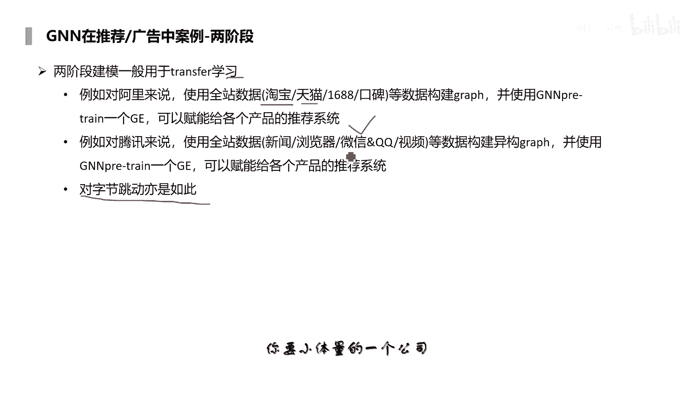

这一部分大家有什么？有什么想说的吗？看看大家的问题。s刚看起来呃构建样本嘛呃不是构建样本，是你的样本已经确定的情况下，你会把s infer的 emdding考虑进来，作为你的优化的一个一个点。

就是你去学习gr embedding的同时，你也去学习了它的品牌的inbedding学习了它的价格的inbedding。这些都考虑进去了。😊。

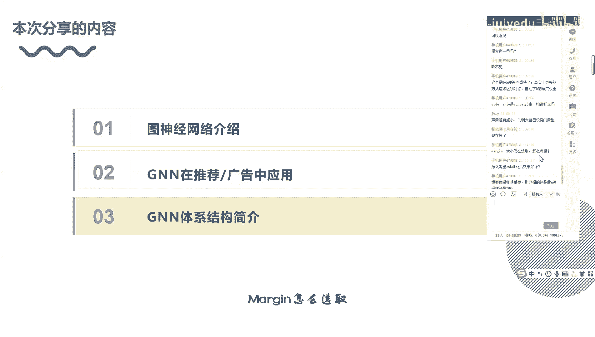

马给怎么选取？妈笔，这都是这个吧。

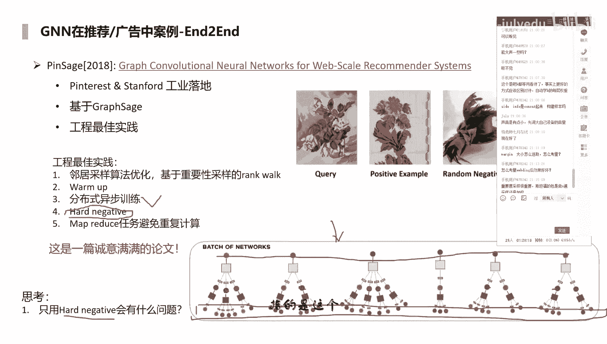

啊，marin怎么选取？这个一般都是工业界的调餐调餐了。对大家都干这个活的。什么好说的。

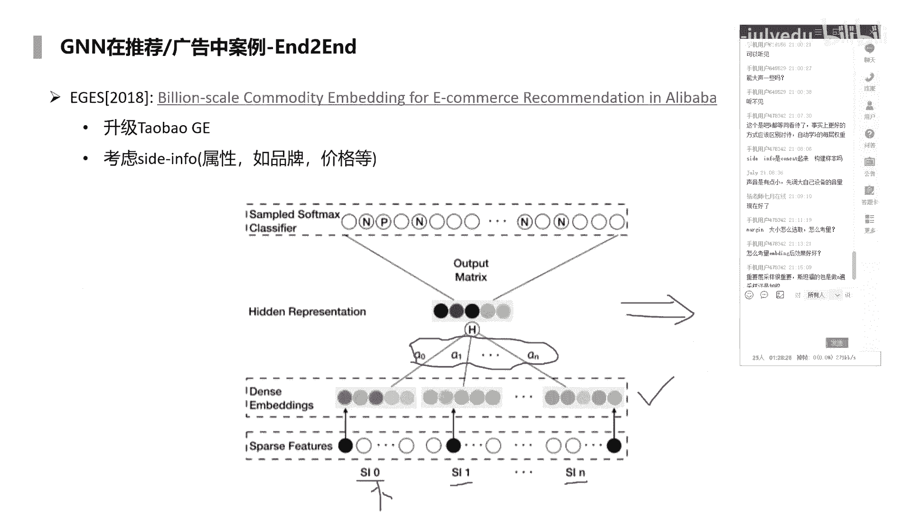

大家对这方面没有没有其他的，我就继续说了。

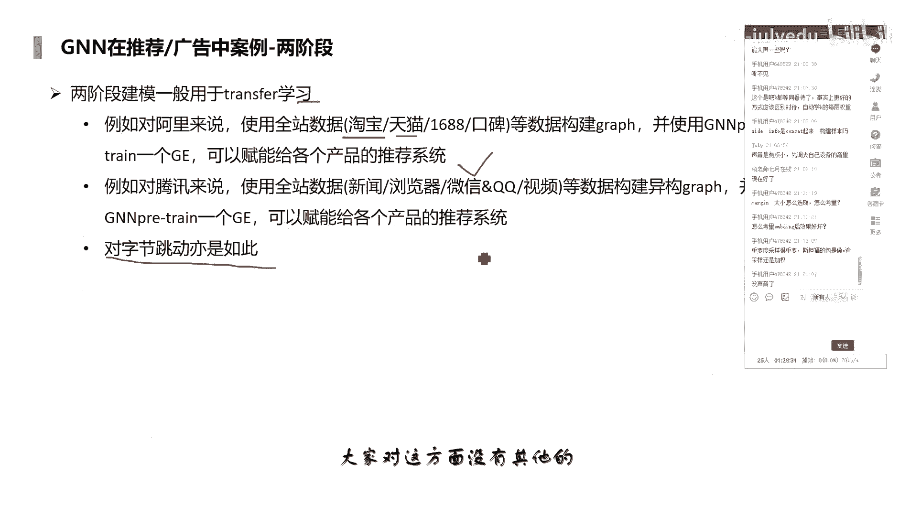

最后一部分我们介绍一下，嗯，就是T因在工业界落地的时候，有哪些这个必要的组件吧。这个一般对于大公司来说倾向于自研啊，对于一些中小公司来说，他们会使用开源的软件，开源的作为呃一个基础。

然后在上面做一些二二次开发。啊，比如你在自节，你在阿里这个都是自研的。你在其他的公司，他可能会用一些开源的。

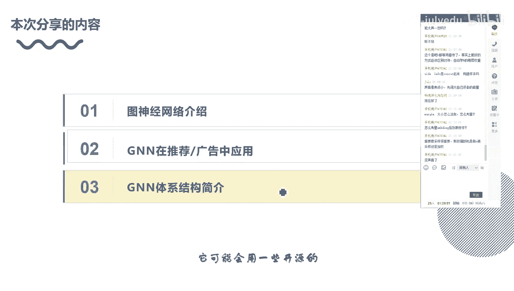

嗯。就是对于金业来说呢，除了算法还有很多问题要解决啊，第一个就是图郭大怎么存嗯，这个在推荐广告中就是。就是。就常规操作了，那个E级别的这个点，那就是常规操作。如何实现高性能的图操作。

你采样你在亿亿节点上，然后百亿的边上，你再采样你那些能扛不扛得住啊，刚才我给大家介绍那个范式的时候，你在召回的时候，你甚至可以在召回的训练的阶段，直接去访问一个呃图图服务。

然后这个图服务帮你非常实时的采样，啊后并且帮你算一个indding算完之后给你附加到那个那个双塔上，让你算啊，这样一个操作是怎么实现的啊啊，以及这个GN与这个DL它是怎么深度结合的。😊。

这里因为有一个开源的做的也不错。我给大家按照这个阿里的这高性能服务，这个艾拉欧拉来给大家介绍啊，很多公司自研的呢也都是这一套。这个地方偏见一些工程。嗯，大家先看一下这个图吧啊。

最底层的就是graphra的一个存储，分布式的一个存储啊，大图你肯定没办法单击存储，你肯定得是分布分布式存储的啊。分布式存储一般有这个暗暗点有暗边的，待会会介绍，然后往上层呢会有一个机塞口圆。嗯。

机呃这个我也不知道怎么读，一般都读机口或者叫GKL反正呃，就类似于cyclcle吧。呃，你去写这样一个呃写这样一个句子，它也能给你转化成一个有限无关图，然后去在这个图里边去给你做一些操作啊。

再往上是一个呃。MPpassage message呃mes呃，这个东西是一个抽象层，因为GN的所有的操作都可以理解为这个messagepa。然后这个里边有一些基础的算子，比如卷积，比如这个聚合。

比如这个cban这个算法。那所有的这个上层呢都是有不同的这样的呃卷积，不同的聚合函数，不同的这样一个呃聚合。嗯，不同的这个看办呃组合起来的。然后上层呢会实现一些常用的算法，然后供你快速的调研使用。

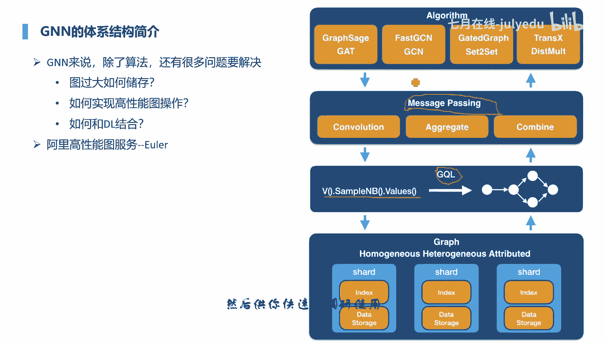

我先先说一下这个图分布式引擎，分布式存储。嗯。我给大家举个例子，ABCD现在有这样一个图。呃，你在分布式存储的时候，有两种两种这个做法，一个就是按点分布式，一个就是按边分布式。啊。

第一个上面这个就是让点分布式呃，我们在每个shad上去存。呃，首先你对这个你要是点的分布式的话，你会对每个点做一个哈希，然后然后去哈希完了之后去这个存到某一个上。比如你这个你这个一上存了A和B。然后呢。

为了采样的方面，我会把它的一阶邻聚也顺便存上去。比如A这个地方存了A这个节点，我顺顺便也会把B和C，它的一阶邻居存上，然后B就存B了。然后sha这沙2哦，不好意思，我这个PPT有问题。😊，啊。

这个沙道2上存了CD这两个节点啊，C有一个一级邻居叫D，是不是也一块存上来。😊，啊，然后第二个是按边这个partition，按边partition的话是呃就是这个就很简单了。你对边做编号。

然后对边做完编号之后，然后做一个哈希，然后存上就行了。比如第一个下的存的是A到B这个边啊和A到C这个边，然后第二个是存C到D这个边嗯。😊，这两个这两个part台ition呢一般都有好处，呃。

有各自的好处。第一个就是npartitionn帕ition。😊，好处是什么呢？方便采样。方便这个并行的采样。因为你一个你一个ch的时候，比如你有AC是吧？那么你去分布式的时候，分布式采样的时候非常方便。

你只需要在sha一找到这个A节点，然后做邻居采样，然后sha2找到C节点做邻采样就行了，是吧，这个高性能实行高性能这个采样的一个一个一个基础啊，你在遏制这种情况下，你就不好操作。因为你这A这个节点。😊。

呃，可能在上在上还有，因为你可能是A到C这个边存到了上，所以就不是特别好做这个并行的这个采样啊，但是n有个问题，就是它受到一些热点的一个限制。你比如这个这个在推荐上非常非常的常见。你有一些节点就非常的。

有一些用户就天然喜欢点广告，有一些用户就天然喜欢点很就是他活跃度非常高后有很多的冷用户。那么你你把这个用户存到某个上，你这个会附带他在很多的一阶邻居节点，会导致这个支持不住啊。

这种一般工业节是怎么做的呢？呃，其实也没什么好的办法，我们就是对他的一阶邻居做了一个呃限制。比如不超过1万个，然后超过1万个了之后就做一些机的裁剪。😊，呃，就是这样一个方法嗯。

然后边的话不存在这样一个呃倾斜问题，唉，不会受到一些热点的一个影响。

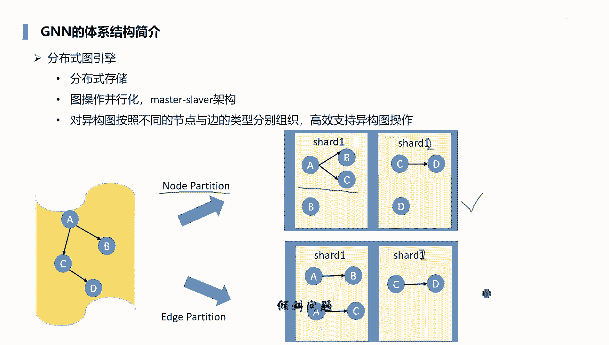

给大家介绍一个这个。呃，第二个的话就是给大家介绍一个邻居采样，我怎么去做高性能的邻居采样，实现是怎么实现的？欧拉里边怎么实现的对吧？一般这个图呢我们都是异构图。现在欧拉不管其他公司啊。

都是支持这种异构图的啊，我给大家画了这个图，大家看一下这个是user item的一个一个图user这个零代表一种边一代表另一种边，这个零代表一种边，一代表另一种边嗯，零你可以理解为比如在广告场景。

零可以理解为点击边，一理解为这个转化边然后零这个边呢它有各自的权值，点击了某个某个ite点击的点击的次数啊，可以这个次数作为边权的一个一个衡量，比如0。510。8，然后这个这个转化呢也可以有边权。

你这个转化的边线怎么设计呢？你可以转化这个广告带来的最终的收益为边权，也可以是转化的次数啊，也可以是什么这个东西都是设计了，还是重复那句话构图是非常重要的。这个图一定要构构建的符合你的业务场景。😊。

一旦你把图构建完了，你的工作完成了80%。啊甚至更超过80%。图构建完了。呃，图构建的好，那么直接决定你最终能不能做出收益。啊，有这样一个图之后，我们怎么做采样的呢？首先它存了一些东西。

第一个就是 type，我们现在有两两种编嘛，就01嘛，然后有个note of，有每个节点都有这样一个东西，每个节点都有比如这个 userer这个节点，它就note of指的是第三三指的就是我零这个。😊。

零这个边。零这个边的邻距是从到三结束，另一个是到5节束啊呃然后这个权重和前缀权重的前缀和就是零这个这个边呢它有2。3，就0。5加1加。2。8是2。3，然后一呢是把所有的加起来啊，是5。6啊。

当你采样的时候，比如。你要假设假设你不分边，你随便踩。那么你就首先它就做了一个前缀合，iteom一的前缀合就是0。5嘛，自己嘛，iteom2的就是ite2的加ite一的ite3的。

就是它撒进进来这样一个前缀合。然后然后你有这个前缀合，假设你不分这个边权的边的类型，直接采样的话，你只需要设置一个random。你首先首先。首先random一个数，random完了之后乘以它的最大和。

乘以5。6。乘以5。6之后，你就得到了这样一个数嘛。得到了1个0到5。6的1个数，对不对？然后呢，做二分查找，因为它是有序的是吧？二分查找就很快了，然后这个东西又可以并行。刚才我们按node定做的话。

也可以并行，所以非常快的啊。😊，如果你要想结合某某种边，就是比如你你这次只想踩零这个边啊也一样嘛。你首先通过这个前面这个这些数据结构，这个note set啊，到3，那么你只你首先只到这个3这个地方啊。

然后乘个0。乘个2。3，而不是乘个5。6就行了，然后如果你只采样这个一这个边，那么你还是乘以5。6，但是乘完之后你要减掉这个2。3，对不对？你最终的最终的这个范围，首先就是3。6到到这个5。6。

然后再二分采2分查找就行了，是吧？这是一种。

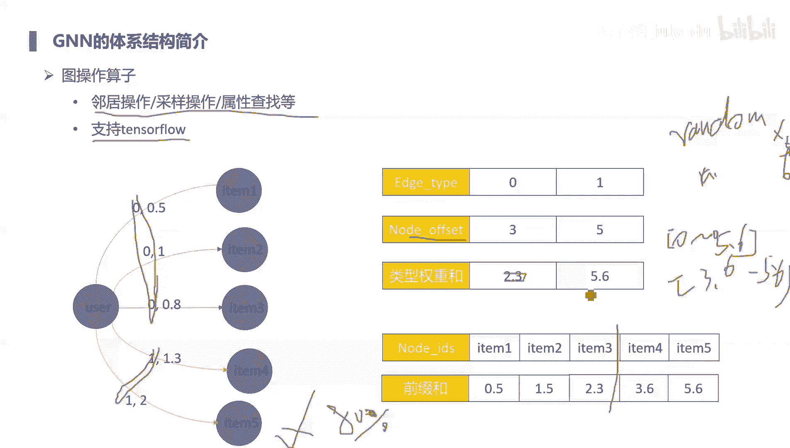

这是一种采样的一种设计啊。然后就是机机口语言呃，这个机口语言不详细讲了，大概就是你呃它会设计一个类似于cyclcle的一个一个语言。呃，因为你在scle的时候，我们都知道你scle语言，你写完之后。

它会底层可以做各种各样的优化的啊，机构语言也一样的。你写完之后它会你首先给你建成一个呃DAG就是有相无关图，然后在图上给你进行一些操作，一些采样啊，一些取属性啊这样一些操作。然后做完这些操作之后，呃。

不是做完这些操作时候，呃，建完这个图之后，它还会给你进进一步的优化。啊，比如你采样的一些重复点。然后你这个你这个属性，然后是不是可以做一些减脂，然后这些乱七八糟。

它都会在这个机口语言里边设计的时候就会给你呃优化。😊，然后第三个模块就是这个MP抽象层嘛，我们说了这个机缘所有的基因都可以理解为呃呃GCN我们先不考虑啊。因为GCN那个东西现在还没有真实的落地场景。

我们以G来看的话，呃，就分为两呃三个模块吧，第三个模块一般我们不要呃，第一个模块就是子图抽样，子图抽样就是采样嘛。首先你采几个节点，然后节点再采几个邻居，这就是子图抽象层，然后就是图卷基层。😊。

图简意思就是做那个graph six那个真正的聚合的那个你有了邻居怎么聚合。然后第三个就是可选的筹划的，一般我们不要，一般我们都嗯目前我们工业阶落地的时候，大部分都不需要。啊。

这边给大家列了一些这个呃他们都是哪种类型的这样一个。这样一个这样一个东西啊，首先我们来说一下子图抽样。子图抽样就是刚才说的，我们结合UMP下层有几个支撑嘛，一个机构。

一个是这个图分布式存储以及这个高性能采样的一个模块，你采样了这个黄色的点，采样之后这首先是随机采样，然后随机采样之后，他再给你采样邻居。

我刚才回过来看这个吧这个其实比如 n就是采样N个呃这个节点随机采样个节点。然后s nB呢就是在这N个节点的基础上，B就是的意思，就是采样呃每个再采样一个N count的一个一个nor啊，就这个意思。

对应这里边就是先采样这个黄点，然后每个黄点呢再采样一些这个邻居然后就得到这样一个东西，是不是啊得到这样一个东西之后，你在接下来进行这个卷积操作啊，这一步就想完成了这采样这部分就完成了。😊。

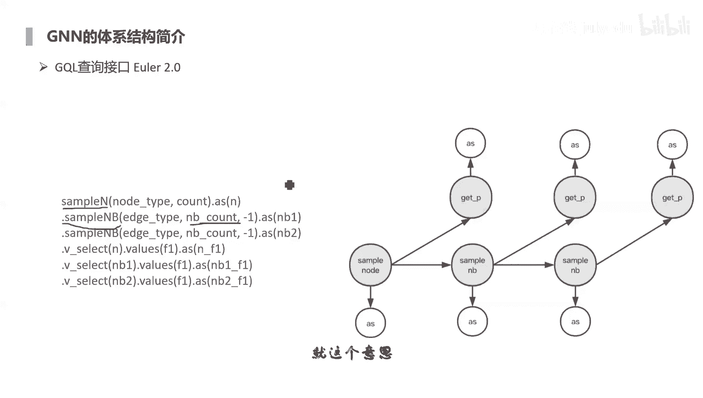

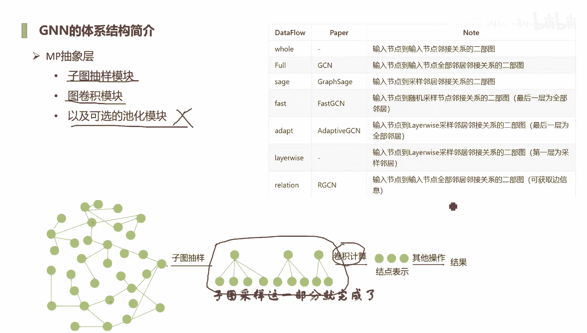

然后图卷机这一块就是你有了这个采样的这个这个东西。就是这一块已经采样好了，我们只有一个节点，我们只采样了一个黄色的节点X1，然后它采样了三个连接节点。那么它有三种方法需要实现啊。

这里边一般都是用各种虚呃虚拟类实现的。你想要它会帮你实现一些。然后你想要添加的话，在模块里边再呃提成一下就行了，重写一下函数。消息传递函数消息传递函数就是个拍拍。

这个拍指的是你从邻居上怎么传递消息到到这个目标节点上啊，比如X2怎么传到S1X3怎么来到S1啊，这样传的啊，在G4边上怎么传的？挂不是一个了，直接呃直接。就是先把他们所有的东西过一个NN，是不是？嗯。

过一个过完之后再跟X一再聚合在一起，是不是啊，这是这么传的。消息聚合函数，你每个节点传完之后，它怎么聚在一起的？😡，刚才graphra它是这一步做完了啊，其实要要分开的话，呃，也是可以的。

你X2用呃用那个矩阵乘一遍乘一遍，然后到然后就放这X3用矩阵乘一遍，放在这X矩阵乘一遍，放在这，然后再做一个这po这样一个东西啊，这是聚合，你算完这个每个这个过来之后，你怎么聚合在一起，聚合完了之后。

你怎么更新怎么更新X1啊，Gra怎么做呢？G6就是把X一原来的跟它的这个邻居慷开的起来，是不是？然后再过一个W，然后再过一个re路，是不是啊，这是graph的一个做法是吧？啊。

当然你可以实现各种各样乱七八糟的这些东西。

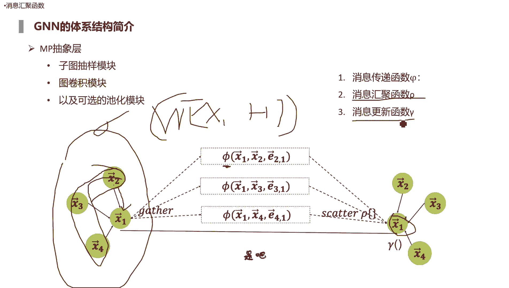

那最后呢就是这个啊算法层啊实践了很多这个算法，包括知识图谱的一构图的啊一些常见的一些呃表征学习的这些都会实现，你可以选用。

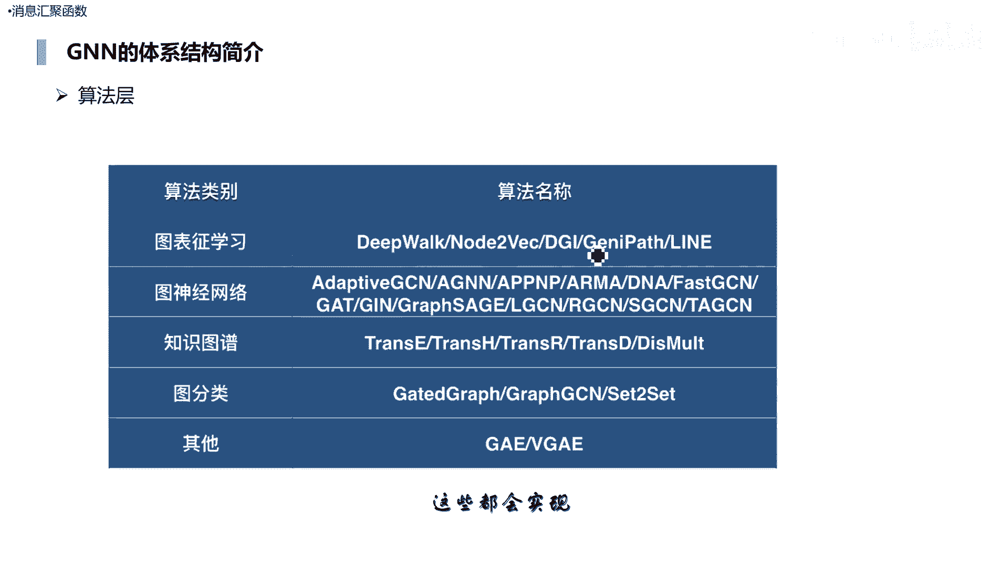

然后这一部分大家有什么问题吗？嗯，先看一下。啊。我先嗯先回答一下大家问题，然后呢，我在后边会花5分钟给大家介绍一下我们7月在线的这样一个就业班以及提升班啊。现在工业界除了基因这种其他高召回的。

非常规方法嘛，除了基N这种，还有其他。嗯。呃，一般我们现在。正常的啊正常的我们现在的召回一般都是双塔在做的。嗯，目前目前这阶段都是双塔，然后有一些有一些公司不公开的呃，比如字节跳动呃，阿里也有。

他们有一些自研的一些高效的一个召回的算法啊，因为召回我们有双塔的话，它其实有一些限制嘛。你优的测和ite测自己做计算，但是没有match对吧？没有match的话，你就跟金牌的精度差很多嘛。

现在呃各大公司都在研究怎么使用这个match特征啊，这是一种方法啊第二种就是一些自研的呃，我给大家提醒一下，叫呃structure learning这个词在最近的学术界工业动啊。

就是你学的不是最终的一个inbeending，然后去做点击去做召回，而是你对每一个。😊，我大家稍微画一下，你对每一的 embedding embedding它召回的时候，你不是做那个。

而是你去学了一个路径structure。嗯。然后你你这个Uer学了个structure，然后这个嗯这个ite随个structure，然后去做这个structure做一些这个那个什么啊，然后呢。

还有一些工程上的优化，比如这个召回的话，因为我们候选机特别大嘛，呃，所以一般有一些有一些优化方法。我比如给大家介绍一下ANAN得这大大家都知道最近临检索嘛，嗯，一般用的是HSW。

这这这块给大家多多介绍一下这个工业界的一些实践。还有就是一个是叫做qu。因为我们最终你去呃一般我们最终出现的最终算的这个in bindingdding都是f的16嘛，你最终去做点击计算的时候。

但其实我们可以把它框成in的8啊最成框的in的8，我们就是不是就不需要这个AN解锁了，我们可以抱着计算了。你1000万的这个这个广告库，或者你上亿的这个这个推荐，我可以增稍微增加一点机器。

然后做in的8。做in的8之后，然后我就可以全报着就算了，是不是就能。😡，更高更高性能的然后做了啊，然后还有一种还有一种就是PQ。PQ刚才就是对应了一个这种structure学习啊PQ。

大家有兴趣可以这里这里不做深度的介绍，给大家稍微说一下。呃，广告的召回。我先从上往下看吧。艾拉单机版10万条样本，这个不知道啊，我们都是分布式的，一般一个节点也就是呃几十万个。

因为我们的单机每一个po都不大。基因在推荐场景做了半年，效为无其微。And。这个我不知道这个好像在基N好像在阿里貌似还是一个挺大的部门的。艾拉欧拉他们做的都挺不错的。啊，级别这个东西保密啊。好说。嗯。

刚开始上土毛学牙迭代。路径嘛。啊。刚开始上图模型最简单的你就直接去用line去 train一个或graphra一个train一个，看你是想做两阶段建模还是一阶段建模。刚才那个范式我已经给大家介绍了。

大家可以嗯按照那个范式去去建模就行了嗯。时工图。啊，时空度这个我不是特别了解。啊，广告的召回和推荐的召回有什么不同？呃，这个这个同学回答的不错啊，广告的召回是要考虑商业价值的。呃。

广告的整个run坑链路都要考虑。呃，都要考虑这个这个商业价值的。嗯呃，我们都叫做ECPM，或者叫做sECM嗯，就是考虑了这个商业价值以及非商业价值。不管是在召回，在出牌还是在金牌，都会考虑商业价值啊。

推荐的话一般考虑是另外的目标，比如停留时长啊嗯这个呃用户的这个留存啊，考虑这些目标不一样啊，但是整体的这个架构啊都是一样。嗯，你比如说这个字节调整，他们这个做中台的这种呃广告啊，推荐啊。

他们中台都是同一套。啊，然后我花几分钟给大家介绍一下7月在线的这个呃AI的这个推荐系统的提升班，以及这就业班吧。嗯目前现在是我了解到是到第第七期了，每一期每一期的就业率最后终都是百分之百啊。

而且每个老师后面可以帮助大家内推。嗯，一般我们的老师我我了解还是。😊，都很棒的啊，级别也也都不错，内推的话会有一定的效果啊。嗯，然后呢我看了一下这个第七。第七次推荐课的这个内容，我看内容还是蛮丰富的。

他会讲一些呃推荐系统的常用方法啊，召回啊，这个金牌呀啊这些东西都会讲啊，然后还会结合业界一些前沿的。你不能光讲一些现在在用的。因为你们面试的时候，其实嗯。呃，我说个我说一下我来面试的经验。

我的刚才也说过了，就是对于看你的经验，如果你的经验少，比如你呃校招或者是嗯你这个刚做一年嗯，那么那么其实我不太care你的项目。你的项目其实在我们眼中除非你在大厂确实做的不错啊，否则的话。

一般你的项目我们就就就听一听就不是特别重要，我们会非常在你的基础啊，嗯，嗯首先是coing，对吧？这个刷题，大家都是一定要刷的，首先都是coing。然后呢就是算法的一个基础，你对召回金牌这方面嗯。

有没有一些inset。呃，给你一个问题，你能不能想到一个优化的思路？在真正的工作中啊，我们有很多就是有很多组件大家都建好了嘛，你需要有一些点1点的1。1点的去突破的。你需要去想到优化的点。

那么我去给你一个实际问题的时候，就是比如我是在工作中我遇到这个问题，我想到了解比较好的解决方案，并且上线实践了。那么我会给你同样的场景。那我问你能不能相处啊，你可以不想着跟我一样的。

但是如果你也有比较好的解决方案，我认为你的建模能力不错啊，算法工程师，说白了是个第一是个工程师，第二是一个解决问题的工程师。这上面呃除了有这个呃经典的这个常用的算法，还有一些前沿的算法，啊。

包括特征工程啊，然后还会讲一些工程的，比如flink呃，slar spark这些你在工作中啊都是有需要的。呃，你在你你如果是校周的话，你要是说你懂spark，然后懂scarla，懂这个flink。

懂卡夫卡。嗯，那其实你的算法能力呃，我可以给你。不那么要求不那么高，但是你一定要有一个点特别突出，要么你就算法特别好，要么你就工程呃也不错，加上算法也不错，这种都可以。然后呢。

这边推荐课一般还会有呃几个项目，就是实战老师带大家去真正的去实践工业中的这样一个做法。一般我们都是在工业界现在在打磨的嘛，我们了解工业再怎么做，所以我们给你们剪的，也都是最实用的嗯。

不管你们面试还有一份工作呢，都是很受用的。然后这个还有一个我的感觉是，如果你们读过研究生，你们就知道研究生的课第一时间长啊，第二，他们的课件可能非常的老旧，经常的不变。那么你在7月在线呢。

首先呃校长都会让我们定期的更新课件啊嗯第二呢。嗯，第二呢，你可以花大约研究生10分之1的精力，学到真正实操啊，真正你工作中用到的技能啊，甚至比研究生学到的还要多。我说实话，在研究生学到的东西。

在工作中用到的啊其实特别少。但是你让工业界的老师给你们讲的话，其实嗯有事半功倍的效果。脾气呢。咱这个问题咱就咱就暂时不回答啊。嗯，然后我待会儿会选几名同学送一个每人1000块钱的这个视频课。

大家可以了解一下7月在线的这个就业班水平呃，讲课的水平，讲师的水平到底怎么样？嗯。大家还有什么什么问题想想探讨的吗？啊，什么问题都可以啊。因为现在我们是一个开放时间，你可以，比如你以前不是做推荐的。

你想做推荐有什么路径啊，或者是GN有什么想问的？😊，或者是广告这些。都可以问一问。啊，包括7月在线的这，我看校长也在，你们要是有什么问题的话，可以问一下。嗯，P气这个东西还是要看要看你的面试效果。

这个run着比较大，可能60万到150万之间都有。构图有什么技巧？😡，啊。多讲一些trick啊，因为这次是个公开课嘛，然后具体的这些trick呀，实践啊，这些东西是在正式课里面肯定是更清楚的。

因为是要上手的嘛，是要。😊，构图的有一些技巧的话，就是你要对业务有一个深刻的理解。呃，假设说你在做我我举个例子，你在做广告，你做的时间长了，你就知道click点击跟转化需要一个什么样的比例。

你是确定1比3的还是1比10呢？啊，那这个东西那就是一个工业的一个业务的一个经验嘛。诶。构图考虑有哪些维度？一般构图呃，我给大家说一下，实践中呃一般是两种维度。第一种维度是。你重考虑这种呃这种行为啊。

比如广告啊，比如广告呃，就是点击转化啊是吧？嗯，然后你还可以考虑一种就是跟业务目标相关的。啊，比如你转化了多少钱。嗯，你转化之后带来的收益是多少？这个东西你可以加进去啊，点击也是一样。😊，嗯。

一般是两两种维度，一个是不考虑最终的目标，一个是考虑最终的目标。呃，这个我给大家说一下吧，二步图和这个同构图有什么区别？然后比如阿里做的那个商品的那个同构图，呃。

你最终只能得到呃item的 embedding，而不能得到user embedding这是最大的一个区别。二步图的话。

你既可以得到user embedding也可以得到呃grab emdding或者这个item embedding啊，这是一个最大的区别。然后第二个区别呢就是同构图，你没有没有办法考虑更多的一个交互啊。

你比如嗯。你比如这个点就是它建模的那个session内的那个点击的这个序列，那你就点击了嘛。当然如果你二步图的话，你可以做的非常丰富。用户跟跟ite的所有的交互，你都可以放上去啊，然后你可以设计一些。

刚才我也给大家说了嘛啊采样的时候，你可以按编采样啊，你可以按比如你每个 batch，你可以采样。假设是呃电商推荐啊，我给大家先说一下这个图怎么构的这个图就是啊点击啊加购啊，购买呀啊。😊。

然后退货啊这这这样一个一个图。然后呢，你可以采样你可以采样的是比如你每个拜师，你采样三个购买，然后5个这个点击，然后两个退货啊，这样总共10个嘛，你可以按这个。不同的边来采样，还可以这样子啊。呃。

一般我们现在倾向于呃如果好做的话，就做一构图。嗯，加班这个问题。加班这个问题还是看部门吧。行，大家最后还有什么问题吗？看时间也快俩小时了，也非常辛苦大家来这儿。嗯，今天还是万圣节。啊。要是没什么问题。

我们就先到此为止。然后后面有。有报名啊，还啊后面如果想报名这个7月在线的这个提升班就业班的话，我会在里边嗯。嗯，很多内容我会再讲的更细的。因为这次公开课第一时间有限。第二毕竟是个公开课。

我也不了解大家的基础。啊，所以很多内容也也不是说有的放矢。哎，你说基础理论讲不讲呢？有的同学他可能知道，有的同学他可能不知道，是不是啊？工程能力提升工程能力提升。如果你现在是一个在校生的话，呃。

卡股比赛坚持比赛去参加参加。😊，啊，这些是一个时间的机会。嗯，但是真正的工程能力提升，还是要去大厂实习。😊，啊。因为大厂的那些呃首先你那个数据量，这个你在比赛啊或者什么东西都是没有没有办法的啊。

开源项目也不行，开源项目呃这些东西都是为了是大家熟练算法啊，以及熟练整个建模的路径。嗯，这样一个事情。但是你真正的工程能力还是要去大厂实习的啊，还是建议大家嗯如果有空的话，可以去大厂实习看一看。

真正的工业界是怎么做的？因为你真正的参加一个比赛，他数据都给你弄好了。嗯，你比如你在真正的工业界啊，比如流式训练怎么做的呀啊，流式训练它有很多的坑啊，你流式训练举个我给你我给大家举个简单的广告的例子。

那广告你点击还行，你点击了之后，它马上就能回传了，是不是我能知道你点击了，但是转化，比如我下载了下载了某个游戏，你下载之后，这个这个主这个回传是厂商是那个游戏商他来决定的，它一般会批成批量的给你回传。

那么你这时候你就会遇到一个问题，你的正样本，回传不过来。😊，你每次你流失训练的时候，你每次见到一个正样本，你要你要等它是不是正样本副样本，你要等一两天甚至一周，那怎么办呢？啊，大家都会有一些优化。

比如Amate，这个fastmate就是只要来一个样本。我不管你是正样本负样本，先当做负样本处理，然后等你真正传回来的正样本，那我再把你当做正样本再处理一遍，并且加了一些规则，通过一些算法的推导。

告诉你这样是无篇的啊。😊，嗯啊真正的算法工程师的工作内容呢呃。我给大家如果有兴趣的话，可以给大家啰嗦一下真正的算法工程师的工作内容嗯有两大块吧，第一块就是idea。嗯。

你作为算法工程师跟跟工程的最大区别，就是你一定要有idea。你一定要知道你往哪一方向优化，这也是算法工程的价值。你有idea之后，你就能提升业务的价值。比如推推荐啊，广告广告更更更更是这样了。

你有一个idea，你提升了业务，那么你就提升了公司的挣钱能力，对不对？那你不是高技效，谁是高技校，是吧？啊，第二个就是呃工程能力不能少，你有了idea之后呃，然后你把模型建出来建模建模完了之后。

你一定要了解工程。因为很多很多方面呃。😡，比如金牌金牌刚才号，金牌依赖模型重一点，你在召回内侧，它其实有很多工程的优化。你在工程上，比如我刚才说的这个AN，这是工程qut是工程PQ啊。

框跟PQ都既是算法，又是工程。就是你算法的优化是一方面。然后你如果你工程提出一些这个工程的优化，那也是很棒的嗯。所以嗯大家都是要平衡发展的啊，不是说你会写论文就行了啊。我嗯大家可能都知道。

现在所有的这个什么labs啊发展都不是特别好。嗯，在公司内部也没有什么人权，地位也比较低下，绩效也不高，嗯，高绩效都什么这些业务部门，因为他给公司带来的价值，lab部门你光写论文。

你往上赋能能力不够的话，嗯，还是不行。另外的话，你内部及即时想往上面赋能。你业务方，你比如我们做广告的啊，然后或者是兄弟团队做推荐的那我为什么要用你的人呢？

你你做出来一些这些都是公司的一些一些不好的事情啊，就就有些内部竞争嘛啊，你提供了一些东西，我可以有能力自己做我就自己做嘛。所以。嗯。所以这个最后一点给大家找工作的一个建议吧。

就是呃如果大家能呃大家一定要摒弃掉。业务。啊，不好的一个想法啊，做业务是非常好的。你在公司你就得做业务，你要不做业务，你就去研究所做研究。你要想在公司做研究，呃，说实话你的发展一定不是特别好。

除非是你是业界的大佬，你要么就是在斯坦福读个博士，然后在业界非常有名，你去带一个团队，做lave的实验室，这个主任是吧？这可以啊，除否则的话，建议大家去业务部门。呃。

我之前找工作的时候也是想做纯search，但是research这个东西呃我做过啊，做完之后感受不是特别好，还是。做业务跟算法的结合是最。最能让你感受到一个满足感的啊，你能有ideaidea之后上线。

上线完之后看到收益啊，你这个收益可能每天都给公司赚100万。你虽然你你的年薪可能也才呃一两百万是吧，可能几百万，但是你每天都能给公司多挣100万啊，你再有个提升，每天又能给公司多赚几十万。

这就是你的价值。😊，嗯，今天跟大家也聊了不少，现在也马上两个小时了啊，我们今天都先先到这边啊啊欢迎大家呃来参加这个。😊，其余在线的这个就业班。😊，啊，我这边结束了啊。嗯，也感谢同学们今天的参与。

