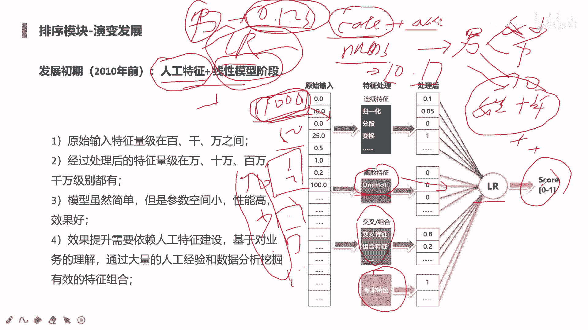
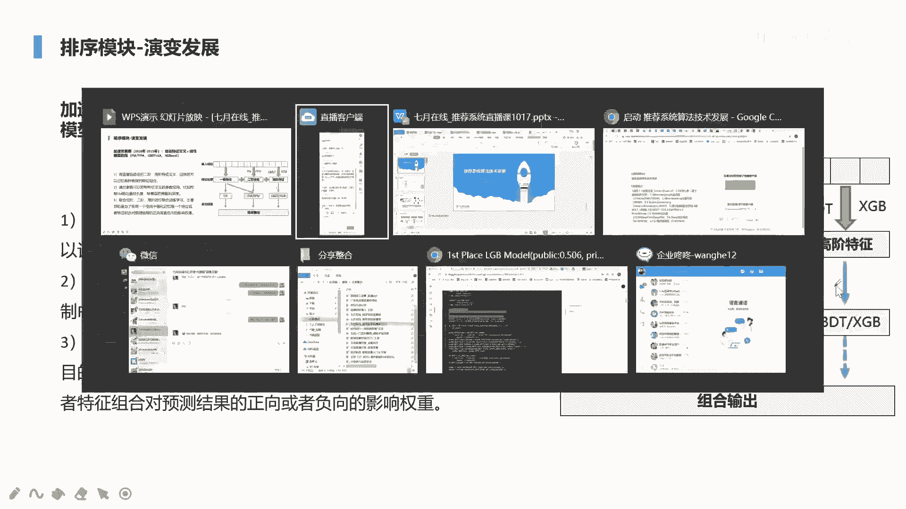
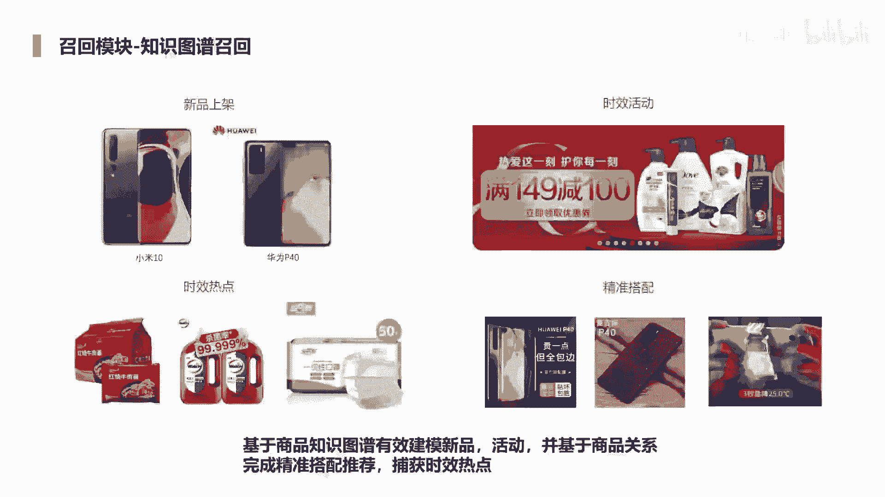
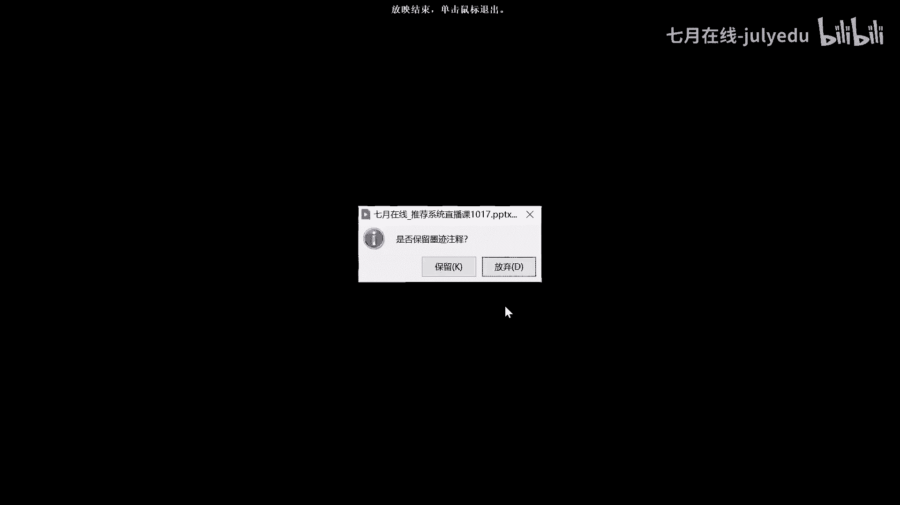
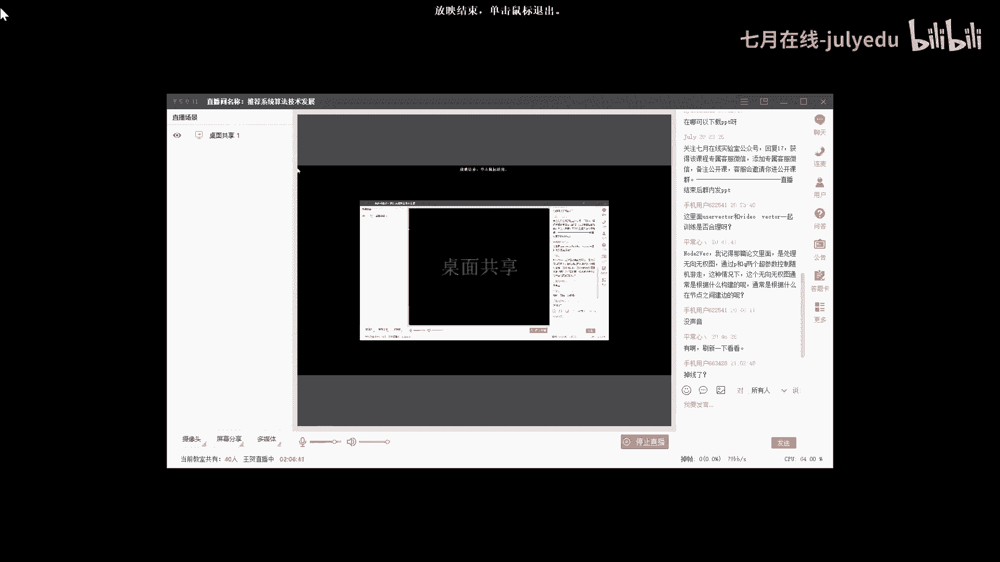
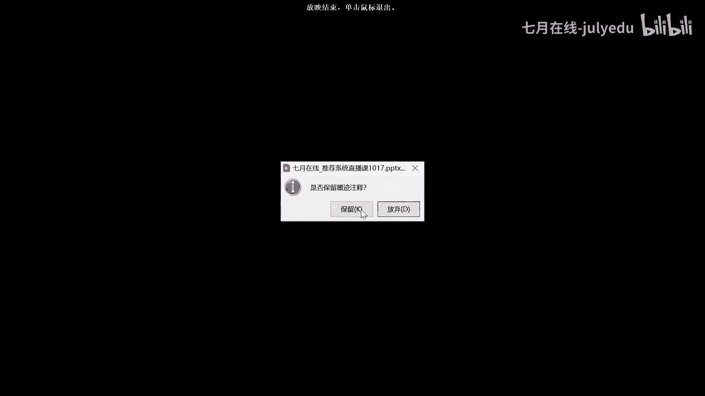
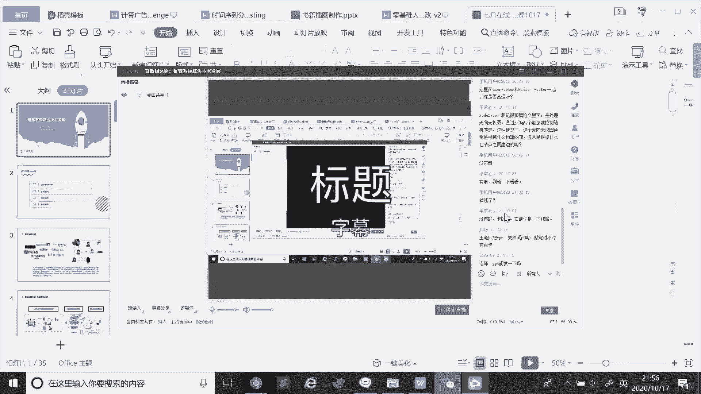

# 人工智能—推荐系统公开课（七月在线出品） - P8：推荐系统算法技术发展(各模型的演进) - 七月在线-julyedu - BV1Ry4y127CV

hello，我们这个课程呢是8点开始啊，大是可以看到我这个界面，还有能听到我的声音吗？好的啊。那还有一分之后我们正式开始啊。OK那我们现在公开课正式开始啊。那今天呢这个内容是推荐系统算法的技术发展。

呃我是今天的嗯讲师王贺啊，呃，今天主要是围绕两个部分啊，第一个是推荐系统里面的召回部分。另外一个是呃排序部分，主要来看一下他算法从最开始时候到现在来说，它的一个发展趋势是什么样子的。

嗯，大概分为四个模块啊。第一个推荐系统介绍，第二个呢是召片模块。第三个排序模块，最后呢是对我们这个内容的一个思考和总结啊。嗯，那我们知道，其实来说我们在平时活当中，不管你是拿起你的手机看视频也好。

或者是购位也好。你这时候你所接触到的内容都是由推荐系统所给你推荐的对那其推荐系统它里面的一些算法，对于业务的一些收益，它提升也非常关键的对像亚马逊平台，或者说咱们国内的一些比如说京东呀这些跳动。

对他们来说在推荐这块或广告这块，它的收益占比是非常高的。对嗯，它主要是针对于我们用户的一些一些行为的一些数据来去来去来去学习到你的一些呃兴趣偏好来进行一个推荐。那他的大概一个流程是什么样子呢？

那第一个说呃用户行为他嗯。系统呢它会从我们的一个日志里面提取出我们接下来的一些意图，或者说我们的一些兴趣信息，然后利用机器利用推荐系统技术，就是我们今天要讲的召回排序，或者说更细致一些。

在呃就是重排序这种方式来推荐，来推荐，就是符合我们接下来的一个兴趣，或者说我们符合接下来我们意愿的一些商品，或者说新闻，或者说是短视频。那在推荐系统。这块那主要做工作是两个。那第一个呢是。左边的框。嗯。

左边框是哪一个部分？这样吗？这边是没有问题的吧。嗯，是分为召回和排序一个部分。对，因为我们最开始的时候，我们要给用户去推荐商品时候，我们不可能比如说京东或者说是淘宝。

它全站的个商品是有上亿个或者更多的一个商品。对，那我们不可能说把4亿把几亿商品全部去推给用户。那起来说在它在APP首页的时候，你能看到商品其实没有多少的所以这时候呢，我们是分为多个步骤。

那第一个说我们如何去做一个基本的一个筛选。那这时候来说，我们它处理的数据是常大的，就从千万级或者说上亿级的一个商品当中，我们做一个过滤。那为了保证这个时效性呢，我们模型是不能太复杂。不能太复杂。

另外来说，使用特征是比较少的。接下来呢为了保证我们去推荐的商品的一个准确性。这时候呢我们需要结合复杂的一些特征，就是呃不管是你从特征组合，就人为高特征也好，还是说我们从模型角度。

就是那些交叉类的一些特征的一些自动学习这量的表征也好。对，在第二部分它的内容是非常复杂的。因为这时候我们处理的数据量比较少。另外我们要嗯我们要使用到更多的特征，对模型要求的也是非常的精准的。呃。

另外的话还会有一些还会有一些企业，对吧？或者他们也会进行一些重排。那重排呢，他是在排序基础上就排序的时候，他不能满足他们的一个需求。比如他们想要更更加精准的一些一些推荐。对，这时候才会再进行一次重排。

或者说在召回的时候进行两次。这样嗯，在召回阶段或排人都可以分成多次来进行的。那么我们来初步了解一下，在召回模块呢，我们是做了需要是做哪些的一个工作啊。那第一个很显然易见就是说我们要缩小我们的搜索范围。

就是类似于成这种漏斗的一个形式。我们将所有的iteom，就我们的商品或者我们所有视频去选出我们就是更加符合用户的一个兴趣，它的个意图的一些视频，就是说后选的一个商品。第二个来说呃通过局部来去拟合整体。

那我们其实来说用到了一些召回的算法，包括。比较流行的是这种类似于多路召回这种方式。其来说每一部分来说，它不会说用到我们全量的数据来去来去拟合我们整体的一个。比如说数据之间的一个结构信息。

或者说商品之间的关联性，或前后一些数据的一些呃密切的一些一些一些相相似情况。所以说只会用一部分的数据，比如说我们在做呃关联召回的时候。

我们会用我们的历史的一些数据来去学习到来去统计到呃商品与商品之间的一个关系。比如说我们在购买购买购买呃。

我们经过多次统计中种发现呃手机和手机套它的贡献关系是非常多的那我们其实在未来的时候都会将这个关系应用在未来。然后同时呢根据这个关系来去做一进一步的一个推荐。Yeah。是。那看一下。

我们其实来说在做召回的时候，我们该怎么去评估这个结果啊。对，那其实最核心的话是我们所推荐的个商品，或者说视频对被用户所认可，就是它会会去点击它，或者说会去会去发生转化。

就是说我们终止的目标是CTR和CVR这个的提升。对，但是我们在做这个问题的时候，也会考虑到其他的一些因素影响。呃，因为比如说我们在呃在看抖音视频的时候。

他不可能说一直推那些你转化率或点击率非常非常非常高的一些。呃，一非常高的一些视频，这会引起一个非常大的一个问题，就是说多样性可能会会降低。应为来说我们想要去扩展用户不一样的一些兴趣。

这样的话才会说我们在不同商品里面才会去呃。进行一些用户的一些拉新，或者说这种的一个用户增长。这样的一个业务的一个问题啊。所以说我们需要关注的呃有6个点。那第一个的话是准确度。那就结合我们的CTRCVR。

第二个是覆盖度。那我们再去召回的时候，能否覆盖到用户他的兴趣范围之内的一些内容。对，第三个呢是多样性，能否去挖掘到用户的一个兴趣，去呃。嗯，挖掘到用户上去去，给他推荐更多更多不同的一些一些商品。

那同时来说也会也会使用户发生一些转换。那第四个呢是时效性。时效性在推荐系统里面是非常关键的一个非常关键的一个部分。对呃，我们不能说呃，我们在发生购物的时候行为的时候，呃，我们当天比如说我们前7天对吧？

之前我们买了一个买了一个笔记本。对那我们在今天的时候我们又来逛这个电商一个网站的时候，我们再给他推荐这个笔记本。那其实这个时候推荐肯定是非常影响用户一个体验了。对，因为这时候他的意图并不是想买笔记本。

他的意图可能想买到其他的一些商品，但是我们许多数据全都是使用的一些历史的，就他已经发生过购买，或者说他历史经将点击的一些一些内容重复给他做成做一些推荐啊。呃。

另外两个的话是呃交互体验和运营运营运营策略啊，运运营策略。对这个的话都是从呃业务和运营这块来考虑的对，那我们也会进行一个评估。那评估是分为两种。第一个的话是离线评估，或者说人工评估。

我们看到的是它的一个准确度和覆快覆盖度。第二个是线下一个测试。那线测试的话，我们使用是正加ABtest。对，这种测试的话是为了保证线下和线上的一致性。

就我们这个是在最后我们在上线前的时候才会这种AB测试来保证这个结果呃，一定是有能提升的。有提升的话，我们才会将我们这个方案。对，然后呃才会应用到我们的一个线上的一个真正的一个呃业务里面。呃。

召回这块的话，它的一个算法是非常多的那最为经典呢是呃协同过滤啊啊，那协同过滤它讲的是什么呢？就是呃它可以来去获取到用户或者说ite之间的一个相似性。那根据这个相似性呢，我们进行一个进行一个推荐啊。嗯。

右边的这块我给到了一个一个图，呃，三个女女孩对吧？她们对于不同的商品都做了一个简单的一个评价。对，呃比如第一个我们把它称为小美吧。对它对于口红的话，评价是评价是4分。对，然后在于在后面两个的话。

睫毛膏或者说这个粉底的话，它没做出评价。后面的话5分1分。那其实我们把它可以转换成一个向量啊。就是呃对于小米这块可以把成上转换成向量，就是4005100。那如何去计算小美和小列相似度呢？对。

后面给出公式用的话是余弦相似性来去计算。嗯，这块儿有点挡住了啊。好的，嗯，最后得出结果的话是小美和小丽的分数是0。38分。呃，小美和小红的分数是0。32分啊。对，那其来说就是小美和小丽。

她上次去上次性会更高一些。这时候说我们可以将呃小丽将小丽呃，比如说她对那个粉底和睫毛这块的话，打分是比较高的话，那其来说我们可以给小美去推荐小丽所使用过的一些商品或者评价过一些商品。那这块来说的话。

我们也可以给她一个非常好的一个分数，包括这个位置。这个是比较经典的是呃user item CF对user cF就基于用户的一个协同过滤。那协同过滤是分为两种的话，分两种，一个是用户的一个协同过滤。

第二个话是商品的一个协同过滤。那它其实说所用的场景是不一样的啊。用户启动过滤的话，它是有更高的一个社交性的。就来说就是说相似用户喜欢什么，我们就推荐什么发现热点。这里面来说。

用户更新它其实说更新的频率是比较少的，更多是新闻。比如说在新闻推荐的时候，比如新闻的一个app对吧里面，它的新闻在不断的去更新迭代的。但用户其实发生的关系是比较少的啊。itemCF的话。

它更多是兴趣变化，相对稳定的一些应用，适合常委和个性化场景。那更多的是电商推荐。这时候来说，商品可能发生变化并不多，它更多的话是用户这块不断有新的用户，他的兴趣会不断的发生一个变化。

那这时候我们更适合用户用的是itemCF。来看右边这两个图啊，右边这两个图。第一个话是呃userCF usererCF我们根据用户和商品的交互，用户和商品交互来去寻找到相似的一个人。那确定好相似人的话。

我们可以说我们可以把C他所选的一些商品推荐给A。那itCF的话，它同样也是根据用户和物品的一个一个行为关系，然后来去确定两个物品的一个相似性。这时候呢我们可以将A的物品，比如A和C相似。

那可以将A呃将A商品推荐给就是点击推荐给C这样的推给用户C。呃，一个是基于用户，一个是基于商品，这是两个的一个区别啊。呃，接下来介绍一个是关联关联召回啊，这个也是呃我之前在参加一些比赛啊。

包括那个哈CIM还有安泰杯，还有今年的KDDc的时候，呃，我就出了一个基本的方案。对，就是用这种关联的方式，就是关联召回的方式来去解决来解决我们第一步的一个工作啊，就找到就根据用户他历史的一个序列啊。

我们如何去给他找到一些呃关联的商品来做推荐。那什么叫关联商品呢？就是说两个商品它在一个同一个窗口内，比如说嗯。呃，我下面那一页。比如说小冯同学对吧？他呃，他在他呃他所购买的商品里面。

就是从伊利牛奶到橙汁。这个我们把它看作他的一个呃行为序列，或者说他的一个一个一个呃下单的一个序列。对，那这时候威化威化饼，他和饼干。对。它其实就是一个关联商品。对它是在一个同一窗口下。

因为我们可以我们可以我们可以把这个行为的一个一个序列看做一个窗口。那在窗口内出现的这些商品，那两两之间都可以称作它为关联商品。那我们在推荐的时候。

不能说威化商品威化饼它和饼干的一个一个一个重要性和奥利奥的重要性肯定是不同的对，因为来说我们在购买个商品之后，和下一个购买商品，它两个关系可能会更加密切一些。

但是和上一个商品可能它的关系并并不会那么密切了。就我们刚才提到个例子，就是说你先买手机呢，还是先买手机壳。一般来说我们买完手机之后，确定好手机之后，我们再去买手机壳。那这样的话就是手机手机壳。

他们两个人他们两个商品关联起来的。前后关系更强烈一些。所以这个时候呢，我们为了保证为了保证不同商品它有关联。但是说它的关联分数不一样，我们这块做了一个呃distance，就是说距离这块的一个一个确定。

距离这块一个设定。对，第一个话就是说我们正向。威化饼嗯为起始点，正向。对，然后还有一个就是说它的历史购买商品，这种是逆向。呃，下面给到一个一个一个公式。对。

就是说商品交互距离同一个商品它的交互的越近的一些商品。那比如说威化饼和橙汁，它这个交互距离肯定是大于威化饼和奥利奥的那这时候呢就威化饼和奥利奥，它的一个关联性是越高的啊，那下面是给出公式就是说呃0。8。

0。8作为我们基础的一个分数。呃，然后是它的一个对应的话是dense的话，是L一和L呃I1和I2I一和I2的话呃，我们这个距离呃。A和I就是类似于就是威化饼和奥利奥两个的位置，然后进行一个做差嗯。

那我们如何去呃如何去给小冯来去推荐这些呃关联的一些一些商品呢？对，如何去推荐这些关联商品？那这块儿再往右看，对，这块又给了一个例子。对。小陈对他点击过他购买过的商品有5个。对，然后呢每一个商品威化饼嗯。

它会对应他的关联商品。当然就是每个商品它对应关联商品是非常多的。但是我们经过第一个公式之后，对，会对于每一个进行一个打分。比如说威化商品对吧？威化商品它对应的商品有如可口可乐，我们这时候打分，哎。

可能是可能是0点7分。哎，呃可能是0点7分。这还不好写。第二的话。第二的话可能对应其他的一个商品，对吧？可能打分是0点8分，那我们可以做个排序，就是先是呃先是可口可乐，先是奥利奥0点8分，然后再对应的。

再对应可乐0点7分。那其实来说，我们在遇到威化饼的时候，我们先给它推到的是一个奥利奥，再是可乐啊。接下来看苹果，它对应的话是西瓜，这样的话我们经过一个序列，我们会去提取到很多的关联商品。

有这关联商品之后，我们按它的一个分数来做一个排序。那我们将最高比如说我们想要top10，那我们把分数top10的，最后推荐给小程就可以了。那还有一点就是说我们要需要做的话，后处理，把重复的商品去掉。

因为我们不能推推重复的，包括历史有过有过点击的这样的话都会进行个历史发生过购买的，都会要进行一个剔除的。这个就是我们关联召回啊，这更多的话是一种规则的这种策略来进行寻找到关联商品。

第二个模块呢是单inbedding质量召回。这块来说的话，就是说呃我们就是离线这块下面给个图，就是说我们离线就是将用户特征和物品特征，我们输到模型里面。

然后会呃分别得到用户的一个embedding和物品的embedding，我们将这种个embedding做进行离线一个存储。那到线上的时候呢，用户一登录，然后提取到它的一个用户ebedding。

那然后我们用呃face方式。对face方式的话就是AN它的。计算方式由AAN就近似最近灵的方式，就快速来去进行一个匹配到跟它相似度比较高的商品。比如top10或top N，然后再对用户做一个推荐。嗯嗯。

这是当in白你善量的一个召回的一个过程啊。那比较经典的，像大家也都看过，比较经典的是youtube的DEN这种这种话就是。呃，用D一N的方式用第一N的方式，我们来获取到用户的。获邀用户的一个向量。

包括在soft max之后的话，这块得到的是呃video，就是视频的一个向量。那怎么来去，他这个最开始的时候，我们输入部分是什么内容，包括它这个流程什么样子的？

他的特征来说的话就是说用户他所观看的一个向量，然后搜索的一个向量这块这块来说，它只是直接是将单一的一个一个一个呃ebedding。呃，用户他在历史会观看很多的。很多的一些呃一些视频一些视频。

这时候我们可以经过我们可以用多种方式。可以用what to what to这种方式来回到它的上量。另外一个。可以啊。用what to act的方式来去赋予它的上量。嗯。就说我们这个向量对吧？

向量获取方式有两种，第一个可以用what to a。goto我就不写了，写写也不方便。第二的话是直接经过inbedding层。对，然后来回它的一个向量。但是呢我们要都是经过一个mepo，就求一个平均。

然后单独获得它观看的一个向量。另外除了观看向量之外呢，还有它搜索的向量。呃，这块的话是一些比如说他的一些呃人口属性呀，其他一个信息。那人口属性，比如说他的一个呃年龄呀、性别呀，其他的一些信息在里面。

还有这个样历的一个年龄，样历年龄这个是比较特殊，就说这个视频对视频它的一个呃它的一个呃。嗯，视频的一个时长。对呃，视频的一个时长出现的一个时长。对，还有后面他的比如说他的一些用户的一些性别。

将这些特征我们统一去位入到我们的接下来一个三层，就全连接层，对吧？然后在最后一个权阶层的时候。然后可以提取到提取到用户的一个向量表示。对，这块用户向量表示再往后的话，经过soft max这块之后，呃。

可以获取到V6的一个向量表示。这时候我们可以将这些向量，然后存储存到我们的一个呃数据库里面。对，离线的数据库里面。然后之后的话啊，这个是整个流程。但是在做当中也会有一个呃呃，我们有还有一个问题。

在soft max这个时候的话，我们会进行一个呃副采样。因为来说我如果将几千万或者说几百万个商品，对吧？然后同时进行soft max，它呃的消耗是非常大的，所以进行一个副采样。这是需要注意的点啊。

这是第一个youtubeDN。第二个的话是经典的一个双塔模型啊。这个应该是个13年的个论文。对它原本解决方式呢是原本解决的是呃文本搜索的一个一个做法。我们可以看到这个图是我这块没做什么修改，文本搜索呃。

query。vector和do do vectorctor对它原本都是英文的，然后是经过呃呃word hush这个这个部分对，两个。一边的话一边是我们的一个呃一边是我们的输入给词。对。

另外一边的话是一个呃候选的一个结果。对，然后我们来去经过这种双塔方式，对吧？一部分呃，两个特征是完全两个部分是完全没有交叉的对，然后各经过三层的一个一个一个一个DN那种结构。然后再进行一个。呃。

再这进行一个向量机向量机，然后最后再输入到soft max里面得到它的一个概率结果。对。但是如果说我们应用到我们的一个推荐系统这里面来说的话。呃，这块的话我们就要做一些修改了。

对我们这块quary这个部分对吧？呃，不仅是我们会包含很多，这块是用户这块信息。比如用户他历史的一个点击的一个商品的一些一些序列。那我们可以跟那个啥跟之前的呃youtube那种方式一样。

一样也会得到他们的一个向量，然后进行mepo。然后还有用户的一些嗯。一些一些人口属性相关的一些特征。那另外一侧呢是商品这块的信息。就是候选的商品，候选商品它的一个向量表示。

它的一个向量表示对候选商品的一个向量表示。然后也可以说它的一个品牌的一个项量或其他一些项量。对，都是和候选项量是呃是相关的嗯。然后最后来说的话，我们不是不会直接得到我们of the。

max这块的一个结果的对，我们会把它这块就是最后一层盯这块得到一个向量。对，这是用户一个向量。这块得到一个商品销量。进行保存，就类似于前面的youtube一样，对吧？然后之后的话，有了用户上量之后的话。

我们可以直接从数据库里面来去提取到与它相似度高的商品向量，然后再进行一个推荐。这个是DSSM的一个一个结构啊。那再往下呢是多inbedding向量召回。那我们可以考虑一下，前面几个部分。

我们是对于用户他历史的一些呃点击或者说购买的一些商品，对吧？他那个向量进行一个mpo另一个处理，对，求它一个均值。呃，这时候可能会出现一些问题，因为用户他的兴趣是是多种多样的一个兴趣。对。

这样的话就可能会由于那些可能会受到一些出现次数比较多的一些类别。他会主导主导用户。最后只是主导他到呃某一类的一个商品的这个兴趣里面，而不是兴趣的一个多样性的这种方式的一个里面去。

所以说呃会对这种呃会对用户的一个兴趣推荐，这种这种挖掘造成一些影响。那这时候呢，这是19年的一个论文，是天猫的一个论文。对他主要解决这种多兴趣的一个问题，一个建模的。呃，它的关键结构呢是。

我们我们来看一下吧，先看一下这个这个这个结构啊。对。嗯，第一个话是other features，这块是没有做其他处理的对，只是经过一个inbedding layer 。

 embedding layer层。对，然后做一个转换啊，进行商加。呃，后面这些部分的话是item一，item2，item3。嗯。这块都是说都是用户用户他的一个历史点击的一些一些item。

ite一ite2一直到item N这块。对，这个是每个都是对应商品。看呃，我们先看这个蓝色的话，蓝色是它的类别。

类别ID红色的是它的ite曼 ID黄色的话是品牌ID那起来说我们就是对它的一些其他的呃多种的ID一个属性，我们都得还有一个inbed一个一个向量。然后。然后这块是做了一个拼接的一个操作。结果民不用存。

然后得到一个最后的一个商量。然后呢，我们如何将它多个ite，多个ite进行一个进行一个聚合。这块的话就类似于用到一个用到一个attention的操作，就是注意力机制。包括还有很多模型很多模型。

比如说AFM。还有DIN。还有DINE电影。这里面的话都是考虑到用到了attention这种这种机制。因为都是说我们不同的向量，它所所占的权重应该是不一样的。那他具体是怎么做呢？😡，呃。

我们来看一下这个。Moern interest。这块呃再往右侧就有它的结构。就它结构。对。K的话KV呃这块的KV其实都是用户的一个inbed的一个矩证。KV都是用户的一个inbedding矩阵。

Q的话是label的一个embedding embedding向量。那其实首先呢是K和Q相乘之后，可以得到不同用户inbedding对应label的一个响应的程度。在这块操作嗯。

power的话power操作的是求得响应做指数的运算，这块进行一个指数的运算，得到个结果。嗯，从而控制我们最后attention这个呃一个程度，指数越大，他响应响应高的用户。

他inbeing最终权重就应该是越大的。so max经过f max之后，最后做了一个规一化。最后的话就是将多个inbedding，然后向量整合成一个向量。简单意思简单来说就是说我们历史我们历史有过。

我们可买过化妆品，买过买过键盘，然后买过手机。对，那我们这时候要推荐一个推荐一个笔记本。那哪个和笔记本，它这个相似度越高，状修越高呢，那应该是键盘，所以说我们应该给予键盘更高的一个权重。

所以这个话就是MIN的模型的一个一个思想。对，另外来说的话，它里面的核心是用到了一个胶囊神经网络。嗯，交囊网络它的个特点呢就是说嗯这块儿来画一下吧。胶端网络特点。

它其实和我们普通的1个DAN这块会存在一些差距在里面的对呃，胶端网络它里面它输入的这部分是我们的向量，对吧？输输的是向量。那经过我们这个提O函数之后，对输出的做输出结果也是向量。那DN就不一样了。

DN对。钉N这块的话，它是做了个规划处理的对。输入前是规划处理，然后输入之后我们也会做这样的一个处理。加当网络它可以就是说可以接收N个向量，最后就就是我们刚才说的iteom1ite2ite3M4到N。

然后最后返回一个向量。那如果说我们有一层的话，是K个转账网络的话，那就是说我们输出有KN个向量，然后输出K个向量。对，就最后结果是多对一这样的一个一个一个流程结果。

那么再往下是呃graphraph embedding。寡匪版你也可以看到一种学习到那个啥，就是这种图的结构。对，就是用户他的一个呃行为序列。对我们根据用户的一个行为序列。来去构造我们图。

比如说user一user2，它是一个行为序列，对吧？我们来得到我们的一个图的一个结果。对。然后从这图里面，我们再去重新提取到提取到序列。比如说ABEF这样这样的一个序列，然后再将这些序列。

我们再输入到呃那种what vector这里的模型里面得到每个商品的一个向量的一个表征。呃，寡粉白领的代表主要是两种啊。第一种的话是deep work。第一种是deepwork。

对它是在构造这个图出来之后，它会经过呃随机游走的方式来去得到这个序列。那随机游走这块来说的话嗯。有两种可能。第一个话就是呃嗯边与边的权重都是一致的对，就这个MM的话是它的一个一个一个一个权重。对。

另外一种的话是边与边之间权重是不一样的对，比如说呃比如说呃。比如说D到A的边对吧？D到A的边是一个发生的是一个购买，但D到E的边。对，发生的是一个点击。对，点击这是购买。那两种的话。

肯定它的权重是不一样的。所以说我们在随机游走的时候，以D我们为出发点。对，然后会去去随机去选择一个。当然如果是A的话，它的概率非常大。所以说很大概率就是说从D到A。从D到A发生一个游走，然后到A的时候。

到A的时候，我们发现A它的一个临接边，临接点只有一个是B，所以说A只能和向B进行一个扩散。然后B到E到A。对，然后也是根据它的一个重要性概率。权重。那如果说它概率是统一，权重是默认是是一的话。

那每个都是0。5这可能性。发生一个扩散，它到的是EE，然后这时候E有两种可能性到F到C。最后它组的序列是DABEC对。嗯，这个代码在实现的时候呢，我们就需要来说需要确定几个几个问题。第一个说嗯。

第一个是我们在构造这个序列的时候，对吧？构造序列时候，我们发现中间有个虚线。对。因为用户他的兴趣会发生一个变化，包括我们我们呃我们今天一个订单和和10天前一个订单，对吧？这里面数据或它那个物品。

它的相似度，它的关联性是非常低的。我们会根据这个时间呃，会进行一个阶断。对，比如说就是U到I的时候。B和E这两个订单发生的时间是非常近的。我们把它作为一个session。对。

然后是DEF这个单独做一个session。然后有每个session里面有它一个结构，比如说B到E，它是个关系，对吧？这个时候就构成构造了一个一个一个边的关系了。那第二个session的话是D到E。

你看看我们B图，D到E有它的关系。然后。E到F有它的关系。呃，再看我们的user一。D到A。A到B都是存在关系的。就过这种关系，我们会得到我们的图的啊。第二的话是确定我们在随机游走的时候。

我们这个序列长度，那序列长度一般都是统一的啊。对。呃，十或是20，这个看你们具体业务，具体的一个需求吧，来做一个决定。呃，第二个的话是note two vector。

这个其实是在前面一个一个对dep work的一个扩展啊。它主要是依据于两种，第一个是BFS，第二个的话是DFS。他是来呃在控制游走，他主要是来控制我们呃，比如说B的时候，对吧？我们如何进行一个游走。

这个时候我们呃A他呃看吧看看AE吧，E应该是往呃往F扩散呢，还是往C进行一个游走嗯。那这个论文中呢论文中它是他是这样认为的，就是说BFS这种这种这种这种这种游走的方式，对吧？

它是有助于获取图的结构相似性的。那什么叫结构相似性呢？就是说我们在经过BFS对吧？看下面个图啊，它游走的时候，跟他一阶邻居，对吧？这能够能够能够能够描述这个这个这个结构的关系。对。

另外它们就是一个一阶的关系。对，这种的话其实是一个统质性的一个一个描述。第二个的话。DFS它的一个生成序列是有助于获取图的局部相似性的。你看U到了S4，到了S5到了S6，那6它的一个结构。

和U它那个结构是不是非常的相似啊？那如果对应对应到真的业务啊，就类似于那种那种呃网红呀，或者说对要商品的话，他俩同属于一个爆品。对，跟他们关联的商品都是非常多的这种的。

相近的话就U和S1U和S2U和S3，这种话就是关联性会更更近一些。相似性它的一个一个呃同质性会更强一些。那这是graphph em中两个具有代表性的，一个是deep work，一个是note to a。

接下来呢是呃这是18年的一个一个淘宝的一个论文啊。EGESEGES对。我们可以看到前面管 em的时候，它仅是用到了呃一类的一个一个一个信息在里面的对，就是ite ID item ID它的一个数据。

它的一个结构在里面的得到它那个 em，然后我们来做一些召回这样的对。但是来说的话，这时候如果说我们出现一个商品，对吧？它是个新品或是个冷品的时候，这时候对于这个ite em。对。

这个iteeiding我们可能就没有它的一个历史的一个数据了。那对于这个新品，我们该怎么再做召回呢？就变得比较难了。对，这时候呢会引入到一个。

side information对s information就是说我们可以用它这个类别。类别品牌。哦有。品牌。或者说是一个价格。这种信息。同样的话也像ite姆艾例一样，我们来去构造一个序列。

来去获取它的inbeddding一个表示。或者说我们再输入到我们的DN里面，对吧？有个embedding层来得它的一个ebedding这样也是可以的对，这样的话起来说就是缓解了这种冷起的一个问题。

EGES的话，它分为两个部分的发展端。第一部分话是b斯。贝呃呃。GES有成灵魂话说了。第二的话就是。EJES那什么是贝aseJES呢？就是说我们直接将它的多个白向量，对吧？我们直接做一个呃加权就可以了。

直接做一个求它的一个均值就可以了。对。但是还是跟之前一样，对吧？之前一样，先说不同的一个描述，对它的重要性是不一样的。所以说在EGES的时候，它在里面引入了一个attention机制。

因为不同的side information重要性是不同的。就比如说一个购买iphone的一个用户，对吧？他后续更倾向于看m克，对吧？看麦克，而不是说看什么，而不是看什么别的手机，说明他对这个品牌。

苹果品牌这块的话可能重要性会更高一些。那我们同样给他推苹果相关的一些呃一些商品。对。呃，A0A1A2A0的话，这块都是它的一个权重。对。那我们再往下看。这块讲的就比较新的话，就是知识图谱一个召回啊。

知识图谱召回。那其他说知识图谱召回，它也是能够缓解那些嗯比如说缓解一个冷起的问题，包括有些包括比如说新出了个小米手机，对吧？那其来说我们没有这个新出小米手机的一些数据。但是呢历史同期。

所出来一个小米对吧？小米几来着，它的都是属于那种爆品热销品的对，那我们怎么去获取到这些信息来进行一些活动。或者说我们基于这种商品关系完成精准的一个搭配推荐，并获取一个时效性的热点呢。

这时候可以用知识图谱的方式，我们进行召回。那这块是我简单是构建一个图啊。对。呃，首先呢我们来看一下，就是说我们商品的知识图谱该如何去如何去构建了啊。第一个的话是从商品多层次语义信息进行一个提取。

这种话是存在一种层级的关系的。比如说我们先从最基本的就是商品，其实它不是呃。item ID呃ite ID对吧？它起来说也不算是最细最细的对吧？那里面还有什么SKU。然后再往上有其他的其他的一些信息。

IKU的话就具体到我们选这个艾特曼ID的时候，它的颜色是什么样子的，尺寸是什么样子的对。站的信息。那还有一些就是说我们可以提取一些呃不同商品，它也有一个复购的一个时间的。就是我们在进行推荐的时候。

也会考虑到一个复购的周期的。比如说用户他在买了一卷纸，对吧？一个用户买了一卷纸，对，然后我们不可能第二天给他推荐纸吧。但他可能说我们用于卷纸的话，花费时间是一周，那可能一周之后就他一个复购一个周期了。

我们再给他推荐这个商品啊。就是说我们每过一段时间之后，哎，就可以说就可以去针对个用户哎有一个有一个比如说送一些券，或者说送些呃活动。针对于这个商品的。还有一个是购买力，那购买力来说话。

是针对于用户而言的用户而言的对，那我们不可能说给所有用户推荐商品价格啥的都是一样的对。因为可能说呃。每个人对价格的一个一个一个一个敏感度也是不一样的。所以说我们推荐的话，价格应该也是一定区分度的。

接下来会抽取实体概念词，这块就是说从。呃，一个描述从一个文本的一个描述。呃，比如说嗯至尊版，然后苹果手机呃，黑色炫酷什么的，这里面就可以提到很多的个实体了。

这些都是来去构建商品层级化图谱的关系的一个数据。第二的话是。用户商品关系建模。那首先是基于用户图谱交互关系，建模用户兴趣概念，完成新品推荐活动快速徒步。这个就嗯。建模用户兴趣概念。

那只来说就是根据用户他历史的一个训练队来去挖掘他的一个一个一个兴趣。再往下是呃基于用户图谱交互关系，保证用户的一个体验实现精准复购周期预测。最后是。基于用户图谱交互关系，实现用户兴趣演变建模。来。

我们看右边这个图对。我们最基本的话就最高层次的话是我们的一个手机。对。那手机我们再往下的话，分很多种的一个手机。这种花就是这种层次的关系的一个一个一个搭建。对，再往下就是实体。就是具体到什么样的手机了。

对吧就是I呃app apple iphone这种这种。对，但是iphone的话就分很多种到具体的一个商品。那比如这时候呃小米十它是一个新品。对，但是来说的话，在小米小米小小小米九小米的时候。

它出现过历史出现过很多的一个活动，或者说都出现一个爆品啊，或者说销量非常高。那这时候会根据这个数据，根据这个数据。对。因为它之间存在一个关联，对吧？所以在小米十出来的时候，那其实来说它也是属于那种。

销量比较高的一个商品呢，所以也可以就是对它来进行一个活动，或者说我们把它就推荐的一个一个位置，展示位置是非常的一个高的。那再往下看呢就是说呃基于图谱概念识别用户意图。这企业来说就是对于一个用户序列。

对吧？我们如何去对它进行一个切分的啊。最开始我们不考虑不考虑商品前后关联，对吧？将它全部孤立出来，每次都进行一个切分。第二话是之前讲的连续的一个session，对吧？就是说根据我们根据一个时间。

或者说我们根据一次呃订单里面有负担，有那个啥就是负担和子单。那我们可以说我们将一个负担来作为一个session，对吧？然后另外一个负担也作为一个session。但这个时候也有出现一个问题。对。

他一第一个是他所描述到的信息是非常细的，会聚到一个商品的对。另外一个话，它的序列对，可能会非常的一个一个大非常大。对，就是说我们最后得到了一个得到一个它的表示，得到一个小。向量表示这个这个表对，就是D。

它有个表示，E一个表示，这个表是非常大的对。就这两个问题呢。进行那个用户意图建模，那什么意思呢？呃，每种商品或每类商品它起来说都是有一个具定的一个一个一个兴趣的。比如说E合剂。一科技它可能属于某一类的。

呃，属于某一类的一个商品，或者属属于某一个性质类的一个商品。C2D的话属于C一这样的这样的话我们从上面这个细的细致关系，对吧？我们映射到映射到。比较模糊，或者说因此到呃获取到某种意图的这种序列里面来。

这样的话是更好的去从兴趣角度来进行一个召回。他最后获取的一个现量表示就跟传统方式一样，经过direct，或者说我们用go in方式。对，就是来去看兴趣和兴趣之间的一个一个一个关系啊。而不是原来的话。

我们只看商品与商品之间的关系。就说我们到了一个更高的一个一个一个角度来去看用户的一个意图意图发生了一个变化。O给前面是我们召回模块部分，接下来是对排序这块进行一个它的发展做一个介绍。

那排序部分我们主要工作是啥呢？就是说我们在召回部分呢，我们已经比如说我们已经做了一个过滤了，我们得到100个。啊，或者说更多50个这样的对，就说我们一个用户对吧？一个用户一个用户，他对应很多商品，对吧？

就对应5个商品，一个用户对应50商品。那其实来说这还不够不够不够细致，对吧？推的还比较粗的。所以我们组何从里面挑选出top10或者top5这个商品。来做推荐。这时候我们应该去应该考虑的数据。

考的一些一些信息应该是更加的细致的对，所以说我们主要的功夫，主要的一些工作量。是在特征工程。和模型这块考虑，或者说将特征工程和模型进行一个结合来考虑。

就是说我们提高模型的复杂度来去减少特征工程这块所做的一个工作。然后最后给他推荐top10的商品。最开始的发展是2010年之前。对。那时候来说的话，还没有非常复杂DN这种还没有用到我们这一个推荐系统里面。

对，包括FM这种也没有。更多的话是我们人工特征，人工特征结合LR这种结构。来去。包括现在也有很多的公司，他们也会用这种方式，或者他们将LR做一个改变，换成一个数模型这种这种方式。对。

因为这种话它搭建起来都是比较方便的对。但他主要一个工作的话是我们主主要工作是在人工特征这块，我们需要花费的工作是非常的一个非常大的对。因为我们要考虑到面对不同特征，对吧？面对不同特征。

比如说我们对类别特征的时候，该怎么处理？对于连续特征的时候，哎，我们就是数式特征的时候，数特征的时候，我们该怎么处理。那另外来说模型的话，它不会学习到更细的一个信息。对，就你未入到什么，它学到什么。

对吧？所以说这时候我们需要考虑到考虑到更加细的细的一些数据，味道模型里面，那就是类别特征的一个交叉。比如说用户来去来给用户推荐，对吧？如果你只是看到一个性别了，对吧？只是看到一个性别。

男或者女来或者给大家推荐。那其实这时候是不够细致的对。比如你给他推荐游戏机，哎，你可可能感觉男生都喜欢玩游戏这样的这时候你该考虑在不同年龄段。他的年系呃，他的一个他的一个呃喜好，比如年龄段。

比如说少年的时候，中年的时候，那起来说我们在都是220多岁左20多岁左右时候，那时候我们才会对游戏这块更感兴趣一些，而不是说我们在7到80时候来给我们推荐个游戏机啊，那时候也玩不起来了。

这时候我们直接可以将性别。性别和年龄。我们作为一个交叉组合来获取到更细的一些信息。当然呢我们也考虑到职业的一个影响，对吧？职业影响或者说其他的一些教育的影响，这样的话构造出更加细力度的一些信息。

帮助模型更好的做出推荐。那一般来说，类别特征的话是不能直接位入到我们的模型里面的啊。对呃，因为像LR啊这种的话，对吧？对，这种话一般来说因为它不会呃类别特征的话，我们要相做个转换。对。

就是说类别特征的话，它可能是有那种字呃object objectject这种形式，年龄化，它这接就就是难了这种类，对吧？哎，不是性别化，直接就难了，它模型识别不了。

所以说先进行label in的就转换成0123这种形式。对。然后再进行one hot这种方式。对这种方式再输入到我们的LR里面。因为如果你对于0123不做转换的话。

模型会把它看作一个数值型的对它之间存在一个这种大小关系在里面。所以说我们要对它进行一个转换。呃，连续型的话连续型的话。因为不同的一个，比如说。我们来求一个countcount特征，对吧？对，呃。

性别count的话，它可能有10万。对你求他这个曝光，他的或者他点击有10万。但是你到年龄的话可能是5000，最大是5000，对吧？这两个的话，它的一个呃。呃。

它的一个它的一个它的一个量刚是不一样的对亮钢是不一样的。这时候我们要进行规一化，统一放到固化，这个画大的值对吧？对于我们最后结果影响会非常大的对不对？所以说我们对它做一个规一化的处理。

就统一转换为0到1这个范围之内。OK这是对于连续特征，我们做一的处理，包括我们也可以当连续特征进行一个分段。就是比如说我们把年龄对吧？1234不包叭叭叭8到100对吧？我们前半部分哎，儿童在中间的话。

少年。中年对。这样一个好处呢就是说我们不会有那个一两个值的个变化来去影响到它的一个影响到这个结果产生很大变化。对，就是为它提升一个泛化性的对，提高泛化性。除提高泛块性之外呢，我们转换成类别特征之后。

我们也可以构造出一些类别特征。一些。比如说我们进行一些交叉呀组合呀这样的一个一个特征。得到来。再往下是专家特征，这块的话更多就是我们从。业务角度去发现的一些信息。来去构造出来一的特征的啊。

最后我们经过LR之后，然后c得到0到1之间的一个分数啊。这第一个人工特征和线性模型的一个阶段。

OK接下来是呃加速发展期吧，就是2010年到2015年。对这个阶段，那其实就是自动特征交叉和线性模型结合阶段了啊，我们知道最开始的话是简单的LR那LR的话它不能学习到特征之间的一个交叉的一个一个作用。

对，所以这时候从LR我们到了FM，它能学习到二阶特征的一个一个交叉的一个信息。对。那当然这还是不够的对，二阶远远满足不了我们需求。这时候考虑到运用数模型。对，就是GPT这种方式。对。GPT的话。

他在模型训练的时候，我们知道它的数不断进行一个分裂，对吧？对，第一个来说，我我们分裂的时候也许是年龄、性别，然后职业，那其来说就是三个特征，存在这种这种高阶的一个一个一个一个一个交叉嗯。Yes。

这块主要三点特性，第一个是有监督自动进行二阶高级特征的交叉，这样可以基于各种有效的一个信息在里面呢。这个企业来说，我们就保留了特征的一个记忆性了。对，不会说像DN这种方式来说话。

它经过多层的这种这种这种呃FC这种这种这种全进层的时，对吧？他前来说它的一些前面的一些信息，其实如果很难保留了，很难记忆记忆下来的。更多是提高它的一个泛化性的到最后结果。这是我们这个就是LR呀。

包括FMGBTXB这一个特性。第二的话，通过参数可以控制特殊交叉一的测试空间。比如控制FM影像量长度。以及数模型呃以及数模型的呃棵数和深度啊。对，在数模型的话，我们顺它的一个深度的那如果我们越深的话。

它会无限进行交叉下去的。就可能会产生一个过拟合。或者说最后到夜节点的时候，它其实说一间点覆盖到的样本是非常的少的对，我们也会设第一阶二阶高阶进行联合训练。

主要是主要目的是为了在同一空间中强化记忆每一个特征域或者特征组合。对于预测结果正向和负向的一个影响。呃，我们知道FM部分来说的话，它其实就是一阶和二阶的一个组合，就是LR的话。

LR加上我们这个就是特征的一个交叉。对，呃，就是XIXG对这样一个呃一个组合。对。上面会看到的。那接下来我们讲一下具体的一个模型。对啊，首先是FMFM的话是在LR基础上增加了自动二阶交叉部分。

我们看下面这公式啊，前面部分可能很熟悉大呀，看到这谁是LR。L的一个一个一个。式子LR。うほ。呃，后边的话。后面的话其实就是我们增加的。二阶交叉这个部分。呃，VIVG的话，其实这两个影销量它想要就是。

就是我们X1X2哎这个权重的一个部分了。对，就是说V一的话，它代表XX1的影像量。VAG的话代表XG的一个影像量。对。这话是两个进行交叉的时候，对他两个会得到一个我们的一个权重。两两进行一个交互。

但是这也会存在一个问题啊。因为这里面的话呃怎么说呢？因为会有很多就是说呃。嗯，会出现很多就是说没有用的一些一些特征的一些交叉在里面的，一个是出现没有用的一些特征交叉。对。

这可能会让我们的模型变得非常的冗余。对，第二个来说的话，我们X1和X2，对吧？这两个是作为不同类型的特征，对吧？不同的不同的特征域，对吧？的特征域，对，但是来说比如说V一和呃X1和XT呃，XX1。

比如X1X2X3。那其实不管X1对应X2还是对应X3，对吧？它的影像量都是一模一样的，都是V1。对，但是在真实的一个情况下啊，真实情况下，如果说我们要去预测呃，我们要去预测预测预测一个天气，对吧？

预测天气。预到天气呃，我想一下怎么来举这个例子啊。嗯。嗯。对。比如说X1的话，X1的话是一个呃。嗯，是个鞋，对，比如鞋的一个品牌。对，然后X2的话是一个。呃，化妆品这样的之类的对化妆品。

X3的话是一个比如说天气。对。那我们鞋和化妆品组合和鞋和天气组合。那前者我们应该他们之间的重要性不应该是一样的。比如我们最后预测的目标是什么嗯。最后我们要去推荐，我们要。呃，对，推荐不同的天气。

不同天气，我们应该穿什么样的鞋，对吧？穿什么鞋。那其来说我们鞋的话和天气这个这个专要性权重应该会会更高一些。对。不应该他们两个两个在一块的一个含义和他们两个在一块行业不应该是一致的。

就是说我们考虑到更细了。就是说我们在参数里面引引入到更细的，就是说一个特征一个特征，这个与它和其他的一些特征组合。对，都有不同的一个影像量在里面的。所以说才会有这个改善。

就是说我们在FM基础上引入了引入了场的概念形成一个新的模型。对。那这时候的话，其实参数也会逐个去进行一个增加的。对。就是多了一个就是N倍这样的一个一个一个增加。因为他说每一个I对吧？

它呃要有N个有N个影销量。原来的话它只是有一个就可以了，有一个我可以和所有的进行组合了。那现在不一样的话，我们是增加了N倍在里面的。嗯。OK这个是我们对于二阶特征这个交互这块的一个一个改进啊。

那再往下就是说呃GPT加RR了，这个就是呃一种一种高阶的一个特征交叉，对吧？将它在位入到LR里面LR里面。那我们看这个结构啊，就说它这个过程是怎么来去做的，X的话，我们看看做我们的输入样本，包括特征。

对吧？它进行分裂啊，我可以看到它分裂成两棵数了啊。分了棵数了。最后来说。呃，一个样本它的每棵树上都会落到呃，比如说第一棵树，它最后结果是三个叶的叶子节点。对，第二个是两个叶节点。

那个样本它第一棵树的时候，它是否落到里面了，落到哪棵树里面了？比如它落到第一棵树的，就10。100。对，第二个的话。呃，它落到第二棵数了，就01。这个其实来说就是我们最后GPT这块部分。

我们想要得到的想要得到的特征，对吧？就是我们因为R它本身学习不到这种这种这种这种这种这种交叉的交叉的一个高级交叉的一个一个一个信息。对，所以说我们才要先使用GPED。呃，最后我们V拉R里面的话就是。

10001。最后是这个向量对对，然后微入到我们的LR里面。对。这块话其实经过L的话，其实就是一个那个啥了，就是1个W0，然后加上。对，然后NI然后WI。XII这种重重对RR重。

然后他在经过我们的那个啥呃sigma的函数，对，得到我们的最后一个结果啊。这个其实就是GPT加RR呃，这是facebook当时提出来的提出来的一个呃论文。对，但其实说我在编比赛当中，对吧？

我也试过这种这种这种方式，但其真正有效的嗯有效的很少就是能产生一个比较好的一个效果。对。接下来是深度发展发展期，这也是现在就是当下就是呃比较流行的对，包括现在企业来说，大部分来说都是用深度学习的。

就很少再用那些LR啊或这种这种传统的一些模型的对。因为他就是来说能够学习到能学到就是更好的一些信息，包括更多的一些交叉的一些信息。我来看一下啊，我们来看一下嗯，看这个图吧。对，右边这个这个图。

那我们在输入特征的时候，对吧？有两个类型嘛，第一个是连续特征。第二个是离散特征嗯。那很简单联离散特征的话，对吧？呃，我们会进行一些可能可能做的操作，对吧？就是conact。

然后是呃均值求和attention，对吧？呃，连续特征的话，我们进行一个，比如说呃一些poing的一些操作嗯。到二阶的时候是FM，然后二阶将为菲斯FM。然后FM我其实来说可以和DN进行一个连接的。

比如说就是NFMNFM它其实结果就是说呃这就是说就是FM的部分，对吧？然后呃然后直接到就说利用FM得到就是它的一个它的一个最后一个向量表示，然后再微入到我们DNN里面，对DNN里面。

就几层这种这种这种这种MIP这种不连接，对吧？就全连接。等么结果，或者说我们就是这种这种组合形式，对吧？FM哎，我们下来了，就FMFM哎，我们和。DN哎这样一个组合，那其实就是经典的呃Y的，不是。

就是deepFM。FM。那其实在这之前还有一些就是说这块是那个啥是LRLR的形式，对吧？LR的形式。然后和DN进行1个I组合，就是线性模型和DN这种组合。就是wed and wide and deep。

呃，这块的话这个部分来说更多的话就是考虑到那个啥了。嗯，考虑到就是说我们这个特征的一个一个在中间层的时候，我们该怎么处理？比如说PN的话PN的话，对吧？他在中间层是该怎么处理的对，还有AFM对。

他其实在F这块加了一个attention层的一个一个处理。那经过这种，它前面就各种不同方式的一个组合，最后想得到我们最好的一个最后我们的一个一个结果的一个输出。对。

就是你不管说你是你是这种这种这种并行的方式，对吧？或者说这种串行的方式，或者说在串行之间，我们再加入一些attention，或者说我们进入进行一个呃我们将输入的一些特征，对吧？输入特征。

然后再经过经过经过productor，就这种这种这种这种这种呃点击这种这种操作，对吧？当然也可以用内机。interproor或者说outtopro。这两种方式的话都是来去获取到这个特征的一个交叉的对。

这种交叉其实。这种交叉的方式对吧？这种交叉方式是直接我们将特征向量对吧？进行个交叉。这种话我们可以看到一个显性的一个交叉。对，那DN的交叉的话和这种交叉有什么区别呢？DN交叉的话。

它是一个每个位就种bawise这种这种这种形式的交叉。前面的话是 vector vector这种形式的交叉。对，这是显性的交叉，这是种是种是种隐性的交叉。就他们之间存在了一个区别了啊。两人之间。

那其实这种交叉方式，哎，那其实和我们的GPT。这种交叉还是有区别的，这种也可以看作一种一种一种隐性的一种交叉。对。这种X开中显性的交叉。但是他们之间都是存在一定的差异在里面的啊。我们来看这些文描述啊。

嗯离散特征处理向inbeddding空间发展，采用第一维空间更加合理的表达特征。这里既对特征空间进行压缩，也对离散离散特征进行合理表示。那合理表示就是说我们望求均值呢求求和或者求其他的对。在各个阶段。

通过降维减少参数空间量级。三是挖掘上下文和目标的关系。比如设计什么序列啊，那这种序列来说的话就是。从序列里面去挖掘一些信息的对吧？比如说我们挖掘他的兴趣了，就是DIN这种方式，对吧？

对我们不对他直接去进行一个求和的，而用一个attention这种方式。其实啊。嗯，但是它里面就是来看，就是我们要给他推的东西，对吧？和候选的他之间的一个相关性的一个一个一个一个权重。

采用DNN进行高阶特征挖掘。呃，融合第一阶、二阶、高阶。那其实就是说我们比如说w and deep，对吧？它其实就是低阶和高阶的一个融合。Y的话是保留保留我们一个记忆性的。就我们输入什么东西，对吧？

然后直接就会保留不会进入。进行多层的一个交叉交互这样的呃，D部层的话是一个泛化性的一个一个一个一个一个处理。对，所以说就是记忆性加泛化性。Yeah。Yeah。嗯哼。再往下我们看两个。

一个是FNNFN的话是使用FM得到影像量，然后作为inbedding初始值。嗯，PA的话就在隐vent镜层和MLP层之间加入了product。呃。第一个的话就是将FM，我们将FM和FM。对。

然后它的影像量它就得到影像量，在FM里面会得到它影像每个特征对吧？来看一下。这块是初始化初始化它的一个一个一个销量的。初始化每个地方它对应的销量的。那我们前我就将这么善量，对吧？😡。

然后再维入到我们的DNN里面呢，其实。啊，我问到我们那个啥就是。呃，之后接入这啥FC这种全接通这样的啊。就是在初始阶段的时候，对我们在输入的时候，我们做了一个呃做了一个处理。

而不是直接我们将原始特征经过inbedding层。对，就是简单embadding层，对吧？然后直接输入到我们的模型模dN里面，对吧？第二的话。

PN的话是在inbedding层和MIP中间加入productor这块是有两类，对吧？第一个话就是。呃，内链接啊。第二话是out。外领那种这这这这两种方式。对。一样的我们再输入特征数，对吧？嗯。

这块我们每个都忘他特征对吧？然后。两两呃进行这种这种这种这种交叉。对。两两进行一个交叉。不是。这种话其实就是那种这种其实就是显性的一种交叉了。对，直接是它对应的一个向量，对两个向量对吧？两个向量。

第一个向量。对，然后对应第二个向量。对。哎，我们做一个成绩这样的对，然后得到。得到一个下降。对啊，得到个结果。对啊，是这样的一个处理的。🤧这两种来说的话。啊，其实稍微也也很一般。

但其实就是一个呃但其实就是在于DN的基础上，我们做了一个一个改进。对，但在真实的场景下尝试这两个效果其实并没有产生多好的一个呃分数啊或者多好的一个改进。那下面就是两个这两种比较常用啊，对吧？

也就企来说结构也是非常简单的啊。第一个是wd and deep。呃，这个的话现在其实在t flow里面对吧？只有它的只有它的空架可以直接调用的，直接就调用就可以了。对。

但其他的结构组合起来也是非常简单的。我们自己去利用t flow或其他的呃cro来进行搭建，也是非常的一个方便的。它其实就是一个呃。Y的地图的话是一个线性模型，对吧？这块。对我们保证它的一个记忆性，对吧？

这块的话直接就是那啥接的是一个DN那个部分呢，DN部分就是几层的一个权面阶层这样的对稀疏特征哎未进去，然后对应的一个ing层层。

然后再进入这种这种这种这种全阶层这样的这块的话直接就是说我们呃将这种稀疏特征，然后呃进行一个直接就种零域到直接直接维入到输入到模型里面。最后它两个做一个拼接，做为一个拼接进行个拼接，对吧？

直接传到最后的结果就可以了。结构非常简单，非常好构建，效果也是也有一定效果。嗯，但是来说的话。嗯，但是来说的话，这块它用先性模型对吧？然后是嗯不具备就是说特们之间的一个二阶交叉，对吧？

或者更高阶的一个交叉的。所以说这时候会演变出来很多的一个一个一个替换，就把外地部分进行替换。比如depFM。或地铺。FFm。或者说插地谱嗯。FM对。这几种话我在觉赛比赛中都有过尝试。对啊。

只是说复杂度会越来越越来越高的对啊。这里我们主要介绍的话是D板FM吧。它主要起来说就是将FM，你看在下面公式，其实就是将FM。和冰。对，做了个拼接，跟前面一样，就是把那个LR替换成了FM了。嗯嗯。

具体我们该对于FM输入哪些特征的话，包括我们对于应N输哪些特征的话，这个其实来说是自己自己自行去选择的对啊，就我们想要获取到，包括我们在输到FM部分的话，FM它本身来说它获取到是一个二阶的一个交叉的。

但是如果说我们想获得到三阶四阶。有两种方式啊有两种方式。对两种方式。第一种的话，我们用叉dFM。插dFM对它里面是1个CIN。CN网络对CN网络。呃，它会将就是它会将我们就是经过这个啥吸入稠密向量短。

这向量对，不断进行一个交叉。比如原始的一个向量对吧？原始向量对V一对吧？它会和比如说它会进和V2进行交叉，对吧？然后这样会得到一个结果，我们马上作为一个二阶的二阶的对，那这时候V一就原向量A。

还可以继和呃呃。和这个新生成结构，或者说其他的就说和V2和V3的。进行这种这种这种这种交叉。对这种这种各种交叉。这经过我们的模型网络来去学习到的。嗯。那另外一种的话就是我们人为的去构造。

我们在输入到FM层的时候呃，性别对吧？我们输到里面了，对，我们也可以输入到就是呃年龄年龄年龄和职业的一个组合，这是二阶的对。直接入入到FM里面，这时候会得到哎这种这种这种这种三阶的关系，对吧？对。

我们也可以输入输入三阶进去。对，因为本身有很多信息，它本身的力度就比较粗了。所以我们可以考虑就是说我们构造特征的时候，也构造出来比较细的特征，然后位入到里面会到更高阶的一些信息在里面的。嗯。

VPN关掉是试。OK接下来我们讲兴趣网络啊。这个其实呃C区网络现在也是一个探索的一个方向了。对。呃，信息网络现在说就是常见就是DIN和DIENDIN刚一出来的时候，其实来说口碑是非常好的对。

影响也是非常大的对，DIEN的话就反响平平了。因为里面加入到那行，嗯JRU这些的就是LP一些内容在里面，一个是它的一个。呃。网络非常复杂，但是没什么效果的啊。对。就是两个就是一个是好评如潮。

另外一个是评价很很很非常一一般的对，所以我们主要就是把DIN这个结构来给介绍一下。对。呃，我这块儿就是。做了一个简单对比啊。第一个话是基础的一个模型，对基础的模型。旧模型就是比较简单了，就是比如说。哦。

用户这块比如我们看用户有多少信息，对吧？他点击了很多的一个商品，很多一个商品，对吧？我们直接哎。做了一个简单的一个，比如说求平均来得到个一个生成一个向量。对啊，广告这块哎也是一样，都是一样的。呃。

啊这块不是对，这块都是一样的。但起来说，像今天前面讲的那个啥就是。呃，前面讲的那个那个呃多向量召回一样，多向量，多inbodying向量召回。嗯，中说到了一样，就是说我们学业当中有很多的一些商品，对吧？

但是呢我们在和候选商品真正相关的对，我们应该给它重要性会更会更高一些啊。所以说每个商品重要性不一定呃重要性包括兴趣，对吧？它权重不应该是一样的。不然的话话那些那些占据主导的一些兴趣，对吧？

完全完全完全完全成为真正的主导，对，其他的兴趣完全就没有了。所以说这时候加入了attention，加入了attention机制。就说我们在原本的mepoliing层，对吧？

我们进行了一个加权和这块的一个处理。生成这个呃就经过激活单元。我们获取了获取了每一个向量的一个一个权重。比如说V1V2V3。然后。呃，每个V每个W1WW3乘以还是向量，对吧？

然后最后跟呃最后进行一个相加，然后求以除以，比如三个相量，对吧？是这样一的，加权平均这样一个处理。那具体他这个是怎么怎么去做的对吧？嗯。先看生成那个啥吧，生成相量的一个一个过程。对。那。用户V的话呃。

VU错话是用户最终的一个向量的一个表示。它一个兴趣的表示。V一的话，VI的话是比如它历史上有123到N。对，这个序列是他历史所购买商品的一个序列。对。V1VI代表每呃V1V2V3这样的。对，然后每一个。

商品我们都应该有它一个权重在里面的。那这个权重怎么做呢？就经过我们函数经过这个处理这个。就是经过我们的J。就是看VIVI和VA的一个一个相似性的一个情况，对吧？那相似性越高的话。

它的权轴径应该是越大的那它可能在里面占据着主导作位，占占据的主导作位可能会更高一些的。具体的话就是说我们我们我们具体是在提货单元这块做个处理，就说我们将。我们将我们将我们将我们将我们将我们的U。

我们将呃我们将我想想呃。不是认呃，对，A的话是对，这块A的话是候选的。A的话是候选的一个呃商品，候选商品的一个上量。VI的话是历史序列的一个商品上量。对，这时候我们会把就是说。

每一个呃每一个历史的一个向量，对吧？和我们每个候选我们和和后选项量对吧？就VA对，然后做一个向量的一个一个一个差。对。做完插之后，我们再位入到我们的FC全层这块，对吧？围要这块部分。对，然后最后。

金融到soft max，然后这块的话就是一个呃反向传播，对吧？最后会得到。得到一个他的一个权重，就是说会得到会得到就是VI。和VA的一个权重的一个一个值。那就是我们的WI了。这我们全部计算完之后。

然后进行一个累加就可以了，就会得到。就是我们这个机构单元所做的一个工作，包括生成最后用户一个向量的一个表示了。这它的一个流程啊，这种思想来说的话，它是借鉴那个。这件LP里面。

其实他是最开始在LOP里面的。对RP里面的NRP里面的对。那其实在那个啥推荐系统里面，排序模型里面应用的也是非常多的。我们前面也说过嗯。AFMAFM。

AFM的话就是说FM这块它会得到就是说每一个呃每一个每一个商品的每个商品的一个每一个呃他的它的一个形象来表示，对吧？包括他们累加完之后得到个结果。对我我们这块也会进行一个进行一个累加。

我们再进行累加的时候，那原本来说的话，其实来说就是一个呃求个平均可以了。对，但是我们里面我们添加了一个。attenson这个操作对吧？attenson操作，那既然说每个代表重要性益它也是不一样了。对。

还有呃很多的一些模型都是借鉴这种这种思想的。包括前面讲的一些召回的一些模型，也是这样的。OK刚才已经把我们召培模块和排序模块大致的流程。我信大家应该有一个基本的一个发展，对吧？就比如说我们召培这块。

它这个发展流程是什么样子的，它的发展演变。其实慢慢的来说的话，慢慢都是说你们发现前后到后面都会引入很多就NRP相关的一些思想在里面。对，在于我们推荐系统这块的时候，对，就是attention。

还有transformer这种这种这种这种这种方式。对，就引入到推荐系统里面，不然召回呢还是还是排序啊。我们来看一下吧。召回发展的一个多样性啊。对嗯，最开始来说我们做个简单推荐的时候。

我们可以就是每个用户，包括每个商品，它本身都有对应的一些一些关键词，一些标签。那我们其实来说，对于这些这些标签，比如说我们对于一个商品要做推荐，对吧？呃，对于个用户的呃。

我们可以看他这个它的一些标签描述，对购买力比较强。购买力比较强，然后他个人兴趣偏好什么？然后根据这些关键词对吧？关键词，然后这种类似就那啥就是那种那种那种波尔波尔型的一种一种一种一种召回了。

波尔型召回就0101这种的，对吧？如果说我们所有的东西，对吧？哎，满足这种这个交集在这个部分里面，对吧？的商品，那么就会推荐给这个用户了。呃。还有一些就是说就是一个相关性的召回。就是用到了iteom。

atm director这种或说CNDSM这种相关性的话，其来说就是来去获取到，包括FMFM这块的话，其来就是呃进行一个举例分解，来去得到得到两个商品的一个一个一个向量的对。

ow帮 no director，他其实都是来去获取的。获取到item。他的个向量表向量表征，包括用户的一个向量表征。对。到。那那刚才我们讲到whatact这种文话就是。怎么来获取用户的一个向量表征呢？

对，因为我们只讲到就是说哎用户的序列对吧？用户序列啊，它可能有个序列，对吧？里面很多商品，对吧？我们最后构建出来的是一个商品序列，我们得到的也是一个商品的一个限量限量限量限量表征。对。

但其来说我们也可以说我们也可以勾造就是说嗯。商品对吧？一个商品对吧？被哪些用户看到了哈。又看到了前头就是说我们一推商品。将这些用户全部关联起来。那其实来说可以构造一个商品的一个图。那根据商品图。

我们来得到。用户的一个呃根据用户的个图得到一个用呃用户的一个向量的一个一个一个一个表征，对吧？呃，再往下面的话。呃，LSTM这种这种这种方式。对。而STM的话，它写说又是一条又是一条链路了。对。

就是序列建模与序列建模。对我们最开始我们从序列里面。我们提取出来什么？提取出来，比如说提取出来是用户的一个表征，或者说一个向量表征，从序列里面提出序列表征呃用户表征或者向量表征，对吧？

或者说我们对这个序列，我们可以说它里面是对应每个商品，就它向量表示的对，每个都是1个EMB这种向量表示，对吧？商品的向量表示。那我们可以对它求个均值，求个中位数来去把它当做当做一个用户的一个向量表征。

对。呃，但往下面发展对吧？往下发展，那如何去表征这个用户呢？我们不一定说我们要对它一个对它进行一个加权呀或其他方式。我们直接把它归入到1个LSTM里面，对吧？来去经过STM来去获取这个序列的信息。

直接得到序列信息就可以了啊。这个话其实这种方式呃，我在今年腾今年腾聚赛的时候，对。他的问题啥是什么来着？就是说根据用户他所点击的广告，对吧？他所点击的广告。来去预测这个用户的。年龄。或者性别的。

你传统做法，你可以说把这个它历史点击的全部展开。但还有一种，我们能否就是根据这个序列。就是个序列。来去得到一个直接获取失列的一个信息。就比如说。呃，我看。这简能画一下。比如用户他第一次点击的化妆品啊。

那我们比如说我们在经过ISTM我们将区里已经被步入到IRSTM了里面了。对，第一个我们看到这化妆品，那我们有百分之有50%的概率，50%概率判定她为女性。对，那第二个的话，他又买了个水果。那钱说。😡。

他其实对于我们这个判定系数分数不会增加，还是50%。那再往后呢，他又买了个什么呀呃。高跟鞋吧，买了高跟鞋。😊，那这时候他为女性的概率是不是又增又增加了，就80%了。那最后。他这个序列对吧？对。

能否得到信息呢？就说他的一个年龄，他这个性别大概就是80%了。就经过这STM我们得到一个一个一个一个信息。对。哦。还有youtube优化是youtube呃，强化学习。

NRP的话就是目前也是非常就说过非常流行的对吧？对，其实刚才的话我们把这种这种这种东西。看似是一个比如说一个推荐啊或者广告类的问题，我们把它转换成一个文本分类的一个问题了。对，就我们经过这个序列。

我们把序列，我们把序列看成一个句子，就经过这个序列。他的性别是什么？那如果说我们看着文本分类的话，就经过这段句子。那他的一个感情，他的一个属于哪一类的？比如说他的心他的感情是高兴呢，还是他的是不开心呢？

对。这是文本分类这一块，就是我们可以将RSTM呃ISISTM。或者说我们也可以JRU这种方式。当然也可以用bt，包括今年我们腾讯赛也用了bot这种方式。应用到我们推荐系统里面。但是呢。波尔特他还。

用知识图谱方式或者文本删度方式这种的知识图谱我前面讲到啊，就帮我解决那些，比如说新品，就根据它这个图谱关系。因为这个图谱它不仅是包含商品的信息的，还包含它的一些层级的一些信息。

比如手机手机类型、手机颜色这样的信息在里面的，包括它的活动，它的一些购买力这样的信息在里面。所以我们可能很好去解决解决。就是说解决一个比如活动的问题，或者说一个新品啊，冷品这种热品的一个问题都可以的嗯。

实体识别。标签扩展。呃，其实在真正公司里面吧，真的我们这种公司里面话都会有一些就是呃标签的话，它其实是赋能于。赋能于我们就是做推荐啊或者做广告这样的对吧？这个标签来说的话，它其实包含就非常多了。

你信可以把它作为一个特征啊。其实嗯。标签其实它的生成方式呢就是可以用规则方式生成，用模型。用等等各种方式。对，都可以来去生成这个标签，用标签再去赋能于我们推荐这块。对。不然的话，你要。再经过多步吧。

经过多步对，来驱动的话，这可能会更加的就是说数据量级非常大，就比较复杂。这样的话会有到我们这个推荐系统这个模型里面。所以我才会去不断去扩展这个标签，让这个标签标签也是更好的去做一些定向的对。

就说我们用户来着对吧？就是说呃定向就是说一个广告对吧？我们更好的去定向到一些他的一些人群里面，包含就是说对这广告，对吧？对着广告。更适合他的一些人群。所以这块就是人群定向问题，对吧？

就可以根据标签来去做标签所覆盖到这些人群。对吧然后推荐给这个这个这个广告，或者说给推荐给这个商品。这是呃当然我们在做召回的时候，呃，每个召回起来说，每个方式他其实考虑到了问题的一个呃角度是不一样的对啊。

就像前面说的商品的关联，对吧？商品前后出商品关联。对吧这种包括我们可以用那个相似度。那其他用相似度这块的话，我们可以有那个啥就是结构相似结构相似性。比微一个商品对吧？

它结构相似性就是说我们再去根据用户的历史序列来去获取商品的一个向量，就是结构。另外一个商品的一个实体的一个相似，就是说商品本身有一些文本描述活动的一些标签label，这些也可以做它的一个向量的对。

所以每个向量它所包含的信息是不一样的，一个结构，一个实体。对，所以说我们可以用这种。多路召回这种方式。对，登入召回方式。比如我们先用一些item CFusCF。关联召回，然后就是向量召回。对。

将这些得到的一些商品我们做了一个组合，对吧？嗯，比如得到100对吧？然后再将它输到我们的排序那个模块。呃，所以这个图可能很多人都看到对吧？看过这块对排序这块的一个一个简单的一个总结吧。对。嗯，这块话。

其实来说直接就是从DNN这块来讲了。对？比如我们最传统的LR这种方式，对吧？FM对吧？这些这个同学没有包险包含到，直接从DNN开始的DN开始的。那第一个来说的话。

我们可以从四个角度来进行不断的进行一个演变。对，第一个来说的话，我们从呃加入attention这块考虑。对，就这种兴趣模型对吧？兴趣网络模型中DIN或者说DIEN那我们也可以就是往上面去考虑，对吧？

我们加入product product层，对吧？就内连接外机这的，也可以说就是呃。深度交叉网络。对，然后我们直接就是说对我们微入特征还直接进入一些进行一些呃交叉这样的。然后再往右侧的话。

就是我们在输入这块，我们先经过就是FM得它的影像量，然后作为我们初始化的引卖点。其实很多问题就是说我们如何初始化这个inbedding。那不管我们用什么这种FM也好。

还是用什么what water to vector也好，还是用LSTM也好，还是用bot也好，对吧？都是为了初始化这个inbody始化这个参数，让它能更好的去表征这个这个商品的一些信息。对。

那我们再往下LR这个部分。呃，不是，就是LR作为外的和dep层进行结合，就外 and deep，啊，这个就非常经典的。然后左右两个部分，一个从外的d外的部分进行改进。另外一部分的话。

从dep部分进行一个改进。外 deep的话，我们就考虑到这个交叉，对吧？因为原本的话只是一个线性模型。对，它里面交叉信息或者交叉的接触。并不够或者说很少。对啊，所以说我们想获得到更细更细力度的一些信息。

所以第一个话就是将外的部分替换成呃交叉层的一个网络。对处理交叉特征。第二话是将外层替换成FM的到2G的。当然我之前说过depFFM插dFM插depFMM都是可以的。其实来说我觉得都是各种的一些组合拼接。

来获取到你想要的一些东西。包括嗯生学什么其实就是一个搭这个结构啊，就跟个积木一样。对我觉得这个CTR这块排序这块其实也是一样的。从不同角度我们做一个改善。第二个，从地部层这块做改进。呃。AFM。

EFM的话其实它其实假的就是FM看作一个就是一个深层次的一个一个d步这种这种这种交叉，对吧？然后再进入一个attention。对得到结果。嗯，第二个话就是NFMNFM将d部部分替换成宾。

嗯并交叉层的MLPNFM。Yeah。这块其实就是对于FM对吧？对于FFM这块对吧？我们中间还接了一个就是说一个交叉的部分。FM这块来说的话，呃，它是一个呃嗯每个位每个位这样的一个一个一个一个交叉的对。

然后再输入到我们的DN的里面的。She。那右边做了一些总结。第一个话就是改变神经网络一个复杂结构。Okay。第二话就是。改变特征的一个交叉方式，模型组合FM算法的深度模型演进注意力机制和推荐模型的结合。

系列模型与推荐模型的一个结合。强化学习模型，强化学习推荐模。这个IH接触的比较少。对，就是呃现在来说话，很多的话就是在推荐性这块也会应用强外学习相关的知识。就是我们实时会获取一些反馈。

就根据正反馈和负反馈，来去获取更好的一些呃，比如意图的一些改变，然后尝试去。进行更好的一些推荐啊。呃，深度强化网络。对DRN。DRN对这个模型。第最后一个是多任务模型。其实。

我们现在主要学习的今天还说话就是说呃将CTR和CVRCTR。CTR和CVR进行一个结合。对，这种话直接是优化两个两个两个两个两个任务。对，那你考一个问题啊，考一个问题。呃，我们在有些商品对吧？

有些商品对吧？如果说我们去分开来进行构造的话，我们先学习1个CTR模型，对吧？然后得到一个商品，对吧？就说我们从先从嗯嗯嗯。呃，浏览到点击对吧？CTR的话其实就浏览到点击这块的一个过程了，对吧？

浏览到点击到点击。然后是CY的话，就是点击，然后到购买，或者说直接就浏览到呃对，但是。呃，如果说会会存在一个商品呢，会存在一种商品，就是说它的点击率，它点击率是非常的低的，它点击率非常低。对。

点击率非常低。那这时候纯中可能就是说我们在分开去进行优化的时候，在CTR部分直接将这些点击率非常低的商品，我们直接。直接剔除掉了。对。那后面在CVR的时候，这就不会出这些商品了。

但是这个商品有会出现一个问题，就是说它点击率非常低，但是就给你给大家展示它要么点击要么直接就发生转化，就说点击率非常低，但它转化率非常高。对，这时候你可能会将这部商品直接啊错失掉了。对。

所以说他可能会考虑就是说将C点CY这样一个多任务结合。还有的话就是像youtube这种，对吧？youtube那种，对吧？你起来说。你发生点击了对吧？点击就是说你点击这个点击这个嗯视频了，对吧？

你已经去浏览这个视频了，对吧？但是呢你浏览时长并不多呀，对，进度条，你刚一进去okK你就退出来了，那肯定不行的。所以这时候会考虑就是说我们去优化多个任务，就是说我们最后共享网络的。

我们共享这些呃输入的一个结果，对吧？对，共享这些参数就一般这样子吧？经过多个网络。啊，然后最后我们输出哎一个任务，两个任务，三个任务对吧？然后。这个可能是浏览的时长，对于视频浏览的时长。

这话可能就CTR或CVR就多任务一个优化。这个也是现在就是真实的一个环境下，就是嗯一个发展方向吧，对，也是非常重要的一个发展方向，就强化学习与推荐这个强化学这块的话，嗯，还没有大面积去覆盖吧，对吧？

也只是个别一些大厂对吧？去尝试这些方式，但多任务的话一定是非常流行的对，包括训练模型和推荐模型。对。那今天就分享就大概这样内容，其实就是想让大家经过这次的一个一个一个公开课吧。

就了解到就是说我们在做推荐的时候，对吧？在推荐手它的一个大概的来龙去脉，对它整体的一个流程是什么样子的，一个是它一个整体的流程，对吧？一个它整体的流程。另外来说的话，我们在每个流程对吧？

就说我们在召回部分，对吧？我们要去做哪些工作，有哪些算法来去支撑我们完成这些工作。包括这些算法，它的一个它的一个发展，包括它的一个特点。第二话是排序这个模块。那排序这块模块的话，它的其实。

我相信排序模块它其实就发展演变还是非常明显的。召回召回这块的话，虽然你看SCF这些的协同过滤或者关联，这些东西非常的老，但是来说它还是依旧在工业界非常流行的。但排序这块，你从最开始LR对吧？

LR发展对FM那我相信起来说，很多大厂它其来说这些模型都不会去用了。其实啊直实用现在比较新的比如DIN这种的DINDIAN这种方式的或这种那种那种多兴趣这种这种学学习的一些网络啊。

然后基本上内种就是大概明白，就是说它的一个发展趋势吧。就大概能够明白，就是说他从哪几个角度吧，就排序这块从哪里指到发展，对吧？然后他的一个怎能找到他的一个优缺点吧，或者说未来的一些趋势。

分大家就是对于推荐系统算法有一个大概的一个认识。对，OK这是今天内容，感谢各位的聆听。大家有什么问题的话都可以。

都可以问到。

嗯，8点23分说user vector和we director。you vector的话，其实就是说用户他历史浏览了很多的商品，对吧？历史浏览了很多商品，那我们可以把它整合成一个，就是说对他这个求和。

求和之后，他起来说就是一个用户的一个向量表向量表示了。Not actor。无限选通过PU。对对对，是的是的是他有参数来进行调整的对我这块就是说没有对这东西讲的是特别细的啊。结业职业这边的话。

就是我刚说那些了，就是我们还是根据他这个序列，它的一个行为这个序列，对吧？行为序列这个信息。

呃。经过这些循问训练，我们来去来去获取构建这个图，生成我们这个商品图。对。那升成商品图之后的话，我们就可以来去获取到进情随机游走，来去获取到它的一个向量了。行互相序列。

然后we入到那个啥Kgrams这种这种winlect这种那容里面。然后得到他了一个向量表征。Yeah。OK那我们今天课程就到此结束啊，大家有什么问题的话，都是可以呃。哦，PPT这块的话应该是有的的。

大家关注7月在线实验公众号回复17。对，然后添加专属客服，会得到这次的1个PPT的啊。这次的话只是我们将这个嗯大体的一个脉络我们去学习一下。对，最后有机会话就是说带大家去进行一个实战。

就是说在真实的一个探景下，我们如何去选择我们的一个召回的算法。对，召回的方式。包括我们在建模里面也会遇到很多的问题的。就说我们在去做呃就是我们召回的时候，具体的一个我该选多少商品。对。

然后如何进行一个线下的个AB测试，下下来一个下下来一个验验证。对，该怎么进行一个评估。这块的话，客作都是都是蛮多的对，都是在具体的时候，我们该有不同方式来去解决这些问题的。OK我看大家也没有什么问题了。

那我们。😊。

