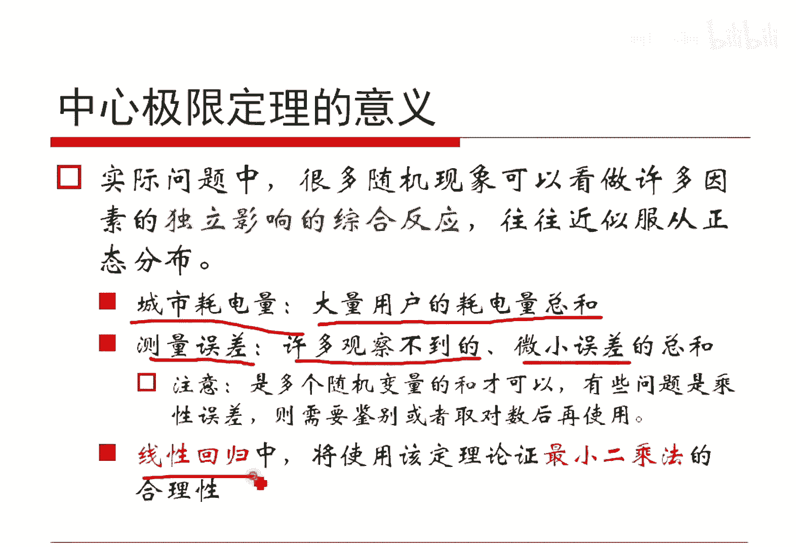
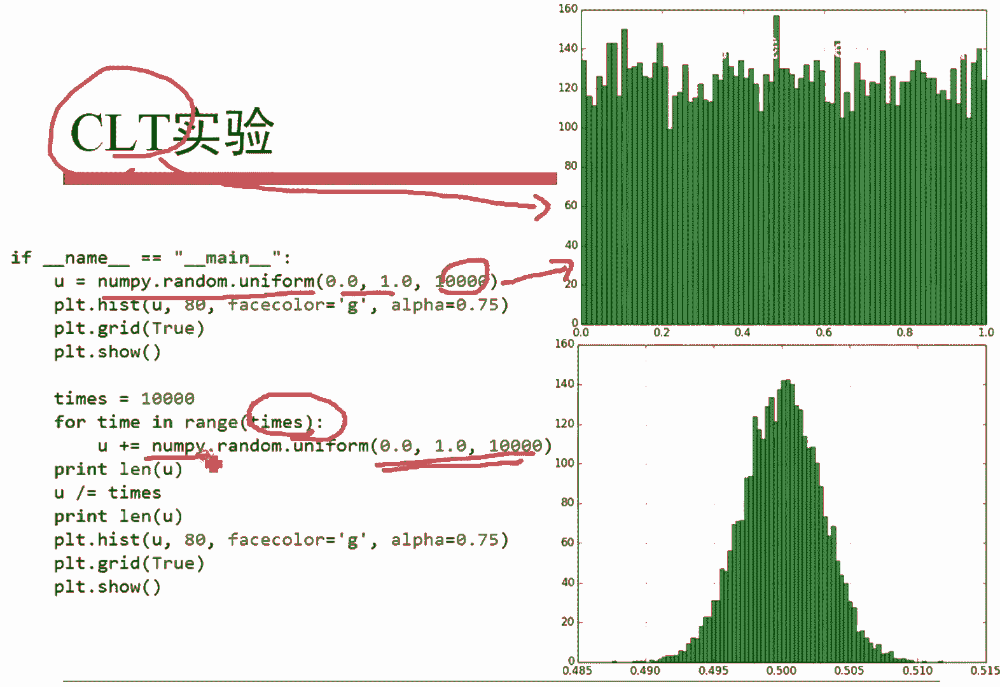
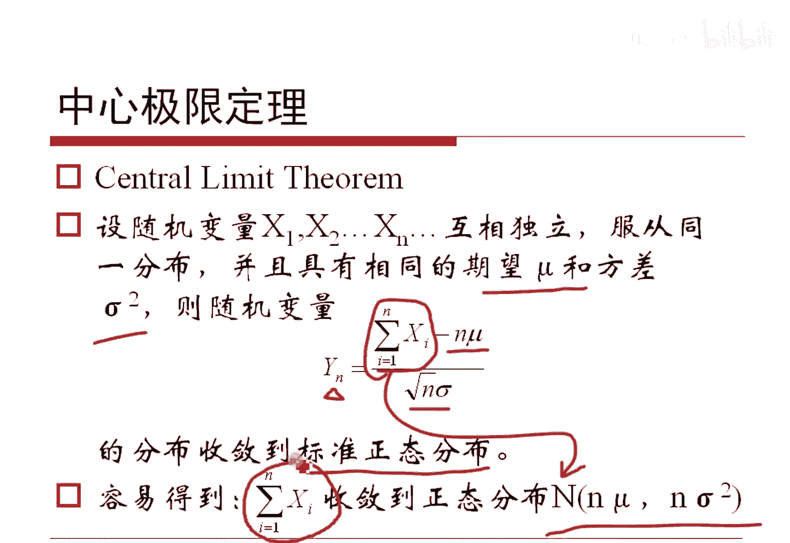
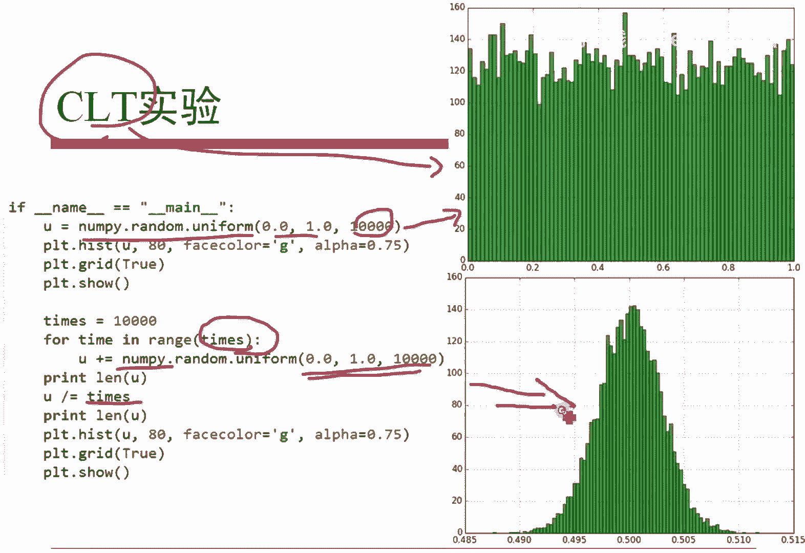

# 人工智能—机器学习中的数学（七月在线出品） - P14：中心极限定理 - 七月在线-julyedu - BV1Vo4y1o7t1

。铅笔写不不等式。这个东西其实呃它给出的就是方差的实际的物理意义。就是X它的方差越小的话，这么一个事件它的概率越大。这个事件什么意思？这个事件指的是X取值。集中在期望附近的概率。对不对？

就是说你方差越小，这个X越集中在期望附近。我们从一个严格的一个不等式上做了一个证明，对吧？另外呢这个不等式是可以证明大数定理的。为什么呢？我们把这个东西X1X2的XN简直是相互独立的。

那么都加起来除以N得到YN，那么YN减去缪，它的这个绝对值，它是小于不平等值。当NN是无穷多的时候哈，它是收敛的概率一的。这就是大学定理哈，就是如果是实际变量，它们都是相等的，有相同的期望，相同的方差。

那这样的话把它加起来除以N，它最终这个YN它会完以概率一收敛到期望上去。就是方差可能是比较大。但是呢如果你要是把它N个都加起来除N，最终这个东西就稳定了，稳定到期望上了，这就是大数定律。

因为取的又取的多嘛，对吧？这个东西呢其实有一个早期版本哈，就是说呃我们看这个哈哦在后面再是再说了哈。就说我们其实刚才简单说过了，就是说N比较大的时候，这个随机面量它是均值，是无限的接近于期望谬的。

无限接近的意思是有可能有偏离啊，但偏离很小，偏离的概率为0，它可能是这样。对吧呃我画的就是这样一个很尖儿的一个东西哈，这个尖儿特别特别小。就这意思哈，对吧？大家懂的哈。

就是因为以概率一趋进于它不是一定等于它，对不对？指的是这意思哈。呃，另外就是大家能够利用Q求不等式证明大定理吗？大家可以自己试一试哈，直接用我们Y的定义把它带进去，我们马上得到了哈。😊，呃，另外呢。

其实我们通过刚才那个结论哈，其实可以得到一个推论，就是如果我们把那个事件换成两点分布，那这样的话就得到这个事情。就一个事件A它发生的概率记做P。然后呢，重复小N次的这个事件里面呢。

假定事件A发生了NA次。那么NA除以N这个东西其实是事件A发生的频率，对吧？频率减去它的这个概率，它的绝对值是以概率一收敛的。对吧以概率一能够以频率收敛到我的这个概率。因为为什么呀？

频率是我们通过实验能够看到的，看得见摸得着的东西，但是概率不是哈。对不对？概率其实我们从来没有见到过概率。你说我扔个硬币，它朝上的概率是0。5，但谁都没见到过，我们只是扔硬币扔了100次。

发现有49次或者有50次或者51次，它朝上OK我们就大体上去猜测它的概率是0。5。你说概率是什么东西啊？所以说这个公式哈。它的重要性是。他几乎奠定了概率论。非常重要哈。

几乎我们就可以认为这个是概率的一个标准定义，频率近能够接近于概率哈。它它这个共识重要度非常强哈。呃，这个其实是最早最早的大数定理的形式哈。另外呢咱其实这个后面会有一些结论。

我我习惯于直接使用大数定理跟人家解释。比如说咱后面用到这个正态分布的参数估计，马上会看到。然后贝叶斯普特贝叶斯做垃圾垃圾有件的分类，或者是以妈公模型里面做有监度的参数学习。

咱都可以直接用这个结论得出那个式子来，并且解释性非常好，就不用算算了哈。这样子咱那个也有依据，也把这个事给做了，对吧？这是跟大家简单说一下这个情况哈。另外就是有中心极限定理。因为如果说XGX2的XN。

它们是相互独立的，并且是同一分布哈，然后有还是有相同的期望，相同的方差。那么说他们都加起来。如果我减去期望的N倍除以根号N倍的方差标准差，那这样子这个YN最终会收敛到标准正态分布。当然，如果加和本身哈。

它其实也是一个正态分布，收敛于这么一个东西，它俩本质一个东西啊。对吧这就是中心极限定理哈，大数定理和专家定理一定是概率论里面非常重要两个东西哈。但是中心基限定理我们这里面就没法得到没法证明了。

我们只是给出一个形式化的一个说法啊。但是这个这个问题咱就不讲了啊，只是跟大家说一下，在实践当中，我们可以用中心基验定理来做事情。呃，比如说呃答案实践里边哈，有些问题可以看作是各种各样因素。

独立去影响形成的综合反应。我们大体就会认为是服从正态分布的。比如说。我们认为大量用户的耗电量的总和构成了一个城市的用电量，因此城市用电量就服从正态分布。我们实践当中有些问题可能是呃各种各样的观察不到的。

或者是想象不到的，甚至能想象到不能想象到的一些东西，综合反映到得到的东西。比如说误差测量误差，我们就可以认为服从政策分目。这次测的大了，下次特的小了。并且大多数情况之下啊。我们测的那个值是位于真实值的。

附近的对吧？你比方说大家的这个考试成绩，考试成绩，我就可以认为我是有我的这个智商，我我的学习努力情况，我的这各种情况，甚至我这个笔下不下水，我今天是不是拉肚子等等等等等各种因素所组成的对吧？

那这样子一个班的学习成绩。就应该服从正态分。反过来，如果一个班的学生也不服从正派分布，要么你这个发生了大面积的作弊情况，要么这份时题出了有问题。对吧它使得搜索里都发生有偏了。

对吧我们可以这么来反向去解释这个事情哈，它是有一定的。呃，理论依据的哈。呃，当然这个里面大家如果上网去查，会发现一些所谓的反这个大那个中心间定理的一些所谓概念。比如说所谓的长尾分布啊，大家知道就好啊。

实际上理论里面还是以它为呃。为核心嘛。然后呢，后面我们其实会用到，比如说线性回归就会用到最小二成就这么干的哈。

不再说了。呃，这个图其实我们昨天说过了，它本质上就是做的中心极限定理的一个实验。我如果是给定一次的一个均匀分布，从0到1的取1万次，我画出图来是个均匀分布。我把这每1万个这是一这是一个均匀分布了。

我做1万次的值把它加起来除以这个N，这不就我定义吗？

对吧我的定义里面你不告诉我，我把它加起来除以N嘛，这个除以N哈，对吧？然后它一定会服从正态分布的。因此我把它的什么都画出来，真的是这样几个东西。

对吧它是差不多的，它是比较符合我们预期的哈，大家可以随手就能做这个实验哈。

