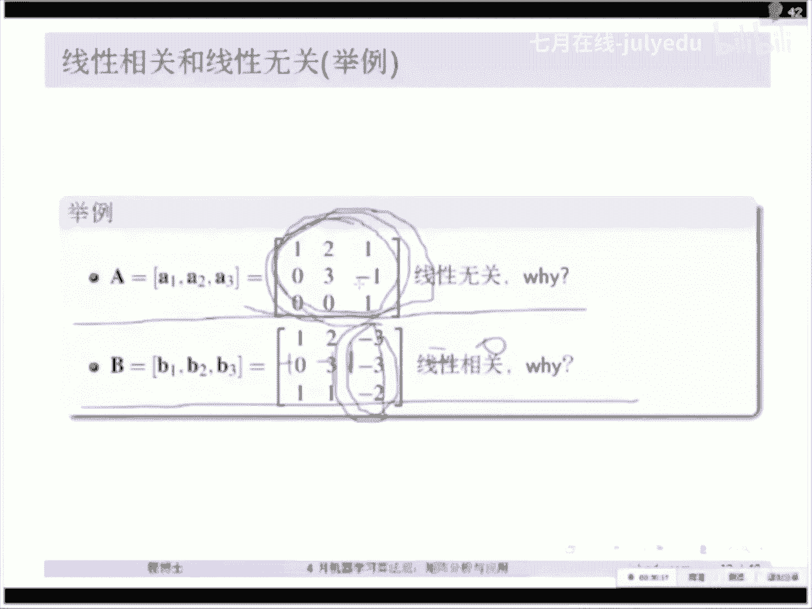

# 人工智能—机器学习中的数学（七月在线出品） - P15：重新理解矩阵 - 七月在线-julyedu - BV1Vo4y1o7t1

好，我们今天看一下今天的讲课思路。那么我们今天呢首先呢跟大家教科书上不一样，我们重新看一下AX的等等于B。我稍微吐槽一句啊，我个人觉得国内教材，至少我上课的时候，为什么我到现在都没有理解。

为什么要把行列式放成第一章，因为我觉得把行列式放成第一章啊，整个就把这个线性代术给脱节了，我倒不是说行列是不重要啊，但是我实在没有想通，为什么要把行列式放到第一章去讲，在咱们的国内教材。

我也不知道是从哪个教授开始，咱们把行列式放成第一章呢，因为我在国外的教材上面，从来没有看到哪个书把行列式就放在第一章呢，对吗？所以我觉得也很奇怪，这样的话就让学生呢整个就把思维给断掉了，你知道吗？

就对这玩意儿慢慢就产生没有兴趣了。这个我觉得也和咱们国内的可能这个教材编写本身也有一点问题啊，所以我们今天讲课思路和国内教材不一样啊，我们首先看一下AXB重新去理解一下它的行势图和列式图。

由AX等于B呢，我们引出一些重要的概念。包括比如说基线性相关线线性无关这些东西。然后呢，我们有这些基线性无关线性相关，我们引出一个最重要的概念，就是线性代数里面最重要的概念叫做子空间。

我这个因为鼠标啊不太好写，我就主要是讲一下啊，子空间的概念。那么我们对这个方阵呢考虑矩阵的两种形式，一种是方阵的分解，我们叫做特征值分解，我们简称异D啊特征值分解。然后我们由特征值分解呢。

引出对称矩阵的特征值分解对称矩阵就是A等于A的转置的对称矩阵的特征值分解。那么对称矩阵的特征。值分解就非常重要。我们从此可以引入二次型。我们后面来解释一下二次型到底是干什么的啊。

那么是不是我们把这个对称矩阵的特征分解分析完以后，我们是不是就可以把这个子空间联系起来了？实际上是可以的。但是呢我们希望呢用更广义的方式去联系。那么我们就是说刚才这个地方是方阵。

那么如果我们对于任意矩阵的话，我们就会有一个分解就会有一个叫做奇异值分解，那么奇异值分解可以是为是一种万能的分解，它是非常非常重要的，可以解决很多很多的问题。

那么我们有奇异值分解呢就可以把这个子空间的概念给它很好的联系起来。所以在这样的情况下，我们看奇异值分解和特征分解呢又有相互之间很紧密的关系。

那么这两个之间的奇异值的关奇异值分解呢又和AX等于B这个矩阵呢又很很多的关系。所以我们这样的话，我们是不是就把整个的一幅图给大家联系起来了。最后我们大家就想给大我就给大家一副图啊，就能够把这些东西呢。

咱们能够包含进去，我不求今天我们把这里面的每。😊，一个地方都讲通，那是不可能的对吗？两个小时咱们怎么也不可能把两两个学期的东西给他讲完。但是我们呢要把一些最重要的部分，最精华的部分给大家讲了。

那些没有讲的东西不代表说不重要。因为你们实际过程中使用的时候，那些那些我今天没讲的东西其实也很重要。但是呢你把这个总体的这个picture有了一化以后，你就可以去进这个很仔细的去看那些细节。

你就有可能能够完全看得懂啊。这样的话，你就能够把矩证和线性代数这门课完完全全的掌握去了。好，我们今天看一下主要使用的数学符号表。为什么我要讲一下数学符号表呢？因为之前讲公开课的时候。

有人老问我这个T呀H啊，这是啥意思啊，所以我们现在讲完，后面我们就不提了啊，大家特别注意一下RN我们认为是一个N为的时空间，对吧？那么RM乘以N呢，我们是M乘N的一个实矩阵。今天我们全部讲实数。

不讲负数。这样的话就是让大家更能集中集中一下思想啊，因为辅的实际上是实的扩展啊，那么T呢就实际上是矩阵的转制。那么这个DETA呢，我们就认为是行列式，在有的书上呢，我们就写成这样的形式，对吧？

那么CA呢实际上是列空间NA呢我们定义成零空间。然后A的这个上面-一，我们认为是矩阵的逆DIAGA呢，我们认为把一个向量转化为对角矩阵，就是这样的形式。比如说这个向量是123，那么们转进对角矩阵呢。

它的对角圆呢就是123，对吧？然后TR呢是矩阵的tra。我们叫做矩阵的G，实际上就是矩阵的对角源呢求和，对吧？然后H对刚才有人说H那么H实际上是共轭转制，这是对于辅数来说，我说了，我们今天不讲辅数。

这样的话，让大家更能够集中到我们今天所讲的东西来啊，否则会分散大家的注意力，那么你只要把这些搞通了，你后面扩展不是很容易的一件事情嘛，对吧？好，我们今现在来看。Rnk。😡，rank呢就是矩证的制。

有有人说卡有人卡吗？如果卡的话，你可能重新进一下啊，我估计可能应该还好。然后我们看一下这个rank呢，就是矩证的质。好，呃，这个示例表我给大家举说一下啊，就是红色的框，你一定要去仔仔细细理解。

这是最重要的定理或者内容哈。然后绿色的框表示我们举的一些例子。因为上一次有人说哎这些东西数学课的这些东西啊，虽然很有用，但是很抽象，这个没错，那么我们就多举点例子帮助大家去理解，对吧？好嘞。

然后我们现在就开始看第二个线性代数的基本知识。我们从一个新的视角上去看这个问题啊。我们来看，那我们进入正课了以后，就大家随时提问啊。然后我们每一页都展示。暂停一下来回答大家的问题，对吧？

我们看一下这样的一个矩阵，2-111，那么它A属于R2乘2没有问题。它的乘以一个向量XYX属于R，对吧？也没有问题，那么等于B。我稍微看一下，那么B等于R2，那么就是一和5，我们就是R，对吧？好。

我们再来看一个3乘3的矩阵，没什么问题，这是一个3乘3的矩阵，对吧？那么这个向量呢对吗？是R3，对吧？哎，UVW然后等于向量呢，-29这个东西AX等于B，咱们真的是都不知道讲了多少了，看了多少遍了。

对吧？但是我们重新去理解一下。你看啊我们从它的行式图上首先来理解一下，那么矩证相和向量相乘，实际上是第一种方法就是2-1乘以XY对吗？这是第一行。第二行就是11乘以XY，那么等于5。

那实际上就是下面这样的一个方程，2X减Y等于1X加Y等于5。那么可以说如果AX等于B。那么这个它这个解在行式图中是什么意思呢？你看啊2X减Y等于一没问题，是个直线方程，对吗？这个是咱们初中数学啊，对吧？

那么你可以看一下它在X轴上的焦点是2分之10，在Y轴上的焦点是零和5哦，不对呃，是呃在Y的交点是零负1X交点是2分之10，对吧？好，没有问题，那么另一条曲线呢是X直线呢是X加5等于5对吧？X加Y等于5。

好，那么这个方程如果有解，它的含义是什么呢？从行式图中来解释的话，就是这两个直线有交点，对不对？就X等Y等于2和3。好，没有问题。我相信这个是最简单的。那么我们来扩展一下这个上面的这个问题。

我们是把它换成到三维的空间去的话，你看第一个方程和刚才一样，2缪加V加W等于5，对吧？它是一个平面。大家想一想这个平面够不过圆点。这个平面不过原点，对吧？好，另一个平面呢是多少呢？4缪减6V等于-2。

好，大家想想这两个平面相交会产生一个什么两个平面。大家去想一想，两个平面相交，它肯定是一条直线，对吗？对，是一条直线。我第三个方程我没画。因为这个图画上去以后呢，它就太乱了，看不清楚了。但你可以想象。

它其实就是说这个方程有解，就是这个三个平面最终交到一个点上了，对吗？两个平面交到一根线上，另外一个平面和这个线再交一下，它就是一个点，对吗？这就是方程组的有解，它这个解就是一个点这个行式图。

我在这个地方为什么要稍微提一下了，特别重要。这个跟我们图优化这个超平面是一样的。我们图优化中超平面定义成A转至乘以X等于B。你看看A转制实际上就是2-1，对吗？乘以X等于B。你可以想象在二维中。

它实际上就是一条线这个超平面在三维中呢，它是一个平面，对吗？那你想想到四维呢？它不就是一个超频面吗？当然你这个维数往上涂说，我多说一句啊。

咱们线性代数举证你这个维数和咱们物理概念那个维数是绝对不一样的啊。如果是一样的那爱因斯坦。就叫叫气死了，对吧？这个维数呢，我们三维到四维是就是可以说就是一层一层的往上扩，你知道吗？它就是往上扩，对。

它就是超平面，它就是往上扩的。但是我说我们这个维数的这个扩张啊，和物理的那种维数啊，就是包括我们宇宙现在是多少维，咱们都现在都不清楚，对吗？它不是这种三维四维这样简单的往上扩啊。

但是在我们线性代数里好处是咱们把这向量写长一点，哎，三个向量再多写一个向多写一个元素，我们就变成四维了，对吗？这是一个非常好的啊，在线性代数里的这个就可以简单的扩展，就叫所以我们加一。

我们就就叫超平面了。那再加二加3加4都是超平面。但是你理解的时候，你就用三维这个平面去理解就够了，对吗？不需要去想那个超平面到底是个什么东西啊，你就用三维去理解就够了。好呃，这页有没有没问题？

如果没有问题，我们就走下一页啊，因为这一页比较简单，对吧？好，现在我们要从。线性代数的角度上去理解了。咱们明天的课再来讲讲这个潮平面啊，图优化的时候，这个就比较重要了。

实际上就是说这个矩阵相乘AX等于B，我们可以写成第一列，就是第二列等于15。那么XY分别写到前面，那么我们可以认为实际上它是这个列的线性组合，什么意思呢？你看-11在在这个X为Y的这个轴上。

我们可以用这种向量的形式去表示和刚才那种直线不太一样啊，我们就用向量的形式去表示，那么-11实际上是这个向量，然后呢我们这里又有一个向量是2一对吗？就是这个向量是21，然后换在这里，所以可以看到。

因为刚才我们说了XY的解是二和3，所以这个X就是2Y就是3，所以就是把这个向量两倍呢，就是给它伸长两倍。那么这个地方呢三倍呢实际上就是伸长3倍，根据平行四边形法则，这两个向量相加唉。

正好就是这个向量15，对吧？所以没有问题。所以1。就是这两个向量线性组合的结果，这是从矩阵的另一个角度去思考。我们就是大家一定要回到线性代数矩阵上的话，一定要回到这个线性组合这个概念上去啊。好。

那么另外一个呢，三个向量呢，刚才看了其实也是一样的，对吗？我们先把两个向量呢相加，比如说列一和列二相加就等于这个向量，哎，就是这个向量。然后第三个向量呢是204，它的两倍呢就是102，就是这个向量。

所以根据平行四边形法则，它的解呢实际上就是这些向量的线性组合，对吗？好，那么静姐有没有问题？好，怎么理解往上扩啊，怎么理解往上扩，就是相当于你三维。你现在扩到第四维那个平面是怎么想是什么样子呢？

你可以想象啊，那个平面我把它定义成一个超平面无所谓啊。这时候你就不想都可以了呀。比如说X加Y加Z加W等于三这样的一个方程，对吧？从行势图上来说，这个就是一个超平面了呀。😊，对吧okK没问题。

三个直线无解。啊，对，这是这时候就有一个解问题。我们稍微提一下，假如说从行势图上来看，咱们这两个向量如果是平行的。这玩意儿有解吗？没解，这其实就是从行势头引出来了一个东西，就叫做矩阵的行制。

就是说这个矩阵的行实际上是线性相关的对吗？平行了呀。对，所以他就没有解，这是从行上来看，但是我们同时也可以从列上来看啊，对吧？你看啊在这个平面上，因为我们这是两维的。而且这个向量是什么呀？线性无关的。

所以你不管给我个什么向量，我都肯定能够找到解。但是想想，假如说这两个项链今天咱运气不好。咱们给贡献了。你这个方程还有解吗？那我这个我这个B现在假如说是在这方向，你给我怎么找怎么合，我也合不到这个B啊。

对吧？就没有解。那么这个三维这线扩上去是不是其实是一样的一样的道理，对吗？咱们后面还有图啊，再来看看这个线性相关相性五关是什么意思。好了。😊，列向量线性组合组成的平面是不是就是行向量解出来的平面不一样。

我们把这两个平面啊稍微区分一下，你看这个平面呢就是我们传统的初中数学里头定义的唉这种平面，就是真正的这个直线和平面，但是我们在列势图之中呢，咱们是用这个向量的形式去表示的平面，知道吧？

我们把它称为另一种空间，这两种大家不要搞混了啊，你看这个向量是带有箭头了。我们这里头直线是不带箭头的对吗？这只是直线啊，所以大家去想一想，我们现在要习惯用向量的形式去表示这些线性组合，这些不组合啊。

所以是不一样的。但是我们在这里头也会说这两个向量比如说构成了一个平面，这两个向量构成了一个平面，就是这样去说啊，这个是没有任何矛盾的，所以我们现在来看看线性相关和线性无关。

那刚才我们不是已经看到了一些例子嘛，比如说两条我们现在不说这个行势图了啊，咱们就回到这个比如说这两个向量正好是共线的时候，实际上。就是线性相关，对吗？那么我们严格的意义上定义，就说假如说我们有N个向量。

如果他们前面都乘以一个标量，求和以后等于0。当切紧当这些玩意儿系数不等于零的时候，也就是说至少有一个向量可以由其他向量线性表出，什么意思呢？你看假如说这个CL不等于0，那你本身这个相加不是等于0吗？

你做一下一项，哎AL不就可以求出来了吗？对吧？就是说只要有一个系数，我们能找到一个系数，也如就是CR，我们不等于0。好了，那么这几个向量就是线性相关的。那么相对比一下，我们看一下信性无关是什么意思。

线性无关就说。这个玩意儿方程等于0。咱们怎么找等于零的时候，就等等于零这个解的时候，咱们只能找到C一等于C2等于CN等于零了，找不到任何一个非零的数，能让它等于0。明白吗？这时候就是线性无关。

那么你可以从这条线上怎去理解一下这个线性无关，实际上就是这两个绝对在二维里面绝对不贡献，对吧？那么在三维里头的时候，实际上就说哎这三个向量应该是什么？不共面，对吧？在三维里头从向量角度就三个向量。

它正好不在共不共面。因为你平行四线边法则，两个向量相加就可以得到一个向量。那么这两个向量毕竟是共面的对吗？那么另一个向量只要我跟它不共面，在三维里头，哎，我就是线性无关的对吗？可以理解吧。好。

这时我们看一下，如果AX等于零的话，我们把这个矩阵这个向量我们不是可以写进矩阵吗？写成它是一列一列一列的。大家要习惯这种写法啊，就是我们把矩阵分成一列一列的写法。然后AX等于0呢，那只有X等于0，对吧？

这个跟你一样嘛？你不C一等于CN等于0，那这个方程只有零解，那就说没有其他的线性组合能够产生0。那么此时矩阵A呢，实际上就是可逆矩阵，对吗？哎，那么你两边乘一个，你比如说这边乘1个A逆。乘以A。

那么最后就得到X等于零了，对吧？两个当期紧张应该是有一个任意，一个是全部吧。就说至少有一个就可以了，就至少有一个这玩意儿是非零，我们就认为它是线性相关的。只要说线性无关就非常强了。线性无关。

就是说这玩意儿你不管怎么找，我都怎么找出来，我都是等于0。这个系数都是等于，那么我们就是先行无关的。明白吗？这几头还有没有什么问题？好，没有问题，我们就下下一页啊。我们来看一下举个例子。

大家马上就能够理解了。😊，这个现性无关。为什么？😡，完了说了线性。首先我们来看看这个不这个吧，线性相关。线性相关是说从这个条件来说，有一个向量能够由其他限量线性表出。你看啊这个向量很简单。

我们前面这个101这个向量前面乘一个-1。231这个前面乘一个-1，这两列也相加，不就正好等于第三列吗？所以他们的系数就是-1-10。哎，-1-10像这个线性组合以后，就不就等于零了吗？

所以这三个向量就是线性相关的对吗？没问题吧。这个现性无关。你不管怎么讲，哎，这个人这个朋友说的很好，他是多余的，他实际上是多余的。因为由他俩就够了。所以这个多余为什么为什么最后一列是零。

不是最后一列是0，是-1-1，加上最后一列的一，我这个地方说错了，-1-11相加就等于0，对吧？哎，对的。但是第一个很不幸。你不管怎么去找。😡，它前面的系数你总总不可能找到其他的系数，能让它等于0。

除非这些系数都是零，对吧？

