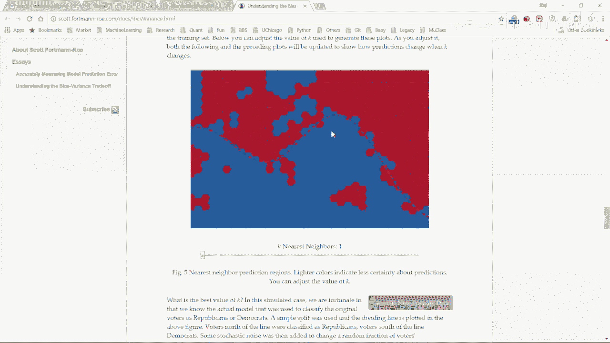
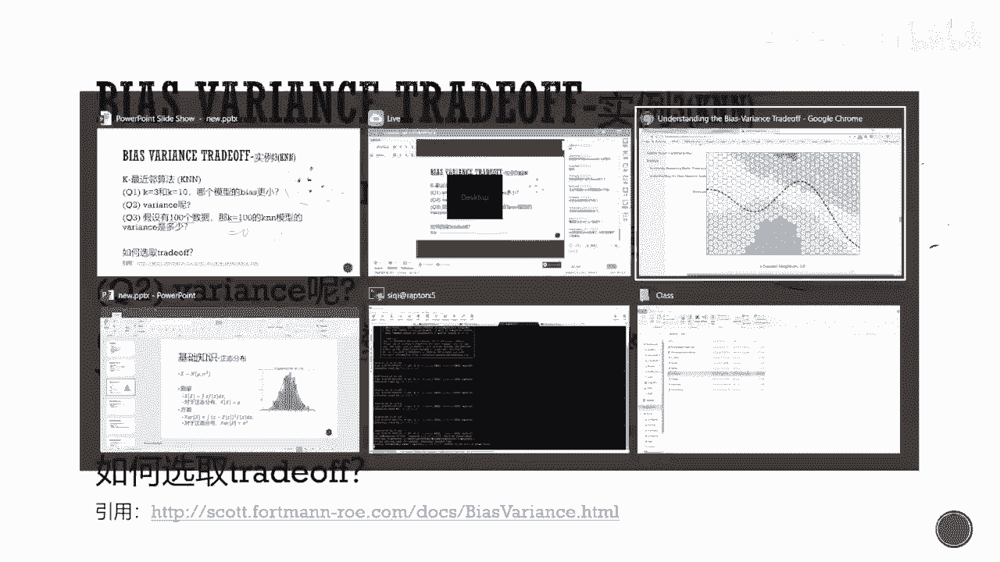

# 人工智能—机器学习中的数学（七月在线出品） - P17：偏差方差均衡和模型选择 - 七月在线-julyedu - BV1Vo4y1o7t1

Yeah。啊，能听清楚就可以啊。行，那我们那我们开始啊，我先简单的自我介绍一下，我叫孙思琪。大家可以叫我思琪，然后我是我是TTIC的博士生，然后马上就要毕业了，然后马上要去工作了。

然后今天跟大家交流的这个概念是as我为什么先讲这个东西啊？就是你的首先这个东西很重要。然后其次这个里面有一个有一个。这里面这里面有一个概念，这个概念的有的人搞得清楚，有的人有的人搞不清楚啊。

所以我在这里跟大家提一下这个主要的概念。再几次，然后在工作的大家在工作面试的时候，这个问题也很容易被问答。所以我想给给大家讲的清楚一点。那我们现在正式开。

那跟大家交流的题目就是bias veteran trade off。然后这个东西其实概念比较简单，我我尽量讲的稍微稍微慢一点。如果讲不了一个小时的话，因为我刚刚找完工作，然后讲不了一个小时的话。

我最后跟大家交流一下找工作的经验，面试的经验。因为我面试的职位基本都是机器学习嘛。然后那我们就开始。首先这是今天的主要内容主要内容包括以下几个方面。第一个就是基础知识。

因为今天今天后面讲的内容需要这些基础知识，其中之一就是线性回归正态分布，还有最大自然等等。那接下来既然我们今天讲的是bias trade off或者说这两个东西的一个平衡。

那我们就要讲一下什么是bias，什么是接下来讲一下bias trade off到底是什么。到底有什么应用，它可以应用于模型选择和做政或做正规化或者LP范数等等啊，这是我们今天的讲座今天的交流的主要内容。

그。好。反正就是一个基础知识啊，基础知识就首先讲一下先性回归。这个东西大家可能都知道。所以我就主要是给大家讲一下，我这我在这里面用的符号是什么。首先我们假设观测数据是XEY1一直到XNYN。

然后这个X呢，我们一般管它叫each。然后这个Y呢我们管它叫label。然后在这里面X是P位的，看看这里有个P啊。就是X11一直到2。就是X111直到XEP对吧？我们观测到的一个数据。

还有可能是你的用户的各种信息什么的。然后这个Y呢是一个实数，这就是一个数了。然后在线性回归里面回归是什么意思？回归意思就是这个Y是连续的，我们要预测一个连续的，我们要去预测一个连续的label。

当这个Y属于比如01的时候，或者说0123的时候，我们管这个东西叫classification或者叫做分类。然后然后线性回归是这个回归里面是回归里面一个很重要的一个东西啊。当然也是最简单的一个东西。

然后我们有了X有了Y，那我们要做的是什么？我们要做的是预测这个Y。这个这个实数Y那在classification里面，或者在分类里面，我们要预测的是这个01这个Y0零的概率是多少，一的概率是多少。

然后最简单的线性回归，最简的回归模型就是线性回归，最简单的classification就叫logg regression，或者叫逻辑回归。这个东西我这里我们不讲了，我希望大家回想一下这个模型也很重要。

你在面试的时候，很多人会会问到。好，那我们讲一下这模型是什么？模型很简单啊，就是你要做的就是预测一个F等于Y等于FX这个X就是你的feature。Y就是你的label，你要去预测它。然后呢。

参数我用s塔来表示，所以你可以写成这副样子。然后在线性回归里面，就是假设这个F啊就是个线性函数就等于多少，或者说X的。就是有N个数据这ig feature。然后这个s塔它标没有，一共有s塔个参数啊。

然后目标函数是什么？我们既然要预测它，我们就我们把预测的东西用Y hat来表示。那在回归里面，我们就直接直接去优化一下这个东西把Y hat减去Y这个东西的平方，就是这两个东西到底差多少？为什么要平方？

因为这个东西这样的话就变成非负的了。你看你这个Y hatt跟Y的距离是多少。那目标函数就是这个东西啊，这很简单，就是对于每一个数据而言，你的预测这个YI hat跟这个YI到底差多少，然后平方。

然后这个里面有时候管它叫MSE。me square estimator，然后或者当这个东西不是线性线性回归的时候，是个线性线性回归的时候，是个是个classification的时候。

我们诉我这里面管它叫L西塔啊，L西塔就是。或者说叫负logLC的L就是自然函数，你取个log，然后去负的，你取最角化这个东西。然后这个东西的解是什么？解就是你要去minimize。L这头。

给给你给 over这个se塔。然后这个东西你你这个东西的最后结果一般情况下结果就是这个啊，我们后面会讲不一般情况下这个东西是什么这个过程你这个你通过minise LC的得到这个东西，大家自己要会推啊。

这个有时候面试会面试是会面倒的。然后包括逻辑回逻辑回归的，你这个sta的。readingdescent的方程是什么？所以减去阿尔法乘这个这个东西这个东西是什么？你自自己会自己要推一下的啊。

这个从头待会全部都要回的。然后。这个东西是怎么来的？我可以大概给给大家推一下，这这个很简单。这个东西本身L等于Y减去X乘以C了的平方。就是这样的啊，这个东西是个Yter，是个是个向量。

所以这就是Y减去X西塔的。转志，不好意思。乘以Y减去X，然后把这个打开求导因它等于0就可以了。然后讲一下后面我们用到的东西，后面一个东西就是正态分布。当然我这里面只是拿正态分布举个例子。

对于任意分布都是一样的。一般分布的一个一般连续我们这里面用的是连续分布，连续分布的一个函数一般都是长成这个副样子的。然后当他的那个htogram或者叫。这个这个绿色的这个东西啊。

这般一般一般是真实数据的，真实分布，一般是长成这副样子的。你一般自己。自己feate之后得到的就是这个黑色的东西。然后正态分布我们一般用这个这个来表示N表示normal啊，这个表示期望，这个表示方差。

那期望是什么？希望就是定义就是这个东西，直观上这个东西怎么理解？就是对于你这个FX是这个概率密闭函数，这个东西不是它的概率啊。这个东不不是概率。但这个东西你可以可以理解为类似于一个这个东西到底有多重。

可以可以理解为类似于一个这个东西到底有多重要的一个东西。所以就是相当于是对这个X求了一个平均，到底平均的时候，你你这个放的权重是多少，就是这个FX啊，对于正态分布而言，你这个期望就是那。

那就是一般在你在做期望的时候，这个X，我们管这个X叫随机变量，这个东西要是随机的。但这里面这个随机是normal的方差也很简单，方差就是你这个X跟你的期望平均差多少。那么举举个例子啊。

你这里面这个黑色是这个东西，那假设我有另外一个normal distribution，是这样的，还有一个是这样的。那这个东西肯定是越细的，它方差越越小。因为它跟你这个中间这个幂偏离的越越小。

我把这个擦一下啊。重新画一下啊。再说你有一个更细的。还有一个更粗的。肯定是。还一个更粗的。肯定是这个更粗的方差更大啊。当你这个函数长成这副样子的时候，方差就非常非常大。

因为它跟它的中位数基本就没什么关系啊，跟这个跟这个期望就没什么关系啊。好，这个基础知识就。就等到大家有什么问题吗？来回复一下，现在有图像了吗？拿我这刚才这东西再重讲一遍吗？再重讲一遍吧。

那我们现在再从从头再快速的过一遍吧，我们再根据这个PPT再重新过一遍吧。因看大家能看到啊。啊，这这这个就不讲了，这个不重要，这就是今天我们讲座的主要内容啊这个。然后这个是我们刚才的第一页PPT啊。

假设我们观测到的数据是X和YX呢刚才叫。一般在你在做模型，在你在做模型，在做在做模型的时候，这个东西是最重要的啊然后这个Y是我我管叫label。然后这个Y呢也可以是实数，实数的话就管它叫回归。

可以是自然数就是0123或者什么一样，这个这个这个不重要，这只是一个值这只是个标志，这个管它叫classification或者叫分类。然后在先性回归里面，这个东西就是个，然后在先性回归里面。

这个东西就是个。然后在先进回归里面，这个东西就是个实数。然后你们某式 learningning做的是什么？做的就是Y等于F或X哎，你要做的就是去做各种F啊，在我们这里面用的是线性回归。

在 learning的时候，这个F就是一个 neuralnet就是个神经网络或者是个CN或者是个什么这个都不准。这里面我用F统一用F来表示，那它的参数呢是我们描动的是优化这个优化这个s。

优化这个优化这个sta，使得这个F最小或者最大。一般情况下是让它最小。然后目标函数对，然后对于线性回归而言，这个东西就很简单啊，关系是Y等于等于C的。所以你基本可以理解为是最简单的F了。

没有很少有比这个再简单的啊。然后目标函数是什么？目标函数就是你要去优化的东西。你竟然要让这个FX尽量等于Y，对吧？你要让这个Y。近似于等于这个FX或者用Y hatt一间，我没用你这模型做出来的东西。

我们一般用一间来表示。还是说两个东西尽量接近，两个东西明显。这东西有有时候正，有时候是负不对，对吧？有时候就你可以用绝对值嘛，也是可以的。绝对值的话可以保证这东西非负。

但绝对值不好的地方就是这个东西是不可以求导的。能你这个目标函数能不能可导，这个很重要啊，所以的就是两个东西减一减求平方，这个东西呢这个东西这个东西可导，然后求一下平均数，这个就是我们这个里面的目标函数。

有了这个目标函数，你要做的就是去优化这个西塔，使得这个目标函数最小。我们一般不怕用这个来示。最小化这个目标函数，这个东西是你要优化的东西。然后一般优化是怎么优化？一般就两一般一般现在一般情况下。

不管是D learninging还是什么，就一种grading第三层。就是就是梯度下降。对于线性回归而言，这我们根本用不到这个东西啊，你直接求到零它等于0，这是可解的。

然后解出来这个s塔 hat就是我们这个模型做出来的东西。一般模型做出来的东西，我们都用这个东西来表示。真实的s塔东西是我们不知道的，真实的，我们就用s塔来表示，我们做出来。

然后这个sta hat要等于这个东西，X X的转质乘以X求逆乘以X转质乘以Y。这是一般情况下啊，我们后面会讲不一般情况下，这个sta hatt等于什么。然后这个东西我希望大家要自己能推出来啊。

就是这个sta hatt到底是怎么来的，包括你在做逻辑回归的时候，你这个grading decentcent。ze塔等于西塔减去阿尔法一个个不长这个东西这个东西。L对C的求导L是什么？

增读逻辑回归里面这个L是什么啊，L是什么？增读逻辑回归里面这个L是什么？然后对C的求导这个东西是什么？我希望大家也能够写出来，这面试的时候很容易问到。然后对于现性回归而言，这个东西很简单啊。

线性回归就是。Y减去XA塔的平方二函数的平方。然后呢，这个东西等于什么？等于这这是个这是个向量啊。因为你看到Y是什么？Y是个实数，就这个大写的Y就是。Y一 y二。Oh why。

所以这个东西就是Y减去XZ的的转置。乘以YX塔，然后你把这个东西打开，然后求到等于0，你就可以得到这个。然后这个东西大家也可以自己推一推，有兴趣的。然后接下来就是讲一下分布啊，我们这里面的正态分布举例。

正一般分布呃，一般是一般实际的分布都是长成这个绿色这个样子。你画你你做做图的时候是画不出来这个黑色黑色线定，黑色是理论上是长成这副样子的。然后正态分布我们用N来表示N代表nmal代表正差。

然后me是期望sigma平方是方差，期望的定义是什么？期望的定义就是这个东西，相当于在这个这个点上，这个东西的权重是多少，权重就是你这个就是你这个分布啊FX。

然后可以这个东西可以理解为这个东西的平均数到底是多少？平均数。然后对于正态分布而言，I的期望就是这个命。你在这个图里面期望就是在中天这个中间这个点就是1啊十负钱。就付钱。然后对于方差而言也很简单。

方差就是你这个X跟你的期望到底离得多远，然后求平取平方。然后在这个地方放的权重是这个FXFX这个FXFX这个东西这个东西是概率密度函数，它不是概率，因为这个东西首先它是可以大于一的。

所以肯定不是一个概率。那么你可以近似理解为在这个点FX到底有多可能近似理解为在这个点FX到底有多可能，就只是你可以这样理解，但实际上不是的。然后对于正在分布而言，这个东西的方差就是就是这个平方。

那举个例子啊，方差代表你这个你这个点方差代表你这个你这个点到底离这个离这个中位数或者不是中位数啊，离这个离这个期望到底有多远，举举两个例子啊，一个是分布长成这个样子的，这个东西更细啊。

一个是分布长成这个样子的，这个东西更细啊，所以每一个点离你这个中间这个点都更近一些。所以这个东西的方差更小，让它平长成这个样子的时候，这个东西方差肯定更大，因为它更平。当你这个东西更夸张啊，长成这。

有多少，就完全是一个直线平的，这叫均匀分布，这个内方差更大。因为这个东西跟跟你这个中根本就离你这个期望都都很远啊。还是不行啊。嗯。刚才那个图像看得到吗？我这边丢包我这边丢包是0，我这边丢包是零啊。

我这边这个录屏软件显示我丢包是0啊。有刚才屏幕也是能看到的对吧？这微有点卡。啊，那么我我这边好像看起来没什么问题没什么问题没什么问题。你看我这软件这里这个丢包是零啊，啊这边速度也没有什么问题。哦。

声音有点卡，那我那我就说说话稍微慢一点。那我说话稍微慢一点。好，那那那那我那我继续啊。然后然后接下来我们就讲这个biance bias的定义是什么。然后接下来讲它。

然后然后接下来我们就讲这个bi bias的定义是什么。然后接下来讲它的这个tra off是什么？完像我刚才讲的，我这个参数里面都用s塔来表示。这个sta在我们现在认为啊。

这个sta是是真实存在的啊是存在的。只不过我们不知道我们要做的是通过这个模型做出这个stahead。记得我们刚才那个stahead等于。等于X转制。因X乘以Y。

这个东西sta hat我们要做的是你们不会晓这个sta hat离这个真实的seta到底有多远。因为这在这里面，我们假设我们知道这个东西，但其实我们不知道啊，我们要做的是这个sta hat去逼近这个东西。

那bis定义很简单啊，就是你这个sta hat的期望减去你这个真实的se塔是多少，也或者你可以把它。这。减去s塔，也就是说也就是平均意义上，你这个sta hat减去s塔等于多少？那wiy很简单。

virus就是你这个你这个sta hat的这个东西。这个东西就你估计出来这个就你估计出来这个参数它的方差是多少。好，这里面我们讲了一个比较重要的概念啊，就是你这个set hat，这里为什么可以取期望？

大家想一想啊大家想一想啊啊好那我们这里面有两个有有一有这那我们这里面有两个有有一有这个东西啊，就是你这个这里对这个s has，或者是对你这个估计的参数是可以取期望，可以取方差，这说明什么？

这说明你这个你估计出来这个参数啊，这个随机变量。要满足某个分布第A的。那这个分布是什么呀？这就随机来自于哪里？大家可以思考一下这个概念你清不清楚。如果你不清楚的话，你今天就讲一下，主要就是讲这个概念啊。

这好多人搞不清楚。嗯。大家现在可以思考一下，你这个随的还这个这个随机来自于哪里？为什么这里可以取机万可以取方产？好，那我们举个例子啊。假设我们刚才讲过这个。假讲过这个正态分布了。

假设这X是从是一个正态分布，期望是缪，这个缪我们可以认为它就是西塔啊，我们不知道的，然后放期望是缪这个缪，我们可以认为它就X是IID代表独立同分布啊。一般情况下，我们都假设数数据是独立同分布的。

Yeah。一般我们包括在做模型的时候，基本都是假设数据是独立同分布的。除了除了序列模型，这个后面再讲。然后假设啊我们有两个估计啊，我们现在要求估计这个缪，第一个估计就是me一等于X1。

我就用第一个数据来估计这个东西。那么你这个估计的bias和varience是多少？根据我们刚才的定义啊，大家可以思考一下，我我这里面问的问题全部是不需要用笔算的。大家可以用心算一下。

全部都是不需要用笔的。然后m是这个10个的平均数，那么这个bi谬2和谬二到底是多少？也就是你这谬二跟真1的谬到底差多少。然后还有就是这两个哪一个是无篇的，哪一个更好啊，哪一个是无篇的，哪一个更好啊。

给大家10秒20秒钟思考一下这几个问题，这个问题都很简单，全部是不需要用笔，让大家用心算一下就可以了。我看一下啊，我看一下啊。没有反应。啊，刚才那个是基础知识啊，如果你要知道你不听不听也没关系啊。

我主要是讲一下我用的符号是什么。然后大家有什么问题的话，就在。还有重音重音应该不是我这边的问题啊。因为你看我这边这个丢包是0啊。可能他这个软软件的问题啊。啊，我们。好，我们回回回到这个问题啊。

这两个东西的半次是多少？哎有啊，这个bi其实都是零啊，这两个东西全部都是空间的，怎么算啊？这得大家的bis的定义是什么？是E。谬对吧？减去缪，这是刚才的b的定义，对吧？你这个谬的期望减去缪。

那这个东西等于什么？EX1减去缪EX一是多少？X一就是从这里面取样出来的EX1就等于缪减去缪等于0。那同理啊，E缪2也等于0。Yeah。处理一面一点。也也就是说第三个问题，哪一个是无篇的。

这两个全部都是无篇的啊。这个这个可能直观上不是一样，直观上第二个可能更好。那第二个为什么更好？我们算一下virus是多少。我们算一下第一个东西的vience。关一谬E是什么？就是 virus。嗯。

对对一对吧？你X一是从这个里面散布出来的，是从这个里面取样出来的。那你这Yence就是一，那你算一下第二个wence。关根据这个公式啊。一家学。这个东你。对啊。I。Exll。这个就最后等于。

6除以10啊，那一除以10一除以10，因为这Y是1。那这说明什么？说明你这个第二的第二个这个估计比第一个方差更小。也就是刚才讲的这这个第二个东西可能是长成这个样子，第一个长成这个样子，所以这个东西更好。

因为它更接近于真实的。那你现在能看出来这个随机来自于哪里了吗？你在算一谬一的时候，这随机来自于哪里啊？来自于你这个数据啊，这个概念很重要，是这个里面数据是随机的，不是别的东西，是这个数据。

那我们看一下啊，你怎么验证这个结论。验证结论很简单啊，首先我这里是个这个这个是个py，我这里面扣用用的python啊，这个是个list。那么我把这个东西 run1000遍，跑1000遍啊。

每次的时候我从X1到X1里面，因为我要验证这个东西，我要假设这个谬是已知的知的。我这这里面假设缪等于0。假如你可以假设缪等于其他的数。然后从这里面取样，取出10个数据，计算一下m。

计算一下你这个m hat谬一间是多少然后你把它加到你这个list里面。然后你把另为p一下，你发现这个m长成这副样子的这个中间。中间这个东西就是它的这个应用，在这里面就是顶N，里面就是D啊。这个很重要。

也就是说你这你看到这里面随机是随机是从哪里的，是从这里来的啊，你把这个数据取样了1000遍，然后这个随机是在这里的，每次取出来的数据是不一样的。好，我证明。看一下啊，简单的验证一下这个东西。

这里面有代码，代码这个能大家能看到啊，能看到吧。我先把这PPT。这个代码做了一件什么事啊？就是把刚才我这个PPT上。转到了这里。听见到。然后这N等于10的意思就是我每次取了10个数据。

每次从这里的从这个正态分布里面随机取了10个数据。我这个东西跑了一万遍，我不止跑了100遍。大家如果想想可以，如果跑1000遍的话，或者说跑100遍。这个东西这是每次估计出来的me。

然后这是这个m的黑ogram。就是我最早的时候画那个把这个东西的。大家如果有印象的话，你会看到这个。这个绿色的啊就跟这个画的是一样的。然后你跑了100次，每次估计出来一个m。

然后这个m的它的一个分布是什么样子的？如果你50次的话，这个东西就很如果你只跑100次的话，这个东西就很不像一个生态分布啊。跑的次数越多，它越像一个正态分布。

我希望大家自己啊就是大家自己有什么疑惑的时候，或者说有什么困惑的时候，也可以自己去写个代码去跑一下，测试一下各个数据对你这个分布到底有什么影响。当这个越多的时候，这东西会越像一个正态分布。同理啊。

如果你这个东西，你看一下下面这里有一个。下面是你根据这个数据啊，下面这里有一个。下面是你根据这个数据估计出来的这个谬是0。0039，理论上这东西是0啊，这俩很接近，包括virus也是一样。

万rous理论上是一。但是理论上是一。理论上是00。1，然后实际上是0。1，很接近0。1。当你把这个数据变大的时候会怎么样？当你把每次取出来的数据，这是每次取出来的数据变大的时候。

你这个varience。这这这个东西就会变得更细一些。你看到这里的时候，这个细这个这个值大概在一左右啊，1-1。如果你把这个取的很大的话，这个值就在-0。3到0。3，就说明它的 virus变小了。

它更细了。虽然这个图像看起来是一样，但你看下面的坐标一个是-1，一个是-0。3了。啥也没有。哦。对这个我我也没有办法，因为我这边这个软件显示没没没没有丢包。嗯我不知道可能这能他软件有点问题啊。

然后这次要讲的一个差算差不多算是最重要的概念吧。就是你这个随机来自于来自于哪里啊，是来自于数据的。那大家可以想一下这个东西跟cross validation有什么关系呀？大家知道每次选超餐的时候。

好多时候会提到用这个东西，这个东西跟这个有没有关系，有关系的啊，我们后面后面会讲。那最简单的一个b应用就是你可以用这个东西去理解什么叫过拟合，或者什么叫work。Yeah。一样的，我们假设数据为XY。

然后我们已经有一个overfi模型了，这个模型F，我们假设它是overfi。那么有两个问题，这个模型的bi是高还是低？万ence是高还是低？嗯，看下这个软件啊。艾码太小，看不清楚。啊。

这个代码很代这个代码无所谓啊，因为这个代码就是。我这个就是这个这个啊就是这个。我刚才改了东西，一个是你这个1000。一个是改了一下这个1000，就是我每次我每次把这个东西重复更多遍。

然后你这个数据就会更接近于那个正态分布。然后还有就是你每次取10个，对吧？我不一定可以取10个，我可以取100个。当取也就是你的数据更多的时候，你这个最后估计出来这个。这个这个东西啊，它的玩就会更小。

这个风就会更细。就是就我刚才的代码就是这个啊。代位很简单，把这个实验重复1000遍，取样，然后求一下平均，然后把这个没有记进来。再家看到这个随机是来源于数据的。我把这个东西重复了100遍，这个很重要。

我再重复一遍。然后我们再看这个啊，这个b是高还是低？当一个模型overfi的时候，很奇怪，它bs是低的是低档，bi是低的是低的。啊是低的是低的。啊V是高还是低？vari是高的。

记住刚才我们刚才我们这里在做这个实验的时候，这个m你也可以算出来m期望m。然后当这个数据多的时候，方差就小了。然后对于模型而言，多的少候方差就行了。然后对于模型而言。Yeah。一个overface模型。

一般情况下，一般情况下bias是高的，为什么？因为你一个模型overfi代表什么？代表你这个模型做的太复杂了，相于你一个模型overfi代表什么？代表你这个模型做的太复杂了。相对于你比如你有10个数据。

你搞1个100万个参数的一个模型，那你的bias肯定是非常非常低的。😊，但但是但是你有100万个参数的时候，你这个w会非常非常的高。大家看一下这个图啊，当你这个当你这个模型做的很复杂的时。

你终于可以可以基本可以画成任意随便一个东西。然后ws高代表什么？然，假设你有假设因为假设这是我们现在已经观测到的数据，假如这个。外是从一个概率里面。散三布从这个里面散布出来的取样出来的。

然后假设假设我们有这个东西，实际上没有。假设我们有这个东西，我们再重新取样出来一种，重新取样出来一组数据。X一撇Y一撇，我们再重新取样出来一种，重新取样出来一组数据X一撇Y一撇。然后呢。

这时候你这个模型在这上面配合都会非常的差。代表什么？代表在这上面fe好，这上面fe的差代表什么？代表它vience很高啊。😊，就是你这模型表现不稳定，你就可以认为叫比较高。啊。

所以这也是这个也是为什么这个cro validation是有用的啊。因为我们没有这个PXY，所以我们人为的把数据平均分成几份，然后用其他的份儿。

假设这两份全部都是从这个分全部都是从这个P里面取样出来的那我就期望你这个模型在这个里面，在这两个数据数据一数据二里面表现比较稳定稳定代表什么？

所以cro validation主要是为了降低你这个降低你这个模型的vience。

再看一下。😔。

好，没什么，那我继续了。okK这是我刚才讲的carware意义是什么？那overfi有什么好处吗？大家都说overfi。一般都代表不好那over其实也是也是有好处的。over的好处是什么？

是可以帮助你对吧。第一个是可以帮助你提bug。如果你这个模型overfi都做不到啊，说明你这个模型是有些问题的。第一就是你这个代码里面有bug，第二可能就是你的模型有问有些问题的。

第一就是你这个代码里面有bug，第二个可能就是你的模型有问有些问题的。第一就是你这个代码里面有bug，第二个可能就是你的模型有问。你的么你的模型有题。如代码有bug不说了，你可以。如代码有bug不说了。

你可以根据这个去去理bug。当你的模型有问题的时候，代表什么？代表你的模型的bias太高了。你要把这个模型变得更复杂。因为你如果如果你在一个数据上连overfi都做不到的话，那你这个模型就有问题啊。

就流睡的也是有用处的，可以帮助你两个，一个是第bug，一个是。看你这模型是不是够复杂，是不是是不是足够。Yeah。ok。是。啊，有问题就在就在这里提啊。当然你要说卡什么的，这我没办法。

我说跟如果我讲的哪里有有问题，然后大家可以在这里问啊。然后误差是可以分解为。bias和vience误差是什么？误差就是。就是假设这这这是这这这是我们前面需要的一些基础基础啊。假设真实的参数是seta。

然后我们估计出来的是seta hat，那这个误差就是这个东西的阿尔法。然后这个东西基本就是你别在乎的东西，对吧？你做估计出来这个参数跟真实的参数到底差多少，估计出来这个参数跟真实的参数到底差多少。

Yeah。然后这个东西是可以分解为bias和vi的那这里面是一些假设假设模型为F西塔西塔代表真实的参数，估计的参数为s塔 has。那我们这里用用s塔一弯表示你这个这个东西的期望。我都直接。

表示这个sit had的期望，我们为什么可以去期望啊？因为你这个sit ahead是通过你这个数据数据X。额脉估计出来的。嗯。所以然后这个X和Y是同一个我再强调一。就从一个。P里面取样出来的。

所以这个sta是随机的，所以我们这里可以去期望啊，所以这个东西还是随机变量吗？不是啊，这是这是个这是个常数啊。这是个常数。因为你对这个随机变量取了期望，所以这是个常数。然后这个西塔是常数吗？这是常数。

然后这个西塔是常数吗？这是常数啊，这也是常数。虽然我们不知道，但它是常说，那么bias就是s塔1万减去这个西塔，记得吗？就是我们刚才bias定义E。就是这个东西啊。那我们看一下Eror是这个东西。

就是你估计出来的这个参数跟真实的参数到底差多少差多少。我们用之前类似于那个MSE的这个东西来表示啊这两个东西取平方，然后求期望，为什么可以求期万？因为这个东西是随机的。这个sta派是随机的。

所ta是常数，也以可以求期望。然后这个东西你怎么求呢？然后这个东西你怎么求呢也很简单，中间减一项加一项，这个东西不变啊，减这项就是你这个sta has的期望，加这项也是sta has的期望。好。

大家记得啊，A加B的平方可以写成什么？可以写成A平方加2AB加B平方。啊，这里就做了这件事啊，这个是A的平方，在这里这里是2A。B这里是B的平方，你就把这个东西。看成是个这个看成是A。这个正常是B。

这个这个肯称是A。这个正常是B。然后把这个东西带进来就行了。然后你不白这个东西是什么？这东西等于0啊，因为Es塔 hat是什么？就是s塔以外。就中间这一项没有。然后剩下这两项是什么？

剩下这两项这个东西是不是就是vience，你这个sta hat，你这个se塔是个随机变量，这个随机变量离它的期望到底差了多远，这就是它的vience。所以这个东西就得所以eror就可以分解成两部分。

一部分是你这个sta一s hat的7呃的variance。沙，还有就是s hat the files。可以理解为是偏差，这个sta hat离sta到底差多远，可以理解为偏差。

然后这个就叫做bs warrant trade off，就是你这个误差 error可以分解成两个部两个部分，这两部分全部是非负的。你看到varience是非负的bis的平方也是非平方也是非负的。

然后呢这两个东西的来源是什么？varience是怎么来的？varience是因为我们的数据是有限的，我们并不知道这个PSY这vience就从这里来的。如果你有所有的数据，假设啊一共就10个数据啊。

然后你所有的数据都有了。然后你这个varience是多少，就是0啊。然你有所有的数据的时候，vience就是0，所有的数据的时候，vience就是0。然后8S是什么？IS就是你在估你在假设这个F的时候。

这个东西不一定是真实的。你跟真实的到底差多少，你这个估计到底差多少，这个是8S。看一下。怎么判定是overfi导致的？Yeah。vience高的理论依据是什么？你你这个刚我问的是刚才的哪一部分啊？是。

注材啊是这一页的吗？这一页你问这个vience为什么是高吗？😡，这个Q two就是这里吗？哦。这个这个目前你你如果如果根据后面这个东西来看的话，后面这个东西是有一些理论依据的。

但这个东西直直观上很容易理解啊，就是假就是假设你有XYXE撇YE撇。假假设这个可能有100个数，这里有100个数据。这两个东西全部是从同一个分布里面取取出来的。But。XY然后是两是一样的。

但假设你现在只能看到这个XY，你假如你现在只能看到这个XY，你就做了一个模型，你拼命的去fiate这个东西。然后这个东西就很很像很像这个东西我后面后面会有一个图来表示这个啊。

后面后面代码也有一部分是表示这个的。然后你拼命的feate这个东西的时候，他就对这个东西fiate就不是那么好了。Yeah。然后这个代表什么？代表在这个上面的表现很好，这上面表现不行。

就是你这个Y比较高嘛，你这个模型表现不稳定。Y高是什么？Y高就是你这个东西不稳定。大家记得刚才那个正态分布嘛，静态分布这个时候就是比较稳定的，这个时候就不稳定的，不稳定，说w高说明什么，说明你这个东西。

这个东西比较比较宽啊，这表现说明什么？说明你这个东西。这个东西比较比较宽啊，这表现什么什么东西都有可能。那你这个东西就是一间的时候，这是最好的。你这模型表现很稳定，全部在这里。数据很多的话。

为什么没有啊？数据多的话，wis是会变小的啊。数据多的话，一如果如果比如你有100个数据，你后来多到了1000个。你这个模型如果你模型不变的话，你模型的关注是会变小的啊。数据多的话。

不是说virusrous啊，我刚才说过数据多，wirous会会变大吗？啊，你可能是这个假设这个X撇Y撇你是观测不到的。你你在做模型的时候，你只用这个X和Y，你没有用到这个X撇和Y撇。

也就是说你可以我我我把这个。嗯在在这在这里画啊，假设你假设你在做C validation的时候。这个clo version解释可能更清楚。这里是XY这里是X撇白撇，你在做模型，这里是X撇白撇。

你在做模型的时候，只用XY去做这个模型，这个东西你是看不到的啊。然后你后面是用什么？是用这个东西去测试你这个模型。test啊并没有去测试你这个模型。test啊并没有用这个东西。

也就是说你这个seta你做出来这个模型这个参数只跟XY有关，跟X一撇Y撇是没有关系的。然后你用这个X撇Y撇是没有关系的。然后你用这个X撇Y撇去测试一下你这个东西做出来这个东西是不是稳定。

然后这个就是间接的，类似于刚才我说的这个这个这个就是classsization。它这个东西重复好多遍，就是classsization。因为因为你不知道这个PXY是什么。

所以你就人为的把这个数据分成了两部分。然后测试一下你这个东西，你这个模型在不同的数据上面是不是是不是稳定的？啊，怎么判定是overfi导致的，估计不准。我我的意思是就是说，如果你你做一个模型。

做这个数据的时候，如果你这个如果你这个数据都做不到overfi，说明这个模型肯定是不行的，连overfi都做不到的模型是没有任何意义的。也如你就。啊，那那我就讲个比较比较简单的例子啊。

看下在在哪里画画啊。就就就就咱就得就在这一块。还有问题是。假如现在。假设现在啊你有有100个数据，这有50个猫，50个狗。你做了一个模型去就这动作分类。你这个模型拼死了去fiit。

你做出来一个50%准确。那你这模型就没有意义啊，因为你的模型连overfi都做不到。首先这个模型大概要能做到，最起码要能做去，对吧？然后你这个模型才有意义去做下去啊，也就说over fee的时权对吧？

然后你这个模型才有意义去做下去啊，也就是说overfe是你做这个模型的一个首要的条件。你这个模型要能overfi，你这个模型才有希望。如果你的模型你做了半天，最后只能做出在在测试机上。

training上面呃训练级上你只能做到60%准确率，这模型是几乎是没有什么希望的啊。所以我认为这就是我刚才讲的overfi有什么好处吗？是有两个好处的。如果你这个模型做不到在纯你在在测试机。

在训练在训练集上面overfi的话，那只有两种可能，一种是你的干码有bug，一种就是你这个模型bs太高了，你要把这模型变得更复杂。

因为overfi是你是overfi呃overfi是这个模型有用的一个首要条件。tner overfi。所以一般时候好多人debug是用的是这个模型有用的一个首要条件。tfi。

所以一般时候好多人debug是用是比如你有100万个数据啊，你有100万个数据，你就取出100个数据来数据来，你这100万个里面随机取出100个，然后做为一个模型测试一下。

它在这100个上面能不能做到百分之百。能的话，你再把这个数据变大，比如变成。100100万100。能的话，你再取出90万数据在这模型在在在上面做训练。因为它是有希望的啊。如你取出100个数据。

你给我做出来一个60%准确率，你的代码肯定有问题啊，或者你的模型有问题啊，100个数据都非的不好，没有希望的。所以这个这个这个也是一个小技巧吧，就是overfe的是你调这个模型的一个首要条件啊。

过拟合是指参数过多吗？不是啊，过拟合在我你搞过拟合在我你可你可以认为参数过多是过拟合的一个一个可可能可能是由参数过多导致的。然后当然有时候也不是参数，有时候也不是参数过多了。

你想一个你在你在做那个visition或者像那个。这叫什么测数的时候，你一个深度也是会也是会影响你这个也是会影响你这个是不是workfi的。但这个并不是参数过多导致的是模型复杂。你可以认为模型复杂。

会导致你这个东西的过拟合。那么但这我这里面就主要讲的是什么？模型复杂，会导致你这个IS变得很低很低变得很低。因为你模型复杂嘛，你的可能性就更多，你可能性更多。你的模型就当然你就有可能更接近于真实模型。

假设啊这是这这个是这个是你一个模型的一个s，然后这个是另外一个大的，也就过拟合，就是你取的这个东西过大了。虽然虽然它这个真实的在里面，但有可能你找不到它。所以更大的时候，bis一定是更低的啊。

模型更复杂。bis一定是更低的。但但同样的，当你bis更低的时候，并不代表模型更好。为什么？因为你在意的是这个东西的eror。当你模型更复杂的时候，这个varience会变高。Yes。

所以所以这里我们讲的是一个trarede off，只要这两个东西基本处于同一量级财务情惯。后面这个东西可能跟你跟你这个问题也有点。对过你合就是拟格太好了。对的啊，拟合太好，说明什么，拟格太好。

说明就是你的bias很低啊，bias很低很低啊。在里面举个例子啊，这个这个大家可定也经常能看到这里面lamda是什么，你先先不用管，后面会讲后面会有测试后面会有一个例子，lam的越大。

代表你这个模型的代表你的模型越大，代表你这个模型的代表你的模型越简单。你可以可以近次这样理解啊，也就是说越往这边，你的模型。越简单简单，我用easy来表示啊，这模型越easy。

然后这个黑色的线就是bias，当你这个模型越来越简单的时候，你的bias就越来越高越来越高。然后这个也高越来越高。然后这个线绿色的。是vience，当你模型越简单的时候。你这个关相对的也就越低。

然后你在乎的是什么？你在乎的是这个bi的平方，加上这个varience就越低。然后你在乎的是什么？你在乎的是这个bi的平方，加上这个varience。所以你在乎的是这两个东西加起来到底是高是低啊？

你在乎的不是说bi越低越好，越低越好，是两个东西加起来到底是不是低啊。所以假设你这个这个er是可以分解成这副样子的那就是这个点是最好的。因为这两个东西加起来的时候啊，还有就是刚才忘了讲了，有时候啊。

还有就是刚才忘了讲了，有时候你看到书上讲的时候，但是用这用这这个东西来写的，就是你真实的Y减去你估计的Y平方。当然这个东西可能这个东西就是 error了。因为你真正在乎 error不就是这个东西。

然后推导方式跟这个是一样的啊，你在中间加上一个加减去一个一。F X。然后加上一个一。Is。就是永远是加减你后面这个东西的期望，然后推推导方式就一样了，你可以推导出来这个东西加这个有兴趣的可以去看一下。

这样这样这样可以理解吗？就是你你要做的是最小化这个东西的平方加上minanceoverfe就是bias过低。哎，vience很高。不一定低。de加高温染高温ance会导致这个er也有可能会很大。

但是取决于你这个完到底有多大。所以所以这个这这就是这里面讲的推套这两个是有一个推套。平衡这都可以理解为平衡。模型复杂，为什么方差更大？好，这个我们后面会有例子啊，后面会有例子。啊。

这这里你可以这这里这里是个例子啊。这这里这里是个例子啊。这里是这里是个例子，我从那个。这从温达的PPT里面直接取的一个例子啊，这里面feature就是2个X1X2。因为我们要做可视化嘛。

所以只有两个feature，再多的没没有办法可视化了。然后圆圈代表是一个label啊，你可以理把它理解为是正一叉叉，你可以理解为是-一。然后你现在要做一个分类，然后这是你嘴是正一叉叉。

你可以理解为是-一，然后你现在要做一个分类，然后这是你嘴是正一叉叉，你可以理解为是-一，然后你现在要做一个分类。然后这是你做的三个模型，这是个什么模型，这就是个线性模型，这个这个模型是最简单的。

然后其次这是什么？这可能是个neuralnet，可能可能只有10个什么样的，你做出来是这样子的。当你把这个neural network变得更复杂的时候，它能他能考虑各种各种可能性。

所以他就有可能把这个数把这个训练级里面全部都做对了，但这并不一定是好事啊。假设啊你从。没有。假设你从这没有。假设你从这里面取了一个新的点啊，比如这里这里你画个这里假设啊这个东西我们没有观测到啊。

假设这里有个数据点的话，这个模型就会把它画成什么，把它化成是叉啊。那其实这个东西你这个东西应该是什么？应该你你直直观上看应该是个圆圈啊。所以这个东西说明什么？这个东西是bios错。

这个东西是bias高viB。这个东西可能fi和vi。都比较合适，这个是bias。He that variance高。可以理解吗？理解吗？啊，所以这个也基本可以回答你这个问题啊，模型复杂，为什么方差更大？

啊，对，对测试数据。对对对，这这这个这个肯定是的啊。因为你的模型更复杂，它能fe各种各种各种可能性。它有可能把你这个noise，比如这两这两个东西是你的noise，对吧？这两个东西有可能是例外。

或者说这这俩人就比较假如这是人的话，这俩人就比较特殊。那你管这俩人干什么，你没必要啊，那你模型更复杂的话，就是会把这两个人也管进去啊。但其实这俩人你不你不你不用管他。所以模型更复杂。

它的vience一定是更高的。相对于简单的模型，相对于这个简单的模型，它vience一定是更高的IS一定是更低的。好，后面后面也是一个实例啊，也可以大家可以思考一下这个问题啊，这个东西也是比较简单的。

假设KN算法大家都知道啊，天N算法是什么？就是你要你你去评估这法是什么？就是你要你你去评估这个点到它到底是什么label的时候，你把所有的点，假设所有的数据出来这。啊，K离他最近的点。

比如比如这里面KH4的话。把这K离它最近的4个点，看一下这四个点的label是什么。然后这个点的label就是什么？它最近的4个点的label是什么，它就是什么？那我问你K等于3和K等于10。

哪个模型的bias更小，哪个模型的varience更小。还有一个就是假设你有100个数据的时候，K等于100的时候，你就模型的varience是多少。来是10秒钟思考时间啊。

哎，这里有这个东西啊，你要直直接在google在百度里面搜bias trade off，他有可能会把这个文章给你打出来。这文章讲的很好，有兴趣可以看一下，这里面就是一个KN的例子啊，跟刚才那个图差不多。

这是一个二维的featureX和Y。然后中间红色代表是一个label，蓝色代表是一个label。然后当你把这个K调一调的时候。这这这个这个黑这这个这个黑色的线说是它fe的出来最好的线啊。

这个东西我们暂时先不用管它，这这个黑色的虚线是它做出来最好的线，这个看得清吗？

哦，没没没问题的我头弄大一点啊。

这个这个这个大家有兴趣可以去玩一下啊。这说是K等于一，当你把它K变大的时候，你会看到什么？那到分界线越来越不明显。当你把K调到很大很大的时候。说明什么说明你这个模型基本没有什么virusrous啊。

中间所有的全部都是白色的。白色代表什么？白色代表代表你这个东西投票的时候，投票可能是一半是红的，一半是蓝的。所以啊你这个K越高的时候，你这个模型的varience越低啊，varience越低。

说明你这个bias就越越高啊。所以回回答这个问题啊，K等于3和K等于10，哪个模型bias更小，最 bias小的是K等于3啊。那同样varience小的是哪个varience小的就是K等于10。

那假设有100个数据，K等于10，你winence是多少？ence就是零，没有任何vience。因为你一共只有100个数据，你从你用这100个数据投票。

那肯定就是哪个更多就是哪个所有的所有的点子 label都是模型没有任何vience。

Yeah。

看到这里也是一样的。Yeah。好，这这这个就跳过了啊。我们时时间可能时间可能有点紧张，我我快速把后面讲完。好，然后这这是我们刚才最早的时候给给大家看的看的PPT啊，这个讲的是先性回归啊。

那一般情况下s塔等于这个东西，那什么时候不一般的？那比较简单啊，首先就是这个东西不可逆的时候。当P大于NP是你这个什么P是你有多少个feature，N是你有多少个数据？

当你的feature大于数据的时候，这个东西一定是不可逆的。所以这东西是不能解的。所以你就因为你这个东西不可逆啊，所以这里求你是不行的那你说我不求你我用数值解数值解可不可以啊，数值解很容易or。

数值解可不可以？数值解很容易or。好，那我们而讲，这个很容易over废的。好，那我们讲一下怎么避免这种情况。然后这里面一般的模型是什么？一般模型就是你去minimise这里有个seta。

minimise对于对于线性回格而言，你是最小化你这ME对于其他的模型而言，你就是最小化负的log来y。这里面可以去任何东西，可以是L没没必要非这里面可以去任何东西，可以是L没没必要废饰这个东西。

这里只是为了简单，然后你你有你有没有什么regization，你有没有什么限制呢？限制，其实这里没有限制啊，你C的可以去Z取任意的实数。说么你的模型你有无限可能性吗？

但其实啊我们我们如果我们要如果我们要是模型workfu，我们要降议它vi怎么做呢？一个就是让模型更简单。由于你你在做dep模型 overviewfu，我们要降议它vi怎么做呢？一个就是让模型更简单。

由于你你在做d的时候是比较有效的。你可以把它的heden neural。求求的小一点，层数小一点，你就也会降低vience。然后另外一种就是你限定参数，你就也会建立vience。

然后另外一种就是你限制参数，你这C你这个参数不是属于所有的实数，假设。你这个参数可以限制两，假设，但是你能做到这一点，就是你限制参数的个数。再其次就是你限制自个数，再其次就是你限制参数的范围。

不让这个s塔属于全体的实数啊。这个是这个东西这个东西有什么缺点？这个东西缺点，就是这个这个这这个得把参数的个数啊，用假设你有10个se塔的话，这就是10个参数。这个缺点就是这东西没有办法优化啊。

因为这东西你没有办法优化，所以没没有人去用这个东西去做优化的。就是用限限制参数个数，因为一般都是限制参数范围，相比原来的模型，假设s塔是属于所有的实数。我这里面假设s塔只能假设这是原点。

所在只能在这个原点在这个圈里面选，别的地方不能选。所以所以这个是什么？这个如你加了这个条件，你的 biass。会变高，the会变低，因为你的X只能属于这一个圈，因为这个范围变小了，范围变小，可能性变小。

你的 virus的不稳定性就会变低。所以我们用这个东西来表示，这个东西是二函数，就是对于某每一个s，它的平方要小于等于某个值，在这里面是属于某个圈，这就是个圈，但不一定是个圈啊。

你说可以把它画可不可以画成画成其他的圈，画成P，这也是可以的。然后这里面有个图啊，这里面有两个东西比较重要，一个是P等于一的时候，就是这个正方形这个菱形。然后一个就是P等于二的时候，就是这个圆圈。

这两个东西比较重要，其他其他很不常用啊，其他的情况这两个东西比较重要，其他其他很不常用啊，其他的情况很不常用。然后这两个情况比较常用，然后然后大家有时候会看到会这个东西这个这个模型啊完全等价于这个模。

这两个东西是完全等价的。也就是说你限制这个限制这个sta属于某个圆圈，就可以把它加到你这个模型的后面去。这两个模型的后面去。这两个问题是完全等价的。完全等样，你就看到大家有时候有时候会看到，比如L菲塔。

加上一个模型的二反数，为什么要在这里加一个模型的二反数？是因为这个啊你要限制你这个s塔的范围，只能在这个原点附近。所以这就是为什么要加二函数或者是P函数。所以这就是为什么要加二函数或者是P函数。

这里就是P函数。但是P不重要，一般情况下都是用二或者一。然后这个就是负的最大自然，这个东西就是为了限制参数，只能属于在原点附近的某个圈。而这个圈不一定是圈，可能是方块，其他的圈或者什么什么东西啊。

然后所以这部分就是你的bias，这部分就是限制你的vi。然后你可以把这个理解为是一种平衡。你要让这两个东西差不多。你要平衡这个东西啊。然后你拉你要平衡这个东西啊。然后你lammbda越大的时候。

你的模型选择范围是越大还是越小，就可以思考一下。然后就是如何选择lammbda，对吧？你这lambda既然是个实数，然后这个东西我们也不能通过模型去优化它。那这个这个东西所以我们管这个比较超惨。我超餐。

因为这个东西是不不能通过数据去优化的。然后拉的越大代表什么？一般代表你这个东西越小。有兴趣的可以去推一下这两东西为什么是等价的。很简单啊，当你拉mb的越大的时候。你这个圈就越小。所以兰姆da越大的时候。

参数范围是越越小，越大的时候，参数范围是越越小，所以它的variance越低。然后如果选择lammbda，就是我们接下来讲的所谓的模型选择。好，咱讲一下这个刚才刚才说过的。

我们最常用的就是一函数和二函数。二函数就是有个名字啊，一般你在做回归的时候，就管它叫re，就是你前面的模型很复杂。然后你后面就直接对参数加一个二函数的限制，然后去优化就可以了。为什么要加二番数？很简单。

有它容易优化，没没没有别原因，因为它容易优化。一番数有什么好处？一函数就是它要稀疏的这这个图是什么意思啊？首先这个东西就是一函数的这个范围，对吧？你这个一你这个你这个参数只能在这个圈里面选。

然后二番数你这个参数只能在这个圆圈里面选，这只能在这方块里面选。然后假如说这个里面最好的点是这个，然后这个一一圈代表你这个你这个一圈代表你这个你这个你这个Lzeta啊，或者这里面是L贝塔取值都一样啊。

这一圈取值都一样或我们往下等高线或者等什么线。你看到取到焦点的时候，这个值最小的时候，这东西很容易是等于零的。这个是这个是作作为可视化的，这地方很不容易等于0。所以这也是为什么LY是可以稀数的。

但如果你去研究一下这个L one是怎么解的，这个so是怎么解的，你发现这稀数是很自然的，因为它里面有一步就是说当你这个s塔小于某我da的时候，你把s塔设成0。你这优化算法里面就有一步啊。

要求这东西是是习数的。所以所以L one有什么用处？L one一般是用来选feature的，假如你有100万个feature，你100万个feature，你要选出100个来。

你可以用拉索跑一家100万可能太多了，100个feature太多了，拉索不一定跑得动，这只只用来选选选参数的选对选选feature的。然后L two用于优化。现在地步分全部是L。

K means我刚才刚才没有讲K means啊，讲的是那个KNN啊，KN不担心过你河担心啊，你KNN这个K啊。K等于一的时候，一几乎一定是过拟合的。K等于一的时候，几乎一定是波拟合的。

所以你就要调这个K啊，这就刚才我收K啊，这就刚才我收这个图啊。你看到K等于一的时候，这里有很多点啊，你看这些蓝色的点，这明显不应该是蓝色的。因为你只选了它最近的这个东西。所以这个离他最远这个东西。

所以这个离他最近的正好是个蓝的，所以这一片全部都变成蓝的了，但那不合理啊。KNN是会担心过拟合的，你这个K不能太小，K越小过拟合的可能性越高啊。所以你看到这个K变大的时候，中间这一部分会变得越来越红。

因为你投票嘛，投票的人你这个KK也可以这样理解啊。不太懂K个数这个KK也可以这样理解啊。不太懂给K个数啊，你可以这样理解，当你投票的人越少的时候，说明什么，说明这东西越不稳定，对吗？

K等于一只有几个人投票，只有一个人投票，你有一个人投票，你有10个人投票，哪个更稳定啊？那肯定K等于10的时候更稳定，对吧？更稳定，说明什么？说明它的Y比较低啊。😡。

那同理假设你这数据里面一共就有100个。当你有100个人投票的时候，把这K取到最大，这张这里面不止100个。当你有100个人，一共就有100个数据，你让这100个人投票的时候。

那就是这个数据里面哪个东西越多，哪个东西哪个东西多，你就投票全部投哪个，也就是你这整个数据里面全部都投这一个东西。那这时候你的模型的valence就是零啊。假设你有100个数据的时候。

当然这里面不止100个数据。这样这样可以理解吗？就是K代表你这个投票的人数。投票的人越多，模型越稳定。越稳定，说明vience越低。可以吧。OK这个是我们刚才讲讲的这个政策化啊。

就是就是你看到好多好多在做的时候，前面除了L，后面它加了这个东西，为什么是为了限住这个参数的范围啊？也就是说为什么是为了限住这个参数的范围啊，也就是说为什么是为什么这个东西代表限参数范围。

因为这两个模型是等价的。每一个m都对应一个da，每一个缪都对应个mbda，这两模型是完全等价的，也就是说这里面要求你这个参数只能在这个圈或者在这个方块里面选，不能超过这个范围？这两这大问题是等价的。

然后这就是想给你们解释一下，为什么为什么你在做优化的时候，可以在这后面通过加一个这个二范数，或者说P范数来降低vience。就是因为这个因为你这个模型参数可选的范围小了。他么讲还我有有有点超时了。

我我我很快我很快讲完。后面就是你在做你你在做这个，后面就这是刚才我说给你们这个图啊，这个这个就是代表lammbda，这里log lambda。当你这个lammbda越大的时候。

连模型就越什么模型就取可选择的可能性就越小。所以你这可选择的可能性就越小。所以你这你这里面每从这里画一个代表一个lammbda。当最开始lammbda很小的时候，所有的参数。

这这里面一一根线代表一个参数代表塔一西塔2可能一直到s塔20。然后这代表lammbda这代表log lambda等于-7的时候，这个这个所这些所有的sta取值是多少。这样看啊。

当你这个lammbda越大的时候，每一个菲ta都是越来越低的，几乎都是越来越低的啊。随着你这个lammbda的增大，你这个限期一定是越走越低的啊，几乎一定是越走越低的啊，然后慢慢就走到零了。

然后这个东西就没了。这个这个这个参数就之后就不会再出现了。只要只要做到零了以后就一定不会再出现了。所以这这个这个就是你在做的时候，就是这把这个叫拉缩pass，就是拉缩的这个路径啊，这个图是什么意思？

我给大家讲一。😊，也就是说你laber的越大的时候，你这模型越简单，为什么你这里面只有4个参数啊？比如比如在这里面，这里你画一个1234，这4个参数取值不为零啊。你最开始的时候有多少个有有有20个。

那这个模型肯定就越简单啊。那后面后面会讲你这个lam到底怎么选啊？比如你你做出来这个拉so pass了，你lammbda到底取多少？也就是你到底用哪个模型，是模型选择。后后后面后面会讲这个东西。

然后这个是LP报，这个有兴趣的听一下啊，这个P等于2和P等于一是我们最常用的。然后这是P等于无穷，中间就各种其他元就是P大于一，可不可以P小于一大于零啊，这可以的啊。但但是我们为什么不这么做。

因为这不是凸的，不是凸的，没办法优化，所以这个我们不用啊，这就更没办法优化，这更不是凸的，然后这个P等于一和P等于有一个关系啊，你要先把这个P等于零这个东西变成凸的，这个东西只只能是这长成这5个样。

这个东西是只能是这长成这5。所以你所以这也可以理解为为什么零范数就是直接你对参数的个数进行限制，零范数完全抵大于对参数个数进行限制。这个为什么可以思考一下。这个为什么可以思考一下。我刚才也讲过。

对参数个数直接直接进行限制，是没办法优化的。零反数完全等加于参数个数。然后当你对零反数，你想把这个东西变成凸的的时候，只能是长成这样子了。

所以这个时候为什么一反数是那个是可以是可以是可以parse是可以稀数的啊。因为一反数是这个零，你把这零零反数变凸了，就变成一反数了。好，那那你你你刚才刚才你有这个拉sopas了，对吧？

你拉姆da到底怎么选啊，就是有着当你有当你比如你刚才有这个拉ssopa，对吧？你对于不同的一个这个拉sopa。我这个是拉姆的。然后这是每个参数的区。那里还有一些，你还有。当你每次取一个模型出来的时候。

你总归知道它有，比如这里这里有一个的，你总归可以知道这个lamb的对应几个参数，对吧？然后这个lamb的对应的这个值你是能算出来的，这个你是能算出来的。这所以这个东西虽然不能用来优化。

这个东西可以帮助我们选择做模型选择。也就是比如你有10个的你把这10个的对应的这个log比如说在这里面是个IC跟对应有多少个参数，对应多少个参数，把这两个加一加，你就取最小的个这个东西叫AIC啊。

这是做模型选择里面，这个叫AIC。然后注意啊。然后注意啊，这个里面这个里面这个东西只能用来做模型选择，它不能区它不能区分你的模型到底做的有多好啊。因为这个他只能做他只能做这两个东西加起来。

你取最小的那个，那那个小到底有多小，不知道啊。然后然后后面有人就又有做了BIC这两个到底哪个好的，有兴趣好的，有兴趣搜一下，这不一定的。但你在做模型选择的时候，你有好多好多模型，100个模型。

然后100个解释你有100个lammbda，每个lamda都都都对应一个L，每个lamda都对应一个它的参数个数。到底选哪个？你把这两个东西一加，你选最小的哪个这N代表你这个数据数据量数去。Yeah。

这个东西叫BIC呀。那当然如果你。如果你不知道，如果这这这两个是比较有名的两个模型选择方法，但其实最简单的大家还是做pro validation就行。你有你有这你有这么多lambda的时候。

你直接算它的clo validation的 score是多少，它的分数是多少，你选最低的那个就行了。哦我可能有点超时了啊。那晚了10分钟吧，所以也也也也没有超太多。Yeah。对。

然后最后给谢谢大家给大家。我们后面会。我后面后面会有一个数学中的机极学习第二期啊，有兴趣的可以可以报名参加。现在已经报名的有有500多个人了，就全部是讲机器学习里面你需要用到的一些数学基础啊。

大家有兴趣可以去77月的官方网站上看一下。然后我在里面是负责讲概率论这部分啊，我看一下啊，大纲。

我我在里面会讲会讲概率论简结和最大自然估计啊，会把这些东西全部都再讲一遍，会把会把概率论这些东西再讲一遍，然后还会讲一些微微积分，讲一些三形代数图优化。然后有兴趣的有兴趣的同学可以去去看一下。嗯。

有兴的同学可以去看一下这个课啊，就是讲讲数学基础的。K太小是欠拟合。K太小不是啊，K太小是过拟合，K太小不是欠拟合。K太小不是啊，K太小是过拟合，K太小不是欠拟合。K太小不是啊，K太小是过拟合。

K太小不是欠拟合。K太大是。K太大是欠你合啊，这个这个要搞清楚啊。对，L1L one正则如果。对，L1L one正则如果。对，L1LY给大家一下啊。哦，这这个问题回答了啊，K太小是欠拟合，不是啊。

K太小是过拟合。我再回到这个例子啊。你看一下这个例子啊，这个K等于一的时候，你看一下这是红色，蓝色是这个拟合的结果啊。你看这个蓝色，它是应该是什么？蓝色直观上它应该是红色，对吧？那你当K等于一的时候。

你这个东西也就是周围你只要有一个点有一个outline，或者有一个有一个人比比比比比有一个人不太正常啊，他就把周围离他近的人都都变得不太正常了。只要有一个人不太正常，就把周围的人影响都不太正常了。

就是K等于一。那你K等于10的时候，你10个人里面有几个人不正常，要6个人不正常，你才会导致这个人不正常啊。因为这K是你离他最近的6个人，离他最近的是K个人嘛，所以K太小，是过拟合啊，这个这要搞清楚啊。

实际参数超出限制是什么意思啊？你说参数个数吗？那，刚才这个K向小这个问题我回答了啊，LEL正则吧，这这这不是个问题啊，我就跳过了。如果实际参数超出限制。参数值超出限制。这超出限制是什么意思啊？啊？

超出你说超出我那个圈儿吗？😡，Yeah。啊，十对了，所以啊这个我后面还有个例子啊，可能没没没有时间讲。你看啊这就是我刚刚刚才讲的例子啊，这这是一个例子。这个这个这个这个橘黄色的线是真实的线啊。

然后这蓝色的线蓝色的线是你这个模型fit的线啊，这个蓝色的点是你这个模型选出来的点。然后这三个什么区别？就是当你取你你在做Y等于FX的时候，这是取到X的一次方，就是把X1次方，X2次方。

一直取到X4次方。然后这是你一直取到X取到X5次方。你没看到X等于一的时候，你这个东西的范数是多少，是一啊。等于4的时候，你这范数是32函数啊等于15的时候，你等于15的时候，你这二函数这就很大了。

所以所以你这个模型这样，你虽然看到它的训练级啊误差很小很小，但是它因为它也就是说它bi很低啊，bi是什么，bi就是这两个东西减一减，你会看到这bi很低。嗯你说后面那个varience是什么？

后面那个varience是兰ber的加上这个东西啊，我在这里画一下。他那个是lammbda，加上不不是，是那个bias。加上兰姆da对你这个西塔的二函数求值。你看一下这个西的平方的二函数是多少。

C的平方的二函数是这个啊，是28322。看唔清吗。白。当K等于15的时候，就是你取X1次方，X2次方，一直到X的15次方作为作为feature。你这个东西这个 virus就很大啊。

你后面这个这个值就很大。你去你乘个lam姆da还是很大。所以你这个模型的bias virus trade off就不好。因为它的bias太小了，virus太高了，所以它就是少了virus太高了。

所就是 bias trade off不好。那你怎么限制它，你就就是后面把这个姆da变大，da变大，你这个值自然就变小了。拉姆的变大，这个值自然就变小了，所以lam姆的越来越大，你的模型越来越简。

那反而得不到真实值了。你不知道真实值在哪啊。对的，没错，你离真实值越来越远了。没错啊，这个这个很重要啊，你反而得不到真实值了，这个是对的啊。所以你的bias越来越大了，听懂了吗？

也就是说你这个圈越来越小，你越来越得不到真实值，这是对的啊，这说明它的bias越来越大了，但它的varience同时也越来越小了，你在乎的是bias varianceence，这两个东西加起来。😊。

是这个误差，而不是单纯的一个bis，单纯的一个vience。所以所以你说的这是对的啊，越来越得不到真实值是对的，越来越得不到真实值，说明它bias变大了。但道同时，vience变小了。

那我们为什么要把这圈画这么小？因为真因为这个PX刚才讲过了，这个PX很多。能在一个特别小的范围里面做来降低这个东西的 virus。所以这是由于我们只有有线数据导致的。啊。对你你你刚才这个结论是对的啊。

反正做不到真实值。啊，我我我再等两分钟啊，有什么问题可以可以问。如果我能回答的，我会回答。啊，没什么问题，今天就到这里啊，那就到这里了，谢谢大家谢谢大家。😊。

最后最后刚才那个有兴趣的同学有对机器学习中的数学感兴趣的，可以去网站上再看一下啊。报名，现在已经报名的人已经很多，已经5517个人了，有兴趣的在在有兴趣的同学可以看一下，会讲些什么。

这FW同学问的问题我们没没没有看懂啊，score点命是什么？scor点面试 bias吗啊，你说刚才我这代码吗？你说这个东西吗？这东西不是啊，这东西是那个什么是era，是bi virus off。

就是那个是那个误差，这不这个这个这不是bias。对。这个代码这这部分是是误差，不是单纯的RS或者是Y，是两个东西加起来。所以你看它deegre等于15的时候，这值很大。如果这东西是8S的话。

degree等于15的时候，这个值会非常接近于0，这东西会非常接近于0。如果这个东西是是bias的话，因为你这个模型越复杂，你就bi越低嘛。所以说方差偏低。而是对模型说的，不是对数据啊，是对模型说的。

你这模型是随机的模型为什么是随机的？因为你数据是随机随机取出来的，所以模型是随机的模型是根据你的数据做的嘛，所以数据是随机，你模型就是随机的。这我刚才这个可以说是今天今天分享这个东西的最重要的一个干念。

不是这模型是随机的。你这个参数做出来是随机的。accross ready怎么看是因 cross validation最后算的是一个sre嘛。当c learning很简单。

crowread这个刚刚才可能没没有讲清楚啊。authorization就是。就是你不知道这个PX，假如你有个那个PS，就是你就是你你去取这个数据出来。当你啊还要另外多讲一个。

当你模型有模型里面包括这个PX，你把它生成模型。不包货的时候管他叫。判别模型和判。然后你不知但是实际实际实际操作的时候，我们不知道PX是什么。所以假设这是假设这种所有所有人所有有的数据的话。

我们人为的把这数据分成两部分，一部分变我人为的把这数据分成两部分，一部分变你最在乎的是 error，并不是bias或者是并不是，你在乎的是这个 error。所以你在训练的时候，就在这里面训练。

然后你得得到一个 error，对吧？然后你把你把这个这部分数据，你并不去看它，并不去做模型的时候，并不用这部分数据。那你模型做好了，把你的模型在这上面应用一下，你再算个er。

你希望这两个ever比较接近啊，这说明你的模型没有过拟合，为什么比较接近，没有过拟合？因为比较接近，说明你这个分布很细啊。说明对于不同的数据而言，你这个模型很稳定。对于不同的数据而言，你该模型很稳定。

咁。很举个例子啊，咱们这模型对于所有的数据全部输全部输出。输出全部是零啊，不管数据是什么？那这时候你这这两个er一定是一样的啊，然后他们的所以你的模型很稳定啊，永远稳定的输出零，但是没用啊。

稳定的输出零没用啊，你要求稳定。同时这个值比一要就值要比低不能太。所以你在做cross也比简也比较简单，就是你看你这个模型把它分成K分，每次的时候用K减一分，填K减一分做训练。对最后一分做测试。

然后把这个把这思考加起来，把这思考加起来，就是选4高最低的这是做模型选择的另外一个。这是我刚才刚才讲过啊，那模型选择的时候有有有有三种做法，一种是你用AICBIC去选。

一种就是你不管AICBIC你直接去用cross validation去选。一般情况下，大家还是用cros啊，不不太用这个AICBSC。这个清楚了吧，考怎么看过拟合，就是你把数据分成两部分。

你看你的模型在这两部分里面表现是不是稳定。稳定就说明没有过拟盒。好，那今天那今天就到这吧，谢谢大家谢谢大家嗯。😊。

