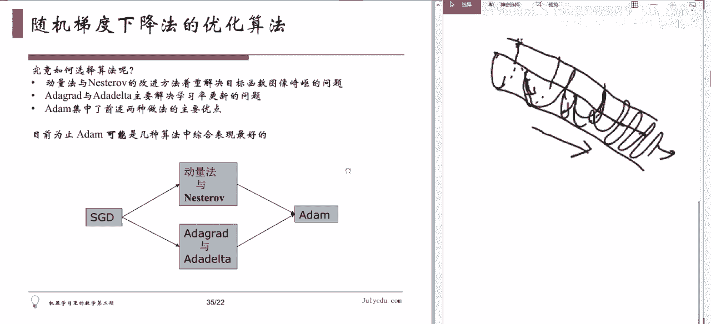

# 人工智能—机器学习中的数学（七月在线出品） - P18：随机梯度下降法的困难与变种 - 七月在线-julyedu - BV1Vo4y1o7t1

我们稍微再简介一下我后面这个部分的内容，这部分当然可能更深入一些。大家我们去年有一个公开公开课，就专门讲这个大家也可以找一找叫做这个。呃，机器学习中的优化算法，那么那么一个课。一个论文班论文班的公开课。

啊。说是什么事情呢？就我们前面讲的这个梯度加政法。我们说牛顿法就不算了啊，就主要是用提步相也法。那个旧香法呢，它还是在具体的工程问题中还是有很多困。只有两个。第一个困难就梯度计算。

当你的这个通常你在积学习中啊，那个函数并不是一个写出来的一个呃。就是可以求导的这么一个公式啊，去求导。它实际上呢啊通常都是一个。有好多样本，每个样本给你一个函数，你把这个函数加起来。

再对这个整个这个函数是。啊，算这东西。当你样本量很大的时候，这件事儿就变得非常的耗时耗力。就是说那这样这函数它并不是一个那么简单的写出来的一个函，它是一大一大堆函数的求和，每一个函数里都有这个随塔。

但是通用的C塔的都是随塔。那后你要对这个东西求导，你想你要每一个函数求导一遍。在不同的位置都得这个都得求求一遍。然后呢，你把它们加起来，这样才得到整个函数的导数。这样呢计算就非常复杂，就是比较慢。

当你这个样本上打出来。还有一个问题呢，就是我们在讲这个学习率的选这个选取。选了小了手法收敛太慢，就着急角趾找太慢。选大了呢。他可能不收敛。比如说你就我们这个函数吧，你在这点出发，你知道要往右走。

如果你选那学习率非常大，砰跑这来了，你现在就要往左走，砰跑这来了，你再往右走又跑这来，来回震荡，它总远不收敛，对吧？选小了呢？你再往右走走一点，我还要往右走，再走一点，还要走，你再走一点。

走了一年也没走到地方，对吧？就是说这个学习率怎么选，具体问题还得具体分析。这是很恶心，你给你个新问题怎么办呢？😡，你就得试啊，这就非常的花时间。然后你要能试出来好，还好。有的时候你可能还。试不出来。

你就麻烦了，对吧？所以说这是他两个基本的问困难。那为了解决这个困难呢，我们说你的工程师都是很聪明的，他们就讲出些办法。第一个。就是随机梯度下降，这个是现在工程上用的最多的这个梯度下降类的优化算法。

他主要是为了解决第一个问题。就是梯度计算的问题。刚才不说为什么这个是个问题，因为样本量太大了，函数太多了，呃，挨个算一遍开发时间。所以说。对工程师们用了一个非常简单粗暴的方法，说，既然你全算一遍太慢。

那每次算一个不就行了。所以说每次做计算梯度的时候啊，最原始的梯度随机随机梯度下降法怎么做呢？就是每次梯度计算都只用一个样本。算出一个题录，先走走看，然后再用下一样本再算一个题录完，再走一步。

这样可以怎么着呢？比如你好多样本都是类似的。算一遍没什么用，都是一样的。所以避免在类似样本上计算梯度造成种我们计算。然后你这种算算法呢，它增加了一些不确定性。比如说。你不是算平均值。

你算的是每一个样本的这个给你的梯录。所以增加了这个跳出当前那个局部计要值的一些潜力。就比如你有些样本可能在远出啊，就就有有这种好处。然后这种做法的缺点是什么？就是说它这个非常的操杂，就是说一会儿往左。

一会往右，一会儿往上一会儿往下啊，这个有可能不收敛，怎么办呢？你要逐渐的缩小这个学习率。一开始学习就选一个数，然后逐渐的把它变小，随着你的算法前进把它变小。最后呢。他也会收敛。然后在这种情况下。

它跟之前那个正常的梯度加量化，这个收敛速度也差不多。就是说。有了前面两个好处，还没有影响到他的收敛，所以整体上来说还是变好了啊，这就是最基本的这个随机吸度枪。每次只用一个样本。那。还有个小批量。

随即提速下降了，就是说只用一个样本呢，有时候你的样本本身它可能这个就是个坏样本啊，这个给你一些不好的信息，那个不太好。那怎么样把它的稳定一点呢？就是每次季度计算呢使用一个小批量样本。

比如说你有100万个样本。不是不好算吗，那我每次算100吧。对吧每次只用100，第100个呢。基本上你计算机就可以承受了。然后呢嗯。就是他解决了你这个计算复杂的呃耗耗时的问题。然后呢。

它也比你只用一个呢要更加稳定一些。而且现在一般你要是批量这个不是很大的话，呃，我们这个有一些矩阵运算工具啊，什么都可以帮助你就行计算都比较快。所以说它又比前面那更好一些。

所以现在一般大家讲的随机梯度下降化指的都是这个小批量随机梯度下降化。我们在神经网络训练中，就把这个mini batchSGT叫做SSPD就这个意思。这个是一个术语上的那个其实是叫错了，但是。

这用叫习惯这么叫。哎，那有的同学说这个选择是不是随机的，就是这个批量的选择是不是随机的，就这个随机两个字，它不是指那个批量选择是随机的。他就是说你把那个呃样本完，你给他排个序，这个排序可能是随机的。

就是反正你就排个序，然后你就按照那个顺序来就就这么选这就完了。然后这小批量也是你就是给他先排出序。这个排序呢。就是说你不能按照那种有意义的方式排序，你可能是。你可能比较随机的一个排序。排完之后呢。

你在前面选100个，先做一次，然后选这101到第200个再做一次。然后这样就是你一旦排好序之后，你就要按就apple来是吧？就这条的。然后你圈来一遍之后，你可能要给他呃，这个同学说要杀le一下。

就是说打断一下，再排下去，然后你再来一遍。就是每次排序的时候，你要给他大乱一下，但排好之后你就拍盘来了。呃，有同学说这个不同批次的小批量中会不会有重复样本，这个事情我认为是没有必要非得这样做的。

就是说你比较简单的方式就是你先排下序，然后你就挨盘这样做。如果你要每次选小样本的时候，你还得去做一个抽样。这个事不是花时间吗？也没有特别大的意义，我觉得除非有特殊要求。对。然后。梯度消失是另外一回事。

我们下节课可能会讲到这个。一般来讲是在这个呃深度学习中，当你的那个。我们会讲到啊就是说跟我们求导数有关系，就跟我们下一节课要讲的这个求导数法则有关系。好，还有没有别的问题？好。那我们继续。那么。

所以我们说随机提不下减法啊，它主要解决了第一个困难，就是说提不计算。但是它对于第二个困难。还没有什么特别好的办法。所以它的主要问题在于第二个问题，学习率的选取啊。怎么样才能找到一个？比较好的学习率。对。

这个问题。然后嗯。但是还有一个问题就是说。这个这个现在这样讲可能不是特别直观啊，就是说呃对于图像比较崎岖的函数啊，尤是一种隧道型的曲面。其香烟好表现不好，为啥？就是你下山的时候有这样一种山，不太好下。

峡谷。说隧道可能不是特别的好。说那种倾斜的峡谷。更好一些。有这样一种事儿。他整体方向呢。是往这个方向下降。但是呢他是一个非常。抖着一个峡谷。个管子吧，还是说隧道比较好。

现不想大应该能看出来我的画的是什么东西。就是你可以想象一个滑梯啊，滑梯这个滑梯主要下降方向话面是这个。但如果你在这个点处求一个梯度的话。沿着哪方向下降最快呀？不是那个方向，是沿着。往右倾斜一点。

但主要是沿着这个。横向的。因为他是是他有这个。行。没异议。稍等这对，这主要下战方向呢是这个。向右的一个方。但是呢。😊，因为它这个滑梯啊，它还有这个。就是这个横向的这个方向。你在这点出发。

可沿着横向方向也可以想想。对吧而且这个方向呢更陡一些。所以当你算梯度的时候，他会告诉你这样走。就果你这样走了以后呢，又上去了你还得走回来，就你当然你也会往右一点点走，最后你的曲线什么呢？

最果你的你的行为曲线就变小。沿着这个方向上去。下来。上这来。再到那边去再过来。发过嚟。再过来。个就是你在来回来回震荡，整体上来说，最后你也往下走了，但是你要经过长时间的震荡。

最后你才真正的沿着主要的方向走。这是一个提度下降法不好的地方，因为它做的是局部估计。当你这个函数比较复杂的时候，它局部给你的信息不太准。啊，这样不好啊，这是一个气流向下滑表表现不佳的地方。

还有一个就是我们说这个学习率的问题，就是说你那个到底学习率选多大多少比较好。所以像这样的问题呢。哎，这个为什么不用留那么就不说了啊，那么这道题怎么办呢？我们他会要有一些改进的办法，一个是动量法啊。

我们就不仔细讲了。但是大家可以我们有公开课，这是免费的。所以这个大家回去在这个app上找一找，找到我们去年的这个嗯免费的这个论文班的公开课，有一节专门讲这个随机思下降法的各种变种的。

那里面我们很详细的讲了这些方法。动荡法主要是解决我们刚就是当然我这里可以给大家说一下这些方法是干什么。动量法主要解决我们刚才说的这个问题。这种隧道型的，它可以帮助你抵消这些来回震荡。

让你主要沿着主要工向去走。这とな。那。他具体的方法就是把你这更新函数这个迭代方式稍微改一点点就可以。你看这个来回震荡嘛，他把你震荡取消了，变成这个浪往前奏。多少法能够改进算法。

这化有缺点就是说它把你震荡取消了，主要沿着这个方向走。但是沿着主方向，它由于这个积累过剩，有的时候会过头。所以改进方法呢就是不但抵消震荡，还能够避免你走个头欧动。这种什么加速的。叫啥。是好一点。

就物理上就是我刚才说那个它避免走过头。那这个呢主要是为了解决这个曲面其实的问题。那还有一些问题呢，就是说呃你这有些细有些数据啊，你这个模型啊，它这个好多个参数。有些参数呢它很少被更新。

有些参数呢经常被更新。然后你那些很少被更新的参数呢，一旦得到有机会更新的时候，你应该应该让他多更新一点，你别让他因为本身他一共就没更新几次，你就得让他多更新几次，都你就每一次多更新一点。

就是说学习率度大一点，这样呢才能保证你这个能更新到比较好的位置啊，你经常被更新那些呢，你就说那你反正经常被更新嘛，那你也别更新太大了，你让他那个每次学习率小一点，这样可以更精确一点。这种事情。

你不太可能在训练之前就知道。你只能在训练的过程中才知道。所以你希望这个训练算法呀，它自动去探测这种事情，然后给你做一次适应。那这个方法呢就是在做这种事情。对于更新频繁的参数，采取较小的学习率。

更新不频繁的参数，采取较大的学习率。那它也就是。他用了一点这个现行代说术语，就是说嗯。他基本上就是说在更新过程中，他看看历史上这个这个参数被更新多少次，然后呢。

把这个更新的这个每次更新的权重呢给它偏方和加起来。那你更新次数越多，或者学习率呢就越小。然后学倒数反正更新次数少呢，或学习率呢就是更大。它用种自动的这种方。谁做这个事儿。然后又有改进的版本。

最后呢有一个方法，就是说结合动量法和这个这个这个呃学习率的自自更自适应的方法，把它放一起了。就既有这个呃动量法解决曲面比较崎岖的问题，又结合了这个呃更新率自适应的这个特点啊。

得到了一种比较好的气油下降化的变成。就是这个可能目前如果大家直接用的话，说你呃。盲目的来选一种哪个最好，可能就是这个。🤧这个挨的就化法最好。所以这个像这种东西啊。

在一般的机器学习的这个包里面都是有现成的。你不需要自己去这个写这个包写这个工具。比如说刚才我看了一些里面应该都能找到。我试一下。哦，这个也没有找到啊，这个回头我帮大家找找，这个应该都是有。See。

就说呃当你用的时候呢，你就可以。一般来讲，它会有一个优化的工具，然后那里边会让你选说你选用哪种方法，你就选一下就完了啊。好。那。对，就是究竟怎么选呢？就是说你需要知道他们该在在这个干什么。

动量法和这个主要是解决这个图像崎岖的问题啊，这个这两个呢主要解决学习率这个更新的问题。它呢集中两种做法优点。所以当你选的时候呢。你要判断一下你这个问题。如果你这个问题没有没有这个更新的问题。

你就直接选上面这就行，它可能更简单。呃，就是说。计算的负负担负担也更小。啊，如果要是你没有上面的个问题，你可以选这个。如果两个问题都有，那你就选这个几种。就这个意思。就为什么你需要知道他们在干什么？

就是你当你选择模型的时候，你可以选的更好一些。

