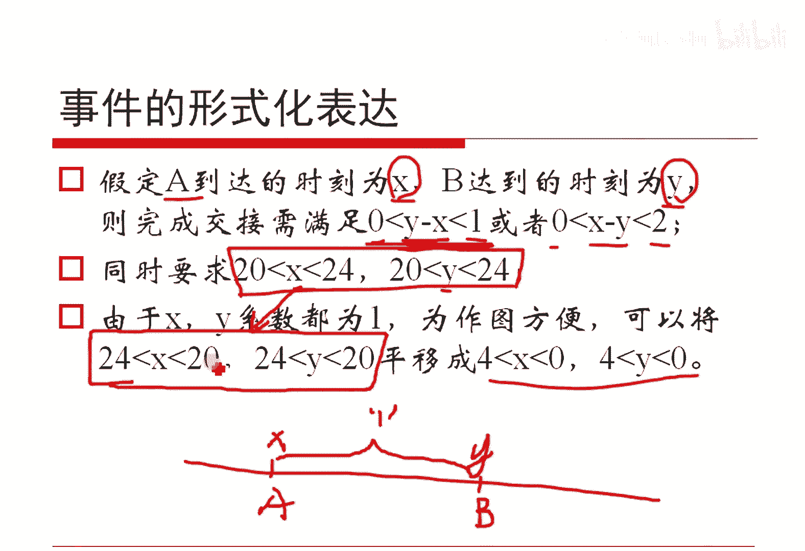

# 人工智能—机器学习中的数学（七月在线出品） - P3：概率计算与拒绝采样 - 七月在线-julyedu - BV1Vo4y1o7t1

呃，这个呢是咱上一次跟大家留的一个思考题，不知道大家这个思考了没有哈，我们来共同的看一下哈，简单看一下，就是我们假定哈AB两个国家。这两个国家的元首呢相约在首都机场晚上8点到晚上的0点交换一份文件。呃。

我们现在有一个规定啊，就是说如果是这个A国的飞机，如果他先到了，那么说A呢它会先等待一个小时等B哈，它会等一个小时。如果在这段时间以内B任何一个时间到了，他们这就是可以正常交换的。

此外呢就是如果是B这个飞机先到了，B呢会等待两个小时，这是两个小时。然后A如果在中间任何一个位置到了，他们就是可以交换的。然后呢，我们假定两架飞机是从晚上的8点到晚上的0点。

降落在机场的概率是均匀分布的。也就是在这4个小时以内是均匀分布的那这样的话呃。我们想让大家算一下。两个国家的元首能够正常的在晚上的20点到24点完成文件交换的概率。我们现在做一个小的trick。

就是假定说呃交换文件本身不需要时间哈。这个问题其实场景非常多。比如说我们如果把AB两个国家的元首换成呃一男一女两个人做优会，其实一样的东西，对吧？也就是两个人是否能够碰面的问题，本质是这样一个东西哈。

但是我们要求的是在20点到24点这个要见面哈。呃，这个题目呢咱其实可以正常的去用呃分段积分的方式去做。另外呢我们可以去用几何概型的方式画一个图出来，比如说我们假定A到达的时刻叫XB到达时刻叫Y。

那这样的话，因为是X，如果是这个X先到Y后到的话，A不是能等一个小时吗？对吧？那这样Y减X如果是从0到1的那么说二的就是可以进行文件交换的或者X减Y是从0到2的也是可以进行文件交换的对吧？

而同时呢X跟Y都要是从20到14的这是它的基本的这个。

那个那个基本实践对吧？但是呢呃因为这个里边0呃20到24哈，其实系数都是一嘛，所以说我们可以说把它画到0到4上画图好画而已哈。这样子我们就得到这样一个图哈，就说呃把这个X画到横横坐标，把Y放到纵坐标哈。

显然Y等于X是这个紫色的，它让我们画出的一个是Y减X等于一这么一个线，就是Y等于X加一，对吧？因此是这样一条绿色的线，Y等于X减2是这样一条紫色的呃一条棕色的线，那么说这一部分阴影面积的区域。

就是能够正常在零点到4点，或者是从20点到24点，能够完成文件交换的这个。

嗯。嗯。嗯，稍等哈，我我看一下哈。是的，没错，对吧？就是能够硬应影面积，就是能够文件交换的一个呃面积，而总共的这个矩形面积是我们的总的事件，对吧？体形面积很容易算4乘4嘛。

这个两部分面积当然你可以正常算了，另外你可以算两个白的这个三角形的面积，然后把三角面积求出来，然后用左面一减也可以，对吧？这样子就能算出来这个最终概率哈。嗯，好的哈，这个这样问题大家看有有问题吗？😊。

呃，等于说小于大于的方向是不是写反了。

呃，这个是吗？呃，我们看一下哈，应该是没写反哈。就是说呃你看哈，如果说A先到达。B后到达的话，我们说那显然A是X，B是Y，那显然Y要大于X，对吧？Y减X只要这一段它是比一要小的就行。

对吧所以他只要小于一就可以，应该是没有写反哈。对吧。嗯。X大于20小于24，Y大于20小于24。啊，是的是的是的是的是的是的是的，就是这个地方我抄错了是吧？是的是的是的。

就是这个等因是X小于20到24哈。是的，多谢哈，这这个这这个写错了哈，这个本来是这我复制过来哈，这个我不知道怎么编辑的，写错了哈。是的是的是的，OK其他问题吗？是的这个写错了啊。😊。

呃。这个其他地方还有问题吗？就这个题目本身呢，还有一些其他或者是我写错的地方。如果月儿问那个事情哈，你是姓米吗？如果不用这个图形算面积，那么说我们就只能正常的进行积分。比如说我们从这儿截开。

这个问题问的非常好哈，就是芈月呃月儿问的这个问题非常好哈。就是说我们如果是不去这个用面积做呃，用面积做，而是正常的积分怎么办呢？只能分情况讨论。就是如果说这个。呃，X呃A这么一个人。

他是从20点到23点，他呃到的。那么说其实任何一个点到的哈，那么说他不等一个小时吗？这一个小时之内，他只要是Y能够到达，就B能到达都是可以的。但是如果说这个X这个A这个飞机，它是从23点到24点降落的。

比如在这儿降落的那么说它就不能等待一个小时了，它只能等待假如这个X啊只能等待4减去X这么长个时间，然后等待Y是不是能够到达，它能到达的话，OK他们是能够在20点2到24点进行这个文件交换的，否则就不行。

只能这样分情况好论哈。这是一种方案。我不知道这样讲，这个呃月儿清楚了吗？因为我觉得其他朋友应该也有这个疑问，对不对？这个有个假设，两个人的行动是相互独立的。是的哈。

就是说这里边我们是假定了这个两架飞机从20点到24点都是均匀分布的，降落在这里边的，对吧？他们都是均匀分布的对吧？然后才能够做这个事情哈，如果不是均匀的那很显然，这么一个图，假定说这边权重高。

这边权重低，那你就不能直接去这么做了，对不对？所以说我们这里边假定了均匀分布，所以才能够这么做哈。😊。

嗯，OK哈，这个问题其实值得思考哈，这个应该是今年啊是2015年阿里的一个面试题。我只是把这个机场的名字改一下而已哈。

好的，呃，我们现在呢来琢磨第二个事情，这个是我们上次的第二个思考题，对吧？我稍微的改了一下。就是我们现在这么来想，看起来这个题跟咱上次留的那个思考题，第二个思考题完全不一样，本质是一个问题哈。

我们现在假定有一个rund7这么一个函数。他呢是能够均匀的来返回1到7这7个自然数的。比方说它返回一的概率是7分之1，返回5的概率还是7分之1这个事情哈。

然后呢呃我们现在是想让大家利用rund7这么一个函数来构造一个rund10这么一个函数。😊，run10随机的去返回1到10。对吧是么个东西啊。如果说这个作用不是ro7，而是ro5的话。

大家似乎还是好办一点，对吧？run5如果反回1到5的话，咱两次调用就是了。但是如果这个里边呃出现了run7这么一个事情哈。然后哦那个我忘了是阿里的什么职位了。呃，好像是我我确实忘了哈。

不知道是是是算法类的，还是去学习类的，还是哪一个哪个类的，我确实忘了。呃，因为我们我大概只是总结过这个面试题，具哪个职位，确实忘了哈。大家可以看一下哈。😊，OK罗潇给出了一个非常好的思路哈。

就是rund7加run7再减去4，这样不就可以了吗？对吧？因为rund7加上red7，它是返回从1到14的，对不对？那这样的话我。如果发现返回值是111213或者是14的时候，我就把它给扔了，不要了。

然后呢，这个如果返回正常的从一到10的某一些数，我就正常的返回它不就可以了吗？对吧这是一个。解法，但这个解法是不对的，一定要注意是不对的。因为原始的1到7，它是一个这个均匀分布，对吧？

但是我们举个简单例子哈。你比方说如果咱不用1到7哈，咱用如果一个正常的一个函数，它返回12这两两个两个数都是0。5的概率返回。很正常吧，对吧？那么说把这两个是加起来再除以2的话，它会多一个。

它会它它本来是这样子的，他弄完之后就这个样子了，对吧？它其实会最终的会导向正态分布，还记得吗？我们等会儿会看的这个例子哈，所以他直接加是不合理的哈。那么怎么办呢？😊，乘是可以的。因为呃两个概率。

如果我们认为是两个一个函数是掉一次，再调一次，它是两个，我们认为是独立事件的话，对吧？那么说返回一个假的时候我们这么来考察哈，第一次它能返回从1到7的某一个数，第二次返回1到7的某一个数，对吧？

那这样的话，其实第一次的东西我们放在个位上，第二次我们放在10位上，相当于我们构造了一个7进制的一个数，对吧？总之它返回的是从1到49，对吧？那这样的话，既然是从1到49这么多个数。

我们就把最高的那个41到49，那9个全扔了，不要了，然后呢，我们只保留1到40除以4就够了嘛，对吧？实际中呢我们可能用这个1到7哈，我们用0到6来表达。这样的话符合咱编程的习惯哈，如此而已。

所以也是这么来做的，就让的7减去一这个A一是从0到6的raner7减1A2是。

0到6的这样的话呢，我们这个R7倍的A1加A2其实是0到48的对吧？这么一个数，如果说这个R比40大了，它是从40到48的某一个数，我们直接扔了，不要了。然后剩下的从0到40这个部分。

它其实均匀的OK那这样的话，R除以4，这样的返回的是0到9，加个1不就是1到10了吗？对吧是这么来做的哈，这种做法非常有趣哈。这种做法其实是我。呃，用了一部分而扔掉一部分做的，它其实是能够保证均匀的。

这个例子其实大家早就用过，只不过我们从来没有这么提取这么正常的说过哈呃，等号有问题留一留一句就行啊，重要事情不用说三遍啊，然后这样哈就是说呃大家其实怎么用过呢？你比方说这个事情。

你比方说我们这里边有一个单位圆，假定说这个圆不画的不圆了哈，假定是个单位圆。然后呢，我们怎么做呢？我们在这里面做一个外接的正方形。然后呢，我们就往里面去随便的去投针，对吧？随机的去扔这个扔点。

然后呢扔完若根点，比如说扔了大N个点，我数一下这个圆以内的有多个点，假设这个小N个点，小N除以大N这个值，我就认为是圆的面积除以矩形的这个面积。对吧跟这个其实一样哈。

咱这个里边是给定的这个范围是从0到48的这么49个数。然后呢，你随机的去扔，选择一个数出来，任何一个数都是等概率的对吧？因为我们的任何一个run7到减一它是等概率的嘛，两个也是等概率的那么说我们扔掉高。

高边这一部分底下这个仍然是等概率的呀。对吧其实是一样的哈。是的。没错，就是富利邓说的非常漂亮哈。这个东西就是咱后面要说的蒙特卡洛的呃那个。马尔科夫恋的蒙特卡罗模尼哈。呃。

这是一个非常重要的一个抽样采样方法。其实对吧？只是咱今天呢先跟大家聊简单的说一说这个事情哈。嗯，好的，这个事情大家看还有问题吗？可是A2那里不是加起来吗？哦，不这两个是乘的哈。

就是不是我这个地方不是加的。因为这个A1它其实是返回0到6，呃，反正我们认为A1是0到6，A2是0到6，对吧？那这样我把这个A一放到高位上去了，乘以7了。A2放到低位上去的。

所以这么一个值是能够保证均匀的去返回0到48的。对吧。就是一个是横向的，一个是纵向的，这边有7种情况，这边有7种情况。那么说这每个格子上一共有49个点，也是均匀分布的嘛，这很正常嘛，对吧？

1个X1个Y嘛，这是可以的对吧？这本质上就是一个这是A个X，这是一个Y嘛，对吧？其实是一个一个东西哈，只不过咱把这一个数压缩到两个两个坐标，A1A2压缩到一个坐标上去而已哈。嗯。41后面是均匀的。

但是呢因为41到49不是1的整数倍，我们没办法让它通过折叠的方式变成整数倍，所以我们就只能扔掉它了。呃，当然你可以怎么干呢？你可以把这个40变成30。把这个四改成3。仍然能够满足我们的提议。

就是随机的返回从1到10的某一个数。只不过呢如果是改成30的话，那么说你这一共有49个数，对吧？其实你只要了其中的30个是有可能的。我如果是变成正原来那个40情况是一共40种是要的。

最终是有49个可能的数。所以说如果是第一种呢，咱的原咱的情况的话是大概我的接受率是49分之40。如果改成30的话，接受率就降低了。那么说你这个well循环执行次数，它的期望就变高了而已，对吧？这样的话。

49除以40，大概是一点几次，这个也是一点几，一点几比较大一点。如此而已哈。嗯。如果A一直接乘以A2是不可以的。呃，A一如果是我看一下哈。稍等哈，就是负利正是不是那个事情是吧？呃，A一是0到。呃。

A1是0到6的，A2是0到6的，那么他们直接乘完就是到36的。对吧那这样的话，其实素数全部都不可能被取到，嗯，有可能被取到，但是它只有一种它只有可能性只有很少，他取一，他取素数，他取一，他取素数对吧？

其他种情况，你比方说这里边好多数其实不一定能取到吧。对吧它不均匀，对吧？嗯。乘以7真的是均匀的。因为。

OK我们重新说一下吧。我们这么这么讲哈，A一它返回的，其实我们认为这里边这个这个这个这个这个山格横向是有7个。纵向是有7个，然后呢，我们怎么选呢？我们这里边A1，我们随机的横向选择1个A1。

纵向的选择1个A2OK这个A1A2对应的这个值，这个值我们记做R，这个R怎么来的呢？就是这个记做第零号，这个叫第一号，这个叫第二号，这个值R值本身就是这么算出来的，这么解释可以吧。

这样解释大家大家认了吧。是不是？😊，OK哈。😊，呃，好的，这样大家应该是能够。接接接受这种这种思想了是吧？好的哈，其实本质就是我取一部分，扔一部分而已哈。😊，呃，哦，那能不能这样判断对A一判断。

若A一小于4则A2的值直接给R。若A一大于4，则A2加7负值给C判断C小于11则输出给R。呃呃，这是在说什么？呃，这样吧，就是许许消。许消哲哈呃，这个我我没太一下子反不过来哈，咱咱在课间的时候。

咱来讨论一下这个刚才这个许消哲给的这个思路哈，就是A一和A2小于4大于4，如何判断哈，我我。咱等会再再再课间再再解决这个事情哈。😊，好的哈呃。😊。

我们现在呢开始今天的关于事件独立相关它的统计量方面的一些事情的一探讨哈。我们简单的看一下，就是说如果正常而言，给定A和B是两个事件。如果说A和B的联合概率等于各自的边缘概率的乘积。

那么这个时候我们就把A和B认为是相互独立的。这个概念是很清晰的对吧？那么说因为我们知道条件概率这么个东西，那么说呃PA givenB这么一个东西，它什么意思呢？它其实可以写成P我们用条件概率公式哈。

其实可以写成上边是PA。B然后下面其实是PB对吧？然后呢，我们这里边如果是PAB等于PA乘PB的话，这个PB和这个PB消掉了，就剩下PA了。因此得到它，对不对？所以说如果有他们独立的时候。

一定有这个式子发生。这个事的发生什么意思呢？就意味着我A本身要想发生。这是右边这个情况，或者是我在B发生的时候，我再看A能不能发生。

O这两种情况他们是相等的那你相当于你给了我这个B这个条件对A不会产生任何的影响。所以说这个A和B就是独立的。对吧所以说这个公式的这个写法啊是可以解释的。为什么我们会这么来去定义相互的独立，对吧？

另外呢就是说虽然这个式子写的是很直接了哈，但是我们实践当中往往不是这么来算的来做的，往往是根据两个事件是否相互影响来判断它是否独立的。比如说咱刚才那个例子。

两个人这个互相的这个能不能在20点2到24点进行这个通信。因为他们各自都是进行的这个均匀分布，从20点到24点进行去降落的。那么说他们两个人之间，我们认为就是独立的。

对吧比如说我们给着大家随便给你了M个样本。如果没有给任何条件，我们就可以假定这M个样本是独立的。我们如果在一个系统里面随机的就是进行若干次采样。

如果我没有严格的去区分这次采样跟下次采样之间有什么样的关系的话，我们认为两次采样之间可以认为是独立的。这是关于独立的使用哈。当然这个公式本身是一定的条件。

但实践当中我们往往是通过社会化的这种意义来去解释它是独立的。大家知道这回事就好了哈。另外呢就是我想让大家思考一个问题，就是你能不能做一个定义，就是所谓的A和B这两个事件相互包含的信息量。这么一个概念。

就是说A讲的是个事件，B是个事件，他们两个相互包含着这个信息量，有点像交集的感觉，对不对？他们的一共同包含这个信息量，我假设定义做IAB。那么说对吧？我们现在想让大家思考一下什么呢？

就是我们想让大家想想。你定义的这个给出来这个定义哈。如果说A和B是独立的时候，我想让这个它的信息量为0，这种定义是对的吧。这种定义是很正常的吧。那么说我们想这么这么干哈。

OK这个刚才DDT和罗潇分别给出了两个非常好的说法哈。我们先看这个罗骁说的哈，就说我们直接就把这个A和B他们之间的这个信息量定义做PA。呃，我讲一下哈。

我们直接定义做PA减去PA givenB不就可以了吗？

这似乎是一种定义，对吧？这种定义呢没问题哈，这其实我们也许会这么来做。有一个小小的问题，就是它不对称。就是那我既然可以定义成PA减去PA givenB，我能不能写成PB减去P呃B givenA呀？

对吧或者是我写成PA减去PAB givenA呀，对吧？呃，它就或多或少的有点困难是吧？当然这个当然这种定义方式没问题哈，这可以做的哈。呃，甚至我们可以反向做，就是正常而言。

PA givenB的概率是要大于等于这个PA的，所以说我们可以用PA给为B减去PA一定程度的来度量这个结论，没有问题哈，真的没有问题哈。它唯一的不太好的地方，仅仅是因为它不对称，但是不对称没关系哈。

不对称，不是不是主要的哈，对吧？另外呢这里边如果我们想去呃另外一个思考方式的话，我们可以这么来想哈。因为你不是让我他们的东西等于一等于0吗？既然PA givenB等于PA。

那其实PA givenB除以PA就等于一嘛，对吧？既然它们相除是等于一，这个一想让它等于0，那显然我这儿如果取个对数不就够了吗？那这取个对数嘞，就是这样一个东西，就是这个东西取个对数。对吧或许是可以的。

当然我们需要对它进行改造，对吧？大家可以对它先有一有一个直观上的一个想法哈，我们最大商模型再去探讨这个事情哈。呃，刚才罗潇说的没问题哈。呃，这个东西其实跟信息增益这个东西是有很大的关系的。

本质上就是一个东。

