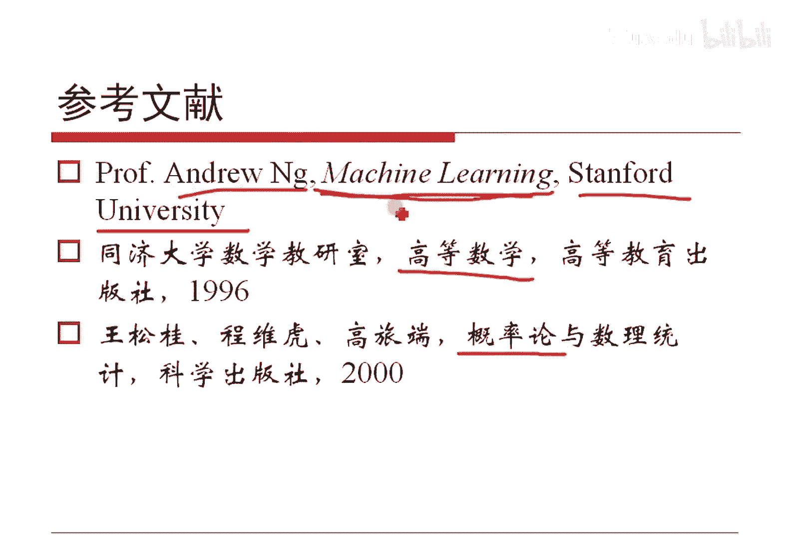

# 人工智能—机器学习中的数学（七月在线出品） - P4：概率论基础 - 七月在线-julyedu - BV1Vo4y1o7t1

🎼，那咱跟大家聊一聊概率论，这是一个非常非常重要的概念。我们现在呢先说一个概率的基本认识。如果一个事件X它发生的可能情况。是一定会发生，我们记做一一定不会发生记做零。

因此这么一个东西可以看作是关于X的一个函数，这就是一个概率。对吧这就是所以PX这个概率值啊一定是从0到1的，可以取零，可以取1。但是要注意的是。反过来。因为如果一个事件一定不发生。

这个事件的它的产生概率一定是0，这句话没错。反过来，如果一个事件它产生的概率为0，是否意味着这个事件不会发生呢？不一定对吧？因为我在任何一个区域上。这是一个桌面，我呢随便投一个针上去哈。在投之前的话。

这个桌面上任何一个点被投到针的概率都为0。因为针尖的面积除以这个桌面的面积，它就是0。但是我投完之后，总有那么一个点，他被扎上针了。OK那个点被扎上了，这个事件发生了。投之前那个点的概率它是0。

是吧所以说一个事件出现的概率为0，并不意味着这个事件一定不可能发生哈。这其实是概率的一个。不好的一个结论。人们最好的想法就是，如果一个事件发不发生，一定概率为0，概率为0一定不发生，这是最优优的。

但是呢其实有一点点的漏洞，就是在这儿，对吧？概率为一，并不意味着一定发生。我这突然想起来，比方说呃大家有兴趣可以查一下一个很有名的算法。模拟退火算法。模拟退火算法它会告诉你。

以概率一能够最终收敛于全局最优。但是他从来不会说，如果严格的那个教材哈，他从来不会说一定会收敛到全局最优。因为他只是以概率一收敛到全局最优，如此而已啊，对吧？大你知道这里这两个区别哈，就是。😊，呃。

不会发生那几个点，相对于整个的区间而言，它已经是为零了。但是呢并不代表它绝对的，就这意思哈。OK这是关于这个哈。另外多说一句哈，就是说如果说X是一个离散的情况的话，那么说X某一个值所会它会发生。

OK那这样的话呃刚才刚解释完那个问题啊，就蔡头那个问题啊，概率一它可能不会发生跟概率零可能。呃，因为概率零一定不发生，是一其相反的概概念嘛，一样的对吧？把这个东西取反，把这个取反就一样了嘛，对吧？

那就不用解释了，对吧？呃，如果一个事线X是个离散情况的话，那么说。呃，我们把这么PX等于X0这个东西记做它的概率概率值。如果它是连续的情况的话，那么说其实我我们会知道它的概率为零不好办，怎么办呢？

对这样一个函数求导数。那么说这样一个东西，我们把它叫做概率密度。对吧它其实是概率密度而已，是这一点它的发生导数值，对吧？呃，这是两点内容。但是不呃所以不管是离散的，我们得到的概率分布率还是连续的。

我们得到的概率密度，后面我们不再去过分的区分这两种情况哈，在公式上，无非一个是sigma。一个是积分，在我们的眼中，在我们学计算机的这个呃学机学习这门语言的这种眼中。

或者在我们搞计算机的这个人看来哈sigma跟积分符号。一样的。本质是一样的，只不过一个是离散，一个是连续而已，对吧？他写的公式呢是这样子，我们编码都是软来sigma起来的，如此而已，对不对？呃。

模拟退火的话，在咱机续学习这二0次课里面可能还真不会涉及哈。呃，或许会在算法班讲吧，这个不确定哈，这这个这个真的不确定，我内容上是真的准备了。反看大家的需求哈，或者跟大家做一个补充材料吧。因为确实。

没必要再讲一遍默认退还，我做个补充材料好了哈。呃，然后呢就是说我们其实可以这么来搞，就是既然FX给定了。那么说我们把X只要小于等于X零的值都去把它加起来，得到的就是一个累积概率分布，对吧？

因为这个概率一定是从零到一的呀。所以这样一个累积函数一定是一个单增的。当然它可能是增着增着平了又上来的又平了有可能不一定是严格增，但是一定是一个增，并且如果X零取最小最小的值的时候。

比如说负穷定域上最小值，对吧？一定它的值是最小值是零，如果X取最大最大值的时候，那么说所有值都包括了它的概率一定为一，所以它加它的加和为一嘛，所以说这个斐函数哈，它的最小值是零，最大值是一。

对吧这就是咱的累积概率分布函数哈。对吧这是他的那个累积分布，这种累积分布，这是第一个说法，我们把它。变一个思路。反过来想。如果给你了一个函数，Y等于FX。而这个函数的值域正好是从0到1的。

OK我们就可不可以把这个事件这个X这个东西啊，这这是X这个事件X它的呃这个这个东西看作是这个事件X的累积概率呢？如果是连续的把它求导，不就是它的概率密度吗？对吧这样做是有可能的。大家做好这一个准备哈。

这个就达到了我们知识的一个升华了哈。因为我没必要从前向后去看，我们从后向前去看，有时候也是可以的，这样做真的是可以的哈。比如说老J回归，我们就是这么干的，后面再说哈。呃呃对。

当然也需要这个函数也是也是递增的。就是它如果是递增的，并且还是值域从0到1的。那么说它就可以看作是某一个概率分布的累一个累积分布。我们再去进一步分析它，或许会有很好的结论。比如说没错。

吴文明说的那个哎曲线c模的函数，或者我们后面会谈到的，比方说ICA。IA我们应该会在最大商务性里面会看哈，把信号盲源分离把它分开，也是这么做的哈，做这个事情哈。呃，另外呢就是如果这个函数FX它是可导的。

它就是概率密度，对吧？这个是已经说过了，对吧？另外呢我就说一下啊，概率呃概率密度函数简称是什么值，大家知道吗？概率密度函数简称PDF哈。对吧然后累积分布函数是CDF哈，大家知道就好啊。呃。

简单做几道题吧，大家放松放松啊，刚才讲的理论实在是太多了，玩几个东西吧。比如说第一个就是我们看看古典盖形，将小N个小球放在不同小球哈，放在这个大N个盒子里面去。如果盒子可以无限装。

请问每一个盒子至多放一个小球这么一个事件，它的概率是什么呢？对吧。凡是遇到这种问题啊，古典概型问题。我们就来算一下所有的情况，再算一下这个事件的情况。也就是把基本事件算一遍，把有有效事件算一遍。

二的一除搞定。先算基本事件，你不是一共小N个小球吗？第一个小球拿出来，一共有大N种方法，一共有大个盒子嘛。第二个小球拿出来还是有大N种方法，对不对？OK第小N个小球还是有大N种方法。

因此一共有小N个大N连乘，就是大N的小N次方。然后。如果是我们的这个有效时间数目，我们看一下这个一个盒子让它至多放一个球，对吧？你不让我算只多放一个球吗？O那这样的话，第一个球拿出来，它有N种方法。

但是第二个球只剩下了N减一种，少了一个，对不对？那第三个球是N减二种，少了俩，最后一个球，那就是小N大N减小N加一种，对吧？把这些值乘起来，其实是长这个值，我们把它记住这个记号，对吧？

从大N里边选小N个数的排列问题。因此它的概率就是这个排列除以这个幂次。这就是他的结论。欠单吧，对吧？对这样一个事情呢，其实有趣的一个东西是我们可以研究一下，把这个大N如果取做365，小N取做某些人。

那就得到一个有趣的概念。就是若干个人里面有没有。这个每个人生日都不相同，它的反向就是至少有两个人生日相同，对吧？我们可以把这个曲线用一减它画出来。对吧呃意呢呃注意哈。

这个不是那个歌唱原理或者叫抽屉原理哈。抽屉原理的意思是我如果是有N个，比方说有。有三个抽屉，有10个鸡蛋，我把这10个鸡蛋放到三个抽屉里面去。OK如果咱正常放啊，都都放进去的话。

至少有一个抽屉里面要放大于等于4个鸡蛋。呃，对吧抽屉原理或者割巢原理哈，咱这个是呃它的另外一种情况，就是考察它的概率了，对吧？就是可能我们鸡蛋的时候我们跟割巢的情况我们不管，对吧？那假定说。呃。

我们把小N取1取15取20到取50都算出来这个概率值，对吧？我当然随便取个值了，假定咱这个班里一共有50位同学，那么说这50位同学至少有两个人生日相同的概率有多大呢？带到那个公式一减它就得到了，对吧？

0。97。我们其实把这个式子可以画到图像上是长这个样子的。对吧。比方说咱现在哈那个呃群中的朋友一共有148位，对吧？那这样的话，像148人，大家可以算一下。

这个有两至少有两个人生日相同的概率几乎是百分之百。但是大家要注意哈，50个人放到365个盒子里随机放，他有97%的可能，你可能有两个人放到同样一个盒子里面去了，对吧？跟我们的直观是不一样的。

我们直观上觉得我直观上365个呢，对吧？那你放50个怎么可能呢？但真的是这样子，有些时候把它叫做生日悖论。就是这个内容本身哈，就是一般而言，咱现在一共有150人，对吧？

这150人其实有两个人生日相同的概率其实是非常高的哈，几乎是百分之百，对吧？好了，有兴趣大家可以试一试嘛。第二个呢，我们可以简单的跟大家说一下啊。😊，国粹。麻将我觉得算是一个很有趣的一个游戏，对吧？

OK呃，这者叫悖论，是因为。你有365个盒子，我就50个鸡蛋，我把它随机的放在这365个盒子里面去。你闭着眼睛放你极有可能把两个鸡蛋放到同样一个像一个盒子里去了。对吧这就是咱的生日悖论嘛，对吧？

当然咱假定。一年是365天哈，不考虑闰年哈，对吧？😡，这是范爷，是不是？然后呢，我们呃去掉花牌以后的标准麻将哈，是有1到9的万条饼各4张，以及东南西北中发白各4张，对吧？一共有136张麻将牌。

没有那个没有这个梅兰竹菊，那个那那个那个那个那这种情况哈。春夏秋冬我们不管花牌哈，只管正常牌136张。我们规定这个两张内容一样的牌叫价。这这大家都明白这个事啊，我只是把这个事儿得陈述一下，对吧？然后呢。

请问我第一个人我骑手嘛？我这装OK我骑手抓14张，很正常吧。请问他骑手没有抓到将概率有多大呢？对吧。😡，我们可以算一下，对不对？那其实很好算。第一，基本事件一共有136章，我任意选4张。

那就是从136里边取14这么这种区。对吧另外一共有136张除以4等于34。我把34叫34组group。然后呢，怎么办呢？你既然要你没有降，是不是？那就你先去选择34组里面给我选出14组来。可以吧。

我选择14，因为我最后要摸14张牌，对不对？我就让你选出14个组，这14个组里边每组里边都有4张，对吧？每一组里面我都有4种选法即实，是不是？所以说第一个先选出14个组。

再从14个组里面选出其中14个牌，对吧？因此这是。有效实现数目二者一除我呃我这个记号是我我瞎记的哈。因为我为了这个记号的意思是指的21、22乘到34，这是我自己的记号哈，大家知道就好哈。然后呢。

我算了一下概率大概是这个数。就是所以说大概就是你打个。呃，八九次就会有，比方说打八九次哈，那就是你晚一晚上有那么两回两三回，如果打的时间长哈，会有没降的情况，对吧？如果是。这是庄甲摸14张。

那么说你可以算下13张啊，13张的没有降的概率是多少？你也可以算出来，跟这个完全一样吧，14万的13嘛，你可以算一下，我随机摸13张牌没有封的概率啊。对吧然后我们如果定义好了，这个有了一副将。

这样14减去2，还有1413，对吧？13章里面剩下的这个14张12张，剩下的一共凑成四副牌。或者是三个一样的，或者是三个连在一起的叫一副，对吧？OK我们可以算一下，那么说胡牌的概率有多大呢？对吧？

天湖概率有多大呢？地湖有多大呢？对吧？大家都可以算。其实很有趣的概念哈，我记得以前的时候曾经。帮助一个人做过一个。设计过一个赌博的一个东西哈，就是我们设计的一套规则，事先算好各种概率有多少。

然后再制定赔率，然后再去生产机器哈。人都是这么干的，然后。一定是让保证这个我如果是做装，一定是要。概率赢的概率很高，并且让你感觉到你能够胜。呃，对吧这里面其实是有呃呃。

当时还真的是做过一个真的做过一个动的，但但是那个就很简单了，也有会，对吧？也有几张牌哈，大家有兴趣可以琢磨琢磨这个事情哈。比如说概率再乘上一个值分之1，再乘上一个系数，就是赔率嘛，对吧？😊，啊，OK哈。

所以概率是有用的。😊，对吧概率真的是有用的哈。然后呢，我们先来看一下装箱问题哈，就是说我们如果把12个件的正品跟三件次品，我们随机的放在三个箱子里面去。注意每个箱子里面放5件。对吧。一共15件嘛。

每箱放5件嘛？请问每一个箱子里面恰好有一件是次品的概率有多少可以算吧？我们先算总的事件，就是这里一共有15件商品，把它放在三个箱子里面去，是不是？那其实就是每个里面放5件，那ok我就这15件。

我先随便放，然后呢啪啪切开这15个数哈，然后从5到6切一下，从。这个10到11切一下，前5个里边，其实随机的，他们都可以做排列啊，中间呢可以做呃五的阶层，后面还是5个阶层，总共是15的阶程，对吧？

很快就能得到第一种方法就是。15个产品放仨箱，每箱放5个，就是十五的阶成除以五的阶成5的节成5的阶成。对吧那第二种情况呢就是。我们至少保证一个里边每个箱子都有一个次品。做呢一共就三个次品，就仨箱子。

OK那就只能一个箱子放一个嘛，对吧？我把第一个次品放到第一个箱子，放到某一个箱子，一共三种方法。第二个次品，那就是两种方法。第三个次品只能一种方法，所以是三个阶成，对吧？然后对于任何一种方法。

剩下的问题就是把12件正品放到三个箱子里面，每箱放4件标红的这个跟上面这个其实就是同样问题问题规模降一而已。所以答案是这完全对称的对吧？然后这个东西本身乘以三个阶成，也就是前面这个三种方法。

再除以总事件数目，答案是这个哈。答案无所谓了，对吧？我们关键是想说红色的这个东西，其实是这个意思。就是N个物品分成K个组，每组里面第一组放N1个，第二组放N2个，第K个放NK个，对吧？把这个东西加起来。

当然是N啦，对吧？那么说一共有的分组方法是什么呢？根据我们这个东西，刚才这个结论，我们其实可以把它做一个推广就是这么一个东西。N的结成除以N1N2到NK各自结成撑起来。对吧。😊。

这个东西如果把这个K换成2，就是它的简化版本。那第一个第一组放M个，第二组放N减M个。根据这个结论就是它按照结论除以它这个东西本质上就是组合数。所以上面这个可以看作组合数的推广。

下面这个可以看到上面这个数的一种特殊情况。是不是一样的东西，对吧？这个东西呢不是白讲的，咱在后面商还会谈到这么一个结论哈，它跟商是有很多很多关系的。我提示一下。如果这么个东西，这都是成，对不对？

取个log会得到什么呢？对吧大家可以想想啊。呃，简单的说一下几个，刚才我们讲的是古典概型，对吧？我们现在可以说说这个事情哈，这个题目本身看着像是推荐系统，是不是？但是呢其实是个概率。

有时候哈这个商品推荐里面呢，这个里面哈这个场景大家很很很很清楚，对吧？如果是过于的聚焦这个我最喜欢的那些商品，其实是损害用户的体验的为什么呢？你比方说我老是去买这个积体学习的书，我老买算法的书，对吧？

那么说他老是给我推荐这方面的书，那那很很正常，但是呢我可能就对吧？你要是哪天给我推荐了一本这个讲。电影的书哎，我很喜欢。😡，对吧所以他会带来惊喜感。所以推荐系统的设计是一个。呃，除了要考虑到数学模型。

还要考虑到人自身的一些特点，还有个心理上的因素，是不是它有个惊喜感。那这样的话我们就有时候会设计一个基于概率的一个算法。比如这样给你举例子哈，比如说我们经过了某一种算法。

计算出来了A这个商品跟我当前访问用户有个匹配度是0。8。这个B这个商品跟我这个当前用户的匹配度是0。2，我已经算好了，算完了。然后呢呃。这里呃大家能听到声音吗？呃，我稍等一下，大家说声音听不到了。

OK okK哈哦，我们继续哈。😊，现在呢不是把A的0。8B的0。2给搞定了，对吧？那这样的话，我现在呢不是把0。8给A0。2给B，而怎么办呢？我给A随机的均匀分布，从0到0。8的某一个得分给它分配给A。

从0到0。2均匀分布生成一个数把它给0给B这么做的哈。然后呢，我们现在来去这个。大家算一下，我其实A是0。8B0。2，对吧？我但是我随机算的，请问我最终最终所生成的这个B。

它的这个得分大于A的得分概率有多大？这是一个题目哈，我多说一句哈，就是呃大家那个再说一句，就是下一个新版本的QQ。这个大家呃我先打不了字哈，大家给他给其他人写写一下哈，就是下个新版本的QQ。

要不然这个有两个小时限制哈，就是10月最起码肯定都都没都没这个问题哈。😊，去年的时候是有这个是是有这个问题的。OK哈，我们继续有这个内容哈，其实这个很简单，对不对？然后因为什么呢？因为A是从0到0。

8均匀分布的，B是从0到0。2均匀分布的对吧？所以它的总的全集是这么一个矩形。我现在要算的是B的概率比A大，对不对？它让我算B的概率比A大嘛。那这样的话，我把A等于B画出来，所以这一点你看是B是这么大。

A呢。是这么大，所以B是比A大吧。所以说这个三角形内就是B比A大的那个范围，把这个三角形的面积除以矩形面积，马上就能得到结论。对吧。😊，这就是。咱们这个题目本身哈对吧？没有任何的可行可说的内容啊。

很简单，这个内容可以把它归纳为几何概型，本质还是国典概型，对吧？画个图出来，然后就就就出来了，面积一除，对吧？呃，如果大家没有看到提示，就是QQ上没有看到这个时间提示的哈，那就是已经是最新版了。

已经是那个起码是后期版本了，不会有任何的时间限制了哈。就是本来右上角是有提示的，如果没有看着，那就是那就无所谓了啊，那就是已经是无限时间了哈。我们继续哈。😊，呃，我们现在可以这么来想哈。

我们现在定一个条件概率，就是给定B的时候，A的概率怎么算呢？我们可以这么来定义，就是A和B的概率除以B的概率，把它定义做这个在B给定的时候，A的概率，这可以吧。对吧这常节概率哈，这常件概概率的定义本身。

然后呢，如果我们这儿给定一个全集大一个全集叫叫大叫叫做I哈。这里呢本身是一个A的概率，那就是A的面积除以这个I的面积就够了。我把这个B呢A呢我把它分成若干份，可以吧？分成若干个份。

每一份里面都和B有一个交集，然后各自再把它给加起来，其实就得到全概率公式。是这么一个东西哈，就是说我如果算A的概率，可以把它先算BI的概率，但是BI对A有一个概率，B1B2到BN都去把它加完。

最后得到就是这个全概率公式哈。利用全概率公式和条件概率，能够非常方便的得到贝耶斯公式。我们如果想算A的给定的时候，BA的概率怎么算呢？反过来先算一下。

上面应该除以PAAB除以PA把PAAB换成这么个东西，对吧？把底下这个PA用强力公式换成这么个东西，这就是B公式哈。它的特点是什么呢？特点是我如果想去算给定A的时候，BI的概率。

我其实算的是给定B的时候A的概率。所以贝叶斯公式其实是一定程度的混淆了什么是原因，什么是结果。总之，我们只能知道他们之间是有联系的，到底谁是原因，谁是结果，咱说不清。对吧到底是因为你这个呃。

因为你身材好，因为你这个呃。这个这个这个老是游泳，所以你身材好了，还是因为你这个身材好，所以你就喜欢游泳，说不清，对吧？总之它是两个之间是有联系的，我们不考虑原因结果。

我们只考虑是有关系的这是贝尔斯公式它的特点，对吧？所以它一定意义下是颠倒了因果，对吧？举个简单例子哈，这个例子其实是教科书举的例子，但是它其实很有用，对咱们不理解这个东西哈。比方说这个例子哈。

8个步枪有5只校准过，三只没有校准过。并且呢一个射手他呢如果是用校准过的枪去射击的话，能够以80%的概率中靶。然后呢，如果是以未校准的枪击射击，中靶概率只有0。3，这是特点哈。然后呢。

我们现在从这8个枪里边随机的选了一只，让这个射手啪射击帮中靶。请问。这个枪是校准过的概率有多大？对吧这个题目其实啊这种题目直接用贝尔斯公式，把这些所有的概念都写清楚就是了。这个题目虽然很很简单哈。

但是大家一定要清楚，我就假定大叫。没太掌握的时候哈，咱简单的说一下啊，就是如果一个枪是一的时候，他校准过他呃对吧？一共8只嘛，有5只这个校准过，所以是5%，他没有校准概率3%，对吧？

然后我们给定的概率是什么呢？如果这个枪校准过，他中靶的概率是0。8，这个枪有校准过，没中靶，那就是1。0。80。2喽。如果他没有校准过，他中靶的概率就只有0。3。但是呃中靶概0。3。

他不中靶的概率就是0。7。现在让我们算的是他中靶了，请问他校准的概率有多大？待贝叶斯公式所有的这个条件都给你了。如此而已。对吧。后面就不用说了吧，所以说最重要的是你把这个式子写出来哈。这是最重要的。

至于说这个怎么用，那太简单了，是不是？所以说这前面这块最重要啊，咱后面讲也会这么来考察这个事情哈，把前面这些东西。说清楚就清楚了，对吧？就跟咱那个。写那个自治通鉴里讲这个赤壁之战似的哈。

赤壁之战前面准备工作哇哇写了好多篇幅，最后赤壁之战本身哗很快写完了，对吧？呃，谢军说贝斯公式怎么来的哈，再说一遍哈，就是贝斯公式仅仅是你看哈这不是PBI备问A吗？按照我们的被条件概率。

它其实我把它清了哈，重新写哈，其实这个东西可以写成P。这个BI。和A的联合概率除以PA的概率，这是我们定义对吧？这不是调形概率定义嘛，然后这个东西可以写成它。这么什么没系吧？把这个BI做条件。

那就是BI跟NA嘛，这是还是条件惯例嘛，把这个东西用权列公式把它给带进去，这不就是把用它和它马上都变成B的公式嘛？好简单啊，是不是？其实任何一个东西都不难哈，基本条件一一掌握去就搞定了哈。好了。😊。

至于他怎么做，咱就不用讲了哈。呃，由于有贝斯公式，其实就会产生了两个学派。就是如果给你一个系统，让你去给那样本去。算这个参数的话，后面的这种若干种东西，他们是贝斯学派的。但是如果我认为参数本身是变化的。

它其实是。贝耶斯呃，前面这个是频率学派的，但是如果认为是变化的那就是贝叶斯学派的内容哈。这个东西咱们后面再去详细的探讨它到底是怎么回事哈，都会讲到的哈。再强调，没有高低优劣。

只是一个认识自然的手段而已哈。然后呢。本来贝耶斯学派是占上风的，因为他能解决问题，平论学派是解决不了。呃，有些问题他解释不好。容易过你河。但是。这几年大数据出现了。

大数据可以看的是频率学派对于贝斯学派一次强有力的逆袭。也许是这样子哈，咱只是简单说一下而已哈。呃，另外这个咱就不解释了，这个是后面我会谈到的哈，什么是先艳，什么是后验，什么是自然。呃。

另外呢就是一个简单的分布的介绍哈，因为这部分呢是其实就是一个简单的一个重温这个内容呢咱就不再详细的说了。但是我说一点哈，就是说呃这里边哈不管是零1分布，本实件，投硬币二项分布做N次实验，对吧？

然后呢它的期望它的方差都是可以做的。我们说一个情况哈。刚才大家不是已经得到这个式子吗，我们是通过台脑展示得到的，还记得吧？把这个东西呢两边都除以一的X次方，这个它就变成一了，它除以一的X方就变成这个。

这个再除一点方，这是变这个每一个都变出来，对吧？所以说它的通项公式是长这个样子的。这个样子里边哈，其实这个X是一个系数，把它记作一个一个值lam姆da，对吧？那就是 lamb姆da的ki幂。

E的负兰的次幂，这是K的阶乘，对吧？这样一个式子哈，它们的所有值的加和既然都为一，所以这样的一个概率分布率也是满足条件的，把这样子的一个概率分布，把它定义做脱松分布。

这是用塔劳展示来去解释坡松分布的过程哈。并不难吧，是不是就是谈了两做破松哈，那这样的话有了扩松分布，它是长这个样子的。K是个系数哈，是个参数哈。然后我们可以算一下它的期望是什么。

它的方差是什么各种情况哈，我们就都能得得到了，对吧？所以我们今天的这个内容哈，其实是跟大家把所有的内容做一个以机器学习的角度来看待它哈，不是简单的做一个复习哈，对吧？

另外就是连续分布量均匀分布也可以这么做哈，从A到B的它的期望它的方差，对吧？然后指数分布也是一样的哈，这是一个指数的一个变化，对吧？😊，呃，值识分布呢其实会有一个所谓的无记忆性。这个大家知道就好哈。

就是X大于T的时候跟XX大于S了，并且它大于X大于T是一样的。就一个设备，我用了100小时，跟我已经用了1万小时了，我再有100小时，它的可靠性是一样的，这就是它无记性。大家其实可以简单的做一个思想。

一个想法就是。有没有可能把这个无记忆这种全忘记的东西做一个半记忆呢？对吧这个大家可以作个想法啊，后面我们会谈半季，就是我不是完全忘掉，我只是。记得昨天的情况，但是我记不住前天的情况了。

昨日是可以重现的那种情况就是我们后面的做的事情。没错，就是一个马尔科夫模型，对吧？另外就是所谓的正态分布，这是高斯法现的，所以把它叫做高斯分布哈啊长这个样子的对吧？它的期望，它的方差都是可以求的哈。

另外呢高斯分布做2元的情况是长这个东西的，长这样子哈。如果我们把里边的这个标准的这个东西做方差，把它变小，它就变高了。方差变大，它就变矮了，把这个东西坐标轴做个旋转。

你看这个东西它又不是一个垂直于坐标轴了，它是这样斜着的对吧？它是这样子的，它是转了一个一个东西啊，它是一个呃。某一个旋转之后哈，对吧？这是2元的正态分布哈。好了，这个就不说了，这是最基本的一个总结了。

对吧大家或许应该是早就清楚的都有内容了哈。呃，然后呢，咱其实跟大要说的事情就是其实这些分布都可以把它看作是指数分布的一种。一个家族，比如说我们可以把它任何那些东西。

比方说高速分布波速分布都可以写成这样子子的一个。基本的一个形式。嗯，这样一个形式哈，这里边这个形式这个E塔是我们说的那个自然参数。然后呢，这个TY是我们的充分统计量。

其他的这个BY就是一个规划因子而已哈，这个咱不用管它了哈。然后主要呢就是我们探讨一下这个E塔这个TY这个东西就足足以了哈。说它呢其实是因为只要是一个分布能够写成指数分布。

那么说我们就可以把它用回归这个模型线性回归，把它变成广义线性模型那个东西去做哈，无非是因为它的原因哈。另外呢大家其实可以把这个不动力分布或者高速分布把它写出来算一下哈。比如说在算不动力分布的时候。

这个东西算完其实会发现哈，我们这里边这个掰这么一个值哈，可以写成这样一个东西。这是这个东西求反函数，这这这个东西哈，然后求完它这个斐可以写成它哈。这个e塔是我们给定的某一个值。

这个斐呢是我们的这个最终的概率值。我们研究一下这个函数，一加上E的负伊塔分之1，这样一个函数这个东西哈，它其实就是logistic函数或者sigma的函数。我们把它记作是X时候，把它记做FX。

这么一个函数哈。好，这样一个函数呢，大家画出曲线来，大家会发现是长这样子的。就是它是首先它是一个递增的，它还是值域是从0到1的。根据我们刚才所说的那个情况哈。它就可以作为某一个分布的一个呃概率累积函数。

对吧呃概率的一个概率的情况，这是可以的对吧？多说一句哈，loggistic跟sig mode无非是因为这个大家看到这个东西像S，对吧？就是英文的那个S哈，所以把它叫S曲线。

S曲线sig mode就是S曲线的意思哈，所以叫sigode的函数，当然它是log那个做那个人人口学的时候，它最早去用于研究人口的增长，所以我们有时候把它叫log函数也行哈。

所以这是两种不同的叫法而已哈。一个东西。😊，呃，这个老这次函数呢大家会有看到，哎，这个东西是不是神经网络啊，因为有些时候可以用它来做我们的那个激活函数，是不是？然后呢，另外呢在线性回归里面。

我们用它可以做我们的类别，是吧？其实也是一个二分类的一个正常用的一个函数啊，比方说大于零就是大于0。5嘛，小于零就是小于0。5嘛，对不对？也是个二分类嘛。

另外呢对它可以简单的求导OK它平方它求导它是E的负X求导就是。嗯。🤢，负的E的负X这里本身有符号对吧？它本身嘛，所以说这个方号丢了，就是它，然后把它写开是这个和这个这个东西就是FX这个东西就是一减FX。

所以它的导数很漂亮，就是FX和一减FX。本身这个东西哈，大家可以简单看一下。它的导数是一个偶函数吗？大家可以简单的来琢磨一下，它是一个偶函数吗？大家可以想想哈这个问题哈，对吧？另外呢。

高斯函数也是一个指数函数，指数分布哈。这个呃看因为它本身高斯函数长了就像指数函数，对吧？很像哈，然后是可以写出来的哈。呃，O哈，咱上面呢就是跟大家来分享的关于今天的。主要的内容哈。

另外呢有些分布其实大家建议大家也了解一下，比如说伽马分布伽马分布的这个函数那个概率密度函数长这样子哈呃概率分呃。对，概率密度概率密度是长这个样子哈，就给定一个阿尔法给定一个贝塔。

那么求X它的概率是长这个样子哈。然后这里边呢还有一个所谓的伽马阿尔法，这个伽马阿尔法是伽马函数，它是长这个样子的这是我们的定义哈，这个东西其实是欧拉发现的。这个东西可以看作是阶成的推广。

比如说大家会算十的阶成。对吧那你会算0。5的阶成吗？0。5的阶乘就直接把阿尔法等于0。5带到这里面去就能算出来。它可以看作是阶成的推广哈。另外呢伽马函数期望是这个东西。

后面呢我们在主题模型里面会有一点点涉及到它。这个东西哈。好了，这是但是不多哈，咱不会强调讲这个玩意儿，咱主要还是讲LDA了，不会讲这个东西了哈。但这知道就好哈，伽马2分之1，大家算一下算一下啊。

真的跟圆周率还有关哈，很有气的一个结论哈。😊，有圆周率，也许也许它的背后会有什么什么圆存在。是吧。呃，另外呢我说两个思考题。第一个就是这是一个今年呃就是15年这个BAT应该是阿里哈，它的一道面试题。

我只是把它的萧山机场换成首都机场了哈，大家看一下就好了哈。呃，这这个大家可以用几何盖型来解决。这个问题呢是一个用已知的概率分类器来去设计新的分类的一个东西。它呢咱们后面讲采样的时候会看涉及到哈。

但是大家可以想想怎么做，这是一个很有趣的一个问题哈。好了哈呃。😊，哦，OK这也很重要哈。就是说呃咱积极学习这门课程里面哈。😊，呃，相对而言最通俗易懂的教材哈。

除了刚才咱讲的PRML跟MP以及这个统计学习方法以外，这个安NG的积极学习它的这个课程，它的讲义。非常重要哈，大家如果有时间呃，尽量的可以把呃把它读一遍哈。因为咱刚才的一些截图。

一些用的东西也是取自于这个讲义哈。散博大学的。但是现在它已经是在百度了哈。另外呢就是关于今天所跟大家复习的高等数学数学分析的内容以及这个概率论的内容哈，大家随意找一本书都可以哈。随意找一本哈。

都是可以的哈。呃，咱到后面仍然会用那个。

看到这方面内容哈。

