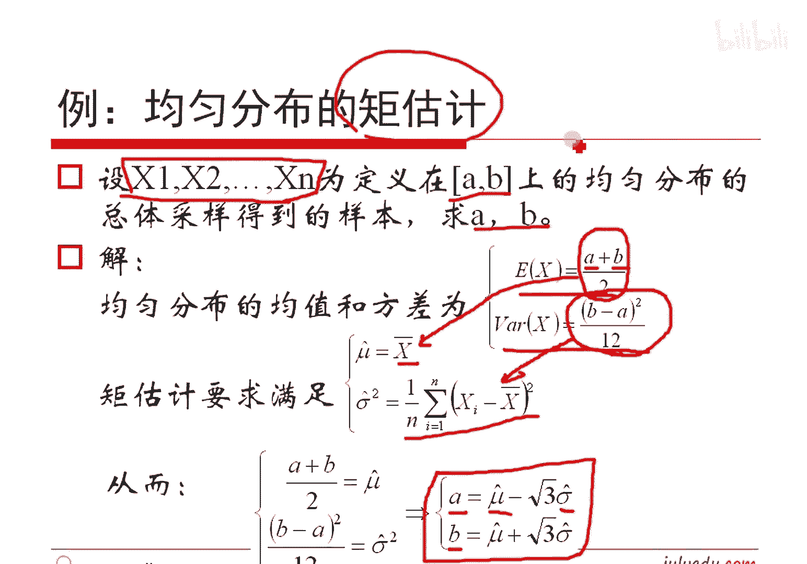

# 人工智能—机器学习中的数学（七月在线出品） - P6：矩估计 - 七月在线-julyedu - BV1Vo4y1o7t1

🎼。我们下面呢看一点点这个呃样本的统计量。我们这么来想这个事情哈，就说呃假定这个X1X2的XN是一组样本。那这样子我们给定了这些数这么些值，我们就可以把这些值拿出来除以N，我记作这些值的均值。

这这种可以吧，平均数嘛，对吧？然后呢，如果把这个XI减去它的这个均值平方之后加起来除以N减一，我们把它叫做它的方差，注意哈。咱这个里面说的这个东西是样本的统计量。刚才说的那些东西是关于总体的。

就是给你的一个概率分布率，给你的一个概率分概率密度函数，让你去算它的期望是什么。咱这个里面说的是你给了若干个样本，你来算它的统计量，算它的均值啊、方差啊等等等等东西哈，这是。

这个概念别大别换一个是总体的，一个是样本的哈。这里边呢多说一句，大家呢其实我们除以N减1。一般而言是为了保证是无偏的，而不是除的N，对吧？呃，另外呢大家想想什么叫无偏呢？无篇又如何证明呢？

咱们这个作为一个思考题哈，大家可以想想如何去做好。这是关于均职和方。但实践里面哈但实践里面真的有些出恩的哈。就是虽然教科书上我们定义是除以N减1哈，但是我们实践当中除以N没关系哈。😊。

就是实践当中真的是有除N的，并且是有理论依据的。除N不是这个没道理的。对吧。这个哈。呃。O有那个NNDDDL提到了一个概念叫自由度哈，这个分置概念非常重要哈。

就是说是不是说就是说这个大家可以用自由度的那个概念去理解一下这个方差哈。这个可以怎么来解释呃，咱不说了哈，大家知道就好哈。那那个就是用自由度来去说这个事情哈。😊，呃。

另外呢就是我们仿照着对总体的那个举这么一个东西的定义哈。我们现在说一下对于样本如何求这个东西哈。比如说样本这个值乘以K4幂加起来除以N。哎，我们把它叫做样本的原点距。

样本的值减去它的这个均值乘以K4幂除以N，我们把它叫做样本的中心距。可以吧，因此。一级。原点距就是样本的均值。一二阶的样本的中心距几乎就是样本的方差。如果除N减一的话，就是方差。如果是除以N的话。

我有时把它叫做伪方差哈。我不知道这个字应该怎么叫哈，我大概体量把它叫做伪方差哈。这么一个东西哈。嗯。然后呢，我们现在就要说一点事儿了。因为我们刚才给定了最开始哈一个总体，我们可以算它的局。

就是你给你的概率分布率，概率或者概率密度函数能够求它的举。抽样得到若干样本也能够算一个局。他们二者之间有什么关系呢？比如说我们可以换一个说法，就是假设说我们总体服从某一个参数为西塔的分布。注意哈。

比如说这个西塔的意思是一个虚拟的啊，你比方说呃高斯分布，这个西塔就代表的是缪欧和西igma。如果是这个poom分布，这个西塔就代表是个lammbda。如果是均匀分布，这个西塔就代表是那个A和那个B。

就是这个C的是个位置，是个是个虚拟的一个记号而已哈。大家知道代表的是我的一些要估计的参数就好了哈。这个参数呢我们讲定是这么想，认为这个参数它是客观存在的。但是呢它又是未知的，它可能是某一些值。

比如说postal分布，它可能是以某些向量。比如说它就是高速分布，它其实是代表俩值，它是均匀分布代表俩值，所以它有可能是个向量，对吧？这是我们对西塔这个东西的认识哈，对不对？好了，呃。

对大家那个听后面内容哈。这个咱的内容是呃这块很重要哈。然后呢，我们既然有这么个说法了，从总体中我们其实得到了一组样本X1X2的XN，是不是？问题来了，我们能不能用这些样本来去估计这个参数呢？

这个参数C料是不知道想知道的东西是吧？就这么西塔。首先我们做一个假定，假定样本是独立同分布的。第一哈样本都是取自于同样的总体，所以它们是同分布的，这个没问题。我们假定我们取的样本是独立的。

这是假定出来的哈，这个真的是没有任何的依据哈。我们假定这些样本是没有关系的，是独立的对吧？是独立成分部的。😊，以这个前提我们来研究一下，通过我们X1X2的XN来去如何去算。我们想想哈。给你了这N个样本。

我们就可以利用刚才我们这个样本的举这么一个概念，能够非常方便的求出它的原点距和中心矩，对吧？不管是原点有中你都能求出来，对吧？能够算出来的K阶距都能算出来，这就是K个数啊。这是竖式我们能算出来已知的了。

对不对？然后呢。总样本的这个K阶矩，我们让它去等于总体的那个K阶局，可以吧？因为总体的一阶矩就是关于西塔的一个方程。二阶总体的二阶矩就是关于西塔的一个方程。三阶矩就是关西塔的方程。假定你有N个未知数。

我就给你列N个方程。我就给你解这个方程，不就能求出这些参数吗？当然如果只有坡层分布这种情况啊，我列一个方程就够了。对不对？分子分就我列一个方程就够。但是我如果是高斯分布，我或许需要列两个。

如果是均匀分布呢，我或许需要列两个，对不对？这是我们能猜到的，利用的就是这个举这么一个概念，对吧？这个内容就是举估计。用举来去估计它是个什么东西哈。他的思路非常简单，就是假定说我们总体它的这个期望是U。

它的方差是西igma方。注意哈，这个缪和西igma是未知的，我们带求的。我们想求这个缪，想求西igma哈。利用我们的原点举的公式。那么说呃期望就是一阶原点举。而。😊，平方的期望，这是二阶原点举，对不对？

根据我们方差的定义，方差加上期望的平方不就是二阶原点举嘛，对不对？因此是这个东西，它其实是sigma方，加上缪方。这个缪和这个西igma其实是未知的，反正写出俩式子来了。

我们根据总体的样本能够算这个式子，A一把它加起来除N，把它平方加起来除N，这是A1和A2。这个A一是一个数，我们能算出来的。A2是个数能算出来的。我们让这个缪一等于A1。

让这个缪西格ma方加上缪二的方等于A2，这就能够连立出来一个关于缪和西igma的一个。2元的二次的方程。不管如何，我们能够求出里面的这个参数缪和西igma来，对不对啊？

因此我们能求出这个缪和sigma方。各自是等于这个和这个这个简单的那个做一个变化，就能算到它了哈，非常简单，咱不管了哈。我发现没有这个值其实是我们通过我们的实际的东西能算的。

这个值是我们通过样本能算的这不就是求出了总体的期望跟方差吗？这个东西是我们估计的对吧？估计的东西哈，我们习惯上加一个hch。得到了这样一个结论，这个就是取估计的最终结。简单吧。只要是举估计的这个东西。

我们就用样本的。方差而样本的均值去作为总体的均值。用样本的伪方差作为总体的方差就好了，这就是举估计的结论。不管任何一个分布都是这么做的。清楚了吧？并不难，对不对？😊，所以咱这段很重要哈，是吧？😊。

好了呃，举了意义上刚才已经讲过了，对吧？好了。😊，这是我们做参数的求解啊，这样参数不就求出来了吗？好了。😊，比如说大家说啊我如果说啊给你了一个正态分布的若干个样本给你了N个。

这里边是N1X1X2的XN这是给定你了哈。然后让你算一下这个正态分布它的均值和方差。那太简单了，直接带结论就是了。😡，对吧结论刚刚给我们算出来，利用这个样本，利用这个样本就能算出来各自的它的均值跟方差。

对不对？大家看到没有？除以N。是有意义的。我们用的其实是算的样本的伪方差来去代替了总体的方差。虽然这种方差估计值按照我们的这个原理而言，其实一般而言是偏小的。对吧。一般而言是偏小，但是呢。反正能够解释。

用举估界结论，我们上这些东西。既然我们能够承认这个给定了原，给定了这个样本的矩，给定了这个呃总体的矩，我们让它相等，都是原理都是可以，都是每一步都是有道理的。最终的结论就是道理的，我们只能承认他。对吧。

😊，我们采样的这些值只有一个要求，就是他们是独立的。独立采出来就可以，对吧？因为他们采出来属于同样一个总体，一定是同分布的。好了，我们再给个例子哈，比如说均匀分布呢。X1X2的XN他们是定在A到B上的。

我采出来了，你如何估计A到B呀？OK根据我们的这个均匀分布的特点，均匀分布的期望和方差是等于这个值。这是我们第一次课跟才讲过的对吧？那么说我们让第一个这个数等于这个东西。

让第二个这个方差这个数等于这个东西可以吧？因为这个数这个数能算出来的。那我们总能解出这个A解出这个B来，解完A等于这个B等于这个这个m hat sigma hat，就是我们求出来的，根据样本求出来的。

样本的。这个均值跟样本的伪方差。这样就有意义了吧，就是给你了一个N个数。你想看这N个数到底它是由哪一段进行产生出来的一种解法就是这么求。是不是？😊，这是有意义的。

缪方减去根号3倍的方差而标准差嗯缪 hat加上根号三的标准差。我们认为它是从这儿均匀采样出来的，原理就是取估计。对吧。好啦，这是关于均分布的这个事情哈。

