# 人工智能—机器学习中的数学（七月在线出品） - P8：偏度和峰度 - 七月在线-julyedu - BV1Vo4y1o7t1

🎼。

嗯，好的哈。😊，这么概念哈，就是说这个随机变量X哈，如果我们把X的K次幂把它拿出来，然后对它求期望。这个东西我们定义把它叫做K阶的原点距。如果说这个X减去了它的期望，再做K阶的这个就不是原点距了。

那就是一个中心距。如果这个等于零，这不原点嘛，然后减去某一个值减去个中心嘛，减去它期望嘛，把了叫是中心距。所以有一个K阶原点距和K阶的中心距。这么一个概念哈，我其实它是有来源于这个物理学。然后呢。

这个就是那个真的那个例句那个句哈，然后咱不再去过分的去探讨它的那个原因。我们这里面呢会利用这个句跟大家说一点统计量的事情，做一点总结。我们会发现。

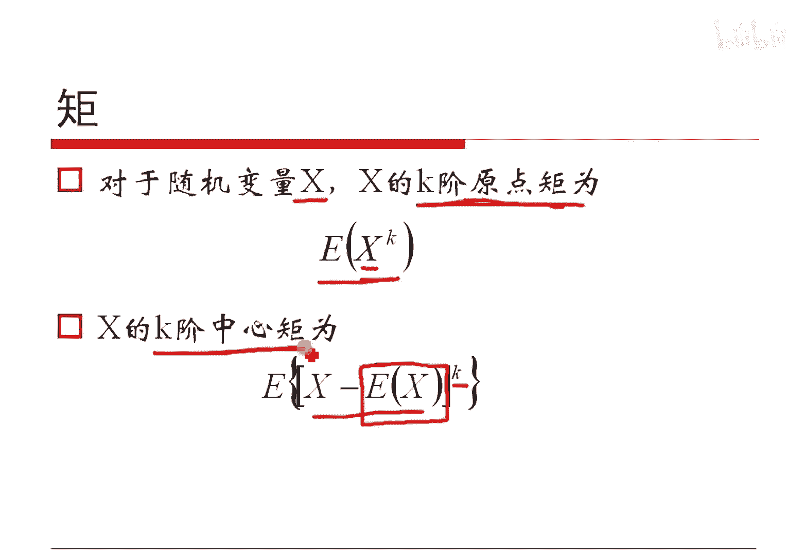

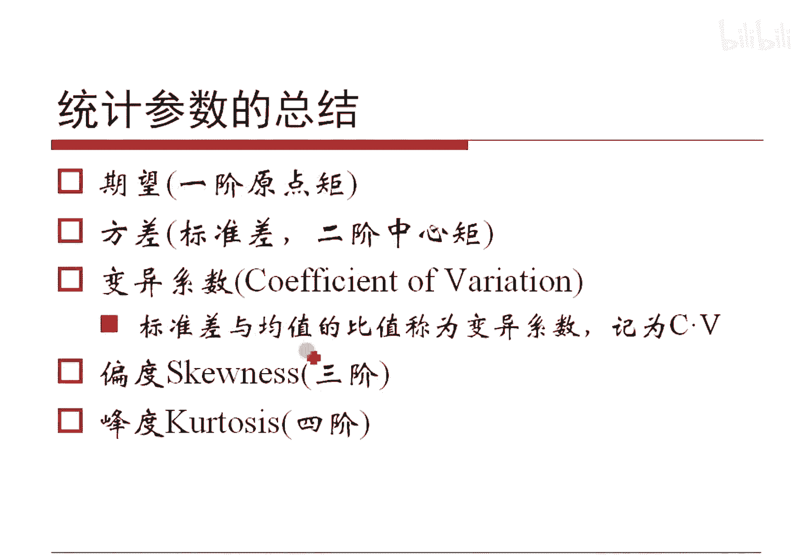

期望其实就是K取一的时候的一阶原点距。方差就是K取二的时候的二阶中心距。

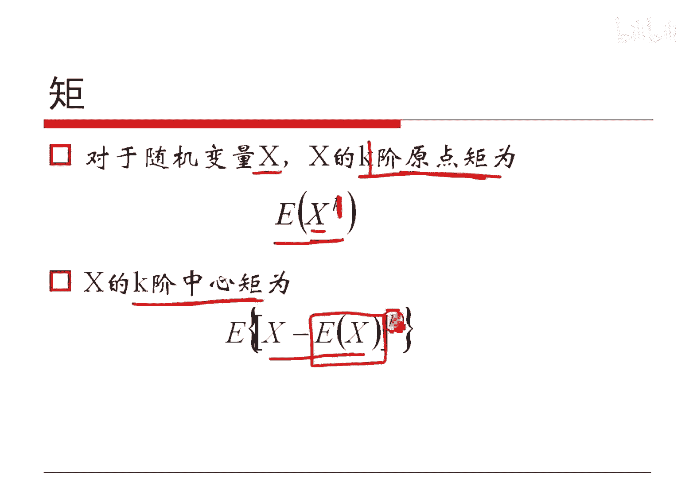

对吧所以我们刚才给定的其实是一阶跟二阶的一些距。它的一些参数对吧？统计参数而已。我们刚才如果是用标准差去除均值，其实也是一个统计量。有时候把它叫做变异系数或者叫变差系数或者一个词哈。

有人把它叫简称叫CV，大家了解就好哈。呃，有些学科中是用的，有些用的不多哈。我们其实可能做更高阶的东西。比如说做三阶的统计量，它呢会产生一个概念叫偏度。做四阶的产生个概念叫做风度。

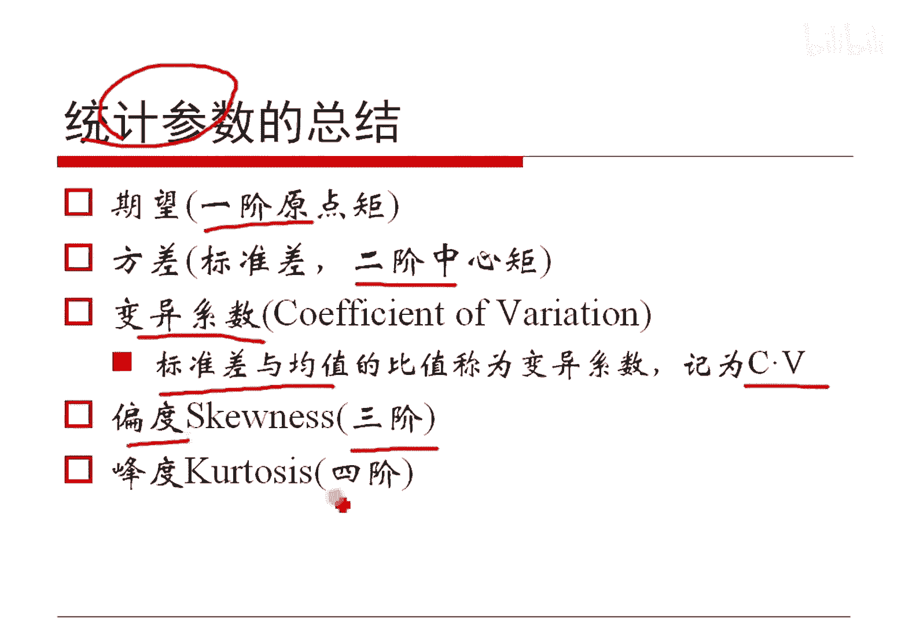

那这样子就会产生这样子的一个概念哈，它是用来衡量它是否有偏无篇的ok哈。偏度从名上看就知道哈，他其实是想判断一下这个随机变量它的不对称性，对吧？也就是什么叫不对称性啊？是相对于平均值而言，它的不对称性。

所以偏度有可能为正，有可能为负。或者无定义哈，比方说如果偏度为负这个意思，它指的是这个概率密度，这个值啊，比方说这这是负偏的对吧？那么说均值大概在这儿，对吧？假定在这儿哈。

它呃负偏就相当于它的这个尾巴偏左了，对吧？这个长尾这块在左边这个最高的这个在右边了，就它那个像在在左边它是长尾分布多的，如果是这种情况的话，均值大概在这儿，对吧？那这样的话。

它的这个在右边这部分长尾是多的，所以它就是叫呃右偏或者叫正偏是这么一个定义哈。然后呢，另外如果它的偏度为零，那就意味着这个正好是正中间的这样情况哈，或者是这样情况，或者是这样的这个情况啊。

有这样的这个情况，对吧？但是呢呃大体上是均匀分布在均值两侧的，并不意味着一定是对称的，只能说大体上是对称的，从中间看的话是对称的对吧？😊，是这么一个概念哈。😊，偏度跟无偏估计是两码事哈，这个是没有没有。

我们可以认为是没有关系的哈。呃，偏度的公式其实可以怎么想呢？大家可以琢磨一下哈。你看哈我们要想定义偏度的话，比方说均期望在这儿，假定说哈期望在这儿，那么说对于这个同样的一个我们选一个点哈。

比方说这个距离上一个距离这个选一个距离对吧？那这样的话，这个距离上这个值概率值是这么大，这个点上它的这个概率值是这么大，对吧？那这样子乘完之后，其实值是不一样的，因为它都一样，对吧？那这样子的话。

我们如果是选择同样概率的某两个值的时候，一个在这儿一个在这儿，那么说一个其实距离它很近，一个距离它其实很远，我们让远的更远，把近的更近，因此把它那个维度把它给高上去，比如说做成三次的。

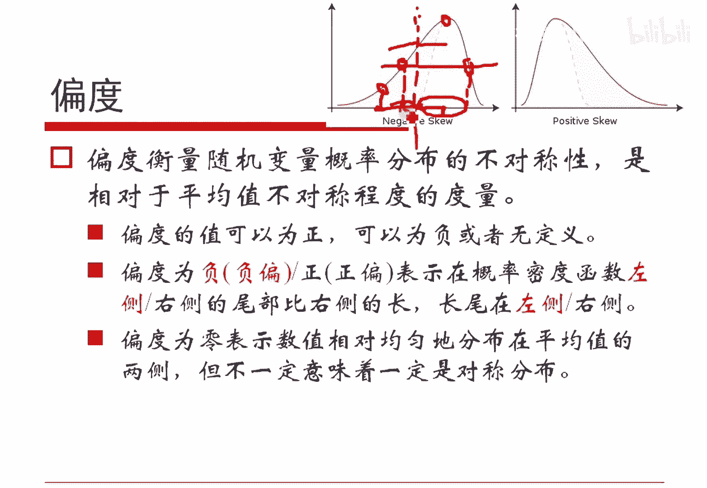

这样子就能够来度量偏度。就这个东西哈，然后呢呃为了保证他是呃。量刚是唯一的，或者叫叫单位是没有的对吧？我们把那个单位去除掉它。那么说上边除的是个三次幂，底下也除3次幂，对吧？

西格玛本身它其实本质上我们可以看的是西格玛平方的2分之3次方。上面这个其实是一个这个三阶统计量，底下是一个平方的1。5次方，对吧？这个方差的1。5次方，这样子就能够来记度量它的偏度了。

另外呢我们通过这个东西可以简单的来算一下，它可以写成它它呢应该写成它其实我们在实践里面可以用它这个公式来去算偏度。为什么这么算呢？因为这样子的话，这个X3次方可以一下子算出来X的平方可以。

F平方一下子算出来之后呢，我们就能一下子算出来一个斐玛平方。这样的话呢代码显得好看一点，没别的意思哈。你如果分开算一其是一样的，用它其实更好看一点而已哈，就是偏度。

我们再来想一下哈，就是说如果我们把那个接数再高上去的话，其实能够度量它是尖儿尖的情况，这样子呢就可以度量它的风度。这个风意思就是这个风哈，它指的是在均值处的这个。他的这个概率值的高低的一种特征。

我们往往在实践层面哈是用四阶的这个中心距，它既然是四阶的。那么说我们底下除以方差的平方来度量它。这是这样说哈，实际上你可以用六阶的，你可以用八阶的，总之就是一个偶数级的就够了哈。

它一定是度量了它的这个呃陡峭程度。但是呢我们实践我们那个教科书上，或者是我们在实践的时候，我们就说四阶好了哈，四阶的一个中心句，来去度量这个事情哈。然后得到的这个东西我们记做一个值就好了哈。

另外呢就是说正态分布这么特殊的一种分布哈，它的风度是3，所以我们强制减一个三，让正态分布它的风度为零，就这意思。如果是正的，我们有一个尖峰的负的叫低峰的哈。但是我们简单的做一个小实验。

肯定要说一下到底怎么回事哈。

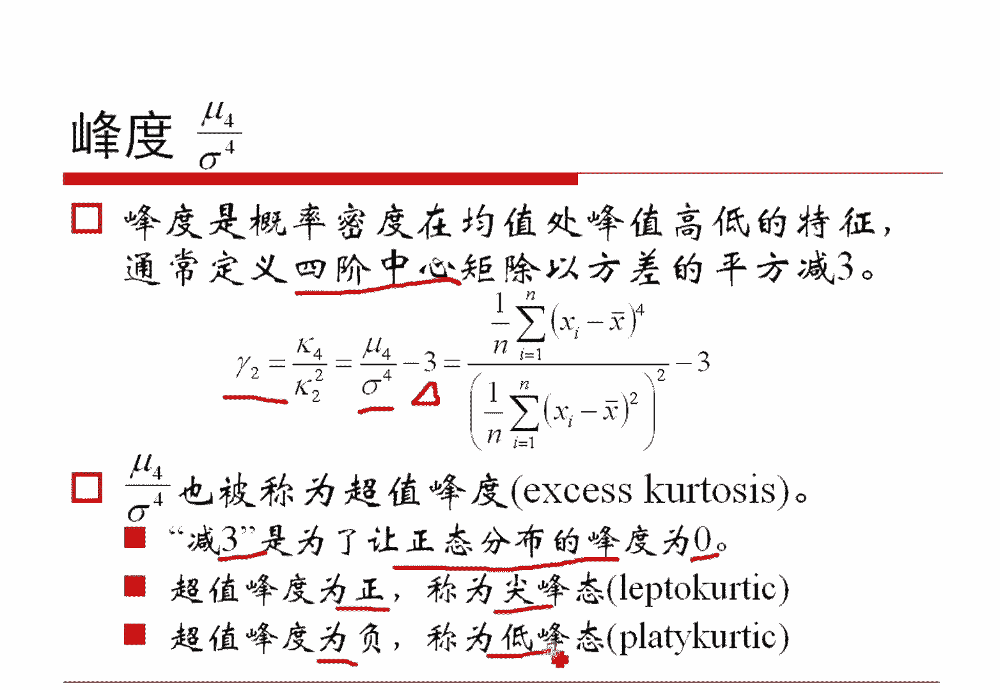

呃，这是一个很简单一个例子吧，就是说我这里面的这个随机的去给定了若干个data。然后呢，这个data怎么做呢？我算一下他的这个均值，它的平方的。期望以它的那个3次方的期望好，很好算嘛，对吧？

加起来或者平方加起来或者3次方加起来，各自除以N，对吧？s格ma其实是等于缪那个7万的平方减去平方的期望，对吧？开方之后就是那个它的标准差，我们就会把这个缪西igma和缪三返回去，返回缪3之后怎么办？

是要干啥呢？我。这个还是调用它哈呃，画太高了哈，就是这个是调用它的哈。然后返回这三个值，然后呢，我这里面又做了一个Mu4Mu4之后呢，除以N，然后带入这个风度跟偏度的公式。我来算一下这个值是什么。

这只是一个做法哈，我们现在要做的是到底它。

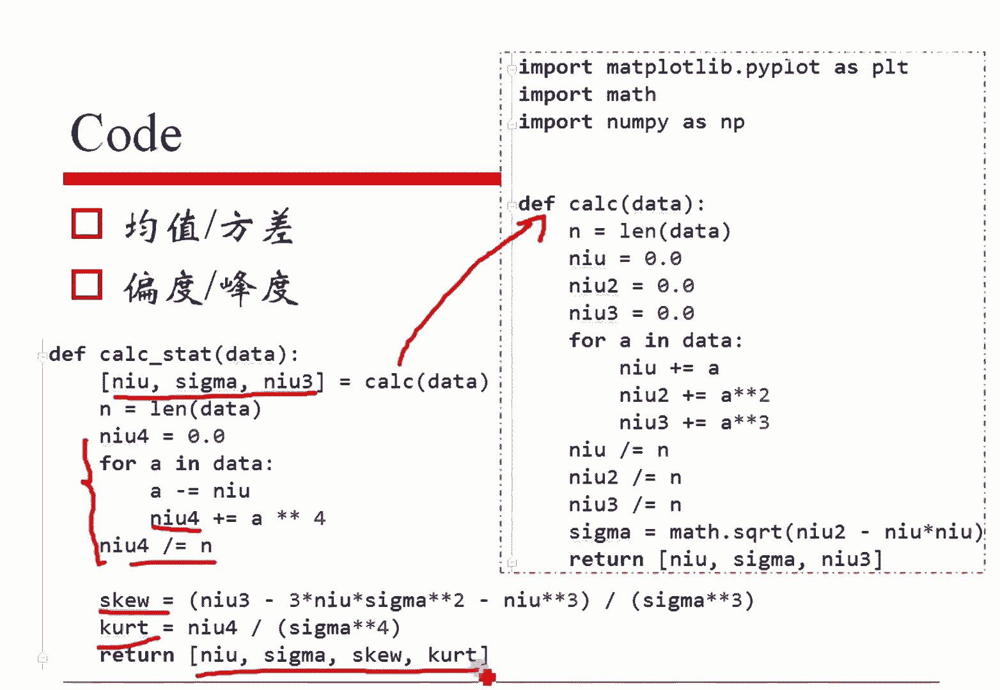

不同的数据会有什么样的现象？对吧。呃，这个可能是大家更为关心的问题，对不对？就是说我们造一些数据出来，看看它到底结论是什么哈。你比如说我们造一个这个。均匀分布对吧？它取1万个点，我们造一个data。

造一个均匀分布。然后呢，我们也造一个呃这个。呃呃抱歉抱歉抱歉抱歉，那个我们那第一个造的是一个那个高斯分布哈。然后第二个我们造一个分布之后乘以2，它的方差就变大了嘛。然后呢。

第三个我们让这个呃原始这个标准标准高斯分布里面，这个值哈，值取X大于0。5的-0。5的那一部分把它放到data三里面去取一半去多半多一半的部分哈，然后我们故意的然后呢，我们第四个取一个均匀分布。

从0到4的一个均匀分布。然后呢，我们分别算一下data1234各自的起万方差各种东西，然后画成图来，对吧？就这意思哈，我们来分别看一下它到底发生什么哈。这个图其实是一样的哈。这个图其实就是这个图哈。

大家会发现哈，如果说对于这种情况，就是红色的这个这个红色的这个红色的都是标准高斯分布，是跟大家做一个参参照的，参考的它是一个这这。😊。

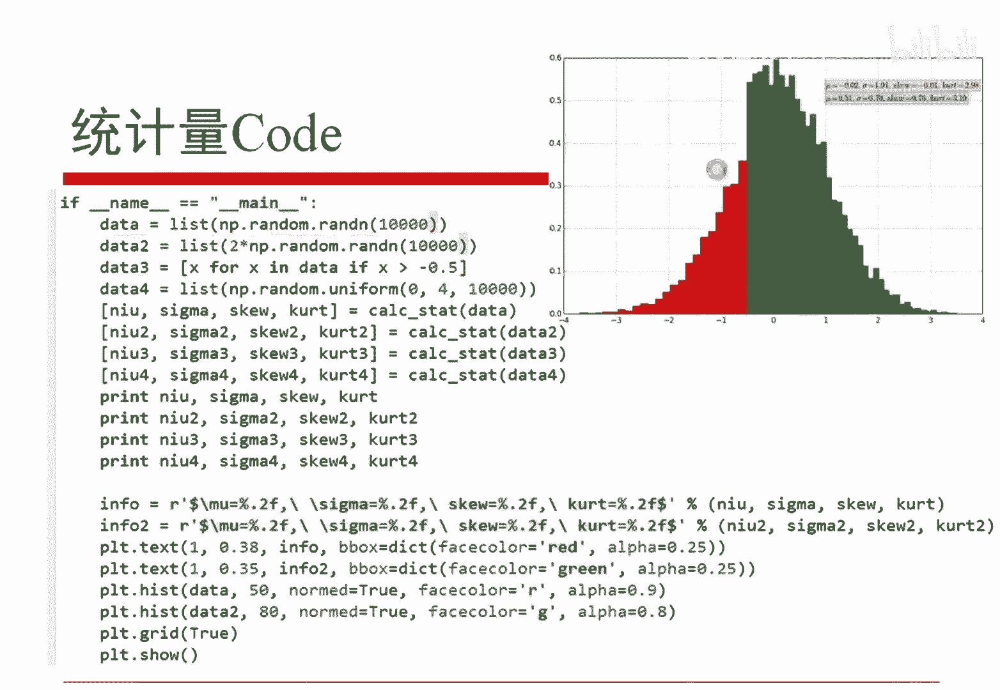

这个红色这个红色这个红色其实是一样的哈，只是它比例尺不一样。数据不一样，都是这个值行都是一样的哈。我们我们都去。把它看的一样哈。

然后呢呃这里边如果我们对刚才那个式子里面第一个这个data本身的时候乘了一个二，得到一个data2，对吧？把这个data二画上去的话是。

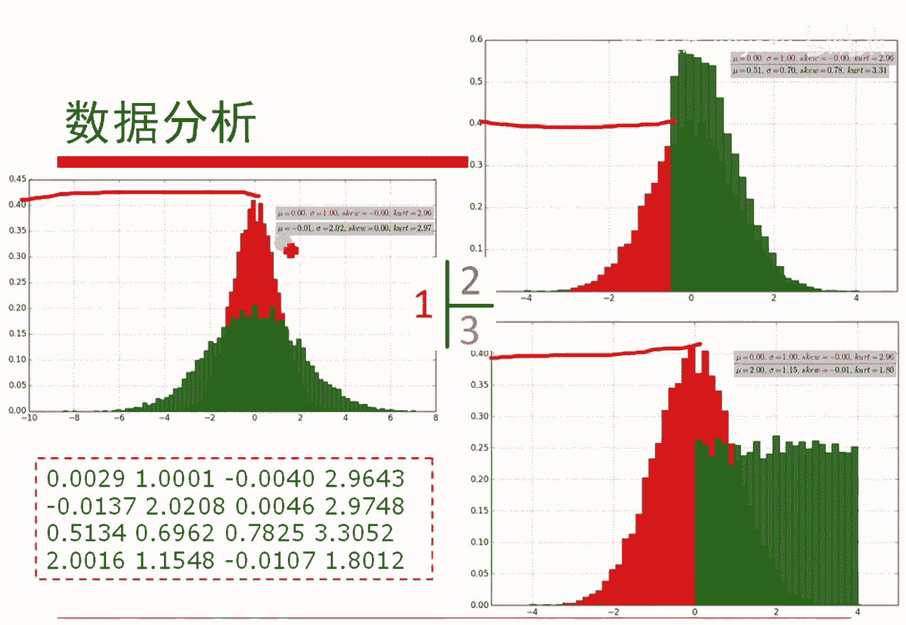

呃，这个绿色的这个这这个这个这个数据，绿色数据啊注意哈，我乘以2之后画这个直方图是绿色数据。因为为什么呀？比方这个值本身在这儿乘以2它上去了嘛，所以它变胖了。对吧直观上的眼感觉就他变胖了，对吧？

所以说它这个里边只是方差本来是一变成了方差是2，就是这个整我大家看不清，这个是方差本来方差是一，方差是一。然后后来方差是2了。这个2。02，只是因为这个我们取的数据它会有一点点的这个呃。

这个这个精度问题对吧？因为它不是真正取得最最正的嘛，它一定会有一个误差，对吧？这个咱不管了，大约就是2，它的均值大约都是零的对吧？然后呢，它的偏度都是0，它的风度都是3。对吧。没错吧，这是这个事情哈。

然后这是第一个。嗯，然后呢。嗯。哦，不那个这个是哦，对对对对对，那个标准差是2哈标准差是2。我出来我出我输出是标准差哈。然后呢，我们这里边如果是对于这种情况，就是把da塔三这个值拿出来。

我们只去选择了0-0。5以右的部分的时候。那这样的话，其实本来这个红色部分它的这个比较疏松。但是我们只选一部分的时候，其实相当于它更加稍微的比红色的更加紧密一点了，对不对？那这样的话。

本来它的方差是一的对吧？那么说只选正向这一部分的时候，它的方差就标准差就是0。7左右了，0。6962，对吧？所以它因为比较比较密了嘛，对吧？这是一个情况，然后呢。

它的这个呃本来大家看红色的这个从这儿到上红色是这样一个陡峭程度，如果是我们只选0。负联量5以右的部分的时候，它的陡峭程度就变大了，它的这个风度就变大了。对吧然后呢它变大以后呢，它的偏度呃也变得更大了。

因为本来它的偏度是正常的3。现在呢如果是我减三之后啊，其实这个值是0。3左右，它是一个正偏的对吧？因为它的长尾在右侧嘛，这是跟我们刚才解释是一样的。对吧然后我们看这种情况。

如果是我们给定一个均匀分布和标准的高斯分布做我们的这个数据分析的话，那么说它的这个标准的这个均匀分布，它是有一个方差的对吧？这个本来我是用0到4起的嘛，大家简单算这个方差就好了哈。

是12分之1倍的四的平方。对吧反正是这个数哈，是是实际算上来是这个数，对吧？然后呢。😊，呃，对于标准的这种均匀分布而而言哈，对他而言，我们把它从期望处截开，左边跟右边几乎是对称的。对吧那个他。

他的这个从前向后，它的这个变化情况几乎是没有陡峭的对吧？所以说他的这个。呃，抱歉啊，就是先说第一个，就是它几乎是是相等的。所以说对于他的这个。呃，偏度而言，它是等于等于0。因为我画个竖线。

从左到右左边右边几乎是一样的对吧？而这个我如果是画一个。

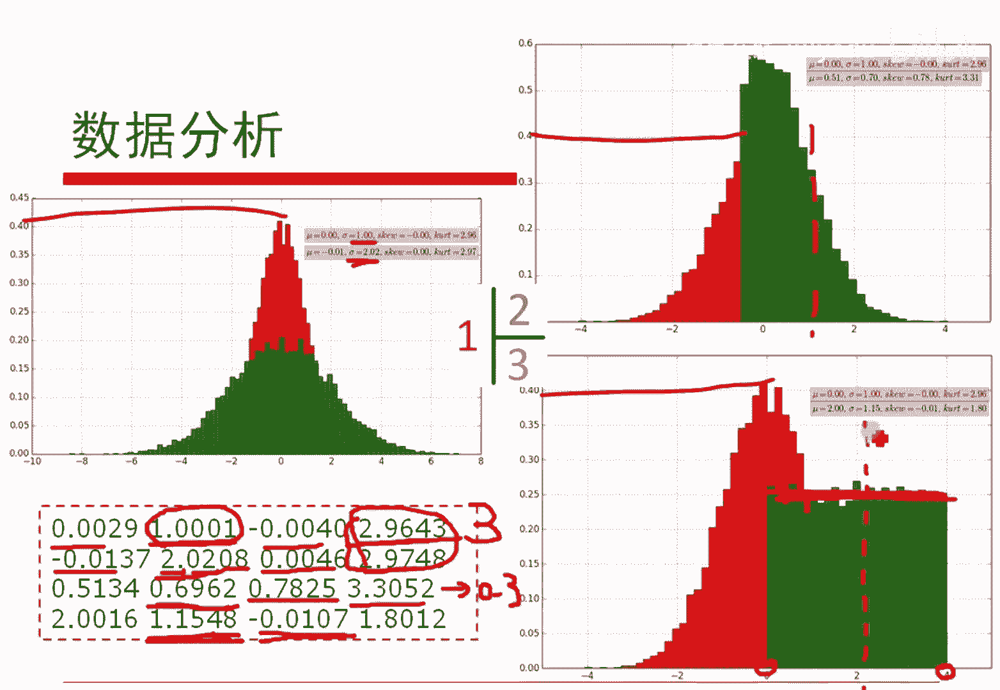

呃，看它的这个风度的话，这样子的一个风度，其实是正常的一种风度，对吧？我们说它是正常的数是三嘛，那你这样子的一个风度可比它要缓多了。所以这种风度要比它低很多，这个是实际算的我这个数据上是1。8。

如果咱算标准风度的话，我们要减去3，所以就是负的1。2，相当于它是负风度的，它达不到标准正态分布的那个风度。对吧。😡，这一页是咱刚才讲的那个东西的重点哈，如何对数据进行分析？对吧。

另外呢就是咱解释一下哈。风度绝对不是表征一个数据陡峭程度的唯一的物理量。比如说方差也能做这样的度量，因为方差是二阶的吧，风度是四阶的吧，都是偶数阶的吧，是不是偶数阶的东西大体上都能反映它变化快慢。

反映它的这个峰值的变化，奇数阶的大体都能反应它的偏度，它是左偏还右偏，还是往中间。对吧我们可以这么来去进一步的推广这么一个统计量哈。所以我们脑脑海中不要只限制于期望跟方差这两个啊。

虽然这个方偏度跟风度大家。就是教科书上谈的少。但是起码应该了解哈，对吧？呃，多说一句哈。你比方说红色的跟这个绿色的，它们的很显然哈，这个方差不一样，底下这个绿色的方差要大一些嘛，对吧？

但是它们的风度是一样的。对吧他的风度都是三哈，风度都是三，都是一样的哈。所以风度不是你从风度上不能够直接知道这个数据是陡还是缓。所以它是有局限性的哈，所以我们要把这个数据都拿出来一块来分析才有道理哈。

好了，这是关于这个事情哈呃有问题吗？😊，我想这样解释，应该把这个事情我我我个人觉得是解释清楚了哈。风度本来体现的就是它的陡峭程度。但是我解释过了，就是。它只是陡峭程度的一个反应而已。

比如说这个数据红色的跟这个绿色的，它的风度都是3。但绝对不是这个呃。辐收风度一样，所以它陡峭程度是一样哈，这是不对的哈，对吧？😊。

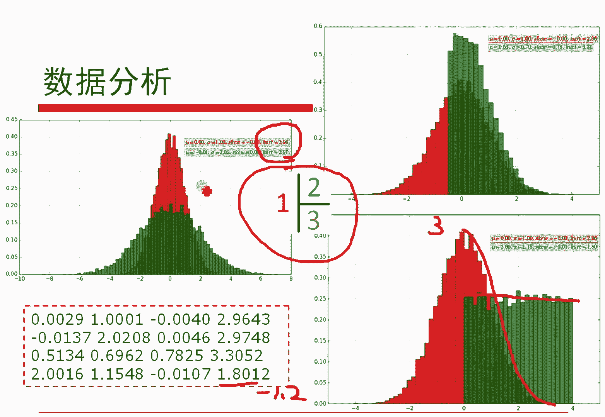

好了哈，这是关于这个事情哈，大家这个代码很简单，大家可以自己把它编出来，自己试一下就好了哈，对吧？好简单的一个事情哈。😊。

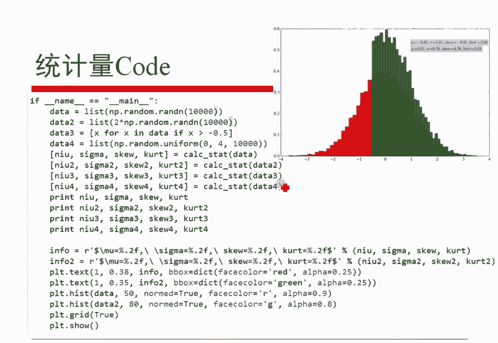

呃，另外就是实际上呢我以前做过一些就是。硕博期间的一些软件哈，然后我里边其实也做过一些这种统计，然后为了这个东西做事情哈，这个无所谓了。就是跟大家告诉大家，实践层面也是有些时候需要。做这个事情的哈。

这是这个内容哈。嗯，另外呢我们现在跟大家说两个问题。第一个就是如果给你两个随机变量X跟Y，你能够度量这两个随机变量的距离吗？对吧大家可以想这个问题怎么做。第二个就是我如果给定你两个随机变一个随机变的X。

它的期望是缪方差是sigma方。然后我们如果给你任何一个整数一il，我算一下这么一个概率的最小值。这么一个事情哈。好，刚才那个吉米给我们一个非常好的一个结论哈。

就是说我们如果想度量两个随机变量X跟Y他们的距离，皮亚逊相关系数肯定是其中一个非常重要的概念。实践当中真的有些地方是用像性性关系术的哈。呃，真的是用的哈。大家。😊，还能够想想其他的一些定义吗？是的。

肯定是有别的东西，对不对？比如说刚才这个朱延庆说了这个互信息，互信息呢有些时候呢度量比方说X是我们的样本，Y是我们的标记的话就有用。刚才小静谈到了呃台台东以东谈到了余弦相似度。

余弦相似度和PR逊相关系数，他们之间。有非常大的联系，大家可以先琢磨琢磨。非常大的联想啊是几乎就是一个东西。其实。然后这个小静谈到了K尔散度，K尔散度跟胡信熙他们之间又是有相关有非常大的联系的。

然后jacker的相似度其实是用来度量集合的对吧？OK哈，我们大家还谈到了这个欧式距离马氏距离和JP小的距离，其实我们都可以把它统一，然后在。序例那部分哈再跟大家来分享。各种各样的度量相似度的情况啊。

大家说的非常漂亮啊。好，我们现在呢把重点发的第二个问题上。就是我算一下这个X减谬的绝对值小一匹种，它的这个概率的最小值到底是什么？他其实就是算一下他的期望附近的概率啊，对吧？

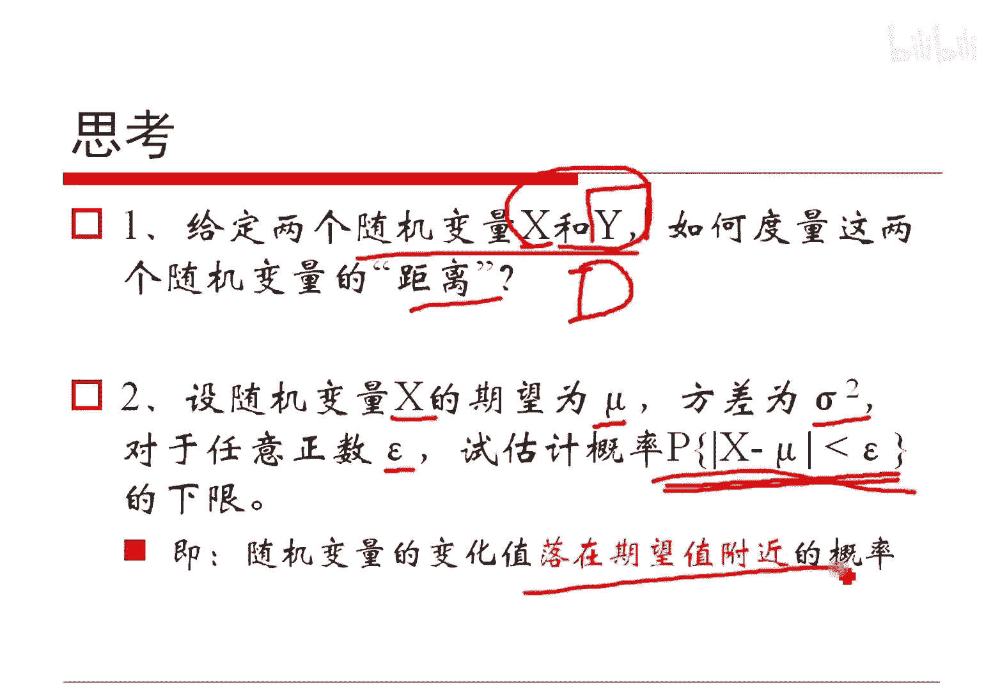

我们来总磨琢磨哈，根据定义X减谬大于等于一系统，那不就是在这个定义域上去对这个东西做积分嘛，对吧？那既然这是做这个东西做积分，那么说X减缪是比一部系统大的。

因此X减缪的平方除以一普系统是大于一的乘以一个值总可以吧，那我把这个一分平方拿出来总可以吧，对吧？然后呢，这里边是对X减缪的大于等一系统做积分，我如果对整个实物域做积分也可以吧。

所以这样的话就是小于等于喽。而这个就是方差的定义是吧？所以说这样子它是小于等于这个东西的。对不对？所以它它要是小于等于的话，就是大于等于它的这个就是它给定一个正数X位于期望附近的最小值。

这其实说明了什么呢？说明了。如果你的这个方差越小的话，这个值是越大的，对不对？那就意味着你这个X这个随机变量距离你的。期望是更近的，离期望不会那么的远。如果Cma比较大的时候，你距离这个期望会略大一点。

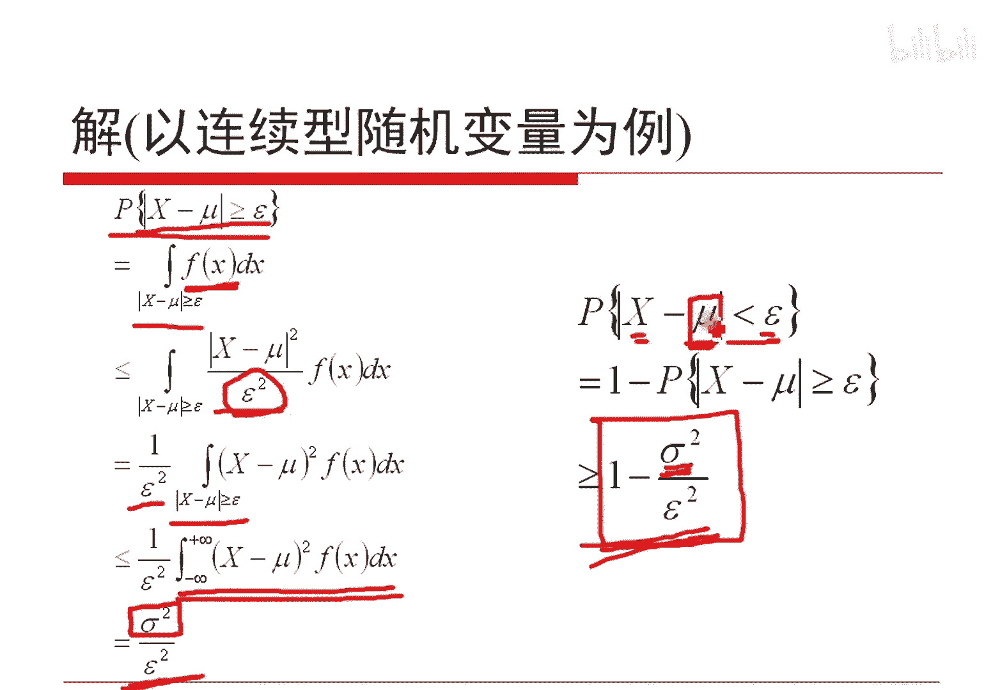

是吧其实这个东西就是我们今天要说的切比写负不等式。对吧这个东西其实呃它给出的就是方差的实际的物理意义。就是X它的方差越小的话，这么一个事件它的概率越大。这个事件什么意思？这个事件指的是X取值。

集中在期望附近的概率。对不对啊？就是说你方差越小，这个X越集中在期望附近。我们从一个严格的一个不等式上做了一个证明。

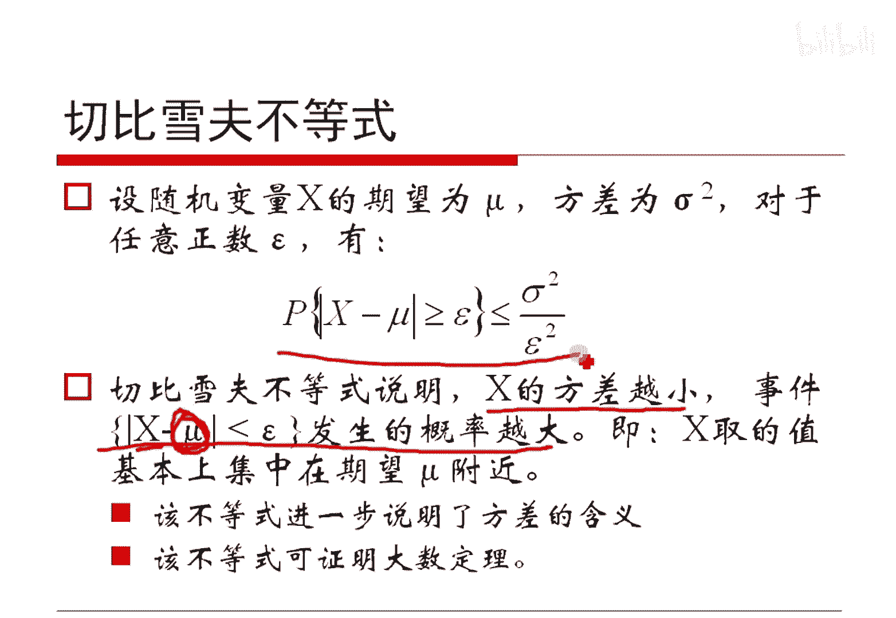