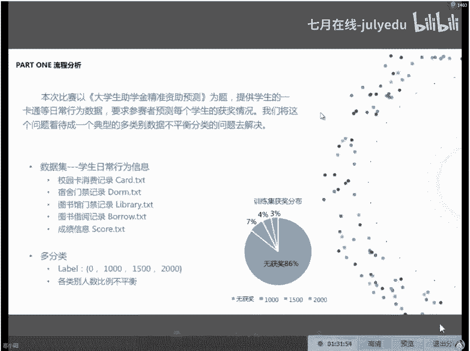

# 人工智能—机器学习公开课（七月在线出品） - P10：机器学习完成数据科学比赛案例精讲 - 七月在线-julyedu - BV1W5411n7fg

好好好，我们做一个小小的分享啊。所以今天这个分享呢是一个唉大家最近大家前前段时间看到新闻了吗，对吧？新闻里面在说好像是中中科大最早用这个思想去。😊，完成这个大学生的一个助学金的一个发放。

但是用的不是咱们今天这个方法啊，用的不是咱们今天这个方法。😡，他这是一个基于大数据的方法，大家就是统计一下你每顿饭花多少钱在食堂里面。如果这个。花的钱比较少的话。

然后你你可能每一顿饭如果都在4块钱以下啊，比如说男生在4块钱以下，有可能这个东西就是一个。贫困的学生，对吧？当然这个东西本来要和这个要要和其他的一些东西去观联啊，要去取证一下。

万一某些这个二代们在食堂里面每次就又去要一瓶可乐，这也是很很尴尬的一个事情，对吧？所以啊那种方式呢还不是一个。😊，纯自动化的方式。我们还需要人工的去做一些介入。

那我今天给大家讲到了这个所谓的这个大学生助学金的这个精准资助的预测呢，是有这样一个愿景。大家有这样一个愿景。觉得说如果现在校园卡越来越发达了。校园卡越来越发达，所以你的所有的行为。

很多同学的如果是在校的同学啊会知道，现在有很多学校的这个所有的这个饭卡水卡或者其他的卡，在在我读书的那个时代，我们有非常多的卡，那现在我听说很多的学校都只是一张卡一卡通，对吧？

所有的东西都是用那一张卡可以完成，包括学校的超市，包括图书馆包括各种各样的数据都其实都记录在一张一张这个学生卡里。所以你的学生卡里面，基本上包括了你囊括了你这个人所有的轨迹，对吧？😊。

囊括了你这个人所有的一个生活的轨迹。那按照这个道理来说啊，我们既然你这里头涵盖了大量的轨迹，包括你进出宿舍，你去图书馆，你这个在食堂里是饭花了多少钱，你就超市里头买了什么东西。

那应该就知道可以知道你大概是什么样一个生活水准的一个人。OK所以其实应该我们就能从这个里面去做一些更加个性化的一些资这个地方的愿景啊，大学生助学金的一个精准的一个资助。所以这是因为这样的一个愿景。

大家可以看到这个地方，今天给大家讲的案例，就是这样的一个案例啊，这个是大家知道很多数据科学的比赛是企业和这些。数据科学的平台一起来发起这样比赛的吧。那这个地方是一个寻道科技OK所以大家认为在大数据时代。

我们有越来越多的数据，而且这些数据呢会被集中起来。所以我们说这个时代是一个没有隐私的时代。😊，你的所有的行为，所有的网上的任何的记录。实际上。伟大的国家要是啊伟大国家已经有了，所有大家的记录啊。

OK所以呃对大家要要要这个多为祖国做贡献啊，不要搞事情。OK所以这个地方有一个任务，就是说我们他他把这个场景缩小了一下。所以在大概在这样一个场景当中呢，我们会有。😊，OK在这样一个场景当中呢。

我们会有一些数据，但是数据量很小，是高效的一些相关的数据。然后大家在我那个时代啊，反正大家凭助学金的话，可能你要写各种各样的申请表，去跟这个呃导员、辅导员去和班主任去沟通，对吧？然后再去这个写申请表。

然后去去有一些论证啊，证明你这个加条比较贫困。然后最后去把这个助学金搞下来。OK那那现在既然大家的一卡通里头其实有实时的各种各样的数据的话，我们应该利用这个数据来做一个呃相应的更精准的一个预测嘛。

所以我。😊，这个时候呢就不存在说哪些同学对吧？我拿着助学金的钱去买一个iphone，对吧？然后那些真正需要这个助学金的那些人还在啃馒头。O所以这个地方的话。

大家可以看到数据呢是2014年2015年两年的这个助学金的情助学金的获取情况作为标签。当然这些作为标签的数据呢，实际上就是大家看到的，通过这个辅辅导员的一些交流啊。

然后根据辅导员对这个这些同学的一些认识啊之类的评出来的。当然是也会包括成绩在内。所以各种各样的因素，最终大家人工评评出来的。所以我们我们期待的事情是用这些东西就作为训练样本以后，我有没有办法从这些。😊。

人工通过大量的精力标注出来的这样的一些label上面去找到我的一卡通数据，到这个最后的这个label这个结果的一个映射，也就是我们学到的这个模型，这个模式嘛，对吧？我们希望去期待去找到这样的一个东西。

然后这个地方有相应的一些数据啊，大家可以看到，包括说消费的一些数据啊，图书馆的借阅的数据啊，寝室的门禁数据啊，图书馆的这个门禁数据啊，学生的排名啊等等啊，有这样的一些数据。

然后当然你的label就是之前我说的人工标注的一些label啊，就是说你的导员可能跟你去谈话，你的班主任跟你去谈话，然后你可能要从家里这个提供家里头的一些这个情况说明拉拉之前的任何的所有的这样的东西。

人工评拿评审出来的一些助学金的一些情况。然后用这个数据去。我们希望从这里头挖掘出来一些模式。那这个地方下面做一些小小的说明呢，我给大家这个把具体的这个说明写了一下。

就是说其实我们是利用2014年9月份到2015年9月份的数据预测这个学生在2015年的一个助学金的一个情况。OK然后这个是一个比赛，这是当之前的一个比赛。然后这个比赛呢其实是今年呃在之前刚刚结束啊。

在6月份刚答辩完的一个比赛。那这个比赛的复赛是在2月份切的数据。啊，数据描述呢就是如大家所示这个地方看到的这个数据的一个总览的一个情况，大概是分为两组啊，会有训练集和测试集。

每一组都是大概1万名左右的学生的一个记录，会包括刚才我们给大家说到的这个记录啊，大家都知道会有训练集和测试集嘛，所以所有的图书馆借入的数据，一卡通的数据，寝室的门禁的数据，图书馆的门禁的数据。

学生成绩的数据和这个助学金最后的一个获奖情况的数据呢，实际上都是已经给大家的那我们当然把这个东西已经分已经分成了训练集和测试集，对吧？😊，那去年级和测试集的学生呢，这个没有ID的交集，没有ID的交集。

对，因为。这个呃大家知道这个这个地方做过一些做过一些脱敏啊，所以没有学生的铭文的数据，只有学生的ID。有同学大家怎么进来，大家告诉他们一下，这个mac的同学看不到的。好吧，所以用手机用手机m克同学的话。

把手机的QQ升级到最高版本，用手机或者是换一个windows电脑。OK好吧，然后上这个进这个群视频啊，平板也看不了，好吧。😊，然后这个地方的数据的详细的说明呢，就是我们刚才有一些我们刚才。

我今天讲到的这个案例是我已经在交代背景了，好吗？我已经在交代背景了。这个案例就是一个用学生的助学金精准预测的一个案例。Whats。这个时候的数据的一个详细的描述，大家可以看得到。

图书馆的借阅的数据是这个borrow掉TXT里头，对吧？所以这个地方有所谓的训练集和测试集啊，他给以大家他很这个比赛很友善啊，所以他给大家给了一些提示，他提示大家说有一些图书的编号是缺失的。

所以字动字动描述和示例呢是下面这个样子啊。所以大家可以看到，其实你在。图书馆的这个一系列的记录在这个地方都会有，包括说这个学生的ID其实这个是大家熟知的这个CSV文件，对吧？我们用读到内存当中。

就是一个一会会有代码，一会会有代码。所以大家不用关心不用太担心。一会我会告诉大家从最简单的模型像逻辑回归这样的模型一直到我们会用GT会用会用和去预测。然后最后会有一个啊来用用去搭一个神经网络。

吧搭一个神经网络去完成这个然后我会再给大家去呃简单的分享一下第一名的这个方法，那当然这个方法是当然是这个不并不是我错的，我看到这个方法我觉得第一名团队做的非常棒。然后比第二名成绩要高非常多。

我觉得他有一些事情做工作做的非常的好，我觉得可以拿过来，大家一起去学习一下，非常值得我们一起去学习一下好。😊，所以这个地方大家看到的记录大概是这样的，每一行呢都会有这样的一些字段，学生的ID借阅的日期。

图书的名称和图书的编号啊，我们先脑洞一下这个事情啊，你想一想助学金发给助学金，发助学金的这些同学呢，当然本身贫困肯定是一个必要的条件。那另外一个条件肯定是说你还是愿意学习的对吧？

所以你在图书馆里头借一本武侠小说和你去借一个这个考研的书籍肯定是有差异的对吧？所以所以这个可能是一个一个纸呆的维度啊，我只是带大家脑洞一下，因为这种东西最后对最后的结果的预测一定是取决于特征。

那这些特征从哪里来和大家的实际的这个理解是有关系的。😊，那一卡通的数据呢是这个地方的这个card这个新点T啊，这说明会有很多card很多一卡通的这个数据。那具体的字字段的话。

大家也可以看到学生的ID消费的类型地消费的地点对吧？消费的方式消费的时间，消费的金额，剩余的金额，我在讲这个课的过程中呢，我希望大家能够对做这个分享过程中呢，大家可以对这个内容去提出一些问题。

如果其他东西有问题的话，大家可以跟班主任去交流一下好吗？跟班主任去交流一下。好，我我就说这么多。然后我接着说咱们的案例好吧，做的这个分享所以这个分享里头。

第二类数据是这个地方的一卡通数据一卡通数据的话会有字段的描述和事例。所以大家看到大家下面这个样子会学生的ID消费的类型，消费的地点，消费的方式消费的时间消费的金额，消费的剩余金额啊，这个地方很有意思啊。

我们在这份数据上去脑洞一下。你想一想这个事情啊，那剩余金额里头其实代表你有。😊，多少钱？那你消费的地点其实会有很多的地点。如果我可你去看，我做了一些小小的统计，会有很多的地点。

比如说食堂每个人都要吃饭吧，但我在食堂消费的金额会不一样，对吧？那有些人有些有一些这个二代们可能吃一顿在食堂吃顿饭都要吃个这个23034十，对吧？那可能这个贫困的这个学生确实有可能就这个在大学里面消费。

比如说午饭或者晚饭可能就在4块钱以下，对吧？33块钱左右，这个确实是有可能。😊，然后。呃，这里头有一个很有趣很有意思的类型叫做洗衣服。那反正我念书的时候，我是没有用我学校的这个洗衣设备的。对，因为毕竟。

穷嘛？OK好，然后再往下的话，O这个地方会有一个寝室的一个门禁数据。OK寝室门禁数据呢，大家大概就说几点进几点出，对吧？😊，O寝室的门店数据，我们来脑洞一下，爱学习的孩子都是。😊。

这个带个图书馆或者去教室的对吧？OK好，但这里有一个问题啊有一个问题啊，你大家不要觉得早从教从实验早早从这个宿舍出去，然后又晚回宿实验室呃，返回宿舍的这些人一定是在学习。😊。

对吧所以所以有可说不定你是出去浪了呢。对吧所以这个时候大家都想象的时我要配合的用嘛，这个地方有一个寝室的一个门禁数据，还有个图书馆的门禁数据。如果你从寝室出来了，你去你图书馆了，那说明什么去学习了。

对吧？啊，当然我也不排斥有个别的同学跑到图书馆不知道是去做一些什么样的事情啊，这有些有些有可能去读小说或者其他的事情啊。但一般情况下，至少你去图书馆了，这还意味着说你还是任意在这个教室啊。

图书馆啊这样一类学习的学习的场地以后去去进行。对去这个做这个事情，所以我们老对下这个事情啊，所以你可以想象到有很多东西可能会对我最后这个预测会有帮助。对，所以这是通常是第一步，我们在读对题目的时候。

我们就会有这样一个大致的印象所。哎，好像这个因素可能会有一个影响，对吧？😊，最后是一个成绩，成绩这个东西呢只是一个加分项啊，我我理解说助学金这个东西呢，其实并不要求大家说我一定是需要我助学金这个东西呢。

我并不是说我一定是需要说拿到前三名或者怎么样啊，其实它更重要的是他的这个贫困的这个属性。所以这个地方有一个学生的一个成绩的数据，实际上我理解这个数据是一个补充的数据，对吧？我们理解这个数据。

所以这个地方有个scorreTXT啊相关的一个成绩的一个排名。那这个地方是做过这个地方是。做过一些处理的做过一些处理。所以你看不到具体的学院的名称，你看到这个看得到这个地方。

学生的ID学院的编号和成绩的一个排名，这个你是可以看得到的OK然后。这个地方呢其实如果大家愿意去分析一下的话，如果大家愿意去分析的话，你会发现一些很有意思的事情。比如说我不清楚大家问书的时候。

学校里头学院和学院之间会不会有差距啊。因为有一些有一些这个学校的话，他可能某一个某些学院特别学院特别强势。那这个学院可能会拿得到一些更多的奖学金，更多的助学金，对吧？

所以每个学学院的这个助学金的比例其实也是不太一样的。OK肯定也是不太一样的。😊，然后再往下的话，实际上就是这个助学金的一个金额。助学金的金额的话，其实它。也没有并也也是这个之前人总结出来的嘛。

所以这个地方的话，大家可以看到发放的有这个1000元，对吧？1500元和2000元，有有这样的相关的一些助学金的一些金额啊，当然有很多很多0元了，对吧？这些这些二代宝宝们是不需要钱。

不需要学校赞助的O当然你要是愿意花个给他打个1001500块钱当零花钱，他也很开心。所以最好把这个事情做精准一点，不然的话呃，我们国家去赞助这些学生钱就白白浪费了。好。

所以这些问题的一个叫整体的一个交代，我给大家说清楚了吗。这里头大家看每一份数据，每一份数据里头都会有一个字段叫做学生ID所以这些学生ID实际上是什么呀？如果你把它看做多张表的话。

是这些表的一个可以关联的一个key，对吧？可以关联的一个一个一列好，所以这地方我们总共有5份数据。我给大家快速的。😊，过一下，可能呃快速的过一下我们的这个解法啊，就是我草草写的一个解法。

这个解法呢不一定保证能到什么样一个。程度，但是能我们能说明我们大质解这个东西的一个过程。大家一定要知道数据科学这种比赛啊，它是一个长期的比赛。它和大家去刷ACM不一样啊，刷子 code对吧？

我他这个可能在一天或者多长时间内啊，几个小时内我就把这道题做完了。那数据科学的事情很多时候是我们要做大量的分析。我们去看我数据的分布，对吧？我们去看我们这个数据的这个他自己内在的一些分布下。

我什么样的一些构造出来什么样的特征，可能对这个场景是有帮助的。然后我去做预测，我预测不好的情况下，我把我预测不好的一些case。那些。😊，预测不太好的那么一些样本拿出来，我去看到底为什么预测的不好哦。

这个因素我漏了，你再回去再做补充。所以这也是一个迭代的过程，和我们机器学习的过程是一样的。所以这个过程呢就使得我们这个。机器数据科学的这个比赛呢，我我们会有一些模板，像像我要是参加一些比赛的话。

也会有一些模板。但这个模板只能帮助大家可能到呃前15%或者怎么样的一个一个状态。但你要再往前爬的话，其实你需要去对应的数据，确实需要去做一些分析，做一些研究。好吧，所以这个地方我先交代的一个背景。

然后我们来看一看第二第二件你要做的事情叫做datacleing叫做数据的这个对数据的清洗，数据的清洗。按照按照常理的话，大家都知道助学金是给家庭有困难的学生这个。😊，去发的对吧？

而学生的消费消费情况其实肯定是一个很大的一个影响，就是能反映学生的一个经济状况。所以这个地方我给大家写的案例啊，其实很简单，我没有去用那些宿，我刚才给大家恼洞了很多，我说从宿舍出去。

然后到这个去图书馆怎么怎么样，对吧？然后每天的这个消费可能在啊消费我我这一地方做一些小小的分析啊，就是他有很多维度的东西，实际上是可以大家去做。😊，更进一步的一个。对，更进一步的这样一个分析的啊。

这个是我自己的服务器，所以我没有对对外去公布。大家不要问我这个ippython的密码是多少，好吧，然后这个地方的数据的分析和数据的清洗是大家经常要做到第一步。这一步的话是一个按照。大家直观的理解。

觉得这个经济消费状况会。能够直接的去体现一下。这个学学员这个学生的一个一个能否获得这个助学金这样一个依据。所以我这个地方啊，我说我做的这个其实是一个初始的版本。但我这里都涵盖了很多的模型。

我我想带大家看一下，我从最简单的模型到呃比较相对比较复杂，这种深度学习。我们怎么去解决这样的一个问题啊，但是特征的部分呢，我没有做太多的迭代。当然我一会会最后会给大家去讲一下这个呃我也是在学习啊。

就是这个第一名的这个分享团队分享出来的，他们的一个做法。所以我觉得这个东西呃就是看完以后收益很大，所以给大家去做一个呃小小的。电系ok。好。😊，呃，OK所以这个案例下呢。

我们第一我们我们首先我们我们考虑这是我们自己想到的一些相关的一些信息嘛。所以再往下的话，大家可以看到下面是对学生的数据的一个处理。所以学生数据已先把数据读进来。

这个地方刚才大家看到了card点 card chain和 test点t对吧？两个训练集和测试集，我们会有一些字段的名称。我们给他标一些字段的名称，比如说学生ID消费类型消费地点消费方式。

消费时间消费金额剩余金额。然后我们把这个两份数据读进来。然后我去做一个拼接。因为训练级和测试集做要做同样的变换嘛，那如果这个东西方便的话，我们就直接把两份数据拼起来，直接拼起来。

然后这个地方name score呢是我觉得成绩这个东西可能对对大家的这个评最后的这个判别也会有一些影响嘛。所以这个地方name score就是。😊，我也给大家。把这份数据我们也把它读进来。

我们相信他对最后的结果也是有帮助的。所以我主要用到这两份数据，那其他的这些宿舍的进出的数据呢，其实也很有用啊。包括图书馆的一个我刚才给大家脑洞了一下，我说你可能看的书可以体现出来你的。

就是确实是一个爱学习的同学，还是可能会是一个呃会会会。有自己的一些空闲时间，娱乐时间的这样的一个同学。当然我我可以再给大家说一点其他的一些一些东西啊，就是我们在做比赛的时候会想到的一些东西。

我举个例子来说。😊，这个地方数据做过脱敏处理，所谓脱敏处理就是加密嘛，所以你看不到它是哪个学院，学院用ID来指代了，对吧？ID用ID来指代了。但是这个脱敏做的很彻底吗？其实不一定，为什么呢？你想一想。

😡，你在图书馆借的书。其实在一定程度上能体现你学的专业可能是什么专业的？所以这里头其实存在大量的，大家可以去合理的做假设和推断的一些事情，可以去做，对吧？比如说。长期借阅这个法律的这个书籍的。

可能就是法学院。啊，我们只是这样说，但这个东西有没有用力说我只是说这个数据里头有很多隐含的信息，对吧？有很多隐含的信息。O。😊，所以这个地方呢我们把这样两份数据集读进来。

同时我同时把这个训练集和这个测试集去做一个拼接，对吧？训练集和测试集去做一个拼接。然后我们看一下这个数据的一个量的大小，数据的一个量的大小啊，首先是一个得分的这个数据量啊，大家都知道读进来以后。

就是一个长像excel一样的这样的一个结构，对吧？一个data frame数据帧，所以这个数据帧的情况下，大家可以看得到它的一些情况，包括这个学生的ID学院的编号和成绩的排名。

这个当然我们刚才在数据介绍里头，大家已经看到了。再往下的话是这个我的这个一卡通消费的这个数据啊，相关相关的信息。所以大家看到这个地方有。学生的ID对吧？消费的类型消费的地点，消费的方式。

那你看这个消费的方式对吧？有淋浴，有这个打开水啊，有些同学可能是喝这个矿泉水的对吧？他可能不喝开水，O那这个地方有消费的金额啊，剩余的金额等等。所以再往下的话。

我们看一下这个一卡通的数据里头到底有多少个学生，所以你un unique表示说我取出来所有不同的学生的ID对吧？那我前面这个长度其实是21631，他就说明我们总共有2万多个学生的数数据。

我再看一下他总共有多少种消费，然后我看看他的这个消费呢，我可以对这个car这个消费方式去。做一个 describescribe。😡，那做一个describe，它本身是字符串型的嘛。

所以我做一个描述以后呢，就看到了说它总共有这么多都这么多个技术，也就有这么多条记录啊，所有的学生他有这个地方有啊个十百千万、10万百万千万2000多2000接近2400万条记录。这个一卡通的消费记录。

然后里头排在最前面的呢是食堂，因为人人都要吃饭。O然后这个地方总共有11种消费方式，11种。我们来看看有哪些消费方式，所以我写了一个货循环，我从这个消费方式去读出来所有不同消费方式。

大家可以看到这个地方有淋浴有开水，有其他校呃这个洗衣房，对吧？看到了就是老师当年穷的没没有去去不起的地方，O然后有一些宝宝们也是很有钱可以去的。有文艺中心，当然我猜我猜测文艺中心最火爆的时候。

应该大家要毕业的时候就打印论文，对吧？或者是到了期末的时候，大家要去打印一些资料啊，这个时候可能会很火，有教务处有图书馆食堂校车，还有超市和校医院，我在校医院这样记录肯定是很少。

所以我来做一个小小的统计。家都知里头的以做一个做一个对各种类有的一个统计。所以你看到食堂的数据是非常非常多。食堂大概有900多。O。😊，然后开水有700多万啊。

说明还是这个啊喝开水的人还是还是比较多的啊，打打水的这个记录还是没有那么多的人说一直喝桶装水好，然后淋浴、校车、超市人家洗衣房也不少啊，洗衣房也不少，这个地方有60多万，对吧？有60多万。😊。

然后图书馆有50多万对吧？图书馆有50多万，然后。在这个地方呢会有文艺中心，我说文中心可能是某一个阶段的人会比较比较容易去OK教务处啊，教务处，然后其他校医院那校医院就不太多了啊，这个记录。

然后再往下的话，我们当然要对缺失值去做一些处理然，需要去看一看哪些。值它是有缺失值的。比如说有一些数据里头是拿不到这个消费的类型的，有一些数据里头是拿不到消费的地点的，有些地方是拿不到消费的方式的对吧？

OK好，所以有这样的一些缺损的数据，缺损的数据。所以再往下的话，对于缺整值的话，我们肯定要想办法去填充一下嘛，我们主要想办法去填充一下嘛。所以填充一下比较粗暴的方式是什么呀？大家想想类别型为。

我们一般用什么东西去做填充啊。用种数对吧？用种数就是出现最多的一种类别去做填充啊，当然了，我自己做了一个解释，我说这个地方呢其实你可以通过其他的维度来进行一个分析和填充。我举个例子来说。

今天这个人今天这个人刚吃完这个饭，对吧？我在半个小时前刚吃完饭，我又我在半个小时前就刚吃完饭，我。现在又有一条记录，那我肯定不能。因为这个以为我我一般不太可能半个小时就去吃一次饭，对吧？

不太可能半个小时去吃算。所以这个地方的话我去做一次做一个填充啊，我的填充非常粗暴。我把所有的缺省值的部分都填充成食堂了。O都填充成食堂了。我们来看一看每个学生的总消费情况，总消费情况。

所以你可以对学生的I去大家都基本操作？学生做一个分组个消费金额去一个当然你可以去做后面做各种各样聚合操作你可以做一些求平均啊，可以去做一些求这个啊最大最小值啊对吧？

然后里头的百分之多少的分位数啊都是可以算那我简单做一个求和单做一个求和然后这个地方简单做一个求和，大家可以看到前面的这个20个数据，20条数据概是这样的有些数据很奇怪。

说学生是个同只有40多块钱的消费啊，你猜猜下个同是不是在学校外面去做？能外面后再下的话大家看到的是这个我。😊，对每个学生的这个类消各类别的消费去做一个统计。为什么呀？我们刚才已经说过了。

我说那些天天在超市买东西的那些人，那些二代们，你就不要给他买苹果手机的钱了。好吧，然后去去这个天天去这个洗衣房洗衣服的这些同学，你也可以不用给他们这这部分钱了，对吧？所以我这个地方呢。

我们对学生的消费的方式对他的按消费的方式去对这个消费的金额去做了一个统计去做了一个统计。所以做了一个统计以后，大家就看到这个结果大概就找这个样子嘛。那当然会有一些缺认值啊。

因为并不是每一个同学都有这个消费的。我说过，比如说这个地方的2号和3号同学，可能他在文印中心根本就没有消费，我不需要打印东西。😊，对吧我不需要打印东西。所以这个地方你看到有数字的呢。

就是我实际上有这个类别的这个统计值，我就能拿到一个数据。如果没有这个类别的统计值呢，我们最后拿到的是一个缺损值。对吧我们拿到的是一个缺损值。然后再往下的话，其实缺损值的话，这个地方有很多很多的缺省值啊。

这个缺诊值就是表示它没有记录嘛，那没有记录，我们做一个什么样的处理啊，填充个零呗，最简单的形式。对吧最简单其式填充一个零嘛，所以这个地方的话，我去fiel一下这些缺损值。

表示我按零去做一个填充feel这里头的这个缺损值。好，所以再往下的话，我们来看一下，我们填完缺损值以后的结果哎好看多了，对吧？所以你会看到有同学在开水上啊能打400多块钱的开水啊，这水量也是不少的啊。

400多块钱，以以我以我当年对这个打打开水的这些东西的消费状况来看啊，应该是当时应该是一毛多钱可以可以打一壶吧。OK所以。😊，对，所以这个地方大家看到这个呃好对。

所以有有同学注到了注意到了有些很神奇的事情啊。比如说这个地方的开始，有人花了2400多块钱啊，2400多多少钱。你猜猜看有可能是什么原因，有可能是他们宿他是他们宿舍的小弟对吧？

然后另外5个人可能天天都在撸啊撸或者是在在这个啊对玩游戏，然后一个宿舍一个宿舍全靠他啊，天天这个食堂也靠他打饭对吧？带带5份O这是有可能的啊，所以所以对，所以这个这个时候呢，就是大家就可以开到灯啊。

想一想哪些东西可能对最后的结果会有有这个影响啊，你看有同学说了，如果宿舍6个人的话，你数一下是不是差不多400多对吧？我们刚才看到一个人消费大概400多，所以这是有可能的嘛？对吧？宿舍就要多干点活。

打点水怎么了？OK所以我们把数据去做一个拼接。刚才的数据已经出来了，我们做一个小小的拼接，所以这个地方的话，我们做一个ca把它拼接起来，所以。😊，这个地方conca大家都知道吧，就是我有消费金额的数据。

我我可能还会有一些这个呃对我这个地方就是我会有一个总消费金额的数据，还会有一个按照不同的维度的一个消费金额的数据。然后一会可能会去做一些统计型的数据啊，比如说我去看一看每一个维度的数据。

它占比是什么样的。比如说你90%的钱都花在这个吃饭上食堂，对吧？10%的钱花在开水上。那有可能啊sorry，那不行啊，那这个人可能不洗澡，我说错了，抱歉，那80%80%这食糖好吧，10%这个开始打开水。

10%去洗澡。好，这就是这个人可能就是一个这个啊很就是经济状况不一应太好，能省则省的一个人。好，所以这是我随便举一个例子啊，就是说这些数据呢，实际上他们可以出现很多统计的这个数据。

可以帮助我们大家去理解说去去帮助我们去推断最后这个结果，对吧？我该不该把这个奖学金给这个人。OK。😊，所以再往下的话，我就处理一下这个学生成绩数据。前面我就简单做了一个处理。

然后我就处理一下学生成绩的数据。学生成绩数据也一样啊，我先按照学生的学院的编号，因为我已经给大家说过，我说这个大家上过学的同学，尤其是一些尤其是一些综合大学的同学，你会知道我们会有很多的学院，对吧？

但其实学院的这个学院的学生的量，包括他在这个整体在学学校里头的一个地位其实是不一样的对吧，比如说有些理工科的学校，你一些这个什么呃文学院的一些一些这个对吧？他可能可能。😊。

外语学院啊之类的可能就没有那么的受宠，所以他可能能能申请到这个助学金的量就不是太多。所以这个地方我们咕扒一下，我们按照学院的编号，我们去做一个小小的这个啊分组。分组以后。

我们把这个学院的这个成绩啊拿过来去做一个transform。这个地方的transanceform呢是。学学生的排名数据他应该是一个。顺序对吧？是一个顺序，学生的排名数据。

那我这个地方做了一个对这个东西去做了一个这个叫什么？这个变换是什么？减去均值除以方差是什么？减去数均值除以方差是么？就类似于一个标准化的一规一化的一个操作嘛，对吧？所以这个地方的话。

okK对规一化的一个操作。我们做规划的操作以后呢，其实它能保持住这个序，它能保持住这个序，对吧？😊，O。好，所以保持住这样一个序，大家可以看到是这样类似这样的一个结果啊。其实我只是为了让我的这个数据呢。

它这个幅度能够是一个相对比较合理的幅度。你不要出现说这个里头有几千个值，对吧？因为因为有时候我们一个学院里面，我们一个学院里面它会有几千个有有有几千个人OK那你排名拿到几千。

那这样的值可能从零开始到几千都会有。所以所以这个可能会对这个呢会有一些呃小小的问题啊，所以我去对它做了一个规划，做了一个规化。所以这个地方大家可以看到是这样一个结果。那我把我清洗完的这个数据啊。

包括我分门别别列分门别类的把这些不同的消费的类型去做了一个汇总的这个消费的状况，以及我的这些啊大家看到成绩的排名啊，分别把这个处理后的数据把它写到本地的文件。因为我即将打开第三个文件去做做一些相应的。

一些处理。所以大家可以看到这个地方呢，第三个文件实际上是说我们去做一些相应的处理。第三个面呢就是就是一个数据的分割啊，还没有还没有还没有到严格意义上还没有到这个建模这这个部分。

所以我们做一个小小的数据的分割。这个地方的话，我们把card数据和sre数据先。丢进了先读进来。所以card数据大家可以看到是后面这个我们从clean对clean card点CSV然后去读进来的一个card数据sre呢是我们刚才写出来的这个处理后的一个规一化之后的一个clean score这样一个数据。

对吧？拿到sre这样一个数据。我可以对这样两份数据去做一个什么呀，做一个拼接。实际上它也是能拼接上的嘛。我根据这个学生ID去做一个拼接嘛。对吧。😡，OK就是根据学生的1个ID去做一个拼接嘛。

所以所以大家就可以看到是da塔，最后就长成这样。大家看到了吧？就是我把我要的信息都拿过来。其实我们很多时候做数据科学的这个比赛啊，自己处理数据的过程也是这样的，我们会对很多维度的数据去做处理。

我们会产出一些新的维度，然后我们会把这些不同维度的这个数据呢拿过来去做一个做一个整合做一个拼接，对吧？所以拼接完了就是你可能会造出来很多很多特征，他们在不同的这个表里面或者不同的位置里面。

那最后呢我们对这个东西去做做一个统一的一个拼接起来，表示说哎我有这么多的维度，可能都可以对我最后。😊，对我最后就预测结果可以去。提供这个一个依据，对吧？提供一个可靠的依据。所以大家可以看到。

现在呢实际上我就是把这个成绩的排名，成绩的排名和这个消费的金额呀，以及这个地方的一些大家看到图书馆的数据啊，开水的这个数据啊，一些消费的金额啊，把它把它给它都整合到一起了。那我们可以去看一下现在的情况。

就包括这个地方现在还有没有一些缺损值，对吧？有没有一些缺损值，那你会看到这个地方的金额，消费的金额里头还是会有一些缺损值啊，那成绩排名也会有一些，因为我当时做的事情，我做的东西是拼接嘛，对吧？

我做的事情是一个拼接。所拼接的时候，我有一个依据拼接的这样一个con，一个con。对吧所以这个con的话，我拼接完，我针对这一列去做拼接。如果我是大家都知道我做这个两个表的关联。

我有这个innerjoout join对吧？left join right join之类的。所以你不同的join方式呢，可能会产出一些通过这个join可能会产出一些这个。通过这个交易操作。

可能会产出一些缺损值，这是有可能的吧，就是左边。可能会有这个ID右边没有，那你按照左边这个left join去做le join的话，可能它就会。对，会产生一些缺省值。所以这个地方会有一些缺损值。

然后缺省值的话，我作业方式很粗暴，大家完全可以去做更更详细的一个优化。我这个地方只是做了一个简单的处理。因为机器学习里头你不能有缺省值，这个事情是不O的。要不你把这条记录掉，要不你把这条记录掉。

要不然的话你去做一个想办法做一个填充或做一个推断。那这个地方的话，我们是用ta点去做用均值去做一个填充，对吧？我去view一下这个NA用贝塔表面去做一个填充。

然后in place等于说我就地我在我的数据集上就地去做一个填充O然后大家可以看到现在啊再再看现在已经没有缺省值了，对吧？每一个字段缺值的量都是零好，很棒，然后我现在就可以去把这个地方的这个。😊。

就是我的训练级的这个标签啊，就是我最后的这个助学金的这个情况读进来了。所以我把助学金的情况读进来，你可以看得到有很多人的助学金的情况是0，对吧？

然后我们可以去做一个value countvalue count就是我统计一下不同的类别分别有多少个。那你看到有9000多个同学啊，都是呃经济状况不需要达不到说我去发这个助学金的这样一个状况啊。

当然我们不排除说这里头有一部分人其实是很需要。这个助学金的，但是有少量的人可能是很需要助学金的，但是没有覆盖到他们，对吧？我们给错，这有可能的，因为这个历史的训练数据嘛。

那么假设这个我们假设他的这个就是一个光一个标准答案啊，是完全O的。好，就有9000多个同学呢是没有拿到助学金的，有700多个同学拿到1000的助学金，有400多个同学拿到1500个助学金。

有300多个同学拿到了这个地方的2000个助学金啊，但这个地方有个小小的问题啊。有没有同学现在看到我给大家看到这个value count做完这个统计以后，你们告诉我我们做这个问题的时候。

可能会有什么样的一个可能会有什么样的一个问题。就是针对这样一个Y，针针对这样一个target一个Y去做这个productdiction可能会有什么样的一个问题。对吧这个是。样本是不均衡的对对对对。

有同学说的非常棒，这个样本是严重的unbalance严重的unbalance。所以这个地方的话大家一定要注意啊，这是非样本非均衡的这种分类的状况。所以你需要去做一些处理，大家需要去做一些处理。

这有哪些处理。一会我们从最后的这个啊第一营的这个团队的一个分享里头，你可以更详细的看到这个事情好，所以再往后看的话，大家可以看到我是做了我从这里头把训练级和测试集其实是拎出来了嘛，拎出来了。

我的训练级以后的Y训练级里头的Y是呃这个Y嵌是这个地方的助学金金额嘛，这一列对吧？助学金金额这一列啊我这个地方的X。

我这个地方的X是除掉助学金金额之之外的这个sorry是这个data data是我们刚才整合的数据是我们刚才整合的数据里头的这个。这些X对吧？这些参考的维度啊，然后呃为了防止断电。

或者为了防止我这个ipad，回头又得重新跑一遍，我就把它丢到本地。对我这个地方to pick表示我把这个呃PSCSV的这个文件啊，或者说这个最后我做完处理完的这些训练和训练的。

feature和这个最后的Y这个tt去丢到本地做一个存储。所以这个地方有XtX chain和Y chain，对吧？就丢到本地做个存储，方便我们快速待会加载这个。好。好，现在马上就来到了分类的这个。

模型的场景。所以第一个大家想到的分类的模型是什么啊？当然很多同学觉得这个太弱了啊，我知道有很多同学上来就喜欢老师我们用一下GBDT吧。老师我们用一下对要要有耐心。我们从可解释性强的模型先慢慢来来用。

所以可解释性很强的模型是像LR这样的模型逻辑回归对吧？ regression它是一个呃非常可解释的一个型。😊，所以。😊，这个地方的话，大家来看我们。把刚才出理人的数据读进来。

大家告诉我LR就是logistic关系你去做训练的话，对于连续值的去做训练的话。你。你一定要做的一个处理是什么呀？你至少要去做一个scaling嘛，至少要去做一个scaling，对吧？幅度缩放。因为。

同学们都知道，当我的每一个co，某的每一个feature，它的scale是不一样的时候，我的每一个ature scale它幅度是不一样的时候，你丢进去做训练的时候，它这个训练的收敛的程度会非常非常的？

而且这个收敛到准确度也不是太太。所以我先用这个地方用的简单预你可以去找任何的这个函数啊ization标准化等等啊那我这个地方用了一个最大最小的一个最大最小的一个？

以我用最大最小的个去对训练几个测试集去做一个什么一个一个幅度缩。所以大家可以看到是拿到下面下面的一形式啊，就比刚了。家消费金额对？到有些宿舍打水的打水的同时导致自己打水的这个金额度。😊。

到2千400多元对吧？所以这个只是一个很大的一个值，所以我们去做一个幅度的缩绑所以拿到下面这样一个啊结果啊，当然这个地方如果大家我我说了，如果大家想这个对预处理有一些了解的话，完全可以把进来你一下？

官方的文档它会给出来一些详细的说明所以这个地方告诉大家我这个地可能会有一些相应的什么样的一些一些处理。

比 imp那可能 imp可能是一个这个值填充对等等等等啊所以它有这样的一些预处理里头会有相应的一些内容，一些函数，你都可以在这里头可以在本地的这个说明文档里头是可以看得到的。大家看到了吧？

这个地方你可以做最大最小？多项式吧标准化等等等等一系列啊in啊，然后做一个吧？😊，你部。啊，对，leal的enr啊编码，然后。m label的一个banok等等等等啊，一系列这样的处理。

大家都知道就是数据的这个特征的预数据的预处理或者特征的预处理，对吧？好，所以这些你们都可以去了解一下，都可以去了解一下。然后我刚才已经把逻辑回顾里头最基本的要做的处理，已经处理过了。

就是我说的要需要去做一次O现在再往下你就很简单，你就去做一个做一个什么做一个呃简单的这个地方建模就好了。当然我这个地方是一个。😊，一个状况是非常的不均衡的一个状况。

所以其实你们需要去处理一下这个地方的话，你比如说你的cor可以取一个F一的一个啊，就是加权后的一个F或者你可家都知道你在训练模型里可以给在模型里面可以给这个啊对不同的类别的一个权重对吧大家都用mod都知道里头会有这个会权重可以传重进去。

说我现在是一比3的样我觉得它不均衡。那你就把一类的那个数量为一的那个样本。说我我给你三倍的权重对吧？就是很简单很粗暴的一个处理方式。

但家有时候比你不理效果还是要好一点的这个地方我给大家简单的说L然后我们这个地方有一个大家很很多刷比的同学都熟一个函数，就是耳熟能详函叫？😊，对吧叫做网格搜索的一个一个交叉验证。网格搜索的一个交叉验证。

所以这个地方大家看到这个 search是帮助我们从我们的参数网格里面去找到最好的参数。所以这个地方基本上下面就是一个简单的一个模板，对吧？大家都知道我这个地方给一个参数的候选集，比如说我现在用逻辑回归。

其实可调的东西呢，就是这个地方的C就是一个惩罚度嘛，对吧？我我逻辑回归的话，可能就是有个正则画像，那这个正则画像到底这个强度约束它的强度去多大，那这个地方的C实际上是可以去给一系列的候选呢。

你们可以随便去给一系列候选可或者给一个range给个rangerange就是从哪到哪对吧？给个步长啊，它会直接帮你写很多候选，然后他会用这个东西去建模，然后你会看到最后的这个F一值大概能。呃。

就是不并不是一很很好的一个结果。这是因为我特征可能做的不是特别的充分，就是带大家过一下这个流程嘛，所以我的特征没有做的特别充分。因为我们来看最。当时比赛最棒的是个解决方案里后，大家做了什么样的特征？

你会觉得哇原来数据科学这个事情或者是数据科学的比赛，我们要花这么多的精力来处理数据，这么多的精力来处理这些特征，最后才能有这样一个成绩，而不是说哎我很f，我我找一个很f的model过来。

我说我用我用深度学习是吧？我用深度学，我搭一个非常非常炫酷的神经网络，我就能把这个最后的结果取得一个非常好的结果。如果你是那种语语音数据图像数据的话，那那OK那可能是这样的对吧？

因为那种数据我没有办法根据人的理解去抽取一些特征，但这个地方不是这个场景是一个大家可以理解的场景，对吧？它数据不是像图像这个pixel这个像素一样。

我大家根本就不是很理解这个Pixel是怎么去去去构成这样的一个。图像上的一个内容的OK所以我们没有办法在在image上面去抽取很。形象化的一些特征。但是在我们现在这个场景下完全是可理解的。

也可以收取很多很多特征。所以这个地方我是带大家过一下这个流程。我们用LR的话，实际上大家要注意的就是这个时候on balance啊，就是样本不均衡，所以你的这个打分啊。

一定要注意是要要要不能再用这个类似于准确率这种打分啊，那那它是有问题的。比如说大家都知道1比99，对吧？一个副样本99正样本，那我全都把所有样本全都全都记为正样本。

我就就根本不做预测来任何的样本我都告诉你是正样本就是是正的这一类它准确率就能能达到99%，但这个有用吗？😊，你的召回率是0啊。对吧所以你不能用那样的评判标准啊，就是给大家提一个醒。

比如说on balanceance的情况下的话，你用accuracy这样的一些准确度这样的。评判标准是没有太大意义的。OK好吧，然后所以下面的事情其实大家都知道了，无非是我可以去做一个fet，对吧？

啊FA就这个函数嘛，fet就做个拟合对吧？然后你去对训练集的特征和训练集的label这个就做一个fe拟合一下，然后对我t就做一个pred对吧？以你拿到了一个结果。

你看这个地方给前三个同学都2000我不确定这个结果。😊，到底可以到什么样一个程度啊？OK所以底下我就把答案写下来了。好，然后我们来升级一下，升级一下的版本是一个花点。😊，大会大家都知道吗？

但正你这个无非就是一个。backing的一个classifier就是一个。比这个投票器稍微高级一点的一个版本啊，其实它它就是有很多个模型，我们会对这个模型的结果去做一个汇总，对吧？

那它的基模型这个集成模型，它的这个基模型，你是可以选任何的模型的那比如说我这个地方呢我就取了一个LR啊，我用的逻辑回归去搭一个逻辑回归做分类嘛。我给你去做一个class就是我每次不取全量的样本，对吧？

取一部分的样本丢给这个逻辑回归去搭搭建一次模型，然后生成一个模型，就是我把所有这些模型的结果拿过来做一个投票。你看到这个地方的bestF一值比刚才要高一点。大家注意到了吗？我单独用LR只能到0。

5197啊，下面可以到0。52啊。521多，但啊这就是模型带来的提高。大家所以大家一定要有一个印象，就是有一个意识就是。在数据科学这个领域，就以目前为止。

我的认识是数据的作用比数据和特征的作用远比模型的作用要大很多。大部分的场景下啊，你我们不说这些那些贝ta那些很原始的语音图像这样的数据，我们抽不出它有可靠的特征的情况下。

你的数据和特征基本上决定了你能达到了上限。所以我这个地方用了一个集成模集成模型，我用了一个集成模型，实际上它的提提升也只是在呃。在在百分位都没有到，对吧？先分位上有个小小的一个提升。好。

所以这就是结果嘛，backgging的一个结果。好，这就是第三个第第三个小文呃，第四个小文件了。然后我们来看一看升级的版本是刚才我们用的东西是对？除大家最喜欢的东西是什么区域 model吧？

树形模型树形模型当然很棒了，我自己也非常喜欢它。所数学模型很典型的两个模型是什么呀啊，当然Dc进去其实大家都很少用了，决策树，因为大家觉得一棵树好像是有一点点不太可靠。所以啊既然一棵树不可靠。

大家多拿点树来了，并行的多棵树叫什么叫 forest对吧？并行的很多棵树它就组成一个森林，所以这叫。😊，这个随机森林啊，它这个随机两个字来源于说我的这棵树在建立的时候呢，我的样本不是全量的样本。

我的特征可能也不是全量特征，所以它会带来一些随机性。但我最后会把它们聚合起来，去综合的做一个判定。那第二个大家最喜欢的模型叫什么？非常非常喜欢的模型叫什么？叫TBDT对吧？大家非常喜欢的两个库叫什么？

叫XG boost和TBM对吧？😊，OK所以你有了这样的package以后，所以大家都。😊，觉得这个简直就是数据就无敌了，对吧？自己去造一些特征。

后丢反正你就会帮我以最快的速度去把这些数给它创新起来去不断的最小化我的 error把我的这个对去把我的错误降所这地带家无就是把我刚才处理好的数据再读进来我的征感已经处理好了嘛，你读就好了。

所以这个地方的Xchan已经做好了Y已经做好了啊，格意义上来说，树形模型不需要去做树形模型不需要大家去做幅度缩放。因为它的在生成数的这个数在生长的过程中呢。

实际上是和你的幅度是没有关系的它找到最的切分点所以这个时呢我我自做。但是你可不用你做幅度缩放。所再下的话是个模而就是一个模而已。所😊，我去起我去对这个 randomdom forest随机森林。

大家看到了吧？随机森林，我对随机森林去做一个参数的调优。这个地方有个参数的字典参数的字典这个参数的字典里头告诉你说有50棵树的集成200棵树的集成500棵树的集成和1000棵树的集成对吧？

最最大深度可以去那7啊最多这个特征数啊就建每棵树的时候，我给特征的百分比我可以给70%特征和90%的特征啊，对吧？那底下的话我就挑出来最好的参数挑出来最好参数以后用这个规大家都知道网格搜索交叉验证。

找到最好的参数以后，你就可以去在全量的数据上去做建模了嘛，所以我初始化一个用最好的参数去初始化一个dompl一个随机森林的一个分类器。然后在我的训练集上去做一个什么操作对吧？

就是把数据丢给他说参数参数你都找到了，你就去给我。做一个拟合吧，所以它就拟合，对吧？然后拟合完了之后，你就实际上事情非常简单，你就做一个prodt。

实际上随机森林的这个建模的过程还是很快的还是很快的那尤其是它的这个参数呢，我这个地方也没有参数列表参数字典我也没有给的非常多，就是候选的参数字典我也没有给的非常多。那相对而言的话。

如果在样本量非常大的情况下，呃，我自己的感觉是GBDT速度会相对慢一点，但是。😊，呃，lightGBM应该比叉G boosts稍微有优势一点。即使是叉7 boosts，现在说已经做过相关的优化了。

至少在我的机器上跑的结果是我感觉我感觉lightGBM是要稍微稍微要好一点点，速性能上速度上是要稍微OK一点的。而且啊我比较懒。所以如果我的训练数据里头有类别型的数据的话，有类别型的数据的话，我可以在。

那个我们的lightPM里头直接指定说这几个列是。类别型的这几个列是类别型的，所以请用这个okK请你去用。用类别的方式去对这几个列做做相应的处理。那你在叉里头的话，如果是类别型的话。

你可能有可能啊你需要去手动的比如说红色、蓝色紫色这种的字符串，你可能需要手动的去做一个变量的处理或者是一个向量能要这个事情再下的话就是我把数据读进来，然后后面就是就是一个？

面是随机森嘛后下面就是一个一个一个建模我用了同样一套模板啊，我这个地方用了同样一套模板以我只是给一个参数字典大家可以看到这个数啊这个集成集50200500和1000克79的学习率大下山的速度可是05山小05023。

然后它的底下这个东西呢，实际上是一个采样，就是跟刚才大家理解一样，我们会。建每棵树的时候呢，我不会用全量的数据，我可能也不会用全量的这个。特征或者是他会去做一些一些随机的一些处理啊。

所以我这个时候去找一下最优的参数啊，利用我上面写的这个函数，我写的这个函数去找一下最优的参数。对我们就找到了说200克树集成的GBDT的效果是最好的。它的学习率呢是0。05比较慢，对吧？比较慢。

所以呃然后感觉上好像是随机化大一点，效果会更好。所以这个地方有一个采样0。7树的深度并没有太深啊，树的深度只有3。对，然后但F一直比较并不是太高。啊，所以这个地方其实还是和样本的不均衡性有关系。

严格意义上来说，我们要做一些处理。因为因为我看到第一名是做一些处理的，但它处理也没有太并没有大家想象的那么的高级啊，用smote这样的处理方式啊，那个方法其实用的很多啊smote，但是但是。一般情况下。

当你挖的特征足够多的情况下，有时候我们用一些很粗暴的处理，比如说给不同的类别，不同的权重啊，或者是给他不同的这个呃重复的次数等等，这个东西可能就能够对最后的结果有一个不错的这个推动的作用。

所以这就是ch距 boost去做做了一个建模，ch距bo。然后好，来到大家喜欢的这个神经网络了是吧？来到大家喜欢的神经网络了。然后我没有我我我也是用tensor four对吧？因为这是流行的方式。

大家都都爱tenor。当然我知自己也知道像拍 touch这样的。这样的这个呃package呢，可能大家也也喜欢也很喜欢啊，叉G boostos或者是likeGBM的是GBDT的两个pack。

严严格意义上来说，他们不是GBDT的 package，他们是GBMgrading boosting machine啊叫梯度。增强度dinging machineGBM它的一个对这个东西的一个库啊。

一套方法，它不一定是GBDT因为ing进去嘛，决策数嘛，它可能有一些GBRT或者是一些其他的gress等等啊。对，所以所以这个时候大家可以选用任何的深度学习的库啊。

我们说后这个 neural networks你们爱用啊爱用爱用这个tenorflow爱用这些呃car啊，大家想car对吧？对积O然后等等啊，你们这些东西都可以用。

ok或者是tensor floor上面这个tensor layer这个TF bO whatever所以你们都可以用。那我这个地方的话用的是tensor floor。

用tensor floors的速度非常快，不建议大家使用，而且写起来感觉很原生态O好，然后。😊，哎，听说好像微软的库也开源了是吗？不是开源就是CNK是现在也也可以作为是吗？

就是个听说试过以一下听说听说前快的大知道用下实是会下的据说据说度快的但我也只看到我自己没有去做过尝试。

所以感兴趣同学你们可以自己去试一下写写然是简单的那我这个地方我把数据读进有这个地有绩排名啊消费金额图书文中堆下长模型。😊，哎，一定要注意的是，深度学习和你用LR啊。

logistic regression去搭建模型，一定都要注意注意的一个事情是你需要对你的数据去做一个预处理，你千万不要丢给神经网络。某一列的数据幅度范围是0到1，另外一列幅度范围是10万到100万。

这个是很有问题的。这个神经网络会震荡的一塌糊涂，很难收敛。所以请先做一些预处理，比如说最简单的预处理是压点做一个幅度的缩放，最简单的幅度缩放，就是我这个地方选的最大最小值的幅度缩放。

但是大家如果高兴可以用更高级的一些幅度的缩放，对吧？标准化或者是其他的一些cing的方式啊，无所谓，我这个地方用最大最小值sing，我觉得对神经网络能训练下去，这就OK了。

所以这个地方我inpart一下预处理的一些处理啊，幅度缩放这样一个处理。然后我把数据读进来，我我我刚才已经我会用它去做对训练集和测试机去做一个幅度缩放嘛。所以大家可以看到现在这个整齐很多，对吧？

现在整齐非常多，然后它的大小可能都是都是在一个很小的一同差不多的幅度范围内的对吧？所以这个就很棒这个事情。好，然后就到了大家最爱的这个建模的时段了。好，我也很喜欢这这个部分。

所以呢我就来用啊当然大家直接一个一个OP去去搭的话啊，一个一个OP去串起来那样一个的话，其实也是很麻烦的一个事情。所以呃即使是用or投我用了它tri里头的一个一个。😊，啊。

这个应该叫什么叫TF learn嘛？OK啊，里头对，然后然后这个速度会比用的话会稍微好一点啊，就是这个地方TTF的 contribution里头O它会好搭一些。

它搭起来会好搭一些比纯用一个个OB去对起来的这个flow会稍微好搭一点O所以这个地方X点就是说其告诉他有哪些列嘛，对吧？神经网络你需要去指定一下说我的训练题里头用到哪些列嘛，所以这个地方用到这么多列。

大家看到了吧？😊，这个地方之所以我要重新去命名的原因是我发现一个非常非常心塞的事情。当我以中文的名字去命名上面的列名的时候，我用下面这个TF点contcr点 learn去搭建模型的时候，它不认。

你看中文的编码，有可能是当然有可能是我这个地面用python2。7的原因啊，但是反正就是报错了。所以我。很崩溃的把这个列名改成了rank feature01，我也我也得去做translation。

然我就懒得去在中文上去做一个翻译了，我就直接给他一个编号了啊，这个排名好，然后我后面本来想做一个翻译，后来我觉觉得这个事情实在是太麻烦了。为了快，我就给了他一个编号。OK01号特征，02号特征。

03号特征，对吧？然后一直到后面大家可以看到这个地方大概是呃0啊12号特征，对吧？总共有12个啊，后面的这个特征，然后最后是一个。😊，对呃，是最后是一个发放的一个情况，奖学金发放的一个一个情况。

然后下面是测试级的这个colum也一样嘛，对吧？然后这个TF learn呢去使用的时候啊，就是TF con的lear里头去使用的时候，你需要告诉他说我的fishature column是嘛？

就是我的特征的列实际上是哪些？我的这个标准答案的这个列label这个列到底是哪一列？OK所以。我这个地方呢，我从刚才大家已经看到训练数据，我们挑出来那么多列，对吧？

所以我这个地方呢告诉他说我的这个特征可能是前面那些列。对，然后我这个地方的lal，我的Y，我的最后这个标准答案呢，实际上是这个地方的这个助学金，最后那一列，对吧？这是一个这个TF点cos，大家都知道啊。

它是一个。cos啊是呃固定值O然后底下这个是对ature的一个co就是写了一个大家可以看得到这个地际上是一个字典列一个字典生成式字典推导式？

字典推式告诉每个个是和这个从哪里来可以个里出来后面是情非常简单。用即使是用ten样的现在在1。0以后的版本。这个里头这个啊我自己认为啊这个里头的这个这个是比较简单的，用它去所以我要搭一个N吧？

一个深度的DN的一个神经网络所以我告诉他说我有哪些这个你看我告诉他说这是一个连续值的列，是一个连续值的列吧？这个re value所以它是一个连续值的个1连续值的列连续值列我这里头没有类别的列啊。

如果可以去查一下这个里有。😊，一些处理它你指定这一列，它是一个它是一个非实数的一个类别列，它会去做一个相应的处理。可能比如说后面你可以去做一个bedding或其他的一个处理。

这个地的就是这些你要指定一下说这些是特征的列对吧？从从这个学排名开始一直到这个地方的01号特征这个地方的12号特征对吧这是我的特征以搭建这个网络就简单了。

以搭建网络就告诉始化个我要初始一个N个分它的特征列是什么呢？就是这些列啊请刚才的ta数据里头把它取出来好，它的就是中间的隐的节点数我取第一个节点数是12个神经元第二层是2个神经元吧？

我最后的类别是4个类别大家知道就没有奖学金10100学金学金没有助学金10100和2000个我的模型最后到这个地mod这这个。😊，好，这就写完了，太开心了。

然后后面的事情大家都知道这个事情就可以去ge一下了，对吧？它和SK learn一样，所以和看SK learn一样去ge一下。然后你就会看到啊，我这个是在CPU上跑的。

没有GPU但是两个隐藏的节点数并不太多的神经网络在CPU上是可以跑的很顺畅。所以所以其实我跑的很顺畅。这个东西我总共迭代了啊。😊，2万次。对，所以你大概可以看到下面就是迭代的一个过程，一下就会告诉你。

你看这个地方pencil floor对吧？然后它的los是多少，就是它的损失函数嘛，损失的值你看到往下的话，慢慢的会呃其实是有一定程度的下降，有一定程度下降，它它是震荡下降，震荡下降。😊。

所以啊最后就得到了这样的一个模型，然后这个模型你就可以拿去做predt，对吧？大家都很喜欢SK learn。那实际上在这个地方谁但是大家其实你你去看tensor floor。

你会发现tensor floor以头TF点看tribe点。😊，这个learn它实际上和你的什么呀？和你的这个 learn其实非像。所以se learn最大家最喜欢的函数是B和pred对吧？

顶多加一个predt probability就是预测概率对吧？有一个pred下划线啊，PR doPROB对吧？那就是预测这个概率OK哎这个地方有一个predt去做预测，去做预测，所以没有问题。

那这个地方你就可拿到Y的一个值，就预测完了。😊，这就是我给大家写的，从最简单的loggistic regression，一直到大家。这个地方的一个神经网络。OK所以这个思路其实是很清晰啊。

就是建模的一个过程的思路是很清晰的。呃，唯一需要做到的做的处理是。特征。我没有自己去刷这个比赛。我这个比赛是在比赛结束了之后，我用这个数据去给大家写的一个样例。所以我没我没有太多时间去参加比赛。

因为平时带的项目会比较多，所以果大家感兴趣的话，你可以照着这个思路。但是他需要花时间需要花时间，因为在数据的处理那部分，在这个地方特征处理那部分会非常耗时间。

你需要去做大量的相关的一些呃变换的工作要很熟悉ndas这样的对吧？果熟悉这库还好，因为说至少说明这个数据它是CSV的文件或者可以导入成CSV的文件。有时候数据量一大，你可能还得去写一些对吧？

那你经常参加天池的比赛，有时候你得在他平台上去写这个jo对吧？或者是有可能会有有可能会这样的平台，但是我不太确定啊就是大的数据的话，实际上你用这样的数据库是很难很难做的。

以后大家也知道有有data frame，对吧？所以其实他做数据的处理也是非常也是非常方便的，非常方便的一个事情啊。😊，所以啊。OK好，所以呃代码我还没有代码我还没有给这个，回头回头大家跟班主任商量一下。

好吧，然后我先把这个课讲完，所以我我刚才说过了，和这个课程内容相关的东西，大家可以问我其他的相关的东西，大家可以去问班主任，好吧。好，所以大家能看得到我的窗口吗？这是一个第一名的一个分享的。对吧。

大家能够看得到这个窗口，对吧？好，我们来简单的过一下。是这样的。首先呢这个东西写的非常棒。他说我我分析一下这个流程，我做了哪些事情。这是他的一个解析。本次比赛以大学生助学金资助的预测为题。

提供一卡通消费数据，不拉不拉不拉，然后获奖情况，但是这是一个典型的多分类不不平衡分类的问题，对吧？显然这是参加竞赛的老这个老手们，这些同学们说的事情，对吧？所以我有这么多的消费的信息，这个我就不说了。

刚才我已经给大家说了。然后他这个地方用更形象的方式告诉了大家说这个地方的获奖的情况啊，就是没有获得助学金的有86%，对吧？获得1000元的7%，获得1500元的4%。获得。百呃这个2000元的有3%啊。

这个很简单啊，就大家去用pas做一个统计，然后用m power去做一个。顶状图对吧？做一个派图就做出来了，对吧？很简单这个事情。但是它是一个更直观的一个事情了。

你像我有时候会偷懒就不会去做这样一个可视化啊，因为可视化是给其他人看会比较比较简单了，给其他同学看会比较简单。如果是自己的话，你心里有个数大概是什么样的一个数量什么样的一个情况，其实就OK了。好吧。

然后这是他的一个整个一个流程啊，整个流程我可以看到其实还是包含了很多不同的这个环节的，包括这个地方的处理数据啊，模型的训练和预测的结果。好，我们往下一步一步来看。

首先他介绍了他自己是怎么去做这个格式的转换和数据的清洗的格式转换和数据清息，这个很耗时间，大家千万不要过度的沉迷于各种各样的模型。虽然你看到我刚才给大家跑了那个t对吧？所以给大家看了这个代码。但是。😊。

黑色服并不能保证你在比赛当中获得非常好的效果啊，严格意义上来说，你可以看这个比赛的第一名的这个选手，其实没有用，并没有用到深度学习。我我很多比赛的第一名根本就没有用到深度学习。

熟熟知的是大家熟知的那些线性模型和树形模型和其他的些模型去做一些各种各样的整合okK。所以数据转换与数据清洗呢这个地方你看首先呢它它这个地方啊，就是我们用s的话，实际上是可以去做表格表的嘛。

啊它这地方也一样啊，T是学生的IDT是学生IDvalue是所有学生的这个行为记录。所以你可以去做后面的清洗和特征的抽取，他也做了数据的清洗，就是一条重复的条目啊，借阅表的不规整的条目。

我没有去做任何图书馆数据的处理。但是我给大家脑洞一下，有哪些东西可能可以做，但是他们做了，但是他们做了啊，当然一个团队当中有很多同学啊，你知道这个我刚才给大家看到代码是我一个人。就是给大家快速的写完的。

所以那个可能是因为毕竟一个人能力是有限的嘛，所以有有很多很细的工作我没有做。但如果大家是组队一个团队去参加比赛的话，其实应该分工一下。有一些同学啊可能是可以去做一些更精细化的这样一些工作的对。

然后我们来看一看他抽取了什么样的特征。OK他告诉大家特到到了下面这个特征抽取这个部分，对吧？特征抽取这个环节好。然后啊这个就不看了，这个这个这个就是一个呃我们要给告诉大家一下特征抽取非常重要啊。

特征非常重要。所以是怎么样做的呢？你来看看他们是怎么样来做的呢。第一地毯式的特征抽取，对每个表每一个列都要进行特征的抽取，他们给自己定了一个小目标。这个小目标就是说你有这么多的表，有这么多个列。

please每个列都给我抽取出来特征，脑洞一下，想一想，好好的去讨论一下ok所以他们他们去做这样一件事情。然后他们开始多人论做论论证设计飞ature。然后我们来仔细看一下吧。第一轮的时候有200个特征。

这个时候他们排在线上排名128128，其实在第二轮以后，他们觉得特征做不够，开始做特征，哗哗哗哗做500个特征上升到第14了模型我猜并没有太大的变化。因为包括我自己如果去刷一个比赛的话。

如果去参加一个比赛的话，模型基本上一上来我不会用非常弱的模型，我基本上会。😊，用那几个常见的模型，所以模型上的。进步的空间并不会这么大。所以你看200个特征到500个特征直接窜到了14名。

然后第三轮造出来的1151个特征，直接线上排名待在了前三。然后当然他们进行了第四轮了，第四人有1200个特征，后来可能做了一些特征筛选的事情，发现说有些特征并不是太好，所以做了一个相应的一个处理，对吧？

舍弃掉了一部分特征OK然后。😊，我们来看一下，这就是他们的特征啊，一会儿会有更细更精细的特征。所以你会看到真的有很多工作是大家需要仔细的去做做的，花时间去做的。

它并不是一个说我自己认为数据课这这个东西并不是一个我的认识啊，他并不是一个说只有这些所谓的这个高智商的人，或者是特别聪明的人才可以参加的一个比赛。

他反倒他反倒是一个需要耐力和毅力和坚持去才能把这个成绩稳定在前面的一个榜单，或者是做进一步优化的这样的一个事情。所以你看看他做的这个特征。这这边这个图图书的借阅，他他总结了这样一些维度，是否去借书。

借了多少本书，借这个考研编程托福加易雅思不同类型的书的借阅的次数。你看我而且这个东西并没有并我猜并没有像大家想的这么高级啊，他里头有非常多的苦力活在。😊，呃，我就给大家举个例子。

我之前在做天池的一些比赛的时候啊，当然我我我在做那个东西的时候呢，然后有有和一些其他有带其他一些同学一起去刷点比赛。然后他们他们经常要去做一些呃因为合作嘛，大家有些同学可能要去做一些比较偏题力的活。

比如说查日历查一下端午节中秋节，这些节日到底是哪一天，对，这一天去做一个填充，这就是一个查表，但这个工作他做了就有用。看起来很笨，对吧？我我我一点也不高级，你没用高级的模型，也没有用高级的变换，对。

但他对最后结果就是有用。对，所以这个地方是图书借阅。那图我图书馆的门禁啊，你看不同时间段进出图书馆的次数，晚上进出图书馆的次数。对吧进出的总次数，周末进出图书馆的次数，周末嘛，对吧？

那你到底是在图书馆待下出去浪了，对吧？这个很很明显，或大家出宿舍打游戏好，去图书馆的天数。能进宿舍的门禁，不同时间段进出宿舍的次数，每天最早最晚离开宿舍的一个平均时间。平均每月在宿舍的最大天数。对吧。

😡，进每天进出宿舍的次数。周末进出的次数。对吧学生的一个成绩的排名，学成绩的一个排名的一个百分比，学院的各个获奖类别的人数。所以你看到还是很细很细的一些统计特征，对吧？

通常这些统计特征都能发挥非常好的作用。非常好的作用。啊。如果没有大家集体反应很卡的话，那肯定不是我这网络的问题。我这边的带宽是足够的。所以大家检查一下自己那边是不是校园网或者是其他的一些网络，好吧。

这是他们第二轮第二轮做的事情，第二轮做的事情哦，这个事情那那这个就这事情就棒棒的了啊。所以我们来看一下这个事情，所以。啊，不好意思，放太小了。好。😊，呃，是有点okK能看得清吗？这个所以你看你看看。😊。

高手是做了什么样的事情？高手去统计了过完年后的第一笔消费的日期，反应返校的早晚。真脑洞的。每天总消费在0到10元、10元到20元等区间的次数。前十大受欢迎的地点，校园卡在哪里消费地点？

用户去的最多的前十大的地点，用户花钱最多的前十大的地点，单价最高的前10个、50个、100个、200个、300个地点。这个东西不是直接造特征，它是用来做。维度的切分成不同的维度，对吧？

你现在就获取了这么多的地点，你获取了这么多的。获取了这么多的地点，获取了这么多的一些呃啊，这个就是关于地点的，都是关于地点。后面这个是一个1个消费方式的一个维度，包括这个12种消费方式，对吧？对。

包括这个消费的这个种类啊，包括时间维度它也切了很多，24个小时对吧？是否是暑假啊，暑假你到底是在这个留在学校里头去做去去去可能做这个打工还是做一些其他的一些事情。那节假日周末对吧？然后早周午餐时间啊。

用户卡充值后的时0天。刚才同学提到了一个很有意思的问题啊，有同学问到说1000多个特征过拟合了怎么办？我觉得这个问题想的我觉得这个问题大家想的太多了。

这个和我小时候和很多人小时候经常会思考的一个问题一样。就是我去清华还是去北大这个问题，对吧？我我很纠结这个问题到底是清华好还是北大好，但实际上你可能暂时还考虑不到这个问题。你这些特征先做出来再说。😊。

啊，如果你的特征对最后的指弹星都到不了这个强度的话，可能根本就。没有办法去完成拿到一个很好的成绩。所以我们先把特征做出来再说，如果特征不太好特征里头维度非常高，我们去做个特征选择嘛。

大家都知道SKN里头提供了三个方式的特征选择，对吧？😊，对吧单变量的RSE和这个 modelok所以这个地方的话，根据这三个维度去组合出来一些统计的量，一些统计的量啊，计数啊。

最大最小值啊、总额、方差均值啊啊记频次啊，时间间隔啊综位数啊，涉计的天数啊，设计的低点的数量啊，拉一堆。然后我们来看下一页下一页就是更是棒棒的了。下一页。😊，是。😊，构造一些很神奇的特征，很神奇的特征。

据说直接唉这个比赛很很棒的是，你看第一名的成绩真的比第二名高了不少，真的比第二名高了不少。我觉得这个里面很大的很大的。😊，一部分原因取决于对取决于它这个地方的特征构造特征构造。

所以消费总额和技数等指数除以活跃的天数。活跃的天数。是比较活跃的天，就是平均的消费看到了吗？活跃的天数，活跃天数是有记录的天数嘛，对吧？那有些同学他等到总他总共打水打了两2000多次。

就像我刚才说的打了2000多块钱的水，他可能给宿舍打的。😊，OK然后你这个地方活跃你你你总共只花了两只花了那个1000块钱，你只有5天，你5天就花了1000块钱。😡，5天就花了1000块钱，这个和你在。

两天啊你在一个月在里面花1000块钱是很大的不同的，两个月1两个月花花1000块钱是很大不同的。有同学问到这是哪个比赛的第一名？如果大家大嘉比现在刚进来的话，好吧，那可以等等一下这个呃回头录播会放上去。

我们这个视频是有录播的啊，对，可以录播会放上去。所以你可以通过录播，你可以看到，前面我给大家展示的代码和一个背景的交代，而写的很详细。所以你可以查不到这是哪个比赛。

那有同学问到数据数据科学的这个比赛的平台有很多的平台啊，😊，国外的话是天go，国内的话是大家都知道阿里的天池，对吧？那还会会有一些其他的，比如说数据城堡，比如说科赛，那这些公司也会举办一些比赛。

比如说最近的话百度和西安交大有一个比赛，对吧？那比如说这个滴滴每一年都会有一个相应的一个比赛，对吧？啊，这些大型公司他都会有有一些相应的比赛，大家关注一下，其实会有比如说腾讯前段时间有个比赛，对吧？

啊都是这样，所以特征构造这是很重要的一步啊，那这个地方你看他脑洞了很多的特征构造。比如说用户在本学院的一个消费排名乘以成绩的一个排名，对吧？前面是一个导叙，后面是个正据这很脑洞的一些特征啊。

我啊反正我自己觉得我的想象力也是有限的。所以我我去那个所以我我要向这些这些第一名们这些高手们去学习啊，就是他们确实想做很多的思考，去想到了很棒的这样的一些特征。这是最后的重要度一栏。最后的重要度一栏。

你猜一猜看最重要的特征是什么，是是否曾变是否曾更换校园卡。是否曾更换校园卡，想象不到吧。OK这是最重要的。第二重要是每天总消费在0到10元的范围内的次数，除以活跃的天数，一个平均的状况。

然后第三条是每天7点到8点的消费总额除以活跃的天数，你是不是早起，对吧？一般来说我我看到的很多，确实啊这个呃家里头条件不是特别好，这样的一些同学呢，其实还是不管他的成绩怎么样啊，但是呃人还是很制服的。

然后会很勤快，很勤快，所以可能有有很多同学他那个呃就是。早上会早起啊，早上会早起。那有很多同学睡懒觉的同学可能7点到8点根本就没有消费啊，没有消费，对吧？睡懒觉。

这些同学对然后这一个成绩的排名乘以成消费的排名的值啊，这是些组合的特征，一些运算。当然我我说就是这个东西啊，你看到它是用随机森明给出来的来的随机分明给出来。

然后这里面的话统这个这个统统计得到这些高级的这些特征啊，我也没有办法，我也没有一些一个套路说我们这么做他就O这个这个我也是没有办法的，就是这个就只能靠大家去对这个业务理解，对这个场景理解去想。

而且通常情况下一个人很难想的很全，对吧？所以这才是说我们数据这个比赛通常是需要组队去参加，大家有了很多的小伙伴，这些小伙伴大家可以开脑洞一起去讨论去享受，哪个特征可能会有用。然后我们来分一分工。

大家分别去做一些特征，拿过来做一些组合，对吧？以这个事情就变得一个。😊，分工合作集体智慧的一个事情。所以这个事情就非常棒了。好，这个地方我不给大家细讲了。这一页其实大家可以看得到，对吧？

你自己也可以去读，大概是重要度会怎么样。然后通过这一页，你可以很明很明显的感觉到这个这个第一名的这个团队真是太棒了。他的特征实在是做的。😊，做的太太太刻画的这个深度实在是太深了。

OK然后特征的选择的话啊，特征选择它是提了几种方式，一个是通过实验O那你随机分离，你肯定给出来特征的重要度，对吧？排到尾巴上的一些重要度很弱的一些特征，其实你就可以不用考虑它了啊。

那有一些删除的一些准准则啊，重要性重要性肯定是靠前，然后验证的方式是删除特征之后啊，它会在验证集上去重新训练模型，看一下分数是否有变化。这是一个很符合大家直观思考的这样的一个处理方式，对吧？

我把特征删了嘛。我看一下它对我的验证级的结果影响怎么样嘛，对吧？这就是验证的方法，然后预处理啊预处理就是做数据的一个填充。这个刚才我们也就做了对吧？图书借业这个特征没有的话，就填成零啊。

然后11点到2点时间段消费这个这个特征，然后在原始表内没有任何的记录，然后它有可能是系统丢失的，所以这个地方的话，你可以去填充一下，填充一下它填充的是负一啊然后你要去做一些刚才我也做了。😊。

对吧幅度的缩放，它这个地方用的是标准化。我我刚才用的是最大最小化的这个幅度缩放，对吧？对对树形模型实际上是不会有影响的。但是对于这些SVM啊其实影响是比较大的。对它的效率啊准确率都会有影响。对。

后面的话其实预出也包括一些现现采样啊过采样啊，就因为样本不均衡嘛，样本不均衡，所以你是需要去设做一些事情的。然后后面这个分层分层抽样和这个划分的这个交叉验证，其实大家都知道啊。

这个训练集是一个非常不均衡的一个训练集。那你如果直接去切分数据集去做训练集和验证集的话，实际上这个事情是不科学的。我可能把所有的获奖的人所有的这个拿到助学金的人全都切到了一个验证集里头，对吧？

那这个这事就没法做了，所以这个地方我们要用一个东西叫分层抽样啊，他用分层抽样去去抽取。包括我自己做的时候，实这个问题我也没有注意啊，但这是一个需要注意的问题。就是我们在做这个交叉验证的时候。

一定要注意分分层抽样去保证住这个样本本身的一个比例状况。所以他们是。😊，很细致的做了这个事情的OK模型的构造呢，其实这个其实是最没有什么可说的。这个地方大家看到它它这个地方用了嗯用了神经网络。

但用的是一个浅层的神经网络，看到了吧？就是跟我刚才一样，我刚才用了一个两两个隐藏的浅层的神经网络嘛，所以这个地方也一样，所以。😊，用G吧用了个吧用了个啊。

这这个是ET它是用的re random啊在当中有个也用般我我不太用啊，我这个这个法我用的比较少它会根据最后的得分嘛，根据最后得分其实可以有一个大致的一个理解。

说明哪个模型会可靠一点个模型可能相对更不是那么可靠。然后模型的参数条用呢，其实他用的也是可用网格搜索交叉验证嘛。一般我觉得这个贪心坐标下降的话，有可能会到一个就因为它贪婪的这个方式可能会到一个不是。😊。

一个当然有可能啊，所以我个人习惯是用网格搜索交叉验证。所这个地方的网网格话就是刚才大家看到的这个 search对吧？ searcharch然后G调呢大家都知道。

经常要调的就是这么些axmax啊最大最最大最小这个啊最小这个节点要求的最小样本数啊等等这样的一些调整啊，这个的话就不细说了模型这块其实我个人感觉是啊如果大家把它当工具来用的话。

它是最没有需要大家去投入特别多的精力去做的，因为无非就是去做一个参数的选择好好做的特征。😊，最后GPDT的一个调参的实力，大概是这是它的一个变化状况了，就是每一棵随一个树棵这个树的棵数变多。

然后它的一个变化的状况，大概是这样的一个状况，对吧？后面就是模型的融合，模型融合。其实说实话这个东西其实就是在啊百分位或者千分位上会有一些提升。后面啊单个算法的一些拓展，它使用不同的特征子集。

不同的预测比例，不同的这个随机种子啊，随随机种子这个东西其实有很多人知道啊，这个我我用一个random state，不同random state，最后它集成的时候是这样集成啊，集成呢也挺复杂的啊。

我但是他的成绩确实比第二名要高很多。就是你能明显的看到他比第二名要高不少。第二名和第三名呢可能就比较接近。所以说明他这个方法确实是挖出来了很有用的信息。所以他用了这么多个GBDT去做一个投票器。

就是GBDT本身就是集成模型，用为他们去做了一个投票器，一个wte class file。ok所以后面还用了其他的extra random，然后一起去再去做一层投票，拿到最后这个结果。

所以他确实做了很多很多的模型的集成的事情啊，然后最后的排名也是确实比第二名分数要高很多ok。呃，好，这个大概就是我今天给大家分享的一个内容。然后呃其实我其实比赛的细节的点啊，大家有机会的话。

完全你自己去跑一遍的话，你就会有很更深刻的理解。我只是给大家去讲述一下这个过程，然后去给大家这个。😊，对，给大家讲述一下这个过程。然后大大家有个概念有个概念啊，这个是一个很多同学的一个共性的理解。

就是说我数据科学这个比赛并不是因为我用了神经网络，我用了非常非常高级的模型去。达到什么样一个程度？而是说我通过对数据本身的处理，我通过对样本本身的一些处理，我通过对特征的非常深刻的一个理解和抽取。

可以拿到很好的一个对原始数据的一个表达。然后我在这个基础上，我用各种模型可能都能取得很不错的一个效果。OK好，所以这个是咱们今天给大家做的一个一个小小的分享。然后这个视频的话应该是会有相应的这个录屏的。

如果同学晚进来了，或者只看到了一部分的话，会对会可以在之后看一下这个回放的视频，好吧，回放的视频。😊，okK好。😊，呃，有同学问到说代码给吗？这个你你们要去问第一名的同学对吧？第一名的同学啊。

这个样本的不均衡呢，其实它这个地方的处理方式是给不同的类别，给了一些给了一些这个。😊，给不同的这个类别去给了不同的权重，给了不同权重啊，代码这个东西其实是这样的。

有一些数据科学比赛呢是一些企业通过这个平台去征求解决方案。所以他最后不一定会把这个呃公开给大家这个代码，对吧？OK好，那我们今天就先给大家讲到这，好吧，先给大家讲到这儿。😊，OK好，然后你们要资料的话。

可以回头跟班主任去商量一下啊，我去跟大班主任去商量一下这个地方其实有很多工作可以去可以去做。好，然后。呃，咱们今天就给大家简单的分享到这吧。如果有问题的话。大家可以之后再交流。

然后欢迎大家在明天和后天继续关注我们的公开课，继续关注我们的公开课。会会有一些会有老师给大家做分享啊，相应的分享，明天是非常棒的一个深度学习的分享。后天呢是啊一个一个。😊，是这个原理性的一个讲解。

也也是很棒的一个相应的一个内容。好吧。OK好好，谢谢大家。咱们今天就先分享到这儿啊，有问题的话，欢欢迎大家多多交流。😊。

