# 人工智能—机器学习公开课（七月在线出品） - P11：机器学习项目实施方法论 - 七月在线-julyedu - BV1W5411n7fg

Okay。嗯，时间应该到了哈，那这样的话我们就正式开始好吗？没有问题的话，我们就开始，好吧。

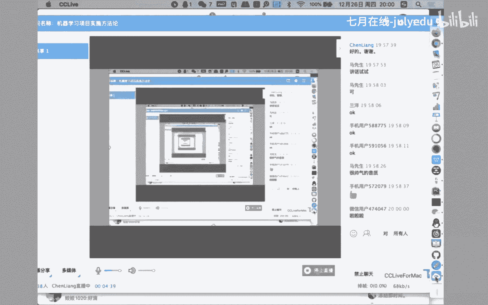

啊，是这样，这个非常高兴啊能够有机会呃。😊，抽出一个呃一个多小时的时间，能够和大家一块讨论一下关于嗯机器学习项目实施方法论的内容。呃，关于这个话题啊，其实也是一直希望能够和呃各位专家也好啊，同学也好。

还有各个方向当中正在呃项目当中的同呃同事们也好，能够一块去聊一下的这个问题。为什么这么说呢？因为首先随着机体学习方向技术的发展。越来越成熟的一些技术，被越来越广泛的应用到了项目当中去。但是我的一个观察。

以及在项目当中实施过程的一个体会。嗯，是这种技术的应用，可能会非常随着不同的呃人员素质、项目情况以及各种各样不同的约束条件会带来非常大的差异性。嗯，直接点说就是很多的时候我们是在应用技术。

但是应用技术这种规范的方式和方法其实还是有很大讨论和提升的空间。所以呢今天能够希望能够和大家能够讨论一下关于机器学习项目，它的一个实施的步骤方法。以及整个的一个方法论的情况。嗯。

可能这些内容呢就是嗯没有直接在机器学习项目嗯当中的同学可能体会不是那么的深入啊，我举一个例子啊，就这些内容我经常会啊想到其他的方向当中的同学的一个可能接受的一个情况。比如说哈可能嗯在计算机科学方向。

或者说是软件开发方向的同学一定听说过这么一个课程叫做。啊，叫做软件工程，对吧？我相信大家一定对这个名词应该不太陌生。那我一定有一个问题啊，就是软件工程到底在干什么？

很显然是用工程化的方法对我们的软件开发项目进行一个规范化啊，就像我们盖大楼一样，我们有一个完整的图纸和蓝图，然后各个专业的啊不同方向的专家按照我们已经绘制完成的项目图纸啊开始施工就可以了。

那个时候你会发现我们一整套的工程管理的规范方法，在其中起到了非常重要的作用啊，其实软件开发在很早之前，基本上也是处在一种啊，非常盲目的，对吧？没有规划的呃，主要凭借个人经验的一种开发方法。

啊以碰到了一系列的问题，比如说需求的频繁的变更，所导致的设计的频繁的改变，啊，以及导致的比如说像开发过程当中的嗯越来越多的bug的积累，以及测试的这种越来越频繁以及越来越呃不彻底的情况。

所以慢慢的在工程侧，我们把一些经验，软件项目开发的经验不断的进行总结、提炼、消化，形成所谓的软件工程的方法论，啊以大家可能比较熟悉的传统一些的像瀑布模型，对吧？啊，现在我们更多的可能用的是敏捷方法啊啊。

甚至比如说有些scriptcr呃scribecr这种方法呃，其实在软件开发过程当中能够指导我们去使用软件技术，去解决我们的业务问题。那么同样啊我就有一个类比就在于。呃，机器学习项目呃。

其实你会发现在现在的实施过程当中，也应该有这么一套所谓的工程化的方法，对我们的机器学习项目加以指导。就像我们的软件工程，对我们的软件项目进行指导是一样的对吧？我们的软件工程对我们的软件开发进行指导。

那很显然，机器学习的。工程方法应该对我们的机器学习项目也应该有一个指导化的一个工作啊，这就是为什么今天这个题目是所谓的机器学习项目的一个实施方法论的这么一个题目。但是啊呃给大家报告一下。

就是现在这个时间点上，我们软件工程啊，随着大范围的这种软件开发的越来越深入是吧？软件工程其实已已经是一个呃非常成熟的一个内容或者方向啊，比如说我们现在可以提到的敏捷开发里面，对吧？呃。

各种各样的这种迭代流程啊，各种每一个阶段的这种输出输入以及输出，以及每一个阶段和每一个阶段不同角色的人员所承担的不同的工作内容以及之间的协调和协作。相对来说已经非常成熟的一个一一个方向。但是很遗憾的是。

在机器学习项目的实施过程当中，这样的方法论，其实。还非常非常少的被提及啊和总结。因为大家可能还处在一个相对比较前期的阶段，对吧？大家手头上有了一些技础工具。

那么忙不迭的啊把这些技础工具在不同的项目当中使用，还没顾啊，没顾得上，把这些方式和方法总结和提炼出来。但是哈但是嗯我个人感觉现在已经是一个呃越来越应该重视这方面工作的一个情况了。

因为我看到啊包括我自己呃在项目当中也深刻的体会到，如果没有一种方法论的指导啊，对整个项目的实施过程，其实是是很很有影响的。就是说嗯因为后面我们会讲到整个项目当中会涉及到不同的专家啊，不同的人员。

那怎么样以一种大家形成共识的方式向前推进整个项目，现在还很缺少。但是应该或者非常重要的是我们应该把这些方法论能够总结出来啊。所以今天呃从一方面啊是借鉴一些呃就是已经被呃总结出来的内容啊。

另外呢也结合着呃自己在工作和项目当中的一点一点算是体会吧，和大家今天聊一下关于方法论的内容，这是算是今天题目当中的一点内容，好吧。

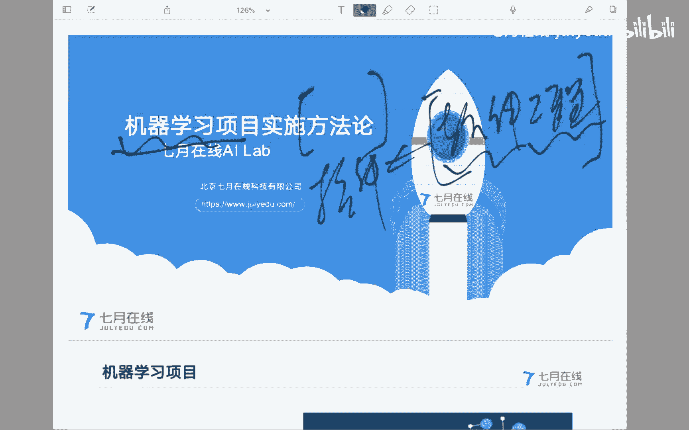

那么我们就继续往下看一下，呃，在具体开始方法论的内容之前呢，希望先明确一点，就是关于机器学习项目的一个描述啊，这个可能会对我们就是我们把。呃，是什么先搞清楚，然后后面我们再讨论怎么去做这个事情。好吧。

首先我们看一下，就是我自己的一点体会就在于所谓的机器学习项目是在有限的资源约束之下，为了满足我们的客户业务分析需求啊，结合运用机器学习技术，分析挖掘数据当中所蕴含的规律。

为商业决策能够提供支识或者支撑啊，这是我个人的一点体会啊，回过头来看一下。首先第一个问题就是关于有限的资源约束啊，这个有限的资源约束体现在方方面面，比如说时间约束，对吧？呃，工期很工期会非常紧啊。

比如说下个月就需要完成项目，形成分析报告啊，你得构建模型呃，拿出结果啊，这时间约束，比如说人员约束，你手头上可能整个项目组就三个同时，对吧？一个一一个做需求，一个做模型，一个做。呃，应用。

那这样的话怎么去协调起来，也在有限的时间之下去完成工作。所以各种各样的资源约束条件之下，那么我们的目标是为了满足我们客户的业务分析需求。重点是我们最终的目的是为了满足客户的需求，这是最终的目标。

那么为了满足这个目标，我们使用的技术手段是综合运用机器学习的技术，分析挖掘数据当中所蕴含的规律呃。用户的这种需求可能是很多方方面面的需求。但是在这个地方，我们积极学习项目能够满足用户的需求。

是所谓的业务分析需求，或者是换句话说，我们是为用户的业务分析提供一些技术支撑手段。所以说在这个方向当中哈，我们是一种支撑啊，是一种辅助啊，是一种以技术能力来进行赋能。呃，所以这个地方的这种因和果。

所以能够能够明确的和大家有一个交流。就是我们只是为业务方的数据分析需求提供了一种技术支撑能力。呃，而这种能力现在来看是一种啊比较新颖的是吧？可能会出现很大呃可能性的一个结果。但毕竟我们还是为了。

业务分析需求所服务的啊，一定不要把因果搞混了啊啊后面我们会具体去分析这个事情啊。那么另外一点，当然，应用的技术手段主要是机器学习的技础分析方法，在数据当中去挖掘运含规律啊。

这个我觉得大家应该能够体会得到了。那么最终啊就是这个规律的目的还是为了商业决策提供支撑。当然这里的商业决策可能范围相对广一些啊，比如说在商业领域可能就是一个商业决策啊，比如说在业务领域，业务场景当中。

就是为了我们业务的下一步怎么去发展啊，提供一个所谓的一个支撑帮助的一个一个能力啊，这就是所谓的机器学习项目啊，当然。其中啊，当然我们还是以数据作为一个核心需求啊，核心目标对吧？基于数据挖掘规律。

当然使用的是机器学习项目，为我们的商业决策提供支撑啊，满足我们客户的业务分析需求。这是我对整个机器项目的一个一个个人的一个体会啊，所以说呃我说一下结论就是。在整个的。项目当中。

我们只是起到了技术能力的提供方，而不是整个项目的一个最终的。呃，怎么说呃。是。决定性的一个因素啊，呃换句话说，后面我们会讲到啊，我关于我们模型结论的一个应用，或者说一个一个理解。

一定是业务专家对它的一个接受和使用，而不是我们想当然的认为怎么怎么样。啊，这个一会我们再深入进行讨论，好吧。O这是关于项目的一个理解。那么下面呢我说一下这个本质上的一个认识。

就是积器学习项目刚才谈了很多啊，但是从现在我个人的角度去去分析这个问题的时候，我个人的理解是作为一个机极学习项目，其实我们需要解决的问题，核心的困难在于我们需要是在两个问题域当中进行工作。什么意思呢？

首先第一个问题啊，就是我因为我们的业务我们的需求来自于业务场景。那么一定是业务需求问题域是我们需要解决的目标，换句话说，你要解决一个什么问题。你需要在。问题域本身去搞清楚和搞明白。举一个例子啊。

后面后面我们会讲到一个案例，比如说我们之前在。在气象领域啊做一个延伸区的预报的工作。那么首先你需要在气象领域关于延伸区预报这个问题上搞清楚它到底业务逻辑到底是一个什么样的逻辑。

使现在已经使用到了哪些技术方法，解决了哪些问题，碰到还有哪些困难，以及。今后的发展方向。否则的话，如果你对业务问题本身没有一个很清晰的认识的话，又怎么样才能。

判断你是不是能够通过我们的技术能力能够解决呢。换句话说，就是第一个零第一个问题域就在于业务需求问题域，你需要搞明白，搞明白了以后，这只是一个开端啊，你带着问题再到我们的技术能力域去找或者去判断哪些。

技术能力是可能对我们的业务需求进行解决和支撑的。所以说哈从这个角度上分析的话，你会发现，其实从现在这个。这个这个时间点上啊，做机器学习项目，其实你碰到的困难，你是需要在两个领域当中做映射。一方面。

你需要对我们的业务问题有一个充分的理解和认识。你知道你的目标到底是什么，另外一方面才是到我们的技术能力域去判断啊，你到底我们的技术模型，我们的啊分析方法能不能解决当前这个问题。啊。

呃这个时候哈就需要有一个抽象能力。就是把我们的业O问题抽象出来，映射到我们的技术能力当中来啊。比如说O呃这个延伸期预报啊，原来其实就是个回归问题，对吧？那么既然是个回归问题。

我所有的回归模型是不是都可以进行使用啊那么当前这个回归问题当中的数据情况是怎么样，数据质量是怎么样。然后在我的回归模型当中，哪些可能在当前数据集之下起到起到作用。所以说你会发现你必须要横跨两个两个领域。

那这个时候对我们的项目同事或者项目人员的要求，其实还是非常高的。啊，我经常会看到很多的同事啊，因为是技术技术同事出发是吧？啊，对技术本身有很强的自信心啊，这是很好的一种情况。

但是我一直强调的就是这种自信心一定不要把它扩展到或者说形成一种狂妄的对问题域的一种不切实际的认识上啊，怎么说呢？就是因为我。手头上有了一些工具啊，有句俗话嘛，你手头上有了锤子，满眼都是钉子啊。

都想砸一下是吧？都想解决一下。当然对于一个探索精神来说，这是没有问题的。但是一定要对你的业务问题领域抱有足够的敬畏之心。换句话说，我们手头上的这些工具啊，其实也是非常有限的一些工具，能不能解决。

或者说是不是这个问题解决的一个方案，这其实有很大的讨论空间，所以在这个问题被搞清楚之前，就说你这个问题到底是什么？你搞清楚之前，不要做过多的一些判断和承诺，否则的话我看到太多的项目都是这样啊。

在问题都本身都没有搞清楚之前，太多的同事做了过度的承诺给甲方，对吧？这个是没问题，我可以搞定。但最后分析来分析去哦，原来这个业务问题是这么一个问题啊，这个问题我现在解决不了啊，或者不能够很好的去解决啊。

最后给甲方造成了一个一个印象就在于啊，你们是过度的。承诺对吧？这个事情本来你们解决不了，号称能解决，最后又撂挑子干不了。那这个时候啊甲方对这种技术本身的怀疑会越来越大。

对整个的技术发展会造成非常大的一个负面的影响啊，其实大家可以理解的是可能如果做软件开发很早的同事，可能这个过程是经历过的对吧？在最早的开始的时候。

软件领域的同时可能也会碰到过这种所谓的过度承诺的一种情况，对吧？这个软件没问题，这这个功能没问题，软件技术搞得定。但家会发现ok啊，还是很大的困难。所以同样啊到机器学习项目。

现在这个发展阶段也碰到了类似的一些问题啊，但是回到我们现在这个角度上来说的话，那怎么办？对吧？碰到了分析完了问题以后，怎么去做这个解决这个矛盾。

那我提出的一个方案就是需要大家在掌握了一定的技术能力的前提以下，对你在解决的问题有一个充分的认识，所谓的充分的认识就是。是。要么呃几个途径吧，要么向我们的业务专家进行一个深入的学习啊，都不是讨论啊。

因为你没有在业务问题域，你根本就没有讨论的资本啊，你你和人家一开始都不能够平等的对话。我们首先需要认识到这一点，对吧？我们是去学习啊，去了解去分析别人的工作以及他的工作价值。

试着分析我们可能最对他们的工作有促进作用的方向然后再去做实验，做做做推广，所以说一定是非常谦逊的一个态度啊，你需要充分的向业务专家进行请教啊，这是学习，这是一种途径。另外一种途径就是。

通过大量的阅读你需要待解决问题领域的一些呃资料、文献、论文啊，这个材料啊，以及以现有的成熟的解决方案。对当前这个方向的问题解决的这个啊发展程度有一个基本的认识啊，嗯两种方式吧。

一种方式比较就是呃通过啊面对面的方式，对吧？向业务专家进行请教。另外一种方式就是读大量的论文啊，读大量的文献啊，就知道这个行到底在干什么，在此基础上跳回来啊。

在判断一下我们能力域当中有没有方式方法能够解决这些内容啊，所以说哈那这个时候会发现对其实是对我们现在的同事的这个这个能力的要求啊，其实还是很高的啊，不光是要要求你有足够的技术实力。

还要求你具有快速学习掌握新的领域业务问题的这种能力啊，所以说更多的是一种。复合性人才需求啊啊说句再说往前呃，分析一下啊，就是说现在我们很多的同事可能更多的是停留在工程师的这个角色上，对吧？

我提供在技术能力的角色上，其实给大家说啊，现在的机器学习项目嗯，不缺技术能力啊，其实给实实际情况是这样啊，不缺技术能力。那缺什么？缺的是能够完成这两个问题与映射的这种能力，那这种能力是从哪儿来啊。

一方面是希望我们的技术工程师能够快速的提高啊，能够能够。😊，向我们的业务领域进行一个跨境啊，然后完成其中的这个映射。简单点说啊，就是我们缺的不缺工程师，那缺什么缺。项目经理缺产品经理啊，这是慢慢的。

当然需要有个过程是吧？也是需要一部分的基术人人才啊转化到整个的呃。管理方向也好，这种需求方向也好啊，这是今后的一个发展趋势吧。至少现在是这么一个情况，好吧，这个问题给大家多嗯分析一下OK。

那么下面一个问题啊，就是关于机器学习项目的一个利益相关方啊，很我我看到太多的工程师啊呃不能够很好的处理甲方乙方的角色问题。

不能够很好的处理项目组当中呃自己的这种技术角色和其他的技术角色之间的这种这种协调的问题，造成了。项目的推进还是有很大的问题的。所以说呢在这一页当中呢，和大家梳理一下，就是在整个的机器学习项目当中，啊。

当然其实也有一定的通用性啊，包括软件开发项目。其实大家也有类似的一些角色的定位的不同。那么这个时候呢希望和大家聊一下，就是面对。不同的角色的时候，大家怎么去啊判断和协调他们之间的这种这种沟通。好吧。

首先我们先确定一点我们是谁，对吧？这个时候呢呃假设那我们就是所谓的算法工程师。其实我对这个。嗯，这个名称啊就是应该叫做算法应用工程师，我们毕竟不是设计算法的对吧？我们是用已经设计好的很成熟的算法啊。

在业务方向进行应用的这么一个工程人员，所以我们是应用算法应用工程师。那么这是我们的定位哈，这是我们的定位。那么我们在项目组当中除了算法应用工程师之外，可能我们还子会碰到所谓的数据工程师啊。

就是我们因为知道刚才我们分析了机器学习项目本身是基于数据的规律性的挖掘和分析，为我们的业务决策提供知识。那么数据从哪来。那么呃谁去为我们的算法模型提供高质量的数据，往往会有一个所谓的数据工程师的角色。

当然这不是绝对的啊，这些这些角色之间并不都是绝对的啊，有些时候你可能是一人好几好几个角色，对吧？但是不管怎么样，总需要有这么一个角色去负责向啊我们的甲方去协调数据。对吧协调数据的时候。

可能是比如说离线的啊，你拷过来或者是在线的在系统当中去，你侵入到业务系统里面去。那这个时候这部分的同事可能更多的是关注于数据的问题，对吧？由他们来整理，提供数据。

由算法应用工程师在数据的基础上进行业务的分析，构建相应的模型，得出一定的结论。那么构建完模型以后。如果这个模型被认可了，那我们还需要进行一个开所谓的上线开发。就是我们的模型其实并不能凭空的使用。

而是需要结合着我们的比如说业务系统或者weber应用是吧，提供给我们的甲方。所以这个时候怎么样把我们的模型能够。整合到系统当中去。那么很显然可能会和我们的开发工程师进行一个协调和沟通啊。

这至少是我们在项目组当中在呃实施层面上，我们经常会碰到的不同的角色啊，那么在此之上，那么在此之上通常还会有一个所谓的数据科学家啊，一方面为我们算法应用工程师构建模型提供一些指导和和建议或者是意见，对吧？

比如说这是一个什么样的业务问题被抽象出来啊，这是需要科数据科学家在像刚才所说的啊，像我们的业务侧进行一个充分学习以后，啊业务问题抽象成我们的模型问题啊，这个模型问题可能我们面临的有好多种解决方案。

那么在这些解决方案当中，那凭借着所谓的数据科学家的专家经验去做一个预先的判断啊，这个数据这个业务问题使用这些数据啊，构建模型的时候啊，可能有5种选择。那我们。选择其中的三种模型作为一个实验。

然后看一下结果进行应用。所以说啊这个时候我们碰到的更多是数据科学家为我们制定一个方向啊，制定一个解决的一个途径。我们按照这些方向和途径开展相应的一系列的工作啊，这是数据科学家的经验。

当然再往上可能就是整个的项目经理或者产品经理的角色。他为整个项目的实施推进和落地负责任啊，去协调整个项目组当中各个不同的角色的这个呃工作啊，并且更重要的是和甲方进行进行一个充分的协调和沟通啊。

所以说项目经理的一个角色呢，更加的呃负责管理，然后呢负责协调，负责整个项目的统筹推进啊，所以这个是其实现在哈至少我个人的一个体会。在说呃。

是希望我们的算法应用工程师能够快速的演进到这个项目经理角色当中来。为什么这么说呢？现在不得不面临的一个情况，就是第一。缺机体学习项目的项目经理啊，没有啊，为什么没有呢？

因为因为这个整个的业务方向还比较啊比较早期是吧？这是面临的一个问题，在没有的基础上怎么办？两个方案，第一个方案就是原有的应用开发的项目经理啊，赶鸭子上架。做比如说做应用的同事对吧？项目。

然后这个时候他们的。他们那们那是他们的。项目经理，那没办法，你调到我们这个这个项目组当中来啊，做我们的项目经理。那这个我碰到一个很大的问题。特别是从我们这个所谓的算法，应用工程师的角度上去看的话。

来的就是个外行啊，因为实际情况也是这样，很多的这种传统应用开发项目的经理，它并没有所谓的数据科学的这种背景，或者说积极学习项目的这种背景。他对整个项目的逻辑，还可能停留在就是应用功能开发上。啊。

所以这个时候他不能够完全或者充分的体会到整个算法方向的所做的一些工作，会造成啊可能会造成一些嗯不太契合的一些判断和这种决策啊，所以这也是没办法的一种情况那更好的一个方案。

当然是我们作为一个可能的啊尽快的提升的一个途径成为这个项目当中的主导者啊，来去协调整个的应用开发方啊，所以说哈给大家说，现在。😊，这类同事的价值可能要比单纯的算法，应用工程师的价值可能还会更大一些啊。

但是同样这部分的同事面临这个问题就在于他对管理或者是项目管理的经验可能是非常欠缺的。啊，另外呢这种这种观念可能更多的还停留在工程或者技术侧，而不是停留在整个项目侧的一个管理层面上。

所以当然这两两个方向啊，两个方向可以说是各有利弊。但是不管怎么说啊，还是希望嗯有有这种啊改变想法的啊，这种同学啊，能够有一个途径啊来去改变。当然。当然这是一个很好的选择啊。

就是我从算法应用工程师能够成长为所谓的数据科学家啊，当然这个就看个人不同的选择嘛，对吧？看个人不同的选择，这是对我们乙方啊，对于我们项目承接方的一个分析，那么看一下甲方哈。

我觉得对甲方不同的这个人员的这个理解和定位，对你今后的工作也是可以带来很大帮助的。见什么人说什么话，对吧？入哪个庙，你得拜哪个拜哪个佛啊，对吧？

所以你至少知道我们甲方啊可能在这个方向当中会碰到一些不同的决策。比如说项目决策者，就是这个项目啊需求的最早的或者最意向的提出提出的人啊，一般是我们甲方的呃管理人员，或者说是甲方的领导啊。

作为整个项目的一个决策者，这个项目做不做啊，做到什么样，一般是有他来负责的。那么在此之后呢，可能就是一个所谓的业务专家啊，往往项目决策者或者项目领导呢，对一些具体的业务问题和具体的业务方。

方向啊不能够嗯完全把握啊，所以这个时候他会倚仗于所谓的业务专家啊，对我们的特别是一些业务问题和技术性的支撑问题啊提出一些呃非常重要的意见和建议。就如业务专家的一些呃这个能力啊呃换句话说哈就是。

到最后项目验收的时候，这个项目好不好啊，行不行？呃，过不过，是由我们的项目决策所者拍板。但是他在拍板之前会充分的去啊呃咨询求证啊，依赖啊业务专家的建议和意见啊。

所以这个时候嗯你会发现我们对甲方的这种啊支撑啊。当然我们最终是希望最后这个项目是成功的，是O的，但是你怎么去说服大家认同你的结果。后面我们会以讲到这也是一个很大的个困难和问题，对吧？

那你你最终目的是希望他能够认可。但是你会发现他最后所依赖的建议是由业务专家所得提供的。所以你会发现做工作还不能啊，还需要根据不同的情况来进行抉择是吧？这是一类人员。

那么另外一类人员呢就是啊到了实际工作阶段，所谓的业务工程师啊，业务工程师就是具体负责当前这个业务方向的具体业务的人员啊。很多的业务技巧和业务经验啊，可能业务专家也不掌握啊。

甚至就是停留在或者沉淀在业务工程师这个地方啊，有一些具体的细节问题，对吧？一些业务技巧啊。到底是星期三这个数据来，还是这个数据是星期五来，对吧？星期五上来的数据质量要比星期三来的数据质量好。

这个你比如说这种判断，往往甚至业务专家都不了解，就是在业务工程师那里他在掌握。那这个时候后面我们会讲到你数据提取的时候，那你提取星期三的还是星期五的。当然我们是希望提取高质量的数据。

但是如果你这个不了解的话，你很显然，这个数据质量就出有问题的。所以这是所谓的业务工程师。另外一个你会发现甲方往往也有所谓的数据工程师啊，比如说。😊，在在气象领域是吧，他们的信息各其实各个领域都差不多啊。

都有所谓的信息中心。那信息中心里面具体掌握业务系统数据组织情况的啊，那些工程师、工程人员就是所谓的数据工程师，你免不了，比如说是个业务问题。

你免不了需要从业务系统或者说已经呃落地的系统当中把数据提取出来啊，或者说在业务系统当中进行分析。那这个时候对数据最熟悉的肯定还是所谓的数据工程师。那这个时候嗯说实在的，有的时候是怎么说就要言王好见。

小鬼难缠是吧？他就不给你数，那你瞪眼也没办法是吧？所以说啊各个不同的甲方决策在整个项目当中，还是起到不同的一个呃不同的一个定位是吧？你怎么去协调，作为我们的算法应用工程师。

你不能啊你当然你不能我们说你给我数据就可以了。那你知道或者说你得理解数据工程师在项目组当中，他需要和我们的甲方的数据。工程师进行一个非常困难的协调。有的时候他不给你，那他也没办法，他不是。

我们我们自己的工程师不是不想把书给你，是因为他确实协调不到，或者很困难的协调到。这个时候还是能够充分的理解一下大家之间工作的不同，对吧？好了。

以上吧是我们可能会在项目组当中啊碰到的甲方和乙方的一种一种一种问题，对吧？一些一些决策的一些定位。啊以上哈以上至少是呃我在整个机器学习领域的一些呃个人的一些认识吧。

首先第一个就是项目机器学习项目的一个理解啊，呃，在资源有限的情况下啊，对我们的客户业务。😊，进行一个分析，满足这个需求。当然利用的是我们的技术能力啊，在数据当中挖掘规律，为我们的商业决策提供一个支撑。

然后呢。最核心的问题就在于怎么样在业务问题域以及我们的技术能力域当中进行一个映射，进行一个高效的成功的一个映射啊，这个时候需要符合性人才啊，就不再的是单纯的是一个技术能力。

而更多的是一个对业务问题的分析抽象以及应用技术解决问题的能力的一个一个考核。那么在整个项目组当中啊，有不同的角色以及不同的利益相关方，大家的大方向没问题。但是在整个的推进过程当中。

你应该能够体会得到大家应该侧重点的不同。其实呃。不同的角色吧啊，不同的角色还是有不同的工作的重心啊，特别是在现在在我们的项目经理这个定位上呃，还是非常啊啊非常缺人。

因为他必须要首先知道整个的项目组当中的逻辑，就是这个机器学习项目本身的逻辑是吧？是以数据规律的挖掘对为核心重点，应用机器学习技术，满足甲方需求，而不是单纯的做功能性开发啊，这一点的这个思想转变。嗯。

其实更好的是希望我们的算法工程师能够快速的成长起来。但是你需要补的是大量的去整个以以项目的视角啊，以以管理的视角去推进我们项目满足甲方需求的一种一种能力的提升啊，那么在不同的甲方乙方当中啊。

还是特别是在处理这种甲方关系的时候，对吧？你怎么样去控制甲方需求，对吧？呃，甲方管理嘛，对吧？或者说需求管理嘛，是吧？你不能。把自己抬的太高，最后摔的太狠，那还是自己倒霉，对吧？好了，以上是这么一些啊。

算是第一部分吧，和大家分享一下，我看看有没有问题，我们可以做一个简单的交流。😊。

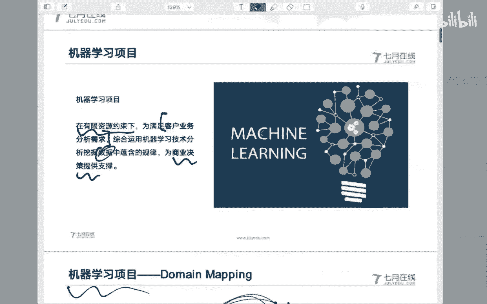

Yes。嗯。OK那这样的话，或者我们先继续，好吧，继续完了以后到嗯。

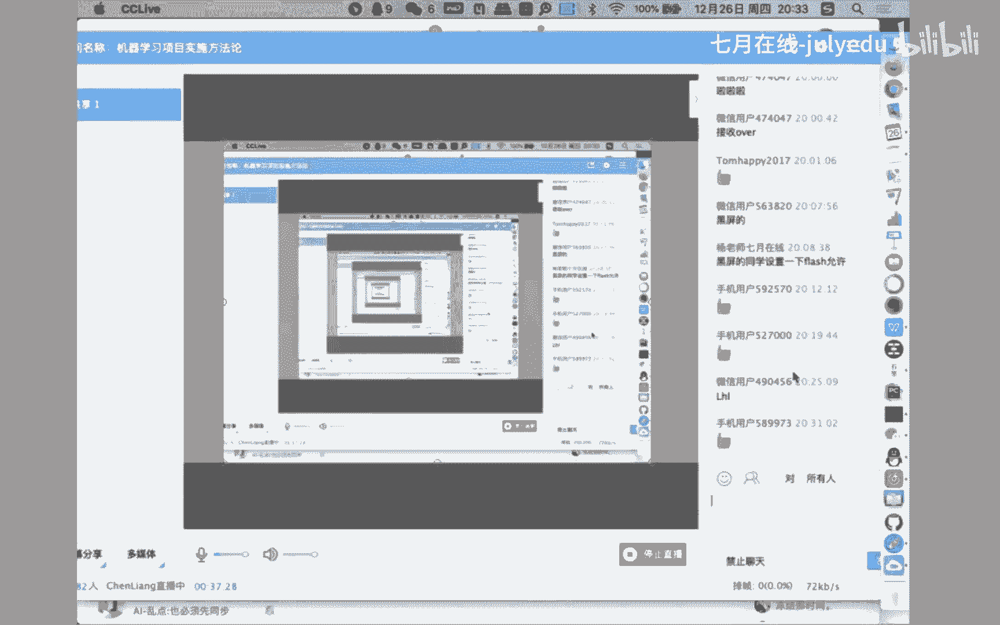

后面我们可以一块有问题的话，我们一块再讨论这些问题。那好了呃回到最开始的那个疑问啊，就在于我们以一种什么样的方式去推进和组织我们的整个项目啊，那就牵扯到关于呃方法论的问题。

对以一种什么样的方法论的指导来完成我们的项目内容。呃，给大家报告一点的是嗯其实我个人也非常困惑于此。所以呢之前的时候也嗯大量的去阅读了一些之前的工作的呃，怎么说总结，呃。

试着去找到已经被很好的总结提炼出来现成的方法论，这个很很自然是吧？有现成的，当然是用现成的嘛。但是很遗憾的是，至少从我的这个渠道或者能力范围当中，还真的没有找到被广泛证明了嗯。呃。

切合实际的应可应用于机器学习项目的呃方法论。啊，比如说你像软件工程当中的瀑布模型，对吧？比如说像敏捷方法啊，这种在软件工程当中已经被广泛使用到的方法论。嗯，至少我在机器学习领域，其实还是。

没有找到现成的啊，可以这么说。那退而求其次，在这个呃搜集材料的过程当中，或者说找寻这个方法论的过程当中，嗯，也不能说是偶然。嗯，是因为之前在上学的时候，其实有过一门课程，叫做呃数据挖掘这么一门课程啊。

可能有的呃同学或者专家可能了解过所谓的数据挖掘是吧？嗯，在那个阶段的时候，其实有过一个叫做呃CRSPDM就是呃。呃叫做跨行业的数据挖掘标准过程啊。

它是应用在数据挖掘领域的一个呃呃一个一个开发过程或者一个方法论。呃，这个时候因为之前了解过啊，就是数据挖掘的内容嗯。

所以呢就觉得是不是可以把数据挖掘过数据挖掘领域当中的这一套方法论应用到整个的机器学习项目当中来。呃，最后其实发发现哈有这么一个结论啊，当然这个结论呢呃是我个人的一个发就是个人的一个理解吧。

就是可能哈就是大家如果了解过数据挖掘课程或者数据挖掘方向的这个同事或者同学，其实你会发现啊，就是如果说你看过两本或者两本以上啊，关于数据挖掘的书。呃，在看我们机器学习领域的一些一些一些资料。

其实你会体现体会得到啊，这两套材料当中80%以上的内容是差不太多的。如果说有区别，可能体会体现在以下几个方面。第一个方面，数据挖掘的课程更侧重于对业务问题的分析，以及对模型的应用。

最后对业务问题的解决啊，它其实就是重点是在商业领域的一个使用。啊，数据挖掘哈这是一点区别。那么另外一点区别。如果在基础层面上说，你会发现就是去到头，对吧？呃，分析部分呃，需求部分去到尾报告部分。

在中间的技术部分，你会发现甚至90%，甚至说95%的内容，都是相同的内容，包括你会发现有什么决策术模型是吧？有什么逻辑回归模型啊，这是在数据挖掘领域当中也会频繁的会看到的一些呃分析模型啊。

甚至还包括甚至你会发现高级一点的呃嗯数据挖掘方向的专注里面，还包括像这个SVM知识向量级，甚至都包括神经网络模型。你会发现从技术侧，你会你会发现95%的内容都是一样的，可能会有一些不同的地方。

比如说在像呃频繁向级，就是关联系统呃关联模型可能呃数据挖掘里面会有，但是机器学习领域里面会没有除了这一点技术。上的不同之外，那技础侧其实大多都是重合的啊，通过以上分析吧，我的一个个人结论就在于。

其实所谓的数据挖掘，你可以认为就是在商业领域应用机器学习模型去解决他们的业务需求的这么一个。方向。刚才其实机器学习模型其实可以应用于很多的方向，对吧？嗯，在其实在很多的传统领域，比如说像能源电力啊。

像气象啊，像通信啊呃医疗啊，像呃交通啊各个领域其实都可以使用机器学习的领机器学习的方法和模型。那么在商业领域对商业问题的分析领域，其实就是数据挖掘。所以说哈基于以上的分析。

那么在商业领域使用所谓的数据挖掘模型或者机器学习模型所总结出来的这一套所谓的跨行业数据挖掘标准过程。那么也应该可以作为我们在其他行业或者其他领域进行类似的工作的一个可参考的一个过程。

这是一个逻辑逻辑关系。就是说呃数据挖掘，是我们应用。机器学习技术在商业领域呃当中的一个使用，总结出了一个所谓的呃cdM这么一个模型。那么我们在其他行业当中去推广和使用机器学习技术的项目的过程当中。

那么当然也可以作为一个借鉴去去使用，对吧？所以这是一个逻辑关系啊，那么那么我们就回过头来看一下，考察一下这个所谓的跨行业数据挖掘标准过程，它所包含的内在的规律，以及我们今后可能会借鉴使用到的一些内容。

其实分析之后，你会发现这个模型还是嗯还是很有价值的。至少在现在这个没有的基础上，我们可以作为一个基限模型是吧？基础的一个方法论，对我们实际的项目推进有一个指导。

然后再根据项目的不同的情况进行各种的裁剪扩展和改进。好吧，那回过头来看一下这个跨行业的数据挖掘标准过程。这个模型呢，其实你你看一下资料，你才会发现它是上个世纪90年代中期。199几年啊。

好像1995年的时候，由IBM公司呃，以及还有其他几家公司所组成的一个呃所谓的一个叫什么一个小组啊，呃，在分析了呃当时呃商业领域使用所谓的数据挖掘技术，解决一些业务分析问题的项目以后。

总结和提炼出来的这么一个所谓的标准过程。嗯，他又你会发现啊，他其实是已经是。据现在大约是30多年以前的一个工作，你会发现呃那个时候的工作对现在我们的项目还是有很很很很强的指导性的一些建议。

OK那只不过这些工作呢是在商业领域啊，但是我们现在可以以它作为一个借一个借鉴啊，应用到其他行业和其他领域当中去。呃，那么几个特点吧，第一个特点叫做行业无关性啊，行业无关性。

虽然说整个标准过程的提炼是以商业项目为核心或者重要的项目域提炼出来的。但是呢整个的标准过程希望构建的是行业无关啊，就是既可以使用到商业问题当中来，也可以在其他行业当中进行一个推广。

所以它是和行业具体行业是没有具体关系的啊，并不只限于商业领域。这是第一点，行业无关性。第二点叫做工具无关性。在整个的标准过程当中，呃没有依赖于任何的呃商业工具啊，呃也没有依赖于任何的就是具体的。呃。

工具就是它是一个相对来说抽象的或者抽象层次比较高的一个过程。呃，第三个叫做应用无关。还是那样，就是嗯它和具体的应用场景是没有关系的，是一个抽象层次相对比较高的一个所谓的。标准过程啊，这是三三个特点吧。

这三个特点。那我们具体看一下右边啊，右边这是我们其实最核心的一个一个内容，就是这个图里面。描述了我们整个的一个标准过程的一个流程啊，这也是今天的一个重点内容吧，希望能够和大家一块分析一下的。首先我个人。

再次强调一下的就在于呃整个业务问题的或者整个项目的决定性的因素。第一点。叫做。商业理解这是刚才所说的啊，我们要在两个不同的领域当中进行一个映射。那么哪个领域呢？到哪个领域的映射，就是我们的业务问题域。

到我们的技术分析域。那业务里。问题域的理解是作为整个项目的一个起始性的问题。你需要对你所面临的业务问题进行一个深入的理解啊，这是一个免不了的过程啊。

我一直在给技术侧出身的同学一直在强调的在于我们的技术只是起到辅助支撑的作用啊，为我们的业务问题的解决提供技术能力，仅此而已啊，当然我们现在来看，这个技术能力还是非常重要的对吧？可能是之前的呃功能性。

项目当中所不具备的，但是也也是为我们的业务问题所服务的啊，没有什么其他的。所以说你首先解决的就是你的业务理解问题啊，之前做的一些项目当中，一开始你需要花上一些呃精力和时间，对现在业务问题的解决的方法。

以及碰到的困难进行一个深入的学习和分析啊，否则。说句不好听的啊，从业务专家的角度上，你所提出的那些解决方案，你所说的那些呃可能性的一些分析都是一些外行话啊。如果你不能够用所谓的行话去描述问题的话。

你甚至都不能够很好的去对现在业务专家所的痛点或者需求。你你根本就没有一个很好的一个把握啊，这个时候你怎么才能够。抽象成业务问题，怎么样能够才找到准确的解决方案，这都是存很大的问题。

所以第一步啊一定是深入的对你要解决的问题的一个理解。怎么理解？刚才说了，要么你对业务专家进行学习，要么去读专注读论文啊，作为一个不能说是专家吧，至少是作为这个方向的小学生啊，说的不再是外行话。

才可能才可以和我们的业务专家进行一个沟通，把业务问题正确的能够提炼出来，这是第一步。第二步啊就是数据理解。那么关于数据理解呢，回到我们整个的机器学习项目，整个机器学习项目是对业务问题的一个分析之后。

基于数据挖掘、构建模型、挖掘规律。那么数据的情况一方面很好的解释了业务问题，对吧？以数据的形式把业务问题更好的呈现出来。那么第二步呢也是作为我们后续构建模型的一个基础性工作。

所以说对数据的理解也是非常重要的。当然，这个层面的数据理解，更多的是停留在以业务侧的视角对数据的理解。比如说你拿到拿到一张业务表对吧？业务表里面的每个字段，它的业务含义到底是怎么样的？比如说是时间。

那这个时间到底是比如说这个开户时间还是个截止时间，那截止时间有没有业务上的一个截止点，是以凌晨12，以凌晨24点呃，以以凌晨0点为截止时间还是以具体的，比如凌晨3点作为业务截止时间。

这个都需要在业务侧给出明细的一个解释。你会发现，如果你对业务的理解啊，业务侧的数据理解有问题，返回头去进一步的去使业务问题本身去找到相应的答案。所以说这个过程哈就是业务问题理解了以后。

一定要落实到我的业务数据的理解上啊。换句话说，你需要对业务系统里面的每一个表啊，每一个字段明明白白的搞清楚它的具体含义才可以。为什么要这么说？那么就先入到下一步。😡，所谓的数据准备。

因为我们后面的工作是需要构建数据模型，对吧？去分析问题。如果你对业务数据不清楚，有疑问，你怎么去很好的判断哪些数据是你所需要的。而哪些数据是你所不需要的。如果你构建其他。扩展特征的话。

哪些特征是可以在业务数据当中进行排列组合得到的这都是需要在在充分的对业务数据的理解的基础上，才可以做到一个有效的正确判断啊，才可能说哎我对哪些数据进行抽取啊，才是有价值的。所以才是所谓的数据准备阶段啊。

这个时候呢这个所为第三步哈，作为第三步，这个这个数据准备，一般就是需要刚才我们所说的甲方的数据工程师和乙方的数据工程师进行一个充分的沟通和讨论啊，嗯这个时候会经常会扯皮，什么扯皮啊嗯，甲方问乙方。

你要哪些数据，乙方问甲方你有哪些数据。甲方说你要哪些数据，我给你哪些数据。嗯，乙方会说你有哪些数据，我要哪些数据，这不这不就扯吗？这很显然。😡，如果形成了这种方式哈，一定是你工作有问题了啊。

大家脑子里边清楚这一点啊，一定是工作有问题了，哪有问题，具体问题具体分析啊，你具体哪个地方出问题了啊，出现这种这种糟糕的这种局面。嗯，太正常了啊，各有各的难处是吧嗯。不管怎么说呢？

到了第三步数据准备阶段。那么在数据准备阶段的基础上，那当然就是构建模型。那这个时候好像是到了我们的几个阶段。你会发现这如果是对业务问题遇的一个分析，那下面这个工作我觉得我今天就不用多说了，是吧？

这不是这对我们来说这都不是问题了啊，你变着花的撒花的对吧？各种模型，各种试，各种各种各种用，对吧？各种各样的所谓的理论，你就这是我们的问题啊，今天就这个不是重点是吧？好了，重点在于。😊。

当我们有了模型结果以后啊，需要对模型的结果进行评估。有能说这个评估或者评价怎么单独的拿出来了。不是我们需要在建模的时候，就对当前的模型进行一个评估嘛，是吧？各种什么ACC啊UC啊，什么ROC啊是吧？

各种评估指标，你不对模型评估吗？怎么单独拿出来了，这里的评估不是我们建模之后的模型的评估那个东西。你自己需要搞得定，你需要拿出你自己信服的一个结论性的东西，对吧？你的正确率是多少啊，你的F一值是多少。

当然各种不同的指标是吧？你自己那是对你自己工作的一个结论性的东西。这里的评估是你需要把你的这个技术上的结论。😊，通过沟通和谁的沟通和业务专家的沟通，使得业务专家对你的工作有一个所谓的评价啊。

注意评价是A对B的评价。那A是谁，B是谁？如果在这个阶段的评价是你对你的模型的评价，而这个阶段的评价是甲方对乙方工作结果的一个评价。当然具体呈现上也是对模型的结果，但是你会发现两个完全不同的视角，对吧？

那你因为模型是你自己构建的，所以你有很充分的。认识会很充分的。inside是吧？一个一个一个认识程度，我这个模型哎呀包打天下，百分之百没问题。但是是你以你的视角。那么到了这个阶段。

一定是以业务专家的视角，你需要对他进行一个充分的解释你的工作价值。这个时候碰到最大麻烦就在这个地方。因为业务专家不能够理解你到底在干什么。或者说如果你前期的工作做的不够充分。

不能够使业务专家去理解你的这这个问题的这个价值的话，你这个时候你第一步就卖过这个坎啊，业务专家怎么去认识到你的工作价值。啊，怎么对你的工作有一个正确的评价啊，他到底在他到底认识到你的到底在干什么。

你搞的什么模型，什么叫模型，对吧？什么叫回归，什么叫叫叫叫拟合，什么叫过拟合。你从这个这个他根本不懂。那这个时候你怎么。把你的工作成果很好的向他进行解释，这是个非常大的一个挑战哈，非常大的一个挑战。

如这是第四步，这个第三步第四步，这都不是时间，那这是第五步，这可能是最大的一个麻烦。有的时候你会发现很很糟糕的就在于你的你的技术模型，我认为可能非常好啊，咱们都懂。所以。😊，啊，OK没问题。

但是就是因为你没没能够很好的去对业务专家解释，没有使他能够认可到你的工作价值。那这个时候结论就是负面。给大家说一下，我至少我个人的一个经验就在于有的时候我们会为了提高模型的可解释性。

可以在一定程度上去牺牲模型的精度。为什么说？比如说我们一般意义上会认为呃神经网络模型的这个能力要比比如说像数模型，像逻辑回归模型的性能要好，这是我们技术上应该是没有问题的对吧？但是上给大家说。

往往我们选择的模型恰巧是像数模型，像逻辑回归这种模型，而不会动用像神经网络模型这么一种这种东西，为什么就是因为数模型和逻辑回归模型本身的可解释性，要远远大于神经网络模型，你像甲方对吧？你像业务专家。

他搞电力的，他搞气象的，他搞能源的，他搞电信的，他搞医疗的，你给他讲什么三层网络，对吧？什么这个这个各种各样的全职参数，你疯了，你给他讲那个他听得懂吗？对吧？但是你给他说，你比如说我构建了一个数形结构。

他也听不懂，但是呢你会说哎我构有。形成了30条规则啊，每一条规则代表的是业务上的哪个情况，对吧？你这个人年龄30岁以上，家里有房产啊，身体健康，我给他贷款。哎，这个他能听懂了，对吧？你翻译成业务语言。

这是决策数嘛，形成了业务规则。另外呢你比如说哎这个明天下雨80%的概率是下雨啊，还有20%他不下雨呢，这种带着概率的性的结果也是容易被甲方所接受的。当然这都是。所以说啊刚才所说的。

就是有的时候甚至为了这种可解释性，我们会牺牲掉所有的精度。当然这个是有很大的技巧。你会发现这这已经不是技术问题了，对吧？这是更多的是充分的沟通，你获得甲方信任的一种能力和问题啊。

这个你不通过几个项目啊锻炼啊，不通过几个这种项目的这种这种坑的这种这种这种解决啊，问题的解决，你你还是体会不那么深啊，今天说到这里，那么很遗憾的，如果这个项目的评价是负面的怎么办，对吧？

甲方你啥你这是做了一个这不不行，这个东西，那没办法，这个时候返回到业务理解啊，继续对业务进行学习啊，这个是跑不了的，然后再对数据进行理解抽象数据构建模型进行解释啊，再不行，你就再回来呗。

直到什么时候直到你能够充分的把你的工作价值，是甲方进行有有一个正确性的判断啊，这个时候。才是所谓的部署。那当然就刚才所说的应用开发工程师的工作了是吧？把你的模型在业务系统当中进行一个集成上线使用。

甲方哎觉得OK没问题，你会发现这还是个圈儿啊，所以发现这个模型可能比如说一开始。精度不是很高，但是上线以后发现哎甲方用的还行啊，后面慢慢的说你这个模型越来越差了。

这个时候他因为他他只能够通过第一次的迭代，知道你在干什么，内部逻辑知道了。那个时候他在追求所谓的精度的问题。那个时候你慢慢的可以把之前的模型进行一个重新的一个迭代升级，更新掉啊。

所以说你会发现有的时候呃项目的推进，也不是说是呃怎么说他他有内部的规律性的是吧？所以说哈回归回来我们在。😊，回顾一下啊，简单的回顾一下。Yeah。这明面样吧。第一步，商业理解对你的业务问题充分的沟通啊。

充分的学习，充分的理解啊，至少不再是个外行。第二步，对业务系统里面的数据进行理解。每一个表，每一个字段的含义，业务上怎么解释，充分的进行理解，理解不了，反回去找专家。

所以说你会发现这个地方是双向箭头是吧？出具数据啊，这个地方的瓶颈在于你要什么，你有什么，你要什么，你有什么啊，这个地方扯来皮，那就自己想办法怎么解决，好吧，构建模型这都问题不大。

核心关键点在于对模型的解释，解释不通，有个头径，从头再来解释通了，上线部署实施，接代下一轮的工作啊，整个的所谓的跨行业。数据挖掘标准过程差不多就是这么一些核心内容啊。

这也是其实作为一个今天的重点的一个内容吧啊，想和大家进行沟通的地方，看看还有什么问题吗？我们可以交流一下。

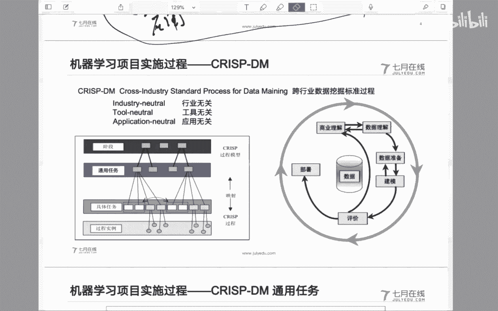

啊。算法工程师对一些开发要了解多少呢？嗯，是这样啊，就是一般情况下分这么几种情况啊，就是一般我们作为算法应用工程师的话，嗯，可能会是比如说做做软件开发出身的同事。那这个时候你本身对软件开发的这个。

理解应该就本身就很深刻，对吧？那这个时候我觉得问题不大。另外一些同学可能是学，比如说像统计数学甚至是做呃物理啊，可能也会有些转行的同事。那这个时候呢。

其实我非常建议这些同事呢能够能够对开发侧的工作能够有一个掌握啊，甚至你说说今后算法工程师干不成了，你还可以做开发嘛，哼是吧？这是所以说要了解多少，这个当然是多多益善。但是很显然，时间成本和精力成本。

你怎么去平衡和协调啊，这个可能需要个人的情况来不同的总结。嗯，才能承担项目经理的职责。其实我觉得没有一定的一个标准。这个一方面看技础能力。其实我个人更多的是觉得可能是根据你个人的这种情商啊。

说实在的就是怎么样去。呃，去去推去统筹管理这个项目。你当然你需要有一定的这个这个技术能力啊，你就否则的话，你在本身我们这个方向说的都是外行话，你怎么去。嗯，咱比如说指导了，就说你怎么去协调之间的工作。

有的时候你你会发现那个时候就就成了外行领导内行了，对吧？这个时候还是个人的这种综合素质的提升。一方面理想情况下，当然是一方面技术技术hold住，对吧？协调协调没问题，这个就别人也就没话说了，是吧？

算法工程师上的项目经理需要掌握哪些嗯，哪些？嗯，还是那样，我觉得就是综合能力的提升吧，一方面技术你hold得住，另外一方面就是管理的能力。而管理能力呢一方面这很难说你从书课本上能够找得到。所以还是那样。

就是你在项目组当中完成自己工作的。基础上，如果能够多做一点其他的工作，比如说协调的工作，对吧？比如说你你自己的基础背景出发，做一些协调侧的工作。这个协调侧的工作一方面可以是项目组内的协调。方方面面。

另外一方面也可以是项目组间的协调，甲方乙方的这种协调和沟通。所以说有的时候啊。做工作不是说你活多了，就是个就是个就是个坏事情。当然看你怎么去定义啊。有的时候如果说是有我看过很多的工程师啊。

如果你让他去哎给甲方做个什么事情，很很抵触是吧？这东西就不是我干的，你谁爱干谁干，但是我觉得这确实有的时候就是机会，对吧？你对甲方的了解了，甲方对你的工作的态度和能力认可了。

这个时候你也是对自己能力的一个提升，你后面真的进化到这个这个项目经理，但不能用进化，就是就是呃推进到项目经理这个角色也不是不可能的一个事情。做算法，应届的硕士多少这个不一样吧，这个看你能力吧。

我觉得应届硕士的现在的水平也是千差万别的，好吧。😊，嗯哪里出问题啊？更多的是协调的问题。不是说你就是说白了就是甲方不给你数啊，就是问你你要什么数据库里边你都是这样，甲方的潜台词势。😊。

你连我数据库里面有那些数据，你都不知道，你有张口给我要数据，那我肯定问你要什么，这不这不很显然的个问题吗？那你怎么办？一方面还是那样虚心一点，谦虚一点像。即使是数据甲方的数据工程师。

你也得他好好的去沟通这个事情是吧？当然有的时候。嗯，还是有些方法，比如说你可以他实在难为你是吧？你你你往他的领导那里给他沟通一下是吧？公司数据没有标签，还叫我们建模咋整这。你领导有问题吗？还是怎么办？

你他说啊，你说领导这个没标签干不了，他如果认为能干，你就让他谁能干谁干呗，是吧？😊，真有把决策书转换成规则式，当然会有啊。而且我觉得这个很有价值啊。嗯，你真的是在业务数据当中。

业务数据上面构建了一个业务分析模型，对吧？然后形成了业务规则，而且而且这个业务规则被甲方认可了，那很显然是很有价值的东西。请吃饭，这这肯这必须的，好吧，同学。

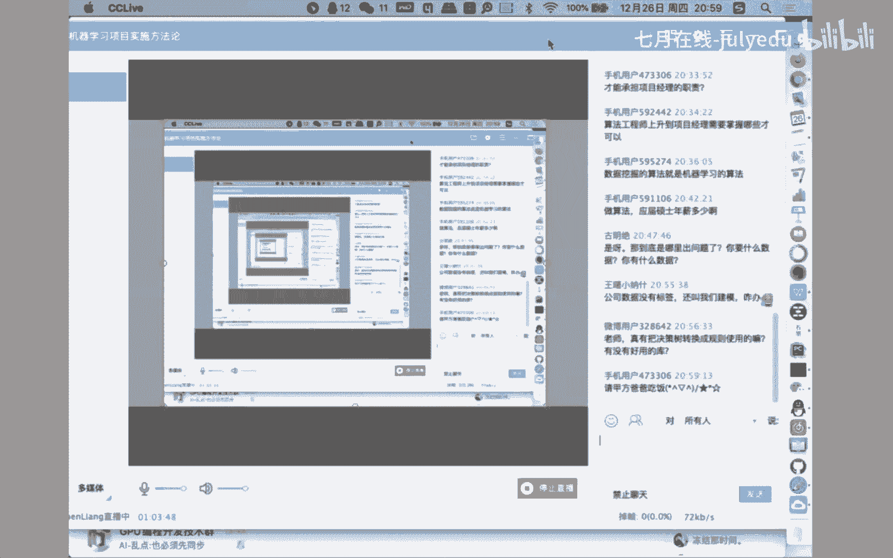

这个这种对吧？这种事情还用沟通吗？好吧，OK嗯。是吧。😊，呃，这是呃基本的一个流程哈。除了流程之外呢，我们其实不光是流程流程很重要。那么具体支撑这个流程呢，还有一些具体的事情要做，就是具体的商业理解。

你要干什么？比如说确定商业目标，对吧？这个商业目标的确定一定不是你拍脑拍脑门，不是你拍脑门能够做的，一定是。😊，Oh。和甲方好好的开会啊，让甲方能够确定他的商业目标是什么，你别给他定义你的商业目标。

你根本让他自己把他自己的问题想清楚。当然你可以协助他，但是你一定别替他去做这个工作，让他自己想明白了，否则的话，他这个问题一旦定义不清楚，你后面改需求，那是太经常了。所以说有的时候你也不能怪甲方改需求。

因为甲方本身他改需求，对甲方来说改需求，这不是天经地义的事情嘛。如果你不能够很好的去固定和解决他这个需求困惑的问题的话，我觉得那只能是你自己的工作做不到位，需求管理啊。

就是对甲方的需求管理也是一个非常重要的内容，什么意思啊？啊，很多的技巧啊，就他提需求，他甲方的嘴对吧？当然包括咱们乙方项目经理的嘴，那都是嘴，对吧？说说而已，你怎么让他去控制他的需求内容，我觉得还是。

还是有很多工作需要做啊。环境评估，你哎有的时候啊领导对领导说这个拍板这个事情可以做啊，到咱们具体实施层面上了，你需要对整个的项目进行一个详细的评估，有没有资源时间对吧？人员嗯技术能力啊，这都是你的。

资源的问题。需求假设约束风险啊，特别是风险啊，技术风险是一方面，业务风险啊，组织风险各种各样的不确定性是吧？你都需要对整个的项目有一个嗯项目价值的一个判断。就是所谓的项目经理为什么要求很高啊？

就是他不光是一个。啊，基础上的事儿了是吧？另外一方面就是哎你看这是对我们整个的环境的一个判断。你到了甲方，你可会发现哎，这个甲方到底靠不靠谱，有没有钱啊，这个。😊。

另外你比如说甲方的这个这个甲方领导有没有在他们单位的话语权，话语权怎么样？业务专家到底是谁？业务专家的这种能力或者他的强势地位到底是什么样的？你自己有一个判断，对吧？你做工作还是那样资源有限。

你在有限的资源投入到哪些关键的工作当中去去做谁的工作才能产生更大的价值，这都是。进行一个判断的。另外一个对你自己的最自己能力的一个判断，对吧？你自己整个项目组的两把刷子是怎么样的。

能不能hold得住业务需求的这个问题在解决。这都是我们的项目经理或者产品经理能够提出的一个很大的一个挑战啊，制定整个的项目计划。如果你觉得O这个事可以干啊，那制定计划只是商业理解部分。那么数据理解。

数据源始数据收集描述探索以及质量的检和。嗯，嗯，给大家说一下，现在有的时候就是理想很丰满，现实很果敢。你到了数据层面上，你会发现各种各样的业务数据，那都是千奇百怪，离奇。嗯，不确定的事情。

那这个时候你怎么去衡量这个。这个时候啊这个业务数据理解完了以后，一定要让甲方能够充分的意识到他自己的这个数据情况，你自己心里没点数嘛，你那业务系统都乱成什么样子了，那数据质量都扎成什么样了。

你要求我后面干干什么干什么，对吧？你得让他自己当然需要技巧啊，你不能这么直接说，但是你还是比如说在项目到了这个阶段开评审会的时候，对吧？我列出来当前业务系统当中，对吧？有什么样的数据表。

数据表里面有多少字段，具体的数据质量是怎么样的。我通过数据集合查核，嗯，对吧？你你你你得你写的清清楚楚明明白白的，甲方觉得啊也是没问题，那这个时候你在这么一个渣数据上还能让我做出什么样的结果来。

所以说为什么叫做需求管理啊，就是这样你你一定要控制住甲方的这种冲动是吧？他能上说上天，你得把它拽回来，否则的话，你跟着他一块飞，他反正没问题，你怎么把它。把这个项目完成。数据准备上，这都是。啊。

我觉得这个应该是没什么太大问题了。建模我觉得这都不是事情了，是吧？最后的评估还是刚才所说的啊，评估不是不是你想当然的认为，不是你自自嗨啊，你一定和甲方进行沟通啊，这个时候。啊。

各种各样的这种实际的问题哈，还是那样，你怎么去解释这个模型才是最大的一个挑战，最后的上线实施。那么嗯刚才所说了啊，阶段有阶段性的工作，工作每一个阶段都有它的输入和输出，形成文档化。我一提到这个地方。

有的时候可能很多的这个年轻的同事哈，就就就就皱眉头是吧？啊，又是让我写文档。是这样啊，同学们不是说就还是那这是个工程上的事，这其实已经不是个技术上的事儿了。

我一我一直是希望能够啊年轻的同事们能够快速的认识到这个问题啊，不是个纯技术上的事，因为纯技术上或者纯问题的解决。有同学我你给我数据，我给你构建模型就完了，这是我的活就干完了。是可能是你的活干完了。

但是给大家说整个项目的活谁干，我整个项目的需求怎么去解决啊，你的活你你是能够理解别人能不能理解，就项目组里面的其他同事能不能理解项目组外的利益，相关方能不能理解这个可能是更大的问题。

那怎么让别人理解文档化啊，在需求理解在商业理解部分啊，把各种各样的问题明确下来啊，需求固定下来，让甲方能够理解签字确认，有同说啊一看见你就没干过项目，甲方签字字了说不算不就不算嘛？是啊。

但是你可以作为后面讨价还价。😊，大的一个依据对吧？甲方主任，你看这是我们开需求调研会的时候啊，对吧？列如三个需求ABC我们当时觉得也没问题啊，但是咱们也确认了，你还签了字是吧？

现在又提出了DEF3个需求，我们确实是能力有限，达不到，对吧？这你讨价还价的一个依据呢，不是说不让不是说不改，肯定甲方需求提出来了，你能不改吗？改没问题啊，你看是不是费用上我们调整调整是吧。

是不是时间上我们调整调整。这都是沟通上的一些依据。那有方说你这一开始就说你这东西假如签了字和不签没问题是啊，但是你总手上有东西了，对吧？啊，这是业务理解。那么数据理解部分，各种各样的数据报告。

刚才已经说了啊，特别是在数据理解部分。数据报告完成以后，一定要和甲方进行确认啊，开个项目项目阶段的一个数据分析会是吧？现在业务系统里面，我分析了三个业务系统，这三个业务系统里面有有4个库。

四个库里边有20张表，每个表是什么样的，数据质量是怎么样的。甲方我们的业务专家对。😊，对他的一个解释说明情况是怎么样的，数据质量啊，让甲方也心里有个数啊，后面还是那个问题，他。

自己的对自己的数据的情况还能没数吗？但是。把它表面化啊，让大家有一个沟通的一个渠道。那后面关于数据准备和建模，我觉得这个啊这个我觉得是咱们自己的事情是吧？各种各样的参数调优，把这个形成文档化的一个结果。

就是使甲方能够认识到，我们工作了，并且有成果啊，开后面的项目评审会的时候，把这些东西作为文档的东西拿出来，对吧？我们基于什么样的数据构建了哪些模型得到了哪些结果，基于这些结果的分析，我们做了哪些调参。

调餐的结果是啊我们我们构建了8个模型，这个8个模型通过调参比较之后，我们最后生成三个这三个模型，两个可解释，一个不能解，不太好解释，我给你分别解释一下。你看看咱能接受哪个模型。

最后说哎这三个模型两个解释不了，接受不了，就一个可以解释。那O就是你的结论性的东西嘛。所以说还是两个文档化。另外一个是评评估开评审会。给大家说一下，在评审会的时候谁做决策，当然是甲方领导做决策。

还是那个问题。你要做的工作核心对象是谁？甲方领导吗？你向甲方领导解释，你构建了什么决策书模型，疯了，你给他讲那个那那是谁？😊，不要忘了，刚才说过，甲方那里也有所有的业务专家是吧。

一定是向他进行充分的交流沟通，使他能够理解咱们的工作。让他去说服领导拍板说哎，这个事情可以，那OK没问题了吧。哪怕你最后就部署实施阶段，那是开发的工作，那个也不是太大的重点，好吧。嗯，文档化哈。

那么一些常见的业务问题啊，你就是说经常会提出一些问题，你你你得很好的能够把甲方的甲方提出来的需求映射到。这些里面去啊，这样的话我们解决起来应该问题就不是特别大了。比如说一类问题啊。

这个数据描述或者数据总结。什么意思呢？就是使用基本的统计方法，对我们已有的数据啊进行一个描述。使用的基本的工具呢，比如说同比环比百分比啊，我总结就是3笔啊，同比环比百分比。

这是在大量的数据分析报告当中使用的基本的数据分析技巧。嗯，怎么说呢呃。很多的业务分析系项目啊很多的所谓的机器学习项目，甚至所谓的人工智能项目啊，最后停留的的结果就是提供一些数据的同比的分析，环比的分析。

百分比的分析。我就说是挂羊头卖狗肉啊，这东西。初中以上学历水平是不是就解决得了了？但是呢不得不承认还有很多的项目停留在这个阶段。但是呢另外一个一个一个一个角度去认识这个问题呢，就在于。

因为毕竟同比换比百分比是能够使得甲方理解和接受的一个结果，对吧？甚至有的时候你勾建的那个模型不能解释，甲方认识不到价值，那还不如同比换比百分比呢，是吧？同学们。

所以这个问题啊就是第一有一类问题就做数据描述和总结性问题。那么另外一点呢就是所谓的细分啊，这个所谓的细分呢嗯就是所谓的将数据啊划分为业务上相关的子类或者子集。这其实我们认为它是个所谓的聚类问题。

或者一个聚类分析，这个所谓的细分问题和下面的分类问题啊，是经常甲方会自己搞不清楚的问题啊，嗯，比如说电信那边它就有一个问题，对我们的用户进行分类啊，如果弄不清楚的时候啊，分类问题啊。

按照我们的分类模型构建，就会碰到刚才那个同学碰到的哎，没标签啊，我怎么做分类，但是你会发现这是个分类问题吗？甲方提出来的分类，但是我们能够正应该能够正确的映射成这不是个分类问题，这是个聚类问题。

至于他已有的用户的行为的一个聚类分成了若干个类别。甲方不懂所谓的聚类，它它就是个分类，对吧？这就是刚才所说的，甲方的视角和。业务模型域的问题，你需要在充分的理解业务问题的基础上。

把它能够正确的抽象成我们的技术问题。你会发现这个时候你的价值就体现在okK这不是个分类问题，这其实是个聚类问题。那后面我给我的小伙伴说的时候，哎，我们使用的是所谓的聚类模型。那后面什么普聚类啊。

什么层次聚类啊，什么最简单的com是吧？这个时候。各种各样的具例方法，那就不是问题了。所以说啊这个很重要。另外一个预测问题就是回归问题了，是吧？你对业务发展的一个预测，对吧？对天气预报的一个预测。

这都是回归嘛，你可以用都用大量的这种回归模型可以做。啊，依赖性分析。这个时候呢就所谓的关联规则。这个地方刚才也给大家说了啊，这个这类模型呢一般是在机器学习书里面是没讲到的。

其实我也非常建议同学们能够找一本数据挖掘书啊，数据挖掘的书把其中的所谓的关联规则这一章能够单独的看一下，其实也是非常有用的。特别是。😊，你像做推荐的同学啊，当然现在这种推荐模型也很多啊。

基于深度学习的推荐模型。但是它的根儿其实是在关联规则上啊，怎么建立频繁相机，其实有有的时候还是有一定作用的。另外一个就是概念描述，特别是构建这种决对数模型，对我们的每一个呃规则进行一个描述。

也是非常重要的内容。但是不管怎么样啊，大体上大体上是能够把我们的业务场景当中所所有的问题，能够映射成我们的技术侧问题，大概是这些找到找到不同的模型进行解决也就可以了。好吧。😊，嗯。

以上吧以上是我们对整个的二DM的一个简单的流程分析，以及各个阶段的主要内容。还有呢就是我们的业务问题的一个抽象以及文档的一个生成啊，这是我们今天的第二大内容吧，看看有什么问题吧。

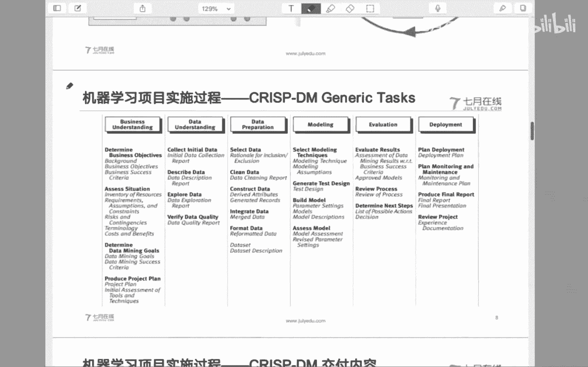

Okay。嗯，我看看。别人觉得需求只改了一点点，但这边实际情况可能从底层架构就全部改，互相不能理解，对吧？那不理解也太正常了，甲方管你什么。底层架构改不改？但是你这个的时候你就需要。

让他能够认识到怎么认识到，那就做工作呗，请客吃饭是一个对吧？你不断的。嗯，你的态度怎么样，是不是你让他能够信任你，能够理解你。这个有的时候是原则方向性的，具体实施起来只能是因人而异了，是吧？

数据中台啊嗯这个话题我很少讨论啊，就因为数据中台可能更多的我不太好判断，因为我确实不是这方面的一些工作，确实没有做，所以我不太好说，好吧。呃，这个PPT看情况吧，然后这个能不能放到群里去和大家分享一下。

我不听我不听，我就要分类，不能用局里，不用分类就终止合同，那就是分类啊。嗯你什么聚类，我觉得这个聚类这个词就不应该给甲方说，能明白什么意思吗？在甲方和甲方沟通的时候，那就是分类，就是把他的用户进行分类。

只是你自己清晰的知道这在技术测是个聚类问题，使用的是聚类方法。你是啊这个。还是那个问题啊，你根本就不应该向甲方去说什么所谓的分类。但是这个意识和这根弦儿你自己要清楚。在甲方沟通完成以后。

回到组里面和咱们的。算法应用工程师沟通的时候，你知道这是个聚类问题，能明白什么意思吗？就在甲方那里就特别是这样，甲方跟本说什么什么聚类，什么分类不懂啊，确实是不懂，人家应该懂吗？

人家人家没有义务去懂我觉得是个是讲理，对吧？什么什么聚类分类，你们的问题，我就要分类，我就要把我的用户进行分类。😡，所以说你看这就是这就是刚才我们所说的怎么去。使甲方。认识到你的工作。

这个时候一定不是把责任放到甲方那里，对吧？而是你的态度做一个转变。嗯，就是分类好吧。嗯，其实是大多数互联网公司开放项目的一个普遍过程。对，因为是这样啊，就是嗯本身这个过程就是这个流程就是具有普遍意义的。

所以。在。上个世纪90年代才被分析出来嘛，就它内部逻辑是有价值的。只不过呢就是这个内部的逻辑，在不同的项目当中的实施里面。有些项目可能符合了这个内部逻辑，有些项目可能没有符合这个内部逻辑。

我觉得这不冲突，也不矛盾。比如说。就像。各自有各自的进化途径一样，对吧？可能几十年以前已经有项目进化到这个阶段了，可能有些最近的项目才开始向前进化。

可能有些像互联网公司的项目也已经开始已经完成了这个进化过程。对吧所以说我觉得今天这个内容呢可能是一个具有一定普遍或者通用价值的内容。所以才和大家有一个分享。这不妨碍啊。

它到底是不是在呃哪些领域或者哪些公司当中使用过，我觉得这不冲突和矛盾，对吧？

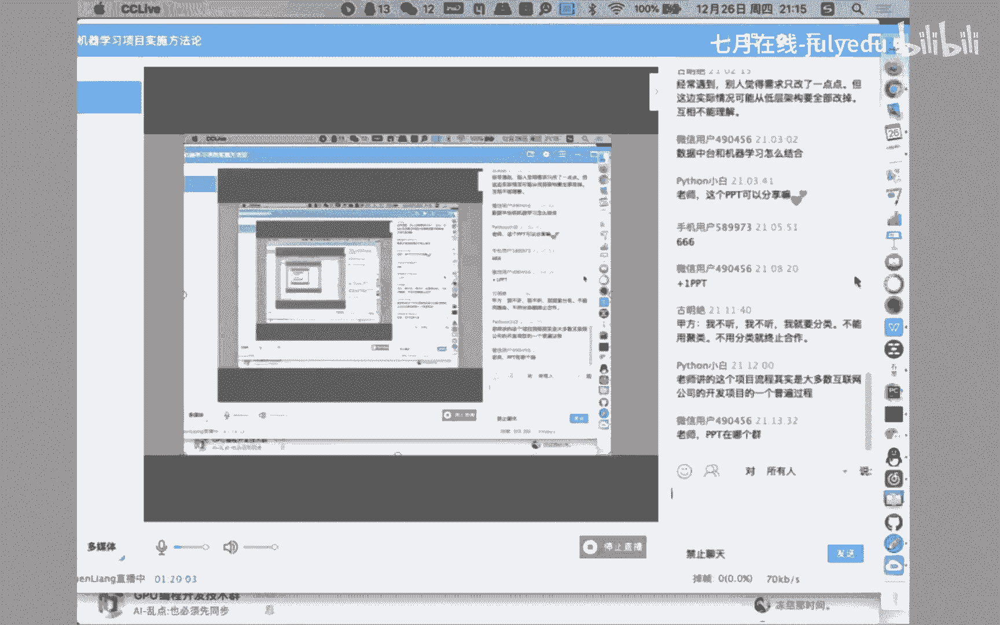

ok那下面呢。嗯。OK那举一个例子吧，就是之前做的一个项目和大家分析一下吧。OK就是嗯一个延伸期降水的一个项目啊，你你不需要对业务有个理解，我只说明一下，你看什么是延伸期降水。

我也当时也是第一次听说这么一个概念，那怎么办？没什么办法啊，到人家甲方的图书馆啊，接上几本专注啊，好好的花上时间去学习请教啊，这个时候你就向业务专家请教，向书本请教。

你最后才搞懂了什么叫做什么什么他妈的叫延伸期降水，对吧？知道了这个问题以后，你才能从大量的论文里面找到一个就这么个东西啊，别人已经做完了一个工作啊，你对这个工作的分析之后。😊。

你发现O还是还是有可改进的啊。这个你分析完了结果，你会发现嗯整个的项目是在江南啊江南省份在气象台站上啊做了一个延伸期降水的预报工作，它构建的模型呢，就是所谓的基于主成分分析的啊。

基于主成分分析的一个多元实质回归模型啊，通过这个阶段这个问题，你会发现O这已经到了我们这个啊可以理解的范围当中了，是吧？主成分析降维完成以后，构建一个多元实质线性回归模型。

其实最本质的啊实质线性回归还就是个回归。你不管你实质不实质，你反正就是个回归模型，而且是个线性回归模型。前面加上个实质，只不过是做了一个周期性的一个岩时。但是你会发现O。😊，做一个线性回归模型。

降降维就能发论文啊。我觉得这时候你对业务有一个有一个相对比较成熟的认识了，是吧？最后看结果啊，结果也好不到哪儿去。所以这个时候发现O那我们用一些非线性的更高拟合能力的模型。

是不是也可以作为当前问题的解决的模型之一啊，你心里不就有数了吗？换模型呗，说实在的，你陷性回归模型，这对咱来说还是是么，是吧？再往后啊，其实我们做了几个问题梳解啊，分析啊。

第一个多线性回归模型的拟合能力，非线性拟合能力将对比较低。因为它本身就是线性模型嘛。第二个它采用的还是主点预报，并没有你和所谓的空间特征。第三个呢就是只使用到了850百万的基面镜象风作为一个主成分特征。

其他的特征有很多，它没用到。那这样的话，解决方案就出来了。第一个我用1个RSSTM，对吧？这个东西我很很很正常嘛？我用1个循环神经网络做时间特征维度的提取。另外一个我是不是可以使用所谓的卷积操作。

把空间特征提取出来。那第三个我综合多个气象特征。😊，对于我们来说，神经网络里面的各个特征越多。那还是是问题嘛，对吧？那可能之前。这三个不足对我们来说，这不技术方案就有了嘛？用循环网络提取时间特征。

用CNN提取空间特征用。申经网络提取整个的多维特征。那后面的工作就是数据数据准备嘛。就业务理解完了以后，对业务有了理解以后，你大体上有了一个判断，对吧？有了有了对业务的理解，发现哎。

这个问题的解决是有可改进的地方了，那你的业务解决方案不就出来了吗。那么对数据的理解。那当时我们对整个的这个省份的气象站进行了个打点。打点发现以后，哎，它的站点的分布还是相对比较有规律性的对吧？

空间分布特征还是比较均匀的那也就为我们后面。😊，进行这个空间特征提取带来了一定的准备。那对数据的情况的准备。除了刚才我们所说的，用了空间特征时间特征之外，还有们一些其他的数据特征。

对业务系统里面的数据的分析发现，还有很多的业务特征。这些业务特征在之前的工作当中是没有使用到的那我们就拿出来用嘛，这对我们说技术上还不是问题了，是吧？那后面反而下了第嘎。卷积网络提取空间特征。第二个。

使用循环网络提取时间特征。第三个，融合综合的气象特征，构建全链接的神经网络，最后多模性的进行一个学习融合。第4个进行一个已构计算。那我们我们的技术方案啊。

就是刚才所说的打点完了以后的这个气象台站进行一个山格化，山格化之后进行一个。因为有了山格化以后，其实就是有了经纬度了嘛，就是根着经纬度进行山格化嘛。山格化以后，其实我们不就把想就把它想象成一张图片。

对吧？有了图片CN上做特征空间特征提取不就完了嘛。所以说你会发现我们第一步哈做的是空间维度上的特征提取。由CN嘛，然后呢，有了CN特征提取完成以后，剩下的就是RN的一个时间维度上特征提取。

当然这时候我们可以做空间时间上的一个维度上的切片。比如说近期的中期的和远期的。因为我们分析下这个这个降水其实还是有包括就是近期规律就是你今天如果下雨了，你明天下雨的概率其实还是蛮高的对吧？

降水也是个过程嘛，周期性的可能比如说以周为力度的啊，后面趋势的，比如说以以季为力度的。你们有些降雨季，它可能下降水的概率有很多呃，旱季可能降水的概率就相对比较少，对吧？

所以我们会发现在不同的时间尺度上进行一个切片，然后训练不同的模型。这后面我们再做一个呃这个特征融合，那再往后呢就是这样，刚才所说的嘛，就外部特征，我们扔到一个全链接里面去。

这样的话四个模型一块训练最终我们做一个其实还是做了一个加线平均，对吧？从不同的模型上提出不同提取出不同的数据来，最后做一个融合后面的这个。损失定义其实就是回归问题嘛，然后做不断的迭代循环嗯。模型出来了。

然后最后面我们还是有点设计的，当时是。项目里面我们其实就用了刀cker做了一个就是云化。然后不同的刀块当中跑不同的这个呃，因为我们是四个模型嘛，然后跑不同的模型，最后做了一个模型融合。

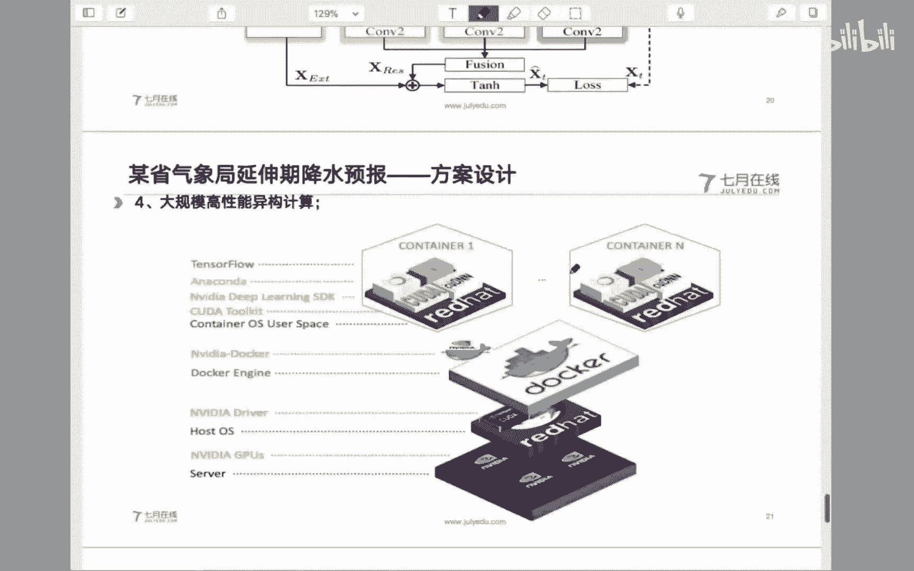

最后我们的方案出来以后，其实还是那样，就是我们把这个方案。呃，向我们的甲方的业务专家进行充分的沟通，获取到认可以后，虽然我们的结果不不是特别好啊，但是业务专家认为按照这个思路去做啊。

一定会今后对我们的业务问题的解决有很大的帮助的。那这个时候开项目评审会，基本上就是业务专家再向他们的领导做工作汇报。我们基本上就辅助支撑一下就可以了。对吧？

这个时候才能达到我们去解决这个业务问题的一个目的。好吧，这是我们之前做的一个工作的一个一个一个回顾吧。算是啊像这种问题呢，其实也是你做你只有一个个的去做啊，最后才能解才能起到这个解决问题的一个目的。

那么今天啊今天我们就再简单回顾一下，就是还是一样，希望能够。

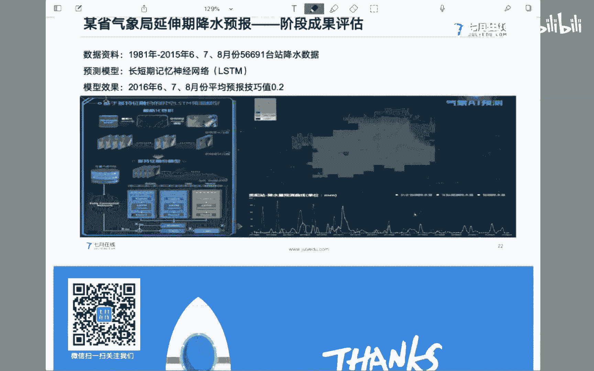

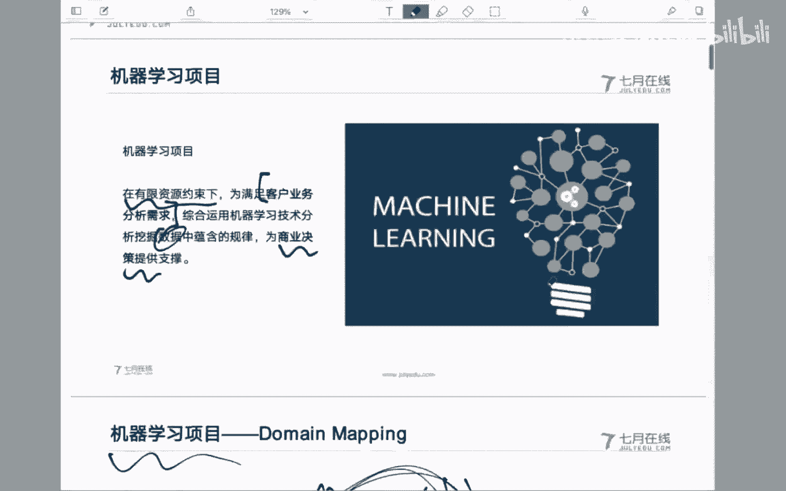

根据之前的工作的一些情况呢，嗯总结出一个方法论啊，虽然不成熟啊，虽然不成熟，也是希望就是大家呢如够结合着自己的实际工作经验啊，总结成自己的一套方法。当然就刚才那个。这DM呢也是有有不同的意见是吧？

那还是还是有很多改进的地方。首先是我们是项目项目器学习项目的一个定义啊，还是那样不要把自己。

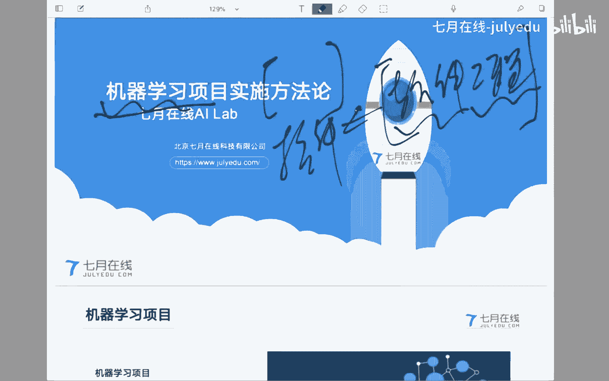

嗯，定义的多么的高啊，一定要低调啊，这个时候。越高越危险啊。另外呢是两个问题域的映射，现在是所谓的符合人才的一个需求啊，就是项目经理或者产品经理这个定位，也是希望同学们能够有一个快速的一个演进。

另外一个就是甲方乙方的这个人员哈有其实还是挺复杂的，不管是你项目组类面，还是项目组和甲方的这种关系，一定。找好了自己的定位，把自己的工作完成以后，试着能够协调。比如横向在项目组里面的协调。

纵向在项目组里面协调，跨项目组的工作协调，这都是非常有意义的事情啊，千万不要说我就管我那一摊啊，我就管我这自己的事，干完了我就不管了，一瞪员嗯什么也不管。嗯，也不是不行，对吧？个人有个人的这种这种取舍。

但是呢我觉着。嗯，还是有更多有价值的事情可以做。另外一个就是关于整个的风行论。当然这只是一个可借鉴的模型之一，你可以在实际工作当中，对整个的模型的各个步骤进行不断的协调改进，对吧？这都是很正常的。

但是不管怎么样，我觉得整个的模型在逻辑上还是没有问题的对吧？商务商业理解、数据理解数据准备建模评价部署实施。当然，中间的呃回还和迭代还是非常重要的。基于数据本身的价值规律挖掘。

每一个过程哈都有每一个过程的侧重点，以及每一个过程都会形成自己的项目文档啊，把业务问题进行准确的抽象，在基础侧找到相应问题的解决啊，后面举了个简单的例子吧。

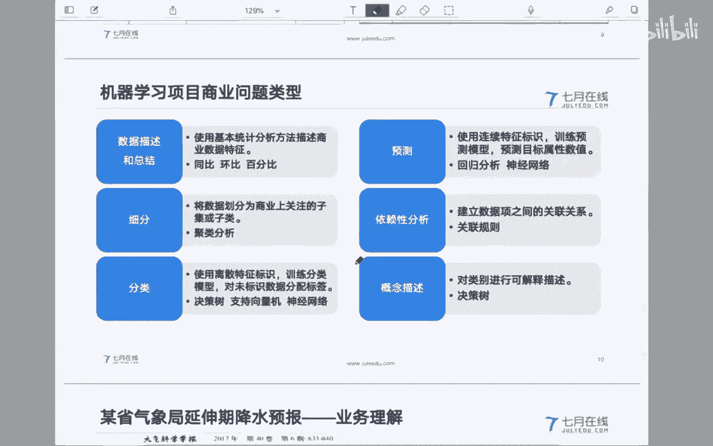

O。😊，那今天的主要内容呢大约okK嗯。也就是这么多内容。当然嗯这些内容啊是个人的一些总结，肯定会有嗯。嗯，不对的地方啊，实实事求是说是这样，就是肯定会有甚至是错误的地方。

也希望能够大家呢就是批评指正吧。好吧，我看看有什么问题吗？这个做算法有职业发展的凭颈吗？收您我还是那样，就是呃一方面如果是。你从年龄这个角度上说的话，我觉得还是一方面你可以进化成所谓的数据科学家，对吧？

是在建模整个的。这个决策上能够有一个。高建立的认识。比如说这个问题抽象出来以后，那你的判断比如说是个。嗯，是个什么样的模型可能更好的去解决。当然这个东西所谓的好和不好，这完全就是个人经验了，对吧？

在有限的资源下，比如说你后面的算法工程师有3个人，那你判断三个业务模型和三个算法模型都可以很好的解决问题。但是哪一个你不能确定，那好了，你就是三个一人一个嘛。如果你觉得有一个挺好，那怎么去协调这些资源。

我觉得这个时候数据科学家对内是需要。把你的这种技术设想能够落地实施的这么一个角色。另外一个角色就在于以你作为一个技术专家的一个背景，向甲方去解释你的工作价值，这可能也是数据科学家需要做的工作。

因为你你你指望项目经理去做。有的时候首先项目经理不一定hold得住啊，他的技术背景和技术能力不一定被认可啊，这个时候你还是需要呃数据科学家做一些工作。当然这个时候就一方面要么你的你需要有些title。

或者有一些说到出出去的东西，对吧？要么你在哪个大厂里面做过多少年的业务分析，对吧？要么你是个某一个方向的什么什么专家是吧？这个时候甲方才认可你的结论啊，才能接受你的结论，这是一方面吧。

另外一方面呢就是做管理嘛，做项目管理，对吧？在整个项目组当中起到一个领导和协调的一个角色，并且呢向甲方进行一个。沟通啊，这个我觉得还是就是职业发展，特别是随着年龄的增加哈。

可能会不断的希望能够往不同的方向发展。其实还是两个条路，一条是做业务专家，一条是做就是一一条是做技术专家，一条是做管理专家嘛。嗯。对啊，基础就是协助，就是支撑，就是辅助，千万不要把自己抬的太高。

之前说句不好听了。有的时候有一个项目前期做销售的同学在沟通，做销售啊，大家都都懂是吧？那嘴去了以后就说我们这个模型部署上线以后啊，咱们所有的这个业务专家都就都可以回家下下岗了，我扯嘛。

你这你后面把你这话一说一表态，你后面的工作怎么做，我去了以后。花了多大的成本才把这个事情能够啊啊等能说扭转吧，至少是一定程度上减弱这个糟糕的影响。你去之前，你说你哦，你一来我就回家了，那你还来干啥？

你先走的是你对吧？滚蛋的是你，所以一定把自己这个放的低调一点，好吧。嗯。Yeah。数学差怎么办？这个我觉得是这样，就是怎么说呢？😊，嗯。补吧，数学差，谁谁天生数学也不好，对吧？你你。😡，学嘛。

这还有什么问题吗？嗯， ok 。嗯。好吧，今天我们也大约是从嗯8点钟开始，我们正好用了一个半小时的时间。嗯。我们就暂时和同学们交流到这儿，好吧，当然还有很多的内容啊。

也不是说一个半小时就能充分的沟通的了的。嗯，看情况吧嗯。那这样今天也非常感谢同学们能够抽出时间来和一块儿和大家也是学习一下。好吧？有什么问题的话，我们可以在群里也可以讨论一下好吗？OK啊。

也谢谢各位同学们。那这样的话我们再见，好吧。😊。

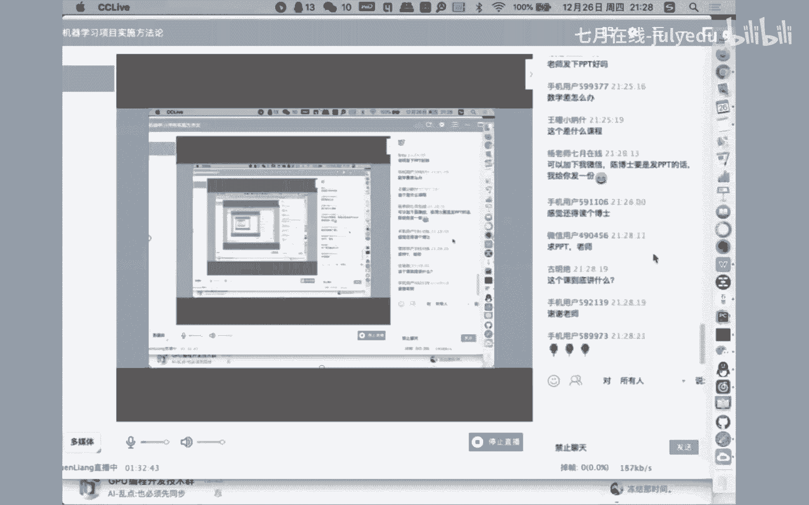

