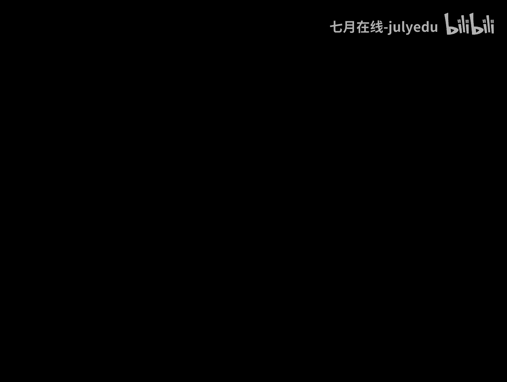
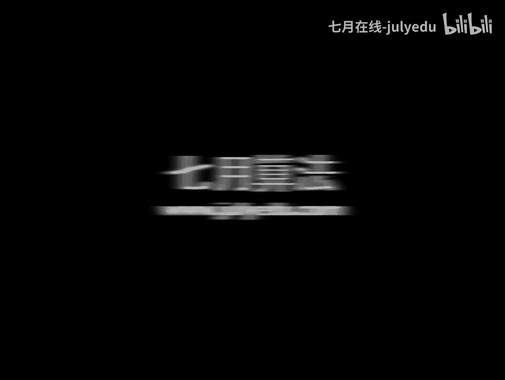

# 人工智能—机器学习公开课（七月在线出品） - P13：极大似然估计 - 七月在线-julyedu - BV1W5411n7fg

🎼。现在呢我们把举估计先撂一边哈，我们把上次跟人家谈到过的贝斯公式再去给出一个说法。啊，给定样本D这个时候。在给定样本D的前提之下，A这个结论发生的概率其实可以写成这一坨，对吧？这个就是贝斯公式。

当然你可以把PD打开了，对吧？呃，这样子的话，我们如果给定了某些样本D这个D表示是X1X2的XNN个样本哈，对吧？反正总之给了一1一组样本，然后呢，在这个样本中。

我们可以计算结论A1计算A2计算AN对吧？这个所谓的A1A2的AN其实就是呃参数是塔一的时候，它是这种情况。所以在二时那种情况是在那种情况，对吧？总之它有各种各种可能情况，对吧？

我就可以计算在数据样本给定的情况之下，AI的概率值，对吧？而这个东西根据它是写成它嘛，对吧？而这个PD这个样本已经给定了，都处以同样值，所以PD这个值可以扔掉的，不要了，它是规划因子。

所以就是它和它对吧？而这里边如果我们大体上认为PAI的这个鲜验概率是相等或者近似的时候啊PAI把它扔了，就变成这个东西了。对吧所以说这个东西大体上可以用这个东西来做近似。换句话说哈。

咱想去做的事是什么呢？是给定这组样本之后，A1A2AN出现了哪个概率值最大，我们就取谁，对吧？而这个东西其实我们可以反过来想，就是。A一给定的时候，有可能出现这个D的概率是多大。A2给定的时候。

这个概率是多大。那么说哪组参数给定的时候，这个数据出现的概率值最大。我就认为那种情况是最有可能得到我的数据D的，我的样本D的。对吧所以说这是这样一个解释哈，这个解释非常重要哈。

O我们先来看看大家的问题啊，就是为什么会有去掉PAI呢？PA啊就说我们有时候哈会把这个呃先艳条件认为是相等的，差不多的。先艳分布。就是说呃比如说抛硬币吧，我可能认为这个概那个朝上的概率是0。1。

朝上概率是0。2到场的概率是0。9，就九种可能大体是差不多。我们就认为它鲜艳概率都是10分之1，就这意思啊。所以呃我们就把它。扔了不要了。事实事实上哈大家如果觉得这样理解不方便的话。

我们就先不这么思考啊。总之我们。说另外一个想法。我们说另外想法啊，就是说我们如果说拿到了一组样本，如何去估计这个样本背后，它的总体的参数呢？我们这么来想，就是总体的那些参数，它可能取西塔一这个参数。

可能以知塔二的个参数，可能到西塔N这N个参数都有可能取，那么说可能西塔I那个参数的时候，得到这个数据的概率是最大的。OK我就把那个西塔I认为是你这个总体的参数。对吧我让你出现这个数据的概率值最大。呃。

出现这种情况这种出现这种情况，这个这这这个这个现代汉语哈。像这种情况在文言文中叫似然，就是像那个样子。像那个样子的情况最大，我们把这个东西文言文中把它叫做似然最大让这个似然的东西起极大值。

这种方案的估计就是极大的似然估计。自然啊像那个样子，像在那种情况下，数据是最有可能取到的，就这玩意儿哈。所以这个词的呃概率论里面这两个举估计和其他自然估计的这个。词语本身还是比较。无语化的哈是吧？

应该是呃很早之前就翻译过来了，对吧？事实上我们有时候把这个PD叫做自然哈，这里咱就不再具体解释这个事情了哈。OK不行，大家对这个问题我好像疑问很多，我们看看啊。😊，嗯。

会糊涂说maxPAI这个东西这个表达是不明白什么意思。哦，先说这个东西啊，PAI givenD哦。我把竖线图的基本没问题吧，对吧？就是给定的情况下，就是在AIgivenD对吧？

然后表示是在给定数据D的时候，A一出现的概率，A2转个来到AN出现的概率，哪个值最大，我就取谁取max，对吧？因为这个AI是变化的嘛，A1到AN嘛，对吧？这个意思啊。啊。

后面就是一些只是对他做了推导了哈，然后似然和概率有什么区别？啊，两码事对吧？自然我们认为是这个数据出现的可能性。自然嘛就是嗯这种。情况它能够出现的那种概率。4。呃。

然我觉得应该就是什么什么的样子的意思哈。四就是什么什么这个数据出现的那个情况，对吧？所以似然就是这个数据能够发生的概率，对吧？是这个东西哈呃。概率就是短公解释了，对吧？呃，似然相当于求这个东西吗？嗯。

O哈，我可能加上这些之后，把人家讲糊涂了，咱不这么讲了哈。😊，咱们可以不用这么去这么严格的去考察这个事情哈。其实我们就认为哪个参数的时候能够使得这个数据最有可能发生。我们就认为那个数据是最好的。

对吧就是我们设总体分布是一个F这个分布我们这个X是我们的一些的。那个这个研究变量C塔呢是我们的未知，但是存在的参数，对吧？任何分母总会写着这种形式嘛，对吧？

比方说不管是坡松分布还是高斯分布还是一个什么分布，还是二元分布，对吧？我们认为X1X2的XN是这个总体采样得到的一些样本。因为这里面X1X2的XN是独立总分布的。那么说我们就可以计算出来它的联合概率。

呃，联合的那个概率密度函数对吧？X1X2的XNC代一4。2的4代K对吧？这里面就可以把这个东西写成这样一个形式，对吧？就是X一这个样本之下，它C代一4。2在给定的时候，这个值对吧？C塔二的时候。

这个这个值多少？C塔三的时候多少？把它这个值都乘起来，这不就是所谓的。X1出现了X2也出现了，XN也出现了，因为我们这为是独立的嘛，所以他们乘起来就可以。这一步用的东西哈，其实就是它。

就是我们要向求PXYZ这个联合概率哈，我们怎么算？如果XYZ是独立的那就可以写成PX乘以PY乘以PZ，对吧？这里面一样，我们这里面只是把XYZ换成X1X2的XN嘛。

那么说只是把这些值分别去乘以它的那个概率，然后乘起来不就可以了嘛，对吧？这里是XPXPYPZ乘3个，这个里面就成N个嘛，无非是这玩意儿嘛，对吧？这个我们就认为是我们的似然函数，对吧？因为是关于样本的嘛。

然后这里面啊我们如果把这个。正常来讲哈，这个西塔是固定的对吧？未知的一些参数和X是我们来抽取出来的。反过来看这个问题，样本其实是给定了的。西塔是我们未知的东西。对吧那这样的话。

这个东西就可以看作是关于西塔的函数。这种关于西塔函数是关于样本相关的西塔，所以我们叫做似然函数。所以这个函数哈。未知量只有西塔X是已知。那么说我们总能通过一。各种各样的办法。求这个函数的极大值。

求出了那个极大值是几那个西塔能够取几O我就把那个西塔带进去。我就认为这种方式求出那个西塔值来了，这种方法就是所谓的极大的似然估计。对吧。呃，这是我们的一个重要概念哈。

事实上大家不要觉得吉大师战估计这个内容非常的古老哈。这套思路的提出离咱的生活非常近，大概也就是100年的时间。就是人类认识这个东西时间并不长哈，100年比那个什么微积分要晚的多哈。

那种它大概跟就是跟光电效应啊，跟跟那个终止原子发现哈，那个是同时期的，就就那玩意儿跟集合论啊，跟那个是同时期的一套思维习题哈。所以是个很近的概念，其实本质上。呃呃，刘超说，从已知数据抽取数学模型。

可以怎么认为哈，对吧？抽取一个数学模出来，但这个模型这个模型太简单了而已是吧？这N个西塔失取不同的值，然后看哪个西塔哪个值能够使得40函数有最大，就选用哪一个值作为最终的西塔值吗？是的。没错哈。

这个这种理解没有问题哈，我们给个具体例子好了哈。我们给个具体例子哈，当然这里面这个咱就不讲了，这个这个咱就。咱回头来再看就好了哈。就是说其实咱实践当中不是。直接去算自然函数的极值。

是取对数之后得到所谓的对数自然函数，取对数自然函数的导数，然后得到注点，然后分析这个注点是极大值或者极小值等那些东西哈。对吧然后呢，我们给个具体例子哈，对对看这个那老师老师混是吧？看这个。这个呢比方说。

加三估计，我们目的就是找出和样本的分布最接近的那个概率分布模型，对吧？比方说举个例子，比方说十字方用币，我们得到结果，正正反正正正反反正正。那么十字方用币哈得到这个结果。

OK我们假定这个P这个小P哈是每次抛用币结果为正的概率。这个P是未知的哈。我们要算的就是这个P。对吧我们不知道抛M币得到剩的概率是多少吗？不知道这个P是多少，我们要算的就是这个东西。

O我们就得到它的自然函数，这个大P，它是第一个得到的正，它的发生概率是P。第二组得到正发生概率是P，第三次是反，它的发生概率是一减P，这个是正是P这都都都都写成10次，对吧？

大家很显然发现这个东西可以化化简一下，得到P的7次幂，一减P的3次幂。对吧。问题来了。我们现在其实得到一个什么东西呢？我们如果大家看这个觉得不熟哈，但是我这么写。给定一个函数FX。

它等于X的7次方乘以1减X的3次方，并且X是从0到1的。对吧这是咱的那个定义域，对吧？X是有0到1的。然后你算一下这安F这个函数的极值。X的7次幂乘以1减X3次幂它的极值。不是这个问题吗？嘿，合算了吧。

😊，这个函数求吉，这还不容易。😡，对吧所以他求极制怎么做呀？我现在没有给哈，总么做这个函数求集值。我这里敲了一瞧。给单敲一下哈。呃，直接求导搞不定哈。直接球他搞不定。

就说还记得咱在第一次跟大家说的取对数那种方式吗？FX取6之后就变成了7倍的Lin，加上3倍的Lin1减X。对于这个函数两边再求导，就是X分之7。OhX。逾期加上。单倍的1减X，然后他取个负号。

对吧就这玩意儿嘛，你让它取等于0，我不就求出来了吗？这样的话X就能求出来等于0。7，对吧？就是这里面的这个东西嘛。这套思路就是极大市场估计的思路。OK了吗？就是你给定这种样本，给定这个样本。

我去求这个函数的极值。我求完极值之后，那个值就是认为是这个。在这种极制之下的这种自然情况的一个估计。对吧事实上你如果真要是较真的话，你要取它的二阶导，看它是最小值还是极大值，事实上是个极大值，对吧？呃。

我这样哈，就是说小小江朋友说了一个，说这是极值还是最值呢呃。这样哈就是说在教科书中这两种说法都存在，有人把它叫做最大自产估计，有人把它叫做极极大自然估计呃。嗯。可能可能叫最大自然估计，也许是更合理。

为什么呢？因为我们想求的是全聚大嘛，但是事实上咱的实际的做法上哈，实际的这个呃做法上其实都是直接对它求注点得到的。而你求注点本质是求的极大值。对吧所以说你的做的内容其实是极大自场估计的过程。

所以我有时候会更倾向于把它叫做极大自场估计，这是一个说法而已哈，对吧？好了，这是关于这个问题哈，下面呢。呃，也就是对于西塔不需要预先。那当然了，就说这套理论是非常完备的。

不需要说西塔预先取几几几几几张得到的啊，咱就上来就算就行了。对吧。是吧这所以说这套理论。嗯，咱现在看起来是一个呃很简单的思路哈，但是人类发现它其实很漫长，是吧？你想从。呃。

从地摩佛到拉普拉斯到包括到欧拉，对吧？包括到高斯都没有。把这个东西完整提出来是吧？这是很漫长的一个东西，对吧？啊，这没准，有可能有可能是极部最优解哈。但是在指数足这套框架下。极值就是最大值。

它只有一个极值。所以说大家放心用就是了哈。呃，是的哈，就是刚才咱用的是西塔。其实咱习惯上用西塔。比方说这里面如果二项分布的话，其实就是这个概率P嘛。咱就举个例子，正态分布的话。

其实那个西塔就是缪和西ig玛。对吧然后啊指数族的话，大家看看咱第一次可跟大家最后谈的过指数组哈，其实简单的提了提，就大家知道这个理论就好了哈，是个严格意义性的一个数学理论哈。指数族分布。

比方说正态分布脱层分布，高速分那个像什么呃两点分布，二项分布呃，均指这这就均匀分布，这就都都属于指数组分布哈，都是那个族的，他们是一家的哈，其实。呃，一个一个大奖还没出五福。是吧O哈。

我今天可能又要需要拖堂，大概十0分钟吧。咱啊最后这条讲完哈，因为这个例子还很重要，非常非常重要，就是正态分布的极大自然估计是多少。我们现在给定一组样本，就是结论很重要，它的推导过程更重要。看一下哈。

就是给定样本N1X2的XN。并且我们知道它是来自于高斯分布的，来自于某一高分布，均值是缪方差是西igma，但是不知道缪和西igma，你来估计一下缪西ma是多少，条件是XGI到XN是一致的。

这N个样本是一致的缪和西ma位置去估算这个东西。利用刚才那套分析的思路MRE哈及他自产估计。首先我们写出高斯分布的概率密度函数是长这个样子的。对吧包我可能用不了10分钟哈。然后。但里面还是长这样子的。

然后呢，这个XI这个样本它对应的值是小XI，对吧？把它带到这里面去，对吧？那我说在XI的时候，它其实就是把这个X写成XI嘛，对吧？那这样的话，我们写出自然函数来，就是这X这N个自然的概率密度值相乘。

对吧？iphone1到N这N个值相乘，是它这是我们的自然函数，对吧？对这个自然函数显然。这里面XI已知哈这个拍我这这这个常数了嗯。缪和西igma是未知的。我们其实想求的是这个函数的极值。

大家如果是直接去看这个东西，如果大一让大家看的话，就觉得会非常复杂，这是什么玩意儿？让我求极值，事上很简单是吧？我们先对它起对手。这个东西呢取对数就得到所谓的小L，就是我们一般把它叫做对数自然函数。

既然这是一个对乘积的取对数，那么说就把它可以写成对数乘这个乘积的对数嘛，就可以写成对数的加和，对吧？这是对数本身的性质嘛，然后这是一个嗯这个数和这个数又是两个数的乘积取对数嘛，因此就是前边这个数。

和后面这个数取对数，对吧？而这个是这个数取指数再取对数，所以说就光剩下这小部分了，光剩下它了，对吧？而这个东西是个常数啊，这是埃1到N这几个数加起来嘛，对吧？所以说这个log这个数有N个而已，对吧？

我们把这个2分之1次方，那个2分之1提过来，就变成2分之N，这是负的嘛，对吧？这是把这个符号体也提出来了，就变成2派西方了，对吧？因为这是在这其实是二派西格马。呃，方它的负1次方嘛，对吧？

所以那个负一提出来是个一个负号，对吧？变成这个东西。右边这个这个符号拿过来，放到这儿2sigma方拿出来，放到这儿里边这个东西就是它。对吧所以说这个对数自然函数就把它化简成了这样一个形式。

对吧让这个东西在对里面的。缪和西ig玛分别求偏导，然后让它等于0，最终对这个式子我就不算了哈，分别求偏导，然后让等于零就能算出来你的缪是等于这个的。sigma方是等于这个的。但是简单就能发现，其实你。

这样就好了好的吧。这个就是通过极大自然估计去估算的正态分布的参数的最终结果，对吧？这个东西我们看一下哈，其实这个结论跟我们的取估计的结果其实是一致的。对吧并且它的意义也是非常直观的。

样本的均值就是高斯分布的均值。样本的尾方差就是高斯分布的方差。再次强调哈，经典一的方差是分布式减一。提亚斯然估计的时候，它的求的这个方差是N，对吧？这里面其实除了是N哈。

而这个东西真的是符合我们的直观想象的对吧？这个东西哈，咱其实在。在那个线性回归里面，还会或多或少看到这样子一个变化的影子。然后呢，这套东西咱在后面讲到EM算法的时候，讲到高斯混合模型的时候。

也会再次去看到啊。但是那个不管哈，咱今天先把高斯分布的极大自然估计的算法，把它搞清楚，就这么算了。给定了样本我就可以上。算的方式就加算。OK有问题吗？没有问题啊。OK okK那今天咱主要内容就讲完了。

对吧？这就是咱今天要探讨的重要的话题哈，吉大自然估计来去解释这个事情哈。😊，啊，因为这段最重要了，对吧？最重要了哈，就是吉大三5计估计哈。呃。就是我所感觉到的是什么呢？就是极大自然估计这个东西啊。

它其实没有大家想象的那么难。问题是什么呢？问题只是大家时间长了，忘了咱把它回忆起来。几估计呢只是为了引出极大自然估计跟它做个对比。我想告诉大家的就是说除了极大自然估计，还有别的方式去做。

但是呢几估计其实应用并不多。对吧并不多了哈，然后这段呢我这个又给它切到这儿了，大家呃还是看下就好了哈。小谭又谈到了高斯温模型哈，高斯温模型里面每一个观测者XI就是说只来自于某一个高斯模型。

还有这么理解吗？不可以。就是小谭说这个问题不可以这么理解，可能大家。呃，我们在谈到高斯混合模型的时候，再回去跟大家解释这个问题啊，那这不可以这么来理解，我们只能理解成XI是这N个高斯模型混合得到的。

它可能80%来自于第一个高斯分布，10%来自于第二高斯分布，5%来自于三个分布或者5%来自另外分布，对吧？不能认为是某一高斯分布价。OK这个咱上面讲过了，也不说了啊，这是先艳后艳和自然哈。咱今天。

不谈这个事情了哈。呃，这里边呢给大家留一道思考题作业哈这么来说的。😊，抽样我们随机抽样发现哈，7月提供APP的用户实际年龄发现。他的年龄的均值是25，他的标准差是2。我们已经得到这种信息了。请问。

这些用户实际年龄，他位于21到29岁的概率至少是多少？这个题目应该怎么算？这个题目是一个实际的一个笔试题哈，只是我把它。偷梁换柱，把这个题目变成企业7果APP哈。企月75app。

这个题目我要问一下大家怎么算呢？我想强调一点呢，就是说我这里没有。没有给定。我没有给定这个。分布是什么分布，我不知道它是高速分布还是坡速分布，还是乱七八糟呃不可能坡速分布哈，还是比方说它是坡速分布。

还是它是高速分布还是均域分布，当然不可能碰能均匀分布了，对吧？是这么分布，对吧？事实上这里边用lois说的是对的哈。刘易斯说是对的，那个这个东西它其实应该是用J不等式来做的。

对吧因为我没有说它是正态分布，我们只能把它认为是切不缺，不能是严格那那种。那种标准那种那种一般意义下的那个分布，对吧？大家带一去算一下就好了哈，这是第一个思考题哈。

第二就是咱刚才谈到这个刚才小谭朋友说那个事情了，就是说如果说我们的随机变量无法完全得到，大家思考一个题目怎么做哈。就是说我们随机挑1万个志愿者测量他们的身高，这个身高哈，它可能存在男性和女性。

假定男性的身高是高斯分布的，miV sig一女性的是那个分布也是高斯分布的。显然这是有两个高斯分布混合得到的这些样本。这个样本其实我没有踩全，我应该踩全的话。

应该是采到呃身高性别、身高性别、身高、性别这样一些东西我们就可以正常去用高斯分布去做。用那个加酸估计用那个去做了。但是呢这里边这是一个呃部分样本得到的。所以说这个事情这是一个混合高斯分布。

混合高斯分布的话。最方便的解法就是EM算法。就是期望最大化算法EM算法，这个是一个非常重要的算法哈，咱后面会拿出一次课的时间来跟大家探讨这个问题。当然这个东西可以积烈的去做哈。就是这个问题。

另外呢别忘了，就是说咱刚才跟大家前三个问题是跟大家在咱PPT里面讲的过程之中提到过的。对吧另外呢再来说一个问题哈，就是说。嗯，我们可以仿照指数分布的那个概率密度函数，大家还记得吧？

指数分布概率密度大体上可以写成它，对吧？这指数分布联系分布嘛，对吧？既然有指数分布，那么我们就可以指有指数函数。我们有一个幂函数，那么是我们就可以通过指数函数来去指数分布来去猜一个幂分布。密分布的好听。

我这叫幂律分布，对吧？密律分布这个X负S嘛，当然可能有个系数，A，对吧？保证它规划了嘛，大家查一下文献，找找关于密律分布的有趣的东西。常尾分布哈密率分布。是。呃，咱一般的教科书不太介绍的。

但是呢在实践里面有趣的一个东西啊，常尾分布。大家可以看看这个相关的内容哈。并且密率分布常尾分布，它的期望它的方差是什么呢？大家琢磨琢磨啊，这是一个很重要的话题哈。好了。

这个文献呢就大家实验找一本关于概率论收通知书，打开都能找到这种那种东西哈。是的，K荐系统里面会设到涉及到这个事情哈。好了，那今天呢咱就主要的话题就这些哈。然后呢咱可以在咱的呃大家可以上点题。

然后呢也可以这个看看咱的那个官网啊以及微博微信呢，我们共同来探讨今天内容哈。好的，这个等会儿呢会把PPT放到咱的这个群里面哈，这个没有问题。然后呢，今天咱就先到这哈。

咱明天继续关于关于积极学习的这个下面的内容的探讨哈。好好好好好，谢谢大家啊。

