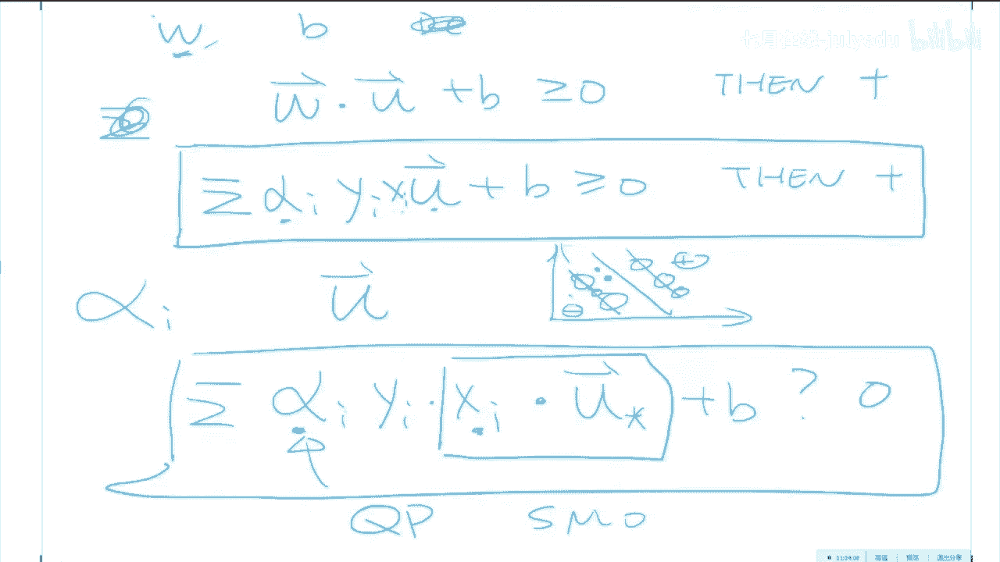

# 人工智能—机器学习公开课（七月在线出品） - P15：老冯经典之作：纯白板手推SVM - 七月在线-julyedu - BV1W5411n7fg

啊，我们来今天呃学习这个。SVM啊一个非常。这个SVM这个算法应该是每一个呃研究机器学习的人都应该掌握的一个工具包。

甚至每一个我个人认为应该是每一个现代的找理科的同学都应该啊了解和掌握的一种统计学习的一个方法啊，哪怕你虽然现在有可能做的是啊比如说深度学习啊，但是SVM背后，就是说呃呃其实SVM的价值啊。

它的推导的意义的本身是跟SVM这个模型的地位是一样重要的。呃，我再说一遍，就是说SVM的价值更多的是在它的推导过程和它的本质。而这个模型本身呢呃虽然它是一个非常好的所谓的。这个。

Off the shelf。妈哒。就是说你它是一类非常好的，能够拿来就能用的一个模型啊，它甚至比神经网络还简单。你神经网络还至少还需要定义一个网络的这个隐藏的数目和网络的top扑结构。

还有这个激活层的这些呃激活函数啊等等，以及呃你训练的方法。比如说你要不要加招抛的，还有一些其他的一些小trick。而SVM呢，它是一个目前现有的一个在。中小规模下。说句关没哈。

就是说SVM它是在中小数中小规模下。的目前最好的一类呃学习模型。因为比如说你要做。所谓的这个deep learning啊，那么他是在呃呃。一个是啊他它的这个呃输入数据比较的局限啊。

你要么是图像或者声音啊，这两个是比较的呃呃好的一类模型。而呃在其他的各种各样的一些。没有声音吗？有能听见声音的吗？嗯，好好好好好好。😊，那么嗯。对，就是说呃就是说这个。

SVM它是中小规模下OK一个是中小规模下的呃呃非常好的一类。你应该呃所谓的你至少要试的一种bench mark的一个奔驰。就是说它的一它应该是一种benchmark的一个性能表现，这是第一啊。第二。

它跟深度学习比呢，就是说呃它是呃深度学习的优势是在于对于原始特征的重新表示，就是当你原始特征，你选的很烂的时候，通过深度学习的方式，能够将原始的一类特征转化成一类具有语义信息的特征。

比如说我们不是很会表示一个图像。就是我们对图像的表示太糟糕了。我们对图像的表示，现在人类还停停留在这个pixel level，就是说一些一些像素值。那么这种表示是一种非常烂的表示。

那么在这种很烂的表示下呢，我们我们走一个啊卷积神经网络，它会学出来一类新的一些feature啊，这个feature它的这个表示就会很好啊。那么SVM适合是如果你已经有了一类嗯比较O的一些表示的时候。

它的性能肯定是啊从理论上讲是有很多理论的保证的。而在很多应用中有没有理论保证是一个决策者它是否决定要部署这个模型的一个很重要的一个因素啊。比如说在。智能医疗里头，虽然神经网络是个黑盒模型啊。

呃如果这个医生啊用了一个基于深度学习的这么一个系统的一个推荐啊，他说啊应该这么治。但但是怎么治的，我也不知道，反正就是一黑盒出来的，但是背后是人命啊。

那么就是说一些现在呃如果是涉及到非常关键的一些应用场景。如果它的预测模型是黑盒的时候啊，有很多的用户会拒绝使用。因为它的风险比较高。而SVMM会他的这个可解释性会稍微好一点啊，但是啊与此同时。

他更更更好的地方是他有非常强的一些啊理论保证，就是它是啊就是SVM最牛的地方呢是啊它是纯承数学的理论啊，推导出来的一类模型，而不是类似于这个啊比如说神经网络是啊我根据啊一些啊这个人脑细胞的这个活动。

我获得了一些灵感。然后我是我就就就就就设计了这么一类啊模型。那么这种模型呢是比较偏民科啊，那么这个统计学习呢它是啊会好一些OK那么我们今天主要就讲。两件事情。第一，我跟大家假设咱们回到90年代OK。

如果你是wenic，就是SVM的发明人。如果我们呃时间穿梭回去，我们看看自己能不能把SVM推出来。因为我再强调一遍SVM的推导的过程跟SVM这个模型的本身它是同样重要的。如果你了解了它的这个推导过程。

那么你们就能够灵活的在各种场景中使用SVM。因为其实真正的作为机器学习的从业者，你平时日常遇到的工作几乎没有说是你拿了一个东西用了用了好了，你就能就O的。因为这种事情啊，实在是啊太啊太难了，为什么呢？

因为每个人的数据集和你的任务是不一样的。比如说在有一些任务中啊，你的类别是不平衡的，如呃你的这个机器学习的任务，你要用一个SVM，你怎么样的把SVM中的一些道理，应用到类别不平衡中的一些这个分类任务。

那么你就需要对模型背后的意义有所了解，而不是闭着眼睛，从这个SK learn里头。啊，把这个SVM拿拿出来，然后啊超参数具体的意义也不知道啊，就这么应用。那么这样的话呢。

它的这个性能肯定不会呃获得最优的这么一个呃一个表现，这是第一啊要讲的第一件事。第二件事是啊基于所谓的这个co method，然后我跟大家再做一个延伸。就是说其实这个核方法呀。

它不仅仅仅限于这个SVM我今天会教给大家核方法背后的一些本质的意义。然后怎么样的把它应用在一些其他的模模型中去。比如说线性模型啊，linear method以及一些加了这个正则画像的线性模型的和方法。

比如说这个领回归啊。还有这个所谓的这个传说中的朗诵啊。这这两个是一类啊，他们是啊他们是啊就是相当于21世纪的线性回归模型啊，那么呃然后怎么样的把这些呃一些线性的模型我们给它做了合化啊，做一个。

Colonnalized version of。那么我争取在两个小时之内把这所有的事情都给大家讲明白啊，有问题没有？关于我要讲接下来讲的事情，大家有没有问题？OK那么好，那么我们现在讲这个。

讲这个SVM啊，好。稍等一下啊，我把这个您的这个页面打开啊。好，SM其实呃它的本质很简单啊，就是说我们先回到这个传统的这个呃所谓的这个supervised嗯learning这个这个范事中去啊修。Ved。

learning啊。监督学习，比如说作为一个分类任务，比如说是零一分类啊，就是说是正样本跟负样本。那么其实我们的这个场景的这个set up是什么呢？其实就是说我们在平面上有一些啊正样本啊。

比如说是两维的一一个数据，X一跟X2。然后这这是一些啊副样本，这是一些正样本。那么我们要干的事情，其实就是说学习出来这么一个决策边界。学习出来一个角色边界，在这个角色边界这边都是负的。

在这个角色边界这边都是正的。那么不同的分类器啊。基于你给的这个训练集。不同的分类器会给出不同的角色边界啊，比如说啊一个啊角策术，角策术的分类边界是什么呢？大家已经学过。决策数了一个决策数的分类边界。

如果你没有进行决呃呃进行一些人工改造的话，决策数的分类边界都是跟每一个维度垂直的。比如说它要么是啊呃垂直于X2轴，要么是垂直于X1轴。那么很可能一个比如说如果训练你长这样子的话。

那么一个决策数的分类边界大概是长的是这个样子。对吧那么一个神经网络的角对边界会是什么呢？它有可能是啊这个样子。那么一个比如说呃这个loggistic regression，它的它的角色边界是什么呢？

它有可能是啊这个样子。对吧，那么。那么呃所有所有都是在我们怎么样的找一个合理的一个角策边界。而这个这个问题其实听上去很古老跟很传统。所以嗯当这个SVM横空出世的时候。啊。当这个SVM航空出世的时候。

大家都觉得很惊奇啊，居然在90年代左右能提出来一种新的呃这么一种方法。同时呢它是极端有效的，占据了差不多机器学习界整整15年的时光啊，就是开启了啊所谓统一学习的春天。有人能看见PPT吗？有人能听见声音。

能看见PPT的，请请举手啊。好好OK有一个人能怎么就能好OK好，那么我们现在。😊，来看看S，就是首先我们看看这个SAM它的这个关键假设是什么。OKSOM的关键点是很简单。

它是基于一个非常呃符合直觉的这么一个观察。比如说我们同样的还是我们有一些副样本。我们也有一些这个正样本OK。那么这个rapic他的他的想法是什么呢？我们这个角策边界。

比如说对于在这个线性可分的这个这个这个情况下。如果在这个线性可分的这个情况下，我们这个决决策边界其实是有很多种的。比如说我们这儿这样画也可以，我们这样画也可以啊，我们这样画呢，其实也可以。

那么SVM的一个关键的问题就是我们画这些都合法的这个能够完全把正负样本分开的这些线里头，哪一条是最好的。就是说呃比如说这个是一个决策边界啊，这也是一个决策边界。那么这也是一个决策边界，哪一个更好呢？

大家想一想。从职业上来说啊。有没有能呃呃呃呃答上来的同学啊？OK其实呢就是呃对，就是说这个we他的想法是。在这些线里头，哪一条最好呢？它应该是能够啊抱歉。他应该是呃这是坐标轴啊。

就是说我希望有这么一条决策边界。这个角策边界呢到它两边最近的样本的这个间隔最大。对，就这个所谓的margin最大的这个啊这个这条线。那么从直觉上来讲，它应该是比较好的。为什么呢？

它具有比较高的所谓的鲁棒性。鲁棒性的意思是什么呢？就是说当我的数据啊，就是说如果我的决策边界离这些呃样本都太近的时候，稍微有一点噪声的话，我就会分，我就会分错。那么。

这个关键角是第一个今天的第一个关键关键的idea啊，所谓的今天我要给大家介绍五六个所谓的这个key ideas。那么key idea是第一个第一个key idea就是说什么呢？就是说我希望。

比如说啊这个角色边界跟离他最近的这些会产生。这么一个像道路一样的东西，我希望这个道路越宽越好。没有问题吧啊，术语叫间隔啊，其实它就是啊你可以把它想象成一条道啊，这个道是越宽越好的嗯。那OK。

这道越快越好呢，那么我们现在就有了这么一个呃有了这这么一个这个呃这个。这个决策边界。那么我们现在做一些这个数学就是怎么样的用数学的方式来描述我的这个心中的这个想法呢？

就比如说那么我们可以先画出来一条关于。这个决策边界这决策边界怎么来？咱们先啊还不知道，就是我们今天的目的就是我们怎么样的来求出来这条决策边界。当我们给定了这些样本点的时候。

我们怎么样的找出来一个决策边界，让它的这个道路最宽。OK那么我们先数学的，先把这个事儿，先用数学的方法形式化的描述一下。那么我们可以定义出来，跟这个决策边界所垂直的一个向量是W。这没有问题吗？

O那么当我们有一个新的一个样本点，在测试的时候，比如说有一个U的时候，那么这个U这个向量。😊，我们的这个所谓的deciion rule是什么呢？就是说我们的决策的这个这个这这个过程是什么呢？啊。

就是说是这样啊。DC是拼错了啊。它的他的这个他的这个过程就是说如果这个点啊它在这个方向的投影的这个距离，如果大于一个常数值的话，就说明它在。这个阶的啊啊正方向，那么它就是正样本。如果这个U啊。

它在W方向的投影的这个长度小于一个值的话，那么它就应该是负方向，它就在它就应该是负样本。那么怎么样呢把这个写出来呢？它其实就是应该是啊这个啊W啊，这个向量点成U这个向量。当它如果大于等于啊。

比如说是啊啊C的时候，那么我们就是Z。Positive。有问题没有？这个是我们的今天的第一个公式啊。就是说那么我们把这个C给它挪过来，就是说呃做一个这个恒等的一个这个变形。我们给它把这个挪过来。

它因为应该是W点成U一个任何一个X，就是在样本外的啊，它应该是什么呢？它应该比如说啊我给它定义为这个加加B吧啊。加B啊。大于等于0Z。我预测为plus。

就是说如果比如说呃你的你的小伙伴告诉你这个W长什么样子的时候，别人给你个SVM，你怎么做预测呢？你就这么做预测来一个新的一个点，这个点是一个向量。我这个向量跟这个W进行一个点乘啊。

点乘完了之后加一个常数啊，如果这个常数啊啊算出来这个这个组合大于等于零的话，我就预测为正量本，小于零的话，我就预测为负样本。那么我们的所有的今天的第一件事儿，任务就是我们怎么样的获得W跟这个B。

这个就是我们今天的任务，怎么样的从这个呃。如何确定W跟优势在一个线性空间中呢这是肯定的。因为这条线的维度啊跟W的维度是一样的啊。嗯，因为我们这个这个我们这条决策线就是在我们的样本空间中画出来的。

所以说它的维度肯定是一样的。那么。这件事情还不是还不完全是我刚才说的，想要接最大。因为你看这个事情跟接还没关系，这个事情纯粹是我一个新的样本点，是否在接的左边还是右边，对不对？

那么我们现在还有一个关键是我们想让这个接的这个接宽越宽越好。我怎么样用数学表达这个思想。用数学表达这个思想很简单啊，一样啊，就是说是这样，就是比如说我们这个呃在啊这块我一定要强调啊。这块我要强调一下。

在这个春ningdata中，在训练集中，刚才刚才这个决策过程是在任何数据，你任何一个X啊，在任何一个X中都需要满足的一个事情。而在春ningda塔中呢。在春民 data中，我们还需要有这么一件事情。

就是说。就是说是什么呢？是这个这个W点成X正样本。就是说因为是我们是训练集，所以我们在训练集中知道每一个X是否是正样本还是负样本，对不对？那么我们要求在训练集中。

所有的正样本啊计算完了它的这个离街的这个距离，它都应该大于等于一啊。所有的负样本呢点成这个X啊的负的加B啊，它应该呢小于等于啊-1啊。这个是在春da中。有问题没有？这个是SVM的所谓的最大间隔假设啊。

好，为啥是一？其实它可以是任何一个数。但是比如说我呃要求它是八的时候，我总能够把这个W，就是这个这这个这个法向量进行一适当的伸缩，让它又变成了一。所以。为了数学上的方便，我可以要求它为一。

那么我其实只需要深缩W就能让它间隔任一档。嗯嗯。这个问题很好啊啊。再看一下咱们这个整个的set up哈，我们有训练集中的正样本跟副样本，我们需要得到一个线性的分类器，让这个线性的分类器。

它的这个接的这个接宽是最最宽的。😊，然后当我们来一个新新的一个数的时候，新新的一个U的时候，我们就计算这个U啊，到这个呃到这个呃。就是呃优根呃优根W呃点成之后加一个B，看它这个到这个接的这个距离是多少。

那么呃如果在呃这个距离大于零的话，我就给它预测为这个呃正样本，小于零的话，我就预测为负样本。而在训练集中，我要求他们都得啊满足这么一个一个界啊。就是都要满足这个界。O。OK好，那么这些事情啊。

任何一个人啊，只要你足够努力都能想出来，这个没有什么。因为你毕竟你还不知道这个W怎么求呢，对不对啊，就是说呃提一个要求还是挺挺容易的，怎么解决这个问题呢，啊，还是比较难的啊。

那么我们接着来啊研究一下我们想干的这个事情啊，我们想干的这个事情嗯。那么我把这个事情先先先呃再重新表达一下。比如说因为我们这个Y值Y值每一个X所对应的Y值，它不是呃假如说它是一个二分类问题。

它要么等于正一，它要么等于负一，对不对？那么我们现在做一个小的一个小的一个数学的一个小技巧，一个一个小trick。想把这两个公式能不能合并成一个呢？啊，非常简单。

我们把这两个不等式同两边同时乘以YI乘完之后是什么呢？YI乘以。对于正样本的话，W乘以X的正样本啊加B。因为X是正样本，所以Y是正一一个正一正数乘以一个不等式，两边不变啊，它是大于等于一的，没有问题吧。

对于负样本来说，YI等于-一，那么就是说我Y乘完之后，它这个不等号应该变号，那么就是W。点成X负样本啊，加B啊。那么以前小于等于负一，那么现在就应该是大于等于正一。哎，这两个一样了。

那就说明我们把这两个就能合并成一个了。就是说这个是我们的要求。我们在SVM中，我们要求。这是一个所谓的啊constrain，就是说这个约束条件就是在训练集中的所有样本啊都得满足啊这个公式啊。

这个是我们今天的。第二个。核心的公式。有问题没有？有问题吗？好好。OK我今天就是尽量避免的用一些术语，假设大家只会这个限量乘法，我们怎么样的来把SM给它推出来。好好，我们接着往下走。

就是说其实很多同学在第一次看这个SM的教程中，很容易头大。就是你第一次看的时候，很可能就会被所谓的KTT条件什么的完全给绕进去了。而忽略了SM的本质啊，就是忽略了SVM作为机器学习模型的一个本质。

而被陷入到初优化那一坨东西中去啊出不来。那么这个是很很不好的一件事情啊，今天我尽量的避免让大家走入这条啊斜路啊，那么我们基于基于这个是对于训练集中的所有数据都得满足的一个条条件。

那么在这个街边的这几个点呢，街标的这几个点，我们要求它不等号就成了等号了，对吧？因为你离这个街啊离这个街越远，那么它肯定是啊越大于一。所以说对于啊。对于在这个街边的这些点啊，对于这个街边的这些点啊。

这些街边的点，后来呢他们就是所谓的这个知识向量啊，就是啊啊的候选集啊，街边的这些点啊。我们要求啊要求。要求就是我们刚才这个式子的不等号就得变成等号了。那么就是啊不等号变等号是什么呢？

那么就是啊YI乘以W。点乘上这些X啊，加上B啊等于E。O。这个是我们的要求。没有问题吧。好，那么我们再回过头来再看看我们这个接这个宽度怎么求啊。这个接这个宽度怎么求呢？啊，这个你啊其实啊也不难啊。

咱们现在求一下怎么样的求出这个接的这个宽度啊，就是说比如说啊这个是我们的这个线性分类器的这个决策面，然后呢，这是我们的这个接的这个宽度，这宽度其实啊不难求，我们在比如说在这块是一个负样本啊。

这块呢比如说是一个啊正样本啊，咱们现在比如说你老板给你这个任务，说你给我求一下这个接宽啊，你想一想，其实也不难。正样本应该是X负吧啊，这个负样本应该是X负，对不对？X负跟X正这两个向量的差是。

这个向量对不对？是X啊。正减X负。那么它这个向量在这个W方向的一个投影的长度就是接宽嘛啊这个是呃向量的呃几何意义。所以说这个接宽。它应该等于什么呢？它应该等于X正样本这个向量啊。

在这个站接边的这些X正样本啊，不能是这个正样本，这个正样本不行，就是在这个在接两站在阶上的这些啊X啊，正样本减去X负样本啊，点成什么呢？点成这个我们的这个刚才我说这个反向量W点成这个W。

因为W它并没有规划，我们给它一规划就行。那么我现在就说OK这个接的这个接宽，它应该等于这个玩意儿。大家有问题没有，或者说同不同意啊。好，如果你同意这个的话，那么我们就啊逐渐的就能够啊。

来越来越好玩了这个事情啊。嗯，那么那么OK那么我们现在把这个因为你想这些点都是在接标的，对不对？我们在接标又要求得有这个公式，对不对？那么我们把这个这个玩意儿乘进去看看是什么。

因为你看你把这个W跟MC乘为，这儿有个W跟X，对不对？😊，那么我们就得等于什么呢？等于啊X正样本，咱们就现在呃手撸一下，看看咱能撸撸个什么玩意儿出来啊。乘法分配率嘛对吧？减去啊X负样本啊，点成W。

再除以这个W的这个模。X正样本乘以W是什么呢？X正样本乘以W当X正样本为正的时候，Y等于正一，那么它依就应该等于啊一减B啊除以啊W。没有问题吧。处以W的目的是因为这个等等就是说。😡，这个接宽根据定义。

我们是需要在一个单位向量上的一个投影。这种。不是正负样本的距离，正负样本的距离是X正减去X负，它的磨长，这个是正负样本的距离。我们要求的是正负样本的这个差的这个向量。

在接上在接的法向量上的投影的长度是接的阶宽，这个是嗯向量乘法的定义。OK那么减去什么呢？当X form当X为负的时候，Y等于-1。那么我们把这个负一啊啊，那么就是它俩都是负的，再把B挪过去。

那么就应该减去一个啊这个啊啊这个一啊加B，对不对？除以W。😊，没有问题吧，那么他还能等于什么呢？操。😡，这是今天你所要见证的奇迹啊之一啊，就是说接宽居然等于这个玩意儿。W分之2。它是接宽。

这是纯粹推出来的，我们什么都没学呢啊。就是我们的这个接的这个接宽呀。等于这个东西。啊。我看看啊，因为我们这边是呃啊这个负呃负的答呃负的这个W乘以X应该等于1加B嘛，对吧？那么就负的哎1减B。啊。

这应该是负的啊。这应该是啊一啊一啊加上B一加上B，然后它又是负的啊。就应该是这个二，其其实它就是一减B啊减啊这个-1啊。加B啊。我们就是这个东西。对。

那么那么今天我们要啊看到的那第一个啊很重要的一个啊东西，就是它的这个阶宽应该等于2除以啊。W的摩擦。这个是我们要优化的目标，对不对？啊，那么。就是说所以说我们现在的机器学习的任务其实变成了什么呢？

我们机器学习的任务变成了就是啊我先解读一下它的意义吧。就是说对于这个问题，如果我们要让接宽。这个接的这个接的这个宽度，这个间隔最大，它就其实是要让这个W。让让这个W的磨长分之2最大啊。

这个完全是一个非常呃n吹肉的事情。这个不是说你眼睛一看就这个是非常不显然的一个事情，是需要你数学稍微推导一下啊才能看出来的一个事情。它并没有一个呃很显然的一个呃呃就是就能想出来的一个事情。

那么我们现在的目的就说明我我们现在要找一组W让这个W的磨长分之二啊，越大越好。同时你得满足什么条件呢？同时你得满足在训练集中在街边的这些函数啊啊在街街边的这些这个嗯。啊，在街边的这些啊。这些向量啊。

他们你得满足这个constrain啊。有问题没有？所以说我们的优化问题就应该是什么呢？就应该是我们要max。max2除以。W的磨长？为什么max是因为我的SM的这个假设就想我想让这个接越宽越好。

因为我认为接越宽越好啊，呃最宽的接应该是最好的分类边界。那么max它它其实你还能写成什么啊？那么就。一对不对？你maxW分之2就跟maxW分之1是一样的，没有问题吧。😡，那你max达6分之1。

是不是就就跟这个minimize。W它是等价的，没有问题吧。我min maxW是不是就跟。就 going minimize。啊，这个啊2分之1的。W平方是一样的。你们同不同意？啊。

请大家思考一下我为什么要写这个东西。我为什么要你本来miniseW的膜就行。我我们现在为什么要minise啊，2分之1W膜长的平方。😡，不是损失函数啊，再小。😡，啊，有点劲了啊。求岛有有有点近了。啊。

也不是啊。是这样。啊，很简单是为了数学方便，我们在经济学习中有很多事情啊，都是为了数学的方便啊。我们这样的话，我们在以后的一些呃过程中跟求导有关的一些过程中，我们数学会比较方便而已。对。好。

那么我们再把啊那么我们已经到了这儿了啊，那我们再把我们的这个我们一步一步来。其实啊写到这儿的时候，我们是不是就应该去啊其实就可以去喝杯咖啡了啊，因为嗯。喝其实喝咖啡的意思是什么？

喝咖啡的意思大概就是你的工作做到这儿之后，大概就又过了几个月才能再推出下一步啊，就是每一个这种所谓的咖啡break，就是咖啡时间，它大概中间是要有几个月的时间的。我们现在回过头来看它很顺啊。

一个小时就能把他们几年想出来的一个问题啊呃写出来，但是你在具体在发明一个算法的过程中，你每每往前走一步，因为你作为一个发明者，你是看不到一个方向的。你每往前走一步，差不多几个月就过去了啊。

那么我们看到我们现在的这个啊目标是什么？我们现在的目标是我们要min。2分之1的啊。8我平方。你的contrain是什么呢？看始这是啊YI。W点成X。加B啊减1啊等于0。没有问题吧。那么对于这个问题啊。

😊，其实啊你走到这儿你就可以不干了。你就说OK我有很多学图优化的朋友。我现在又有这个X trainingda，对不对？也有这个Y data，我就把这这些数据跟这个优化的目标函数。

我给我任何一个数学系的朋友，就说你帮我把它求一个二次优化啊，你帮我给它解出来啊，就完了呗。然后你给我个W我到时候做diion入的时候，我又有我的这个diion入，你给我一个W。

我会返回你一个正样本或者负样本，对不对？你给我一个W跟B，我会返回一个正样本或者负样本，那是不是这个事就结束了呢，啊，但是啊它牛的地方就在于他没有停在这儿啊，他并并没有仅仅停在这儿。

他想的是我再往前走几步，真正的看一看这个优化过程中的一些啊具体的意义是什么啊，这这件事情是真正决定了SYM彻底的颠覆了机器学习这个领域的一个事情。是因为如果你不往下推的话，你是推不到何方法这一步的。

那么你。这样的话你就只能仅限于一种在能够限性分类器可分情况下的一个啊一个分类器。它并不能啊所谓的是并不能达到一统江湖的目的。OK所以说我们现在先不把它交给。先不把它交给真正搞优化的人啊。

咱们搞机器学习的人自己推一下，看看能能不能推出什么花术来。那么我现在要考考大家的是，现在我们接下来如果想求一个一个函数的最小值啊，跟哪个数学家有关呢？呃，是跟这个拉布拉斯有关的。还是跟这个副利有关呢？

还是跟这个高斯有关呢。还是跟这个拉格朗日有关的。OK啊，跟这个啊拉格拉格有关啊，这个同学说的很对啊。好，那我们现在就是求一下这个这所谓的拉格朗日的这个呃mon plan啊。

这个拉格朗日的蒙特表说说的是什么呢？他说的是你把你这个优化目标函数啊。跟你的这个constraint啊。进行这么一个。阿尔法ipad嗯的所有的这些constrain啊。阿尔法倍的这块我要写的。喂爱。

W点成XI。加币。简易。然后我们对这个。它分别对这个W跟这个B求偏导，然后让这些偏导为0，解出来W跟B，对不对？这个是。大家人人都会的这个拉格朗日。那我们现在啊没有办法啊，脏活累活求一下。

看看它到底是什么。其实很简单，求完之后你就会发现一些啊奇迹啊，它就出来了。咱们呢咱现在就求一下吧啊，求一下，你看啊。他要对这个，因为W这个向量，我们要对一个向量求边导啊，对这个向量求变导怎么求啊？啊。

你其实啊它跟对一个单一的变量求边导的规则是一模一样的啊，那么其实它就是L对W求边导啊，这个你哎这个就是2分之1W平方的这个好处了，给它求下来，它其实就是W本身啊。减去什么呢？

减去哎我们这个WWW前面的变量是YIXI跟阿尔法I，那么就应该减去sation of阿尔法I啊，乘以这个YI乘以这个XI这个阿尔法I是我们要求的一个东西啊。那么它应该等于，然后再让它令它等于0。对不对？

那么我们求一下，那我我我们练到等于0之后，我们要求这个呃这个W是什么呢？WW就应该等于啊smation of。阿尔法IYIXI。啊，这个事情就很奇妙了。我们的这些角色边界的这些W这个系数。

它其实是这些这些个X训练集中的这些X啊，就是在在街边的这些X的一个线性组合。B因为因为W跟B没有进行这个W没有乘以B，所以它对W求边导，B相当于一个长度像就给。这别巧。桥没了啊啊啊。这个事情很酷啊。

这个是我们今天的第一啊，我看是。这第几个？啊，这是第二个。这应该是我们今天的第三个啊第三个小奇迹啊。如果你不是机学习的人，你是一个搞图优化的人，你看不出来这个这个背后是很神奇的一个地方啊。那么我们一样。

我们O我们把它先放这啊，大概哪儿会有用。我们再对B求变导啊，对B求变导其实很简单啊，对B求在网B前面的这个变量，只有一个是YI跟阿尔法I，对不对？啊。

那么就是那么他求的片导就应该是这个啊smation啊啊啊。这个啊啊这个阿尔法啊I这个YI啊，那么我连能令派等于0。为什么为什么只有这个等式约束？因为我们只需要等式约束就行啊。因为啊这个。

就个是就是说你基于SM的定义啊，嗯它其他的在接待的那个点，他肯定是更更。更在接外面的，那么我们令它等于0，我们就会求出来啊。sation of阿尔法IYI等于0。哎，这个东西大概哪儿也会有用。我看一下。

有有同学提问题，老师为什么是减啊？这个是拉格朗日mony player，他要求是减，因为当你是这个啊。啊，这个你们查一下。是不第一节课管老师教给你们过拉格老师montyfler应该怎么做了啊？

上次学的是啊对，因为我们的跟跟约束不一样嗯。取决于你的约束，你的约束是啊是这个符啊跟约束的符号啊，跟值是是是小于呢还是等于啊？好，哎，这两个式子呢啊很有意思啊，那么。我们看看我们怎么样的。

把这两个式子啊搞一搞啊。啊，关于我写的这两个式子，大家有问题没有？OK我我其实我们有了这两个数子之后啊，我们就能够呃你就用这个这个所谓的这个crd programming，我们就能解了。但是别急啊。

不要急啊。自己自己再推一下，我们看看我们把这两个式子，你看已经已经推出来了吧啊，已经把这两个式式子推出来之后，我们带到这个L里头去，我们看看能够有什么发现，好不好。😊，啊。就是说我们把这个。

这个式子跟这个式子我们给它带回到L里头去。我们看看啊有有没有什么能够发现跟其他情况不一样的一些一些可能性啊。OK这个是我的目的啊。那么我们的L是什么呢？我再写一遍啊。

L是啊2分之1的啊这个W的啊平方啊减去啊 sumation of阿尔法I啊。呃，乘以这个YI。啊，这个W点成XI。都是向量啊，加B啊减1。这我们的。这是我们的L，我们要把这个要把什么带进去呢？

我们要把这个W它等于sation of阿尔法IYI跟XI把这个东西带进去啊。那咱就盖呗啊，那就硬带啊，2分之1的W平方，那么那就应该2分之1的啊sation of阿尔法IYIXI。那么它的平方。

那么就再来一个 summation啊，然后阿尔法呃为了这个下标呃能够看清楚，我们给它变一个变一个下标阿尔法J啊，YJ。X， check。就这一项这项应该没问题吧。有问题没有？没有问题。好。

那我们再再把这个这这个东西我们来带一下这个东西带一下那我们我们。对符号不太熟悉，手写手写就是说求和呀，这玩意儿就是求和啊，大的这个求和公式。sation啊。sigma啊。他叫用英文啊，对啊。

他这个啊啊对，是求和，s may求一个sum sum may。因为如果我把这个打出来的话，大家没有这个持续感的话，就很难理解这个事情啊啊。好，我们准备好啊准备好求求这一项，求这一项。

那么就是说我我们把这个东西先给它拆成三项，就是把这个先乘进去。乘进去之后呢，其实我们再把这个W带进去，W前面的这个系数第一项是什么？第一项是YI啊XI跟阿尔法I，那么我们就写呗，那么就是sation啊。

 sumation。WW前面是阿尔法IY呃XI，那么就是阿尔法IYI跟XI。再乘以这个W。这W又是什么呢？W又是它，那么我们就把它我们就把它带进去呗，把把把W带进去啊。

把W带进去呢就是啊sation乘以括号的这个求一个求和啊，阿尔法J。啊，这个YJXJ。没有问题吧，这是这个大formation里头的第一项啊。第二项很简单。第二项。

那么就是这个summation of啊阿尔法IYI乘以B。你看阿尔法IYI乘以B，然后呢再加上一个这个somation of阿尔法I没有问题吧。好，没有问题。咱们再仔细的看一下这个玩意儿啊。

首先我们看看这一项啊，这一项，因为B是个常数吧，B的常数我们能把B提到前面来吧。😡，对不对？那么哎我操。咱们再看一下我们刚才。some反FI乘以Y的 sum它是0。那么这一项就是零了，嗯，爽不爽啊。啊。

消遥了啊。哎，我操这项就是零，没有问题吧。再看这这两个这两个我们把这个括号一解开，其实它两个是一样的。那么就是啊负的2分之1倍的啊这个东西。哎，哎，这这个就很呃这个就很爽啊，对吧？

那么我们就能接下来写出来，就是它是什么呢？它是sation of阿尔法I这个正的这一项。就是它减去2分之1倍的我们把。2分之1倍的它2分之1倍它8其实这个求这个西igma求和呃。

你是能把这个东西给它恒等变化为前面的两个sigma， doubleouble sum of阿尔法啊I阿尔法。JYIYJXIXJ啊，这个啊这个就。啊，就是。今天的最大的一个奇迹啊就出来了。

我们仔细看一下这个东西啊，关这个推导大家有问题没有？没有问题，我就给大家解释这个东西背后的意义了。就是这个L啊，它等于它。有问题没有？没有问题吧。O。😡，这个拉格朗日这个就。😡。

这个那叫做啊这个玩意儿它居然我操它只取决于在这个训练集中的两两样本的点乘。你看阿尔法A阿尔法这这是这个拉格网拉格网这是乘子，而它只取决于两个X，就是两两之间的点乘X具体是什么？其实没关系。

RX的点乘是有关系的。这个是一个大新闻。我们待会儿就会基于这件事情来做一些啊所谓的呃呃这个这个核方法，它是完全是基于这个非常跨时代的这么一个观察。在这儿。就是说我们的这个L啊。

它仅仅取决于两这个训练集中的两两的这些X的点乘。O。啊。给大家两分钟的时间消化一下我们怎么一步一步走到这儿的。呃，我呃。呃，然后我再呃回答一部分的问题，然后我们再往下走这个接着往下走。

因为这一步是今天啊作为SVM来说，它能够达到的一个第一个高峰啊。给大家5分钟的时间，你们可以留言，我呃呃给3分钟吧，3分钟的时间呃来呃来留言。然后我一个一个的来这个回答大家的问题。好。消化一下嗯。哎。

我来了。对，就是说是呃呃我看看哈。😊，比较好的书籍啊，周志华老师的啊机器学习。啊，接宽那里接宽这个就有点远了，这个接宽。啊，接款呃，就是说其实接款你就你就纯粹的用这个这个向量的几何意义。

你就能给它写出来。这个。为什么2分之1W的平方可以写为它OK那我们就是把这个W简单带进去就完了。WW是个向量嘛，W的平方就是Wtranspose乘以W嘛，那么它的两个transpose。

其实啊你你你把它你你。如果你给他。非得写成这个向量化，你带进去之后你就会发现这两个是一样的。这些训练样门点之间是呃，它并它不是三维，就是这些X可以是任意维度，它它是一个向量，它可以是500维。啊，好。

两两点乘对两点就是我们看这个式子啊，我们看这个式子。比如说我们把这个式子给一个做图优化的朋友，说你帮我把它优化了。那么你的突优化的朋友就会问你说这个L啊是什么？你给他的时候，你不需要把所有X都给他。

你只要需要把X两两的乘积的这个值给他就行。啊，这个INJ只只不过是啊在数学中，你如果要写一个双重的求和，这个是关于J的，这个是关于I的J等于一到NI等于1到N这个N就是训练集的大小。

所以说所以说就是说嗯对啊。怎么找到一个数轴？W可以刚好垂直接，就是我就定义，因为你接是一一条线吧，这条线肯定有个。肯定有个垂直的那个东西吧。那么这个垂直的这个向量，我就给它定义为一个变量是W。

我们的目的就要求出W到底是是多少啊。阿尔法怎么找没关系，这个就是你用任何的这个啊图优化的手段就能找这这个找阿尔法不关键啊，关键是啊。那。I根之相等，我我我不知道您说的相等的意思啊。它并并不相等。

就比如说是要X1跟X5啊，还有X就是说你要把所有的这个这个可能性全要变利了，那么就是11啊12啊13啊14一直到1N，然后是啊21啊，22啊，然后是31啊32，然后是N1一直到NN。阿尔法就是我们这个。

😡，这个数乘法这个拉格朗日这个montiplayer啊，这个橙子。刚才那个坐标是二维的嗯。但是你可以是恩为的，没有问题啊。这个为什么等于零？是因为我们刚才求了这个L对B的偏导之后，我们令它为0。

那么这个玩意儿就为零。这我们推出来跟W等于它是一样啊，这些问题大家回去再听一遍这个视频，你们再听一遍，你们就能明白了啊。好，那么呃我们同时把这个W跟B的。刚才我们搞出来的这两个东西。

我们带入到所谓这个deciion rule里头去啊。这个这个这个dec任务是什么呢？就是sation of啊啊不dec任务是啊我们有一个新的一个样本的一个U，对吧？我们要加B啊，它大于等于零的时候。

我们就Z plus，对不对？我们把这个W。到了这个里头来是什么呢？就 sumation of阿尔法I。Y爱。跟这个U啊。加B大于等于0hen plus。

就是说当你的优化的朋友告诉你这些阿尔法取值是多少的时候，你要做预测的时候，你怎么弄呢？啊啊这少1个XI。你要做预测的时候，你就是一来了一个新点，你把这个新点呢跟这些不为零的这些阿尔法值所对应的X。

你两两之间求点正啊，只要它大于零啊，你就预测为正，小于零就预测为负。也就是说我们在做就是把这个分类器训什么叫训练好了。训练好了是训练好的意思就是说你现在有了一些这些阿尔法了。那当你有了这些阿尔法之后呢。

我们来一个新的U的时候，我们要干的事情就是求一个 summation of这些阿尔法I啊啊YI跟这个XI跟你的这个一个新的这个测试集中的这个点，求一个这个点乘加上B，看它是否大于等于0。😊。

这就是我们做预测的时候要干的事情。那么我们要学就是要训练的，其实就是你只需要知道这些 alpha法是多少。而在呃我刚才给你的那个。嗯，conr里头有很多阿尔法就会就会为零。

而不为零的这些阿尔法所对应的X值就叫做所谓的support vector。而不为零的这些阿尔法值所对应的这些X都在街边啊，这个就是嗯。这块才是你那些KKT条件啊，什么乱七八糟的玩意儿。

他所推出来的一个结论。有问题没有？但是你要理解SVM其实你是不需要不需要那条路的。你真正理解SVM的本质是我给你说的这个啊这这个事情啊。然后你接下来你就走一个这个所谓的QP也好啊，1个SMO也好。

你就你就你就把你就求这个求这个啊凸优化问题就行。因为它是SMO有个好处，它跟神经网络不一样的地方是它的这个目标函数是个凸函数啊，那么人类呢现在对凸函数求集值是非常擅长的啊，你就求就行。求完之后。

你们就会有这么一组阿尔法I值常数啊，跟它这个阿尔法I不为零的阿Y值所对应的这些X，所以说你要存一个SVM这个模型怎么存呢？你就存了一组这个阿尔法值跟这些阿尔法值所对应的这些X值，你要然后具具体干的时候。

也是X值跟一个测试级中的这么一个点，你求一个点成这么干。不是大于一，我说过了，大于一是在街边站在街边，但是你测试集中，你很可能一个点就跑到这儿来了。你测试集并不能要求所有点都得在这个街的外面。

在训练集中，我们要求它必须大于一。但是在我们真正做预测的时候，这个我们是没法控制的。support vector就是说这些FI不为零的点。因为你求这个 sumation的时候，你很多阿尔法A为零了。

为零的这些X都是在这个接的外面的训练集中的接的外面的。当这个阿尔法A，你能证明当阿尔法I不为零的时候的这些X它刚好都。都在街边啊。有问题没有？O。挺爽了吧，这个嗯讲讲这个SAM我是永远讲不累的。

因为它实在是啊太美了。

