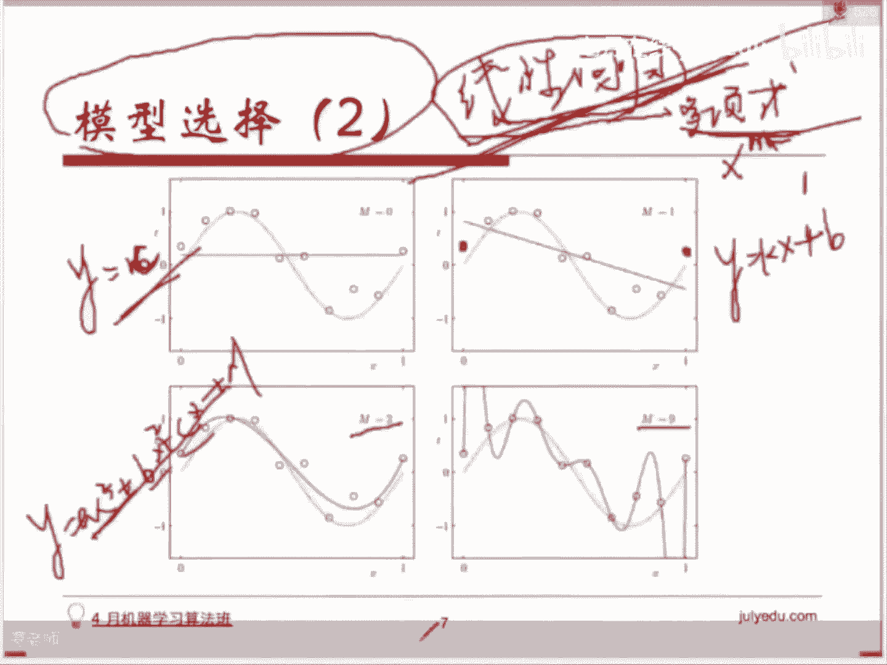

# 人工智能—机器学习公开课（七月在线出品） - P16：模型选择 - 七月在线-julyedu - BV1W5411n7fg

🎼。这块呢我们从我们有两种理解理解方式啊。第一种理解方式呢就是大家大家在平常状态下理解了这个模型的选择。就会有很多同学问我说，老师我现在有一些数据了，我有这样一个场景。

比如说是分类或者是连续值预测这样一个场景。那我呃比如说我有多少样本，有多少政府样本。呃，分类问题的话，有多少正负样本啊？如果是连续值预测的话，我有多少样本。然后我们怎么样去选择。

我我用什么样的模型会比较好。比如说我用我用呃现行回归呢，还是罗辑斯特回归呢，还是之后我们会讲到的一些别的一些算法，一些分类算法，一些。连连续值预测的一些算法。那关于这个这个问题呢，我先说一句啊。

一般这个我一般觉得这个问题非常难回答，原因是其实并没有哪一种模型是。万能或者是它的它的功功能是非常非常强的，适用于很多很多的场景。呃，都是在你特定的这个特征处理特征工程之后拿到的这个数据上。

对应不同的这个数据。我们会选择我们会有比较恰当的一些模型来处理这个东西。来建这个模型，搭建这个模型啊，当然有一些比较比较比较通用的一些，我们说一些准则。

那比如说这个地方我给大家列的这张图是我们针对这个包啊，大家如果用s learnSK learn的话，这个包的话，他给我们提供的一个人家其他的同学总结的一个去去啊，就是大概是一个一个一般的一个法则啊。

如果我们拿到一个问题的话，可以根据这个东西先来看一看可能有哪些解决途径啊，当然这里面会有很多算法，现在我们还没有学到，接着往后学的时候会学到，但没关系，我们现在先可以看一看。

首先你现在拿到了一份数据过来，拿到了一份数据过来的话，我们会判断一个东西。我们判断一个东西是什么呢？你现在的样本量有多大。啊，他这个地方给了一个明确的数字啊，但这个数字不不重要，呃。

并不意味着我们用我们要根据严格按照他这个数字来判断啊，它的意思是什么呢？如果你现在的数据样本非常非常少的话。那你要你需要去做一件事情，一般情况下会会有这样一个选择啊，要么你就是你去多找一些数据来。

为什么？因为机器学习这个东西必须要在大量的样本上才能学出来一个比较具有具有一般性泛化能力的这样一个模型。如果你给它的数据非常非常少的话，它的学它在这个上面很快会达到一个状态。

我们我们一会儿会提到叫做混拟合。在那个达到那个状态下训练出来的模型，在其他的数据上是不太可用的。效果是非常差的。所以我们会建议在这个情况下，有两条路可以选择。第一，你去采集更多的数据。

比如说你拉长时间窗口，采集数据的时间窗口，你找更多的天更多天数的时间。更多用户的呃数据过来。那第二种处理方式是这个时候你干脆就不要用机器学习了，你去用一些啊人工的规则。去处理这个东西。好，那如果样本。

那现在我也有足够多的样本了，我样本能达到我要求了。那我们怎么去做这个事情呢？首先你得区分你是个问题。需要你需要解决的这个问题到底是一个连续值的预测，还是一个离散值的预测。比如说你现在要预测股市的行情。

你要预测北京的房价，上海的房价，深圳的房价会有什么样的变化？这个时候它是一个连续值的模型。所以我们会。走这条路叫做regression，它是一个回归类的问题，对吧？我们会有一些回归的算法去解决这个问题。

如果它现在是一个分类问题，也就是一个类别判定问题。比如说举个例子说，你要判定这个呃一个场景下，金金融场景下是是否是虚假交易，你要判定一个用户是不是会点击你给他推荐的内容，一个用户是否会。买你的东西。

以及这个图片的内容到底是什么？这一类问题的话，我们叫做分类问题，对吧？我们会有一大堆的分类分类的算法来解决这个问题。所以你首先要确定你的问题到底是一个回归问题还是一个分类问题。我我们顺着这条路来。

如果它是一个分类问题的话，依旧和样本样级有关啊。如果它这个时候的样本量级。不是特别大的话，我们会我们可以采取一些分类算法来做啊。大家之后会学到的。

比如说这个地方的它的lin SVC其实是呃线性的SVM啊来做这个事情。你也可以，当然你也可以用其实这个地方用它或者是你对特征做一些处理，用逻辑思回归都可以啊。LR只不过说纯分类问题上来看的话。

SVM相对于逻辑思回归的话，它的健状性会好一些。所以一般所以他这个地方给的是会让你优先用啊SVM这样一个算法。但实际上你特征处理的okK的话，其实逻辑思套回归也也可以用。

或者是你你现在需要拿到一个具体的一个概率值去做一个排序的话，那你会优先用这样一个算法叫逻辑词套回归，对吧？我们讲过这个算法。然后紧接着呢，他又给了给了一个判定，说你现在要看看这个东西，它到底是不是一个。

文本数据。如果它是文本数据的话，我们会我们有一类统计计我们有一类和统计非常近的一类算法叫做普素贝耶斯啊。这个东西在自然语言处理上已经用了很多很多年了。而且在你的数据量非常大的时候，它效果是比较好的。

所以如果你是文本相关的一些分类的问题的话，呃，你可以用这个非常经典的算法。当然我们现在有很多新的算法，也也可以处理自然语言处理上的一些分类问题啊，比如说情感分析或者其他的一些分析。判点问题。嗯。

比较经典的还是这个算法。OK如果它不是一个文本的数据的话，那我们可能会用其他的一些分类分类的算法。比如我们说逻辑斯特回归啊，比如说这个呃SVM啊等等。呃，他这个地方提了一个KKK最近0。

但这个方法的话嗯它现在用的比较少，原因是这个这样一个方法的话，需要便利所有的训练集，然后你要把所有的训练集的。特征都存下来，这是一个非常非常耗时间和存储的这样一个算法。所以现在用的不是那么多啊。

一般我们会直接调到后面也不用SVM或者是用用逻辑斯回归，包括后面大家会学到的一些一些数相关的的一些model啊角色数呃增强是增强规定ing呃C进去等等来做这个事情啊。那如果这个时候的样本非常非常大的话。

这个地方如果你的样本量级非常非常大的话，这个是地方你你用SVM这种算法是很难去做的。它训练的时间会非常非常长。而且这个最后能收敛到的一个程度是不太确定的。所以呢会我们会你这个时候我们优化的时候会用。

不再用梯度下降，而会用随机梯度下降啊，就是SGD有这么一个算法，SGD对来做这个事情，然后可能会做一些。和估计这这个之后大家会会知道，我们现在说这条路径，就是其实大家可以看得到啊，我们从最前头过来的话。

首先要区分这个东西到底是一个什么样的，我们要解决的是一个什么样的问题。确定了这个问题之后呢，我们又在看数据的样本到底有多大。如果是什么样的一个规模的。在一定的规模下的话，我们是可以用某一些模型来处理的。

对。如果它的样级非常非常大的话，可能我们要我们要用一些别的一些分类器来做。用传统的这个一些分类算法的话，可能训练时间会比较长，或者训练它收敛不到那样一个程度啊等等等等。好。

如果这个时候它是一个连续值的话，它是一个连续值预测的一个问题的话啊，大家大家可以看到和和左边其实很对称啊，我们也需要考虑样本的量级。如果量级比较小的话。

我们可以考虑一些呃 linear的线性的回归等等一些包括SVR是知识向量回归，包括像呃GBRT之后，大大家会接触到啊那个。呃，是回归数等等等等。如果样本样积非常大的话，我们可能需要一些别的处理啊。

在依旧是在最优化的时候，我们不不能再用梯度下降这样一个算法了。可能可能会用到SSGD用到随机梯度下降啊，这个意思是我们每次求梯度的时候，我们在求那个。他的梯度的时候不会用到全部的样本。

我们可能只会用里面一个或者一小撮让我们来做这个事情。啊，如果样本如果这个时候。你的维度非常高的话啊维度非常高的话，我们会做一些处理，先做一些处理，去节省这个我们的一个计算资源，加快我们的速度叫做。

咱面呃叫做维维度约减，就降维的这样一个处理啊。那这个处理呢主要是。我们我们我们会有一些算法，比如说PAPCA这样的算法去做，把维度非常高的这个特征向目量处理到。维度比较低的，把它里面。

饱含的这些信息特征信息把它集中一下，放到更低的维度，相对低一点的维度上。然后呃再去做这个这个事情。再去做后续的一个训练。这样的话可以节省一边一部分的空间。同时呢我们训练的这个。呃，需要消耗的这个资源。

这个内存也会也会少。当然这个是属于你如果一定要归类的话，会把它归到无无监督学习里面。这一类。包括这个地方呢给给的一个建议是，如果这个算法，如果你现在要处理的呃这个问题呢，它。它是一个呃已经有外值。

也就是说是一个有监一个有监督学习的话，会走走上面两条路径啊。有监督学习的话，因为你你是已知了这个标准答案，然后你去做这样一个训练吗。如果你现在未标注的样本，你想去发现给你一些数据的样本。

你去发现这些样本之间的一个一个关联性或者是这些样本之间能挖掘出一些什么东西的话，我们会用到一类算法叫做聚类算法。这个之后也会提到哈聚类算法会发现一个一个的数据团这些。数据团呢。这些数据团呢？

他们之间会有一些共性。OK。聚类我我回答几个问题啊，有同学问到说聚类和分类有什么样的区别？聚类是一类聚类是一类无监督学习的算法。也就是说你给他的这个训练样本。

或者你给他的这个样本是不带上最后的这个目标值外的。也就是你并不知道这个东西它是一个某一类或者这个东西最后你要预测的这个房类似于房价这样的东西，它的一个具体的值是多少。

只是给了你一些样本没有标记的数据样本，说你去看一看这些样本上，你能发现什么样的规律。那我们会用一个有用聚类相关的算法去看看这些样本点在空间中的分布，可能有这部分是在一块的，这些样本点是在一块的。

然后你再去看看这个这一个classaser这个类里头，这一个聚类的这个类里面会有什么样的共性。这些样本点。SVC呢SVC指的是啊其实就是SVM它它这里面的话写集中写了一个类啊，se里面。稍等。

我看一下大家的问题。说聚类之后的标签怎么定义啊？聚类之后呢，我们我们只只知道哪些数据，哪些数据是一个团的，就是是是组在一个团的。但他并不知道这个东西实际的含义是什么。

你需要自己去你需要自己去把它用起来的话，你需要自己去看这些这同一个同一团的聚到一团的这些样本之间有他们有有什么样的一个共性。分类问题数据不用降维吗？分类问题数据也是需要降维也是需要做PCA的。

他这个地方给的这个大家看到这张图啊，到PPT上去看这张图的话，给的这个图是一个是一个一个参考，给大家做参考的。但实际上我们实际的呃可能会有一些调整在里面有些微调整。

包括像像刚才同学讲到的说这个分类问题要不要要不要先做降维。如果这个数据的维度非常高的话，我们也是需要做降维的。对，知识向量机分类型，supporting vectorclassify。啊，好。

接下来有有一部分同学提到的问题呢，可能现在没有办法直接去做。更详细的解释，因为它会涉及到后面的后面的一些模型或者知识啊，大家接着往后接着往后去学这些模型，然后再回过头来看这张图。

你就能发现这你就能明白他这里面提到这些东西到底什么样的含义啊。聚类它其实就是一个分组。对。好，咱接着看啊，刚才我们我们刚才这张图上给大家提到的这个模型选择，呢是说我现在有数据了。

我也明确我现在要解决的是什么样的问题。那我应该选择哪一个模型去做这个事情。那我们说说模型选择的第二种含义。第二种含义是你现在知道你要用什么样的一个模型，你已经确定了你要用什么样的模型去解决这个问题。

但是你现在想知道你因为即使是同一个算法或者是同一个模型的话，其实我们也有很多参数可以选，对吧？我们有很多种可能性。那这个时候我们怎么去做这个选择？举一个最简单的一个例子啊。

这个地方我们用的例子是一个线性回归的一个例子。线性回归的啊。这个例子呢是我有这样的一些样本点，大家可以看到这样一些样本点，对吧？我用这个绿绿色这条线呢就画出了它的一个。

它的一个标准答案的一个分布分布状况，就是大致的一个一个标准的一个大致分分布状况。然后我要用线性回归这样一个模型。我确定了我要用lin regressiongress线性回归这样呃或者说广义的线性回归。

我们把它叫做多向式回归好了，去解决这样一个问题，这样一些样本点的拟合，那它会存在一个问题。因为它既然是一个一个一个多项式回归。广义的线性回归的话，多向式回归的话，那你一定存在一个问题。

说那你取的这个X它最高次你要取到几次呢。对吧同为这样一个模型，但你其实是有选择的。你可以知道你你可以去选择你最高需要取到的这个次数N是几次。这个时候大家大家想一想，如果取的N是0次。

N是0次表示它是一个常函数嘛，对吧？就是呃Y等于M这样一个常函数嘛。啊，sorry和这M重了，我们换一个值，比如说我们换成。CY等于C这样一个长函说话，它就是一条直线，对吧？

你会发现你即使选了同一个模型，你你选这样。维度最高是N等于零的这样的模型的话，你怎么样也拟合不了这些点，对吧？好，你现在把这个最高次数N升到一尾，也就是说你是Y等于KX加B这种形式一条直线了。

你发现这条直线呢，你可以调它可以尽最大可能去。你和这个这这条绿色的这条真实的结果值。但会有一个问题，你发现你无论怎么样调，它和里面的部分样本点部分样本点。都会有一定的距离。

所以呢这个模型即使我们确定了是用多项式回归，用线性回归这样一个算法，你会发现我在选择参数的时候，如果超这个要应该。也教模型选择啊，我在选择，如果我用依次这个模型的时候，你会发现依旧就完成不了这个事情。

但如果你现在选择二次，变成Y等于AX方加BX加C。这样一个二次的模型的时候，你发现我终于可以拟合出来。啊，不一定是A呃，不一定是一条抛物线啊，可能这里头会有一些。不呃，说错了。

这个时候是加了三次在在里面。sorry啊，AX立方加BX平方加CX加D啊，这样一个最高次，当你最高次M，我把这个换成M。好，最高是M取三的时候。大家知道三次的曲线，它是有有波峰，也有波谷的嘛，对吧？

那你可以更贴切的去拟和现在的这样一个数据样本的一个分布啊，这个地方略过了二次，因为你发现二次的话，也很难去拟合这个分布啊。当然你可以把M取的非常高啊，你可以取一个9次的一个曲线。次数越高的话。

表明它可以拟合的这这个呃它的一个分布，它的一个状况是越多的对吧？所以你你去做这样多项式，如果你最高次数取到9的话，你去做拟合的话，你会发现你可以拟合的非常非常好。啊，但它会带来一些问题。

一会儿我们会提到这个问题叫做过拟合。其是它在你当前给进的这些训练样本上的话，效果非常的好。他能穿过你每一个点，但他在你给的新的数据上效果不好了。所以呢这个地方我们说模型选择第二种含义是。

即使你选择了我用哪个模型，这个模型里头会有一些超参数。比如说多项式回归里头最高次的次数。比如说其他的一些分类器里面的，我们就说简单的说这个时候你的呃正则画像系数应该取多少。

或者是你你现在用的它之后大家比如学到SVM的话，你会知道你第一向量接会有不同的核函数。那选择什么样的核函数啊，包括。在在罗辑斯和回归里头，其实也可以做一些特征层面的一些一些映射啊。

就说这个东西会影响你即使你取了同一个模型，你也会有也也是需要再去做一些选择的。啊，我们来说一说模型选择的第二类。刚才我们说的第二类问题就是你已经选定了，你现在用这个模型。那用这个模型的时候。

你怎么样去选这些参数时候，我们的解决办法，这个办法叫做交叉验证。呃，这是全体的数据集，大家经常经常会做一件事情啊。我们在线下去做一个模型的话，以及评估它效果的时候，我们经常会做一件事情。

这是现在这个是全量的for的一个data。我们会做一个事情。首先大家都知道是我们会把这个数据分为。训练集对吧？和测试集，这个是大家大家都知道的，都周知的。也就是我们需要拿一部分数据出来做呃训练。然后呢。

我们会把这些训练得到的模型呢在我们测测试集上用一下，看看效果怎么样，对吧？但你会发现，如果你只把数据分成这个样式的话。那你没有办法去解决刚才这个问题，对吧？就是你最高次数是取几。这个问题。呃。

然后呢我所以呢我们我们在机器学习以头，大家经常会听到你如果去做机器学习相关的工作，你经常会听到一个概念叫做交叉验证。呃， course validation交叉验证呢意思是什么呢？

我们现在把数据分成三部分。呃，可能是举个例子啊举个例子，可能我们会用70%的数据去做训练集，20%的数据去做交叉验证集，10%的数据去做测试集。好，我们来解释一下这个这个区别啊。

这几个东西首先训练集大家都知道了，这个东西是用来建模的对吧？这个前ningdata它是用来。帮助我们去训练出这个模型的。那这一部分是用来干嘛的呢？这个叫做CV级cro validation交叉验证级。

对吧？然后最最后这个是test，我们分别有什么样的作用呢？这个是用来建模的那交叉验证是用来干嘛？对，他们它是用来帮助我们做参数和模型的选择的，就是参数的选择的。test做什么用呢？

它只是在你选好了模型之后，我来测一下这个模型的效果怎么样，拿到这样一个结果。okK然后我所以我们说测试集只做模型的效果的一个评估，对吧？交叉验证级是用来做模型选择的。其实它是怎么做这个事情的呢？

下面我们来看一下他们怎么来做这个事情的。我们讲最经典大家会看到最经典的一种交叉验证叫做K折交叉验证K forward cross validation它是怎么做的呢？他把训练集大家看看到了吧？

这个是我们的前力data训练集。他把训练集分成了你你如果你的这个举个例子啊，现在是K者的交叉验证。如果K。等于5。那我们会怎么做这个事情呢？K等于5，意味着我们会把训练集先分成5个部分。看到吗？

均匀的分成foldd一fo2、fo3fod、4fo55折对吧？第一折、第二折、第三折、第四折、第五折，结果然后他会做什么样的事情呢？他会轮番的用其中的某一折。比如说这个地方最开始我们会取第五折。

把第五折当做一个。我们的交叉验证集把前面四者当做真正的训练集。这变成了后来真正的训练机，而这个东西呢变成了一个。交叉验证题。我们会做一个什么样的事情呢？刚才不是说了吗？我们要做模型的。

我们要做这个模型的选择，对吧？有不同的维度。比如说就前面这个问题，我们现在要去做这个模型的一个选择，选择线性回归的多项式回归的这样一个最高的次数。那我们会在这一部分样本上，去年样本上。

在这部分训练样本上，用N等于。比如说01刚才提到的39，我会去建四个模型。然后建完这四个模型之后呢，让用这四个模型分别在这个交叉验证级cross validation上，这是同样一份数据嘛，对吧？

我用这四个模型在同样一份数据上去拿到四个的啊评判标准。比如说你这个时候如果你用用准确率的话，对吧？那你就是一个 accuracycur对吧？一个准确率一准确率2准确率3准确率4，所以你从这里面去挑出来。

比如说我们刚才看到的。我们我们刚才看到的这个模型，当然我们刚才的看到模型里面的话。Okay。肯定是等于九的时候，你和成度会比较好啊。一会儿我们会说我们在这个我们在做完模型选择之后呢。

我们会去评估一下它的一个状态。这个是后续的事情。我们现在先说怎么做这个模型的选择。模型选择的话，你会发现在前面这样一份数据集上啊，你可能会发现你用KN等于三和9效果都还不错。

这是这只是一轮。我们如果做K折的交叉验证的话，这只是其中的一轮。我们会接着做另外一件下面一件事情。我们会把第四者。fold for作为我们现在的交叉验证题，然后用12要12354者去做训练。

我们会轮番做5次，对吧？这样的话大家大家都会这样的话大家都会。都明白，对吧？那我我K折的交叉验证，实际上是我做了5次呃，做了5呃，如果K等于5的话，其实是做了5次的这个训练，对吧？

然后去对比这个会会对比他们的一个准确度，把这5次的准确度，比如说求一个平均去做这样一件事情。然后从里头选出来目前这个准确率比较高的模型。所以呢特征所以模型选择这块啊，我们就选选它的参数。

或者是选它的这个将前面这个模型选它的最高次数的话。其实我们我们依赖依旧要依赖于我们的数据，只不过现在的我们最传统的情况，我们会把数我大家都知道的时候，我们会把数据分为训练集和测试集去做这个事情。

我们在训练集上建模，对吧？在测试集上去测效果。但现在呢因为多了一个环节，我们要选模型啊，即使我们现在确定了我们用某一类模型，我要选参数啊，那我们怎么去做这个事情呢？好，我把训练数据。

把它把它分成训练级和交叉验证级，就是训练级和交叉验证级。然后我们说了呃非常非常经典，大家在各个。如果是一一套完整的一个一个一个package。一到库去做器器学习的话。

你在里头总可以发现一个K折的交叉验证。这样一个交叉验证做的事情呢跟刚才区别在于我增多了一些随机性。因为我我不确定我现在取的这个训练，我分割的这个训练集和交叉验证集里面。是不是覆盖的比较全。

可能会可能你在分割的时候分割的不太好，会导致有一部分的有倾向性的样本到了训练集里头。另外一部分有倾向性的样本到了交叉验证集里头。所以我做了一个事情，我把这个训练集分成了5个部分。

轮番的用其中的某一折去做这个交叉验证集，用剩下来的四折去做这个训练集。然后我去我我每每一轮我又建建根据不同参数去建这么多个模型得到不同的准确率。然后我把这些准确率求一个平均。这样的话。

我从里面挑出来准确率比较高的模型不一定是一个啊。比如说刚才前面这个问题的话，可能你会发现三和九都还不错。至于说三和九怎么来挑的话，这个取决于我们我们待会儿会给大家讲到的，我们会去评估一下模型的一个状态。

也就是说我们先到呃目前为止大家去看这个东西的话，你都会发现呃。呃，三和九的话应该是在训练级上效果都比较好。在你交叉验证集上不好说。但是可以看啊。

就是我们在这个情况下会挑出来挑出来一些呃不同的这个模不同的参数得到的模型嘛，去看它的准确率。因为你交交替的使用了，不同的这个fold，不同的这个交叉验证集，不同的折去做交叉验证集。

所以增大了它的一个平均性。它的它你取这样你取错的可能性会比较小一些。最后的这部分，我们t data我们是不动它了，我们只在最后用，只在最后去评估你现在拿到的这个模型。比如说你前面选了三次。

那评估一下你现在三次这个模型，在一份新的数据上大概是什么样的一个准确率？如果你有其他评判标准的话，可能会有一些其他的标准啊。

