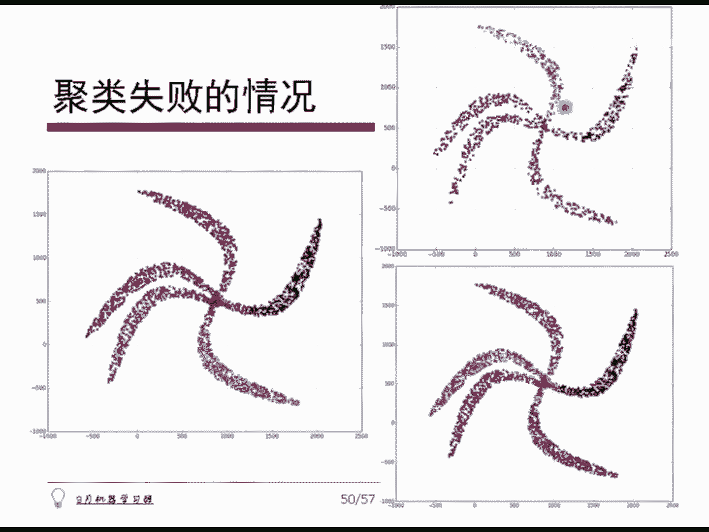

# 人工智能—机器学习公开课（七月在线出品） - P17：谱聚类 - 七月在线-julyedu - BV1W5411n7fg

🎼。那我们先说这个什么叫普啊，所谓普，它其实就是某一个方阵的所有特征值的全体业，通称为普。对吧方正它是一个线性算子，A这个东西乘以一个X，它就还是个线性变化，对吧？它这种东西啊。

它它它它这个东西是有谱的对吧？它的谱就是它的这个特征值。那这里边特另外我们多说一句啊，就说这个它的。最大的那个特征值，它就表示了这个谱的半径。当然了，比要说这个如果一个矩阵的普伴径。

我们往往用A的转质乘以A。算他的这个方阵的最大特征值，算它的普遍景况。好了，这个我们说说这个普局类吧，就是普局类其实它一般而言是一种基于图论的，这不不是一般而言呢。

这就本来就是它是基于图论的一个聚列方法。然后呢里面。唯一涉及到的一个点就是需要去求一张图的拉拉斯矩阵。求了拉式矩阵以后，对这个矩阵求它的特征向量，根据特征向量进行聚类就可以完成样本的聚类了。哎。

看起来还是很有趣哦，对吧？这样子我们首先需要建立好这张图。因此呢这里只有只有一些这个样本啊，对不对？假定我们给的样本X1到XN，然后任意两点之间都是可以求它的相似度的，注意。相似度就是。

距离的那个反方向嘛，对吧？这个相似度我记得SIJ哈这是simulator点对吧？我们得了一个相似矩阵，然后是I行那个那个N行N列的一个N个嘛，对吧？这里边呢我们。这个往往有时候哈是这么来做。

就是给一个阈值，大于阈值呢，我们就直接选上去。小于阈值呢，我们就直接给它清零，对吧？这么一个做法哈，往往是这么来做的。另外呢就是说往往我们会给定一个对称的一个相似度度量函数。这样的话得到的这张这张图。

就是一个对称的一张相似度的图。对吧没错，就是我给个给个阈值，就是把它稀数化了，对吧？它就是好多零嘛，对吧？然后呢，我们就下面的工作就是在我们眼中就不再是一个N个样本了，而是一个N乘N的一个相似度图。

我们要解决的就是这张图如何对样本进行聚类的问题。换句话说。找到图的一种划分方式，形成若干个子图或者若干个group，若干个组组之间权值是比较低的，相互之间连的比较远。但是呢组以内权值比较高，像素比较高。

就这么一个简单一个思路啊。首先这是个无项图哈，我们一般而言会给定一个就是I到JJ就到I，所以这是给定一个无项的。然后呢，这个全值矩阵呢给出来之后呢，我们再把它求一个度矩阵。度的意思很简单哈。

就是说第I号节点，它的所有的边的和，我们把它叫做第I号节点的度dere那个字哈，这样的话，其实就是WIJ这么一个值对J从一到N去加和嘛，也就是这个矩阵的第I行的所有元素加起来，就是第I个样本的度。

还是好简单，对吧？因此，第一个样本第一个样本样本的度，我们把它写在一行一一列上。第二个样本写在二行二列上，第三个写在三行三列上就形成一个度的矩阵。D，所以大D是个对角阵。W是一个临接的一个对称阵。

它俩都是对称的哟，因为对角这间肯定对称嘛，对吧？这都是零，它可能也对称啊，对吧？呃，另外呢就是说当然这里面有一些概念，这概念就不说了啊，就是有指着向量啊，或者是AB之间的骄傲，这先不说了啊。

就是事实上这个大家在推的时候会有用啊，就是说A和B之间如何度呢他们这的连接权重啊，就是我把。A里面的所有点和B里面的所有点它们之间的加和。加起来认为是A和B他们之间的连连接权重哈。

那我要要的就是A和B之间连接权重越小，就把他们俩之间给截开就完了哈。呃，这里边呢我们先说一个第一个问题，就是如何建立相似度的那张图。大家其实应该已经有概念了吧，就是说要想建这张相似度图。

能想到第一种办法就是我用这个高斯距离对吧？呃，我用那个那欧式距离，但是咱在实践层面上往往是用高斯距离，就是高斯相似度函数，对吧？或者叫什CF那个。镜像机函数镜像机函数哈RBF镜像机函数哈。然后那个。啊。

对，就是那个R变M和进行奇函数。然后这个高低的函数，其实就是咱一直看到那个东西，对吧？I和这间距离，然后取平方上除以R卓个东西，它这里边只有一个参数，就是一个带宽sigma，对吧？另外就是刚才说过的。

我们会给出所谓的一系统连接图，就是小于一品之后把它截掉，大于一P之后在它在做对吧？一呢，这个文章中大概是这么来说的，就是怎么选一品。一般而言，我们选全值的均值。

或者是选这张图的最小生成数的最大的边作为一都是各种各样做法啊，只不过是一个参考啊，大家可以做一个参考就好了。就如果选参数嘛。然后另外呢就是说。不是对。从任何一个节点到其他的N点1个节点。

我都让他算个全值，然后得到一个数。而是如果说距离我比较近的某几个才去连接，所以会形成一个K零进土。对吧就是说距离我最近的那个，比方说五武近邻，那意思就是说离我最近的5个人，他们之间的这个距离都是有效的。

第6号到第N号，他们之间的这个距离我都认为是0相素都是0，没关系。跟我最近的那5个人，他们之间用正常这个动感计算，有5进0的意思哈。多说一句。近零土不是对称的。什么意思？就是说。我如果是你的第三禁邻。

但是你可能你就是我们互相可能不是哈，就是我是你最近的，但是你可能有更近的人。在你那对吧？所以他这个近邻不是不是相互之间一定有的。所以说我们往往会怎么办呢？就是。实践层面里面直接忽略掉方向。就是我如果是。

找离我最近的55个人他们之间连起来。然后呢，这5个人跟我也建立连接，就这么一个简单方式哈，这个东西叫做。K近0。如果不是这样子，要求我是我的前五，那那离我最近的那5个人，同时那5个人。

比方说A号那个人吧，他的那个离他最近的那5个人里边，也有我我我和A之间才建立连接。那种连接方式叫做互近邻。就是两种近邻方式啊，就给了张图。就是你比方说我如果选择五近邻，我如果正常做的话。

这一个点选择这5条路，然后呢就去算了。但是。可能比方说对于这个点吧，虽然这个点是他的五近邻某一个，这是有条路了，对吧？但是对于这个点来讲，他好多人都比他更近。所以说对于他来讲。

这个点就不是他的五近灵之一，这就没点了，对吧？满足相互之间的那个东西，见近邻叫互近邻。正常的那个我们把它叫做只要有就连接，叫K近0哈，大家知道这回事就好了哈。所以你用的时候看你是用互近0还是用K近0。

呃，这是两种不同的对吧？知道就好了啊，另外就无所谓了，就是你比有一匹淋域，然后你算起来距离0。3以内的，我就算距离一大上。对吧这是一系统的说法。好。啊，这里我还做了一个简单的比较，这个咱不说了哈。

就是说。他们之间用选几选K近0还是后近理有什么样的区别？并且如果你不知道如何选的话，你就直接用K近0。就是你如果不知道选啥哈，你就直径K减0就好了，也也不用一系统，也不用呼减0有这么个说法哈。好了。

这是关于第一个把这个图建好了，对吧？下面呢简单说一下，刚才不是给了那个度矩阵了吗？又给了一个连接的相似度矩阵，对不对？我直接用这个度的矩阵去减去相似度矩阵，就得到一个新的矩阵，对吧？

这个矩阵就把它定义做拉布拉斯矩阵。简单吧。do的矩阵减去这个W，这个矩阵就是我所有的拉布拉斯矩阵。简单说一下哈简单说下性质，就是你会发现我任意给定一个F一个一个N维的一个向量，它的转制乘以L乘以F。

大家算一下，会得到这样一个式子。这个呢我把它放到副页里面了。就是这个哈很简单一个东西哈。就是。这个。就是F1撇乘F乘F。简单的算一下，就会发现等于这个式子。那既然等于这个式子会说明什么？

说明FWMIJ是大于等于0的FI减FG的平方是大于等于零的，因此这个值一定是大于等于零的那这任意的一个向量都满足性质。所以这个L是一个半正定的。对吧你回来哈，不管了哈，反正总之大家知道这回事哈。

咱咱就弱化推导，强调实践哈。然后它其实大于等于0，那大于等于0就意味着这个L，它其实就是一个呃对称还半正定，半正定的意思就是指的它的最小的特征值就是零。嗯半证令嘛，对吧？那么说有可能有0。

但是事实上真的有0啊，至少有一个是0。然后呢这个。呃，其他的除了零以外，有莱一姆2的莱姆N都是从小到大排起来，得到一个东，最小的是0，对吧？就这么情况哈，并且啊它是对称的，因此le一到莱的N一定是实数。

我再强调这一点啊，就是如果你编程写完以后，发现你求的特征值是负数了。这不是实数范围以内的，而是虚数范围以内的了，你一定写错了。一定有问题，因为是按道理你求的一定得是一个实数的，一定有1根。

对吧这是这个问题啊，嗯，怎么突然问了个K进0K means，我们继续那个继续普局类哈，然后。这是这个问题，对吧？然后呢我们先给出他的说法来哈，先我先给说几个结论，这个结论我没有在PP里贴。嗯。

然后咱简单说一下哈，事实上是什么呢？这样一个拉式矩阵哈，零一定是它的一个特征值。并且零有可能是K宠的。K重的意思意味着什么呢？意味着。这张图有黑个联通分量。就是如果这张图它是有两个联动分量的。

就是咱看前面这张图哈，假定假定说这是一个联动分量，这是一个这是一个这是一个。假定这一共就一共有就就4个哈，假定一共有4个哈。你把这张图去代入到这个拉式矩阵，然后去算的话。

那么说得到的那个零所对应的特征向量一定有4个。就是推虫的意思啊。小西瓜问的那个问题，比方说这个R的话就是实数，没有没有没有么东西，这是实数。这是那个这是一个N次密码，的相对变成F11个N维的一个向量。

没什么意思哈，就是实数。然后呢，我们不管这一套了哈，先给出它的一些拉式矩阵的定义和它的相应的变种。说说哈。第一个就是我们首先可以计算相似矩阵W，对吧？相似度的意思指的是相似度越大，表示他们俩之间越相似。

对吧值越大越好哈，并且这里面有一个很特殊的情况，就是。第I行第J列如果等于0表示没有相似性，但是我们让第I行第I列的值就是它自己跟自己。负值为0。这是我们强调一点啊，就是WII叫啥强制负为0。

按道理而言，他应该是最大。我跟我是最相似的嘛。但是咱这样的话，咱把这个它强制赋为零有好处，好处就是我可以在DI行上把它加起来的话，就得到了。对这个顶点的这个度矩阵D如果负重最大的话，这个事就没法干了。

对吧。这个D我就可以直接用DI行的所有原素值加起来得到这个D了，对吧？每一行这是一个对角阵哈就得到了。然后呢，这个用大D减去W这个东西叫做未正则化的。普通的拉式矩阵。

另外呢还有所谓的对称拉式矩阵和随机游走拉式矩阵。就是如果说对这么一个拉式矩阵，我两边左边乘一个D的-2分之1次幂，右边乘以D的-2分之1次幂。那这样的话，L在中间嘛，L本身你看是对称阵减对称阵。

然后左边是这个右边是这个它还是对称阵。所以说这种方式算出来的，这是一个对称的拉式矩阵。另外一种就是我如果说左承上递的逆这个东西哈，乘完之后得到这样一个情况。

它就是所谓的随机游走的拉式机random work，所以叫RW哈。简单说一下哈，为什么叫这么一个奇怪的东西哈。咱可以。考察一个事情就是。这个D是什么？D是第I行所有元素的核。

对吧那这个我这个某一个值去除以这个D，这个D不是逆嘛？除以这个D相当于这个做的是什么东西啊，相当于做的就是对这一行，让它的加和为一。对吧所以说随机游走拉式几针的右半部分。

这个D逆乘W本质上其实就是对着一某DI行上那么加号为一DI加一行加号为一，相当于任何一个点给出的不只是相似度，还是指的它的转移概率。对吧转移概率是什么意思？就是我这个点转移到别的点的概率值。

如果这个值大的话，就非常容易转移到别的点上去。如果小的话，不太容易转过去。O我们让给定一个喝醉酒的一个醉汉，让他呢就在这个图上随机的去游走，随机的去去去玩。去去去去去晃。然后呢，他最终走完的那块区域。

我们就认为是它的一个图的范围，这不就随机游走的思路吗？对吧事实上你真的可以做这个工作，就是按照这个点它的转移概率去把它转到别的点上去。然后最终得到了那个图，就是它的聚类的过程，这就是C游走的思路哈。

咱不再详细的去探讨它到底怎么回事儿，但是大家知道就好了，对吧？这就是是九总啊，还记得没错哈，因为有朋友马上谈到了马克练。咱在讲那个线性代数那次复习的时候，咱就是用矩阵的乘法来去解释马尔科夫的问题的对吧？

咱后面也会谈到哈，咱先按着不表了哈。后面呢我们把谱句类的算法的过程跟大家做一个介绍。怎么证明的？然后咱呃给个形式化说法，严格证明PPT已经57页了。但是其实57页之后大家看到了。我把那个内容切出来了哈。

大家自己看就好了哈。比较凌乱比较麻烦哈。我们先简单看看这个过程哈，怎么做这个东西你先搞清楚啊，给定N个点，给定一个促的这个数目K如何做呢？首先算它的相似矩阵，算它的度矩阵会算了吧。D减W得到L简单吧。

这个L我可以求它的前K个特征向量。U1U2到UK能求出来吧。注意。因为这个L这个拉式矩阵它是一个N行N列的N维的。所以这个U一是一个。嗯。N行一列U2是1个N行一列UK是1个N行一列的这些列向量K个。

我让这些列向量抬起来，形成一个矩阵U，你可以吧。那这样的U的话，一共有K列，一共有N行，这就是一个形成N行K列的一个矩阵。然后呢，我转换一下视角，横着来看。相当于我横着看的时候，一共有N个点。

银行嘛对吧？而一个点呢是有K为。是吧所以说这里这个YI的意思，它是1个RK次幂的，它是一个K维的一个航向量。它表示U的DI行的航向量，对不对？现在我们手头上有了什么呢？有了这N个点，它的维度都是K维的。

把这N个点放回到我们的K均值聚类算法里面去，让这N个点做K均值的正常聚类。K值就取这个剧类的数目K。举例完了吧，得到了C1C2到CK嘛，对不对？那C1这个类里边可能有若干号点，C2可能有若干号点。

对不对？每个都都做完了。那么说输出的这个最终的这个醋，A1到AK跟它分别对应。就是如果说比方说这个里边的这个U这个里面，比方说第五行它属于第三个促，那么说原始的第五个点就属于第三个促。

就这么一个简单一个对应哈。这样子就完成了为正则化拉式矩阵的。聚类算法OK有问题吗？呃，好了，我们先来看一下大家的问题哈。首先第一个就是L是去对称的，没错是吧？L是一个对称阵，然后随机过程是吧，随机过程。

然后K是自己选题式的K。呃，正常而言就是你可以给定。如果不想给定，咱等会说他如何去自动化的去给定一个东西哈，呃，自深的给个东西哦，哪千K个就是特征值按照从小到大来排列。

最小的那个到最大的最小的那个可能有若干个特征向量，次大的有一个特征向量，然后又有个特征向量，对吧？前K个特征值就是前K小的特征值所对应的前K个特征向量拿出来就好了。就是那个东西从小到大排哈。😊，我。

没有说错，从小到大排就是拉拉式矩阵。如果你是用拉式矩阵做的哈，有些。这个这个人哈可能会说用W减去D或者是别的东西制作哈，那就是从到大从大到小排了。但是。咱用标准拉式矩阵做的话，就是从小到大盘哈。呃。

特征之秀是有物理意义的，就是这个物理意义是什么呢？OK咱们这做个解释吧。它的物理意义就是降维。你看我们做的是什么工作。做的是求出。拉式矩阵它的前K个特征值所对应的特征向量。

这种做法不就是咱昨天讲的主成分分析里面的做法吗？只不过主成分分析里面是求最大的，因为它是要求这个呃主方向次方向去做，对吧？而这个里面呢，我们想跟他做聚类，对吧？我们就让它先求最小的那个那个值。

然后其次拿到对吧？然后拿到这个几个特征值，然后呢用特征向量给它做聚类。本质都是一样的事情。你可以认为原始没有做之前的那个L就是一个。N乘N的一个原始状态。当我做了特征向量之后，相当于提取了新的特征。

得到了K个特征，更低的把它扔了，不要了，用这些更能够表征它的一些的情况。对吧其实。补具类和主成分分析二者之间。异曲同工。对吧。有很大的相似性。并且它里面的这个如果你要是想解释物理意义的话。

你可以用随机游走来解释。就是刚才我说的那个东西，你随便给个醉汉，让他去在这里面走。因为我是用概率来转移的哟，对不对？用概率转移的嘛，所以说我最后一定会走出一个，就是比方说我就是有K个，我就。

在这个图上撒上K个醉汉，让他们。就就就就就便利是吧？等他迭代完了以后就得到结果了。但事上他不这么干啊，对吧？那就直接求全K恒成值就好了哈，这是魏正则的哈。😊，不是土序流不是通杀一切剧烈方式的。

任何一个剧烈方式都没有通杀的样本。呃，都都不能解决所有问题。呃，搞不定。所以说这里面不管是密度聚类也好，片均制聚类也好，谱聚类也好，还有咱没谈到的各种各样剧类，它都只能适用于某一些样本。难说。

只不过谱聚类可能呃。他可以当做什么呢？它可以当做一个参考。就是如果你做一个聚类比谱剧类好，我们就承认你做的还算不错，还算优，对吧？就跟10年前的神经网络的地位似的哈，任何一个算法都跟神经网络比。

只要比神经网络有，OK我的算法就就算通过就能发论文，对吧？当然现在不是了哈，现在是神经网络是最牛的对吧？嗯，啊，不我刚才说的用随机游走去便利，只是一个说法。

咱就是说你往说大家可能会我看到大家有留言说的做推荐哈，推荐系统里面有一章节会介绍用呃这种方式去做。聚类，因为它也涉及到一个用一个用户聚类嘛，他也会谈到随机游走聚类，就是随便给一些要么给一些值。

然后按照概率值，按照这个D的逆乘以W这条进行随机游走，然后迭代出来。但是呢其实没意义哈，你直接求特征向量更快，对吧？何必嘞那么去迭代一下，对吧？当然你可以任性这么做也无所谓了。那为什么是从小到大呢？

是说这K个可能最不相似不相关吗？哦，我们这么来解释一下哈。如果说。一张图假定说呃这个图里没有哈，就是假定是这张图吧，假定上这张图哈，假定呃哎这张图挺好，就这张图吧，它其实一共有两个特征分量，对不对？呃。

两个连动分量，对不对？既然有两个连通分量的话，那么说对于零这样一个特征值，这是最小的特征值，对不对？它其实就会有两个那个。他的那个。那个那个特征向量零这个特征值对应了两个特征向量，对吧？

我如果就取前两个，因为前两都是零嘛，对不对？U一二对应都是零啊，我就取前两最小的这个去做聚类，你一定会聚类出来一个上面这一坨，这是一类，底下这个是一坨是一类，因为这种状态，它正好分成两嘛，对吧？

这就是按照最小的情况做聚类的情况，当然你可以去选几个，对吧？得到其他的情况一样。对吧咱可以所以说谱句类里面哈，它去实从小到大去去排列我们的特征值和特征向量的哈。大耳朵说增量问题也很有意思。

增量你是指的哪个地方？哦哦哦哦哦哦哦就是那个如果新增加一个点是吧，那就是流失聚类了。就是我现在聚列好了，啪又来了一个一个数据点，我再怎么聚类，我又来了另方怎么聚类。或者说我现在这个没法达到所有样本点。

那是另外一个什码事儿，对吧？你就是你需要考察呃，我在网络流的情况之下呀，或者其他这种没法得到样本的情况下，我如何做在那种情况之下，你就没法正常使用图具类了。因为你的样本N现在没有全给我。

我根本没办法去算。这个拉式矩阵没办法算相似度矩阵，因为N成A的嘛，对吧？所以说你要是这个那种方式的话，只能是相互迭代的方式去做，对吧？我先给这个初步结果，那个点离谁最近，我再去调，我再就不停的去改。

只能增量的去改。如果你再重新算拉式矩阵，那就这个这个就太不合算了哈。对吧就非常不合算了。其实你会发现。呃，尤其是密度聚类哈，咱在讲到那个密度最大值聚类的方式的时候，其实你会发现更多的是考察促中心在哪里。

如果给定了促中心，这事儿就定了。你比方说咱现在如果给定了，我就选择马云作为一个促中心，选择选择万达，作为一个区旅中心，对吧？我就拿着两个，一个是房地产行业，一个是这个互联网行业，对吧？这就是去促中心。

其他的你就不管了，对吧？那更多的是选择这个，而不是把它怎么去去调某一个样本，怎么选择，对不对？我我个人觉得啊。呃，另外我们再多说一句，就是关于这个随机游走拉式矩阵哈。

就是说这里边仅仅是多了一个这个多了个这个的话，其实做法完全一样。就是我如果多了一把拉式矩阵，这个改成它，我其他完全不变，只是把拉式矩阵变一下就好了。其他仍然是做它的这个特征值啊，可能想想去做事情。

另外如果是做对称的拉式矩阵是长这样子的。那么说我在选择这个样本的时候，需要做一个单位化。单位化之后再去做聚类，就这个区别哈。好了，马上有一个问题问，那现在。我如果只讲了第一个，大家不会有问题。

这个问题是，那这仨我选择哪一个呢？对吧这里面大体上有一个结论哈，如果你在实践里面不知道选哪一个的话，你就选随机游走拉式矩阵。首选随机游走拉式矩阵，这是结论哈，咱就不是就是这个结论哈。

然后论文里面告诉你他是怎么回事哈，我我那个论文里明确告诉我是这样子的。然后这是一个实例，这个实例是我直接给它贴出来的，这是那个本身个数据集，然后有4个这个特征值，特征值呢对应的不同的特征向量。

然后呢有不同特征对不同特征向量哈，这是这样做的。另外我再说一下如何自适应的去选择嗯。就是那个K值，对吧？K值是个很很很麻烦的事情啊。对于这个来讲的话。我们看这个图哈，比如这是个全连接的，然后是那个。呃。

魏征的画了一个一个图啊，就就他为例好了哈。这边大家会发现啊，前四个特征值它的变化是这样的。后面变化是这样的。在从4到5的这段的变化是最大的，它的跳跃是最大的。对吧。好，我们就利用这么一个间距。

谁的跳跃值最大，我们就选那个作为我们的这个K值的选取。比方说这样子它跳的最大OK前四个就是一类，我们就用前四个。一般而言还不错哈。如果你没有给定K值的话，K值普聚类可以这么来去选择K哈。这是一个。

做法一个选法哈。另外呢，这是关于它那个普及类的代码哈。呃。呃，这后期跟KK均值距的就很一样了哈，前期只是选那个东西啊，对吧？那它的做法其实很简单哈，你看我给成数据我怎么做啊，先去给数据求拉式矩阵。

这是一坨哈，咱不管了。然后呢，我通过这个拉式矩阵直接去求它的特征这特征向量，根据特征向量对它做排序，然后选择它的特征向量拿出来，我其实只要它的前几个，对吧？比方说前K个okK我就把这前K个值拿出来。

就是哎从都每一个都都做一个值哈，然后这是这是新的这个数据哈，就是特征。向量这种意义下的这个数据哈，我做了M个，然后呢，这M个怎么做呢？就是每一个DI行相当于这个这个东西啊就是咱代码里面那个U。

我就想做这个U哈，怎么做这个U呢？就是第I行做出这个K个来K个是什么？就是这个特征值相应的这个前K个拿出来，每一个都做完，这样不就拿到手了一个M行K列了吗？输出到刚才咱做好的K均值算法里面去。

K均值不是算过了吗？像刚才第一次上来就讲K均值，没白做，对吧？直接把它一聚类okK就结束了。而拉式矩阵做法其实就是咱们刚才很讲的一个做法，就是数据给过来，然后这长度拿到手，先做一个W这个矩阵。然后呢。

这个W矩阵做完之后呢，这个我们做这个最近然后呢把这个近邻把它清掉，然后呢算一下这个DI个和DJ个的它的相似度，把它匹配到WIG里面去。如果WIJ这个东西啊，他。不是我的邻居了，或者说他已经。

不能隶属于前K个了，那就是前某一个，比方说前M个或者前W个前。前N个前前R个吧，对吧？然后呃就我们就把它直接清零，否则这个它是对称的JI就等于IJ对吧？另外呢就是说II强制负为零。

这样子就完成了这个第一个做法。下面呢其实无非就是把这个S这个度求出来，度求完以后，这儿除了S做了什么工工作，我做的就是一个随机游走的拉式矩阵，对吧？只不过在DI行第I列就是主对角线是一，其他的都是零。

就是用零减它嘛，对吧？这是用一减它嘛，所以就这么一个操作啊。所以做完这个W其实返回回去的这个LM拉普拉斯矩阵，就是一个随机游走式拉式矩阵哈。好了，这就是关于谱据类的这个它的代码过程哈。呃。

温家瑞说这块什么哎。f真从I加1。这块是吧。嗯。呃，这不会算重的，因为你看我这个I给定了从0到M减1，G是MI加1到M减1算的这一小段算完以后，我再把这个J和I再。付过来对吧？我算的这一部分都是。

这个J比I要小的部分，顺手我再把对称的部分复制过来，这样我们不还省吗？其实。对吧。啊，是的，就牛宝说了个很有趣的问题，就是机器学习里面的特点就是你前面说了啊天花乱坠，说了好多好的技术。然后最后算的时候。

其实你不就是那些玩意儿吗？你看我哪块省了，对吧？我都根据数据求拉伸矩阵，还数着顺着随机游走的，最后根据特征值把它给求出来，然后做聚类。对吧其实。就是那样一个东西。😊，呃，代码其实啥都不是对吧？

代码其实好简单，所以我我是这样，就是这次我特意把一些代码我实现了一遍，自己实现了一遍。然后呢这个想跟大家说的就是。这个你把理论学会了，代码其实写还是没啥可可可说的，就直接把它写就好了哈哦。

那个象征辅助还是我没踢，就是similar is neighbor这种这种辅助代码，就是你你无非去算一下这个。I和J这两个样本的相似度，根据我们刚才那高斯那个函数嘛，高斯相似度函数。

这个只是看一下这个WIJ是不是比我这个nebor neighborb的最近的那个点还要这个值还要大，对吧？大的话，对不起，你就不行，你就是。如果是比离我最远那个还小，那就那就肯定不是了，就这么简的过程。

对吧。嗯，所以拍始他的做法其实好简单，是吧？嗯，其实其实没啥嘛，对吧？所以所以我有时候可能会把重点放在前边去了啊。呃，大家写完代码就知道好好简单是吧？没没啥东西，你可能你写完之后很快就能搞定了这个。

就是谱剧类的结果。这是我随便生成的，就是我生成的时候我都没写完这个代码了。然后生完之后我运行一遍OK。真的是搞定了，对吧？普剧类是可以搞定这样的结果的这是普剧类已经不在华下，对不对？

这种东西普聚类肯定能搞定，然后普剧的还能搞定这种东西，多个环也能搞定哈，都是可以去做事情的哈。呃呃这这就是呃桂糊涂说的就是这个结论是吧？就是我给了一个样本的这几个样本我都自己试了一遍，把它输出出来的啊。

当然这里面我没有贴怎么样画图，就画图就不用管了，对吧？然后大家python直接走一遍就是了，好简单啊，然后。大家随便自己生成个实力，生成样本去做就好了哈嗯。感觉普及的这样讲，只能知道计算我的天。这样哈。

呃，我把它往后走一下。就是。从这块开始，咱的PPT的第60页是普及的理论推导。后面是讲为什么普剧类这种做法就能够。做出来。我以前咱的那个技学一般都是讲的。然后呢，我讲的最后大家都迷糊了。

就不知道不知怎么回事了。所以这次我就没没讲哈。如果大家觉得这块想听。咱就讲一遍，嗯，这个没问题哈，就是大家看看我咱咱把它这种理论层面把这个能够扩展出来。就是我先把它做的是二分是如何的。

并且用的是最基本的raial cut那种那种方式来去做的哈。于是看的意思指的是什么呢？就是指的我先剪切。我怎么样能够做普及类的方式最好啊？就是我咔来一刀，把A和B剪开，我的代价有多少，让代价最低。

就这个东西，它正好对应着就是这个任何一个值求这个东西哈，其实就这玩意儿哈。没啥，其实。OK看来还真有朋友喜欢听是吧？O ok。这个东西我就怕大家我讲错了理论，大家说咱理论太深行，没没劲，想听实际的哈。

所以我就我我改。我改风格了，其实。OKO ok ok ok没问题，没问题，没问题。等到后面会会会把这个理论层面的事情再给他再给大家来做分享的哈。这个这个既然想听理论，咱就加理论嘛，这个无所谓哈，对吧？

这这这都无所谓哈，反正总之大家知道哈，普及类这么做是没问题的对吧？先搞定实际如何做对吧？这么这么做完哈，另外。😊，我特意做了几种情况，告诉大家，谱剧类不是一定能成功的。这几种情况就是捕聚类失败的情况。

有些时候你看哈，这是看的不错吧。其实大家其实做到最后会发现，其实写代码真的不是难事儿，对吧？其实大家说的这个挺对的。就是呃上传代码，大家如果想要的话，我就上传到群里好了哈，这个问一点都没有。

就是普局类的跟刚才那个呃配金指的在一块嘛，对吧？这个一点题没有啊。呃，这个没事啊，咱我只想说一个事情。这个是调餐调好的。对吧如果参数选的不好，比如说K进0的那个K选的不好。比如说你的那个带宽选的不好。

那么说你可能会得到这样一个结果。你虽然也是想把它分成五类，但是你得到是这样五类，这个和这个在一起中间是一坨，这肯定不好，对吧？这肯定是不对的。你可能调餐调的过分了，对吧？

或者把这个这一块这个红色区哗全部给它蔓延过去了，就会得到这样一种状态。那他其实这个调单就调过分了造成的。对吧得到这样一种情况，因此他其实也是调的不对的情况，甚至这种就是他们之间在一块，其他。其他是别的。

这种情况是什么呢？我的K值选的不好，1234，我就选了4四类，对吧？这个是我的这个带宽和K进0选的不好造成的哈。所以说呃大家我我我大家其实问的是最点上的事情啊，就是说咱把刚才的，因为我也我我我写代码。

写完之后还得调参，肯定的，这必然要发生的对吧？肯定得是你了解了这套算法，它内部是怎么回事儿，对吧？我再去改这个参数，你能够改的更好，能够很快的调出来，对吧？所以这是一个。这是一个有。

很有技巧性的工作是吧？嗯，重点是挑战，重点是挑战。大家知道就好了哈，这是这个后面呢我们稍微花点时间，就是我特意贴出失败的案例来告诉大家哈。呃，这个距离失败是否与分类一样，在低位不好聚。

如果是 kernelnal的函数转到高位就好聚了呢。注意不是的，不是的，就是这三种情况失败，我都是用的那个高斯相似度函数做的。都是高的相似度，但是仍然会失败。因为你的参数给的不合理。嗯。

他跟那个已经是映射到高围上去了，仍然是这样子。已经拍出那个观念了哈嗯是这样，就是这个是带宽给的不对，这个是给的KD0给的，这是给的那个呃KD0给的不对，这个是这个就是K值选举选的不对。

我觉得分四类肯定选不对，对吧？

