# 人工智能—机器学习公开课（七月在线出品） - P18：世界杯数据分析案例 - 七月在线-julyedu - BV1W5411n7fg

然后我们来做个分析吧，所以大家喜欢做一些比赛的分析，对吧？然后大家最关注的当然是决赛半决赛啊，可能也多多分析一下，分析到4分之1决赛对吧？好，所以然刚才已经抓了一些数据下来。我留了一个小任务。

我抓下来的那个数据呢是son格式的。然后用方式下来。大家可以去整理一下，你可以把里头的even词把even那一个项那个key对应的value拿出来做一个data frame做一个CSV文件。

这个你们自己去做好吧，我没有把这一行就它其实就是一行命令就可以做完的事情，我没有把它放在我的ipad当中，所以你们你们先自己去试。如果有问题的话再问我好吧。

所以这个地方大家会在这个连人夹里头会看到有一个CSV啊，我这数据有点大，我没有放在da大家代码我希望大家自己去跑一下那个抓取的过程，然后自己去把比如说德国和阿根廷比赛的这个比赛数据存一个SV原本是一个。

格式这个事情是不太难做的，其实还比较简单。所以对这个工作留给大家自己去练练手吧，好吧，至少把这个我们这个。给了这个东西跑一遍OK所以这个地方的话依旧要用到一些库嘛。我们想对世界杯的决赛去做一个分析。

注意啊，我现在做的事情真的是数据分析啊，这是data analysis呃，比较分析师们会做的一些事情的一个小小小的一个例子，你可以看得到。所2014年世界杯的一个决赛的分析啊。

这大概是我们需要做一些预处理。所以你要把相应的数据准备好了，你要把要的包import，所以importPD。是方便用in nonineSNP。

okK方便用把m plot live拉拉进来这个PLT啊拍pl。呃，这个地方有个文件有一个文件。如果你有兴趣的话，大家自己去看一下这个文件在spriet写了一个东西，封装了一个东西。

这个东西呢会对各种各样的场景。实际上啊你看啊这个地方有这么多的事件evens词，你去看它里头有typepe，它是有type name的，是是对应这些编号是有对应的类型的。比如说这是一个传球。

它会编号成一。比如说这是一个这个。okK这这这东西啊，这是一个犯规。你你这些都这些的话，大家简单的理解成你在一场足球比赛当中可能有很多很多的场景，你会传球，你会断球，你会有犯规。

你会有这个角球等等coner啊等等。有这么多种类型啊，有一个进球，我看看在哪进球啊，第一101是带着球跑，然后is a ball。OK然后。那还有一些。啊，好吧好吧，这有一些编码的问题，可能是。

oklost control of the ball失求了等等啊，就是我们我写的这样一个脚本，会把刚才的ID对应成具体的事件。能明白吧？这我是有个d有个字典，好吧，然后我需要去把这些事件画出来。

所以写了一个函数叫joaw event。这个函数完全是一个画图的一个函啊，一个一个画图的一个函数，所以我会去jo一个even。一会大家会看到我会掉这个东西啊，具体的具体这里面的这个详细的细节呢。

我不会给大家一行一行说，但我会告诉大家这个事情，它就是在把这样一个事件画出来。比如说传球，我会把这个我会用一个箭头指明从哪个位置传到了哪个位置。然后因为这是一个足球场里头的比赛。

所以我们需要确定这个箭头到底是在足球场的什么样的一个位置。所以大家会在这里看到很多的XYDXDY它表示说离我的左侧球场到底有多远，离我的。上面那一侧啊，上边界到底有多远等等啊。

然后这个地方你会看到有不同的颜色，有不同类型的箭头，我只是为了区分这些evenmens，为了区分不同的一些事件，到底是传球还是射门还是射没射进，好吧。然后可以看到这里面有array。

可以看到这里面有scatter闪点啊，等等等等啊。这里头有所以jo events大家有概念啊，joeven具体的细节下去看jo events，你看啊它的底色是黑色，一会儿你会看箭头，你可以去看箭头。

它的基本的那些箭头颜色是黑色，然后会有进球的红色的箭头等等啊。jo events，大家有个基本的概念，这个东西是用来画发生的那个事情，事箭，传球断球丢了球进球等等OK。带球跑等等。

然后就有个jopach，这个的话是把足球场画出来，我需要去画一个高级一点的足球场，不是刚才那个一片绿色。所以这个地方大家可以看到我会画一些。禁区。然后会有中场。

然后会有一些中场这个这个ecclipse这个这个椭圆这个啊中场这个场场地里头的一些对标记啊，所以所以这是一个自己封装的，这个不是一个库啊，不要不要下去以后问我说这个库，老师我在哪里装。

这是我们自己封装的一个小的。一个工具用来画图的。好吧，因为你做分析，做分析，你需要给人更直观的一个。印象，而不要说我我我给你一堆的数字，很枯燥的数数字，你最好能把这个东西做成一个可视化可很好的一个东西。

OK所以好，我们回来啊，我们看看这个分析。好了，开始做分析吧。所以把数据读进来吧。这个数据我刚才已经说过了，大家自己去用这个jason的那个格式去生成一下。好吧。

所以germanwe、阿genina、这个德国和germany，德国和阿根廷的一个比赛。把数据读进来，用UTF81个编码。然后我们会设定一些标准的一些数据。比如说这个球场。

球场应该是X应该横的是是多长啊，Y应该是多长size。然后这有个boxhate box y我这个宽度和高度。大家这个box大家能理解大家知道足球里和box指的是什么吗？

大家知道在球场的两侧会有一些有一些禁区，对吧？叫penity box。OK指的是这样一个东西啊，所以一会儿我们要对对进区我们一会儿需需要画的啊。O所以有同学知道啊。

所以这个地方有y box start box and ok ok进区的对，所以是近区从什么地方开始，从什么地方到什么地方结束结束，对吧？然后你会啊做一些这些东西我就不说了啊。

因为你得把足球大小变更到哦要把它画出来，但是我要保证这个比例，能明白吧？所以我把我把它这些数据做一个sca做一个幅度的一个变换O。😊，下面这些东西的话是我们自己想做的一些统计啊。

所以这个地方有counts，就是这个你可以理解成它是一个技数。然后会有DFDY啊DFDY你看这个表达式你都看得出来，就表示我在球场的什么位置嘛，我得确定它离左边球场左边边界多远，离下边界多远。

在我画的这个球框里头，明白吧？这个distance是一个距离，离我的离我的。求门有多远，你看他是怎么求的，画了一个圆嘛，把X和Y的坐标平方和加起来，开了一个根号，怎么就是一个圆吗？下面节我不说了啊。

这些tto box到禁区有多远，对吧？是不是在在呃进攻阶段。是不是在进攻阶段，这个能理解吧？你看他它的处理这些东西都是我们自己要根据具体的场景出来的。当你越过了自己的这半场，你不就是处于进攻状状态吗？

所以这个地方on offense。在进攻阶段，就是你现在所处的位置已经超过了半个球场，自己的这半个球场，所以我就是在进攻嘛，所以很理很好理解，对吧？

to box和 from box就是指的两侧的禁区到底有多远嘛。这个你自己去看就好了啊。我我已经给大家解释到这了啊。如果这个东西你去看这个data frame，你觉得还有问题的话。

那去把把padas把这个data frame的一些。基本的操作，基本运算都自己去熟悉一下。好吧，所以我们采集了一些数据，我们想知道它现在是在进攻阶段还是在防守阶段。我们想知道它离进区到底有多远。

我们想知道它离这个球门到底有多远。因为你对你能理解吧？因为一球门的话，它是一个一个弧线嘛。OK好，所以这是我们自己做出来的数据啊，注意这是在原始数据上做出来的一些数据。我们一会儿统计的时候要用。好。

可以开始了。那我们看一下上半场吧，我们快速的过一下上半场吧，我们来做一个图标好了，看看进攻和防守的一个状态。所以你可以理解成大于零的部分呢，表示德国队的进攻小于零的部分表示德国队的防守。

然后在图里头标出来了射门的一些点，这个很好看吧。这个图好，所以我们先给大家看一眼图，图大概长这样。这是上半场的一些资料，first half profile。这张图大家能看得到吗？能看得行吧。

所以我用不同的颜色表示出来了，上面的话是蓝色，下面是紫色。OK我们想看看大家控球的一个能力到底有多强。所以其实控球的强能力有多强，你就是看一看这个球在谁手里嘛。然后你看一看这个啊sorry。

这个地方是这个地方是那个呃各自在进攻的阶段有有多长啊，那我们刚才不是大家看到了有一个量吗？叫all offense吗，越过了自己的半场，我就是已经是进攻到他对方的半场了吗？所以这个地方没问题啊。

我们用这样一个东西，我们用这个啊一会儿大大大大家这个往后拖，你是可以看得到的O。好，所以你你是可以去做一个统计的啊，你是可以去做一个统计的。这个地方的统计的话，我。不给大家一行一行念了吧。

首先我们要找我们要找到我们要找到德国队germany和阿根廷队对吧？的数据找出来，这是一个data frame的一个选择。我把这德国队的数据选出来，把阿根廷队的数据选出来。

然后我做一个排序groupod by。然后我去看一看。我去把他们两个的X做一个减法，这个能明白吗？当它大于零的时候，表示德国队的。你你自己去自己仔细去理解一下，你就你你就能能体会得到了。

就是它其实说明的就是我现在德到底是德国比较强势，在我进攻阶段还是阿根廷在我进攻进攻阶段，这和我在的位置是有关系的吧。因为我到了对方的半场，我是进攻嘛，那那对方到我的半场，我现在就是防守嘛。

大概就是这样一个意思啊，所以我我画我的我的这个数值是这样求出来的。像大家会看到有个tackpropro有同学知道是什么吗？mat。你可以简单理解成是。Stack什么意思？层叠。对吧。

所以我把所有的这么一些，刚才对啊，是一种图。对这个特别算的很对，是一种图。但我我刚想问你到底是什么样的一种图啊，这个AVGX啊，刚才我们求得的所有的这些啊，有偶尔偶尔是我进攻到你这道了。

偶尔是你进攻到我这了啊，我把这个东西给它串起来画了一些类似于。😊，这个直方图啊或者什么样的一个图啊，这个叫steppl step plot。然后你在steppl里头呢，你可以。注意啊，到这个位置为止。

你是可以画出来你现在如果去。画一下的话，你是可以得到这幅图的，是没有这些箭头。大家看到这幅图上有箭头吗？我们想把所有的射门的点都标记出来。我们把想把所有的设明的点标记出来。所以OK好。

这个时候的话大家会看到我把我的上方和下方分别是。上方是德国队在进攻的阶段，下方是阿根廷队在进攻阶段，也就是阿帮阿根廷队攻击到了德国队这一侧，明白吧？然后我要画些箭头，大家别忘了啊，我要把我射门的点。

上半球射门呃，不是上半场射门的点全都标记出来，用什么样的东西啊？你可以用ar，你也可以用一些其他的一些标记。比如说这个地方的话啊，当然这些这些工具的话，其实我自己用着也不一定特别熟。

我也要去查它对应的这个参数。所以呃我我自己认为啊，如果你做数据分析，你做做可视化的话，如果你天天做的话，你可能会比较熟，如果你不天天做的话，你你要知道这个东西在哪，你要知道我上哪里可以查。

但是没有地方会要求你说你需要把这里面每一个参数都记下来，这个很难的，反我自己反正我自己是做不到这个事情的，好吧，所以我们我们去画这样一个箭头，你看这里头会有一些property嘛？

这个箭头property，它的属性，对吗？你看我设的是black，我要求是黑色箭头，你不信你把这个换成re这张图像就变红色了。所以参数我不给大家讲，我只是给大家讲一个，我们去做这样一个事情。

我们得知道我们需要什么东西。我们做这样个图，我们需要去画一个。这样一个分布的状况，所以我我可以去用一些pro对吧？比如说我这个地方我找到t，我觉得是比较合适的。那你现在需要把所有的点都标出来。

设门的点都时间点都标出来，你这个横轴不就是时间点嘛，你要把射门的时间点都找到的话，你就可以画出来它在哪里设门的那这个时候你要去做这个事情，刚才我们提了一个角叫呃叫 sorry就是那个箭头ROW对吧？

这个箭头是m的里头有这样一个工具，那这个地方我再给了第二个工具啊，这个你可以自己去用好吧，你可以自己去用我我也记不住这些参数，我也是查的，所以你也可以去查这个这个没有问题啊，你只需要知道我需要什么。

我在哪里可以找到它好吧，所以这个地方的话，我pro一下，我画出来了以后啊，注意啊这个横坐标啊，我把我的的横坐标设定成是按分钟来的min所以从左往右走是一分钟一分钟分钟ok好吧，然后。我把它画出来。

我给个标题，我标题是这个first half profile。第一上半场的一个情况。OK没有问题，对吧？好，所以你可拿到这样一个结果非常清晰吧。这个这个比我只我去看数据，你给我一个60%几。

70%几要清晰很多了。你一看你就知道上半场明显是德国占占据优势。因为德国持续处于进攻的状态。然后阿根廷就控球的不是控球，就是到对方半场的时间都没有那么多，对吧？大部分都是全都被蓝色的蓝色占据了。所以。

😊，而且你知道射门的点在哪？对吧。这个地方啊我不太清楚是不是有一次补设啊，我没有去看具体的这个对应到的这个这个结果。他你他那里面比较详细。你抓下来数据里头实际上是有有它相关的一些信息。

甚至会有带上这个这个的一个图片。当他刚没有看到嘛，对吧？有一些recall，有的reca啊O所以你可以自己去看，做数据分析师很多都是这样的，我说我分析东西完了，不一定不是说我分析完了。

我这个结果就放这了。我分析完了之后，我得去看为什么会有这样一个结果，对吧？所以你得回去再看看，比如说这个地方你看到你说啊这个德国队好像比较强势上半场，然后这个好像有一些射门，好像射门次数差不多。

或者说这个甚至阿根阿根廷的射门还多一点，然后你就你可能会有一些想法，你说是不是阿根廷这个好不容易到了对方的这个。区域，然后我我对方的这半场，我也很着急圣门或者怎么样。啊你可以自己去看这个东西，对吧？

所以上半场很有意思的地方在于说德国队基本上是主导的比赛，使得阿根廷大部分情况下都在自己的半场内溜达。对于这个有一个可视化，更可以说明问题。因为你刚才你不是想到这个吗？你从这个图里头你已经看到了。

你说这个德国队占占占占优势嘛，非常强势嘛，然后我把它画出来了，大家看到看得到这个图吗？

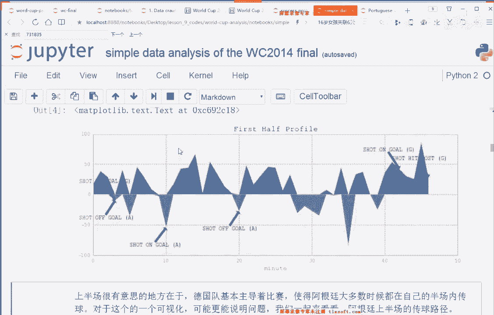

大家看得到这个图吗？这是一个传球，这幅图是一个传球，这是我们刚才给大家讲的joaw event，就是在这里用。我要把所有的传球全都画出来，用箭头。那这个很这个更好理解了吧。我从这个图里头啊。

我先不看怎么画的。大家从这个图里头，你看右边是阿根廷这这个半场，左边是德国的这这有半个球场啊，你看我自己我画了禁区，对吧？我画了这个box penalty box，我画了这个中场，对吧？

我画了我我我这个比刚才那个要稍微细致一点啊，因为它有有具体的，而且这个比例，这个比例是完全和足球场是一模一样的，因为我们自己做了scaling。ok。啊，不用，我们这个地方不需要去找起始点。

我们要找我们只是印证我们的想法，我们只是印证我们自己觉得这个。德国占优，德国有进攻攻势非常强，仅此而已。OK所以你去看这个地方。先画一个球场叫BPach。OK所以我把它画出来了，叫出来了。

然后就把所有的传球都画出来呀。你看大家还记得我那个typepe吗？大家还记得我刚才第一的type吗？我类型吗？我一是传球。啊，我记得我忘了我这个文件有没有打开。我忘了文件关了，好像那么一是传球。

我现在想看看传球在哪侧呢，所以一是传球，一是pass好好，所以。来看看啊，传球嘛，所以没问题，joeven我们把所有的传球都画出来啊，我们选出来了嘛，因为到data frame做了一个选择。

必须是要是传球。然后传球以后你就把它画出来了啊，画出来了以后，你把所有的传球都画出来了。你在这幅在这个球场上一看就一目了然。你看到大部分的传球都发生在这一侧，上半场，那显然就是德国公过来了呗。

这个阿根廷过去的就这么一些，而且离离进区都那么远，离进区那么远，只有阿根廷这一次，你看德国好好几次的这个传球或者射门都在禁区。对，都都已经到了禁区里边，阿根廷根本就攻不进进去。好。呃。

所以当然当然图可视化只是辅助，可视化只是辅助，你要你要给你的大boss看，他肯定老老实实是要求你提供具体的数据。所以说你就给我做份统计嘛。我说好做统计吧。所以这个地方用se frame做统计嘛。

group by做一个。分组按照team name，你看啊这个地方的team name就是德国和阿根廷嘛。好，做一个分组以后怎么办呢？做一个聚合，什么样的聚合呀？On offense。大家别忘了。

我刚才是不是产出了一个offence，是不是去自己造了一个。处于进攻的这么一个。一和零这么一个值。是吧，所以我这个值去求平均，不就是表示我有多大的概率，现在是在进攻阶段吗？它就是1个10值嘛。

大家一定要掌握这个技巧啊，所有的二分类的问题。10的时候，你求一个平均，其实表示的就是一的概率，表示的就是一的概率。所以我现在想知道我现在on fans，我在进攻阶段的概率有多高，我就是求一个平均。

对吧？我就是通过这样一个方式，我用一个。n派点 mean去做一个对这个onoff这样一个标记，这样一个for型的标记做一个平均。没问题吧，所以你拿出来你发现明显就是嘛，德国有0。

6161%的时间都是它占据了。公式。他在站着这个。offense在在进攻，然后27%的是阿根廷在进攻。然后有同学会问，还那还有10%的是什么呢？就是你自己去看一看你就明白了。我我这个这个问题留给大家。

你看看我们我们当时这个onoff是有没有哪些区域是遗漏的，或者说在那个区域，你看看可能是势均力敌的。啊，好，然后这个地方的话有一个传球，对吧？我们type等于一。

说明是在传球我go by tip name，说明我要分一下是阿根廷队还是德国队，我去看一看他们的一个outcom，他们的一个概率，也就是意思是什么呀？传球传媒成传传成功没传成功。传成功没传成功。呃。

去这个outcom变量是你自己造的啊，你可以自己去，你可以上上去看一下。你可以自己上去看一下outcom。out come指的就是说我有没有传成功啊，我们自己刚才定义的一个变量。

所以你对他用同样的方式啊MP点那呃命我我一直在说这是一个小技巧，我们可以拿到概率。所以你会发现明显上半场德国状态太好了，就是呃不是太好了，就实比阿根廷明显是要好的。它有83。5%的传球都是都是很顺利了。

没有没有没有被断掉。然后你会发现阿根廷只有69%，69。4%的传球是。成功的其他的被其他都被断了。呃，好啊，这个嗯。不说了，然后。底下这个东西啊底下这个东西画了一个图，就是射门的一个状况。

这个东西呢是大家可以看到to box two box指的是我离进去有多远。啊，不应该说我就离近禁区有多远，to box指的是在不在，应该是在不在进。

进区里面嗯这个地方OK你自自己去看一下上面的这个一个运算啊，因为这个这个ipad notebook也是有有有有一阵子了，但是。就是做这个东西还挺好玩的。

然后typeab等于一说明是一个呃在他现在想看的是在禁区里头的一个传球或者怎么样啊，所以这个地方type等于，反正type等于一的话，应该表示的是一个传球，对吧？如果刚才我们看到的话，pass。

From box。等于fse，然后periods等于一表示说我是上半场，大家去看一下的period总共有3个一和2，还有一个是加1，所以现在是一是表示在在上半场，然后outcome是等于零。

表示说成功了，outcome等于一表示没有成功我做了一个统计。然后我把它画了一下，所以这个地方有joeven啊啊joeven把它画出来了。所以你看到底下有不同的颜色，红色有黑色。

他们分别表示了就是这个有没有成功的，把这个求。就就是就是是是是那个有没有成功的进入，把这个球传到禁区。

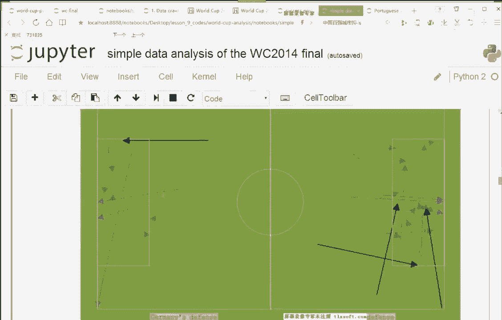

进区内的一个表现啊，也是一个统计也是一个统计。这个我不给大家多说了，就是groupod by team name以后，刚才和刚才一模一样，outcom对outcom去做了一个做了一个统计，做了一个概率。

好吧啊，之下面有个分析，有个分析是这是看的，就我我也是看其他地方的一个分析啊，就是说这个克拉莫，这是一个。这这个是这怎么说呢？就是他是一个德国的球员。然后他中中途受伤了，但受伤了之后呢，你去看这幅图啊。

如果有细心的同学去看这幅图，你会发现有一段有一段时间就是简直就是就是德国队一直被压制。然后你就会在想这个东西他们会做分析，觉得这个东西的话，如果你不了解足球啊，你想这个东西肯定是有原因的？

就是原本德国一直都很强势。为什么突然有有一阵有一阵子他的这个进攻攻式是不行的。所以你会发现大概19分钟的时候，这个哥拉莫受伤了。但是一直到12分钟之后才换上真正的替补球员。

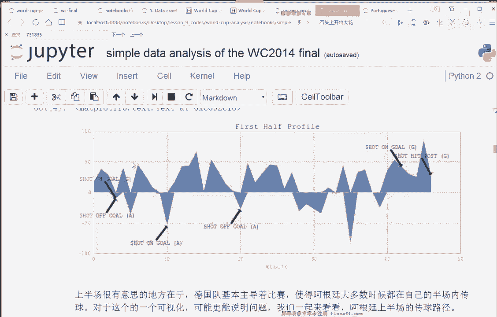

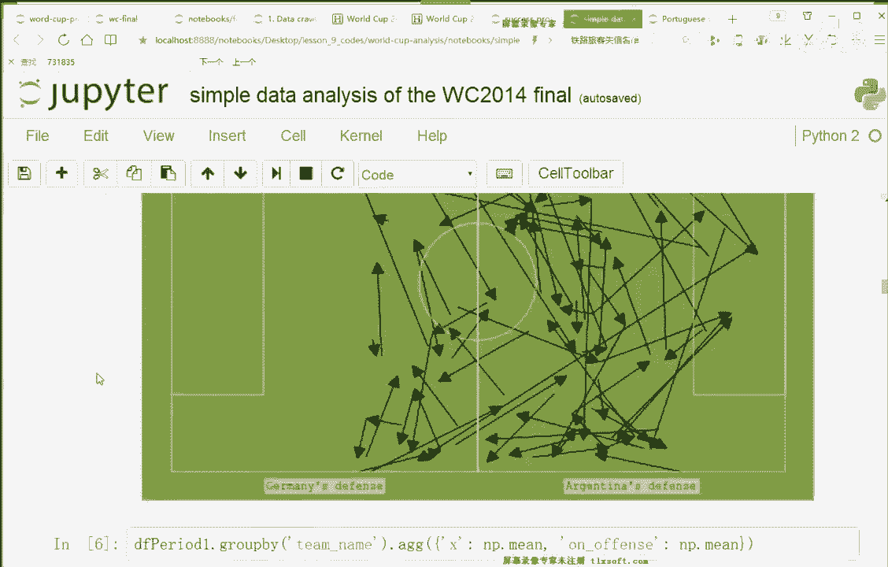

所以你会发现这12分钟就是很很煎熬，非常煎熬。然后。这位同学呢在受伤了之后呢，卡拉莫在受伤了之后呢，到到替补上场之前呢，他们说基本上他那个位置就是一个无功能状态的一个位置。啊，你去看那些报道啊。

外国外的报道是这样报道的，说唯一做的事情就是有一个接印啊。sorry，这个打错了字啊，传了一次球，然后结果他失掉了一次球。这个数据是可以统一次统计的。所以你看我从这个数据里头啊。

这个data frame，然后我特地把这个它的关于它的这么一些event，关于它的这么一些事件给它拿出来了。所以你从data frame里头把player name等于这个car莫的对吧？

这么一些data frame这么一些数据真的数据取出来了，然后我去画一个我做一个表嘛，所以你做了一个表，你可以看一下，这是第第0分钟第一分钟、第4分钟、第16分钟、第7分钟第80分钟。

你会发现从第19分钟开始啊，19分钟往后，你会发现它这个表里头一特别少。大家能看得到吗？这个这个表。啊，具体表怎么做的，自己去看代码，好吧，这个代码其实就是把就是把data frame喂进去。

然后就去去看一下就好了。所以这个地方的话大家可以看得到啊，从19分钟往后，你会看到这个19分钟之后这三列，你会甚至是包括19分钟的这一列，你会发现一非常少。19分钟之后吧，你看到一非常少。

只有一个传球pass，这是一对吧？然后这个地方有一个还失了一次球是吧？这个地方的话okK这个地方的话是替补。上场。所以提一个表格嘛，很你从你不就是看数据嘛，你你这些东西看表现嘛。

所以你直接把数据拿出来看呗。所以你看了，然后这个下面这个我不说了，就是把那些对应到刚才我们说的那样一些。场景的这么一些。event拿出来data frame和action行为。好吧。

然后下面这个地方做了一个柱状的一个统计，这个柱状统计我也不说了啊，柱状统计就是表明你看你看这个在这位同学在第19分钟之前，19分钟之前，你看还有这么多的这么多的行为呢，就是他至少他表现还是挺好的。

就是还是比较积极的，结果发现19分钟之后只有3123好OK。呃，没问题吧，这个没问题吧，它只是一个表示形式而已。你把它你把这个柱状图换成别的图没有问题。大家想换成什么样的表达方式都可以。因为可视化。

它就是一个它就是一个给人直观。可是这个mpro label去画图，做可视数据分析的可视化的话，就是只是给人一个直观的。一个展示方式，我看到这张图我就能知道发生了什么。

我看到这张图我就能知道现在是什么样的一个状况。啊，到目前为止，大家有问题吗？到目前为止，大家有问题吗？我代码给大家了，大家可以可以去啊自己run一下。呃，没有没有问题的同学回个一好吗？

表示每次上课都比较担忧我是不是？合适。好好好，我有看到三个一。好好嘞。😊，行好，然后。咱接着往后说啊，上半场分析完了，下半场就快一点吧。就是直接给了结论。我说下半场的话就势均力敌很多了。

我可以按照上半场的方式去画图啊。这个图我不给你解释了啊，下半场你会发现并没有并没有德国占据主要的攻式，而是德国和阿根廷是大大致上是。势均力敌的。对吧你看到阿根廷有这么多次到了德国的这个办场。

然后德国有这么多次到了阿根廷的办场。所以你去你再去做一个统计的话啊，你再去做一个统计，你就会发现这个时候。德国是0。59，阿根廷是0。41。呃，虽然还是有一些差距啊，你从这个图上也是能看出来。

还是有有一点点差距，但没有上半场那么。差那么多了嘛，上面场一个70%，另外一个只有30%都不到，对吧？好，所以一样的去看他们传球的一个。成功率你会发现传球的时候，成功率1个0点，德国是0。83。

德国是很严谨的球队啊，就是素质比较高。阿根廷是0。81，你发现差不太多，对吧？并没有差特别多。

哦，下面是一些同样的一些绘图，你可以看一下，你会发现这个时候呢呃阿根廷也能有一些还不错的这个射门或者是传球。虽然德国显然还是比他们要稍微稍微要要要强一些。

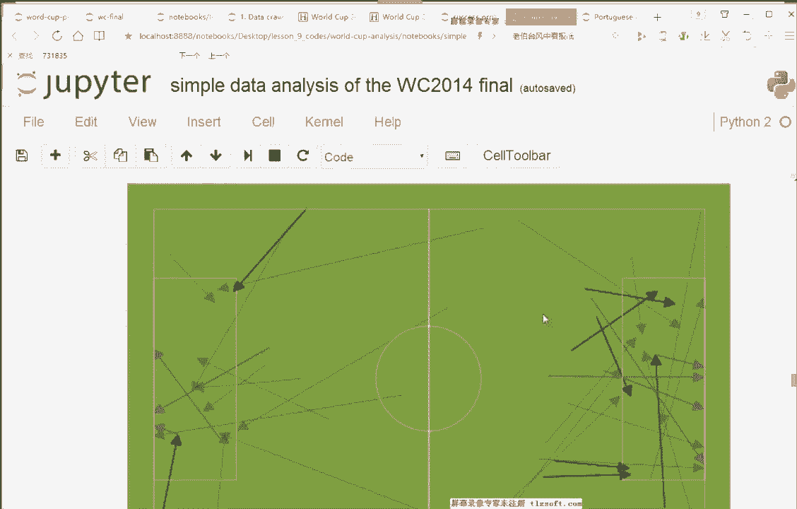

嗯，对，就是在这个。禁区禁区这个位置。除了上半场和下半场，其实还有一个加时的部分，也就是我们一个一补充嘛，加时的部分。

所以exual time data frame extra time里拿出取出来的东西呢，就是德国队和阿根廷队的一个。加室部分。加实部分到底是谁占据主导优势呢？来看一看。不是主主导优势。

就是你发现一个很有意思的事情啊，就是。开始的时候。德国队。一直都。站站着球呢，就有到后面的时候，阿根廷猛的出了几次，对吧？而且你你可以看看这个射射门的位置啊，你看。你可以发现德国队基本上就不勤于射门了。

这有一个射了一次OK这也射了一次。然后中间很长一段时间就是禁默期。这有一个很有意思的分析啊，就是你你要真的去对他们去做一个分析的话啊，做一个统计。比如说这个传球的次数啊，比如说这个呃射文的次数啊。

你就会发现说德国传球的次数就是这到第四阶到这个阶段啊，到这个阶段，德国队和其他阶段很不相同。德国队明显就减少了传球的次数。那那他是在干嘛呀？他在耗时间呗，试图控制比赛。因为现在如果比分已经领先了的话。

我就把节奏放慢一点了。这样的话就们能把把这个时间拖到最后，反正你也进不了球，球一直空在我自己脚底下就好了。所以你可以看看德国对上一级射门之后的数据，其实这一点就体现的比较明显了。就是上一个进球之后。

后面的东西的话，一些类似的可视化，我做了一些就是捕食阶段的一个情况啊。OK然后发现阿根廷也是比较比较惨，阿根廷只有一记圣门在大概是在这样一个位置。然后你去看一下，他会它出自于梅西梅西之手。但是。

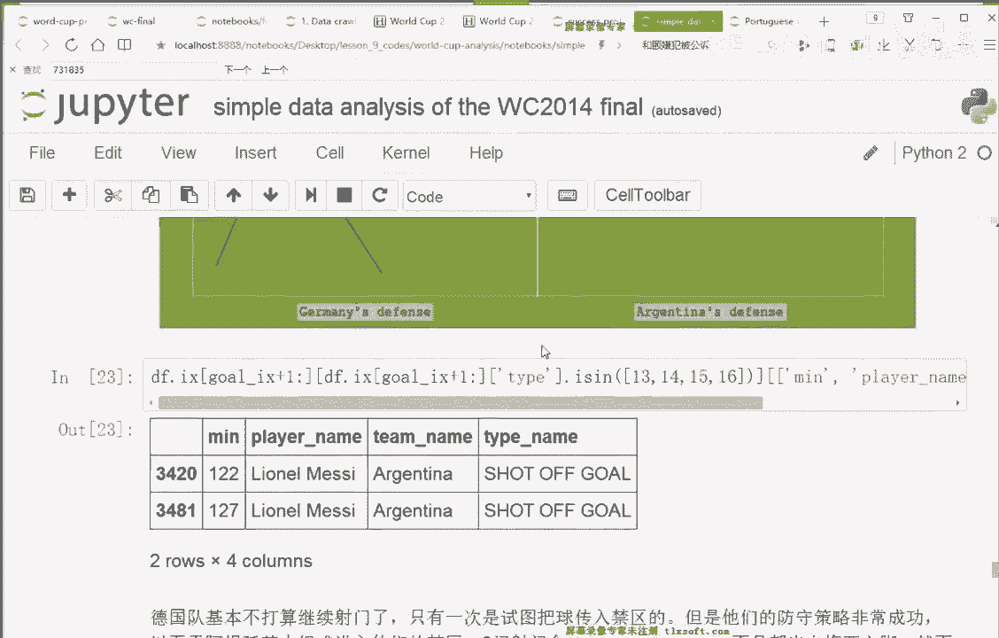

呃，OK这个地方的话。哦，不对，这个这个图我我解释错了啊，这个图的话左边是jamany's defense，就是这是德国队的一个。这是德国队的一个防守区，这是阿阿根廷的一个 defenseense。

所以这个时候的话呃德国队是基本上不打算继续射门了，他只有一次是试图把球传进禁区的，就大概在这，大家可以看到这个图上啊，只有一次只有一次是试图把球传到禁区的。但他们防守的策略其实还蛮成功的。

以至于阿根廷的话，其实阿根廷比较难到他的禁区。你看他传他的各种。

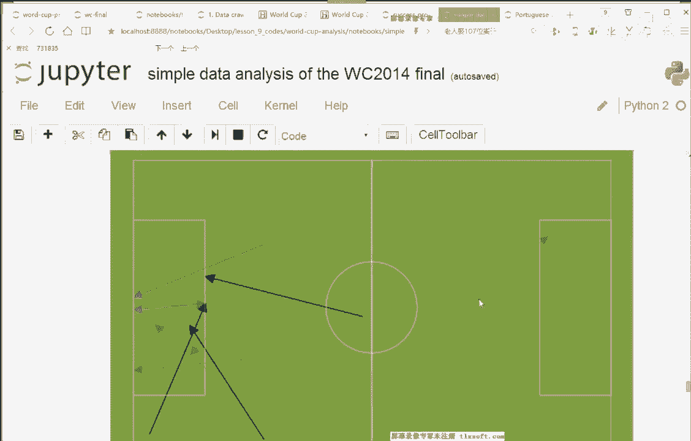

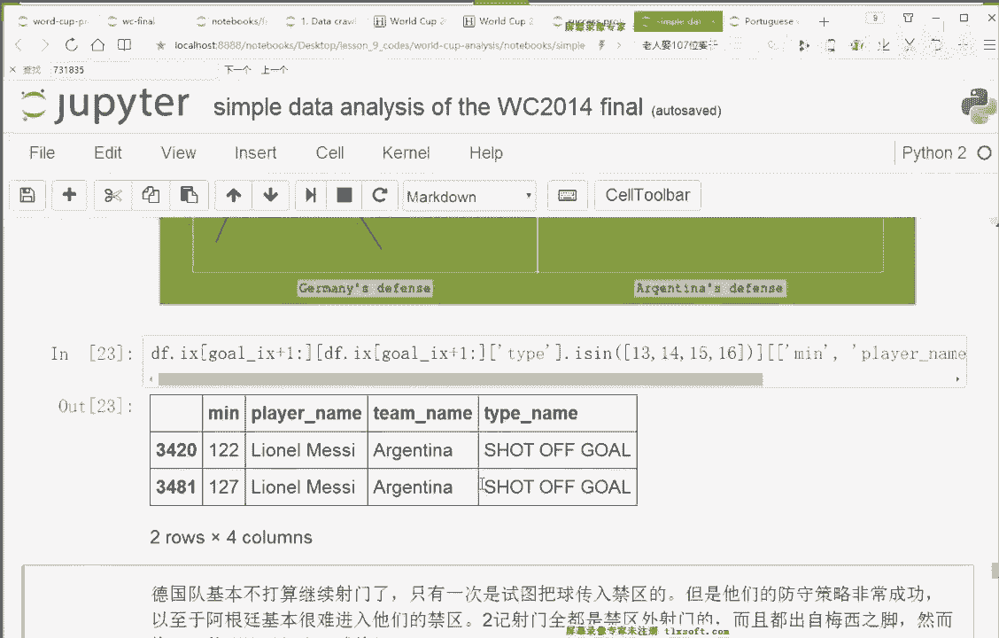

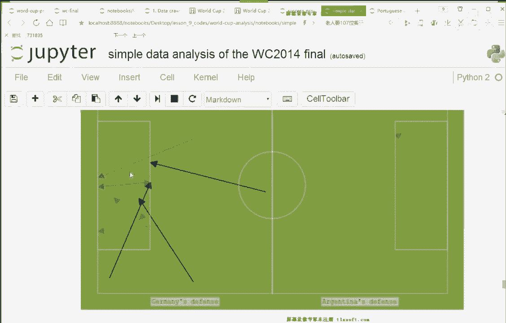

就是球都都都没有到进去之内，就包括传传球的这个点啊或者各种东西。

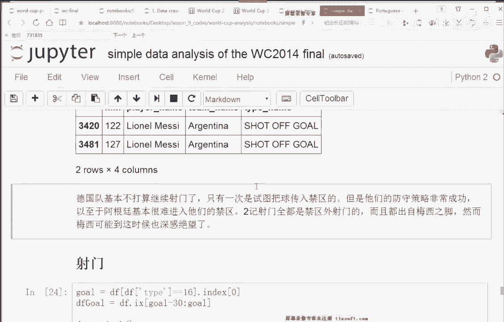

你发现有2G的射门是红色的，红色这个是2G的射门。红色的这两级射门呢是全都是进区外设的门，就是没有到进没有没有突破，就是没有到进区内啊，进区外去做的射门。然后上完之后呢，就是也没有进。

所以梅西这个时候可能也比较绝望。哎，这个同学截的这个图是在哪儿？我不在是在啊。

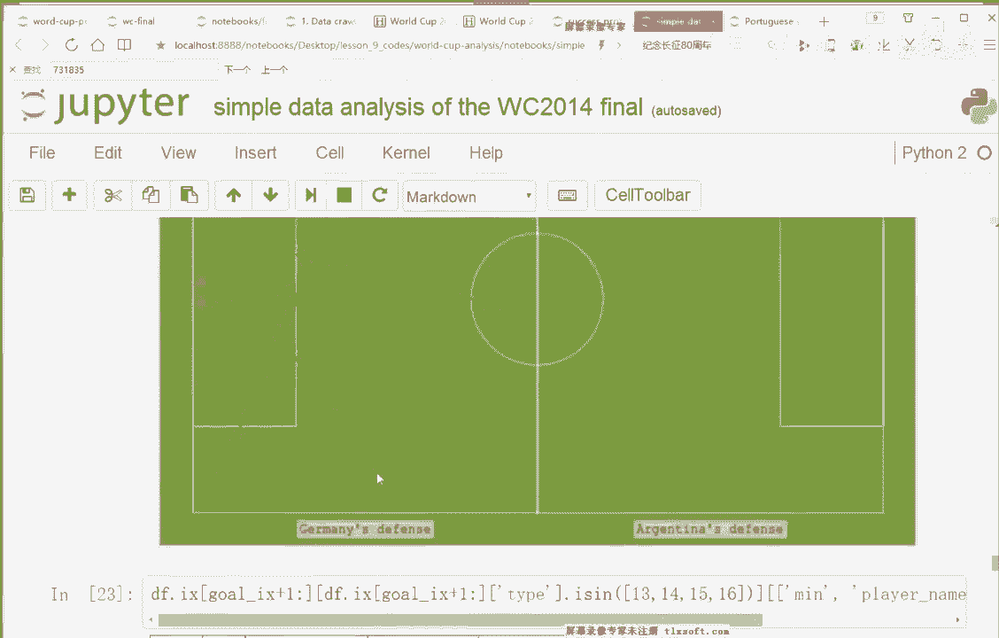

哪个位置这个位置吗？你说什么？NP点min不太一致啊，我我没没太明白你的意思。我不是特别明白你的意思。你只需要保这是不同的阶段Pro就是上半场下半场补食阶段。那每个阶段的话，当然。

all offense应该是。不一样的呀。阿根廷的话上半场是0。27嘛，但是我统计住啊，德国上半场是0。61。然后你会发现上面的这个东西加上这个东西。基本上是。

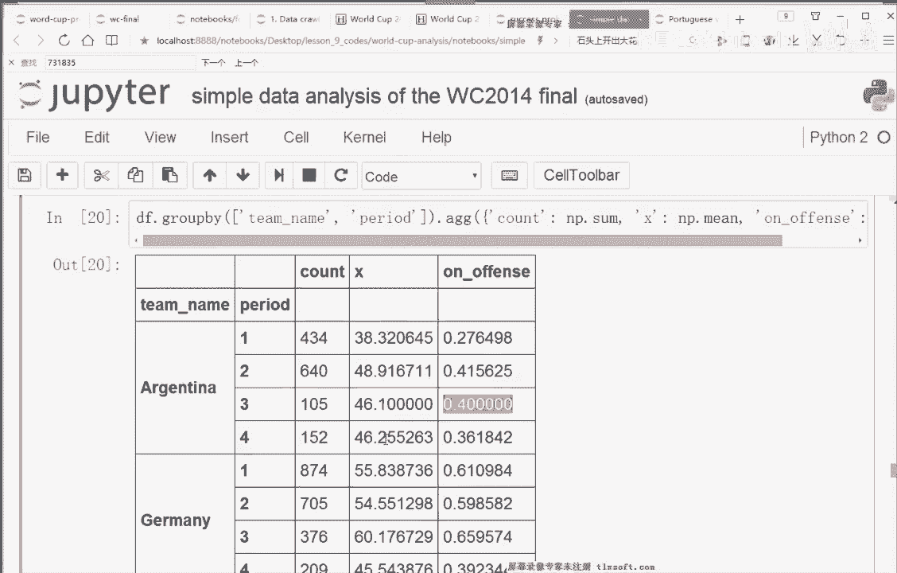

对。是。呃，这个大家自己去看一下就好了。MP点 mean就是一个概率一个概率。然后我们可以看看它的一些看看关键的射门，你是可以用这个东西画的，你可以用jo pitch去把这个球场画出来。

所以整个球场你画出来了。然后你用jo events去把里头的事件画出来，但我只需要我我画这个事件的话，实际上我画我画这个。大家可以看到这个地方是一个传球，最后射门的这么一个。

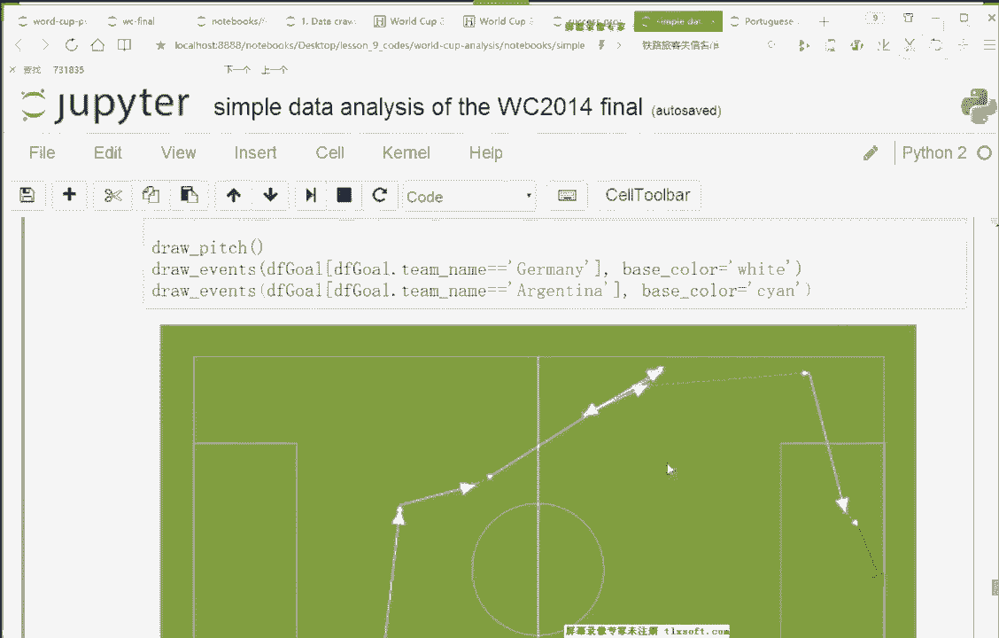

整完整的一个路径，传的一个路径。呃，好，然后我们再往后看的话，做了一些其他的一些分析啊，无非就是一些运动员的一些分析了。

所以germany's player involved in the play德国的球员比赛中的一个情况啊，in the play在比赛里头的一个情况，所以就统计了一下这么多player这么多啊球员。

然后他们都这个有什么样的一些，比如说这个地方type name就是他是什么样的行为，传球对吧？这个带球跑带球跑，然后怎么怎么样，progresss progress是我们的一个统计值啊。

大家我大家去看一眼就好了。progresss啊sorry progress是我们刚才做出来的data frame里头的一个值啊。然后会有一些基础的一些数据，基础的一些数据。

然后大概是他们里头有多少个行为等等啊，然后有多少次是成功的等等等等等。啊，传球有多少有多少次传球有多少次是传球是成功的一系列的统计数据啊，每个球员。OK这是做了一个表。做了一个表。嗯，好。

下面的东西的话就是类似的，就主要看你主要看你关注什么点。比如说你关注的是这个有没有进球，对吧？这个有。ok然后然后这个有没有射门，对吧？然后等等等等等等。其他的一些。过人。啊，好。

然后这是这个呢这个ipad不我还是没有太明白这个问题。因为我现在不能把你这个图放大，因为我放大的话会出现在这个框里头影响其他同学。看这个课了。呃，咱们这样吧，咱那个下课下课以后下课以后我帮你看好吧。

这个问题这个同学，然后我们先往后讲，好吧。所以这是一个大致的一个分析，它是一个模板。所以有了这个东西之后呢，如果啊你可以去看看这个这个网上有没有其他的一些，比如说呃。一些甲级联赛啊或者其他的一些东西。

你可以你可以试着用这个东西做一个分析啊，可以做一个分析，还还挺好玩的。就是他还是能说明一些东西的。至少现在这个数据分析不是那么的枯燥啊，不是全是数字，我也有能做一些可视化，能看到一些图。

