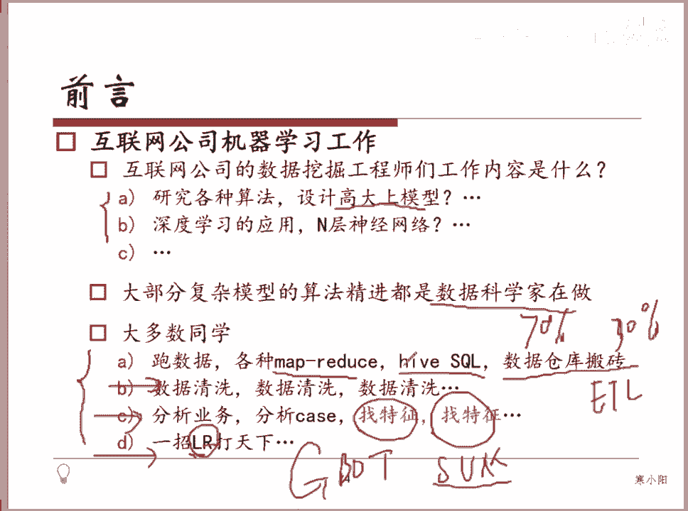

# 人工智能—机器学习公开课（七月在线出品） - P1：机器学习从业者在公司都做些啥 - 七月在线-julyedu - BV1W5411n7fg

我不太清楚在座的这些同学有多少是实际在互联网公司会从事这块工作的同学。如果。做的是数据相关的一些同学的话，你应该如果有和这个ine learning这些team里面同学聊过的话。

你应该知道大部分互联网公司ine learning这些些工作并不如大家想象的说去研究各种各样高大上的model当然会有会有那个你会看到像百度的IDL或者是像滴滴的研这个研究院等等。

这他们大公司的研究院里面会有一些岗位是相对而言偏re一些的但是大部分的实际落地的应用，实际上并不是对这些比如说深度学习啊，好多层的神经网络这么复杂的怎么去做研究而是说大部分情况下，你再和数据打交道。

就是我们今天这些课提到的这些内容是大部分时间可能会花我我大概比如说我们简单估算一下，可能有70%的时间是在处理数据，后面的30%的时间会是你去做建模这个模型的状态评估。然后O modelel。

模型融合等等这么一些工作。所以大部分复杂模型的算法，精进都是一些数学科数据科学家在做，对吧？或者一些顶级的这个CMUdeer那些实验室的同学可能在在在跟进这么一些精进的些算法。

那大部分人只是把这么一些package拿过来用。所以但是大家都是这些package，没有这个。大家都是这么一些拍age，那谁能用的更好？这个东西很大程度上就取决于这个地方我们提到的。这个。

非常geneary，对吧？好，那个对，然后大部分时候你会做到各种各样的你会处理各种各样的数据相关的一些任务，对吧？有因为有很多同学会问我说，老师。

那我做模型 learning需不需要有这个比如说ha do或者park这样的一些。一些一些基础的知识或者是背景呢？其实怎么说呢？就是你如果你你真的进到这样的组当中，你一定会具备这样一个技能。呃。

而这些东西本身不是太难的，它只是因为数据量大到说你在单机上已经处理不了了，所以你一定会有。一所以对你一定会有。这么一些相关的处理的方式，在大大的很大的数据上去做处理。

比如说你可能需要去写一些m reduce job。那如果你对这个不熟的话，okK那你对cicle熟的话，你也可以写一些类似于还 circlecle这样的数据去做一些各种各样的数据仓库搬砖的一些事情啊。

我们把它叫ETL好，然后你会做你会花一大部分的时间去做各种各样的数据的清洗。因为你拿到手头上的这样一些数据，真的不一定是。可信的也不一定是按照你的想法去按照按照真实的分布去展展现给你的。

所以你会做各种各样的数据清洗的工作，包括里头的一些离群点，一些nice，各种各样的东西，你得先给它清洗掉，保证我们拿到手这上数据是可信的。后面会有一些工作去做各种各样的分析业务，去找特征。

你做你你所觉得觉得技术非常非常精湛的这么一些team，包括阿里的team，包括啊百度做广告的这些team，实际上真的有有一些同学是专门做这个事情的。我们我们组之前有同学专门就是做。

feature相关的各种各样的特征的组合，各种各样特征的一些呃变换，一些映射，看看能不能有实际效果的一个提升。然后你你会认为像有有同学啊学了后面的。

比如说我举个例子说GBDT或者是啊O啊SVM大家都知道有这个RBF kernelO高高斯高斯盒，然后会有一些 polynomial kernel。你知道这么一些算法以后。

你一定会觉得说像非常非常简单的算法，像老g这样算法，你不太想用，对吧？我就想用这些高级的算法，但我会告诉大家，实际上你现在去看这个。弹窗。好，实际上大家你你实际上你你工作的话，你会发现啊。

像呃阿里或或者是百度，它真正核心的部门，用 machine learning的部门，它一定会用一定会有一个log regression这样的 modelel在baseline model在因为这个模型非常非常的可控。

对他们上了一些我们呃之前就是组内的话是上了一些deep learning的一些model是有深度学习的模型在的。但是这些深度模型深度学习的model的话，我们后面讲到的时候，大家会知道它。

它是一个black box，一个黑盒，所以它能出好的结果。但是一旦它出了不好的结果，或者是它坏了，你现在很难找到原因，定位到原因到底是哪哪样一些样本使得他做了这样一个变成了就现在这样一个判定的一个标准。

或者说是哪部分的特征出现了问题。你不是你是不知道这个东西。我们需要有一个东西能够稳住现在的这个当前的这样一个。准确率或者说一使得它不至于太差。那那这个地方对用的就是啊logdirect。

SVM呢这个模型严格意义上来说是这样的。我我的理解是SVM在小的数据集上可以拿到非常好的效果。你通过各种各样的 kernell的映射，能拿到非常好的效果。但是在特别大的数据集上的话。

你很少会看到它的使用特别特别大。比如说像电商这种一天能产生多少亿的数据呢。

对。OK好。

