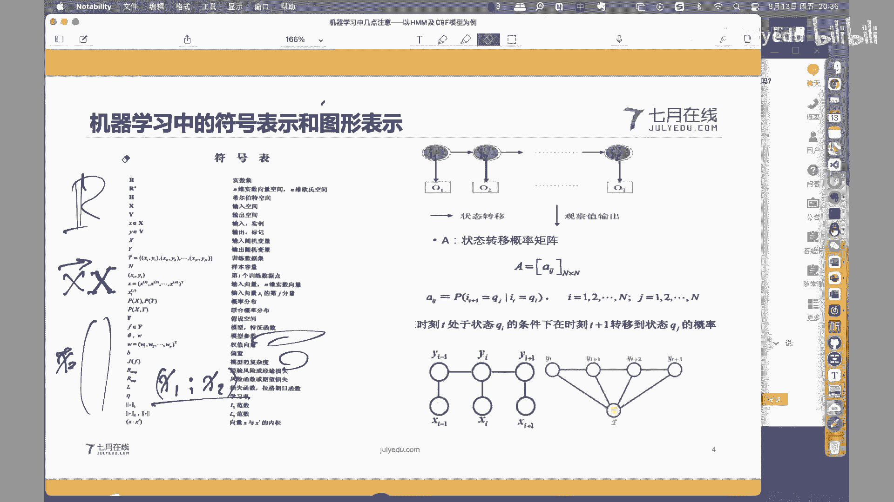

# 人工智能—机器学习公开课（七月在线出品） - P23：【公开课】机器学习中几点注意——以HMM及CRF模型为例 - 七月在线-julyedu - BV1W5411n7fg

🎼。

喂喂嗯。呃，如果声音和视频没有问题的话，我们就准备开始，好吧。

嗯。啊，大家好啊，这个。我们下面的时间呢，这个就关于机器学习当中的几点注意的事情和大家有一个交流和学习。啊，为什么要组织这样的一次活动啊？是因为啊当然原因很多哈，主要原因有这么几个。

一个呢是我们最近在这个就是嗯学习的过程当中啊，很多同学都会呃学习了很多这个模型啊，掌握了很多的一些技术和技巧。当在进入到深入的学习阶段的时候呢，会发现。嗯。本来有一些不应该是问题的问题。

可能越越来越暴露和突出出来啊，这是一方面的原因。另外一方面呢，还有一些呃新开始学习的同学。怎么去进入到这个方向，可能也会有很多的问题。呃，虽然说哈以上两点呢好像不是同样的呃，不是同一类问题。

但是有一些共性的特点，也在总结和思考这方面的一些问题。那么所以呢希望能够组织这么一次和大家的一次交流，就是把我们在机极学习当中的一些呃需要注意的几点，或者说我们在学习的过程当中，应该引起足够重视的几淀。

那么和大家有一个交流和分享，所以呢组织了这么一次的这个活动啊，这是一个起因，和大家介绍一下。那么呃。这几点内容呢也是我们在不断的就是学习的过程当中，算是有一些感觉，或者说有一些体会。那么呃。

会以这个HMM和CRF啊，这两个模型呢做一个介绍啊，以它俩作为一个切入点啊，当然今天不会讲解这两个模型啊，因为这两个模型相对来说还都是呃基于大量的概率计算的模型，所以还是比较复杂的。

我们后面会有专门的课程会讲解HMXRF只是以这两个模型为例哈，把几点注意的事项和大家有一个介绍。呃，这是关于今天组织这个活动的一个目的。呃，下面呢我们就分三部分内容和大家有一个讨论。

第一个内容呢就是关于机器学习当中的符号表示和图形表示的问题。呃，即使是啊就是刚才也谈到了啊，新到这个方向，就是新进入这个方向的同学可能。呃，会越来越深深刻的体会到，就是我们的模型会越来越复杂。然后呢。

这个嗯计算逻辑或者计算过程会越来的越。呃呃数据结构呀、计算逻辑会越来越庞大，然后复杂。那么其中。最突出的一个特点就是我们需要使用大量的数学符号来表示这些复杂的逻辑计算。那这个时候对符号的使用。啊。

特别是数学符号的使用可能就会越来越重要。但是呃很多的同学哈对于这方面的这个掌握或者理解，可能还会有一些问题和偏差。所以呢这一部分需要有一个介绍。那么另外一方面呢，就像刚才所讲到的啊。

就是机器学习模型本身的这种复杂性啊，怎么样能够使用一种相对比较直观的方式能够理解它啊，能够更好的理解这些复杂的计算逻辑。那么可能就会体现出所谓的图形表示的问题。

就是你需要把这些复杂的符号逻辑啊映射成这种更形象，更直观的这种图形表示。反过来啊，再去进一步的去理解这些复杂逻辑，可能啊就会对大家的这个学习过程有这么一个帮助。所以第一部分啊需要介绍一下，关于就是其实。

我觉得在咱们上。中学的时候其实就所谓的数形结合的问题是吧？如果我们把这种呃数学符号理解成是呃计算逻辑，那么图形呢就是在此基础上用一种形形象化的方式把它表示出来。这两者之间啊更。

帮助我们对整个问题的有一个深刻的理解。那么第二部分呢就是关于概率模型与基本规则的问题。啊，大家也可以可能看到了啊，就刚才我们以HMMCRF为例的话啊。

这两个模型啊都是非常重要的概率图模型当中的呃非常重要的这个特例。那么既然讲到了这种所谓的概率模型。那么怎么去理解这种就是所谓呃基于概率计算之上的模型表示，可能就需要大家啊有一个更全面的认识。

因为哈因为我们知道当我们一提到模型的时候，我们更容易接受的是作为它的函数化表示形式，就是F等于FX的形式，对吧？你给我一个X，我给你一的应是F。啊，这样的话我就完成了一个从输入向输出的一个影视关系。

这个模型的理解可能大家都比较容易接受。那么怎么怎么去理解这种所谓的概率模型啊，就是用就是以这种条件概率的方式所体现出来这种模型，可能就是一个需要再进一步解释的问题。那么在此基础上呢。就可以发现啊。

就是像我们这个HMMCRF这么复杂的这种所谓的概率图模型。呃，其实哈就是。它也是基于几条或者基于呃一些基本的规则啊，再加上几条基本的假设之上啊，通过一系列的概率计算所得到的那这个时候呢，你会发现。

当我们有关于模概率模型的一个理解以后，那么再加上一些基本规则的一些理解。其实再复杂的概率模型，其实我们也可以啊能够啊逻辑上没有问题的把它一步一步的推导出来啊，这是第二部分啊。

就想和大家分享的就是所谓概率模型的问题。那么第三个话题呢，可能就是关于继续学习当中的模型关系的问题啊，就是我们很多的初学的同学啊，特别是有还有一些就是学了很就是很多模型的同学。呃，有会有一个问题。

我说困惑就在于这么多的模型啊，好像每天我们做了很多的工作，那么这些工作是。是割裂的嘛，或者说是是是彼此是独立的嘛。很显然不是啊，模型和模型之间是有很强的这种。呃，发展脉络的啊。

特别是啊我们现在讲到深度学习那非常繁杂的这个神经网络的时候，你会发现嗯，其实每一个工作都是在他的前续工作的基础上做了一些改进来得到的。那如果我们按照这个思路如有前后这种关系的话。

你会发现有很清晰的啊这种模型的发展脉络关系。如果当你掌握了这种所谓的模型脉络关系以后，你会发现你的复杂的问题就可以逐步啊一步一步的把它的复杂性降低下来啊，当你有这种视角以后，你会发现ok一个新的工作啊。

它是在原先的哪个工作的基础上，针对哪些问题做了哪些改进。你只需要把这个改进的部分能够解决掉啊，整个的复杂性也就降低下来了。所以说第三部分呢和大家讲一下关于这个模型关系的问题，好吧？以上呢是咱们。呃。

计划啊，今天我们把这三个部分做一个讨论。那我们先看第一部分。

就是关于机器学习当中的符号表示和图形表示的问题。

呃，首先我们看一下符号表示啊，先解释说明一下什么叫符号表示，其实就是我们的函数化表示形式啊，或者说是我们的就数学表示，以一种这种形式化的无二意的形式把我们的复杂模型进行一个表示。那么既然是符号表示。

那么其中就关于符号的问题需要特别重要的提出来啊，就是这一堆数学符号每一个符号都有它明确的标准的这种含义。你对它的理解和掌握啊，不能出问题啊，这是最基本的要求。呃，换一个思路啊。

如果你对这些基本的数学符号本身还有一些困惑的话，那么就更加的为后面的这种学习啊带来更大的一些隐患啊嗯。举个例子啊举个例子，比如说啊。符号表的问题啊，那为什么要提出这个来呢？嗯。

麻烦就麻烦在数学本身要求它的无二异性是吧？你不能出现两种不同的理解。但是呢对于同一个符号的使用，往往不同的场景啊，不同的课本啊，不同的这个这个作者使用起来呢还会或多或少有一些偏差和不同。

这个时候就麻烦了是吧？本来我们是要有要用要使用一个无二异性的工具。你这个时候呢，偏偏是在这么强的条件之下，那又带来一些变化，或者说是带来一些。呃，不同的符号理解啊，这本身就是矛盾的那怎么样解决这个矛盾？

其实非常重要的呢，就是关于符号表的问题啊，符号表。这种这个表哈，但凡是大家啊多看几本书啊，特别是理工科的书，你都会发现。嗯。好一些的教材。当然这个好是一个非常主观的一个判断啊。

就是就是一些权威的教材啊一些经典的教材啊在。这本书的前面或者后面啊都会有这么一个所谓符号表的东西。很少有同学去看，但是呢呃今天还是非常强调一下啊，非常非常希望大家啊就是在读一本专著的时候。

先看一下它的符号定义。呃，当然很多会啊列出来，嗯，90%甚至95%，甚至99%啊，都是和你之前的这种啊学习习惯是相一致的。但是啊就是哪怕可能那1%的不同。会对你今后对同一本书的理解啊。

同一本书里面同样内容的理解带来很大的困惑。有的时候你因为数学这种东西本身的这种逻辑自洽性要求，它是完全是逻辑统一的是吧？逻辑自洽的，没问题的东西。但是往往这种符号的这种他自己的这种定义啊。

和你自己的理解的不同，造成的这种困惑，就造成了这种很很很强的这种冲突，怎么解决，就是看一下他的符号表的问题。嗯，提到这个地方呢，这个符号表呢。也仅仅是个例子啊。

这张符号表呢是在呃积器学习方向非常重要的一本这个参考材料，叫做统计学习方法啊。我相信啊这个很多的同学也都是呃知道或者了解这本教材。非常好的一本教材啊。

呃如果细心的同学呢会发现在这本教材的第一版啊和第二版有非常非常大的不同。啊，因为第二版李航老师在第一版的基础上大量的补充了无监督学习的模型。啊，非常好的一个这个工作。呃。

但是哈这个我我我非常不能理解的就在于呃你仔细的发呃，仔细仔细一点，你会发现第二本教材里面把第一本教材里面的符号表删除掉了啊，没有了。呃，不能揣测原因哈，但事实上或者客观上确实是没有这张符号表了。

那么带来的一个呃问题呢就在于很多初学的同学，因为呃很多的同学都是以这本书作为一个入门入门的一个参考教材是吧？很多的初学的同学有的时候就会造成一些呃困惑，那我们就简单的看一下，好吧，呃，都有哪些符号。

可能需要我们特别注意一下，当然。呃。也也不全啊，就是把一些希望能够这个使用到的和大家看一下啊，比如说啊实数级R从这一点上就可以看到啊，在在在这本书里面的实数级R是使用的一个实体的，就是黑体的一个R。呃。

但实际上是呃这个很多的材料里面，你比如说我们经常会见到这样的。对吧我们经常会见到的这样的示入级的一个表示。当然它不是重点，但是你需要知道。呃，你需要猜了是吧？当你读到的时候，你就需要猜哦。

原来哦这个啊实数级R啊，就是我们这里的实数减R啊，这个时候如果有一张表告诉你，O我们在这本书里面实数集就是用这个R来表示的。至少我们就完全没有这种这种猜测的必要性了，是吧？这个就说明一下。呃。

我想说的一些比较重要的地方呢，就是这个东西。大家可以看到了，关于向量的问题。首先呢可以看到这里的X定义是个很很明显的是个向量啊，是个向量。一般意义上哈一般意义上我们我我们习惯，比如说如果你是这个这个啊。

印刷体啊，我们我我们希惯你加箭头，代表它是向量，否则的话呢我们可能会用这种。印刷体来表示它是一个向量是吧？很少用这种直接用小写字母来表示向量，因为我没有办法区别，这里的X和一个标量X的区别，对吧？

你放在这个地方，你说这是个标量这是个向量，那形式上又一样，我没有办法去区别。呃，但是呢如果你。你在符号表里面就直接定义了。在我这本书里面，所有的这种形式就表示了向量，那也OK了。

这是一个这是一个需要说明的地方，更需要说明的一点在后面啊，在后面大家可以看到啊，既然是个向量就免不了分行向量和列向量。我们在积极学习领域啊，有一个默认的，就是我们认为啊所有的向量都是都是列向量啊。

都是竖值，就是竖着的列向量。但是很显然啊，这种这种方式会太占这个太占纸张啊，一本书里面如果都是列向量，写不了几行公式就写满了，太占地方也浪费。所以呢往往我们会把它表示成行向量加转值的形式。

所以说啊你这个地方你经常会看到的是它形式上。它形式上是一个行向量，一行一横行。但是呢往往它在右上角加上一个转值符号啊，表示成一个列向量的。形式啊，就是列向量，我们用行向量加转制的方式来进行表示啊。

这个有初学的同学啊可能是会比较纠结啊比较纠结，为什么这。呃，首先如果你认为是个列向量的话，为什么非铁型行向加转制的形式啊，就是为了少占地方啊，就是这么一个原因啊。这其实还并不是最重要的啊并不是最重要的。

为什么这么说呢？因为我们是在所有的向量都是列向量的前提条件，除了假设之下，才用这种行向量加转置的形式来表示向量。但是事实上并不并不都是做这种假设的啊。另外一本书啊，比如说像这个。

周志华老师的那本西瓜书啊，就是那个也非常非常有名的那本西瓜书啊。作为我们的教材的话，在那本书里面，行向量和列向量是通过元素的分割符来表示的。比如说X1。X2所表示的向量，那这个时候是个列向量啊。

好像是啊具体清，我我也记不太清楚了，需要看一下它的符号表。但是你会发现完全是两种不同的符号表示形式。如果你对这个有困惑的话，或者说你不对这个符号表啊，这本书的符号表有一个认真的学习的话。

你会发现所有的一些计算逻辑。因为我们知道因为为什么我们要分行向量和列向量，因为我们后面会要做大量的内计计算是吧？向量的内计计算。这个时候。内机嘛就对应元素乘积求和嗯。这个时候需不需要加转制啊。

如果我们是都是列向量，当然做内机的时候，我们需要呃就直接定义内基计算就可以了。否则的话，我们还需要考虑一下它是不是需要再转制一下相乘的问题。啊，这个时候。就带来很多的一些困惑。呃。

这只还这还仅仅是在向量的这个语境之下去讨论。后面我们还会见到更复杂的结构，比如说像矩阵是吧？更夸张一些。我们深入学习里面还有各种各样形状的张量。所以说你会发现如果你不对。

这些数据结构啊有一个更清晰的结构上的认识啊，它到底是个几行几列的，甚至它是个几乘以几乘以几的一个张量。你后面的运算。呃，非常非常容易出错啊。

所以这个时候啊这些符号的定义是非常需要大家能够仔细的去掌握的啊。所以说啊这个这个符第一部分就符号表示当中的这个符号表啊也是建议大家今后再看到一些专注的时候，不要直接跳过去啊，跳过去的话呃。

风险还是有一定风险的啊，看一眼大体这些符号是不是我们所啊和我们之前掌握的理解的符号是是是相一致的。好吧，这是关于这个啊符号表示的问题。嗯，O啊。关于这部分，我们先停一下，看看有什么问题吗？

声音和视频应该都可以是吧？ok没问题，我们就继续啊。呃，这是关于符号表的问题。那么另外一部分呢，就是关于图形表示的问题啊，关于这个图形表示呢，就以刚才我们所说的哈。

就拿着这个伊马可夫模型来作为一个例子哈，来解释和说明一下。因为我们知道哈关于一马可夫模型mbda它是个三元组啊，是由AB派来组成的。当然有些同学说这个这个我我不太了解。如果同学不太了解的话。

我们在这个我们官方主页上应该有相应的一些课程哈，就一些公开课，有兴趣的同学可以看一下，就是一个一码夫模型是有所谓的状态转移矩阵啊，状态转移概率矩阵A就这类的A，还有这个状态观测。

观测矩阵啊观测概率矩阵B还有初始概率向量派来组成的三部分组成个三元组组成的。其中哈我们很多的同学学到这个地方就有点有些困惑啊。首先第一个就是lambda这个模型很复杂啊，三部分组成三个啊结构啊。

两个矩阵一个向量很复杂。怎么去理解这三部分就是一个很大的一个呃问题。怎么去理解，结合着图来表示，你把一个复杂的像尼马可夫模型这样的图，通过一个图形啊，把这个图形当中的所有的图形符号和我们在。符号啊。

数学符号来表示的这个模型当中所使用的这些数学符号，建立这种数形的这种结合关系。对同学们以后啊，你像啊后面我们举了一个例子啊，比如像后面进行这么复杂的逻辑计算啊，其实你就知道你在你在哪，你要到哪儿。

中间怎么去做，你只需要把逻辑填充上去就可以了啊，所以这种。复杂的数写表示和这种呃图形这种直观的图形结之间的结合也是非常重要的那我们就看一下怎么把它们映射起来，就是这个东西啊。

数学表示和下面这个图逻辑上是一样的，就它俩是一回事啊，问题就在于怎么把这个图映射到我们这个数学逻辑上去。我们仅以刚才所说的那个矩阵A啊，就是状态状态转移矩阵A来进行一个说明，好吧，呃。

状态转移矩阵A啊是一个是这么个东西，是个A啊，是个AA是个什么呢？是后面这个式子，这就刚才啊进一步的说明刚才那个符号的一个作用啊，就是你这一堆符号到底是个什么东西啊，很显然这个地方是个矩阵啊。

文字上也描述了，是这个矩阵啊，但凡是个矩阵，其实首先关心的不是这个矩阵里面的元素值的问题啊，这个矩阵的形状首先是需要搞清楚，弄明白的，就是这个这个矩阵是个几乘几的几行几列的一个矩阵。

就像刚才我们所讨论这个向量的这个这个逻辑是一样的。就是你先把这个向量是个行向量还是个列向量搞清楚啊，然后再讨论它是个几为向量，然后再讨论它的每一维里面的元素的组成的问题。同样在这个地方。

我们现在知道了它是个矩阵，那他说是是个几乘几的矩阵，你先搞清楚，然后再去讨论这个矩阵里面的每一个元素到底是谁的问题。好吧，那么他告诉我们，这是被称之为是状态转移概率矩阵啊，状态转移概率矩阵。

它是用不来啊记录时刻T处于状态QI的条件之下，在时刻T加一处于状态QG的概率。很显然，他说的是两个状态之间的转移概率的问题。既然是两个状态之间进行转移。那如果我们假设我当前有N种状态啊。

我现在有N种状态，任意两个状态之间都可能存在这种转移关系的话，那我们很显然能够知道，如果我要把这N个啊N个任意两者之间都可能发生转移的这个状态集合的这种转移关系进行完整的记录的话。

那么很显然这个矩阵A应该是一个N乘N的一个矩阵。是吧我们可以看到啊，他要来记录的是任意两个状态之间的转移关系，我又有N个状态。那这N个状态里面。

我任意找两个都必须要完整的能够在矩阵A里面清晰的知道它的转移关系。那这样的话，我们通过一个N乘N的矩阵就可以完成了。所以说啊第一步先搞清楚它是一个什么样的矩阵。然后在此基础上也更容易帮助我们去理解。

既然它是记录的是任意两个状态之间的转移关系。使用N乘N就表明了我第一个状态可以跳到。其中的任意。一个状态当中去。那么第二个状态。同样也可以跳到任意一个里面状态里面去。

所以你会发现这I点一直到N1234N。所以你会发现最终我们得到的是一个N长N的矩阵。那这样的话矩阵里面的每一个元素。如果这是第二行，如果这是DJ列，那其中的每一个元素记录的就应该是什么？

看照要求是在T时刻处以QY。在下一个时刻处以QG的概率。这个时候有些同学就反应不过来了，什么叫T时刻？什么又叫做T加一时刻，这个时候就不再像这个矩阵这么清晰的能够反映出这种规律性了。

那这个时候就不需要借助我们的图形表示了。好吧，既然说的是T时0刻和T加一时刻啊，既然是T时0刻和T加1时刻，我们就能很明显的就是。值道的在于T和T加一是两个紧邻的时刻关系。T时刻在T加一时刻的前面。

T加一时刻在T时刻的后面。所以你会发现啊最简单的一种符号表示方式哎。我就可以用两个圈来表示它们两个状态。前一个是T时刻，我们用IT来表示，后一个是T加一时刻是IT加1。

对吧就会你这这是一种很自然的一种一种一种啊一种。一种结果是吧你你就是前面和后面的关系嘛，T10刻和T加10刻，那就是前先有T10刻，然后再用T加10刻不就可以了吗。然后呢。

再看一下是在T10刻处于状态QI。然后T加1时刻是在。状态QG的时候，那这个时候很明显，IT是等于QI的IT加一是等于QG的。你会发现所有的信息啊，所有的已知信息都在我们的图上表示出来了。

这是前面一个状态，这是后面一个状态。在前一个状态是QI，后一个状态是QG的时候，我们定义的是什么？我们定义的是一个概率。那很显然是个什么概率，是一个在某某条件之下的概率，很显然是个条件概率。

所以你再看一下，进一步再再去理顺一下这个数学符号就比较清楚了。什么清楚呢？是在前一个时刻T等于QI。在前一个时刻，IT等于QI的条件之下，下一个时刻IT加一等于QG的。变率。我们把它定义为AIG。

AIG前一个时刻，我比如说是第二。二这个时刻，然后下一个时刻。跳到三这个时状态当中去的时候，那么这个A23啊，这个小A23这个数值代表的就是上一个时刻是2，下一个时刻是三的时候，我的这种跳转概率。

但是这个概率值是多少？我们需要根据啊需要根据呃你的数据集啊，根据你的数据集或者根据你的场景进行分析，再知道这个值是等于多少。但是刚才我们所说的，我们更关心的是它的逻辑含义是在这个结构当中，这个位置上。

这个值的含义代表的就是前一个时刻和后一个时刻状态和状态之间的转移关系。值至于这个状这个转转移该关系的值是多少，我们通过数分析我们的数据，通过分析我们的场景，就可以把这个值填充到我们矩阵当中去。

又得到了整个的矩阵A里面的任意两个状态之间的转移关系。还回头啊，再看一下。这到底我们要要干什么？当是我这些内容啊，这些内容可能有同学说还是还是还是一头雾水。嗯，这很正常。这个因为还有一些前虚知识啊。

大家可能不是特别清楚啊，那么。这段的分析的目的啊，其实核心就在于啊核心就在于我们当拿到。比如说我们拿到的是这个东西，或者课本上仅仅告诉我们的是这部分。一段文字或者一段文字，加上一段数学数学公式。那么。

有的时候确实是因为你看啊数学符号很多啊，呃其实文字描述。即使是非常准确，它的逻辑含义啊也并不是那么的直接啊，所以这个时候很有必要哈很有必要，及你首先需要对这些数学符号有一个清晰的认识，结合这符号表啊。

如果符数学符号你都搞不清楚，你知道这个中括号什么意思啊，这个N乘N什么意思啊，很显然，N乘N说的是这个矩阵的。形状是吧，这个矩阵的行列形状啊，这个你你首先不能有问题。如果这个搞不清楚，嗯。

就需要就需要找一些其他的教材补充一下是吧？这个搞清楚以后，再看一下它在整个模型当中的概念。这个矩阵里面定义的是时刻T和时刻T加一的一个条件之下的概率。所以你会发现文字描述啊和数学描述。

其实是逻辑上也是等价的，是吧？它俩其实也是一回事啊。麻烦就麻烦在，即使是有这种文字描述，即使是是有这种无二性的数学符号描述，你对这一段的理解其实还是有困惑就。他到底在说什么？

就不如哈把它更形式化的、更形象化的，通过一系列的符号来表示出来。无非说的就是时刻和时刻之间的跳转关系啊，或者说是跳转概率。那跳转从谁跳到谁，我总是可以表示出来的，拿个箭头表示着前后关系不就可以了吗？

那么这个时候。这是IT这是IT加一，它等于QI它等于QG。我就说的是这样的一个从啊QI跳到QG的这个跳转关系，用AIJ来表示。那么很显然，这个调转关系在任意的前后关系之间都是满足的。

对吧这如果是I大T减1，那么它俩之间也是可以通过从AIG当中找到相应的映射位置来来满足我们的这个。跳转关系计算的。那么他是需要知道上一个时刻，然后跳转到下一个时刻，很明显的就是一个条件概率嘛。

我在IT的时候是QI跳转到IT加一的时候是QG的。条件概率是AIG，然后你看看。逻辑上是没有问题的，形象形形更形象的把这这个逻辑表示出来了是吧？同样哈如果。如果按照这个思路啊，同学们可以回去之后。

你再找一下那个课本里面介绍介绍什么介绍这个关系。这个关系很显然是说的是什么？同一个时刻对吧？同一个时刻在IT等于QI的条件之下，我跳转到什么？我跳转到。我的O。一等于VK的这么一个观测。

就状态和观测之间的调整关系。所以很显然它应该我们现在有了图以后，我们把这个公式其实就很好能够写出来。首先它也是个条件概率，在IT等于QI，然后呢是OT等于VK。这个式子很显然。

说的就是从状态到我们的观测之间的调整概率。对吧，所以说你会发现哎他也是。点点他也是。你会发现这个图里面这个跳转关系我们也已经有了，还差谁呀？还差一个对I一就像我们的多米诺骨派一样是吧？

如果我们的AIG说的是状态和状态之间的跳转关系，这里呢我们给他起一个名字，叫个BJK它说的是状态和观测之间的关系。那么多米诺骨牌还需要有一个什么第一个骨派需要倒下去。这个时候很显然，我们只要找一个派。

来表示就可以了。他说的是第一个时刻，P1等于QI的这个。概率就在第一个时刻的。概率到底是多少？所以说你会发现啊再复杂的这个模这样的话，我们的兰姆达AB牌就已经有了哈。你会发现再复杂的模型。

我们只需要把这些。😊，输字符号和我们的图。对应起来，或者反过来把这些图里面的信息能够找一个数学符号进行表达。那这样的话这个模型。你现在在看其实就不再复杂了，他就是这么回事。是这样吧。

所以说我觉得第一个问题啊，就是关于符号和图形的表示啊，这个还是非常需要大家能够能够能够能够理解的。好吧，这是关于在HMM里面。我们下面比如说在CRF里面同样的东西啊，CRF这个条件随机场。呃。

怎么去理解这个条件啊，就一个东西这个条件到底在哪儿？它是在随机场的基础上加了一个条件。那首先随机场是谁来看看。这一块是我们的随机场，条件是谁？条件是我们的X下边这一块。

所以说我们的CRF其实本质上是个这么个东西。是在输入X条件之下，这是我们的输入X或者或者说是在这儿在输入X条件之下，Y的条件概率。一会儿我们会讲到啊，这其实就是模型啊，这其实就是模型。

就是当我们输入X作为输入以后得到的关于输出Y的一个概率值，当然我们的输出Y，就是使得这个概率值取得最大的那个时候的概率值，当然那是后话啊，一会我们会讨论这个问题。但是你会发现这就是条件随机场啊。

就是还是那个输心结合的问题啊，就是谁是条件，X在哪儿？X就在这儿，谁是输出Y就在这儿。当然这个地方需要注意的是这的Y啊，不是一个随机啊，不是一个随机变量，它是个随机向量。

它代表的是由若干个分量组成的一个联合概率。这个呢这个今天就不展开讲了，就是在。这个。具例讲模型的时候，其实这也是一个经常会出现困惑的地方。当然这今天这不是今天的重点。

重点就在于你同样也需要啊同样也需要把谁是条件啊，谁是输出啊，谁是输入，谁是输出能够搞清楚。然后输出的YYY之间。很显然，这个地方啊就不像HMM里面定义的是转移转移概率了。

它定义的是边上的特征以及节点上的特征的问题。边有边上的特征，我们一般是用TK来表示节点上有我们的特征，我们用SL来表示。所以你会发现啊，既然是边上的特征，就有前面一个就牵扯到两个节点。

前面一个节点YI减1，后面一个节点YI，这是边上的特征，每一个节点上还有特征，那是SL，所以说你会发现根据我们那个。呃，最大团的展那个最大团的那个联合概率的呃这个这个成绩的表示形式，你会发现它是E的。

指数次幂相加的形式，其实就是我们的特征和特征的之间的概这个指数词相乘。所以你会发现它是指数，它是这个E的指数次幂相加的形式。所以从这个时候你会发现哦，你再看那个式子的时候很复杂。

但是你会发现哦一个特征是定义在边上。那么我需要知道两个节点。另外一个特征是定义在节点上，那我只需要知道这一个节点就可以了。然后从指数次幂上，按照我们的最大最大团的那个公式展开就可以了。还是啊就是。

公式会很复杂啊，你会。接触越来越复杂的模型啊，模型的表示会越来越复杂。那这个时候借助这些形象化的工具，你才能知道你到底在哪儿。你分析的是哪一部分的问题，这部分问题会有哪些约束条件啊。

或者可用的一些公式和中间结果为你要解决的问题带来哪些帮助？所以说这个。第一个话题啊就是关于它的符号表示形式和图形表示形式。是非常重要的啊这个。如果我们。对吧经常我们会见到这种图是吧？我们这个。诶。呃。

约束的一个过程啊，优化的一个过程。那这个时候很显然这个这里如果是X1，这里是X2。那我们的损失函数在哪？损失函数是垂直于我们整个平面的一个直线。其实如果画清楚一点的话，它应该是三维的是吧？这是X1。

这是X2，这是我们的损失函数。所以你会发现我们的损失函数应该是这样的。它是把它投影到，你从这个角度上把它投影到整个平面里面，才是这样的一个形状。但是我们为了化简啊，只看到这个图。

所以说这个图形有的时候你还需要仔细的一个分析。啊，O。好，这是关于我们这个算是第一部分吧，就是关于我们这个。呃，怎么说？就是符号表示和我们的图形表示之间的关系的一个问题。诶。大家看看还有什么问题吗？

关于这一部分。O。啊，那如果。

没有问题的话，我们就继续好吧。那第二个问题啊就是关于概率模型和基本规则的问题。

首先哈是关于这个概率模型。还是啊第一个问题啊，我一直会就是上课的时候，一直会问同学什么什模型。因为我们积极学习方向啊，就各种各样的模型，我们都每天都在学是吧？各种各样的模型，这个到底什么是模型？

我们最容易接受的是这种形式。Y等于FX是吧？你给我一个X，我不管你是什么样的一个数值，我得到它所对应的一个结果就可以了啊。如果是个分类问题，你给我一个X特征，我得到它这个分类标签是吧？如果是个回归问题。

你给我一个输入X，我得到它的一个连续值啊，这是我们最容易理解的关于模型的一个定义本身啊，这就是模型哈，不管再复杂的。再复杂的模型，我们也可以通过这种方式来加以理解。除了这种方式。

我们一般把它称之为是函数模型。啊，以函数形式来表示的模型。那么另外一种呢就是概率模型啊，这种呢有也也常用啊也非常非常常用。但是呢我们没有那么把它直接的提出来，什么是概率模型。看下面啊。

首先概率模型也是一种模型啊，它是用概率的方式或者概率的形式来表示的模型。什么样的概率呢？就是条件概率。当然我们有的时候也用联合概率来表示，但是我们更常见的是所谓的条件概率的形式，就是这种方式。

这个可能对于有些同学来说，可能就有些困惑，就是这不是个概率值嘛，只是个概率啊。这个它怎么又是个模型呢？如果说啊上面的函数模型，我们是一个yes or no的结论，就是你给我一个X，我直接给你一个结论啊。

这个结论是几就是几啊，是分类结果还是一个连续值啊，那是几就是几的话，那么概率模型呢就不那么的直接啊，不是那么的直接。它是告诉你，当你输入一个X以后，得到相对应输出的一个概率值当然对应的输出可能有若干个。

比如说我们这个分类问题是吧？那分类标签的话，可能有多种分类标签，它得到的是关于每一个分类标签的那个概率值，当然是在X输入条件之下的那个概率值。那这个时候我们往往要得到那个Y标签的时候。

我们一定是使得当前概率值取得最大概率的时候呢，标签。比如说哈。明天我是出门还是不出门，我可以看一下天气预报是吧？比如说天气预报告诉我，明天下雨。啊，明天下雨，在明天下雨的条件之下，我出门的概率是10%。

当然同样我在下雨的条件之下，我出门的概率是90%。那你告诉我明天出门还是不出门，我当然是取那个十出门概率尽可能大的那个标签作为我的标签，哪个标签最大概率只是90%的那个不出门的标签的概率是最大。

所以我的最优解，就是我不出门。但是你会发现它呢不是那么直接告诉你。出门还是不出门，而是你需要自己加以判断使用那个概率最大的选择一下才能得到最优解。但是不妨碍它本身也是一个模型的问题。

所以说啊关于概率模型呢，是我们也需要。诶。能够能够能够理解的一个过程。那么更进一步的话，我们看一下它的这个。更一般这个表述看下没？假设空间也可以定义为条件概率的一个集合。啊嗯。就是使我们的条件概率啊。

使我们的条件概率来作为我们的模型啊，这样的模型有若干个啊，满足X输入条件之下，Y的这个条件概率有若干个这若干个条件概率组成我们的假设空间画F啊花体的F啊画F。

其中X和Y分别是定义在输入空间画X和输出空间画Y上的随机变量。这时我们的画F通常是由一个参数向量来决定的条件概率分布足啊。呃，这个地方免不了啊，又提到另外一个问题，就是关于输入空间和输出空间的问题。嗯。

多讲两句啊，就是这里。输入空间和输入空间一提一但凡是提到了空间。就是集合哈空间在我们现在的语境下面就是关于集合的问题，就是输入集合和输出集合的问题。输入集合和输出集合啊，很多同学都比较好理解啊。

就是我有输入嘛，有若干个输入是吧？X1X2、X3点点，这是Y1Y2、Y3点2点，所以说你会发现既然有这么多输入，这么多输出。那么当然有直接输入和输出所组成的集合，就是YX和YY，这是非常容易理解的。

不容易理解的地方在哪儿呢？就是关于这个假设空间的问题，我们的目标是要找到一个从X向外的一个映射的一个模型F啊，向外的映射的一个模型F。但是我们要清楚或者明白的是什么呢？就是这个映射F啊也不唯一。

这可能对有些同学来说就有些困惑啊，就是。就是我手头上有一堆数X还有一堆数Y，我要找一个映射过程，能够保证从X得到Y。大家能够想象的到的是这个映射过程啊，其实并不唯一啊。

我可以找到若干个能够满足从X向外映射的这个函数F。那么由这些能够满足从X向Y的映射的F又组成了一个集合啊，就是刚才所说的那个空间的问题，又组成了一个集合。

这个集合我们一般把它称之为是假设空间或者假设集合。啊，那这个时候就有一个问题就在于哎。所谓哪个最优的问题，那这个时候就用定义我们的模型选择策略。比如说我们的结构风险最化，这把经验分险最化。

大表是我们的这个呃。呃，那个我们用我们的这个概这个叫什么那个呃极大自然估计是吧？来完成我们的策略选择。那是另外一个问题。但是你会发现我们手头上就有了一个输入空间，有这个输出空间，还有一个什么？

就是所谓的假设空间，或者我们这个它称之为模型空间啊，有有有F组成的嘛？模型空间。但是这个时候呢。另一个话题啊，就是关于。这些模型空间怎么表示的问题啊，比如说我们一条直线啊，Y等于AX加B，你会发现。

即使是一条直线，决定当前直线的也是它的斜率和截距是A和B。我们往往把A和B啊称之为模型的参数是吧？所以说你会发现表征当前模型的是由AB这种参数来构成的。我们又知道这里个AB也也不为一。

是吧我们的模型我们的节距和斜率也不唯一，所以有若干个节距和斜率或者若干个参数。这个参数呢我们把它往往称之为是参数空间。你会发现最终的问题转化成了我要在参数空间里面找最右的参数。

把这个参数带入到我们的模型当中去来完成从输入向输出的映射。所以你会发现最终的问题落脚到了找参数的过程当中去了啊，这是我们的一般思路啊。所以说你会发现在下面的描述里面，才是在这个地方说到过。

它是由输入空间X向输入输出空间外上的一个随机变量。这时呢我们通常是由一个参数向量来决定的条件各类分布。所以这个地方啊就这里的F。或者说我们是用条件概率P来表示的话，那这个时候它是个它是个足。

所以说你会发现啊它是一个由西塔来代表的一个分布族，就若干个分布啊，就像刚才我们所讨论的那是一样的一个过程啊，嗯看下面其实也讲到了啊，我们有的时候是用决策函数啊，用函数来函数模型的形式是吧？你给我一个X。

我通过模型映射，得到相应的Y啊，另外一种方式呢，我们通过条件概率分布的形式。你给我一个X，我得到的是得到Y的一个概率值，那我当有一个新的数据XN加一来了以后。

我得到这个XN加一对应的那每一个标签或者每一个输出的概率值。我取那个是概率最大的那个标签作为我当前N加一次的输出啊，这是我们刚才所讲到的。好吧，就是关于啊就概率模型呢，今后也是一个非常重要的模模型形式。

就是一个条件概率啊就是一个条件概率。你给我一个X，我给你一个输出Y的一个概率值啊，至于哪个是外星，肯定是使得这个概率最大的那个所谓外星。那关于这一部分，看看大家有什么问题吗？嗯。没问题，那就继续啊。嗯。

那。嗯。嗯，啊不用求积分。啊。嗯。这个时候啊是个简单的，其实其实就是简单的。当我们能够得到这个条件概率以后啊，既然我们得到了条件概率。那么很显然当我们有了新的输入XN加一作为一个新的输入以后。

得到的就是关于每一个输出外的一个条件概率值。就像刚才我们所讲到的，比如说我们到底出门还是不出门啊，这是个问题。那么我需要根据当天的天气预报来决定是吧？如果当天的天气预报是下雨，那么我出门的概率。

因为我们知道得到的这个概率值，我出门的概率可能是10%。我。同样是在预报下雨的条件之下，我出门的不出门的概率，那很显然就是90%。那么当我们你会发现啊概率模型得到的结果啊。

就是概率模型本身得到的结果仅仅是在输入X条件之下，Y的那个概率值。他不会给你做决策啊，或者他不会给你做决错，他只能给你一个做决策的依据。就像白守龙所说的。Y一等于10%。我出门。Y2等于90%。

我不出门，至于你出门还是不出门，你自己看着办。当然啊当然我们有一个非常简单的逻辑在于，我们当然是选择那一个概率值大的那个状态，作为我当前的。最优输出。那在刚才那个语境里面，我到底是出门还是不出门啊？

不出门的概率是10%呃。下雨啊下雨出门的概率是10%，不出门的概率是90%。那你说出门还是不出门，我当然是在大概率上选择不出门了呗。一是因为这个90的概率值远大于我的10%的概率。所以说。

我们是根据这个条件概率。的大小来选择最优的输出就可以了。嗯，就这么一个逻辑。但是呢有的有些同学接受不了，就在于。他怎么能是模型？其实啊如果较个真儿，它本身真的还真不是模型。

如果我们说我们以最终的输出作为。是否是模型的判断的话，它是使得。这个模型取得概率最大值的那个输出作为我当前的模型输出，我还中间真的需要做一个转换。当然这个转换逻辑上非常简单，我得到的是个概率值。

我当然取得是那个概率最大的状态，作为我当前的状态。但是这个是需要有一个呃怎么说呢？需要有这么一步。哇。嗯，我看下面一个。就是呃呃这是关于第一个问题，有关于概率模型的问题。

第二个关关于这个基本规则的问题就是。呃，概率模型会很复杂。行？其实刚才我们也看到啊，像HMMCRF这种相对比较复杂的概率模型，其实会有大量的概率计算在里面。呃，比如说下面这个下面这个例子啊。

下面这个例子就是我们在计算前项概率当中的一个计算过程。这个计算过程呢呃。嗯，看你怎么说啊，猛就是第一眼看的时候啊，确实是挺复杂。从一个定义开始一直进行一个推导，最后得到一个递推结论。呃。

中间有若干个步骤啊，若干个规则的使用。但是啊如果把这些规则提炼出来啊，其实你会发现就是这两条规则就是所谓的加法规则和乘绩规则的不断的使用。嗯。怎么说呢？其实你会发现。

数学的这种抽象逻辑在这个地方体现的还是比较明显的。就是我们把一些规则提炼出来以后，当你反复的应用这些规则的时候，就可以得到一系列中间的一些结果啊，这些结果可能会对你的这个呃计算会带来很大的帮助啊。

首先我们看往往啊往往呃有的时候就忽略了这么一个非常简单的一个基本逻辑。呃，还是回到这个李航老师的那边统计学习方法。在这本书里面呃，在第二版里面啊就补充了这个。部分啊就补充这一部分。

我相信啊这个李航老师也是在呃第一版的时候，因为第一版里面就有HMXCF啊。但是没有这个这这部分，我相信啊也是很多的这个同学有反馈啊，李浩老师也觉得哎ay也是有必要哈，再把这一部分能够能够补充上去。诶。

啊，还有另外一本书叫做PRML可能有些同学也听说过，在那本书里面的第一章哈，其实反复的讲解的就是关于这两套基本逻辑的使用。其实在整本书哈，说实在的，PRML那本整本书其实就是这两套。😊。

就是这两条基本规则啊，呃当然是在不同的模型条件之下去使用这两套基本规则。如果你认识到这一点，其实那本书说简单也简单，说说复杂的也复杂，因为它中间的逻辑是比较复杂的，但是基本规则就是那几条规则的使用啊。

就是那条规则就是那些规则使用。所以说哈这个。呃，如果你能够把它这抽象的规则掌握清楚了，应用到具体语境当中去解决一些实际问题。也就是这样了。那我们先看看这两个规则啊，其实很简单。第一条规则是价法规则啊。

关于PX。很显然，我们把它称之为这边缘概率啊，就是关于一个随机变量X的概率的问题。这个时候呢我们要建立的是它和XY的这种联合概率的这种关系。很显然啊，联合概率是有两个随机变量，一个X1个Y。那么。

左右肯定是不相等啊，就这两边肯定是不能直接相等是吧？你左边只有一个随机变量，右边是两个随机变量，肯定不能直接相等。那不能直接相等的原因就在于。你右边这两个随机变量随机变量Y啊。

比左边这个一个随机变量X的不确定性增大了，为什么什么叫增大呢？就是你你右边这两个随机变量嘛？你就是说举个例子，你比如说你左边扔一个筛子是吧？只有6个6个面的，一个筛子扔再怎么扔也6就六个面取一种结果。

你你右边是两个筛子啊，两枚筛子一块扔。这个时候排在左的概率形式可能就更多了，所以说你可以发现右边肯定比左边复杂，复杂就是由这个随机变量Y所带来的不确定性来造成的那这个时候怎么办？

我只需要把你这没筛子的不确定性消除掉或者还原回去就可以了。那怎么叫消除掉，或者是还原回去呢？从理解的角度上去讲啊，数学上我们不证明啊，就是数学上我们就是有复杂的计算，就是不是复杂的计算，就有证明过程。

可以证明这两个式子是相等的。我我我们不去证明我们就是从字面意义上去理解，你不就是多了一个Y嘛？你不就多了一个随机变量Y嘛？我只需要把这个随机变量Y所带来的不确定性还原回去是不就可以了。怎么还原回去。

如果我们能够理解的是。这个式子是成立的是吧？随机变量Y的全概率累加是等于一的对吧？就像比如说我们还是那个扔骰子啊，Y也是一枚骰子，而且是个正经筛子，每一面的概率都是6分之1。6个6分之1加起来。

那不就是一嘛？所以按照这个讲按照这个逻辑啊，就是这个这种分析啊，这不是严谨的，这不是严谨的证明的话，你会发现当我把这个两个概率的联合概率当中的一个随机变量的通过这种概率累加的形式消除掉的时候。

它不就退化成为一个随机变量的概率的问题了吗。所以说这就是所谓的加法规则。那这个时候呢，我们。其实你会发现当我们有了这个规则以后，从左向右的功能啊。

从左向右的功能是你可以把一个随机变量展成两个个随机变量展开啊，这种有吗这个有用吗？非常有用啊，你凭空增加了一个随机变量。为这个随机变量。如果后面还跟着表达式，就是这边还跟着更复杂的表达式的时候。

这个时候的。这个手上往往可以带来一系列的这个化简，这是从左向右，从右向左呢同样也是这样，不要忘了，从右放从右向左就是一个基本的化简了，把两个随机变量化简成一个随机变量的形式，形式上就简单多了，是吧？

所以说这个公式还是非常有用的。我们看第二个公式啊，第二个公式称之为乘绩规则啊，乘绩规则。成积规则说的是PXY啊，它一上来就是一个两个随机变的联合概率的形式。它右面右面是个什么东西？右面是1个PX。

乘1个PYX。啊，交换一下顺序啊，交换一下顺序本就好看一下了。PY在X电之下乘以PX。呃，看一下左右两个式子，左边是联合概率啊，左边是两个数据变量联合概率，右边是什么？右边是条件概率和边缘概率的乘积。

很显然。怎么去理解？如果说我们先不考虑后面这个式子的话。左面联合概率和右面条件概率很显然不能直接相等，为什么不能直接相等呢？因为很显然左边是XY2个骰子一块扔是吧？联合概率嘛，两个骰子一块扔。

右面的是个条件概率。他说的是一个骰子扔完了以后，确定条件之下，另外一个筛子再扔的概率，这是两个不同的实验，很显然他们的概率也是不相等的。那么麻烦就麻烦在它是在X等于。一定的条件之下。

另外一个随机变量的条件概率的问题。那它的这种不确定性明显要比左边这个两个骰子一块扔的不确定性要小很多。因为你这个X已经被确定了嘛，那不确定性就在于你这个X作为条件已知了，那怎么办？你把这个X再作为一个。

不确定性还原回血是不是左右就可能相等了？那它的右边的不确定性。不就是PX吗？那这个时候我们就认为它俩是相等。当然还是那样啊，数学上的证明很显然不是这样来做的啊，不严非常不严谨，只是为了我们理解方便啊。

为了仅仅是为了我们理解方便。那同样它的使用。从左向右啊展开啊一个概率形式展成两个概率的乘积的形式。那这个时候哎分开这一部分可能和后面的就可以进行一个呃相应的组合。同样从右向左是个化简过程。

边缘概率和条件概率的乘积化简成两个随机变量的联合概率的形式啊，其实。呃，这两条规则啊是我们在就是。嗯。当初呃大家学这个概率统计的时候，应该是非常非常呃。就是深深入的理解的这么两条关系。

为为什么他在这个地方我们就把它强调出来呢？是因为看下面啊，就是你会发现即使像复杂到。HMM里面的这种牵向概率计算，其实就是这两条规则。当然免不了啊，还会再加上一些什么，加上一些那个假设关系。

你比如说我们的其次马尔可复性假设观测独立性假设是吧？这是HMM里面CRF里面的什么程就马可复性局部马可可复性，全局马可复性，这都是为了我们的计算方便啊，你作为规则可以直接用的一些工具。比如说在这个地方。

签盖率这一步。从这儿到这儿，其实这定义啊，这没什么可说的，这是个定义。从这一步到这一步，只是靠符号化简，这也没什么可说的啊，这两步啊其实就是一个是定义，一个是符号化简。重点看这一步到这一步怎么来的。

你上面啊上面说的是IT等于QI，然后是OE到OT对吧？啊，这都是可以看作是联合概率的形式。然后呢可以展成下面这个形式。那问题是这一步怎么来的问题。看看有同学能看看吗？就从上面就是个等号嘛，既然是个等号。

不能平白无故的就等相等是吧？怎么怎么相等的。如果我们分析的话，你会发现下面这个式子里面多了一个式子。多了哪个式子，多了一个这个式子。对吧多了一IT减E等于QG。这个是在上面这个抵压概率里面所没有的。

那么既然。硬生生的多了一部分。那么这个随机变量的这个随机性，就需要把它还原掉，怎么还原，通过累加还原回去，这使用的是哪条规则，使用的就是上面这条规则。PX是我们的原始式子对吧？现在呢我是在PX的基础上。

我又增加了一个随机变量Y。那这个时候我们只能是在Y上进行概率的加，得到它俩才能相等。所以有同学就会较真啊，你这个式子左边是个边缘概率，一个随机变量，你这个式子里面可是个联合概率啊，不影响，对吧？

灵活一点啊，它即使是联合概率，我们也把这些联合概率，可以是不是可以认为是一个随机向量的一部分呢？那这个时候我再增加一个随机变量，就是这里的IT等于一，是不是就变成联合概率的形式。

那这个时候把这个IT你会发现IT减一等于QG，所以它是s之从一到N，我有N个状态，所以把它进行。累加就还原成它的。年还概率的形式。没发现就是使用的加法规则嘛。对吧然后再仔细一点，从这条到这条是怎么来的？

本来都是联合概率是吧？本来都是联合概率，现在很显然变成了什么变成了条件概率和联合概率的乘积。有同学说这个怎么用啊？很显然，我们下面有1个PXY等于什么？等于PY在X条件之下乘以PX嘛？

这不就是条件概率乘以PX。你看啊前面这不就是个条件概率。然后这是个这不是PX吗？有人说哎呀这还是没想不清楚PX是一个随机变量，这是联合概率，也不影响是吧？它既然作为了条件，把它再还原回来是不是就可以了？

所以这是使用的加码规则，这是乘绩规则啊。其实后面哈仔细一点啊，仔细一点，就是这两条规则反复在用，反复在用，想不清楚了，回来看看这两条规则就可以了。这就是啊今天第二部分就是关于概率模型和基本规则的问题。

好吧，看看这一步还有什么问题吗？呃，这些内容啊是在我们吉灵课程里面都会有的。这个今天如果。啊，我文公会课里面好像也有啊，就是细节部分。呃，大家可以通过找公开课，找我们的一些课程里面自己再搞清楚。

我今天呢只是一些方法上的一些介绍，好吧，因为这些方法反复的有同学。呃，有问题啊，所以说呢今天和大家集中的零讨论一下。

如果没问题的话，我们继续啊。🤧嗯。呃，机于学习当中的模型关系的问题嗯。先记住或者今天接受这么一个观念啊，或者一个认识，就是模型和模型之间是一定是有关系的啊。

当然并不是意定意味着所有模型和所有模型之间都有关系，但是至少啊它是有一个。呃。发展过程的啊，什么叫发展过程呢？就下面这个图。

嗯。仅举几个例子啊仅举几个例子，比如说我们现在的深度学习是吧，dep learning。呃，各种各样的人工神经网络啊，CB方向的LP方向的五花八招的神神经网络。

但是大家要知道啊大家要知道再复杂的人工神经网络。它也是从最简单的线性回归开始的啊，或者说它一定和线性回归呃，可以溯源到这个位置上。为什么这么说呢？Y等于X加B，就是我们在。

X向Y的映射过程当中的一条直线。它是从一个实数轴X实数轴X向我们的实数轴Y的一个映射。实数轴向实数轴的映射，这没问题啊，它它是个回归问题是吧？回归问题。但事际上我们要知道的是。

我们在此基础上我们在此基础上把这个输出外啊，把这个输出外从实数轴压缩到01空间。这是0这是一压缩到01空间的话，它就变成了一个分类问题。怎么压缩？很简单，我们加上一个soft max。

对吧加上一个S函数，就是s max函数，把它压缩到我们的01空间里面去。它就由一个实数空间的输出变成了1个01空间的输出。而我们就可以从01空间的输出，这是一，这是0，中间这是0。5。

以灵1空间的输出作为它的输出概率，完成了从回归问题向分类问题的一个映射。这时候呢我们往往发现啊。这是Y，这是X。一因为我们的输输入啊，因为我们的输入一般都是多维的高维空间输入是吧？

那么这个时候全值是W1W2W3一直到WN。所以我们往往可以得到这么一个图形。刚才所说的数形结合嘛。你会发现这里就不再是一个X，而是一个向量X，这里是一个向量W全值向量W乘以向量X加偏执B。加上偏至B。

既然是向量，就是对应维度的W和对应维度的X相乘，就是X1乘以W1X2乘以W2一直乘的WN乘以呃XN，然后呢再加上B偏至B在这个地方先进行求和，求和用sm求和符号。

然后再进行一个西格ma映射就是我们的S函数映射，得到最应的输出外，我们这是常用的一个符号啊，呃，这个符号呢一般把把它称之为是神经元。比如说逻辑回归啊，逻辑回归就是我们的一个神经元。既然是一个神经元。

我们可以从横向和纵向两个方向上扩充它的结构。那我们再加上一个神经元，再加上一个神经元，这是纵向上我们堆叠横向上这个地方是Y1，我们得到第二个是Y2，得到第三个是Y3。

把Y1Y2和Y3再作为特征输入到新的神经元当中去，就可以组成一个新的神经元。新的神经元向后再进行扩展，这是横向上的一个扩展。你会发现横向和纵向两个方向都可以通过对堆叠和延展神经元的方式构建更复杂的模型。

而这种方式所构建的更复杂的模型，就是我们的人工神经网络。好吧，那么在人间神经神经网络的基础上，我们前面再加上所谓的赤化卷积，就是所谓的卷积神经网络，把我们的隐藏层进行一个时间维度上的一个递归。

就是我们的循环神经网络。然后呢，在此基础上我们就。各种各样的改进。就到了我们的DL领域去了，你会发现倒不来。再复杂的人工神经网络，它的基础也是神经网络。

神经网络的基本单元就是我们的神经元神经元基础再往前，其实就是我们的线象回归。好吧，所以说你会发现啊呃当然讲这个原因是或者目的是什么？就是你后面即使到了DR领域。你也一定要知道他他的前序模型是谁啊。

就这个工作到底是CV的还是NLP的，还是推荐的，还是什么这个生负对抗的，是吧？那。他的前续工作是谁？前续工作做了哪些工作，然后在前续工作上有哪些不足，针对这些不足。

又在当前的工作里面做了哪些有针对性的改进？啊，这是一个逻辑。然后呢，如果你前序工作不了解，哎，发现哦前面这个网络不熟，继续再往前倒。他这个前序这个网络的前序工作是谁？你倒着倒着。

你会发现啊八成就导到不一定导到哪个你熟悉的网络上去了哦，原来是这样，原来是个卷积上啊，对吧？卷积这个效率上不这个不高啊，或者说是性能上不好啊，做了哪些工作改进哦，原来是这样的一个工作啊。

针对它又做了哪些工作，又得到了新的一些结果。对吧。所以说啊通过这个方式上你也可以看到啊，模型和模型之间。把这个关系找到了，你的学习难度和学习曲线也相对低一些，是吧？那我再举一个例子啊，比如说决色树。

那们这个ID3C4。5咖的树这都很很很很早之前的上个世纪八九十年代的工作，但是它和集成网集成学习组合。啊，比如说我们的boasting对吧？前项分布概呃前项分布算法和我们的这个加号模型111一结合。呃。

这样的话我们通过。集成的方式啊，提升我们的模型性能。再通过。GBDT是吧？我们通过在。假设空间当中进行模型学习，就像刚才我们所说的，这个地方就不展开了啊，使用我们的一阶梯度信息来得到。残插的一个拟合。

那这个时候再往后啊，用我们的二阶残插，用我们的二阶梯度，再加上我们的这个呃所谓的政策化项的改进，再上工程上的一系列的改进，就得到了chdy boost啊，这是一个在呃cover路上这个非常好的一个模型。

就是性能上呃结果上都非常好的一个模型，对吧？你会发现再往前倒，其实就是它的改进，无非就是做了两点原理上的改进，就是用了二阶梯度，再加上正策化项。你说这这个东西不就是在GBDT基础上。

我们很自然的能够想到。GBDT如果是一阶梯度，那么二阶梯度或者高阶梯度的这个性能一定要比一阶梯度的性能要更好一些。那你为什么没有做出这个工作呢？就是因为你想不到吗？很显然不是是吧？

所以说这个地方如果换你换个角度哈，换个角度，当你学习叉Gbos的时候，如果你了解了GBDT会发现啊啊，确实是这么一个道理，没问题。当然呃这个工作还是做了很多的一些工作啊。

包括它的性能上的优化和这个工程上的优化还是非常重要的一个工作。我只是说在学习过程当中，对吧？如果你了解了GBDT再往前看还是很。很容易能够接受的。那么当然GBDT如果你不了解，那你需要搞一下BDT对吧？

它是怎么样使用所谓的集成方法，把这个卡数进行一个结合，构成BD题的。所以你才知道哦它在直接在函数空间里面进行模型学习来拟合我们的参如果你BDT不了解，那你需要看什么是ing是吧？么是加法模型。

什么分布算法。如果你卡数不了解，你需要看一下基本的数模型到底是怎么回事啊，如果你知道D3是用了信息用了我们的这个信息增益是吧？C4。5是信息增比卡数呢其实就是基行指数。

其实你会发现再往前就是基本的决得数嘛。所以说从前往后的学习过程一定是一步一步向前推进的。但是很明显的我们感觉到啊，很很多同学都是急功近利是吧？一上来就是奔着DL去了。学了大量的模型也很多的一些技巧。

这没问题啊，很好的一些一些工作。但是你会发现当你再往后再往后看的时候，你会发现方向在哪如果你不了解前面的工作。怎么来的以后的方向其实还是有问题的，是吧？呃，当然这些内容呢就不今天就不作为一个展开了。

其实你会发现像HMCF这么复杂的模型，它其实还是有前向前序工作的是吧？你比方普素毕耶斯模型这么简单，但是在普素毕亚斯的时候，你怎么去理解那个朴素对吧？呃，输入条件之下的。联合概率之间的彼此独立性。

如果你了解了这个，你其实就是加法规则成序规则比较熟悉了。你这个时候你再看HMMCF其实也就相应来说不能说是迎刃而解吧。至少我觉得还是有很大帮助的是吧？如果你比如说EM下法和最大商算法能够有了解的话。

那么在解决学模型学习问题的时候，直接把它们当工具用就可以了。所以我想说的基本结论就在于啊，就是模型的学习一定不是孤立的啊，一定不是孤立的，它一定是。嗯，和其他的模型有有有有若干关系的。

而这个关系是需要把它梳理出来的。啊，而这个梳理的工作呢可能就是。那需要有一个过程，好吧。来看看这一部分还有什么问题吗？🤧哦。以上哈一上这么三部分内容啊，是我们今天的。那是想。

想和大家能够集中讨论的地方啊，第一部分呢就是关于符号的问题。啊，回去以后，但凡是在学习新的模型，或者看一本新书的时候，先看一下它的符号表啊呃。如果没有，那只能去猜了啊，大概率呢当然不是太大问题。呃。

但是呢需要仔细一点啊，不要先入为主的。有一个先入为主的认识啊，仔细一点去确认它这本书里面每一个符号的具体含义啊呃当然。读论文其实也是这样啊，当然论文如果每个论文都附上一个符号表呢，很显然不太现实是吧？

这东西在占地方啊，一般情况下，我们写论文的时候也是这样，就是我们写论文的时候也是需要清晰的定义出我们使用的每一个符号的具体含义，这才是对自己和对读者的负责啊？符号表。

另外一个呢就是我们的数学公式和我们的图形的这种对应关系。一般情况下这个图你需要自己造，也没有一定的规则啊，就怎么容易帮助你理解当前的模型，你自己脑子里面或者印象里面，把它构建出来就可以了。

你说这个模型一定是长这样嘛。嗯，大家习惯上会有一个印象。但是你说我我这样记不住啊，你你你怎么能够把它记住，你怎么把它。这个记住就可以了。好吧，这个没有什么不像符号啊那么明确的一个定义规则。嗯。嗯。

第二部分就是关于概率模型的问题啊，概率模型其实就是条件概率所表示的模型。然后呢，它。基本的逻辑规这个规则其实就是加法规则和乘绩规则。这两套规则的反复的使用，再复杂的模型啊，也是这两条规则啊。

没有什么其他特别。嗯，不一样的地方。

第三部分就是模型脉络的关系了。刚才已经介绍了，好吧。🤧啊。

这是我们今天的。所有内容了，看还有什么问题吗？和大家沟通一下。啊，能够。能够有帮助，当然是最好的一个情况是吧？呃，今天这些内容呢也不一定说是嗯。肯定还会有错误啊，这是免不了的。

当然只是把一些想法能够和大家有一个交流和沟通。嗯。我不知道这个这个咱就是大家有没有加入一些，就是我们的课程群之类的。如果有什么问题的话，可以随时在课程群里面提出来，我们再进一步的交流，好吧。🤧嗯。嗯。

如果没有什么其他问题的话，我们今天就到这儿好吗？当然刚才说了，如果你觉得还有问题的话，找一下。呃，我们的客服给他们要一些群，我们有很多群，我也不知道具体哪一个啊，但是哪一个好像都不是问题哈。

就是你只要把问题提出来，客服的同学会把这些问题转转给我，我们再一块进行讨论。好吧，如果有什么问题的话，我也可以加入到课程群里面去啊，这都不是问题，还是。呃，目标只有一个啊。

就是希望大家能够在学习的过程当中，咱能效率高一点啊，也就仅此而已是吧？好吧，如果还有问题的话，我们就讨论一下。如果没什么问题的话，我们今天就到这儿，好不好？

