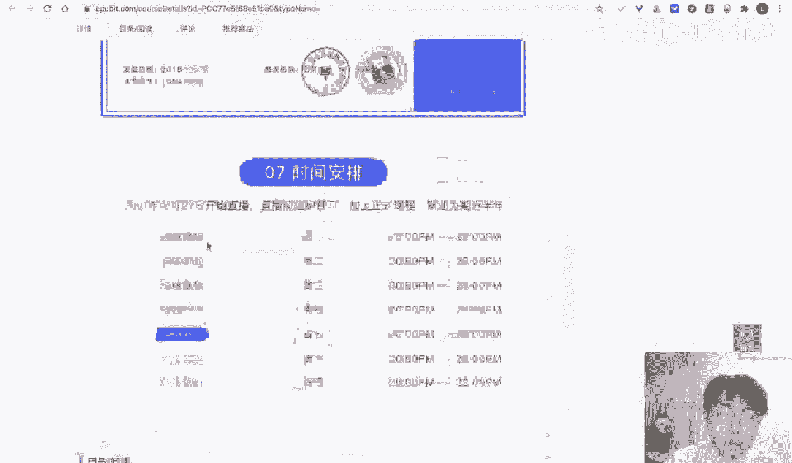
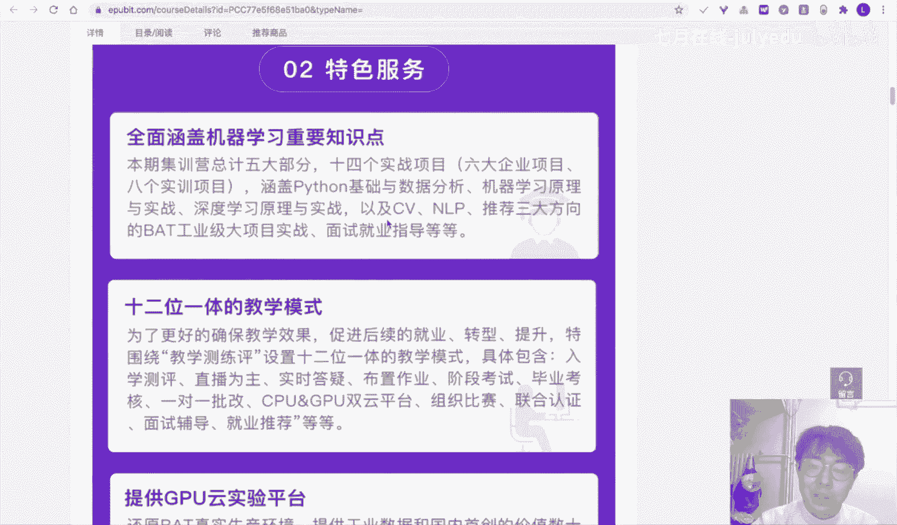

# 人工智能—机器学习公开课（七月在线出品） - P25：【公开课】数据挖掘与机器学习基础 - 七月在线-julyedu - BV1W5411n7fg

可以是吧？好，那么我们稍等一下啊，稍等一下我们。在8点钟我们就准时开始我们的一个直播的内容。对。那么各位同学之前有过这个积极学习和深度学习相关的一个经验吗？也可以在我们的一个评论区告诉我。对。

医学生完全没有啊，现在嗯现在其实医学的其实也有做数据科学相关的。我分享一个经历啊，就是我在嗯20119年的时候参加了一场呃，就是一个就是也是嗯中国某一个医学会吧所组组组织的一个研讨会。

然后他们线下有一个workshop。workshop呢嗯要我们去挖掘，就是说利用斯坦福的一个医学院的一个数据集，然后去挖掘一些。就是说肺肺部的一些数，就是说病人肺部的一些数据。

然后当时我就跟就是我我是完全是没有医学背景的。当时就跟现场的一个医生嗯也是一个主治医师，然后现场就他出他说想法，我们就就我写代码，就现场做嗯感觉其实收获蛮大的。

但就是说其实那嗯医医学其实也是如果你想发论文的话，或者说想做科学研究的话，其实嗯python还是非常建议学的。因为。现在很多的一些论文里面，他所绘制的一些图啊。一些处理的一些方法，以及这个建模方法。

其实python都是比较适合的。现在有很多一些相关的一些论文，都是啊就是说用一些机器学习的方，用一些机器学习的算法来进行建模的对，其实这个肯定是对你的一个后续的一个发展肯定是有帮助的对。

当然这个交叉的就是两者交叉的一个就是呃非常非常好啊，这种复合型人才。对。当时呃当时我们我去去学，就是说参加活动的时候，那医师就是那主治医生就说，现在就是说嗯很多的学生他学有自己的专业。

就是他学到这个什么地质啊、物理啊、数学啊，他又想就是说做一个实践。因为现在。你假如说去写一篇论文，我不管是写什么论文，都是要画图画表嘛。但是啊你如果不写代码的话，其实现在你不会写代码的话。

其实你现在很难做出相关的一些工作。对。就想学这个，你可以学一下python，就基本上再学一下基础这些。pennda啊基本上的功能其实是能够能够就是说呃就是说相当于是呃能够掌握的对。

数学专业和这个相关嘛啊，数学其实是呃有一定的一个关系的，数学是有一定的关系的。对。数学是有一定的关系的，因为很多的一些。数据挖掘的算法，其实它内在都是一些具体的一些。嗯，不管是由数学公式啊以及。

有我们的一个就是内在的一个基层原理，其实跟数学肯定相相关的。但是呃就是说他可能更加关注于如何进行实践。对，嗯，我们待会儿呢也会给大家讲一讲这些实践的一个过程。你听了之后。

你就可以知道就是它跟数学有什么具体的一些区别。嗯，有同学说他现在在用R都是别人写好的包，自己不会写分析的代码。嗯，说实话吧。嗯，R呢它跟python其实是比较类似的。呃，我我个人我之前也学过R。

然后嗯我感觉R是比较偏向于数，就是说数学专业的。而是比较偏向于数学的。那么就是他不太适合这种是呃，就是他不太适合这种。只是只能适合这种基础的技忆学习。那深度学习呢它就不够。

然后python呢可能就更加多面一些，它可能是能够用在软件开发。然后也可以用在这种数据科学的里域。对，其实它的一个你就是说它的生态可能会更大一些。然后R呢，它比较适合单击，或者说我一个实验室。

就是说几个人协作用R比较好，但是大规模的情况下，R它没有。就是说如果是几十个人，上百个人，可能R语言就不太适合。做啊用R原，它的性能肯定会差一。对。然后如果想要做自己写一些数据分析的话。

其实R和pyython都行。R和pyython其实都行，就是说基本上都是比较简单的都比较简单。对。好，呃，各位同学大家晚上好，我是咱家刘老师。

然后我们今天呢是我们的一步社区和企业在线联合举办的两天入门数据挖掘和记忆学习的第一天。然后呢，我们在这两天的一个学习的过程中呢，希望我们是能够给大家带来一些就是说新的知识。

也希望我们在这个学习的过程中呢，以及我们的学习的内容，就是说教给大家一些新的一些技能。那么我们今天的一个直播呢，就是分主要是讲我们第一天的一个课程内容。我们首先呢来看一看我们两天这个课程到底在讲什么。

以及我们大家能够学到什么。我们这两天的一个课程呢整体而言是偏向于小白的，或者说是入门的同学。嗯，我们这两节课呢基本上是包含了pandas的一个基础，机器学习的一个基础以及机器学习的案例的一个基础的讲解。

就是说如果你之前没有学习过嗯数据挖掘，没有学习过机器学习，也不用担心，因为我们尽可能的用一些简单的案例给你讲清楚。第第二个特点呢就是我们这个课程呢整体是比较完备的内容。我们会给大家讲一些具体的一些算法。

也会讲一讲它的一个具体的入门的一些知识点。第三个呢就是我们在每每节课的一个时间的过程中呢，我们会给大家讲一讲这个具体的一些案例，也会有代码的一个演示的环节。就是我们从头运行这个代码。

然后也有python的这个相关的一个代码的演示啊。如果各位同学有什么问题呢，也可以直接提出来。就是我们两天的一个课程的一个整体的一个介绍。然后呢，在我们的一个第一天呢。

我们主要是给大家讲解一下我们这些知识点。那首先呢我们会讲讲如何使用工具pandas来完成一个数据集的一个处理。然后呢，我们会给大家介绍一下我们的数据挖掘和机器学习的整体的一个流程。然后呢。

我们也会给各位同学介绍一下常见的机器学习模型。然后我们有一个具体的一个时间的案例。嗯，这个我们在第一天的一个主要的内容呢就是如何使用这个penas读取我们的数据，并处理我们的结构化的数据。

这是第一个要点。嗯，paas呢我们待会儿会给大家讲啊，其实也是在python环境下非常非常。就是说建议大家掌握的优个库。嗯，第二个要点呢就是我们的一个数据挖掘和机器学习的整体的流程和步骤。

也就是当你遇到了一个问题之后，我们如何去一步一步解决它。第三个呢就是我们是如何去选择机器学习的模型。对，这个可能会更加难一点啊。那么这三个内容是，我想让大家就是希望大家在听完我们第一节第一天的课程之后。

能够掌握的。那么这个第一天的课程要点在于你能够知道如何处理数据选择模型并进行建模。第二天呢我们会更加深入一点，我们会讲解特征的编码方法，数据的预处理方法，以及集成学习以及数模型。

然后在第二天的课程内容呢，我们会主要会讲解我们的类别特征和数值特征的具体编码方法，以及我们的输出以及输入如何进行一个预处理，以及我们的数模型和集成学习的关系。

在第二天的一个课程要点是希望各位同学能够知道我们如何对数据集进行处理，然后我们才能获得一个比较好的一个精度。好，这是我们两天的课程的一个整体的介绍啊，各位同学可以呃就是说看一看。

或者说截图看一看我们的具体的一个课程的一个特点以及他的一个知识点的安排。那么我们接下来呢就开始我们第一天的一个课程内容。第一天的课程内容。第一天呢我们主要会讲解什么呢？

就是会讲解开始从pinnda讲起好，开始从pinnda讲起。呃，首先呢我们很多同学他其实之前就呃学过一些编程语言，对吧？学过pyython，或者说谢大家或者说R。甚至你可能学过这个go啊等等的，或者C。

其实我们现实生活中呢，其实有很多的一些编程语言。嗯，对吧？嗯，我之前在本科的一个学习的时候，也最开始也是从C开始学起，对吧？嗯，但是呢可能在学的后后续呢可能接触的语言越来越多。呃。

我也会有个人的一个就是说积累，以及在遇到一个问题的时候，我也会去嗯思考我到底用哪一种语言去解决一个问题。在我们现在呢这个数据挖掘和数据科学的一个领域。或者说我们现在假如说你想要使用机极学习的模型。

深度学习的模型，想要做数据的可视化，数据可视化。那么python可能是比较适合你的一个语言编程语言。也就是如果你遇到一个场景是需要做一个这种数据挖掘，或者说数据分析以及建模的这个场景下面。

那么python可能是一个比较适合的语言。那么在python环境下呢，其实我们在课前也给大家举了一个例子。python呢它跟R相比，它的主要的区别在什么呢？python一方面它是一个完备的编程语言。

它是完备的编程语言，它有支持这种函数式编程，也是支持面向对象的。其次呢，python它有非常强大的一些第三方的库。这是什么意思呢？呃，我们在学习这个呃就是说C议元的时候，其实我们在学习CE员的时候。

我们有一些作业就是说读写文件，读文件，对吧？读取文件。那么这个读取文件其实在C语言里面，我们其实是需要很写手写很多的代码，很多行的代码来完整。但是呢在pyython里面。我们假如说用第三方的库。

那么假如说我们用padas，那么可能就需要只需要一行代码就可以完成。因为它的一些其他的一些库文，其他的一些代码都在我们panda里面帮我们写好了。

所以说呢python它它的一个强大的处是在于它有很多的一些第三方的库，它的生态是比较好的啊。第三方的一个库的一个生态是非常好的。你肯定是能够找到完成就是你所需要的库。

那么在我们学习这个数据挖掘和继器学习，以及学习我们的一个嗯数据可视化的一个基础是掌握pindas在pyython环境下，pinnda你是必须要掌握的。panda嗯它。

和和R语言的这个data table其实是非常相似的啊。那么pennda呢它是在python环境下的一个数据分析和数据统计的一个库。它提供了我们快速对数据集进行处理的一个工具。

而且呢也提供了快速的对我们的数据集进行处理的一些方法。呃，我们这个地方呢就是pandaas，它非常适合用来处理结构化的数据。结构化数据结构化结构化数据就是我们的一个数据集长的类似于这种形式。他是由行。

这是行。和和我们的列。所组成的二维的表格，也就是行和列啊，就是说我们这个其实跟我们的一个一excel这种单元格表格其实是一模一样的。但是呢pinas其实它在操作的时候呢，我们是用代码进行操作的。

在pas里面呢，我们有行有列，对吧？那么我们行和列的交叉之处，就是我们的一个取值。在paus里面呢，它的一个可以。帮我们处理就是说几百万行仅一行，就是说很大的表格我们都可以处理。

它比这个excel的一个就是说性能以及它的一些所完成的功能都强大很多。那么pinnda呢也是我们现在排thon单机数据挖掘必备的库，它可以支持我们就是说快速的加载数据，快速的索引数据。

以及快速的对我们的数据集做一个转换。嗯，这个都是pinnda它所具备的功能。那么在pandas里面呢，其实它可以帮我们完成很多的功能啊。首先的呢我们需要知道一些具体的一些这种英文单词。

我们的calon names就是说我们的列明index就是我们的索引，对吧？index索引，然后呢，我们的一个行列的交叉，就是我们的具体的取值，对吧？那么在这个地方。

我们还有一些missing value，就是我们这个地方的NAN。N就是它是一个missing value，或者说是一个缺失值。那么我们有原始的数据集里面有这种字符串类型的，有缺失值的，有数值类型的。

还有我们的这种可能还有一些其他类型的对吧？所以说呢嗯如果你之后遇到一个场景，假如说想要对这种表格类型的数据做一个处理，那么penus可能是你第一的选择。那么我们就继续。呃。

那么我们接下来呢就看一看我们这个就是说使用paus如何进行使用啊。对，然后这个地方呢我们就直接给大家稍微看一些代码，然后给大家演示一下啊。因为呃我觉得这个讲起来可能概念可能会比较空虚啊。

但是呢我们如果看这个代码会更加直观一点。呃，这个地方呢我们假设想要对我们的数据集做一个处理，就是说我们现在拿到一个数据集，这个数据集呢长得这样的。我们有。一列、两列、三列、四列、五列、六列。然后呢。

我们这是我们的列名，这是我们的列名。然后呢，我们在数据集里面，这是一行每每一列它是用逗号进行分隔的，用逗号进行分隔的。现在呢我需要各位同学完成的一个任务是什么呢？我现在需要你对我们的这个数据集的。

进行读取。也就是说我们的H这一列就是32、22、32、27。好，现在需要你这样完成一个就是给另一个TXC的情况下，需要你完成一个数据集的读取，把它读取成表格的形式。好，那么拿到这样一个问题之后呢。

可能你如果都知道pada。的情况下你怎么怎么做呢？可能我们就要手写一个这种处理的一个过程。怎么手写呢？我们就需要读取我们的文件，对吧？读取我们的文件，然后呢对我们的文件的内容进行一个处理。

比如说对于我们这文件内容，我们把它按照我们的逗号进行一个分隔。把它进行逗号进行分隔，对吧？然后我们这个地方我们可以看一看啊，我们定义其实这个地方我们是定义了一个class啊。

在这个class里面呢传入我们的文件名，以它就可以完成个处理。这个地方我们可以就是说。手动实现一些函数。比如说这个地方的，get item函数，就是用我们的一个中括号去索引我们的一个数据。

我们的head函数就是看我们的所数据的前十行。对吧这个地方其实是我们手写的一个对于数据集的一个处理的一个class。那么嗯有同学也会看到。

就是说其实这个class已经是能够完成基础的一个结构化的数据集的读取。但是呢它并不是我们想要的。因为我假如说想要再新增加一个功能，那么我们就需要重新再实现这个。就是说具体的实现，对吧？

那么这个其实是非常繁琐的。那么有没有其他的一些替代品呢？那么就是padaspadas呢其实就是在python环境下的一个第三方库。我们在安装好pandas之后呢，import pendas SPD。

然后pandas呢，它就可以很快速的从我们的一个数据集里面创建一个序列。这个序列就是我们的一列。一列。当然pins它还有一个优点，就是说不仅仅是可以创建一个序列，它可以创建以我们字符串或者说日期一个序。

就是说它这个周期的一个。比如说这个地方我们是传入20130101，就是说想要得到以2013年1月1号开始的6天的一个时间。这就是我们就是说使用padas的一个函数，就可以很快速的完成。当然。

如果我们想要创建一个表格，就更加简单了。在这个地方，我们是可以从我们的一个dict，就是python的一个dict啊，python的一个dict来创建我们的一个表格。在这个地方。

我们在这个dict里面呢，我们传入三列三列，然后每列我们的取值，对吧？AAAA列的取值是4567。对这是我们传入的一个dic，传入到我们的data frame里面。

然后它就返回的是一个data frame的一个对象。这是我们创建的一个表格啊，这个是我们创建的表格。然后呢，左边的这个是我们的index，我们的最上面的一行就是说最上面的一行呢是我们列明。

最上面的一行是我们列名。然后呢，我们这个地方我们创建了这个dataframe之后呢。我们还可以很方便对它进行赋值。比如说我这个地方想要选择我们的1个AA列大于5的行，把它的1个BBBB列复制为负一。

怎么赋值呢？我们的原始的一个。这个地方就是选择了某一列。某一列，然后呢，这个地方其实它是做了一个逻辑的一个计算。逻辑计算就是说整体的这一列是不是大于等于5，对吧？这个四肯定没有大于等于5，它是fse。

这个地方返回为t true true，对吧？也就是说它选中了我们的一个第二行，第三行，第四行。对吧然后呢把它对应的BBB列复制为负一对吧？也就是说这三行的一个这三个取值复制为-一。对吧这个就很明显的。

而且是很方便的，就可以做一个复值。那么如果各位同学之前学过这个矩阵的呢，就这个地方就很简单。因为这个地方其实本质就是。行索引列索引对吧？其实就是矩阵的一个索引。当然这个地方我们在进行嗯具体的赋值的时候。

我们也可以传入多列，传入多列。比如说这个地方的三行，它的B于B列以及CCCC列整体的一个取值做一个复值。好的，那么pas呢，其实这里面的一些函数啊，我感觉是需要各位同学去做一个练习的。

而且呢这个如果你掌握的越好啊，可能对你后续的一个呃就是说数据的处理啊，以及这个相关的一些画图的一些操作啊，就会更加的方便。嗯，我们就是先往后翻啊。在pens里面呢。

其实它可以很方便的完成一些统计的一个操作啊。比如。呃，我们这个地方我们定义了一个data frame。这个data frame呢就是我们的animal age嗯vis priority这4例。

那么在这四列里面呢，假如说我们这个地方很就是说对我们的表格，其实有些时候呢就需要做一个分组的一个聚合。比如说我们统计一下我们的animal列下面哦animal列分组下面的A的一个平均值。这是什么意思呢？

也就是说我们把这个animal把它分成不同的组，对吧？cat分为cat取值为cat的一行，划分为一组，取值为snack的一行划分为几，取值为dog地方啊划分为一组，然后取把它划分成不同的组之后。

然后再去统计它的一个A的一个平均值。这个地方其实你可以看一下这个它就是group by，就是做一个分组。这个地方我们把分组之后的一个行给它打印出来。把它分成catch这一组的，就是我们这些四行。

相当于四行，对吧？它的animal都是取值为我们的catch，然后这是我们的dog，这是我们sack，然后呢，我们就是把它分完组之后，然后统计一下它A级的一个命，对吧？

比如说这个地方我们的一个具体的一个操作呢，你都可以按照我们这个地方来算一算啊，比如说这个地方我们的snack这一这一分组，它的A级，这个地方应该是0。5加上4。5除以2，对吧？就这2。5。

那么这样一个分组聚合能够做什么呢？它其实能够做很多的一些操作。嗯，比如我们拿到了一个学生或者说这个班级的一个信息成绩表。然后呢，我们有班级信息，以及有不同班级的学生的信息。

然后我们通过这个group操作，就可以统计每个班级的一个某个列的一个平均值，或者是说每个班级的一个。的一个最大值对吧？我们每个班级的一个语文分的一个平均分。

语文分的一个最大分以及语文分的最小分都可以通过类似的一个操作来完成。好，那么在pindas里面呢，其实它有很多的一些呃统计啊以及相关的一些操作啊。嗯，这个地方呢我们就不做过多的介绍。

因为这个可能就是呃大家需要下去掌握的。因为这是非常基础的。我们只是给大家讲一个它的一个基础的操作，然后呢如果你学完pindas之后呢，你也可以去看一看。

在pyython下面呢有个叫做mat plotlib的这个库，其实也是需要各位掌握的啊。就是我们借助于m plot能够绘制出很漂亮的一些图形，或者说这种曲线。

这些曲线呢其实不管我们在工作或者说这种上学的过程中啊，写论文的过程中，都是可以很好的来进行完成的。比如说这个地方我们需要绘制一个s的一个函数的一个曲线，然后把它对应的一个取值，这个地方绘制成圆圈，对吧？

或者说我们绘制成散点图，或者说绘制成饼图，然后画成不同的颜色等等。好，这些呢都是在python的一个就是说这种呃编程环境啊，以及相关的库啊都是可以进行实现的。好的，嗯。

这个代码呢大家也可以就是说在加到我们社群之后呢，也可以领取到啊，你不用担心好。刚才呢就是给了各位同学看了一下我们具体的一个penndas呢能够做什么。那么我们在做一个具体的一个数据挖掘的时候呢。

其实第一步是需要读取我们的数据，并使用panda这些软件来完成我们的一个具体的一个数据集的一个分析和它的一个统计。那么我们第二步呢就是需要用一些具体的一些方法去挖掘出我们数据集。

以及我们的一个具体的一个数据中是不是存在某种具体的一个信息。嗯，这个地方呢就给大家介绍一下这个机器学习和我们的一个呃深就是说这种数据挖掘。我们来看一看。

我们的一个具体的一个具体的一个数据挖掘到底的概念是什么呢？嗯，数据挖掘它其实是使用我们的机忆学习和统计以及数据库的一个方法来完成对数据集中挖掘模式和知识的这个过程。呃，数据挖掘呢。

其实它的一个英文名字叫datamin。它其实有点像这种旷工的一个意思，对吧？就是挖掘我们的数据集的一个la似的含义。呃，数据挖掘呢它并不是它并没有指定任意一种机器解决算法。

它指的是具体我们这个整个流程是什么？那么怎么是机器学习呢？机器学习它是更加具体的一个就是说一个概念，它是人工智能的一个分支。然后它是本质上就是说遇到一个问题，我们如何去进行建模，然后解决这个问题。

所以说呢你可以看到这个数据挖掘，它是使用机器学习来完成某个任务的对吧？所以说呢数据挖掘它更数据挖掘它更加关注于这整个流程。机器学习呢更加关注于某个模型。好，这一点呢大家也可以记一下，也是非常非常重要的。

然后呢，我们也可以看从右边这个图可以看出来，就是我们现在的一个数据挖掘机器学习以及我们的人工智能，它各自的一个这个就是说知识点的一个交叉啊，都是现在的一个就是说这种嗯前沿的。

或者说这种数据科学的一个概念呢，都是非常非常联系，非常非常紧密的啊。不管是这种数据库啊，数据挖掘，还是我们的一个统计学。那么数据挖掘它到底能够做什么呢？这个可能有很多同学他之前是第一次接触到这个。

我们就给大家介绍一下数据挖掘到底能够做什么。数据挖掘呢其实它涉及到的一些步骤呢其实非常多。它涉及到数据的一个读取，数据的一个预处理，数据的一个模型的一个训练，以及数据模型的推断。

以及我们的一个具体的一些可视化的操作。然后呢，数据挖掘具体的一些任务呢可以分为以下几类。比如我们的异常检测、关联分析、剧类分类和回归。呃，这个呢可能就比较。就是说讲的比较细了。

它就是一个具体的一个领域问题领域问题。比如我们现在在百度上面，假如你想要学习。这种异常检测的算法对吧？那那么你就可以直接搜异常检测，那么就可以找到很多的机器学习的算法。然后我们想要完成一个分类的一任务。

对吧？然后你搜一个分类的一个机器学习的模型，你可以找到在这个地方呢，我们。列举了这么多任务，是希希望各位同学知道一个点，就在于我们这不同的任务它所完成的一个。就是说结果是不一样的。呃。

我们现在的一个机器学习模型，其实本质仍然是一个基于这种函数式的这种表达。或者说把可以把它抽象为这种函数式的表达。也就是我们输入一个有的输入的之后，我们通过一个建模得到一个具体的一个输出。

这个呢可能不是一个函数，我们可能是一个模型，或者说是一个流水线，也就是一套操作。它通过输入一个数据，然后得到我们的最终的输出。那么我们的一个输入这个X我们。你把它叫做一个input，对吧？我们的Y呢。

我们把它叫做一个output。那么这个地方的湿度和输出不同的情况下，我们得到的一个。就是说如果我们输入和输出不同，那么我们这个问题它可能就不一样了，对吧？那么我们这个地方异常检测啊。

关联分析啊、聚类啊、分类啊回归啊，它各自完成的一个功能是不一样的。嗯，比较典型的就是它的一个Y，我们最终的一个输出结果是不一样。呃，举举个例子啊，就是聚类聚类到底在做什么呢？

剧类就是说我们将这些相似的一个模型，相似的样本，我们需要把它划分成一类一类的。我举一个非常简单的一个例子。假如我们现在有两个维度啊，每个样本有两个维度，X1X2。然后呢，我们可以把它画成一个三点图。

换成散点图啊，我们把所有的样本把它进行一个可视化。好，做完可视可视化之后呢，其实我们很清楚的可以看到，在我们的数据集里面，其实。隐隐约约的有两个相当于是这个数据集呢有两个相当于是两个这种两团数据。

或者说两处数据所组成，对吧？剧类呢就是说我们把这个距离相近的一些样本把它据为一类。对吧相当于是我们把数据集的一个内在的一个分布的规律能够找出来。对吧，这个就是聚类。那么剧类呢其实它是没有用到标签的。

那么我们的如果想要用标签来进行建模的，就是我们的一个分类，或者说我们的回归。分类呢就是我们的一个标签呢，它是我们的类别类型的。类别类型的，也就是。如果我们想要就是说根据一个用户的一个。

或者说根据一个病人他的1个肺部的这种CT图，来去判断一下他是不是有疾病，对吧？那么这个地方我们的一个输入什么，我们的CT图。对吧然后输出的是什么？输出就是说它是yes or low，对吧？啊。

有没有疾病？这个地方其实就是一个二分类。因为我们这个地方有两个类别。有两个类别。好，那么我们如果是回归呢，回归就是举个例子。我么现在呢。需要对一个房屋的一个价格做一个预测。也就是说我们输入。

我们的一个具体的一个房房屋的一个基础信息。对吧我们输出的是一个priice。f呢这个地方。回归呢它的输出的结果就是我们的一个这个呃数值，它不是一个具体的一个类别的，它是一个数值。所以说分类和回归呢。

你可以从我们的一个标签的一个角度去看一看，那到底是一个我们的一个类别类型的，还是我们的一个数字类型。好，我们继续。那么我们在做一个具体一个数据挖掘的时候，其实本质需要做什么呢？

我们需要做的一个操作就是我们。将我们的一个具体的一个。这个任务不断的进行一个拆解，然后分期也能做到分期是什么。我们用理解分期是什么？对，蚂蚁花呗的分期吗？

然后呢我们这个地方的一个具体的一个嗯数据挖掘和机器学习的在学习的时候呢，其实也要学习到的它具体的一个建模的步骤。这个步骤呢就是我们如何一步一步的去完成我们的一个就拿到一个任务之后。

拿到怎么一步一步来进行建模。首先呢我们可能需要对我们的数据集做一个预处理。然后呢对我们的一个特征做一个编码，然后做一个特征工程，然后完成我们的一个模型的训练验证，然后使用我们的常见的机器模型进行建模。

然后最终对我们的一个模型的预测结果进行评价。或者说对我们的一个模型的一个结果进行一个误差的一个分析。好，嗯，这是我们的一个就是呃这就是说具体的一个建模的步骤啊。那么我们在学习的时候，不管你是做科研。

或者说做一个具体的建模，可能都是按照这个步骤来做的对吧？写论文本来就是对吧？我们有一个实验的数据，然后通过实验的数据做一个建模，然后得到一个结果。结果我们需要对它进行分析，以及对它进行评价，对吧。

那么我们接下来呢，我们就看一看在机器学习里面有到底有哪些具体的一些机器学习的模型啊，我们来看一看。嗯，首先呢我们来看一看这个线性模型。信性模型呢其实它是在我们的这个机忆学习里面是最简单的一类。

信息模型呢在我们就是说在我们的一个初中的里面，就初中的一个时候就学到了，对吧？我们对我们的一个。有一条这种取这种直线，对吧？这个直线呢由AX加B或者说KX加B，对吧？来组成。就是说有两个具体的一个参数。

那么这个线性模型，它其实本质它在做什么呢？就是说我们使用一个线性的一个关系去理合我们的一个输入和输出，我们在这个初中的一个学的时候呢，对吧？这个地方中AX加B或者KX加比其实都一样啊，或者是WX加比。

这个只是一个代号。我们在初中或者说我们的一个高中学习的时候，其实我们只有X和Y就是一个取值。就是一个曲值，对吧？那么在我们具体的建模的时候，其实。有可能不是这样的。有可能我们的一个X，它是一个向量。

什么意思呢？我们这个地方的X呢是一个。二维的一个输入。二位的一个输入。那么我们的Y呢仍然是一个一维的输出。意味的一个输出。这个地方呢我们想举个例子啊，举个例子就是我们根据我们的一个。嗯。

他这个房屋的一个面积。和楼层。去预测它的价格。对吧或者说这个租房的价格对吧？房问的面积和楼层去预预测它对租房的价格。那么在这个地方，其实我们的一个AX。它是由两个维度所组成的两个维度所组成的。

所以说这个地方我们在进行建模的时候，就不不能是单纯的一个就是说一个面积乘以A再上上B，对吧？等于我们的价格，这样呢就会丢失掉很多信息。我们这个地方的一个输入的一个X，就是一个二维的，是一个二维的。

所以我们在进行一个具体的一个礼合的过程中呢，我们的X可能是一个多维的。X可能是一个多维的一个输入。这个地方我们举的一个非常简单的例子，是一个二维的，它可能是2100甚至1万，这都有可能。

那么我们的这个具体的一个线性模型呢，就是说我们使用这种线性的关系去理和我们最终的一个输出。比如说这个地方我们得到的这个价格和面积和楼层的关系是什么。我们的这个价格。等于我们的面积。

乘以10加上我们的一个楼层。乘以5，再加上10，这是我们最终的一个。相相当于是一个线性回归。当然我们这个地方其实是举了一个非常简单的一个例子啊，它是一个。相当于是输入的一个X是两个维度的，是两个维度的。

这个地方我们其实本质是在做一个回归的问题。因为我们的价格其实它是一个数值类型的，是一个数值类型的。它其实是用一个线性的一个关系去理合我们的这个面积、楼层和我们的价格。一个同学说到了逻辑逻逻辑回归，对吧？

逻辑回归其实也是我们一种线性模型。嗯，这个这个地方呢就是说我们在进行一个礼合的时候呢，我们其实本质。这个如果我们的一个X是就是说多维的时候，我们这个地方的一个A或者我们W也是多维的对吧？

这个地方为了它让它进行一个进行一个向量的相沉，我们让它进行转制。我们这个地方其实本质哎X是多维的。W是多维的，然后呢，这个地方我们可以让它做一个回归的任务。对吧当然也可以让他做一个分分类的任务。

这个地方呢如果我们想要让他做一个分类的任务呢，我们常见的一个做法就是我们对它的一个。进行。分类的任务的时候呢，我们对它的一个概率进行一个回归，对吧？

这个地方我们就可能涉及到我们的将我们的一个具体的一个礼盒的函数呢，把它加入我们的一个这种就是呃广义线性模型的这种转化。然后可以得到我们逻辑回归的公式。对，如果你感兴趣的呢。

也可以在我们的这个相关的教材里面找到。第二类模型呢就是我们的BS模型。BS模型呢，其实在我们的一个嗯这个呃高中数学，或者说我们大学数学里面有讲到。

就是我们通过这个先验概率和后验概率来计合计算得到我们的一个这种事件的一个联合的一个分布，然后再去求解我们的一个具体的一个概率值。这个地方呢就是会有一个嗯就是说我们一些相关的一些计算啊。

我们对贝列斯呢其实在进行一个计算的时候，其实它本质上就是利用我们的一个类别的就是说这种先应的概率，以及我们的条件的概率来进行一个求解，然后进行转化。这个转化的过程，其实就是这种条件概率公式啊。

那么这个贝模型呢，其实它本质在做什么呢？它就是在做一个计算得到一个联合的一个概率的分布，然后再去求解得到我们的一个某个条件发生的情况下，我们对应的一个就是说概率值是多少。

这个地方我们就是以这个X作为我们的输入。C呢作为我们的一个类别的输出，对吧？我们给定一个。X输入的情况下，我们的一个对应的一个类别输出是多少，对吧？

所以说这个地方我们也是通可以通过这种BS的这种建模来得到我们的一个具体的一个啊分类的任务的。好，这个呢BS模型呢其实也在我们的一些机济学的教材里面也有讲到。第三类呢就是我们的这个决策树模型。树模型。

树模型呢其实呃这个可能会更加直观一点。我们的一个人的一个决策的过程呢，其实就是嗯基于这个就是这个决策的一个过程啊，就是说一个逻辑，就是呃我们看一看这个假设我们想要做一个决策。

这个决策呢就是嗯我们判断一下，明天要不要去呃出去玩，对吧？想想不想出去玩，对吧？那么我们就做这样一个决策，明天我们有没有工作要做，对吧？如果有工作要做，我们就待在家里面，如果没有工作要做。

那么我们就看一看我们的一个外面的天气，我们天气如果是比较晴朗，对吧？那么我们可以去海边，如果是下雨，对吧？如果是下雨的情况下，那么我们看一看朋友忙不忙，对吧？如果朋友很忙，那么我们就待在家。

如果朋友不忙，我们就去一起去看电影，对吧？那么这个地方其实它这个地方。其实是一个树是一个树，每个树呢我们有这个叶子节点，对吧？y子节点就是它没有再进行划分的这个节点，也有我们的非叶子节点。

或者说我们的分裂节点。那么我们的一个具体的决策过程呢，人人的一个逻辑的决策其实跟我们的这个呃数目性的一个决策过程，其实本质是一样的。在我们的一个分裂节点的过程中呢，我们需要有一个逻辑进行判断。

有一个条件做一个判断啊。如果满足我们的条件执行某个分支，如果不满足我们的条件，执行另一个分支。然后呢，我们在进行不断进行分裂的时候，到我们的一个叶子节点，它不可再分的时候。

这个不可再分的时候就是我们最终的一个输出结果。也就是说，如果我们满足某条路径，对吧？满足我们的明天有工明明天没有工作，但是呢明天天气很好，对吧？它按照某种路径就可以得到我们最终的一个输出结果。

这个呢就是我们的决策术，它的一个具体的原理。它本质呢就是对我们的一个原始的一个属性空间进行一个分裂，然后完成一个决策的过程。嗯。

那么你也可以去在我们的积极学习的一些教材和相关的一些课程里面找到这个决策数的一个基础。对，那么我们前面所讲的讲解到的这个呃这个我们的一个线性模型啊，BS模型啊，以及我们的一个决策术模型啊。

其实在我们的日常生活中啊，都是呃非常非常常见的。而且不管你是不是学习这个机忆学习，或者说是不是学习计算机的同学掌握了这些机忆学习的模型啊，其实对你的一个工作啊，其实都是非常非常有帮助的。嗯。

第四类呢就是我们的SVM我们SVM呢其实它可能会更加嗯就是说难以理解一点。它其实本质呢在我们的一个角色的过程中呢，我们不仅仅是想要对我们的一个样本把它做一个。

分类我们可能是想要找到一个最大间隔的一个角色平面。嗯，假如说我们想要对我们的这两类点做一个分类，那么我们怎么分呢？我们可能是用一条直线把它进行分隔开。但是呢这条直线其实我们可以画很多条。

对吧我们可以这样画我们可以这样画，其实都是能够满足我们的把这两类点把它分开的。但是有没有一条完美的直线，或者说相当于是一条比较符合我们逻辑的直线呢？这个比较符合逻辑的直线，就是相当于是尽可能的。

位于我们的一个决策，相当于是它离我们的两类样本都很远，对吧？相当于是在这个决策平面的正中间，角策的这个最中间相当于是最公平的一种情况。那么这个SVM呢，就是说我们在找这个决策平面的时候。

或者是找这条直线的时候，能不能保证它离我们的两类样本。都很远。那么这个地方其实就是有一个先验知识。如果我们这条直线现在离两类样本都很远，那么在未来在我们的测试级的一个具体的一个。嗯，卡了吗？好。

应该没卡吧没卡吧。对。这个地方呢就是说如果我们现在的这条线呢能够将我们的这两类样本能够区分的很好，而且呢在这个决策的最正中间，那么在未来在我们的一个测试级的一个具体的一个分类的过程中呢。

它也是能够最公平的。这个就是SVM的一个具体的一个思路啊，它是能够找到我们的一个决策平面，能够找到这个具体的一个直线，能够和我们的这两类样本，将就是说分相当于是能够找到了一个最大的一个决策的间隔。好。

那么各位同学也可以在我们的一个GP的教材里面，找到SVM相关的一些原理。好，最后一类呢就是我们深度学习的模型，也就是我们现在比较火热的对吧？火热的这种深度学习的模型。

深度学习的模型呢和我们前面所讲解的这些模型有什么区别呢？深度学习的模型，其实它本质是利用这种神经元来代表我们的计算的流程。然后呢，通过这种神经元的一个边的连接来完成具体的一个计算的过程。呃。

这个呢可能和我们的这个神经网络或者深度学习啊，它跟我们人的大脑这种其实是非常相似的。我们人的大脑呢就是有这种相当于是由这个。细胞与细胞之间有一个相互的连接，对吧？

这个细胞的一个具体的信号传输给下一个细胞，或者说突触啊，那么经经过这个细这个突触呢，或者说这个细胞在。在接收到前面的一个信号之后，完成一个处理，然后得到它的一个输出。嗯。

那么这个深度学习其实整体的一个具体的一个这个流程啊，其实跟这个操作，或者说我们的人的这个神经元的一个这种细胞的一个就是说这种这种连接或者计算的操作，其实是非常非常相似啊。

也就是说我们大脑的这个呃内部的一个结构，其实是有参考的。那么我们的深度学习呢就是由多层。所构成的一个神经网络，它是一般情况下是由我们的输入层、隐含层和我们的输入层由着不同的层所构成的。

那么这个地方呢就是我们其实给大家介绍了一些具体的一些机器学习的模型。那么我们在学习这个数据挖解和机器学习的时候，其实本质就在学习我们每类机器学习的算法，它的原理以及它的一些应用案例以及它的一个优缺点。

对，这个就是我们这个如果你想要深入学习数据挖掘和机器学习，那么你就可以从这个角度去学习。比如说线性模型它的原理是什么？线性模型它能够做什么，它适合做什么？它相比于我们的SVM它的优点在于什么？

它的缺点是什么？对，都可以从这个角度去进行学习。好，那么我们接下来呢就看一看我们如何使用这些具体的一些机器学习的算法来解决我们具体的一个案例啊。这个地方。

我们就读嗯就是说仍然是结合padas来完成我们的一个建模。结合我们的一个pas完成我们的建模。我们首先呢读取我们的一个嗯数据集。数据集呢我们是用padas来完成读取的啊。如果各位同学呃在本地没有。

就是说没有配配置好这个pyython环境的啊，也可以自己尝试在呃本地的一个机器呢安装一下这个python的一个环境。然后把这个pandas也安装好。然后我们假如说想要对我们的数据集做一个处理呢，其实。

嗯，非常建议对它进行一个可视化的一个相关的一个处理啊。嗯这个可视化的相关的处理呢，这个地方其实这个案例呢其实是做一个嗯泰坦尼克号的一个呃幸存者，啊，就是说乘客幸存的一个预测。

就是说我们这个就是泰坦尼克号原始就是泰坦尼克这个游轮，它有这个乘客的一些信息。然后它是不是幸存的一个具体的一个标签，对吧？然后呢，我们就基于这个具体的一个信息呢预测一下它具体的一个是不是幸存下来。

那么我们如果拿到这个数据集之后，我们可以做什么呢？我们可以做很多事情。嗯，有同学说这个note book可以分享吗？你可以待会儿加一下我们的一个课程群，我们会在我们的一个课程群里面。

然后嗯会给大家进行一个发放啊。对，可以加一下我们的课程群。然后呢，我们在做一个数据分析的时候，其实呃或者说在我们在做建模的时候，其实数据分析呢是非常有必要的。怎么进行数据分析呢？这个其实非常简单。呃。

我们在做一个数据分析的时候，其实本质就是在做我们的标签如何进行分布做一个统计。我们这个地方其实是呃本质是需要分析一下我们的一个标签。标签呢是这个我们的是不是幸存下来的。

也就是survivve的这个具体的一个字段。那么我们可以统计一下，在我们的性别分组的情况下，这个具体的一个幸存下来的比例。也就是说男性乘客他幸存下来的比例是多少，女性乘客他幸存下来的比例是多少，对吧？

那么我们可以绘制这样的柱状图。这个柱状图其实很简单的啊，或者说啊在英文里面叫bar plot对吧？柱状图。呃，我们在这个地方呢，就是说X轴是我们的性别，它有两个取值。

Y轴就是说这每个性别它所对应的一个概率值，就是说它是不是幸存下来的。比如这个地方我们的非秒，比如说我们的女性乘客，他幸存下来的一个比例。对吧会更大一点，对吧？75%的对吧？

那么就是说这个其实也是泰坦尼克号，它的一个具体的一个是比较偏向于人道主义的对吧？就是相当于是妇女和我们的儿童，它是优先的一个登上这种就登上这种啊就是说这种嗯救生体的。

所以说这个妇女呢或者分娩它的一个具体幸存下来的比例会更大一点。然后呢，我们可以看一看就是船舱等级pak class它所对应的一个具体的一个幸存的比例。对。好。

然后呢我们也可以看一下这个地方的age age就是我们的年龄。这个年龄就是说不同年龄阶段的乘客他所幸存相来的比例。在这个地方，我们的baby对吧baby这个。相当于是我们的小宝宝。

他所幸存下来的比例这最大是吧？Oh。那么我们在做一个具体的一个建模的时候呢，其实是首先可以对我们的数据集参考上述的这种操作啊做一个分析。做完分析之后呢，然后就可以做一个建模。

这个建模呢可能这个代码可能会很多啊，这个代码里面其实细节非常多，它可能涉及到很多的一些啊预处理以及我们的数据清洗。比如说。我们的一个乘客，其实他的名字里面其实是有这个title的。

这个title是什么意思呢？就是说这个称呼这个在呃这个英国人啊，或者说这种美国人，其实他这种国外啊，或者说这种以英语为母语的国家，他其实在这个呃乘客的一个名字里面呢，会加上这个称呼。

比如说他到底是这个呃doctor，或者说是lady，对吧？或者说是这个呃mr或者说miss，对吧？他其实这些称呼呢都是有一个固定含义的。比如他到底结婚没有，对吧？是男性还是女性，对吧？

还是这个具体的一个对应的一个称呼，这个称呼呢，其实我们可以把它抽取出来，因为这个呢其实是我们原始数据机里面所没有的，我们如果把它抽取出来之后呢，也是非常非常有意义的。好。然后呢。

当我们把它抽取完成之后呢，其实接下来就可以做一个建模了。这个地方的一个建模呢其实非常简单。嗯，在我们现在的一个继续学习的一个实践的过程中，其实只要你懂一点。代码就是说你只要懂一些python的一个基础。

然后再去做实践，其实是你不需要去花很多的一些时间去了解机器学习的这个内在的原理。因为我们现在的一些具体的一些机器学习的一些库呢，它是将我们的一个。这个具体的一些模型封装的非常好了。

比如说我们在进行建模的时候呢，我们可以很方便的使用如下的一些模型来完成我们的一个具体的一个分类。我们来待会儿也可以一一给大家看啊。

首先呢我们会将我们的原始的数据器呢把它划分成我们的训练部分和我们的验证部分。嗯，这个地方呢就是我们会以我们的验证集的一个具体的一个精度作为我们最终的评价，对吧？嗯。

就是这个可能就是不能是说你在训练集上进行训练，然后以训练机做一个评价，这个肯定不合适，对吧？我们用一些你没有见过的样本来做评价，才是最公平的。好，那么这个地方就是用一个数据拆分的一个函数。

对我们的数据集做一个拆分，然后以22%的一个数据，就为我们最终的一个验证集。然后呢，我们就来看一看我们具体的一个模型的一个使用，以及它最终的一个精度。其实这个嗯使用起来就非常简单啊。

比如我们在进行使用的时候呢，我们首先导入我们的一个高斯BS斯，这高斯贝S斯呢，其实它也是我们的普斯BS里面的一种实现。那么我们导入进来之后呢，我们就直接对它进行。首先对它进行一个实例化。

这个导入进来的是一个class，它是一个类，在pathon里面是一个类。我们首先对它进行实例化，然后调用它的一个fate对象函数，然然后完成训练，训练完成之后呢，然后完成一个predt。

然后这个predict就可以得到我们的一个测试级的一个，或者说我们验证级的一个预测的结果。然后我们将我们的预测结果和我们的一个真实的结果进行一个。评价也就是通过我们的准确率。

这种相当于是判断两者是不是相等这种准确率的计算方法。那么我们的一个高斯BS，它的最终精度是78%。好，那么我们再看一个啊，我们的逻辑回归。

这个地方逻辑回归from SK learn SK learn呢也是一个机极学习的一个库，里面有很多这些机器学习的模型。那么我们就直接借助它来完成就行了。

from SK learn点 linear model import逻辑回归。这个逻辑回归也是一个class。首先对它进行实例化，然后对它进行训练，然后对它进行预测，然后进行评分，对吧？

逻辑回归最终的精度是79%左右。好，那么在我们的机器学习里面，其实你会发现我只用这几行代码就可以完成我们的一个具体的一个训练，对吧？我们在这个里面呢，我们就是用。Fit。完成训练。

我们用我们的一个predict。完成我们的一个预测，对吧？我们在这个训练和预测的过程中，我们并没有就是说去呃就是说让你需要你知道这个具体的模型的内在原理吧，对吧？我们没没必要。那么在这个地方呢。

就是说我们现在的pyython环境下呢，有很多的一些具体的一些机器学习的库，它可以帮助我们完成这以上的操作，对吧？那么这个地方你只需要按照它的一个语法，或者说它约定速成的一个写法来完写就行了。

那么类似的我们也可以调用我们的这个SVC嗯，也就是我们的SVM的具体实现，然后呢完成我们的一个具体的一个分类的一个操作。好，我们的一个具体的SVM的一个进度是82%会好一点。

那么我们也可以调用我们的一个数模型deciion tree classifier调用我们的数模型呢，用我们的数模型来完成一个训练，以及我们以我们的数模型来完成一个预测。

对吧当然我们也可以使用我们的这个key neighbors。这个K neighbors呢，其实这个就是1个KNKN。也就是说我们在进行一个分类的过程中呢，我们可以以啊这种最近您的一种思路来做一个分类。

也就是说。你这个乘某一个乘客跟他最相似的乘客是谁，对吧？然后他最相似的乘客有没有幸存下来？然后以最相似的乘客的一个标签作为你的一个标签。也就是说我们这个地方就是说如果乘客是相似的。

那么他最终得到的一个标签也是相似的，这就是一个KN的思路，以这个样本的一个维度去找到它相似的样本。好，那么我们最终呢其实就是可以得到这样一个表格，就是我们不同的一个积续学习的模型。

在我们这个问题里面得到了一个最终的精度，其实是存在的一定的差异啊。这个地方可能我们的一个呃grading boosting嗯，我们的一个得到的精度会更高一点啊。

这个模型我们在本节课我没有讲到然后我们的SVM它可能得到的进度会更高，就是说是其次的，我们的KN它得到的最精度是最差的对吧？好，这就是我们的一个具体的一个时间的过程。那么这个时间的代码呢。

我们也会在我们的一个群里面给大家分享出来啊，这个时间代码也是非常非常完备的。Oh。那么在这个学习的过程中呢，其实呃如果你是一个初学者，你在进行学习的时候肯定会很懵逼。因为我也是初学者。

我在我曾经也是初学者，我在最最开始学习的时候，我也写不出来这些具体的一些函数，我也不知道怎么去调用这些模型。所以说呢这个学习肯定是要一定一定的一个积累的，而且是需要有一定的一个循序渐进的一个过程。嗯。

我们再来回过头来看一看我们的步骤啊。其实我们刚才给大家讲的第二份代码就是按照这样一个步骤来完成的。数据的预处理编码训练验证以及我们的评价。对，所以说呢虽然我们的代码它很就是说看起来很少。

但是呢它具体的步骤呢都是包含的啊，都是包含的。好。那么我们在进行建模的过程中呢，我们不仅仅是需要大家掌握这个penndas的这个库，可能其他的一些库也是需要掌握的。

比如我们刚才在给大家进行一个演示的过程中呢，我们一方面最主要的是用到了一个penas的库。另一方面呢，我们是用到了这个SKlon的一个库。在明天我们也会讲到S可能。特征编码是特征提取吗？

这两者其实嗯含义很相似，但是存在一定的区别。我们在明天的课程呢，其实会讲解到特征如何进行编码。嗯，这两者其实编码和提取，其实是非常非常相似的一个概念。

但是编码呢它主要是侧重于我们如何去把它进行一个inco的。提取呢我们可能会侧重于提取一个新特征。对，我们明天会给大家解释这两个的区别啊。对。那，回到我们的PPT呢，就是说我们在学习今天的课程呢就是。

今天课程代码就是以这个penas和S进行展开的啊。S里面呢，其实它实现了很多的一些机器学习的一些模型。比如今天我给大家讲的一个线性模型啊，贝S以及我们的SVM以及我们的一个神经网络。

在我们的一个S里面都有具体实现，对吧？当然你如果自己去实现一下这个机器学习模型，也是可以的。但是呢可能是需要有一定的一个时间的一个成本，以及这个呃就是我们的一个呃这个人力成本。

那么如果我们是是使用我们的一个这个呃SS这个库呢，我们就可以很方便的使用到我们这些模型的对。所以说呢如果大家想要学习一下我们的一个基础呢，就可以结合我们今天的1个PPT的内容。

以及我们给大家准备好的两个nchbook来完成一下我们的一个具体的基础的学习。Okay。好。然后呢，我们的一个第一天的一个内容呢就是呃差不多。然后我们今天呢现在有一个抽奖的一个环节啊。

我们抽奖的一个问题呢就是。嗯，这个抽奖啊是基于我们的问题啊，就是说我们的问题就是pandas对什么类型的一个数据集比较适合进行操作。对，非那是比较适合的对什么类型的数据集进行操作。然后呢。

如果各位同学知道的话，可以在我们的直播间进行一个回答，进行一个参与抽奖。然后呢嗯参与抽奖，就是说前三位回成功回答我们的一个答案的同学呢，获得我们的一个具体的呃这个一步社区所提供的纸质书。对。

然后各位同学如果知道我们的一个答案呢，也可以在我们的一个聊天框里面进行一个打字。然后呢，各位同学在进行一个学习的过程中呢，一定不要我就是说一定要加入我们的一个交流群。

因为我们的一个PPT以及我们的一个呃就是代码都会分享到我们的一个这种微信群里面。然后大家如果还没有加入我们的群里面呢，一定要扫码加入我们的交流群，参与我们的互动的一个呃领取的福利。Pak。嗯。

然后呢我看一看有哪几位同学，您就是说应该是最先回答的回答对的啊，应该是我们的东京都同学以及我们的。呃，黑龙江网友以及山西山西网友这三位同学回答的是最快的啊。当然也有很大的很多其他同学也回答正确了。对。

pandaas呢是比较适合对我们的这种表格类型的结构化数据，或者说我们的关系性数据来做一个处理。对。好。嗯，然后我们的今天的课程嗯就这么多，各位同学对我们今天的课程有什么问题吗？对。

其实今天的课程呢就是带着大家对我们的padas以及具体的一些继极学习的一个。呃，模型的原理以及实践啊来进行一个简单的尝试。对。各位同学有什么问题吗？好。如果有问题的话，可以现在提出来哟。

当然也可以在我们的一个微信群里面进行提问。结构化数据图表类。对的，paus是比较适合用在这么这些的。然后大家如果是刚才嗯嗯就是说最先回答我们的一个问题的三位同学呢。

可以在我们的群里面聊联系一下我们的小助手啊，领取我们的一个奖品。好。各位同学有什么问题吗？怎么入门啊，完全看不懂代码。嗯。我放在最上面啊。Okay。首先你要你要学会pypyython吧。

就是取得这个其实有一些具体的一些技能技能，其实我大致可以给你写一下。你首先我会pyython吧，这个是基础，对，对吧？其次你要你要知道就是说我们的一些库的使用。喷nda师。我们的一个浪派啊。

以及SK no就说你要知道这些库的使用。如果你知道这就是知道这4个。点的一个选使用的话，基本上能够入门，完全看不懂代码，那就说明你的python基础不够。如果你排on基础不够好的话。

这个代码可能会看起来比较困难。老师有推荐的书单吗？嗯，我不太建议你去看书。当然这个我们在义部社区出版的很多的一些纸质书都是非常优秀的。但是呢我不太建议你去看。因为你如果看的话，你你去看书的话。

其实你会发现我我今天所讲解的内容，它在书里面都有。但是你可能是需要把一本书看的。看了好几张，你才有我们今天所讲的课程的一个内容。嗯，所以说呢你可以去尝试去直接去接触一个案例，去自己去动手写一下。

去去实践一下，或者是说。就是看一些视频，一些教程口也可能会更快一些。快书我觉得已经不太适合做一个。数据挖掘以及继续学习的一个学习啊，对，是节奏比较慢的。有嗯小白一枚没有接触过pyython。

你如果没有接触过pyython的话，肯定是比较难的啊，肯定是比较难的。对。老师有在嗯怎么向我学习的？嗯，有继续深入学习的课程吗？嗯，继续深入学习的课程呢，现在我们在一步周期也有一个课程啊。

我们明天会给大家介绍啊。对，今天呢你就把我们的给到家给到大家的这些内容啊，你能够就是说特别是这个代码，能够自己学习一下啊，就是说能够学多少就学多少。对，先学python。

然后再学一下我们今天课程的一些代码。嗯，各位同学还有问题吗？代码在哪里给？我们待会儿发到群里面啊，待会儿发到群里面。你可以呃现在还没有加我们群的同学加一下群，好吧。平时主要就是用SK论吗？嗯。

SK论是基础。SK learn是基础。对。待会儿会发啊，稍等稍等。对。大家还有问题吗？对，然后大家首先要加群啊，这是第一点。第二点呢，就是刚才也有同学问到如何呃就是继续深入学习。嗯。

深入学习呢其实这个学习的一个流程其实是蛮多的。呃，就是我可以给大家看一看，如果慎重学习，它有一些具体的一些步骤啊。嗯，就是我们之前给大家整理的一个具体的一个步骤，我翻一下啊。

我们现在呢在就是汽业在线和一步社区呢共积起推出了一个积器学习集训营。在这个训练营里面呢，我们给大家整理好的一个具体的一个就是学习机器学习的一些具体的一些步骤。

然后呢也是包含了我们的所有的积极学习的入门进阶，然后到我们就业相关的一个就是说技能以及相关的一些课程啊，然后呢我们这个课程呢，其实也是非常非常基础啊。首先从我们pyython学习。

然后到我们的一个机器学习的原理，然后到机器学习的一个实战，然后再到深度学习的一个原理和实战。然后一些具体的一些项目落地。嗯，如果各位同学感兴趣的话呢，也可以在我们的一个群里面找到我们的小助手。

然后给我们就是说跟我们的小助手嗯了解一下我们的一个具体的机器学习集训营的一个细节。对，有这个具体的一个课程的对。

嗯，怎么准备训练的数据呃，怎么准备训练的数据，这其实是一个好问题啊，但是它比较抽象。嗯，首先呢我们需要将我们的训练的数据呢整理成为我们的模型能够接受的。

其次呢我们可能需要做一定的一些特征工程来完成我们具体的一些编码。我们工作用啥呃，我们工作有基于python的，也有基于sk的，都有啊，都有的对。

当然一就是说具体的一些算法其实都是呃非常非常就是说可能在我们PPT里面也讲到的过的对。

老板用什么评价工作价值？嗯，比如举个例子啊，呃在我们的一个集训运营的这个课程里面有一个叫做单电商平台的一个商品推荐系统。这个推荐系统呢就是给用户推荐一些具体的商品，然后去就是说这个商品呢。

可能用户会购买。那么这个评价下工作价值，就是说你这个模型他推荐的商品是不是用户所喜欢的。如果用户他喜欢，那么用户他可能购买的概率就会就更大一些，那么他就会直接反映到这个收益上面来，对吧？

如果你给用户推荐的是他不喜欢的商品，他肯定不会购买。如果你给他推荐他可能喜欢的商品，那么他可能就会下单所带来的就是直接的一个经济的一个收益。对。然后我们这个项目其实就以这个项目做举例啊。

然后大家如果还没有加入我们的一个社群的同学呢，一定要加一下。好，然后各位同学还有问题吗？

对，还有问题的话可以提一下啊。啊，没有对吧？如果没有的话，我们今天的一个直播就到此结束。对，那么大家如果后续有问题的话，也可以在我们的一个群里面进行提问，好不好？好。这个可能性怎么评估？

因为我们有训练数据，我们有训练数据的话，我们就可以进行评价。历史的训练数据。对。有历史的训练数据。对我们这个可能性就是用一些损失函数，我们的评价函数来做评评价的。好，大家如果还没有加群的话。

一定要加一下群啊。然后我们今天的一个具体的一个直播呢，我们今天的具体直播我们就就是到这了啊到这儿了。好，谢谢大家谢谢大家好。

