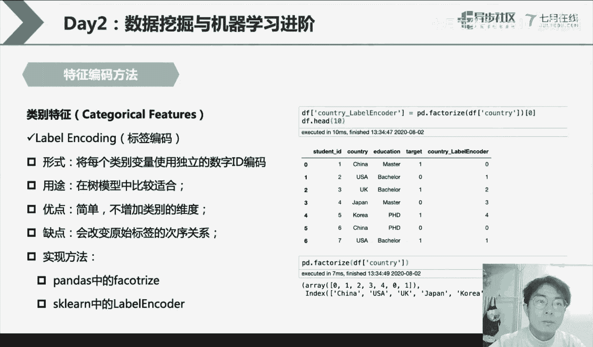
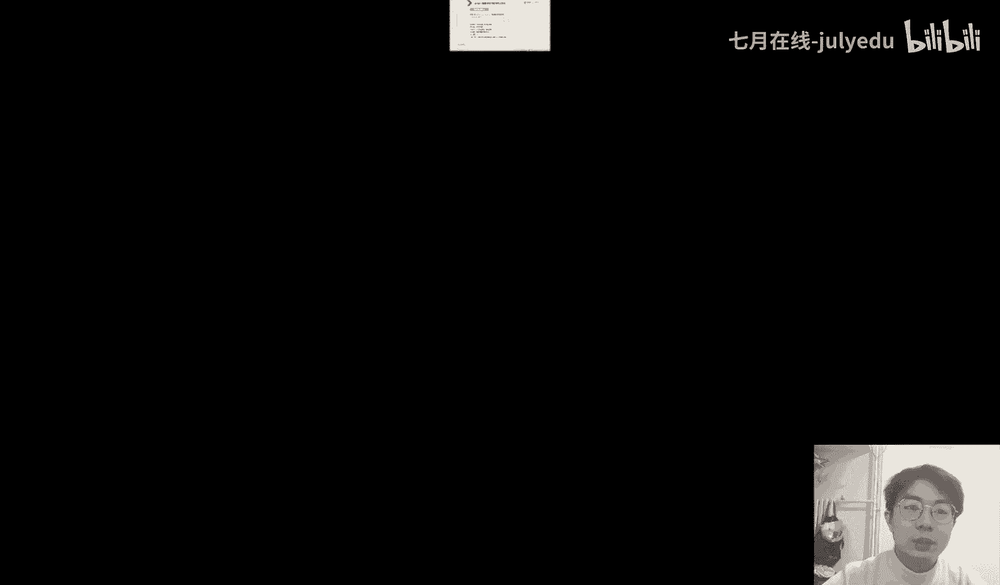
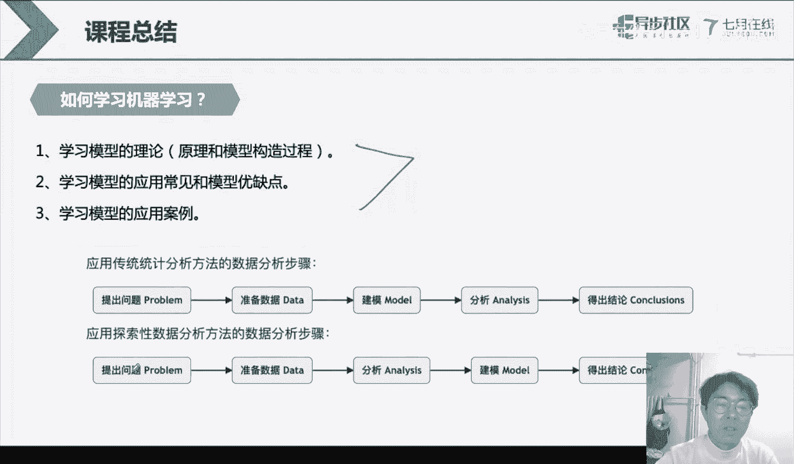
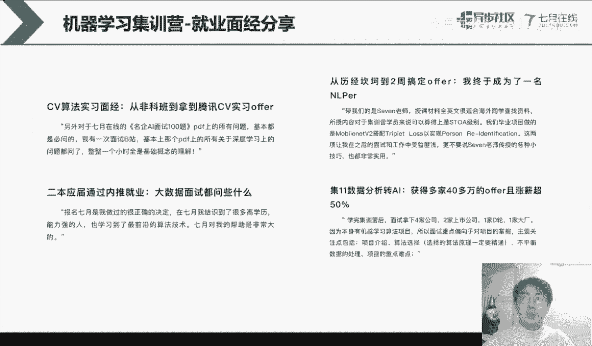
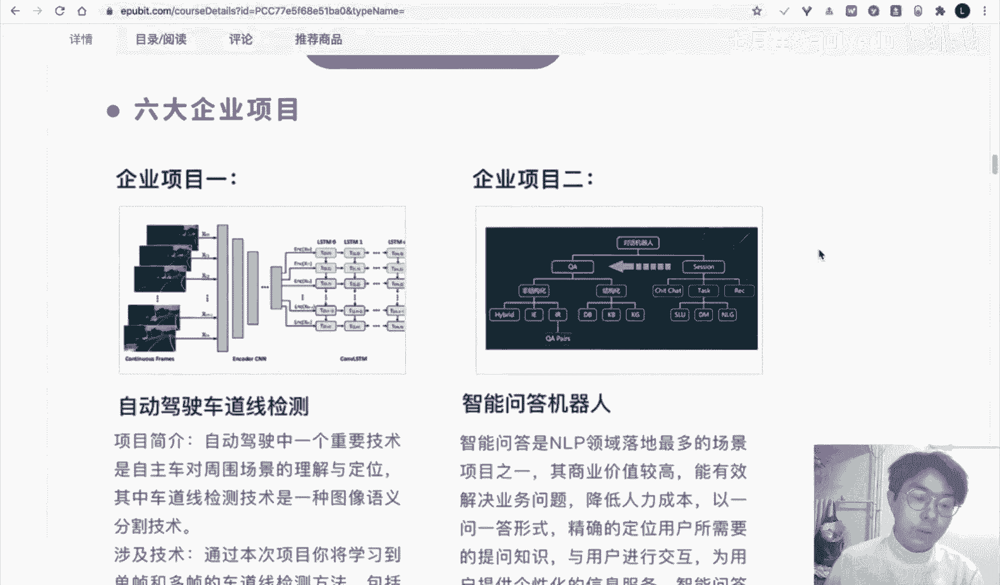

# 人工智能—机器学习公开课（七月在线出品） - P26：【公开课】数据挖掘与机器学习进阶 - 七月在线-julyedu - BV1W5411n7fg

🎼，好，嗯，各位同学，大家晚上好。然后我们就开始我们今天的一个课程啊，今天呢就是我们继续我们昨天的课程，然后来继续进行讲解。我们首先呢来看一看我们在点今天我们所讲解的内容是什么。我们今天所讲的内容呢。

其实会更加深入一些。如果说我们昨天所讲的一个具体的一个知识点是关于我们的一个数据而言。那么我们今天啊今天呢会更加深入到我们的数据所内内在的就是说原理。比如我们会深入到具体的一个数据集，如何做为处理。

以及我们的一个具体的一个数据集它的一个内别变量数值变量以及相关的一些操作。当然我们也会给大家讲一下这个数媒性和集成学习。这个可能会给大家做一个深入的讲解。好，那我们今天的一个内容呢。

就是希望各位同学能够掌握就是我们拥有数据的情况下，我们如何对数据集做一个处理，然后能够获得一个比较好的一个精度。那么在我们的现实生活中呢，其实我们的数据其实是非常多样的。不管是我们的现实生活中。

还是我们的学术数据集，还是我们的工业类型的数据集，它的数据都是非常多种多样的。嗯，我们在常见最为常见的数据呢就是我们的结构化的数据。结构化的数据，我们英文呢叫tabletular这种类似的这种。

英文单词它这种英文单词所表示的数据集就是什么呢？就是我们上节课。就讲的pandas的这种形式。我们有行，而我们的有列。那么在这个地方呢，结构化的一个数据集，就是我们有有对应的一个行和列。我们来看一看啊。

翻到我们上节课的1个PPT。我们的每一行，比如说这个地方是每一行是一个具体的一个。样本。每一行是一个样本，比如说这个地方呢，每一行应该是1个NBA球员的一个信息，每一列就相当于是一个对应的一个字段。

这个字段描述了这个球员他到底具体的信息是什么。比如说这个球员他所处的球队是什么，他的球球员他的号码是什么，以及他的位置、年龄等等等等啊吧？所以说呢我们的一个具体的一个结构化的数据呢，就是类似于这种形式。

它是长得非常规整的，长得非常规整的，它有行和列来组成我们的一个数据集。那么在我们的一个具具体的数据集而言呢，我们在处理的时候呢，还有一类数据叫做半结构化或者说非结构化。半结构化啊。

我们这个地方半结构化的数据集呢就是一种这种XMLjason或者说email或者说我们的这个web page，这种网页类型的数据集，它就是我们的半结构化。半结构化呢也就是它的一个具体的一个数据。

它有这种有点像结构化的一个数据，有这种字段，但是呢它可能不规整不规整，就是说我们在jason里面其是我们的行和就是我们的列它的字段可以是。就是说不确定的对吧？我们有的样本有三列，有的样本有4列。

在我们的GS里面都是可以的。第三个呢就是非结构化的数据。非结构化数据。比如我们的一个音频视频以及我们的文本，它就是非结构化的数据。非结构化的数据呢就是说我们的现在比如说我们给的一个图片。

那么这个图片而言，其实它有大有小，对吧？那么。嗯，我们的一个文本有长有短。嗯，这个地方它就是一个非结构化数据，需要注意的一点就是我们现在的一个记忆学习的模型。任意的或者说是所有的机忆学习模型。

它的一个输入的格式都是要非常规整的才行。这是什么意思呢？我们在进行一个建模的时候，我们昨天也讲了，其实我们本质是想要输入我们的样本X，然后得到我们的对应的一个标签，输出我们标签。在这个地方。

我们的一个数X一定是要。维度相同的维度相同的。我举一个非常简单的一个例子啊，还是以昨天的一个线性回归的案例给大家讲，我们有X1乘以W1，加上X2乘以W2，再加上我们的B，对吧？这是我们的线性礼盒。

那么假如说我们现在有一个。样本它有X1X2和X3。他想输入到我们的模型里面，它能够输入吗？它是不能的对吧？他必须要选择其中两个。其中两个我们的列或者两个元素来做我们的输入。

比如说我们把这两个字段送到我们的模型里面。或者说把这后面两个字段送到我们模型里面，因为我的模型它只支持两个字段的输入。所以说我现在的一个机器学习的模型啊，它输入的格式它是提前定义好的。

在你确定你的一个训练数据的时候呢，基本上就把我们的一个具体的一个输入的格式给确定好了。那么我们接下来呢就以这种不同格式的一些呃这种特征来讲解如何对它进行一个编码。嗯，这个特征呢其实我们在进行讲的时候呢。

你一定要弄清楚，就是我们具体的一个操作。它到底有什么类型的一个特征？对我们的初学者而言。可以首首先呢去看一看这三类特征。类别数值、日期或者是时间。这三类特征呢在我们的这个具体的一个建模的过程中呢。

其实是呃非常非常建议大家去使用和学习的。那么我们再来就是说比如这个类别啊，我们先讲类别，然后讲数值啊。呃，我们先翻到前面这个NBA球员的那个案例里面。在这个地方，team。它是一个什么类型？

它就是一个类别类型category。为什么是类别类型？这个地方其实它所展示的一个形式，其实是以这种字符扇的形式来作为我们的展示的对吧？我们的应该是波士顿凯尔特人，对吧？然后这个球嗯位置。

这个球员的所在场上的位置，对吧？也是有具体的一个就是说用字符扇的做展示的PG对吧？应该是一个point guard，对吧？我们的应个相当于是这种控球后卫或者得分后卫，对吧？还有这种C。啊。

它是一个类别类型，还有一类就是我们的数值类型。数值比如说我们这个地方呢有一个A。H age这个地方它有我们的1个25。027。0以及我们的29。0，对吧？它就是以一个数数字或者说是一个服务点数。

或者说我们的一个整数来做一个具体的一个展示的啊，这个是我们的一个具体的一个啊，就是这个类比要数值。如果你看到这种形式的一个具体的一个数集，或者说你看到这种形式的一个字段。

那么你就知道它到底是类比还是数值的。那么我们继续。我们首先呢来看一看类别类型。类别类型。类别类型呢其实在我们的日常生活中呢，或者说在我们的一个数据集里面，其实是非常非常常见的非常非常常见的。

那么这个地方呢非常建议大家可以嗯以自己的一个情况来举一些例子啊。比如说我们的个人信息里面我们有性别、城市、省份、民族、户口类型，这些字段都是一个类别类型。对吧那么这个地方我嗯把这个性别拿出来，可能对吧？

这个就是一个类别类型的。因为。他是有。它里面的取值难。铝对吧？有两个取值，而且这个取值呢都是一个以这种字符算形式来做我们的一个存储的。对吧然后我们的颜色这个类别它有红色、白色、黑色、粉色，对吧？

也是以这种字符串类型来进行展开。然后我们国家动物对吧？其实都是有具体的一个取值。内部类型呢其实它还可以做一个具体的划分。也就是我们右边这个图。类别类型呢我们可以分为有序类别和无序类别。Yeah。

在中文里面叫做有序和无序。こと。这有序和无序有什么区别呢？有序就是说它的一个大小是存在一定的一个次序，或者说他们之间存在某种关系。比如我们的一个情感。对于我们的情感而言，对吧？

它有excientgo和bad对于这种情感的一个即性。然后呢，我们的一个无序类别，就是说它他们之间是没有这种大小关系的。penpen和 eraasser对吧？它是没有这种大小关系的。

它就是说它们是相互平等的啊，相互平等的对吧？我们的动物动物之间他们也是没有这种关系啊，也是相互平等的。那么我们嗯这个类别为什么要分成有序和无序呢？因为我们的在进行编码的过程中。

我们其实是根据需要根据我们的具体的一个类别的取值，它的含义来做一个具体的编码的。好。那么对于类别类型，我们怎么做一个处理呢？这个地方其实也有一个关键的一个点。首先所有的机忆学习模型。

它的输入都是需要规整的形式，这是一点。这这个地方我们已经达成了共识。好，第二个点就是所有的机忆学习模型，它的输入都是需要把它编码成数值类型。就是所有的机器学习模型。No。就是精行学习模型。

它输入的一般情况下都是数值。它不能输入类别类型，或者说不能输入字符串。我举一个简单的一个例子啊。假如我们现在仍然是一个线性的一个。回归的一个人务。那么这个地方我们在做一个运算的时候。

其实本质就是在做一个数学数学数学上的一个计算。那么对于自符账而言，其实它是没办法参与这个过程的对吧？所以说我们在进行一个编码的过程中。或者说在进行建模的建模的过程中。

我们是需要将我们的一个具体的一个字符串把它编码成这种数值的。而且它是有必要的。那么对于我们的一个类别类型，就是它原始的一个展示形式，或者说存储形式是这种字符串的话，那么我们就需要考虑对它进行编码。

所以说类比类型呢基本基本上就是在任何时候都需要做处理的一个数据。第二个特点就是类部类型呢，它容易带来一个离散数据。它容易带来一个离散数据。如果我们的一个具体的一个类别类型。

它是有我们的一个取值是非常多的情况下，那么它就是一个高基数的一个类别类型，高基数的一个类别类型。高技术的。那么这个地方呢，这个什么是高基数呢？就是说它一个取值。个数或者取值空间。

我们的一个具体的一个类别类型呢，其实我们本质它是有这一列有取值的。比如性别，它有两个取值，蓝和铝，我们的一个颜色，它有对应的一些取值，对吧？国家有一些对应的取值。

那么在这个地方我们的一个具体的一个在进行编码的过程中呢，你要考虑到这一列或者这个类别类型，它一些取值的个数是多少，或者它取值空间的大小是多少。因为如果你在做处理的时候处没有处理好。

那么就会导致带来一些高基数的这种离散的一个数据。而且呢对于类别类型呢，其实它是很难做一个趋失值填充的。比如啊某位同学他的一个个人信息里面，他的一个性别，他是没有。嗯，写的就是说它是一个缺失的。

那么如果是对于性别，我们需要对它进行做一个缺失值的填充，嗯，怎么办呢？嗯，对于性别而言，我们其实是很难做一个缺失值的填充的。你把它填为男性或者女性都很容易出现问题，对吧？

因为这个地方其实它正确就是填充的时候，正确率可能只有50%，只有50%。对，所以说这是我们类别类型的几类特点。好，那么我们对于这个类别类型，我们怎么做一些相关的处理呢。

我们接下来呢就使用一个案例来做对它进行一个处理。我们在这个地方呢，我们是创建一个表格。在这个表格里面呢，我们记录了这个student IDcountry education以t这四列。

这个地方的一个tarage就是我们的一个标签。标签。在这个标签里面呢，我们其实就是需要对我们的一个利用我们的一个country和educ列，然后去预测它的标签。这个tdent的ID呢相当于是一个标识。

相当于你可以理解就是学生那一个学号。就是那个编号用来把每个学生做的一个具体的编号。好，那么我们就开始我们的一个具体的一个编码。

首先呢我们来看一看这个one portone horseone horse呢其实它的一个原始的一个含义呢就是one OK的这种形式。这个K呢就是我们的一个类别的一个取值空间。大小。

比如我们的一个在对education这一列做一个编码的时候，我们的education这一列它原始的一个取值空间是多少？musster better以及PHD对吧？它这个取值空间是3。

这一列取值空间呢是3。那么如果对它进行一个进行一个编码，指one或指定编码就是one。all three对吧？one of three ishor在三个中间有一个是ho，就是编码为一。

其他位置是仍然是0。那么在这个地方我们就做。嗯，我们就做这样一个处理啊。我们对于我们的一个输入的一个数据呢，我们把它进行一个这样的一个编码。我们把我们的一个原始的education链呢。

把它转成一个1乘以3的这种形式，1乘以三的这种形式，那么在这个形式的过程中呢，我们是把其中的一个位置，把它编码为一，剩余的位置把它编码为0。

比如对于我们的原始的这一列这个mus这个地方呃第一个学生它的一个education是取是原始的取值是ma。那么我们就把它对应的一个musster这个位置复制为一，对吧？

那么第二个学生如果它的一个嗯education的一个取值是ba，那么我们就就把它对应的位置取值为一，其他的位置都是0。那么这个地方呢就是oneone horse就是这样的一种形式，它是把一个字符串。

把它转成了一个1乘以K的一个向量。这个K呢就是我们的一个取值空间。取值空间的一个大小。好，那one horse它有什么一些优点呢？就是说它在做一个编码的时候，其实它是将我们的一个具体的一个。

一个字符串做一个这种转成一个向量，而且呢它其实是能够很好的做一个具体的一个数值的编码的。然后期的一个优点就在于它其实是能够很简单的，很有效的对我们的一个类比特征进行有效的编码。

它的一个缺点就在于它其实是会带来数据的一个维度爆炸和特征的稀疏。因为我们这个地方。原始的一个字符转是一列。那么在通过完好之之后呢，它转变成三列了。转变成三列对吧？

那么在这个地方就是说我们如果是把它转转变成三列之后，它的一个所带来的也有数据的一个稀收的情况，对吧？这个地方有很多零。对吧转出来的三页里面就有很多零。这其实就是非常非常稀疏的一个数据。

非常非常稀疏的一个数据。好，那么one horse呢它的一个就是说优缺点我们已经给大家说了，那么怎么实现one horse呢？呃，这个实现one horse的一个方法，其实很简单。

你可以自己动手尝试写一下。当然在我们的这个python里面呢，其实我们可以使用padas，或者说我们的SK learn来完成我们的具体的一个one horse的一个操作。对。

所以说这个其实也是非常非常呃便捷的，非常非常便捷的。好。再看第二类。第二类呢编码方法呢，我们叫做label encoding。label encoding。

label encoding呢label是什么意思？label就是我们的一个标签的一个意思。labbel就是我们的一个标签的意思。那么label encoding它的一个原始的一个字面意思是什么？

字面意思就是说我们对于我们的一个标签做一个编码。那么它是这样的一个操作。我们是用一个具体的一个数值来去代替原始的一个字符串。Okay。我们注意用一个数字。来代替它。那么这个地方我非举一个非常简单的例子。

比如我们对这个country这一列对它进行一个具体的一个编码。那么在这个地方呢，我们就是对我们的一个具体的一个数值呢，我们是需要将它做一个具体的一个。这样的一个编码。

我们把country对应列的china编码为0USA编码为一，U可以编码为2，ja篇编码为3，对吧？这个地方就是说我们是这样做一个操作。它的一个操作是做什么呢？

它的操作就是说我们是将我们的一个具体的一个用一个数字来代替我们的一个原始的字符串。它的一个优点就在于它是没有增加它的维度的。原始的是一维，那么我们编码之后也是一维对吧？它是没有增加这个维度的。

没有增加维度，这是它的首要的一个优点。它没有增加维度。但是它会带来一个缺点，就是说它会改变我们的类别之间的一个代写的一个次序。它的一个次序的关系就会改变。

比如我们的一个这个地方千档编码为嗯签档编码为0USC编码为一，对吧？中国就比美国小对吧？中国也比UK，我们的英国小，对吧？它就引入了这种大小关系，所以说呢这种label encoing呢。

它比较适合用在有序类别里面。或者说是一些高基数的类别里面，就是说取值空间。非常大的一个情况下，比较适合用。Laabbel encoing。那么在对于我们label encoding呢。

我们怎么对它进行实现呢？可以使用这个pens里面的factorize，或者说我们的Scal的一个具体的label enr来完成。对，这是我们的一个具体的一个操作啊，这是我们具体的一个操作。

好，我们继续。Yeah。呃，sorry啊，我这个PPT。应该是卡了啊，稍等一下啊。

对我再找一下啊，然后翻到后面。对，这个地方的一个label呃label encoding呢就是说我们用一个具体的一个数值来代替。那么对于我们label encoding，我们怎么进行实现呢？

我们就是用padas的一个veize，或者说s clean的一个label ender来做一个具体的编码，这是我们的label encoding。那么它的一个优缺点，我们也给大家讲了。第三类呢。

我们就是一个out哦这种顺序编码。数据编码呢就是说我如果知道我们原始的一个类别，它的一个取值的一个顺序，我如果知道我们原始类别的一个取值顺序，那么我们就对它进行这样一个编码，我们对它进行。

把它的一个education这一列对吧？我们知道这个学历，它之间学历它的一个具体的一个大小关系，或者说这种前后顺序，对吧？我们就把它手动的把它编码成123这种形式。那么顺序编码呢。

就是说它是按照类别的一个大小关系进行编码的，而且它是非常适合用在有序的编码里面。它的一个优点就是它也是增加没有增加类别的一个纬度。原始的是一维编码之后的仍然是一维。

但是呢它的一个缺点就是说它是需要人工知识。对没有出现的一个数值是不太友好的。这个地方的一个顺序编码呢，其实它是传入了一个dt。在python就是python里面的一个dic一个词典来做一个映射，对吧？

dicction里面其实本质就是一个K和value的一个映射关系。那么在这个地方就是我们是用一个字符串。做我们的K，然后把它转成一个具体的一个数值。对吧这是我们的一个dict。嗯，在这个dict里面呢。

其实我们需要手动去维护这个映射关系，对吧？这个映射关系是我们人工做输入写代码的时候写进去的。所以说呢它的缺点就是说它需要人工知识。人工知识，这是第一个缺点。

第二个呢就是说它对于我们呢没有出现的数值是不太友好的。这是什么意思呢？如果我们的一个具体的一个数值或者是字符差。比如我们在训练集里面，我们就是对我们的一个这三个取值做一个编码，对这三个取值做一个编码。

对吧？那么如果我们想要对我们的一个测试集。新加了一个字符串新加了一个字符串。比如说我们这个地方还有一个post。doctorctor对吧？我们的博士后。那么在这个地方，我们还有一个字符上做编码的时候。

这个地方它并不在我们的一个d里面。它并不在我们dt里面，那么它就会报错，或者说直接会把它编码为缺失值。因为它不在我们的一个编码关系里面。好，所以说呢这个顺序编码呢，其实它对我们的没有出现过的一个类别。

或者说没有出现过的这个数值是不太友好的。那么这种顺序编码呢，它的一个实践方法，就是说我们手动通过这种自典音射的关系来完成。我们再来看一类，就是我们之前所讲的这个one horse。你不 encode。

以及我们的这个顺序编码。其实它都是尝试用一个数值或者说一个向量对我们的一个字符上做一个编码。但是呢我们能不能从另一个角度去思考呢？我们能不能从一个这个类别。

它出现的一个次数或者整体的一个分布规律做一个编码呢？这个叫做我们的这个在我们的一个count encoding里面可以做。count encoding呢就是说我们可以将我们的类别。

它整体这一列的一个出现的一个次数，或者它的一个频率做一个编码。比如我们这个地方对于我们的country这一列。我们可以做这样一个编码。在这一列里面，我们的china，它对应出现了两次。

china对应出现了两次，对吧？所以说我们你这个地方china比方把它编码为2。USA出现了两次，然后就把它变码为2UK出现了一次，那么它就把它变码为一。什么意思呢？

我们会看这一列里面它的一个具体的取取值的一个出现的次数。会这样看，那么这个地方呢，它的一个优点就是在于它其实是以一列的一个维度来看的。它能够看到所有的样本在这一列的一个取值，有点像这种上帝视角。

有点像这种上帝视角。为什么这么说呢？因为我们的一个具体的一个机器学习在进行建模的时候啊，常规的机忆学习模型它是可以输入单个样本来进行建模。那么我们这个长体引沟里呢，相当于是它开了这种天眼，对吧？

我们去看了所有的这个样本，它的一个这一列的一个特征，然后再去做一个编码。它不是对单个样本做一个训练，它其实是对所有的样本做就是集合，然后做了一个编码。

那么这个counting勾ing它的一个优点就是说它其实也是非常简单的，没有增加这个维度。它可以从这个整体的一个角度来统计我们的出现的次数，相当于是这个整体的一个频率啊，可以做一个统计。

但是呢它也有它的缺点，就是说如果我们的数据集，它的一个整体的分布，或者说它的一个具体的一个。情况。就就是说整体的一个样本的一个原始来源，它可能是有误差的情况下。

那么也会导致它的一个cont codinging所编码的结果也有存在误差。比如这个地方我们的一个chinaUSAU，比如在现在我们的这个china和USA是编码为二的。那么在下一份数据集里面。

有可能使用这种方法，有可能china的编码成3USA编码之一，这个都是有可能的。所以说呢它其实是跟我们的当前的数据集是有关系的。好，这是我们的一个counting扣点。那么我们就继续啊。

刚才其实我们讲的这个具体的一个类别类型的一些编码。那么我们接下来呢就看一看这个数值类型的数职类型呢，其实在我们的日常生活中呢也非常常见。比如我们的年龄成绩经纬度，它都是一个数值类型的特征，对吧？

数职类型的特征呢？它有什么样的一些呃特点呢？就是说它是有大小关系的。19小于2020小于21，对吧？这是有大小关系的。而且这个地方我们也可以推导得到19小于21。那么这个地方呢这个数值呢？

它是能够做一个大小比较的这是第一点。第二点呢就是说它可以做一个减法或者加法的运算。对吧。这个地方它是存在有一定的具体的含义的。比如说某某位同学他是20岁和某个同学是19岁。

那么我们可以统计一下两位同学他的年龄的差值。对吧零行差值这个减法是有意义的，它是数值减去数值，也得到的是一个数值。字符串它是没办法做减法的对吧？好，那么这是数值特征，其实数值特征它能够。

带来很多的一些有意义的一个信息。但是呢数值特征其实它非常容易出现异常值或者种离群点。为什么这么说呢？比如我们在填写一个学生的一个年龄信息的时候，统计这个学生的年龄信息的时候。

大部分同学呢都是在我们的1个18岁到30岁之间，绝大部分同学都是在这个年龄阶段之间，然后突然有一个同学把他的年龄填成100岁。填成100岁，当然不可否认啊，现在我们的医学这么发达。

肯定100岁当然也是可以就是说成功是就是说就是说也是存在这种啊就是说年龄的。但是在我们的一个整体的一个分布的过程中，或者整体的一个呃就是说数据集的一个场景下，这个地方100岁可能就是填错了。

或者说有人故意填的对吧？那么大部分的同学都是在这个年龄段，那么突然蹦出来一个跟我们这个年龄段，或者说整体的一个数据，整体的大部分同学的年龄相隔比较远，相隔比较远的这个情况，对吧？

那么它就是一个具体的一个异长值。当然还有这种离群点，离群点呢，它跟异常值其实是比较相似的。但是呢离群点可能是呃这样一个含义。比如说大部分的同学的年龄呢都是在18岁到30岁之间。

然后有一位同学他的年龄是15岁。对吧它可能不是异常值，但是呢它跟我们的整体的一个分布呢不太一致，它是偏离了我们的群体的对吧？它不算异常值，但是它是一个离群点。好。

那么在我们的一个具体的一个数值特征的编码的过程中呢，其实我们异常值和离心点都是非常常见的。那么我们怎么做呢？其实对于我们的数职特征呢？就是说我们需要对它可以对它进行一个缩放。

假如说我们拥有的一个呃学生的一个A级A级这一列，就是他的一个学生的一个年龄的这一列。对于年龄这一列呢，我们其实是可以对它进行一个缩放的。对吧我们直接把它缩放的，就是你可以把它进行取整，34。5。

把它转转变成34，对吧？34。5把它转变成34，然后呢，我们也可以考虑把它做一个像，就是说除以10，然后做取整，比如说34。5编码，把它转变成328。9，把它编编码为219。5，把它把它编码为一，对吧？

这个就是具体的一些操作，那么在这个操作的过程中呢，我们为什么这么做呢？其实我们把这一列把它编码成这两列，其实是一个信息丢失的一个情况。也就是说原始的信息是有小数点的对吧？我们其实是把它转成了一个整数。

或者是保留某一位。为什么这么做呢？其实这个地方有很多原因。我们的一个特征呢，其实。或者说age这一列，它包含的信息有点多。为什么这么说呢？在所有的学生里面，只有你一位同学是34。5岁，在所有的同学里面。

只有你一位是28。9岁。对吧那么我在这个机器学习模型在。训练的时候，我看到这个样本。我就直接能够记住你对吧？因为在所有的样本里面，所有的同学里面，每位同学的年龄都是非常非常非常不不一样的。

他是没有共性的。好，那么这个信息多并不一定是好事，信息多不一定是好事。因为这个地方可能会把一些没必要的一些就是说过于精细的这些信息呢也提供给我们的模型呢，让我们的模型呢，它很容易走走偏了。

那么我们怎么办呢？我们相当于是做一个取整或者说缩放，把我们的一个数据把这个A这一列呢，这个字段呢把它转变成一个非常规整的一个形态。比如说34321对吧？其实也有类，它也其实也有这种大小关系。

但是呢它其实是更加规整。为什么呢？因为这个地方它所保留的，它是把整体的信息给它保留了下来。但是呢他把这些过于精细的小数点之后的，把它丢弃掉。它的一个优点就是说我能我我将我们的一个信息。

把它的一个主体的一个位置或者主体的信息给它保留下来。那么这就是round啊，其实它是在绝大部分的场景下都可以做通用的，而且呢它是能够保留绝大部分的一个信息的。

它的一个缺点呢就是说有可能是需要人工来进行参与。然后呢，可能具体的缩话呢，就是完使用这种除法来完成。然后我们还有这种就是说分箱，分箱呢就是我们对于我们具体的一个A级字段，然后通过某种逻辑的判断。

然后判断它是不是小于20岁，是不是在20岁到25岁，是不是在25岁到330岁，以及在30岁以上，对吧？通过这样的分箱，我们都可以完成我们的具体的一个数字特的一个编码。那么对于我们的数值特征呢。

其实我们也需要考虑到如何把它做一个缩放，为什么呢？我们。举这样一个例子。在我们进行建模的过程中。我们仍然以线性模型做举例。我们线性模型其实本质假如我们输入两列。

然后我们需要有两个具体的一个W跟我们的列的一个取值径相乘，然后再加上我们的一个偏值，得到我们最终的一个数值结果。好，假如我们的第一列，它的一个取值空间是0到1。假如说它的具体取值就是0。01呀，0。

1呀这种。它的一个具体的取值范围是从0到1。第二个。X就是X2的维度，它的具体的取值范围是从0到100。比如说34啊，35啊。好，那么如果这样来进行建模的话，就会存在一个问题。存在什么问题呢？

就是你的一个W1和W2，它在进行一个参数的一个优化的过程中，它得到的一个取值，具绝取值会存在就是说差异性，而且这个差异性呢有可能是这个成倍的差异性。这个地方我们的W2，它只要改变一点点。

对我们的精度就影响非常大。但是我们的WE它改变很多，它可能带来的一个标签的一个影响就很小。为什么呢？因为我们的1个X1和X2，它的一个具体的一个取值范围是不一样的。

那么在这个地方我举这样一个非常简单的例子呢，就是想要给大家讲。大家清楚这样一点，对于我们的一个具体的一个输入的一个数据呢，我们可能是需要把它做一个缩放的。特别是对于我们的数值特征。

我们把它做了一个缩放之后呢，我们就可以保证我们的具体的一个所有的数值特征呢处于一个比较规谨的范围内。那么就是按照这样一个例子，如果我们的X1和X2，比如说X1远远大于X2。在这个地方我们的一个就是说。

如果我们的X一远远大于X2。那么这个地方我们所。所需要的1个W1就远远小于W2。因为我们就是说希望它两者就是说这个参他所训练得到的参数啊，肯定是处于这种形态。那么我们如果是处于这种形态。

你会发现我们的一个优化的一个曲线，它有可能是这种椭圆类型的，它就不是一个圆形的。也就是我们的一个在进行一个参数更新的过程中呢，我们就会走这种支字。形态的支子形态的。这种就是说具体的一个优化，它就会走。

就相当于是需要走多步。而且呢很有可能就是对我们的一个具体的一个模型呢会带来这种相当于是梯度爆炸呀，或者说这种不稳定的一个影响。但是如果我们将我们的一个具体的一个输入数据，把它缩放到一个规整的范围内。

X1和X2都是在一个规定的范围内。那么这个地方我们的一个W和W2也可能是在一个规定的范围内，它就是从一个椭圆，把它变变成一个比较规整的一个圆。这样我们优化起来，我们就不会存在模型不稳定啊。

已经梯度爆炸的这种情况。好，这是我们的一个预处理。它的一个为什么要做预处理。对，那么做我们的预处理怎么做呢？呃，有很多种方法比较常见的，就是说我们通过这个呃这一列，这个X是就是其实是一列。

X命呢是一个值。那么我们对这一列呢，我们减去它这一列里面的一个最小值除以它的一个最大值，减去最小值，然后做一个除放，就是做一个缩放。这个呢其实是使用这一列的一个最大最小的一个做处理。

它比较适合用在这种非高斯分布里面。然后呢，它也是能够保留我们的一个数值的绝大部分的信息的。但是呢它非常容易受到异常值或者说这种离群点的影响。因为我们的一个异常值呢，往往都是在最大值和最小值出现。对吧好。

我们继续。那么我们第二类呢就是这种标准化。标准化呢，其实在我们的这个数学里面其实非常常见。对于我们的这个数这一列，我们减去它的一个均值，除以它的方差，对吧？

相当于是把它做了一个减剔除它的一个这种均值和方差项。它就是比较适合用在这种高斯分布的数据集里面。然后处理之后呢，我们的数据集整体的一个分布呢也比较正态化。

但是呢它的一个处理呢可能是需要做一个相关的计算啊，而且对我们的一个分布的要求也比较严格。好，那么刚才就是给大家讲了这个数值的一个特征。那么我们接下来就看一看我们的这这个常见的一些集成学习的一些思路。

稍微给大家介绍一下，这一部分可能会有一些难度啊。那我们来看一看这个集成学习呢，其实是这样的，集成学习就是说我们能不能集成多个模型来完成一个具体得到一个新的模型。比如我们一个非常简单的一个例子。

就是三个臭皮匠能不能顶一个诸葛亮，这个就是一个机身学习，或者说我们投票。对吧投票都是非常常见的集成学习的思路。投票选班长啊，通过多次摇骰子来进行投票啊，这就是一个集成学习的思路。

那么在我们的具体集成学习的过程中，到底有哪些集成学习的一些想法呢？在机器学习里面，我们比较常见的有这种baggingbagging是什么？begging就是这种民主集中的思路。啊。

这个就是民主是什么意思？民主就是说我们每个模型。都是相互平等的。每个模型相互平等，每个模型有一个预测结果。然后最终呢我们会将这个预测结果把它进行一个投票，然后得到最终的一个预测结果。那么这个地方呢。

begging呢它其实是可以做一个并行的训练模型的。因为每个模型之间它是相互独立的模型与模型之间是相互独立的，所以说我们可以并行训练多个模型。那么它怎么进行训练呢？我们可以对我们的数据集做一个采样。

然后进进而可以训练多个模型。好，这个地方其实是有一个鲜应的一个呃假设的。什么假设呢？就是说。我们有了模型一。我们有了模型2。我们有了模型3。我们希望这三个模型分别做一个决策，然后把它做一个投票。

得到我们最终的结果。这个地方其其实是有一个假设这个假设就是说我们这三个模型它是有一定的差异性。差异性是要有的，为什么呢？就举个例子啊，假如说我们在选班长投票的时候，所有同学都投某一个就是相同的一个。

同学，那么这个。这个投票就没有什么意义，这个投票就没有什么意义，它没有多样性，它不能就相当于是它最终的结果其实就没有什么价值。每个同学他的一个选择都是一样的。

那么这个地方呢就是说我们希望我们的模型是有差异性的。每个学每个每个同学他可能自己的一个就是说投票的一个这个决决定啊是不一样的。我们最终呢是以相当于是取相当于是少数服从服从多数这种心态。

如果我们的所有的模型都一样的话，那么它的就是说最终的一个。结果也是一样的，或者说他投票的一个结果，或者是说预测的结果也是一样的。那么对我们最终的一个。精度是没有什么。改变的啊，或者说没有什么提升的。

就是说我们是需要比我们的模需要我们的模型有多样性。我们最终呢它的一个预测结果才有多样性。如果你预测结果没有多样性，那么就没有什么轻度的收益。好。

那么这个地方的一个关键点就在于我们如何去得到我们的模型有多样性，或者说如何让我们的模型有多样性。这个地方呢其实是有一定的一些具体的操作。我们再进行训练深度学习，训练任何的一些模型。

不管是机器学习模型还是深度学习模型，我们其实是可以把我们的数据集做一个采样。比如说行采样列采样，然后采样得到不同的一个数据集。

然后就可以得到我们的一个相当于是原始的数据集是一个10101万行乘30列的一个样本，我们可以把它采样成。990千0行乘20列的一个样本，或者说是9。5000行乘以18列的一个数据集。

也就是说我们把原始的一个样本空间行和列做一个采样，采样得到一个新的数据集，然后通过模型训练，可以训练得到新的模型。由于我们的输入的数据不一样，那么我们的模型也会存在不一样的一些差异性。

然后最终通过一个投票得到我们最终的结果。好，这个就是一个bagging的思路啊。第二个呢是bosting boostsing呢就是说我们通过这种串就种筛进行筛选的一个思路来串联我们多个模型。

它是什么意思呢？就是说我们的一个记忆学习模型啊，不仅仅是让可以让他训练一次，我可以让它迭代多次。比如说这个地方举一个简单的一个例子啊。我现在要打靶，我现想要这个深度学习。

想要这个模型呢能够命中我们的一个靶心。这有个圆圈，有个中心，命中了个靶心。那么我们怎么办呢？我们最开始的一个模型，有可能它的命中位置在这儿，离我们的一个最优的一个位置，其实相隔很远。

对吧那么我我们下一次预测呢，我们就是基于。你上一次预测结果就一个二次预测。这一次我遇就是说他打的比较远，牵都比较远，哎，我就往右偏一点。对吧然后呢我们不断去调整，不断去调整。

我们可以尽可能的去靠近我们靠近我们的一个最优值，这个就是一个bosing思路。就是说我们的模型它可以不断的通过某种方式来进行一个进化。这个进化呢。

我们是可以通过本能模型对我们的一个上能模型做一个继续的一个迭代或者礼盒这样的一个操作来完成。bosting呢它可以就是说对我们的一个模型的精度有很好的一个呃就是说提高啊，因为它是一个迭代的操作。

而且呢bosting它是能够对我们的一个模型能够做一个继续学习的啊，这一个继续学习的。这是boasting的一个思路。那么这个boosasting和我们的一个dagon。

其实在我们的现在的一些机器学习的模型里面，其实就是很常见啊，或者说有一些具体的一些体现啊。我们的一个具体的在我们的随机森林，随机森林这个嗯继忆学习模型里面。

我们其实就是可以对我们的一个具体的一些数据集来完成这样的一个操作。我们对我们的数据集呢对它进行一个采样，也就是我们的把我们数据集按照行和列做一个采样，然后呢把我们的数据集采样完成之后呢。

然后分别把它训练我们的数模型。训练了数模型之后呢，然后通过我们的模型将它进行投票，然后得到我们最终的结果。这就是我们的一个具体的一个这种嗯随机森林一个非常简单的一个例子啊。森林。森林是什么？

森林就是多棵树，多棵树，对吧？树多了就成了森林了。那么这个地方其实就是字面意思啊，我们每棵树做一个决策，然后最终将这多棵树的一个结果把它进行一个继承。好。那么我们这就是一个随机森灵的一个案例啊。然后呢。

我们接下来看一看我们的具体的一个代码实践啊。这个地方我们来看一看。我们的具体的一些特征编码的一些代码，我们都是给大家准备好的啊，就是说直接是用pandadas可以完成的。

直接通过我们的padas来可以完成的。然后呢，我们的一个padas呢，这个地方其实就是。呃，我们的paus它可以首先创建我们的数据集，创建我们的数据集完成之后呢。

然后接下来就可以得到我们的一个具体的一个表格。表格完成之后呢，我们就可以对它进行一些相关的操作啊。比如说进行一个one hot。对吧把它转转变成这相关的一个往后。

然后呢或者说通过一个label encoder label encode对吧？把我们的原始的这一列把它转变成这种数值类型的。或者说或者说这种顺序编码在我们的这个代码里面都是帮大家实现了的啊。

帮大家实现的。所以说如果大家想要领取我们的代码的话，一定要加我们的群啊，一定要加我们的群。然后在我们的群里面，我们会把我们的代码和课件发出来。好，然后呢我们的一个具体的一个模型呢，其实。

这个地方我们的随机森林呢其实在SK learn里面也有具体的实现啊，在SK learn里面也有实现。在也就是在我们的SK learnasseemble的一个模块里面，还是有具体的一个实现的。

在这个实现的过程中呢，我们直接是定义好我们的模型，然后可以完成让我们的模型完成一个训练的过程，然后完成一个这个地方我们也可以将我们的一个特征的一个重要性可以打印出来。

这个地方的特征重要性呢就是我们的模型认为哪些特征是比较重要的，哪些特征是比较重要的啊，就是特征重要性。好。这是我们的一个随机森林。当然这个代码呢其实还包含很多的一些其他的内容啊。比如说其他的数模型。

比如那HGBM以及嗯这个叉Gbos，其实都是在我们的这个代码模块里面是有的是有的对。然后呢，我们接下来呢花一点点时间给大家讲一个这个房屋的一个就是说也是一个具体的一个案例啊，它的一个案例呢其实也很简单。

就是呃做一个房屋的一个价格和这个热度的一个预测。我给大家看一个这个地方。在我们的数据集里面，其实是有很多的一些字段的。有一些字段呢它是不就是说有可能是非规整，或者说是这种文本类型的。

那么对于这种文本类型的一些具体的一些怎么对它进行题取特征呢？其实你可以参考这种结构化的一些数据集的体育特征，我们统计一段文本有多少个单词，我们统计一下这个图片，它到底有多少张图片，对吧？

或者说统计一下我们的具体的一个。日期它的一些年系年月日信息，这个都是可以给它提取的。当然在我们做特征工程的时候，或者说特征编码的时候，我们其实不仅仅是可以做一个编码，我们还可以提取一些新的特征。

在我们上节课其实也有同学问到了，我们能不能提取一些新的特征呢？比如我们有了房屋的一个价格以及房屋它的到底有多少个卧室的情况下，我们就可以算一下，平均每个卧室，它平摊的一个价格是多少？

或者说我们有了这个房屋的一个卧室的一个个数和它的一个就是。它的一个呃就相当于是厕所的个数，我们就可以算出它相当于是总共有多少个房间。对吧通过这样的一些操作，其实都是非常有意义的。

而且它能够构建得到一些新的特征。这些新的特征呢，它在我们的原始数据集里面是不存在的。好，那么如果各位同学想深入学习啊，这些都是呃对大家非常非常有帮助的，非常非常有帮助的。

它其实就是我们具体在做一个案例的时候，我们对数据级做一个编码，然后做一些构建特征的操作。好，我们继续。当然在我们的一个数模型里面，我们也可以将我们的数模型结合这种bos性的思路。

让让我们的数模型呢让它不断做一个礼合。第二个树基于第一棵树做一个礼合，然后不断进行一个呃礼合。然后最终呢可以将我们的多棵树的一个结果进行一个继承。好。那么我们这个具体的一个知识点呢。

其实也就是说两天的知识点也给大家讲完了。那么我们接下来给大家总结一下啊，稍微总结一下。第一个呢就是说需要大家知道第第一点，特别要记得第一点啊。特别是小白同学啊。机器学习和深度学习的一个区别是什么？

这一点一定要记住，我们其实这两天的一个知识点都是在讲机器学习，他没有讲深度学习。深度学习其实现在也非常火热，而且是非常建议建议大家学的。但是呢需要知道的一点。

就是说机极学习和深度学习它是有一个范围的一个划分的。深度学习它是机极学习之中的一个一种。深度学习，它是以这个人脑神经元网络结构为代表的一种机忆学习算法。它是记忆学习算法中的一种。

所以说呢在我们学习这个具体深度学习的时候，如果你想要学，那么你可以先学习一下记忆学习的一个基础，然后再去学习一下深度学习。你不要将两者对立起来。其实这两者它是存在知识点的交叉的啊，它是存在交叉的。

在我们的深度学习里面，也有我们今天所讲的这个提升学习的思路的。好，这是第一点。第二点呢就是说有很多同学在我们的上节课学完之后，人家就问我，就是说我们学习这个具体的与记忆学习有什么一些具体的一些路径啊。

首先呢我们这个地方在我们的一个具体的一个。哦，在昨天给大家介绍的课程里面，其实也有一些路径。当然这个地方我给大家抽象一下。第一个呢可以学习一下这个机忆学习的一个理论。

特别是机忆学习模型的一些原理和它的模型的构造过程。第二部分呢可以学习一下证明模型它常见的一些应用。以及它的一些模型的优缺点。也就是说当我们遇到一个场景之后，我们怎么知道是选择一个模型。

第三个呢就是深入去挖掘我们的一个模型，它的应用的案例。对，这个其实就是不断学习、深度学习以积极学以及积极学习的一个步骤啊，按照这三步走就行了。然后呢，我们呢具体的一个建模的流程就是提出问题，准备数据。

分析建模的出结论。这个流程大家也可以记一下。好。

那么在我们学习的过程中呢，其实很多同学会遇到一些相关的问题啊，或者说小白同学找不到我们的学习的资料啊，或者说遇到没有老师进行指导啊。

那么我们现在呢在我们的一步社区和我们的7约在线呢开设了一门课程叫做机器集训营。现在呢这个集训营也是开到第1六期的。这个集训营呢，其实它是非常干货的。因为在这个集训营里面呢。

我们今天和昨天所讲解的所有的内容以及我们所有的实践代码都是在我们的集训营里面是有的。这是第一点。第二点呢是我们的集训营呢，它是包含了很多的实践的项目。在这个实践的项目过程中呢。

它包含这种比如说这种CV类型的项目，以及我们的问答类型的项目，比如或者说这种聊天机器人啊，或者说这种推荐系统的项目。那么这个些具体的项目呢，其实在可能你自己去学习。你不知道它到底如何去进行实践。

也不知道它到底就是说在。

间的过程中会有什么一些难点。所以说我如果大家有就是说在学习的过程中，不知道学习的路径，不知道我们学习这个具体的这个它的侧重点，或者说不知道如何去学习这些项目。

都是非常推荐大家就可以了解一下我们的机器学习集训的。那么这个集器云呢，其实它的一个办着个集训营的目的，其实就是希望各位同学通过我们的集器云能够入门我们的人工智能。

而且呢通过我们集器云能够拿到比较好的一个offer。而且呢我们的往期呢其实有很多的一些同学通过我们的集训云呢都是拿到很高的一些互联网的一些offer的。对。

那么如果各位同学想对我们的学信想要啊就是说报名的话，都可以在我们的群里面聊，就是私聊我们的一个就是说班主任啊，然后可以做一个更加详细的一个介绍。我们的一个机器学习的集训营呢。

其实它所涵盖的知识点是非常多的。从我们的一个具体的一些机器学习的一个原理，到实践，再到深度学习，再到CVNRP3那个方向的一个具体的项目实战，都是非常非常完备的。

其次呢这个集训营它是包含这个具体的实践平台的。有我们的一个GPU的云平台，所以你不用担心里面有这个计算资源。只要你报名的集训营呢，都是有这些相关的一些实践的环境。

而且呢我们都有这个助教和老师在我们的一个群里面给大家进行答疑。做一V1的一个辅导。我们的一个具体集训营呢包含的项目是非常多的。比如CV的车道性检测呃ARP的智能问答推荐系统的商品推荐。

以及我们CV的大规模这个形程重事别的一些项目。对嗯，老师基础比较弱，能学会吗？是可以的。因为因这个集训营呢，它是包含的一些基础的一些python知识在里面的。它是包含python的。

所以说如果你是之前没有python的一个基础，你也不用担心啊，这个我们的所有的内容，或者是说跟机器学习相关的一些内容，都在我们的一个具体的一些集训营里面是有的。双十一有什么优惠？

我们现在报名我们的课程就是有1个1600的一个优惠报名。我们刚才的一个班主任也发了。对。然后我们的也有这些实训的项目啊都是非常非常多的。比如基于SK，基于来GBM的，基于ten flow的。

以及基于我们的CV的这些实训项目呢，我们在集训里面也都是有的。然后这些呃根使用医学数据完成那个分类，或者说对我们的一个。就是一些行人做一个目标检测，或者说做一个新闻分类的一些相关的操作。对。

在我们集训营里面都是有的。然后呢，我们的集训营里面，其实很多的一些呃历史的学员呢都是很多都拿到很比较好的offer。然后大都是起了一些分享的。如果大家感兴趣的话呢，也可以看一看我们的网届的一些学员。

他的一个具体的分享啊。对，我们在这个双十一的活动期间呢，有就是说具体的一个优惠啊，对吧？我们的班主任也发了领取，可以领取1600元的一个优惠券，不过只有5个名额。对，如果大家感兴趣呢。

都可以在我们的群里面就是说艾特我们的班主任啊，或者说私聊我们的班主任。对我们的历史的学员呢，其实是很多都是拿到比较好的一个offer的。好。那么我们的一个具体集训呢，也有这个结业证书。

是由企月在线和阿里云填持的这个具体的一个结业证书。然后呢，其实也是非常非常有就是说有价值的。好。那么我们第二天的一个知识点和我们的一个课程内容呢就到这儿。我们今天呢也有一个抽奖的环节啊。

我们今天的一个抽奖问题啊，今天的一个抽奖问题是我们的一个这个问题啊。我们的一个集成学习有到底有哪些分支，或者是说集成学习有哪些方法。那么如果大家知道我们的这个具体的一个答案的话呢。

也可以在我们的一个微信群里面来进行参与啊。微信群，大家如果还没有加入我们的微信群的话，可以加一下。然后呢，第一位在我们的微信群里面回答问题的同学就可以领取我们西部数呃这个西部数据的一个硬盘。一个啊。对。

这个是相当于是比我们昨天的一个。哦，就是呃它的一个书的一个价值更高的啊。好，我们已经看到有同学发了啊。对。那么就是我们的一个这个CEDTTEK同学是啊领取了我们的一个奖品了。对。

那么大家对我们的今天所讲解的一个内容有什么问题吗？对，大家还没有加群的同学一定要加一下我们的群啊，扫码加群。我们的一个代码和我们的一些具体的一些课件呢，都在我们的一个群里面发给大家。

大家对我们的今天的一个课程有什么问题吗？嗯，大在我们的一个具体的机器云里面呢，其实呃这个有我们的具体的一些介绍啊。嗯。对，这是哦sorry啊，这是我们的一个现在的两天的一个课程。对。

然后呢如果大家想要了解我们集器云的一个具体的一些，就是这些资料啊，都可以在我们的一个具体的一个微信群里面私聊我们的班班老师。嗯，视频中的数据集怎么获取？

我们会把这个数数据集的一个获取方法在我们代码里面写好的对。对，大家如果想要继续详细了解我们集训云的，一方面呢可以私聊我一下我们的班班老师啊。另一方面呢就是也可以在我们的一个看一下这个链接。

这这个链接网现在打不开了。

你可以在我们的这个网页上面找到啊继极学习继训习。现在报名是我们的有优惠的啊，现在报名是我们有优惠的，双十一的双十一的一个优惠的。

对，那么如果各位同学对我们今天的一个课程内容有什么问题的话，也可以现在提出来啊。对。对，大家对我们今天的课程内容有什么问题吗？也可以在我们的微信群里面进行提问啊。

对我们的双十一现在报名我们的一个机器云的话，是有我们的1个16001600元的一个优惠的。如果大家想要报名的同学，或者说想要跟我们一起继续学习的同学啊，一定不要错过这个机会。

这个机器云其实包含的一个知识点是非常多的，而且它的学习周期是应该是到半就是说不是几个月，是半年啊，这是半年的，不是一个短期的课程对。大家如果想要了解或者报名的同学啊，一定要去联系一下我们的班主任。

仅有55个优惠名额啊，就说我们现在双十一的这种。优惠价格。对大家如果有问题的话，可以现在提问。好的。本科生学习这个适合就业吗？适合的适合的。只要你跟着我们的一个节奏来学的话，很非常适合的。对。

很多的一些项目，它不需要很多的一些基础啊。对你按照我们的一个这个地方其实。呃，一方面我们昨天和今天所讲解的内容都在我们的一个集训里面。对。嗯，你可以按照我们的学习这样一个流程来学。嗯，大专呢。

这个其实也是有可能的也是有可能的对。深度学习学过之后，将来找哪类工作？深度学习学完之后，一方面你可以找哦算法开发，或者说大数据平台工程师，或者说数据分析都是可以找的。就是跟IT沾边的。

特别是跟数据科学、数据挖掘这种记忆学习沾边的都是非常适合的。对，大家还有问题吗？在我们的集训营里面，其实有深度学习，有机忆学习啊，所以你又不用担心。好。大家有问题的话可以提问啊。对。

或者说大家后续呢也可以在我们的一个微信群里面进行一个提问。也都可以的。对，我们现在的这个集训营呢应该正在火热招生啊，因为我们的名额也是有限的。如果大家想要继续学习呢，可以跟着我一起报名啊。

我们的这个集训营呢，现在第16期应该是在我们的12月份开课啊，就是说12月份开课。对。而且呢如果是按照我们的节奏学习完成的话，你有我们的老师呢给大家推荐或者说类推相关的一些岗位啊，都是可都是可以的。好。

大家还有什么问题吗？好，我看大家也没什么问题啊，大家后续有什么问题呢，也可以在我们的一个微信群里面进行提问。好的，那么我们今天的一个直播就到此结束啦，也谢谢各位两天的一个陪伴。好的。

那么我们今天的一个直播就到此结束，谢谢各位。

