# 人工智能—机器学习公开课（七月在线出品） - P27：手把手带你挖掘电商用户行为 - 七月在线-julyedu - BV1W5411n7fg

hello，各位小伙伴。😊，大家晚上好。😊，OK啊，那么呃今天晚上呢呃主要是呃我们企业在线跟CSDN啊联合来做这样的一个公开课，那么公开课的一个主题呢。😊，手把手带大家去完成一个什么呢？电商用户行为呃。

分析也好啊，数据挖掘也好啊，OK啊，都是差不多的一个概念啊，主要就是带大家来熟悉一下呢，我们整个这个数据挖掘它的一个基本的一个流程啊，流程OK啊，那么接下来呢给各位小主汇报一下。

我们今晚要做哪一些这样的一个内容啊，我们今晚的课程安排呢，一共分为三个环节。那么第一个呢。项目的讲解啊，第二个呢啊抽奖对吧？第三个呢答疑啊，那么抽奖呢我会穿插在这个项目讲解的过程当中啊，那么这个答疑呢。

我们放到最后啊，最后来集中的给大家来进行。答疑啊，那么今天的奖品有哪一些是吧？啊，这下面我简单罗列了一下啊，呃，有几个课是吧？数据分析实战的5个，然后呢首推MAL的5个OK啊。

这些课程呢大家可以直接到7约在线呃这个呃网站上官网上啊，直接点开啊，可以去搂一眼啊，搂一眼。然后还有什么呢？书对吧？啊，这里面我就截了几张图片哈，一共有这么几本书，对吧？包括这个人工智能的啊。

机器学习、理论、导演啊，包括算法导论啊三个啊3个。😊。

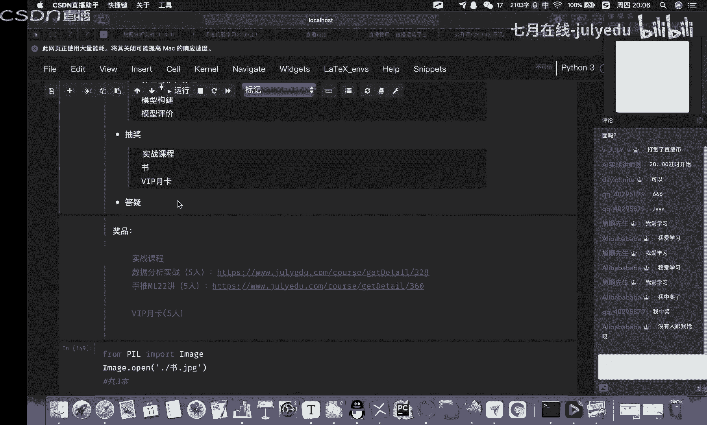

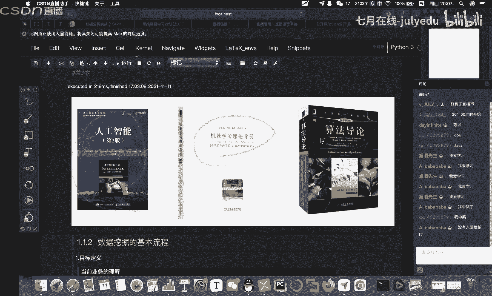

OK然后还有一个什么呢？VIP月卡啊，这个相当于在这里面应该是啊价值最贵的对吧？啊，最贵的对吧？5个名额，那么这个VIP里面哈，一共有有好几百个啊，好几百个课OK啊，大家可以在一个月的时间内啊。

多听一听。那么如果大家对这个机器学习这一块啊，有比较强烈的一个兴趣啊，或者说想了解一些这方面的一个内容。OK啊，可以加这个右上角杨老师的一个微信啊。😊。

他会给你做一些，比如说职业规划呀，对吧？啊，课程那些引导。那么课程这一块呢，大家可以直接到企业在线官网呃，来进行一些，比如说机器学习机运营方面的一些课程的浏览。OK啊。

那么后面呢我会给大家简单的去讲一下啊，讲一下O那么回归到我们本次课程的一个主题，对吧？啊，来完成一个电商用户行为的一个。挖掘。😡，OK啊，那么呃。😊。

这个课程呢其实跟机器学习呢啊是有非常强的一个关联性啊。那么因为我们整个的数据挖掘跟这个机器学习啊，它是密不可分的。那么我们整个项目这一块呢啊是通过一个啊电商数据。那么这个数据呢是一个比赛的一个数据。

对吧？我们拿到这个数据了以后，怎么对这个。里面的数据来进行一些分析，对吧？然后呢达到我们的一些目标啊这样子的一个动作。OK啊，那么通过这样的一个案例呢，来梳理一下。

比如说我们对于这个呃数据挖掘啊啊机器学习它的一些呃流程啊。OK那么比如说从我们的数据分析呀、特征选择模型预测啊，最后呢得到一个决策性的这样的一个结果。OK啊，这样一整套流程下来。

那么啊虽然说我们今晚只有一节课，对吧？时间也不是特别的长啊，那么呃还是希望呢通过呃。这样一个多小时的一个时间，对吧？来呃通过这样的一个项目给大家带来一点小小的一个收获。OK啊，那么啊废话就不多说了。

我们就来开始今晚的一个课程。OK啊，那么。😊，往下来走啊那么其实首先第一部分啊，我们呃给大家先梳理一下我们数据挖掘的一个基本的一个流程啊。那么我们把这个流程OK了以后，然后呢，我们比如说拿到数据了以后。

我们知道该怎么去做这样的一个事情。

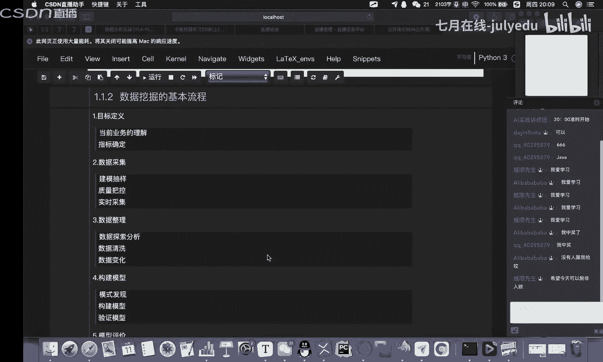

OK那么我们先回顾一下啊，或者说啊什么叫做数据挖掘。啊，什么叫做数据挖掘？其实这个呃概念啊啊有很多了，对吧？啊，看你怎么去理解。那么呃我理解的数据挖掘是什么呢？啊？其实就是一种泛化规律，对吧？

比如说我们从过去大量的数据当中去进行一些总结，那么总结出来某一些泛化的规律，那么这个规律呢可能有不同的这样的一个形态。比如说有呃类似于比如说什么假设函数，对吧？啊，可能是我们计算型的这样的一些模型。

比如说还可以什么从这个X啊到Y的一个映射啊，也可以是比如说是啊规则模型啊，我们比如说在这个机器学习集训营里面啊，会讲到这个什么数模型，对吧？啊，角色数啊等等。

那么我们为什么要来学习这样的一个数据挖掘这样的一门课程啊，其实呃大家应该也会发现啊，就是说现在对于数据这一块啊，企业的一个重视程度，啊，都会很高很高啊。

那么数据挖掘呢主要是呃比如说我们可以帮助企业去提取数据中嗯，它的一些呃商业价值，对吧？主要提高企业的一个竞争力。那么我们用这个数据挖掘能够完成什么样的一些呃事情啊，或者说它的一个任务有哪一些。

比如说我们可以完成一些什么分类呀啊预测呀，还有一些比如说像什么聚类分析呀啊关联规则呀，还有一些什么呃类似于什么偏差检测啊，智能推进啊推送啊等等啊这样的一些方法。啊，其实啊数据挖掘它本身是一种什么呢？

数据驱动的一个啊，你可以理解为是一个解决方案。那么所以在这个过程当中呢，我们要关注的点就相对来说就比较多了。那么像下面啊可能列出来123456啊，6个这样的一个呃大的一个框架。Okay。

那么呃除了说关注我们数据本身以外啊，那么呃其实我们还需要去关注，比如说数据的一些规律啊，数据的一些规律，还有它的一些模式啊，包括我们后面会呃这个关注这个模型这一块算法这一块啊。

包括模型的选择呀啊模型的调优啊啊等等。拿到我们解决方案后，哎，怎么去完成后续的这样的一个部署，还有什么呢？还有这个呃比如说监控啊，部署的一个监控，还有一个系统的维护等等。OK啊。

那么下面呢啊这我给大家列了一个大致的啊我们整个数据挖掘这一块的一个标准的一个基本的流程。OK啊，包括这个目标的定义，然后是数据的采集，数据的整理，包括啊模型的构建，对吧？然后呢这个模型的评价啊。

最后模型的发布。OK那么这里面又涉及到很多小的一些呃小的一些点啊，小的一些点。OK啊，这里面我们可以稍微的来扩展一下啊。比如说首先第一个哈我们目标的定义这一块，对吧？哎，我们定义我们挖掘的一个目标。

对吧？那么我们针对具体的数据挖掘这样的一个应用的一个需求。那么首先呢其实我们就需要去明确这个我们目标是什么，对吧？或者说我们明确本次的一个挖掘目标是什么？然后系统完成了以后呢。

哎能够达到什么样的一个效果。啊，这是我们需要去思考的对吧？那么因此呢我们必须去分析。比如说我们当前的一些应用的领域，对吧？比如说哎我应用中的各种的，比如说什么知识呀啊，还有一些应用的目标呀。

包括了解相关领域的一些情况，对吧？熟悉我们的一些啊比如说背景知识啊，对吧？或者说啊调研一些用户的需求，对吧？那么要想要充分的去发挥我们这个数据挖掘的一个价值呢，啊，必须对我们的目标。

要有一个非常清晰明确的定义，也就是什么？你想要干什么。啊，你一定要把这个先搞出来，到底想干什么，要不然你拿到一堆数据以后，可能你就呃无厘头啊，可能就不知道从哪儿下手啊。

那么首先啊你一定要先要有一个清晰明确的定义，然后呢。才知道下一步往哪走。那么呃举个例子哈，比如说以我们今晚的例子为例，对吧？我们今晚是讲一个电商企业的一个用户行为数据的一个挖掘。

OK啊那么其实我们就可以呃定义几个目标对吧？啊几个目标。比如说电商里面大家拿到这个数据以后啊，一般比如说我们要实现商品的什么智能推荐啊，智能推荐来帮助我们比如说呃这个这个几方共赢吧。

比如说哎客户能够快速的找到自己感性的兴趣，感兴趣的这样的一个商品，然后同时呢呃比如说这个这个这个也确保我们推荐给用户的这个商品，也是比如说企业所期望呃，比如说给到用户的。

那么实现比如说这个企业和用户之间的一个呃类似于双赢的这样的一个效果，OK那么还有什么呢？比如说我们还可以对用户来进行细分，对吧？我们了解不同的用户他们的一些比如说特征，对吧？

比如他们的消费特征啊购买特征啊O然后呢分析这些客户他的一个价值优先级，对吧？然后哪一些是需要重点关注的，那么对于不同的用户，我们可以采取不同的营销策略。对吧比如说他看了看了一个商品，然后比来比去，对吧？

哎，可能是因为价格问题，对吧？那我们就咔给他一张优惠券啊，那么呃这个方法有很多了啊有很多。那么我们可以呢将优先的这些资源集中到价值更大的这些用户上面，然后实现什么呢？比如说精准营销，对吧？

那么基于我们的还有什么呢？比如说历史数据啦啊，历史的一些销售情况啊，然后对商品来进行一些预测，对吧？那么这里面可能需要去注意的一些点，可能就是一些特殊的一些什么节假日啊啊等等啊，这些基本的一些内容。O。

然后还有什么？第二部分，比如说我们的数据采样这一块。那么数据采样哈基本上呃在我们明确了明确了我们需要进行数据挖掘的目标以后。那么接下来呢，我们就要从这个业务系统中哎抽出来啊。

或者说抽取一个跟我们目标挖掘相关的样本数据的呃字集。OK来做这样的一个呃数据采样啊，那么在这里面哈问大家一个问题啊啊，问大家一个问题。比如说我们要抽取数据，那么抽取数据的标准是什么？OK啊。

这里面有没有同学啊知道啊，比如说我们呃要从业务系统中去抽取一个啊跟我们目标挖掘相关的这个样本数据的一个子集，对吧？那么。我们抽取这个数据的标准。是什么呢？对吧？啊，它肯定是有一些标准，你不能说呃随便抽。

对吧？啊，随机的啊，那你得到的结果啊可能会相差会比较大啊，相差会比较大。OK啊，有同学知道的啊，可以呃在我们这个右侧的评论区啊来进行这个文字型的呃这个这个这个呃交流啊交流。OK啊，我重复一下对吧？啊。

问题是什么呢？对吧？我们把目标啊定义好了，对吧？要完成什么呢？啊，比如说要拿数据了，那么拿数据肯定是从我们当前的这个业务系统中面去抽，对吧？那么抽什么样的数据，他有没有一个标准。OK啊。

如果有知道的同学呢，可以在右侧的聊天对话框来进行交流啊？啊，其实这个标准呢我们在呃企业里面啊，它是有几点啊，我们需要去遵守的啊。那么这里面我给大家去讲一下哈。

那么首先第一个哈就是相关性啊相关性你出具的数据要跟你的目标啊要有一定的相关性。第二个呢。可靠性啊可靠性。第三个是有效性，而不是说我们拿一些全部的数据全部都拿过来，对吧？那么我们通过对这个样本数据的一个。

比如说精选啊，我们不仅能够减少数据的一个处理量啊，然后呢还可以帮助我们去节省我们的一个呃系统资源啊，系统资源。OK啊，这是我们在这个抽取数据的时候啊，需要去注意的一个地方啊，那么还有一个什么呢？

可靠性啊，可靠性就是说我们需要去嗯找规律性，更加呃，比如说凸显。这样的一些数据来进行采样，而且呢一定要严把这个质量关OK啊，不能忽视数据的一个质量。OK这是这个这个这个。抽取数据的一些标准啊标准。

OK那么再问大家一个问题哈，比如说我们对于数据的抽取这一块哈啊除了说我们的一个标准以外，那么还有什么呢？还有方式，对吧？哎，那么我们有什么样的一些抽取的方式呢？啊，有没有同学知道了啊。

知道了可以在右侧的聊天对话框啊来进行提问。😊，啊，或者说交流啊，也不能说提问了。啊，抽样的一个方式哈啊，其实这个也有很多种啊很多种。啊，可以说出一种、两种、三种、4种、5种。OK啊。

那么啊还是我来说吧啊，那么比如说哈我们常见的有哪一些，对吧？比如说随机的啊随机抽样，那么呃在我们呃采用随机抽样的方式这种情况的时候啊，那么数据集中的每一组观察值。那么啊都有可能被抽到啊。

都有可能被抽到啊，这是随机的。那么还有什么呢？比如说我们还可以用这个等距的抽样啊，比如说我们按照多少的比例来在嗯。😊，多少条数据里面啊，或者说在多少组这个数据里面来进行等距的一个抽样。

那么还有可能比如说分层，还有这个分类啊，还有一些，比如说什么按顺序来进行抽样啊，都行啊，都行啊，分层抽样。对啊，这个呃python啊tyle这个同学对吧？应该是对这方面是有一定的了解。OK啊。

那么呃这是第二部分啊，数据采集这一块对吧？那么还有什么呢？数据的一个嗯。其实这里面哈啊数据的一个整理这一块啊，应该是我们在数据挖掘里面啊比较核心的一块这样的一个内容啊。因为你数据处理的好坏。

会直接影响到你后续的一个结果啊，因为其实模型这一块呢呃差异化呢并不是特别大啊，模型化差异并不是特别大。那么像一般哈不管你是来打比赛呀，或者是在我们实际的一些呃落地的一些工业界啊场景里面，对吧？啊。

那么呃。其实更多的我们的工作啊是在做这样的一个数据整理这一块。那么数据整理这一块呢啊比如说我们有探索性的数据分析，对吧？数据的清洗，对吧？还有一些比如说数据的一些预处理啊等等这样的一些工作。

那么比如说哈数据的探索。那么我们为什么要来做这样的一个动作？对吧这里面其实就要反过头来去往前再推啊，那么我们前面所讲的哎数据取样对吧？那么多少呢多多少少啊，就是说你在取样的时候，不管是采用哪一种方式哈。

都会带着比如说哎我们如何去实现数据挖掘目标的鲜艳的认识来进行这样的一种探索。那么当我们去拿到了一个这样的一个样本集以后。它是否达到，比如说我们原来设想的一个要求，就样本中哈。

它并没有什么明显的这样的一些规律跟趋势啊。OK啊，没有这样的一些啊明显的规律跟缺失。啊，比如说哎这里面有没有出现过从没有你想到过的一种数据状态啊，属据之间哎，到底有没有一些相关性，对吧？啊。

他们可以区分成什么样的一种。比如说类别啊，这些呢其实都是我们在进行这个数据探索的时候要做的一些事情。那么对于抽样的一个样本数据呢来进行。比如说探索呀啊审核呀啊必要的一些加工处理OK啊。

这是都是我们最终来保证数据挖掘模型质量这一块非常非常重要的一个环节。啊，非常非常重要的一个环节。OK啊，然后后面比如说还有一些数据的预处理，对吧？那么数据的预处理这一块呢。主要比如说呃降维啊，对吧？

当我们采样数据维度过大的时候，哎，我们如何进行一些降维处理啊，包括唉我们采样的时候会发现有一些缺失值，对吧？那么缺失值处理的时候，对吧？怎么去办啊，你是填充还是直接把它给干掉，对吧？啊。

那么由于我们采样中啊啊，有很多很多的这样的一个噪声啊，会导致我们这个数据集可能不完整啊，甚至不一致的这样的一些呃情况，那么对我们数据挖掘所涉及到的数据对象OK啊，我们一定要对它进行什么呢？

预处理这样的一个动作。那么怎么去呃或者说如何对我们的数据来进行预处理啊，或者说改善我们数据的一个质量来达到。比如说哎我们最终想要的呃某一个结果。OK这个是需要大家在进行这个数据预处理的时候。

我们需要去思考的一个问题。啊，思考。那么呃这里面啊再跟大家去进行一些啊，比如说再问你们一个问题啊，那么比如说我们数据预处理吧啊，数据预处理包含哪一些这样的一个动作啊，有哪一些动作，对吧？

这里面啊大家可以在这个右侧聊聊天框啊来进行交流。就是说我们数据预处理这一块，对吧？唉，你常见了有哪一些啊常见有哪一些？嗯。比如说啊以我啊我日常中会用到什么呢？比如说啊首先从第一步开始啊，数据的一个筛选。

对吧？完事以后，数据的比如说转换啊，这里面可能涉及到一些数据类型的一些转换啊，变量的一些转换。然后呢，哎我们看一些缺失值对吧？来对缺失值来做一定的处理。然后对于比如说坏数据的一些处理。然后呢。

哎最后比如说把这个数据标准化啊等等。OK啊，就是对于数据这一块。那么呃大家如果呢想要对这一部分，就是说呃数据怎么去呃探索性的进行一些呃分析啊，怎么进行一些呃处理啊清洗啊等等啊这样的一些动作。

大家可以比如说啊看我们企业在线机极学习集训营。那么这里面呢会从零带大家去完成这个内容啊，包括像n呀pandas啊这样的一个呃基础的一个内容，包括可视化那么math啊啊等等啊。

来完成什么的数据分析这一块的呃内容OK啊那么。数据的整理OK了以后，那么往下来走啊，就建模了，对吧？啊，建模啊，那么可能很多人都觉得建模这块很重要啊，确实很重要啊，但是。

那如果说你是从事这样的一些数据挖掘呀啊，或者说呃。比如说这个这个偏工业界的一些东西，其实更多的是你的业务。更重要啊，比这个我觉得比这个呃模型本身哈啊要重要很多。

因为更多的你是需要去根据你的业务场景去解决问题的啊，因为模型哈，毕竟比如说啊不管是我们这个传统的这个啊监督无监督啊，还是一些新的一些东西啊，包括像现在的什么深度学习啊啊等等等等啊。

有很多很多层出不穷的算法出来啊，但是啊最终他们要做的事情啊，还是去解决这个问题OK啊，那么我们一定要去从问题本身去出发。那么这样可能会好很多。OK啊，那么我们回过来来讲这个呢构建。啊。

模型的一个数据建模这块啊，构建我们的一个模型，对吧？那么啊其实这个就比较简单了哈，就是说你需要去思考什么呢？哎，我数据挖掘应用中的一个问题，对吧？你到底要干啥啊，你是分类呀，还是聚类呀。

还是关联规则呀啊等等啊，选哪一个算法来进行模型的构建啊，这是也是属于我们数据挖掘里面比较核心的一个动作，对吧？你首先要把问题给搞清楚。然后呢，选哪一个模型算法，OK啊，这就是呢经验了啊。

这里面会涉及到一些经验。然后模型的一个评价。那么模型的评价呢，那么就相当于什么呀？哎，我选了某一个模型，或者说我在进行目标定义的时候，对吧？我就需要去定义标准，达到什么样的一个标准啊。

才符合这个这个这个呃才能OK对吧？那么这个时候你需要去设定什么呢？评价的标准啊，然后做一些比如说优化，对吧？你可以换模型啊，多模型的对比啊，也可以在模型本身来进行一些优化啊等等OK啊。

最后就是什么呃模型的一个呃发布啊啊上线呢，然后呢它的一些呃重构啊，也就是说它的一些维护。那么其实整个数据挖掘这一块呢啊呃更多的更多的是在一个反复探索的一个过程啊，因为我们在实际工业的一些场景啊。

不可能说哎你咔从头到尾搞一遍就完事了啊，可能我们会回过头来再到第二步或者再到第三步啊，再来反过头来来不断的来进行验证啊，反复的去探索这样的一个过程，对吧？哎。

我们怎么去帮助我们所在的这个企业从数据中去啊，比如说啊洞察商机啊，怎么去提取价值啊，这是目前所有企业都关心的啊，比如说像很多这个推荐方向的啊，这个工程师推荐方向的行业专家对吧？为什么那么值钱呢，对吧？

因为他带来了呃很大的价值啊，很大的价值OK那么同样啊我们数据挖掘这一块啊，一样能够为企业带来很大的一个价值。OK啊。😊，呃，那么基本哈它的一个流程这一块呢，我们就过完了，对吧？啊，过完了OK。OK啊。

那么呃其实流程掌握清楚了以后啊，其实大家主要就是呢比如说我们先把这个流程给梳理好了。其实后面的啊这些代码啊很多很多啊很多很多啊，但是呢从我个人来说，其实它并不是重点啊，那么呃代码这个东西呢。

其实呃可以说是固定的啊固定的啊，因为都是一些什么API的一些调用，对吧？那么更多的呢是我们要去掌握这里面的一个逻辑，对吧？哎，我知道怎么样的一个顺序来完成这样的一个内容，对吧？

然后每一个里面可能涉及到哪一些环节。然后呢啊碰到了这些问题以后，我该怎么去处理？OK啊，这是我们需要去思考的这样的一个问题。okK啊，这个这轮okK了，对吧？啊，okK了，那么我们往下来走啊，往下来走。

😊，也就是我们这个项目的一个背景啊，项目的背景。OK然后我们来进入到这样的一个呃项目这一块啊，项目这一块啊，那么项目这一块呢，其实呃它也是根据我们刚才啊我们刚才在过这个呃整个数据挖掘它的一个。

流程的时候啊，基本上呢把我们整个项目这一块的一个整个的流程也就过完了。那么接下来呢无非就是按照上面的流程来做一些细节性的一些呃内容啊，来做细节性的一些内容。OK啊。

那么前面对吧我们的餐前甜点已经做完了啊。那么接下来啊我们进入到我们的一个。主菜的环节。OK啊，那么通过我们实际的电商数据来做数据的分析和挖掘。那么首先哈第一个哈我们先要去了解一下我们当前的一些背景啊。

其实电商这个我们都很熟了哈啊，我们网上购物现在是越来越流行，对吧？那么人们对于这个购物的这种需求呢啊，同样哈也是变得越来越高啊，而且会遇到什么问题啊，有很多这个比如说哎网上上的商品千千万万，对吧？

那么对于我们用户来讲。😊，哎，很好的东西就是推荐算法。给我们带来很好的用户体验，对不对？哎，我们可以使用推荐算法来做一些什么精准营销啊，比如说让这个什么呃呃这个这个头条啊。

还有什么京东啊啊淘宝啊啊等等啊，这样的一些平台得到了呃更大的这样的一些啊发展的一些机遇，对吧？啊，但是呢呃同样哈竞争也很激烈。那么在这种啊，比如说电商平台激烈竞争的一个大背景下面，哎。

我们怎么去呃比如说呃除了说提高商品的质量以外啊，或者说降低商品的价格以外啊，或者说我们平台本身以外啊，那么我们需要去掌握用户的行为来实现什么呢？精准营销啊，实现精准营销，提高效率。那么对于电商企业而言。

对吧？那么我们数据挖掘的一个基本的任务呢？其实哎就从这个电商企业里面，比如说哎我们采集各种商品的一个销量，对吧？啊，比如说呃啊。这些销量信息呀，还有什么成本单价呀啊还有一些比如说呃。

其他同行的一些数据啊等等等等。然后呢，利用我们数据分析的这样的一个手段来实现什么呢？商品的一个呃精准推荐啊，然后呢达到比如说啊促销啊啊，或者说呃这个这个这个呃精准营销，对吧？啊，增加我们的营运能力啊。

为我们的电商企业来降低整个的一个运营成本啊，提供这样的一些啊智能的一些服务支持。OK啊，这是我们项目的一个背景啊，那么这个项目呢，其实主要就是围绕着我们的用户的一个行为，对吧？那么就用户来说啊。

我们就把自己当成一个用户。你在电商这个平台上你会干嘛呢啊，你会干嘛呢？啊，无非就是点开APP吧？点点击对吧？然后看中自己比较喜欢的干嘛呢啊，要么就咔直接支付了对吧，要么有的人有的人想想哎尽管是双十一。

对吧？我等一等啊，我先把它给他么收藏了啊，等到双十一的时候再买啊，然后呢，还有呢，比如说先加入到购物车啊，然后呢呃找我的另一半啊，帮我清一清购物车，对不对啊，就这些行为啊，那么除了这些呢啊。

还有其他的啊，但是我们主要就围绕着啊，这几种，比如说点击啊收藏啊加购物车支付啊。😊，这是4种行为。OK啊，那么我们往下来走。那么这里面啊我们首先啊要来确定我们挖掘的目标啊，挖掘的目标。

那么我们就先来对这个目标来进行分析一下，对吧？那么这个数据呢啊到时候也会给到大家啊，代码也会给到大家。对吧我们先拿到我们user点CSV啊这样的一个文件，对吧？哎，读了一下啊，通过什么呢？

paasok啊paas。斯来读取一下数据，然后我们看一下这个数据的一些基本的一些概况啊，你可以通过head呀啊infer啊啊，还有什么啊discriptO啊。

都可以去查看一些我们这个数据的一些基本的情况。OK那么我们查看完这个数据了以后，对吧？那么在这里面我们可以啊大致的给他去做一些总结，对吧？我们整个数据一共有多少条呢？啊，可以看一下对吧？

一共有呃2000多万啊，2000多万条数据还可以对吧啊，还可以中等数据量啊，中等数据。如如果说再加个零对吧？那么跟我们实际在呃头部电商企业，它的数据量基本上都一样了啊，差不多了，对吧？那么这个呃。

在我们学习过程当中，这个数据量啊算很大了。算不错了啊，O那么还有什么哪一些数据呢？对吧？我们看一下它的一个。呃，这个这个呃有什么user ID对吧？有ite ID啊，有什么用户的ID对吧？还有什么呢？

商品的ID啊，那么其实每个数量啊，这里面都可以去做一些统计啊，就是说哎有多少个用户，对吧？有多少个商品啊，包括这个什么呢？哎用户的一个行为啊，但是用户行为这一块，你一看一2。应该是什么呢？

脱敏以后的结果。对吧啊，我们刚才说是吧，有点击啊，有这个这个这个呃收藏啊啊购买啊OK他应该是把这些行为啊换成我们的一个数字啊来进行一个通明，对吧？那么还有什么呢？比如说。这个地理位置啊。

这里面就很多啊发现什么呢？NAN是不空数据了啊，有空数据对吧？啊，一会我们怎么去办，然后还有什么呢？我们这个啊商品的类目，对吧？哎，它属于哪一个商品对吧？手机呀啊，还有什么其他的呀等等。

那么还有他的一个什么时间啊时间OK完事了以后，对吧？我们对这样的一个数据呢，有了一个基本的认识了以后，那么我们就哎哎想对吧？哎我们今晚到底要干什么呢？啊，根据我们现在已有的数据啊。

我们要来定一个目标目标就是什么呢？我要预测下一个时间日期，我们用户对这个商品子集的一个什么比如说购买情况啊，或者说购买的数据啊，来做这样的一个预测啊，来做这样的一个预测。啊，这是我们的一个任务，对吧？

那么哎我怎么判断你这个任务到底完成的好或者是不好呢？对吧？啊，这里面就有评价评估的一个标准啊，那么像上面啊，我们在做任务的时候啊，其实呃需要去做什么呢？啊，划定问题啊，划定问题。

那么需要去知道我们最终的目标是什么？也就是说哎我知道是什么样的一个问题，怎么去解决，哎，达到什么样的一个效果。OK啊，这是你在公司里面存在的一个价值啊存在价值照你进去就是让你去解决问题的对吧？

那所以我们一定要知道哎最终的目标是什么啊，预测下一个时间日期，用户对商品子己的购买情况，对吧？那么我们就可以把这个预测，比如说哎，你可以抛开来看预测问题，我是不是可以看成一个是二分类的问题，对吧？啊。

要么就是买要么就是买不买。就完事了，对吧？搞定，然后我们确定一下样本力度，对吧？比如说我们的user ID啊，艾 ID啊，然后呢我们呃再来选择模型的时候，对吧？啊，比如说我们可以选一些常规的对吧？

逻辑回归啊，GDBT啊，我们今天晚上里面啊用的就是比较常规的。那么后面你可以在这个基础上来进行扩展。那我们可以抽一个模型，对吧？啊，但是呢也别让这个训练的过程太慢了，对吧？

那么如果太慢了呢啊会影响到你的一个工作效率。OK啊。然后标准这一块呢哈，我们就选择F1啊F1啊F1呢，其实就是我们综合考虑。比如说哎通过什么呢精确率和召回率的一个什么标准啊，标准。

这上面是什么呀计算公式啊，计算公式。那么所以说我们要想去获得一个比较好的F1。那么需要去平衡我们比如说推荐的条数还有我们准确率之间的一个什么关系。那么我们用户行为分析呢。

就是可以让哎比如说我们的产品更加的详细清楚的了解到我们用户的行为习惯，对吧？那么了解了以后，是不是我们就可以从哎比如说什么网站呀app呀啊，还有一些其他的一些什么推广渠道啊，等等等等啊，这个啊各种产品。

里面比如说呃存在的一些啊比如说问题啊等等啊，这样呢都可以嘛帮助我们的产品来发掘。比如说怎么去转化，对吧？啊，把我们的页面搞漂亮一点啦，对吧？啊，让这个产品的一些营销对吧？更加的精准有效啊。

提高我们的一个业务转化率OK那这是我们要去做的。OK啊，往下来走。啊，其实呢呃对于这样的一个预测呢啊，其实准确来说啊，你可以往推荐方向去靠啊，往推荐方向去靠啊。但是对于推荐算法这个工程领域啊。

其实我个人的一个理解啊，它的业务程度啊。非常重要啊，超过什么模型算法本身。那么所以说除了我们这个算法本身以外啊，我们需要去关注其他的一些内容啊，比如说这里面我们就涉及到很多的一些业务方面的一些内容啊。

比如说啊像这个用户行为的一些啊分析模型啊啊，对吧？有哪一些啊啊，包括啊可能还会用到什么呢？比如说我们运营里面的，用的什么AR这样的一个模型啊，也有可能会用到。OK啊，那么往下来走啊。

那么数据的采集和整理，这个就比较简单了哈。那么采集这一块呢，我们刚才基本上已经啊因为是现成的数据集嘛，O那么这里面其实我们采集，就嗯不需要去采集了啊，我们直接拿来用就OK了啊。

那么如果说我们自己没有数据，那该怎么办呢？你可以使用一些方法啊，比如说我可以使用爬重啊，但然这个呢啊大家一定要在合理的范围啊，合法的范围啊来进行使用。那么还有一些比如说我去一些公共平台自己去拿对吧？啊。

或者说你可以花钱去一些呃平台去啊进行一些购买啊，等等O啊方法有很多。😊，OK那么我们数据有了以后，对吧？我需要对这个数据呢来进行一些处理啊啊来进行一些处理。那么啊其实呢也就是说啊观察我们这个数据。

就像我们刚才在做这个数据预处理呀啊，包括探索性的数据分析，这样的一个过程里面啊，其实就是放在这个里，对吧？那么在这里面啊我们看到这个数据了以后，对吧？我们通过什么呢？啊infer这样的一个函数，对吧？

来看一下我这里面数据的一些基本的情况，它的一些类型等等啊，那么可以看到啊，我们这里面有一个什么呢？啊，有一个我们的一个。地理位置这样的一个字段，对吧？它的类型是吧？object。

对吧那么其实这个呢啊我们呃用用处不是很大啊，像这个呢一般啊我们就不怎么去用它。因为大多数哈就是说在我们企业里面啊，他都是做了一些加密的处理。啊，而且大多数都是买空啊空的啊，你根本就无法用。

所以说哎像这个啊我们就可以把它什么呢直接干掉啊，没用的东西干掉。那么干掉的时候呢，我们可以用呢jo这样一个函数，对吧？啊，把它直接干掉，对吧？我们轴啊设置为啊我们的这个这个一对吧？

也就是什么纵向的啊纵向。OK完了事以后我们来验证一下是吧？哎，跟上面来进行一个什么呢？对比啊，是不是我们这列啊地理位置这列就已经被干掉了啊，干掉了。然后呢，我们再来看机看一下，哎。

有没有什么呀缺失值对吧？有没有缺失值啊，一看哇塞，真的一个都没有，对吧？这个实际上是不存在的啊，就是说实际企业里面啊，我们多少啊，会有这种呃这个这个这个这个数据的一个怎么说呢？异常啊，异常啊。

不可能说这么完美啊，这个因为是某一个比赛的一个数据，对吧？啊，它是做过处理啊，所以说我们拿到以后是比较OK的。结果显示没有缺失值。OK那么在这里面啊问大家一个问题啊，问题又来了，对吧？

那么当我们的数据有缺失值的时候，哎，我们该怎么去处理这样的一个问题？其实我刚才在上面的时候有讲过啊有讲过怎么去处理呢？啊，可能呃常用的啊两种对吧？比如说我们要么把它给什么干掉啊，要么就什么填充啊填充啊。

其实第二个问题也随之而来，对吧？哎，你怎么干掉，对吧？你干掉的标准是什么啊，一般啊不能超过百分之啊，我们是10%啊，超过10%的话，就需要去做一些呃填充的一些处理啊。

但是一般哈我们正常哈都是需要去做填充的，你直接删除，可能呃会对后面的有一些影响啊，但是啊这个也不是绝对的，像刚才对吧定理位置，这个里面大部分都是空的对吧？啊，或者说一些加密的一些数据。

我们拿到其实也没用啊，所以说呢这个呢我们可以直接把它给干掉。那么还有第二个啊填充对吧？那么填充的方式又有哪一些对吧？啊，这里面有很多了，比如说有什么均值啊方差呀啊，前后左右的一些什么参考值啊啊等等OK。

Yeah。嗯，OK啊那么当然哈啊这里面所涉及到的一些啊知识啊，比如说啊这个n派的一些知识啊，pandas的一些知识啊，OK啊，如果呃比如说怎么去分组，对吧？怎么去合并啊，这样的一些基本的一些操作的时候。

OK啊，大家可以关注企约在线机器学习集训。OK那么这个课呢我们已经推到16期了啊，那么整个课程的体系呢呃非常完善。那么细节部分呢OK啊。跟我们的学员啊有深度的匹配啊，很到位。

那么大家呢有兴趣哈可以到企月在线官网啊，搂一眼啊，搂一眼。我们企月在线呢继续学习集训营课程。OK往下再来走，对吧？那么没有确失值，我们就啊不要处理它了啊，那么往下来走，对吧？啊，来呃，比如说做一些去重。

对吧？那么下面都是些统计了啊，count这样一个函数来做统计来做分组，对吧？我们对于什么 ID对吧？我们用户的ID来统计一下，对吧？还有什么呢？比如说我们对于这个ite ID啊来做这样的一个。

去重这样的一个操作，对吧？哎，我们来做统计完了以后啊，那么我们基本上大概对这里面，比如说哎到底有多少个我们的用户是不是2万个用户对吧？然后呢，有多少个商品，对吧？然后这里面你可以看到有40075万对吧？

啊，有很多很多OK那么往下来走是吧？也就是说我们刚才对于我们的一个用户行为这一块啊，它这里面其实是用1234啊来表示的对吧？那么我们可以把这1234呢赋予实际的一个值啊，实际值。

比如说它到底是干什么的对吧？啊，到底是干什么的啊，比如说有点击啊，比如说这个啊PB我们就把它当成点击了，对吧？

然后这个是当成我们的一个比如说啊收藏购物车啊购买这样的一个动作OK然后呢用这个什么logo进行一个什么值的一个替换啊，替换完了以后是吧？我们在下面可以。通过head啊来看一下。

其实我们这一列下面所对应的这样的一个值呢，就已经被什么替换掉啊，替换掉。OK啊，那么做了一些处理了以后啊，其实这里面啊大家在做替换的时候，除了这个呢local啊，还有什么Iloc啊。

像最早的时候还有什么IX啊，但是这个呃已经被呃废弃了，对吧？我们现在用这个loal啊会更多一些啊更多一些。那么往下来走是吧？我们就再来分析什么呢？我们的一个时间这一块，对吧？

那么大家可以看到我们的时间这一块上面啊是一个什么time，对吧？那么这里面有年月日啊，有年月日，那么我们想要把这个呃给它分开啊，分开分成什么呢？时间日期和什么呢？星期对吧？那该怎么办呢？啊。

下面啊做了一些呃不是这样的一个操作，我们先对它来进行切分，对吧？啊，先对我们time。这样的一个呃特征来做什么呀？切分。那么切切分完了以后啊，我们再来做什么呀？新的这样的一个列，对吧？我么分成了三列啊。

有d有time有 weekO完事了以后啊，你会看到下面会啊出现这三个，也就是把我们刚才的一个time啊，切分成三个部分。那么为什么要来进行这样的一个切分呢？

那么主要哈啊是呃为了便于我们通过时间的维度来进行什么呢，来进行分析，对吧？哎，比如说呃它是哪一天的对吧？啊，它是呃星期几的对吧啊，具体的时间啊是几点对吧？这样呢分析起来会更加的准确。嗯。

OK那么往下来走，就是我们数据分析啊跟这样的一个展示的一个部分啊，其实这一块呢呃。嗯，怎么说呢？啊，我先问大家一个问题吧那么比如说就在我们电商这个领域里面。啊。

电商这个领域里面大家知道哈呃或者说其他领域也可以哈啊知道哪一些用户行为的分析。哎，比如说哎你拿到这些数据了以后，这些用户行为啊，你已经知道啊，比如说有点击对吧？有加购物车啊。

还有什么购买啊这样的一些行为，对吧？哎，你怎么来对这样的一些行为来进行分析呢？对吧啊这里面其实啊需要有一有一些业务背景啊，如果说你不是在电商行业里面可能稍微有一点不一样啊，稍微有一点不一样。

但是啊大体的逻辑还是一样，主要还是根据我们的业务啊，根据业务来。OK啊，那么这里面。😊，嗯。OK有知道的同学可以在这里面啊。😊，交流一下哈，就是说我们嗯有哪一些。

比如说你在你的工作当中对于用户行为分析这一块，嗯，你有哪些分析的方法？🎼比如说啊我们啊今天讲的这个哎，就是买。嗯，比如说用户的行为分析对吧？那么还有什么呢？还有一些呃，比如说行为的事件分析，还有什么。

比如说什么用户的留存呢啊，还有比如说什么转化分析啊啊等等，对吧？那么后面呢其实我们在这里面都会有讲到啊都会有讲到。那么这里面我们也看到哈，我们一共有4块啊，分4块来讲啊。第一个是什么呢？

我们用户的流量分析。流量分析。然后第二个呢是我们用户的消费行为分析。第三个呢是我们商品销售情况分析。然后第四，我们用户的价值分析。OK啊，通过这4个啊这四个啊，其实这里面每个里面又有细分的一些东西了啊。

又有细分的一些东西。比如说啊第一个我们电商的用户流量这一块，那么流量这一块，比如说哎我们是按照什么样的一个时间段，对吧？比如说我们按照月我们用户一个月的PV和UV对吧？啊，或者说我们按照天N对吧？

一个月内每一天的PV和UV是是这个是我们需要去分析的。对吧啊这里面就列了一些对吧？啊，比如说用户一个月的啊，还有什么用户每一天的啊每一天的这样的一个数据。啊，做一个什么统计。OK啊。

统计那么统计完了以后啊，这里面呃生成了一张图啊，那么这个图呢是拿这个mspl label啊画的。那么这里面哈除了说。呃，我们用这个 label啊，你也可以用什么？

比如啊都可以啊来完成这种可视化啊工具有很多O啊那么呃通过这张图完事了以后啊，会得到一个什么呢？啊，得到一个结果啊你会发现有一个峰值，对吧？其他的其实差异性并不它并不太大啊。

这有一个峰值那那么可以看到它所对应的日期啊，日期啊，这里面呃我这是黑色的背景啊啊，可能看的不太清楚啊，而且这个数字有点重叠啊，到时候可以把它斜过来啊，把这个数字啊换一个角度啊写一下。

那么呃其实结果呢是什么呢？这一天啊这一天所对应结果是12月12号啊，12月12号啊，刚好这天有一个活动对吧？双2那么它所对应的PV和UV增加的幅度会比较大。😊，OK然后呢哎过了几天以后又慢慢恢复正常啊。

说明这次活动怎么样，非常成功，对不对啊？引流的效果很棒。嗯。那么呃还有什么呢？还有我们这个啊往下去翻啊往下去翻。比如说什么独立的一个访问量啊，独立的访问量。OK啊。

也就是说我们可以呃对他们进行PV跟UV来进行什么呢？独立的一些分析啊，独立的一些分析。那么往下来走啊往下来走。那么独立的分析这一块呢啊就啊。

针对于每一块吧啊每一块啊它的1个PV还有它的一个嘛UV啊来进行这样的一个内容啊，或者说我们可以针对什么总体啊总体。比如说哎我们整体的一个分析，我们统计什么呢？某一个时间内它的一个总访问量。

比如说一个月的对吧啊，一个月的OK啊，然后呢它的日均呢访问量啊是多少或者说呢我们以这个呢日期为维度对吧？来进行统计啊，或者说我们还可以什么来进行比较，对吧？哎我的一个日增长率是多少啊，给它算出来啊。

算出来，那么同样UV也是一样的啊，UV跟这个啊PV啊算法或者说它的流程上是一模一样的啊，一模一样，对吧啊它的日增长率。然后最后呢啊可能会比如说我们可以画一些图是吧？让它更清晰的展示出来啊。

更清晰的展示出来。那么第二个呢就是这个用户的消费行为这一块啊，那么用户的消费行为啊，这里面我列了几个哈，比如说从这个时间维度来分析我们这个用户消费行为的习惯呀啊，用户行为的转化分析啊。

包括它的一个复购率啊，还有一些什么呀啊它的一个购买跟不购买的一个路径分析，对吧？OK啊，通过这几个方法。OK来完成什么呢？用户消费行为的一个分析。OK那么往下来走啊，其实都一样的啊，通过这几个维度啊。

通过这几个维度，也就是说我们四种行为嘛，对吧？啊，这个呃点击加入购物车对吧？收藏购买啊，就这么四种四种啊，它的PV它的UV啊，它的啊这个这个这个啊通过这个这个一个可视化对吧？来展示一下啊，展示一下。

其实通过这个结果呢，我们其实。大概的可以呢样看得出来啊，他。它是什么样子的啊，它是什么样子的对吧？啊？比如说我们X轴对吧？是我们的一个这个这个这个时间，对吧？那么Y轴是我们的一个公因数。

那么我们用户在一天当中，比如说它的一个呃逛电商时间，哎，习惯是啥时候，对吧？啊，包括他自身的一个呃休息时间，你可以分析一下，基本上是重叠的啊，你看到这个波浪线，它的一个呃比如说它的走向啊。

基本上形状是一样的啊，那么其实这个就可以证明什么呢哎。每一个人对吧？一天当中逛街商的时间习惯跟他自身的休息啊，或者说呃。呃，这个这个休息时间啊是基本上是一致的。那么哪一个时间段可能会比较多呢？啊。

往上走呢？可能哎比如说上午对吧啊，这个这个呃往这走是么大九点的时候对吧啊，十这个前面啊，这个一直比较高，一直到到到这对吧啊，到这儿啊，可能这个是1617或者18啊，19对吧？啊。

七八点钟这个人数是比较多的啊，非常活跃，那么对应的值可能是15000也就或者16000。啊，1万0左右，那么往下面再往前面来走啊，可能哎到了7点啊，7点以后啊，到这个比如说10点钟这个人数是最多的。

是不是它的峰值是最高的对吧？那么证明这个时候呢，我们的用户是最活跃的对吧？那么这个时间段也是我们购物的什么黄金时间段，然后呢，往后走可能就慢慢的啊成下降的一个趋势。然后呢，再到第二天。

比如说哎5点钟慢慢的再往前啊，在逐步的一个上升，对吧？那么那么我们既然知道了一个用户的一个，比如说哎时间的一个匹配程度，对吧？那么我们就可以利用用户的空闲时间来进行营销了。啊，来进行营销，对吧？哎。

提高这个用户的一个购买率。对吧？比如说哎我在呃中午饭的时间跟晚上，比如说7点到11点的时候啊，来做一些什么呃，比如说大范围的一些呃什么什么优惠呀啊，或者说做一些其他的一些策略啊等等。啊。

那么下面是对于什么UV的啊UV的一个。情况对吧？那么这个是按照什么星期了，对吧？这是按照什么星期weake啊，weake来进行这样的一个分析。那么可以分析一下，哎，什么时候最高呢啊，可能是呃周几啊。嗯。

周末跟平时它的一个UV数其实变化没有那么大啊没有那么大啊，基本上差不多那么购买人数在呃周五啊，周四啊，周四啊时候可能会呃。比较比较多啊比较多OK啊，那么可能的原因啊，比如说我们可以猜测一下，对吧？

双十二当天做活动对吧？啊，增加了这个购买的人数，其他都是什样差不多的啊差不多。那么往下来走，对我们用户的一些行为的一些呃转化分析。对吧？那么这个转化这一块呢呃无非就是什么这样几个对吧？

我们当我们用户浏览了这个商品的一些页面，对吧？那么你可以直接购买啊，你也可以加入购物车啊，你也可以收藏，然后再购买，对吧？那么我们用户收藏跟加入购物车以后，其实。这个呢它并没有必然的一个联系。

对吧也就是它不存在什么上下级啊啊这样的一个关系。那么所以说OK那么这里呢我们不能说啊单一的做一些什么转化的一些漏斗，对吧？那么啊一般哈我们在这里面啊，对于这个呃漏斗图的一个画，我们一般都是么画PV啊。

到其他三种行为转化率的一个漏斗，对吧？那么这下面啊，比如说啊往下来走啊，是画了一个总体的一个漏斗图啊，总体的一个漏斗图，OK啊也就是我们PV到其他三种行为的一个什么漏斗图。OK用户行为总体的漏斗图。

那么通过这个图。能够发现一个问题。啊，发现个问题。比如说哎我从用户的一个点击到购物车到收藏，还是到购买，它的转化率其实什么都是偏低的啊，偏低的啊其中我们点击转化成为比如说购买的转化率是最低的对吧？

比如说哎这个什么1。06OK很低了啊很低。那么这里面啊有计算公式啊，计算公式在这里面啊。在这里面OK大家可以吗呃大致的去呢算一下啊，大致的去算一下。也就是我们比如说啊下单的总数除上1个PV对吧？啊。

其实就得到这样的一个结果。O。嗯，那么还有一些什么呢？比如说我们呃。这个这个这个PV你怎么去算啊啊，这里面啊，如果说电商的大家应该都清楚一些啊，都清楚啊。比如说呃首页的点击对吧？然后呢。

首页商品页面的点击，然后通过这个搜索商品页面的点击啊，基本上呃等于他们几者的一个和啊，记者的一个核。那么往下来走啊，就是呢UV这一块了啊，基本上跟上面的。呃，步骤呢是一样的啊一样的啊。

那么啊你也可以通过一些啊比如说漏斗图啊来完成这样的一个动作，那么往下来走，对吧？OK啊，比如说通过一些啊换了一个啊职肪图或者条件图啊来展示一下我们四种行为，各自的一个什么呀UV啊UV的一个情况，对吧？

那么在这里面呃展示出来的一个结果啊，结果，也就是说嗯我们一个月这个月里面啊有访问记录的，比如说这种呃独立的啊独立的人群啊，可能有呃1万。9999对吧？那么呃你可以算一下它的一个什么啊购买的一个转化率。

那购买是多少呢？这个by是什么？1764除上一个什么呢？这个这个这个19199999啊等于多少？对吧？那么其实说明什么？大多数人其实都都是愿意付费的啊，对平台的一个什么忠诚度哎蛮高的。

有很大的一个成长空间。OK啊。😊，我现在走什么？比如说我们的什么复购率对吧？按月啊，一个月以内购买次数，比如说超过一次的，那么这样的一个用户，我就算上啊就给他算上。还有什么呢？它的一些路径的一些分析。

那么路径的分析呢啊无非啊就这么几种啊，下面我写了几个啊，比如说这个呃点击到购买，点击，然后呢加购物车，然后到购买，然后点击收藏，然后到购买啊，最后啊点击加购物车收藏，然后到购买。OK啊。

其实这里面啊大家也可以呢画个图来进行什么呢？这个这个这个。这个。展示一下啊展示一下。那么最后呢就是我们商品的一些什么销售情况的一个分析啊，销售情况的分析。那么啊其实这里面哈，比如说我们销售的总数啊。

包括什么销售两次以上的商品的一些数量啊，包括什么前十的这些商品。啊，等等OK啊，那么呃分析完了以后啊，分析完了以后，其实我们可以总结出什么呢？哎，我们总共销售了多少个商品，对吧？哎。

有多少个商品销售的是什么呀？啊，比如说两次以上的，然后它的一个占比的一个情况，对吧？还有什么前十的一个商品啊，有哪一些对吧？然后呢，唉一看。结果啊是是啥？对吧？那么呃我们通过这个结果能够做一些。

比如说什么通过什么啊这些啊好卖的对吧？多备一点库存啊啊等等啊，来优化我们整体的一个运营的成本。然后最后什么呢我们这个用户的一个价值这一块啊，那么这里面啊我是做了一个弄图对吧啊。

帮大家去呃更清楚的啊来嗯看看到我们用户价值啊，这一块的一些基本的一些情况啊，基本的一些情况。

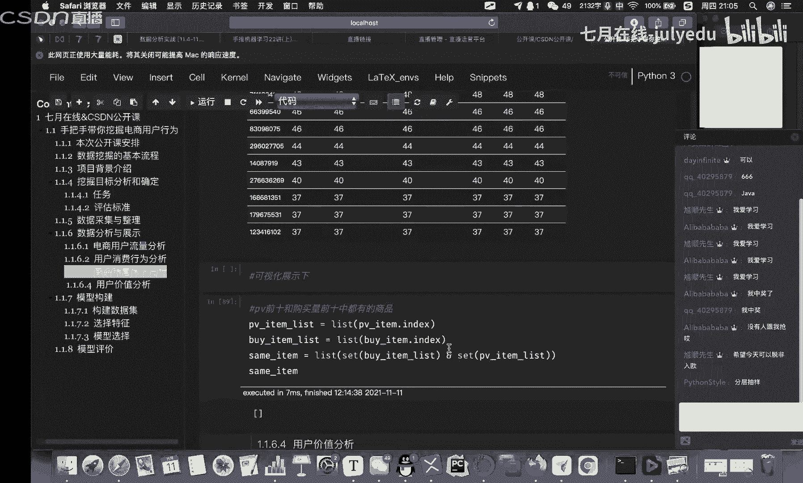

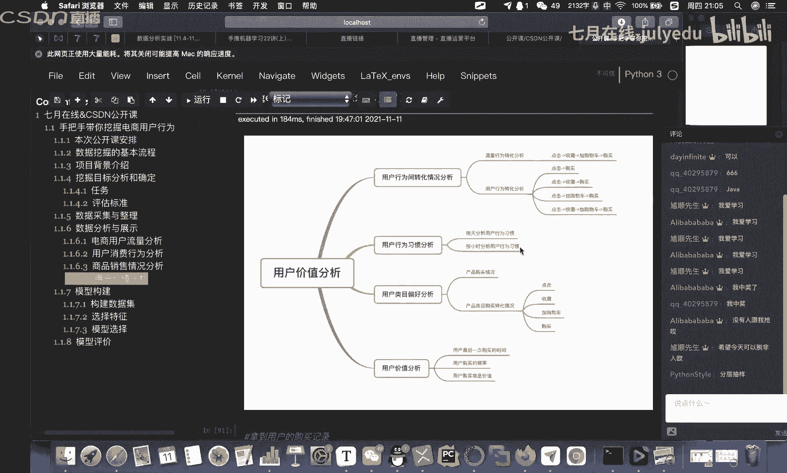

那么往下来走哈，就是就说什么呢？就是说在这里面哈，其实我们更多的应该去关注我们整个的一个什么呀业务层面啊，业务层面。然后从这个不管是用户行为间的一些转化分析哈，还是用户行为的习惯分析啊。

包括我们的内容偏好，还有什么用户价值这一块，对吧？啊，比如说我们现在讲到用户价值，用户价值，你就会你可以把它什么，我这里面是进行了什么分类，对吧？啊，来进行分类。那么分成哪几类呢啊，往下面来走啊。

那这几类。比如说我们是保留用户还是什么呀保持用户还是发展用户还是什么呀价值用户啊，给它划分这几个标签啊，这几个标签，那么这几个标签啊，你可以去按照你的实际需求来进行什么定义。比如说有价值的对吧？啊。

最近有购买，而且购买次数很多，那么这个时候我又可以给他设计什么呢？比如说VIP服务啊，专享服务绿色通道。那那么像这个。

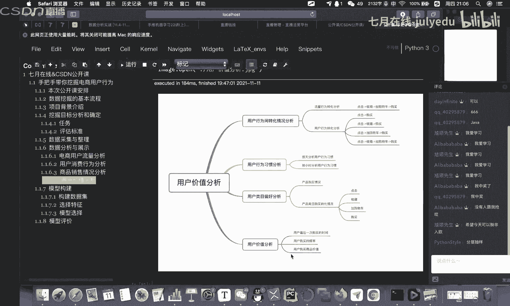

发展用户呢对吧？最近有购买，但是呢比如说哎他买的次数比较少，说明有提升的空间，对吧？那么这个时候我就需要什么制定一些啊策略啊，比如说与他上一次购买，比如说相关的一些商品啊，对吧？

通过一些其他的策略来提升购买的一个品次啊等等，其他的啊一样的啊一样。OK啊，那么整个的分析过程呢啊基本上啊。大概就这么多啊大概就这么多。那么其实分析完了以后啊，我们在这里面其实一定要生成一个结论啊。

结论。那么也就是说你分析完了以后，对吧？你有了这些数据分析了以后哎。你对整个的这个数据这一块有了一定的了解啊，一定要给它落到纸面上来啊，落到纸面上来。比如说哎我们逛这个电商平台的时候，对吧？哎。

它跟我们的作息时间是保持一致的对吧？包括我们用户的一些购买路径，对吧？包括我们用户的啊，或者说呃活跃用户的一些占比啊，包括啊我们的一些什么啊复购啊，还有一些什么转化率啊等等。OK啊。

那么根据我们这样的一系列的这样的一些结果啊，我们尽可能去提高。比如说首页，比如说什么个性化推荐啊，它的一些什么准确度啊啊，降低我们的一些跳失率啊等等。那么来引导我们的用户啊。

比如说对商品的一个啊收藏啊架购啊啊，鼓励用户去收藏架购啊，然后呢最后达成满成交OK。过呢这部分内容啊讲的时间会有点长，对吧？OK啊我们啊这部分主要是对于数据的一些呃处理这块啊。

它的一些内容主要是我们通过什么一系列的一些操作来对我们已经拿到的这样的一个数据呢来做一些有针对性的一些了解。OK啊，其实嗯。😊，整个这个。嗯，数据分析这一块哈嗯是数据挖掘理念啊，应该来说你以后从事工作。

可能这部分所占用的时间是最多的。那么像后面啊，比如说模型的选择呀、构建哪啊跳征这一块啊。嗯，也很多啊，特征这一块也会占用很多的时间啊，像这个模型的选择，包括模型的构建这一块，什么训练啊。

这块其实时间并不多啊并不多。OK那么呃这部分完事了以后啊，我们赶紧往下来走啊，还有什么呀模型的一个。构件啊，还有什么呢？这个模型的评价两个部分啊，其实这两个部分就比较简单一些了啊，可能嗯。

比如说啊第一个啊我们来完成什么呢？模型的构建分三个部分，对吧？啊，怎么去构建数据集，对吧？数据集有了以后怎么去选特征，对吧？然后呢，怎么去来选模型。😊，那么首先第一个啊，怎么去构建数据集？

那这里面啊问大家一个问题啊，这个问题就比较简单了啊。比如说啊我们对于一个数据集，对吧？我想要把它进行一些划分，对吧？啊，一般啊可以分成哪几种啊，这个是很简单的。OK啊。

有知道的同学可以在右侧对话框来进行这个这个这个啊交流啊。OK然后刚才刚才就是说发的那几轮奖品哈，如果有中到的同学啊啊可以加这个右上角啊，右上角啊，我们这个杨老师的微信。

然后呢找他去来进行这个奖品的领取啊，像这个呃实体书啊啊或者说这个呃课程啊，可以直接找杨老师来领取啊，一会儿就像这个课件哈，都是一样的啊。OK啊，都可以找杨老师来进行领取。

OK那么这里面啊我我简单说一下哈，就是呃这个东西比较简单哈，就是数据集的划分这一块呢一般啊可以分成三个，对吧？我们的训练集测试集还有什么验证集啊，三个部啊，三个部OK那么呃数据集完事了以后啊。

也就是呢你怎么去进行它的一个划分，对吧？啊，按照什么样的一个比例啊，一般哈我们像这个这个这个这个训练集跟测试集，一般都是82比啊，82比来完成这样的个内容。OK然后呢完事以后，数据集你划分好了以后。

对吧？那么接下来就进行什么呢？比如说啊我们的一个呃特征的一个选择。😊，啊，特征的一个选择对吧？那么特征选择这一块呢啊，我给大家又列了一些，对吧？比如说我们可以通过很多种方式啊。

比如说我们呃基于什么统计类的特征，还可以什么呀？基于类比类的特征啊，笔值类的这样的一个特征，还有什么呢？比如说啊下面还有什么？基于我们的用户品牌的特征。OK这里面同样都要进行什么呀分析。

然后呢进行什么呀对比啊，来进行分析对比OK啊，下面其实就是把这些我们的内容给大翻译一遍啊，用。代码的方式给他翻译一遍。那么呃这个呢啊代码到时候呢会发给大家啊，大家可以啊对照着这个上面啊所写的。

其实这个呢呃相当于给大家一个思路啊，思路。那么呃如果有兴趣的同学，我建议啊就根据啊这上面所写的这些文字，对吧？啊，大家自己去复现，然后复现如果有问题的话，可以参考一下啊，我的代码。啊。

参考一下我的代码对吧？然后特征OK了以后，接下来就是什么模型的一个选择。那么这里面哈我设计的模型。😊，啊，因为课程时间有限啊，我觉得选两个简单的啊，一个是LR的，还有一个什么呀GDBT啊。

2个比较简单的啊比较简单的。OK然后在这里面啊跑了一下啊，跑了一下，结果还可以啊。然后呢，最后呢就是模型的一个评价了。那么我们就是按照我们最早所定义的这个F一的目标，对吧？

这样的一个标准来完成啊这样的一个动作。啊，完成这样的动作。那么这里面哈呃给大家主要讲的就是一些思路啊，那么像这些细节部分啊，比如说模型怎么去调用啊SK learn怎么去用呢啊这样的一些内容啊。

大家可以什么样关注契约在线机器学习集训营的课程啊，里面非常详细啊，对于什么特征工程啊啊这样的一些呃机器学习的一些内容。我们是从什么呀原理，然后到实战啊，实战性非常强啊，主要都是通过一些呃。

比如说案例来带大家去呃走完整个过程啊，像今天这个内容啊会啊比如说啊我们正式课程里面会讲的非常非常的详细啊，每一步啊都会给大家去讲到为什么啊，为什么会用到这个内容。O。😊，那么最后啊模型的这样的一个评价。

其实我们根据我们所定义的这样的一个标准啊，其实就OK了，对吧？来算一下啊，来算一下啊，它的一个嗯F1它的一个cr啊就可以。啊，得到作。结果得到结果以后呢，其实我们最后呢做了一个么排序啊。

做了一个排序这样的一个动作。OK啊基本上哈我们整个一个课程这一块的内容呢啊我们基本上就OK了啊，O了。那么OK了以后呢嗯。课程啊完事了啊，最后呢对吧啊我是带着任务来的啊，要。嗯。

做一波硬广啊硬广硬广的内容是啥呢？我们啊完成。宣传一下机器学习继训营啊。第16期。那么呃我们7月在线呢啊大家呃如果是做算法，多少啊都会经过我们，对吧？我们在呃AI这一块啊。还是呃有点知名度对吧？

那么呃对于机器学习这一块，我们已经是做了16期啊16期我们整个的一个课程这一块呢，嗯从大纲啊，包括讲师这一块啊。OK我点开，让大家看一下。哎，这个为啥点不动？

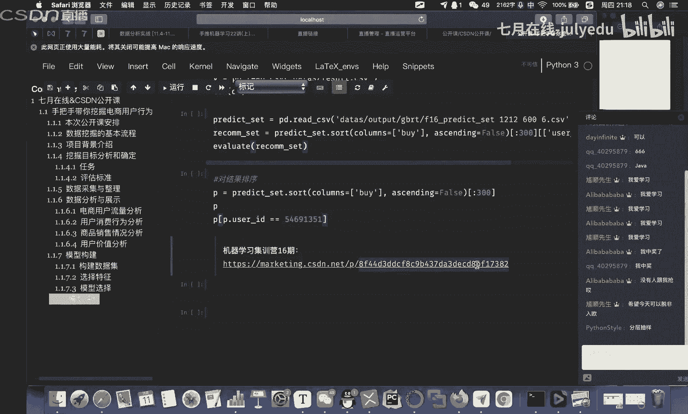

我copy一下。考比一下。

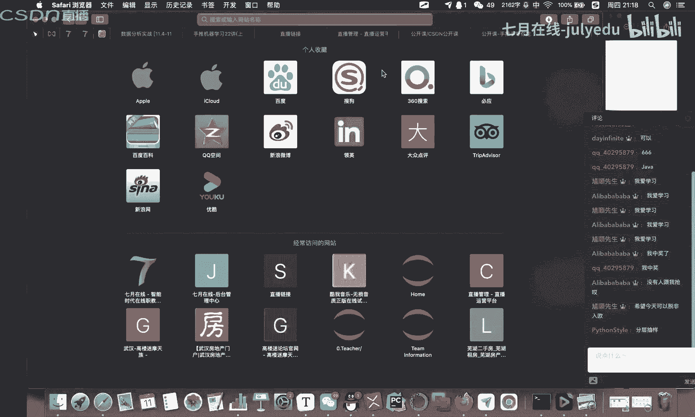

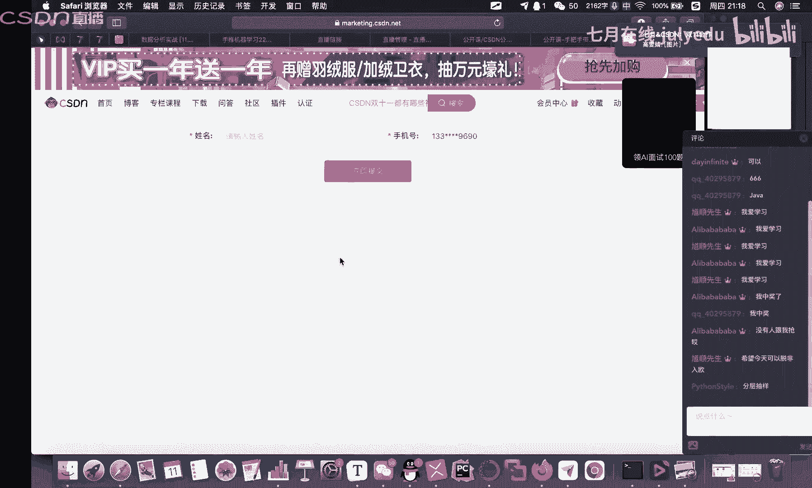

OK啊OK然后呃这里面哈这里面。😊，嗯。呃，给大家简单去讲一下啊，就是说啊我们机器学习集训营这一块，它是从零开始啊，从零开始，也就是从什么python基础啊。

我们整个的这个机器学习它就都是基于python语言啊，thon语言来完成啊，包括啊我们前面讲这个python的一个呃基础。然后呢到这个数据分析啊，里面比如说像n呀pandas呀net呀。

然后到后面比如说我们机器学习的一些原理啊，像这个LL啊GDBT呀SBM呀，还有一些什么ge呀啊，包括呃其他的一些呃模型O导入原理部分完事了以后，对吧？这里面应该有这个课程大纲哈，课程大纲啊。

我来看一下有没有啊课程大纲。

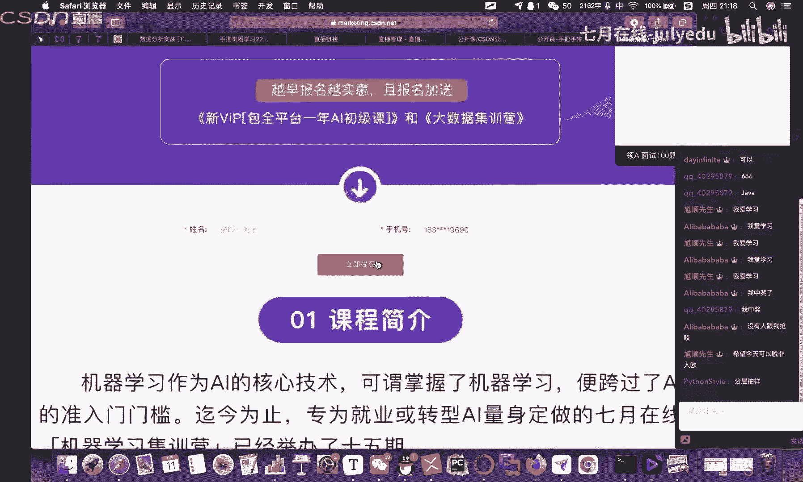

应该是呃在。

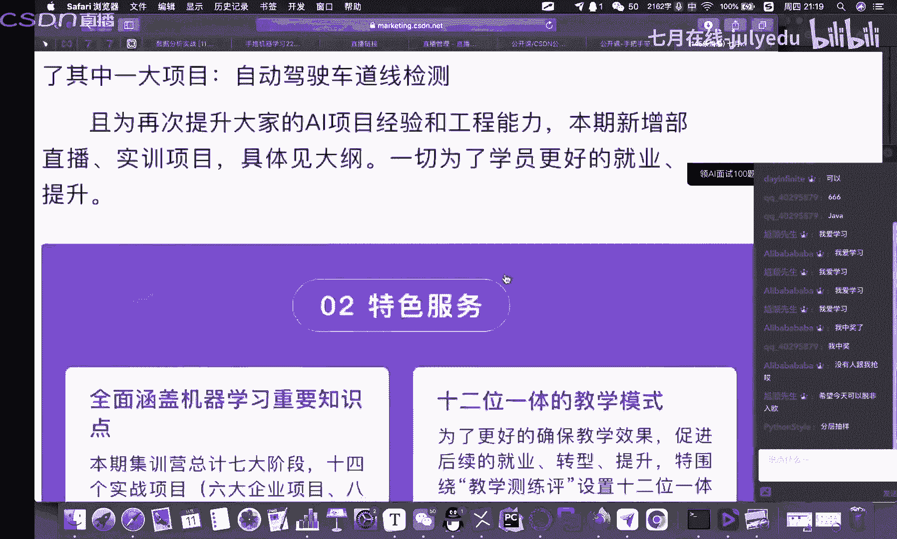

啊这里面只有一个课程简介，对吧？Yes。嗯。OK啊，大家有兴趣呢啊，可以直接到这个网站里面啊，来点开来看一下啊，这上面我好像没看到。

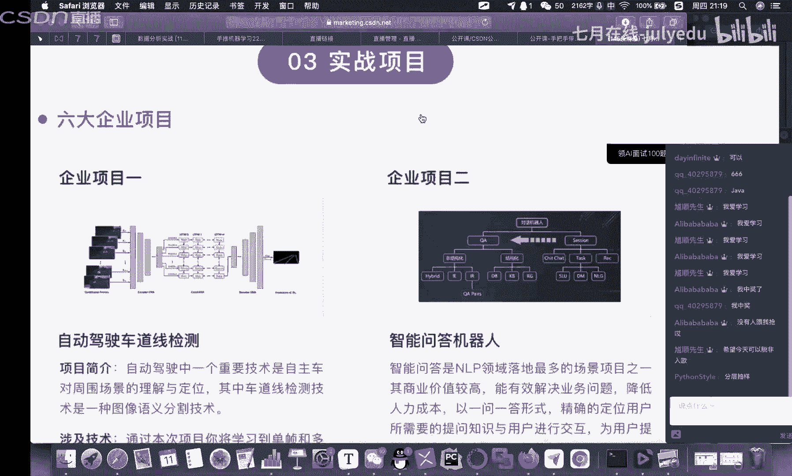

这个那个这个细节的部分是吧？课程的简介。啊，应该是呃是不是要注册一下是吧，注册一下，然后才能够看得到哈啊，这个大家可以去试一下。然后整个课程这一块呢，除了我刚才所讲的对吧？

然后机器学习原理完了以后到实战实战完了以后呢，到这个深度学习的原理，然后到深度学习的实战。然后最后呢是项目这一块。那么项目这一块哈呃企业在线所推出的这样的一个机器学习第16期项目呢很多哈。

比如说像这个是比较新的对吧？自动驾驶啊，车道的一个检测，这应该属于CA方向啊，CA方向的一个项目。然后包括什NIP这一块的智能问答。

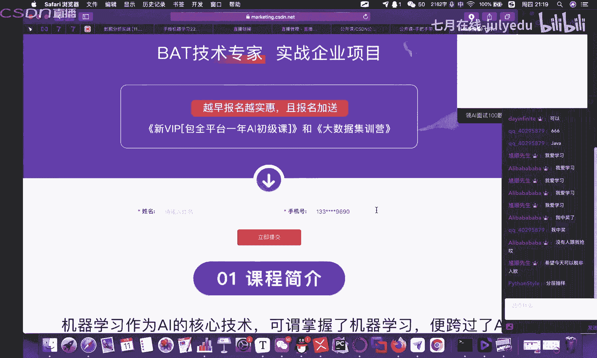

机器人还有什么呢？还有什么啊电商平台对吧？它的一个推荐系统。okK包括什么呀？这个大规模的形式识别。其实这些项目都是目前工业界非常非常常见的这样的一些项目啊，落地性非常强OK啊。

那么如果哈同学们想要去进入这个行业里面啊，或者说你是传统IT的啊，或者说你是做数据分析的，对吧？你想要去往这个机器学习这一块来走OK啊，那么这个机器学习集训这个课程，非常适合大家。啊。

那么除了这些啊硬性的内容以外，对吧？我们原有的知识体系对吧？原有的这些项目，那么还有哪一些软服务，对吧？也就是说企月在线所推出的什么特色服务啊，那么这里面特色服务，对吧？有一个什么12位一体的教学模式。

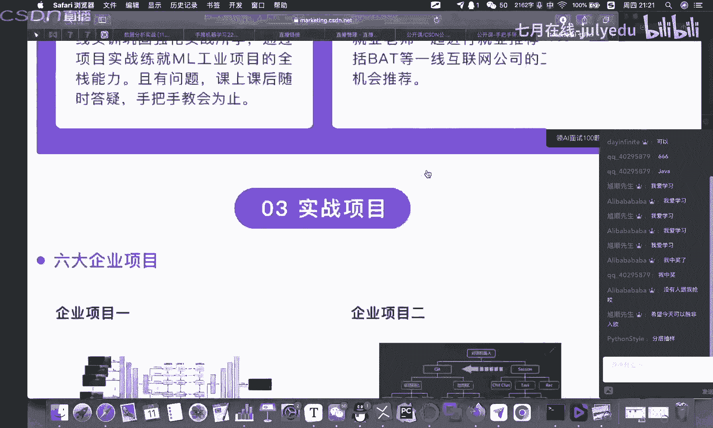

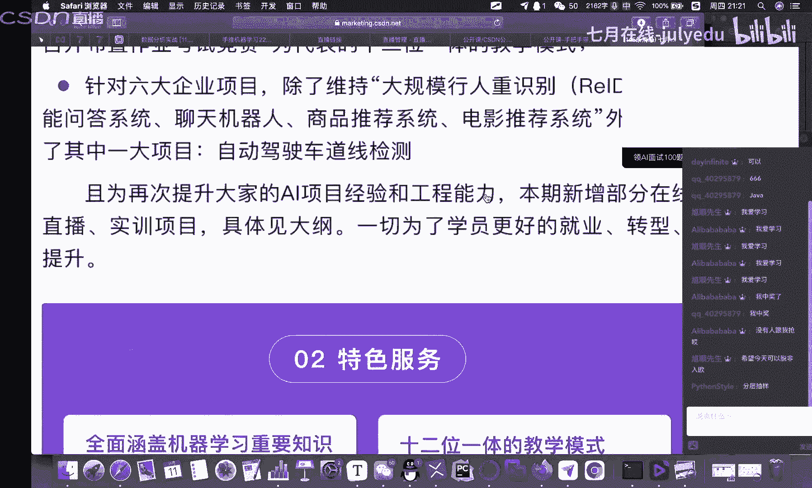

那么这里面大家可以搂一眼啊搂一眼。那，比如说我们的呃课程对吧？有直播对吧？啊，然后呢实时答疑，有阶段考试，有作业，有毕业考核，哎，还有什么呢？唉GPU跟CPU这样的一个双平台啊，这个是比较贵的啊。

如果你自己买很贵的。OK啊。然后还有什么呢？啊对应的一些联合认证啊，比如说跟阿里云啊啊，包括呃其他的一些机构来做一些什么认证啊这样的一个动作。OK啊，然后这个项目这一块呢都是么标准化的一个流程啊。

标准化的一些流程，包括从这个呃项目的介绍环境的搭建啊，数据的准备啊，包括呃特征工程啊，对吧？模型的构建迭代优化总结啊，评估上线啊等等啊，一条龙服务。然后还有什么呢？呃助教老师对吧？啊。

有全职的助教老师给大家来做什么呢？这种呃。类似于呢班级啊这个独立的一个教学辅导啊，独立的教学辅导。

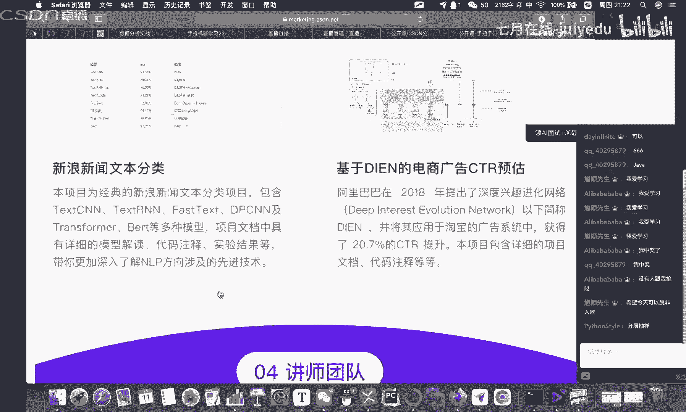

OK然后还有一个啊需要去隆重讲的就是什么呢？讲师团队啊讲师团队啊，那么讲师团队这一块呃非常强。

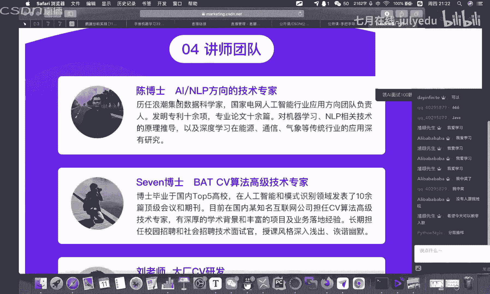

从这个比如说啊陈博士对吧？啊，这个呃浪潮集团数据科学家，他是我们呃接术在线AI跟ARP方向的技术专家啊，包括什么呢？serveven模式，刘老师、赵老师、丁老师啊等等。OK啊。

我们呃整个的讲师团队啊非常强。所以说对于整个课程这一块，除了说我们这个整个的课程体系，然后包括里面的内容，包括这些细节，包括唉我们这些项目啊可以落地的项目。

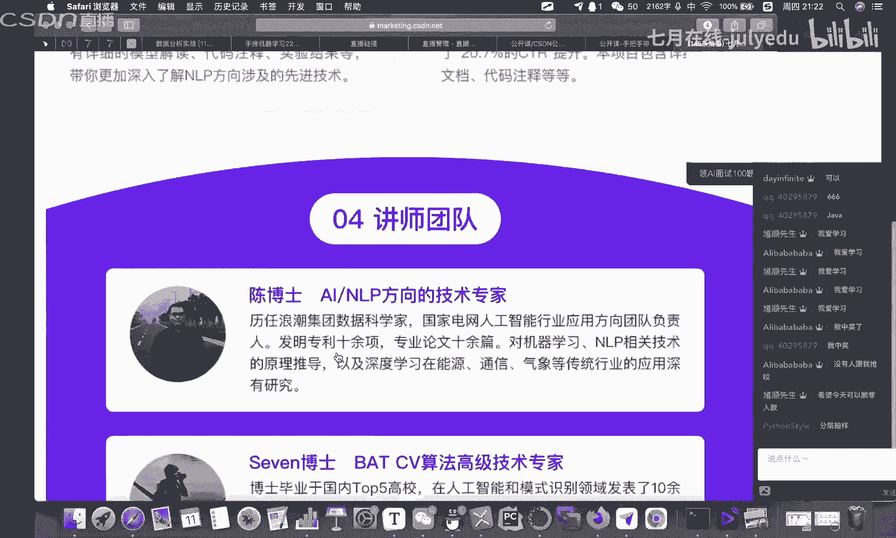

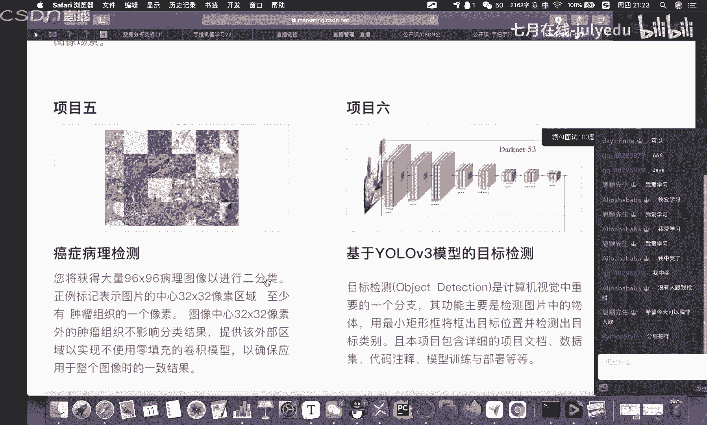

OK包括我们的啊全职的助教。全职的服务。啊，包括我们还有什么呢？GPUCPU啊这样的一些双平台OK啊，硬孚软服。相结合来给。大家提供什么样更好的服务。OK啊，这是任务啊，任务已经OK了啊，并广结束。

然后今天的这些课件哈，同样哈课件代码数据OK啊，我同样也会给到杨老师。😊，OK有问题啊，可以在右侧的对话框来进行提问啊。🤧O好，我们等几分钟吧，我们等到9点半啊，我们来结束啊。

OK啊我们呃其实我们在刚才的一个课程学习当中啊，大家呢注意什么呢？我们整个的一个呃思路，对吧？也就是说我们不管是做数据挖掘，对吧？还是做机器学习这一块啊这个基本上你的一个流程啊，大致是不变的啊。

那么其实区别在于哪呢？可能比如说你进大厂或者是进中小型的企业，对吧？可能稍微有一些区别，那么如果你进大厂啊，可能更多的是一个萝卜一个坑，对吧？你可能只负责某一个很小的一块啊，比如人家推荐这一块。

你可能就负责金牌，对吧？你可能就负责召回，啊，其他你不用管啊，一个萝卜一个坑，但是如果说比如说你到中小型的企业里面，对吧？那么可能呃你需要负责的东西就很多了啊，比如说呃。

从这个啊可能从上到下你都需要去参与啊，包括这个顶层的设计，对吧？啊等等等等啊这样的一些内容。那么同学们有什么问题哈，可以在右侧的聊天对话框来进行提问啊。那么我们今天所讲的内容呢，除了说这个数据分析呀。

机器学习里面所呃讲到的一些什么模型的一些构建呢啊，包括模型的选择呀，模型的一些评价啊等等这样的一些内容。OK那么嗯。今天哈主要给大家去讲了一些大概的一些思路啊等等啊，这些代码呢其实不重要啊不重要。

大家可以慢去参考。然后更多的一些细节的部分呢，大家可以关注什么呢？7月在线啊，然后他这个我看啊即时六即时六应该是他的开课日期应该很近啊，1012月27号啊，12月27号12月27号啊开课啊。

所以说呃有需要的同学啊，可以抓紧时间啊，联系什么呢？我们杨老师，然后找他去啊进行一些啊奖品兑换啊，课件的一些领取啊。如果说啊你要报名这个啊机器学习16期应该是今天双十一应该是有活动的啊，有活动的。

应该是有比较大的一个优惠。然后呢呃可以直接去咨询这个杨老师啊，他会给你专业详细的解答。

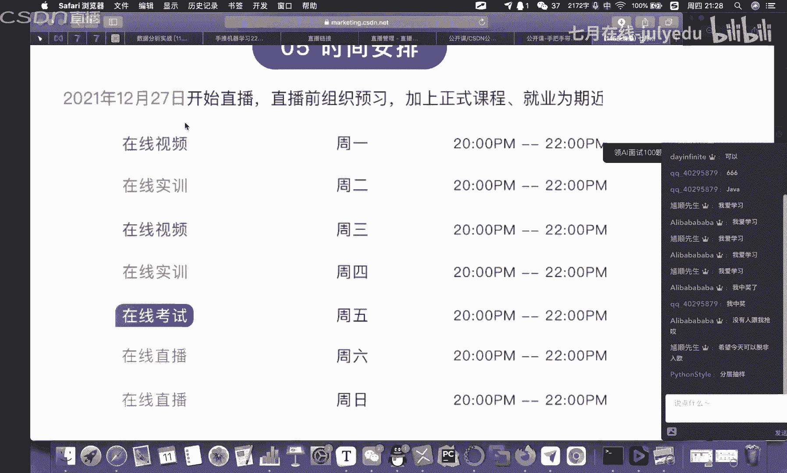

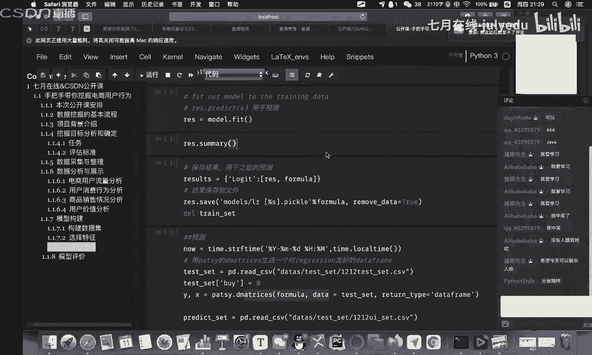