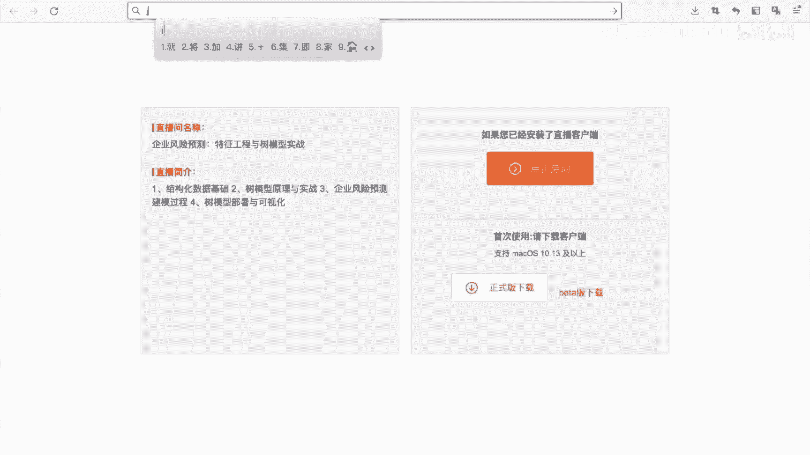

# 人工智能—机器学习公开课（七月在线出品） - P28：4.14【公开课】企业风险预测：特征工程与树模型实战 - 七月在线-julyedu - BV1W5411n7fg

🎼。Yeah。

嗯，各位同各位进入直播间的同学再稍等一下下啊，我们待会儿就开始啊，8点钟准时开始。嗯。对，大家之前学过继续学习吗？我们这节课呢就是以这个企业风险预测，然后来讲解这个一些基础知识。对。

各位同学之前学过继续学习吗？自己动手过吗？对，你可以在我们的一个屏幕区，然后打字跟我进行沟通。嗯，没学过好，就看来是入门的同学啊。对，没学过的话，你可以跟着我的一个嗯就是说课程来听一听啊，来找一找感觉。

好。那么我们就开始我们今天的一个课程内容。呃，我是刘老师。然后呢，我们今天的一个课程内容是以企业风险预测来给大家讲解的一个就是。嗯，以这种特征工程和数模性的一个角度来讲解这个案例。

在我们开始我们今天的一个课程之前呢，我们先给各位同学介绍一下趣车在线。契车在线是一家成立于2015年的专注于呃AI相关的人才培养的公司。在人才培养方面呢，讲师累计超过了200人。

均是由国内外的名校博士和硕士组成。然后总付费人员呢也是呃40万。然后我们的课程的一个数量呢也是几百门。然后呢，我们今天所给大家讲解的一个知识点呢，也是在我们的具体的一个呃就是呃集训营。

我们的继极学习集训营里面啊，然后呢我们来看看今天我们将会学到什么。我们今天呢首谓具体讲解的知识点呢包含以下这几个。第一个呢会讲解一下结构化的一个数据集的基础。第二部分呢会讲解一下特征工程的一个入门。

然后第三部分呢会讲解一下这个我们的一个数模型的一个原理，以及它的一个基础使用。然后第四部分呢，我们会讲解这个就是说企业风险预测的这个具体的一个实践。好，那么我们就先开始第一部分啊，这样在讲的过程中呢。

如果各位同学有任何疑问，或者说听不懂的地方呢，也可以及时的就是说提出来啊好。首先呢我们来看一看呃结构化的一个基础。呃，大家知道什么叫做结构化数据吗？结构化数据。对。

那么我们这个地方给大家介绍一下结构化数据呢，就是我们的一个数据集，它是以这种非常规整的一种形式来进行存储的。比较典型的就是我们的这种二维表格的形式，二维表格的形式啊，表格类型的。表格类型的。

那这谈到表格类型呢，你就肯定会想到这种我们常见的这种数据库，对吧？常见的数据库以及我们的excel。都是常见的这种表格类型的数据。表格类型的数据呢又叫做结构化的数据。那么结构化的数据有什么样的特点呢？

它相比于半结构化数据以及这种非结构化数据，它有什么特点呢？结构化数据我们的一个表格呢是以这种行和列。的这种形式来组成的行和列这种形式来组成的。其中呢我们的行代表什么呢？我们的行代表了我们的一个样本。

我们的列呢，它就是一个具写一个字段。这个地方的字段呢你可以理解就是一个。我们。也可以理解它是一个特征。如果我们这个地方的一个样本是我们的一个学生信息的话，那么我们的一个字段可能是学生的一个age。

或者说他的一个sex性别，或者说是他的一个score，他的成绩等等的。也就是说对于我们的每个学生呢，我们是可以统计它具体的一些就是说我们的一个特征的。比如说对于所有的学生的年龄，它都是存在同一列。

对于所有学生的一个sex，他的性别都是存存在同一列的。在我们的一个具体的建模过程中呢，结构化的一个数据。结构化的数据它其实就是以这种行列形式来组成的。

行列的一个交叉位置就是这个样本在这个字段它下面的一个取值。这个样本在这个具体的一个字段下面的一个取值，这就是我们的一个行列，它的一个交叉的一个位置啊，行列的一个交叉的位置好。

那么我们在学习记忆学习的时候，其实我们会学到很多的一些算法，比如分类回归排序和这种无监督记忆学习。那么我们在学的过程中，到底有哪些就是说怎么进行学，或者说怎么去选择这些算法呢？其实在学习的过程中呢。

还是建议大家就是说啊多去思考一下你的学的这个算法能用在什么样的一个场景上面。那么我们今天呢在我们的一些教材里面，其实呃教材呢，比如说像呃这个机器学习，就是周志华老师的机器学习。

或者说这个李航老师的统计学习方法的话呢？其实它本质就在就在讲解一些比较基础的一些算法，对吧？那么这些算法能够用在什么样的场景上面呢？其实大部分的这些基础的算法呢，都是能够用在这种结构化的数据集上面。

比如预测一下用户是不是违约用户，预测一下这个用户的一个房，就是说他的一个具体的房子，房屋的房价以及这个房屋的热度，然后预测一下这个温度的走势，或者说这个交通拥堵的情况。以及识别一下我们的一个道路。

他的一个行人，对吧？那么这些呢都是我们的一个机器学习的一个应用的案例。那么在这些案例里面，我们怎么去选择一些具体的算法呢？也就是说我们选如果遇到。到了一个问题，你怎么去选择合适的一个算法呢？

比如说遇到了需要你去预测一下这个用户是不是违约。那么你具体用什么算法呢？这个可能就是我们的一个从业者，或者说你学了积极学习和数据挖掘之后，你就应该知道的这个问题。好。

那么在我们的这种结构化的数据集里面呢，我们是以这种数目型居多数木型居多。因为数木型它。对我们的类别特征啊，在处理的时候是非常非常友好的。然后我们继续。呃。

第二部分呢是这个我们的一个半结构化数据和这种非结构化数据。半结构化和非结构化的一个就重要的区别就在于半结构化，它也有这种结构化的一个信息。但是呢它是介于结构化信息和半结构和非结构化信息的时候，比如说。

我们的一个jason类型的一个数据。jason类型的一个数据。jason类型的一个数据呢就是比较典型的这种半结构化的数据。它是以这种我们的一种dict这种形式来存储的对吧？dic类型呢。

它是呃在存储的时候，我们不需要它的一个所有样本需不需要它就是说具备相同的字段。好，这是我们的半结构化数据。那么我们的这种非结构化数据，比如说我们的这个呃图片呃我们的这个音频。

我们的这些文本它们就是这种很典型的一个非结构化数据，每个样本，它的一个长度不同。那么如果你去整整体的看一看这个结构化数据，半结构化数据和这种非结构化数据，你就你就会发现这三类数据的一个主要的区别在什么？

这三类数据主要区别就在于数据是否规整。数据是否规整？也就是说我们的所有的一个样本，每个样本是不是能够用一行比较规整的来表示，这个是我们的一个关键数据是否规整。好，我们继续。那么我们在做一个建模的时候。

我们嗯特别是需要做什么呢？或者说我们的一个应用的时候，我们的一个整体的流程是什么样的？其实基本上是呃以如下的这个思路识别问题，然后理解数据，然后对数据进行一个处理。然后通过模型建模并进行对模型进行评估。

这个是我们的一个数据挖掘，它的一个整体的一个脉络。也就是说从头至尾是可以以这种形式来进行展开的。但是呢我们在展开的时候呢，其实我们的每一部分，其实我们的一个侧重点是不一样的。

每一部分我们侧重点是不一样的。比如说我们在理解数据的时候呢，我们可能是更加关注于我们去呃这个数据本身它有什么规律没有，对吧？或者说这个数据本身它呃跟我们的标签分布有什么样的一些规律。

这个是我们在做理解数据的时候做的。那么我们在做一个分析的时候呢，我们最关键的就是说能不能找到我们的字段和标签的一个分布的规律，并以此呢来做一些额外的操作啊，额外的操作。

这整个是我们的一个比较完整的我们的一个建模的啊，这种流程。好，那么有同学可能就会问到，老师在你做一个建模的时候。

你会使用哪些具体的一些算法呢？或者说你用哪些模型呢？这个地方呢我们给大家介绍一下，我们在实践的过程中，我们会用到哪些的一些基础啊。

首先呢我们在做一个建模的时候呢，我们现在呢百分之呃就是说90以上的环境啊，90%以上的环境啊。不管是在呃就是说做这种学术啊，还是在我们的一个工业界里面啊。

大部分这种建模呢都是基于我们这种python的一个环境来进行的python的环境。所以说呢你是需要掌握一下python的，掌握一些python的这是第一点。第二点呢，就是呃使用python的时候呢。

我们是有一些第三方库。那么我们接下来就看一看我们就是说如何去使用这些第三方库来完成我们的一些建模。呃，这个地方呢我们就是呃大致讲一个就是说基础的建模流程啊。好。

我们这个地方呢是以一个泰坦尼克号的一个数据集来展开的。他的哪个号大家呃应该都知道呃，就是说一个游轮，游轮上面呢有很多乘客。这个乘客呢我们需要利用乘客的一些信息去预测它是不是幸存下来的。好。

这个是我们使用pandas来读取得到的我们的一个数据集。使用pandas得到的我们的数据集。在这个数据集里面，我们这个就是一个叫做data frame的一个。表格在pas里面，它叫data frame。

然后呢，这一行就是一个乘客，这一行就是一个乘客。然后这一列就是我们的一个字段。比如说在我们的这个数据集里面，我们的这一列叫做passenger IDD，相当于是一个乘客的ID。好。

比如说在这一列是我们的passenger的它的一个name。也就是说是这个乘客的姓名。好，在这个数据集里面，它就是一个典型的一个结构化数据。典型的一个结构函数据行和列的一个交叉位置。

代表了这个乘客他的具体的pasen加ID，或者说这个乘客他具体的姓名。好，这是我们的一个结构化的数据集。那么在我们的结构化梳据集里面呢，我们是需要知道一些基础的。比如说我们哪些数据是我们的一个特征。

哪些数据是我们的标签呢？也就是我们在做建模的时候，我们有这个feature。以及我们有我们的tage。对吧或者说。你可以理解它是X，它是Y，对吧？我们需要去构建一个模型。去离合我们的Y对吧？好。

那么这个地方我们的哪些字段是我们的一个就是说特征呢？这些字段是我们的特征。这些字段是我们的特征。好。这个字段是我们的标签。

是我们的标签survivved这个survivved就是用来标识这个乘客是否幸存的。那么标识这个乘客是否幸存下来的一呢代表他幸存下来的啊，零代表他没有幸存下来。好。

那么有同学可能说老师这个地方还有一个passenger IDD。这个地方的pasenent IDD它是我们的特征吗？或者说是我们的标签吗？好，我们的第一个互动。对。

大家认为这个是我们的标签还是我们的特征，或者说它既不是标签，也不是特征。对，然后呢我们呃前十位回答，我们就是说互动同学呢，我们赠送我们契车在线的月卡10张。对，有没有同学想回答的？有没有同学想回答的？

这个地方我们的一个paenger ID是我们的什么？有同学说了啊，都不是有同学说标签。好。对，其实正确答案都不是都不是，为什么都不是呢？这个地方我们的1个ID。😡，它是一个用户的一个唯一标识。

或者说你可以理解。这个地方就是我们的一个乘客，在我们的一个船上的一个身份证，每个人的身份证号是不一样的对吧？所以说这个地方它既不是我们的一个特征，也不是我们的标签。好好，这个地方啊。

我看一看有嗯很多同学已经回答对了啊，我截一下图。呃，就是呃钱现在已经回答的这些同学啊，就是可以领取一下我们的一个缺在线的一个月卡。然后呢，我们待会儿会把这个领取的方式啊，发给大家啊。😊，呃。

有同学说了这个地方ID你可以理解它是一个K主K可以的，很好啊，就是说你可以理解它就是我们在数据库里面的一个主件主件。好，那么我们这些siveve是我们的一个。😊，具体的标签。

我们的除了是pasenger IDD以及svivve的，剩下的就是我们的一个特征。好，那么这是第一个知识点，我们的标签和特征，然后继续。那么我们的这些列它到底是什么类型的呢？好。

这是第二个这些列到底是什么类型的。比如说我们这个地方的name name呢，在我们的一个上面通过我们的describe函数呢，可以看到它是一个object类型的。object类型，也就是说它是一个。

strrange的这个地方很明显，它是一个trainrangeish的。然后呢，我们的一个sex。sex呢它也是一个object类型的，它存储的形式也是这种t类型的。对吧好。

然后呢我们还有这个ticket。😊，对吧这它也是我们的tra类型的，还有我们的这个ageage呢是我们的一个flow类型的。好，那么我们在拿到一个数据的时候呢，你就会发现我们的数据集它的每个字段。

它的类型。又是不一样的。😡，类型就是不一样的。也就是说我们在做建模的时候。我们要知道我们的字段是什么类型的，标签是什么类型的对吧？如果我们的标签是我们的这种离散类型的，那么它就是分类问题。如果我们。

这个标签是这种连续类型的，它就是一个回归问题。那么反过来想，那么我们的字段。他是什么类型的呢？这个地方的一个字段的类型跟我们的一个建模也是非常相关的非常相关的。那么怎么去看这个字段的类型呢？

我我们通过这个pandas的一个infer函数。paless的info函数就可以看到它的具体的一个存储的类型，这是它存储的类型啊，就是有映酬类型的。object类型的。有我们的一个fo类型的。好。😊。

那么这个地方的一个类型呢，D type是这种数据的存储类型。它并不是说是这个数据这个字段它本身的一个类型啊。也就是说我们的1个sX，它在存储的时候呢，是以这种字符串进行存储的。

但是呢其实它是一个类别类型。它是一个类比类型，对吧？那么我们的name呢，它是以这种字符串存储的。那么它在在含义上面呢也是这种字符串。😊，也就是说这两列虽然说都是以这种字符串存储的。

但是它的类型是不一样的啊，类型是不一样的。好，那么我们呢在做建模的时候，我们一方面要查看我们的一个字段的类型，接下来也要看什么，要看我们的一个字段，它是不是有缺失值。是不是有确失值，对吧？

我们对于我们的字段，每个字段去查看它具体有什么缺失值没有。比如说我们在这个字段里面发现我们的age字段以及我们的carbin这两个字段是包含包含的蛮多确失值的。😊，包含的馒头确实值的。好。

这些呢都是我们在做一个。数据分析的过程中，以及我们对数据的理解的过程中需要做的。好，那么有同学可能就是说老师这一部分我怎么学啊？这部分你就去学这个pandas就行了，你就学pandadas。对。

padas就是库。对数据进行一个读取，然后对它进行一个统计，进行分析，统计进行分析。这些都是panda的一些语句。德斯的语句，所以说你不要就是说完完全全只是了解这个就是理论啊，实操还是很重要的。

因为在企业内部，他不管你去有没有理论或者是怎么样，我只要看结果，对吧？给你一份数据，你能不能把它做出来，这是我关心的。至于怎么做出来，对吧？中间遇到什么困难，或者说你遇到用具体用了什么算法。

可能我并不关注我只要结果，对吧？在企业内部它是以这种问题为导向或者结果为导向的。好，所以说这个也给大家提出了一个新的要求，如果遇到一个问题，拿到一个数据集。

你能不能分析出来它具体的类型以及具体的具体的一些趋势值呢？这个可能就是需要大家有一定的一个啊，就是说动手能力啊。

然后呢，我们刚才给大家讲的呃，就是说说的这个月卡呢，就是我们在。

呃企实在线的一个这个地方有1个VIP的1个月卡。嗯，这个月卡呢就是可以免费的去看我们的很多的一些小课啊。所以说后续呢待会儿我们还是有还是有抽奖的。待会儿如果还想领取我们月卡的同学啊。

呃就是积极参与我们的一个互动。

好。那么我们继续刚才呢就介绍了一下我们的第一部分，我们的一个数据集，特别是我们的一个结构化的一个数据，它的一个整体的一个基础。好，然后呢我们接下接下来看第二部分特征工程入门特征工程入门。好，我们继续。

那么我们在做一个具体的一个建模的时候呢，我们并不是说数据它本身是怎么样，它就一定是怎么样，对吧？我们的一个具体的一个数据集，它是需要进行一个嗯进行一个转换的。嗯，就是说可以这样举一个例子，也就是。

我们在学习的时候学习理论的时候呢，经常就是说啊我有一个什么样的模型，这个模型通过怎么样改变，让它变得更强。对吧比如说从F1把它转变成F2。然后呢，再转变成F3。模型。怎么怎么演变模型怎么怎么改进。

这个可能是我们在就是说学习理论知识的时候，对吧？我们的书模型怎么进行改进，减脂啊，我们怎么做bagging啊等等等等。但是呢我们在实操的过程中呢，我们可能并不是说去对我们的模型做改进。

我们可能呢就是对我们的数据做改进。Yeah。我们对我们的数据做改进。好，这个呢可能就是呃哎sorry啊。我们去对我们的数据所改进。这个呢可能就是说大家之前我们在学习理论跟我们的一个实操过程中重要的区别。

理论更加偏向于模型的改进。实操呢更加偏向于怎么去对数据。去做一些处理。好，那么我们接下来看一看啊，对于我们的原始数据集，它可能的。是以这种我们类似于这种jason。或者说这种dict的存储形式。

对吧这个地方我们是存储了一个房屋的一个信息，这个信息里面包含了房屋的一个嗯room以及bedroom以及str name以及它的一个呃就是说bas basementement rooms等等的一些信息。

好，那么在这个地方，这些原始的数据集，它可能就是说字段有这种数字类型的，有字符串类型的，也有我们的一个。就是说呃就是类别类型的都有可能。那么。在存储的时候在存储的时候啊。

就是说如果大家学过这个数据库的话，你应该知道我们现实生活中或者说。在我们的编程语言里面，它常见的数据类型就有哪几种啊interflows。我们的train。对吧或者说我们的d time。

就说我们在存储的时候，基本上就是这些类型。但是呢我们在做建模的时候，你会发现我们现在的一些机器学习的模型，基本上输入的时候都是需要你把它处理成数值类型的。数字类型的对吧？它可以是浮点数。

或者说是是这种我们的整数都行。但是呢是需要你的一个数据是我们的这种非。非我们的这种就是说这种字符串类型的，非我们的这种日期类型的对吧？因为我们的日期和字符串，它没办法参与计算啊，对吧？没办法参与计算。

好，那么我们在做一个数据处理的时候，这个地方我们将我们的一个数据把它处理为我们直接能送到我们的模型的这一步呢，就叫做我们的一个数据预处理和特征工程。也就是说我们首先输入的是一个原始的一个数据。

我们的原对原始数据呢可能对它进行一些预处理。嗯，purport嗯预处理啊，这个地方啊单词拼错。予处理。然后呢，再对他做一些特征工程。再得到我们最终的可以送到模型的这个特征。也就是说。

原始数据它可能并不是特征。原始数据呢我们一般把它叫做字段比较多。但是这个字段并不一定是特征。字段并不一定是特征，或者说这个字段它可能是原始存储的，它可能在我们建模的时候是不需要的。好。

也就是说我们在做一个建模之前或者送到模型之前，我们是需要做很大的一些操作的。比如说我们对于我们的一个。在做转换的时候，如果原始的一个字段，它就是我们的这种数值类型的。

那么我们就是可以直接把它copy过来。那么如果它是这种思串类型的。字付串类型的。那么我们就可以考虑把它做一些额外的编码。比如说把它做一个one horse的这些编码，one horse的这些编码。

这是可以的都是可以的。好，那么这个地方有同学可能就是说老师。字符串它不是有这种呃TFIDF吗？那么为什么要选呃选择这种oneport呢？这个就跟我们的一些具体的编码方式是相关的。

具体的编码方式是相关的好。那么我们接下来看一看我们的一个类比特征。类别特征啊，它的一个英文名字叫做category features。

 categoryry features啊类别特征类别特征的一个含义就是说它的一个具体的一个产生得到的。然上得到的它是一个以这种。数值啊以这种字符串类型存储。但是呢它的取值空间有限。取值空间有限。

取值空间。有线这个有限是什么意思呢？也就是说我们的这个类别类型，比如说这个性别这个字段，性别这个字段就是我们的取值空间是非常非常少的。男性女性或者不确定，对吧？

我们的城市省份、民族、户口类型都是比较典型的我们的类别特征。那么我们的名名字name name呢它就不是一个类别特征。为什么呢？name它的一个。取值空间就非常非常大了，它就不是说可以直接便利完的对吧？

好，那么我们这个地方类别特征，我们怎么对它进行编码呢？类别特征是在我们的建模的时候，无论什么时候都是需要处理的。因为我们的现在的的一些机器学习模型，它是没办法识别这个类比特征的。

这个地方我们的字符串它是没法参与我们的一个训练过程的啊，字符串它是没办法直接参与我们的训练过程。所以说我们需要考虑对它进行一个编码，对它进行一个编码。好。这是第一个。第二个呢就是说对于类比特征。

它的一个处理呢会容易带来离散数据。移算数据这个地方有一个叫做高基数的类比特征，高基数的类比特征。这个是什么意思呢？就是取值空间非常大的一些类比特征。比如说我们的国家国家这个类比特人对吧？

全球的国家应该是上百个，对吧？全球的国家是上百个。那么对于这么多国家，如果你想要对它进行一个编码的话。你就需要。可有可能会把它转转成这种非常非常稀疏的一个项链。非常非常稀数的型的。

那么这种高基数特征就是表明啊就表示它的一个原始的一个取值空间非常大。好，那么对于我们的类别特征呢，它还有一个特点，就是说它其实是很难进行缺失值填充的。比如说某国同学他的一个性别缺失了。性别缺失了。

就是性别这个字呢他没有填。那么你去你去怎么去填充呢？其实根据这个用户他的一个就是名字。嗯，其实很难挖掘出他的一个具体的一个就是说性别的对吧？好。嗯。我们继续。那么对于我们类别特征呢。

其实可以把它分成嗯就是说多种类型的。第一种呢叫做有序的类别。第二种呢叫做无序对比啊。这个地方呢我们的一个有序类别和一个无序类别是什么？有什么区别呢？

这个地方其实它重要的区别就在于无序类别它是啊这个取值之间是相互平等的，也就是说我们的动物与动物之间是相互平等，没有什么大小关系。然后呢我们的有序类别就是它是有这种大小关系的。

或者说有这种呃发生次序的关系，或者说一种某种关系，比如说我们的情感，对吧？呃，开心不开心非常开心，我们的一个就年级对吧？一年级、二年级、三年级。对吧或者我们的大中小班，对吧？

这些都是我们的比较常见的这些有序类别和无序类别。那么我们在做编码的时候，我们也是需要考虑这个字段，它到底是一个有序类别还是一个无序类别呢？这个其实是。需要注意的。好。那么我们继续。那么对于类别特征呢。

我们接下来讲一讲这些具体的一些例子啊，给大家就是说让大家感受一下对于这是类别特征，我们怎么对它进行编码。那么我们首先来看一看这个数据集，就是说我们创建了一个da frame。

这da frame呢它是有这个四列有四列。这四列呢就是一个students ID country education以及tar四列。然后呢分别的是这个学生的一个country。

学生的一个education信息，以及这个target就是一个我们的一个标签。那么我们接下来看一看我们怎么对这几列做一个编码。首先呢对于类比特征。

就是说比较常见的这个编码方式呢是这个one horseone horses。王后是他的一个就是说具体的操作，就是嗯你可以使用这个pandas的get du来做。

one hot的一个含义呢就是说是把它编码为one O K is hot这种形式。也就是说其在某个位置是被编码的，其他位置是没有编码的。这个地方的K呢是什么意思呢？这个K代表的是这一这一列。

它的一个取值空间。取值空间。我们来看一看这个地方的education这个例子。对于我们的这个education这一列呢，其实它是有三个取值空间的。所以说这个地方我们是将原始的这一列。

比如说这个地方是一个一列，把它转变成一个三列。对吧三点的，为什么是三点？因为这个地方我们对于每个学生呢是把它转变成了一个1乘以3的一个向量，1乘以3的一个向量。好，这是我们的一个oneho。

oneho它的一个优点就在于它是比较简单的，它是能够将所有的特征把它进行有效编码的，而且呢它没有改变我们的字段与字段的。嗯就是说大小关系。比如说我们的be和master在编码之后，它仍然是相互平等的。

不信我们来看一看010和100以及我们的001。这三这三个相顶，它们之间的一个距离仍然是相相互平等的。也就是说我们的w horse其实他没并没有改变我们的一个取值的大小的次序，这是它的优点。

那么one horse它有它的缺点，就是说one horse它是会带来维度的一个增加，很有可能会带来我们的一个维度的爆炸。在通过我们的一个具体的一个编码的过程中呢。

它也很有可能会带来一个特征稀数的一个情况，带来一个特征稀数的一个情况。好，嗯，我们在做的时候呢，我们其实是呃需要考虑到我们的是不是值得做完火，值得做完后情。好。那么我们怎么实现这个呢？

就是说在pas里面可以做这个get duing，或者说在S pen里面，我们使用这个one horse enr就行了啊，做one horse encode就行了。好，我们继续。

那么第二种呢叫做这个label encode。label encode就是说我们的一个具体的一个编码，它是使用类似于这种标签编码的形式。标签编码呢就是说我们是用一个具体的一个label。

这个label呢。label原始就是指的是标签。这个地方呢label in code原始就是默认就是对我们的一个标签做一个操作，对我们的一个标签做一个操作。好。

那么我们的一个具体的一个这个地方leve encode用在我们的特征编码的时候，就是将我们的类别字段把它用一个独立的数字ID做一个替换。比如说这个地方，我们的country。

china编码为0USA编码为1，UK编码为2，接喷编码为3，以此类推。这就是我们的一个label in code。labeling code它是比较适合在我们的数模型里面使用的。

它的一个优点就在于它是比较简单的，它不没有增加我们的一个特征的一个维度啊，没有增加我们特征的一个维度。但是它的一个缺点就在于它其实是改变了这个标签的一个次序关系的。

比如说这个地方我们的一个国家在编码之后，你就会发现其实他们。就是说是。国家他们国家之间有数值的表示呢，它就有这种大小关系的对吧？为什么china比US小？

为什么这个呃就是说我们的japan和 Koreaorea它就比较大，对吧？这个就是说我们在做一个。编码的过程中会遇到这种问题。那么具体的实现呢，就是说我们使用这个paas的 factorize。

以及我们的S clean中的label encodeder，可以做这个编码啊，可以做这个编码。好，这是我们的一个类别特征的一个编码方式。好，那么我们接下来做我们的这个继续抽奖啊，继续抽奖。

那么各位同学呃就是说在我们的生活中有没有遇到哪些嗯额外的一些类别特征呢？可以这个地方打字啊，这个地方我看嗯就是说哪位同学说的比较好，我们就送一本我们的书对我们的西瓜书啊，西瓜书纸质书送一本包邮的。😊。

对，大家遇到日常生活中遇到哪一种，你是怎么尝试对它进行编码的呢？对大家可以来参与我们的抽奖啊。对，第一个发言的啊，第一个发言的第一个合理发言的，我们就送给他。😊，好。有没有同学啊。

这个地方应该大家都在打字啊。好，我我们就继续稍微等大家一下啊，稍微等大家一下。😊，对。有没有同学想要我们的纸质书的？嗯ん。好。啊，有同学说音乐类型数据，天气玩火喜欢的运动项目日期嗯，挺好的。

但是这个日期呢其实并不是并不是说直接用这个呃就是说他一般情况下，我们不不是把它当单独当做类别特征的啊。嗯这个地方呢就是恭喜我们的手机用户呃，微信用户545494同学啊，就是说可以加一下我们的杨老师啊。

就是说领取我们的一个直质书，或者说直接联系我们的你在呃任意的就是说微信里面的任意一位我们的7月在线的老师啊。对，恭喜这位同学。好，还有同学说这个电商的类别啊也可以的也可以的好。

那么我们就继续啊我们就继续。那么在我们做一个建模的时候，就是说有同学可能就是说老师我怎么去用这些啊，其实用的话其实并不是特别难。假如说你想要用这个模型的话，或者用这些具体的编码的话，其实并不会特别难。

怎么说呢？因为这些具体的一些编码呢，它在我们的一个就是说建模的过程中嗯，是你必须要去面对的，你必须要去面对的。比如说。我这个地方再举一个例子。假如我们的一个数据集里面，其实它假如存在一种形式呢。

是这样的。我们的ear，这个是我们的一个原原始字段的工作连线，它是一个year，就是说是呃取值为one year  two year three year这种对吧？那么我们在这个地方。

我们对它进行编码呢，其实我们是可以直接把它做一个手动映射。这东西是对吧？直接把弯一2。编码为一，推页编码为去，类似的这些方式方式来做一个编码。这些都是我们在做就是具体的建模的过程中，很方便来做的。

很方便来做。也就是说，这个编码并不是one火，也并不是label in code，它是我们手动的手动的做一个有序编码，手动的做一个有序编码。好，我们继续。那么我们接下来啊看一看我们的一个呃数模型。

它的原理和这个使用啊数模型。好，那么我们接下来看来我们的第第二第三次抽奖啊，也是抽我们的月卡。那么大家用过什么样的数模型呢？呃，也可以发一下啊，前十名的同学送我们的一个雀在线的一个月卡。

就是说刚才还没有抽到我们月卡的同学，现在可以来说一下。😊。

对。呃，什么样的数模型都行啊？手机用户678875同学说性别啊性别男性男性为一，女性为0啊，可以的，这种是可以的。叉g boost嗯可以的啊。嗯从前有座山同学以及手机用户68075同学啊。

手机用户77875783765同学啊，叉GlashGBM以及开嗯，挺好的，挺好的。GBM嗯，看来大家都对这些数模型有一定的一个了解啊，有一定的一个了解。对，非常好。好啊，恭喜这些嗯这几位同学啊。

恭喜这几位同学可以嗯，就是说待会儿就是说我已经截图了啊，待会儿就可以直接讲找一下我们的契约在线的老师领取我们的这个月卡。有很多小课都可以直接看的啊，可以直接看的。😊。

好。那么我们就继续啊我们就继续。接下来呢我们就介绍一下我们的一个数模型，它的一个原理啊。随以接像您啊，有同学还在还在说很好很好好。我们继续。在讲解随机森林的呃，在讲解我们的数模型的时候，其实数模型呢。

刚才有同学说的数模型其实它是一种非常基础的这种数据结构，对吧？有同学说它是我们的这种二叉树。对吧这个是其实是可以的，或者是多差数也可以的。在我们在做数目型的时候，其实本质上就是说。

它本质上有点类似于这种if else的这种逻辑。If else啊 if else。也就是说，满足我们的某个条件走左边，不满足呢走右边。满足下面一个条条件，走左边不满足左右边。

它有点类似于我们的这种ef的逻辑。但是呢我们的数模型其实是一个非常非常优秀的一个机学习器。它其实是一个就是说机学习器。机础机器呢就是说你可以理解它就是说是非常简单的非常基础的这种学习器。

那么我们可以基于这种积础机器呢，可以把它组合成一些高阶的模型。比如说我们的是机森林。对吧那么怎么去利用我们的数模型，把它构建成一些高阶模型呢？

比如说我们可以在我们的数模型里面加入我们的这种begging的一个操作。begging的一个操作。这个buing的一个操作呢就是说我们是可以把它具体的一个。操作过程呢是可以并行训练。

begging就是说是类似于这种民主的一个思路，并行训练，并行训练。也就是说我们可以训练一个模型，我们也可以训练多个模型。那么训练多个模型的情况下，我们可以将这多个模型把它集合到一起。

也就是说我们有第一棵树。我们也有第二个数。我们有第三个数，对吧？每个数有一个具体的预测值，我们接下来将这三个预测值把它进行一个投票，或者说做一个加线求和，这个就是我们最终的结果。

那么bagging呢它可以定行训练，定行训练啊，这种这种提成的思路。它的一个优点就是说它能够减少我们的一个方差。它的一个缺点就在于它其实是增加了我们的一个时间开销的，而且呢是需要我们的模型具备有多样性。

也就是说，如果你的一个模型。没有多样性的话，那么你最终得到的一个结果仍然是不好的。什么意思呢？就是说如果你将同一个模型相同的模型把它就是说预测三次，然后再进行一个集成。其实对于我们的模型而言。

其实它并没有任何的一个长进。对我们最终结果而言是没有任何改变的。所以说这个地方我们是要有模型的一个多样性的。如果模型多样性越多，或者说多样性越大，它所带来的一个争议。积极资就是说精度自信就会越高。

这个地方的一个民主就是说不是我们每个独立的模型要相互独立，或者是说尽可能它的一个就是说多样性会好一点。那么怎么去保证我们的一个模型有多样性呢？可以从两个角度。第一个呢是从我们的一个数据的角度。

就是说做我们的行列采样，做我们的行列采样。那么行列采样行是我们的样本级别做采样。列是我们的特征空间的纬度数采样。那么有了我们的行列采样之后，我们的数据上有多样性。

其次呢我们也可以对模型的超参数进行一个调整。超参数做一个调整。超参数它决定了我们的模型的多样性，模型的多样性。那么我们就可以基于我们的一个这两个维度啊，去得到我们的一个多样性的模型。好。那么我们继续。

那么我们在做一个建模的时候，有了我们的多样性呢，我们接下来就可以去年多个模型，然后将我们的结果进行集成。那么我们还有这种bo死性的思路。bosting呢跟我们的一个baagon其实不一样的。

bosting呢它就是我们是基于这种基因筛选的一个思路，串行的训练，串行的训练。什么叫基因筛选呢？也就是说我们的一个本次迭代，是基于上一轮迭代的一个就是说基础上来做的。

我们本轮迭代是对上一轮的一个模型进行一个继续的礼合，或者说对上一轮模型，它的一个错误样本，然后进行一个调整。这个就是我们的一个。ボスのゆろ。不行呢它可以减少我们的一个偏差。

也就是说我们类似于这种打靶的这种形式，你最开始模型预测的比较远。对吧那么我们有了这个间隔之后，我就不断的去调整。最终呢希望你是能够接近于我们的一个最终的目标的。这个就是我们的一个bosing的一个思路。

那么我们的关键点在于我们是怎么去基于上一轮的一个模型进行一个继续学习呢？bosing的关键点就在于这个地方，有两种方法。第一个呢是基于错误样本进行调节权重，也就是说对于错误样本的一个权重进行调整。

第二个呢是礼合上应的模型的一个误差，对残差进行一个学习。残差进行学习。好，这是我们的一个bosing的思路。那么我们现在呢有很多的一些高阶的模型，比如我们刚才。同学们已经说到了这个letsBM。

那么这些高阶的模型跟普通的数模型有什么区别呢？这些高阶的模型和普通的数模型最大的区别是在于它的在工程上面有一些具体的一些实现上面的优化。就是说你在使用的过程中呢。

其实nBM其实在工程上面是做了很多优化的。比如说。他在做具体的一个节点拆分的时候呢，就是我们的一个分裂节点的时候，它其实是使用这种直方图的一种算法来做一个近似的。我们的一个就是说最优分类级的一种查找。

这个地方其实它本质上呢就是我们在分类节点的时候，是从我们的一个直方图。直肪图或的分筒的这个形式来去得到我们的分离起令。那么这种直方图的算法呢，其实是对于我们的一个内存和速度上都是有一定友好的。

那么这个直方图也它也会带来一定程度上的一个政则化的一个操作。也就是说它避免了我们就是说这种数模型出现过离合的可能性。其次呢在我们那7BM里面，其实还有很多，比如说这个特征捆绑啊，以及。

它的一个具体的一个bagging的操作啊，这些都是很多的。那么我们在学习的过程中，一方面你可以学习这个lesBM的一个原理。另一方面呢，你也可以去学习它的一个具体的一个模型的使用。

这个就是呃我们从业者或者说学习者是需要具备的啊。那么怎么去学习这个ICBM它的一个使用呢？其实对于一个数模型而言。对于一个数模型而言，其实本质上呢就是从以下的这个角度去可以学习。呃。

基本上对于所有的模型啊，对于所有的模型基本上都是从可以从如下的一些角度可以学习的。就就就具体的使用啊。怎么读取数据集，怎么训练模型，保存模型，怎么去算这个模型它的一个特征重要性，以及怎么加载模型。

怎么继续训练，以及怎么去修改这个超参数，以及如何定义这个损传函数以及这个模型的调参方法分析方法以及部署模型。也就是说对于任意的一个模型啊，这个地方是以这个nCGBM举例。

对于任意一个模型都可以这样来说来学习啊。就是说使用加载调参部署分析这些基础的步骤啊。那么我们来看一看NCBM它在使用的过程中的一些细节。那GBM呢它在训练的过程中呢。

其实是有两种接口的两种接口的这个地方其实我们在这个代码里面其实是有演示的啊有演示的。这种letGBM的train呢LGB点train是letTGBM的一个原生的接口。

他也letBM呢也有这种和我们的1个SK。搭配的这种接口。啊，也有跟我们的S呃就是说SK搭配的这种接口，或者叫SK的接口。比如说LGBMclassifier。那么。有两种接口，一种是原生的LGB点论。

一种呢是这个leCGBM的这种接口。这两种接口呢两类接口都是可以使用的。唯一的区别呢就在于啊这两种接口如果你使用这种。SK learn类型的接口了。

那么我们就可以搭配一些SK learn的一些啊就是说内置的函数来进行使用。比如说我们可以搭配这个SK learn中间的一个网格调餐来进行操作。搭配我们的一网格调餐来做操作，对吧？

比如我们的一个具体的一个超单数的一个搜索的过程。这个通过我们的一个lessBM是可以很方便的得到的。或者说去搜通过这种BS调三去搜索到我们的具体的一些超单数，这些都是我们的一个nCGBM。

它还可以很方便的得到的。好，这部分呢就是说也是需要各位同学熟悉的啊，也是需要各位同学熟悉的。好，那么我们接下来的时间呢，我们就讲解我们的一个具体的一个建模的案例。呃。

这个案例呢就是以这个呃某一个就是非法集资的一个企业的一个数据集来做一个预测啊。在这个呢，它也是一个具体的一个呃实际的一个数据集啊。呃，这个背景呢就是说有一些企业呢它是呃在进行一个呃运行的过程中呢。

有可能有这种存在这种非法集资的这种风险的一个情况。我们就需要构建一个模型去识别出呃这些非法集资的一个企业非要集资企业。然后呢，我们的一个训练集，包含了这个25000家企业信息。

然后我们的一个具体的一个测试集呢是嗯大概是15000条我们的一个信息。好，我们来看一看我们的一个就是说建模过程。我们。😊，这个数据集呢其实是一个多表的一个数据集。多表数据集。

也就是说如果你拿到我们代码之后啊，这个代码我们待会儿会发给我们的这个就是说che在线的老师。然后大家可以加了他们的微信之后呢，就可以直接从他们领取得到啊。这个地方我们的数据集呢它是一个多表的多表的。

什么意思呢？在这个地方，我们的每张表格，或者说我们的每家企业的每种信息呢是把它存在不同的位置的。存在不同的位置的。这个地方呢就是说我们的一个。需要。将我们的每个表格进行读取，然后对每个表格进行一个分析。

这个是我们在做的时候需要做的啊，需要做的。对我们的每个表格去做哪个表格去做。那么首先呢是这个base info。base info这个表格。base info这个表格呢，它是做什么呢？

base info其实是包含了企业的一些基本信息。比如说这个企业的一些经营范围、行政编码以及它的一个就是行业类型。对吧以及注册资本，这个是我们的一个base informed这个表格。好，读取进来了。

读西进来之后接下来做什么呢？我们可以去做一些确认值分析。我们可以将这个每一列它的一个缺失值的一个情况做一个可视化，对吧？比如某些列它都是完全缺失的，或者说嗯基本上都是缺失的对吧？

这个通过我们的一个呃缺失值的一个直方图可以很清楚的可以看到。那么我们就可以考虑将这个缺失值这些缺失。嗯，就是说比呃就是说缺失比例比较多的一些列呢，我们是可以把它进行一个剔除的，把它剔除的。好。类似的呢。

我们也可以去算一下我们的这个每一列它的一个取值空间的大小，每一列取值空间的大小对吧？这个都是可以来做的。好。这是我们的第一张表格，那么其他的表格也是一样的，读取进来，然后看它的趋势值。

但是呢对于每张表格，你会发现它的每张表格的含义是不一样的。比如说我们的第二张表格。这第二张表格是这个企业的一个。联报信息在这个联报信息里面，它包含了一些具体的一个数据字段，就跟我们之前的是不一样的对吧？

这个地方它可能包含的是这个企业，它包具体的一个经营经营的这个员工的这个个数，对吧？以及它的一个具体的一些下岗员工的个数。这个就是说每张表格其实存储的一个信息是不一样的。好，读取进来之后也是以此类推。

对于每张每个字段可以做一个分析。好，第三个表格是这个我们的一个企业的一个纳税行为。纳税行为。也就是说每个企业它有可能有可能有这种纳税的信息，我们也是可以把它进行一个具体的一个呃读取啊编码的。好。

还有的呢是它的一个就是说企业变更信息以及企业的一个新闻舆论信息，以及企业的一些注册商标和这个判决文书的一些信息。以及我们的一个最终的一个标签，对吧？有非法集资的风险的一些企业，以及没有风险。

没有这种非法非法集资风险的一些企业。好，也就是说我们的一个整个数据集其实是包含了多个表格的啊，多个表格的。那么我们在做建模的时候，我们就需要考虑是不是呃将我们的多个表格把它合并成一张表格呢？对吧？

我们在做一个建模的时候，我们就需要考虑到啊，我们是不是需要把它合并起呀。好，那么接下来我们怎么对它进行建模呢？首先呢我们可以考虑这个地方是我们对于每张表格做编码啊。

这个首先是我们的第一张表格bsase in表格。做读取，然后删除它的一个纯空的列，以及它的一些缺失值比较多的列。然后第二张表格连报信息也是一样，读取进来，然后删除一些列。第三张表格读取进来。

但是呢在读取进来之后呢，我们也可以把它做一些编码。比如说它总共的一些列的和，就是说我将这个数据集，它的一些具体的一些字段，把它做一个聚合，把些字段把它进行求和，得到一个新的列，这个是可行的。

这个是可行的，对吧？然后呢，对于我们的一个新闻的啊，就是说公司的新闻的一些表格舆行信息的表格，我们也可以对它进行。吸取它的一个年月日，以及它最近的我们的一个新闻的一个时间。对吧这边都是可以提取得到的。

好，那么对于我们的这种纳税的这种数据呢，我们是可以把它做这样一个聚合的。group bygroup by，然后做我们的AGG。

group by AG这个地方的一个AGG是我们的一个aggregate的一个操作。做我们的一个聚合的操作aggregate。那么。怎么做聚合呢？

group by我们的ID这个地方的ID就是我们的一个企业，它的一个编码，统计一下它的一个交税的种类，统计一下它总共交税的最大值、单笔、最大值、单笔、最小值以及每笔的一个平均值。

对吧这个就是我们的一个分组聚合。分组聚合，也就是在我们的一个结构化的数据集里面，建模所必备的啊所必备的。好，那么我们也可以继续对其他的也是一样的啊。比如说我们的一个企业联报信息，它所有的一个注册的人员。

他所有的一个联报的一个状态，对吧？以及下岗人员的一个总和，我们都可以把它统计一下。做分组句划，分组句划可以统计。好。那么如果我们将这些信息都把它统计好了之后，接下来做什么呢？

接下来我们就把它墨迹到一起就行了。接下来我们就把它磨迹到一起就行了。比如说。😊，我们有base info。以及我们的训练级的标签，我们把它都默制到一起。对吧merge的时候呢。

我们就指定一下它的主件就行了。主件就使用我们的一个公司的1个ID公司的1个ID来做mer迹，对吧？好，这是我们的一个merge得到的训练集。这个呢是我们merage得到的一个测试集。

对吧这个就是我们的一个训练集，最终得到训练集，以及我们最终得到的一个测试集。Oh。那么得到了我们的训练集和我们的测试集之后，接下来呢我们就可以进行一个训练了。对吧我们接下来就可以做一个训练，怎么训练呢？

我们就可以写一个呃交叉验证的这个方法。交叉验证的这个方法。呃，我们这个地方呢是为了我们的一个呃精度会更加呃可靠一些啊。所以说我们这个地方呢是使用我们的这种实折交叉验证，实折交叉验证来做。

直者这相验制在做这个交叉验证就是将我们的一个训练题划分成训练部分和我们的验证部分。然后呢再将我们的一个训练集做训练，然后在我们的验证机上做验证，并加入我们的一个earlytop的这个机制。

这样呢可以防止我们模型的过滤盒，防止我们的过过滤盒啊，这是我们的一个二。Yes。那么我们交叉验证呢是训练多个模型，然后最终呢可以将我们的一个测试器也做多次预测。也就有多次宇测。对。

所以说如果你想要追求精度的话，也可以考虑一下用我们的一个交叉验证。好。那么通过这如上的一些操作，我们接下来就可以最终呢就可以对我们的一个测试集做预测的，对吧？我们最终将我们的一个预测结果把它进行。

如果你预测了多次，那么你就可以将最终的一个预测结果把它进行一个求均值，得到了我们最终的结果，得到我们最终结果。好，那么我再来总结一下我们的这个案例啊。这个案例的一个难点就在于它是包含了多张表。

包含了多张表，我们是需要对这多张表，我们去做一个聚合，多张表做一个聚合。这个地方的一个多张表是什么意思啊？就是说有可能有同学之前没有接触过的，可能还会有点懵。每张表它的含义是不一样的。

每张表是含义是不一样的啊，画个图啊。我画个图给大家体会一下啊。也就是说我们的一个一行。我们这个地方呢一行。Yes。もし？这个地方比不听使唤的啊。我就在这儿放吧。在这儿好。还是最最下面画啊，在这画。

我们的一个数据集呢，它是可以其实合并之后呢，是一个很长很长的一行很长很长的一行。但是呢这一行虽然说是一个样本。但是呢它有一些有一些列，比如说这部分列来自于我们的一第一张表，这部分列是来自于第二张表。

这部分列是来自于第三张表，这一部分列是来第四张表。也就是说我们有这个地方有几个啊，总共是有6个6个不同的一个数据集。也就是说我们最终呢是需要将我们的这6个不同的数据集把它合计合并成一张表。合并成一张表。

这个是在这个案例里面的一个难点。如果你能够成功的把它合并为一张表，那么接下来做建模就非常简单了，对吧？在这个地方，如果合并成一张表之后，我们再接下来就是直接训练和预测就行了，训练预测就行。好。

那么有同学可能就是说老师我直接把这6张表墨迹到一起不行吗？😡，我直接把这6张表默集到一起不行吗？不行的不行的。为什么我们在这上面要做一个聚合操作呢？这个地方我们为什么要做一个聚合呢？因为我们的有些表。

它其实是包含了多条。公司的信息。比如说我们的一个企业年报，它其实是包含了多每个公司，它多年的一个。信息的。比如说2019年的信息，以及2022010年的信息是吧？

也就是说我们的数据集这张表格其实它包含了它是一个多记录的。它是一个单表多记录的这种情况。也就是说一张表里面，它可能是对于我们的样本呢，同一个公司有可能有两条记录。

那么我们在做的时候可能是需要把它做一个聚合，然后再做我们的一个合并的啊，先做一个聚合再做一个合并的。好。大家对我们的这个案例有什么问题吗？对大家对这个案例有什么问题吗？

我们如果有问题的同学可以及时提出来哦。现在提问也是呃参与我们的抽奖的啊，送我们的月卡。对大家有什么问题吗？好。那么我们再送最后一本书啊，我们最后的一个一本书。呃，我们送这本书的一个问题。

就是说我们这个地方为什么要用数模型来解决我们的这个在这个数据里面，我们为什么要用数模型来做？我们为什么不用其他的模型来做。为什么数模型它在这个数据里面的一个精度会比其他模型的精度要高。对。

如果想要领取我们书的同学可以来参加我们的一个就是回答啊，为什么数模型它的一个精度就比其他模型的一个精度会高一些。在这个数据几里面。为什么？有没有同学知道的？有没有同学知道的？怎么做特征选择呢？

特征选择其实是呃有很多种筛选方法。特征选择其实是有很多种筛选方法的。嗯，可以通过特征重要性。他真重要性。以及它的缺失值比例。以及他的一个就是。呃，信息商。以及它具体的对我们的一个精度的贡献程度。

这些都是可以来计算得到的，可以量化的。对，可以用这些的方法。对于缺失纸和类比变量，输入模型有自己的一个优势。对，是的啊，这是非常好的一回答。就是手机用户583765同学。

恭喜你啊可以领取一本我们的一个职业书。对，老师做非线性的一个回归预测，怎么做？这个地方其实也是一个很好的问题。对于我们的一个回归问题。如果是非线性的，就是说标签。为非线性。非线性的推荐你呢。

你是把标签转为正态分布。正态分布的啊，推荐你把标签把它转成正态分布，或者说把它转成这种细线性的。因为呃如果你想让你的模型去拟和一个比较。非线性的一个分布的话，它可能很难去理合。

但是你如果想让它直接去理合一个线性分布，或者说是一个正态分布的话，它可能会更加简单一些。你可以考虑将我们的一个标签做一个呃非线性的一个转换。对。然后呢，大家现在还有疑问的话，也可以及时提出来啊。

任何相关的疑问。我们接下来呢就给各位同学介绍一下，我们现在在7约在线开设的一门课程，叫做机器学习集训营的这门课程。这门课程呢，我们刚才所讲的一些代码知识点都在我们的这门课程里面。然后呢。

这门课程呢其实也是非常干货的，它也是涵盖了我们的机器学习。所有的理论知识和我们的一个实操知识。在我们的集训营里面呢也是提供了我们的一个GPU的一个云平台，以及我们的一个实训项目。

我们基本上是每周都是由我们的班主任带监督着大家做我们的具体的一些作业。也有我们的老师在我们的一个群里面进行答疑和直播。所以说呢我们的集训营是非常非常干货的一个特课程啊。大家如果想要报名我们集训营的同学。

或者说想要了解的同学呢，都可以从我们的一个缺在线的一个官网就业转型营，然后点击我们的积极学习和深度学习，点击进去就可以找到我们的机器学习集训营。

我们今天报名我们的一个机器营，呢可以再去优惠我们的1000元啊。我们的一个今天晚上报名，我们集器营的同学可以再去优惠我们的1000元啊，在这个基础上再优惠1000元。对。

然后呢我们的一个集训营是有两两个套餐。第一个套餐是嗯就是说价格稍微高一点。但是呢它是赠送了我们的大数据集器营和这个深度学习机器营的。

而且呢我们的也是赠送了两年的1个VIP我们的一个套餐二呢是不赠送我们的一个大数据集器营和深度学习集器营。然后也是一年的一个VIP这个地方的一个两年VIP和一年的VIP呢。

都是包含了我们的一个GPU的一个云平台使用的，也是非常干货的。然后如果大家想要报名的同学不要错过我们今天的这一部分啊，我们今天这个课程。然后呢我们在课程里面呢。

我们会给大家介绍一下我们的很多的一些实战项目。比如说CV检测的一个就是说我们的性检测，以及我们的一个智能问答机器人以及我们的一个电商平台的这些推荐系统，这些呢都是在我们的这个机器学习集训营里面会包括的。

😊。

老师超参数对模型最终的精度影响会很大吗？如果是呃机器学习的模型影影响不会特别大。如果是机器学习的模型，影响不是特别大。如果是深度学习的模型，影响可能会比较大。对，如果是机器学习的模型。

影响可能会稍微小一点啊。那么怎么去做模型部署呢？这个模型部署的话，其实呃我这个地方也有代码，但是也有相关的一些操作。其实本质上。模型部署的话就是将模型把它训练下来，然后把它保存下来。

然后呢再去写一个部署的服务就行了。这个部署服务呢，你可以使用任意的一些代码来写。比如说你使用一些呃这个网络编程的一些代码，网络编程的，比如。嗯，这个地方。

你可以使用这个tonado或者说fask写一个模型部署的代码，这个就是一个tonado的一个模型的部署。tonado的一个letsBM模型的部署，就是我们加载这个模型啊。

我们加载我们的模型load进来之后，然后再做一个预测，这就是我们的一个模型的部署。嗯，其实就是这种HGTP部署模型的，不署模型的对，这个其实也是呃非常简单的非常简单的。好。

然后呢我们这个模型部署呢其实也是在我们的一个就是说课程里面也是包含的。如果大家感兴趣的话呢，也可以非常欢迎大家来去浏览一下我们的一个课程大纲。当然就是说你如果不报名也没有关系啊。

你可以去看一看我们的课程大纲做一个查漏补缺，对吧？知识点的，也是非常非常推荐大家呢可以看一下，也是就是说整体的知识点是非常全的啊。我们在这课程里面呢。

我们会讲这个大数据的一些特征工程PYpar的也会讲我们的一些模型部署的一些案例。对。😊。

基础太差了呃，基础太差了，这个也可以学的。因为我们在这个课程呢，我们的课程是从python开始学的。我们的课程是从开pyython开始学的，不是说一上来就学记忆学习。对。

如果大家想要跟着我们一起来学习呢，就是说我们是从零基础啊，基本上就是零基础带着大家学的。不是说一上来就学这种呃比较深的一些知识。对。是从。谭son开始学的啊。好。그。大家还有问题吗？还有问题吗？同学们。

然后呢，我们今天报名的同学呢，可以在我们的一个今天的这个价格的基础上再优惠1000元，优惠1000元。如果大家感兴趣的话呢，都可以加一下我们的杨老师。

然后或者说咨询我们另一位的其业在线的一个微信老师就可以。大家还有问题吗？嗯。对，大家之前加过任意的7位在线的老师都可以都可以啊。大家还有问题吗？同学们。没有问题了，这个课程会涉及深度学习基础的讲解吗？

会有的，我们就是它的一个基础呃知识点就是先是python的基础，然后呢就是机极学习的理论和这个实操。然后接下来就是这种深度学习的一个基础和实操，会有这种机机极学习，深度学习的都有的都有的。都有的。嗯。

都有的啊。还有问题吗？同学们。呃，我们的这个课程也是非常干货的啊，包含的知识点非常多的，基本上学完我们的课程呢，很多同学都是通过我们的一个课程呢找到了比较好的工作。对，如果大家感兴趣的话呢。

就是非常欢迎来报名啊，非常欢迎来报名。😊，好。还有问题吗？同学们。如果想要领取的呃，如果之前还没有加我们杨老师的同学啊，可以加一下，或者说咨询我们任意的这个呃就是企业在线的老师都行。好。😊，没有问题吗？

同学们。😡，没有问题，我们今天的一个直播就到这了。同学们，然后如果想领取我们代码和PP的同学呢，可以稍等一下啊。好。那么我们今天的一个直播就到这儿了。呃，谢谢各位同学。对，部署代码可以的。

我可以把那个发给你，没问题，没问题，可以发给你的啊。哎，可以发出来的。😊，哦。可以的，可以发的可以发的嗯。😊，好，大家还有问题吗？这个都可以发的啊，这个没有关系。嗯。好，大家还有问题吗？

那么我们今天的一个直播就到这儿啦，后续有问题的话也可以咨询我们的汽车在线的老师。好的，谢谢大家谢谢大家。😊。

拜拜。

