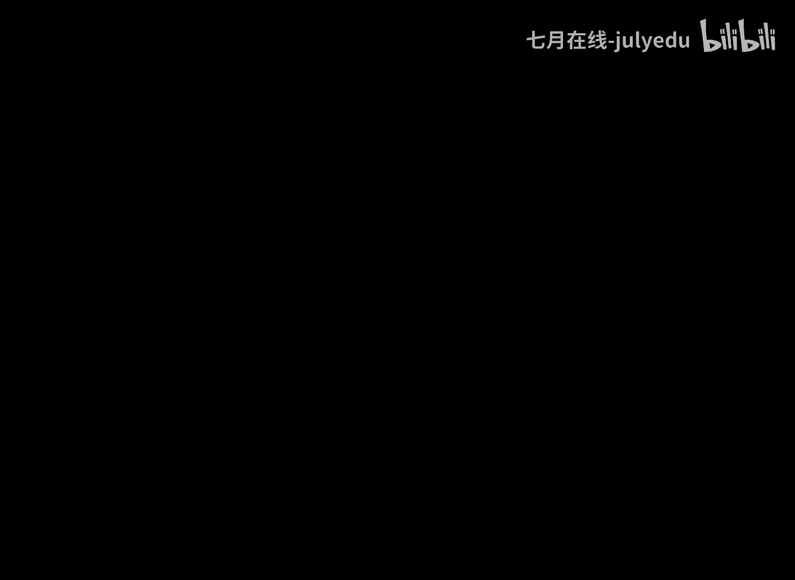
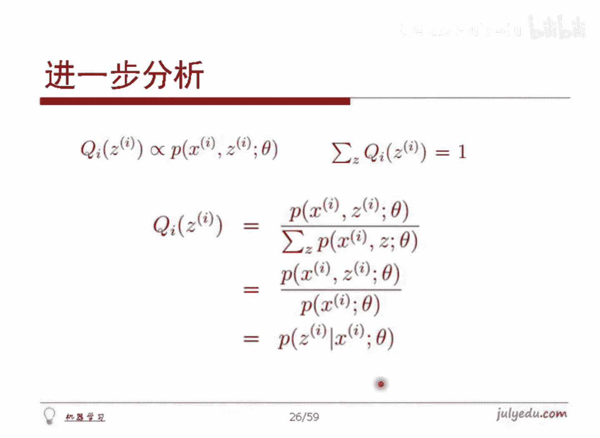

# 人工智能—机器学习公开课（七月在线出品） - P2：18分钟理解EM算法 - 七月在线-julyedu - BV1W5411n7fg

🎼，EM算法如何去做呢？这样哈就是说呃假定有M个样本。并且我们认为是独立的，我们想让里边去得出这个样本的概率是PX，但是呢可能有引变量Z。那这样我们想得到PXZ它的这个模型的参数。

比方说对于我们这个身高数据而言，X是身高Z就是性别，对吧？我们就要得到带引变量的概率分布，这就是EM算法哈，它怎么做呢？这么来考察哈。首先我们仍然是利用极大自然估解。然后呢，PX这么一个东西。

它的参数可能随塔了，对吧？反正总之是这么一个概率分布，然后呢对它乘积之后取对数，那就是先取对数再再加和嘛，对吧？因为M样本，所以写成这么个式子，这个是我们的目标函数自然函数对数自然，对吧？

对这样一个对数自然呢让这个Z暴露出来，怎么办呢？我们这是一个PX这是一个边缘分布，对Z做划分，因此这就是PXZ这么一个联合分布，对Z求积分，就是加和积分一个意思，对吧？对Z求积分把Z积掉，就是PX嘛。

所以说这是这样一个东西，这是把Z把它强制暴露出来得到这个数值，这个就是我们的对数自然函数，现在我们需要估计这么一个主题，对吧？怎么做呢？首先这个Z是一个引变量，直接做是不方便的。我们可以怎么做呢？

先对这么一个自然函数，如果能够得到这个自然函数严格大于等于某一个数。我们先说想法哈，先说思路，框架型的东西。如果这个东西它是大于等于某一个值。然后呢就是严格大于等于某个值某个函数哈。

就是大于等于某一个未知的一个简单的一个函数。并且我们方便求出那个我们大于等于那个函数，它的极大值。我们如果能求出这个事情来，那么那个新的函数的极大值总不于比它要小一点嘛，对吧？那么说我们用。

简单的那个函数极大值来代替它的极大值，就能够使当前这个极大值稍微变大一点。不停的把这个东西迭代下去，最终使他收敛下去，得到这个东西。这就是基本想法哈。好了，我们看看他怎么做的。呃。

左边这个图呢是我们在第一次课跟大家聊过的，就是用python写的代码，然后画这个图了，还记得吧？就第一次课跟大已说过的事情哈。然后呢，我们看看利用它怎么做事情哈。首先这个里边呢这个。呃。

我们还是把这个式子写出来哈，这个式子把它拿过来，得到这个就是这个PX这么一个分布，然后取对手加和，这不数然函数嘛，对吧？让这个Z暴露出来去得到这个东西。这是刚才那个东西啊，只不过把样本体现出来。

第I个样本第I个样都做一遍，因思是这个东西哈。假定说对于引变量Z而言，这个XI这个这个样本哈，它就带着1个ZI。比如说1。90那个样本，它就背后带着一个0。9倍的男，0。1倍的女对于1。

55那么一个样本，它带着0。2倍的男0。8倍的女，对吧？任何一个样本，它其实都背后带着一个引变量Z的，对不对？OK我们就假定第I个样本的背后的那个引变量Z，它的概率分布情况记作QIZ，可以吧？

这是第I个样本的那个分布QI把Z那个I值带进去，我们就认为是第I个样样本的引变量的分布，记作这个QI哈，是Z的一个分布，就这么个事情哈。那我总可以除上一个式子，乘上一个式子，它是一样的嘛，对不对？

就是这个东西没错吧。大家注意，还记得咱刚刚在这个PPT里面最开始给出一个jason不等式吗？jason不等式，这是什么？我们把这么一个分子，就是这个P除以这个QI这个式子哈，把它看作是一个整体。

相当于这个Q什么？Q是一个概率啊，相当于是对这么一个整体求期望。对不对？我们总得把这个Q把它拿到前边去，把这个log拿进来。那么这样的话，这样一个值本来按正常而言应该是小于等于的。

但是对数呢它是一个不是凸的，是一个严格凹函数。所以说本来是小于等于，这应该是凸这是凹的，所以是大于等于这么个东西。就把这个log放到里面去，把Q拿出来就得到这样一个东西。这个是EM算法的关键一步。

这一页哈理论层面的关键一步。大家再看这一页有问题吗？这一页其实跟刚才那个伽马IK那一页。两两页对应啊，这是两个最核心内容。大家看有问题吗？变符号。变符号指的是这个P这个Q吗？哦，就这对吧？

就是这从这一行到这一行哦，这个地方是吧？哦，这个怎么得到的哈？O我们再换个思路哈，刚才没听懂，对吧？换个思路哈。😊，我们这么来看哈。😊，嗯。我们来看这个东西哈呃。😊，我们现在把这个P什么时候东西除以Q。

什么时候东西，把它看作是一个数总可以吧，看的是个整体，是个数，这个数是什么呢？这个数对应着这个图上的某一个点，比如说这个值对应着五角星，这个点总可以吧。就是这个值对应的这五角星这个点。然后呢。

比方说这个这个Z啊，他可能是个男性，对吧？那我能求出来这么一个点。把Z2那个女性在带你用的求是一个点，对不对？那个点我对应着这么一个五角星这么一个点，总可以吧？这是两个点，对吧？这个Q是什么呢？

这个Q指的是它有0。8倍的女，0。2倍的男，对不对？那就相当于呃这么一条这个值，这是左边这个五角星，因这五角星，他们两个画条线段连出来之后呢，比方说左边这个是男哈，右边这个是女，我们让取0。8倍的男。

0。2倍的女，那这样意味着靠近于男的这个点在这个位置大概是有0。8倍的他0。2倍的他，对吧？所以更靠近他嘛，就这意思，对不对？所以说0。我们就对应着这样一个值，从它到它取位值出来，可能是在这儿，对吧？

就是大概是本来是这个点和这个点，它可能得到0。5左右的一个点，对不对？左右一个点哈，那对这么一个点取完了取对数，那不就是这个点取的是红色的点吗？这就是上面这个式子哈，红色这个点求出来的。

你再看底下这个什么意思，仍然是这个五角星在这儿啊，对不对？这五角星先取出来，然后这个再取出来，先取logg，那就是取完这条线段，用这个线段上靠近0。20。8，那就是在线段上取一个点。

那就是手标手在这个位置，在线段上一看这个图，线段在下边取线在上边嘛。那显然上面的大底下的小嘛。因此就得到大于等于了。对不对？😡，OK这样看有问题吗？呃。

所以这个咱机器学习班是我个人觉得哈就是还是有些价值的，真的有些价值的。就是说里面一些内容经过过我们的这个思索哈，就是说如何让大家看的更清楚。比方说这这个PP这这几页这这这几个公式哈。

大家在网上各种各样地方都能找到，这种资料是完全不缺的对吧？比方说这个我们等会有参考文献哈，是给出是在哪截出来的。这个图是我自己画的哈，为了配合这个东西来去解释的。但这个可能就在网上没有啊，对吧？

所以他还是或多或少有点用啊。这样，有人问为什么log没在Q的前边？哦。我们是什么？我们是一直把P除以Q这个这个分子这个是这个这个分式看作是一个我们的整体。对这个整体五角星在这，五角星在这去去去是对它求。

期望求Q，还是说对logg被的他求期望。对吧我们摆他那整体是对先对他求均值，再求log。还是先起logG再求均值，就这个东西，对不对？所以。呃我们一直是Q在前老在后哈，对吧？事实上。

你如果logg在前Q在后的话，相对就没了，它就光Q成Q就就消掉了，光手批了又回去了，对不对？嗯，为什么？为什么这个东西？是联合分布，而不是条件分布。

因为感觉PX givenZ在引变量Z出现的条件下出现X概率，这样解释似乎也行啊，注意这样解释是不行的哈。就说我们现在取的是联合分布。取的并不是比方说我们拿到个样本数据，拿到这个比方说1。

9米这么一个样本数据，不是说。如果是男的，他是1。9米的概率是多少，不是这么个意思。他指的是拿到1。9之后，看一下1。9这个样本和是男性联合分布起来概率是多少。比方说是0。9，他和女性是多少，是0。1。

只是干这个事情啊，不是干。当给定男女之后再看他的身高的这是两码事，对吧？OK哈，我想应该是解释清楚了，是吧？😊，就是包括这个有朋友问到是。哦，我在说哦我又又说了哈，就这个是对应哪个点是吧？呃。

他呃底下这个哈。你看哈这是一个数，这个分式我看的是个五角星总，可以吧？这是个点，对吧？他取对手，那就是这个蓝色点，这是男性的，他取对手是另外一个是女性的这个点对吧？然后让他取一个0。8倍的一个点和0。

2倍，这个点，就是一个男性在这，一个女性在这儿连起来取一个值就在这，对吧？所以说底下这个是是线段上在动，上面这个是红色的这个函数值上在动啊，对吧？所以是大于等于哈。好了，我们就完成了这么个操作，对不对？

好了哈，然后呢。😊，没错好的，没错，就这么看进去。红，因为红在这上，这个线在在下嘛，对吧？😊，下面呢我们就来解释一个事情了。那么说二者在什么情况之下可以取等号呢？这个和这个什么时候取等号呢？

只有一种情况，就是这两个五角星，它们完全重合的时候，这个线段才能够线段把它退化成一个点了，这个这个红色这条这个曲线也退化成一个点了，二者才能够取等号，只有这一种情况，对吧？这一种情况意味着什么呢？

就意味着这样一个值必须是一个常数。对吧这个值你你不能两五角星放在这儿，你得指这这五角星都得在一起，对不对？所以说这个值B是个常数P这个东西，除这个东西是个常数，也就是得到这样一个结论。

当二者相等的时候可以去等号，对吧？当二者相等的时候，可以取等号就什么意思呢？那就意味着这个东西哈，注意哈这个Qy哈，其实咱一直是假定出来的，它还不知道是啥呢，对吧？那是啥呢？

上面这个式子我们是大体上能猜出来，对不对？是X和Z的联合分布嘛，那我们想想哈PXZ这种情况给定了，想求QZ他们俩。他们俩是等于常数的那就意味着P和Q是成正比的关系嘛，对吧？也就是Q和P是成正比的嘛。

它俩是成正比的，并且我要求的是这个Q的若干值加起来得是一呀，这是我们的。那个那个那个呃。概率的加和为一，这是条件性质决定的，对不对？那这样的话，它俩还是成正比。

那我就用这个值做分子做一个规划不就可以了吗？把所有的加起来是底下做分子，然后做规划，上面这个用它做分母，分子不就够了吗？对吧？用分子出分母嘛。而这样这样一个式子对Z求加和，把Z就就积分积掉了，对吧？

因此这么一个联合分布就变成了边缘分布，Z没了，就变成它了。上面这个是X和Z的联合分布，底下是X，它的边缘分布。二者一出，显然是在X给定的时候，Z的条件概率。对吧。所以说哈我们的这个QZ哈它应该是什么呢？

这个QZ就直接取得当给定X的时候，Z的条件分布是什么？把这个作为我们Q的一个估计。就可以使得这个重要的式子取等号。对吧。😡，这就是我们这个QZ的含义。QZ是什么？

QZ就是样本给定的时候的引变量的条件分布。好了，我们现在就能够完整的给出EM算法的。标准描述了。就是说首先这个里边做的是什么事情？做的其实是对于这样一个式子，P除以Q这个东西，也就是五角星这个东西哈。

对他求期望，对不对？这不就是那个Q城期求期望吗？而这个东西把它求期望哈转化成为了对这个对数值取期望，对吧？而用哪个分布对它求期望呢？用的就是给定样本的条件分布。对吧。给定样本的条件分布。

用它对于样本值求期望，这就是那个E它的做法。所谓的意义。期望对吧？我们做的是这个期望，其实做的是这个对吧？我我是这样哈，就是说可能这一块对有些朋友听起来可能要比较难了。

我我感觉哈因为呃大家没有听过前面的我们的课程，所以大家会觉得这一块这是讲的什么玩意儿这么怪异是吧？但是呃其实这是一个很重要的一个内容哈，并且我在上这堂课之前，一直跟我们那个学员说。

咱这次课是很简单的一次内容。因为大家已经其实已经知道一些内容了哈呃。可能有些人听起来会稍微有点有点有点难。我我个人觉得哈。好了哈，这是关于EM上面的第一步哈。那下面一步应该做什么呢？

就应该使得让这样一个式子求最大就好了嘛。让它取得越大，那么说我就能够得到更好的值，再反带回去就可以了，对吧？因此我们就可以给出阳算法的整体框架了。第一步。

我们先对给定样本的时候的引变量的条件分布把它写出来，这就是。第1个QZ它的条件分布。第二个把这个QZ带到这么一个式子里面去求这么一个式子的极大值。不管你用任何一种求极值的办法，你把它求出来就是了。

这个咱们EM算法本身不去探讨如何求的问题，你可以用你知道的任何一种手段去求这个函数的极大值。当你求出了这个西塔值的时候，把西塔反带回到里面去就能求出这个Q来。新的Q得到了，再带回去得到新的这个函数值了。

再去求极大值，得到一个这个西塔值了，对吧？再带回去再带回来带回去带过来，总之最终收敛下去了，我们就能把这个西塔值最终估算出来了。好啦，这就是关于EM算法的整体的框架流程哈。😊，呃，大家走到这一步的话。

看。有什么问题吗？我们来说说具体问题哈，就说这里面哈，首先它们俩必须得是常数，也就是说两个五角星在一起嘛，所以是常数嘛，既然是常数，P和Q是成正比嘛？成正比的话，我们想去求里面的QQ和P是成正比的。

我们就利用P嘛，你和P是成正比。O我就让这个P做我的分子，它不是成正比了嘛？还得要求你的加和为一啊，所以除的是谁呀？除的是所有的分子的加和就好了嘛？这不就是保证了第一个和保证第二个嘛？

不就得到这个式子了嘛？得到它之后，对对基调就是它它除它显然是它嘛？就得道了哈，对吧？其实就几步的事。对吧。😊。

OK是吧，这个应该是星格，对不对？

