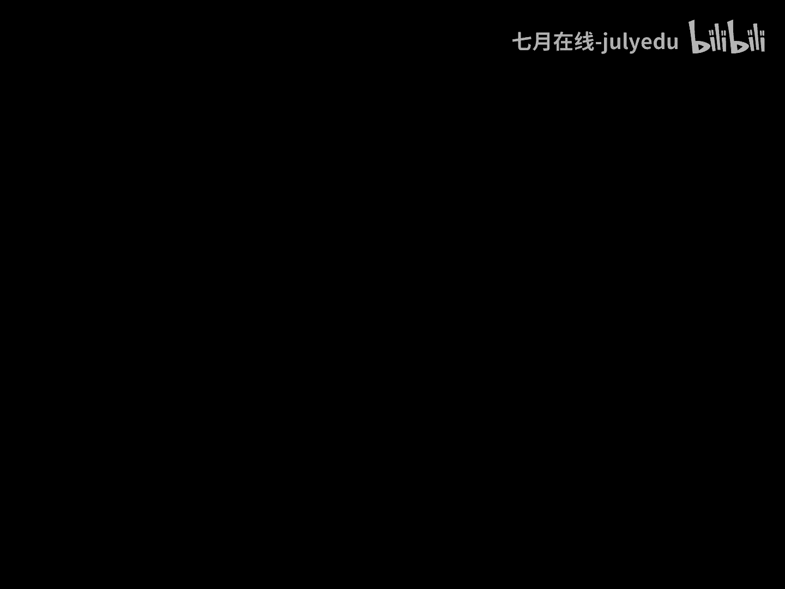
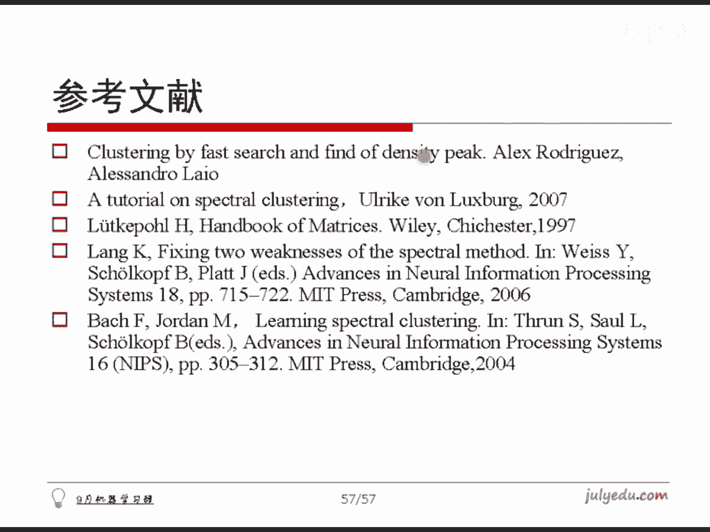

# 人工智能—机器学习公开课（七月在线出品） - P6：标签传递算法 - 七月在线-julyedu - BV1W5411n7fg

。下面呢我们给出时间来简单的来跟大家聊一聊。标签传递算法。因为咱刚才一直讲的是。无监度分类。有些时候哈有些样本是。带标记的大多数是不带标记的对吧？这种就是半监督这种半监读方式，最简单的一种思路。

标签传递算法。并且标签传递算法是在实践当中用的哟。就是你比方说咱的微博那些数据做聚类。你比方说咱那个某一个网站，比方说是做电影的网站哈，然后我想对他对用户的评论做做分类，做专确传递，对吧？

也是可以这么去做的。他想法就是将标记的样本，他不是有标记吗？OK这个标记我通过一定的概率传递给那些没有标记的那些样本，最终让所有样本都有了这个概率值，有了这个样本值就完成了这个操作哈。

这就是我的标签传递算法。很简单，我们来看一下啊。标程地给另一个数那个一个data，这是我们的数据。我们假定前A个是已经有标签的，后面是没有标记的，怎么做呢？还是跟刚才差不多算一个我们的转移概率。

这个data给个P这个这个东西跟刚才的那个算。呃，拉式矩阵几乎是完全一样的东西，照搬过来就行。大家读着代码就好了啊，就是一样的对吧？几乎就也就直接差最后那个加一减1，其他都完全一样。就就不看了啊。

总之你求出。转移概率算的就是DI号跟DJ号的相似度，对吧？然后给定这个矩阵之后呢，我们是算一下这个样本的数目，样本的维度，然后我们假定说迭代100次，对吧？然后怎么算呢？

这个I从第A号是第一个没有标记的，到最后一个M减1做标记。我们就算一下第I号这个值，它应该的标签是谁谁应该把标签传递给第I号这么一个函数哈。然后这个函数在这儿。然后呢，我们先看这个。框架哈给出这J之后。

让J的这个标签传递给这个label，注意哈，J可能都没有标签哦，对不对？如果J这个标签给完之后，标签本身它都为零就算了。完了正常是大于零的某一个值，就把它的标签传递给DI号的这个样本值就是了。

而如何去算呃，某一个。对那个样本它的这个标签值呢很容易算哈，其实就是概率不是都有了吗？概率有了以后，我怎能算出它值来，我随机给一个从0到1的一个数。对吧我就去辨了一下这个数，它落在了哪一个范围以内。

落在哪儿，我就把那个值返回回去就可以了。大家体会一下这一块和这一块哈。这个东西是什么呢？我咱这个是咱在那个算法盘讲过一个就是N首歌歌的这个权值不一样。然后呢，我想随机选一首歌，就那玩意儿哈。

一样的东西就是或者给你三角形，三角形的大小不一样，随机选一个就那个玩意儿跟一样的就是。那套东西啊就是这个算了是累计概率哈，然后把它选出来就是了，选一个值上去，然后把它传过去，简单吧？

这就是所谓的标签传递算法。然后呢，这个就是标签传递的过程，这个是我给这初值哈，就是初值，我是这儿给了一些那个标记过的值，这儿给了一些标记过的值，这是初始情况。传递迭代一次，这不是time吗？

我把time这不能打出来啊，time等于一的时候，我打成图是长这样子的。然后做1次吊销产地就成这样了，20次就这样了，30次这样子40次就完成了。其实。就这么一个过程哈，它是标签不停的去扩散扩散。

最后把所有的值都把它传完，得到一个过程哈。所以这算法很简单，并且。他的时间复杂度很低，在实践当中用处就很广。因为我们实践当中不会去探讨用很复杂的那个算法可能用复很复杂，但时间复杂度不能太高。

对吧所以说这个算法是很好的一个东西哈，就你代码好简单，对不对？然后把它玩出来就是了。多说一句。带宽和淋域仍然会对这个算法造成影响。我做了两个环儿，把它叠在一起的情况哈，然后这儿给出几个样本来。

这儿给出几个样本，一个红的，一个蓝的哈。然后如果你的带宽给的不合适，或者淋域给的不合适的时候，传出来是会很别扭的。比方说假定哈我如果淋域给的特别小。他会发生什么现象呢？会发生可能这一半全是蓝。

这一半全是红。如果给的这个淋域又特别大的情况，就会发生右边这样的一个情况。就是它可能这块红那个大多数是绿的，然后到这儿呢就会发生这种。中间过度地带了，这个也是一样的，中间有过度地带，对吧？

不管是怎么去调，它的这个带宽和领域总是会有各种各样的情况发生哈。我想这个数据。呃。或许是通过调餐的方式已经搞不定了。我我个人认为哈。因为这种情况就是人来看，你都很难。你我要是说这个大圈和这小圈属于左边。

这个大圈和这小圈属于右边也是要对的，你也不能说它是完全错。对不对啊？就是我说这个环和左边这管从这儿拉一条线哈，左边全属于左边或右手流着他这也也也说得过去。虽然咱觉得这个圈是一个，这个圈是一个，对不对啊？

所以这个就说不清了，对吧？所以后面就需要其他的，或者是我们再配合其他内容再去做相应的这个内容哈。另外呢这是参考文献，尤其是这个第一篇，就是刚才说的基于密度最大值距离那个算法，它的那个参考文献哈。

大家可以把它很好很好搜哈。大家直接google一下，就能搜到这个文章，直接下载能得到它的PDF版版本。

