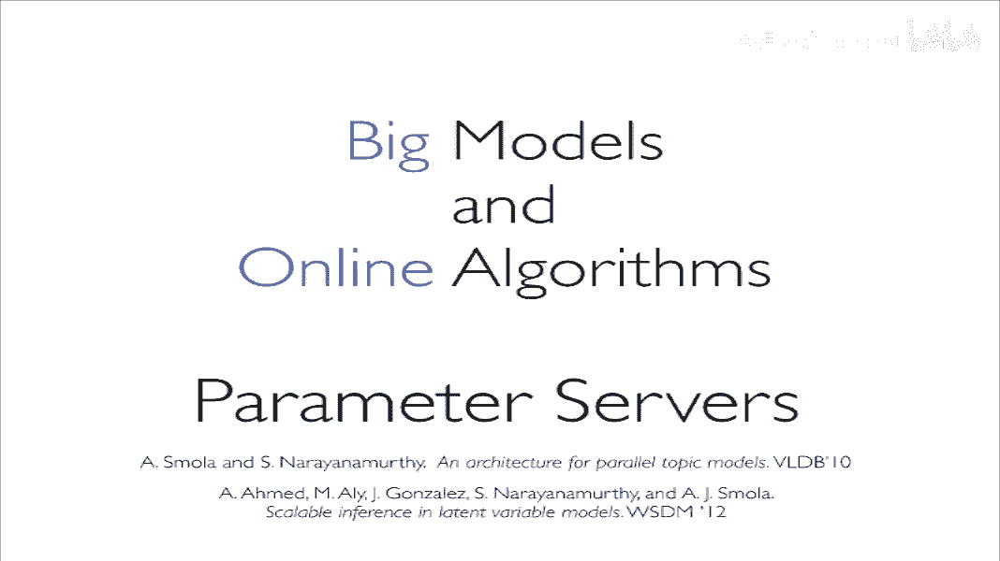

# 人工智能—机器学习公开课（七月在线出品） - P7：分布式机器学习系统的设计与实现 - 七月在线-julyedu - BV1W5411n7fg

行，那我们开始吧。

呃，那个首先那个非常高兴啊能够那个来给大家讲这一次课，然后感谢区月在线。然后我这次的主要是给大家讲一下分布式积极学习的设计，以及我们在实践当中的一些运用。然后我大概简单自我介绍一下，然后我叫马超。

我是现在在北大读PHD，然后同时我现在也是在amazon，然后做一些关于MXnet分布式机器学习的工作。然后这个slics主要是给大家讲一下这么多年来，我们在分布式系统。

包括大规模机器学习上的一些应用以及就是经验吧，主要还是面向初学者。对。

那个我们都知道，因为现在。嗯，大家都说我们big data时代已经到来了，所以这张图就是展示了一个我们现在的互联网公司，嗯，每一分钟它可以处理多少的数据。当然这个这张图已经是2014年的了，所以就是。

他可能现在的我们的现在的数据可能已经比这个更高了。比如说举一个例子，呃，我们的facebook在一分钟可能会嗯会处理将近240万个user的 share。然后包括我们的youtube就是在一个小时。

我们可能会处理72小时的video，就是我们会上传72个小时的video数据啊，一1分钟不是1小时啊是一分钟。所以我们可以说现在的big data呃。

让我们的motionine learning这种技术变得就是越来越好用。为什么这么说？因为其实我们现在用的motionine learning的技术和比如说几十年前，他们做统计机器学习那些人。

我们在本质上这些机器学的机器学习的技术其实没有什么变化。但是由于这几年我们的大数据就是数据越来越多了。所以我们的机器学习算法，才能在这些数据上发挥非常好的效果。

所以说机器学习现在是一个非常重要的topic。在在我们这个b data领域。

嗯，这张图是展示了一下，就是imagenet，大家应该都知道，就做imagenet。我们做图像分类。近几年来的一个就是错误率的降低。就实大家可以看到，我们在2011年的时候。

我们的错误率还是将近是25%的。只向也就如果你是一个25%的错误率，实际上相当于你完全不能用它来就是在我们的实际中做什么有用的应用。但是大家可以看到，现在到15年的时候，就当然17年现在已经就更低了。

到15年的时候，我们已经能够把错误率降降低到将近3%。而对于我们人类来说，我们人类在imagenet上的图像识别错误率大概是在5%这个样子。所以说呃其实短短的45年时间的发展。

我们已经积极学习已经可以让我们的嗯图像识别的能力超过人类了。所以。这说明了什么呢？说明就是这个时候机器学习已经可以用了。就是这个时候机器学习已经不再是单单以前我们在学术上发一发paper。

然后然后写一些热点的topic。而我们现在是机器学习，确实可以拿在拿拿来在我们的实际生活中运用了。所以说。所以说机器学习为什么会变成现在就是这个样子，为什么现在可以越来越work呢？其实它的归根结底。

它的原因一方面是计算力的提升，另一方面是因为我们数据的增加。嗯，对，但我们数据的增加，包括我们的模型越来越复杂，与之会带来一个问题。就比如说。

这张slides展示了我如果我们去训练一个ressonnet，就1个56层的resonnet在这个imagenet。如果你去在它的imagenet data set上的全集。嗯，训练它的话。

我们就是如果你让他训练到一个可以收敛的程度，就是一个差不多的精度，你可能需要花费14天的时间。对，这是就当然这是就是在一个M for zero GPPU上训练。

就是如果你拿单独1个M for zeroGPU来训练它的话，肯定要训练14天的时间。但是我们去我们做过深度学习，我们做过机器学习，应该都知道。其实我们的深度学习或者机器学习，我们是要不停的调参。

就是你需要用一种ad ho的方式，我们去不停的去调试你的模型。而如果你每调一次每调试一次模型，你可能都需要14天的时间，你才能看到结果的话，这显然是不可取的。所以说嗯这是一个挑战。

就是我们训练我们如果在大数据上训练我们的模型会发那个花费非常多的时间。呃，第二个例子是说我们的阿法go阿法go应该大家都知道。然后嗯现在已经打打败了李世时，打败了柯杰，包括最新的阿法goze。嗯。

已经可以展示出人类就是机器在煤气上已经可以展示出完全超越人类的能力。嗯，但是呢google为了训练阿phago其实可能要花费超过1万台GPU呃，当然我们在比赛中，比如说google放出来说。

我们在比赛中，我们可能只需要4台TPU，我们就可以在线的去跟李诗诗这样做对战了。但是这只是一个做inence的过程。如果我们去做training的过程的话。

是可能是需要非常非常大的GPU集群才能完成这样工作。当然google没有给出具体的数字，他们用了多少台GPU去训练阿尔法go。当然这嗯这个1万1万台这个数字是我从另外一个非常有名的华人科学家那里听到的。

就是大家相信大家应该也都知道田园度。他在facebook也是做之前也是在做强化学习方面的工作。他们包括他们也开源出了呃那个dark forest黑暗那个黑暗森林，他们那些也是一个那个围棋的软件。对。

然后是从他那里得知的是google用了大概超过1万台的GPU去训练阿go。对，所以说我们可以看到，对于深度学习这样的任务，我们的计算是非常非常耗时的。所以这对我们的训练带来了一个非常大的挑战。嗯。

除了我们的训练耗时呢，我们会发现我们还会面临另外一个大的挑战，就是我们的模型也很大。首先是我们的计算计算力要求很大。其次是我们的模型要求很大。比如说大家应该都知道LDA这个算法。

就是我们做 topic model，我们要从文档中比如说抽取出这所有文档里的topic。嗯，比如说就举个例子吧，嗯。

老师目老师目他们之前做的letLD他们可能将近我们会做他们的这个这个系统需要处理十的11次方的primeter，就是我们有10的11次方的参数，而如果按照这个规模。

你你你拿每一个参数都是用32bitat float来算的话，我们的模型大小可能是超过400个GB的。以这是在单机是往是远远不能处理这么大的模型。当然现在你比如说用一些superpower的计算机。

你可以处理就是它的内存可能有一个T，但是像对我们这种传统的计算机，嗯，一些就是传统的工作站或者服务器的话可能。是它的内存啊远远远是不能达到这个要求的。当然，训练数据就更多了。

心理训练数据都是以TBU甚至PB来计算的。

对，另一个就是比较有就是比较有典型性的例子。就是说我们做online advertisement，就是我们去做在线的广告点击预估。对我相信应该很多人也也有也也有过这方面的经验吧。

就是我们比如说你去搜google，然后他可能会给你推荐一次，你搜索一个什么词条，然后他会给你推荐一些广告。

然后怎么去给用户推荐他最最想要的广告呢？他会对这些广告做一个打分。然后比如说会展示出嗯用户最可能点击的5个广告或者10个广告，然后展示给用户。比如说在这个做广告点击率预估程中。

我们有一个非常重要的模型叫fieldware factors模型，就是FFM这个算法其实是之前在cargo比赛中提出来的。然后效果非常好。但是我们发现FFM算法一个最大的问题是它的模型非常非常大。

FFM的模型嗯可以说比深度学习模型要大很多。比如说就在。实际的工业中运用吧，我们经常可以发现你做一个超大规模的CTR prediction，我们的model size可能是超过1个TB的。

就是仅仅是model，我们可能就会超过1个TB。我们的数据量就是圈ingda可能是超过PB。所以说呃这也是对我们带来了非常大的挑战。

所以说我刚才介绍这些 backgroundground是为了说明一点什么呢？就是说现在你用一台计算机是完是完全不可能再去处理像我们工业规模，或者是去处理一个我们可以拿得出手的这样的机器学习模型了。

所以说我们的分布式训练已经成为了嗯一个先决条件。就是如果你要处理这种大规模机器学习问题啊问题的话，深度学习已经成为了一个先级先具先决条件。OK呃，我们做分布式机器学习。其实说白了嗯。

就是我们要把我们的任务发放给不就是许多的机器，然后让他们协同的去帮我们训练。然后这张图其实是展示了一个大概的我们呃这是这叫做一个primate server的架构。

就是说我们会把我们的呃任务下发给许多的worker，然后这些worker协同的去训练我们的模型。然后我们会有一个primate server的呃global shared state去做我们做对我们模型做进行同步。

对，但是如果我比如说很多人讲分布式经济学习会议上来就讲什么是primary server，然后primary server里面设计会有什么怎么怎么样的trick，各种各样的细节。但是我觉得。

对于初学者来说，去上来直接就去讲怎么去训练primate server，或者是去介绍这样的stem的细节的话，其实并不是一个很好的方法。我觉得更好的方法是要让嗯我们的用户或者让我们的学生去了解。嗯。

我们的深度学习或者说我们的分布式机器学习的系统，它的演变历程是怎么怎么样一步一步走过来的。我觉得这是一个非常重要的嗯top。就是我们只有知道的历史，知道我们的机器学习分布式机器学习系统是怎么演变过来的。

才能够更好的指导我们去设计新的机器学习系统。所以我们这一次的PPT主要也是从我们从大家最简单的mapre开始，然后从到到park的pri server。

包括到现在非常state of the art的像这种re or reduce这样的技术，我们去对用大家做一个梳理，然后把这把这条线帮大家理清。这样的话，大家在今后的学习过程中。

就是有什么问题就可以相应的知道这我我这一块应该对应着哪一块的知识，我可能要去查什么样的资料。我觉得这可能是对大家一个更好的学习方法吧。对，这就是我这次PPT主要讲的一些东西。好的。😊，呃。

我们把分布式机器学习去学嗯学习的话主要分为三个层次。对，就首先第一个层次就是蓝色的这个框。我们主要是要去了解机器学习的模型，以及我们的优化方法。对。

这是从我们的数学理论模型上去了解我们的机器学习是一个什么样的，是一个怎样的样子。然后到了第二个层次呢，我们是要去探索分布式机器学习的范式。对。为什么要谈论范式？

因为其实我们的系统的设计是基于我们的范式的。我们只要知道了我们有哪些范式，你无论上层是用market produceuce，用park，用primed server还是用MPI什么任何这样的东西。

我们只要知道了范式，我们就可以知道应该如何去选择我们的上层系统。对，然后知道了范式以后，我们就要去呃设计我们的系统。无论是一个你对于一个系统的设计者还是系统的使用者的话。

我们都要知道这个系统它的设计的一些哲学。就是他为什么要这样设计。然后这样设计对我选择嗯什么样的机器学习有什么样的帮助。我觉得这一点是比较重要的。所以这一次嗯我们可能就沿着这个思路来为大家讲。

从最底层的数学模型到范式，然后到系统的实现，给大家梳理一下分布式机器学习者这的三大块。对，首先我们可以看一下分布式机器学习的呃数学的一些也不叫数学的一些东西吧。就是我们的一些模型的理论。对。

这个这张slides其实是来自于微软研究院的刘铁岩老师在tri VI2017上做的一个ttuial上嗯，分享了这样一张sdes。其实我们可以看到就是。我们对一个机器学习模型，我们其实主要关注这六大块。

首先是我的模型是怎么样的。其次是我如何去就是它的inference是怎么样的，或者我们说它的prediction是怎么样的。就它怎么去做预测。

然后其次就是我 evaluationvalation就是我们要怎么去验证这个模型，它的是好是坏。然后其次就是我们怎么去优化这个模型training loss。

就这里evaluation和training loss，它俩可能是一样的，或者也可能是不一样的。因为其实很多情况下有一些evaluation是很难直接你去对它进行数学上的优化。

所以我们可能会换一些更通用，就是在对优化算法更友好的方法去做我们的training loss。对，然后包括我们还要去对算法进行正则。对，然后最最最下面一点也是比较重要的，就是我们选择怎么样的优化算法。

只要树对于任何一个机器学习模型，我觉得就大家拿到这个模型以后，都可以按照这6点看一看，把它梳理一下，看一看你能不能嗯把这6点这个机器学习模型的这6点呃，重重要的地方，你能梳理清楚。

比如说我用的是什么样的lo，我用怎么样的优化算法。然后包括我的模型做inference的时候是怎么给它打分的对，就是这些我觉得拿到一个模型里以后，大家按照这6点去梳理一遍。

基本上就知道这个模型它是怎样work的。OK我们举一个简单的例子，就是说，比如说我们说浅层的一些浅层的模型。比如说 linearar model，我们的这个co function是怎么样的？

就是我们如何对它进行打分，或者如何进行对它进行prection。其实很简单，就是把我们的权重向量和我们的feature向量做一个点点成就可以了。而比如说做 model的话。

我们可能是会对我们的向量feature做进行一个比如说高斯做一个到高维的映射。包括像我们的FM或者FFM这些模型其实是在自动的为我们的模型进行对我们的feature之间进行一个interaction。

就是说我们可以对它进行一些模型的呃交互。然后这样的话也是为了让我们的模型表达能力更强吧。对我们的浅层模型的好处是我们的可解释。首先它很简单，并且可解释，然后计算的很快。

所以尤其是相对于我们这种线上CTR预估啊这种这样的这样的应用场景。我们其实像这样的大规模线性模型，包括FM这些模型都是用的非。常多的。然后与之相对应的，比如说是我们的deep model。

就是我们的深度学习呢，比如说你无论是做一个全连接，还是做一个卷积网络，还是做RN，我们都是我们的就是表达能力，铁定都是比我们的线性模型更强的。但是与之对应的就是我刚才说的去训练一个深度学习模型。

它需要花费的计算力也非常大。然后这张slis是总结了一下我们的一些优化算法。就是说我们的优化算法嗯，可以看到，从最早其实我们的梯度下降是在1847年就提出来了，我们梯度下降。

然后其实一直到近些年来嗯提出的各种各样的一些随机算法。我们会发现，其实优化算法是经历了一个非常长的演变的过程。但是我们到头来之后我们发现其实梯度下降，我们最就是最早期提出这样的算法。

反而也是现在用的最多的嗯一些算法，只不过我们对它进行了一些改变。比如说我们把它变成minibankch的SGD，或者把它变成了纯的随机梯度下降。对，但是其实这样的理论就是它的理后背后的理论模型。

其实都是一样的。嗯。ok嗯。大家可以看到中间有一条分界线，就是说嗯以呃2010年左右吧，那么大家可以大概以这个时间点为为为界限。我们之前的算法我们主要是叫deterministic algorithm。

就是什么叫deterministic algorithm？就是我们这样的算法都是确定性的。换句话说，就是我们可以在数学上可以保证我们这个算法进行的每一步嗯都是一个精确的。

就是我们精确的指导我们的一个优化目标的。而当我们的2010年之后的这些模型，我们把它叫做tochastic algorithm。就是说这些模型开始变得很随机了。

就是说我们不要求每一步都是一个最精确的嗯梯度下降，或者每一步，我们要做一个最最精确的优化。我们可以让每一步只是进行一个随机的优化。但是我们最终把所有数据变利完了以后。

我们可能这个大方向还是能够优化到我们的最低点。对这样的好处主要就是为什么看到这个分界线是在这儿呢，其实就是因为随着我们数据越来越大。我们的terministic algorithm。

已经越来变得越来越不适用了。因为对于大数据的话，我们不可能每一次做每一个梯度下降，我们都要把所有的数据变利一遍。所以像这样的随机梯度下降，包括像这种并行的。嗯，随机梯度下降会变得越来越有优势。

就是说嗯我们的资源利用率可能会更高，包括我们的计算效率会更高。这样的话对我们的大数据是更友好的对，所以大家其实可以看到，现在不论是做神经网络还是做呃这种大规模线性模型。

其实我们用的优化算法都是随机的梯度下降。对。呃，像梯度下降这个算法应该大家都已经非常熟悉了。所以在此我也不就是详细讲了。对，但是我们现在主要是关心的是，当我们的数据量非常非常大的时候。

我们怎么把我们这样的随机梯度下降去运用到一个非常大规模的数据集上。然后也就是我们要去怎么样去设计这个系统，这是我们这次主要关心的地方。首先我们可以看到嗯。呃。

这张图展示了一种就是分布式机器学习的一种模式。呃，我们把它叫做数据并行。数据并行什么意思呢？就是说我们由于训练的呃训练样本非常非常的多，包括我们的模型可能非常非常的大，我们一台机器都是不能解决的。

所以我们首先我们需要把我们的训练数据把它划分到不同的机器上。比如说我们用100台机器，然后同时存储这些模型，每一个模型可能比如说我们有我们有1000万个数据样本的话，那比如说每一台嗯用100台机器来存。

然后每一台机器存100条。对。然后嗯其次的话就是。我们需要把我们的模型划分到不同的机器。因为我们刚才说我们的模型可能也很大。比如说像我们做那个LDA可能有400GB的模型。

所以我们一台机器也是装不了模型模型也是装不下的。所以我们需要把我们的模型也划分到不同的机器上。这样话其实我们就组成了两个部分，就是蓝色的部分一般把它叫做worker。然后绿色的部分。

我们一般把它叫做serv，然后这是一个典型的pri server架构。然后我们的对于每每一台worker来说，我们其实我们的训练算法和分布式呃没有呃和单机没有什么区别。

因为我们还是在单机训练一个嗯单机的这样的串新的算法。然后在在每就是在某某一个时刻，然后这些大家所有的worker可能会需要进行一个同步，叫schronize，我们就继续进行一个同步。

而这个同步的过程是发生在pri server上的。具体怎么同步呢？比如说我们的可以每一台机器嗯算了一部分算在一个时间窗口内，把我们当前更新的这些模型的梯度全部发送给这个pri server。

我们的primary server拿到这些梯度了以后，会把我们对应的就是相同的feature ID上的grdient。我们做一个相加。相加完了以后呢，我们再更新到当前的pri server上。

然后我们的prim server拿到了这个新的model以后，我们会把我们这些梯度呃，会把我们最新的模型再返还给我们的worker。对这这是一个比较典型的prim server的例子。

或者我把它叫做data parallel的一个例子。我们关心的另外一种模式其实叫嗯model parallelism，叫模型并行。呃，模型并行。我们是说我们把一个模型划分到不同的机器。

比如说在这个例子中，我们把一个神经网络的模型划分给4台机器，让他们同时训练。但对于每一次的训练来说，我们四台模型，四台4台机器上训练的是同一个数据，就是我们拿同一个数据在4台机器上去训练。

但是每一个机器训练的是不同的一部分。然后大家可以看到，就机器与机器之间，我们会有一些权重就是交叉的地方，就是或者说我们是跨这这个权重可能是要跨两台机器的。

这就是如果一旦发生了像我们的这种权重的需要跨两台机器的话，这种情况就是我们需要在机器之间做就是做同步。这这也也其实和我们的刚才的data parallel是类似的。

我们的d data parallel是说我们模型在嗯大家都有一个g，就就大家都有一个本地的模型，然后在嗯不同的时刻，大家可能要会去同步一下这个模型。

而到了model parallelm是说我们不同的机器有一部分模型，而且也是要到某一定时刻，我们会对这个模型进行一个同步。所以说从这这里面我们可以看到，其实做分布式机器学习，我们在做什么。

其实最重要的就是在做模型同步。说白了就是这一点。因为其实我们在嗯单机算的时候，可能就和一个创新的算法没有什么两样。但是分布式机器学习在做什么，就是在做模型的同步。而这里的挑战是什么呢？

挑战是说我们的模型可能会很大，所以我们这个同步的开销可能会变得很大。因为我们都知道我们的呃网络的带宽和我们的CPU相比是要慢很多的。就即使你现在用比如说万兆网用infin band这样的呃非常快的网卡。

它去和一个GPU或者和1个CPU就算和1个CPU相比，它的速度也是非常慢的。所以说嗯这里如果你不不能很好的处理我们的模型在网络上的同步的话，这个同步开销会成为我们的系统的瓶颈，也会拖累我们的整个系统。

所以说我们做分布式机器学习，我们在做什么，我们做的就是如何高效的进行模型同步。对，首先就是我们要明确这一点。OK我们知道了我们的这样的一个同步的范式了以后，我们就要说那我们选择怎么样的嗯系统。

或者说我们要去设计怎么样的系统，可以更好的支持我们这做这样的模型同步。其实这是这张图展示了一个嗯你可以认为是一个积器分布式积器学习系统的一个演化的历程吧。咱们可以看最左下角绿色这一部分。

其实这是最早期的，可能是从04年开始，然后一直到10年11年左右，大家用的非常多的一种范式叫mapred。对，这个是jeing在04年的OSDI上提出来的一种范式。我们去拿其实这个范式。

大家一开始嗯google内部有一个广告系统，其实一开始真的就是拿mapreduce在去做这样的大规模积器学习问题。然后逐渐的我们大家发现了mapreduce有问题，然后把它演演变到我们的spark。

但其实spark和mapreduce在本质上没有什么区别。他们都是他们在范式上或者说在系统设计的 architectureitecture上，他们都是有这种iterative的mapreduce模型。

对，然后这种这种模型一般是同步的，我们发现同步其实不高效，我们可能想用异步的方式。这个时候我们就演化到了。比如说primate server这样的。

就是我刚才介绍大概介绍一下prim server这样的系统架构。然pri server这样的系统架构，我们会发现它嗯是很高效的非常 efficiency，但是它缺乏的是一些好的抽象。

比如说我们去在primpri server上构建机器学习算法模型的时候，你可能需要写很多很多的代码，这对用户可能是不友好的。

所以就演变到现在比如说我们的tensorflow包括MXnet嗯这样的数据流模型可以给我们用户一种更加直观的方式去编写机器学习程序。而具体背后它是如何并行的。

其实用户并并不要去并不需要去管它都是由背后的引擎来自动的帮我们进行并行。比如说像MXnet，我们可以帮你做数据并行，也可以自动的帮你去做模型并行。而用。压根儿就不用去管，我后面是怎么做的。

那接下来我会把这。几种模型的演变方法，就是为什么要去怎么去设计，包括他为什么要一步一步的演变，会给大家做一个比较详细的介绍。首先我们来看一下像maproduce这个模型。

就是我们从04年到10年这段时间，我们为什么都一直是在用这个方式来处理我们的大数据问题。对，我们先来简单的复习一下。我们刚才说我们做分布式机器学习，我们需要在每一台机器去选算我们的一个本地的模型副本。

然后我们需要得到这些模型副本以后，我们需要把我们的统计量叫sufficient。我们要把我们的统计量发送给我们的一个可以去就是把它们进行 merge的这样的一种节点。

就是我们要发送到一一些可以把它把这些嗯你可以认为是收集器吧，我们需要把它发送到一个收集器上，然后把我们不同机器上的这些统计量把它加起来。这里的统计量，其实大家可以理解为，比如说对于梯度下降来说。

这样的统计量就是梯度。然后如果比如说呃像呃如果你做LDA的话，你去用gaap sampling去做的话，它可能就是它的统计量，你可以认为嗯就是。它的统价你可以认为就是一些直方图。ok。对。

然后我们需要做的就是嗯去优化一个lo。比如说对于一个logistic regression来说的话，我们优化的比如说就是一个log loss，或者我们把它叫做croenttropy loss。

然后我们的所有的机器去并行的去优化这个los。然后我们需要每一次怎么去优化这个los，就是我们找到这个los函数的导数，然后每一次去通过这个导数来更新我们的model。对。

这是我们一个对我们这样机器学习一个简单的复习。那mapreduce它的抽象是怎么样的呢？嗯，是这样的，就是对于每个maproduce任物来说，它的有一个map和一个reduce。对于map任务来说。

它会把嗯它会扫描你的文件，然后文件的每一行呃它会认为是一个record。然后对于每一个record，它会你可以自自己写一个map函数。这个map函数需要输出的是嗯一系列的key value。

就是你经过这个你处经过处理完了以后，你需要把这个record变成key value。如果对应的我们的机器学习里，我们会发现嗯一般我们的key，就是我map produce进行嗯map阶段处理完以后。

我们的key就是我们的feature，或者我们可以叫做feature ID，就是你你这个key来表明你当前处理的这是哪一个feature上的嗯梯度。

然后我们的value其实可以你就你就可以认为是算的是一个梯度吧。这如果你拿这个word count做例子的话，就是你去扫描这个文本，然后对每一行每一个嗯word那对每一个单词你会给它生成一个一。

就是说我们这个表面当前这个单词出现了一次。然后对应的我们机器学习上，我们就说key是我们的feature，valueue是我们的 gradientdient。而我们的reduce是干什么呢？

我们的reduce说我们会把相同的key，我们会把它发送到同一个节点上。然后我们会把这些key进行一个merge，或者我们可以叫做把这个key进行一个相加。

这样的话带来的好处就是我们嗯所有机器在不同机器上算的统计量，我们可以更新到一个局部了。这样的话我们就得到了一个全局的统计量。然后有了这个全局的统计量，我们就可以用这个统计量来更新我们的model。

但是对mapreduce这样的模型，其实你会发现嗯就就以它的表达力来说，它已经可以完全处理很大一部分的机器学习的任务了。对。

其实在angual nG他们在2012008年的niips上有一篇嗯文章叫做呃具体名字我忘了，但是他们是就是讨论就是mproduce这样的范是是否适合来处理机器学习这样的任务。在当时08年他们那个时候。

ang n G他们的回答是是的对，他们说maproduce他们就是总结发现maproduce其实对于当前主流的这些机器学习算法都是能够进行一个很好的表达。然后当当年这篇论文是发在niipps上。对。

但是我们来探讨一下，为什么其实mapre并不是很适合去助理处理积极学习的任务。我们还是以这个logistic regression为例吧。

我们logistic regression我们去呃优化这个呃logistic regression，我们需要干什么呢？就是我们最终可能需要得到一条直线，就是可以把我们的正力复力分成两边儿。对。

然后我们算的时候会一步一步做一个iterative的这样的更新，然后最终可能找到一条线可以差不多把这两嗯把正力和也负力分成两边。嗯。

grading descent我们一般去会去优化一个呃log loss。对我们去优化一个log loss。对这个呃log regression。

这样的话就要求我们的学习算法需要每一次都要去从我们的就是比如说你要从HDFS中sble出一个一部分的data。然后我们对它进行梯度的计算。然后进行完梯度的计算了以后呢。

我们需要把它们通过reduce merge到同一台机器上，然后再对它进行一个model的更新。这是一个大概是整整个这样的一个流程。但是我们需要反复的不停的迭代做这样的一个过程。

但是我们会发现mproduce的设计原理其实并不是非常适合做这种迭代型，或者我们叫做mote stage的任务。大家可以看到，这是一个简单的例子。

比如说首先嗯第一轮我们的initial model叫做W0。然后这个时候我们会map任务会从我们的training data中把数据加载进来。然后通过map reduce过程以后。

然后我们会把这个我们得到的当前的梯度或或者我们可以把你可以认为模型也可以。我们会把我们当前的模型再重回磁盘。这个时候呢我们会得到一个W1，我们从经过一轮的迭代，从W0变到了W1。

但是第二但是我们一轮迭代体验是不行的嘛，因为我们可能要做非常多的迭代部分迭代步骤。然后这个model才能收敛。所以第二次呢我们会用呃我们的会mapreduce会继续起一个mapreduce任务。

然后从我们的training data中sle出呃一部分da，然后去做做第二轮iteration，然后我们得到W2。对，一次反复的我们会反复的去做这个过程。然后直到我们的模型收敛。对任务就结束。

其实大家如果用过马ho这个库的话，就是嗯前几年比较火的一个机器学习库，就是他们在mapreduce上做了一个封装，就是嗯可以让mapreduce去做一些机器学习任务。

你会发现嗯马hot他会需要自己用户你需要去自己写一个脚本，或者说马浩t帮你写好的一个脚本，就是这个脚本它在干什么呢？他在不停的起mapred任务，然后不停的把数据从。从数呃数据从磁盘中读到内存。

然后把我们的模型从内存中再当补到磁盘，然后并且它需要写一个脚本，把就是许多的maer任物连起来。对，这样做的话，其实带来的问题是什么呢？我们显而易见就是每一每一个iterative的训练。

我们会发现我们的。训练样本所有的训练样本都被加载了一次，这个其实是非常大的开销。就是如果大家用过LR或者FFM这种FM这样的模型的话，大家其实会发现对于。广义线性模型。

或者对于我们这种嗯大规模稀疏的线性模型来说，我们的数据读取的开销其实是比你模型的计算开销要更大。对。所以说相当于我们每一次都要把数据从我们的磁盘中拷贝到内存，然后再进行计算。

我们最后发现我们的数据拷贝成为了瓶颈。我们的数据拷贝就是严重的影响了我们系统性能。所以这也是mapreduce提出以后，大家用mapreduce在做机器学习任务是发现的最最最痛的一个痛点。

这是第一个部分。第二个部分是说。我们每一次reduce完了以后，我们不能直接把我们的gradient做一个更新。我们可能需要把我们的gradent，我们把它先存到磁盘上。然后这个时候我们可能需要用脚本。

然后把我们这些gra再拿出来，然后再维护一个嗯模型的一个变量或者说模型的一个数据结构，然后更新我们的模型数据结构，这个时候再把我们的模型发送给下一个stage的preduce任务。这样来说的话。

我们发现在模型这一块，我们又有一个就是和磁盘的交互。对，当然这个模型和磁盘的交互，没有我们嗯之前的数据和磁盘的交互影响那么大。但是它对用户的编程感觉来说，就是从用户的编程上来说是不友好的。

因为用户我们得到梯度了以后，我们其实更想做的就是直接可能用梯度下降就去做一个更新了。但是我们这个时候不行，我们得把我们的梯度先全部dump到磁盘，就是用reduce的话。

就是还是要把一大堆的key value，我们要d到磁盘，然后我们再去解。个KY来更新我的模更更新我们的我们的模型。对，所以这就是我们说呃mapreduce在做机器学习任务上的一个痛点。

所以说我们要做的就是我们要去优化我们这样的iterative的prouce任务。那怎么做呢？其实应运而生在2012年嗯spark对，就是usberkeley他们出的spark。

然后发嗯这篇论文发表在NSDI2012上，其实spark你从现在看的话，嗯当当年在那个年代发就是做这个park还是比较有远见的一件事。

不不过当然现在可能像tensorflow m xnet这些嗯框架已经超越它了。嗯，当然我是说在做机器学习这块的能力已经超越他了。但是spark在当年那当时那个年代提出来还是比较嗯算是一种突破吧。

spark的其实思想非常简单。我们刚才不是说我们做每一个mapreduce模型的时候，我们都需要从我们的训练数据中，就是我们的磁盘HDFS中把训练数据取出来。

所以我们spark就想我们为什么不能把这些数据，我们就c在内存里呢？我们只需要读一次，然后我们就把我们的数据c在内存里。然后我们这样的话，我们进行mapreduce任务的时候。

我们就不需要再从磁盘里拿这些数据了，我们可以直接从内存里来取。对，这几这是一个很直观的思想。包括我们对，但是就是这样一个简单的改进，我们可能会带来一个10到100倍的。就是性能的提升。对。

其实现现在看做st的人，大家都知道内存比此贪块。但是为什么当时只有spark就是把这个东西做出来，并且推广的比较有影响力呢？对，这是大家可以思考的一个问题。对，就像我们刚才说的，除了我们每一次训练。

不用再把我们的训练数据从我们的磁盘中拿出来了。我们每一次做完reduce了以后，其实我们也不需要再把我们的模型去当不到磁盘上。我们只需要把我们的模型发送给。

就是直接嗯交给下一个stagereduce任务，然后来做就可以了。然后这样我这样相当于我们又节省了一次那个磁盘的开销。但是其实sk的嗯虽然我们感觉park好像很完美。

我们用内存可以加速非常就对我们的计学习任务有非常大的加速。但是它的一个问题是什么呢？就是它是个emem的系统。对ememory的系统呢有两个问题。首先是说，如果它memory不够怎么办？

因为我们知道现在的数据动不动，就是上几TB的训练数据，你就算拿十0台机器，你去算吧，你每台机器也要用几百个G的内存去存它。所以这其实对于很多尤其实是对在学校里做一些科研的人来说，其实我没有那么多的机器。

然后没有那么多的，有大内存的机器。所以其实spark有的时候挺鸡肋。就是说当数据量真的很大的时候，你是没有办法把它存在内存里的。对，第二个问题是说我们存在内存里的问题。如果我们比如说mapreduce。

我们算算算算到第5个mapreduce的时候，我们的这个任务挂掉了怎么办？挂掉了怎么办？难道我们需要去就是重新算一遍吗？对，起码p6用的line抑制的方法，其实就是其实就是这样。我们从第5个。步骤。

比如说我们从第五个嗯iteration的时候，我们的模型挂掉了，但是我们的模型是存在磁盘上的，我们并没有把它在呃我们的模型是存在内存上的，但是并没有对它在磁盘上进行一个副本。

所以这个时候没有办法嘛park就需要用lineage重新计算一遍。但其实你大家想想，如果你现在去做一个深度学习任务，你需要跑100个apple。然后你跑到第99个的时候挂掉了。

然后这个时候sk时我要好吧，我要从头再算一遍，这个是大家不能接受的对。所以说lineage这样的容错模式和我们做checkpoint checkpoint这样的容错模式到底谁好呢？其实有一个。嗯。

比较好的回答是这样的。如果你的数据。远远大于你的模型的话，其实checkpoint是一种更好的方法。就是如果你的数据远远大于你的模型的话，你从算的代价就变得非常的高。

而你对模型进行一个checkpoint的副本的代价就变得非常小。所以这样的情况下，我们可能更想让我们的模型去做一个副本，而不是用linege这样的纯意memory的方法去嗯做容错。对。

其实也是为什么park，大家可以看到，其实park这两年。变得好像没有前几年那么火了，这也是一个重要的原因。对，因为现在的机器学习任务的特点，其实ma produceduce也变得越来越不适合。对。

所以这就进入到我们的下一个章节。就是说我们park也不适合做我们现在这种大规模集器学习任务了。比如说我们的模型非常大，我们一些online的这种algorithm。那我们现在要做什么呢？

我们可能会提我们就会提出一种新的计算架构，叫做prime server。行，那个我现带咱们大家先休息5分钟吧，大家喝口水好吧，然后我也看一看那个嗯大家留言板上的些留言，然后咱们一块接着继续讲5分钟。

嗯，行，那个大家能听到声音吗？能听到的话打一吧。

行，好的，那咱们就继续开始吧。行，我们先回顾一下上呃上半堂课我们讲的一些东西，就是说呃我们讲了怎么从怎ma produceuce去怎么做我们的分布式机去学习。然后我们讨论了他的问题。

然后说我们到演变到park。然后我们发现spark也有问题了。park什么问题呢？就是它对应我们这样的，像比如说big model，或者说做一些在线的任务，其实并不能处理的很好。

所以这就提出了一种新的架构叫priate server。我们大概解释一下呃，我们的问题是什么？就是大家可以看一下传统的呃模型，比如说。大家去嗯比如说在sed learn上跑一些他的那些自带的例子。

大家会发现它是这样一种情况，就是说我们的模型维度是很大。比如说我们的模型可能。呃，有比如说你有1万个数据样本吧，你有1万条数据样本。然后我们的模型呃，但是我们的模型比就是很小，我们的数据很大。

但是模型很小，模型可能嗯几十个feature，上百个feature就差不多了。这个时候。我们会发现是说我们的数据是瓶颈，我们的模型很小，模型不是瓶颈。但是现在的一些任务我们会发现演变成一种什么情况呢？

就是我们的模型的维度和我们的数据的模维度就是基本上会差不多了就是。什么意思？就是说比如说你有10亿个10亿条训练样本。比如说举个例子，就是我们做CTR点CTR点击预估。

你有11条10个呃一个 billion的训练样本，然后。你的模型参数可能也是一个B脸，就是你有你也有一个10亿的呃维度的参数。但是这样的带来的一个问题是说，我们并不是每一条训练样本上。

我们都有10亿的feature，而是说我们的每一条训练样本上可能只有几百个维度是有效的。就为什么会这样呢？嗯，大家可以想象一下，比如说。你有一个feature叫做嗯country。

就是你你你有这个feature代表你这个人是什么国家的，但国家的维度可能就有上百。但是你当前你的个人来说，你只可能属于一个国家。所以你去比如说你做一个one hot en了以后。

你的国家这个维度就会变成一个上百位的向量，而你而你当前的用户只会占其中的一个地方，就是以亿维向量。其实像国家这样的feature还比较好了。但比如说你有一些feature叫user ID。

就是他们会直接把user的ID去作为你的一个feature。这个时候你的feature就非常非常大了。比如说你有1000万个user，你有1000万的用户的话。你会发现你也只是只能占到当前的一位。

所以也就是说每一个训练样本上，你这个spars的程度是你在1000万位里面只能占到亿位。所以说这会我们就会发现我们的模型非常非常的大。但是我们的数据非常非常的稀疏。这种情况。

如果我们再去用maproduce，或者用我们的spark去做会出现什么问题呢？嗯，我先举几个例子吧，就是说我们什么情况会用到这样的模型，比如说。我们去做一个垃圾分类，邮件的垃圾分类。

你去用backag of words这样的方法去做分类。我们的单词这个词项量可能是非常非常大的，可能是嗯10万维，甚至是对10万维吧。因为你可能会对5word进行一些就是组合。对。

可能到10万为、百万维都可以都有可能你去做CTR预估的话，你可能会有一个biion的这种模型。包括你像去做topic model的话，也是这样这样的我们也会发现模型非常非常大。但是数据是系数的。

这个时候如果我们再用刚才说的spark这样的模式嗯来处理，会出现什么样的问题呢？就是说。大家可以看一下这个动画，就是说我们当前有一个spark，有个driver。

这个driver是来就是负责我们一个全局的model。我们的driver会把我们的数据发呃会把我们的模型分配给。不同的server of worker，然后这些worker会在本地进行运算。

预算完毕了以后，大家会得到我们的模型更新。但是大家可以看到，我们的模型更新是非常非常se的。因为比如说我们做每一次运算，用一个mini bench，用一个mini benchch去做这样的计算。

我们可能发现我们的模型更新是非常非常spapare的。这样带来了一个什么问题？就是说我们这个时候需要把我们的spae的数据发送给我们这个driver。对我们不需要发送整个模型。

因为比如说你1000万维的数据，你只有一个维度，是你当前的UZ IDD。所以我们当然是只是把这一维的梯度发送给我们的driver就可以了。对。

这个动画就演示说我们的worker会把我们这些稀疏的东西发送给我们的driver。发送给我们的driver以后，driver会对这些稀疏的题度进行一个呃合并。

合并完了以后会更新一下这个driver上的这个global的 model。然后这个时候呢，driver会把我们的这个新model，会bocast给我们的每一个worker。对。

就是因为这是候我们得到了新模型的嘛，所以我们会把我们的它会做一个boardcast给我们的worker。worker拿到新新的模型了以后，相当于做了一次同步。这个时候大家又可以继续算。

O大家可以先看一下刚才这个问题是什么。😊，这个问题就是说，如果我们的模型非常大，你有一个billion的模型，但你每次要做一次boardadcast，你做每一每一次的更新，每一个iteration。

你要做一个broadcast，这样带来的问题就是说我们的网络带宽是根本承受不了的。因为你想这只有一个driver，你的driver，现在你比较厉害吧。你做你是万兆网。你这就算是万兆网，你100台机器。

同时向他发一个，你要你要给一100台机器同时去boadcast的一个一个bi的model的话，那你的网卡是远远不够的。对，所以这是park为什么不能处理我们这种非常大的model这样的原因。对。

这是刚才那个动画，大家可以再看一遍。O。好，这是第一个问题。但是呃我们说像spark这样的模型带来第二个问题是什么呢？嗯，我们说第二个问题是它的同步开销会嗯减减慢我们的训练过程。

会就是对我们的系统性能造成一定的影响。嗯，怎么说呢？大家可以看一个例子，比如说我们现在有三台机器。第一台机器呃我们算的很快，这个iteration可能已经算完了。然后然后过了一会儿。

我们第三台机器可能也算完了。但是第二台机器可能是呃有有一些什么原因，比如说它的机器比较老旧了，或者是它的这个数据data skill比较厉害，所以它可能算的慢一些。然后我们一直算呃motion一呃。

就motion one和motion three已经算了很久了，然后然后然后它才能算完，这个时候嗯。这个时候我们需要进行一个communication，就是说我我需要等我的第二台机器算完了之后。

我才能去进行一个communication啊，然后我大家会经过这个communication了以后，会得到我们的一个新的模型。然后这个时候我们才会进行第二轮的计算。

但是这样大家会发现我们会有许多的等待时间，其实是被浪费掉的。就是我们第一台机器算完了，我就一直在那等着，然后要等你第二台机器算完，我才能给你通信。然后才能进行下一次的计算。

这其实大家会发现等待的时间远远是超过了你计算的时间。所以这就是spark带来的另一个问题，就是我们说同步计算嗯，系统的资源利用率是非常低的。所以我们说。我们能不能让我们的。整个的计算变成异步。

就asynchronized的 execution。就是说我们每一台机器。我们在算的过程中，我们只要算完了，我们马上就会和其他的机器进行通信，而不用等你要最慢的那台机器算完以后，我们才能通信。

这样子的好处就是我们可以把我们的网络和我们的计算可以把它 overlap起来。然后可以提高我们的系统资源利用率。对，这是我们的mo。所以说就是因为有了这个motivation。

然后大家提出的这种primed server这样的架构。primate server大家可以想象成，就是说我们用一些机器专门去存我们的模型，就是我们把模型放到叫primate server的机器上。

而我们的其他的这些worker在这里就是三台 machine，就是我们会发现你在计算的过程中，你需要什么模型，你就去和priate server拿，你算完了什么梯度。

你就去把你的梯度发送给pri server。primate server会自动进行自动的更新，而你不用再去和其他的机器交互，说我必须要等你最后一台机器算完了以后，然后我才能跟你去同步我们的模型。

这样这样这个就是叫做asynch as execution。嗯，因为大家可能会想，为什么asynchronize的这样的计算，我们最后模型是可以同步的呢？其实也有也有很多的文章去证明为什么一步计算。

然后我们最终的模型也是可以去收敛。所以这个大家如果有兴趣的话，可以去看一看nis上的一些文章，就去探讨为什么asynchronized的呃执行可以收敛。但是我觉得这个其实不重要的。就是大家只要知道。

现在大家用这比如说就多做就做这种大规模的paeLR的话，就用asynchize的就够了。对，我们不用去同步。prim server其实也给我们提供了两种非常好的抽象，一个叫get，一个叫ad。

就get就是说我在一个worker，我想要拿到一个维度上的模型，我只需要用get这个AP去嗯告诉我的告诉我的server，我需要什么样的key他就会server就会把这个key对应的value发送给你。

而我算完了梯度之后呢，我需要把我的key和我的这个梯度，我们叫delta再发送给prim server，然后pri server就会对它进行更新。对，这个如果你可以你可以说它是get add这样的抽象。

你也可以比如说它是push或者poll这样的抽象都可以。对。因为我们说刚才我们刚才那个例子中展示的是pri server，是一个逻辑上的，就是我们把所有的嗯参数存在一个pri server上。

但是呢实际上因为我们刚才说一你的模型可能会非常大。你一台机器可能是存不下的。所以这个时候我们就需要把我们的模型把它划分到不同的机器上去存，具体就是你怎么去每一台机器存哪些模型，其实呃你最简单的方法。

你就是按顺序划分呗。就是说前三个前三个参数我给第一台机器，中间三个给第二台机器，最后三个参数，我给第三个机器，这是最直观的就按range的划分。其实还有一些比较复杂些的划分。

比如说consist consistencyush，就用一致性哈希的方法你去去划分这个模型，这样去划分的话，主要是为了解决。比如说你一台pri server挂掉了。

或者是我要添加新的pri server以后，我怎么能够让我的机器继续知道我去哪找这一台找这个key。对，就是用一些一致性哈希的方法去划分这个划。我们的 key。对，这个大家如果感兴趣，可以去看一看。对。

但是我们刚才说嗯。我们primate server，我们的worker可以完全异步的去和它进行交互。也就是我们和呃我们不用在计算过程中去和其他机器打交道。

我们只和一个prim server完全异步的去进行通信就行了。但是这样带来会有一个什么问题呢？就是说如果你异步的程度太厉害的话，可能会导致你模型收敛速度会下降。大家可以想象，这是一个tre off。

就是说。呃，你完全同步的情况下，你一定是下降的，就是收敛的速度最快的。对吧因为你完全同步的话，你没有任何的这种就是不一致。所以你在数学理论上来说，一定是是你的模型收敛的最快。但是如果你完全异步去做的话。

异步因为你会有数据不一致的情况，所以它会影响你的收敛。但是它的好处是什么呢？是我的系统资源利用率高了。比如说我可能之前只算了10个梯度哦，只算了十轮迭代，发送了10次梯度。

但是你现在我可能我已经可以算20次迭代，发送了20次梯度了，虽然我收敛变慢了，但是我算的快呀，所以我异步的可能就把你赶上了，但是说我们中间能不能找到一种更折中的方法呢，这其实就是我们说的SSP协议。

这是mps13年的一篇文章。SSP协议说的是什么意思呢？嗯，我们给我们在算的就是在做这样分布式嗯，同步的过程中，我们要设置一个bound。比如说我们把这个bound设置为3，设置为三的时候。

就是我们最快的机器。当你发现比你最慢的机器已经快了三个呃t就是我们说三个迭代那个 vector clock了以后，你就不能再去接着算了。大家可以看到这个例子中。

我们的机器一已经算了第四个iteration了。但是我们的机器二只算了一个iteration。这时候你的bound如果设置为3，我发现好，这个时候我已经比你快三个步，三我已经比你快三步了。

我就不能再算了。这个时候我要去等你。对，有个berryry。其实这里也是一个很直观的想法，就是说你不能跑得太快，你跑的太快的时候，我就让你停一停，等一等你落后的人民。对，然后你对你不能跑得太快。

让不能不让让不能让一个人成为富人，要让大家共同富裕，对吧？这样的好处是说我们去可以做一个trarede off，你去选择不同的bound。

然后嗯你可能就会最终会发现你的可以找到一个收敛的最快的一个呃一种方式。对，这大概就是pri server的一种思想。然后目前的话如果大家想去看pri server的实现的话，主要是有两个。

一个是大家可以去看李木。对木神他实现的他在OSDI之前的OSDI上发的那篇文章。对，现在他们这个呃这个地址是链接比较老了。

因他们现在那个是prim server是在DMLC对你们可以看DMLC里面的prim server的代码。对，然后另外一个代码就是呃也是CMU action他们教授的。对。

这个这两这两个代码都是比较好的那个prim server的实现。对，哎发现这两个代码好像都是CMU当时出来的对，CMU不愧是积极学习很强的学校。okK那我们说prim server上的模型。

具体我们去如果用在deep learning这样的模型上，它是个什么样子呢？其实。嗯，你可以认为如果你要在一个GPU集集群上去做pri server这样的分布式训练。

实际上它是一个hiarchical的架构。就是说嗯我的CPU和我的CPU和我的network switch进行交互。也就是我们的CPU和pri server进行交互的时候，是通过我们的网卡。

这是第一层的 layer，但是对于每一个节点之内，我们可能每一台CPU会再控制，比如说4个4卡多卡。比如说我们用4台GPU同时训练，我们会通过PC pCEsitch再去管理4台GPU也就是说怎么算呢？

就是我们的模型实际上会在4台4台GPU上各拷贝一个模型，然后这4台GPU会同同时的去算算完了以后，我们会把梯度通过先通过PCIEs发送给我们的CPU。

然后我们CPU会在本地比如说做一个 mergege做一个相加。然后这个时候CPU再去发送给network switch我们在pri server上再去做一个相加对。嗯。

比如说现在因为大家可能知道呃像GPU像英英伟达它有一些。除的技术叫GPUdirect嘛。所以说我们可能不需要把我们的GPU上的梯度全部要通过CPU的PC switch拷贝给GCPU。

然后去做这个 mergege。我们可能GPU之间可以进行这样的。P two P的通信，然后就可以把这个梯度本地的梯度先 mergege好， mergege好了之后呢。

我们再让CPU去发送给我们的呃prime server。对。大家可以看一下，这就是如果你就是再看一个更仔细的话，这样的架构就是大概就是这样的一个样子。

就是我们的呃每一台GPU上都有一个local的 model啊，每一台GPU上有一个local的 model了以后，我们会在本地先做行一个 mergege。

然后再通过network switch进行一个 mergege。对。行，那我们现在想一想，就是我们要去思考一下。我们训练deep learning和我们去训练这种大规模sse的这样的模型。

它们之间有什么区别？对，这样你呃你去了解他们的区别，其实对你去选择，包括你设计你的系统是非常重要的。比如说我们先看一下模型大小吧，model size嗯。比如说我们去训练一个resson night。

我们可能要56层吧。你去训练一个ressonite，你可能模型。就是你完了以后可能就只有5050MB的模型吧。alexnet可能你可以稍微大一些，你250个MMB。然后比如说现在是比较大的吧。

比如说像百度的dep speech做那个语音的，然后他们你可能将近有一个G的。呃，模型吧对大家可以看，大概深度掘习模型没有想象中那么大。对，可能就是几十几几几十MB几百MB就差不多了。但是你去看。

比如说你要去做FFM，你去做一个cargo上的CcrCT2的预估这样的比赛，你可能发现你的FFM的一个模型就有1。2个GB。对，所以你就会发现，其实深度学习模型和这样的呃点击预估这样的模型来比。

它的model size是小很多的。其次我们看一下处理速度。就是如果你去算一个稀疏的logistic regression一秒钟的话，当就就以现在比如说I7I7的CPU来算。

一秒钟你可能能够处理呃一个 million的数据。就你可以处理100万的数据。如果你是FM的话，你可能比它慢一倍，就faations machine。如果你是FFM的话，你可能比它慢10倍。

但是就即便是FFM，我们也可以算到10个呃就10万个样本每秒这样的速度。但是如果你去但是如果你去算那个reson night，你在GPU上去算的话，4台GPU你同时算，你可能2002200个图片。

一秒钟就差不多了。对你大概能到一个这样的速度。所以我们会发现。呃，他们的差距是非常大的spaLR他们这样的数据，他们的网络模model会非常大，但是它的训练速度非常快。

而我们的深度学习呢是我们的model没有那么大，但是它算的非常慢，这是一个非常重要的区别。所以说我们去如果要去分布式训练一个深度学习的时候，我们需要有一个重要的trick。什么trick呢？

就比如说我们要先去做forward，然后做backward proag。这个时候我们有一个重要的trick，就是我们的计算和network。我们要做一个over。就是我们要把我们的计算和我们的网络通信。

把它用多线程的方式把它就是over掉。对。具体是什么意思呢？比如说这张图这张图是erric教授他们在呃他们发的那个新系统叫海神那个系统。对你看一下上面的上面的这个呃B1B2。

然后一直到BL他们是一个传统的呃back proagationBP的过程。就是说传统的BP是说我要呃forward，我是从我的输入层，我的er会一直传递传递传递传递到我的输租层得到一个最终的er。

而我得到最终的arrow error以后，我要通过BP的方式把，它反向传播给呃最最最低的那一层的神经网络lay。这个时候。我们如果你用一个很打义务的方法去实现它的话，你会把它全部算完了以后。

然后你再对你的这些呃梯度进行一个同步。这其实这其实是很。也，就是很浪费的一种方法。所以他们你看B图这种BB图中，我们会发现，其实我们算每一层lay的时候，我们就可以只要这一层的lay一算完。

我们就可以和其他的机器进行交互了。我们只要把这一层的lay算完了以后，我们就可以进行我们的梯度的communication。而不用等到我说我要把整个BP的过程做完了以后。

再做一个统一的嗯再做一个统一的communication。因为大家其实会发现，因为这这样做什么好处呢？因为深度学习，在刚才我们说了，深度学习的模型没有那么大，而它的计算开销又非常大。

所以说我们有可能会把我们整个的网络通信的开销都会被隐藏到我们的计算中，就是有可能我们的计算算完了以后，我们的网络通信也就也就马上就结束了。这是一个非常好的事情。

就是我们会发现嗯无这这就代表着我们无论你的增加多少台机器，你你的网络开销都你可以认为是不变了。就是说我因为我网络就不会带来什么开销了。我们全部都被 overlap到我们的计算中了。

所以这是一个非常好的事情。所以你会看到，比如说像我们做MXnet。我们用80台GPU来去算的话，我们可以将近达到1个73倍的加速。我们去算算ressonnet对这80个机器达到73倍的加速。

你可以将近认为这就是线性的加速比了。这是这是很多，比如说你你写多线程程序都不可能达到的。你写多线程程序，你有你有8个，你有你用8个thread或者你用4个thread。

其实你你用4个thread能达到2。5倍加速，其实已经很不错了。对，所以但是你看我们在跨网络的多GPU做的时候，MXnet，我们80台GPU可以做到73倍的加速，这已经是嗯非常好的一个效果了。

这里面用到的一个重要的技术，就是说我们要去做communication和呃computercomp的 overlap。好的，嗯，我们刚才说嗯，我们可以看看刚才再看看刚才这个结果。😊。

这个结果我们用的是resonnet，就是我们算一个残插网络。你大家如果用过ressonnet，应该知reresonnet算起来是比较慢的。所以这种情况下，我们是我们觉得越慢越好，为什么呢？

因为你越慢的话，代表你可以有更多的机会将你的communication隐藏在你的计算中。但是我们会发现现在有很多呃任务，比如说你做一个全连接的神经网络。

你用一个foly connect fully connected network。你去算的话，你会发现它算的非常快，但是它的模型。并不小。换句话说，你的模型不能被呃很好的over到你的嗯这个计算中。

这个时候怎么办呢？这个时候我们已经不能over了，因为我们的 overlap可能没有办法你嗯达到你的想要的效果。因为比如说我们拿GPU算是非常快的，GPU处理速度非常快，这个时候你的网卡始终是被打满的。

你的网卡始终是bottlene。这个时候怎么办呢？我们想到的一个优化方法，就是我们要去做对gradient去进行压缩。这里我可以大概讲一下两种压缩方法，一个叫one B quantization。

还有一个叫to beat quantization。这两种方法呃我们之前呃正在做到MXnet这个系统里。然后应该会会尽快我们会把它发布出来吧。对大家可能用到之后再用MXnet的时候。

可以尝试一下这个呃 quantization的这个效果。我大家先说一下什么叫one bit quant。嗯，举一个例子，咱们比如说这当前这个model，或者你说当前这个lay，假设只有6个梯度。

这当然当然是不可能只有6个梯度啊。但是呃你这个作为例子嘛，就是你假设它这有6个梯度。然后它可能有正有负，大家可以看到这个正的，比如说我们拿黑色代表，然后负的，我们拿一个红色来代表，就是梯度。

你算出来可能是有正有负的，这个时候呢我们要对这个wector进行压缩，我们就为因为压缩它我们是为了减少我们的网络通信嘛，我们怎么压呢？大家可以看一下。我们首先我们要把我们的所有的正的梯度加起来。

求一个平均。也就是0。1加0。2加1。2加0。5除以4等于0。5。对，所以我们得的我们的正的梯度，它的平均值是0。5，而负的梯度负的0。4和负的0。3，平均值负的0。35。

所以这个时候我们得到这两个平均值了以后，我们需要把我们的正的所有的梯度都先都变成这个平均值，也就是我们所有的黑色的正正的梯度都变成0。5。而我们红色的呃负的梯度全部变成负的0。35。好。

这个时候因为我们的整个梯度中只有0。5和0。-的0。35这两种值，所以我们只需要用一个beat map就可以去保表示它。比如说我们拿正正的黑色的，我们用一来表示，然后红色的用零表示。

所以这个时候我们用一个beat map就可以表示我们的嗯整个的这个vector了。这时候我们会发现我们就做一个这样的压缩，我们就会得到1个32倍的就是呃叫nettwork bandwidth的一个提升。

就是我们的网络通讯会议体析下降32倍。对。这叫one bit quant。然后我现在再介绍一下什么叫to beat quant就是。嗯，相比于它我们刚才为什么叫one beatat呢？就是说我们每一台。

我们把每一个梯度可以用一个一个be就来表示它。而听名字大家可以看到tto beat实际上就是说我们每一个嗯我们把每一个梯度用两个beat来表示。这个怎么做呢？我大概讲一下流程。

就是说呃我们我们这个时候不是我们算one beat的时候，我们是要把梯度的平均值算出来。但是我们去做tto beat的时候，我们需要让用户设置两个sethold。对，比如说呃我们设置两个sshhold。

我们买正的sshhold叫正的0。25。然后fo thresholdshhold我们叫做负的0。25。这个时候。所有大于正的0。25的数据都会被截断成为0。25。所有小于负的0。

25的数据也会被截断成负的0。25。而介于负的0。25和正的0。25之间的数据全部都会变成0。对，大家就大家我我再说一遍，就是正大于正的0。25都会变成0。25，小于负的0。25都会变成负的0。25。

而介于两者之间呢都会变成0。这个时候大家会发现我们的新的 vector上只会有三种数据，就是要么是正的0。5，要么是负的0。5，要么是0三个数据的话，我们可以用两个be就能表示了嘛。比如说我们零的话。

就用00来表示，然后负的话就用负呃叫10来表示，正的，我们就用01来表示。这个时候我们会得到一相当于我们会得到1个16倍的，嗯就是减小。这个时候大家可能会看哎。

我刚才用one beat可以得到1个32倍的减小。我现在只能得到1个16倍的减小。那我tto beat岂不是没有那么厉害了。但是大家可以发大家会发现。😊，如果你的slashhold选取。比较大。

换句话说，就是你的两个正的schhold和你的负的ssh hold中间的gap比较大的话，你会把你压缩完了以后，你的vector会有大量的零。如果你有大量的零的话。

我们其实就不用用一个denense的 vector去存它了。我们只需要用一个se vector去存它。就我们把我们这些。嗯，就是不是零的这些东西，我们把它记下他们的key value就行了。

这个时候我们就不需要记那些零。所以这个时候带来的好处是什么呢？我们做了一些实验，比如说在accoustic model这样的做这种语音模型上训练这样的全连接网络，我们可以把我们的网络开销降低4000倍。

这就非常impressive了。就是说我们之前你全连接网络可能。很难达到线行的加速比。但是你把你的网络开销降低4000倍以后呢，所以你可能你就可以继续达到现行的加速比。

你的scalability就上去了。对，这就是我们去对梯度进行压缩的一个trick。好，但大家可能会说。你做一个，无论是你做one beat还是 two beat的 quant的话。嗯。

你都是一个近似呀，对吧？你们我们做one beat的时候，我们去我们是用一个平均值来近似，而我们用做tto beat的时候，我们去用一个sreshhold做近似，你都做了近似。那这模型能收敛吗？对。

确实我们发现，如果你只是打简单的去做做去这样的做一个近似的话，你的模型可能很难收敛。就是你会收敛的很慢，或者是你压根就不收敛，所以这个时候会有一个trick叫recid，我们去用一个叫残差的trick。

什么叫残差呢？就是说嗯我们第一我们这是第一行，我们现在显示的这个还是我们的原始的vector。然后第二行我们显示的是我们压缩以后的vector。这个时候我们会把我们的压缩以后的vector变成零一向量。

然后传发送数据。但是呢我们在本地要存一个叫残差的东西。什么叫残差？就是大家可以看第一就是第一个数据，我们没压缩前是0。1，压缩压缩完以后变成零了。这个时候你的残差就是0。1，就是0。1减0就等于0。1。

大家看最后一个数据，你没有压之前是0。5，你把它压了以后变成0。25了，所以它的残差就是0。25，是0。5减0。25等于0。25。也就是说。这个时候我们得到残差了以后。

我们当下一轮计算算出了新的梯度了之后，我们并不是对这个梯度马上的进行处理。就是我们不是对这个梯度马上进行压缩，再把它发出去，而是要把新一轮的梯度和我们原有的这个残差进行一个相加相加完了之后。

把相加之后的结果再进行压缩，然后再发送出去。这样的就是以此类推，我们到第三轮。然后因为我们压缩了以后又会得到新一轮的残差。所以我们在第三轮计算出新的梯度了之后，我们需要跟第二轮得到的残差再进行一个相加。

然后再进行压缩和发送。这样的话。其实你会发现这就是一个deeleupdate。就是说我们的嗯你可能当前这一轮你的梯度并没有被更新上去。但是当你可能进行了若干若干轮的计算了以后。

你的这个当你的梯度累加到一定程度了之后，嗯，超过比如说刚超过你的shold了，你就会有一部分的梯度会被更新上去。它将是一种延迟的更新的思想。但是我们发现它在实际中非常好用对。这是我们做的一些实验。

比如说我们在MXnet上考resonignnet，就是110层的resignnet的话，在s ten这个数据集上，我们会发现baseline是什么？baseline是我们不用任何压缩。

然后我们用base line，还要用one beat，还有wo beat之类的三种方法，我们会发现我们最后得到的accuracy几几乎是一样的。并且比如说我们在实验过程中。

我们去观察每个apple它的那个我们的当前的training loss或者是validation loss的情况的。你会发现他们的收敛速度也是很很像，就基本是很像的。所以就你可以认为嗯。在很多情况。

当然我现在不能说所有啊，因为我们可能只是做了一些嗯最传统的或者是最常见的这些模型。上我们用了one beat to beat，我们发现对精度不会有任何的影响。

这就是一个感觉像一个to good to be true的一个结果。对，但实际上就是这样。

okK然后接下来我想说就是另一个技术叫reard。这个技术也是对。对于我们做这种大规模深度学习比较要用的一个东西。这个技术实际上是由百度之前就是百度research提出来的一个技术。

然后呃当然不能说是他们提出来的技术，是他们最先把这个技术用在大规模深度学习上。但是其实rain reduce这个技术，就是可能几十年前就有了吧。他们做高性能计算的那在那个领域。

可能其实几十年前就有这样的技术。我们做ra reduce，我们说是什么呢？就是说。呃，我们比如说要把4台GPU，我们有有5台GPU吧，从GPU0到GPU4。有5台GPU我们要去进行一个同步。

比如说我们刚才用那个pri server的方法，你把GPU零当做server，然后我4台GPU对它进行一个呃当做worker。然后我每一次去这样进行同步，大家可能会发现GPU0它的。就是它的代价有点高。

就说我的无论是我们的network的那个就是网络的带宽，还是我们的计算能力，可能它都会成为瓶颈。

其实还有一个问题就是说我们去做primate server的时候，我们会发现。你怎么去划分server和worker，其实是一件不是那么容易的事儿。这是我们之前做过一些实验。

就是说在不同你对一个pri server的集群，你去对它进行不同不同的设置。比如说你给它配置不同的worker数量，不同数量的worker，不同数量的server，包括你用不同的网卡去对它进行。

就是这样的资源的分配。你在训练一段时间，训练同样的时间，也会发现他们得到的精度都是不一样的。换句话说就是。你在不同的资源分配情况下，你这个系统对资源的资源利用率是不一样的。

所以说我们用prim server这样的架构的话，我们可能。你要去调试怎么才能达到一个最好的资源利用率。我可以比如说既把网络带宽也用用到最高资源利用率，也把我的GPU的计算资源利用率也用到最高。

但这其实并不是一件非常容易的事儿。就是对，但然我们实验上就这是我们当时实验的一些图，大家可以看一下。

所以说我们的real reduce的另一个好处是说，这个是我没有一个叫中心的pri server的节点了。大家所有的都是P two P的方式，所有的机器都是相当于都是平等的，人人平等。

用P two P的方式，我可以让我我想要每一台机器的计算资源计算开销计算的资源利用率。包括我的嗯网络开销，网络的利用率都达到最好。

所以这是re of reduce的一个 motivation。具体real reduce是怎么做呢？就是他给呃我大大概简单的讲一下吧。

这这这这这一部分的slides是那个主要是百度research那个从那个blog里面抽取出来的。对，比如说因为我们的比如说每一台GPU现在。都有一个vector。

就是说这个vector就是我们的model。我们要在5台GPU之间同步这个model，我们怎么做？我们有5台GPU，所以我们这个算法要把我们的model划分为55份。

就是我们每一台GPU上的model都会被划分为5份。然后我们。第一轮我们叫做一个scatter reduce的过程。scatter reduce的过程怎么做呢？就是我们会把A0，就是我们把第一台机器的。

第一个部分的机器呃第一个部分的梯度发送给GPU1的第一部分。而GPU1的第二部分发送给GPU2的第二部分，就做一个peline的发送。对，为什么要这样发送？

就是因为我们这样的可以把所有的网络带宽同时利用起来。因为如果你是同时去传整个model的话，model之间有conflict，所以你就只能one by one一个一个这样传？

但是我们如果把它这样的像这样流水并行的方法，我们把它划分起来的话，就是我们整个集群的资源利用率可以被同时利用上。对。大家可以看一下这个发送的过程。第一轮发送完了以后。

相当于我每一台机器都收到了有我上一台机器发送的一个小的tck。这个时候我就得到了一部分的model。然后继续第二轮，沿着这个流水线继续发送。第三轮第四轮。对，当我发送到发送完了之后，就是我5台GPU。

我要发送4次。这样的话我在我就会得到在某一个创客下，我会得到一个完整的提度。比如说。对于GPU0来说，我的B chunk，我会得到所有的机器给我发送的信息。而对于GPU一来说。

我们的C窗会得到所有GGPU给我们发送的信息。这个时候我们的scatter use过程就完成了。然后其次我们要做一个organgaer的过程。

organgaer过程其实和scatter reduce比较相似，就是我们把我们每一台机器上这个完整完整的创口，就是某一个创客是完整的。我们要发送给其他的GPU还是做一个流水线的发送。

大家可以看这个过程。还是发送4次，5台GPU发送4次，6台GPU就要发送5次，以此类推。当我们在发做4次al以后，我们会会发现每一台GPU。都会得到一个最终的完整的模型。

这个时候我们就可以进行下一轮的计算了。对，这个算法是什么好处呢？就是说你会发现我们的网络的利用率总是同时总是利用到最大的。也就是我们同时所有的网络带宽都在都在工作。

而不会说比如说像有一些我像pro server的话，比如说我发送给你，没有发送给那个serv或者其他的机器没有发送的是没有发送的时间，我这台机器的网络带宽就被闲置下来了。

而像这样的re or reduce的，大家人人平等。所以会把整个集群的网络带宽全部分摊给所有机器，让我让这个集群的资源利用率达到最高。这是alge一个非常重要的优点。

但是organgether它可能会有一个缺点。就怎么说呢？就是organgaer你6台GPU你要发送5次，而你假如你有100台GPU呢，你就要发送99次。

所以与之而与之相应的就是你的latency变高了。所以organgaer为什么适合做deturning这样的任务，而不去不适合去做像pa LR这样的任务，其实和适合这个latency有关的。

当你的集群变得非常非常大，你的latency也会与之相应的提高，所以就会这里又会出现一个 trade off叫latencyband with的 trade off。就是我我完整的去发送整个模型。

我的band的利用率是最高的。但是我的latency会也也会变得很高。所以这个时候其实我们就有一种新的想法，就是说。

呃，我们怎么去做一个trade off，在band和嗯latency之间做一个tra off。这是我们刚才可以看到一个做organgaer，就这大家可以看到这个organgaer做完这一步做完了之后。

我第一台GPU实际上只完成了两部分的。嗯，得到了最终的结果，但是还有两部分没有得到结果。与之相对应的，我每一台机器上实际上都只得到了三个窗是完整的数据。但是另外两个窗没有得到完整的数据。

或者说没有得到完整的信息。但其实这个时候我们可以不用让他们继续再发送下去了。这个时候GPU就可以开始训练。然后训练完了以后，我们再继续用这样的allga的。

就再继续用一个rein or reduced方法来完成一个同步。具体这个。比如说具体的这个band就就就是你去发送多少次，你可以去设就也是用户设置了一个boundund。

就是你很像那个之前咱们说的SSP比如说SSP你用户要设置一个boundd为3，就是说我最快的worker，不能比最慢的worker快三步。比如说这个boundd，你也可以设置。

比如说你设置为三意思就是说我只要有3块嗯机器，拿到了我的我呃也有不是33块机巧，就是一块机器上有3个t，拿到了完整的信息的话，我就可以进行下一轮的计算了。这样的话也是一个band，大家可以想象一下。

如果你有4台机器。你如果你的bound设置为4，那样的话就是说我我要拿到一个完整的呃模型，就是最传统的ra or reduce。然后如果你的呃你有四台机器，但是我把棒的设成二。

就是说我只要有一半的模型被更新到了，我就可以开始继续下一步的工作了。那这样的话相当于我可以节省出一半的latency的开销。对，然后这所以这个算法是我们之前做的一个工作。

我们把它叫做elasticreor，就是弹性的reinor。

大家可以看一下，这是我们一天实验结果，就是。嗯，比如说你给大家看第一张图吧，第一张图说的什么意思呢？就是说我的计算和网络的开销的一个tra off下面的横坐标是说我选取不同的棒的。

比如说我有256台GPU。如果我M选成256的话，就相当于我要做一个完整的real reduce。也就是说我的数据要传递256次。这个时候大家可以发现红色的部分，就是网络开销是非常大的。

而而我们的计算开销并没有那么大。因为因为因为为什么计算开销不大？就是说呃不是说计算开销，就是我们计算的总时间。因为我们在这种情况下，我们的模型收敛的是最快的，所以我们可能只用做比如说50个ap。

然后模型就收敛了。但是假如说你把M换成了128。就是我们把棒的换成128的话，这个时候。nettwork的 trafficff会降低很多，但是我们的呃模型变得不一致，所以收敛会变慢。

所以你的计算开小会变大。所以最终比如说我们做了个实验，在256下，我们发现选取M等于32，可以达到一个就是总时间最好的一个平衡。对，这就是我们之前对得到一些结果。

就是也挺有意思的对大家大家如果感兴趣的话，到时候可以看看我们的论文。

行，就是今天大基本上大部分我想讲的一些技术性的东西，基本就讲完了。然后我看看时间。对，刚好差不多现在12点1个半小时啊，后面就是我想想大概说一下怎么去学习分布式机学习的工作吧。

其实分布式机机学习这个领域。呃，是挺大的一个领域。然后你听一次这样的talk铁定是不能都知道的。而且我只是也是只是把我我自己比较了解的一些东西分享给大家。然后如果你真的想深入这个领域去做的话。

我觉得最好的一个方法就是你一定要去读现在最好的这些系统的代码。就是你一定要去看看别人的代码是怎么写，怎么去实现的。就是如果你呃当然你这个前提是你真的想成为就是做分布式机器学习领域的专家。

你想你比如说你能够去设计自己的分布式机器学习系统，比如说你的想设计出像X级 boostos或者像MXnet这样的系统的话，你一定要去读别人的代码，看别人是怎么做的。然后把自己的编程能力提高。因为。

这样的系统可能大家去用机器学习，只是我去调一调python，调一调R这样的编程语言就行了。但是你要去真正去实现这样的机器学习系统的话，你可能需要非常扎实的C加加功底。

所以这个C加加功底不是说我一天两天就能学会的，你需要你真正的去浅下心来去看一些就是开源的代码，这样可能会比较有效果。然后。其次呢我想说一下，就是说。我们要不要看论文？就其实分布式机器学习论文没有那么多。

就是大家可以把一些经典的论文看一看就行了。对，然后就是主要是要了解，就像我刚才说的，要把你的。一一条线理清楚，就是分布式机器学习是怎么从最初的那个m6的模型演化到现在。这些我们来讲了一大堆这样的模型。

一步一步怎么过来的。就是大家搞清楚一个重点，就是分布式机器学习在干什么，干的就是就像我们刚才说的干的就是如何去同步模型。就是你凡是你能想到的如何能够让我们的模型同步更高效。

就是我们分布式机器学习在做的工作。对。具体说可能你会看到有大量的模型，要就有大量的paper去讲他们用了什么什么样的方法，什么什么样的方法。其实万变不离其宗就是你只要掌握了最核心的这个东西，你就不会对。

就是被这些这么多的paper去冲昏了头。就相比于做机济学习理论或者是机础习算法的这些paper来说，其实分布式机器学习系统的paper已经非常少了。因为去做一个系统确实是非常。嗯。

需要一个非常持久的过程。而现在其实可能更多的研究人员喜欢一些短平快的方法。比如说我吹一个model，调挑餐，我可能就能发一篇比较好的文章。

但是如果你真正真正的是想打下你一个坚实的做机器学习系统的基础的话，就是一定要沉下来去看一些去学习，真正的在就是业务中跑的这些代码，然后去从中学习，从中体会。我觉得这个才更有收获。对。

然后在此我也可以做个宣传吧，就是ex learn这个系统也是我在博士期间开的一开就是开发的一个系统。然后昨天刚开园。

然后我今天看到他在git upub上的那个C加加 trending上已经是仅次于tensor floor排名第二了，还是非常意外。对，这个系统其实我们想做的是说。

我们的对于这种大规模的pae的这样的任务。比如说FFMFM，还有像logistic regression这样的任务，我们怎么能够用一个统一的架构把它们全部架构起来。

并且让他们的performance达到最好。我可以简单的让大家看一下，这是我们的一些就是实验数据。就是我们基本上就在我的一台macbook上面测试的话，我们现在比如说FM的。

我们的实现可以比力部FM快13倍。这是一个其实是一个挺难的优化。对，就是如果大家感兴趣的话，可以大家可以再看一下这个行这个工作要X learn。就是你们直接上gitthub搜 x learn就可以了。

然后这个工作其实我也是会接下来把它推进的一个工作。其实我们的微on是说我们要把ex learn打造成和像比如说X级 boost的，然后MXnet一样这样的优秀的机器系统。

基本上我们想让它成为做这种大规模吸疏学习的一个业界标准吧。对。对，好，接下来哈就是做做广告吧，帮区月。😊，就是因为确实可能对于有些刚入门的基础用户来说，小白用户你可能确实自己一开始也没有什么头头绪。

怎么去学习。对，大家可以看看7月的这种公开课。然后这种公开课上，可能对于刚入门的这些嗯初学者有比较好的一些教你领入门的方法吧。不过当然就是师傅领进门修行，还是靠个人。你学完了这些课以后。

一定要有自己的思考。如果你想要进一步的去了解你的就是积极学习，包括分布式积极学习这些最前沿的工作。你我觉得一定要有自己的思考，并且一定要不停的去尝试写代码。然后读读优秀的代码。因为计算机科学的话。

你理论上paper上说的东西再多，你最终不把它实现出来，不能让用户真正的用上都是白说，其实现在像这种灌水的文章是非常多的。但是真正你怎么能够把它做出来，做出游影响力的事情，才是我觉得是更重要的一件事吧。

行，那我今天的课程大概就到这里了。然后大家也很辛苦，等了一个半小时了。然后我最终。我留十分钟的时间吧，我来看一看就是现在留言板上的问题来给大家做一些回答。嗯，好，谢谢大家。😊，呃，我看看我就从最开始。

我就从最开始的问题开始看吧，然后。给大家做一些解答。呃，第一个问题是说MR就mapreuce的模型。更新是在什么地方做的对，这是个好问题。就是说mpreduce我们其实去做完一个mapreduce以后。

我们d到磁盘上的只是一个梯度，对吧？这个时候你做更新，实际上你是需要把这个自己再写一个另外额外的程序，然后把你的梯度从这个磁盘上取出来，取出来，然后在这个程序还要把你的模型也从磁盘上取出来。

然后这个时候做一个呃 mergege或者做一个叫update，更新完了以后，然后再把我们的模型d到磁盘上，然后对下一轮的mapreduce进行嗯计算。其实这个过程呃如果用过monho的用户的话。

你会发现其实是monho帮你完成了。就是说monho里你只用去就是选择一下你要什么样的模型就行了。这个过程是monhou这个库会自动模拟完成。如果你是自己想写mapreduce程序去完成这项工作的话。

你需要写一个额外的程序，然后对local的这个模，就对每一个reduce上这样的loc的模型。去对他做一个更新。嗯，还有一个问题，spark的瓶颈主要是失败，重事机制不完美吗？嗯，不完全是。

就是park的。我们刚才说主要的瓶颈是说，对于这种大模型来说，spark是一种同步，并且是一种这种叫做boardcast的模型。这样的模型的话会有两个问题。就是一个是说我同步去计算，我会有很多的呃浪费。

就是说我的呃我我算的过程中我不能进行通信，这样会对我的资源利用率有一些浪费。然后其次就是说我每一次我们会把我们的model从我们的spark driver上bro给每一个worker。这样的话。

如果模型很大的话，driver上的网卡的压力会非常大。所以这是主要是sk的两点嗯最重要的问题。我来继续看一下，嗯，用primed server来分布式存储模型指的就是模型定性嘛。嗯，不是的，就是。

primt server还是数据并行，就是大家去想就是什么是模型变行，就是模型并行，一定是说我把一个模型拆到不同的机器上。但是我每一台机器在算的时候。

我用的是一个相同的训练样本去去对当前这个模型进行梯度计算和更新。而数据并行是说，我每一台机器上都有一个完完整的模型副本。就大家能体会这样区别吗？就是说呃模型并行是说我每一台机器上有一部分的模型。

但是数据并行是说我每一台机器上有一个完整的模型副本，而priate server只是一种抽象，就是priraate server只是说我把模型放在一个叫在server的呃一些节点里，因为可能模型很大。

我需要用一些分分布几台机分布式的几台机器来存。但是我每一台worker上计算的过程中，还是有一个本地的模型的完整的副本。所以只要你有本地完整的模型副本，并且你把数据划分给了不同的机器。

这样的模型并行方式就叫模数据并行。而模型并行一定是说我把模我每一台机器上都有完整的数据。而每一台。而算每一个模型的时候，算每一个训练样本的时候，我会把用相同的训练样本对当前的模型进行更新。

而且但是只不过是每一台机器去更新，就是模型的一部分，这叫模型比行。你就最简单的，比如说在多GPU上，你可以认为就是我把每不同的层放在不同的GPU上。比如说每一层负责一个每1个GPU负责一个一不同的一层。

这种你就你就可以认为它叫模型比行。嗯，spark是说不适合模型比较大的训练吗？对，就是这样刚才说的。有人尝试把tensor floor和yrn。或者park结合，超哥怎么看啊？对，是这样的，就是说。😊。

嗯，我们刚才说park是不适合用来训练这种就是呃大规模，就是怎么说，就是模型比较大的机器学习，或者是我们通信开销比较大的这样的机器学习任务。但是它怎么跟tensflow结合呢？其实很简单就是。

大家用过机器学习，一定会用一定知道一个东西叫cross validation，对吧？就是我们要去调参。比如说我们可能要调10次参数，我们才能得到一个最好的模型。那这个时候我们其实这是一个非常巧妙的方法。

我spark我训练训练的很慢。但我用它拿我拿它来调参不就行了吗？呃，具体怎么做呢？就是我把我用spark实际上就相当于一个分发器，我把我的模型分发给呃10台机器，这10台机器。

每一台机器还是用tensorflow来算，相当于还是一个单机的运算，但是我是拿spark来做超参数的调参，换换句话说，你可以认为spark在这个时候只是当做了一个脚本，就是我只是用来分发任务的。

然后让10台机器上的呃tesorflow来举算，然后把算得到的结果。然后我们看哪一个超参数是比较好的。然后spark给你收集起来。对，这其实就就spark。呃。

thetenor block spark一些结合的地方。有文章说异步的收敛结果不是很好。对，就是我们刚才说了是这样的，就是E步的收敛结果是不好。但是我的嗯系统的利用率是最高的。

但是所以我们你如果要去做一个trade off的话，我们会有这样的SSP这样的协议。就是说我们在异步和同步之间，我们去做一个trade off。比如说你设置一个boundund，然后去做这样的SSP。

对。呃，one one B quantization不会损失精度吗？对，会损失精度。但是所以我们说我们要用一个trick叫rec，就是我们要用一个残差的数组来让我们这个损失就是尽量的降低。

当你用了这样的reced了之后，你会发现你的那个精度并不会损失。呃，为什么one beat比two beat慢？呃，是这样的，就是说。one beat你做完压缩了以后。

你会得到一个就是32倍的减小计算的减小。你two beat你压缩了以后，你因为你是spapars的，所以你可能会得到一个非常非常大的减小。比如说像我们做的任务。

可能就我们一些实验可能可以达到上千倍的减小。对，所以这就是为什么就是 two beat的效果可能更好。呃，行行，我觉得差不多了。就是今天这个分享我觉得差不多了。就是大家如果有什么问题的话。

可以加我的微博，然后。😊，然后可以来我微博上问。然后嗯好接下来这个PPT，然后我也会和7月这边呃沟通一下，看怎么可以分享给大家。然后大家有什么问题可以。那个来问我吧，包括还有像我最后说的。

大家可以去看一看那个ex learn的那些，就是ex learn的一些代码，包括推荐李牧莫神的prime server，包括DMLC的MXnet，然后都是挺好的代码。对呃，微博名我给大家打出来吧。行。

马超teminok好，今天的直播咱们因为时间原因，大家都去吃饭吧，大家很辛苦。行，那大家到此为止了啊，谢谢大家。😊。

