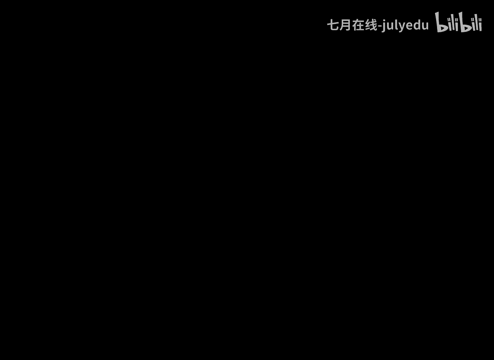
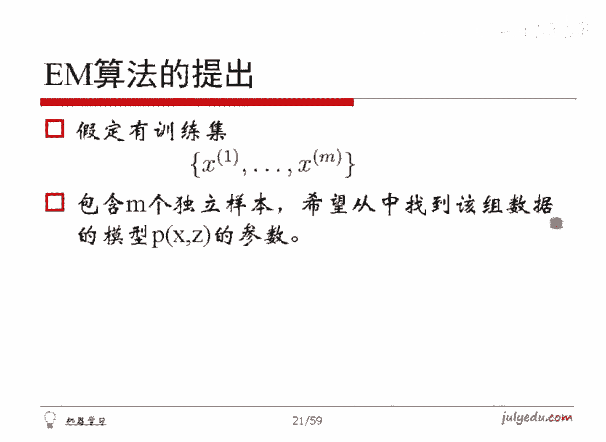

# 人工智能—机器学习公开课（七月在线出品） - P8：感性理解GMM - 七月在线-julyedu - BV1W5411n7fg

呃，我们现在呢我想从一个基本的一个地方跟大家聊这个业务算法的推导哈。首先跟大家回忆一下极大自然估计。这个东西举个例子哈，举个非常简单的例子。比方说我现在有10个硬币，我10个硬币，我抛硬币，我可以一抛。

它可能是有正面朝上或者反面朝上，对吧？我就如果正面朝上，我记上一个正，如果又抛一次还是正，我就再记个正。第三呢可能反面朝上又记了个反，对吧？我做十0次抛硬币的一个结果。

我最终看到了是一个正正反正正正反反正正这么十0次的一个样一个一个样子哈，那这样子。你能够估计一下我这个硬币，它。抛一次朝上的概率是多少呢？对吧能估计吗？我们可以这么来考察这个事情哈。

那我假定每一次碰硬币结果为正的概率，我就假定是P，你不让我估计嘛？我就假定你是P，我就算这个P就好了嘛，对不对？我用小P来表示哈。那第一次抛硬币他。看到的结果为正OK那这样的话。

第一次这个事件发生的概率就是P。第二次它还是伪证，它的发生的这个事件发生的概率还是P，对吧？那第三次是反，所以说这次发生的概率是一减P，对不对？所以每一个都ta写出来就是这么一串式子。

我们如果假定每一次抛硬币之间是独立的那这样10次抛壁我看到的最终的概率值就是这么一串，这10个数字相乘，而这里面其实显然有其中有7个是P有三个是一减P。所以这个东西就等价于P的7次幂乘以一减P的3次幂。

对吧？而这么一个东西，我们可以把它假记作大P。这个大P是什么呢？这个大P是关于小P的一个函数式子。我现在想做什么呢？想看一下小P取几的时候，可以使得这个大P的值最大。因为为什么呢？

因为我现在看到了这十字旁边的结果是这样子的。既然我看到了这样一个内容的话，那这样子我就认为存在即合理嘛。我看到的这个现象就是能够使得背后的这套机制发生的最大的那种可能，我才能看到它，对吧？

我就这么简单认为那这样子我就让你这个概率值取最大的时候，这个小P取几。这种思想就是几大思然估计的想法哈。那你会估计你会计算这个值小P取几的时候，大P最大吗？我稍微等一下哈，大家会算吗？也就是这一页哈。

也就是这一页，我其实本质上要算的就是让这个值取最大，而P呢是从0到1的那请问P取几它能最大呢？比方说刚才有朋友说到是P1等于0。7，对不对？为什么是0。7呢？这样一个函数。如何去得0。7呢？好。

你们说到求导。直接求导是不合理的对吧？就直接求导可能你求不出来。你直接对这个函数对P求导的话，你这是一个P的7次米1减P的3次幂，根本搞不定，对吧？好，非常好哈。😊，先取对数。

因为这个有机体学一般的朋友，对吧？大家应该很熟悉了，我直接取对手，然后再求导就搞定了哈，对吧？这种东西那这样我就能求出来P等于0。7，大家有兴趣可以算一下啊，呃估计没写，大家可以自己算一下哈，0。

7的这个是关于加3估计的一般形式了，这个咱就不用管了哈，对吧？😊，呃，不不不不不不用转了图函数哈，这跟凸函数没关系。😊，就直接求几大值就好了，它本身就是秃的。对吧那它本身就是凸的东西哈。

不用管它这都是凹的，你不用管它哈，但是你就直接求导就是了。好，没问题哈。然后呢，我们现在把这个问题加大一些难度哈。钢材本质上抛硬币其实是一个两点。抛硬币嘛，它只能去两点左要么为正，要么为反。

这是两点分布。那我们把两点分布把它变成高斯分布，你还会算吗？对吧比如说现在样本是X1X2的XN给的的这N个样本。现在呢假定这N个样本，它们来自的这个总体是一个高斯分布的一个总体。

然后这个分布假定它的均值是缪方差是西igma，呃，它的那个标准差是西ig玛，但是呢这两值是不知道的。请问你能够根据这N个样本值来估计参数缪和西格ma吗？就这么个事情哈，这个题目大家会做吗？稍微等一下。

好，没问题哈。仍然使用刚才我们跟大家说过的极大自然估计的方式来去求解这个过程哈，完全一样的。首先我们写出极大高斯分布的概率密度函数是长这个样子的对吧？当我给定命u sigma的时候。

这个它的这个概率密度是长是是是这个函数，这是本没问题的对吧？那我们就把这个N个样本带进去，因为大XI这个样本我们把它是小XI嘛，把它带进去，以此得到这么个东西，这个是某一个I的。

然后我们把它乘起来I从1到N，这是一个它的自然函数，为了求极值。刚才我们说过了，对吧？其实是要取对数再求导是方便的，所以对它先取个对数变成似然对数自然函数。本来这个是一个大L，对吧？这个函数哈。

把它变成小L，对它取对数，这是一个若干个值的乘积取对数，因此这就是把这个乘积符号就变成加口符号。因为这是一个若干值的乘积取对数嘛，那就是他们分别取对数再加和嘛，对吧？这这是性质了。

那这样的话就变成这个东西，大家注意。这个系数和这么一个E的某某某次方也是两个数相乘，对吧？这还是对数嘛，所以是对数它加上对数这一坨。把前面这一个放在这儿，对这么一个东西取对数，后面这个是什么呢？

注意这是指数的这么一个东西，它先取异这么多次幂，然后再对这么一个次幂取对数。那就这个东西取指数再取对数，那就相当于白做呗，因此把这块就拿出来，对吧？是长这个样子的。这是它的变换，对吧？这两个是相加的。

而这个东西是一共有N个嘛，把这个2分之1，这是它它的平方的2分之1次幂，把负的2分之1提出来放前面来，得到这个对吧？而这个呢一共是有N个嘛，把这个。嗯。🤢，这个这个西ig格玛这个常数提出来对吧？

这个二西玛提出来里边是变这个样子。因此我们把它就整理得到了这么一个东西。大家发现这个东西就比刚才要。看起来就舒服很多了。对，这么一个式子，我分别对缪求偏导，让它等于零算一下。

然后对西igma求偏导等于零算一下。那这样子我就可以最终得到缪和西igma了，对吧？这就是关于。高四分布的参数估计的结论，大家可以算下就好了哈。然后。我们就不再详细的跟人家谈讨这个事情了。

这一块因为是咱在呃前边跟大家。聊过对吧？就是关于他的计算哈，能得到这么一个东西。这个就是me和s方它的结论哈。好了，这么一个东西我们拿到手之后哈，咱稍微的做一点点的分析。首先我们看这个这是什么意思呢？

这是指的对X拿到手的这些样本做加和，然后除以N。那显然这就是样本的均值嘛。我们是用样本的均值来去估计总体的这个均值。对吧这就是我们的吉大思然故意的结论。而这个呢是我们对样本求尾方差。求尾方差。

然后对这个用这个尾方样本的尾方差来去估计总体的方差。之所以说尾方差是因为样本的方差本来是除以N减1的，而这里除的是N，所以我把它叫做尾方差哈，对吧？它不是真的方差，但是呢。不管是高斯分布。

还是呃不管是这个呃其他四量估计还是举估计，其实它的结论对高斯分布而言都是一样的，都是伪方差来去算的。这个呃做它的估计哈。这个呃关于为什么是除的N，而不是N，为什么除N减一是方差。呃。

除N就只能把它叫伪方插了哈，咱已经解释过，咱也不说了哈，大家知道就好了哈，总之这是一个。如果你除的是N的时候，其实偏小，你的估计哈。这样一个东西哈，不管我们刚才说的那个伪方差这个概念哈。

但其实这个东西跟我们的直观是很接近的。对吧我们直观上觉得你样本的方差跟总体是一样的，样本的伪方差跟总体也是一样的。等会儿我们用这个作为我们后面分析的一个基础哈。好了，我稍微等一下。

大家看前面这部分有问题吗？后面我们就要开始EM算法的核心内容了。产面这块有问题吗？😡，OK哈，然后我们进行下面内容哈。呃，现在呢我们讨论一个事情，就是假定我们现在挑选出了1万个志愿者。

然后呢测量了他们的身高。这样子我们手头上就拿到了1万个身高的数据。现在我们正常而言，这1万个志愿者里面是有男性和女性的。我们现在做一个假定，假定男性的身高服从高斯分布。

均值是缪一方差是呃标准差是sigma一，女性服从另外一个高斯分布，它的均值可能是谬2，它的标准差是sigma2。现在如果说我们手头上没有拿到样本的性别，只拿到了样本的高度。

那么说我们能只用这个高度来去估算M一sigma一M2sigma2吗？这样一个问题哈，显然他是没有对随机变量把它完全观测到。如果说你完全观测到的话，假定说我看到了这1万个志愿者。

他的身高到底是男性和还是女性的。你比方说那这样我就那估计这人就不在话下了。比方说我想假定知道男性还是女性哈，那我就按照我就光把男性的那个数据拿出来。那在我眼中，这男性的这里边，假定有4000个哈。

这么多个，反正多少多少个不管了，那我说我们就可以直接带刚刚得到的这个结论嘛，不就拿不就能计算命部sigma方了嘛，对不对？就搞定了，女性同样计算嘛，现在问题是我们没有拿到她是男是女，只有身高数据。

而没有性别数据。这样子这种数据它是不完全的数据。我们要想估算。就只能想一点手段了，对吧？呃，另外我举了个别的例子，就是说如果你是一个图像，想让它进行前景背景分开呢，对吧？这两个问题哈，等会儿咱从感性上。

从理论上以及从代码上跟大家做一个分析哈，如何去做这个事情。呃，别忘了EM算法和聚类很相似哈。对吧他们都是解决无标记的样本的分类问题的。好了哈，现在呢我们把它先做一个形式化的一个表述哈。

就是形式化的表述就是怎么回事哈，就是假定我们现在是因为的X，它里边呢是由K个高斯分布混合而得到的，比如说我们拿到的这个身高数据，它就是有两个高斯分布混合得到的对吧？而每一个样本。

它取高斯分布的概率是拍一拍二到拍K，一共K个嘛，对吧？你比方说我假定说举个例子，比方说我拿到一个样本是1。90。我拿到这个样本之后，我就。😡，我就可以去猜嘛，那这个样本是男性的概率是90%。

是女性的概率是10%，就这意思哈，对吧？就是那个例子里面就是有两个一个样本，有对应着背后有两个高斯分布的概率。如果是有K个呢，那就是有K个高斯分布的概率，拍一拍二到拍K哈，这么个记号。另外呢。

对于第I个高斯分布而言，它的均值我记作M一，它的这是标准差啊，它的标准差记做西igmaI。然后呢，我们现在手头上观测到了M样本X1X2的XM，现在让我们来估计这个拍这是个向量喽，对吧？

这个缪这也是个向量和这个西igma就这么个意思哈。好了，这个就是高斯混合模型。它的研究的内容要做这个事情哈。手段就是EM算法。呃，注意哈，就是如果有问到这个西maI是数还是矩阵是吧？

如果说对于我们这么一个数据而言。它是一个身高本身是一个标量，对吧？那这样子。我们的这个分布，这个cmaI就是一个数。如果说我们拿到的不是身高数据，比方说我们拿到的本身就是一个向量，对吧？

在空间中的一个点，它就或者是一个N维的一个一个数据。那这样子的话，我们得到这个方差就是一个N乘N的一个呃方阵了，对吧？就是它就维度就上去了。比方说我们可以把事实上我们可以把。

一个数看就是一个1乘1的一个方阵嘛。所以说在线性代数的系统下，数和方阵几乎是一样的东西，对吧？我们就可以把它呃直接看作是一个方阵了，对吧？OK呃，没问题了吧，还有别的问题吗？😊，🤧嗯。OK哈，然后呢。

我们下面来琢磨一点事情哈。😊，正常而言，我们需要建立一个目标函数哈，是长这样子的。呃，如果对于第K个类别而言的话，我们有一个均值是MK，它的标准差是西maK。在给定这么两个参数的时候，XI服从高斯分布。

也就是NXI given谬K西maK对吧？这个N就是那个正在分布，对吧？咱就那个那个那个那个式子其实长这个样子嘛，在前面咱解给过，对吧？就就长这个样子。对吧所以说我们后面用这个记号来记一下而已哈。

大家这个应该很熟悉了，对吧？然后记得这个东西，这个是DK个高斯分布，对吧？那我们现在手头上一共有大K个分布嘛。那对于D小K个分布而言，它的属于它的这个概率是派K。我们刚才记号记了嘛。

那么说让小K从一到大K做一遍加和，这样的不就是一个混合的高斯分布嘛？对吧对这样一个混合的高斯分布这么一个概率，我仍然可以使用极大自然估计，把它们乘起来取对数进建立我们的目标函数嘛。而乘起来取对数。

那就是先取对数再加和嘛，所以说就得到这样一个东西，注意这是一个对数自然小L，它呢。未知变量是我们这里要估计的这个py缪和西igma这三个值，对吧？而X是我们样本是已知量，对吧？

这本来应该是我们利用极大自然估计建立的目标函数，对不对？大家看这个式子有问题吗？就是这样哈，就是说我刚才看到有些朋友这个老师这个这个这个留言说这赶紧go go go哈。这个咱学机器学习这门课程的时候。

千万不要抱着这个呃简单的就赶紧过的那种心态哈，一定要把每一步走扎实了。要不然呃你会突然间发现。前边的每一步都很清楚，突然到了某一步时，完全看不懂了，对吧？这样子就说明什么呢？说明在前边的某一个地方。

你走的太快了。😡，对吧当前面走的太快的时候，你在后面再走，你会发现走不下去。嗯，这个是咱一定要去注意。尽量避免这个事情。所以我们一直强调咱把这个呃。因为比方说咱咱继续学习内容哈。

里面会把这个呃拿出那么3次到4次课，特意去跟大家复习数学基础，然后再去讲后面内容哈，要不然大家呃退公式啊，这个老是没感觉，对吧？是中文没没东西哈，好了哈，这个是本来得到的极大自然估计的一个结果，对吧？

然后呢。嗯。哦，对，Cma看其就是就是装那个就是标准差。这嘛K就是标准差哈。对吧。就是你如果写平方就是方差了嘛，对吧？你写C嘛K本身就是端质差嘛。对吧。现在问题是这么一个式子，这里边有加和。

然后乘积做加和再取对数，最后再加和这样一个东西其实只是理论上的可行，你能够求偏导得东西，它事实上是不方便去求积值的。我们这里面呢需要分两步走。直接去做是不合适的，分哪两步呢？我们来猜一下。

大家注意听这儿哈。我们这么来想。就是。我们代估计的这个数据哈，它首先它是由每一个组分来去形成的。你比方说呃咱那个身高数据哈，它就是由两份组成，要么有比方说1米90那个数据哈，他有90%是男性。

10%是女性，就这意思，对吧？他就来自于某一份的有一个概率。我我再强调一句这个就是咱咱那个例子的事哈，就是说呃咱后面会说这个1米90这么一个样本，我们说他有90%的可能是男性，10%的可能是女性。

我们后面真的就会把这个数据把它分成两部分。一个是1。90的90%，大概是乘出来一个数，1。90乘10%大概是0。19这么一个数。我们就说他有90%是男的，有10%是女的。我们真的就这么算哈。

但是这只是一个数学的计算中间过程哈。咱们不要把它就如果是在现实生活中这么说，一个人不合适，对吧？我们后面真的会把它分开做哈。呃，大家知道这么一个数学思路就好哈，对吧？咱们不探讨那个什么，对吧？

后面来我来来我们承认这么个事情啊，就是这个人有。😊，九成是男的，有一成是女的混合得到这么一个人哈。我们这么来看这个事儿哈对吧？我们来想想哈。😊，对于这样来讲的话，每一个样本XI这么一个样本哈。

它来自于DK份的概率有多少呢？对吧你比方说如果对刚才那个例子1。90这么一个值的话，它有90%是男的，有10%是女的那这个90%可以怎么算啊？

如果我们是已经知道了M一sigma一M2sma2那些参数的时候。如果是已经知道，那么说我们就可以把1。90这个样本带进去算一下这个高斯分布的值是多少。没错吧。

总能算出这个NXI given milk sigma可以吗？因为这个东西刚才大家已经见过它的那个函数式子是长这个样子。对吧这是一个非常正规的式子嘛，你把X带进去了，如果缪和西马还都是已知的。

总能算出一个概率密度值嘛来来嘛，对不对？所以这个值是可以算出来的。OK这是。呃，这是这样一个值可以算。另外呢。这个假定这1万个样本里边哈可能有3分之1是男的，3分之2是女的，对不对啊？

这个它本身呃什么情况都不知道的时候，有3分之1的可能性是属于男的。所以说前面再乘以这个拍K有多少来自于男的，对吧？那乘完之后这一部分相当于是什么呢？相当于是第I个样本，它来自于第K个组分的概率。

对不对啊？这是这么一个式子，得到这样一个。呃，很怪异的一个一个一个一个结论，对不对？只不过呢我第I个样本，第一份可以这么算，把那个m一s一带进去，拍一带进去能算是个值了。

把拍2谬2s2带进去用能算是个值了，对不对？把K值也算一个单心出来一个值了。你这些值加起来应该等于一啊， unit逆值概率啊，对吧？所以说呢我分母除以它们的一到大K所有值的加和是为了做规划，对不对？

所以底下这个没有什么更多的意思哈，更关键的是分子这部分，分母只是规划用的，而分子才是真正的咱要做的那个刚才那个事情，也就是第I个组分来自第K份。他的概率值。OK这一小段大家看有问题吗？

这是咱理解EM算法的最关键的一个公式哈。这是就是整个的咱今天这个公开课最重要最难理解，最核心的东西就这一页，这是最核心的内容哈。就这个部分。啊，大家看看有什么问题，我们现在来沟通讨论一下啊。😊，嗯。

似然函数对于离散情况是对数概率，连续时确实对数概率密度，极他似然是说出现数据的概率最大。对于连续情况怎么联系？概率密度最大就等价于概率最大呢就是看归程这个要不咱这样呃。

那个咱在那个应该你是那个就是应该是咱那个9月学习班的，对不对？然后咱那个咱再探讨哈，这个咱今天就不再说这个事情，说那个自然函数这套内容了哈，咱今天把把思路放到验M算法里面去。

假定自然那个那个那个那个极大自然估计这套东西，你承认了，并且咱认为对了哈，要不然这个事情做不下去了。😊，对吧。嗯，O可看大家的问题哈。😊，拍是什么？对吧？我们先来说这个事情哈。这个拍的意思是指的。

如果我这个里边对于刚才那个身高数据而言哈，它可能是有百分之呃1有1万个样本。那这样的话可能不是正好55000个男性，5000个女性，对吧？他可能是只有这个呃比方说咱来自工科院校哈，只有2000个男性。

来有8000个女性啊，有师范院校哈，有2000个男生，8000个女生，这不是这个东西哈。那如果这样一个东西拿到样品数据市场这样子的，我从这一万个数据里面随机选一个人出来，选到男性的概率有多大呢？0。

2嘛。就2000个除以1万个嘛，对不对？0。2嘛，选出女性的概率是多少呢？0。8嘛，那个0。20。8就是这里边所谓这个拍一拍二到拍K那个东西哈，它是鲜艳概率。我们如果是从术语上来讲的话。

我们可以把它讲的很很很通俗的就是这个玩意儿，对吧？拍开始管这个事情的哈。好啊，这个应该说清楚了。然后。拍和R的区别。哦，伽马是吧？呃，伽马是是另是另外一码事儿，对吧？伽马只是个记号，对吧？

用伽马是因为显得比较高大上，对吧？没什么任何意思哈，它就是个记号而已，这是个概率值。这个概率值呢，它和I有关。因为我想算的是它第I个样本，它和K有关。我想算的是第I个样本属于第K份的概率。

它就是概率值本身记号而已啊，没别的东西。伽马IK第I个样本属于DK号的概率，没任何新东西哈。这个是不是类似b全盖率公式呢？嗯ん。其实不是哈，它仅仅是个规划，仅仅是个规划。其实不是全格力公贝是全格力公式。

贝公式哈。嗯，计算这个一会儿用来做什么呢？马上告诉大家，计算这个用来做什么，不要急，马上就会说啊这个东西一了它马上就能出EM算法的结论。就这个哈。PI等于1除以K2I那个均情况是这样子的对。

有点像鲜艳吗？是的，就是那个拍的有点像鲜艳，对吧？😊，求和只是为了做均做规划的底下这个求和。羚言阁主问的求和应该是底下这个意思吧。求和仅仅是为了做规划。因为这K个数算完之后加起来可能不是一。

我这个概率啊概率的要求是等于一呀，所以我作为规划，没没做任何新东西，对吧？那这些PIK我们也不知道怎么求出来呢？好，这是个问题啊，就是说我们现在是这样。假定你如果知道了拍me sigma的时候。

这个值是能算出来的，对不对？假定你知道你就能算，现在你不知道，那怎么办呢？你就给我先猜一个出来。😡，瞎猜一个也行，对吧？你比方说给我这1万个样本的话，我就先猜有5000个男性，5000个女性。换句话讲。

拍一等于派二等于0。5%都是50%嘛。然后我猜这个男性的这个谬一均值是1。75米，然后sigmaK是5厘米，呃，是10厘米，然后呢。这个谬2女性的均值是1。65米，然后sigma2假定是8厘米，对吧？

我就先猜出来它假定一个值带进去就能算嘛。对吧，总能算出一个东西来。是不是可以理解为所属类别信息和数据分布独立，所以可以相成。呃，可以可以这么可以这么理解，真的可以这么理解哈。😊，呃。

这个其实你要不怎么理解也行。就是刚才雷刘凤云说的这个问题哈，就是为什么这个拍跟N可以成哈，因为大家在高中去去学过一个东西。叫乘法原理。就是你完成这么个事情，需要分两步，先从这男和女里面随机抽一个人出来。

再看这个人里面有多少个男多和女。有比方说1。90%，他有90%是男，10%是女，就就就强出来就好了。他就乘法原理。其实对吧。OK理解了是吧。😊，这个整体乘起来是什么意思？哦，刚才解释过了，对吧？

乘下就是它属于第I个样本，属于第K个类别的那个概率嘛，对吧？如果猜一个上面的猜一个参数带进去，可以算分母，难道要猜K个参数吗？当然了，当然要开猜K个了，你猜个你K个都要猜出来的。你看刚才我那个里面。

我拍一命c一，我猜的吧，拍2s命2cma我都猜的。😡，1。75米1。65米8公分，10公分，我都瞎猜的，拍到门说的对吧？这就是我猜出来的，先猜一个再说。😡，对吧。好，呃，这是这个贝叶斯的话。

咱呃下次课再跟大家详聊贝叶斯网络和。若干个有趣的网络的特殊性哈，比方说一码钩模型这个东西哈。呃，等会儿说为什么我们我们猜出来还可以估计，对吧？好了，这块这块应该是大家熟悉了，对吧？

我们花了很多气的来去解释这一样页东西哈。好，我们现在呢做点事情。先去猜一个拍 musicma，得到了伽马IK了。现在。我们做一个极大的一个改动。这么来想哈。我们把所有的样本点都拿出来。

那么说对于第K个组分而言，比如说刚才那个1。90米这么一个样本哈，你不说他有0。9是属于男的吗？对不对？我就把这个1。90这个数，我大家看留言区哈。1。90乘以0。9。呃，大家帮我算算等于多少哈。

我这个是我瞎说的哈，所以我们没算等于几，大家帮我算一下等于几啊。😊，1。90乘以0。9。81。71。1。9乘以0。9等于1。71，对不对？因此我就说。这个1。9的这个样本，它有1。

71米是南所给我贡献出来的。而还有0。1，也就是1。9乘0。1等于0。19，对不对？0。19米是女给我贡献出来的。我现在只想估计男这个组分的时候，比方说第一个组分K，比方说这是一的时候。

我就光把那个男的那一份给它乘出来，也就是把这个XI这个值跟刚才那个伽马值把它乘起来。对吧这个伽ma值是我就是它属于难的那个概率，那个那个情况，对不对？我们用这个XIE乘，那乘完之后。

相当于我比方说这个1。9这个数据哈，对吧？我可以这么处理一遍。那比方说我又来了个数据，比方说1。55。我假定说1。55这个数据哈，它可能有这个0。2的可能性是男的对吧？有0。8的可能性是女的那1。

55乘以0。2等于多少呢？啊，等于0点。0。31是不是？0。31对吧？那这样子我就说对于1。55这个样本，我同样乘以他的那个伽ma0。2就得了0。31。我说0。31是男的，剩下的那个1。55乘以0。

8等于等于个什么值，我不算了啊，得到一个什么值，那个值是女的，等会再说。总之，我先把那个男的那个拿出来，对吧？每一个都拿都做出来了，那我们不是假定了吗？这个DK个组分它是一个高斯分布呀，对不对？

比方说对于这个1。9米的，1。9来讲，它其实在我眼中不是1。9，而是1。711。55在我眼中不是1。55，而是0。31。我只看男的那一部分，对不对？不看女的，只看男的。因此我拿到手的是一个高丝分布。

高斯分布如何去进行参数估计来着？左边这个式子，这是我们刚刚通过极大自然估计算出来的对吧？而我们就把这么一个东西带到这个式子里面去，不就可以估计我们的新的参数了吗？而mK这个男性怎么算呢？

就是把这个XI换成这个里面的伽马XI不就这么一个式子吗？对吧？注意本来是把所有值都加完，这里边不应该除以大N的。因为我这里边哈比方说这个对1点9来讲哈，它只有0。9个难的。对于1。55来讲，它只有0。

2个难的，对不对啊？所以说我就把这个I从1到N所有的伽网值对K的那个值，0。90。2以及所有的那个值都加起来，得到1个NK。除的应该是NK因为NK才是真正的难的那个数目嘛，对吧？

它都是半个半个难的加起来的，对不对？因此是除于这个这样子得的是一个mlk，同样的把这个东西把这个式子这样一个东西伽马乘以XI带到这个里面来得到西igmaK的一个计算公式。对吧这就是m K smaK嘛。

而我们怎么估计拍K呢？这里一共有NK个男的，一共有N个人一除，不就是拍K嘛，对不对？NK是等于这个数把它带进去，长这个样子嘛，对不对？大家注意，我相当于刚刚去通过这个式子算出来了伽马IK对吧？

然后这一步我又通过伽马这个值乘以XI的样本。去得到了mlkK sK和拍K。当我得到新的这三个值之后，我把它再带回到这个里面去。就能对这个伽maIK得到一个新的更新，对吧？就不再是我瞎猜的那个0。

5个男的0。500。550%的女的，然后男性是1。75米10公分，女性是1。65米8公分，对吧？不是那个东西了，而是我刚刚算出的m K K派K把它带到这里面去，把它做更新了，更新完之后呢。

再带回到第二亿的式子来又得到新的m K s K派K，然后再带回来，再带过去，再带过来再带回去。最终我就能够最终把 milk K seven K和派K估计出来了。对不对？好了，这个其实就是。

利用咱的这么一个想法，非常感性的得到了。好的一个结论。有趣吧，这就是高斯混合模型的最终说法。OK。有问题吗？嗯，出职过极端有影响收敛吗？这个努比问了一个非常好的问题哈，如果出值过于极端的话。

你比方说我就假定里边有0。01%是男的，99。99%都是女的。男性身高均值是1厘米，女性身高均值是10米。对吧这种非常极端的这种初值，我会得到最好的，我仍然能够得到最终的结论吗？对不对？

这个问题问的非常漂亮哈。大家一定要注意。如果给另一个。很差很差的出职，我可能只能得到一个很差的结论。换句话说。DM算法它所得到的。仅仅是一个局部罪容。仅仅是一个局部最优质，不是全局最优值。

所以说我们一定要选择一个合适的出值，你不能瞎选的。呃，这是一个特点。你比方说咱其实在地学习班里跟大家聊过哈，K均值聚类方式就是一个。这个出之敏感的。如果你选的不合适的话，就会造成一些问题哈。

K均之距离也是只能得到局部最优值，得不到全球最优制的。这是他们的共同特点哈。因为我是沿着一个过程不停的去把它做。梯度的上升或者下降。但是呢一旦得到局部的右就停止掉了。这是关于它的特点哈。啊。啊。

创新讲法是这样啊，就是说这个我不敢说我是第一个提出的哈，就是说我觉得这种理解思路是最合理的，其实是。😊，比。比这个教科书上用各种各样的东西来去直接告诉大家怎么推出来的，要感性很多，要清楚。

要要听起来很很有也不难，对吧？咱可以把它说清楚，就是能说清楚的，比用公式推清楚要要好的多，对不对？所以我们先感性的去分析，等会儿我们理性的从公式上做推导哈，严格做，我们也要做，因为这是我们的立立身之本。

对吧？你都感性的东西你肯定不行，但是你光理性，你肯定这个事儿搞不成，对不对？光法律不行，还得有道德，是不是？就这意思了。嗯，迭代条件是的，迭代条件就是你经过多少次。

或者是你发现这个me拍西igma都去不再发生变化了，就不要停理它就是了。没错，有朋友看到这个是的很重要了，是不是？😊，所以我就说这一页是咱这今天这次课的最重要的一页。对的，就是除以他就是个了做规划用的。

呃，为何想到这个中转式的其他什么思想呢？其实不是这样想到的，而是通过后面我们正式的去把它推导出来的。只不过为了让大家。觉得它方便，我先倒着讲的，我先把结论抛出来，然后得到这个式子。

大家觉得这样舒方便一点。等会儿我们从严格的来去看一下到底是怎么做的。呃，编程量不大，这个编程量我正好是恰好我把这个实现了，这是很简单的代码，咱就等大家看就好了，编程量很小的。如果能够求这个就是群自由了。

注意这项事是不对的。这条不对哈，就是说呃。😊，自然函数只有在它是呃指数族分布。只有在指数族分布的情况之下，它是有一个全局的极值点的那种情况之下，它是能够得到全局最优的。你比方说高次分布。

你比方说是高那个坡速分布这种东东这都是没问题的。包括指数分布，它都是指数分布，它都是指数足这么一个分布的。但是。高斯混合模型就不是了。它是有多个极值点的。所以说即使你通过原始式子做。

仍然是没有无法得到裙子有的，搞不定它哈，其实。啊，对，如果你能证明它是凸的那肯定是那没问题。🤧嗯。数据量大的话，可以mamve use吗？就是说这样哈，就是说如果这样一个题目的话。

用mber reduce的话，就有点这个杀鸡用牛刀的感觉了。因为用mber reduce它的。特点不是说呃咱想让他快，他这的marit并不快，他只是能够去把它得出一个结论来，对吧？

那我可能20分钟他出个结论，但是我能保证它能做出来，对吧？这是marry由此干的事干的活。但这里面事量大的话，根本没必要上这个md丢，没必要上hadop，对吧？呃，跟他是相对独立的哈。好了哈。

那这样子我们把这个目光放回来嗯。😊，如果这QQ分布不全是高速分布，能这样求吗？不能。如果这K个分布不是混合高斯模型，比如说咱呃哦就是说如果是公开课，可能就不会讲了哈。如果是PRSA。或者是HMM。

就是不管是主机模型，还是这个伊马克模型。它那个里面不是它的先艳分布，不是高斯分布，那嗯那就没戏了，那就不是这个结论了，那就别的结论了，但是不妨碍用EM算法可以解决。

