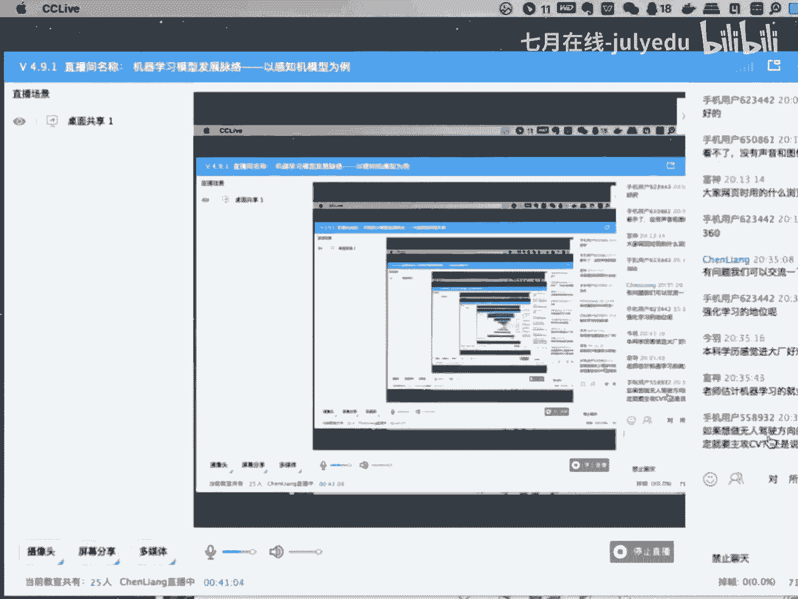
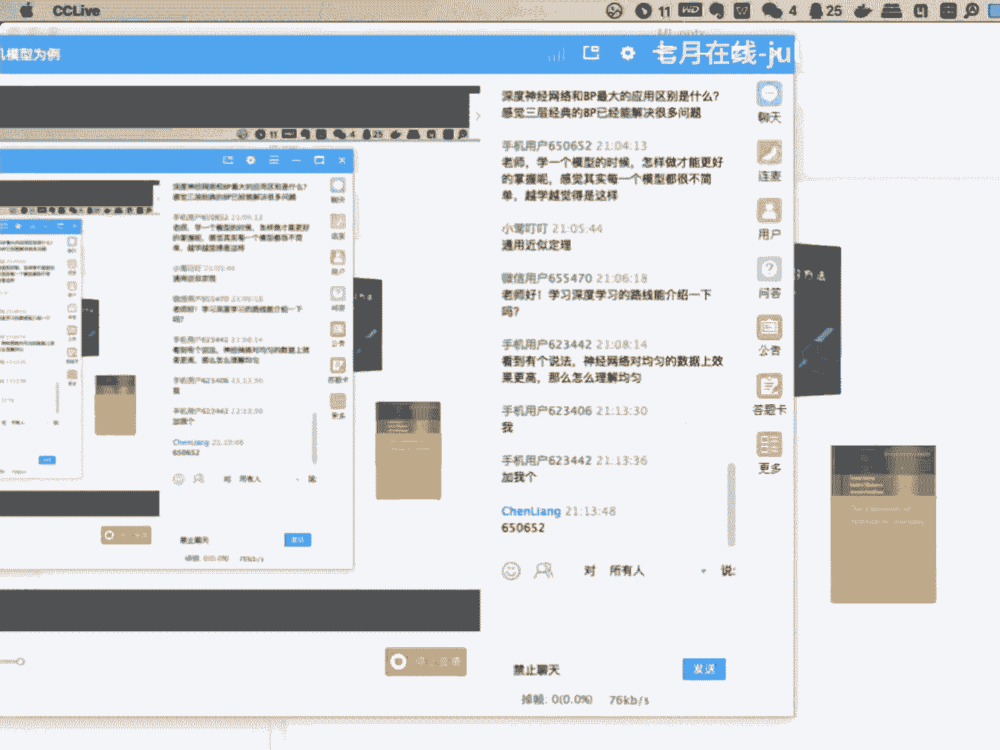
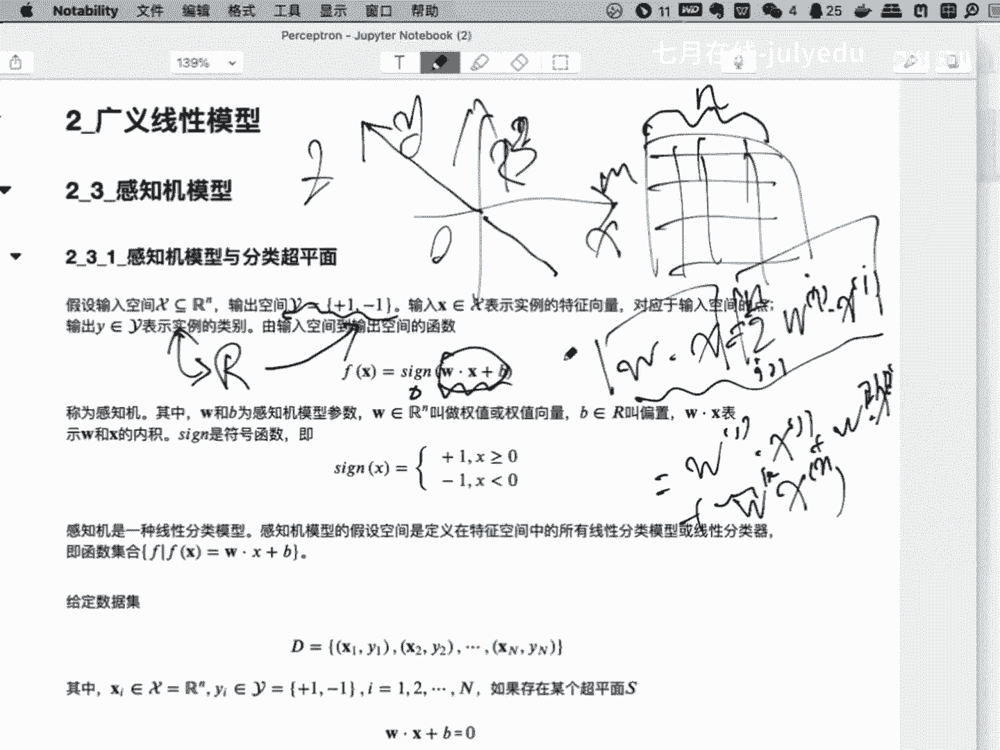

# 人工智能—机器学习公开课（七月在线出品） - P9：机器学习模型发展脉络——以感知机模型为例 - 七月在线-julyedu - BV1W5411n7fg

，呃，可能有些同学是第一次。参加我们的这种公开课的活动啊，当然也有可能很多同学都已经看了很多次了。啊，我先做一下自我介绍啊，我叫陈亮啊，来自我们这个北京区在线。呃，负责现在EI level的工作。

按照计划安排。今天晚上和大家一起去分享一下。在我们整个的机器学习的过程当中。的一些需要注意的地方。为什么要组织今天的这次公开课？是因为我们在往期的。呃，课程当中。非常多的同学碰到了这样那样的一些问题。

究其原因可能大体上有这么几点。一方面，这些同学都非常刻苦努力的去学习了很多的模型算法。但是很遗憾的是。有的时候会发现，确实是只见树木，不见森林。什么意思呢？就是我们阅读了大量的文章资料，呃。

实实践了很多的代码项目。但是有的时候你会问这些同学，我们到底要什么？或者说我们到底要达到一个什么样的目的或者目标，可能不是特别的明确，有的时候有些同学一起讨论的时候，也会有。

这样的困惑就在于啊我们学了这么多东西，到底目标是什么？或者说我们要往哪个方向继续去走。啊，这是一个需要特别希望和同学们能够有一个沟通和交流的地方，这是第一点。那么第二点呢，就是在学习的过程当中。呃。

很多的同学没有章法，就是没有一个。思路和一个脉络，学习的过程非常的随意，或者说是。呃，跳跃今天啊对这个感兴趣看两天啊，明天对那个模型呃比较着迷啊，又学习几天。那么学了很多的内容，在讨论的时候。

说这些相关的内容，彼此之间的联系发展。又是怎么样的？那么为今后的学习有没有一些指导和帮助性的东西和内容，可能又是比较模糊的地方。那么这是第二点。第三点呢就是在具体的模型和学习算法的学习过程当中。

有的时候可能。对一些具体的。公示。呃，代码可能有一定的认识和掌握。但是当这两者之间需要统一进行描述的时候，又带来了一些问题。换句话说，公式的原理部分以及代码的实现部分，两者在内在逻辑上是完全统一的。

那么当然中间我们会在课程里面会借助，比如说像图示的这种工具来帮助大家把这两者进行一个完整的统一。不能划水啊，特别是读公式的时候，呃，有些有些同学不太在意，对吧？啊，大体上我原理了解了呃一。

一到了实现代码的部分当中，会发现呀。这个量是个标量还是个向量，对吧？如果是个向量，是个几维的向量，如果是个矩阵，是个。维度为几的矩阵是个几乘以几乘以几的矩阵呀，这样有有有些模糊，这个就不得不返回头去。

在原理部分重新再过一遍，造成了时间上的这种损失。所以基于以上三点啊，那么今天也就从这三个方向上和大家有一个交流。首先呢就是第一点。就是我们的目标。

或者说我们的呃最终达到这个目标要完成一些工作到底都有哪些？第二点呢就是我们在整个的模型和算法的学习过程当中，模型和模型之间的依赖关系，或者说是发展的内在逻辑到底是怎么样的。我们怎么样才能构建自己的啊。

基于你自己的实际情况，去构建你自己的知识体系和模型体系。然后在今后的学习和工作过程当中，不断的完善补充，加强你自己的知识体系啊，这样的话才能形成一个。有脉络的啊知识框架啊，指导你今后的学习和工作。

那么第三部分呢，今天我们用一个简单的啊感知机模型啊来介绍一下，一呢看一下感知机模型的这种脉络发展啊，它是怎么样从线性回归啊，发展得到感知机模型。然后又从感知机模型的基础上，怎么样改造，我们可以延伸出。

比如说像非常重要的支持向量机模型。啊，就是发展脉路是怎么样的。另外呢在具体的这个感知机模型的学习过程当中，就像刚才我们所分析的啊具体的一些实现的细节部分啊，怎么样去理解它，借助一些更好的一些图形和公式。

怎么样才能更好的去把握啊，这些内容呢。是希望今天啊和大家有一个学习和交流的部分。当然啊呃这些内容呢在我们继续营和就业班的课程当中啊，都会或多或少的进行穿插和介绍。呃，今天呢单独把它摘出来啊。

拿出来和大家有一个交流。呃，首先我们从第一部分开始啊，就是我们的目标，或者说我们的。学习完这课程以后。到底要在哪些方面上有些积累啊和学习。那么呃现在看一下这个视频应该没有问题吧，看看。

OK声音和视频应该没问题，是吗？那如果没有问题的话，我们就继续好吧，OK。那么简单的总结了一下啊，那么至少在我们进行这个学习的过程当中，有这么三点是我们特别希望嗯大家能够注意的。

一方面就是理论基础部分啊，第二方面呢就是编程实践部分。第三方面呢就是工程项目部分。这三个方向呢也是我们在急训营当中啊，就是通过这种螺旋式的设计，不断的进行迭代和完善的。比如说一开始的阶段当中。

我们更多的是关注到理论理论基础。然后呢，在此基础之上，我们会有相应的编程实践的内容啊。最后我们再通过一个完整的项目，当然是分方向，有CA方向NLP方向推荐方向来完成整个的一个螺旋式的上升。呃。

这是三部分主要内容。那么在这三部分主要内容当中哈，就是也是哈就是为什么聚焦到这三部分，也是通过我们往期的学员啊反馈回来的一些，不管是面试也好，还是工作过程当中的一些内容，我们进行一个总结的部分啊。

就说面试的时候，面试官往往先从理论基础开始是吧？都问一下你掌握了哪些模型是吧？这些模型的基础原理是什么样的呃，更进一步的，比如说像SCMchgebo的啊，这种基础模型首推一下基本算法原理部分，对吧？

像深度学习模型部分，包括你像基本的RN对吧？LSTM像这种模型，现在比较。关注更多的像attiontransformerport这种这种这种基础模型。它的一个基本的架构啊，这都是在理论基础部分。

经常会问到的内容。那么编程部呢。那么相应的这些模型有没有相应的实现的方式和手段，对吧？换句话说，现在开玩笑就是调包调参，那即使是调包调餐，你也得会调会调才可以。那么相应的一些包。

你是不是掌握了相应的一些API你是不是掌握了？面对实际的问题能不能调用相调对了包，参数有没有调对了啊，这都是我们在编程实践部分需要解决的问题。那么第三部分可能也是我认为比较重要的部分，就是工程项目部分。

那在这部分当中哈，我们的课程里面呃。也构建了项目库。在整个的我们的教室老师啊，会拿着其中的一个完整的项目进行一个完整的介绍。当然啊不可避免的是有很多同学确实学习能力很强啊，这也没关系。

我们的项目库里面有相对比较丰富完整啊的项目准备啊，从技术先进性上来看的话，我们也是紧跟着技术的发展方向你比如说像CA方向呃，像优oV4啊，优OV3啊，这都是我们有完整的啊项目介绍。

完整的项目代码项目注释啊，我有我们的助教老师能够呃完整的能够把这个项目能够。带下来啊，所以在这部分也是希望至少在找工作之前，你手头上怎么样有2到3个这样完整的项目才是可以的。呃，其实再说衍伸一点。

一会说一下，就是项目怎么去做，其实是有方法论的啊，这个有时间的话也和大家有一个讨论和展开。那么以上三点呢，我们就再相对展开看一下，好吧，比如说哈在理论基础部分啊，分了这么几个部分。比如说像数学基础啊。

这是经常会有同学问到的。大，有一些模型和算法的推理过程是吧？大量的使用到了一些数学工具，数学方法，那我们有没有必要去单独的去补充一下，嗯，这个看实际情况啊，看实际情况。

比如说哈比如说我们经常会用到的一些数学工具，包括你像数理逻辑微积分线性代数概率论统计啊，呃信息论和最优化。当然可能还包括其他的一些啊就大块都在这个地方啊，大块都在这个地方。

那么数理逻辑部分啊可能很少提到过，为什么要强调这一点呢？还是刚才所说的，我们后面的不管是机器学习模型也好，还是深度学习模型也好，有些的部分的原理推导，还是嗯不能说难啊，就是从它。就是难易程度上其实还好。

可能稍微有一些冗长啊，也不能说冗长吧。就是可能比起我们之前所学接触的一些推理过程，稍微有一些复杂。那这个时候往往会陷入到一些技术细节当中啊，你推一段啊可能十几步啊。

那这十几步咱们推推推完了以后发现ok哎，推完了，但是有一个问题在于我我推完这个结果，它的目的和作用到底是什么？这个时候可能你需要有一个框架性的东西，比如说因为我们输入的是A，对吧？然后呢我需要。

推出C而在推C的过程当中呢，我免不了会使用到B。所以这个时候我需要把B能够完整的推出来。然后有了B，它作为A的一个已知条件，就能推出了C。所以说而这一部分我们可以通过啊完整的一个逻辑描述，对吧？

我知道什么要求什么，中间需要什么从此啊不至于跑偏了啊，这是我认为啊是在学习过程当中一个比较重要的一个技巧之一啊，有的时候特别是像后面你像HMM模型CRF模型啊，这种就是。

概率部分大量的使用到了一些什么加号规则乘积规则是吧？而且是在条件概率之下的各种各样的公式的展开使用。啊，有的时候会会逻辑上就是会显得有些繁复啊，但是这个时候你一定要清楚你到底在干什么啊。

这是关于数理逻辑部分，微积分部分可能更多的使用的是微分啊，积分部分相对少一些。为什么这么说呢？微分部分主要是和后面的最优化可能结合的比较密切。

就是我们往往会把整个的呃学习模型的问题转化成一个托二次规划问题啊，这样的话我们就可以把它解出来啊，从通过迭代的方式把它解出来。而在这个求解的过程当中，我们用的数值方法，可能更多的就是一些。

基于迭代的梯度收敛的一些方法。而这些方法当中就不可避免的会使用到一些微积分的知识啊，但是呢也不是特别的复杂啊，这一部分其实我觉得具有啊大学本科的数学基础基本上也就基本上没问题了啊。

如果说呃希望能够啊有时间啊，能够再回顾一遍的话，其实给大家推荐就是普林斯顿大学的有一套就是微积分啊，那本书还是相对我觉得个人感觉啊还是不错的。这是微积分部分呃，线性代授部分呃，其实是个重点内容啊。

比起前面的微积分部分，为什么这么说呢？呃就基于两点一原因吧。第一点原因呢就是线性代数部分会因为我们后面的这个学习模型啊呃。都是在高位空间里面进行所谓的不管是呃曲面拟合也好啊。

还是等等各种各样的计算也好啊，都是在高位空间里面。这就不得不从我们的标量计算啊，衍生成所谓的向量计算。啊，或换换个角度你将在深度学型模型部分随着模型的越来越复杂啊，我们不得不啊使用这种向量化的手段。

把我们呃之前非常细节的啊，非常呃清楚的或者非常嗯一清二楚的那种标量公式转化成相对比较呃隐含着那种标量化的表示形式啊，甚至后面我们会大量的使用各种各样的矩阵计算。啊这个时候线性代数里面啊。

各种各样的符号表示啊，各种各样的基于向量的基于矩阵的计算就起到了非常非常重要的作用。所以这是第一部分。就是关于线性代数的就是从标量化表示形式，向向量化表示形式的这种过程，就是转变过程啊。

是线性代数里面需要掌握的内容。另外一点呢，刚才也讲到了，就是基于呃向量矩阵啊，这种复杂结构的大型运算，可能在线性代数里面也都讲的比较清楚。像比如说另外一个就是空间的概念，对吧？

我们后面会讲到输入空间、输出空间、函数空间啊等等。还是比如说我们有个合技桥以后，我们通过核函数，对吧？我们向其他空间进行映射，那这些内容可能在线性代数里面都有集中的讨论，所以线性代数部分啊。

其实是建议大家能够拿出一定的时间啊，能够呃相对比较系统的啊，能够回顾一下，这是关于现在。概论部分啊也是非常非常重要的部分。关于概论和统计部分啊，概论部分呢可能更多的就是各种各样的概率分布啊。

这个你像二项分布啊，BS这个呃高斯分布啊，对吧？等等各种各样的分布都是在概论里面，你需要掌握的比较清楚啊，比如说一些统计方法极大自然。这种统计手段。在概率概论和统计里面。都有完整的讨论。呃。

这两个方向呢，可能我觉得。呃，满足一般的这种考研的要求也差不多的一个水平啊，当然啊也不仅限于此这些内容啊，其实我个人觉得就用到的时候拿过来看一下啊，相相对来补充一下也是可以的啊，用到什么看一下。

当然如果你时间充裕啊，我知道很多的同学都是在校生是吧？如果你时间非常充裕，那我还是建议你有有时间就看一遍。当然时间紧张，那用到的时候我们再展开学习就可以了。信息链呢就是为我们提供一些帮助。比如说商啊。

比如说像信息增益啊，这些概念是我们在后面一些模型过程当中会使用到的一些工具啊，用作的时候我们。拿过来用也就可以了。所以信息论部分其实并不太建议拿出完整的时间去一块去学一下。呃。

另外一个部分呢就是最优化部分啊，这一部分呢其实还是比较重要的。因为我们后面的机器学习模型，特别深度学习模型部分最终转化的目标就是一个最优化问题啊，我们通过各种各样的迭代手段把它求出来，求解出来啊。

呃还是那样，如果有时间的话，其实这部分是可以好好的去看一下的OK啊，这是关于这个数学基础部分啊，简单的和大家有一个这么一个交流。那么下面那个部分呢，就是关于这个。机器学习部分的模型和算法。呃。

现在来看哈，就是传统的机器学习模型和以神经网络为代表的啊深的学习模型是现在嗯两就是2块吧，就是在面试和工作过程当中，经常会被考察到的内容啊，像今天我也在面试啊，就是我我们我们公司和部门一一直类的招聘啊。

我面试这个新同事的时候，我就说积器学习。部分的模型啊，哪个掌握的比较好一些啊，我们可以聊一下是吧？呃，你可以比如伊马可夫是吧？你比如说像毕亚斯也可以是吧？你比如深度学习部分的模型啊。

哪一个你掌握的比较熟练一下，我们可以聊一下，对吧？但基本上会分这么两大部分，那么在机器学习模型里面的模型内容啊，今天就不展开讨论了，呃不少啊，比较多，这就是会引出哈，第二个今天的第二个问题。

就是这么多的一些模型，你怎么去学就先学谁后学谁的问题，有的时候啊有的同学就是要扎猛子一样，一蒙一蒙的是吧？今天哎今天看这个眼熟，哎，看两天这个哎，明天确实这个挺好，我搞两天这个他俩之间有没有关系啊。

什么关系啊，然后今后的发展又是怎么样的。呃，不是特别清楚，这其实是需要有一个逻辑框架在里面啊，一会儿啊我们重点把这一部分和大家有一个介绍，啊，呃现在罗列出来的这些模型啊，仅仅是呃其中的。一部分啊。

甚至说是非常有限的一部分啊，但是这些部分呢涵盖了我们刚才所说刚才说到的一些主要的发展脉路。比如说像线性回归模型是吧？广义信回归像这持向量机啊，像这种模型，我们都是重点需要介绍的啊。你比如说像数模型。

决对数模型是吧，决得数模型和提升方法进行结合，就可以引出所谓的什么就查gebo啊，现在非常重要的一个工作。以贝列斯方法为主的概率模型是吧？

贝列斯方法后面和像伊马可夫像条件数机厂这种模型的这种关联程度非常非常大。那其中你像EM这种就是呃调这是个。期望最大方呃方法可以为我们让HMM这种模型的这种计算提供一些帮助。

那他们之间是有千丝万缕的关系的而。彼此之间不是分裂的那这样的话这种线头啊，你需要把它摘出来啊，一会儿我们重点的把这个梳理一下。那么下一个部分呢，就是深度学习部分啊呃这也是啊就是。

最近一波人工智能所带来的一个突出的贡献，也就是以深度学习模型为代表的啊，在各个应用方向上取得的很好的工作啊，但是这些工作呢我们也是从基础的部分开始。比如说像CNRNGN啊，这些基础模型呃。

为什么没有这个前柜神经网络啊，因为前柜神经网络放到了这个机器学习模型里面去了啊，但是这个地方说明一下，你像这种前柜神经网络，它的反应传播啊算法啊，这个让你首推一下，其实并不过分啊，好吧。

而且呢这个推导过程当中，你到底是标量表示形式还是向量表示形式啊，这都大家都可以，但问题是你如果落实到代码上让你手写一个神经网络，对吧？钱柜的。你能不能完整的手写出来，而在写的过程当中，你才会体会得到。

比如像后边的n派这种东西是吧？这种这种这种数据结构，为我们这种向量化的这种呃。编程带来很大的帮助是吧？那么。在基础的视经网络当中，比如说像CN啊CNN的各种各样各样各种各样的改进。比如说它的。呃。

比如它的呃future map是吧，它的特征图，它的池化层，它的各种各样的呃这种呃t是吧？各种各样的技巧，你怎么去应用到你的这个这个结构当中去是吧？这都是在卷积神经网络里面循环神经网络呢。

如果说卷积神经网络在像CV方向取得了很多的工作的话，那么现在在NLP方向上，对吧？取得非常非常大的工作和好的工作，你像这种R基础的RN像LSTM是吧？

JRU然后呢以后后面的比如像比如说像attenition机制以后的transformert模型也是非常的工作，非常好的工作。但是它的基础都是这些基础的模型结构啊。

你会发现呃以此形成了一种就是散射性的结构。就是你了解了一点以后，马上带出来的是一个非常广阔的空间。就像什么？就像我知道大家。应该都都都比较喜欢玩玩网络游戏是吧，或者电竞啊。

那时候都有一些技能术的概念是吧？你就会像啊当你学了一个新的模型，一定就像点开一个新的技能树一样啊，一定要把它发散出去。哎，我知道哎当前这个技能啊，它的它是从哪儿来的，是吧？然后它是干什么用的。

它今后的发展是什么？你别乱点技能点，最后点一点。点了不少，最后形成不个形成不了核核心竞争力，我觉得还是很遗憾的是吧？所以说这个技争术怎么点，你一定有有一些方法啊。

比如说JN对抗生成也是非常啊非常好的一个方向。这是技术模型啊，但是基础模型的基础上，我们就会分方向啊，在我们项目阶段也是这样来做的。比如说CVNLP推荐啊，是我们三个现在主要的方向，当然也包括金融啊。

比如说像在CA方向啊，今天就不展开了，就是这部分我们会啊以每一个方向啊为代表啊，会绘制一个发展脉络图，就是以不同的功能，对吧？嗯，你是做分类，对吧？你还是做检测，还是做识别。

还是做各种各样的这个场景的这个分割啊，都是有不同的应用领域，那么这个每一个应用领域的发展，都是从简单向复杂啊，从基础向高级，对吧？是因为事物的发展本身就是这样的嘛，对吧？那螺旋是这个上升波浪式前进是吧？

都是这样的发展。那么在每一个模型过程当中，你应该非常清楚的知道OK。当前的模型是在原模型的什么样的问题的基础上进行了改进，进化得到的当前模型。那么当前模型的问题又是什么？那么基于当前模型的问题。

我们可以做或者可能做那些改进，是不是会得到一些更好的方法，啊，我知道很多的同学都是做都是研究生在读是吧？那时候有的时候啊这个写些写论文很头疼是吧？其实你你你就是套路，你掌握了啊。

我觉得水几篇论文还是问题不是特别大是吧？那么那怎么样去去写，其实逻辑关系不就是这样嘛，对吧？你掌握了越多越多的基础材料啊，一定会分析出这些材料的或者这些模型的问题在哪，或者可能的问题在哪。

针对这些可能的问题，找找有没有试着解决的方法。那不就是如果这个方法可以做出一个相对还不错的结果，这不就是一篇论文嘛，对吧？特别是后面我们讲到了，你把一些。毕斯的一些观点啊，应用到现在的工作当中。

我觉得都还是一些很好的一些方向。这是CV。啊，比如说像NRP是吧？我们有很多的一些模型，现在啊以bt模型。对因为这个材料比较老了啊，就这个材料是呃之前准备的。然后呢。

现在可能要重新或者大范围的进行调整啊，又不以以bt为例啊，我们又又扩充出很多的一些新的模型。那这个时候啊那这个时候。你会发现这些新的模型又是在b的基础上，比如说现在bt的参数比较大是吧？

我做是不是可以做压缩是吧？我是不是可以做蒸馏，在体积上压缩它啊，性能上损失不是那那么大，这就是个很好的方向嘛。比如说它在特定任务上，我怎么样可以基于我当前的业务问题进行进一步的深化改改进。

这都是很好的方向。所以。基于此吧啊就是深度学习模型部分，也是我们现在非常重要的内容之一啊非常重要的内容之一。那么呢往往呢我们会忽略最终和忽忽略下面一点，就是关于分布式机器学习的部分。为什么这么说呢？

就是往往我们把这部分的内容呢放到了实践部分当中去，就是关于呃模型的分布式计算的问题。呃，这个问题上，其实给大家报告一下，在大概56年以前啊，当年我们在呃当当年我在国家电网去带队伍去做这些工作的时候。

其实当时面临着一个核心的矛盾，就在于复杂算法的计算性能的问题。就是当时其实就在想这么复杂的模型，它一定是呃计算很复杂的啊，在单机下面。呃，当当时。GPU的计算能力其实还是非常有限。

当时我们就想是不是可以多GPU计算啊，多GPU的分布式计算。呃，其实里面还有很多的这个技巧和内容，比如说像模型并行啊，数据并行啊，还是呃嗯其他的一些流水流水线并行啊。

这些部分呢其实为后面的或者后续的工作其实还是有一定的指导性的帮助的啊，当然有了像fl和这种这这种高级的框架以后，他会封装一些并行算法是吧？当然这很好，但是具体的一些呃实现那些逻辑原理。

还是希望能够呃有一定的掌握啊，有一定的掌握。你像最近啊这个老实目啊，袁老师啊，他们公司呃新放出来那个one follow啊那个框架其实就是有非常大量的技巧啊在里面。

那这个时候你会发现O他为什么在性能上取得了这么好的成绩。就是因为在这种分布式计算的这种各种各个级别上啊，都做了大量的优化那当然这个时候。也为啊今后你在呃使用像terflow排这种框架的时候。

有一定的指导性的工作用啊，这是关于理论部分啊，再重复一遍数学基础，根据个人情况啊，查漏补缺，有针对性的查漏补缺。那么机器学习模型和深度学习模型，这都是呃跑不开的问题啊呃积极学习模型能掌握多少。

掌握多少啊，深度学习模型掌握越多，当然帮助越大。当然你不是说呃。毕竟人的精力也有限是吧？我你最好是找找准一个方向。比如说我是做CV是吧？嗯，我我沿着CV这条路啊，我在里面去细分啊，我是做目标检测。

还是做这个人脸识别啊，等等还有当然还有很多的细分方向，对吧？我是做NLRP那当然我是做知识图谱，我还是做这个。呃，翻译我还是做问答，对吧？这都是很好的一些方向呃，找准方向。当然现在有一个趋势哈。

特别是庭审机制出来以后，以前的特征图理呃。大家一致比较一致的认认为是啊就是以今后的特征处理都会迁移到像在特产机制当中去啊以。这也是一个方向吧。当然不管怎么样啊，这些内容啊还是还是一个基础性的内容。

当然理论基础归理论基础。那么有了这些理论基础以后，我们不得不把它能够run出来啊，那这个时候就牵扯到另外一个问题，就是关于我们的编程部分就是编程实践部分。

刚才其实也介绍到了啊所有的编程实部分其实就是调包调餐啊，当然简单点说啊，是这么这么说啊，当然也不是特别准确。但是不管怎么样啊，刚才所说的那些基础性的模型，你都得找对了啊，找正确的方式它能够run出来啊。

能够让出来，这是基本的一个要求那么一些典型的包啊，比如像是吧，bo啊，像这个MLTK啊，包括啊，以及刚才说的像在分布式环境下，在啊，这都是非常好的可供我们使用的啊各个方向的这个机器学习的包。啊。

这些包里面嗯。有重点的啊，我们都会在课程相关的课程当中啊进行一个介绍啊，在这个地方呢多说一点，就是关于这个数据可视化部分啊，这个部分呢可能往往不被很多的同学所重视。但是这地方强调一点啊。

嗯这和后面的工程项目有相关了。为什么这么说呢？工程项目的目标是为了解决我们的业务问题。我再重复一遍啊，工程项目的目标是为了解决一个业务问题。而这个业务问题的解决啊。

是一定需要向业务专家进行沟通交流汇报的啊，不是你自己拍脑门想当然的认为怎么样，他就怎么样的。所以这个时候就免不了需要向。其他领域的专家进行沟通。那这个时候怎么沟通，也是有非常多的技巧。

特别是我们会在方法论里面进行一个一个讨论。那么其中一部分就是关于可视化。就是你的结果一定是通过可视化的手段向其他专家进行展示啊，这是一个呃非常重要的环节，而往往是我们有倾射的一个环节啊，这是不应该的啊。

这是不应该的啊，所以以上吧，那当然python啊呃这个地方我就不强调了，为什么这么说呢？在现在这个时间点上啊，在现在这个时间点上如果你不是之前学过R，不是之前学过matlab啊。

那你就不要做过多的疑惑和选择了啊，python是你现在首要的语言啊，如果你之前比如说像学统计的同学是吧？学这个学数学的同学可能掌握的R和lab比较多一些啊这个时候呢。

其实我也个人建议你啊重新把python能够学起来。啊，从现在这个时间点上去看的话，python基本上已成为这个方向的首选语言。当然呃是加引号的啊，很多同学会有不同的意见。当然我要保留我各自的认识，好吧。

能简单点说哈，就是python是现在的首选语言啊，其他语言可以，但是现在来看啊不再建议去新的啊去学R去学个新的mat lab。如果你之前没有基础的话，好吧，这是编程试检部分。

那么第三部分呢就是关于工程项目部分啊，这部分呢其实还是那样你不干过一个两个完整的这种工程项目，其实你的体会不是那么的深，但是呢这也不得不妨碍啊，在我们的课程当中啊这部分内容和大家做一个介绍和沟通啊。

是大家有一个认识，到是项目这是怎么做啊，这里边关系到哪些人啊，甲方乙方对吧？你都有哪些角色啊，怎么可能沟通交流啊，啊，还是有一定帮助的。好了，综上吧，那么今天啊第一部分内容呢，就是和大家聊一下。

就是关于机极学习方向也好，还是数据科学方向也好啊，以上三部分作为我们今后学习的一个目标啊，你要知道你现在在哪儿啊，你的基础水平比如说刚才你的数学底子好不好，对吧？你的这个呃理论基础怎么样啊。

这都是你自己最清楚的，你的编程能力达到一个什么程度了。然后你要知道你往哪儿去，就是我们的目标，反正就是目标就摆在这儿是吧？理论部分就刚才所说的那些内容都必须要掌握啊，编程代码部分这些包容你都会调。

你就会调啊，参数你就会调啊，工程项目你会完整的一个一个把项目做出来啊，当然这个工程项目部分我们都有啊专业的老师啊，带着大家一步一步的去完成。但是不管怎么样，你知道了你在哪儿，你要到哪中间的过程啊。

就是我们的课程过程。当然也也包括啊大家的各自的努力。好吧，这是今天我们第一部分看看有什么问题嘛，我们一块交流一下。

啊，今天啊是这样，就是。在准备直播之前啊，主ly啊，就是我们这个CEO啊给我一个消息，说是在课程当中啊，如果我们有这种就是呃交流互动的同学啊，可以去我们的那个呃应该是课程群里嘛，去领一个免费的课程。

当然具体课程可能需要大家选一下。但是我有这么一个福利还是挺好的。然后呢我看看就这一部分和大家有一个交流吧，有什么问题我们可以沟通一下。直接在直播间里提问就可以。好，这是个好问题啊，就是有同学问。

强化学习的这个地位啊呃我在呃可能是有同学呃。刚才看到了在那个我那个目标里面，强化学习部分其实并没有体现的出来，是这样。但是呢强化学习部分嗯也是非常重要的一个内容。呃，但是实事求是的讲。

它并不像呃你像CAB方向啊，但是嗯。NLRP方向这些应用场景非常明确的方向的使用那么的突出，但是也不妨碍它在一些特定领域当中起到了非常好的一些作用。呃，我们只是没有把它单独的拿出来进行介绍啊。

但是它应用场景还是非常非常不错的啊，可以作为我们的基础模型一部分，但是我们呃课程当中讨论的相对少一些。呃，本科学历进大厂好难嗯。呃，难易程度我觉得是个相对概念。我觉得它和学历是相关的。

但不是一个因果关系。我觉得决定因素可能更多的还是你的呃技术掌握程度是吧？换句话说，如果你能力达到了呃，本科、研究生呃，其实。

呃，有关系，但是我觉得关系不是那么大。如果是能力达不到，我觉得即使你是博士研究生，我觉得也也肯定。嗯。进不去，对吗？估计积极学习的就业多久会饱和，是这样啊，这是个好问题。就是我说一下。

就是积极学习这个方向的问题是吗？我给我我至少我个人有一个观点啊，现在我们已经进入到了一个叫做。就是嗯每一个学科哈都会经历的一个叫就是范式改变的过程。什么叫范式改变？就是研究方法和。

研究的呃技术更新的一个阶段。比如说举个例子啊，我们经常会有一个认识，你比如说像经济学，对吧？以前我们可以可能会认为这这种学科是一个像心理学。你像这种学科可能都是就是文科生考的比较多一些，是吧？

但是给大家报告一下，现在的经济学已经完全不是文科生的搞得定的学科，甚至有一个玩笑，就是现在的经济学家叫做计量经济学家完全都是使用这种定量的技术，去分析经济现象，总结经济规律，指导经济的发展。呃。

从这个角度上去看的话，呃，你会发现。定量的手段和定量方法。其实你可以认为就是使用机器学习的技术去解决他们的业务问题。给大家再举个例子，比如说像生物学。啊，现在的生物学呃研究研究又变成了信息生物学啊。

这个他们说啊现在不懂python语言，生物都干不下去了，是这样啊，大量的这种生物数据呃，必须要用这种啊技术手段去解决他们的业务问题。你像天文学以前的天文学可能你给我个望远镜，这个活我就能干了是吧？

大不了我做一些艰苦的记录，现在已经不是这样了。我们现在的电子望远镜返回来的数字信号都是使用python这种技术手段，当然不一定是pyython语言哈，就是像这种数据处理技能去加以处理。

然后以图像或者或者说是呃表格的这种形式展示出来，我们才能发现一些问题。所以说呃就从我个人的这个视角和观点上认为这个方向的饱和。如果是有饱和的那天的话，可能比如说像你像量子计算。

这种通用的量子计算能力达到了一定的这种发展，可能就不需要我们在人工的去做这。给工作的时候，我觉着okK我们也被替代了是吧？所以我觉得这个方向还会继续走下去。下面如果要做无人驾驶方向的话。

是不是基本确定主要是C一方向，还是要其他的选择呢？呃，是这样，首先给大家报告一下无人驾驶方向我不是特别的熟。呃，当然从现有的资料上看的话，一部分是CV方向。其实我了解的情况，比如说像雷达的数据呃。

像这种嗯对各种各样的波长的雷达数据，可能也是作为我们的这个就是在无人驾驶方向的处理数据之一啊，这是一部分就是从感知层面上，那么另外一部分呢可能就是从控制层面上，对吧？

我我看我识别出来这个结果以后怎么控制我当前的驾驶方式可能也是非常重要的一部分理论，所以呃CV是很重要。在无人驾驶方向上，但是我觉得呃还有其他的方向，就是在这个领域里面。呃，O。量化方向的就业嘛。呃。

我不知道这个量化具体是不是指的就是金融量化方向啊，这是一个确实是很好的方向，特别的吸引人。但是呢嗯。做吧，我觉得实际是个好方向，但是但是看你怎么去去去做现在的量化和AI的结构有很多的方向。

比如说去做预测是吧？但是这这我个人不看好的方向，比如说做呃。呃，研报的自然语言处理，我觉得这倒是一个不错的方向。因为知道我们现我们现在也在和像金融专家去聊，他们的研报的这种阅读和理解。

大量都是从人来去做量很大啊，这个重复劳动很多。啊这个时候我们是不是可以通过NRP的方式呃，去自动的去加以处理。我觉得是非常好的一个方向啊。当然你说我通过呃AI和量化结合，马上去赚钱。

我觉得我觉得不要抱着这种目的啊，你觉得你抱着一种去提高生产力的目的。我觉得这个是可以做的一个很好的方向。我们实验室是做故障诊断的，现在就是信号处理加一些算法，因为需要做模式识别。

你像SVM现在做模式识别用的还多吗？O呃，我不知道是哪个方向的故障诊断哈，呃，之前呢我是在国家电网做过设备测的呃故障诊断啊，当然可能我不太清楚啊，因为大我我不知道你的背景知识。

在那个时候其实我们也是接入了当前设备的一些运行状态数据啊，当然我理解可能就是信号数据去分析当前的运行状态。然后为预测性设备的维护，对吧？做一些前期的呃故障预警或者说是呃预测的一个工作啊。

大约是5年以前了，我们还是在用SVM呃做这方面的工作，想想吧，我觉得现在已经不是那个阶段了，对吗？嗯，从我个人的理解，SVM已经hold不住了。不管是你做论文也好，还是要做实际的呃产品也好，我觉。

这都不是一个现在首选的。模型了。当然呃我们在课程当中都会讲到SVM。那么现在的SVM的这个地位变成了什么呢？如果说在56年以前，它处的还是一个。主要模型的地位的话，现在的你像SVM这种模型啊。

已经慢慢的退化成了所谓的基线模型。就是我上来先不用深度学习，对吧？我先用SVM这种经典的模型，要跑一遍数据打一个基线啊，呃调调参啊，也就是说后面我的深度学习的模型，性能再差，至少你不能比SVM还要差。

明白什么意思了吧？就是说后面一定要。各种各样的啊模型啊，算法往上怼，你怼的结果，你总要有一个比较是吧？除了模型和自己比较之外，你先和SIM比比啊。如果你比SM还差，那这个肯定不是个好好的一个模型啊。

基本上是这么一个一个阶段吧。呃，无人控制对无人驾驶的话，控制部分还是强化学习为主。但是我觉着还是会有一些更好的一些手段和方法。啊，同学刚才说交易因子是吧？因子挖掘是一个我不知道你是做阿尔法还是做贝塔呃。

这个呃多因子挖掘，现在是一个很好的一个手段和方式。但是你得看你能不能拿得到啊，举一个例子啊，当然我我们之前没有做交易，我们做这种你像就是天气的延伸器预报啊，降水的延伸期预报。

当时我们也觉得影响降水的因素有很多啊，包括你像节假日的因素，你像这种就是人工呃运动的因素。那这个时候我们之前的模型啊，你像之前的这种降水预测模型可能相对考虑的少一些。

那我们可以通过这种呃神经网络就是深度学习，无非就是就是特征提取嘛，就端到端的特征提取，对吧？呃，你对我来说，我我也不知道你这个因子到底有没有价值，那扔到模型里面去看结果呗，对吧？做一些数据，对吧？

看一下结果，那这样的话，如果在当前的呃业务领域里面有作用。那我当然就ok了。呃，如果没作用。那也无妨嘛，对吧？故障诊断呃，还是那样，因为。故障诊断这个概念其实就是这个同学的问题啊。

是哪些算法可以做故障诊断，对吧？其实你你得是这样，就是我理解故障诊断是一个业务问题。你现在需要做的是把这个业务问题映射成一个模型问题，然后才能选择合适的模型去解决它。

你比如说你可以把一个业务问题抽象成一个分类，对吧？你这个故障，比如说我专家经验告诉我，我的故障就5种，那我后面的模型就可以用分类分类模型。对吧你无非就五种类比行吗？我就一种一种对应一类分类不就可以了嘛。

如果你业务专家告诉你，我没有特殊的这个故障类型指标啊，只有它运行的一个运行的一个数值，那我只能做做回归。回归完成以后，一定要找业务专家，让他去看一下当前的这个。

这个这个拟合的这种曲线或者拟合的这个规律能不能反映出故障问题。所以说还是啊我觉得现在呃大家问的这些问题啊很好都很好。我知道我能理解大家的困惑到底在哪。这些问题啊，一定是像刚才我们所所说的，在项目阶段啊。

就是就是那个方法论的问题，你得知道你是谁，对吧？你得知道这个事儿谁说了算，你得知道你这个工作的结果，你得找谁去认可，而不是说哎呀我这个模型怎么样。其实有的时候你会发现，即使啊给大家说一下。

即使我用回归啊，我用线性回归去做一个工作。啊，肯定不会像神经网络，不会像深度学习这么高大上，对吧？但是你这个工作如果做的技巧足够好的话，我觉得你。不妨也可能会达到像。深度学习这种这种这种效果啊。

当然这个时候可能就不纯粹是一个技术活了。好吧。O。啊，贝尔斯统计是吗？OK啊一会儿我会介绍到哈，就是贝尔斯统计呢好像不是那么的就是研究多，但是这确实是一个好方向啊，就是因为其他方向研究的太多了。

那就不是个好方向了，能明白这中的逻辑吗？就是说就大家都往那一个方向去去去去扎堆，那不就成了红海啊，竞争多激烈，你为嘛还要往那个方向去啊，对吧？你不想想其他的门道吗？那其他的门道是什么？

你把这种贝叶斯的这种框架应用到现在的已有成果上，看看有没有改进，这不就是你的方向吗？有的时候思路要开阔啊，同学们就是。不要太拘民。现在用户是用BP算法做故障诊断。

但是不知道怎么能判断出来输入值里面的异常数据。嗯，还是那个问题啊，就是我我我知道你们缺的是什么了，你们缺的不是一个算法人员，你们缺的其实是一个。嗯，叫产品经理吧，就是就是AI方向的产品经理啊。

他需要和用户去大量的沟通和讨论。如果你是在实验室，你老板应该做这个工作。如果他不做的话，你们应该有同学快速的成长为这个角色啊。首先你要成为那个方向的专家啊，首先你要需要把你的。模型算法的呃。呃。

内在逻辑和专家进行沟通啊，这都是需要需要学习和锻炼的部分。OK好了，我们时间啊差不多，我们需要进入下一部分内容。刚才这几位同学啊，比如说像这个嗯。623406这个同学。然后。哦。

刻以课下的时候找一下咱们群里的这个。这个。呃，相应的老师，然后领一门课吧，然后我把这个呃记一下是哪个同学的，我看看啊，别忘了一会623406是吗？好嗯好，那我们继续续继续吧。嗯，一会儿吧，我们看看情况。

OK回到第二个问题啊。😊，今天第二个问题是这样，就是。呃，我们会有很多的模型要学啊，这是我们我把这个图啊，是我们在呃集训营课程当中会介绍到的一些模型呢做了一个呃图示啊，做了个图啊。

你可这个图里面呢每一个每一个框啊代表的都是一个模型。那么模型和模型之间的这个箭头指明了这些模型之间的发展的脉络啊，发展的脉络。所以说你会发现啊它都没有单独的啊很少啊。你比如像。

ad boost啊这种这种模型啊，因为不是说这些单独啊，就是说和它相关的模型没有在我们课程里面体现出来，能明白什么意思吧？就是说我们课程里面会有一些介绍啊，有一些模型的关联性很强啊。

所以说它的这个脉络发展就很明晰啊，有一些。相关的模型就没有介绍，没有过多介绍。所以呢就就显得好像是呃单独的奔他自己，但是其实不是好吧？那么简单举一个例子啊，举几个例子。

比如说啊呃当然先说明一下机极学习原理部分是作为基础部分啊，你比如说像刚才我说的。什么叫做输入是吧？什么是输入空间，什么是输出，什么是输出空间，什么是模型？什么是模型空间。那这三个空间啊，什么是参数。

什么是参数空间，对吧？这这四个空间彼此之间什么关系，像这种东西你给得非常清楚。呃，这就是所谓的行话，就在这行就干我们这个工作，这都是不言而喻的一些内容。但是你需要把这些基础的东西弄得非常清楚。

就是你认为的就是大家认为的而别出现那种你认为的和大家认为的不是一回事儿，那这个事就坏了啊，就是说你说不到一块去，这。这是最尴尬的情况啊，你认为你不是这个圈子的同学是吧？这是关于这一部分呃。

基础部分今天就不不不再过多的介绍了啊，我们课程里面会单独的拿出一部分来做基础介绍啊，今天的重要是把这个脉络啊给大家介绍一下。比如说啊我们从这个线回归开始。啊，如果学过数据结构的同学。

你会发现这其实有个托扑一个托扑结构是吧？托扑结构，从一个节点开始向其他节点嘛是吧？呃，线性回归可能我觉得有些同学可能大部分同学啊都都有所掌握是吧？多元线性回归啊，我们建立一个线性模型。

一个标准的线性模型来进行一个回归预测是吧？进行一个回归预测，我觉得这都不是问题，那问题就在于你会发现从线性回归啊，我们可以直接引出所谓的逻辑回归和感知机模型。而这三部分呢。

我们把它称之为叫做广义线性回归，就它基本这的基础模型就是线性回归模型。只是在线性回归模型的基础上加一稍微的改造，就得到了两个非常重要的模型。一个是逻辑回归。一个是感知机。为什么说它俩重要呢？

其实不是说它俩本身有多么重要，是因为这两个部分作为基础模型，又引出了两个非常重要的模型，一个是人工神经网络。另外一个知识向量机，而这两个应该是大名鼎鼎的，对吧？又取得了非常重要的工作的模型。

你会发现沿着这条线上能往回倒。我们在回归着往回倒，我们都有SAM之前都很好的工作是吧？那它所在感知机模型的基础上加以改造得到的那感知机模型呢又是从神经从线性回归上得到的，你会发现就从这个角度上。

你会看的话，知识向量机啊或和神经网络复杂到这样的模型，其根本还是线性回归。😊，那你说有同学特别是有些。开始刚开始接触的同学啊啊一看信性回归这东西啊，那么简单是吧？千万不要有这么一这种想法。

就是每一个模型都不简单啊。它如果你能够把它构建出这种。知识脉络的时候，你会发现你从简单的模型往后倒啊，一定找到一个很好的一个部分啊，往后倒啊，那复杂模型就往前倒啊。

你可以发现啊它不过就是从它的一个改进发展得到的形成这种逻辑体系以后，你心里不慌是吧？你不慌乱是吧？当你比如说举个例子啊，你比如人工神经网络，人用潜柜神经网络对吧？多少年了，有以以它为一个基础啊。

比如说你像CNRN像GN啊，发展又又又是又是一个非常大的一个发展。那么在CNN里面。这个地方今天没展开哈，C以又是一个像爆炸式的一个发展啊，你像RN里面，我们有RSTM像GRU是吧？

这也是各种各样的生成对话网络啊，各种各样的花里胡哨的改进，但是再出来一个新的网络，新的就不着急了，是吧？一看啊，它无非就是基于前馈前面一个什么网络的一个什么问题是吧？

引用了一个什么样的方法和手段得到了一个改进哦，原来是这样，对吧？你把它一个新的一个节点嘛，揭露到你的发展脉络里面去啊，你自己的这种。😊，能力边界也得到了扩展，也知道了他是怎么来的。通过对他的分析。

你发现哦他是这样来改进的啊，取得了这样的好的成果。我那样改改是不是也可以啊啊，行不行啊，拿数据模型走一下，看看结果保不齐更好了。那这样的话你写论文不就有方向了吗？谁水几篇论文不就可以了吗？是吧？

当然这只是理想情况是吧？好，所以说啊今天呢一会儿啊我们第三部分就是以感知机模型为为为这个例子吧啊，以感知机模型为例子吧，给大家介绍一下，它怎么来的是吧？它是怎么从信性回归来的，那到哪去，它怎么改进。

得到这是向量机啊，作为一个例子和大家做一个介绍啊，这是这是这是一条线啊，这是一个脉络，另外一条脉路，你比如像决策树模型啊，决策术模型。😊，I例3对吧？你如果商的概念，你如果信息增益的概念。

这个部分都是信息论里面的内容。一、设计出来D3算法。那么ID3算法呢有问题。啊，我们又引进一步的引入所谓的信息增益呃，信息增益比啊，这么一个工具啊，改进成C4。5。从C4。5呢。

我们又又改进成比如说用基极指数演化出了看的数是吧？所以说艾迪生C4。5看的数这个发展过程啊是非常标准的一个从简单到复杂啊，从呃就是问题的提出到问题的改进这么一个一个流程啊。

那么再往后啊再往后以看的数为所为基础，我们再引入所谓的boing集成方法，你一棵树呃功能不是那么的好，没问题啊，我把你这多棵树进行一个集成就是所谓的BD性啊，集成决策数那么集成决策数呢。

我们引入所谓的GB立体啊，用一些梯度来拟合我的残差啊，我就是G比离体梯度体值种取来的数。那么try boost啊。GBDT不是一阶梯度吗？我们知道展开更高次的梯度对我们的函数拟合是更有帮助的是吧？

我用二阶梯度是不是也可以啊，那就二阶梯度呗，那就是的改进之一。那另外一部分就引谓的整个方向大欧米不管怎么样，你会发现这么复杂的模型往不就是从一阶梯度换成二阶梯度？GBT不就是用梯度来拟合我们的参差嘛。

再往前倒，我不就是把多棵数你把多棵把一棵数用多核数进行拟合吗？每一棵数要么你是，要么你是C45，要么你3那你会发现原来你搞懂了改进一点5再改进加改进G后以说你会发现你再看到一个新的工作的时候。

你发原来不就是这针对它的改进部分做调整就可以了这是一个脉络另外一个脉路呢就是关于该部分啊，为例，一个公式吧？😊，这东西呃，万年不变的BS公式。但是以这么啊标准的BS公式或者BS模型为例。

反复的应用加和规则和乘绩规则。我们在引引变量假设的前提条件就可以构到HMM。然后进一步的发展就是CRF条件最异常。那这一部分啊，那这一部分继续往下，就是所谓的概率图模型啊。

其实刚才有有同学提到了那个呃强化学习啊，其实概率图模型也是一个非常重要的方向。我们没有把它完整的把它展开啊，概率图模型，就是在图上就完整的图计算，我们怎么去完成的啊。

特别是引入了所谓的呃概率的相关的内容。当然在这个模型的计算过程当中，我们引入所谓的期望最大算法啊，有一个比如说有一个问题我们的解决，我们就用期望EM去解决它，就EM期望期望最大。

我们呢还可以引入所谓的GIM以期望最大为期起点我们可以和啊各种各样的聚类算法，特别是你像K均值啊，K均值，我们可以当然。😊，🎼可以通过以期望最大这个角度上去导出所谓的K均值模型来啊。

当然聚类算法又是一一个非常重要的脉络。但是不管怎么样，你会发现一旦你把相应的一些模型。能够融入到你整个的知识框架里面去以后。啊，能够融入到你的直识框架里面去以后，你会发现。

得到的一个效果就是新的工作的发展方向。其实你很清楚，比如说在你现在的知识框架边界上，这都是很好的方向是吧？CN的改进有哪些各种各样的。😊，C域模型是吧？LTM方向的改进有哪些各种各样的RP模型。啊。

你都知道新的工作是在哪来的啊，从哪儿来的？然后你今后要到哪儿去啊，这样的话是一个知识体系的一个构建。好不好？看看这一部分有什么问题吗？我们可以一块讨论一下。

啊，最后还没完啊。

啊，最后还有一部分就是这部分就是。呃，希望大家能够在进入到集训营课程之前，或者说中间啊，或者说是后面一定有一个完整的呃梳理的过程。什么叫完整的梳理过程？就像刚才那些模型。头绪很多，对吧？

脉络也也也也也也也挺复杂。那这个时候应该有一个你就是相对完整的时间，能够把这些模型能够逐一的啊能够梳理出来啊，呃推荐一些参考教材吧，好吧，呃，中文版的两本啊，一本呢是那个周志华老师的西瓜书啊。

就是积续学习，这个应该不用做过多的介绍了。另外一本呢也是大名鼎鼎的李航老师的统计学习方法。那这两本书呢，建议大家至少有一本啊，你能够完整的从第一页看到最后一页别划水啊，这样才能在至少在面试的时候。呃。

hold住啊，这是现在的这么一个判断。如果这两本再分析一下的话呢，呃西瓜书呢是面广啊呃统计学习方法呢是深度相对来说深一点啊。呃，如果说是现在来看的话呢，西瓜书可能相对更好一些。

但是如果说你这两本都搞定了我觉得是非常不错的啊，非常不错的。那么下面这三本书呢，是当年啊在中文材料不多的时候啊，不得不去硬啃一些外文材料啊，这三本是当年的呃。镇山之作吧，就是一个人就PIM2是吧？

这个另外一本是M2APP另外一个就是ESL啊，这三本书当年是哎入门的就是三座大山啊，至少有一本当年你需要啃一遍的，就像现在这两本中文材料一样啊，说明一点，像PRM2上，它是标准的以贝尔斯框架啊。

作为这个理论框架来完成的。所以说它里面的所有的模型啊，都是带着贝尔斯的这种。这种方法论在里面呃读起来哈，不如像MLAPP和ERS这种呃逻辑上就是文科逻辑上，其实人家逻辑也挺好，就是读起来顺畅啊。

因为它的这个。这个这个这个BS框架引入以后啊，有些问题确实是世界观不太一样啊，那是世解观的问题，对吧？嗯，好，就是介绍这些内容嘛，就是现在结论就是啊中文就是这一本啊，如果时间你就把这两本都搞定。

如果你还有时间，这三本里边选一本啊，都可以，好吧，我来看看这部分有什么问题吗？我们可以一块讨论一下。

嗯。关于这一部分有什么问题吗？我们可以再交流一下。啊，是个好问题啊。我知道为什么是这样，因为神经网络模型。有的时候我们把它称之为是多层感知机。对吧对，既然是多层感知机嘛，那不就是感知机。他来的吗？

对吧这是一个很自然的一个想法。当然你这样认为也没错啊，当然你这样认为也没错。但是如果你仔细分析一下感知机模型，你会发现感知机模型是一个典型的。他的。非线性函数是一个典型的月阶函数。啊，就是一个。呃。

非连续的函数对吧？因为它是一个。分段的函数。其实你会发现标准的神经网络的。组成单元其实是什么？其实是逻辑回归模型。对吧它的那个s boy的函数是一个连续的处处可倒的函数。所以这样的一个非线性函数。

在神经网络模型里面才是我们BP算法很好的一个数学性质。当当年为什么把神经网络。定义为多层杆之基呢，其实一个很重要的原因。就是你可以理解为。蹭热点啊，因为当年感知机模型是非常非常热的一个热点。

有了神经网络当然就觉得哎多层感知机嘛，对吧？当然感知机臭了以后，神经网络就再也不提它叫多层感知机模型了啊，就像现在非常像现在啊啊，你比如说像word to啊这种模型。它能叫深深度学习模型吗？

它一共就无非就两层啊，硬加了一层exception。但是深度学习这个词是非常热的一个词，所以就是蹭热点嘛。所以你会发现有的时候不太一样。LP方向最核心要掌握的模型是哪几个，还是全都要掌握，感觉要学。

现在这个时间点上，以自然语言处理方向为例的话。一定是以注意力机制为基础的啊呃，transformer特征提取器来构造的深度学习模型。啊，呃至于其他的，你像CNN。RN呃可能现在这个时间点上。

你可以暂时先如果时间精力不充分的话，是吧？可以先稍微一放啊，但是这个。注意力机制确实是看看看现在看取得了非常重要的。好的地方。深度神经网络的BB最大。最大应用。OK我能理解你的问题啊。

这个同学的问题是深度深度神经网络和BP。可能我我认为可能这个同学说的就是呃就是普通的啊，你像前柜神经网络最大的区别是什么？这是个好问题啊。感觉三层经典的BP已经能够解决很多问题了。

其实有一个叫做哎叫什么来？我经常会把这个定给忘了，就是在一定条件之下。嗯。你比B算法。呃，为基础的三层神经网络，可以在任意精度上去拟合我们的任意函数。当然大体是这么意思啊。

具体的标准的数学描述呃是一个数学数学定理，大体的意思就是三层的神经网络其实已经可以在任意精度上去拟合任意函数。因为我们知道我们模所谓的模式识别。所谓的这个这个学习，无非就是学一个映射，对吧？

这个映射FX，它可能是高维空间里面的一个多维曲面啊，它再再复杂，也就是到这种程度了。那其实三层网络啊可以证明已经可以在任意精度上去拟合这个高维曲面。那深度学习的目的到底通用金思定理啊。

或者叫做通用逼近金定理是吧？对，是这个东西。那个呃那那深度神经网络的意义到底在哪呢？既然三层就搞定了，为什么要搞10层搞1000层，对吧？现在神经网络动不动就。成千上百层是吧？你像现在的那个bt模型。

GPT3啊，随近出来那个GPT3，它它居然触生到。几十亿的参数对吧？你你你这种模型为什么它的功能在哪儿？深度学习的最核心的价值所在在于端到端的特征提取。好，我再重复一遍。

深度学习的目的或者价值就体现在端到端的特征提取上。为什么这么说呢？因为之前呢你像三层的人工神经网络。它的特征提取就它的输入层或者它的特征空间，往往是通过人或者专家进行设计的。

或者说通过一些技术手段人工的提取出来，然后再交给神经网络。不管是做分类也好，还是做回归也好。而现在所谓的深度神经网络，我们基本上已经不在人为的干预。呃，特征提取过程，或者说我们在神深度神经网络的输入端。

直接把原始数据输入进去。至于在原始数据的基础上，怎么做特征提取，完全是由深度学习网络本身的学习能力和拟合能力去完成的。比如说像CNN，其实你看一下CNN网络哈，在前面的多层。

无非就是通过特征图去提取它的。空间特征通过持化层去降维，然后一层一层的去这样做，在最后的部分，再加上一个三层的全链接神经网络去做分类，这就是图像识别啊，就图像分类，对吧？

这就是一个深度神经网络的一个基本结结构。其实现在啊为什么说注意力机制在自然语言方面取得了很好的作用。就在于注意力机制的特征提取能力，特别是像在这种呃非连续的自然语言这种空间里面。

它的这种特征提取能力非常强，所以才造成了它在后续或者下游任务取得了非常非常不错的效果？所以说啊这个深度学习就在这儿，就是其实它也是一种自我解放和自我救赎啊，之前很多的专家特别是在CA方向上。

你比如说像什么我我有印象，因为虽然我不是做CA方向的，我我有印象。因为和其他的这个方向的其他同学也聊过，你像什么海格特征是吧？我我印象里面哈好像有这么个东西。

还有各种各样的人工设计的这种特征提取函数和提取方法，你会发现一下子在深度学习里面都不用了，或者都用不上了。为什么？因为即使是通过专家设计的这些特征提取函数，神经网络模型其实自己可以学出来了。

甚至他学的毕竟还好，那O了，那他就方他自己去做呗，是吧？是这么一个逻辑，嗯，学一个模型的时候怎样做才能更好的掌握呢？感觉其实每一个模型都很不简单。越学觉得是这样，是这样，是这样，就是我个人的建议啊。

也是在我们课程里面我反复强调的就是。第一，你需要把它的原理就是公式部分啊，每一个符号，每一个数学符号，每一个数学公式都比要搞清楚，这第一部分。第二部分和它所对应的代码逻辑必须要搞得非常清楚。

就是公式说的是原理，代码讲的是实现，而这两部分在逻辑上是完全一样的。你不能说嗯算法讲算法的，实现讲实现的，这是两个东西是吧？这两个东西必须要统一起来，至少是逻辑层面上，那么中间你可以借借助什么借助图啊。

借助一个图示，一会我们会讲一下，就借助图把这两部分统一起来，至少这三者啊，你都需要有个很明晰的概念啊，公式拿出来，你知道这个公式，每一个符号都讲的是什么？它的含义是啥啊。

特别是后面你像XX这个标量还是向量，如果是个向量它是个几为向量，对吧？你后面这个HH这个是个向量还是个还是个矩阵，如果是个矩阵，它是个几成几的矩阵，这都是非常非常清楚的。只有这样，你在写代码的时候。

你才知道哦，后边这个。n派是个数组是吧？n派是个矩阵，对吧？你这这个这个数组是个几维的，这个矩阵是个几维的。你比如说在teorflow里面，就这个张量是个几乘几的张量啊而不不一定是几乘几的。

但是几乘几乘几乘几的张量，每一枚都代表的是什么含义。所以这里都是从哪来的，都是从公式那来的，所以千万不能划出。

你都是说现在你动加orflow或者套的那个帮助文件APAPI你会发现你会发现这个这个函数哦是这样啊，是个HH是什么？看下面参数里面你会发现H属于RN乘以M的啊，原来它是个N乘M为的一个一个矩阵。所以这。

原理公式和代码必须要严格的统一起来，这是最基础的一个要求啊，当然，这个模型能解决什么样的业务问题，基于什么样的数据进行怎么样的调参，那是另外一个过程，好吧？学习生的学习的路线能介绍一下啊。

这是一个很大的问题啊，就像刚才所说的，基于不同的方向，比如说CV方向，比如说NLP方向啊，都是一个完整的一个话题。今天呢我们的时间其实不不能不是那么的充分啊。

我们还是有一些内容需要在课程里面有时间慢慢的的展呃，简单讲一下吧，你比如说以LLP为例吧，就相对比较熟一些啊，你比如说NLP为例，首先我们主要做的一些工作，可能更多的是你像词嵌入的工作，对吧？

现在来看的话，就是词的这种分布式表示形式啊，你用向量来表证一个单词，那这个时候基本的工作，你比如说玩这种基本的东西，你得掌握。比如他以后你像像啊。再往后EMO是吧？

然后再往后基于RNAN的这种神经网络的这种思想的表示形式。那再往后就是attenen了是吧？有了ten机制以后的transformer，有了transformer的bt。

有波t以后各种各样的深度学习模型。所以说这都是脉络嘛，当然这个脉络过程是嗯前后关系的是吧？看到有说法，神经网络对均匀数据上效果更好，怎么理解均匀。哦，我不太清楚它的语境啊。

我理解这个距离是不是连续的意思啊。如果是的话，确实是这样。你比如像。嗯比如说以这N为例啊，就那个生成对抗网络，它的效果往往在图像上比较不错。就是我们在做这种就是图像生成的时候，往往是不错。

但是你拿到这个网络到了自然语言处理，这就不大好使。为什么退出这种情况呢？可能就像刚才你说的呃，图像呢大约会是体现出一个连续平滑的数据。而自然语言方向的数据，可能更多的是一些离散或者是越接的数据。

这个时候可能有些模型就不是特别的好啊，大体上是这么这个是这么一个原理。如果我没理解错的话。OK好，就这样好吧。😊，啊，再看看哪个同学可以，刚才刚才是哪个同学来看看，刚才是406同学是吗？啊。

哥4A6同又问了一块问题，我觉得这个问题挺好的，然后看看。嗯，这个同学吧，这个60652同学好吧。课下的时候可以找一下我们这个。嗯，4实号同学，你的嗯。你们看吧，我们我们先讲好吧。

讲完了以后我们看看情况。😊。

啊，OK呃，后面一点时间啊，我们拿一个模型啊来做一个介绍。广义线象广义线象模型里面那个非常重要的就是感知机模型啊，感知机模型。呃，在这因为时间的原因啊，就是我们把模型的主干部分做一个介绍。呃。

核心不是讲这个模型。因为这个模型本身效果来看的话，现在来看，性能也不是那么的好，重要的目的在于。理解一下刚才所说的发展脉络的那个概念是吧？我们怎么从简单的先回归啊引出所谓的感知机。然后呢。

分析一下感知机的问题，我们看看怎么样做，才可能得到一个更好的模型。就是SVM到底在干什么。好，这是我们的目标。呃，有了这个目标以后呢，我们重点的看一下，就是学习过程当中啊。

我们以他另外一个呢就是以它为例啊，说明一下，就是原理部分你得到达到一个什么样的要求，才基本符合我们的一个目的。好吧，就是特别是在面试的时候啊，今天我也在面试。

呃，疑问到原理部分哎，往往达不到我的要求。就是你至少你得说明一下。嗯，你当前模型的输入空间是怎么样的对吧？不同的输入空间很很显然结论会不太一样。嗯，特别是有些转行的同学，还是那样。

就是这个术语和这个行话的使用。不是那么的准确，这个我觉得还是有待改进。好吧，我们看一下吧。呃，比如说啊我们以感知机模型为例，先看一下到底什么是感知机模型啊。首先看一下，假设输入空间花X是属于RN的。

我觉得啊就第一句话或者第这半句话可能对某些同学来说就有点晕，对吧？首先第一个什么叫输入空间啊，输入空间当中有个花X表示没问题核心在于它是属于RN的一个子空间，我们知道这是一个两个集合的一个包含关系是吧？

RN是个什么东西？R，我们知道是实数级。对吧R是我们的实数级，然后呢，RN又是个什么东西？RN是个N维的实数空间。如果说我们的。平面直角多标系啊平面直角多标系，这就是一个空间。所谓的空间，你可以认为。

它就是物理空间的一个抽象，对吧？你比如说平面是不是一个空间，是啊，因为平面是由若干个点组成的是吧？呃，空间就是我们的物理空间是不是一个空间啊，当然也是啊，它是个三维的是吧？那N维的是个什么样？

NV的无非就是从二维空间，三维空间的一个自然的一个扩展嘛，我觉得这是没问题的。比如说我们平面我们的平面是个R的是吧？它是由横纵两个坐标。来组成的我们的三维空间，比如说我们再加上一个。再加上一个Z。

那这不就是R3的嘛，对吧？这就是个R3的一个空间。那而无非就是。数学上的抽象，我们把它抽象到N维空间里面去。那么这是从物理上，或者说从几何上的含义。那么。对应到我们数据上啊对应到我们的数据上。

无非就是一个。有N个特征的数据表吗？😡，对吧这就是数据啊，这你你有N个维度。我把每一个维度。比如说如果是二维的话，我只有两列是吧？三维的话，我有三列，你像N维怎么把N维我不就N列嘛？

那这N列所组成的这张数据表，不就是我们的一个N维的空间嘛，就是RN的一个空间嘛。所以说从它的物理的或者几何的概念啊，和我们数据上的，因为你后面操作的是这个数据表啊，对吧？你后面操作的是个数据表。

你现在这个数据表，比如说是个N维的。比如说你的样本各数是M个，那很显然你这张数据表，我就可以用一个矩阵来存储MN列的一个矩阵，对吧？你后面做矩阵的力也好，转换也好，你知道你手头上是个什么结构的了。

给大家汇报一下，就有的时候。😊，我们并不特别关心这个。表里面的具体数值是多少？你比如说这个数值是3。7还是2。8，那这个数据给我就是这个就是给我的这个数值。我可能更关心的是当前这个数据的数据结构。

它是个几维的啊，它是个两维的那既然是两维的这个几乘几的。如果是说三维的，它是个几乘以几乘几的啊，这可能是我们更关心的。因为后面我们需要做大量的矩阵转换嗯，计算。一旦维度啊一旦它的每一维上。出现的问题。

你的你的里程都没法做啊，所以这个时候特别注意一下，这是输入空间。用什么输出空间那一样，这也是另外一个空间。就是我们需要把输入空间里面的一个元素。比如NV的是吧，这个一个一条元素把它进行一个映射。

映射到另外一个空间里面去。而在感知基模型里面，我的另外一个空间非常简单，就是由正一和负一所组成的一个空间，它到底长什么样啊，这个时候就没有一个严就是完整的这个几何几何几何体，或者说是呃能够和它对应了。

所以你你你就抽不下，你就认为你看它毕竟就是个集合嘛，如果用集合的这个思思路去考虑的话，当前这个集合里面就俩元素，一个正一一个负一，对吧？

现在我们要做的就是把一个非常复杂的空间RN空间里面的元素映射到另外一个非常简单的空间里面去，正一负一。😊，啊，这就是输入空间和输入空间的概念。那么如果能够正常的映射到这个外空间里面来。

而外空间里面只有两个元素，正一和-一，那不就完成了所谓的二分类吗？映射到正一是一类，映射到负一是一类啊，这不就完成了一个所谓的二分类模型的一个功能吗？再往后啊。

输入X是属于X画X的这里需要注意这里的X是一个元素，花X是个集合，很显然是N维的RNN维的RN空间里面的一个元素，但是需要注意这个X是用黑体来进行表示的。很显然它就是一个向量，而不是一个标量。

这个时候为什么要强调这一点呢？因为在刚才所推荐的几本书里面啊，几本书里面有些书里面是用黑体字来表示向量，有些书里面是用的那种啊就是标准的印刷体。但是呢它是也是用来表示向量。所以这个时候再给大家强调一下。

不管是读书也好，还是杜论量也好，首先读的是什么，一定不是说你马上就扎到这个论文里面去，一定找一下符号说明表，看一下它是怎么定义的啊，特别是你像非常好的，像李航老师的统计学习方法，和周志华老师。

那个那个西瓜书这两本书都有详细的符号表，都说明了我在这本书里面，每一个向量是用什么样的符号来表表示我的这个矩阵是用什么样的符号来表示啊，不要想当然的认为啊，至于这个行这个向量是行向量还是列向量。

这个这个。搞不清楚，你后面就我不认为你这个搞清搞不清楚，你后面能把原理部分搞清楚啊，行列你分不清楚，正正反你还分不清楚，那你你对吧你。你你怎么你怎么把后面搞清楚。这是关于这一部分啊，这X啊。

对应的是输入空间当中的一个点啊，平面里面的就是一个点，三维空间里面的就是一个三维的一个坐标点。然后呢，Y是属于花Y的，表示十倍的一个类别，正一是一个类别，负一是个类别。

由输入空间到输出空间的一个函数一个映射定义为FX，这就是模型啊，很多同学哈这个有。让我非常生气的是，有一有一次有一个同学继训营经都快结束了课程了，我问他到底什么是模型啊，说半天说不清楚我的同学啊。

什么是模型，FX就是个模型，不要想太多。什么叫模型啊？模型就是你给我一个X，我通过F把你映射到输出空间里面去，这不就是模型吗？同学们。😊，对吧你管这个F到底怎么映射啊，那那是那是那是具体模型要干的活。

但是不管怎么样，FX本身就是模型。不同的实现方式对F的实现不同，那它技术手段不一样，但不妨碍FX就是模型啊。特别是有了这一点认识以后，你后面再讲到这个查gebo的时候，关于数模型的模型定义。

你才觉得哦原来。啊，不排斥啊，很多同学这个地方啊，然后看一下这个模型FX是怎么定义的，感知机是这么定义的。WX加B，当然这个地方有点是内内机的意思啊，这里的W看一下，说明W和B为感知机的模型参数。

其中W也是属于RN的。很显然，W也是个向量，它的维度和X的维度是相同的，称之为是全值或全值向量。B是属于R的啊，很显然这里的R是只有一维，所以它是个标量W点X。表示向量W和向量X的内积。

所谓的内积计算啊，我们可以把它展开，展开之后，W乘以X当然这里都是向量哈，等于西格马WI乘以XI当然这里西格马I从一到N。啊，这就是我们信行代数里面啊就讲到的W点X是向量的。未接。展开以后是对应维度的。

元素相乘，然后在所有的维度上进行一个累加。下面内基的结果是个标量啊，这在我们信息代书里面都是反复讲到多多次的。重点在这个公式上左边。啊，是模型的向量化表示形式。右面是模型的标量化表示形式。很显然的是。

标量化表示形式的计算步骤和计算逻辑是非常清楚的，一目了然。对应。如果你这个还不清楚，那你不就写上W1乘以X1加上W2乘以X2对吧？对吧？加加加加到XN呃，WN乘以XN。对吧如果你不习惯这个大司马。

累加的话，大三步累加的话，你就不就把它展开，展开，不就是个累加过程嘛，对应维度相乘，然后进行一个累加嘛。标量表的形式很显然是一目了然的，每一个计算和每一个符号都是非常清楚的。一是122，没有任何的这种。

呃，困惑，因为到了乘法，标量乘法，你不能再拆了啊。当然有同学说我标量乘法也可以拆拆成加法形式，咱们这样没意义了，是吧？他加法它就是加法。但是。你会发现它非常的书写起来非常的复杂。向量形式很显然。

优点和缺点和标量形式相对应。向量形式的表优点就在于非常的简洁，我就是两个向量的对应相乘啊，对应维度的相乘就是内积计算啊，展开之后就是后面这个表达式，但是你会发现形式上非常简洁，但是理解起来。

如果你不没有清楚的认识到W是个向量，X是个向量，这是个向量内积而向量内积是后面这个式子的话，你对它就有点不是那么的清楚。给大家说一下，一定在后续的学习过程当中，随着模型的越来越复杂。

我们几乎不再会使用这种这种标量表示形式。因为模型越来越复杂呃，模型的。定义会越来越复杂。我们不可能，你比如说这个公式我把它改成向量形式标量形式行不行？还好啊，最多写两行也没问题。

但是后面的你像深度学习网络动植十几层几十层，你再用标量形式，你你你整篇纸连个模型你都定义不了，所以必须要进行抽象啊，我们有一个词叫什么降维打击，什么叫降维打击啊。😊，就是。😊，我我维度高是吧？

我我我我我从高的维度把你秒杀。标量表示和向量表示是一样的道理，就你就是这个道理。什么叫降维打击啊？我用向量表示形式来表示标量运算啊，我就从更高的抽象维度上去展示更复杂的数液计算，这不就是降维打击吗？啊。

这就降维打击。但是你会发现你不管你是标量表示形式还是向量表示形式，其实基本核心运算就是一个对应维度的相乘进行累加。这个式子就是什么？其实你会发现就这个式子，就里边这一条颠这一部分。

其实就是多元申请回归嘛。也就是说。所谓的感知机模型就是以多元线性回归模型的输出作为个感知机模型的输入。输入之后再通过一个符号函数s函数进行一个映射。而s函数就是一个所谓的分段函数。

它根据我当前输入的这个多元线性回归的值的正负号和正负性来决定我当前输出的这个。分类的类别正一还是负一？如果当前输入的这部分大于0，我就把它映射为正一。如果是小于0，映射为负一，完成所谓的分类操作。

换句话说，我们。对应性回归完成的是从RN向RN的映射。大家想想是不是这样多线性的回归啊？当然这里N可以不那么的强调，就是对吧？是从RN向R的一个映射。就说我从一个连续的N维的实值空间。

把你压缩到了一个什么？把你压缩到了一个一维的连续空间里面去。R嘛是个连续的一维空间。所谓的感知机模型要做的是什么？再借助你压缩之后的这个连续的实值空间，再把你压缩到一个离散的正一负一，这个Y空间里面去。

为什么要这样做？因为R是个连续的实值啊？我们现在要做的这个分类，分类只有两个类别，是个离散的二值。那这个时候我只需要再把你这个连。多元线性回归的实值再压缩一下，压缩到二值里面去。

不就完成了一个二分类工作了吗？而完成这个压缩的无非就是加上一个分段函数嘛。你会发现这样我们就完成了一个从R空间先压到了一个R空间，从R空间再映映射成一个二分类空间里面去的一个功能，这就是二分类。

而其中借助的这个R空间就是一个多元线性回归模型。怎么来的？就是这么来的？就是我们以多元信性回归模型的输出作为我当前感知机模型的输入来进行一个R分类啊，先从RN压到R里面去。

这个部分就是多元信息回归加到R里面，再由它啊分段函数三函数压到一个二值空间里面去，这样完成分类，这就是所谓的感知机模型要做的工作。

能明白什么意思了吧？嗯。

那你会发现在这个过程当中，借助的工具，一个工具。标量化向量化表示形式是一个问题。另外一个工具就是它怎么来的，就这么来的，你发现。中间线性回归是压到R，我现在要压到，我现在要进行分类二支，那再压一下呗。

不就完了吗？

那看一下，继续往下。

那这个问题啊好像我们搞的已经嗯比较清楚了，但是呢我觉得还不足够清楚。那么问问题是什么呢？往往你会发现。

有些教材里面他会给你画个图，对吧？他给你画个图，往往是这么来画的啊，往往是这么来画的。告诉你有一个平面里面有若干个点，直些是正样本，直些是负样本。我们要做的呢就是在这些正负样本里面呢找一条直线。

能够把正负样本严格分开啊，大体上都是这么一个图，加上这么一段文字描述。读文字的时候没问题，看图的时候，我不知道有多少同学啊看到过至少我我现在画的这个图就有问题，什么问题啊？你的坐标轴有没有看过的问题？

有些材料上啊嗯。不是那么的明确，就横度坐标到底是什么？有些有有些材料上明确的画出来了，有些同学不不去不去看啊，所以说你会发现当前这个直角坐标系是以X。输入空间来绘制的我们的模型图示。在这个图示里面。

所谓的正负样本。圆圈和叉号体现的是它的分类类别，正一还是负一。换句话说，在这个图里面隐藏了另外一条坐标轴，哪个坐标轴啊，仔细的画这个图应该长这样哈。这是X1。这是X2。这是那个Y。啊，这是那个Y。

只是呢因为这个三维空间太复杂，你你画出来也也也麻烦啊。往往这个时候呢，以这种上帝视角。去看这个图啊，你现在是这个这个这个位置上，从上往下垂直于啊垂直于这个X1X2这个平面看这个图。

你会发现Y轴是不是就压缩成了一个点了。这个地方其实有一个数轴的同学。好吧，要变成一个点了。然后呢，我们知道。😡，Y的取值算维公非只能取到正一和负一。但是一旦以这个视角上去看这个图的话。

你会发现外轴没有了，或者说外轴压缩成了一个点。那正一-一怎么体现出来了呢？很显然就不能用这个数值的。因为这个轴没有了，所以你这个轴上点也就看不出来了，所以才用的圆圈和叉号来加以表示。

所以说这条直线是WX。加B等于0，而不是Y等于X。WX加B，这是一点非常重要的区别。有有的时候这个这个。读材料啊，看原理，你这个划了水以后，我不认为你在后面SVM能懂多少，或者懂到一个什么样的程度。

好吧，这个这这关于这个图示部分啊，这个地方。回去以后找本材料啊，仔细理解一下为什么这么理解啊，因为牵扯到另外一个问题，最优化的时候，往往你看到是这种图。那个时候是W1W2。坐标轴在这儿，这是谁呀？

那个坐标轴是L损失函数。如果你不能够这样去正确的去理解这些图示的话，我不认为你理解这个这个什么叫梯度下降，怎么就怎么就收敛到这个点上去了，而且加上正则。L一正则L2正则，那为什么是L一是系疏解？

L2就不是系疏解。所以说这都是需要啊把这个数学符号和我们的这个代码公式进行一个统一起来的地方。

OK关于这个这部分看看有什么问题吗？我觉得这部分还是有同学说这个实际例子啊，123406同学啊，我知道你的需求就是你是你们是可能是工程项目上有有问题是吧？我觉得你们可以找找咨询啊，对吧？

这个这个是没有问题的呃。我们经常会碰到这样的一些呃需求，就是好像是呃课程需求，但其实会发现是项目需求。我觉得这是两个完全不同的概念。感知机怎么推到神经网络。首先第一个概念啊。多层感知机就是神经网络啊。

就是前馈神经网络，或者说多层感知机就是神经网络的一种。是这样啊，就是当我们讲神经网络的时候，它有往往语境上有两几种含义。一种含义呢就是包括深深度学习在内的所有的神经网络。另外一种呢。

这个神经网络特指的是三层前馈神经网络。啊，就三层，然后呢使用BP算法进行反向误误差传播的标准的神经网络。我们一般把它简简称为神经网络。另外呢多层感知机就是刚才我们所说的标准的三层前馈神经网络。还是那样。

所以混P这些重要名词啊，你就是我我我当然能理解大家这个在混性，就是混沌状态之下的这个理解，就是有的时候你你用词就不是特别的明确，多层感知机怎么推导神经网络，多层感知机在我理解就是神经网络。

那怎么去推导的问题，没有推导的问题，但是它俩就是一个东西。我能理解的是多层感知机，可能你理解。嗯，它是一个算法是吗？但是我理解多层感知机就是神经网络。嗯。是的，我觉得。有的时候说理解了。

我觉得理既然理解了就不能理解错，对吧？那什么叫理解正确？那至少这些符号，这些图是基础的。都不能混淆，对吧？OK那我们继续哈。

那好了，有了刚才这个图示说明以后啊，有了图示说明以后，我们现在的问题就在于我怎么样能够在。

对吧坐标轴坐标系下面这是X一特征，这是X2特征，这是所谓的正样本，对吧？这是所谓的负样本。我怎么样能够找到一条直线啊？就是刚才所说的WX加B等于零那条直线，能够把正负样本严格分开。

有问题转化成这么一个问题了，就是怎么样我们能够在平面直角坐标系X1X2之下，找到一条直线WX加B等于0，能够把正负样本严格分开的问题，对吧？呃，策略呢有很多感知机模型是使用的下一个策略。就是说。

我先定义一个距离距离的概念。点到这些距离嘛。这些点都是我们的样本点啊，它的都是已知的。那么点到直线的距离，我就可以定义成WX加B的绝对值比上一个W的二范数。

这是我们标准的解析几何里面所给出的平面直角坐标系里面点到直线的距离。如果这个有疑义，回去查一下课本啊，这是没有问题的。点到直线距离对吧？标准的点到直线距离的公式。有了这个公式以后，我们怎么去用。

我们是这么来假设的。我们分析了一个非常特殊的一个点，这个特殊的点是叫什么呢？对于一个物分类点，什么叫物分类点？所谓的物分类点无非就是正样本分到了负样本这一侧，或者负样本分到了正样本这一侧。

这不就是物分类点吗？好了，注意啊，这是物分类点。那么看一下，对于物分类点XIYI它有一个非常重要的性质什么重要的性质呢？当WX加B大于零的时候。既然当前样本点的WX加B大于0。

意味着当前这个样本点是一个什么样本，是一个正样本。正样本是在这条直线的上面，所以WX加B才是大于零的这同样是平均解析几何里面的结论。但是它虽然是一个正样本，但是我们前面刚强调过，它是当前的模型分错了的。

所以它所对应的输出是一个负一。刚才我们强调了正样本返回正一，它应该对应一个正样本，因为它符合这个条件，它确实是个正样本，但是呢。你跟人家分错了，所以你返回的这个负一。

这是在WX加B大于零的时候的一种情况。那么相对应的。如果WX加B小于0，刚才我们说过，如果WX加B小于0，它应该是个什么样本，是个负样本。但是你把人家分错了，所以它返回的是个正义。分析一下。

综合分析一下上述两个条件。你会发现，不管是你把正样本分成了负样本，还是把负样本分成了正样本。综合进行评估的话，你可以得到下面一个结论，什么结论？负的YI乘以WX加B一定是大于零的。为什么这么说？

你看一下在这种分错条件之下，我本来应该是正样本，你给了我一个负的，所以负的乘以正的是个负的。同样我本来是个负的，应该得到一个负的。但是你给了我一个正的，所以这个时候是个正的乘以负的还是个负的。

所以得到的是负的YI乘以WX加B是大于零的这么一个结论，这个结论哈。是感知机模型的，就这个模型最难的一点就在这儿。因为它是基于物分类点进行分析的，而物分类点的。两种情况啊，刚才已经分析到了。

综合上述两种情况得到了下面这个结论。而下面这个结论又给我们一个什么样的启示呢？那好了，我只需要看一下，在当前的这个分类超平面之下，我把哪些点分错了，是不是就可以啊。因为我们知道你分对了就分对了嘛。

对我来说没有任何影响。我们现在要处理的是那些分错了的点，我只考察注意啊，在感知机模型下面我只考察分类错误的样板点。只分类这些点，而这些点一定具备上面这个条件，负的YWXI加B是大于零的。

而我把这些点的距离计算一下。刚才我们所刚才我们讲到了啊，点到直行的距离应该是这个样。但是我们知道负的YIWXI加B是大于零的。因为点到直线的距离，大家加了一个绝对值。而如果我们知道这个结论以后。

把这个式子带入到上述绝对值号里面去，你会发现可以把绝对值号就去掉了。因为大于零的绝对值还是它本身，所以误分类点到分类超平面的距离公式，是这个式子。他和上面这个式子是等价的。啊，为什么是这两个式的等价呢？

是借助了刚才所分析的这个重要性结论。好了，既然物分类点到分类超平面的距离就这些，那我是不是就可以。假设超平面S的物分类点的集合为M。因为我们知道物分类点不只是一个啊，一不只是一个两个，它是一堆物分类点。

那我把这些物分类点的这个。点到直线的距离是不是可以进行一个累加？进行一个累加，而累加的这个结果就度量了当前模型的性能。是吧当前这个模型如果性能好，应该没有无分类点。如果没有无分类点的话。

那点到直线的距离就应该为0。如果当前这个模型性能很差，它把大部分的点都分错了。那么物分类点就有很多点到直线距离的累加和就很大。是吧？所以啊通过下的线这个式子。

我们就可以度量当前这个分类超频面的性能换一个角度，我们如何使当前这个式子最小的那些W参数和B。代表的是不是就是分类最好的那个模型？啊，这是一个就是逻辑上啊，就刚才我们说为什么强调数理逻辑啊。

就是我们上述的分析啊，上述的分析是定义了距离公式啊，定义了距离公式，分析了物分类点的特征。代入之后得到了一个物分类点的一个度量公式。这个度量公式表征了当前模型的性能是好还是坏，它越小性能就越好，它越大。

那它性能就越差。那这样不就说明了我们的优化目标或者说我们努力的目标不就是尽可能的。10、这个物分类点的点到直线距离的和尽可能的小了吗？对吧这就是逻辑上的一个关系。有了这个目标以后。

下面我们的工作就很简单了。就是我们在数据集D下面，这是我们已知的数据集定义我们的感知机模型。那既然感知机模型定义出来以后，那我们就可以定义刚才所谓的损失函数，就是物分类点距离我们分类超平面的距离的和啊。

可以被定义起来，定义出来。这个时候呢又碰到了感知机模型。另外一个非常不好容易理解的地方，就在于在原始的距离公式里面分母部分上是有一个W的二番数啊，W的二番数。W2份数我们可以通过。系数缩放的。

技巧使W的二反数缩放成为数值一，从而在分母部分上变成了一来简化我们的公式。下面就有一个问题，什么叫做系数缩放，举一个例子啊，比如说AX加B等于0，是我们直线平面里面的一条直线。

那么大家看一下2AX加2B等于0，是不是同样也是我们呃平面当中那条直线。你会分析一下系数，一个是AB，一个是2A和2B平面解析几构告诉我们，这两条直线系数是等比例缩放的，所以这两条直线其实是什么？

其实是一条直线。那么既然是一条直线，前面这个这个缩放系数，其实我们可以任意设置，你22可以比如说0。7850。785。是不是同样也是同一条直线。好了，通过这种缩方系数的技巧，我们把这个W的二算数。

缩放程V一，而满足这个W的二函数V一的系数。不会影响我当前直线的斜率和截距，因为我们是等比例缩放，不会影响我们的斜率和结距。所以啊这是第二个理解的方式啊，就其实还是我们的平面解析几何啊。

平面解析几何告好我们的系数等比例缩放，不影响原来直线的这个几何性质。那这样的话，我就把你这个W的函数缩为一不就完了吗？而这个技巧哈，在SAM里面也会再次使用到啊，也会再次使用到。那这样的话。

我们得到的一个损失函数就变成了。只需要观察一下负的sum XI属于M注意这里的M是物分类点集合啊，里面YI乘以WXI加B。的值是多少的问题，我们是使它尽可能的小就可以了。优化函数的极小值啊。

就是使用我们的梯度下降。所谓的梯度下降，就是在原损失函数的基础上，针对我们的参数求偏导就可以了。求完偏导让它等于0啊，解出来就是我们的优化方向啊，这是我们呃套路了啊，这就是我们的这个这个呃怎么说就是。

呃，范式啊就是标准形式啊，有了损失函数就好办了。这个事儿有了损失函数，你不就是要求W和B的最小值吗？对它求偏导啊，要求谁对谁求偏导，求出偏导，让它等于0。那它的就是它的优化方向。这个优化方向之后。

在原始的或者说在初始W的基础上在优化方向上进行不断的迭代就可以了。这是感知机模型需要注意一点的就在于什么？感知基因模型是基于物分类点的啊，感知基因模型还再强调一下，是基于物分类点。

我们把物分类点的距离进行累加啊，通过系数缩放得到了损失函数啊，再通过。求偏导使它取得绩效值，不断的收敛，得到整个感知基模型的解啊。今天这个感知基模型的解其实并不是最重要的啊。

我想说明的一点就在于感知基模型本身是怎么来的，这是重要的一点啊，就是从。

东西你回不来了。啊，这是一点。那它是怎么这这是这是他怎么来的。那第二点怎么去，就是感知机模型，它的问题在哪儿？😡。

我们看看感知模型的问题在哪。感知机目前一个非常大的问题就在于。这条直线不为一，你会发现啊哎。但是不一定非得相交啊。对你比如说这四条直线，这四条直线都可以把正幅样板进行分割，对吧？都满足刚才我们所说的啊。

都满足我们所说的，使得物分类点距离分类超平面的和最小，因为没有物分类点，所以和为0。很显然，这四条直线都符合上述要求。对吧所以说啊就比较突出的一个矛盾就是。呃。

感知机模型的模型不为一啊感知机模型模型不为一。这个时候呢带来另外一个问题就在于，既然是部唯一有若干个模型，那紧接着就会问一下有没有一个所谓的。就是所谓的最好的那个模型，就是那下面有个问题。

怎么定义这个好的问题。比如说举个例子啊。很显然哈很显然我大约感觉哎这条直线应该是所谓的更好一点。为什么呢？比如说举个例子，相对于这条直线而言啊，相对于这条实线而言，这条虚线好像既不偏袒正样本也不偏袒。

负样本。换句话说，它离的正样本和负样本都足够的远。你比如说这条实线，它对这个正样本就非常的苛刻，对吧？你你你你在这个地方才。对吧就是才能是正样本，你稍微的往外一点儿都不能再是正样本了。但是很显然。

假设有一个数据在这儿。我们知道这个数据好像是正样本的。概率应该更大一点，因为它离着正样本足够的近，对吧？你会发现当前这条实线对于这个饲样本太宽容了，是吧？它都到这儿去了就。

这一部分都是说用于是负样本的合理区间。所以说啊你会发现。在多个正府样本可分的模型里面，我们要找到一个所谓的好的标准。蜡。更进一步的去优化当前的模型。而这个好的标准，刚才我们也已经分析了。

就是使得正样本和负样本距离这个分类超频面的距离都足够的远。才是所谓的更好的。对吧那怎么去定义这个更好呢？我们就进一步的引出了所谓的几何间隔函数间隔的概念。有了几何间隔和函数间隔。

我们构建在几何间隔之下啊，所谓的最优化模型，最优化条件，那就是带着约束条件的最优化。那这个时候我们在引入所谓的拉格尔乘子法，解这个带约束条件的最优化。那这个时候你会发现再用SMO方法把它的解解出来，哎。

你会发现哎这条直线就是刚才我们所说的啊，满足了距离正府样本都足够远的这个条件。那就是更好的一个分类超平面嘛。而这个思路所构建的分类模型，就是我们的SM支是向量级。好，我觉着今天的内容应该足够的。

需要消化一些了啊啊知识力度还是比较大的啊。当然有同学说啊，你这个东西我都都都都都了解，是不在于这些模型本身，而在于刚才我们所说的那几点啊，比如说知识框架的问题啊，你现在回去以后，今晚上是吧？

一会儿课后你能不能把你现在已经学习的框架前后关系能够找找出来理顺了。第二个，学习模型的过程当中，这些基本符号是不是用对了啊，是不是和代码能够今天没有时间讲代码啊，就是当然我们也没有必要。

还有另外一个问题啊，就是有些同学会问，我们现在有没有必要啊，不借助包是吧？我们用基本的python是吧？大不了这n派啊，手写一遍基础算法。当然这是一个很好的。工作啊，如果你有时间，这是一个很好的工作。

呃，很遗憾的是，有些同学或者有些同事对吧？上班了没有时间。那也没关系，所以说这是那一个锦上添花的事情啊，如果你有时间你可以写一遍，对你理解起来，特别是有一些复杂算法。像SM像后面的神经网络。

如果你能够手写一遍，推一遍PP对吧？推一遍SMO我认为你对它的理解是相当充分了的啊，不推，如果你仅从公式层面，或者说数学层面上去理解了，那也其实可以了，好吧。因为后面真的到后面约神经到了深度学习部分。

我们基本上把所有的反向传播都交给了呃框架来去完成，我们基本上不再去人工的去做这部分工作了。

好了，我今天的内容呢准备了这些内容呃，当然哈还有一些的问题啊这个。肯定还会有。然后呢，我们看看还有时间稍微交流一下，好吧，看看。嗯，刚才那个例子我想了一下，其实我们之前做了很多的项目。

其实真的是可以给大家做一个介绍。有机会吧。看看如果有机会感兴趣的话，我们后面会有一个方法论的介绍，就是举一个我们实际工程项目怎么去做？就这个活里面有哪些同学，哪些就是有哪些呃甲方乙方是吧？甲方有哪些人。

乙方有哪些人啊，这个活怎么去干啊，用这个例子来讲一下这个实际的这个项目过程，好吧。呃，神经网络和深统学习的书入很多，看着有些恍惚啊。啊，这个我给大家推荐一个嗯。邱希鹏老师的有一本深度学习和神经网络。

或者叫做神经网络，有深度学习。邱希鹏老师啊好像是。哎，哪个学校老师也忘了一下想不起来了，名字我还记得。对，这个这本书还是非常不错的。要比花书哈，我觉得这个花书不建议现在基础不太扎实的同学。去看。

因为你get不到它的点啊，确实那本书很好啊，不是说那本书不好，是因为你得你得你得你得经历了那个阶段啊，你才能体会出它的好，否则你刚看书体会不是那的深刻啊，这个我觉得。还是需要这个什么的。对。

只计算物分类点啊。啊，是啊，我是争取能够把这个事情讲的更清楚一些。对，SWM为什么问的少了，是因为他不像以前取了这么好的工作了啊，对，复旦大学的邱新红老师是是那个什么问的多了，差一部都问的多了。

因为那个东西取得了比SVM更好的这个工作。哎，这个同学655470呃，刚才记录过这个同学吗？哎，我找不到了呢。没有啊，那那这个同学这个什么吧。客户啊可以找找找一下这个老师。看看有没有课程合适的。

看看还有什么问题。🤧。呃，不是ar boost的，是叉 boost的，是这个东西。我把前面几个同学记一下。刚才还有哪个同学来着？623442。好吧，看看还有什么问题吗？有没有回放是吧？应该有吧。

应该是有规放。这个是我的微博，然后呢。我会几乎啊啊每天都会有一些论文或者项目的分享，感兴趣的同学可以关注一下。我觉得还是挺好的。嗯，个人感觉啊。okK呃，还有什么问题吗？如果没有什么问题的话。

其实我这里今天。ly呃给了我5个名额，现在我记录了4个，分别是65547062340660652和623442嗯。还有没有同学希望领个课程之类的？有吗？最后一个名额。嗯嗯。诶。啊。

这个同学啊558932。没有办法，我们的算法只能是分现在先服务是吧？那不好意思啊，我我手上只有5个名额。呃，刚才加了一个是558932同学，这样的话我会把这些数据呢和后台的老师更新一下。呃。

课后的话可以找一下我们群里面的这个这个相关的老师。啊，其他的同学就不好意思了，你这个嗯我手头上就只有这些内容了，好吗？好了，呃，非常感谢各位同学啊，今天晚上我们有这么一个机会和大家交流一下，是这样，呃。

也是希望能够把一些相关的内容呢和同学们有一个介绍，也非常欢迎同学们啊，能够呃加入到我们这个相关的课程当中，特别是像集训营和就业班的学习过程当中来。呃，我们一起啊把这个方向的有些内容，呃。

不管是新学习也好，还是回顾也好，我们加深一下。啊，今天呢我的主要内容就是这么多啊，感谢各位同学们就到这儿，好吧，谢谢大家。

如果还有什么意见的话，可以反馈到我们群里的呃相关老师那里。我们会有一些专题的课程，或者说专题的一些交流。因为嗯其实是这样，这个我们我们之前都会有一些线下的一些专题讲座呀。

或者专请一些业界的大咖呀去来做一些分享的活动。因为考虑到限于今年呃这个疫情的情况对吧？大家也可以理解，所以这些活动少了一些。当然可以是线上，但是线上的效果可能没有线下那么的好。当然看情况吧。

后面我们会陆续的开开启一些这个相关的一些呃专题讲座呀，或者说是一些专题的课程。啊，对，是我的微博，可以加一下。如果有兴趣的话呃，加不加，其实看个人情况吧。好，今天我们的时间就到这儿了，感谢大家。

我们就到这儿好吗？有什么问题的话，我们通过课程群也好，还是微信群也好，都可以再及时的交流好。😊。

