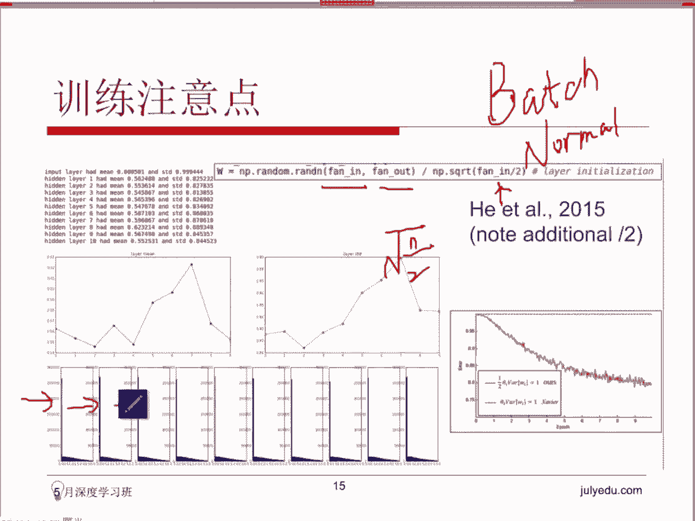
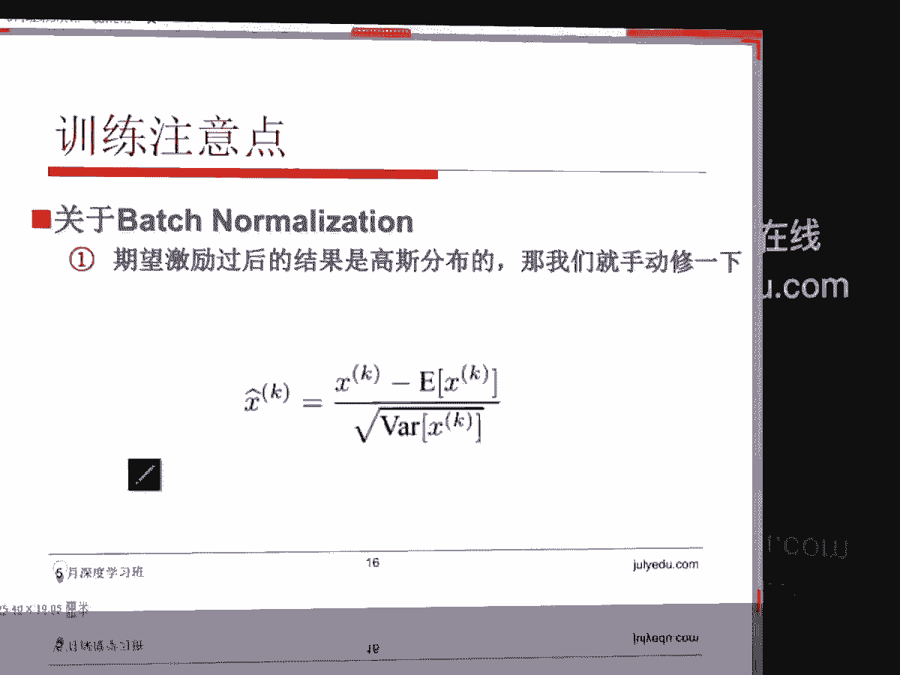

# 人工智能—深度学习公开课（七月在线出品） - P1：CNN训练注意事项 - 七月在线-julyedu - BV1EW411K7Mw

呃，下面来说一个非常头痛的一个事情啊，早期早期的这个神经网络。😊，进展不大，直到12年出了第一个啊呃非常非常。就有一定深度，但也同时能用的神经网络在alXnet之后呢。

大家发现后面除了非常非常多的神经网络，对吧？对Xnet这个啊google的net等等等等。为什么直到这个时候就爆炸式的增长了这么出来了这么多神经网络。

因为它提供了一个很好的初始值给后年这些搭建的神经网络去训练。最开始的时候这个训练啊，当你的层次alexnet它是7层的。当你这些神经网络层次到这样一个层次之后呢，它训练起来就非常非常困难。

经常会狗带中途。你训练训练的就发现没有梯度传回来了。你训练训练的就发现前箱运算的这个W可能。通通都跑回都都变成零了。这个我们叫做这个大家知道中间有一层叫基地层，对吧啊。O这张图可能不太合适。

大家不用看这个结果啊，我们就。比如说这个地方它是一个基地层，对吧？你经常发现基地层出来的东西没没东西了，变成零了。或者是你反向传回去的这个。梯度变成零了，这很糟糕的事情，你学不到东西了。

所以就训练不下去深度深度呃，当你的深度比较深的时候，你就训练不下去，都是原因都是因为它太脆弱了。这个神经网络你的初始的这个权重取得不合适的话，你去年训练就发现他学不下去了。

然后所以呢这个事情非常非常的重要，后来就有一大一大波的人开始琢磨这个细节。大家如果去翻一下这两年的这个paper，你会发现。居然有paper就是真的在讨论这个问题。

说我们用什么样的方式去初始化这个神经网络的权重，可以让它的这个我们叫鲁棒型，对吧？robost这个健壮性是最强的，而不会说因为你输入的图片。啊，比比如说这个地方是这个神经网络，是CNN卷积神经网络啊。

解决图像的问题的话，不会因为你输入的这个图像，这个像素点的值或者是其他的一些原因，导致你输入的变化，而导致这个神经网络在训练的时候。挂了。有paper专门在做这件事情。

所以我们把这个东这个地方我们给大家整理一下，拿出来说一下啊。最早期的时候大家想法是这样的，说那要不然的话我就。我就这样初始化一下，我就让所有的权重都等于0，行不行？权重权所有的权重初始化都等于0吗。

这是一个。大家在其他的时候啊，比如说我们之前做我们之前做这个梯度下降的时候，我们要取一个初始的位置，对吧？我们取一个初始的位置，那个没问题。你说我取一个，我从零点开始，对吧？你从任何一个值开点开始。

我最后都可以收敛到这个位置，对不对？好，但是呢如果在神经网络当中啊，我们不管什么样的神经网络，我们不单只这个CNN啊，如果是一个深层次，我们叫DNN好了，因为叫。

deep neural network对吧？深度神经网络。如果你在这样一个神经网络当中，你把所有中间会用到的这个权重W都取为0，会出现什么样的一个1一个现象呢？你看啊，所有现在这个值都是0。

大家要知道这一层，第二层的这个神经网络的这个input，就是它的这个输入是上一层的输出，对吧？这个in inputput是怎么计算得到的呀？是由上一层的这个输出和这个权重去做线性组合拿到的，对不对？

所以呢这个时候你会发现他们是他们变成了一个什么样的结构。在在这个学术界上，我们把这个结构叫做对称性的一个结构。你会发现所有的神经元，因为它都是由这三个节点和这个权重权重做线性这三个权重做线性组合拿到。

对吧？而当你现在的权重全都取为零的话。呃，不管中间有没有加这个activation，就是我们说的这个激励函数啊，我们先不管这个东西，我们我不管它有没有加激励函数。

但你发现不管它因为他做的操作都是同样的操作，对吧？所以你最后拿到的这个这个这个这个这4个神经元的input输入是一模一样的。再往后推一层呢，因为你权重还是初始化的是零啊，所以它这个时候还是一模一样的。

它会形成一个现象，叫做。对称的。对称性非常非常的尴尬啊，因为我们期待我大大家如果回忆一下的话，我上节课给大家讲到这个我们说这个CONV转基层的时候呢，我们提到了一个概念。

我们说每一个future大要做的事情实际上是什么呀？每个feer在做的事情时，我在观察我所关心的那一那一部分的信息，对不对？也许是颜色，也许是纹理。但你现在的这个初始化的过程。

导致所有的东西都是一模一样的，保持对称。这样的话我没有办法分化出来不同的filter。你往前推进的时候，计算结果也一样，我求我做这个我用SGD啊，用BP算法BP反向传播去求梯度的时候。

求它的传播传回来的梯度也是一模一样的，导致我下一步的迭代也是一模一样的。这个时候就很尴尬了，你会发现所有的神经元都是都在学同样的东西。这个时候你就达不到我们我们希望。大家如果去看一些讲解的话。

你经常会看到这个地方，他们提出来了一个性质，叫希望整个神经网络的结构是一个非对称的。那一种理解方式对这个非对称的一种理解方式，就是其实我们会我们会希望它能够分化出来不同的权重。

以便能够有不同的这个filter出现。Yeah。这是这是一个理解方式啊。所以W全取零的话是不合适的。因为它会带来对称性，你做一遍前向运算，再做一遍反向运算，你会发现所有的东西变化的状况都是一模一样的。

这个时候它没有办法去学习这个东西。那说明全取一样的值全全取零或者说全取一样的值，这都是一个很尴尬的状态。那现在我们不能用一模一样的值去初始化，所以我们要做一些变化，对吧？好，于是呢大家就有想法了说。

如果嗯那如果不能取零的话，最适合的方式，当然是大家想到说那我们就取一些随机的数了，对吧？非常非常小的一些随机数。比如说0。0010。000002等等去初始化这些权重，对吧？

最方便的方式就是这个地方提到的，我们我们直接拉一个高斯函数，对吧？高s function，然后这个高斯函数呢均值是0，对吧？这，可能是。就是一个标准的高斯函数，对吧？一个正态分布。然后我们从里头。

然后它的这个方差是。0。0。一对吧？一乘1的-2次方，这样一个高次函数从里头随机去取一些点。然后呢，我我去初始化这个。这个网络结构啊，这个地方还要多说一句啊，你这个地方随机取的话。

如果你用n派去做这件事情的话，大家看这个语句啊，random。如果我用n派去做这个事情的话，其实它已经保保证了一个性质啊。就是其实我们在做这个事情的时候。

我们取一取一些很小的这个随机数去初始化这个W的时候，我们会希望这个W里头的正数。和负数。是一半一半。这个是。什么意思呢？就跟刚才我们这个地方提到的东西是一样的，我们会希望。这个地方能有一个非对称形出来。

就是不希望所有的东西全都是正的，或者全都是负的。所以我们在初始化的时候呢，我们会。这个地方有个小的checks，是我们希望有大概一半一半的数字，是一半正一半负。然后呢，这个时候。啊。

这个有同学问到了说这个一半一半有有依据吗？它是。我们为了为了让这个神经网络形成一个非对称性去做的一件事情。但是你想想这个事情，如果你取的正比负要多的话，你的你的权重初始化正的比负的要多的话。

它有可能会向某一侧倾斜，对吧？你如果取的负比正要多的话，它可能会向另外一侧倾斜。所以最好的方式是你至少在初始化的时候要保证它们两个东西是是一致的对吧？然后。

这种方式呢你会发现他对于层次不深的这个神经网络。因为最开始的时候，大家大家可能觉得这个方式很O啊，业业界都觉得OK因为他们训练的时候发现能够训练成功，但原因是因为他们那个时候的神经网络的层次还不深。

举个例子说，如果你只有一个隐层或者是两个隐层的话，这个初始化的方式OK的，没有问题。你你直接用这个方式初始化，就可以拿到很好的一个结果。但是。如果它的层次深了的话。它很尴尬的是。

依旧会带来一它会带来这个整个网络的一个基激地传递啊，就是activation那个部分的一个一个不对称性。这种方式。这个地方呢是对前面是对前面这个我们提到的这两种方式啊。

这是我们我们前面提到这两种方式做了一个实验。现在呢我们起了10层的这个神经神经网络，十层次大概是十，这个比较深了，对吧？因为我们要看看前面两种方式，在深层次这个神经网络上的结构。O不OK？然后呢。

总共有500个神经元。呃，这个地方取的这个激励函数呃，一会我们会说，如果你用signoid，当然我我之前跟大家说过了，我说这个大家要慎重使用，对吧？sickoid现在现在基本上已经用非常少了。

或者TTNNH我们说有有时候这个在有些场景下效果还不错。一般我们会用RELU对吧？先不管这个，我们先我们如果用这个东西作为一个激励函数。因为它也是能够保保证这个它的一个。我们叫对称性，对吧？

它的整个图像是有对称性的啊，先不管这个，它是可以作为激列函数来用的。我们如果用它做激列函数的话，我们写了一个1层的一个神经网络，然后有500个神经元。我们看我们来监控一下中间做前向和反向传播的时候。

它的一个。里面的一个变化，我们把什么东西打出来呢？第一第一个部分是层次，对吧？我们的这个layer隐层说第一个隐层，第二个隐藏，第三个隐层对吧？然后呢，第二个部分是。啊。

这个地方确实就是有有点不太清楚啊，我我回头再整理一下，把这个部分给给大家具体再看一下这个部分呢是。从这个隐层当前的这个隐层，这个第一个隐层hiden layer出来的这个。结果的一个均值，一个命均值。

我们把它叫做，对吧？然后均值不够啊，我们要看看它的一个波动的状况，对吧？所以这个地方求类STD就是我们说的这个方差。然后我们把这几个东西打出来，我们。做几轮的迭代，做不用做几轮的迭代。

我们先做一次迭代来看一看这个东西。啊，均值是是均值是权重的一个均值。对。然后我们来看一下，做一遍这个全向均值的时候啊，说错了，做一遍前向前向这个传播前向运算的时候，他拿到这个结果是什么样的。

我把它打出来这个地方是我们刚才说的均值啊，每一层的这个均值的状况，是这样的，这个地方呢是我们说的STD就是我们的这个波动的状况啊，大家可能看不清楚啊，我给大家解释一下这个位置呢。

数字旁边这个数字大概是0，这个位置呢大概这个位置是0。那把它画成一个图的话，大概是这个样子，意思是什么呢？他发现没问题啊，第一层输入的时候。第一层的这个结果。非常非常的O对吧？

就是按照前面这个方式就说实化的话，我们按用很多的随机的这个从正态分布里头取出来的这个随机的。数字。去。初始化这个W，然后你会发现在第一层的时候，第一个隐层的时候，它是OK的。为什么呀？

因为你前面的这个weight是怎么来的呀？是正态分不过来，对吧？我们人为的让它的保持了这个对称性和它的一个幅度。所以它出来以后呢，均值在这个位置。均值在这个位置是一个负的。

如果大大家可能看不清楚这个东西啊，负的1个0。000117在这个位置，然后它也是有方差的，方差是0。21。你看方差是对吧？左右，你看它是有波动的。当它传到第二层的时候，这个东西传到第二层的时候。

你会发现它的均值。这个时候减小了。已经跌到了0。000001。多了个00。0001001，然后它的这个方差已经变化已经非常小了。然后呢，你再往后传的时候就很糟糕了。你会发现所在所有的场景下拿到的均值。

你其实大家可以理解，对吧？因为我这个输出的这个W输出的这个W，如果它的这个均值是零的话，然后方差也几乎是零的话，你再往下一，那说明几乎所有所有的数都是零了，对不对？所有的数都是零的话。

是不是类似于我们刚才说的这个第一种情况啊，对不对？我们说的这种情况，对不对？那你再往后传的话，后面所有的层次其实拿到的东西都差不多都长这样，这个这个就很糟糕了。因为我们整个神经网络学习的时候是需要你。

的输出output。数去要你的这个output有波动的对吧？需要你这个output有波动，我们才能求我们才能求得不同的这个呃。我们叫梯度，对吧？然后才能往往回传，对吧？才能学习到东西。

所以呢这种方式的话，在这样一个十层的这个神经网络里头，也会发现它所有的这个。刚才说错了，这个地方叫activation，就是这个值啊，这个值均值。我说不不是这个W的一个均值。

是你在经过激励函数这个activation之后，刚才的激励函数取的是TANH在经过它之后拿到的这个值。的一个均值。你会发现这个均值现在基本上都趋于零了。然后它也没有波动了。

也就是你现在输出的这个东西均值是零，然后没有波动了。这个时候你在如果你做反向传播的会话，对吧？backwardpa的话，你你你会发现。他就学不到东西了。这是一个尝试啊，就是如果你取W取很小的这个数的话。

去做这个初始化的话，在一个层次非常深的神经网络里头，你传到后续的话，你会发现你经过激励函数之后，拿到的这个结果，它的一个均值是趋于零的。而它的一个方差也是趋于零的。也就是再解释具体一点意思。

就是你拿到这组数，其实基本上都是零了。所以输出基本上都是零了。这个时候你再做这个反向传播的话就会有问题。所以呢后来大家就那如果很小的数不行的话，很大的数行不行呢？于是我们取了另外一个取的方式啊。

就是我这个我们取了输，这个地方是输入层和输出层的这个之间的一个值。这个地方呢。应该说是节点的个数，大家可以理解成是节点的个数。也就是说，如果你的前面的输入层的个数是4，输出层的个数是三的话。

这个地方我在两者之间啊举一些举一些数，因为这个时候它是比较大的数，对吧？刚才取到这个数是非常非常小的，正态分布里头出来，大家能理解对吧？所以你这个时候呢，你你如果取比较大一点的这个整数的话。

你会发现一个问题啊，就是呃大家大家如果有印象的话，会记得这个函数，它和sigoid我们都说了有一个。有一个很糟糕的地方是当你啊。signoid是这样的对吧？CNNH的话。反能是。移动了一下。

但是呢你会发现它在这个位置在你输入区域。很大的时候，比如说去无穷的时候，它有一个有一个。我们说的这个状态叫做饱和的状态，对吧？也就是我们说梯度已经传不回来的状态。

然后你如果你用现在用这样一组数据做这个权重，做W的这个输入的话，你再去看一看你现在经过这个激励函数这个DNAH之后，拿到的输出的这个结果的一个均值和它的一个方差的话，你会发现这个时候和前面刚好相反。

前面是传已经趋于零了，对吧？这个地方到后续的话，所有的均值和方差都趋于零了。但到这个位置了，但这种情况下呢，你会发现它频繁的在跳。这个是这个是它的一个均值啊，均值的话你会发现要么在上面，要么在下面。

这个是它的一个方差。方差的话，所以它的状态是。它基本上饱和了。要么跳到负一的位置，要么跳到一的位置。你看这这是在两侧，对吧？有两条线太发散了，就这样一个状态。

所以呢你就发现太大的这个呃太小的这个数呢和比较大一点的数呢都不适合去做这样一个权重的数始化。后来有论文提出了这个方式啊。

这个方式这是210年的论文提出来的方式是我们怎么去取这个W呢取的方式是还是像刚才说的，我们有输入层的这个个数，对吧？有输出层的这个取这个。个数对不对？

所以呢它是把输入和输出层的这个个数里头取了一个随机数呢，除以了它。输入的个数的。平方根。正好问，这个东西是有一个数学依据的啊呃大概。大概是这样的，我们假设这个这他在做一个事情。

我们希望输出层的这个方差能够维持住和输入层输入层的这个方差基本是一致的。那这个东西它是可以可以在数据上证明一下的啊。比如说我们来看一下啊，我们输出我们输出假如是呃output吧，对吧？

如果要求它的一个方差的话，大家看一下，实际上那你输你的这个输出输出层是怎么得到的呀？简单一点来说，如果它是一个全链接层的话，你可以理解成是。对吧一个一个加权嘛。对不对？所以这个地方的话。

如果你把它展开来的话啊，如果这个地方的话，大大家知道这个sigma可以拿到外面，对吧？就是它的一个一个呃方差的话，实际上是等于。等一到N的这个它本来就是一个一个一个求和嘛。WYXI对吧？

那这个东西的一个呃方差的话。它其实是可以等于。嗯。O我直接把那个稍等一下，大家我直接把那个网页儿给大家。好，拿过来。看一下。我之前。对，大家能看得清这个输入吗？啊，能大家能看得到这个。

如果这个地方的输出是S的话啊，假如假如这个输出是S的话，它其实是由前面的XI输入，对吧？做和W去做一个线性加权之后得到的东西，对不对？所以它的一个方差，实际上等于这个东西的一个方差，对吧？

和X之间的关系是这样的，所以呢我们可以把这个西格玛拿到前面，对吧？实际上这个这个东西的计算呢，可以看作是W每每一个的I从一取到N就是总共。I从一取到N每一个输入这个XIWI的一个方差，对不对？

那这个东西的话，你是可以展你是可以展开的。好。大家可以自己去看一下啊，这个地方回头。拔出来。最后你把它展开之后呢，有一部分东西的一个均值，前面的这个东西的一个均值都为零了。

所以只是只剩下最后这个部分的一个。一个均值。最后是一个N倍的一个关系。呃，给个链接。好，OK啊，大家这个这个地方呢，我们我们不细讲了，它是有一个有有数学理论的这个呃推导的，我们是希望输出的这个方差。

保持和输入的方差是处在同样一个。变化的一个同样一个一个一个大小差不多的大小，这样能保证每一层大家能理解，对吧？从这一层输入。这一层这一层的输出它是有一个方差的对吧？是这一层的输入，对吧？

这个叫这个是output一，对吧？但是它是我们的input的第二层的一个输入，对吧？input2，所以我们会拿到一个output2。我们希望这一层的输第一层的输出和第二层的输出。

它们之间是维持在同样一个方差的一个一个大小的，也就是波动范围是一样的。不然的话大家可以想一想，当你层次很深的时候啊，如果你后面一层比第一比前一层的这个方差要大的话。

那意味着它是一个非常非常发散的一个过程。当你。往后推进推进的层次比较深的时候，后面的波动就非常非常大了。所以我们希望每次控制一下，那控制的办法呢是什么呢？

就是以前以前我们没有batch normalization，待会我们会提到ba normalization，对吧？呃，可可否人为的控制方差。这个一会我们会提到。

我们有个方法叫ba normalization。那个方法呢是让神经元自己去学习到怎么样去控制住这个方差的一个波动。我我只是说我们最开始的时候，我们刚才说了。

如果你完全不控制这个方差的一个一个波动状况的话，不管你是取大的值还是小的值，你会发现都会有问题。所以呢现在呢我们有一个想法是我们我们为了控制住这个它的输出的这个方差的一个一个变化情况。

我们在W的取值上做了一个小小的一个技巧，是我们让它除以根号N了。至于说中间的这个过程的话，大家可以一数学推导过程的话，大家一会可以可以看一下啊，就是把这个地方展开了，你会发现前面有几项的地方呢均值是零。

所以只剩下后面的一项，你会发现它们之间是有一个方差值，它们两两两个方差之间的一个关系啊，一个倍数关系是N倍的啊。呃，只要求后面的波动不大于前面的不就行了吗？呃，要求后面的波动不大于前面的话不一定行啊。

我们仔细看第一种情况，不就是后面的波动不大于前面的波动吗？就是你但是你这样的话，可能后面会逐渐的趋于零啊，我们还是希望它有波动，只不过我们希望这个波动状况是可控的。

而不是说是一个发展或者是极度的收缩的状况。因为在那种情况下的话，当层次升起来了，它都会有问题，对吧？所以。呃，是所有的层的权重放在一起，按高斯分布赋值吗？还是每呃，这个时候应该是每一层负值的。

因为你仔细看这个公式，你会发现它和前一层和后一层的输出前前一层的神经元，后一层的神经元的个数是有关系的，看到了吧。所以它是一层一层去复值，不是所有的东西都放在一起复值的。呃，刚才说的这个方式。

刚才说的这个方式是他们之前因为没有用RELU对吧？所以用的是TANH的时候，发现这个方式是OK了。很尴尬的是，当大家提出了这个。这个嗯。RELU线性这个记累单元之后呢，就是大家知道这个图长什么样，对吧？

这一段后面突然起来Y等于X这一段发现放到这里头之后呢，这个方式它现在就不生效了。就是你的那个。放到这个激励函数之后，它就不生效了。因为他们大家去做了一个实验。为什么？因为它的处理方式啊。

大家会发现这个东西的一个方式。RELU的输入和输出之间的关系和我们刚才说的TNH或者signoid它是不一样的。signoid的话它会约束住在一个一个范围内，对吧？但RELU的话，它是一个。线性的嘛。

对吧？所以它的输出其实如果你的输入input的非常大的话，其实它输出也是非常大的。所以他发现这个时候用用根号N约，你就约束不住了。你这个地方除以根号N。你你去画一下的话，你会发现呃前前期是有波动的。

然后再往后的话，你发现他又摔减了，又衰到这种状况。为什么RELU不是111个直线？这个我们上节课提了，你可以回去看一下上节课的一个视频啊。我们说了，就是如果是一条直线的话，会有问题。

所以在在呃15年的时候，15年的时候还专门发了一篇paper。这天这篇paper呢很有意思啊，它只调了一个东西。😊，就是原来你是除以根号N，它现在在RELU这个激励单元使用这个激励函数的时候呢。

它把根号N换成了。根号2分之N。他发现这个时候他就正常了。大家来看一看这个这个装好。这个时候你会发现。这是一层一层啊，层次逐渐变深。你会发现在前面的时候。你看均值大概在。这个位置它是这样波动的对吧？

有有这样一个波动的，有有这样一个方差波动的一个状况。然后它到第二层的时候，它还能维持住这个方差。到第三层的时候，还是直到最后一层，你会发现它都能维持住一一个一个正常的一个方差的一个波动。

然后这是它的一个lo。这是他的一个。你会发现它是逐渐衰减的，能正常的工作的对吧？呃，这个这篇paper我没有仔细看，15年的这篇paper我没有仔细看。

但是有他有提出来说2分之根号2根号2分之N可以完成这个事情。不过呢呃这是因为之前之前啊我们所有的神经网络的W都是我们自己手调的。也就是说我们手动的去指定它这个时候怎么样。去取这个值。

所以那个时候的checks非常就是大家说的这个小这些技巧非常非常。找起来非常非常的困难，他需要做大量大量的实验，然后去观察看什么样的情况下是最合适的。呃，后面一会儿我们会提到啊。

有一个东西叫batch normalization，这个东西是可以让让你的转积神经网络现在自己去自发的去学习出来现在一这样一个约束。嗯，这个重复了哈。好，就就。😊，提到了。

所以在我们提出来这个大家看到这个google提出来这个ba normalization之后呢，呃之前呢大家可以看到当时最好的最好的这个W的一个取值方式是输入个数输出的个数，在中间随机取一个数，对吧？

然后再除以2分之N，这个N是你输入层的这个神经元的个数。那这种情况下呢，他大家会发现如果你你跟一下这个状况的话，你发现大大部分情况下，它工作还是正常的一个状态。

但是你还是要小心一点去保看一下中间的那些状态啊，去去去跟一下。

