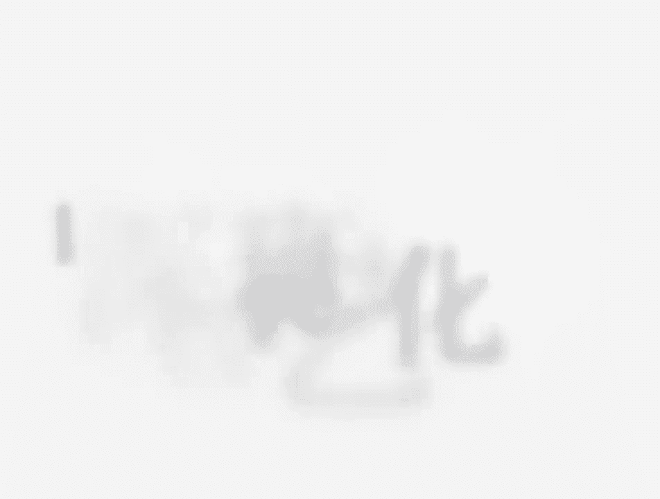
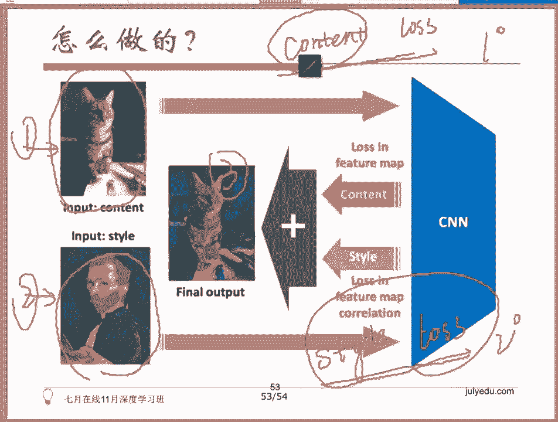
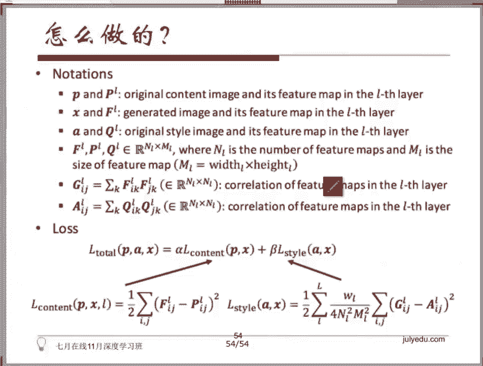
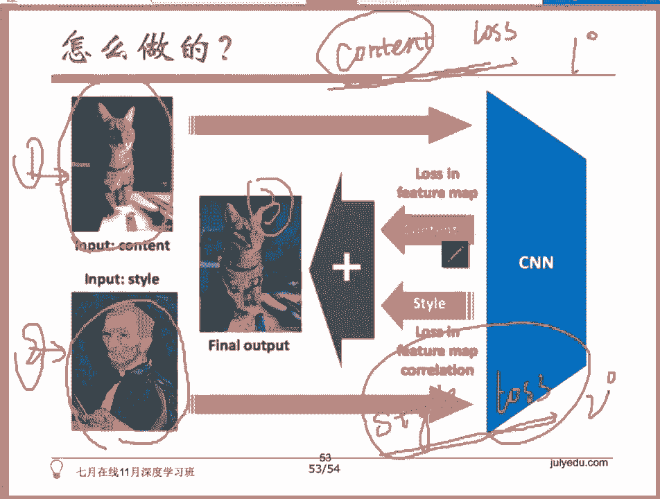

# 人工智能—深度学习公开课（七月在线出品） - P3：NeuralStyle艺术化图片（学梵高作画背后的原理） - 七月在线-julyedu - BV1EW411K7Mw

我们先提一下new style，我不知道这个部分，老师有没有给大家第五节课的时候，老师有没有给大家提到啊，所以这个是给大家的一个当时一个承诺。我们说我们做了这个实验，一定会给大家讲清楚这个原理。

所以我今天一定会一定会给大家讲清楚new style的原理，我希望大家能够呃仔细的听。而且一会儿我会带大家看一眼代码好吗？

所以new style呢源于这个2015年的这篇论文叫做 neural a of啊，反正大大大概就是说我能够造出来一些具有艺术风格的这样一些话，它做的事情非常的简单，说我有一张原始的图片。

我有一张大师的手绘图，我能生成一张具有大师手绘图的这样一张图片。原始照片的风格的这样的一张图片。对吧所以大家看到了这样一些结果，对不对？所以大家都在画这个梵高的画。

毕加索的画啊呃毕得到梵高风格或者是毕加索风格的这样一些照片。好，所以这个东西它是怎么去做的呢？我仔细的讲，大家也仔细的听，有问题，随随时提出来。我原始输入是不是会有两两部分的东西。

有一部分是我的原始的照片，有一部分是大师的手绘的风格图。我有两个组件，对吧？这是我的输入，有这么两幅图。我希望得到一个结果是我得到的结果是第三幅图，对不对？那这个地方要提到一个概念，这个概念是。

你怎么去评估两幅图之间的相近度？相近度包括两个内容的相近度。有一个相近度是我在内容上的相近度，叫做content similarity。所以在它的基础上，我会得到一个counttent loss。

听清楚了，这个东西衡量的是。你得到的最终的结果和我原始结果在内容上的一个相近度。大大家先不要管细节，这一点大家理解清楚了吗？有这么一个概念叫做conent loss。

叫做conent similarity评估的是这样一个东西。好。所以你怎么去说我这幅图像具有大师的手绘图的风格呢？所以一定会有一个风代替风格的相近度的这样一个东西。这个东西叫syle loss。

所以听清楚吗？有两个组件，第一个组件叫做conent loss，第二个叫做style loss。接着这两个东西会不断的打架。我就告诉大家，训练的过程是一个他们俩在不断的斗争的一个过程。

因为当他的在内容上和原始图非常接近的时候，他就比较难去学到那种抽象的大师手绘图的风格。啊，当他在风格上和大师的手绘图非常接近的时候，他在内容上就会丧失掉一部分的可理解性。所以从广义上来说。

这个地方会有两部分的loss。因为所有的mine learning的问题都是我会定义一个los function损失函数。接着我会不断的去最小化这个样一个损失函数，对不对？

大家告诉我这个这个概念大家有吧？所有的 machine型 learningning的问题。大部分情况下有监督的问题，我们都会定义一个los function，或者叫做cost function代价函数。

我们会不断的去最小化这样一个东西。好。所以这里头会有两个损失，会有两个los。第一个los叫做countant loss是评估它和原图里头内容的一个相近度。第二个lo叫做style loss。

它评估的是和原图的一个风格的一个接接近度啊，一个风格的一个差异度，我们应该叫啊，上面这个是和内容的一个差异度。接着我会把这两部分组在一起，说，你一直给我最小化一下吧。然后它就会在里面不断的斗争。好。

我先提到这样一个点，接着我们再往下看。

啊，下面这一页呢就会有非常非常复杂的公式。所以为了避免大家看到公式头晕，我决定给大家呃用很通俗易懂的方式去讲这个东西。大概是在这个15年的时候呢，这个德国小哥啊，这个论文最早源于源于德国的一个小哥啊。

这个德国小哥当时在做算法的改进，所以他就在想，他说我能不能有一个办法去得到一个更好的一个神经网络呢？所以他在想我有哪些优化的点呢？他就开始思考他说哎要不我来试试lo function吧损失函数嘛。

因为大家一般都是用的一些啊ok cross entropylo或者是一些ing loss吧VM他说我能不能去造一造一些别的lo出来呢？他就开始自己做实验了，做了一堆实验。

后来就发现哎这话居然发现了一个新的lo function这个lo function非常非常的神奇，他能够衡量。

它能够衡量。两幅图之间的一个个性化风格的一个相近度。有那样的一个概念，能评估它们之间的一个相近度，或者说一个差异度。ok。😊，所以。那个。okK这个我我先我说这个德国小哥他在做实验啊。

所以大家大家之前做的事情呢都是一些这个cros entropy loss，或者是这个L two的这个lo。然后。接着这个时候他他去做这个事情的话。

他想一想我们有没有其他的一些方式可以去衡量图片之间的一个差异度，对吧？OK所以。我们来看一看count loss和这个style loss都是怎么怎么求出来的。呃，这个东西看起来好吧。

我们直接这么说好了。有一幅图片，这幅图片过了一个卷积神经网络以后。告诉我，如果我抽啊举个例子啊，我抽的这个地方是第五个卷积层，我的卷积层是不是1个HC乘以H乘以W的一个矩阵呢？

一个特征一个一个feature map，一个特征矩阵啊，其中的C表示前一层有C个小朋友表示我有C个通道H和W分别是我现在。但长度。那那大家这个能理解到吗？这个大家没问题吧。😡，OK所以听清楚啊。

这个时候会有H会有W，对吧？会有C，对吧？我们来举一个例子啊，我们来举一个例子，我们假设现在C是512。OK前面一层有512个小朋友，A，W和H呢分别是64乘以64好了。所以。

我们怎么去衡量countant loss呢？这里头这个东西很有意思啊。如果如果有同学去了解这个，比如说淘宝的拍立淘是怎么做的，因为拍立淘他要做的事情不就是去搜索这个商品。

你拍的这个商品在我的库里面到底有还是没有嘛。所以它肯定是一个评估这个你的这个商品的内容，实际内容的这么一个。一一套准则嘛，可以他是怎么去做的呢？😡，你的。这个原始代表内容的这幅图。

一号图是不是过这样一个卷积神经网络以后，是不是会拿到这样一个结果，512乘以64乘以64的结果。没有问题吧。我最后训练得到的这个结果，是不是先不要管结果怎么训练得到的啊，我就问大家。

假如我现在已经有一张图片了，我要衡量他们两个之间在内容上有多大的差异。我这张图去过这样一个卷积神经网络，把第5个卷积层的结果拿出来，是不是也会有一个512乘以604乘以60字的一个feture map。

这个大家能听明白吗？ok没有问题，对吧？好，所以我现在用两个这样的举阵。好，我现在要开始给大家讲了啊，这个count loss和style loss分别是怎么来的啊？

countent loss是这样说的。因为每一层听清楚啊，这个channelC个channel通道里头，每一个通道的结果是怎么得到的呀，是不是一个小朋友看的呀？是不是一个小朋友看到的呀？

所以我直接就去比对同样一个小朋友看到两幅图的结果的一个差异不就可以了吗？所以他做的事情非常非常的简单。我把每一层的64乘以64的矩阵，这样一个矩阵去做一个差值主点的差值。我把这个差值的这个。

平方加和加在一起。这个大家能理解吗？能理解我说的意思吗？你有512个小朋友，我对，是一个类似L two的一个一个计算方式。我把每一个小朋友看到的两幅图的差异算出来。

也就是每一个小朋友啊对应第一个第一个位置，第一个faature map啊，这一层的faature map，在两幅图上的差异，64乘以64个矩阵，这个矩阵去做主点的差值，再去求一个平方和。

就是大家看到的这个地方。这个公式现在大家能看明白了吗？现在大家能看明白了吗？这是。同一层看到了吧？这个L表示是一层，同一层去。主点做差，把它们差值的平方求和。

表示我两幅图在内容上的差异度可以定义出来一个countent loss。大家告诉我这个部分都跟上了吗？countent loss好，没有问题。所以德国小哥最大的创新在于下面那个style loss。

你来想一想风格这个东西。怎么去体现风格啊？怎么去体现风格这样一个东西啊？你想一想啊，这个地方有512个小朋友。是不是每个小朋友会有自己的一套世界观，一套价值观，一套看似这幅图像的方法呀？

所以当他们两个方法之间的差异，当他们看到的东西。对同一幅图而言啊，听清楚。对同一幅图而言，两个不同的小朋友看到的东西差异度越大，是不是代表这个东西可能它本身的抽象程度或者它本身的一个一个差异度。

这个风格的差异度会。会更不一样啊。😡，所以他做了一个事情是这样的，这地方是不是有512个小朋友啊？这512个小朋友，每一个小朋，比如说一号小朋友，你告诉我他是不是1个64乘以64的矩阵。

2号小朋友是不是1个64乘以64的一个矩阵？注意啊，我说的是同一幅图得到的这这一个非ature map啊，这一个C乘以H乘以W的非ature map里头，我取了两个小朋友的结果出来。

比如说一号小朋友和2号小朋友。这两个小朋友得到的64乘以6464的矩阵，每一个位置。主点的做乘法，再把得到乘法的结果求一个和。这个运算我给大家说清楚了吗？这512个小朋友里头，我取了两个小朋友出来。

这两个小朋友是60，都是64乘以64的矩阵。我把这2个64乘以64的矩阵主点对应的点去求乘积，再做求和的操作。主点的乘法在求和点击。即。数学上叫做。这个操作大家能理解吗？

对两个不同的小朋友的解输出64乘以64的举证结果去做点击。所以总共有512个小朋友，大家告诉我，512个小朋友两两之间去做点击。我最后的结果是一个什么样的结果呀？是不是C5122啊？也就是是不是一个。

啊，你可以自己和自己啊，对是不是512乘以512的一个矩阵呢？告诉我是不是这样一个结果，是不是1个512乘以512的。结果值，因为你先从512个小朋友里头取一个出来。

再从512个小朋友里头再取一个出来去计算这两个小朋友的一个结果嘛。这一步大家能跟上吗？512乘以512的矩阵。我对每一个每一幅图，我都能得到1个512乘以512的矩阵，这个大家跟上了吗？

这个矩阵在数学上有一个定义，它叫做gramme matrix。所以我问你。刚才的512的小朋友。在原始的这幅一号在原始的这幅风格图。

2号这幅风格图上是不是会有1个512乘以512的1个gram matrix？是不是在我的结果的三号图上也会有1个512乘以512的1个gram一个gram matrix。

所以这2个512乘以512的grammatic可以去做这样的一个事情，看清楚了吗？这就是刚才我们给大家讲到的啊，你不用管它前面这个系数啊，大家先不要管这个系数，只看后面这一部分，这一部分就是两个。

grab matrix去做刚才和前面countent的 loss里头一模一样的操作，只不过我不是在原始的结果上去做差值，我是在我生成了这样1个512乘以512的结果上面去做这样一个差值。

大家听清楚了这两部分lo怎么得到的吗？这个是countent loss。因为看公式可能怕大家比较懵啊，所以我我我直接给大家讲一遍啊，这个是tyle loss。

所以countent loss和tyle loss两个东西是需要去斗争的，怎么去斗争呢？谁更重要，对吧？家里头会有这个哥哥弟弟，那哪哪个哥哥和弟弟哪个会更受父母的这个宠爱一些。

这个东西是需要你自己去定义的。所以你大家会看到前面会有一个有会有一个系数阿尔法和一个系数贝塔，他们分别去描述，到底是我内容上更重要一些，还是我的风格上接近度更重要一些。不要着急啊，我会把所有的点都讲到。

大家先follow我的。我讲到的东西先跟着看看我讲的这个东西，大家明白了没有？所以你可以说我内容上要非常接近0。90。1，也可以说我要非常强的风格接近度0。80。2，这个大家能明白吗？

我的spi loss只设计对第二张图和第三张图听清楚了，只设计第二张图和第三张图。所以我现在要开始给大。我现在要开始给大家讲到。我们是怎么去做这个训练的啊？所以刚才last function。

损式函数的定义大家都听明白了，对吧？conent loss和tyle loss，而且我们知道我的countent loss，我的内容的一个lo是在第一张图和第三张图上去求的。

我的style loss是在第二张图和第三张图上去求的对吧？我现在要开始给大家讲这个训练是怎么训练的，所以我们是这么去做训练的，你说我开始我也不知道我要生成的图到底是什么样的对吧？

所以我这个地方有3张图，O一号图，这个是countent的图，对吧？所以是照片，对吧？好，2号图是什么呢？2号图是我的大师的。手绘图对吧？大师的画对吧？那我三号图是我要生成的图，对吧？

那生成的图我也不知道这个图是什么呀，那没关系，你先给一张白的图好吗？给一个随机的结果。比如说你取一个啊okK。你取一个全零的一个矩阵好吗？没问题吧。所以这是我一个。这是我的一个X一啊，我表示我的照片。

这是我大师的画风格画啊，我表示XX2，对吧？我要生成的结果是这个X对吧？大家想一想，我们传统去训练一个卷积神经网络是怎么训练的呀？我是不是fix住我的。图片和结果我去调WY等于WX加B啊。

我们假如啊那我是不是我做的事情是不是要去训练W和B啊？这个大家能明白吗？我需要去做我传统的卷积神经网络做的事情是我固定住我的输入，我去让我的W和B最贴合我的输入和X和我的Y。对吗？😡。

这个小哥做了一些变更，他说我现在是要生成图啊，图在哪儿，图在哪儿，图是不是在X上面啊？所以我去拉了一个卷积神经网络下来，拉了一个VGG下来。他说我W不动啊。我固定住这样一组W，我只是去调整我的X。

X现在是变量。所以我每调整一次X之后，我是不是可以求出来一次conent loss，求出来一次dial loss啊。我每一个batch的图片上，我是不是sorry不是 batchch的图片啊。

我每每一次我生成的结果图上，我是不是可以求出来一个cont loss和tyle loss啊？大家跟上了吗？这个地方我拉下来了一个VGG这样的神经网络，我固定住了我所有的权重W和B，我不断的去调整我的X。

我每做一次调整，调整完我的X之后。🤧我都可以得到一个counton loss和excel loss，对吧？接着我我要最小化我刚才的这样一个公式。

阿尔法倍的counttent loss再加上贝塔贝的tial loss。变更的东西是W，听清楚了吗？你原来求的是los function，对W的偏导，我现在是求的los function，对X的偏导。

我不需要Y，我需要的东西是什么呀？我需要的东西是中间的特征，用来求这两个los，听清楚了吗？这个loss只跟我中间产出的特征有关系。这个时候我的V机G只是用来抽特征。我的微GG我要用的是它那一组W和B。

我需要用它去做一个图像的表达。我说清楚了吗？这个问题，这个video analysis这个同学。我刚才花了很大的时间给大家去讲这个los，就是我让大家明白和外没有关系。

是我中间层的产出去比对这个loss的。对你的微GG可以指forward到第第五个卷基层，这个是完全可以的。所以。OK吗？这个东西我我这么给大家讲原理，我讲清楚了吗？

从counton loss和tyle loss怎么去求到怎么去做训练。然后有兴趣的同学可以咱们可以看一眼代码啊，这个代码这是一个tensor floor写的版本。

tensor floor写的版本呢呃我我们。这个。这个有点小啊，放大一点放大一点。然后咱们来看看啊，看看到没有？这个地方有一个countent image，对吗？这个是style image，对吗？

会有一个内容图，会有一个风格图，对吗？有同学在问系数是怎么来的啊，问系数在怎么来的？这个同学回去看看我们第三节课的卷基神经网络，最后的fin tune，好吧。最后的fin呃。

我的这个代码代码的这个位代码的话，我有贴在我们的。PPT上啊，我再发到群里头一下。ok点进去，好吧，这是tens of raw代码。

因为tensor raw代码比较好读cay的话cay的话写在proto test里头了，所以会相对麻烦一些啊。所以。所以大家来看这个地方的话啊，不在这个地方啊，在这个文件里头，在这个size这个里头啊。

看清楚了啊，这个地方testflow直接load进来了一个网络load进来了一个VGG看到了吗？VGG是固定主权中的啊，这是人家训练好的模型放到model组里头，我拉下来的，我把模型载入进来了。

VGG载入进来了，然后我做的事情非常的简单，我会去求两个lo，看到countent loss了吗？大家看到countent loss了吗？怎么做的，是不是刚才这个公式。

大家看到了是我两幅图里头抽出来的这个这个layer，然后直接去做差值吗？看到这一行了吗？countent loss。内容接近度的这个损失，是不是刚才这个公式，大家看到L to loss了吗？

有看到L to loss吗？这个地方。都能理解吧？好，style loss的话，是不是我先求了一个gramme matrix啊，看到了吗？style gra。这个就是ex matrix。

我在这个grammmatics的角基础上去求了一个L to loss，看到了吗？在我刚才求得的512乘以512的gram matrix上去求了一个L to loss，能理解能理解到这个这个意思吗？

我先求出来了一个gram matrix这个东西用来衡量风格的一个。这幅图的一个风格。接着我在两幅图的风格的这个得到的结果上去求了一个L two loss。就是咱们公式嘛，这个地方的公式嘛。

两个两个grammatic，然后去做。L to loss吗？对不对？所以我我这两个重要的点给大家说到了ok吗？其他的大家自己去看好吗？你看这个最后的一个los，就是对这两个los啊。

你看到style loss。对style loss和count loss去求一个和，看到了吗？总的lo就是conent loss，再加style loss。他这个地方没给系数啊，你可以自己给系数。

比如说你想让它更接近风格一点，你可以给风格的这个东西权重给高一些，然后内容的这个权重给低一些，它这个地方很均衡的给了0。5和0。5，就是一和一。OK啊，这个地方有个TV loss啊。

这个大家不用不用care。这个TV loss是一个图像的平滑。它为了让最后出来的结果，最后出来的结果，这幅图看起来更自然。所以。啊，我会有这么一个东西啊，它它是一个varions一个一个图像的一个降噪。

一个dennoizing啊，有兴趣的同学可以去查一下啊。在在Vki上面会有啊啊维基百科上有好吧，所以最后这个los大家不用care，前面两个lo比较重要啊，content loss和t loss。好。

我这么我讲到这儿，大家OK吗？这个东西。😊，这个newer styleyle大家都。OK了吗？这个代码我你们一定能看得懂啊，这个代码就是刚才的公式，好吧？好好嗯，好，没问题的话，咱们就接着往后走了。

好吧。所以今年还有一大部分啊，这个地方大家看到了吧？如果我把我把这个count loss调成0。8的话，大概是这样一个结果。我把conent loss调成0。5的话，大概是这样一个结果。

我把conent loss调成0。1的话，大概是这样的一个结果，看到了吗？很抽象啊，很抽象。因为我只关注风格，这个我我比较关注内容，所以我会产出一个内容非常接近啊，中间这个0点5。

说明我两边都要我这个这个毕加索的这个话，我这个风格和它的内容我都要考虑一下，所以我给了1个0。5，你拿到这样一个结果。ok。好吗？这个是系数啊，在自己可以调代码我代码我们也给大家，刚才也看到了啊。

你自己去加系数，你自己去尝试，好吧。啊，对，有同学问到一个问题问的很好啊，说风格的los是试验出来的吗？对我可以告诉大家。那篇那那篇paper发出来之后，作者自己没有讲清楚为什么会有这样的一个结果。

然后我给我刚才给大家一个直观的理解是这样的。我们有512个小朋友，我认为每个小朋友会有一个关注的点，对不对？当我两个小朋友之间的这个512乘以512啊。

每这个两个小朋友之间的这个差异度越大代表就是两个小朋友之间的这种碰撞，他能够描述出来这幅图的一个风格。因为每个小朋友他看到的细节，他看到的风格是不一样的嘛。

所以直观的一个理解是刚才这个gramandmatic说的事情是。我用我通过不同的小朋友去看到的结果，互相的去做运算，能够描绘出来一些近似描述这幅图像风格的一些一些东西。我我简单的这么给大家。说一下。

我我不知道能不能帮助大家稍微理解一点这个地方。做的事情。对吧也就是你去评估两个小朋友之间看到东西的一个相近度或者是差异度啊，因为他们看到的是不同的内容嘛，关注的是不同的风格嘛，类似于对吧？

所以我只能我只能简单的给大家这么提一下。然后刚才我们前面讲到的所有内容啊，我这个这个这个部分我给大家讲了RCNfas RRCNfa RRCNRCN呢最后看有没有时间吧。

然后new style呢这个地方有cafe的版本那个呃我们的这个tenor floor版本，我已经发给大家了。好吧，我已经在群里头发给大家了啊。

