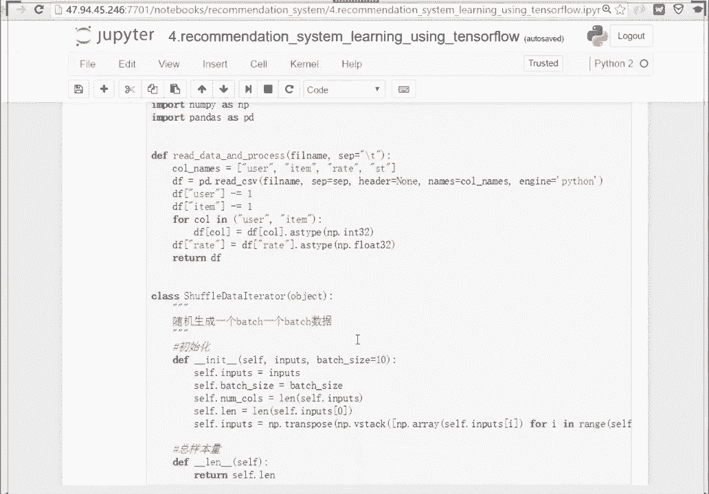

# 人工智能—深度学习公开课（七月在线出品） - P4：TensorFlow推荐系统 - 七月在线-julyedu - BV1EW411K7Mw

OK所以第一件事情是把数据拿过来嘛。这个数据的话用的movie lens数据啊。昨我大家还记得我们自己处理一份那个就是歌歌歌单上处理出来的一份和movie lens一模一样格式的数据，对吧？

所以你只要把你只需要用那个脚本去把其他的一些。数据啊，不管是我们这个地方提到这个音乐推荐的歌单数据，还是其他的一些大家在实际能拿得到的一些推荐。电商里头一些推荐的一些数据拿过来以后整理成这个形式。

你就可以用下面这个模板，好吧？然后所以它的数据格式大家也知道了是一个user一个item，一个打分 rating一个timet一个时间戳。然后数据处理的部分呢。

我们来我们用tensil因为用tensl flow去搭建模型的话，大家知道这个 neural network神经网络的训练方式是一一批一批数据往里头送的对吧？

一个 batchch一个 batch的数据往里头送的。所以我们需要想办法去产出。一批批的数据OK所以我我下面就是这个对，下面就是我们的这个具体的程序了。所以大家可以看到。

最上面这一行是因为我用的是python的22。7的版本。那t flow里头呢有很多的。语法句句法其实是和三有有点类似的。所以这个地方我from future去import一下这个print函数啊。

然后一些这个除法okK等等。然后我把n派和padas load进来了，n派做科学计算，pas可以去呃加载数据做一些数据分析和数据处理事情。啊。

然后第一个函我写了一个函数叫read data and process。这个很简单，就是我们的文件的格式是us item rating和time，对吧？所以我把这个co指定一个co name。

然后我用pandas的read cSV直接把这个文件load进来了。对，所以文件名，我告诉他说我是以这个杠T啊，就table键做分隔符的。然后我没有header，我自己取了一下。每一列的列名对吧？

叫做叫做useritem rating和ST，然后我的啊 engine就不用看了，然后。这个data frame user和data frame的这个item啊，这两列的话。先减去一OK。

然后这个地啊我们我们一会儿可以带带大家跑一下啊，就是看看这个数据载入进去大概是什么样的。我们要去做一些数据格式的一些转换。比如说这个地方load进来以后，实际上是一些呃字符串，对吧？

所以你需要去实际上你你需要去对它做一些类型的一些转换，比如说转成fat转成int floatat，对吧？那us和item是us ID的用户的ID和ite ID对吧？

所以我把user ID和item ID呢去转成in32的ok类型。然后我的打分向量应该是打分是一个连一个连续值，对吧？一个小数的连续值flow，所以我把它转成一个fat类型的啊，就这么简单啊。

所以这个函数做的事情就是把数据读进来，并做一些简单的数据的处理，包括数据类型的转换等等。然后下面写了两个class，一个class叫做ser data iter。它做的事情是我随机的去产出一个bach。

一个 batchch的数据。所以。这个地方呢我们训练的过程啊，就是在神经网络当中，通常通常我们经供我们灌进去的数据呢，我们灌进去做训练的数据。对对对，有对对对，有同学回答了。

就是有同学问到说为什么要减一是下标从零开始嘛？我们我们在我们下标是从零开始的。OK然后这个地方的ser data做的事情是。我们产出训练数据，一批一批的训练数据。那大其实如果有同学熟神经网络的话。

你会知道我们在做训练的时候，我们其实并不希望输入来的输输入进来的数据是顺序的，我希望你随机的产出一个batch给我，对吧？因为如果你顺序的往里头输入的话，你看你我去做这个。图像的识别。

你顺序的输一个文件夹，一个文件夹输过来。那你上次输的全是猫，这次全是狗，我我什么也学不到，对吧？所以我希望它能够有更多的丰富度在。

对以我希望我产出的数据能是一个打乱顺序的随机产出的一个bach一批一批的数据。所以这个地方这个shaer data iterator做的事情，实际上就是打乱顺序之后，从打乱的这个数据里头去取出来。

需要的这个一个betch，1个EP的数据。那init我就不说了，初始化初始化的话，我就是输入，然后你要设定一下be size，对吧？每次有多少个样本未进去学习。

那我的numb of columns有有多少列？我的数据是我的数据到底有样本，总共的样本有多少，对吧？有多少数据样本，这个地方self点inputs，就是我把它用n派去做一个做一个转制了。

transpo。然后这个地方定义的这个L就是求求长度嘛。啊，然后往下的话，next next函数是一个找出下一批数据。那下一批数据我们看看next函数是怎么定义的，就是。这个函数啊我给大家讲一下。

大家不一定大家不一定这个。哦。这个函数我告诉大家干嘛用的，我来。对我们来做个小实验吧，import non派 SNPO然后我们来产出看到这个地方是0，举个例子啊，0到100之间。我去随机的产出5个下标。

我来我来给大家演示一下这个东西的效果是什么？看到吗？是5062、63、61、57，它是从0到100之间随机的产出5个数。作为5个下标。okK如果我再运行一遍，你看是不是现在达到结果又不一样。

我再运行一遍，是不是拿到结果又不一样。所以这一行做的事情呢就是我从。我们回到上面的代码，所以这一行做的事情就是我从所有的样本，你看到self点 lens，就是所有的样本长度啊，这么长的样本。

所有的样本当中去产出一个batch的大小的随机数。我说明白了吗？比如说产出你每次灌11万个样本进去，产出1万个下标。对吧然后我把我根据你给的下标。

从原始的数据里头input里头去抽出来这对应下标的这么多个样本。所以这个啊前面这个class这个类没有什么可说的，最关键的就是这个地方。我我给大家做了个演示啊，所以大家应该看明白了。

所以我每次就是从这若干个啊，比如说我总共有有有这个10万啊100万个样本啊，我这个地方总共有100万个样本，100万个样本里头，每次取出来1万个样本，每次取出来1万个样本。

但是我每次取了一万个样本都不一样。而且它是有随机性的O好吧，这是这个，然后我又写另外一个类，这个类叫做一这个类是顺序的去产出结果。为什么我们又需要一个顺序产出结果的这样的一个类呢。

因为我们在做测试的时候啊，或者说 evaluationval做评估的时候，我们希望是能够有序的一批一批去做评估的。因为你如果是随机的话，随机的话。

你就容易上次随上次随到了这个这次又随到这个就做评估不太合适啊，做训练，你可以反复的看这个样本，做评估的话，我还是希望所有的所有的样本我都能评估一遍嘛，测试机里头，那如果你随机的话可能有些就随不到。

所以做评估的话，我是希望111个step一个step往前推。所以大家大体上你可以不用仔细去看这个做的事情啊，就是这个地方这个这个iterator做的事情就是我往前一步一步的推。

你看我有个for循环 for for循环，然后我我一次去截一段出来，一次截一段出来啊，这个地方呃如果对这些函数不太明白的同学没有关系，你去放几个数进去，比如说这个地方你放。100对吧？总共100个样本。

然后你你bet size每次取10个，你可以看一下，它实际上就是产出了一些桩子，把这个数据总共总共100个数100个样本，中间立了几个桩子，把它分割成了不同的段儿啊，就这个意思好吧。

然后底下这个大家可以自己去。如果n派不熟的话啊，n派这个科学计算库不熟的话，你只要自己输几个数进去做一个例子，你就能看得懂。呃，是这样的，我们训练的时候训练对训练的时候为什么不按顺序来呢？

因为神经网络的神经网络训练的时候呢，我们可能会迭代非常非常多轮。如果你按照顺序来的话，一个是它的丰富度不够。另外一个是你每一次喂进去的一批数据都长得一模一样的话，它很容易过拟核。

很容易overfitting。我不知道我说明白了吗？就是100个样本，你每次输进去10个，对，第一批第二批第三批，等你到第二轮的时候，他又看到是这些 batch长得一模一样。

它很容易过拟核overfitting。所以我训练的时候，我希望能够打乱顺序。所以我们这个地方写了一个fferdata的一个iterator。好吧，就这个意思。好，所以这个就是有一个数据处理的过程啊。

我就给大家简单的说到这，我运行一下啊，这就是定义的函数，我就运行完了啊。好，然后呃我看下前面啊，前面没有代码可以运行。然后我们去搭建一个模型，搭建这个模型非常非常简单，就是按照刚才的公式来的。

按照刚才的公式来的。所以我们公式里头告诉我们说我们最后的预测的得分是怎么来的呀。预测得分是一个user的一个向量和一个item的一个向量，两个向量去做一个什么做一个乘积，对不对？

所以大家看到这个地方有个乘积，看到了吗？一个user的一个embedding向量和一个item embedding向量去做一个乘积，用tflow嘛做一个乘积，做完成积以后，然后完了吗？没有完。

我加了什么东西啊，我加了一个user的bi看到了吧？我在这个沉积的结果上做了一个求和的操作。求和了是哪几个东西？首先求和了一个global的一个一个bias，一个全局的一个bias。

然后加了一个user的一个bias，加了一个item的一个bias，对吧？就是一个乘法两三个加法嘛，你看乘法在这儿啊，第一个加法对吧？在这第二个加法在这儿。对吧然后然后就出去了，就是就是加网嘛。

所以就是这样的一个网络结构，用用tensor floor去搭。所以呃搭建的过程也很简单，import tenorflowF对吧？然后我们使用矩阵分解来搭建一个网络结构。

所以我们写了1个SVD的这样的一个呃函数，这个函数呢它的参数有这么一些user的 batch，对吧？输进来的user一批一批的user和一批的item。然后user的number啊数量我得知道。

因为这里头大量都是矩阵运算嘛，我得知道矩阵运算的运算的维度嘛，对item的数量。我的维度。是多少？然后我的这个device就是我到底有有个设备用什么？我们这个地方用的CPU啊，我可以告诉大家。

这个CPU跑得动，就是在这个例子当中，因为它不是一个深层的神经网络，它就是一个简单的一个向量和向量的乘法，在做一些加法。它没有很多呃隐层，所以是跑得动的。然后所以我们啊with device cU啊。

就是如果我们用CPU的话，我们做的事情是什么呢？先初始化几个bias的项，对吧？所以在当中，我们需要先这样做去TF点get，所以去去有几个这个bi的项对吧？

包括这个gbal这个user的和item的一个bi一个偏置项，所这么几个偏置项。然后你有些你是需要告诉他维度的对吧？因为global bias的话就是全局的偏置项。

我认为每一个都一每一个用户和每一个item上面都是一样的，所以我不需要去我用一个数就可以了。但是user bias的话，因为你是一批用户进来嘛，所以每一这一批户里头每一个用户你都需要一个。

一个这个啊biance对吧？对以这个地方的话，你要给定这个形状shape形状。那下面是一个bias的一个向量了。那这个地方是用的embedding呃，embedding的话。

你可以简单的认为它就是一个就是一个向量，就是一个稠密向量。所以他是从。一个用户他是有1个ID对吧？所以按理来说，每一个用户有一个下标，他应该编码完了，应该是一个独热向量编码的那种形式。

但我现在做的方式就是我把每个用户，我会把它映射成一个稠密的向量。所以这个地方在tsorflow里头用的是emeddding的 lookup，它有一个表，一个叫做嵌入表。

叫embeddding table。然后在这个embeddding table里头去做一个lookup做一个查找。所以在这里头去找到bias的向量。

找到用户的bios的向量item的 biasos的向量。然后底下是一个user和item的一个权重一个wat。然后初始化一下user和item的两个向量，刚才是刚才是偏置向量啊，刚才是偏置向量。

是bias，现在是真正的user和item userer和ite的这个inbedding的向量。然后实际的计算就非常非常简单了。你看计算你有什么，哪些过程。

就是把user的向量和item的向量去做一个乘法。对吧就做一个惩罚，做完乘罚以后，我。做一个求和嘛，因为它是它是内基嘛，内基是主点呃内基的话是主点去做乘法，再求和嘛，然后我再加三个偏置项嘛。

ad add add三个偏置项加进来，然后再加上正则化项嘛，对吧？正则化就是LRL two loss啊，L2正正则化对吧？加上user的1个LR loss emdding的1个LR loss。

然 two的一个lo对吧？加进来，然后这就完成了return回来，然后。这个网络搭建完了之后，你是需要对网络去做优化的。所以网络去做优化。

核心的东西是这个地方的lo function或者叫cost function是吧？损失函数。这损失函数的话，你。直接用tensor floor里头。自带的这个比如说这个地方的L two loss，对吧？

它就是一个Y减去外貌嘛，我预测的Y减去Y predictive，然后它的平方嘛，1个L two的一个。L2的一个损失嘛。

所以你看实际上你就是把这个输出来的结果去做一个你预测结果和标准答案结果去做1个L2的一个损失嘛。对吧。O然后只不过说这个LR的损失尾巴上还要加上这个正则画，加上正则画像，因为你防止它过拟合嘛。

防止它过拟合，所以要加一个正则画像。这个地方是用tensor的一个ad一个求和操作。然后只要你把只要你把损失函数求出来了，后面的事情就非常简单了。你就or直接调它的一个im一个优化器。

但是这个地方大家不要去调这个啊就是啊grading啊，千万不要调梯度下降啊，因为梯度因为它是一个非 two的函数，它的 function是非 two的，所以你调你调用这个grading梯度下降的话。

它可能会调到局部对点如果你调这个你可以去选选一些其他的，比如说SG对吧？这个随机梯度下降是可以的SGD的或这个地方的om是加了动量的优化器，那你还可以去选一些其他的，比如说这个n啊等等啊。

这个你可以大家可以自己去查tensor floor APII它就是一就是一个优化器，它就是一个优化器。这个优化器需要你指定一个学习率，然后去优化的东西告诉他就可以了。

比如说优化的东西是这个地方的一个损一个代价函数，一个损失函数co对吧？对，这个就是整个网络的搭建和我优化的过程很短啊，就这样一段代码。所以我们运行我们。对，回车了，所以就定义好了函数。好。

再往下就是实际数据上去做一个模型的训练了。呃，有同学问到了一个问题，说，embedding的lookup的user和item的表是什么表呢？就是初始化的时候是一个随机的表。比如说你总共有100个用户。

你每1个100，每个用户想映射成1个200维的一个向量的话，它初始化就是1个100乘以200的一个随机的一个矩阵。然后这个矩阵一会儿是会更新的。

因为我们的目标就是为了学习出来user和item的一个表示嘛。对吧us和ite的一个表示。一个向量的表示。那这个地方之所以它叫做查表的原因啊，如果有同学啊这个会涉及到一些底层的一些一些原理。

就是如果有同学仔细去想一想这个问题的话。从one hoting codinging读热向量编码到一个embedding嵌入的这个形式，实际上就是从原来的一个大的。

embedding的矩阵当中去找出其中的一行或者是一列。所以在tenor floor当中，它的定义叫look up。叫做查找啊，你就简单的理解就是这个东西有一个很大的表。

这个表是可以用来查出来其中的user和item的这个向量的。就可以了。然后这个表是会去更新的，它更新。对对对对。啊，对对对，你说的是对的，这个同学说的是对的。

你可以用work to vector这个地方和work vector的关系不是特别大。这个地方是user和item是一个引语义模型，它和底层的k factor有关系。

和和 word vector没关系啊。如果你做NLP的问题的话，你做自然语言处理的问题的话，你是可以用呃work vector或者glove这样的。模型去做一遍初始化的，你是可以用它做初始化。

但在咱们这个问题当中不行，因为场景不一样啊，它不是NLP的问题。所以呃刚才呃sorry啊，这个这个有同学问到问题，所以我稍微提的有点远啊。我再回顾一下刚才我们做的事情。

我们写了一下一个数数据处理的部分去完成数据的读取去产出随机产产出其中一个一批的数据，一个ba数据和我顺序产出其中一个ba的数据。对，然后我模型的搭建呢？呃，不要看这么复杂的图。

模型的搭建就是根据上面这个公式来的。所以它最核心的部分就只有这么几步实际的计算就只有这么几步什么计算用户的向量和U item的向量去做一个内积，然后再加上三个偏置项最最核心的就只是这么一个运算。

上面这一大堆的东西呢就是tensorflow规定的说你必须要初始化这个随机的变量，你必须要先。定义一个长度为这么长的一个向量啊，就是一些初始化的事情。大家知道吧？前面这一大堆就是初始化的事情。

实际上真正的计算，真正的做prediction就是这这一步，然后真正的求ross啊，求正则化，就是这样一步。就是这样一步。然后深圳的做优化的时候，你最需要关注的东西就是怎么去求这个损失求lo。

那它就是一个L two的一个lo。再加上后面尾巴上，你看TF点ad嘛，ad就是求和嘛，再加上尾巴上的这个正则画像啊，就这么简单，然后你就可以随便去调一个opimizer调一个优化器去做优化。

然后这个地方因为它是一个飞 to它的损失函数是非 to的，所以不能去调gradingcent啊，就除掉梯度下降以外，其他的那些呃SGD这个adom或者是其他的一些这个n等等啊，随你随便选一个用就好了。

这个ad deelta等等啊，都可以。然后再往下的话，就是我们去调用刚才的函数去在实际的数据上去完成训练。所以大家会看到这个地方有啊tensel floor，对吧？import进来，我们来定义一些东西。

比如说我定义我每一次输进去的一数据的样本有多大。比如说这个地方数据的样本是1000，我可以定义大一点，比如说我定义成2000，好吧。好，所以我定义成2000，然后我的用户数总共的用户数是6040个用户。

在3952部电影啊，我这个时候用的是默认的，我们找了一个movie less数据集啊，这个是比较简单一个数据集。然后如果大家有其他的数据集的话，只要转成一样的格式就能用。所以在3952部电影上的评分。

我的factor的维度就是刚才大家看到的每一个用户要表示成多少维，每个item要表示成多少维的向量啊，我定义是15维最大的迭代的轮数，你们可以自己去定啊。我这个地方定的100，你可以写写成200。

然后device就是你我到底用什么样的设备，我用CPU还是GPU这个时候我写的CPU。然后再往下大家看到的这个clip就是一些功能性的一些函数。clip做的事情是一个截段。

比如说这个地方的numb派点c X1。05。0呢，它什么样意思？你们可以自己去试一下，它就是在数轴上卡了一段1。0到5。0，这样数轴上的一段。如果这个点不落在这一段里头，在1。0的左边就全取1。0。

在1。0的右右5。0的右边就全取5。0，落在中间就取它自己它就是一个截段函数啊，一个截段函数。那这个地方tensor floor呢可以去做一个summary。

summary就是刚才大家看到了前面有一张图，对吧？这张图这张图是用tensil board去做可视化做出来的。然后tensil board做可视化的话。你如果需要用textboard去做可视化。

你得告诉他说我需要看什么，你看的东西是需要自己去做一个summary，自己去做一个summary。Yeah。然后再往下的话，就是我会调用上面的函数去获得一些训练数据，对吧？

这个DF chain和DF test就从所有的样本里头嘛，产出一个ba的数据用于训练，再产出一个bage数据用于测试。然后往下的话，大家看到吧？这个地方我调用了嘛。

我调用了shaer data iterator和这个顺序产出测试数据的这个iterator就产出训练集训练数据和测试数据。然后我EPEB数据送进去做训练。我EPP数据送进去做训练。

它比较麻烦的就是你一定要注意它需要去开一些空间。比如说用place hold去把容器去把我的。user的I呃user和item这个。batch放进去。对，然后我这个read batch放进去。

我分别放好啊用户这些物品还有打分，然后底下是你就用调用刚才的函数去构建出来这个graphph对吧？一个计算的流图，然后下面就是一个在session当中去做优化的过程。呃。

这个如果tensorflow不太熟的同学的话，可能猛的看会有点懵啊。但是你抓住几个核心的点就好了。反正tenflow你要用的话，就是你需要自己去把网络的结构构建出来。

自己去把这个优化的这部分optimizing optimizer这部分的lo求出来。然后其他东西就是一各种各样的初始化，初始化一些变量初始化一些。一些存放这些数据的容器啊等等啊。

所以下面这是一个训练的过程啊，训练的过程大家可以看到for循环对吧？for循环迭代多少轮。呃，我没有太明白。大这个同学问到的这个问题，12345，这有什么划分依据吗？12345从哪儿来？OK呃，先不管。

我们先我们先把这个定义好的这个网络数据读取和。对，数据的。数据读取和后面训练的这个函数来定义一下。我ctl加enter就是跑了一遍嘛，这个框里头东西看我做了一遍定义，然后我们把数据读进来。

大家看我把数据读进来，data frame chain和data frame test读进来，我get一下da。我感觉今天稍微有点慢呢。好，进来了，然后我就可以去完成训练了。

刚才我定义的这个函数再来看一下。啊，跑起来了，第一轮对吧嗯。要注意啊，这个是这个是地方的结果，大家看到总共有4列，对吧？第一列表示我呃有多跑了多少轮了？第二列表示我的这个。

channing error就是在我训练集上的一个lo一个损失好了。然后下面这个validation error就是在我的验证集，我我测试机上的一个效果，最后是我的一个总共花费的一个时长。

所以大家可以看到这个地方。大家可以看到这个地方是嗯。对，大家可以看到这个地方的结果是，大概我用tensor floor去跑这个训练的话，每2000个样本只需要0。8秒，0。

8秒左右就可以处理完2000个样本。然后我们可以看到总共的loss啊，就是损失函数，最开始有一点多是往下降的，看到了吗？现在已经降到了0。75了。对吧只不过在验证级上下降的会慢一些。大家看到验证级上啊。

当然你本身读进去的数据，它就是。本身你读进去的数据，它就是一个。一批一批的数据，所以本身这个los不是一直会降啊，就是它是震荡下降，你这个损失是震荡震荡下降。有同学问到那个截段的函数是吗？

这个地方呢打分就是一分到5分嘛。所以如果你比一分要小的话，是是一个异常数据，我需要把它截断到一分。如果比5分打的分数还要高的话，我认为这也是一个异常数据，把它放回来，就是最大最大最多最多你能给到5分。

你不能给到10分，对吧？就是打分嘛，1到5嘛。我我不知道我说清楚了吗？关于这个阶段函数。啊，关于阶段函数，我我就简单解释到这儿。然后对对对，做异常值处理的。没错，有同学提到。

然后这个地方的embedding user和embedding的embedding的 userer和embedding的item做内机。它。它是一个数，这个地方加两个呃。

我我可能这个同学这个同学有点没有理解啊，我是一批一批数据送进去的，我是一批一批数据送进去的。所以后面那个bias呢是和这个P是有关系的。我是一个向量化的一个计算，大家不要理解成一个样本。

一个样本的计算啊，它是一个向量化的一个计算的过程。对。所以我总共要求迭代200轮，现在他已经迭代完了。就大概到这样一个效果，大家可以把这个迭代的这个轮次可以提高一点，让它继续往下去做迭代。

所以这个方式呢用的方法用的推用来做推荐的话，它的这个方法依旧是一个S一个矩阵分解的方法。依旧是一个矩阵分解的一个方法。但是我用tensorflow去搭建这个东西的好处在于，我可以一批一批数据往里头送。

所以如果你这两个小时又采集到了一批数据的话，你又可以把它送进去做一遍更新。对吧对模型做一做一遍更新，然后你不需要一次性把所有的数据全都读到内存里，你可以是。呃，torflow有自己的工具啊。

就是叫TF record。你可以用TF record去去用它的这个队列，用它的c去一批一批数据的产出。呃，刚才这个同学的问题，我再说一下啊，就是你你说的这个阶段函数1到5是因为我的打分。

我的这部电影的打分数据只能在1到5之间。所以如果它小于一或者大于5，它是一个异常值。我需要对它去做一个处理，小于一的打分，我都把它规范化成一大于5的打分，我全都规范化成5。好，就这个意思。呃。

这个这个的话，反正代码会给大家，大家有兴趣的话可以自己去读一下。然后有问题的话可以找我交流一下。因为如果本身对TF这个库不是太熟的话，第一次看这个代码可能会有一点点的蒙，好吧。

