# 人工智能—计算广告公开课（七月在线出品） - P1：CTR预估技术的演变 - 七月在线-julyedu - BV1SA411H7Se

行，大家没问题，那我们就开始讲好吧。啊，首先欢迎大家来听我们呃7约在线的这样一个公开课。然后本次我们讲课的一个主题呢是讲CTR预估技术的一个演变历史啊。

以及我们会穿插的讲一些机忆学习的一些相关的一些技巧，以及我们实践中的一些经验。然后都希望能够对大家呢有一定的帮助。好吧，嗯，OK如果没什么问题的话，那我们现在就开始。嗯，在开篇的时候呢。

我们先来聊一聊点击率是什样什么样一个东西，对吧？因为我们本片主要讲的就是CTR点击率这样，然后点击率是什么？就比如说大家在上网的时候，大家就经常能够看到广告啊，无论你是在上谷歌还是在上百度。

或者像视频网站，像腾讯视频啊等等之类的，都给你推荐很多的广告嗯，大家肯定都明白说广告是为了给互联网公司增加一定收入的啊，但是大家有没有想过说为什么你看到的是这个广告，他看到是另外一个广告。

每个人看到的广告都是不一样的。那背后一定是有一套算法来去参与决策，说每一个人是什么样一个广告啊，我们这里所了解的CTR预估就是来做这样一个事情。首先CTR预估呢是最开始是由谷歌来发起的。

因为谷歌它本身的最大的收入来源呢就是CTR预估啊，它也本身像谷歌facebook，他们的主要收入都是广告，或者说我们可以戏称为他们就是一个广告公司。那广告呢直接就涉及到了用户点击的付费。

就比如说我作为一个广告主，我在上面抛了一个广告。那这样的话呢，有用户点击，他就要向我这个平台去交钱。因为我平台为他提供了一个展示广告的机会，对吧？那么这样的话呢，换句话说，我模型预估的越准确。

那么我做为一个平台，我能拿到的收益也就越大。通通常我们的广告点击率其实都是很低的。比如说0。1%啊啊，1%啊，甚至于基本上没有到点位数10%以上的，因为大家可以想象到，大家可定点广告点的相对都比较少。

是不是？所以说呢。怎么着能够把这个模型预的更准确。其实就是公司的收益就会越来越大化。大家都可以知道，跟钱占边的东西肯定都是最重要的。

所以说这也是为什么CTR预估技术一直是互联网公司这些年来发展的最快的技术之一。我看有很多人说黑屏，现在有黑屏吗？因为我这里看到好像是正常的。如果有黑屏的话，大家刷新一下网页好吗？

因为我刚才刚刚刷新了一下也是正常的。好吧，我看有同学回复OK了那我继续啊。嗯，所以说呢我们看一下CTR预估技术呢，都有一些什么样的一些呃模型，曾经出现过呢。比如说我们看到最传统的继续算法。

比如说逻辑回归啊，就大家所最熟悉的log regression啊，这个是一直沿用到现在，包括现在都有很多公司一直在用的一个算法。😊，第二代就是新一代的机器学习的一些算法。比如说深度学习啊，深度学习。

其实现在自从前几年开始火热起来呢，已经在很多地方。都可以被广泛的使用了，而且它的效果确实是不错的。所以说深度学习也已经成为了CTR用估技术的一个新宠。第三个就是更加实质化的继学习算法。

实质化其实有很多个方面。比如说我们可以模型实质化，比如说在线学和强化学习，还有特征实质化，我们用到更新的更好的一些特征，这些都能提升我们CTR预估的这样的一个有效性。啊，用微信自带浏览器的同学呃。

可以打开呃手机内置的浏览器。比如说苹果的话用sfare，可以用sfari安卓的话可以用chrome，然后大家可以换个浏览器来看，好吗？啊，最后的话还有一些模型融合和特征融合。模型融合。

如果说大家曾经玩过开过这类东西的话，都应该知道有个叫做assembling的东西，就是模型之间的一些融合。比如说我们经常所用的一些数模型，像A定算法，它其实呢就是模数与数之间的去融合啊，特征融合。

就比如说像交叉特征呀，二呃二阶交叉、三阶交叉等等很多的交叉特征，它们呢都是特征的融合，好吧。这些呢我们在呃我们本次课讲解主要是会讲解逻辑学习、深度学习，在学强化学习以它为主线。

中间穿插着一些像模型融合特征融合以及其他的一些呃建模的技巧。好，我们从入数学化来表示一下点击率预估这样一个概念。假设有一个用户U，然后有一个物品I和一个上下文C啊，就U就是userI就是ite呃。

上下文就conext。然后我们要预估最终的结果，这个Y。然后我们的目标呢就是通过这个UIC这个3元组来预估最终的Y。特征呢我们一般是通过离线特征或者实时特征去获取。然后点击结果呢。

我们一般是通过呃前端的买点日志去获取。然后呢模型呢一般是我们做算法工程师的同学去把它给创建出来。好，在最终开始我们正式的课程之前呢，我们先在聊一聊人工智能这样一个话题。因为CTR预估呢。

它本身是属于人工智能的这样一个范畴的嗯，讲CTR预估呢，肯定是离不开人工智能的啊？因为人工智能这一波大浪潮，把CTR预估这样一个技术，更多的暴露在了人的面前。那我们什么是人工智能呢？

大家肯定在课下都有所了解，不然的话也不会来听我们的课程，对不对？人工智能其实就是 intelligence，就是用于研发和模拟一些理论一些方法，一些技术的一门新的技术科学啊，其实这句话说的很抽象。

这句话也是我直接从百度上给copy过来的。大家可以直接从百度上去查到那我们肯定要用一些更加形象的话去聊一聊什么是人工智能。我觉得这也很抽象。那么我们不如直接去聊人工智能。他为什么有前途？

他究竟如何改变了我们的生活？首先我相信很多人对于包括说很多家长啊，很多嗯成年人，他们对于人工智能的一个触感，应该就来源于阿尔法 go，以及发展到现在的阿尔法zero。当年下围棋的时候，对吧？

他也是第我记得那是应该13年14年左右的时候，第一次把人工智能暴露在着我们的面前，大家就会去想啊，人工智能原来还能教我们去下棋，并且比世界上下的最好的人都要厉害。其实关于下棋的这个东西。

人工智能很早就来尝试了。围棋只是目前尝试的比较好的一个阶段。嗯，包括像之前的呃很早很早之前。国际象棋已经在IBM的机器上去尝试了，为什么当时没有尝试围棋呢？是因为国际象棋呢，它只有8864个地盘。

然后美方有16个棋子，它的变化相对是比较少的，是可以通过模拟去模拟到的。但像阿尔法购下围棋的时候，围棋总共是有361个棋子就已经不太可以通过模拟的角度把这个结果给展示出来了。所以说本身。

人工智能发展到现在才能用阿尔法 go这样一个技术也是合理的。因为之前我们的算力，包括我们的技术都是不支持的。包括说后来阿尔法 go以后to的阿尔法zero。

他们用了一些更加高级的一些像reinforment learning，就是强化学习的算法和蒙特卡洛的模拟之间的相结合也都。使他的技术也发展的越来越好。包括像现在。

其实人工智能的科学家们已经远远不满足于阿巴构带给大家的震撼了。他们已经开始去在游戏上去发功。呃，玩游戏的朋友，我相信在座的各位可能都知道dota这个游戏。之前dota这个游戏呢在今年也曾经与人类战队。

我记得是OG。如果没有记错的话，然后也曾经打过了一仗，最终好像是寻虐OG。当时人工智能虽然说他只能选择几个英雄，但是他能够在团战的过程当中做到一个完美无缺啊，不属于dota同学可能就可以想一象王者荣耀。

其实本质上都是一样的。你可以想想你的对手，他团战当中技能放的永远是最好的，并且每个人的配合都很好，他们也不冲动，这个游戏肯定是打不了的，对不对？所以说这也是阿法go，包括现在的星际啊。

dota给我们带来的震撼，说明它确实是有前途的啊第二点，我们聊一聊它的目前一个很重要的落地技术，就是在图像识别方面，啊，人脸落地技术的落地，以及说无人驾驶的一个如火如荼，啊。

人脸落地技术其实大家应该体感很强烈了。就比如说我们嗯线下在做一些扫码支付的时候，有些城市可能已经铺开了扫脸支付，对吧？现在支付宝和微信应该也都在抢地盘，对人脸支付的这样一个过程，包括说无人驾驶。

无人驾驶虽然说大家听说到的可能都是一些负面的消息。比如说像ubber的一些无人驾驶又撞车了，特斯拉又怎么怎么样了，但其实这个领域一直是在向前发展的，不然的话也不会有那么多VC那么多风头去向这边去助钱。

因为它确实代表了一个未来的一个方向，虽然它比较难，但是它确实是有价值，有利可图的。好，这是在第二点。第三点就是翻译和自动语言生成的这样一个发展。啊，其实翻译呢大家也许会有一些感觉，就是说这几年来。

无论你是用google翻译，还是用百度翻译，或用其他任何的翻译软件。这几年来翻译的技术其实已经远远的比过去要好很多了。大家可能想几年前，你在上面用中文翻译成英文或者英文翻译成中文，其实讲出来的话。

可能都是狗屁不通的。但是这两年其实它越来越像一句人话了。因为像大家真正的能够去看到的去说出来的一些话。😊，自动语言生成呢，其实包括像一些ILP的一些其他的领域，有一些实体识别呢。

也都是在这几年的一些发展的过程当中变得越来的越好。所以说其实无论是在刚才的这样一个图像识别，还是在ILP，还是说我们今天马上要接着去讲的CTR预估的一个方向，其实都是很重要的。

然后这也是构建了我们未来的一个生态体系的一个蓝图，包括说一些什么机器人呀什么之类的。刚才那些讲的一些东西。我们可以感受到人工智能其实会渗透到我们生活的方方面面也会使我们的方生活变得越来越好。

所以说人工智能一定是有前途的。学习它也一定是有价值的。那么有些同学可能会问了，老师，我是一个传统IT行业的，或者说我甚至连IT行业的都不是。那么我想转行人工智能，我不知道怎么去转，确实不敢迈出这一步。

那么我们就从大方上来讲一下，人工智能的从业者到底需要具备一些什么样的能力。也为大家转行提供一个比较好的一个借鉴一个方向。啊，第一个那一定是一个优秀的编程能力。嗯。

首先我希望大家呢不要被网上那些整天发paper啊，发论文呃，去头顶会的那些所迷惑。因为我们肯定不是那些科学家，我们所要做的一定是把一件事情给落地，能够真真实实的去一个公司，他们能够要我，我们能拿到钱。

对不对？那需要的是什么？一定是工程能力。我们之所以叫它算法工程师，不叫它算什么呃算法paper师什么之之类的名字，就是因为工程一定是我们所最重要的一个东西。所以优秀的编程能力一定是最重要的。

目前市面上应该在人工智能领域呃，最重要的语言呢是python。而pyython呢这几年也一直是凭借人工智能这波浪潮，它的地位也越来越高。我记得最近的一次的呃。编成语言的排行榜。

pyython已经超过了java成为了第一名。也就是大家可以看出来，人工智能到底有多么大的一个能量。好，这是一个优秀的编程能力。第二个就是高等数学和线性代数。啊。

其实这个我相信很多同学在本科的时候都已经学习过了。呃，我们数学的呃三呃三大重要的基识，高等数学线性代数概率和数理统计。这里我忘了写概率数学统计了，其实也是很重要的。

就是其实有这三方面的基础就已经足够去学习比较基本的人工智能了。当然我们可以看到paper当中，它用到了一些很高大上的一些东西，比如什么像泛寒分析啊，测度论呀什么之类的东西都具备了。

但是其实如果我们不是要写paper，我们只是想去去学习去看一些像什么西瓜书啊、花书啊这些东西，其实这些最基本的就已经完全有呃可以让我们去完成这些东西了。好，这是第二点，基本的数学能力。第三点。

从实战当中总结出来的对于特征模型的问题的经验啊，其实这些呢大家应该可以想象到任何一个领域，我们想要把事情做好，经验都是必不可少的。所以说这也是为什么很多同学愿意去去玩一些像开过啊之类的这样一些竞赛。

这些竞赛带给我们的，其实不仅仅是一个对于大公司的一个敲门砖，一些如果说获奖还有一些金钱的收入。其实更重要的呢是增强了我们对于这些领域的一个本身的一个经验和一个认知，并且再去做这些事情的过程当中呢。

有人发现自己是否真正的适合这个领域。所以说其实这三方面呢？我觉得是转行到人工智能所需要去努力的三个方面。编程能力、数学能力以及经验。好啊，最后再真这是最后一次题外化了，我们来推广一下啊。

我们企车在线的一个就业小班啊，百分之百保证就业，保证每一位学员拿到一个推荐算法的一个offer啊。如果大家有想转行的想法呢，可以扫一下微信，关注就业小班，里面会有客服解决个位的问题啊。

招生名额只有30个，大家预报重塑那，并且我获知好像明天这个还要涨价。所以说大家如果想报名的话呢，就扫一下码，好吧，这里我停20秒。😊，然后大家有什么问题呢？

也可以在呃我们的公屏那边聊天那里呢去把大家的疑问给说出来。呃，如果说我能看到的话呢，且与现在所讲的相关，我都会及时的回答。如果说我觉得可能。就是跟现在讲的不相关，但是比较有价值的。

我会在课程的结束的时候一起去答疑解惑。好吧，最后我一定会留出一些时间给大家提问的。好，那么现在我们开始我们的正题。从下面开始呢，我尽量保证讲的每句话都是干货，能够希望能够对大家呃无论是在工作。

还是说在学习，还是说在目前就业的方面呢，都能有一些的帮助。好吧呃我们。分四个方面。从上到下来讲解我们本次。第一是逻辑回归，第二是深度模型。第三是在线学习和强化学习。第四是建模的技巧。

其实建模的技巧我之所以把它单独列出来，是因为我觉得有一些建模的技巧呢，可能是和这三个都关系不大，是相对比较独立的。当然。在这三个当中都会有一些各自的建模技巧，我都会在这三个当中。相关的都把他们说出来。

这三个也是形成了从浅到深的一条逻辑线啊，大家跟着来听，一定会能够明白为什么要这样去组织。

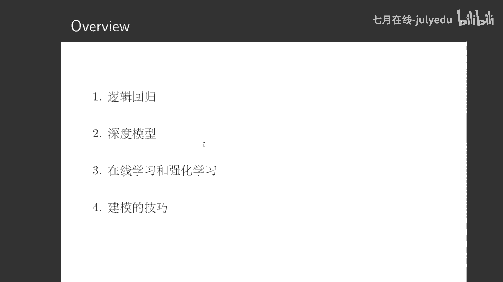

好，第一章逻辑回归。

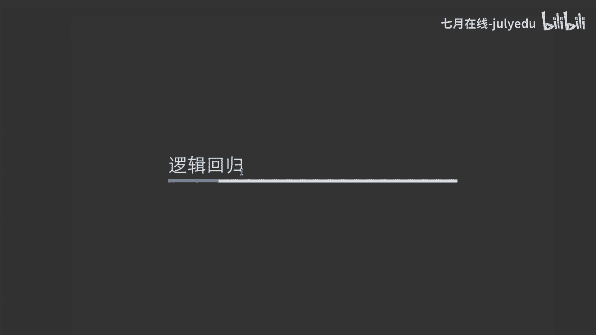

嗯，我们学习一个模型呢，或者说学习任何一个东西。其实我们首先讲究的呢是一个方法论。就是说我们培训所做的肯定是受之于鱼，不如受之以于。啊，我们肯定是想告诉大家说，我们学习一个东西如何去学？

就比如说现在学习一个模型，我们怎么去学它呢？一个逻辑回归的模型。其实大家我相信在座的很多人都已经很了解逻辑回归这模型了。但是我这里想说的是，我们要深入的去理解逻辑回归这模型。我们要从三个方面去了解。

不仅是逻辑回归，任何一个模型都需要这么去做。第一点就是你们的model。这里的西格玛就是那个sigoid的函数啊，等会会给大家介绍一个soid的函数啊，贝塔X其实这里是一个向量表示，然后呢。

就是这就是我们最基本的逻辑回归的一个函数，里面贝塔X是一个线性的，里面用sigma的变换，它就变成了最终的零1这样一个概率。这也就是logtic regression这样的一个模型的一个长的样子。😊。

那么有了模型我们下面要想的一个事情，就是我们怎么让这个模型变好，对不对？那要变好，我们一定是说要定义它怎么变好，什么叫变好，对不对？那什么叫做变好呢？

cose function就是我们所说的损失函数或者叫objective function。损失函数它所解答的一个问题就是我们怎么让一个模型去变得越来越好。我们要计算梯度，那么梯度是怎么来的呢？

梯度是通过损失函数去计算对X的偏导计算出来的，对不对？那么这里呢我们就列出来了逻辑回归的一个损失函数。这个大家肯定也都比较了解了，这就是一个交叉熵，对吧？然后呢，我们这里也不详细去讲，展开讲这个问题。

然后第三点就是我们有了这个损失函数，那么我们也有了它的偏导，我们怎么样能够让这个损失函数变得越来越让这个模型变得越来越好，让这个损失变得越来越小。

也就是我们的优化算法就optimation optimizationim method。常用的优化算法包括SGD就是呃astic gradientingcent以及FTRLFTRL主要是在在线的时候用的比较多。

SGD呢主要是离线当中一个一个样本建的时候用的比较多。呢是在SGD的基础上通过呃然后等等之类的一路发展过来的。

这是一个从SGD到呢是一个呃opimization method的发展的一个整个的一个逻辑线。这里呢我们不详细的展开讨论。但是我这里想主要想讲的，就是我们要有了一个模型，我们把它模型的样子定义出来了。

我们就需要定义这个模型什么是好，也就是它的cos方。然后呢我们怎么让它去变好，这是一个模型，它所做的三要素，是不是？下面呢我会把逻辑回归这三点分别的跟大家去解释一下。嗯。

如果说那个大家觉得没有声音或者画面声音都没有的话呢，可以去课后看一下我们的录屏回放啊。这个课这个视频课后都会放到我们的网站上面的，然后大家也不要着急，好吧。好。

模型嗯我们的基本模型呢就是刚才所说的FX等于sigma呃sigma的贝塔X。然后呢，我们这个sigma函就是我们这个sma的函数啊，这个X。然后呢呃刚才所说的。

这个模型呢这个贝taX呢它内部是一个线性模型，然后外面加了一层变换，这个变换呢还是一个单调变换。那么它就符合了我们对于GMM系列模型的一个定义。GRM呢是一个family。

就是generalize的 models广义线性模型广义线性模型呢就是包括说像最基本的线性模型。我们这里所讲的log regression以及如果大家学过计量经济学的话。

还有一个probitt呃function，这些呢其实都是一个广义线性模型。他们作为同样的一个family呢，它们有很多共同的性质啊，这个大家可以靠后自己学习一下。

那么我这里之所以要把G2M广义线性模型这个东西给提出来呢，主要原因是因为它们一些共性。对于我们在这次建模的时间上面呢。都已经有一些启示。比如说特征的离散化和风险均摊、人工特征组合和自动特征组合这些东西。

我们下面会一一来讲解一下什么是特征离散化和风险均摊。为什么会有这样一个情况。人工特征组合和自动特征组合都在做一些什么样的事情？首先是特征离散化。为什么这么说呢？是因为G2M它对于连续特征是很敏感的。

以及对于特征的大小不一致性，就是特征的量刚也是很敏感的。什么叫做特征的敏感性敏感性就是说特征的变化呢会引起结果的剧烈的这样一个变化。打个比方啊，假如说我们一个比较简单的现性模型，预测我们每一个人的收入。

我们就用年龄去预测，不用其他任何特征去预测了。那么我们就是一个最简单的Y等于KX，对吧？呃，呃，我们不说CTL预估的一个问题。我们就是一个很简单的一个Y等于KX的这样一个问题。那这样的话呢。

假如说现在我是20岁。😊，我是20我是20岁的时候呢，假如设说K12啊，最终我的这个这 incomecome就是我的收入呢就是40。那如果现在我是60岁，我的收入一定是2乘以6120嘛？

显然不一定是这样的，对不对？但是现但是这个模型就会预测出这样一个结果。为什么？就是因为它特征从20变到了60，导致的结果引起了剧烈的变化。😊，其实我们。

应呃就是收入呢可能在40岁什么样子就什么样子以后也不太可能会变化了。也就是说我们让他是一个。每一一个连续的特征，一个d词的特征其实是不太合理的。也就是说，目前这个模型对于这个特征是特别特别敏感的。

这就我们所讲的特征敏感性。这是第一点。第二点就是我们的大小呃比较不一致，大比较不一致是什么意思呢？就是说如果说我们刚才讲特征敏感性以后，很多同学会说了，老师，那我知道怎么去做了。😊。

我们嗯我们一定要把这个给它分桶，比如说10到20是一个桶，20到30是一个桶，30到40是一个桶。对，这是一个很好的做法。它同时也解决了一个什么样的问题呢？就是10到20的增量和从20到30的增量呢？

其实也是不一致的，为什么这么说呢？就比如说还是举我刚才那个例子，我20岁的时候呢？😊，我的呃因为我的K是2，所以说我的最终的收入是40。我从20到30呢，我就相当于涨了20。因为2乘以10嘛，对吧？

这可能是比较合理的。😊，从30到40呢，涨十0还一定涨2乘以10也涨20一定是合理的呢，不一定了吧。从40到50是否也涨20，这也是不一定合理的，对不对？也就是说我们的大小可能是不一致的。

此时通过分筒也解决这样一个问题。分筒就是我们这里所做的离散化，也就是buucket，对吧？英文是这么去讲，所以说特征离散化呢就能解决说我们特征敏感性或者特征大小量刚比较不一致的这样一个问题。

并且它还能带来一个好处，就是风险均摊。因为我们在预测的时候呢，根据我们刚才这里所聊到的这个los function。我们这里所最终带来的结果就是说我们的这个模型，我们这个模型呢。

它一定是要尽力去你和所有的点。那假如说我们的所有很多个模型都在一就很多的点都在一起呆着。有一个点离得特别特别远啊，属于统计学的，大家应该知道这个叫做outlay，也就是说是我们的呃离群点。那这个点呢。

它有时候会极大的干预模型的这样一个结果。如果说我们用这种连续的结果，连续的一个模型啊，不把它离散化，那么我们离散化的好处呢，就可以把这个outlay给它排除掉它的影响。打个比方就是我们。😊。

还是刚才那个例子，假如说有一个人他120岁啊，他的呃收入只有100。那么我们这个K这个2K等于2就一定是不合适的。对不对？那么K点21定不合适的时候，我们如果把它离散化掉了。

比如说我们每10个单位作为一个离散化，10到2020到3030到40，110到120是1个离散化。那么这个120岁的人，他110到120。😊，我们就可以给他一个单独的权重去学习，是不是？这样的话。

我们突然离离散化，也使得outlay这个东西呢。🎼能够降低它对于我们模型的这样一个影响啊，这是为什么要进行特征离散化。总而言之，任何1个GLM系列的模型。

也就是说任何一个我们呃广义线性模型模模型都会带来类似的问题。所以说我们要进行特征离散化。也就是这是大家经常会听说到的L2比较适合离离散特征，不连续的特征，它不太适合连续的特征，也是因为这样一个原因。好。

那么讲完了我们需要进行理性的话，我们就要提出的问题就是怎么去进行离散化呢？有两个方向。第一个就是手动分桶。第二个呢就是自动分桶。什么叫手动分桶，就比如说我们可以通过我们这个年龄的这个分段呢。

我们比如说10到20岁的有多少个人，20岁到30岁有多少人为，然后每一个组呢去计算一下他们所占的一个比例，尽量保证每组的比例都是比较相似的，或者说他们每一组的分类情况，框太的情况都是比较相似的。

这是一个比较合理的的方案。还有一个呢就是就像我刚才所说的，每10个分一个，这也是一个比较好的一个方案。因为我们大家经常会说自己什么80后啊，90后啊，其实我们也已经是人为的把它去给他分组了，对不对？

这就是我们所说的手动分桶。我们人为去做一些统计，根据我们的一些经验，或者说我们一些统计的结果进行分桶。但是这样去分桶呢。😊，不一定是最好的，原因也是很显而易见的。你这么分头。

你没有一个确定的依据说这样就是最好的。它或者说从统计上来看，它是比较好的。又怎么去证明它对于模型的结果是一定是比较好的呢，对不对？所以说我们就战生了第二种方案，自动分头。

比如我们马上要讲的GBDT加LR。好，在讲GPT加LR之前呢，我们再讲最后一个，因为GPT加LR也是跟这个特征组合相关的。因为特征组合呢呃什么叫特征组合？就是说我们所拿到的经常都是一些一阶特征。

比如说像年龄啊，你的家庭地址啊，你的习惯呀，然后你的学校啊，这些都是一些呃原始特征，那么这些特征都放到模型中。刚才我举了四个特征，把四个模型，四个特征放到模型当中呢，预测一个结果不一定是最好的。

为什么呢？因为很多特征可能是这两个组合起来，效果是比较好的。比如说我们把年龄和我们的学校进行组合，把年龄呢和家庭的习惯进行组合等等等等。比如说我们诞生的很多很多的二阶特征，三阶特征以及更多的一些特征。

这就是我们的特征组合，其实LR这个模型呢，它所最重要的一个点就是在于做特征工程，也就是我们这里的特征第散化，你这里的特征组合，这些呢都是对于LLR的模型呢是有很显著的提升的。因为。😊。

R这个模型它本身很简单，它模型简单的结果就意味着我们要去其他地方做复杂。那么在什么地方做复杂呢？那就是在特征的地方做复杂，对不对？所以说我们也需要做一些特征组合。那么呢传统的方案我们都是人工特征组合。

根据人对于模型对于业务的理解进行做特征组合。我们也确实能够提升一定的业务效果。但是人他所能做到的事情一定是有上限的。并且假如说我们有成百上千个特征，我们每一个都去做特征组合嘛？

然后这还是二阶、三阶、四节、五阶、六节，我们有必要去做吗？我们也不知道。因为如果有1000个特征，它的特征组合的可能性，就是二的1000次方了，这已经不现实了，是不是？所以说那么怎么着去做自动特征组合。

也是我们所需要研究去讨论的一个问题。好，我我先暂停半分钟。大家对我上面说的话呢嗯简单的回顾一下。然后呢，如果说呃我可能刚才讲话的语速比较快，我下面尽量压低我讲话的语速，然后让大家都能保证听清，好吧。

大家有什么问题也可以随时在我们的聊天里面去提出来。无论是对于讲课的一些呃语速啊，包括说一些风格呀，都可以提出来，或者说对于知识我都会回答的。呃，我看有同学说完全听不懂。呃。

我我觉得这个分享呢主要可能不是针对于一些零基础的同学。然后呢，最好是大家呢对于这个呃目前的一些最基本的像log regression或者DN呢有一定的了解，听起来呢可能比较有意义。

零基础的同学呢或者说基础相对而言学习的比较少的同学，可以去自己去去先去学习习，或者报一下我们7月在线的班，然后呢跟去学习的会更快一点，好吧。好，我们下面来讲GPT加LR嗯。

GPT加LR呢从这里这个加号我们就可以看到它是由GBTT加LR两个模型的。其实GBTT呢是一个数模型。LR呢就是我们这里刚才一直所说的log regression已经是我们的。😊，呃，那个逻辑回归对吧？

那么我们怎么样去做这样一个事情呢？首先就是我们现在训练集上训练1个GBDC的一个数模型。哎，这里就是我们的原始模型，我们先训练一个树模型，哎，这里就是我们的树模型，对不对？

我们的左右分叉这边都已经体现的出来。最终呢树模型会告诉我们在每一个树树的叶节点下面，它都预测的结果是什么？比如说我落到了这个叶子节点下面，它就是一，剩下就都是零。我落到了这棵树的这个叶子节点下面。

它就是一，这个就是零，对不对？😊，然后呢嗯最终我们就能够把一个特征，从它最原始的特征转移成了我们已经经过经过了数模型的一个编码的一个特征。比如说刚才按我所说的01010，对不对？

相当于它进行了一次模型的转化，我们可以把数模型此时当成一个转化器。然后呢，这里就变成了全是零，也没有任何其他东西的一个离散变量了。此时我们在用我们的呃linear classifier。

就是我们的线性模型。呃，刚才所说的LR就是一个线性模型，对吧？然后呢去做回归呃，去做一些呃我们的一些模型，这些W就是我们的权重，就刚才我们所说的这个beta，最终呢我们去把它们散到一起。

就我们把它们加合到一起，经我们的sigoid就变成了我们最终LR的一个结果。那么这也就是刚才我所介绍的。那么我们简单的介绍完了这个模型，我们就需要说为什么这个模型它本身是有效的。

它解决了一个什么样的问题，解决什么问题，其实我们已经很显而易见了。因为我们的这个原始的这个特征啊，比如像什么年龄啊啊，你的收入啊，你的。而不收入是我们的外，我们的年龄啊。

或者说我们的呃习惯呀等等之类的这些东西呢，都是我们的一些原始特征，每一个都会有很多千奇百怪的值，而且他们都可能是一个连续值，比如年龄是连续值，籍贯可能不是。但是呢我们就通过数模型。

最终把它转化成了全部位的移散值。而且它在训练的过程当中呢，直接它的训练的目标就是我们最终的训练目标。比如说它这个转化本身就是考虑了我们这个训练的结果的。所以说它这个转化的过程当中是有效的。

并且它做到了自中自动的一个特征组合这样一个概念。这个特征组合其实就相当于是每一次分裂的时候，比如说我是年龄大于20岁还是小于20岁。然后这里是比如说我籍贯是北京市的还是非北京市的，这里在进行组合的时候。

就已经拿年龄是北呃，年龄是20岁的，小于20岁的和籍贯是北京市的这两个特征进行组合了。换句话说，我们数模型，它有几层，它其实就做了集中组合。这里可以理解吧？除非说我们到一半的时候，我们就没了。

比如说到这里直接就指向叶子起点，这可能就做了异阶的特种组合。好，嗯，我看几位同学提出的问题，我把GPT加R讲完以后，我统一来解答，好吧。😊，然后呢，刚才我们讲了。

它怎么着去做到了我们的自动的特征组合以及自动的分头。那么为什么这么做是有效的呢？我们就要讲一讲GBDT和LR这两个模型之间的区别。首先GBDT它很适合连续特征，它不适合离散特征，原因也是很简单的。

因为这里在分裂的过程当中呢，它是通过计算一个数模型的或商值或基尼系数的一些其他的一些标准去计算出来，我到底是分到左边还是右边的连续值是在函数空间进行拟合和近似，这是符合数模型。

它本身的一个计算的一个方式的。但是如果说是离散模型的话呢，如果说它是一个离散特征的话，sor离散特征的话呢，它本身就会出现了这样一个问题。所以说我们GBDT这个模型它本身是适合连续特征。

不适合离散特征的，并且它是在函数空间对残差进行连续的逼。它的精度很高。但是它有一个很严重的问题，就是会进行过会容易出现过拟合GBT。就是叉G boost叉 boost，大家可能如果说经常做开go的话呢。

都会有一定的了解GPDT也是叉G boost的一个前身。它就是为什么出现了叉G boostt，它所出解决了主要有两个问题。第一个就是它容易过拟合的一个问题。第二1个就是它并行计算效率的这样一个问题。

变均团效率我们这里也不太讨不去讨论。因为这是嗯主要是讲的一个本身的一个效率。就是我们在每次分裂的时候怎么去分裂的这样一个问题。但是过拟盒这个问题。

charge boost是通过加一些像LELR以及一些其他的正则项去解决的。但是我们是否可以通过其他的方式去解决这个问题呢？当然是可以的，就是我们这里的LR。我们的LR呢就是相当于我们不用数模型。

它所分类这个结果，你不是容易去过拟合吗？那我不用你了，我直接用你这些已经分类好的叶子节点，因为你每一棵树，它都会有一棵自己独立的一个分类的这样一个方式，所以说我们用很多棵树的叶子节点组合到一起。

是不是就不容易过拟合了，对不对？并且它现在也是离散特征了，是不是就特别适合LR了。对，然后呢，当然我们解决过拟合呢也可以本身对树进行一些裁剪。但是这都是GPT本身的问题了。

我们这里主要来讨论GP加LR是为什么是有效的。😊，好在讲损失函数之前，我先回答一下呃，几位同学呃提出的一些问题，是吧？嗯，有同学问说人工特征组合的话，就是简单的加减乘除。嗯，这刚才解释过了呃。

加减乘除其实是呃可以算是一种吧。因为加减乘除其实我们解决是什么样的一个问题呢，就是把dance特征把它给标准化或者叫standard代，就是我们因为不同的特征，刚才说过了，它的量纲是不一样的。

比如我的年龄是从0到120岁，我其他的东西呃，再比如说我离公司的距离很可能是什么10到100公里，我们不讨论一ED的情况，那这样的话再加上一些其他特征，它们的量纲可能是不一样的。

最终对于模型在算他们的梯度的时候，不同的量纲会导致它在算梯度的时候，很难去逼近它最终的那个globalop，就是全局最优点或者局部最优点。所以说这是一个人工特征组合。😊，这样的一个。人工特征组合呃。

他所做的一些事情，包括像刚才说的二级特征，三级特征等等之类的东西。好吧，嗯，数模型一般用什么charge boost chargege boost是一种刚才所说过的，它是GBTT的一个高级版本。呃。

其实数模型它有bagging和 boosting像GBTT呢它们属于ting的一种范畴。 boostting呢其实就是对残差进行不断的逼近bagging呢，其实它是每次选择一部分样本。

或者说一部分行的样本或者一部分列的样本。然后呢最终去做一些数模型的一些东西。然后问一下灵异编码是弯号的编码吗？其实灵异编码是弯号编码，但是我们在这里GPTT所所出现的一些编码呢，是根据我们页子节点。

它落到哪里进行编码的。弯号编码很可能是说说如果我们不用GPT加LR，我们把一个特征，一个连续特征，把它给离碳化的时候，其实就是一个one号。比如说我们去讲我们的年龄，我们的age。然后他是10到20岁。

20到30岁，30到40岁。其实如果说我是1个20岁的人，我就落到了呃，10到20岁的这样一个桶。我这个桶就被万号的结果是一，其他桶就都是0，对吧？然后呢。

还有同学说数模型包括很多GBDT chargege boost来GBM都是数模型。对的，这些都是一些数模型。来GBM其实叉ge boost的一个轻量级版本，是微软的一个同学呃去呃的一篇论文。

就给大家有兴趣可以了解一下。然后嗯GBDT为什么不太适合离散特种？这个刚才我只是简单提了一句，因为这个要去说的话呢，其实是一个比较大的话题，我不太想在这里面去说。然后有兴趣的话呢。

我可以课后或者以后再开其他角度专门去聊，好吧。然后c boost怎么样效果呃。我不太清楚这个cad boost什么东西，然后charge boost和GBT和LR结合有什么不同，其实没什么不同。

chargeGBDT其实都是数模型，因为我们在这里呢都是利用它的叶子节点，你要非说不同的话呢，那可能就是精度啊或者说速度上可能会有些不同，好吧，然后和LR的结合呢，其实本质上都是一样的。😊，好。

那我们继续。呃，刚才我们讲完了模型，我们下面就要讲损失函数了。我们在逻辑回归里面呢，用到损失函数呢是这样的，就是交叉熵。那么其实。😊，我希望每位同学看到一个损失函数的时候呢，都能提出一些问题。

就比如说为什么要用交叉熵这个损失函数呢？它怎么来的呢？我们是否有好的损失函数呢？我们不同的损失函数都是基于什么去定义出来的呢？就是嗯学习一个问题，我们不论有知企，还有知其所以人。

那么我们先来解决回答第一个问题，为什么要使用交销商的问题？使用交商的原因呢，其实是因为我们。这个GRM它是通过maximum likely的，就是那个最大自然估计MLE去推导出来的。

这个大家去可以去有兴趣的话去看一下相应的推导。那么有没有更好的损失函数呢？啊，当然不一定是有的，对不对？我说当然大家可能以为我要说一定是有的，不一定。为什么说不一定呢？其实刚才我说过了。

经叉商是通过MLE去推导出来的，它是有一定的逻辑逻辑和理论基础的。那么我们要想定义最好，那一定是通过别的角度去定义。比如说我给大家举两个角度。第一，通过业务的角度。

很可能说比如说在我们如果说业务在我们在一些真实的建模问题当中，假如这个问题定义是说这部分人他对于我们这个损失是比较强的那一部分人对我们的损失是比较弱的。打个比方说我们在做反作弊识别的时候。

正样本和负样本的问题，如果说我们把一个负样本预测成正样本，那是很可怕的。把一个正样本我们把就是正样本是我们那个最终会呃作弊。呃，我刚说错了，把副样本预测正样本其实无所谓的。

就相当于是我们宁可呃错达1000，也不能使一个人漏网。所以其实这时候正样本和副样本，他们的权重已经不同了。那么我们就不能简简单单用这个交叉熵了，我们就需要对正样本，它的损失进行加权。

负样本的损失呢可能进行减权重。第二个方面就是我们的模型在训练的过程当中呢，很可能有的样本分类的好，有的样本分类的不好，怎么解决呢嗯。这个我们在后面其实有表呃有提过，我可能没有写过可能写在了其他的地方。

就是呢呃我们会通过一些其他的lo方式去解决。比如说像何海明提出的fcal focal loss就是解决这样一个问题的。然后不同的损失函数都是基于什么样定义出来的呢？其实这个和这个问题有点重复。

我们定义一个问题，首先要想它是什么样的业务结果，我们这样去定义这个函数，它最终是否可导的。它对于我们的函模型的演变或是什么样一个样子，对吧？这些其实是我们定义损失函数的一些比较重要的一些关键点。好。

最后呢我们再来讲一讲自优化算法。嗯，这些地方呢。😊，我们会讲的相对呃不是那么侧重。因为最优化理论呢，包括图优化理论呢，其实都是一套很复杂很成熟的理论。大家有兴趣呢，这个可能不是开易斯课能讲明白的了。

可能开一系列的去刻。然后呢，我这里想强调的就是说刚才我讲的模型讲过了我们的lo function其实呢最优化算法和他们都是解偶的。无论你的模型是什么样子，你的损失函数是什么样子。

你最优化算法都能保证说只要你可导都能寻找你的导数，就用让你慢慢的去优化。然后长的呢就刚才想所说的SGD啊 mini batch和FTRL等等。😊，有同学问说，为什么不用soft max？嗯。

soft max和普通的这些reversion的区别在于说，如果你是一个多分类问题。比如说呃图像识别，我识别呃0123456789，这10个数字，它就是一个soft max的问题。

如果我是一个零或一的问题呢？其实它就是一个普通的呃那二分类问题。softax是一个多分类，它可以认为是一个二分类的一个扩展，它不是模型，它本身的一些东西。比如说你是soft max的话呢。

那么你的损失函数会长什么样子呢？在这里呢其实我们只加了两项。用为oftm呢，假如说你是一个5分类问题，它就会加5项。😊，好，总结，我们其实在这次课，我们虽然叫CTR预估呢。

但是我们在逻辑回归这里呢已经花了很长的时间。但是我觉得花这些时间都是值得的。为什么？因为我们如果说要去学习逻辑回归的话呢，要学习CTR预估呢逻辑回归是最简单最基础，但是是最能有代表性的这样一个问题。

因为它作为一个最基础的模型，它把机续学习的几大要素全都去包含了。比如说像我们的model，我们的lo function，我们的最优化算法，其实它都已经去包含了。我们等会儿所讲的所有的深度学习的一些模型。

我们讲的主要都是侧重于model方面，它的lo function以他opim呃最优化算法我们都不会再去涉及。所以说其实我们当把这几个要素都分别来看的话，他们每一个所占的位置也就都很清晰了。😊。

并且它的一些特征，比如说对离散变量比较适合，并且只能学习到一些gene一些信息，都对于其表达能力有比较大的制约。所以说这也是我们为什么要引入下面的深度学习的一些模型。

因为它们正好是解决了一些或者解决了离散变量，或者说解决了它表达能力弱等等各各种方面的一个因素。但是为什么逻辑回归现在依然在广泛的被使用呢？因为它简单它有效，它计算速度快，并且它是很适合在线学习，因此。

逻辑回归是是目前依然很重要的一个问题。逻辑回归。甚至于如果说你好好的去做特征工程，对业务的理解比较深的话，它比深度模型的效果可能还要好。🎼呃。

我看到有一个同学说长尾严重s不太合适定义 function的时候呃，这个问题这个问题嗯这个同学应该是对呃记忆学习有一定的了解的一个问题。focal loss效果感觉也没那么好。对，其实是这样的。

我们在其实日常工作当中呢，focal loss确实效果不一定好。我这里说出focallo也只是抛砖一句，希望大家去多思考一下。因为像focallo它容易在你初期学习的时候，模型震荡的很厉害。

特别的不稳定。所我们一般使用fo loss呢可能是说先用正常的一些嗯就是普通的像ideam fTRL这种东西对它进行一些学习，等到到了一定的程度，比如说到了几千步以后呢，模型本身优化的空间也比较小了。

它震荡的不厉害了，我们再去用focal loss或者其他的一些东西。😊，来去做的。深度模型不是不适合在线学习，深度模型也适合在线学习，只是说在线学习我们所讲究的是什么？是一个时效性。

深度模型本身它的计算，以它反向求导求导说的时候呢，都比LR要消费掉很大的资源。在线学习，它本身等我们会详细的去讲在线学习，它其实只是把一些离线的模型搬到在线来。

那个时候我们的模型本身已经不是我们的制约点。我们的制约点其实是我们的优化算法，怎么样模型更快，并且我们的流出力引擎，好吧。😊。

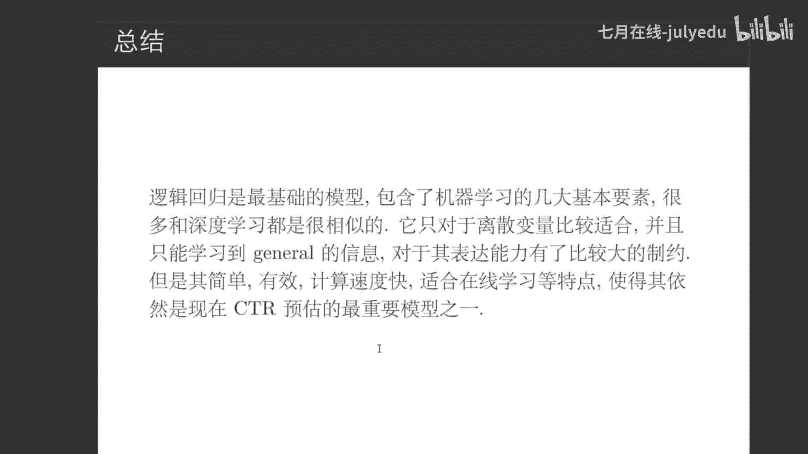

那么我们讲完了第一部分逻辑回归。我们现在开始来讲第二部分深度模型。嗯，在深度模型呢，我们主要是通过两条线来讲解的。然后第一部呃他们都是我们从FM这个模型出发。

就是factorization machine，然后呢去出发。然后一条线路呢就是这条红线，就是它的模型越来越复杂化。另外一条线路就是一条黑线，就是经过inbedMLRP自身的特点。

结合CTR预估本身的业务呢进行场景的推演。可以看到这个其实更向深度学习，就是我们的模型越来越复杂化。这条线路呢，其实相当于是我们加入一些业务的理解。

怎么着能够让深度模型更加好的去帮助我们的LR模型去完成它本身的一些事情。😊。

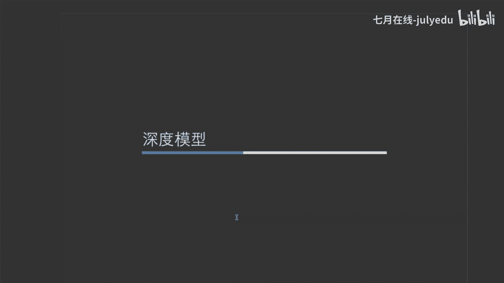

好呃，首先呢我们先来讲一下深度模型为什么是好的，它复杂在哪了？😊，为什么深度模型这几年才开始使用呢？原因肯定是因为它复杂。它之前如果大家了解过深度模型三巨头的话。

这三巨头他们在很早很早之前六七十年代的时候，他们就已经在开始搞深度模型了。那么为什么他们做学术做了那么几十年，到现在才开始发光发热呢？原因主要有两点，第一点我们先看第二点，第三点，第一点我们最后再聊。

😊，第一第二点，数据量的需求。深度模型呢它本身是一个特别需要数据的一个模模型。数据量少的时候，深度模型不但体现不出自己的优势，还容易因为欠你和各种各样的因素。

导致它的效果比普通的逻辑回归或者简单模型又更差。所以说它对于数据量的要求是很大的。第二点就是算力的提升。嗯，大家可能能够了解说这几年呢像英伟达，它的那个呃嗯股票市值前几年今年好像跌下来了。

是越来越一直在上涨的。为什么？就是因为它狠狠的抓住的GPU这根稻草，它在深度模型的市场上呢去深耕它的GPU获得了很大的市场，包括像谷歌，它所推出的TPU之类的一些东西，其实都是为了解决算力这样一个问题。

因为深度模型是很好计算资源的，我们在进行前项传播和后向传导的过程当中，我们来计算我们的模型结果和计算导致的过程当中，都是需要大量的计算的。尤其是矩阵运算，它比我们普通的那些scalar就是呃普通的运算。

其实要复杂的多得多。对于空间，对于算力的要求也要大得多。这也是为什么深度学习，前几年做不了原因，它算不起来呀，你再有数据，你算不动也是没有用的，对不对？所以说算力的提升也是深度学习。😊。

他所能够这几年不开使用的一个点。那么其实算力提升也是和数据量的需求是相关的。我数据量越来越大，我对于算力的需求也会越来越大。那么为什么我们对于数据量的需求大呢？简单来讲，就是深度模型的VC维是很高的。

它的参数也是很多的。打个比方，大家如果说只具像一个浅浅层的LR就是一层的LR来讲的话。😊，假如我们有200个特征，那我们参数多少个呢？我们比有201个参数，对不对？我们假如20个特征都是完耗以后的啊。

我们只有201个参数，就我们的200个特征，加上一个截距，201个特征。😊，它的参数其实是很少的。但是如果说我们要运用一个多层神经网络呢，比如说我们200个特征，第一层变成64，第二层再变成8。

第三层再变成1。那么第一层的参数就已经是200乘以8个参数了。第二层我们就是8乘以呃200乘以64个参数了，第二层就是64乘以8个参数了，每一层都是一个矩阵。😊，大家可以可想而知。

我们的参数规模是有多么的庞大，对不对？参数一旦大了的话，那么我们就一定是需要更多的数据量的。因为。从一个直观的角度来讲，大家学习线上代数的话，如果学习过克拉波法则的话。😊。

我们的数据量至少要保证说和我们的参，我们的呃方程的行数，至少保证保证说和我们的呃模型的参数一样多，你才能有一个解，对不对？我们的数据量更大的话，模型参数可能就会。我记得记不太清科莱莫法的结果了。

但是也正是因为说我们的参数越来越多。😊，我们才需要越来越大的一个数据量。所以说这是一脉相承过来的，这也是为什么深度学习的模型特别的复杂。😊，好，我们下面开始来正式的来讲我们深度模型这样一个线路。

首先我们肯定是要讲FM的FM的表达式呢其实很简单，就是我们这里呢是一阶的1个WX，就是我们的线性模型，这个X乘以W再乘以这个X，就是我们的二阶模型，粗一看呢，其实就相当于我们把一阶和二阶组合在在一起了。

但是为什么这这肯定不是一个FM对不对？原因是什么呢？是因为在我们做做推荐系统，这样的一个东西的时候呢，很多特征都是空的，就打个比方来说。😊，我大家如果说听过歌的话，呃，比如听网易云或者听腾讯的QQ音乐。

那么我们在用这些软件的时候呢，它都会给我们推荐一些歌曲。我我相信很多人不可能说所有类型的音乐都听过了。比如说我说我喜欢听粤语歌，那么我粤语歌这里呢我就经常会去听，我还喜欢去听流行歌曲。

流行歌曲这边我去听，但是他并不知道我是否喜欢听爵士乐，是否喜欢听英语英语歌曲，是否喜欢去听像轻音乐之类的东西，对不对？那我们对于这些东西，模型的就别说模型去不去学的，数据都是空的，那怎么办呢？

我们根本就这个W这里就没有办法去拟合，并且这里W可能是特别特别多的。比如说我们假如说有200个类目，这样的话，我们W是一个什么样庞大的一个规模呢，至少是1个200乘200的一个矩阵，对不对？

再加上参数本身是特别稀疏的，就导致了。😊，那么模型根本在这里去学的话，很难去学习。那么我们怎么去解决这样一个问题呢？我们就去使用矩线分解。把W分解成两个本嗯本身而言都比较低质的矩阵。什么叫低质？

如果说W它是一个大家比方说是1个200呃1万乘2万这样一个矩阵的话，那么在这里的话呢，我们就把它分解成一个。呃，1万乘1万的一个矩阵。然后我们在这里就把这个W分解成一个，比如说1万乘以20。

这里是20呃，20乘以1万，这也是1万乘以20的这样一个矩阵。这样的话呢，我们就保证说我们在一测一万是符合我们这个W本身的质的。另外1个20呢，它就变得低质了。因为低质它所带来的好处是什么呢？

我们学需要学习的参数就少了。我们就不需要那么多的数据量了。我们本身的稀疏的这样一个问题呢，也就被解决了，对不对？😊，所以说我们最终变成了X乘以我们的第两个低质矩阵，再乘以一个X。

或者说我们的内接就表成了这样一个情况。Yeah。这是我们从矩阵分解的角度去看FM。然后呢，下面呢我们就从神经网络的角度去看一下FM。我们也引入了我们一个特别目前叫的特别火热的一个名词。

就是inbeddinginbedding呢它其实中文呢叫做嵌入。FM它所做的一个什么样的一个事情，就是对离散特征做了一层嵌入。然后呢，之后通过嵌入的结果，就是那些丑明向量在进行之后的一些处理。

最终再和线性部分结合。那我们这里呢线性部分是这里我们不再赘述，然后呢嵌入。以及inbedding的做法呢，主要是在这里，就是我们把X从一个高维吸疏向量变成了一个低维连续向量。大家注意我说的一句话。

等会我还会再说一遍呢，这其实就是一个线入的过程。打个比方，X它本身如果是一个1万维的。而我们这里的这个第一层，它就只有256维了。那这里呢就是我们相当于用1个1万乘以256的矩阵，把它做了一层嵌入。

从高纬映射到了低纬，从离散映射到了连续。😊，好，那么现在我们正式的来讨论一下inbedding是什么东西。呃，我第一次听说inbe呢其实是通过work back那里去听说的。

但inbeddding这个概念呢，其实它并不是一个深度学习的概念，它是一个数学概念。那么我们就要先从数学的角度来讲什么。才是映射。呃，什么才是inbedding。数学的角度来讲的话。

inbedding它本身就是一层映射。打个比方来说的话，1万乘以21万乘以呃20的这样一个矩阵呢，把你从一个1万的角呃一万的。😊，向量映射到1个20的向量，这是不是一层映射，对不对？或者换句话说。

我们用更加数学抽象化的语言来说，就是把你从1个1万维的向量空间映射到了1个20维的向量空间，对不对？大家注意有一句话，就是从一个向量空间映射到了另外一个向量空间。

这才是inbedding的一个本质的理解。从数据上来看。那么从神经网络角度来看是什么呢？就是刚才所说的层与层之间的，它这样一个矩阵，就是1万乘以20的这样一个矩阵。

这个矩阵就是我们所说的inbedding。而那个20只是inbedding它所最终的那样一个结果，对吧？我们就20其实相当于就是你一个1万的矩阵，里面查不了查出来的。😊，从特征的角度来看呢。

是一套是从一套特征，另外一套的表示方式。其实这个就是在数据上的一个表现。相当你从1个1万维的特征空间向量空间映射到1个20位的一个向量空间。那是不是从一套特征映射到另外一套特征呢？😊，好。

我看到有一个同学呃提的一个问题，就是说400乘400变成了两个低质语言相乘，会不会导致信息丢失啊，是有可能的。所以说在选择低质的嗯质有多低的时候，你肯定不能选择像23这么低的低质，对不对？

我们要时刻要明白说我们在做这个矩阵分解。它为的是什么样一个嗯是解决什么样的问题，它是一个什么样的原因，就因为我们的数据本身太稀疏了。我们如果不分解呢，我们这个结果是特别不准确的。

我们分解呢能够利用有限的数据呢，去学习一些更加有效的一个信息，所以说我们才去做了矩阵分解这样一个过程。😊，它有可能导致信息丢失。所以说其实你分解成多少的一个低质。就比如说你十还是20还是100。

其实这都是实验当中值得去尝试的。如果你这个低质的质设置的比较好，那可能就比较合适。如果不好的话，过低或过高过低会导致你信息丢失过高，会导致你还是有很多东西是学不准确的。好。

那么现在我们来讲另外一条线路的起点就是inbe加MLP。inbe加MLP呢其实刚才因为我们已经深入的去聊一下什么叫inbedding。所以这里再看inbedding大家应该已经不陌生了。

inbe加LP呢就是反正我这里有inbedding了，不管是怎么来的，不管我是预训练来的，还是通过FM来的，反正我这里有了，然后呢我把它们给变化成了我们的一些呃低制，然后呢最终我们把它给慷开到一起。

然后再进行层次化堆叠这边的MLP呢因为是multiple layercept，就是我们的多层感知机。😊，这里呢就相当于是我们所平常所说的那些各种dance这样的一些个特征，就是一呃256到64呀。

64到16啊，16到1啊等等之类这些东西就是我们这里所聊的1个MLP。好，我们讲了我们两个起点FM呃是第一个起点。另外一个起点呢是inbedding加MLP。

那么我们在进行下面这两个点分配进行延伸之前呢，我们先比较一下他们FM可以学习到特征组合，但是不够深入高级特征。为什么这么说呢？是因为FM这里呢，我们只有一阶和二阶的特征组合。😊，而MLP呢。

它可以学习到高级特征，没有办法学习到低阶特征组合。为什么呢？我们每一层做dance特征往上去做MLP的时候呢，其实都是一些层数越高，它就越复杂，越学习到的是一些更jaral的更高级的一些特征的组合。

好吧。好，FN。呃，我下面会连续讲4个呃呃FM的这样的一个结果。呃，这里是FM的一条线呃，讲完它以后呢，会去讲inbedding加MLP的一条线FM的一条线。第一个要讲的就是FNN呃。

我们等会要讲的每一部分呢，其实inbedding这里都是相似的MLP这里也都是相似的，主要呢是在contnet这一点是有点不太区别的，有有一点区别的。

这里呢FNN呢其实这里conate就刚才大家所见到的比较常见的，就直接把三个给它并在一起，呃，呃对，并联到一起就可以了。然后呢，这里inbedding呢是用的模型预训练出来的结果。😊。

第二个NFM大家可以看到inbedding和MLP这里也都是很类似的。然后呢，但中间这里呢是有一定的区别的。这里呢是什么？我们把它叫做二阶交互池化层，它的做一个什么样的事情呢？

刚才我们是只是把它简单的并联到一起。比如说我第一个。😊，三个inbedding结果呢都是4维的。那么我三个四维变到一起是多少呢是12位，对不对？那这个intction是什么呢？我两两做主元素的乘法。

就elementplication就是呢比如说我 layer一和 layer2，我呃四维和4维相乘，就相当于我X1乘以Y12乘以Y2S3乘以Y3S乘以Y4结果依然是4维的。

那么我这里呢任何两个lay能够做这样一个事情，最终把它们加整到一起，这的初始维度也就变成了4维了，也就不是刚才我们的12维了，这就是我们的二阶交互池化层。所以说呢它相对于其实对于参上层而言，参数变少了。

😊，对于FM而言呢，相对把一次项结合推迟了。这个为什么呢？大家可以课后自己去想一下。😊，AFM是什么？就相当于在我们的NFM的一个结果上呢，给主元素的乘法呢加入了一些不同的权重。

就比如说刚才呢我们把这些结果都已经出来了以后呢，我们不进行直接的加总。我们呢把每一个的结果呢。😊，就假如说我们有4个 layer，那四个类它最终能能有几组主元素的乘法，就是C42，就是6种主元素的乘法。

C42是一个组合数。然后呢，这里面我们用attention net，那这个tention也是训练出来的，然后呢就会有6个权重。每个权重呢附给其中的一个呃二阶交互池化层的一个结果。

最终呢把它们给加到一起交为这里去复杂了一套。然后呢，嗯最终我们把它们再给计算出来，这是AFM。偏哪。相当于是更复杂了啊，但其实这里更复杂呢，也只是在这里更复杂了。😊。

就是我们刚才我们讲了普通的并联concacate，还讲了我们的主元素乘法。呃，这里呢我们就相当于直接两两相的之间做内机或者做外机，最后能把它们并联到一起啊，这里我就不太不再赘述了。

因为他们的本质核心上是一样的，就是我们的这边和这边我们学习问题呢呃分析问题定要抓住事情的核心和本质，知道什么是比较重要的。好哦，我看到又有同一个同学提出的问题，就是说矩阵分解呃是PCA的一种方式吗？嗯。

PCA呢确实是一种矩阵分解，但是这里的矩阵分解呢和我们这一矩阵分解呢有一点点的区别。具体的区别呢其实不在我们的讲课范围之内，我这里先不再介绍了。但有兴运同学呢可以看一下PC它其实是把两个矩阵呢。

它PC其实是一个主成分分解pri呃component analysis，我记得好像叫这个名字，它其实是一个无监督的学习算法，就是说能够去抽象出你这个矩阵，它哪些呃量是对于矩阵而言构成一个新的限量空间。

它本身是更有效的。而我们它本身是因为是一个非监督的学习算法，它只是把你从一个限量空间变成了另外一个限量空间，对不对？然后根据你这个矩阵，它所本身包含的一些信息。

这一般在图像的一些区道方面呢用的相对是比较多的。然后但我们这里的FM呢，它因为是有一个label的，它是一个有监督的学习算法，所以相对而言是有些区别的。吧我这里就不再讲展开细讲了。好。

下面呢我们在开启inbed加MLP的讲解之前呢，我们再回顾一下。刚才呢我们主要其实就讨论FM的不同的变种，他们就有一个共同点呢。也刚才也提到过了，就inbedding和dance其实呢都是很大家通用的。

😊，无外呼就是中间这些内基外机逐向慷害这些运算，他们是有点区别的，最终形成了一个浅层网络的输出的结果。那么另外一种模式呢，就是我们直接就从这些前层网络出发，我们就研究我们这个深层网络MLP在这部分呢。

我们怎么样去它去做出一些事情来？那么我们就绕不开我们的这个由google来提出的一个we and deep这个模型了。这个模型我相信很多人都应该已经听说过了，因为这个模型实在是太有名了。

并且这个模型几乎它是一个分水岭。从它出现来了以后，很多模型基本上都是在weide and deep的结果之上，或者它的模型本身的架构之上，就做出的一些改动，最终形成了我们最终的这样一个结果。😊。

它相当于是现在叫we and deep，它一定是有一个w层，有一个dep层。dep层的输入呢都是一些已经是deep的结果。wide层的输入呢就是我们这里的一些就dep层的一些结果。

或者说是一些我们本身就dance的一些特征。我们外层呢其实就是我们的这里的。😊，一个spae的一个特征，就是我们的离散特征。然后呢，第一部部分呢直接就是MLP，而且是dance特征的MLP呃。

而外的部分呢是直接的LR最终呢我们把这两部分结合到一起呢进行了联合训练。如果说我们的外的部分呢采用了FM就是。😊，在我们的这在我们的这里呢采用FM，那么它就变成了DFM。因为这里已经是d词了，然后呢。

这里用FM它就变成了一个DFM。😊，然后呢，我们再聊一聊dep cross deep cross呢其实也是在上面的一个变种。它变种呢就是在我们的MLP这里呢进行了一些变化。

前面我们呃就是这边呢我们是不看的，我们只看这边。这边呢在这里其实它相当于就是我们每次在学习的时候，如果说不看上面的箭头和刚才也是完全一样的啊，这里就相当于是那个外的部分啊，这只是一个比较省略的一个写法。

然后呢，在这里跳跃的过程当中呢，每次呢我们把之前学习的一个残差给它放到了这里。然后每次把残差和上层的结果一起联合起来去学习。这个残差神经网络呢其实是从图像里边去借鉴过来的。然后呢。

我们把这里用到了我们这样一个神经网络当中呢，我们就出现了我们的deep cross。😊，然后它和inbedding加MMP的区别呢，其实就在于说就是这部分。我们的MP呢通过一些残差。

使得我们之前学习的不好的一些东西呢。能够在这里重新去学习一下。刚才其实我们在讲lo function的时候呢，也讲过学习不好，我们怎么办呢？我们可以加大那些学习不好的这样的一些样本的一些权重。

这也是我们的fo loss做的一些做法。而这里呢我们可以直接把这些结果，就直接加在我们的这些层当中，也变成我们reze layer，去怎么着去协调我们的网络进行训练。😊，好。

最后我们在结束这一部分之前呢，我们再来回顾一下banan deep。我们要聊一下为什么wan deep是好的呢？为什么这个模型它本身是分水岭的呢？绝对不是因为它是谷歌提出的，它就是好的。原因很简单。

就是有两部分。第一，他公开学习了外感的dep部分，他们m deep部分，他们各自表征了模型的不同的一些方面。外的部分表现了我们的general的方面。dep部分呢表现我们。呃，然后这个有写反了。

是外的部分呢表现我们specific的方面。第一部分呢表现我们的gene的一些方面。为什么这么说呢？是因为像一些离散的特征呢，它比较适合于捕捉一些特别呃特别特殊的一些性质。

就比如说刚才我说那个outlay，就刚才假如说是个120岁的人啊，我们把它给离散化了。是不是这个特征就能捕捉到，并且不会太伤害模型本身的结果，这就是浅层，它所能带来的一个好处。😊，而dep部分呢。

然后呢就是一个janer的这样的一个过程。因为我们的网络在进行逐层堆叠的时候呢，我们所学习到的一定是一些比较相对于比较深刻的一些东西。如果大家对于CNN这样一个网络结构比较了解。

并且曾经看过的一些它的一些可视化的一些情况的话，大家能够发现说在CN的浅层，其实它学习的相对而言的话。😊，和在深层它的学校的部分其实都是不太一致的。为什么说我们。在它训预训练翻吞ning的过程当中。

那预训练和翻推ning的过程当中，我们冻结前面去学习后面，是因为我们后面他总能学习到的东西和前面所能学到的东西都是不一样的。深度模型呢就是因为它能够学到一些经过深层次高阶模型，高阶算子进行交叉的时呃。

高阶特征进行交叉的时候呢，它能够学到很多更general的一些信息。如果我这里再跟大家聊另外一个问题，就是其实深度模型呢它本质上也是不同的线性的一些矩阵进行相乘。比如说第一层我们用矩阵是FF1。

把它从1万维变成了256维，第二层用矩阵M2，从256维变成了64维。它其实本质呢就是M1乘以M2的乘以M3，也直乘以最开始我们的结果。那最开始那个X。但然这么说肯定是不对的。因为这就变成了一个哎。

因为很多矩阵相乘，就变成结果就是一个矩阵，对不对？它相当于还是一个线性的模型，但深度模型它不是线性的，它的原因是相当于我们在每一层的时候呢，都用的那个我们的X身方式，也我们的激活函数。

把它从一个线性变成了一个非线性的一个过程。但是我们这里所想要聊的，就是说它不断的去矩阵相乘，去确实是能够学习到再加上我们的激活函数，能够学它的一些深层次的信息。所以说这也是为什么我们ral这里。😊。

能够去和dep部分相关联，那我们的外的部分和我们的specific相关联。然后呢，最后呢就是我们的外 and deep呢，它模型本身足够简单，效果也足够好，也是易于扩展的。

在技术上呢有一个提刀ca谱法则，就是说如果说我们能用简单的模型去解决问题。我们一定是用简单模型的，而不是用复杂的模型。因为简单的模型，一般效果。😊，都会比复杂模型，它就要简单，且不容易过拟合。

且呃耗费的资源少。所以说呢它一定能够是我们的首选。好，那我来解决一下大家的问题。😊，啊，有一个问题说外的部分的特征没有太听明白。嗯，我再把我刚才说的话可能说的太快了，我再放慢语句说一下，好吧。

就是我们在讲啊嗯那个呃特征离散化的时候呢，我曾经讲我举过一个的例子，就假如说我这个人是1个120岁的人。假如说我的呃我的模型本身是Y等于KX就是2X对吧？如果说我们是一个连续的一个特征的话呢。

我120乘以2，我就收入必须是240，但我可能收入只有100，嗯，怎么办呢？我把它给离散化110到120岁这个人呢共同享用这个one out这样一个特征，并且他前面有一个自己的一个系数，这样话呢？

因为它的系数是读是自己的跟其他人的系数是没有关联的跟其他特征的系数。所以说呢它是一个很的信息。很特殊的信息。这样话外部分只需要保证这个特征，它前面的系数。😊，就可以了，对不对？

那是不是他就已经学习了自己一个specific的这样一个信息？啊，第部分是为了保证信息有效，防止梯度弥散，但外的部分怎么选？呃，这个同学我没有太看明白你这个问题的意思。

就是第部分确实他通过深层呢学习到比较深层的信息，也信息有效了。但是梯度弥散好像和第部分没有什么关系，因为。深度网络它有可能出现梯度弥散，也有可能出现梯度消失。我们会用一些方法，比如说像嗯嗯act方呢。

用一些嗯特殊的技巧，或者是用bech呃 normalmalization呢会解决这样一些问题。但是它好像和depot wide的比较没什么关系。所以说如果说我们有一个解你的问题的话呢。

希望你把问题再嗯详细的解释一下，好吧。好，那么我们最终在结束我们对于深度模型的讨论之前呢，我们再聊两个最近这两年来言的话，我国的呃公司就阿里这个公司呢，它所提出的两个比较好的网络结构点N和ESMM。

DN是采用了一个注意力机制，它比较适合序列化的学习，有效的提取和当前相关的信息。好，讲这块的时候，我再强调一下，就是这两个其实和我们的大纲都是相对而言的话，不是在同一条主线上的。

讲这个只是拓展一下大家的知识面，希望大家能够对于一些业界对前沿的一些东西有一进的了解。所以说因果这些大家呃不太感兴趣，或者说听不太懂的话，也没有关系。它不影响我们对于主线知识的一个了解。好吧。😊。

然后呢，这里呢相当于它解决的一个是一个什么样的问题呢？就是大家在淘宝上买东西的时候呢，其实呃点什么东西或者看什么东西呢，是一个很长的一个序列化的一个信息的这样一个特嗯信息的这样一个过程。😊。

就是说呃我点了商品A，我这商品A类中的第一个第一个商品，第二个商品，第三个特征商品。因为点了商品B类当中的第三个第第四个第五个商品，又点商品C类当中的什么商品啊，最终我要买商品B类的。

那么其实理论上只有商品B类的特征，对我是有效的。A类和C类的特征呢都是无效的。那么呢我们用刚才的一些模型，其实无没有办法解决这个问题。

因为我们都会经过一些lay layer之间的一些什么嗯内机外机什么之类的东西啊，或者说一些直接粗暴的慷开到一起啊，或者进行简单的attention。😊。

它就会导致说我们没有把真正有效的信息和没有效果的信息呢给分离出来。DN呢主要就是通过attention加上一个子网络来解决的这样的一个问题。好，我这里没有把它放大。嗯，D然大家啊这里比较小。

我给大家放大一下。😊。

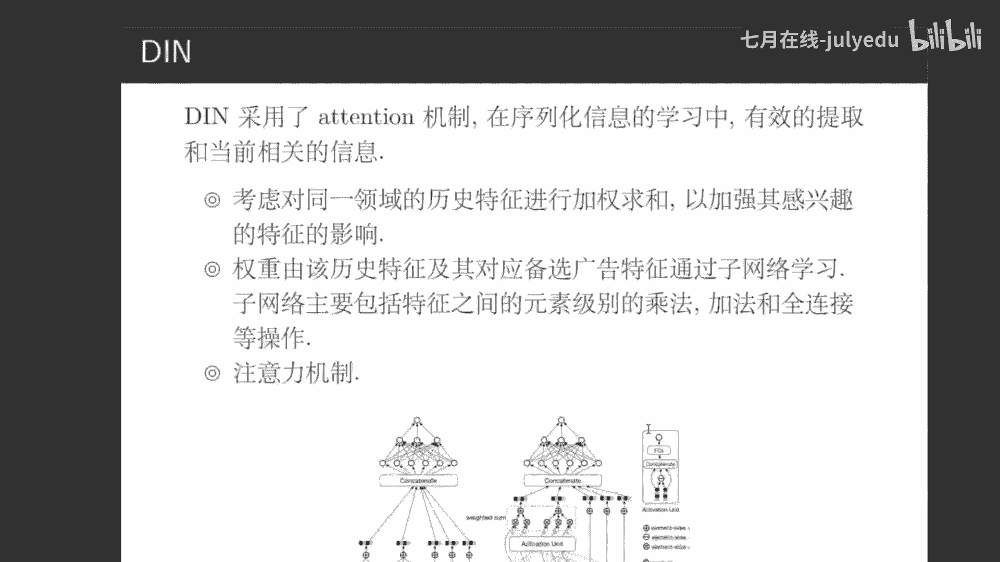

就是我们在这里这样一个子网络呢，其实相当于是我们这个左边是我们呃商品的特征。比如说我们所看到的A类商品中的一个特征或者B类商品中的特征，这边呢是我们最终想要预估的商品。

就比如说你要预估要给你推荐什么样的商品了，准备推荐的商品，这两个商品呢进行一个他们的一个子网络。这个子网络其实是它conact它在con慨t之间的一个减法。

最终呢在进行两层或者三层的for connection就是全连接层，最终求解出上一个权重。然后同组内权重进行相加，最终再进行con。什么叫同组。😊，假如说我都是A类商品啊，都是苹果手机类的配件商品。

都是一类产品，这些都是吃的产品啊，这些就都是一类产品组内进行加权相加，最终再把它们输出到一起，然后再进行conact。因为有了注意力这样一个东西呢，我们就可以保证说。😊，我们对于不太关注的商品呢。

给它权重比较小，关注的商品呢权重比较大，最终能够使得我们模型呢更加focus on我们最终比较重视的一个商品上，对吧？这就是DN这个模型，它都主要解决一样的一个问题。

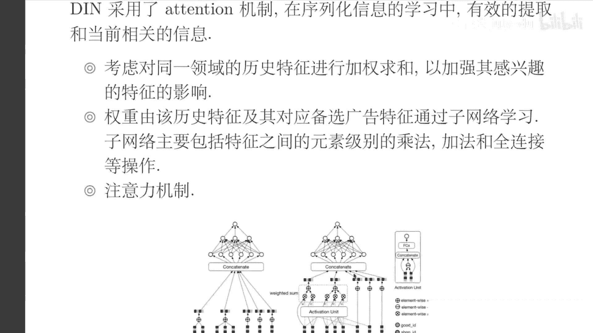

这有我们的注意力机制。ESM呢主要是解决另外一个问题。因为我相信大家除了听说过CTR这样一个名词呢，一定也听说过CVR这样一个名词。CTR呢是点击ickVR是就是说我点击完了以后呢，我再去真正的去看。

对吧？看这个停留的这样一个市场的这一些相关的一些东西。然后呢，其实呢CTR和CVR都是我们广告公司所比较关注的这样一个东西。对于阿里巴巴可能就是你点进这个商品呢肯定是不够的，你点去有什么用呢？

你得买才能有收益，对不对？这就是CVR。😊，但是CVR本身的数据是特别特别稀疏的，原因是什么？原因就在于说。😊，CTR的量其实已经很少了，给你推荐100个商品，你可能只能点进去5个，对不对？

广告可能就更少了。那你点进去5个CVR就只有5个样本可以去选择，而5个样本最终再去觉得他们的正流要负点。而CTR呢就会有100个样本，100个样本和5个样本，那一定是CTR预估要远比CVR去准确。

因为它样本实在是太少了，太难收集了。😊，所以这也是为什么之前CDRCVR他们各自CTR预估比较好，CVR预估的比较不好的一个痛点，毕竟巧付也难为无米之炊，对不对？然后呢。

CTR而阿里妈妈提的ESMM就是通过CTR和CPR进行联合训练，最终形成这样一个结果。他们。一起去共享他们的底层的一些全连接层啊，或者一些呃层之类的一些东西，或者隐白镜啊特征之类的东西。

在上层进的一些区别。这也是我们所了解的1个MTL，就是mtytask learning。这个其实也是一个这两年嗯越来越火跃的一个重点。因为MTL呢它本身有一些比较好的性质。

就比如说如果说我们分开训练的话呢，呃我们的样本不能共享，并且说我们最终因为分开训练呃，参数比较多，还特别容易造成过拟合。而MTL呢就解决了同时解决了这两个问题。

阿里巴巴也是利用MTL这样使得我们在但然这是CTRCCDCVR的这样一个条件概率的一个表达式。我们在CVR中能够去借助CTR的整体样本空间进行建模，而不只局限于CTR它CBR它本身的这样一个建模。

最终通过CTR和CBR共同去预测CTCVR对吧？这是我们ESMMM当中，它所解决的主要问题，不使用少的样本，而使用更多的样本使用MTL的思想一起去预测。好，最终呢我们在结束这一部分之前呢。

我们再来看一看我们准备推荐的一个论文。这个论文呢其实也是当时我在学习点击率预估的时候呢，一个很重要的一个运维的参考。嗯，youtube的点击率预估去列样的一个四部曲。这个不知道大家有没有听说过。

但这个在业界当中是很有名的。因为它不仅讲了一些youtube内部的一些实现，一些他的一些想法，把它一些思路，甚至一个整个的演变过程。在工程上是怎么做到的，都被我们揭开了一些它的一个。😊，呃。

冰山的一角从最开始的协同过滤到到图上的随机游走，一直到深度神经网络。其实这也是在业界当中推荐系统它所变化的一个主要的线路。这个线路，其实每一部分都是很精彩的，都是很值得我们去学习的。并且任何一个算法。

如果说它只存在于论文当中，它也只有学术价值，它的工业上是没有价值的。我们如何能够保证它的工业实现，也是我们很重要的一点，而在youtube的点击些文章当中，尤其是教片第四篇，甚至尤其是第四篇。

它讲了很多在深度网络当中，它的一些实现，包括一些召回的一些做法，一些金牌的一些做法都是很值得借鉴的。😊，这个的话呢也希望大家如果有时间的话呢，能够自己去读一读。如果没时间去读呢。

也可以去看一下网络的网络上。嗯，有一些呃知乎上或者说嗯CSDN上大家的一些讲解都很精彩。

好，呃，我在我看到又有几位同学提出问题来了，我再看一下。😊，嗯，有些同学说是不是看的都买的少，所以C表触罚行为太少。对的，这刚才我已经解释过了。😊，然后外的部分的特征有什么讲究吗？嗯。

这个其实呢d盘的外的特征呢本身就是有一定重合的。我们再回到刚才这个we and deep这个大图当中。😊。

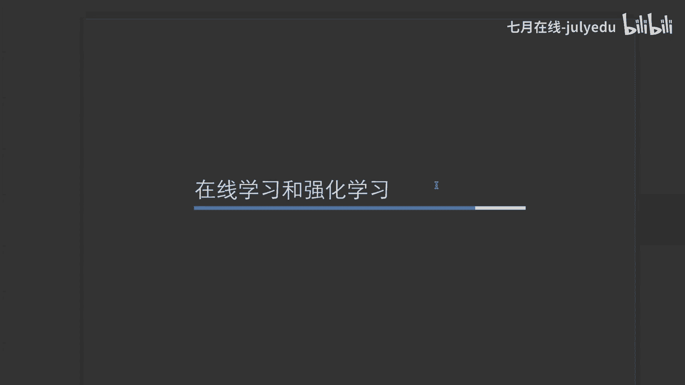

其实我们真正的在用的过程当中呢，他们很多特征都是共享的。比如说w也是可以转成dep的dep也是可以转成w的外怎么转成dep呢？这个很简单，就是通过inbeddding去转就可以了，对不对？

而dep怎么转成外呢？通过数模型，刚才我们GPT加也已经解释过了。所以其实他们的模他们的特征也本身也是共享的。这只提供了一种说我们在外层和dep当中，他们怎么去并行，最终去共同训练的这样一个框架。

能够使得我们的模型的表现能力越来越好。然后并且又不失掉啊wide and deep这两部分各自的表达的一个能力。😊，现在工业界CTR最常用的是什么算法？这个其实就很难说了。

因为像我司的东西我也不太能给大家去透露。我只能是说说这个是跟业务是极其相关的。如果说我们能用简单模型，我们一定不会用复杂模型，前提简单模型的效果比较好。如果说复杂模型。

它所带来的业务价值是绝对足够说多找几个人去研发，以及它所消耗的那些机器资源的话，我们是会去解决使用这些复杂模型的。并且简单模型复杂模型并不是我们的唯一出发点，我们要考虑说一些对于线上业务。

它所带来的收益，以及说我们实时性，以及说下面我们所要讲解出来的在线学习和强化学习。😊。

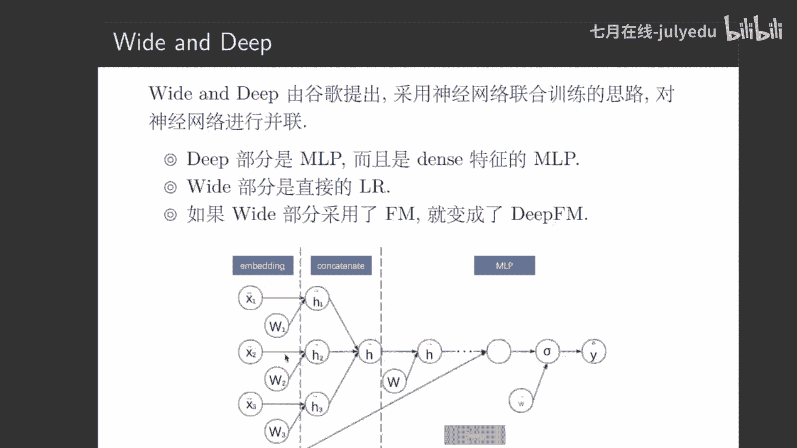

越复杂的模型，它越难去做在线学习和强化的学习。因为他所需要的资验资源就更大，实时性就更难去保证。

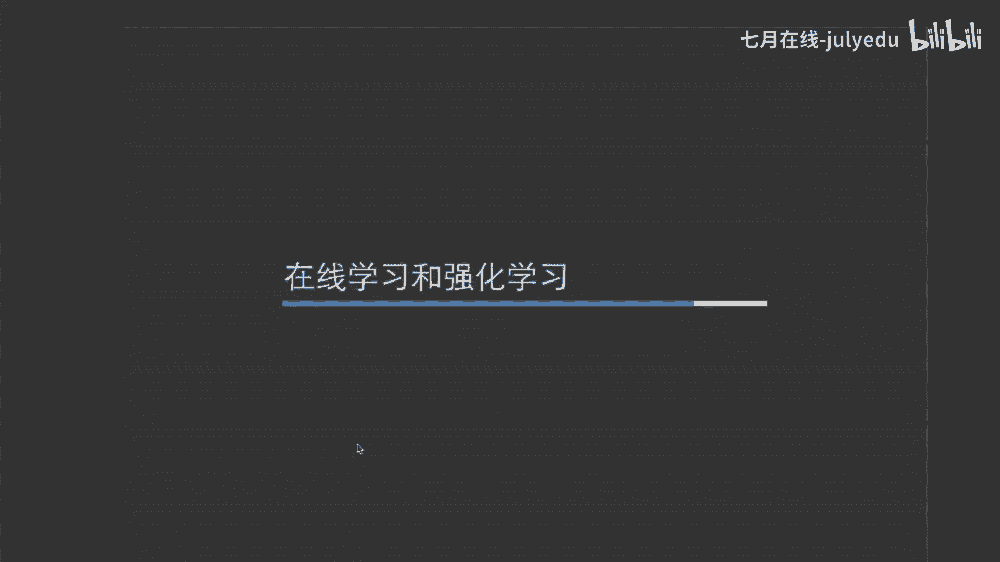

所以说我们就要先聊一聊究竟是什么才能提升一个模型呢？😊，那么我们对于我的理解呢，我觉得这三方面。第一个就是对于业务的理解准确的抽象问题。毕竟大家如果说在工业阶待的比较少。看论能看比较多。

或者说做开做比较多的话，其实这部分大家可能不太能体会到。因为说其实工业当中这个才是最难的问题。因为很多时候你业务的目标和你模型的结果是没有任何关系的。😊，嗯，例子我也不太能给大家举。

但是呢大家嗯如果说以后能够有机会去大各大公司去实际工作的话，就会发现说其实业务上的问题是千奇百怪的。比如业务上说我要提升这个东西，但这个东西跟01点击于这个东西没有任何的关系。这个时候大家就会明白说。

😊，怎么准确的把一个业务问题抽象为一个模型问题。才是我们最重要的一个问题，对吧？第二个，特征工程怎么挖掘更加精准的特征以及高危特征的一个共建。特征工程刚刚也聊过了。

就是我们的人为人肉特征工程和自动特征工程，他们各有千秋。自动特征工程呢能够学习到一些人可能想不到的一些或者无法做到的一些特征组合。但人永远是最重要的。

因就在于我们人他不仅能够去人人为的去挖掘二阶三阶的特征组合。我们还做到一个事情，就是去挖掘一些新的特征。在数据当中之前没有被发掘过的一些特征，去寻找人的各种各样的记录，也及是寻找各种各样的买点信息。

这些机器肯定做不了，对不对？这些只能是人去分析。😊，第三点就是特征和模型的实时化。也就是我们这里所讲的在线学习和强化学习。😊，那么，实质化意味着什么呢？😊，意味着三点，第一点带来实时的信息。

比如说这个其实是最简单的，也是最容易做到的。打个比方，现在我们我们是9点晚上21点，21点就是一个实时特征，下个小时就变成22点了，在下个小时变成23点了，是不是这就是实时的信息可以大家都可以想象到。

12点的人和13和14点吃饭的人，他们的职业很可能是不一样的，12点可能都是一些白领，14点可能都是大家周末刚睡醒是吧？所以说这个就一定是有一定的区别的。😊，第二点，新的广告的特征快速从不准确编得准确。

因为在CTR预估场景当中呢，很多时候大家都会去面临这样一个问题，就是一个新的特征。我么新的广告去上线了。我们根本就没有它的特征。我们做冷启动的时候呢，很可能是说借鉴一些跟它同类的一些广告的特征。

把它给拿过来用。但是呢这些其实远远不够的。因为每个广告呢都有自己的一些特性。那么怎么能够快速去收集这个网络的。😊，这个广告的一些特征其实是很重要的，而这个只能通过实时去收取你T加一的时间去收取。

其实已经浪费了很多资源了。第三点，上下文就是统计信息更加准更加准确。这样一个方面就是其实也是说跟这个也是极其相关的。比如说我要构建一个广告的统计信息，比如说他一个小时被点击了多少次。

这些也必须要把模型实时化掉才能去解决，对不对？😊，然后我看有个同学嗯说推荐几个长的算法模型吧，嗯时间关系我推荐少一点。如果说大家做开做比较多的话呢，大家可以多尝试尝试charge boost。

这个模型一定是你的呃一个大杀器。第二1个呢就是我希望大家多去人肉的去做一些特征工程。因为机器的特征工程，其实很多时候都是不太靠谱的。😊，然后还有。大数据量量在线方式，什么算法适合精度怎么样？

目前应用当中的精度如何啊，这个好像不是一个问题，好像是一个有点多的问题。好吧，嗯，我就我也没有办法完全回答，只能是说在在线学习当中呢，其实在工程它本身的难点并不在于算法模型上，还在于工程上。

就是刚才所说的，这里的我也是我马上所说的流出的引擎，它是否能够去适配。并且说。😊，什么样的在线方式？在线方式其实我不太能够理解，你想说什么算法适合算法适合的话，其实LR是最好最适合去做在线学习的。

因为它足够简单，并且。😊，具有足够强的表现力，精度怎么样？我们做在线学习一定要明白说在线学习，它比离线学习强在哪里。它强的一定不是精度。因为如果说你拿一个同样的在线模型和一个离线模型。

大家在同等场次上去PK的话，在线模型一定PK不过离线模型。因为离线模型你可以做很多精条上的操作，去做很多离线拜尺上才能去做的一些操作。但在线这些都做不了。他所能做到的只是说我的特征实质化。

我的模型实质化，我的样本实质化，这些离线是享受不到的一些东西。😊，呃，我们先回到主线上，然后嗯再追其实他更多关键的是一个流出的引擎，就是这个引擎它能够把样本做到一个怎么样的。如果说万一引擎挂掉了。

它怎么样能够快速。😊，回到它比较正常的一个状态，在学习继续，这些其实是需要很强的一些积淀的。就比如说像前几年比较火的park，你为这两年比较火的blink，其实都是在这方面是有突破的。

才能使得说我们的实时流计算变得越来越好。第二点，时间窗口、样本拼接样本过滤和采样啊，这个东西其实就是一些很在线学习的这样一个过程了。比如时间窗口，因为我们离线可以等离线样本，等一天两天。

甚至等10天都有可能，但在线不可能。你虽然在内存当中，或者放在一些高效率的呃。😊，一些数据库当中肯定都沉不下，内存早就炸了，高性能的数据库也要考虑一些它所的一个空间的这样一个问题。

所以说我们要设置一些比较好的时间窗口以及样本，在线的样本拼接，在线的样本固队和材样，其实都是在线学习当中所需要解决的一些问题。嗯，它和离线有可能是不一样的，有可能是一样的。

这个要看公司的技术是否能做到的流批一体化。😊，第三点，更新逻辑和validation的逻辑。呃，更新逻辑其实就是我们模型怎么着去做一些呃拜式上的，或者说单样本的这样一个更新，使用什么样的一个算法。

validation逻辑呢就是我们怎么着去在在线的方式当中呢，评估模型效果好还是不好。因为我们在线基本上就是一边评估一边训练。这样其实和离线是有一定区别的。大家可以感受一下。😊。

第四个就是适配的最优化算法。这个呢其实目前比较好的最优化算法呢就是FTRL或者说group FTRL这些呢在网络上登录一些相应的论文，他们也是包括像google微软的一些工程师。

他们所进行数学推导演化出来的一个结果。它和离线确实是有一定区别的。这个大家有兴趣也可以去了解一下。然后我再看一下那几位同学的一些。问题。然后呃有位同学说什么特征用在外部分，什么特征用在dance部分。

D部分，这些是不是特征可以重时用在两部分啊？嗯，对，是这样的，外的也可以转化成dep， deep也可以转化成外的。呃，包括一些特征工程，这些就需要各位同学自己在实验当中去摸索了。

因为这个在我们实际的业务当中，也没有一个特别准确的答案。😊，然后像另外一位同学说，京东百度搜索相关的广告，结合CSDN就给你推荐相关的广告。这家共享相关用户的数据吗？啊，这个问题我也不知道。

我知道也没办法回答，好吧。啊，最最后呢我们去呃了解一下强化学习啊，强化学习这些其实只是一个启发。因为强化学习目前还是一套不太成熟的理论。然后呢，包括但是一些比较f的事情呢，其实都会通过强化学习做到的。

比如说阿尔法 go，比如说自动驾驶。因为它强化学习其实更加贴近于人他所学习的这样一种方式。因为它不是说给你一个单一的目标，你就去学去吧。

这其实我们才是目前见到比较多的像那种supervised的supervised的，或者说se supervise的一些算法。强化学习是什么呢？根据不断变化的环境。😊，根据你的反应，不断的去给你一些反馈。

让你去一直在那去学习。这个世界是动态的，病人是在不断调整的。这个其实才是更加贴近于我们人。他所做的一些事情，想到的一些呃方法，对吧？而我们这些神经网络其实相当于是一个虚假的一个真正的类似于人的网络。

因为人的网络绝对不是说算几个矩阵，算几个IT方式，把这些事情解决的，肯定是要通过环境不断的去进行决策，对不对？所以这也是强化学习。😊，目前比较火火热的，并且可以落地的情下学习，包括以下三种。第一种。

最简单的MIB老多比老虎机。这个大家应该已经听说过了，它也是最简单的，就是给您几个样本，我们怎么能快速的选择一个比较好的样本，这就涉及到几个意义。😊。

也就是我们的exspirationation和explanation这样一个相关，就是利用和去探索。第二个就是我们的contex free band contextual bands context free bands呢其实是比较相当于像我们这种UCB啊。

汤森采样，其实都是我们的conex free bandscontestual bands呢其实类似于像那种另UCB或者其他的一些方法。它们之间主要区别就在于这个主要只是一个样本的统计信息。

而这里呢在样本统计之上呢也加了一些用户的特征相关的一些信息。最后一个deep reinforcement learning，就是我们所说的那个深度强化学习。

深度强化学习呢其实也应该是日后最火跃的一个发展方向，但是它足够复杂，好吧。

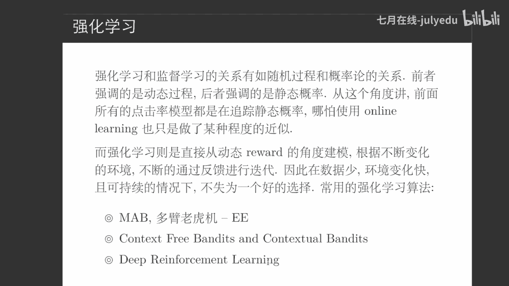

好，嗯，我再看一下大家的这个问题啊，说错了是百度京东搜索某类物品。这个我也不知道呀，我只知道说百度他他肯定会用自己的数据，用不用其他人的数据，我不知道京东也肯定会用你之前买的什么东西去给你推荐，对不对？

😊，嗯，时间不多了，其建模的技巧呢，我们这里就简单的提一两句，然后有需要提问的同学呢，大家可以把自己的问题放在下面啊。然后建模技巧其实现在在CTR预估当中呢，有很多问题都是很需要去解决的。

有些已经解决的，以前没有解决，比如新的广告怎么办呢？在线学习效果不一定好的。其实大家不要把在线学习当做一些解决新的问题，一个灵丹妙药。因为它很多时候只能解决时效性的问题，但是模型效率的问题呢。

很可能是降低的。😊。

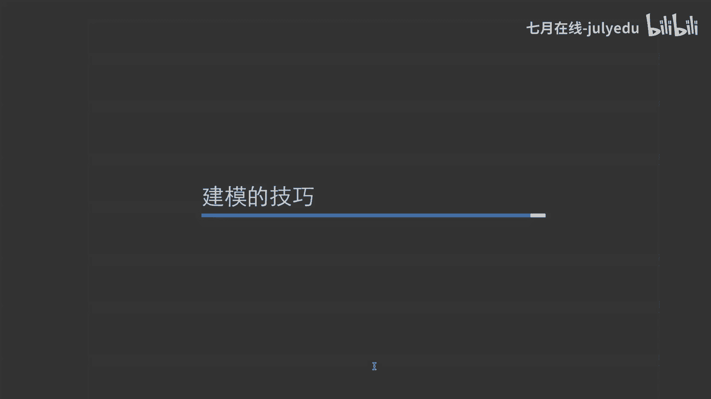

第二个，召回和金牌的平衡怎么做嗯？😊，这个其实是一个在业义当中目前也在讨论的问题。因为召回我们所主要关注的是性能金牌，我们所主要关注的是模型的结果。性能和结果之间。

其实在任何一个情况下都是很需要去取舍的。第三个metricsAUC一定是最好的吗？这个可以告诉答案，就是一定不一定是最好的。因为很多情况下，AUC它本身所带来的结果是具有误导性的。

就比如AUC它本质是什么？就是你对正样本和你模型的打分是正样是这个样本本身是正样本，它的打分一定比副样比副样本要高的这样一个概率，它才是AUC的本质。

但是这个其实我们很多时候关注的不一定是AUC而是precession或者recall这样一种概念。大家可以了一下preessionre你在反作弊上的一个应用。这是AUC一定不是最好的了。

包括其他一些场景。那么那个时候我们用一些什么样的评估体系呢？😊，第4个点句的平滑是什么？什么叫点句平滑呢？假如说。😊，我新来的个广告，我有10个人，我就有一个人点击了。我们就会认为这个样本。

哎这个广告它的点击率是10%吗？这很可能是这很这么高的点击是很可怕的。这个就需要我们去结合我们的历史数据做一些平滑。很多时候其实广告点击率可能只有0%。几或者分之几。而一个10%，很可能不合理的时候。

我们怎么样对一些新的广告做一些平滑上的一些操作。😊，最后一个就是在计算广告体系当中，如何干预做到真正平衡广告广告主之间的利益，平台和广告主之间的利益。这个其实涉及到一些平台化的一些运营策略。

大家如果感兴趣的话，可以去翻阅，学习一下计算广告那本书，好吧。

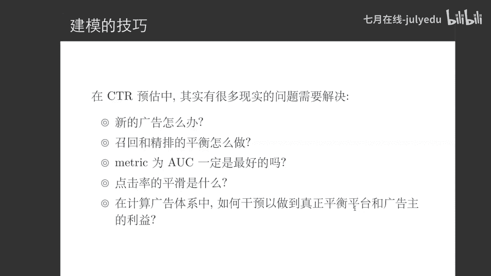

好嗯。匆忙的我们本次的分享呢，也就主要是这些，我再看一下大家的一些问题，然后看有个什么，好吧。😊，说推荐系统当中，实实际上是不用强化学习的，强化学习貌似这个领域不太适用。其实强化学习这个领域呢。

它适不适用是要看你的业务情况的，就可以告诉大家是说在阿里那边，他双十一前两年有用过强化学习。因为这是公开的资料。然后呢，确实有过10到20%的提升。大家可以想象到，在阿里这个嗯体量之下。

10到20%的提升到底是一个多么庞大的一个数字，对吧？所以强化学习有用是有用的。但是要看我们怎么去用。咱们把一个问题去抽象成一个合理的强化学习的问题。要知道一个问题，如果你把它抽象的好模型才有用武之地。

抽象的不好，这个模型可能并没有什么用。😊，再学习收点问题。再学习确实收敛是一个很重要的一个问题，说明这个同学确实是有过一定的一些业界的经验，否则应该是说不出来这句话的。好，嗯。

还有一个同学说LRFM深度模型都会把连续特征离散化吧，然后inbedding不会对一个特征，不会对一个连续特征去做inbedding吧。其实就看你怎么去看inbedding这个概念了。

inbedding我们在最开始接触的时候呢，就是通过一个离散特征，把它给以变成一个连续的一个空间。啊，这个呢确实是一个inbedding。

但如果你把inbedding这个概念不要局限在从连续从离散到连续这样一个情况呢。而且它的数学本质从一个空间变到另外一个空间，那其实深度模型它所做的每一层圈连一层都是在做为inbedding，对不对？😊。

好，时间关系呢嗯今天的分享呢就到这里啊，也谢谢大家能够抽出宝贵的一个半小时的时间呢来嗯听我们这个分享。然后如果大家以后有什么类似的问题呢，也希望大家关注我们的平台去学习。好，嗯，大家再见。😊。

