# 人工智能—计算广告公开课（七月在线出品） - P7：计算广告的发展和相关技术 - 七月在线-julyedu - BV1SA411H7Se

好，我们开始了。然后啊今天呢呃是跟大家分享一下计算广告的一些知识。然后我们会从四个方面去去跟大家去讨论，分别是计算广告的产品和发展简史。然后帮助大家去感知到说计算广告这个领域。

目前它这个产品是怎么一步发展过来的，以及一些比较重要的一些产品形态和一些具体的概念。这是第一部分啊，第二部分呢是计算广告的系统架构啊，我们会从整个的系统来讲。

然后呢给大家讲像一些比如说呃那个呃日志的一些东西啊，以及一些离线处理啊，在线处理啊这些一些系统基本架构啊，第三个呢是竞价广告点击的预估。这个呢应该也是大家最熟悉的部分。就是我们平常所说的CPR预估。

其实主要就是这个部分啊第四个部分呢是基于在线广告的一基于合有网告的一个在线分配啊，关于合有广告是什么？等会我们会在那个呃分享的过程当中，大家能够听到然后在线分配这个为什么重要。啊，等会大家也能明白啊。

然后我们这个公开课大概会持续80到90分钟，然后。大家如果有问题的话呢，都可以在评论区问。然后呢，我看到的以后呢，我都会呃及时的回答。好吧。嗯，好，那个那我们就开始啊。

首先呢就是嗯我们先说这这节课呢主要讲计算广告，对吧？那计算广告呢，它我们把它拆起来看，它就分为两个部分啊，一个是计算，一个是广告，对吧？那广告大家一定明白说是什么东西，那我就不再进行赘述。

那么计算它是什么呢？计算其实就是在用一些数学的一些东西啊，一些数据的一些东西啊，能够做到这些广告的一些呃精准的一些投放，能够获得说比漫天投广告，这样更大的一个收益，对吧？

那么我们首先要说你要用到数学和数据，那你一定是形式呢基本都是在线上的对吧？因此我们引出我们的第一个概念就是在线广告啊，在线广告呢是指的是什么？就是说那些在网络上呀，互联网上呀，大家所能看到的一些广告啊。

同时也指那些在在线流媒体上所投放的一些广告，对吧？打比方。说就是。大家在逛百度的时候啊，就是百度上面呢经常会有很多广告，对吧？啊，以及说大家在逛很多一些其他的一些网站。比如说逛一些CBN啊。

或者逛一些知乎啊，上面都有一些广告，对吧？那这些广告呢其实都属于在线广告以及计算广告的一个范畴啊，也是我们这节课也要讨论的东西啊，这是第一点啊，第二点呢就是说在与传统广告不同一点。

就是说在线广告在短短几线的发展过程当中呢，已经形成了自己一套特定的模式啊，这要特定的模式呢有两个特点，第一个呢就是说以人群作为投放目标。第二个呢，以产品为技术导向啊，什么意思？

等会呢我们会不止一次的看到说人群这个标的啊，就是说它的这个投放的目标是什么？在我们计算广告的一个整体的发展过程当中贯穿着一个特别重要的一个地位啊，我们从开始的静态人群到后来的动态人群。

以及说对人群打标签，对人群的精准圈人，其实也是我们啊在线广告当中一直所研究的一个特别重要的一个课题啊，这是前半部分后半部。呢就是以产品为技术为导向的技术性投放。

意思就是说我们呢中间会遇到很多很多各种各样不同的产品啊，比如说等会儿呢我们会遇到说像竞价广告、搜索广告，然后呢，以及说像什么合约广告等等之类的在。包括说在讲程序化交易的时候。

我们还会遇到说像DSPSSSPADX这些具体的一些产品啊，我们会分析说他们是基于什么样的情况下才会出现的。以及说啊他们是出现了以后带来的什么样革命性的一个进展。这是以产品为导向的技术型投放。啊。

那广告的本质是什么？这个我只是列到这里啊，大家能够看到就行。好吧。啊，这是我们的开篇。那下面呢我们就顺着刚才我们所讲的这四个部分呢，嗯去往下一个个来进行看它每一部分呢都在讲什么东西啊。

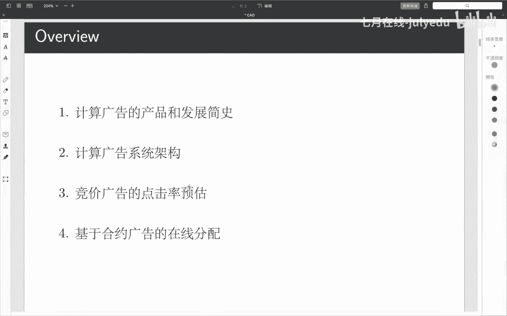

然后有同学说看不到，看不到的话，就是网页上去点击一下允许flash。嗯，然后如果是chrome的话，就是你点击你那个地址浏览栏里面选择允许flash，然后再刷新一下网页就可以了。再不行的话。

就在群里面去问一下那个相关的老师，好吧。

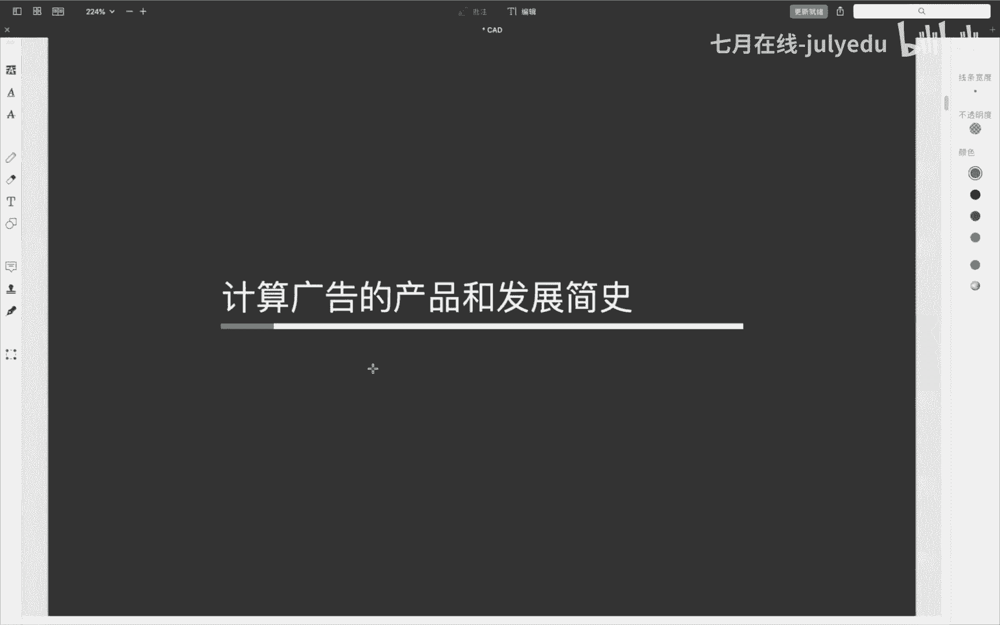

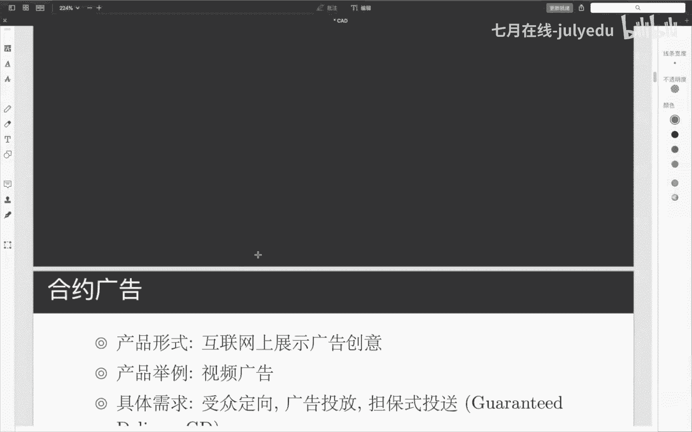

你们继续。

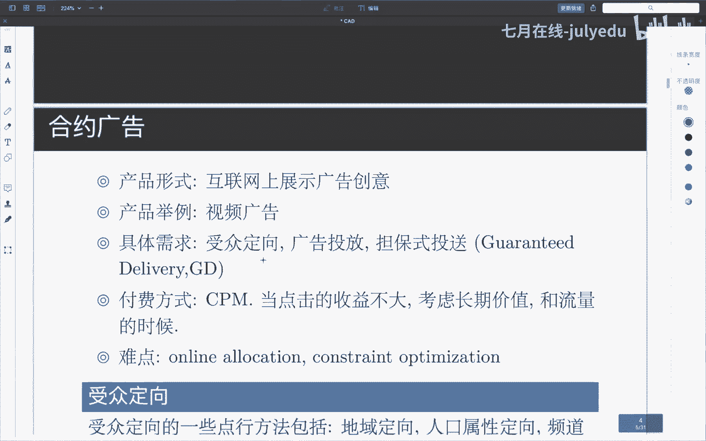

首先呢我们第一个点要讲的是什么？就是合约广告啊？合约广告呢其实是相对于而大家最容易去理解的一个东西啊，为什么这么说呢？首先合约广告它的形式呢是最简单的。

就比如说我我在youtube上直接投放了一个广告啊以及说在一些呃知识工掌直接投放一些广告等等之类的，这些呢有可能呢就属于合约网告一个范畴，但也不绝对啊啊，我们都会讲什么样是一个合约广告。

首先它的产品形式呢，就是说互联网上一个展示的一个广告的一个创意，对吧？但其实呢等会我们看到的很多广告呢都是一个展示一个广告创意，他们都是一个呃广告的一个形式好吧，产品的一个举例呢，就是视频广告。

我刚才之所以举youtube呢，其实就是说youtube的很多广告呢，它是属于合约广告的一个范畴啊，然后但是呢也不以但是这个不是判定的一个为标准。等会我们会看到说合约广告的一个具体一个特点是什么。

也就说下面的它的一个具体的需求。首先它的第第一个具体需求呢就是受众定向。受众定向呢，它在这里面。是有一个很重要的一个概念的意思就是说说可能呢我把人呢做了一个圈人，对吧嗯。

我们把这个人呢圈成了具体的几个部分啊，比如说呃我们圈成男人。啊，女人啊，这是两个具体的这是两个具体的概念，对吧？这就就在性别上啊，然后呢呃比如说我们要给男人推什么？比如说要推一个球衣球鞋。

你大概率不会给女性去推这个东西，对吧？因此而言，你去做你这个广告给谁去进行推送的时候，其实呢是有很强的一个受众的一个概念的。我们管这种方式呢，就叫做受众定向啊，这是第一点。第二点呢就是广告投放。

广告投放的意思就是说说啊我们经常呢再去投放的时候呢，很可能是说在进行系统的一些请求的时候呢，会有一些对于合有广告的一些人群的一些标签呢，做一些具体的一个替换啊，这个呢我们不详细去讲啊。

就是大家知道有这么个东西就可以了。就是但最重要的一点呢，就是说它是一个受众定向，且这个受众定向呢，是一个静态的受众定向。哦，我们一般呢这些维度呢都是很粗力度一个维维度。比如说男性哈还是女性啊。

我们就很粗略，就是说男性呢都投这一类的广告，女性呢都投另一类的广告。再比如说青年人、老年人和那个中年人，他们要又去投不同类型的广告，对吧？这些广告，他们的这些输入定向的特点，有两个，一个是静态。

一个是粗力度。OK那么下面呢我们来看第三点。第三点叫做担保式投送。担保式投送的意思呢就是说说我们一般而言在这种合约广告的范畴之内，我们认为这个广告呢它是有一个什么样的特点呢？就是说它在进行投放的时候呢。

是要保量的。保量的意思就是说很可能就比如说啊我呢要跟一个广告主呢去签订了一个协议啊，然后呢我希望是呃就是我作为一个媒体和广告主，等我们会时不时的遇到呃经常遇到说这两个名词，在这里先给大家去介绍一下。

一个叫做广告主。啊，一个叫做媒体。媒体呢我有时候可能也会以平台方的。意思去叫这个名字啊，广告主呢就是说我要去投放广告的人。然后呢，媒体呢就是指给广告提供投放媒体的投放的这样一个平台。

比如说说我的媒体呢很可能就是百度，对吧？然后上面的广告主呢很可能就是耐克啊，他想去投放自己的广告，好吧，嗯，担保是投送的意思就是说广告主会有向媒体而言，提出一个保量的诉求。

保量诉求就是比如说我今天一一天每天的范围之内，你必须要要给我投放啊100万次啊，这个呢就是指一个保量的一个诉求。那么基于这个保量的诉求呢，我们就衍生出来了我们所能看到的第一种付费方式叫做CPM。

CPM的意思呢是cost per million。啊啊大家不用管这个英文是什么东西。它的意思就是说按照我们的曝光进行付费，或者说按照展示进行付费。好吧，嗯。

他的意因为我们等会还能看到说很多其他的一种付费方式啊，等会我们会看到像CPC啊CPPS啊等等之类的，还有CPT等等，各种各样的付费方式。

我们看到第一种呢是CPMCPM的意思就是说我们是按照曝光按照展示进行付费。不管用户是否点击啊，那么我们都会作为一个呃啊媒体呢我们都会向广告主呢去收费好吧，那么他一般适用于什么样的一个情况呢？

就是说我们需要在这个用户身上呢营造一个什么，营造一个品牌效应啊，就比如说说呃我我本身不差钱，不在乎说用户是否点击我这个广告啊，但是呢我比较需要说让给用户一个很强的一个产品的一个心智。

就比如说苹果我来进行投放广告的时候呢你点不点不重要。但是呢我需要你知道说苹果我们是一个啊什么什么样的一个公司，然后。那我们这个产品呢特别的精致等等之类的这些东西。好吧。

所以说它的一个呃CPM是适用于什么的？点击的收益不大，并且说我要考虑的是一个我产品的一个长期价值。以及说我适用给我的这样个流量的时候，好吧，这是它的一个付费方式和它背后所带来的一些思考。那么说到这里呢。

我们就要说其一个它具体的一个难点了。大家可以看到说其实这个付费方式呢，它的意思就是说呃我们是对展示啊，对曝光进行付费。但是有可能会穿这样一种情况。

就是刚才我我们举出的一个说嗯特别简单的一个这样一种人群的这种分类这样的方式，比如说男女这样种，对吧？我们在这里呢还能看到说一些其他的一些啊方法。

比如像地域定向、人口属性定向、频道定向、筛亚文定向、行为定向啊等等之类的这些东西。我举几个例子来说，比如说像地域定向地域定向的话呢，就比如说我们有那个啊长三角啊。还有珠三角。啊。

比如说京津冀等等之类的这些东西，它呢属于一个地域定向，对吧？然后呢，我们现在就看这两种情况，地域定向和我这样一个性别定向啊，他们两个之间，他们两之间一定会有一个交叉，对吧？那假如说说我广告主A呢。

他想去投放说男性在珠三角的广告主B呢想去投放男性呃，男性在京津冀的广告主C呢想去投放女性在长三角的广主D呢想去投放说女性在珠三角的，每个人呢都有各自的一个保样诉求，这又会形成一个什么样的情况呢？

就是说我们这个保量呢，其实是一个有一个很强的一个交叉的属性呢，对吧？就是假如说我们这里呢说了一个。性别对吧？下面呢说地域。每一个广告主呢，他都有说自己要去哪个地方进行投放。

当这些标签呢进行交叉组合的时候呢，呃简单的假如说只有那么一两个广告主啊，我们要给他保量呢，其实是一件不是很简很困难的事情，对吧？但是呢当这个广告主的数量变多了以后啊，有很多广告主的时候。

他们呢之间交叉组合的这种可能性越来越多的时候，怎么进行保量啊，是一个特别重要的一个问题。所以说他又衍生出来了一门嗯跟它相关的啊，在我们这个计算广告这个领域所发展的比较成熟的一个学科。

就是叫做在线的一个分配，以及说一个呃具有约束的一个优化问题啊啊，在讲第四部分的时候呢，就是讲合约广告的一个啊，就我们这里所说的合约广告的在线分配的时候啊。

我们会讲到说这个我们一般怎么去构造说我们这样一个优化的一个约束。以及说我们怎么样进行一个呃在线分配的这样一个求解。好吧，啊，当然这里面还会涉及到一些流计算的一些知识。不过那些呢我不作为重点去讲啊啊。

这是第一个部分合约广告啊，那么我来看一下大家的问题。嗯。嗯，看不到的话，就用chrome浏览器。然后如果还不行的话呢，可以在手机上看啊，手机上看的话是可以看到的啊，然后呃在手机上再登录一下就可以了。

然后啊设需要设置flash。然后。对，应该其他同学没有问题是吧？说会不会发讲解的文件啊，今天这个讲解文件是不发给大家的。所以说大家如果说要计算记笔记的话呢，就呃大家我每讲完一页了以后呢。

都给大家留大概呃不到半分钟的时间，然后大家去记一下笔记，好吧。好，关于这页的知识上，大家有什么问题吗？时不时黑屏的话，就是可能你还是是不是还没有进用呃，开启启用flash是吧？嗯，你可以试一下手机啊。

那我们继续。我们讲完了刚才所说的那个竞价呃那个合约广告以后呢，我们就来到了计算广告的第二个阶段，就是竞价广告。那么竞价广告呢，它与合约广告的一个最大的一个区别呢，就是说它变得更加精细化了。

那么就要看说我们这个精细化具体是由哪些呃就是情况引发说它从合约广告走向的竞价广告的这样一种方式。首先第一点呢就是说我们这样一个市场呢变得精细化了，定向的标签呢就越来越精准了。刚才我们曾经提到过，说。

其实这里的适容定向呢，它有两个特点，一个是静态，一个是粗力度。当粗力度变成了种精细力度的时候啊，就变成了我们这里这样一个竞价广告，市场变得精细化了。但它此时这个标签呢还是静态的。细粒度啊。

就大家都知道说说我们在去做呃像CTR预估的过程当中呢，都会做很多很多的特征，对吧？这些特征呢其实呃比如说像人群画像等等这类的各方面啊，它都是从呃不同的角度呢刻画了说这个人他的各个方面的一些特征是吧？

那么与这里也相比呢，这里呢可能你只能用说一些比较简单的一些特征。比如说你是男性还是女性啊，你是说你是在呃长三角珠三角还是京津冀等等这些这些地方。这些属性呢可能就比较简单比较少。

而在这里呢当我们这个市场变得更加精细化啊，更加犀利度的时候，此时呢再用这种简单的授入镜象的时候，你就没有办法做到说像这里的这个什么呃online allocation这些问题了。

以及说会使得说你的这些进行分配的时候呢，越来越复杂，这是第一点。第二点呢，就是说你的广告主的数量呢不断膨胀啊，当广告主的数量不断膨胀的时候呢，也是跟前面所呼应。

你所要给每一个广告主进行保量的这样一个需求呢，就越来越复杂。他们呢可能也会衍生出一些呃小中小广告主。中小广告主呢有可能他们对于呃你的一个对他们内种展示啊，曝光啊不是变得特别的在意。

他们应该在意说你真正给他们带来什么样的价值，就是我们广告的第二个阶段就是点击。在这里呢给大家说一个广告，一个典型的广告，它一般都会有三个阶段。第一个阶段呢就是说曝光。第二个阶段呢是点击。

第三个阶段呢是转化。嗯，我们一般称这个部分呢。优化为CTR，这个部分的优化呢为CVR啊，全部的这个优化呢为CTCVR。啊，所以大家所经常能够听到的1个CTR预估。比如等会我们要讲的。

其实呢就是从曝光报道点击的一个优化，它呢是属于竞价广告的一个技术的范畴啊，那我们继续它的这个产品形式呢，就是说供给方呢不再给他进行一个量的保证了。他呢给他保证的是什么？是单位流量的一个成本。

这里这样一个单位流量的一个成本呢，是指说嗯我之前呢嗯给你保的是一个单位的啊，曝光量的成本。而现在呢给你保证的是什么？是一个单位的点击量的成本。好吧，也就是说只有说当用户真正的发生了点击了。

你才需要管我付给我付费。而用户不点击的情况下呢，你是不用给我付费的啊，就是产品的形式。一个产品的举例呢就是搜索广告。搜索广告呢大家一定都呃特别的熟悉了，对吧？比如说我们打开一个百度。

百度上面呢就有各种各样的一个搜索广告啊。搜索广告呢比如说这是一个网页。

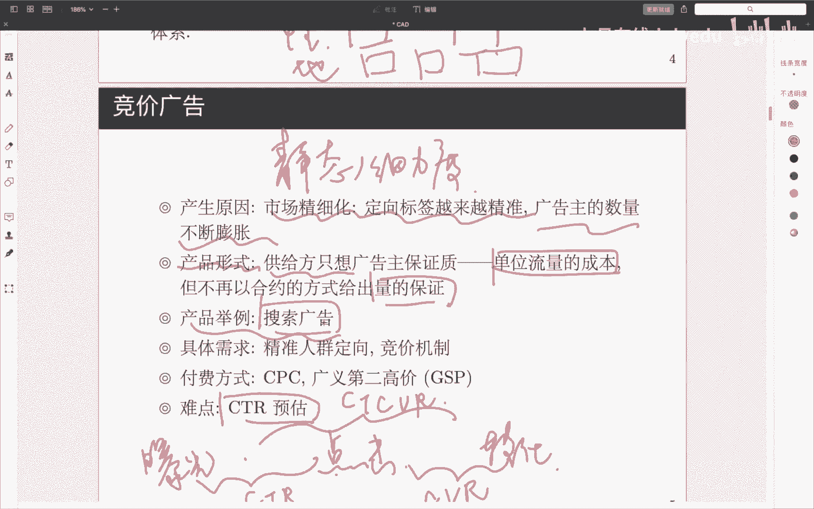

啊，我们现在就打开一个百度看看。

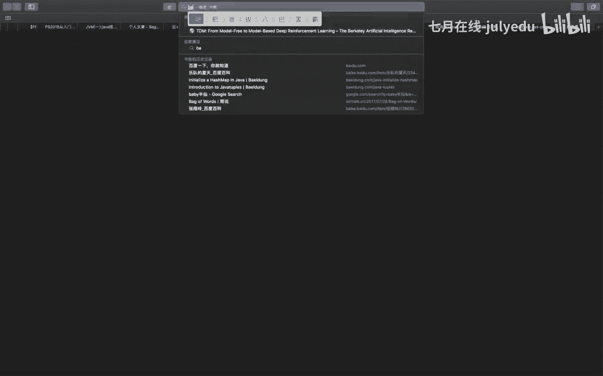

，啊，我随便搜一个啊，这里呢你看这边呢就会有很多一些广告。像这个呢，我不知道这个是不是广告，但我觉得这个比较像广告是吧？再比如说像一些这些呢，其实也是一个广告，对吧？我们管这一部分的广告呢，叫做北区。

这部分的广告呢叫做东区，而下面呢下面这儿好像没广告，应该是没广告啊，啊，如果说的有广告呢，这边呢叫做南区，对吧？这个其实就是。嗯，上北下南左西右中在这个页面上的一个位置。

大家可以看到说其实北区的这个广告的效果呢应该一般都是最好的啊，因为它基本上能够做到出第一时间用映入用户的眼帘啊，然后像这边的广告呢，它呢就是相对北区稍微差一点，但是也还行。

而南区这里呢基本上你都要划到最后呢，才能真正能看到这个广告，对吧？这里呢就是一个搜索广告，那么它的一个具体的需求呢，就变成了一个精准的人群定向。

这里的精准镜象呢就是刚才我们这里所说的一个静态的细腻度的这样一个呃用用户特征，对用户呢进行一个更加精细的这样一个刻画啊，这是第一点。第二点呢就是竞价机制。

这里的竞价机制呢和我们等会要去讲的呃嗯城区化广告呢是有一定的区别的。因为我们知道说在我们计算广告所预估的这样一个问题呢，其实是一个叫做ECPM的问题。ECZPM它一般等于什么呢？它一般等于说啊缪。呃。

AUC乘以。a u c 啊。他们这两个值呢分别是说这个呢是指说啊你的一个啊比如说在我们这样一个精价广告里面呢，是指的你这样1个CTR，就是你的一个点击率，对吧？而这个东西呢是指你一个单位点。

就是当前广告的一个点击成本。嗯嗯打个比方，就假如说现在呢有A和B两个两家广告。A个B两家广告商A广告呢，我们预估出来的点击率呢假如说是1%。它这样一个被点击的收益呢，假如说是1000元。

B广告呢它的这样一个CTR呢是2%，它被预估出来的这样一个呃单位的点击的收益呢假如说是300。那么很难很容易就会发现说其实ECPM它求的是什么呢？就是说给你推送这个广告，它能给你带来一个期望收益，对吧？

因此而我们认为说A广告所给能给你带来的期望收益呢是10块钱，而B广告呢其实呢是6块钱。这个呢因此而我们就会去给这个用户呢推送A广告，而估计通推送B广告，对吧？

这里需要注意的呢是这个CTR和这样一个对应的这样一个priice呢priice呢是静态的CTR呢也是动态进行预估的。并且这里的这个CTR呢是由我们的媒体进行预估的。嗯，而这里这样一个priice呢。

它其实是由我们的这样一个呃广告主。去进行提供的是吧因此计算竞价广告呢，它相当于是媒体和广告主呢各自啊去做一部分的事情，他不会做全部的事情，好吧？啊。

然后它的付费方式呢是CPCPC呢是我们所能看到的第二种计算广告的付费方式，他的意思就是说说我这个广告呢不按照我们的曝光进行收费，而是按照我们的这样一个点击方式呢进行收费啊。

只有被点击了才会真正的去向你收费。他所收费的价格呢一般叫做广义第二高价。广义第二高价GSP呢 generalize price它其实是来源一个博弈顿的这样一个知识。

大家其实可以回去看一下说嗯他我直接跟大家说结论就好了。就是假如说有呃很多个广告主在于进行出价的时候，那么我们管最终呃曝就是我曝光价给了假说那个最高的那个广告主对吧？他出价最高的广告主。

但是我实际呢如果说被点击了，管他收的价格呢，其实是。排名第二的人，他所出的价格好吧，这是他的这样一个收费的具体一个价格，当然还有很多其他的这种价格的确定方式。

但是这种方式呢其实是相对而言最呃就是用酬最广，也是最优的一种方式，好吧。只是付费方式。那么它的一个难点呢，就跟我们刚才的这样一个合约网告呢形成了一个差异。

合约网告这里的主要难点呢在于说我们怎么进行说大家的这种保量需求呢啊，都直接都能够给所有人能够进行满足，对吧？但在这里竞价广告这里呢，它的这个难点呢变成了什么变成了CTR的一个预估啊。

因为我们站在媒体的这样一个视角而言呢，它呢是希望说我们最终的这样1个ECPM它这样一个收益最大，对吧？而呃。它收益最大的前提呢就是说它能够准确的预估出来什么，预估出来我们这样一个点击率CTR对吧？

因此而，它的这样一个难点呢就是CTR的一个预估啊，这里呢是竞价广告。好，大家有什么问题吗？就是有没有录播，录播应该是有的。然后但是录播在哪我不知道。

这个可以在群里面去问艾特一下说呃那个呃我们的那个7月的客服，然后让他来告诉大家啊，然后。下面是请问什么是程序化标签体系啊？我有说这句我有说这个词吗？程序化表现体系。啊，这里是吧啊。

这个词嗯城效化标签体系的意思呢，一般是说说我们呢都会说按照我们我给大家画个图吧。就说我们呢很可能会有很多个领域，对吧？比如说finance。啊，然后呢我们会有很多子领域，对吧？比如说美股啊，A股。

然后呢，港股等等之类的这些东西。再比如衍生衍生品。啊，债券等等之类这些东西对吧？然后呢，第二种呢，再比如说给大家举一个例子，比如sports。对吧再比如说举几个例子，篮球啊、足球啊、乒乓球啊，游泳。

对啊像这些呢，我们一般而言，他们之间呢是一个相对而言比较互斥的这样一个关系。finance类呢你一定不会有sports类的东西。sports类呢一定不会有finance类的这样一个东西。

这样呢就是说类类之间呢，他们之间有严格的呃层次关系。比如说在sports类呢，你有篮球、足球、乒乓球、羽毛球。羽毛球内部呢，你可能就会有说比如说什么蛙泳叠泳、自由泳和游泳等等之类的各种各样的。

他们呢是指说就是指我们这里所说的这个叫啊程序化标签体系啊啊而跟它对应的一种呢是属于偏画像类的标签体系。就是不是那么严格的一个界限。就比如你可以说这个人他是一个呃这种都市的一个白领。

然后同时呢他在什么样的公司工作啊，再同时呢他是多大的年龄这个此时呢这些标签之间呢就会有不严格的互斥，他们之间就会有交叉啊，他们呢就属于非程序化的，就是偏向于画像这种标签体系。好，是这里。好。

这样话大家有问题吗？然后可以理解为合约广告，就是把广告打在广告牌上啊，进价广告就是放在网页上啊，你可以这么理解啊，因为呃如果把广告打到广告牌上呢，这基本上都是属于合约广告啊。大家在高速公路上看到那些呢。

基本都是合约广告，反正我就立在那了。嗯列在呢，它就按呃这个其实跟合有广告还有一定区别。它的这样一种方式呢，其实不太叫CPM还有另外一种方式呢叫做CPT。啊。

这里给大家讲一下CPT就是大家所能看到的第三种的这样一付费方式。那么CPT是什么意思呢？就是说我把这个广告呢这个广告这个牌就是在高速公路上，大家所能建的广告牌。那为什呢我就承包出去了啊。

你想在上面画什么都无所谓啊，反正就是承包出去以后呢，就是按照一固定的价格去付费，因为他没有办法去统计说说有多少人去看到了，对吧？它跟互联网上还不太一样，所以说就是承包给你了，你就给我交那么多钱，然后呢。

最终有多少人看到了，这个跟我没关系啊，这个呢就是属于CPT啊，它是另外一种付费方式了啊，然后既样网告是指放在网页上，其实合约广告呢也可以放在网页上啊，因为呃呃像这种视频广告呢，很多都属于像这种合约广告。

他们直管给你曝光，然后呢，点不点击没什么关系好吧，就是这里。Yeah。下面呢GSP的好处是什么呢？一直没有太明白是吧？嗯，GSP这里呢嗯我就嗯不给大家详细的去介绍了。

如果有哪些同学比较感兴趣GSP是什么东西呢？啊，我建议大家呢能够说呃自己呢去课下去看一下，说像一些跟博弈顿呀相关的一些东西，好吧，然后呃那些东，那因为讲那个东西的话，它是涉及到一些呃呃理论推导的。

好吧啊，就是这里。好。其他的问题，那个阿拉祖creit是什么广告是吧？嗯，这两个好像是我们下面所说的那个城市化交易广告和竞价广告啊这个呃。应该是这些的部分，好吧嗯。

其实像我们马上所讲的文化交易广告和镜价广告呢，他们之间没有一个严格的隔离的范畴。很多的一些广告平台呢，他们都是这两个是结合在一起去使用的啊。然后CPM一定是合约吗？CBC一定是竞价吗？

啊CPM和CBC他们叫这个名字，不是说他们对应的是谁，只是说他们这样一种收费方式比较适用于在那种广告的体系下面。CPM指的是说说我按照曝光进行付费。而CPC呢只按点击进行付费。

那么曝光进行付费呢就比较贴近于像合约广告这种计费方式。因此而言，合网合约广告基本上都使用CPM同样的竞价广告呢基本上都使用CPC好吧。好，那下面呢我们来讲第三个部分。

第三个部分呢是城区化交易广告实时竞价。呃，实金架的产生原理呢就是说其实大家这里呢是可以看到的。我们刚才说了这样一种标签，以及说广告主所做的呢，就是说一个静态的细粒物的这样一个竞价方式，对吧？

提供这样一种标签体系。那么我们很容易就会想到这样一个问题。这个问题呢是在呃是我们今天会遇到一个问题，就叫做重定向问题。这个重叠项问题指的是什么意思呢？打比方说说啊我是一个京东的一个商铺，对吧？

我在京东上，比如说投放了我的一个广告啊，那么这个用户看到他我的这个广告以后呢，他呢选择来我这里购买，那么呢我们就有的说这个用户在我们这个广告主这里的一个交易的数据，对吧？但此时京东啊有可能是不知道的啊。

我们先假设京东不知道啊，但因为京东这个平台比较特殊。如果说一些其他平台，假如说你是一个第三方的一个呃商户的话，那么有可能说你在一个平台上面，平平台只是说给你做了一个引流过去。

但在你的这样一个平台里面发生了什么事情，其实平台本身是不知道的啊那么此时你有一个很简单的一个想法，就是说那么我知道说这一类的用户，或者说这个用户，他所代表的一个用户。

能够说给我这样一个平台能带来最终的转化价值，我因此就会说依据这样的用户呢去挖掘出一些其他的一些潜在的用户，对吧？这是一个方面，另外一个方面呢我。发言说刚才比如说一个小时前来的用户呢，对我而言都没有转化。

而这种用户呢对我而言有转化。因此而言呢，我想提高对这种用户的这样一种我那个广告的一个价格去降低说对我而言没有什么转化，去点击过来，没有转化的这样一个用户的这样一个价格，对吧？就相当于而言。

我们广告主呢想要更多的去接管说我们这里的这样一种嗯对于广告的这样一种定价权啊，开始定价权呢，只是说我提供给你了。我把我的价格呢静态的给你了，但是而言，我没有办法进行实时的一个调整，对吧？嗯，一般而言。

像金价网告这里呢，都是说我事先的把价格给设定好啊，最终呢你点击而言，就按照我事先的价格进行付费。他不可能是实时更新的。而这种程序化交易广告，这里呢，我们的定价逻辑呢变得不再封闭。我们呢开始实时出价。

并且实时的自主的选择流量啊，因为之前而言，假如说我在这一类上的人上呢进行投放了一个广告，我就把这个价格呢给确定住了啊，那么此时我就没有办法说给他进行更加经济化的一个抉择了。

这个呢就是说我们刚才所说的竞价广告。这里的程序化交易广告，最大的一个区别就是这里所说的一个叫做实时竞价的这样一个机制啊，它这样一种产品形态呢，就是说每次有广告主呃有那个媒体向我来进行寻求的时候呢。

我进行每次这样一种实时出价。那么在这里呢我就给大家简单的说一下城市化交易广告啊，它的一个具体的这样一个流程是什么样子的来帮助大家进行理解。首先假如说我作为一个用户。我呢来到了一个媒体。上面对吧？

媒体呢就是我们这样一个平台广告平台啊，跟媒体说说okK我现在需要一个我现在来看东西的那媒体呢就会给用户展示一个广告，对吧？那么媒体呢一般都会请求叫做一个什么叫做1个ADX的这样一个。

机构啊ADX这个机构呢，它指的是说说嗯或者说ADN。他们两个分别类似于像股票市场的一级市场和二级市场啊，ADN呢类似于一级市场。ADS呢类似于二级市场啊，但大家不用管几级市场。它的意思就是说说。

因为股票市场大家都知道是干什么的，是吧？股票市场就是说所有的证券交易呢都在这里。而这里呢ADXADN和ADX呢类似于说所有的股票交易呢都在我们这里啊，那么它呢就会去实时的向各个啊我们这样一个广告主。

广告主。ABC实时的进行询价，说现在呢有这个人过来了，你要给这个人是否要给这个人投放广告？如果要投放的话，你愿意出的价格是多少？那么此时ABC就能够拿到说这个人啊，那我就A呢就去查自己的数据库。

看这个人是否对我广主A有价值，对吧？同样的BC呢也会做类似的事情。因此而言，他们呢都会说有对自己有价值的，就会去参与竞价，然后呢，并且当前根据说呃之前一段时间我的这样一种这个用户此类用户的一个表现啊。

实时的计算说我要给这个用户出多少价格，就这里所说的每次展示实时出价。然后呢就把这个价格返回给ADXADX呢再把这个结果呢返馈给媒体，媒体呢去选择这里其中而言出价最高的那个，对他进行一个最终的一个展示。

好吧，所以说这里呢我们的付费方式就变成了CPM为什么这里是CPM呢，我们知道说CPM他的意思是说按照展示啊，按照曝光进行付费。因为此时我们的媒体呢不再进行CPR的预估啊。

所有的出价以及说最终的转化的这样一个预。后呢全都下放给了广告主。因此而言。广告主他本身需要承担说自己出价的这种全部的啊这样一种啊责任啊，媒体呢。不再进行任何的包括CPR或者CVR或者CDCR的一个预估。

因此而言，只要我对于给你展示了，你就需要进行付费。因此而言，这个付费方式呢就变成了CPM它的一个具体的需求呢，就是说精准的一个人群定向。因为ABC这三个广告组呢可以完全拿自己的一个数据啊。

进行说我是否要给这个用户进行曝光啊，曝光以后，我出价是多少啊，它进行动态的一个调整，一个动态的一个竞价。这里的一个难点呢是指说需求方的一个精准定价，对吧？因为此时我们看到说包括我们这个媒体啊平台啊。

他已经不再参与任何的啊这样一种广告的这样一种呃呃预估机制了。他提供的只是一个很简单的一个平台。我呢只是一个展示你最终广告的一个平台。而最终你是否愿意在我这里展示，你愿意出多少钱。

全是由广告主呢自己进行决定的啊，所以说广告主呢需要承担说自己出价的全部责任。这是这里所说的一个需求方的一个精准定价啊，需求方呢，就是我们这里所说的一个广告主。它的产品的举例呢。

我这里呃刚才有讲过ADX那SSP和DSP呢分别指的是DSP指的就是这里。SSP呢指的是这里。它呢指的是需求方平台，而这里呢指的是供给方平台。需求平台呢就是说它是代表着广告主的一个利益啊。

它呢一般而言他会去联合一些其他的一些机构啊，去收集一些数据，帮够帮助广告主呢进行一个最终的转化率的一个预估。然后呢，最终与ADX呢进行连接。而这里的SSP呢就是代表的是媒体和平台的一个利益。

它能帮助媒体和平台呢拿到最终的一个最大收益。好，这里呢是程序化交易广告。Yes。用户标签是谁获取的啊，这是一个好问题。这里呢我没有去讲，大家不知道有没有听说过这样一个产品，叫做DMP。

啊全程叫应该是daman就是呃数据挖掘平台。DMP呢它一般是一个偏向于三方的一个组织啊，他呢会去会去收集说各个的呃比如说各个广告主的一个利益啊，各个广告主的一个一些数据。

以及说可能也会有一些平台一些数据啊，他呢会去制作一些用户的一些标签啊，以及一些说啊这些呃一般我们称他们嗯这个DSP的各个的一个广告主呢，他们而言，他们作为每一个需求方。

他们呢可能会共享一些数据呢给到DMP这里。DMP呢会把这些数据呢，最终啊给他呃变现。然后呢呃去进行一些数据的一些加工啊，标签的一些加工啊等等之类的。

当然同时广告主自己呢以及说媒体自己呢也会有一些自己的一些对于标签的一些加工和一些诉求。像媒体呢比如说像在这里的这样一个精价广告这里，他可能就会根据说自己内部的一些东西啊，比如说。

很可能就会说呃他呢会根据说我用户来我这里一些信息啊，自己这样一些标签一些数据，有可能对外开放，有可能不对外开放啊，这些呢都是一些标签的一些来源。Yeah。然后实时和竞价和实时竞价呢用的更普遍。呃。

我觉得都挺普遍的。他们各自代表的不同的一些东西。嗯，这个没有说谁比谁普遍的这样一个问题。包括下面的这位同学问我说，各个占广告的一些比例是多少，其实都有吧。但现在合有广告相对占的比较少一点。

因为它的效率相对比较低。而呃程序化交易广告和竞价广告呢其实都占有的比较重要的一个地位。She。实时竞价在哪些有哪些市面上的一个应用。其实很可能你见到过的所有广告呢都有背后都有实时竞价这样一个影子。

因为很多时候呢实时竞价和竞价呢，他们是放在一起的。我这里跟大家多说两句这个SSPSSP这里呢，它很多时候的一个做法呢。就是说我作为一个平台而言。

我自身本身呢很可能就会已经有广告主在我这里呢参与了一个静态竞价，就这里所做一个竞价，对吧？我需要根据自己的CTR模型呢去把这些东西给预估出来，预估出来那些最高的ECPM啊，然后呢。这是静态定价。

同时我为了保证自己SSP的利益最大化，我呢也会向ADX呢发送一个竞价请求。它呢再会向DSP呢发送竞价请求。这些呢ABC呢在进行一个类似于招标的这种方式，对吧？最终假如说A胜出了它给的价格。

A给的价格呢就会和SSP这里自己所估算出来的，在他这里注册的这些广告主的ECPM呢，进行一个比较，哪个高呢，它就会最终把一个广告呢给到谁，所以经常而言，实时竞价和竞态竞价，他们两个呢是放在一起的。

这样才能保证说我们这样一个媒体的利益的最大化。啊。这里该还有问题吗？那没有问题的话呢我们就接着往下讲。嗯，下面呢是讲的是一个需求化的一个层级的组织啊，这个大家了解一下就可以了。就是一般我们一个广告呢。

就是当我们的广告主和媒体签合同的时候呢，都会有这样一种比如广告计划，基本上就是一次的投放合同，下面呢广告组就是一个具体的一个投放策略，对吧？比如说我要给这个人群投放广告啊，不给那个人投放广告。

就跟我们刚才的标签呢是相连的。广告创意呢就是最终我们进行投放的那个标的啊，就是说像标题啊、链接啊文字呀，就最终展现给大家的一个素材，其实呢就是一个广告的一个创意。好吧。

就是一个广告的这样一个层级的组织啊。Yeah。在这里呢多给搜索广告呢再去多提两句啊。首先第一点呢就是说搜索广告词的这样一个查询扩展啊，大家应该知道说搜索广告呢我们都是要去买很多关键词的，对吧？啊。

如果说做个搜索广告相关的同学应该都会知道，我买的光广告词呢，很可能就比如说假如说我嗯这个呃一个呃旅游产品啊，我想在啊飞猪和想在携程上呢去售卖啊，假如说呢我可能就会买说呃。

比如说那个北京或者说北京的或者说首都啊这些关键词呢都会进行购买。那么呢我们作为一个平台啊，就需要说对这个用户啊，我们的这些广告主，他所购买这个关键词呢，做一个匹配。有的时候呢精准匹配。

就是说必须要跟你这个词完全一样才能匹配到。有的时候呢不完全一样，就只要有一点不一样，就不匹配到，对吧？包括像短语匹配某匹配和否定匹配，大家看字面呢应该都能知道就种匹配呢。

它所代表的是一个什么样的一个意思。这个呢因为匹配的过程呢极大的影响了说最终你能召回出来哪些广告。因此而言，这个选择哪种匹配呢，其实也是至关重要的啊，这是第一点。第二点呢就位置投放。刚才呢。

已经给大家去演示过了，我们的北区南区和东区分别都是什么？嗯，第三个呢，ECPM呢等于CTR乘以B的。就我刚才所说的CTR和那个priice就是嗯我们这个广告的价格。好吧，这个呢我跟大家刚才都聊到过啊。

然后呢今价广告对比合约广告，这个大家也应该都明白了，我们这里呢就不再赘述。在这里呢我们再复习一下刚才我们所说的那些一些基本的概念啊，我们刚才呢其实讲到了ADX其实就是一个广告交易平台。

它其实呢是类似于二那个二级市场的广告交易平台。好吧，这是第一步对这是这这个概念DSP和SSP刚才也给大家去讲讲解了说他们分别呢都是属于需求方平台和供给方平台啊。

他们各自的作用和责任都是什么东西P呢就是数据管理平台，就刚才跟大家说过，说标签的生产组织和管理啊，就是我们的数据管理平台啊，最后呢跟大家说的是这个TB就是实时竞价啊，刚才我们一直在讲说长期化交易竞价。

然后呢呃我们这个实时竞价。那它的这样一个英文呢就是TB数语呢啊它的全称呢是就是实时竞价好吧。重定向呢，这个也跟大家刚才呢有聊到过啊，一个是网站的重定向，一个是个性化的一个重定向，对吧？

比如说个性化刚才我们举的例子呢，就是个性化的一个重定向啊，根据用户的浏览下单信息啊，然后呢给用户呢呃进行一些重新的一些定向。比如说我的一些呃提高说对这些用户的一些个价格呀。

然后使得说我这个广告更加容易出啊等等之类的，这些呢都是一些重定向的一些机制啊，包括搜索重定向，也是说根据说你刚才搜索这个东西。然后呢呃现在呢你发现你点击了以后呢就对你啊这样一种搜索这样一种关键词呀。

或者对我这给你的一些打分呀，都会有一些偏好啊，这个就是搜索一些重定向机制啊。

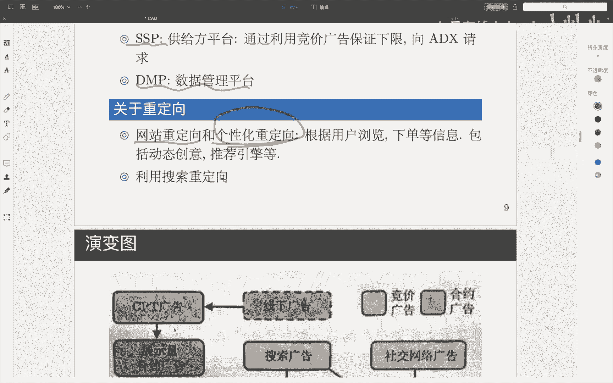

Yeah。在本节的最后呢，我们再来看一下我们这样一个演变图啊，我们这个演变图呢，其实就呃演变了说我们这样一个广告的这样一个历史呢是怎么进行演演变的啊。我们从最开始的这样一个线下广告。

就是我们刚才最开始所说的CPT广告，对吧？就是刚才举的例子呢，就是高速公路上那个广告牌，其实呢就是这样1个CPT广告，到了我们这样一个展示量合一广告，它是按照展示曝光次数进行付费的。然后呢。

到下面的精准定向广告，这边呢是一条路，另外一边呢就是说由搜度广告所引引发出来的上下文广告和信息流广告啊，它呢基本上都是说根据你当前一些搜索情况，或者说你些上下文的一些情况啊，对你一些精准的一些广告。

也是我们所说的这样一种竞价广告竞态竞价广告，对吧从这个静态竞价广告呢，我们最终引入到的说程序化交易广告。也是说我们的一个动态竞价的这样一个过程。这也是我们在线广告的一个整体的这样一个发展的一个示意图嗯。

好，那么这里就是这节。嗯，大家看一下有没有什么问题，嗯，给大家大概半分钟到1分钟的时间去整理一下。

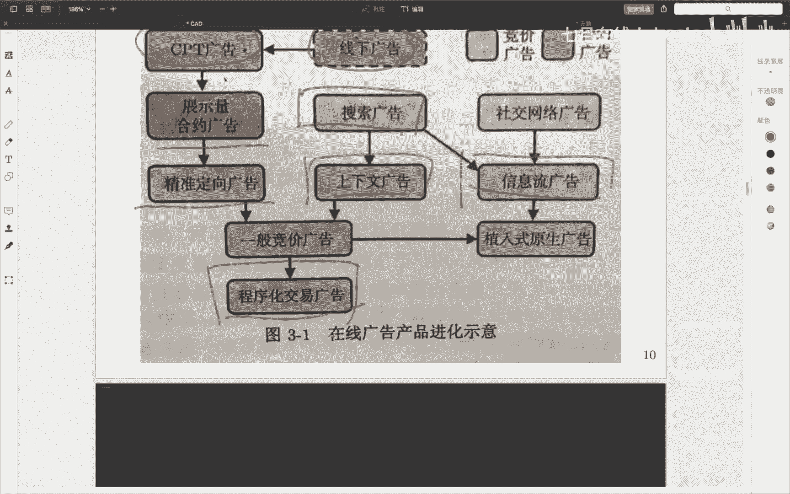

能否前面几个平台的之间的关系再总结一下，你说这个平台是指这些吗？

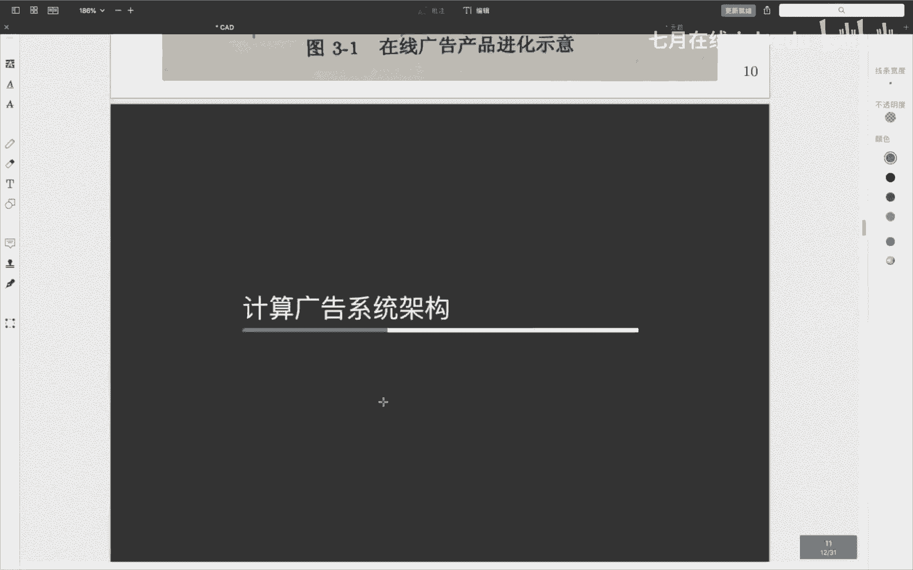

这些呢其实大家就看我这里给大家画的这个图就可以了。用户媒体媒体呢它后来衍生出来的SSP啊，它呢是代单个媒体呢就是一个媒体。SSP呢其实服务于多个媒体的啊，一个供给方的一个平台。

然后下面呢就是我们这样1个ADX和ADN他们呢是相当于把这些媒体和广告位呢给聚合到一起，变成一个最终你去进行呃呃就是那个广告主所购买的一个物品。就类大家每次看ADN和ADX的时候呢，都去看一下。

说说我们的这些嗯呃怎么与股票市场相对应，就都能看明白了，这个DSP呢就是最终呢代表广告主的利益的，帮广告主呢进行决策呀，也就进行分发呀，以及说提供数据啊等等之类的，都是DSP所做的事情，好吧。

然后广告层级组织作用是什么？你说这个东西吗？这个东西的话呢，其实呃是涉及到说呃一个广告主和一个媒体去签订一些广告的时候呢，最开始肯定是签订的是一一次广告合同，对吧？

比如说现在呢我要去投放说啊嗯那个耐克的一双球鞋，耐耐克这个广告啊，我们就进行投放了啊，或者说啊耐克的一双具体一双球鞋，是我们具体的一个投放策略，这次投放这个球鞋，下次投放那个球鞋，对吧？

最终的广告创意呢，就是说我要投放这个球鞋了，那么我要进进行一些广告的一些最终的素材，比如说底色是什么？然后呢，上面写什么文案，以及说我最终呢是要那个投放给什么样的人，那么投放给什么样人是广告组的表，呃。

包括像最终生成这个素材，其实就是广告创意，好吧。就是这里这个呢只是想帮助大家说一个广告呢，它都包含哪几个部分，以及说我们刚才那么多广告的这样一些基本概念，在这里呢是怎么组织起来的？

是。嗯，实时竞价DSP呃注重CTR那么SSP其实是不是就不用关注CTR了？其实DSP呢它关注的不是CTRCTR是曝光点击率。而此时呢，因为点击一般而言不会对广告主呢带来什么样的收益。

它其实关注的是CTCVR最后给你带来一个转化率，好吧，是曝光转化率啊，SSP呢其实这个时候呢就不再关注CTR了，是这样的。She。广个公司一般扮演什么样的一个角色？

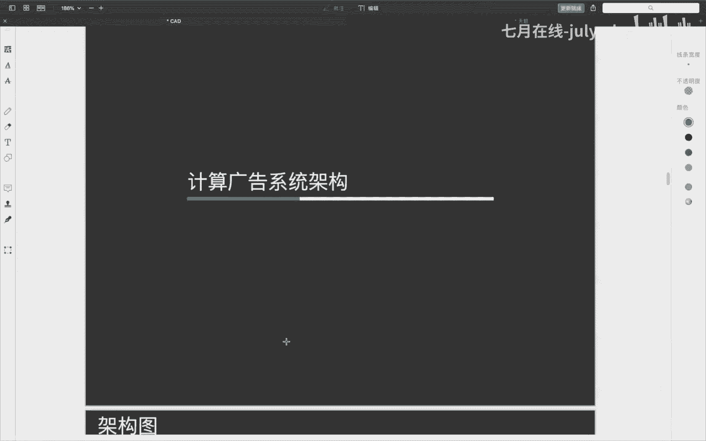

广告公司你指的是哪个？是指的这个东西吗？我不知道你指的是这个ADX还有SSP啊，一般而言，我们持广告公司呢都指的是这样个媒体平台啊，他一般呢就扮演说我给你在他在不同的地方扮演不同的位置嘛，对吧？嗯。

刚才我们也其实我们这堂课呢，主要都是站在那个媒体和平台的视角去讲。比如这里最开始的难点呢是一个在线的一些呃一些分配啊，其实呢就是说是一些媒体或者广告公司，他们呢所要做的事情。

下面这个CTR预估呢也是他们要做的事情。最终这个实径价呢，其实才是需求方，就是我们这样一个广告主所做的事情。好吧。

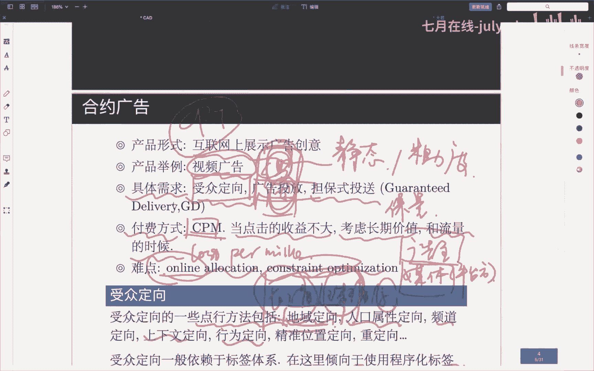

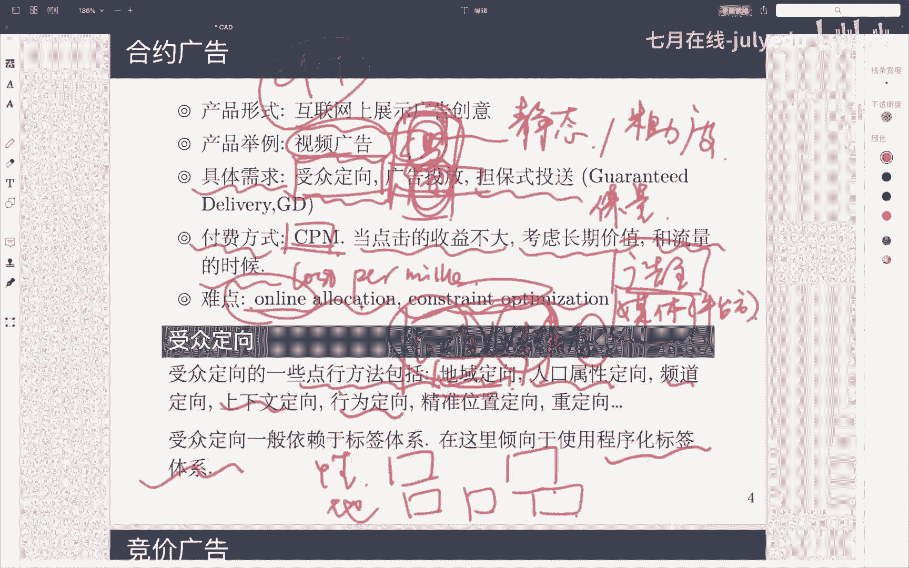

所以说广告公司呢基本上一直扮演的最重要的角色呢，就是提供一个广告的这样一个位置啊，可以来我这里投放广告啊。当然呢，根据投放广告的不同的这样一种呃付费方式呢，他自己要去做其他的一些事情。

市场上推荐和广告哪个薪资高一些，嗯，都差不多吧。我觉得嗯因为这两个地这两个呃领域很多技术站的是相通的。但是推荐呢其实你也看不到说我这里所讲的啊，实竞价竞价广告和合有广告的这些知识啊。

它推荐呢有自己的一套知识。但是呢最终涉及到一些模型的一些东西呢，有一定的相似度啊。好，那么我们继续来讲第二个部分就是计算网络的一个系统架构啊。

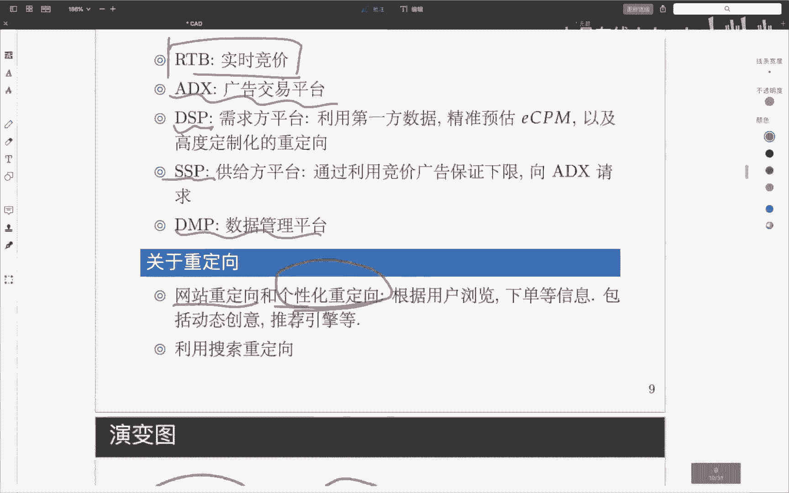

刚才我们说过了，说机动网络的系统架构呢，这边有一个架构图，它其实呢是分为了四个部分，分别是onlineserv。

啊，这是第一个部分。第二个部分呢是那个呃data highway。就是我们这样一个高速的日志处理平台。第三点呢是我们这样一个呃distributed的comping。She。

第四个部分呢是我们的那个streaming computing。啊，实时计算。嗯。它呢其实是偏针对实际计算而言呢，它其实是一个批处理，就是离线计算。好吧啊。

那么他们四个呢分别都代表了什么样的做了什么样的一些功能呢？我们一个来看。首先呢我们要讲的呢就是我们的第一个就是我们的那个呃onservon serving这里呢其实呢它呢是指的我们这样一个受众的一个定向的一个平台。

当一个请求过了以后呢，我们在线的请在线的服务呢要进行响应，对吧？那么响应需要做一些什么样的事情呢？比如说就是什么要生成我们的绘画日志啊啊一个在线的系统呢，它需要说把用户的请求呢都给保存下来，生成日志。

供以后呢我进行分析使用和整理数据使用，这是第一点。第二点呢就是进行行为一些定向人群的一些打标，对吧？就比如说刚才我们有一个需求说男性呢需要说啊他去投放这一类型的这样一些广告。

女性呢投放另外一个类型的广告，其实呢就是一个行为定向，对吧？我们需要在onserv端呢，把这件事情给做掉。下面呢就是说点击对建模，这里呢。点击电模特指的是我们onlineserv的时候调用这个模型。

对它进行打分。好吧，最后呢商业智能模块啊，这个呢嗯就是BI的一个模块啊，没什么可讲的，这是第一个部分。onlineserv部分其实onserv呢它所扮演的一个重要的角色呢。

就说串联整个的所有的线上系统啊，有请求过来了，我呢打分过日志做正确的路由和定向，这是onserv所做的事情。啊，然后呢当然它同时呢onserv呢也具有说我们是一个高并发的一个投放的一个系统啊。

它呢需要有广告的召回排序收益管理和重排序，其实呢都是他所需要做的事情，第二个部分呢就是数据高速公路data highwaydata highway的意思呢就是说。我们刚才所说了。

我们的onserv系统呢，它需要把用户的所有的sessionlog呢全部都给记下来。就是我们这样一个所有的日志，对吧？那么这些日志呢，它需要说给到我们的。下面的数据就是一些分析的工具呢进行消费。

我们的分析的工具呢就是我们这里所说的第三点和第四点就是tricomp和 streamingcompP计算和流计算对吧？那么呢它就需要说给计算提供一个数据一个存储啊消费的这样一个具体的这样一个工具？

就比如说我P计算去拿数据的时候呢，我需要我们呢把数据给它到离线的存储上。比如说H啊，这是一种方式。而streamingcomp呢就需要说我们在进行计算的时候呢。

有一种类似于像比如说这种呃呃数据的这样一种存在线的存储啊存缓存这一个机制助我们呢能够进行实计算。这些呢其实都是做这样一个事情。它呢进行日志的管理，然后呢保存以及说消费的这样一个源头，这是做的事情。

当然刚才呢我也说了一些。啊，他所用的一些开的一些产品，比如像卡普卡。Self flu。啊，其实都是一些看的一些产品跟日志和消息相关的，好吧。这里呢我PPT上写了两点。

第一点呢就是准时时的将日志推动到其他平台上啊，比如说推动到kaaf卡上和floom上面去，这是一点。第二点呢就是联系离在线和离线，这里是指能它既可以进行批计算的消费。

也可以进行streaming计算的一个消费。好吧，这里面就是数据高速公路。第三点呢是流式计算平台。流失计算平台呢它所对应的呢就是说呃我们呃能够说实时的做一些事情。那我们经常说需要做一些实时的什么事情呢？

一般是有两个部分。第一部分呢就是实时的受众定向啊，刚才我们说过的说，假如这个用户呢啊他对我们这样一个广告准的比有价值。那么可能我们需要说啊这个用户的信息呢给它提炼出来啊。

进行实时的一个啊重定向受众的定向。就是这个以及说实时的一个点击反馈啊，我们在模型当中呢，经常就会说啊用到一些特征啊，比如说这个特征是指说这个用户呢在过去一个小时之内，他点击了多少次。

在每一个广告上的点击多少次，分别是iteom特征和you特征，对吧？这些实时的点击反馈呢都需要说实时计算流失计算平台呢把我们这个数据呢给计算出来，这是第一点。第二点呢是计费和反作弊啊。

这个呢就是计费这个跟模型没什么关系。但然是跟我们整个一个广告体系有关系的。就比如说怎么去排除那些作弊用户怎么。去进行说当前我应该向这个广告主呢发生多少的计费。

这些呢都是流失计算平台所需要完成的一个东西啊。我这里呢应该是忘了写那个P计算平台了。那我这里呢就简单的说一下P计算平台需要做什么事情，P计算平台呢基本就是说我们要进行一线的分析一些数据啊。

同时呢进行模型的一些构建啊，这些呢都是我们的P计算平台所需要做的一些事情啊，像分析数据呢，我们可能就是说像像一些BI的这样一些岗位呢他们就需要说分析每一类用户的这样一个曝光点击的这样一个情况啊。

为其他的一些比如说呃工程团队或者说算法团队呢提供一些决策支持啊，像算法团队呢可能需要做的事情呢，就是去清理出来我们这样一个特征和最终的label啊，把它们变成样本进行模型的训练。

最终呢放到线上进行预估等等之类的。这些都是P计算平台，他所需要做的一些事情。好吧，那么讲的这些呢我们来看一下说具体有哪些相关的软件，可以帮我们做刚才所说的一些事情。

首先我们刚才说到了f这些呢都是我们这样一个d日志处理平台所做的事情。op呢其实它一般包含的东西呢是三个，一个呢是那个叫啊HDF啊，做存储用的离线了存储一个叫做那个H，一般是呃在线进行去使用的啊。

然后呢还有一个是m呢其实定义的是一种范式啊，这个大家应该也都知道啊，我也不详细的进行赘述下面呢是sk和storm他们两个呢应该再加一个flink。其实呢代表了三代的实时计算引擎啊。

sstorm呢是第一代spark呢是第二代flink呢是第三代。如果有同学对这个实计算比较了解的话呢，应该也会知道说他们这三代数据引擎都是怎么发展过来的。各自的一些优劣势是什么啊。

目前最popular的呢就是flink啊，它呢也是呃目前相对做的最完善的一个啊实时计算的一个啊框架。在下面read呢是一个缓存，好吧。

啊这个lucy呢以及说我这里没有写的ES就是elastic search，其实都是建立索引的这样一些呃工具，好吧，因为索引呢经常啊假如说我对这我这个我现在要对这个有用户搜索的这个关键词啊。

那么我需要就是对这个关键词呢去进行索引，看哪些呃广告主呢购买的这个关键词，其实呢就是索引所做的这样一个事情，好吧，等等，这是相关的一个软件。想请问这张架构图哪里来的是吧？啊。

这张架构图呢是来自于那个呃大家可以看，如果有兴趣的可以看这本书叫计算广告啊，作者呢是刘鹏。一目前已经出到的第二版啊嗯。在京东或淘宝上应该都能买到豆瓣的评论是8分多，也算一本精融广告帮助大家入门的一本书。

好吧。

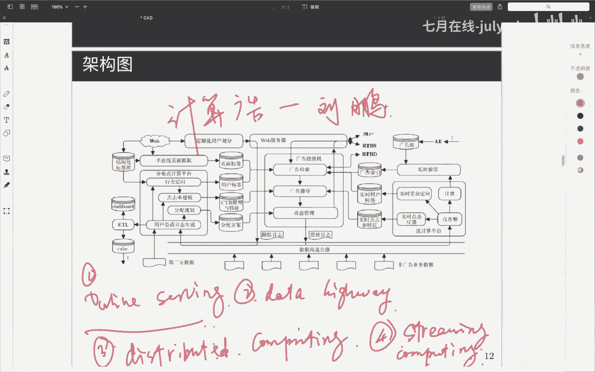

好，这里有其他的问题吗？那没有问题的话呢，我们就开始讲第三部分，就是我们这样1个CTR预估。CTR预估呢可能是大家听到最多的最熟悉的这样一个过程了。

因为呃CTR预估呢其实就是纯粹的和模型比较相关的一个东西，好吧，那么CTR预估呢其实就是点击率预估。刚才呢我们已经说过的说点击率预估，它具体是个什么东西，它有多么的重要。

这里呢也是给大家呃说的一些它的具体一些背景啊，然后呢我们也不再赘述，我们具体来看它相关的一些技术啊，那么为了提升CTR预估准确率呢，其实说有很多的预估方法和技巧呢都层出不穷啊。

这里呢指的是一些模型的一些技技术。比如说我们这样一个传统的计学习算法，像逻辑回归，就大家所说的的L2对吧？这是一个部分。第二部分呢就是新一代的计学习算法。

比如深度学习基像所衍生出来的DNNN这些呢其实都在我们的计算广告里面呢都有一定的应用啊，这是第二个部分。第三个部分呢就是更加实质化计学。

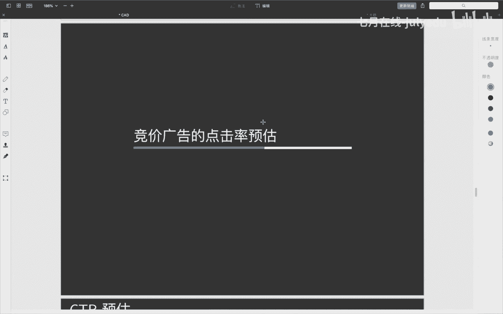

算法比如说在线学习和强化学习啊，他们呢分别代表的说在线学习呢是指的是模型的迭代效率更快。而强化学习呢指的是说用户和环境呢不断的进行呃一些呃interact，就是呃一些互动啊。

能够说能够环境去和用户呢进行一个博弈啊，就是强化学习。当然呢还有一些模型融合或特征融合。当然这些呢我所列举的呢。基本上呢都是说一些像比较偏模型的一些技法啊，同时呢我们还有一些其他的一些技法。

比如说像那个最优化算法这样一个技法。嗯。这个呢我不太记得我这个幻灯片有没有写，好像是没写啊，没写好在这里跟大家说两句。最化算法呢其实也是一个比较重要的一个点。

因为我们最划算法呢像呃最开始大家所能接触到的像GDSGD。其实呢都是一些比较常的一些算法，对吧？以及说他们呢后来发展到了一些MSpro。Andam。FTL他们其实代表的也是新一代的一些算法，对吧？

比如adam呢一般是呃号称是目前最厉害的算法啊。FTL呢一般是在在学习当中用的比较多，为了去解决新中性问题的啊，以及说这些呢他们都是一些属于一阶算法啊，还有一个二阶算法。

比如叫牛牛顿算法和你牛顿算法BFGS这些算法。哦，还有LBFGS其实呢他们都代表了一些二阶的这样一种优化算法。他们的优点呢是优化的更准啊，更快。啊，缺点呢就是说二阶haen矩线不太好算。

然后呢可能会占据额外的空间和内存啊等等之类的一些问题啊，当然这三类呢，他们都属于叫那个梯度下降算法。还有一种呢叫做制拟区间算法，大家有感兴趣可以看一下叫做trust region这样一个算法。好吧。

这呢是最优化算法，可以看到说其实最优化算法和模型呢，他们之间是相辅相成啊，一起向前进行发展。这是方法。那么数化的表示呢，其实就是通过这样1个UIC去预测我们这个Y，对吧？

那么U呢代表用户物品呢就是I这里呢就是我们这样一个广告adtment，对吧？上下文呢context啊，这里呢有必要跟大家去介绍一下说什么叫做上下文啊，上文的意思呢一般都是说嗯。

只有在请求的过程当中才能看到这些东西。比如说我现在呢来去请求这个系统，那么现在是呃9点02分，那么时间呢就是9。02。假如说我用的是电脑去请求的，那么它就会记录你这个电脑的型号等等之类。

这些呢就属于上下文。你和我呢很可能这个时间呢也不一样。然后呢。咱们请求的这个设备呢也不一样啊，比如说只有在请求的那一刹呢才能来到一些信息，我们称常们没上下文，好吧。然后特征呢。

一般我们就通过离线特征和实时特征进行获取。点击结果呢，我们都会通过一些原始的买点日志，对吧？这实原始的买点日志呢，就刚才所说的那个onserv系统，他们的一些session log。

这里简单聊点句逻辑回归啊。逻辑回归的话呢，这个基本的模型呢我们大家应该都比较熟悉的，我也不再进行赘述啊。然后呢呃GRM的系列模型呢是指的是说呃逻辑回归呢，它其实是一个广义的信引回归的这样一个范畴啊。

我们在呃基本上。因为用在什么样的地方去用模型的时候呢，广义线性模型呢都属于我们呃很重要的一个模型的一个组成部分。包括这里所介绍一个LR，以及说跟博通分布相关的一些东西呢，其实都属于广义的线性模型。好吧。

那么广义线性模型它所需要注意的一点呢，就是说我们经常需要做一些特征的离散化啊，因为特征离散化呢会帮助说分担说一些模型的一些具体的一些特征的一些风险啊，使得说模型的预估效果呢更加健壮啊。

嗯并且对具体的某一个特征呢，不会变得特别的敏感啊，这里呢就是风险均摊。最后一点呢就是人工的特征组合和自动的特征组合。人工特征组合呢一般是指的是说我们根据自己的一些经验或者一些业务的知识呢。

我们会对特征当做一些什么一阶交叉呀啊二阶交叉呀等等之类这样一些东西等等啊，这些呢是人工特征组合。而自动特征组合呢，我们一般会考虑到说使用像facebook它所搞出来的GBDT。

将LR做一个自动的一个特征组合，好吧，它呢相当于GPT自动的帮我们做特征的筛选和重编码，以及特征的交叉。啊，LR呢做最终的一个学习。好吧，这个呢既帮助我们去自动的筛选的特征。

同时呢它所筛选出来这个特征的结果呢被重编码的，也是一个离散的特征，也比不好意思，现在大家能看到的吗？我也不知道为什么刚才网络卡了。可以了是吧，不好意思，刚才应该是我网络断了一下。😊，嗯。

我不知道刚才我姐姐解释到哪个问题了，我重新开始说一下嗯。首先啊最上层的数据保存是用ESFH base。我不太知道你想问的是什么。单ES呢一般是建索引用的Hb呢是在线请求的时候嗯，去查数据时候用的是吧。

嗯，HB偏在线，然后离线呢一般是像那种啊HDFS呀，像have啊这些东西啊是离线用的。Yeah。然后强化学习用的不多，大家去了解像banit，还有那UCB其实就足够了。然后一阶二阶是指多项式组合吧。啊。

对的，其实这个我说的可能不太准确啊。其实就是说二阶的特征组合，一阶呢其实就比如X呢去做一些S平方啊，logX啊这些东西啊，取相其实它是一阶的特征变换，好吧。

在下面呢是 and deep and呢其实想跟大家分享的就是一个深度学习深度学习呢其实所有深度学习呢基本上都是绕开 and deep这样一个模型啊我们看这 and呢这里给大家画了一个过官方所给出的一个示意图啊。

部分呢就是MP这里呢就是我们这样一个部分对吧？而这里呢是外部分外部分呢其实就是LR啊 and呢其实就是把外部分呢和 deep部分呢给组合到了一起啊，运用各自的这样一个优势啊。

外呢指的是说说我们呢能够学习模型的一些特别数据的一些特别特殊的一些属性啊，比较specific的一些特征啊，而像啊部分呢其实学到是一些比的一些特征，对吧？这个呢大家应该很容易的理解啊。

因为像我们的深度模型呢其实预往上的应营抽象，但创出来的呢都是说一些大部分用户所有的一些特征，对吧？但是一些少部分的一些个人啊，它的一些特性呢其实呢一般只能在我们的外部分呢。😊，才能进行学习到，好吧。

所以说就是Y and deep呢综合了这两个部分的这样一个优点。同时呢如果外的部分呢外的部分呢抢了FM，它就变成了一个depFM的这样一个模型。好吧，这个呢大家课下呢可以去看一下说DDFM这个模型呢。

它的架构呢是一个什么样的一个样子。最后呢再跟大家简单的说两句在线学习啊，在线学习这个技术呢，我觉得相对而言比那个呃强化学习呢用的要相对多一点啊，在线学习本身呢其实是可以实时的训练模型的。

并在特征的实质化基础之上呢，把模型本身也变得实质化，我们知道我们在意义当中呢，其实用到实质化的最多的两个部分呢，一个呢是特征的实质化。另外一个呢就是模型本身的一个实质化，特征的实质化呢。

其实就是说相比于离线特征。我们让特征的产生呢变得更加实时化。比如说常态实时特征呢，就是最近一小时这个ite的点击情况啊，它呢会根据一小时的时间窗口进行滚动的一个更新啊，而模型本身变得实时化呢。

相当于是指我们模型本身的一些参数呢也都变得更加的实质化，对吧？因为大家都知道说我们。模型在大厂里面呢，大部分情况下都是属于那种天级别调度中心的。这样此时呢，当你的人群分布呢发生剧烈的变化的时候。

模型本身呢是很难就是跟随着一起发生变化的。这是在你学习所发挥优势的地方。你是模型本身的参数呢，也根据你的数据呢实时的进行重新的计算啊，因采它比较依赖。第一个就是我们这样一个实时这样一个实时计算引擎啊。

它呢需要说能够帮我们去做出实时的一些特征呀，实时的一些数据呀，给到模型呢进行实时的一个训练啊，这是第一点。第二点呢就是时间窗口样本过滤样样本拼接和采样啊，因为实时它的一些特性，就导致说它的一些做法呀。

怎么进行嗯这双流照呀，大家应该可能会听说过这样一个词，以及说时间窗口这些呢会有一些区别，这是第二个部分。第三个部分呢就是适配的最优化算法。刚才也说过了。

说我们在计算呢经常会用到一个算法叫做FTRL它呢是专门为期数性啊所设计的一个算法，好吧，呃，这是这个在线学习。好。这里看大家有什么问题。deep的LR和DN是怎么组合的啊，嗯看这个图嘛。

Y的部分呢其实是1个LR它其实就是一个单层网络，对吧？dep部分呢其实就是一个啊一层一层向上堆叠这些单词层对吧？当我们把这个Y的部分呢和这个dep部分呢给揉到一起去，其实呢它们各自占一半。😊。

就是我们这样一个弯的地方，对吧？wide和的输入一样吗？啊有可能一样，有可能不一样，都有可能啊。嗯比如说假如说你都是离散特征嘛，离散特征的话呢，外本身就比较喜欢离散特征。

就是spa features是可以直接输入的。而这里呢其实你也可以直接扔进去，它也是one嘛，然后去做dding，然后再去过dense，所以说比如说你要是s features呢其两部分呢都是可以试用的。

当然同时dance features呢也是两部分都可以试用的。呢本身就比较喜欢dance features，所以直接用是可以的。而s那里呢不太适合直接用dance features。

所以呢你可以对它做一些分头啊，或者其他的一些把它变成spa这样一些操作。好，有其他的问题吗？IM和FTRL的区别。😊，啊，这个区别讲起来就久了。至少要讲一个小时。可能讲不完。

你可以理解说adam呢就是一种啊。把它运用呃冲量，以及说呃就是梯度和那个二阶梯度这样一些各自的。一些更新就是嗯explanential average的这样一种方式呢，把它们去使得你梯度的变化呢。

不像SCGD一样，每次呢都是一个重新的一个方向进行变动。它呢都会依据说你前段时间的一阶导和二阶导的变动情况呢进行这次的呃更新方向的选择。这个是ite的主题思想。

FTL呢其实它所主要关注的呢是模型的呃这样一种叫做稀数性啊，意思就是说呃当你的呃有很多特征进行更新的时候，那么什么时候对哪些特征进行更新，哪些特征直接给忽视掉啊，这个呢是FTR所主要研究的问题。

然后NFfifa和D派fa有什么区别？啊，这区别讲起来又麻烦了。嗯，这个我本节课就不讲了，感兴趣的话，自己课下去看一下，好吧，这个网上应该都有相关的资料。😊，这些技术基本上都是有开源的实现的。

大家从网上去搜那些像ideM呀FTIL啊这些最优化算法，以及wind and deep这些模型呢，其实网上呢都会有相应的代码。为什么外和dep输入不一样，是随机样本和特征吗？哎，我刚才说的好像是一样啊。

我刚才说了说spas在两个部分需要做什么样的适配，deep需要在两个部分做什么样的适配，对吧？嗯，m deep的外特征和d特征，都可以放到外部分和dep部分。举个例子。

UV context怎么输入Y and deep？嗯。Yeah。比如说年龄我就举这一个例子就可以了。其他大家应该能够理解。年龄的话呢，假如说这个人的年龄呢是30岁啊。

他呢是一个可以把它直接做一个spae特征，直接输入给这里啊。作为一个d特征，直接输入给这里啊，在这里呢把它让它进行分桶，对吧？

buucket bucketet呢意思就是说可能说0到10是一一个岁年龄段呀，11到20是一个年龄段呀，然后21到30是一个年龄段呀，buucket以后呢，放到dep部分。

三十呢直接放到啊不 bucketet以后放到外的部分，直接呢放到d部分，这是一种方式，另外一种方式呢就是把它bet以后呢，这个也是放到外的部分，但是dep部分呢不直接用30这个数字。

也是用它buucket以后的这样一个值啊，这个值呢其实相当于就是一个spa特征了，对吧？那么你s特征这里呢再去过inbedding，把它变成一个inbedding以后呢，再给到上层的d词进行消费啊。

这些呢都是可以去尝试的。H。FTL是引白领之前还是之后，对呀。这个问题问出来嗯，我有点不太知道怎么回答你，因为inbedding它本身呢指的是什么？就是一套模型的一个参数，对吧？

那个一个层的一些primeter那些参数啊，在无论是FTIL还是ideam这些最优化算法呢，他们所进行优化的时候，都是要优化这个模型的所有参数的。所以说。

这个问题我觉得你想问的是它优不优化inbdding层的参数。那答案是它会优化。然后想问一下学习模型有什么高效的方法论吗？您把您一般把so塔的论文都实现一遍吗？嗯，不太是一般而言。

在我们在实际的业务应用当中呢，都是根据实际的业务情况去选择模型。大家其实听我这节课讲的问题呢，也可以发现说说我们这个整体的这样一个模型啊，这样一个计算广告呢，它不只有模型的部分。前面我们讲了很多的部分。

以及说像在线的一些分配呀，以及说一些CTR预估啊，也就整个的这样一个系统架构的一个搭建呀，其实都是我们计算广告所研究的课题，好吧。session序列怎么用到dFM模型中？嗯。老师问一些比较大的一些问题。

这些问题都不是属于一两句话能够讲明白的。大家可以理解为session数据呢，你可以用1个RN的这样一个模型去实现进去，对吧？像这里呢你也可以去嵌套一些RSTM这样一些层啊。

这些呢就使用session数据的一个方法。同时呢你也可以去看一下阿里的一篇模型叫做DIN啊，他们也告诉你说你怎么去使使用一些session的一些呃用户行为数据进行建模。好吧。

deepinterest model。然后。user有一批特征，item有一批特征，user item有一张历史点击表，CTR需要手工提取一些特征，输入外 and deep还是如何输入呢嗯。

你可以把us色特征和ite特征呢分为不同的组，然后呢都给到Y and地这个模型里面去，对吧？然后usus item这些特征呢，其实就属于典型的U to I特征啊，他们呢也是我们特征一个源泉。

你可以把优色特征呢分成一个组ite特征呢分成一个组，然后U to I呢也分成一个组啊，这三个组呢分别代表了这个不同的这样一种特征的一些信息嘛，然后让他们分别进行学习，好吧。

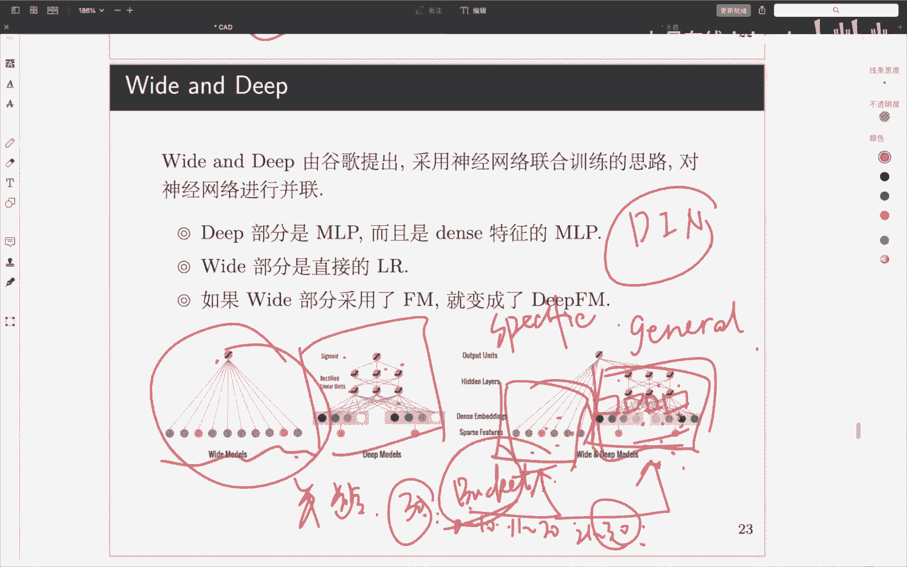

时间关系呢呃我我要接着往下讲了，否则我90分钟讲完啊。最后一个部分呢呃跟大家去讲的是基于何用化的一个在线分配啊。我们呢首先呢何用告呢他所需要做的一个事情呢，就是属于流量预测啊。

流量预测这里呢其实呃大家不用看这一点，大家这一点说的比较绕啊，直接看这里就行了。其实呢就是说根据你个标签组合和1个ECPM的阈值呢去算一个流量，对吧？因为我们知道说我们广告主呢呃他所要的目标呢是流量。

但是我们平台呢一个最大的利益呢，就是ECPM是最大的，因此而言呢，我需要说在而而我我们每个广告主呢都会投多个标签，每个标签呢也都会有多个广告主进行投放，同时呢我们广告主呢也有一个量的一个诉求，对吧？

因此而言呢，我们需要说给您这些标签组合，因为每个广告主呢说给我们提供的一个价格。

最终呢进行流量的一个预估，就是我们流量预测所做的一个事情，对吧？常见的一个方法呢，就是基于实验序练呢进行一个短期预估啊，大家呢可以根据一个。时间序列呢进行一个建模啊。

建模完以后呢去预估说啊比如说昨天和今天呢，我认为说他们那个用户的行为表现呢应该比较相似啊，因此而言呢昨天是一个什么量级。我今天呢就应该是一个大大概的对应的一个量级。好吧。

就所说的基于时间序列一个短期预估。啊，频次控制呢一般指的是说说嗯我们要给用户进行曝光的时候呢，将要需要考虑说不要重复的给用户曝光同样一个东西啊，因为大家看广告的时候应该也会有这样的感受。就你看几次呢。

可能可能就烦了。因此而怎么对用户呢进行一个频次的控制，嗯，或者说叫做疲劳度的控制，其实我们也是我们在进行曝光的时候，给用户展示的时候呢，所需要讨论的一个问题啊，他一般都会有客户端和服务端两种解决方案。

这里呢我也不再进行详细的进行解释，都是怎么进行操作的。下面呢我们具体来看一下再线分配的这样一个式子长的什么样子啊。

这也是我们这样刚才所说的constraint optimization这样一个式子具体是什么样子啊？I呢是指的是那个。那个那个呃我看一下。那A呢指的是那个那个我有点忘了我这这个式子是怎么写过来的。

A呢应该指的是advertisement，就是那个广告。啊，这个呢I应该指的是供给。嗯，一个指的是说说我呢对于我这天好像又写错。嗯，我看一下啊。

这里呢其实应该指的是说说我们这个XIA呢是指的是说我这个供给呢给到这个广告啊，这个供给呢给到这个广告。所以呢我们有最重的一个式子，不是就是最底下这个式子是指的是说说每一个供给的，就是你最少只能供给零嘛。

你不可能供给是负的，所以呢是有这个最优化条件，而这样个最优化条件呢分别代表的是一个供给方的约束和这样一个需求方的一个约束，对吧？供给方的约束呢，就是说我呢这个供给方给所有的广告呢分配最多呢只能分配一。

对吧？我可能给广告主A呢分配0。2，给广告主CB呢分配0。7，给广告主C呢分配0。1，他们的加权之和呢必须是小于等于一的对吧？一般情况下都是等于一的，这样是一个供给方的一个约束。

这里呢是一个需求方的一个约束。需求方的一个约束呢有两种不同的呈现部分。我们具体它看一下。第一个部分呢就是担保问题要保证流量。我们一般呢都会保证一个下限，对吧？就是说假如说这个需求方呢。

它需要说你要给我递那么多的这样一个流量。因此而言呢，我们需要保证说给到这个他的这些所有的流量呢，都是一定要满足这么多，对吧？比如说这个供给方需要给他XIA这么多流量。

下一个供给方呢需要给他另外1个SIA这么多流量，对吧？这是指的一个担保问题，另外一种方式呢，就是说预算问题，因为每一个广告主呢等可都会有自己的预算，我这里也拼错了，是。嗯。

他指的问题呢是说有预算的出价是小预算的对吧？因此而言呢，我们是说说这里呢。这个预算呢一定要小于这个DA一个最主要的它的一个预算的一个约束。好吧。

这两个呢大家可以看到说一个是大于等于一个是小于等于也是根据我们的一个不同的这样一个约束所体现出来的。一个呢是保证流量，一个呢是不能超过你这样一个预算，好吧。这两个呢就代替的呢是我们这里这样一个式子。

此时呢我们在线的这样一个分配呢，就变成了这个这个和这个这三个不等式OK那我们现在具体来看一下怎么进行解决呢？解决的方式呢一般都会用一些优化算法。常见的一个优化算法呢，比如说线性规划和二次规划。

分别就是 linear programming和quadratic programming。第二个呢就是说我们呢还会通过一些叫做队友的一些方式。啊，队偶呢指的是说我们的拉格朗日。

拉格朗日乘子法拉没拼错拉格朗日乘词法加上拉格朗日橙子所替换出来的一些原始的那些变量所变成来的队偶问题啊，然后呢去基于队偶问题进行求解。这里呢还有一个概念叫做基于队偶的一个紧凑分配方案啊。

因为本来呢我们需求约束呢，没有很多个广告主啊，然后呢。假设有数以百万计的一个广告者啊，然后呢，他们的需求呢很可能是千奇百怪的，因此业呢就会比较多啊，然后呢把这个供给约束呢。

我们也会有很多很多的这样一个平台，这样一些媒体，对吧？因此而言，怎么能够在需求约束和工具约束之间呢进行一个转化，也是我们这个紧凑分配方案基于对我的研研究的一个问题。好吧，这是第二点。第三点呢。

就是说需要进行一些在线的实时调整和补偿。他的意思就是说很可能是说，因为我们每天都需要说给不同广告主呢保证一定的流量，对吧？很可能是说说前一段时间呢这个广告主呢，他所的目标人群呢来的比较多。

那为了完成你的全天的整体目标。那么你下个时间段呢就需要对他呢做一些流量的乘法，给他少一点的流量，保证其他的广告主的一些流量，对吧？这个呢就是指的在线的一些实时的调整和一些补偿，对吧？

这些这个呢也跟流计算去进行相关啊。也是我们实优化算法的一个组成部分嗯。好，这个呢也是呃是我们最后所讲的那个online education和constraint optimization。

今天呢想跟大家分享的基础知识呢就这么多啊，这门课呢这门公开课呢其实主要是来推广我们契约在线的一个呃两个课程。一个是我们这样一个计算广告的一个就业班啊，大家可以去看一下，应该我们马上就要上线第二期了。

我不知道有没有上线，应该是上线了。里面呢会有啊包括我在内的三位老师啊，至少一期是这样啊，另外两位大牛老师一起呢给大家去啊讲在线学习那个不在学习，是那个计算广告的这门就业课啊。

另外一个广告呢是我们马上嗯应该是机极学习及训营呃，十1应该是十一也要上线了啊，也希望大家呢能够进行报名。好吧嗯，就是最后呢打两个广告。哦。😮，去。嗯，再看一下大家的问题啊。嗯，第一个问题，在这个场景下。

时间序列模型选择哪个比较好啊，评价指标是你们自定义的吗？嗯，刚才呢我举出了两个时间序列的一个模型，一个是基于像那种RN的SPM啊这种模型啊，一个呢是基于DN的这种呃序列的这种模型。其实呢都是OK的啊。

但是嗯一般而言也是看你具体一个情况，不一定谁好谁不好，好吧，但是一般序列而言呢，STM都会相对好一点。DN呢需要说你有庞大的用户的行为习惯和数据的支撑才能比较好。

大家感兴趣可以自己课下去学一下DN这个模型是什么东西。评价指标的话呢，一般常用的呢就是像什么AUC呀呃GAUC啊这些东西。嗯。去。然后流量预测用STM吗。你论的预测STM没什么关系。一般时间序列的话呢。

大家可以看一下叫做阿玛的这样一个模型嗯。叫做auto regressionmov average对吧？呃，或说arma。嗯，这些模型都是属于时间税些模型，以及说负复离业级数。然后。3。

现在采用户买点数据合规吗？啊，这个问题不要问我，我也不知道。然后流量控制和广告排期是不是没有讲流量控制其实在这里呢就是我们在线分配呢，就是一个流量控制的这样一个呃应用的这样一个过程。

广告排期我不太记得我哪里有说我要讲广告排期了呀。对吧应该没有说要讲这个。好。😮，还有其他的问题吗？那如果没有问题的话呢，今天我们的这个讲座呢就到这里啊。公开课的视频呢是会公开的。

大家可以去跟那个在群里面去艾特我们那个呃客服，然后呢让他去呃最终去公开我那个告诉大家那个视频放在哪个位置。好吧，这个PPT呢就不发给大家了。大家如果感兴趣的话呢，再去重新听一下视频就可以了。

然后最后再回答一个问题，曝光和点击监测技术的一个方案，这个一般就是属于实时的一些监控了，对吧？也是跟我们像那些呃实data highway位，就是那个呃实时的日志的买点平台，以及说那个实时流计算相关的。

好吧？嗯，这些技术呢，大家嗯主要是这两个方面啊了解一下就可以。啊。😮，那我们今天的直播呢就到这里啊，那谢谢大家一个半小时的收听啊，那也欢迎大家呢去报名我们这门课。嗯，好，我就把直播关掉了，谢谢大家。

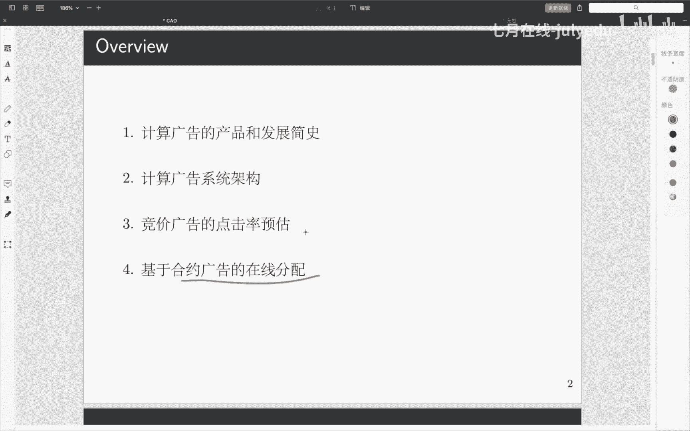

