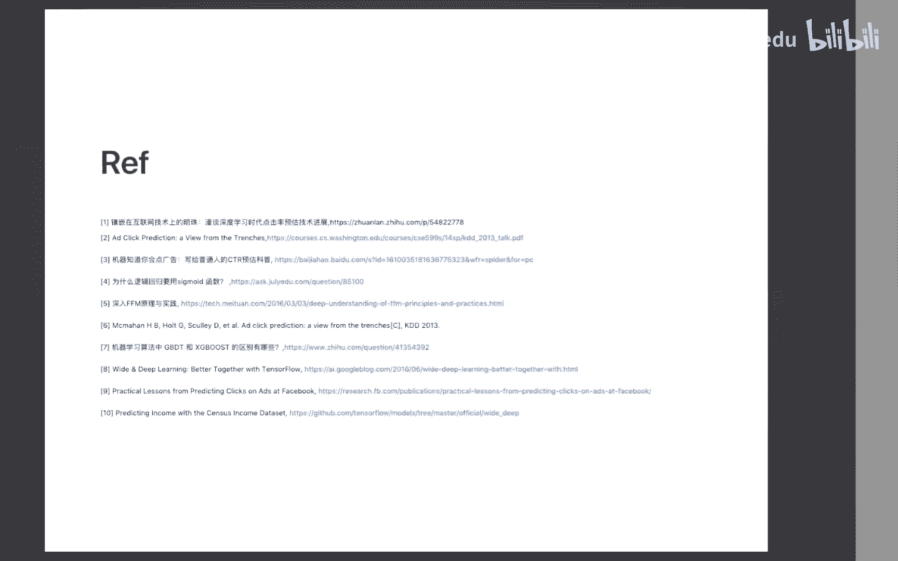

# 人工智能—计算广告公开课（七月在线出品） - P8：计算广告的核心：CTR预估 - 七月在线-julyedu - BV1SA411H7Se

好，那我们正式开始。然后这次分享的呢主要是这个CTR预估技术界景。对，好，那我们正式开始。然后这次的分享的呢主要是这个CTR预估技术介。这个分享之前呢，我又有几个点想给大家也呃来强调一下。

首先呢嗯这一次的分享呢是1个CTR预估技术的一个整体的一个阶段和梳理。但是呢在整个介绍过程中呢，我不会特别详细的去介绍一个细节的这个代码或者某一个细节的原理。因为整个这个算法比较多。

如果我去讲其中的一个一件一个这个代码或者原理的话呢，会这个这整个课程是没法把这所有的东西都ca住的。对，然后其他另一个方面呢就是说我在整个过程中呢并没有涉及这个算法背后的工程架构。那这块的话。

其实相对来说在CTR预估问题里面呢，其实是或者直整个机器学习里面都是一个非常非常非常大的一个topic。对，然后也是不包含在整个这个介绍，整个这次这个介绍这个范畴之内的对。那接下来我们就开始。

然后本次介绍呢主要其实包含以下几个几部分的内容。首先我会讲一下，就是说一个这个问题的背景。什么是CTR预估。对，接下来会讲一下CTR常见的一个应用产品和场景。

第三部分呢我会以一个机器学习经典的一个formulation来开始。来引出整个这个CTR预估的这个算法。对，第四部分呢我会详细的介绍一下常用的一些算法，以及它整个的一个发展的一个过程。第五部分呢会啊。

列举一下目前大家常用的一些工具。最后呢我会以一个经典的一个机忆学，这个C加预估的一个比赛做结束。然后这个但是这个比赛呢我会不我不会来讲这个比赛怎么做，是这个是留留给大家的一个一个练习题。对。

然后大家可以因为这是一个已经结束的比赛。大家可以去试着复现一下这个比赛的这个过程。对，看看自己能打多能得多少分。对。😊，是。好，那这节讲一下背景，什么是CTI预估。😊，那么。

CTI的全称呢是click thorough，就是叫做中文，我们它叫做点击率。这个问题呢其实一开始呢是来自于这个互联网广告。或者说在线广告。那具体的来说的话呢。

其实就是这个google搜索引擎里面的这个搜索广告。对，那就先向下面右图这个这个地方。对。然后这块呢就是你你去在无论你是去百度，然后去谷歌，你都你在搜索一些词的时候，都会出现广告。那这个广告的时候呢。

我们都要去估这个广告的这个点击率，就是这个CTR。当然不论你预估，不论你是否预估这个地方的这个。他展现了就他授给你几次，然后你点了几次，这一除的话就是这个点击率。对。那么。

我们呢这这个点击率这个问题就是为什么值得我们花一个。一个直播，然后要讲接近一个小时。其实我觉得如果想深入的去研究这个问题的话，其实一个小时都不够。对，因为呢有人把它称作镶嵌在互联网技术上的名著。

就这个技术作为机器作为整个这个大规模机器学习最典型的一个应用。它大概已经提出来到现在，从工业界的应用开始已经有接近20年了，它几乎伴随了整个搜索引擎的一个发展。整个伴随了一个互联网技术的一个发展。

那我简单的介绍一下，为什么这个技术。啊，有这么长的历史，为什么他被称作这个明著？为什么他他他他有发这么长的发展发展的这个历史？其实核心的根本原因之一呢就是这个技术的发展跟。

使用这个技术的公司的商业利益是强关联的那具体来说就是google、百度、搜索广告。嗯，我不知道大家有没有大家熟不熟悉，就是说这个搜索搜索搜搜索搜索眼擎公司的一个商业模式。大家都知道百度这个镜像排名。

那外其实。这个类似的东西。那我想讲一下这个思索广告的商业模式是这样的。大家看这个公式。差值就是这个公司的这个收入，它其实呢是等于这个PV乘以CPM我们先不看这个CPM啥PV就是这个搜索引擎的这个流量。

这个东西其实是是是是是固定的。那这个时候呢，CPM的这个。我们一般把它称作每天次展现广告的这个每天次PV的收入。那你可以把它称为一次PV也没有关系。因为我这里没有除一000。这个这个值越大。

这个公司的收入就越大。那这个值取决于什么呢？它取决于后面这个公式CTR乘以B的。你可以直接的把这个理解为这个B的，就是说。嗯，你看下面这张图，这里面有两条广告，那么它就是这下就是两个和。

CTR就是第一小广告的这个CTR乘以它的B的。😊，加上那么第二条广告的CTR乘以它是B的。对，那假设B的不变，假设两个位置的B的不变。这个时候CTR越高。是不是这个CPM就越大？😊。

对吧那怎么样找出这个CTR。高的这部分广告呢，那我们就需要CTR预估。它本质上是说我做完CTI预估之后，我用这个CTR乘以B的去排序。在很多很多的这个广告的这个候选集里面找出这个CTR乘以B的最高的。

然后呢，因为这个位置是有限的，所以这个假设是两强的话，这个值越大。那么你最终的这个CPM这个值就越高，公司的这个收入就越高。同时呢你预估的越准确，你最大化的这个后页的点击率就越高。

那这样你的remue商业上的这个收入就越高。对。所以呢。这个技术为什么能够发展这么多年的一个原因之一，就是从商业的角度来说，它跟这个搜索引擎的核心的这个商业模式是紧密关联的。后面的这个算法大家会看嗯。

😊，一些核心的一些算法，或者是一些大规模用的算法，都是一些都是googlefacebook这样的商业公司提出的对。😊，啊，B的是啥？嗯，B的其实是广告主的一个竞价。就是他大家都知道竞价排名嘛。😊。

今天排面就是说你愿意出多少钱的这个位置。对。😡，大家感兴趣这个的话，因为我这里写的这个C加乘B的相对来说是一个比较简单的这个排序的排序的这个这个逻辑。大家感兴趣的话可以去看一下什么是GSP。😊，对。

广义二就是说这个广义二级竞价就能明白，就是说这个C加2乘以B的这个这个这个东西了。对，好，那我们继续。那么刚才讲了一下，就是说CTR的这个背景。

还有它它为什么是这个被称作这个这个互联网这个技术上的一个明珠呢？接下来我们去看一下，就是CTR常见的一个应用产品和场景。最典型的场景就是广告和推荐。那么最最典型的就是百度和google的搜索广告。

大家都知道，对于百度和 Googlegle来说，搜索广告就是现金牛是它最核心的商业模式。那在这个商业在这个产品下面，商业产品下面过CTR是一个最核心的基础之一。第二个是阿里妈巴的广告。

阿里巴巴大家可能不是特别。😊，如果你不不了解互联网或者你不了解这个公司商业模式，你可能不太熟悉。就是说你在淘宝上搜索的时候，其实有些结果你看起来是商品，其实是是是广告商品。

它不是一个不是那个完全根据你的这个搜索的意图相关性来说，它就是有一些广告在里面。这里面也会用到CTR预估。那第三个大家都知道，今日头条。

就是你在那个头条APP里面那个叫信息流信息流域里面的一个核心技术之一，就是CTR。😊，C下C下C下一步电击滤一部。那么除了这三个经典场景之外，你会发现在工业界里面。C加R这个技术被大量广泛的使用。

为什么它是机器学习里面的一个最根本的问题，就是说是零域分类问题。你可以认为就是说任何的经典的灵域分类问题都可以按照CTR预估的这个思路去做。比如说CVR广告的转化率预估，比如说信用卡的这个交易。

是不是一笔诈骗交易，它就是一个是适和否？就是只要它的label是0或者1，那就是就是可以用这个CTIU的这个思路去做。好，那么在刚才讲了这个这个场产品和场景。那么接下来我们就开始讲这个详细的一些算法。

在开始这个具体的算法之前呢，我想讲一下这个机器学习的经典的一个famulation。就是怎么样来把这个旗下预估这样一个商业问题，就是你会不会点广告。这一个问题把它转化成一个机器学习问题。

并且会有提出这种算法去求解它，它其实是有一个经典的formmulation的这个过程。首先呢我们预估这个广告是不是被点击，其实是一个二分类问题。😊，那具体来看就是说你收集到的这个数据。

就是用户点点这个广告还是没点点了就是一，没点就是0，就是这个YY就是零或者1。对吧那么我大家都知道，就是说在一个继续学习一个model里面，或者一个问题里面，有了label之后，我们它得有特征，对吧？

😊，X这里我我我我我我先不说这个X是什么。对，这个X其实就是说你你你比你从数据里面抽取出来一个特征。对，好，接下来呢我们会有一个hypo。

就是一个假设我们会假设你label和X就是Y和X叫我们我们这里把这个预估的值就叫做PX。😊，和X之间存在一个哈分H这个H就是我们的算法。啊，我们各种各样的算法就是在做不同的这个hypos。

当然这个算法背后呢，它有一个参数，我在这里没有写，就是是个西塔。😊，那么我们有了数据，有了特征，有了label，有了 hypothesispo。我们就要去训练，得到一个西塔。因为不同的海per下面。

同一个的海per下面有不同的西塔的这个参数的这个值。那这个你到底选哪一个那个那个那个西塔的？😊，就是我们会有一个评估指标叫做los。训练的时候有一个loves，那这里呢作为二分类问题呢，我想问一下。

有有没有同学知道这个los是叫它的名字叫做什么？大家可以在群里看一下什么样子，就群里回答一下这个叫什么los。对，非常好。哎，这个手机用户是这个467。对对对对对对，非常好非常好。对。对。

这个直播这个形式是比较那个比较比较比较那个不是不是正式上课，大家不用那么紧张，有什么我们可以那个活跃一的吧。这样大家的这个接受会就该该听的话会非常无聊，尤其是这些全是一些技术的这种数学的问题。

听起来非常无聊。对，所以我会穿插一些。比如说题外这的方式。对对呃然后让这个这个这个这个这个这个学习课这个过程变得更轻松一些。😊，那有了lo之后呢，哎我们就可以。就可以训练这个这个H得到不同的西塔。

使这个lo最小。那这个时候呢只是修炼的过程。那我们在大家都知道，基于学习有训练集，有测试集。我们在测试集上呢，那我们当然也可以算这个los。😊，对。那这个之外呢。

其实呢对于这个二分类问题对C加预估问题呢，我们有一个offline一个很重要的指责，叫做AOC。AOC呢其实是ROC这条曲线的面积。对它是用来衡量这个排序能力。对大家对这个指标感兴趣的话可以。

自己去搜一下这个指边有大量的这种提示。那么除了这个AUC之外呢，还会有这个mapm就是是来。表示这个预估值的这个误差。EOC是用来衡量排序，然后m是用来衡量这个绝对值的误差。

那比如说那现在我们offline有一个很好的1个AOC啦。然后我说如果设计了一个新的算法，比之前这个算法AOC高m小。那这个时候呢我们要把部署的线上去，做一个AB的实验。

看一下我们这个model能不能反映到线上这个业务指标的提升。比如说在广告里面，那你的CTR。😊，你展现给用户的那个广告，他会不会有更高的这种点击率？因为只有有更高的点击率的时候。

才能带来更多的这种商业收入。😊，这是这是这是这个CTR预估这个问题。那么那么这一页我们再回顾一下，就是说它是一个我讲了一个就是说经典的一个机器学习问西的一个forulation。就是说我们有label。

有特征，有lo，有评估。对。然后呢，这个假设H接下来我们讲的所有的问题都是在讲。H不同的算算法，其实本质上是对应于不同的hypoth不同的假设。那么这些算法除了这个H之外，其他的这个Y和这个。

AOC这些都是一样的。当然特征不同的算法，这个特征是不一是你可以采用一样的特征，你可以采用不一样的特征。对，这都没有关系。好，那我们看一下这个常用的一些算法和一些发展的过程。这里呢我我列举了就是说。啊。

我觉得我基本上已经包含了这个C加预估的核心的算法。但SVM这些我就没有讲了，因为这些在工业界，你发现用的人很少，对，基本上不会有人用到的。那么这几个算法呢，其实都是在工业界大量的广泛的使用的。

无论是过去还是现在。比如说这个LR这个算法作为最经典的算法之一，用了大概我觉得有10年的这个历史。从这个2000年开200200010年开始，大家才开始哎慢慢逐渐的引入这个GBT逐逐渐的引入这个D。

然后FM这些算法才出来。这之前全是逻辑回归。对。好，那我们接下来依次看一下这个每大概整个介绍一下这个每一个算法，这第一个逻辑回归。😊，我们刚才讲了不同的算法，其实对应的这个不同的这个hypo哎。

这个H那逻辑回归的一个一个，它它这个算法相对来说比较简单直接一些。它的hypo就是说这个你这个特征X。😊，乘以这个W之后呢。它的这个我们用一个sigmoid的函数做一个变换。

这就是这个这就是这个hypothesis。对。那么我们整个这个模型的不同的模型对应于不同W这样一个参数，就是我们的西塔。那么大家很会好奇，哎，为什么逻辑回归去sigma的函数呢？对。

这是个很有问很有意思的问题。嗯，然后呢我这里列举了一个refer，在知乎上有人问过这个问题。哎，我看一下啊，这个不是知付上，应该是那个我们公司这个周里这个TAD在这个公司的有人问过这个东西。

里面有一些讨论，大家可以去看一下。如果大家想具体的知道这个就是说呃为什么要新问的话，大家可以看一下一个叫做最大自然的这个预估最大自然的一个一个一个一个top品。

它其实也是一个逻辑会率的另一个方面的一个表达。对。那么好，这是我们的这个逻辑回归，它的这个哈思就比较简单，就是说X。确定的情况下，这个Y等于一的概率是sigmoid的这个那么它Y等于0。

大然就是一减这个sigoid的。这个时候那么lo方上就是这个交叉熵。那有了这个 hypothesispothe，有了这个los，然后我们也假下我们有了数据，那么怎么样来优化这个。

这个这个模型就是选普通的这个W，使得我们这个los最小。那这个问题呢本质上其实是一个图优化问题。对，图优化就是说是又是另一个top的数优化，它里面有代表性的算法，就是说0BFGF4。然后呢。

有OWLKN那这两个呢本质上都是以这个牛动，就是这个二阶骇en症作为基础原理的。那么当然你如果这两个你可以不懂，那你SGD大家肯定懂大部分都知道随机气度下降。对，那么。

逻辑回归一开始它的整个的这个训练呢都是叫做办事了念，就是批处理学习。对，这块后面我会讲对应的一个就做艾 learning的一个概念。在训练的过程中呢，就会出现机续学习的第一个问题就是波飞行的问题。

就是这个。过你合。这个时候呢就会有两个重要的技术叫做政策化。那么L一整则和L2政则。哎，讲到这里呢，我想问一下，就是说有人有多少人了解过这个ILBFGFS。LBFGS大家听过吗？有人听过LBFGS吗？

好好好嗯，没关系。嗯，因为这个技术呢近两年已经没有人提了。近两年呢。大家提的都是这个随机梯度下降，什么这个动量就是那个at at gradient。ADMM这些算法。对哎，对对对对对，这个同学说的很好。

我这个发音不太准。对。对，但是呢如果你感兴趣的话呢，我建议你还是了解一下，就是说传统的这个优化理论。你可以不用去熟熟悉那个数学的这个原理。你可以了解一下传统的这个优化理论。

它可以帮助你认识到这个这个训练的这个过程。对，那么IBFLBFGS是一个经典的一个一个算法。除了这个之外，还有OWLQN，这是那个微软提出的一个优化算法。对。好。政则化有人了解吗？政则化。哎呀。

这研究生校同学还学过唉，好厉害。😊，你是是计计算机专业的吗？😡，我我觉得只有数值优化的课程，因为很少有人会学这个数值优化的课程，才会有这个这个问题。对。好，正在换O和乘罚系数OK。好。

OKOK明白明白明白，很好很好。😊，系。好，那我我们讲就是继续就是这个政策化呢，其实是LEL这个在后面我不会再不会再讲这个东西。因为这个整个这个LER政策是贯穿整个CTR预估的。后面无论算法怎么变。

这个LELR这个政策基本都没有变化。对。😊，好。那刚才讲就是说这是就是逻辑回归。那逻辑回归我们再看一下，就是说我们现在再回过头来看一下，就是说这个算法有什么优点，有什么缺点呢。

首先呢这个有点的这个逻辑回归的就算呢，它的可解释性很强。为啥？因为你看是W加X加一个singmon的函数，解释性非常强，对吧？W越大就说明它对这个。😊，那个对这个特征的重要性越强嘛。

对吧另外一个呢就是说它的大规模分布式实现比较容易。这因为这个这个课程里面我们有讲这个算法架构的问题。但是我想解释一下，就是说LR的这个大规模分布式实现非常容易。因为大家都知道这个梯度是很好求的。

相比于这个深度学习那种。😊，BP的一算法，这个逻辑合约这个气度是非常有委屈的对吧？😊，很多如果大家熟悉了，用公式就可以直接写出来。😊，对呀。然后呢，同时呢后面会讲它支持这种alline的更新。

就是他我们不需要就是你刚才讲是bet，后面会讲alline learning，对它是alline更新。就我每次呢只需要用最新的数据去训练它，没有必要把整个历史数据重新放进来。因为重新放进来。

算起来会非常慢。但他有个缺点就是说这个模型的这个表证能力有限。什么叫模型的表证能力有限？就是因为你的比较简单，你就是一个W乘X个线性求和加一个这个这个这个s的这个这个变换，然后就就就就就OK了。

所以它的模型的表准能力有限。😊，好，刚才我们讲了LR的这个模型的表证能力有限。😊，那我们能不能那这这时候就有人说啊，那我就沿着这个思路往下走。你不是说这个模拟表认的流线吗？我给你设计一个更复杂一点的。

😡，那我们看这个时候就有了FM和FFM这两个算法。那么FM它其实本质上就干了一件事情。我假设特征和特征之间。是有是有关系的。我有了你你不是一个XI和XG，你单独有一个权重嘛？那这两个东西放在一起的时候。

权重是多少？😡，会不会有权虫？所以呢它在这个公式的后面呢，大家可以看一下，它加了1个VI乘以VG。来表证这个XI和XJIJ的这个特征组合共线性共献共献的情况下，这个这个情况是什么样的？就这个VI和VG。

在这基础之上呢，哎有人觉得还不够，你只能表证这个XI和XG啊还不够。那我们再起一个更高阶的，我引入一个fa的概念。就说。XI呢它其实属于某一个特征的一个field。这个field你可以理解为。这个。

比如说我们有一个特征是这个搜索引擎广搜索搜索搜索广告里面，它是那个query，用户说的中键键词，关键词有很多个啊，你你搜这个T月在线是一个T月是一个。但是呢这两个呢都属于一个fil。

都属于这个query。它就引入了这个que field这个概念，就相当于你我这个特征呢，对于这个不同的fed，我都有一个响量。这样的话呢，这两个相乘呢就能表示更高级的这个呃特征组合。对。

那这个hypoH呢就比这个逻辑回归的这个hypo更更近了一步。就是它假设呢。这个FM的引入这个特征组合的这个问题。然后FFM呢在这个基础上有了field的概念，让这个特程组合做的更。😊。

更这个更更更深一层更深一层。大家如果想了解这两个算法的这个这个细节的话呢，你开龙的话可能比较比较辛苦，比较累。大家可以看一下，就是说这个深入FM原理与实践。

这个呢是美团的一个技术团队写的一个一个blog，这个blog写的非常好？他他解释了几个特别重要的点，比如说为什么有FM和FM和FM的区别在哪里？然后它的运算量是在哪里？对，为什么是这样。😊，OK好好好。

有同学提到了FTRL，待会儿后面会讲FTRL。😊，对，好，就讲到这个FTR了。😊，刚才呢我们讲了这个LR讲了AR的一个升级版FM又讲了一个FM的这个升级升级版，就是这个FFM。对，但是这两个算法呢。

我们之前讲过，就是说它都属于一种半尺了你的一个算法。或者说我之前讲的就是这个训练的过程呢，都是半扯了你的一个算法。判学热件呢有一个问题，就是说它系统无法进行增量的学习。什么叫无法经行增量的区势？

就是说你必须使用所有可用的数据进行训练。这种情况下呢就需要大量的这个时间和计算资源。所以通常情形下呢就是离线完成的。啥叫办随着你？就是假如。你要训练一个搜索广告里面的一个机学习的模型。

然后你今天就要把昨天假如设我用一个月的时间创来训练，那我就要把昨天到一个月之前，所有的数据都拿来训练。明天的时候呢，我得把今天的数据包含进来，就是31天。😊，所训练是要拜事了。

你那这样你每训练一次的这个运你的数据会越来越多，并且这个训练的用用的数据特别大，那你好计算起来就非常慢，所以都要理解完成。😊，这时候大家就想我有必要每一次都把历史数据拿来重新训练一遍吗？我能不能。

明天的时候，我把今天的这个。模型加上。作为一个初始化，再加上一小部分数据，就今天的这种小量的数据来学习。😊，能得到一个模型。那这个时候就是alline learningning的问题。

就是它可以循序渐进的给系统提供训练数据，逐步积累学习的成果。这种提供数据的方式可以是单独的，也可以是小批量的小数数据来进行训练，每一步学习都很快，并且呢便宜。所以系统可以根据飞速写作的最新数据进行学习。

对，好，我不知道大家有我刚才讲一下，大家能不能有没有这个get到这个batch learningning和阿 learning的这个区别。😊，如果如果大家没有get到这个半查拉业的区别的话。

可以在群里说一下啊，我可以再再详细的解释一下，或者大家对这个问题有什么，就这两个这个算这这个这两概念有什么有什么问题吗？😊，OK我看有人说没有。好，那就那就我默认大家都都知道什么是半生。你好，来了。😊。

好。😊，那我们再进一步，那到底这个阿来呢女？是啥？具体是什么样的？首先我们我刚才讲了，就是online learning它每次呢只是用比最近的数据训练。这个时候很自然的一个想法。

就是说online learning是不是能够得到全局最优解。😊，我怎么保证它比这个它是是不是比这个半成业的这个效果好？😡，这个时候呢我们就提到一个。reggress概念。这我觉得是啥呢？就是说。😊。

你看啊这里面有WT，这是W。我们假设右侧的这个值这个减法的这个这个右侧的这个它是我假设这这个这个T是T龙嘛。假设我我把这个把拉等性分成TTTTT的这个T垄来进行，就相当于时间大就假设你就T个小时。

我一个小时有1个WT。😊，那这个是说我我假设我我有一个上帝视角，我一下就知道7小时之后的数据了。这个时候的一个一个一个这个。😊，这个结果。对。那么。我假设右侧这个是los。

就说这个这个是最小的一个los。我说一个一个。那么。这两个之间的差呢就是我们的reg。其当于是说。那很衡量的是啥呢？衡难说我用这个WT的时候，跟我用W的时候，那我这个假设是W是理想解。

WT是我这个啊安装性这个解，它这的这个差异有差异有多大。😊，可像这个东西。那么这个东西呢，我们可以通过理论证明。这个regret呢其实是O根号T的。就是它不会随着这个时间变大。这个regt。谢谢增长。

他其实是一个这个。根号T的一个增长。那就说明就是说随着时间的这个累积呢，这个regret不会无限制的变大，就它会它变化的它的这个差距是可以控制住的。对，那具体大家想知道就是说这个东西怎么推导啊。😊。

怎么做的话，大家可以看一下，就是说。这个华盛顿大学专门对这个 online learning有一个topic，一个课程，专门讲这个 online learning。对。

因为阿拉罗尼其实是一个它跟那个多比赌博机啊，跟消化学机其实都有时候都有点关系。是一个很复杂的一个topic，就这个公式怎么推怎么优化。为什么要要要这么做？其实是有一系列这个这个这个数学与原理在里面。

大家感兴趣的话可以去去去看一下这个课程。对这个课程大概有十几节吧。对。😊，那具体到这个算法上的那这个图就是这这个因为这个FTR它其实是可以求解这个逻辑回归，也可以求解这个。😊，FM的。对。

那它这个公式其实就是说你看他每一次的这个WT呢，每一次都要更新一次。对，在更新的时候，这个这个算法就解释一下我怎么更新这个W，然后怎么更新这个七度，这就是FTR。😊，对。

这个这个算法细节我在这里就比较真，感兴趣的可以去去去看。😊，好，这块有什么问题吗？😊，好，那我继续。对，因为这个这个FTR其实我没有详细的展开来讲。我这里只讲了。

就是说首先这个FTR是可以相对来说能够比较保证一个全局最优解。并且呢大家可以详细的这个数据原理可以去看这个这个课程就可以了。😊，嗯，能不能再描述一下regt？嗯，好。嗯。你大家你我们这个同学。

你可以看一下这个公式的这个右侧这个W跟这个左侧这个WT有什么差别？你可以认为就是说我们假设有一个上帝视角，我们知道明天结束之后的数据是什么。这个时候呢我们训练出来这个模型，这个W就是右侧的这个值。

这个WT呢是说我不知道明天结束之后，这个W这个数据是多少，我只是每一步。都有一个W，那我有因为T假设我有7个小时，那我W1W2W3WT。这个时候呢我们会算出一个，比如说一个los或者一个。😊。

一个一个这个这个这个指标。那么这两个之间的这个差异呢，我们就就叫做reg。我不知道这个。这个差异肯定是越小越好。😡，对吧越小就代表你这个WT总体来看，你是接近于逼近于这个对。😊，就是首先这个气呢。

就是我们说它是一个alline learning的一个算法。这个T呢是假设我们假设有T个小时，当然这个力度可能是T分钟，也可能是这个。这个寄个样本。对吧那么假设我现在从现在这个时间点开始，到明天。

我每每个小时都有一个W，都相当于都有一个模型，要要要要作用在线上。对吧那这个时候我我们怎么样更新这个。这个WT这个I是因为不同的特征，有一个不同的权重嘛。

那这个根据的这个算法就是这个W这个公式的这个求解。就是他你按照这个公式去去去更新这个WT就行了。在更新这个WT的时候呢，你要算几个值，这个GT这gradate这个我相信大部分人都能理解，对吧？

这个跟这个普通的这个逻辑回归是一模一样的。这里呢有一个这个。这个西塔有一个Z有一个N，那这几个公式呢都是用那个它是为了解决，就是说在这个算法里面，为了解决这个regret更小正则化来引入的。

所以你可以认为这个公式其实就分两步，第一步更新这个W。那更新的就是用这个。这个这个I和这个这个这个这个这个NI和ZI和lam的I去更新的那这个值是怎么来的呢？是因为你在T时刻看到了一个数据。

就是labelYT。然后你先算这个GI这个你用别的方式算是一模一样的，然后再依次算这几个公式就行了。😊，对呃，regret跟右边的流程是什么关系？OK就是右边呢是FTRL这个算法的一个大体的一个流程。

那么regret呢是说。是为了解释为什么这个算法能够得到全局最优级。它是一个数学上的一个理论保证。就是他通过这样一个指标来证明这个这个。数学的证明是在这个这个这个课程里面，就我我这里没有解这个数学的。

因为数学证明非常复杂。你可以认为就是说这个算法可以保证这个regre趋近于欧根号T。😊，就是它不会随着时间线性增加。😊，我不知道我有没有讲明白这个。

可能可能大大家都没有没有没有之前没有接触过这个regrease这个概念。啊，那我继续对，这里可能可能就是说因为大家没有接触过这个re的概念，然后我的表达可能。大家不是容易，就是说不是容易清斜。

然后感大家感兴趣话，下面可以看一下这个这个课程，它里面有更详细的这个数学的这个解释。对。😊，好，那我们刚才讲了这个这个这个。😊，这个这个ARFM和FM，然后同时呢又引入这个FTR就在线学习的这个算法。

对，这是这是一趴，就是说这一这一趴呢都是这个你可以认为叫做蝌，就是叫做那个。或者广义下这模型，对，都是以sigma的函数这一套的这个模型。除了这之外呢，哎有另一个part呢。

就是所谓的我们经常看到这个数模型。😊，就是最具体的一擎代表性的就是这个GBT。😊，它是一个它是数模型加ensexble就是说相当于集成学习。就是说我这个。我我用多棵树来来来来来学这个模型。啊，具体来说。

你看大家看右边这个图，就是说我第一棵树我学一个模型啊，第二棵树我也学一个模型，然后两棵树做一个，比如说做一个什么加权求和。😊，然后来到一个结果。当然了，GBDT呢，它其实是这个asseemble的时候。

它不是直接说的这个过程，它是用上一棵数。算错的那一部分，在第二棵树就会被分裂的更好。所以它是一个它相当于是用多个弱分类器放在一起。然后每个人每个分类器，然后开不出一点点这个信息。

然后大家放在一起的效果更好。😊，那当然了，就是叉级bos，大家可能平时听的不是对个GPT大家听的比较少，听的都是叉级bos。那叉级bos呢是GBTG的一种工程实现。😊，当然在实现的过程中。

它其实是有一些区别的那至于这个区别呢，其实大家可以上网搜一下，有大量的这个资料来解释这个区别。这里我不再详细的介绍的。哎，好，那GPTT模型呢，它有个优点。

就是说它采用的是大部分它它也可以使用一个离离散值特征。那大部分情外呢，它对连续值特征做的比较好。那为什么说连续值特征是这个是个优点呢？是因为我们在做这个模型的时候呢，很多业务场景。

很多真实的这个这个这个产品或这个场景里面很多特征都是连续值特征。😊，对，第二个呢是它这个模型相对来说比较笼鲁比较这个鲁棒，就是他对数据的这个这个时效性要求不是那么高。对。

当然就是说它的就是它那个数的那个结构呢，它可以更新的比较慢一。它不像逻辑回归，逻辑回归，基本上要求是你二来更新。但是GPT其实它这个数的这个结构呢，它其实一周更新一直都没有问题。对。😊，嗯。

但是呢它也有一个缺点，就是说但是这个就是除了这个鲁棒之外，他就说你的参数要设计的合理。如果不合理的话，其容易过你河。😊，嗯，它的优点呢是，它的数据量较少的时候，效果比I和FM好。😊，啊数据多了之后。

它其实就算不动了。就它的缺点呢就是说数的这个结构呢无法做这个额外的更新。😊，然后超大规模的分布式实现比较困难。对，但我说这个大家可能会想说我人家博士上差级不分有分布式的。😊。

对它一部的分布式确实是分布式的。但是呢这个分布式呢比起逻辑回归和FM那种超大规模的分布式呢，还是有很大的差距的。😊，对。做的是分类问题，我们讲的都是分类问题。😊，当然就是那个GBT是可以做回归问题的对。

好，刚才呢讲的都是一个model哎IIFM然后这个X级 boost这个GPT但GPT你可以认为是这个也可以认为是这个多个模型。那其实你可以我我暂时把它分成一个模型。这页开始呢。😊。

我们的这个算法的这个名字呢都是什么和什么什么加什么，为啥是因为它整合了不同的这个hypothe，不是不同的这个算法。最具代表性的之一呢就是说wide deep。首先我问一下有没有人之前听过这个算法。

弯 deep有没有人听过？CTR是分类问题，😊，是分裂问题。啊，deepFMOO问这问题。😊，嗯嗯嗯嗯嗯。okKd FM是那个挖d的升级版。对。OK好。好。那么在很长一段时间之内呢。

其实逻辑回归统治了整个工业界的CTR果茶几呢其实大家都知道他其实在开go的比赛里面有的比。但实际在在百度和在因为我在这个BAT的这头待过那其实都没有用茶几或者都是很小的候。

大大部分都是那个我带过都是都是逻辑回归。其实你看google他发表的这个论文都是这个FTR都是在逻辑回归之上做的。对，这个时候呢哎因为google是整个这个这个行业的标杆嘛。

他很长一段时间他都研究的是这个逻辑回归。😊，当然了，后面的开始呢就是随着这个20112年开始，这个深度学习开始。在整个这个工业界开始展现出它的这个实力之后呢。

那么大家都在研究这个深度学习怎么做这个CTR预估。这个呢我知道国内的不同公司百度有自己的方案，然后搜狗有自己的方案。对，那这些方案呢都没有公布。

这个时候呢很多人都很多其他的公司做一些小的尝试都都不是很好。直到有一天，谷姑发表了这些paper完的 deep论。😊，这边路。It最要。相当于就是说让你在黑暗之中给你一个光明一样。

就像当年google发表这个FTRL这个拍per一样，大家可以看那个课程，就是就是在线学习研究了好久啊，工艺机也有好久。google这个FTR这个一出除了这个算法之外，激之起来其实有很多算法。

什么phos啊之类的，有很多算法。对google这个一出就。直接就统治这个工业级，这个挖的地也是一样的，就这个这个peop出来之后，落出来之后就出现了这个群里这个同学说的什么depFM。一系列的。这算。

好，那Y的D learning它其实。是到底是个什么样的个这个算法？你看名字wideide deep两部分很简单。

下面这个图wide就是逻辑回归deep就是deep learning加起来就叫wide deep model是不是很简单？😊，看起来很简单，但是呢。为什么要这么设计呢？为什么要这么设计？好，我问一下。

有没有人直接看我，有没有想过为什么要这么设计？哈哈这个人说跟我认识是吧？啊，那你肯定跟我认识，说说不定我们真的认识，对对对。😊，然后那个。组合特征嗯，对。这是这是一个解释，高低阶也是一个解释。对。好。

这个同学，你搜一下那个华盛顿大学on learning就可以了，基本上能搜到这个这个我说的这个topic，就是这个这个这个链接，我这往出考的时候有点问题，考不到。对。好，刚才有同学说什么组合特征高阶。

什么低阶的啊，我这个时候呢我要小小的。😊，嗯，批评一下这个大家都没有看过论文。大家没有详细看过这块paper。那我再问一下，有没有人看过这个论文的作者讲这个论文。😡。

这个论这个论文的作者有一个视频来讲这个论文，讲他的这个算法，有没有人看过？好好，那么我觉得你可以回去看一下视频，我可以大概给你介绍一下，你可以回去再看一下视频。对。好，那我们继续。这个算法为什么牛逼呢？

他其实核心回答了两个问题。一个叫做memorization，一个叫做geneization。就是所谓的记忆性和泛化性，就是做过这个。实际做过业务的人都知道。机学性模型有一个不好的点。

就是它对新的这个广告，对新的这个推荐的这个。😊，这个数据的预估其实很差的。就是他估的不那么准，因为他因为为啥，因为这个网没有展现过。😡，因为大大量的这种理散的这种ID类特征，他没有展现过。

他就学不到特征。好，这个时候呢google这个算法就说了，他说其实呢这个Y的部分，这个逻辑回归部分，它其实做的是一个memorization，因为它是大量的这种离散特征。

尤其是大量的这种IT类特征和记忆性。就它能够记住那些展现了很多次的这种广告这种样本，它的这个点击率是多少，权重是多少。😊，dep部分呢它是做genization，因为它的特征呢大部分都是那种。

叫做非ID类特征泛化性特征。比如说。query的这个贴词。这个信息流的这个内容的这个标题的这个贴词，它不会用标题的这个全文去做。因为全文是一个memberizationlation。

它有ID那其实它有有贴词之后就整个elelation泛华性。😊，这两个问题这个当然我觉得这个从我角度这个这个这个论文这个作者提出这个memorization generalization。😊。

有点把这个问题搞得有点。你可以换一个角度，有点类似于exloore和exloit。现在于就是说memorization就是你过去的东西嘛。😡，那么这就是新的东西，新的东西就是expl嘛。对。😊，好。

这个时候呢大家看一下右边这张图。他就验证了，就是这个东西的重要性。因为它这个Y的部分的这个AOC呢是0。726，但是上了D之后呢，它的AC反而降了。但是线上onlineac game它涨了2。9%。

为什么呢？因为geneization在离线的数据上是不好评估的。因为你现在你现在这个评估数据都是展现过的。就展现过的那些广告。那么诊le必须是说在候选集里面找出那些。😊。

之前没有被展现过的广告来做这个才能才能才能才能才能把这个模拟这个效果才能找出来。那么用Y在d之后呢。当然这个UC其实是比Y的高了一些，但是它这个这个这个在线的这个提高呢更更多。

所以说呢哎大家看这个论文呢，其实要核心的要关注这个这个算法。这个本身，它其实就是说一个memorization和 generalization的问题。至于这个本身这个架构呢。

其实相对来说是比较比较直接比较简单的，没有多少复杂的东西在里面。就左边一个w model的一个地方，但是它背后的思想是很重要的，并且它这个实验结果也是也是也是很很。😊，按照他的用的这个说也是很s的。

就是他这个AOC其实没有涨，但是它这个概涨，那是因为它实现了这个更多的这种诊断的人是。对泛黄性。对。O为什么生深度在新数据的表现好？嗯。

你可以认为就是说深度模型它采用的它其实它它的这个它这些维度这个特征呢，它其实相当于是一个泛化性的特征。就是比如说呃你之前展现的那些广告的，你这个外的部分呢用的都是这个IT特征。

但是呢这个d补部呢可以用一些，比如说。这个广告的这个。我一直我之前一直也没懂着我这具体是这什么。嗯，这个有点那个我有点那个嗯怎么说呢？有点training和那个t的感觉。对。就相当于就是说。😊。

那个没不。是的，是神经网络。对多层改变级MRP。对，最简单的都是这接。对。呃，因为你不懂这个mem。对对对对对对，好，你看一下那个视频就明白了。大家看一下这个视频，大家去看一下。

去去youtube上看一下，看一下那个视频，就知道什么是解释是什么是那个。😊，memorization和generalization这里我可能我我这么说，因为我没有这个没有这个例子。

就是youtu那个视频上那个它有个例子。😊，呃，地址你直接在youtube上搜，你直接去那个google里面搜那个搜就有搜这个wad。它有googleAI那它有一个blog。

里面就有这个小有一些里有那个视频。😊，低维稠密特征和高维稀数特征。对你说的也对，但这个你说的这个只是一个结果，本质上其实是memorization和 generalization的问题。对。对。

大家可以搜一下那个视频，就是搜一下这个作者讲这个洛文的一个视频。对。好，这节就过来。嗯，看这个群里还是有很多同学还是看过这个的，但是可能大家还是没有没有仔细的研究过这个经典的这个论文。

因为是视频要看一下这个人的这个作者，他这个中国人讲的非常好。其实大家可以去看一下。好，刚才讲了这个它其实是一个两阶的一个部。那其实呢除了这个之外呢。

还有一个这个这个这个算法就是GB加LR这个我相信很多人都听过这是facebook的。😊，2014年发发表的一个。罗。这个呢其实解决了一个什么样的问题，为什么要这么做？为什么我要先要用GPT器。

后面再挂一个LR呢？😊，其实呢核心点呢是解决特征工程的问题。就逻辑回归里面呢，我们要做大量的特征工程。这个时候就会遇到哎，连续变量贴分解怎么选，你这延续值变量，我怎么做贴分？当家同学说我做log个变换。

我做这个等长变换。😊，这些都是数学上的考法。😡，一定是最优的吗？😡，有没有算法模型能找出这个最由的？对吧理散化怎么搞？选择哪些特征做交叉？😊，然后到底是二阶还是三阶还是更多？这有很多人搞法，对吧？

你手动搞不就累死了吗？😊，这个时候。那个。那个这个。facebook说，那不用手头搞，我们设计1个GBTT因为GBT数模型，它其实它表证的这个这个这个。😊，这个切无论是做这个变量的这个切缝。

它就是左右切缝，还是做离散化，还是做特征交叉，其实都是能能够表证很多这种高位的这种情况的。😊，那我先用这个模型，先用这个train的 model头学一下，学完之后这个叶子节点。

相当于做了一次那个特征组合，然后再灌到1个LR里面。这样一个节thaning的这个model。对，然后来来解决这个问题。对。具体的这个算法大家可以可可以去看那个face world。

但这个东西在实际的工业界其实做的用的并不多，因为。😊，就这两阶两阶段的一个模型对工程架构来说要求比较高。你得先训练1个GPT，然后再搞1个LR。😊，你在线光预估都要做两次，那时耗时就会翻两倍吧。对吧。

对。好。刚才呢。讲了一下这个。常用的一些算法，大家看一下还有什么问题。GPG加L这个在比赛中用用的多吧，大家看开播比赛大部分都是。😊，GBG的切线吗？不是不是是叉几步子的切线吗？😊，对。

这个为什么差级开个比赛，超级比色的欠下？所以我之前刚开始讲的，就train model对那个数据量要求比较少小数据。对，因为比赛的数据一般不会特别大，不像工业键。😊，算法优化去常用FTIL还是dm。嗯。

你训练深度学习的话，用的肯定是有dm。然后你训练逻辑回归的话，肯定用的是FTR。😊，对。比如上面的对lighttGBM对对对，GBM现在来越来越来越多了。对对对对。

lighttGBM反正就是因为因为先出了X几bo嘛，GBM是后面说的出来之后，大家都跑过但求现在性能比那个叉几要要要好一些。因为我自己用的一开始用的都是叉几对。😊。

比如上面的GBTCRR连续和理散和连续到底是怎么分才合理？哦，这个问题啊，这个问题就是这个算法解决的，就是这个因为你你靠无论你靠这个靠这个什么log分筒还是这个等长风筒，还是你自己发明一个函数分筒。

这样都是一个数学上的一个搞法，只有用GBTT去学一下数的结构就是分筒的结构，我不知道我有没有回答出这个的这个这个例子，你明白我的意思了吧？比如说你这个值是从0到100，你自己分你说你说我0到10分以下。

10到20分以下。那GBTT跟model这个tra学出这个结构是是什么，就是什么。😊，这着这个结构学出来的这个。比如说他这个叶子叶绩这个一个节点，这个切缝点贴到哪里就是哪里。😊，嗯，我也想问。

之前有篇论文讲特征embedding也是没怎么看懂连旭和李s。特征画风。哦，连续和离散，你可以这么认为就是。😊，嗯，maxine scale哦，ok ok ok其实是这样的，理论上来说。

所有的特人都会做one hot。但是实际中。😊，稍等一下，我先回答这个问题啊。实际上就是说汪浩呢指的是那些。😊，没有大小关系的特征，我们怕也可以最直接就做王浩的特征。

比如说你看这个word word word vector里面那个汉语的那个词，就是那个那个语言的那个词语言词之间，你你是没有这个这个大小关系的那肯定是王浩以口ing，你连续编完你怎么编？但是像这个。😊。

老对对对，老师可以讲讲背原理嘛。嗯，原理啊，这个我一时半会这个不是有一两句话能说清楚的对对你可以去详细的看一下word to的那个那个设计一些文档。

这个我不是一两句能说清楚的对然后浩的还是max skill就还是回到那个问题，就是说到底是用的就还是看那个特征的那个本身它是不是能大小可比的，我不能大小可比，只能做号的。你强制max没有意义。😊。

比如说人的名字。对吧对吧这这群里面有好几个人，你这个名字你怎么做那个。😡，这个max mean scale对吧？但是说这个群里面每个人都有一个。😊，都有一个那个。

年龄你说这年龄肯定可以做那个mac swimminging scale对吧？😊，对，好。特征比赛特征工程和技巧。嗯。他是为了技巧的。这个我会在最后一个这个比，就是这个PPC最后面我会讲一下。😊。

大家可以去看一下那个就是负这工程没有，你可以认为就是说我说出来的技巧都不是技巧。所有的技巧都在于你练习的过程。对。你只有你亲身实际过的练习过的技巧才叫技巧，就是那些武功的独门秘技，都是是靠练习的。

不是靠说的，说的都是个纲练性的东西。对你自己你你看着那个书，你学完之后，对那些解题的那些技巧。你看你看着那个技巧的书，你看完之后，你那个那所文说的都不叫什么技巧，对不对？

那都是一些总结是大家都每个人都会的对，分这过程呢就是你要去练习。😊，对，但练习是有一些，你可以看一下，就是说别人会有一些总结，但些总结都是抽象化之后的。😊，对对对对。好，那我继续常用工具。呃。

首先呢lib本LRFMFM其实是一套一套算法，很多工具都是通用的。最简单的这个lib linear，这是单机版的。😊，对，然后sk里面呢有这个LBFGS和SGD的实现SGD这个比较简单。

airBBFGS大家。感兴趣的话可以去看一下spark里面的一个视线。😊，Mlib里面有实现。然后。对，立白FM这个是这个FM和FM的一个事情。因为。FM是FFM的一个特殊的一个一个形式。

通过给个参数就行。对。等我。接下一个分布式的实间，这个这个大家这个都知道这个呃DMLC就是。😊，陈千奇这户人啊，他们有一个这个基于pyit server的一个实现，里面有一个分布式的实现，实现了这个。

这些上面说的这些算法对吧？那么叉级bos这个群里也有很多同学都说过了，这个这个这个这个这个GPT的群里有很多同学说叉级不s这不就说了对。那么最后面呢这一页呢，我相信很多人都感兴趣，就是w了 deep。

这个呢有tenflow有一个教程，大家可以去看照着怎么做。然后呢，我不知道我问一下有多少人知道google collapsellab这个东西。😊，有人知道波补克烂吗？😡，知道okK好，不知道的同学哎。

对对，非常好非常好。对对，免费的。😊，啊，这个autoautoM2其实有点那个啥。对对，主要是就是它是免费的一个周by的 book。😊，对，好，那么大家知道这个就好办了。te测服务的一些教程啊。😊。

都是可以在googlec上直接跑的，里面连数据都给你准备好了，你跑一遍就能就知道了，就可以把这个算法把这个工具用起来。😊，那么刚才我说了。😊，除了6个拉的蒂普之外呢，有一个有一系列的什么depFFM。

😊，什么哎呀这名族都太多了，我因为这些我都没我都没用过。说句实话，我只跑过外的地，其他的太多了，这都是学术界的这些人搞的这些。但然有一些工业基点上写了一个灌水的论文。

包括这个阿里的这个什么定dep networkwork好，这个时候呢哎就有个哥们比较牛逼了。他搞了一个hub他把都实现了一遍。😊，叫做depCTR。把这些都实现了一遍。

你感兴趣的同学呢可以去把这些算法都跑一下，看看。但我觉得没有必要，大家还是把核心的几个点跑出来就行了。但然如果你想看一下fancy的各个，就是怎么把这个东西搞得很很酷，很fancy。😊。

然后当然它每一个翻译都是有一些点的，都是都是有原因的。可以看一下不同的人的想法，对这个问题这个能做。然后一些那由由此可见，这个论文这个这个这个这个这个问题有多火。你看这论文啊从16年到现在一直在发啊对。

😊，对对。好，这也有问题吗？啊，不需要用GPU用CPU就可以了。好，刚才有人说了，说我这个。😊，说这个我讲了这么多理论，那那怎么实践呢？对吧？刚才还有同学问了说这个他的问课技巧是啥？😊。

说这个我只讲了这个问题，没有讲答案。好，那这个时候呢我讲一个东西叫做经典比赛。好，有人知道这个比赛的人知道吧？有人有多少人知道这个比赛avs这个就CTI预估的这个比赛，有人知道吗？😊，好。

拉地就是在泰斯福的官网上嘛，之前在在现在被，但是那个我这里有链接，其实官网上我最近我今天刚看了一下，他那个官网上那个干掉了，对对对。😊，官网那个链接没了，但是在那个gethhb上有链接。对。

这个比赛练过非常好。对对对对，好，那这个同学你你你你列这个比赛的时候，你你你你特征工程是怎么做的？😊，你自己做的还是你有些参考，你看过冠军的解题方案吗？😡，这不是真的这个同学，你看过冠军的解题方案吗？

参考其他hub上的。OK好。啊，是的是的。对，这是因为他是4年前的，所以历经考验到现在为止，我认为是。他的这个获胜算法是力白FM。对。那个时候呢没有这种fy的这种各种d谱这种技技巧。

核心就是看你对这个问题的理解，特征工程做的怎么样。就回应着刚才这个同学问的说，这个特征工程技巧在哪里？这个比赛呢。😊，啊，大家去得这个gthhub里面。大家现在能看到我我页面上这个这个PPT嘛。

投到了一个是不是我讲的PPT，是这个这个这个这个这个比赛的这个结果的这个PPT大家能看到吗？😊，大家看一下这个side。对我本来想让大家自己去发现这个sdes。😊，那只能我来把这个star发出来。

就这个PPT。呃，不用大家不用看我的屏幕了，我把这个链接已经发到这个群里面了。😊，对。好，那我们继续讲这个比赛呢是对CTR遇估这个问题非常好的一个练习期。😊，就是我我觉得因为为什么他说是个非常好的电器。

因为他太贴近。😊，真实的互联网业务的这个广告了，广告场景来，包括数据特征都是一样的。跟我跟我做过的这个广告系统的特征基本都是一样的。为啥呢？因为L是一个D，应该我没有计算，就它就是一个广告公司。😊。

对他发布的这个数据。而且数据的质量很高。对。对。哦，这不是真的，你你你那个应该不是人家的那个官方的那个那个吉thhub，你要找官方的那个githhub。😊。

官方的个吉他话就是这个这个什么EYC卷这个歌们，这个哥们应该是他的作者之一。😊，对。OO好，对对对，就这个这只。😊，好好好，就是我我这个这个这个这个其他门它其实有很多这个这个这个东西。

但是我核心发的就是我发这个链接。这个链接是个冠军的这个作者写的，它这里面披露了大量的这个特征工程技巧。😊，但这个东西你你具体怎么做，你还是得靠实践。😊，就他写的只是一些就是这于特征过程，他只是。😊。

就你看到代码，你永远不知道他是怎么做的，或者你也想不清楚他为啥这么做。但是他既他这个PPT里面详细的介绍了介绍了他几个那个思考的方向。😊，对对，然后呢大家可以去，我觉得我建议大家呢先用这个libFM。

然后把这个算法把这个冠军的这个PPT里面的一些点复现一遍。😊，如果有些地方你看不懂的话。对你可以你可以你可以你可以，我不知道这个我们这个这个视频结束之后，有没有这个有没有这个这个这个这个这个这个什么。

She。有没有这个这个这个这个讨论组或者T阅在线，有没有讨论讨论组里面，你可以问我到时候看到我会回答，就是具体怎么做。你把这个关点的这个比赛解法敷现一遍，你能做到给他效果一模一样。我告诉你就牛逼了。

就你你但是你不能用别的算法，你就用人家的这个算法加这个数据，把那个特征的那个部分敷现一遍，能做到跟他一样的效果。😊，对，那你就知道了特征工生的技巧。就是刚才这个这个群里面这个这个同学问的。

说我不回答问题，然后说这个。没有问这个特征工程技巧。对你你把这个做一遍，你就会了。如果你还不会的话，你做的过程遇到问题的话，你可以在如果我们这个课程还有这个群的话，你可以问我，我可以告诉你。对。

但是呢如果我直接给你说的话，你你还是不懂。因为你之做完之后你遇到问题之后，在这些这些特别细节的东西你才能懂。对好，除了这个之外呢，你还可以尝试一下GBTGBTT再尝试一下地。😊，看看这些不同。

因为这个比赛刚才在群里面的同学说了，这个比赛做的时候还没有这些算法呢，没有GPT有了，但这个生度学期这一套还没有。😊，那你可以用生度学习这一套再玩一遍。

看看你看看你在几年之后能不能把人家那个冠军那个算法能够再。😊，beter过。如果你能be得过，那恭喜你。对，这是一个这个这个过程对你来说，我相信对你。😊，呃，这个比赛相也算是这个视频的一个一个课后题吧。

对对你理解这个问题，对你理解这些工具，理解这些算法，对特征工程都有非常好的帮助。对。好，最后呢有一些这个reference。对。就我讲的时候有些reference，然后。嗯。

这个这个视频过段时间会录播录播的时候，大家就可以看一下这个refer。然后的话这些东西在互联网上都能找到的。对对对，然后我我我不造笼子，我这个人不造笼子，我用的都是一些现成的一些一些参考资料。对。

保证大家就是说都能都能够在课后去去去学习。😊，行，好，我这边就讲完了，大看有什么问题。😊，啊，PPT这个PPT我不知道。老师会讲到这两天腾学宝宝大赛吗？😊，She。其实腾讯这广告大赛年年都有，我靠。😊。

Yes。但是我我今年呢我还没有来得及看。😊，之前也是搞CTIE，我觉得差不多。😊，对，主要还是特征工程。你。对。对，PPT能分享一下吗？这个PPT我不知道能不能分享。对，大家其实分享PPT没有意义。

大家还是看视频吧。我觉得这个这个这个。😊，这公司会把这个视频过段时间会会做给大家。常用到的模型有哪些呢？长的模型其实最经典的是逻辑回归。大数据是逻辑回归。FM。小数据呢。是。小数据。小数据是。

GBD叉级bo。深度学习。生度学习。说句实话。深度学习。我我我这个就是深字学习成本很高，百度在用。我说句实话，百度在用。😊，呃，这个生物学期你一般人搞不定。对。阿里应该也在用，但是成本成本代价都很高。

😊，可以用推荐系统的简历找广告笑的工作吗？没问题。第一份工作去大厂好还是初创好，必须去大厂，毫无疑问。对，除非你是大神，你去初创公司拿期权，拿创始做创始人。对。😊，大这是个人建议啊。

我下面这些都是个人建议啊，对对对，不然有人会喷我的对对对？😊，那如果你确实想去想去初创公司，那也可以，不然的话，我怕我影响了你成为下一个那个财务自由的人，就尴尬了。好，时间到了，谢谢大家。对，谢谢大家。

那个那个后面还是希望大家多继续关注这个。😊，这个这个我们公司的这个这个直播，还有一些课程。

