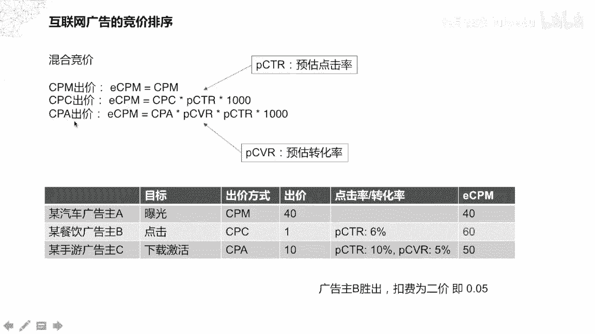
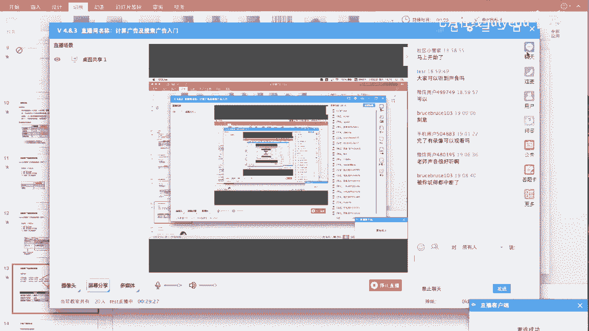
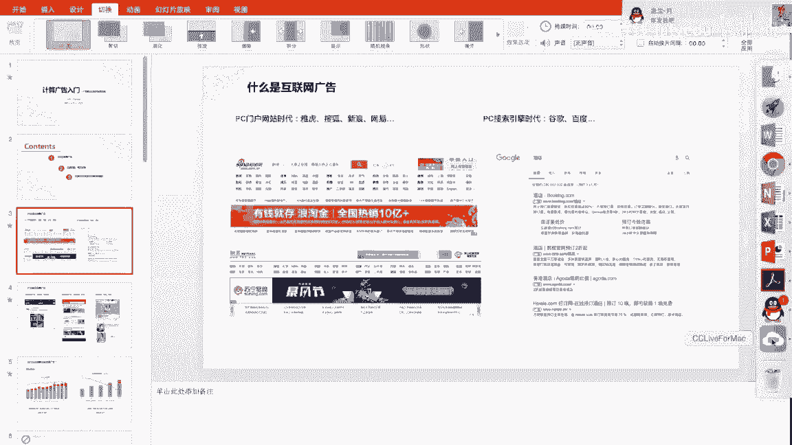
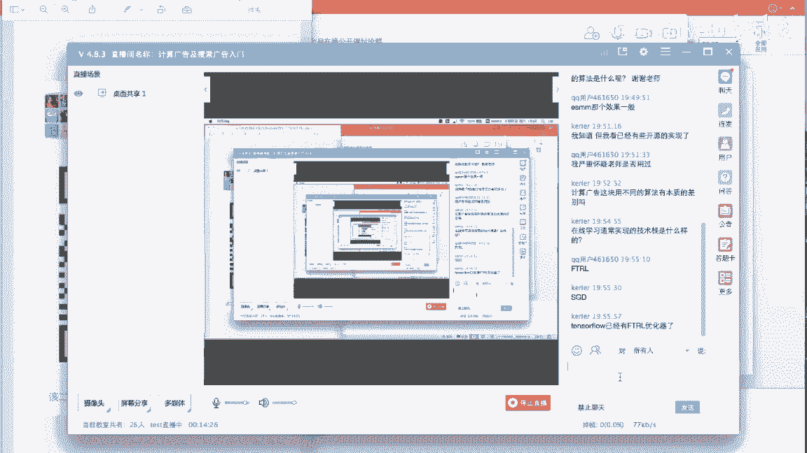

# 人工智能—计算广告公开课（七月在线出品） - P9：计算广告及搜索广告入门 - 七月在线-julyedu - BV1SA411H7Se

那我们就开始今天的公开课。现在可以开始了。好，大家好，今天给大家简单介绍一下计算广告相关的内容，主要是介绍一下广告算法工程师所需要的技能。然后我是一呃现在是在BAT的某家公司做那个广告算法。

我的名字叫邓凯，大家可以叫我邓凯。然后主要是分成3块内容向大家介绍一下。第一块是认识一下什么样的广告是互联网广告。另外一个是对互联网广告中的拍卖机制和竞价排序的相关内容。

最后一个是对计算广告中涉及到的计算机忆学习和深度学习的相关的技能做一个简单的介绍。首先。咱们先看一下什么是互联网广告，在PC的。门户网站时代。比如说雅虎、搜狐、新浪、网易这些门户网站上面有很多班的广告。

比如说截图里面的这个新浪网和网易。会有一些大的banner。这种广告呢一般是在PC的门户网站时代去售卖媒媒体资源和之前的电视广告和。和呃报纸上的广告比较相似。然后后来是PC的搜索引擎时代的广告。

比如说谷歌、百度是通过售卖关键词。比如说搜索酒店的时候，可能会出呃酒店相关的一些广告。然后可能有很多广告主通过竞价排名的机制来获取广告的展现。然后在移动的互联网时代呢。又又分成好几种。

比如说移动的社交广告，在朋友圈QQ空间中，我们经常会看到一些呃。广告广告的推广。然后在今日头条、抖音这方面也可以看到。一些移动媒体类型的广告，然后在淘宝、京东上面也会有一些。商品类的宝宝贝的一些推广。

好，那么为什么互联网公司这么热衷于广告呢？原因很简单，因为赚钱。比如说谷歌的母公司alphabet，它的营收营业收入中大概84%的钱都是来自于广告收入。然后百度的收入中。

大概有82%的钱是来自于广告收入。所以说这也是为什么作为一个广告算法工程师呃，对于一个应届生来说，刚开始都可能达到年薪30到50万。这也是一个广告算法工程师的一个价值的体现。然后另外我们看一下。

就是说互联网广告的商业模式主要有几种。比如说呃CPMCPM呢是什么意思呢？就是说按签字展现收费。就是展示广告给一次，给到用户看到一次广告就会扣费。CBC呢是按照点击。

点击收费是目前的一种比较流行的一种广告付费方式。只有当用户发生了点击。你的推广链接的行为之后才会发生扣费。CPA呢是按照行动成本来来扣费。CPA是一种按照广告投放的实际效果计费方式的广告。

即按照有效的注册激活来进行计费，而不限制广告的投放量。这是三种主要的。出价广告出价和计费的方式。后面我们会针对这三种再做一个展开。互联网广告呢怎么去卖这些资源外卖给谁？然后采用的是一种拍卖的手候法。

比如说常见的一种拍卖方式，荷兰式拍卖公开荷兰式拍卖是这样一种形式，就是呃电视上面经常见的那种拍卖。每个人每个参与人去。呃，依次加价，直到没有人再次加价的时候，这次拍卖的地位就达成。

而荷兰氏拍卖呢是一种公开减价的拍卖。他是在在拍卖的时候会主持人会设一个比较高的一个价格起始点，然后依次去去降低它的拍卖价格。直到有人愿意以这个价格付费的时候，这个拍卖的 deal由达成。

然后下面是第一价格密蜂拍卖和第二价格密蜂拍卖。首先什么是密蜂拍卖？密蜂拍卖是每个参与人不知道互相之间的出价。比如说招投标的时候，招投标的时候就是一种呃密蜂拍卖。

每个每不知道每一个投标人的出价是什么样的情况。然后第一价格的密蜂拍卖是说。中标的人就是出价最高的人。同时它的结算的价格就是它的自己的出价，而第二价格密蜂拍卖。是说。胜出的人是出价最高的人。

按说结算的时候是按照出价第二高的人的价格去结算。这是互联网广告中普遍采用的一种。出价和结算的拍卖形式就是第二价格密封拍卖。下面我们看一个博弈均衡的一个一个小小智力体。

比如说现在假设猪圈里面有一头大猪和一头小猪。猪圈的一头有猪食槽，另一头安装着控制猪食公用的按钮，按一下按钮会有10个单位的猪食进槽。但是谁按按钮就会首先付出两个单位的成本。比如说大猪先按先走到槽边。

大小猪如果是大猪先走到桥边，意思就是小猪去按了那个按钮。这时候大小猪吃到的食物的比例是9比1。如果同时走到草边，收益的比例是7比3。小猪如果先走到草边，收益比例是6比4。如果这个小猪是有一个。

智慧的是一个有智慧的，而且是一个理智的小猪。这时候他会做一个什么样的选择呢？在这种博弈下面的一个均衡的条件是什么？大家可以简单思考一下。好，这时候。我们去看一下每个小猪的一个收益情况。从比如说这时候呃。

如果是大珠去按了按钮，大猪的收益将是。6个收益减去两个单位的成本是4，而小猪的收益也是直接是4。如果同时按的话，大猪的收益是7减2七是它的收益，二是它的成本。然后它最终收益是5。

而小猪的收益也是需要付出两个单位的，是它的成本。然后它最终收益是5，而小猪的收益也是需要付出两个单位的。可以。那么为什么选择呃为什么互联网广告中使用我们之前提到的第二价格密封拍卖呢？也就是GSP的形式。

然后首先我们考虑一下第一价格拍卖。第一价格格拍卖假设P这个变量代表某个广告主的出价。V代表该广告主对这个广告的认可的价值。P2代表其余广告主的最高价。当P大于P2。

也就是该广告主的出价高于其他所有广告主的出价的时候，广告主的收益就是他自己认为的认可的那个价值，减去他自己的出价，这是第一价格拍卖。然后如果是。P小于等于P2的时候，它的收它的收益就是。

他他就是没有竞得这个广告，他的收益就是0。所以说在这种。机制的设计下面，广告主有不断调整降低出价的动力。广告主，而且广告主关心其他人的出价，原因是他的收益是微减P。当他不断调整P的不断去降低P的时候。

他自己的收益是越来越高的。大家可以考虑思考一下这个关系，这是第一价格拍卖。就是当自当他的出价是胜出了这个广告，它的结算就是他自己的出价的时候。他就有动力去不断降低自己的出价。

从而使自己的付出的成本越来越低。这时候会造成一个状况，就是说整个的拍卖系统都是不稳定的，每个广告主都在不断的调整自己的出价。这时候我们看。第二价格拍卖，同样P还是某个广告主的出价。

无非是这个广告主对广告资源位的一个认可的价值。P2是其余广告主的最高价。在这种条件下，我们看下面这个表。这个纵坐标是P2和V的一个关系，就是其域广告主的出价和该广告主的心理价位的一个关系。

横横坐标里面呢是横坐标里面就这一块。这一块是。是该广告主可以可以采用的策略。比如说他采用的策略是。它的出价是小于自己的心理价位。就是P小于V。当自己当它的出价等于自己的心理价位的时候，就P等于V。

当它的出价大于心理价位的时候，就P大于V。当其他广告主的出价都小于该广告主的认可价值，就是V的时候，有两种情况。当当P当自己的出价小于自己的认可价值，比如说P小于V的时候，有两种情况。当这个P甚至更小。

就是这个广告主就非常吝啬，他出的价格就非常低，甚至少于了其余广告主的出价。这时候会导致进价失败，进价失败，它的收益就是零，就什么也没得到，也没有出现广告，就这次就完全没有没有广告展现，所以说它收益是0。

另外一种情况是，它出的价格虽然很低，低于自己的认可价值，但是呢还是高于还是高于P2，就是其余广告主的出价的时候，这时候它的广告会得到展现，它的收益就是V减P2，因为是二价。所以说V是它自己的认可的价值。

P2是。第二高价，所以说它的收益是微减P2。然后再然后这是一种情况，当这个广告主采取是P等于V，就是说直接出自己的认可价值的。出价的时候，他这时候他的。它的出价是可以竞得这个广告的首权。

因为是P2小于小于P2小于等于V嘛。这时候。V它的收益也就是说广广告得到的展现，然后同时以PR的价格去结算，它的收益就是微减PR。然后然后当这个广告主非常慷慨，他出的价格高于自己的任何价值的时候。

他的收益呢同样是。按照P2去扣费，因为是二价扣费。就是不管广告主的出价有多高，始终是按照其他广告主的一个最高价去结算，它的收益还是不变的。另外一种情况就是说其他广告主的出价高于了该广告主的认可价值。

这时候其实是呃对于这广告主来说，他的最好的策略其实是就是说我放弃这个这次广告展现。因为它已经超出了我的认可价值。这时候同样我们分成三种情况去考虑。他自己的出价，比如说自己的出价小于自己的认可价值的时候。

这时候的是得不到广告展现的。这时候呃收益就是0。当他同样是按照自己的认可价值去出价的时候，收益也是0，这时候也是没有得到广告展现竞价失败。然后当他如果是强行把自己的出价高于了自己的认可价值。同时。

同时也就是否则这一块，同时它的它的出价高于了其他广告主的最高价。这时候它其实是一个亏本的状态的，它就是一个高于自己的认可价值的时候赢得了广告产现，这是其实是不划算的。所以说综合这三种广告主的策略来看。

比如说。每每一列每一列都相对于左右两列都是一个呃较优的选择，就是说它不会比两边的差。比如说。比如说PP等于V的时候，V减P2是U于这边的零或者V减P2，同时和右边的V减P2相相等。当当。这第二行的时候。

当这个其他广告主的售价比较高的时候。它的它的收益是0，然后和左边的收益零和右边的比左边的收益零的呃策略要优，比右边的收益零或者小于零的策略也要优。所以说综合来看。在第二价格密封拍卖中。

广告主的对于一个广告主，他的最优策略都是出价等于V，就是他自己的认可价值。也就是这这也就是城市出价。广告主没有必要去不断的调整降低出价来获得收益，他也不会获得收益。而所以他也不再去关心其他人的出价。

这时候竞价系统也比较稳定。我看一下有没有。什么问题啊？这是这是为什么宣算广告中通常选择第二价格密封拍卖来作为拍卖机制。然后在广告主在互联网广告中，通常有很多个这样的候选广告主。

然后他们之间的广告到底展现谁呢？这时候是按照一种竞价排序的机制。进价排序也就是。呃，有很多种形式。之前我们也提到有CPMCPC和CPA的出价。他们在一起相互竞价的这种形式叫做混合竞价。

比如说在CPM的时候。它的ECPMECPM就是我们把每一种出价都折算到同一种同一个维度去比较。ECPM就是签字展现的一个呃预估成本。然后当CPM出价的时候。

ECPM就等于CPMCPM就是签字展现的一个出价。展一个广告展现1000字，他愿意付出多少多多少的价格。这时候它的ECPM就直接等于ECCPM。当CPC出价的时候，CPC就是按点击付费。

就是当广告发生了点击行为的时候，才会才会扣费。这时候ECPM就等于。他的点击的成本乘以它的预估的点击率还乘以1000。然后这时候就有一个就有一个变量，这个PCTRPCTR就是预估点击率。

就是说系统会预估这一条广告在展现的时候会有多大的概率被点击，被用户点击。当他的成本。当它的点击成本乘以点击概率，再乘以1000，就是说它在1000次展现中有多少次点发生了点击。

然后每一次点击的成本是多少，相乘之后就得到了CPC出甲箱里面的1个ECPM。然后CPA出价呢，CPA就是按照转化去出价。

ECPM就等于CPA乘以。

好，现在应该是可以了，我们继续。

就是说CP出价出价的情况下。广告主广告主会设一个转化，他为每一次转化所愿意付出的花的钱，诚意他在这1000次展现中有可能发生的点击的次数。从而得到这一从而折算成这1000次展现所能得到的一个总花费。

就是ECPM。从这三种出价方式都可以折算到一种ECPM上进行排名。比如说这里举个例子。某个汽车广告主，他的汽车广告主因为一般喜欢做品牌广告，品牌广告他追求的是曝光是广告的曝光。

然后有一个广告主餐饮广告主，他是可能是家饭店，他可能会通过呃网上的APP发一些优惠券。他的目标呢是希望用户的点击就是领点击或者领取优惠券。然后对于有些手游的广告，比如说我们经常看到一些手游的一些广告。

呃，他们的目标呢是获得这个游戏的下载，游戏APP的下载和激活。这这三个广告主同时去敬德去参订一个广告资源的时候，他们会采取不同的出价方式。比如说汽车广告主他的目标是曝光。

这时候他会可能会选择CPM的出价方式，就是按展示扣费。然后餐与广告主B呢，他可能是目标是呃点击这时候他按照CBC点击的出价方式去出价。然后对于手游广告主呢，他的目标是获得APP的下载和激活。

这时候他的出价方式可能会选择CPA按转化去出价。对于广告主A呢，他为千每千次展现付出40块钱的一个出价。对于广告主B，他为一次的点击付出1块钱，就只要发生了一次点击，他愿意付出1块钱的一个出价。

然后对于广告主C呢，他是当发生了一次下载激活。当有一个用户发生下通过这个广告下载了一个游戏，并且把这个游戏打开激活。这时候他的愿意付出的价格是10块钱。通过折算到ECPM，我们通过点击率和转化率的预估。

呃，比如说对于广告主B，它的PCTR就是呃广告主B的B的广告的点击率，可能是预估的这条广告的点击率可能是6%，就是说它有6%的概率发生点击行为。这时候我们通过刚才那个公式。

可能这边的CPC乘以PCTR乘以1000的公式。折算到它的ECPM是60块钱。然后对于手游广告主来说，他的他的PCTR就点击率可能是10%，但是它的转化率只有5%。

这时候把他们同样按照CPC出价的方式去计算出来，它的ECPM连乘下来可能是50块钱。然后对于广告主A呢，它的ECPM就是他自己的本身的出价就是40块钱。这时候这三三广主在参竞同一条广告流量的时候。

由于广告主B的出价是60，ECPM出价是60，所以说广告主B胜出。但是呢扣费是扣的是二甲，就是第二最高价，就是广告主C的出价是50，可能就是对于一条一条展线来说，可能就是千次展现是50块钱。

对于一条展线可能就是0。05。这样是一个呃各个广告在一起混合竞价的这样一种情况。其实大家可以看到，在这个过程中，我们主要用了两两个变量，一个是PCDR。

一个是PCVR对于CTR当一当一个广告还没有发生展示的时候，去预估它的点击率。去预估它的转化率，这是一个比较呃关键在广告广告排排序中比较关键的一个算法的一个步骤。

所以说这里我们先看一个呃广告界的一个歌德巴赫猜想。就是说广告主有一半的钱发生了。浪费。但是现在问题就是我不知道是哪一半的钱是浪费掉了。嗯，这也是各位广告主的一个痛点吧。然后我们算法我们做算法的工程师呢。

可能就是尽量去帮助他们解决这个痛点。在一个广告的我们看一个广告的播放流程，对于一个用户进来，可能有一个用户的画像，然后同时去召回广告，对召回的广告进行一个呃竞价排序，然后再对排序胜出的广告进行广告展现。

同时去转化跟踪它的转化情况。这里面涉及到的系统的难点，就包括比如说复杂的定向规则，不同的类型的定价，以及同类型下定向条件的不同定向规则进行实时的一个组合。后面我们会展开看这一块。

然后同样有海量的用户数据，对于像BAT这种公司来说，他们可能有百万级别的广告，可能有11级别的用户，千亿级别的关系链。数据是非常庞大的。同时是请求量也是非常多的。

高并是时候就需要我们提供一个高并发的在线广告的播放。播放请求的一个系统。同时，延迟的要求非常低。比如说我们平时我们使用百度或者使用。其他的呃朋友圈的时候，它的它的延迟要求非常低。

后台的整个处理流程通常是需要控制10毫秒级别。然后在这过程中呢，涉及到的技术广告算法的基入点，主要就是包括这么几块。呃，第一块就是我们之前提到的在呃竞价排名的时候。

我们需要去预估某一条广告的点击率和预估它的转化率。然后在这个预估这个点击率预估过程呢，就是一个典型的一个继续学习的呃分类任务。二分类任务就是预估在这样一个场景，这样一个广告。

这样一个媒体和这样一个用户的这样一个呃条件下，会不会发生点击行为的一个二分类问题。他所使用的特征呢，就包括当时的。呃，广告展现的场景在何时何地使看到的这个广告使用的含有什么样的设备。

什么使用什么样的浏览器等等。同时还有一些广告本身的特征，比如说创意类型和一些定向的一些规则。同时还有一些媒体类的特征。比如说你是APP广告位是在哪里？这些特征。嗯，还有一些用户特征，包括对用户的画像。

用户的历史的浏览行为。啊，通过这些特征的一些交叉组合，我们在使用一些基础模型。比如说LR逻辑回归模型，或者使用一些呃更更复杂的一些模型。GBDT呃一些数模型。

就是GBDT像MLRWDRDNDINDIEN这种神经网络的呃神经网络的模型都可以。比如说这里列出了一个例子。

就是谷歌他们之前发了一篇文章是讲那个 deep model就是左边有一个比较宽的一个呃model是Y的mod，它会学习一些呃dance的一些feature。然后右边呢是一些dep model。

它可能经过两层的一个全连接。这样的它会它会主要是针对一些spa的 featureature。然后这里呢我们就不针对这些模型进行一个展开了。这次本次呢就是一个呃概述，就一难而过了。

然后这一块呢就是一个呃比较经典的一个经济学习任务。所以说呃算法工程师的它的它的能力的体现就主要是在在广告中中体现，可能是在点击率预估是一个方面。嗯。这一块点击率预估这一块做的好呢。

比如说在那个一些说一个额外的一些例子啊，比如说这个点击率预估，可能你提高个一个百分点。在BT这种公司里面，可能呃能够直接带来一天上百万的消耗。所以说呃各个公司为什么这么重视这个点击率预估这一块的工作。

也是这么一个原因。嗯，另外呢广告中还会涉及到自然源处理的相关的东西。比如说在搜索广告中，可能会涉及到一些query的改写。query的，比如说query改写像就是什么呢？

就是比就是你搜搜一些各种关键词的时候，它可能呃都会都会映射到同一个改写后的词上面，从而能更方便的召回广告。然后还有一些呃query的分析和召回，query和item的这种inbedding的方式。

还有语义的一些相关性。还有一些在创意方面，在广告创意方面会涉及到一些呃自动标题的生成，自动文本摘要的一些生成的一些工作。然后现在右边呢就是。现在业界嗯最新最火热的一些自然源源处理的技术嘛，就是bt。

bot的话它是。可以听到吗？现在可以听到吗？😊，好了好，那我们继续。不好意思啊，今天的网络情况可能有点不太好。就是说前面我们是看了那个点击预估这个经典的机忆学习二分类问题。

然后这里我们看一下自然源处理的相关的内容。然后同时呢在计算广告中也会涉及到一些。图像处理的一些内容。比如说图像分类。比如说我们图像生成和智能创意和图像inbedding。

然后这一块呢主要是用在呃一个是创意相关的内容。就是说广告的创意。对于广告主来说，特别是一些中小型的广告主，他可能没有那么多的成本去请4A公司去做一些很很fancy的一些创意出来。

这时候需要我们系统平台去提供一种简简单的创意的制作方式。就比如说谷歌他们一直在提取自动自动的网页抓取。就比如说你现要推广一个网页的话，他可以可能去直接抓取你网页里面的文本内容和一些图像的内容。

这时候就要求我们去判断什么样的图片，是有利于点击的，同时是蛮是符合广告法的。然后同样的内容的话，我们需要从。网站的呃文章里面去自动的抓取到呃更简练的符合广告的标准的一些标题和我美专要的内容。

同时呢对于图像这一块的话呃。因为图像本身其实是一个非常影响用户的点击行为的一个呃元素。呃，我们可以通过对图像提取它的特征的方式。

就图像inbidding的方式去作为意维特征加入到刚才我们提到的点击预估里面。作为点击率的一维一维特征，这时候可能会改善那个点击率预估的一个结果。

然后这一块呢有可能就使用到比如说ressonnetVGG这种传统的图像分类的一些模型。然后同时呢对于ressonnet来说，它本身也是可以去做呃图像em的提取的。

就比如说我们把最后一层的一个全链接的分类给去掉之后，最后一层的输出，其实是就是一种呃可能1024维的一个图像的embedding。然后从这可以看到，就是说在计算广告这一个大的呃任务下面。

其实是有很多算法的优化点的。我们。另外呢还有一些在广计算广告中呃，与一般的技忆学习或深度学习任务比较呃有区别的一些一些技术点。比如说在机制设计方面，机制设计的方面。

我们就比如说我们刚才提到的二价拍卖里面嗯，如何去优化每个广告主的出价。因为广告主自身可能也不是很清楚自己的目标价位是什么，如何去呃根据目标，根据广告主自身的出价去做一个智能的调价。

是是一个机器设计需要关心的内容。比如说头条呃今日头条，像百度，像呃腾讯阿里都做了一些OCPM和OCBC的工作，就是说就是说考虑考虑目标的一个广告目标和用户的一个转换的价值，去智能的调高或者调低出价。

这时候可能会带来一个呃在广告主接受的情况下更优的一个结果，同时提高呃平台系统的一个收益。然后同时呢广告的售卖也不都是呃。RTB就是实时竞价的一种形式。

也有一种呃也有对于大广告主可能会呃用合约广告就签了个合同，告诉他呃，一天给你展现多少个量这种形式去售卖。在这种时这种方式下售卖的广告呃，如何去做python。

就是说呃在时间段上去在什么时间段投放多少量的广告。这是也是一个算法可以优化的点。同时呢对于广告主的出价行为来说，其实是一个呃增强学习的可以用增强学习去模拟这样一个过程。

从而来提高呃每个广告主敬得自己想要目想要广告的一个可能性。啊，这一块呢是计算广告比较独特的一个地方，需要机机制设计。这一块。然后另外呢，现在的广告中越越现在的呃计算广告越来越强调一个精准定向的能力。

就是说我可以允许广告主去圈定一部分人人群。对于人群的圈定来说，可以使用一些呃基础的属性去定向。比如说呃年龄、性别呃呃省份，他的他的家乡是哪里？这种基术水性去做定向。然后另外呢。

就是说我们作为算法公程师可以去提供的一些人人群的根据人群的一个一些历史的行为。比如说淘宝里面可能会根据它的历史的一些购物浏览、收藏、加购一些行为去发现它的商业兴趣，从而做一些更精准的一些定向。

同时可以可以根据。客户广这个用户的消费能力做定向。然后另外呢在一些社交广告，比如说腾讯的呃朋友圈广告或者呃QQ空间的广告里面可能会。对于人相似人群的要求可能更高一些。呃，比如说呃因为因为人群是有圈子的。

比如说呃你对一个广告呃可能是一个一款汽车的推广比较感兴趣。很可能你所生活的圈子里面的人。也同样具有相相同的消费能力，同时对这一块广告也比较感兴趣，更容易发生点击和转化。

然后这里又涉及到一个如何去圈定相似人群looklike的一个计算过程。通常他们使用的都是一种graphra emdding的方式，就是一种图计算的方式。

比如说右边呢这个网络结构就是一个呃graphra embedding的方法SDNE的一个一种方法。然后这里我们就也这次我们也先不展开了。然后之然后之前我们现在就提到了。

比如说一些经典的经典的点击预估的二分类问题，包括自然源处理的呃NLP的相关的呃算法算法技术，然后包括一些图像相关的算法技术，包括一些呃。机制设计相关的。算法技术，这可能涉及到一些增强学习的相关内容。

然后同时包括人群定向人群的一些呃looklike的一些发现。这些操作呢都是对是对于算对于一个计算广告的算法工程师来说呃可以具有的能力。但是不要求说每一项能力都具备，只要有一项比较擅长就可以了。

比如说我就是点击率预估做的特别好，这时候你就可以去呃应聘各个公司的一个点击率预估的相关的一个算法工程师。然后比如说你LLP相关的，可能原来做什么对话系统，呃，做一些呃我们理解的相关的工作的。

也可以去应聘计算广告中，特别是搜索广告，因为搜索都是用用query去用关键词去搜索的，也可以去应聘搜索广告相关的一些呃职位。然后对于图像处理，可能你原来比较擅长呃图像分类或者图像人脸检测。

这这部分内容可以去也同样可以去应聘计算广告计算广告相关的算法职位。包括一些呃更就是本身就是符合这个呃计算广告特点的一些技术设计和人际定向的相关的工作。

也是可以去呃作为计计算广告算法工程师的一个技术技术亮点的。所以说对于计算广告算法工程师来说呃。嗯范围要了解的范围比较广，同时有一项比较精深就可以了。这次呢我们就对于这些呃技术点就不做一个详细的展开。

然后通过呢这次。然后这次呢主要是介绍了一些呃主要是简单认识了一下那个计算广告的内容。然后对于广告的一些二价拍卖的机制做了一个介绍。

另外是介绍了一下涉及到一些呃记学习二分类的点击预估和NLRP图像和机制设计人均定向相关的一些简单的介绍。呃，所以说这次的话就不不不会不会详细展开。呃。

后面呢可能会呃在平台上可能会开一台关于计算广告的一个系列课程，是更详细的介绍每一个技术点。然后希望就是大家如果感兴趣的话，可以来来报名参加。然后现在是呃大概留个5分钟到10分钟的问答时间吧。

大家有什么问题吗？可以在里面发言提问。PPT呃。PPT可以下载吗？PPT嗯，我可以发发给工作人员，就是有需要的话，嗯，因为我现在也不知道怎么去共享给你们。我可以发给工工作人员，然后他们会提供给你吧。对。

PPD。之后的课程，我现在呃因为这这今后的课程可以上线时间，可以主要跟那个呃工作人员联系一下。我不知道现在现在呃听课的里面有没有工作人员啊。之后网站上面应该也会有通知，这里应该不可以。

计算广告和推荐系统的区别是什么？嗯，他们之间就是说技术上嗯有很多相似的地方。又比如说在那个信息流广告中，信息流广告中，嗯，比如说今日头条的推荐的新闻信息流本身对于广告和推荐的内容来说。

所用到的算法算法工作都是相似的，就是点力预估呃。呃，这些转化率预估这些这些内容。但说他们的优化目标是不一样的。对于用户类的呃推荐系统来说，他可能会更关注于用户的停留时间。

和用户的呃一个对文章的一个浏览的概率。然后但是对于广告来说。对于广告平台的。平台来说，它的最大的优化目标是呃每天赚更多的钱，就是消耗更多。这时候它的从而带来的一些行为也是不一定的。

就是说可能有的广告它的。呃，有的广告它的呃点击率很低，但是由于广告主的出价很高，这时候我会把它给展现。所以说这可能是那个计算广告和就是用户类型的推荐系统的一个主要区别。主要是优化目标不一样。

然后底层使用的算法其实也有很大的一个相通之处的。就比如说你之前可能是做用户类型的呃推荐系统，呃，转行的做计算广告也是非常容易的。现在BAT里面做算法的，是不是在以前同事的基础上进行改进？嗯。

这个我了解到就是说呃。怎么说呢？呃，不可能就是说直接照搬别人的工作，这是也是行不通的。嗯，BT里面呢嗯可能有面临的一些算法任务，是呃也是别人也解没解决，或者说之前别人也遇到就是发现不了的一些问题。

在这些方面呢，也只能去呃自己去解决。比如说呃在那个阿里里面嗯。做做那个电商类的一些广告，可能业界只有阿里是呃。遇到的这个用户和广告主的这个规模是最最大的。所以说他面临的问题可能也是和其他的地方不一样。

从而他使用的一些呃技术的一些算法，也需要自己去做，也连系到他们呃开发了一些比如说DIN深度兴趣网络DIEN这种这种特殊的呃点击预估的方案。对，所以说呃但是呢对于其他一些。诶。

因为因为不可能说主要是精力问题嘛，就是对于一些优化点来说，可能是优化的重点。然后对于一些一些优化没那么呃重要的时候，可能是呃达到业务的商业要求就可以了。也可能就是说呃在同事的基础上进行改进。

差不多就这个意思了。但是总有一些是别人解决不了的问题需要去解决的。现在BET里的算法平台都是自己开发的，还是就是tflow spark之类。嗯。这个回答一下吧，就是说嗯我了了解到在那个呃首先。

像tanerflow spark这种。嗯，他能fo这种深度学习框架呢，是各公司都在用。但是说每个公司呢也有自己的东西，呃，像像那个呃。腾讯的话，他们也有自己的自己的深度学习框架。

百度呢就是那个paddlepedddle。呃，像阿里呢可能就是基于tentflow上面做了一个派th flow。呃，然后像嗯这种深度学习框架呢，肯定每个公司都有自己的平台。

然后呃开发的话呃其实是呃就是熟悉tflow之后，都可以很快上手。其他的框架。同样对于spark来说，呃，各公司也没有说直接去用spark都会做一些相应的改进。但说本质的思想都是一样的。呃。

所以说对于这个问题，BET里面算法平台都是自己开发的，还是tflow斯巴和这些呃。呃，这个回答就是说呃都会有基于tanfer勒或者斯par克的一个改进，一个一个搭建。呃，同时也可能会有自己的版本。

但是只要掌握了，就是说tford或者spk都可以应付。助教在吗？班级群号是多少？PPT资料，这个我问一下吧，这个问一下问一下那个主教。稍等一下啊，我问一下怎么去共享那个PPT还有班级的群。🎼。

哦，我我把那个。PPT先发给助教啊。现在还有点问题啊，课后我再发一下吧。现在TF使用的多还是拍套姐用的多？嗯，这个主要是看呃所需要解决的算法任务和个人习惯问题。嗯，我了解是tflow相微多一点。

然后拍套学的话，主要是在那个呃像文本相关的一些工作上比较用的比较多。因为t flow它本身呢是一个呃静态的网络执行框架。然后拍套选呢是一个动态的动态的网络图。

所以说对于文本这种不定长数据结构不确定的呃任务来说，可能拍套角更方便一点。但说对于像一些图像分类啊这些内容来说，因为本身有一些用户基础，像tflow可能用的多一些。

然后t flow现在可能也在像那个兼容呃拍套姐这种嗯。命令式编程的方式也在做。EESM也在做CDRRC吧。是的，之前也有。对。嗯，有人说这个仓法是在做PR，不太了解。嗯。12SM那11SMMM能是。

也不能说是做PR的话，就是呃肯定是在公司里面是在用的。呃，具体效果也文章里面也提到了，嗯，包括DIN和DIEN和ESMM都是呃针对不同的任务去做的一个呃CDR的预估。嗯。

应该不是说是做PR的这种单纯的做PR。因为公司里面也不会去。因为像算法公司的，因为本身的待遇也比较高嘛，不可能说养着这一批人专门去做PR的，就以说也是本身是解决呃解决那个呃。也有问题的。

现在计算广告方向主流的算法叫先进的算法是什么呢？扫码进这个群，然后我后面会把那个课件发到这个群里面。大家可以可以需要课件或者需要讨论的，可以进这个群。嗯。

现在哈回回答一下那个现在主流现在计算广告的主流的算法，叫新应的算法是什么？这个问题呢其实是比较泛，就是说计算广告本身涉及到的面也比较宽，包括和之前我们也讲到了。

就是呃点击预估和NLP图像都有一些相关的工作。呃，点击率预估这块呢，可能是计算广告一个。呃，比较重要的内容啊，这一块呢之前我们在不同的业务场景下也有不同的工作。

比如说之前我们讨论的一些阿里的一些ESMM和DIN和DIEN的工作。嗯。然后像那个呃LP里面的话，可能关注一些呃word emdding或者graph emdding的一种方法。呃。

所以说这个问题嗯也确实很难回答，因为比较泛啊。呃，是否用过？师否用过是EMM啊，这EMM我我确实没有尝试过。大家还有什么问题吗？嗯，是有的是有计算广告这块不同的算法本质的区别是有的。系。就比如说做那个。

呃，就比如说点击预估这块吧，呃，用不同的。模型结构其实。嗯。包括不同的组合特征来说，嗯，首先它可能带来的区别不是说直接的一个效果的提升。因为在业务上的话，考虑的问题可能比单纯的指标的提升更多一些。

包括一个线上的inference的一个效率问题，包括本身的这个框架本身能不能嗯通用，能不能解决其他的子产品就是其他的业务线的问题。在在在公司里面呢，可能嗯关注的问题更需要的解决的问题可能更多一些。

除了指标问题。所以说呃一个好用的一个模型来说，呃，需要去呃。可以自动化的组合一些特征，减少一些人工的特征组合的一些操作。这也是那个现在的比如点击预这块的一个方向。

然后另外呢也有一些online learning的操作。就是在线学习。因为比如说像嗯阿里的双十一大促，像618大促这种嗯大促的时候，可能会呃有一些样本的一些一些呃样本的不均衡。

或者包括样本量都会有一个呃预估空间和一个呃样本空间的一个区别。所以说可能会呃在那个训练方法上做一些做一些那个改进。就是本身呃确实不同的算法会有会有区别，会有。呃，本质的区别效率效率和效果指标上会有提升。

嗯，对，就是这样。在线学习通常实现的技术战是什么样的？嗯。专线学习的话，你可以了解一下呃，像F link blink这种流逝的。首先。呃。呃，FTL呢现在其实我了解到。呃，我了解到的用的比较少。

主要还是呃一个流式的样本的生成，同时去呃呃分批的去训练这样一个过程。模型可能是15分钟更新或者1小时更新。嗯。对，这是一种优化方法嘛。

然后本身 onlineline learningning涉及到的一些呃训练方法呃也比较多，主要是了解一下流式学习的东西。然后对于呃FTRL也可以简单了解一下。好，今天时间就这样了。She。好。

大家有需要讨论的，可以在群里面在群里面交流，谢谢大家。

