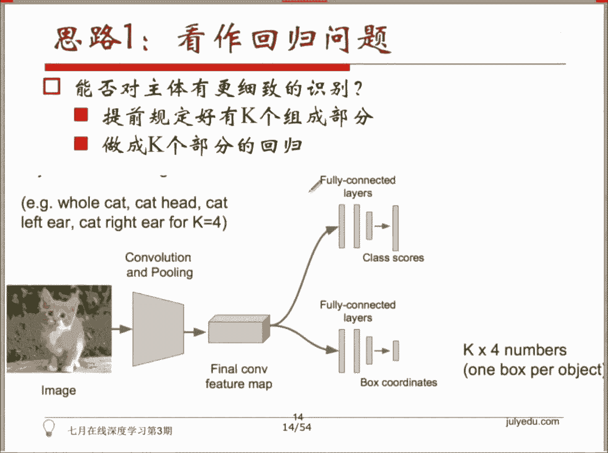
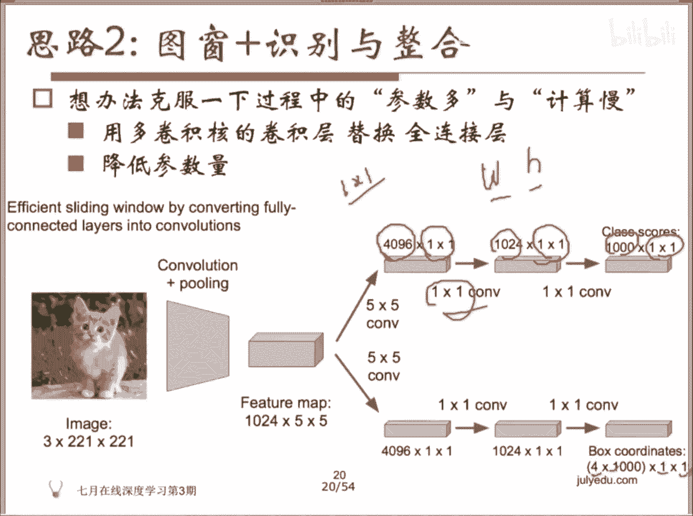

# 人工智能—计算机视觉CV公开课（七月在线出品） - P12：目标检测中的图像识别与定位问题 - 七月在线-julyedu - BV17z4y167dq

OK好，呃，今天我们来提一点对新的内容。呃，实际上这个部分呢在呃应该是放在卷积神经网络后面就给大家提到的。所以今天课程呢可能会分成两个部分，我们会给大家带大家来看一下。嗯，很多同学很感兴趣的一个。

一个领域，而它是实际有巨大作用的一个领域。就是所我们所谓的object detection物体检测。

所以物体检测呢，大家看到这些这两年自动驾驶很火。所以你在自动驾驶里面，如果你要躲避各种各样的障碍物，如果你希望用deep learninging的方式来完成这个事情的话。

你可能不仅要识别我的摄像头捕捉到的画面。你这个具体的这这个主体内容是什么？可能我还需要去定位出来它所在的位置，对吧？对以这是一个物体检测的这样的一个任务。我们今天会带大家来看一看物体检测的这个比较。

solid或者说稳步的还在在使用的这样几个方法啊。OK然后。我们提完这个之后，我们会给第二部分是给大家提一下呃transance learning。

就是包括从呃supervis learning到supervis learning的这个transance learning。

还有啊sup learning到unsuper learning的这个transfer learning啊叫doedver learning与对抗学习。然后在物体检测这部分，我主要会给大家提一下从。

CN到fatCN到fasterRCN这样一个发展的阶段。当然在后面的话会有一些RFCN或者是其他的一些方法啊。那这个在今天我们就没有给大家去做细讲了。因为现在可能我看到的情况是大部分情况下。

大家用到的还是faCN或者是SSD就是中科院以前提提的一个方法。好，然后我们接着往下看。然后对于卷积神经网络而言呢，一直有一个说法叫做dper better意思是说，当你的网络的深度足够深的时候。

主要只要你能够这个网络能够训练的下去，一般情况下在对于现实世界的这么多丰这种非常非常丰富的物体的状况下去做im做一个image classification图像的分类的话。

这个效果就会随着你的网络的深度越深效果会越好。

其实这个原因是因为一般情况下，我们认为model如果它的capacity非常大的话，模模型的这个复杂度，或者说它的容量非常大的话，如果你的数据的样本级不够大的话。

它有可能会陷入到一个状况当中叫做overfi对吧？过拟合ok所以为什么呃从我们知道最早的net啊，基层整接神经网络到后来的VGG啊，包括google的google googlenet这个。啊。

instructionV3V4等等啊，就是这一系列然后到resion network，大家知道有啊训练过1000多层的网络。然后最后对于物体检测的这个效果呢，都是有正向的效果。随着这个网络的变身。

这可能是因为我们本身的这个世界的。这个age的这个内容啊，具主体内容这个种类非常非常多。然后它的数据量级也也比较大啊，像imagenet实是一个非常大的一个数据集。

所以还暂时还到不了说over的这个状况，可能还在扎的尽量的从里头获取更多的这个呃信息出来。所以这几年也是随着网络的逐渐的变声。然后大家可以看得到。

这个错误率识别如image classification的这个错误率在逐步的下降。嗯，然后对应到刚才的image classification呢。我们在imnet这个数据集上通常会有另外一个比赛啊。

就是可能大家关注的是这个物体物体识别的这个这个图像识别的这样一个任务，对吧？但实际上呢同步开展还有另外一个任务叫做物体叫做物体呃检测。所以物体检测要求你在我的图像的数据集上把我的主体内容给框出来。

或者说我这上面有的这个比较呃bys，就是大小有一定大小的这样的一些内容，一些主体内容给它框出来啊，给给出来相应的它的loc location具体的位置和它对应的这个内容是什么？

所以图像相关的任务呢，我们可以粗略的分成下面几种任务。这个地方呢粗略粗分下来，首先是单物体和多物理。大家看到这个地方有四个图，这个四个图的左侧的两个图呢，我们把它叫做单物体的识别。

那大家之前的CN里头见到比较多的任务叫做物体图片识别，对吧？也是我们所谓的 classification。所以这个任务呢是我去识别这个物体当中的主体内容到底是什么。O这幅图里头到底是什么。

所以你只需要给出来一个target是一个类别就可以了。它现在是一只 cat啊，现在是一个dogO。然后对于单物体呢，还有另外一个任务叫做啊location。

所以你需要你不仅需要告诉我这幅图的主体的内容是什么。啊们所谓的单物体。同时你还应该告诉我说这个主体的内容它到底在哪个位置，也就是你要输出一个所谓的box，这个东西呢会带上各种各样的坐标啊。

比如说这个地方是一个框。那你可能可以用一个点，再加上长和宽呃，加上宽和高来确定出来这个框，或者是你可以通过。呃，就是两个点okK就 maybe必也是可以的。两个点的这个坐标好，所以。这个是我们所谓的。

图片的这个识别加定位这样一个任务。那右边的话是多物体的这个任务。多物体任务呢可能包括像我们说到的这个物体检测啊，就是今天会提到的object detection。也就是说我们这个图像当中可能会有多个。

物体在里面。所以我需要把这多个物体全都找到，并且给出来一个。比较合适的一个。oning box就是围绕着这个主体的。这么一个box对吧？一个框啊，最后一个任务会比较难。

因为刚才你要识别出来这个主体的左边的这个情况下，你要识别出来这里头的一些物体的话，你只需要找到一个矩形的框把它框出来就可以。那另外一个任务叫做instance segmentation。

所以instant segmentation呢是我需要把这里面的每一个主体的边缘描绘出来。我希望我能去做到一个呃合理的分割。所以我分割完了之后，这个狗的小狗的这个边缘，就是围绕着这个小狗的一个。

比较明确的这样的一个边缘，而不是一个矩形框给它框出来。O所以我们今天的内容会集中在前面三个部分啊，后面的instanceense segmentation呢其实会和前面提到的这些方法会有一些相关性。

所以物体识别加定位呢会从最开始考虑这个问题呢，大家会有很多的想法。我们知道在classification当中，图像识别。当中实际上你做的事情是我有C个类别，不同的图像类别。然后我输入的是一张图片。

我的输出的话是类别的标签。然后我的评估的标准是一个accuracy，对吧？准确率O所以给了一张图以后，它会输出一个结果，告诉你说这张图是一一个cat啊。

猫那locization呢说的意思是我希望你帮我定位出来这个猫在哪。那之所以这个实地方提到了定位，所以你需要有一个东西去把它的位置框出来，也就是我们所谓的这个ing box。

所以你的这个box呢这个地方可能可以给一个左上角的点，我举个例子XY那你还可以给一个这个地方的W和H对吧？H是高度W是它的一个宽度，所以input是叫image。

你的output呢是一个物体的一个边框啊，在locization这个任务当中，所以你要告诉我说它的图这个框的一个点XY和它对应的高度和宽度。我们去确定出来这样一个框。

所以它的输出是4个数字XYWH所以是一个连续4个连续的值。那它的评判的这个标准呢是有一个叫做呃交并准则的这样的一个标准。大家可以想一想啊，你输出的这个框呢，有可能会比我的标准答案的这个框呢。

其实可能处在标准答案这个框的任何的位置，我可能两个框有一定的重叠，对吧？这是我识别出来的框，这是有可能的。然后也有可能它会完全被它覆盖，这也是有可能的。所以这个地方它采取的准则呢。

可能是啊基于这两个框的一个。交集和它两个框的一个并集，就做一个综合的一个判断，判断你到底和我原本的这个ground truth标准答案之间的这个我我画出来这个标准答案之间呢。这个重叠的比例有多高？

OK所以当你把这两个任务结合起来的话，就是classification加一个localization。结合起来的话，它就是我们所谓的这个识别主体叫做定位这样一个任务。

所以实际上这个net也一样啊，就是它通常情况下也会有识别和定位两个任务。所以你不仅要识别这个图像上主体到底是什么，你还应该告诉我说这个主体的位置到底在哪。

所以最简单的想法是，一开始这个问题被提出来的时候，大家会有一些想法说你如果只是做一个locization的话，说明你只需要对一个主体内容去做一个位置的判定。

那由于又由于你的输出的结果是一个XYWH4个啊连续数去做一个regress。所以我这个时候呢很直观的一个想法。

就是我可以把这个output的 for number和这个标准这个for number去做一个啊in的一个dance一个L two的一个欧式的距离的一个损失，对吧？

一个L two distanceL two的一个 lossokK那也就是所谓的这个我们对X减去XE撇。然后平方再加Y减去Y1撇的平方，再加W减去W1撇的平方，再加H减去H1撇平方。

OK所以这是一个很直观的一个想法。所以我们可以为了去和标准答案越接近越好，我们会去调这个W呃XYWH4个数字时，它和标准答案的四个数字越接近是越好。

ok所以这个。事情怎么去做呢？首先。大家做的都是在自己的场景下去完成一个locization。所以我们先解决一个简单的问题，是你需要在你的在你的当前的这个场景下去识别出来图像的内容。

所以你可以再拉一些网络过来，比如说在model z里头有大量的alexnetGGgoglenetnet等等。拉下来以后，在自己的数据机上去做一个fin。也就是说在自己的数据机上。

利用它的网络的权重去做初始化，然后去识别我具体现在内容，比如说我现在是一个呃电商的一个类目体系，对吧？这个地方可能会有牛仔裤，会有上衣，会有连衣裙，这样不同的不同的商品。

所以我在这个上面去啊fin tune一下，也就是做一个调UO所以。这个时候呢我们用一张图片去。Okay。我们我们这个时候呢，我们可以利用已经训练好的一些网络的参数作为初始化。

在自己的这些类目体系底下去做一个fin two。那你就调整了这个对网络的参数去做一个微调嘛，使得它能够符合我们现在当前的这个场景。OK然后比如说这个时候我们做的事情可能是怎么样呢？

就是我们会拉1个E批数据过来。我们。如果是做回归的问题的话，我们会用一个。网络去做finant。然后我们在这个利用这个网络呢，我们不是去做一个。物体的一个呃是不是做一个classification。

image一个classification。因为image classificationification大家都知道啊，就是我后面呢我网络会有很多层，我可以把前面的一些层看作什么，看做一个特征抽取器。

对吧？你可以把它看成一个feature的一个。extractor，所以它是完成的东西是对图像的特征去做一个抽取。所以抽取了以后呢，尾巴尾巴上的这些层呢，实际上是你可以看作是一个class bear。

对吧？一个分类器啊，是真正的从我的特征到我的标准答案的这样的一个分类器，一个class score。

那所以如果你用L two的这个lasts的话，你做这个事情的话，你做的事情就是我去把。后面这个classificationhead，也就是我原本用于大家知道后面是一个soft max，对吧？

我去预测到底有多少类的这个soft max这个分类器去换成一个呃regression的一个head。所以最后我要输出的是XYWH4个不同的。四个不同的值。

然后我只不过的los不再用后面soft max的这个cros hP loss交叉熵损失，而换成了我们的呃。对L two loss。okK所以我用L two loss去做。

就前面的这个特征抽取这一步是不动的，大家能明白吧？就前面这些参数primeter，前面这些W和H我都fi住。我就把它fix住。然后我前面这些层次呢，我就只是当做去抽取特征。

所以我这个地方就拿到了一些卷基层输出的这个叫com featureature map。所以这些feature map呢后面可以去接上不同的结构。比如说你接一个用于识别这个图像的内容啊。

所以对内容做分类的这样的一个classification head就是刚才我们训练的个网络嘛，对吧？我们在自己的场景下去训练。比如说电商的类目体系下，这个20个不同的类目。

我去做一个分类的这个分类的这个网络，然后把尾尾巴上的这些层去掉，然后我重新去训练一个头部的这个层这个regression head。那你可以选择说我只训我把前面的这个参数fix住。

我只对后面这些参数去做update，这个是可以做到，对吧？你把前面这些层的那个learning rate啊，learning rate去调成零就可以了。然后后面这些参数的话。

你后面这些层你是可以去调一些learning rate一定的这个学习率的，让它去做update和更新。所以这个东西是一个regression head。那通过这样的一个up base呢。

你就可以简单的方式啊，你就可以理论上来说，你应该可以得到一个可以输出4个值的这样的一个。一个呃神经网络 neuralnet。

okK所以用L two loss加加上L这个BP加SGD去做训练。理论说理论理论上来说，你就能得到一个。这个和这个的于拼接的这样的一个网络，他能做的事情就是能输出XYWH这样的4个数，对吧？

去作为这个网络的一个呃输出一个box。然后呃实际上预测的时候呢，你就是把不同的头部去拼接上完成不同的功能。

比如说你拼接上上面这个一个classification的一个head它做成的事情就是我去区分到底是猫还是狗，对吧？

cat还是dogok那如果我接上的时候这样的一个呃B box这样一个一个regression的一个head的话，那它输出的东西就是XYWH这样一个regress的一个结果，对吧？4个连续的指飞。

理论上来说，我应该可以拿到一个cat a dog这样的一个class一个类和word X y WH这样的啊box。

然后regression的这个模块部分一般加在什么样的位置呢？这个有不同的选择的方式。比如说大家如果去看早期的这个。大概在13年14年左右的话，那个时候14年左右的话会有一些不同的方式。

比如说如果你在VGG这个网络上去做调整的话，呃，一般情况下你那个会接在最后的卷积层后面。那也有些方式啊，比如说呃我们的google提出来的depo啊，至少在14年左右提出来depo和呃早期的物体检测的。

方法object detection的方法叫RRCN，它都是接在最后一个全连接层后面。啊，也就是说我后面会有一个所谓的regression head，但这个regression head实际上它是。

我来写一下regression head，实际上它是。可以在不同的位置嘛，你可以把不同的位置开始往后看，可以看成一个reggression的一个head。O所以有不同的方式啊。

但实际上他们的都是有一定的效果的。对呃，早期的这个方式，这个overfi。比如说对overfi，它是相微机这个网络是接在卷积层后面。

然后depo和RCN是接在后面的for connect layer全连接层后面。

然后提到了一个问题，说啊，我们有没有办法对主体内容有更加细致的识别呢？所以如果我有一我我是能识别出来这个主体内容是一个猫，我想定位到里头的。呃，左耳朵、右耳朵和他的两只眼睛以及鼻子分别在什么位置？

OK所以能否对主体有更细致的识别呢？这个地方呢最早的方式就是啊这篇有一篇论论文是2呃CVCVP22014啊，就是叫叫depoO就是google当时的一篇paper，然后。

这皮本做的事情很简单，我会提前规定好每个每一类的东西，它有K component。比如说猫，它就是两只耳朵，两只眼睛再加呃一个鼻子OK有4个腿。腿，所以你会提前规定好K component。

然后去做成cake部分的一个regression，对吧？所以原本我是做成一个4个board number的一个regression，4个数输出数的一个regression。那现在的话，既然我规定好了。

我的猫都是这样的一个状况的话，我就可以输出K乘以4个numbers。那当然这个东西如果你视做一个regress的一个。问题的话呃，有可能你会遇到一些会有一些ba case。

因为你不能限定说每一张图片它的角度它都能出来这几个东西，对吧？那但是你可以去做一些相应的一些尝识。所以这个depo这篇paper呢就是一个相应的尝识啊。

depo human pose estimation very neural networks啊CP2014它做的事情是我假定每个人的组成的部分是一是固定的，就是人会有多个关键，对吧？

所以。呃，关节的话，这个地方我对K的组成的部分，K的关节去做一个regression。然后它是一个首尾连接的一个线段。比如说一个人他最后出来的东西呢，就是和和啊大家都看过火火柴人是吧？

就特别呃特别有些衣服特别逗啊，就是有时候我大家去参加各种各样的这个晚会或者是活动的时候呢，会跳一些舞，穿一些那种衣服。

然后是带上这个一节一节的这个呃闪光灯的ok所以你可以看到他做的事情就是哎这个地方可能是一个关节啊，一个关节，一个关节，然后这是上肢，这是下肢，这是手上肢下肢手，所以整个人呢就被。

识别成了多个这个joint的一个组合，首尾连接的一个组合。所以他做的事情就是present person by key joins。

然后去做一个regression X Y for each joint from the last connected layer of就是他会去做一个regress。

然后这个regress输出东西实际上是这个地方的呃首尾连接的这样一系列的关键，对吧？OK然后但是它会有一些呃这个东西看起来很简单，但是实际在在做的时候呢，会有一些困难。

然后它这个地方有一些细节的一些处理啊，包括作为的nonmalized coordinate。对，然后以及一些相应的调整。哦。

有同学提到了一个问题是吗？还是前面这一页的问题，什么位置跟识别的位置怎么对应上物位置跟识别的物体。我没读懂第二句话，但这个地方的话，我假设我有K组成的部分。那我K组成部分的顺序是我固定好。

就是我就是先识别左边的耳朵，然后是右边的耳朵，然后是左眼睛，右眼睛，这样的话你就我不需要去输出K乘以4个number，你就不需要去说我就判别哪4个数是哪一个啊部分，哪个component。

O。所以这个地方的regression问题呢，就是大家会有一些尝试嘛，所以最后尝试就是那个这个比较早。所以最早的时候是在像net这样的网络上去做了一些尝试。

所以我把人拆分成不同的这个jos关节去做一个首尾连接拼接，所以他用这样的一个方式去拿到了ok这样的一些类似长得像火柴火柴棍一样的这样的呃输出结果，然后对这个结果呢，根据这个结果。

你就可以判大致判断这个人是什么样的一个姿势，对吧？比如说他是呃一个这样的状况肯定是站立的一个状况。OK这样的状况。那有些状况下肯定是坐了坐的坐着的一个状况。

所以嗯对，然后这个地方的话我们提到的呃我们还没有提到还我们还没有提到bing box。有同学问到这个问题啊，我们现在只是说我输出了一个能够代表box的for number的一个output一个输出。

然后思路二呢，就是马上要提到这个思路，就是。是这样想的，刚才我做的事情呢是去做一个regression。所以我要输出来那样的负个数XYWH。

那类似于刚才我们说到的classification加regression的一个思路。我们可能有另外的方式可以去处理这个任务。比如说我们可以取不同大小的框，所谓的box，然后让这个框出现在不同的位置。

我去做的事情是，既然我的转基神经网络可以去判定这个图像，它是属于某个类别的一个概率，一个pro，对吧？那我从这个框里头框出来的这个内容，丢到转基神经网络里头。

它就应该去可以去给出来一个是属于某一个类别的一个肯定度。所以这个地方的话步骤就是这样的一个很简易的步骤，我去取框，我把。我用这个大小的框从原图上去抠出来不同大小的内容。

把这个内容丢到一个卷积神经网络当中去判定它最后它的一个概率prob。然后按照得分的高低，可以对结果框去做一个抽取和合并，这是后续的一些事情了。

所以这个思路呢大概是下面给大家看到这幅图这个思路对于我原本的会有一张图片，这个图片呢。我我会去去这个图片呢，比如说是一个3乘以257乘以257的一张原始的图片，因为是彩色图彩色图片，对吧？

它的宽和高度是257。那我的这个神我会去训练一个神经网络。这个神经网络呢是input是一个这样大小的一个一个图片。O所以我会用用这样大小的一个框，用它在这个图像上滑动。

最简单的滑动方式是我先在因为它这个框还比较大，所以可以在左上角，然后在右上角，然后在左下角，然后在右下角出现，我们把这个框里头的内容去送到我刚才的。据送到我刚才的这个得到的这个，大家还记得我有一个。

神经网络是一个神经网络呢，当他接这个classification head的时候啊，对classification的这个head的时候，他拿到的是这个类别的得分。当他接后面的这个regression啊。

regression head的时候，他拿到的是。的输出啊是1个W啊XYWH对吧？所以同样啊其实你还是会去训练那样一个网络。

只不过现在我做的事情呢是呃我不会寄希望于你去帮我找到那个我不会寄希望于你直接帮我从原始的图片上去找到这个定位的这个框，而是我得到了这个东西以后呢，我会去把这个框输到刚才的那个网络当中。

所以当我截取到这个猫啊，这个部分的时候，可能会给我0。5的概率。当我右上角的时候，哎，这个猫的大部分东西都被我框出来了，所以有0。75的概率。当我到下面这个位置，左下角这个位置的时候呢，大概有0。

6的概率。那右下角这个地方的话，大概有0。8的一个概率。这是一个在不同的当我框框到了不同的位置。我把这部分的位置的图片输入到我的卷积神经网络当中。

我去拿到我的classification head的一个pro概率的一个输出。那同样啊同样我把这个框里头内容丢到我的这个。regression head里头，它应该会输出4个数字，对吧？

所以这个地方的红框就是这样产出的结果。然后有一些同学在看到这个图以后，会问到说，老师为什么这个地方框出来的这个框会出现在这个黑框以外，因为我的输我输入的图片不就是这个图片吗？

你为什么会出现在图片以外的位置？就是你这个框框里有部分在外面。对，但大家不要忘了我的呃XYWH我这个东西它只是一组输出来的4个数。

所以你并没有去约束这四个数，必须比你原始的这个图片。比如说W和H已经比原始的这个window的大小要小。你没有去约束这个东西。因为你只是用了一个L two的一个lo，对吧？然后就最小化这样一个lo。

所以理论上来说，你输入这样的一个。原始的图片它也是可能会拿到这样的一个XH啊，XYXY和这样的一个WH的对吧？可能会超出这个框的，这是有可能的。所以呃理想的状况可能是现在大家看到这个状况，对吧？

我每一张图片。当我抠出来一定大小的这样的一个图框，丢给这个卷积神经网络的时候，这个卷积神经网络应该可以输出来它的classification的这个head接着这个神经网络可以输出来一个它对应这个子图的一个概率。

就是这个子图对应到不同的类别，它的一个概率，以及这个地方的regression head的这个回归的网络，应该可以告诉我一组数XYWH去定位这个框。

所以最后我会根据这个概率的大小去对这个框可以去做一定的合合并啊，当然这个合并的东西可过程可能会比较呃复杂一点。所以它在这个在在paper里头没有没有呃，就是现在的话一般大家不会去细讲这个部分了。

因为后来有些其他的处理方式。实际做的时候时候实际上就是这样一个过程。就是比如说在ICL22014的paper里头，都都还是这样一种做法做法。

我们会有一个呃window position和一个score map。就是我会有一个划窗，这个划窗呢可能取各种各样的大小，取各种各样的size和它的position。然后它它在不同的位置有不同的大小。

所所以这个时候呢，它可以呃对于每一个框里面的内容去做一个输出，会告诉你一个概率，同时会啊也会有一个可能可以有一个regression嘛，对吧？甚至会在窗口上做一些regression的事情。

所以他会对它去做一些相应的合并。所以。这个东西呢有很多人很多同学看起来会觉得这个也能发论文。你做的事情不就是很粗暴的计算嘛，对吧？划一些框，然后这个框去做一些相应的。运算概率的运算。

然后对结果去做一些合并。这个为为什么能发论文？因为它这个东西这篇论文不只是这样，有些东西我们还没有给大家啊细讲。因为这里头最大的问题是什么？因为我有这么多框的时候，我有这么多个框的时候，这些框。

每一个框我需要去做一遍。

这个图像的这个识识别，它是需要消耗很多时间的。所以你能不能去做一些优化。所以最简单的优化是它克服了一下这这个过程中的一些问题。比如说参数比较多priameter。比如说它的计算比较慢。

所以最初的形式大家都知道是这样的一个形式，对吧？我会有一个classification head会输出1000类的类别，我会有一个啊regression的。

head我会有一个regression head去计算这里头的。boxes就是我们总共会有呃1000个类嘛，我对每一个类，实际上我都会输出来一个fo number。就说虽然这张图里头是一只猫。

但是呃如果这张图里头是一个大象的话，我也会输出来对应这张图片的大象的这样的四个数字，这是原始的一个呃结构嘛，对吧？我有个feature map，我会往后去做相应的映射嘛。

然后但是这个时候呢，为了对为了去克服一下这个过程当中参数多和计算慢的这样一个问题呢，他用了。就是大家知道后来有很多网络叫做啊叫做foook control convolution network。

就是全卷机网络。就是全卷机网络。所以。刚才最大的问题是呃对，有同学提到了一些问题啊，就说这个里面比较大的问题是呃，比如说你的全连接层。

你的全连接层是4096的那你这个地方的参数就应该是1024乘以5乘以5在。

啊，这样一个feature map，比如说把它啊拉平了以后，然后去和4096相乘，对吧？是这样的一个连接方式。OK所以它会有尺度上的问题。就是如果它的size不一样的话，你如何去完成。

这个地方后续的一些计算。所以后来有很多的网络，它就不用。

对他就把全链接层全都去掉了，把全链接层替换成了全卷积层。而且它这个地方的卷积是1乘以1的小卷积。嗯，大家可以仔细想一下这个事情，全连接做的事情可能是为了增加它的非线性，对吧？

因为你有一堆的W和H可以去做组合，那你可以组合出来一些。理论上来说，你的全连接层可以去它的非线性能力，你应该可以组合出来任何的一个连续的值。但是这个功能你用全卷机能不能做得到呢？卷卷机的话。

其实它就是一个一个filter，这个filter的大小，这个窗口就是1乘1。所以全连接能做到的事情，如果你仔细想一下的话，全卷机也是可以做得到的。

因为全卷机做的事情就是相当于用一个数对这一这个feature map里头的所有的输出的结果的和去做一个scaling，做一个幅度的缩放。所以我只是在做一个幅度缩放。

你原本输出的是一个用全连接输出的是一个连续的值。我现在用全卷积，我也可以缩放成一理论上来说，我也可以缩放成某一个连续的值。所以一乘以一的小卷积，实际上和全连接的作用基本上是一样的。

就是它的它也能学习到相应的这样一个一个表达。所以后来他们把这个事情做了一些小小的调整，把后面的尾部的全连接砍掉了，把它换成了全卷机。所以全卷机现在就是1个4094096个filter，对吧？

每个filter是一乘以一的这个lighting window啊，划窗。所以1024乘以1乘以1，后面是1000乘以1乘以1，对吧？所以是一个全卷积的网络，而且全卷积的网络。另外一个好处是卷积。

它会节省非常非常多的参数。所以刚才你的全连接如果参数非常多的话，如果你把它换成了全卷机，现在这个地方就只有4096个参数，只有1024个参数和1000个参数。

那同样下面这个是一个啊 box coordinateordins，就是我去调整这个box这个框的位置，所以这个地方有4乘以1000乘以1乘以1啊，大概是这样的一个结果输出。

然后大家如果再仔细想一下这个过程的话，如果你是用。这个全卷机的网络的话，卷接这一步有很多运算是可以是可以去重复使用的。就是我们最怕的事情是，每每次有新的。这个图像过来一就是不能说是新的图像。

实际上它就是原图完整的原图当中的一个部分，对吧？那这个部分实际上之它有一部分之前是算过的。比如说我先框出来的框是呃这个位置。

的框，然后后来框出来的框可能是这个位置的框，那里头有一部分的运算，实际上是之前已经算过的。所以如果你需要去。去去克服一些问题，或者是去啊共享一些计算的话，你应该考虑我我如何去共享这一部分的计算。

所以这个地方的话，它会通过。

它会通过一些处理，使得我的计算的过程是可以复用的。有同学问到了一个问题，4096乘以1乘以1经过1乘1的小卷积，为什么会变成1024乘以1乘以1？因为这是卷积层的，这个卷积层有4096个神经元。

这个卷积层有1024个神经元。你全连接的时候，你可以从4096到1024，对吧？这是一个全连接，全可以连起来。那卷积层一样可以做得到啊，我不知道你明白明白这个地方说的意思吗？

你就是有1024个 kernelnal而已，卷积卷积核，然后每个卷积核是1乘以1的，对吧？所以你想要一个是多少维度的输出，你就可以令令它有多少个神经元，只不过我每次用的划窗是1乘以1的。ok。

我说清楚了吗？这个地方可以你这个数值和前面的数值是没有关系的，就像你的全连接后面一层，你想取多少个神经元，你自己随便取，那卷积层也一样，你取多少个 kernelnal，你自己取。然后因为是呃对。

因为是这个地方的话。

是一个呃大家可以想象一下这个事情啊，就是我那个窗，我两个滑窗的这个大小，实际上是可能会有。刮度划窗的这个这个。窗口的位置实际上可能会over，会有重叠。

所以这个地方呢实际上你可以想办法去呃节省一部分的运算。节省一部分的运算，就是有些运算你是可以呃去去重复的使用的啊，尤其是这个后面会有一些1乘1的小卷积嘛，1乘1的小卷积。所以小卷积的话。

它做的事情实际上是把所有的值加在一起，再乘以这个caling幅度缩放的这个值。那你是你你可以去做的事情是有一部分已经算了，我就把周外外围的这个这一圈没有算的。呃，比如说黄色的位置拿过来做一个计算就好了。

所以大体上是这样一个思路。当然实际上这篇论文在实现的时候肯定是做了一些其他的优化啊。本身他我我相信他去做这个事情也没有这么的简单，但是这个思想是可以大家可以去借鉴的。就是他首先把呃大家知道在尤其是。

大家知道在googlenet之后的话，实际上大家很习惯把全连接层踢掉。然后我只用全卷机的一个网络，而且后面尾部上是一乘一的这种小卷机。那这种一乘一的小卷机呢，它能够有全连接的这个作用。

同时它又能够呃有保证这个参数量往下降。而且它能它的最很棒的特性是能够在有些场景下能够共享一部分的计算。

