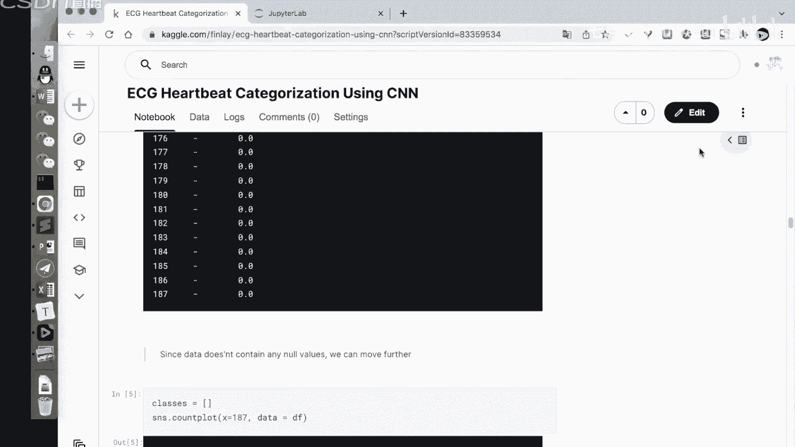
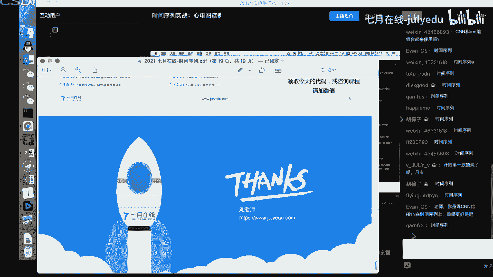

# 人工智能—计算机视觉CV公开课（七月在线出品） - P16：【公开课】时间序列实战：心电图疾病监测 - 七月在线-julyedu - BV17z4y167dq

Yeah。Yeah。

hello，各位同学，嗯，有没有同学已经是在我们的直播间的。如果已经是有同学呃在我们直播间的同学呢，也可以扣个11啊，扣1，然后在我们直播间啊，然后我们就马上开始我们今天的一个课程。

好呃，然后我们今天的课程呢是由切在线来总给大家开展的一个时间序列分类和分解的时战。嗯，就是裸性电图疾病识别的这样一个课程。

然后呢，我们就呃马上开始啊马上开始。Okay。好，嗯，然后我是刘老师，然后也是来自于学业在线。嗯，然后我们的今天的课件呢，如果各位想要领取我们今天的课件呢，也可以从我们的一个右上方的二维码。

右上方的二维码，这个是我们的杨老师的二维码，杨老师的二维码。然后从我们杨老师的二维码中领取到我们的今天课课程的一个具体的课件啊。好，我们继续。

呃，在我们的今天课程呢，我们主要是嗯完成以下的一些具体的一些实践。嗯，如果大家认真的完成一个听课呢，是能够学会以下知识的。就是第一个呃是时间序列的一个定义和使用。嗯，它的一个应用啊。

时间序列的定义和应用。第二个呢是时间序列的一个特征提取方法。第三个呢是时间序列的分类啊，回归模型。第四个是我们会讲解一个具体的案例啊，具体的一个案例。然后我们也会给大家进行一个呃时间啊，代码实践嗯。

我们整体的一个时间安排，就是在一个小时之内啊完成的上述的四部分。嗯，在一个小时之内啊完成我们的上述四部分的一个学习。好。那们继续。首先呢我们来看第一部分时间序列的一个介绍。

也就是我们的一个时续数据的一个介绍啊。时序数据的一个介绍。时间序列呢其实它在我们的日常生活中呢是非常常见的，非常常见的。我们在日常生活中，我们的很多的数据的点，它是按照时间的一个维度进行堆积堆叠的啊。

以及它是按照某种时间的维度啊，然后进行一个收集的。嗯，然后这个地方的一个时间序列呢，它的一个特点，就是一方面它是按照我们的一个时间时间的因素啊，按照时间的因素来进行做我们的数据的收采集。

另一方面呢我们的数据集它最终形成了最终呢形成了是一个序列，是一个序列，它不是单个值，它是一个具体的序列。所以说这个地方的时间序列呢。

就是说我们的一个具体的数序列数据按照某种时间的一个因素来进行采集并行存储。好，这是它的一个具体的一个特点。我们对个时间序练呢它有一些具体的一些优点啊，就是它具体的特点啊，da塔它是规律的采集的。

就是它采集的过程中是有规律的。它不是说我们的一个无规律的。如果一个数据它是无规律的采集的，那么它就不能称作一个时间序练啊。如果它是无规律的采集的，它不能称作时间序练。我们看下面这张图。下面这张图。

我们在做一个具体一个序列的一个嗯就是说建模的时候呢，我们的这个地方这个地方的图。Soorry啊。看一下这个笔它是怎么使用的。对啊，我们这个地方的图其实它是一个我们的一个按照时间的一个走势的啊。

按照我们的一个时间走势的一个图，对吧？我们的按照时间的一个。这个地方比不是这个吗？对啊，我就不用这个笔了，这个笔不太好用。这个地方呢就是序列呢它是按照我们的一个分钟级别，分钟级别来进行我们的数据的采集。

对吧？按照我们的分钟级别做我们的数据的采集。然后呢，我们在做一个具体的采集的过程中，你会发现，随着时间的推移，随着时间的推移，我们的一个具体的取值，它是有这种波动的，对吧？它是有这种波动的。

随着时间推移它的一个波动，有这种波动啊，然后呢我们的一个数据级的一个采集的时间，对吧？这个地方很明显，它是按照我们的分钟级别来采集的分钟级别采集的，而且呢它的一个采集的力度。

应该是按照我们每分钟啊每分钟的一个维度做一个采集的。好。然后我们继续。然后在这个地方呢，你会发现我们的一个时间区列，它的一特点就是说它是按照我们的一个等长的时间做一个采集，等长的时间做一个采集。

也就是说我们这个地方是按照每分钟每分钟来进行采集啊，每分钟进行采集。如果我们的数据集它是不是按照每分钟来做采集。那么我们的一个数据集，它就不是一个时间区列啊，不是一个时间区列好。我们继续。Okay。

Yeah。嗯。然后呢，时间序列其实在我们的日常生活中呢，其实是非存在有很多的一些场景。比比如说在经济的领域，我们的股票走势、黄金的价格走势以及房房价走势。

这些都是我们的在经济领域的这种时间序列的一种一种场景。那么这个地方我们的股票它是怎么进行它的一个采集，是怎么进行采集的呢？如果是我们的一个具体的一个嗯美股，或者说我们的这种国内的A股呢。

其实它就是按照我们的分钟级别分钟级别做一个采集，对吧？然后呢，我们在电商领域，我们有这个DAUMAU以及PV走势，对吧？这些呢也是我们在日常日常生活中呢也非常常见，对，然后它也是按照我们的一个序列。

按照时间来采集的一些具体的数据啊。然后我们的工业领域呢，有这种传感器的这种信号，其实也是一种非常典型的一个时间序列。那么我们有了这么多时间去你们这么多数据数据之后，我们接下来要做什么呢？

有了这么多数据之后，我们接下来就是说想要从我们的数据中找到出一些规律，或者说能够构建得到一个新的模型，比如我们能不能从我们已有的一个数据集里面进行理解我们的一个序列的一个数据。

然后去找到它内在的一个规律。也就是说我们在挖掘出一个序列的情况下，我们能不能分分析出呃这个序列，它未来对吧？它的走势是什么？以及它这个数据整体的分布的规律是什么，这些呢都对我们的后续的应用。

其实是有非常好的帮助的，非常好的帮助的。好。那么这个地方就有这我们对序列做一个预测，或者说对我们的序列做一个监控，这是相关的应用。然后我们的一个时间序列呢，其实可以分解为如下几项的。

时间序列可以分解为如下几项，就是。时间序列可以分解成我们的趋势，季节和产差。趋势季节和产差趋势呢是描述了我们的一个序列长期的一个规律，但是可以增加减少或者不变的。比如我们来看左边的这个这个图啊。

这个图这个图呢就是我们的一个非常典型的这个嗯。这个我们的一个例子，在这个序列里面，它是随着我们的一个时间的推移，随着时间推移它是逐步上升的啊，它是逐步放升的。逐步上升的这个地方呢，我们称这个序列。

它的一个趋势呢是逐步上升的。虽然说这个地方我们的一个这个地方呢我我们的一个黄色线啊，黄色线或者橙色线，它是一个趋势。虽然说我们的一个序年，它整体的走势呢有这种波动，由高变低，然后由低变高这种波动。

但是呢它整体的趋势是就是说我们的增加的啊，整体趋势是增加。这是第一项趋势项。第二项呢是季节项，就是我们的一个序列呢，它是在某种频率下只呈呈现于一种规律的，或者说在某个周期下面啊呈现呈现于某种规律。

比如说我们的一个序列再进行一个具体的一个，随着我们的一个温度。对吧随着我们的一个时间的推移一年四季，它的一个温度，其实是随着这种呃就是说有规律的一个波动啊，有规律的波动。所以说这个地方呢一个季节性。

就是说它是一个带有我们周期往往复的啊这种情况。第三项呢是残差项，就是说我们在一个序列在剔除掉我们的一个趋势和季节之后，它的一个随机的波动，剔除我们的一个季节和我们的一个具体的一个残差之后的一个随机波动。

我们的原始的一个序列。这个序列就可以分解为我们的这个趋势项啊，分解我们的趋势项，以及我们的这个具季节项，以及我们剩下的残差项啊，这是原始的我们的黑线啊就可以做这样一些分解趋势季节残差啊，季节残差。

这里方我们的一个趋势和具体的季节是可预测的。我们的残差，这个也就是我们的一个C季波动是不可预测的，不可预测。在我们的一个具体的建模的过程中呢，如果我们的一个时间序列。是由我们的这三者所组成的情况下。

我们的一个具体的序列呢其实是可以做一些分解的对吧？我们原始的一个时间序列呢是可以做一个具体的分解。就是说我们的一个具体的一个时间序列可以分解为我们的一个趋势。我们的季节和我们的一个残差。

当然我们的一个具体的一个序列呢，也可以把它由这三者组合到一起。有比较典型的有两种模型。第一种模型呢是这个ja法模型。加法模型呢就是当我们的季节和残差与趋势无关的时候。

我们可以将这三者进行通过一个加法得到，通过加法得到。好，这个呢我们可以看右边这个图啊，就是说我们随着时间推移。这个数据呢，它的一个采集是不断进行上升的更性上升的。然后呢，这个地方我们很。

可以很清楚的可以看到我们这个地方是可以做一个趋势项啊，一个很典型的趋势项是不断上升的。然后呢，我们的一个季节。对吧我们的一个具体在趋势之外，我们的一个点。也可以很很清楚看到有这个季节相册的。

但是呢这个地方我们的这个季节的波动，周期的波动还是稳定的，还是稳定的。好。这是第一类啊，我们的加厚。第二类呢是这个乘法模型乘法模型。我们在做一个序列的过程中呢。

其实你可以看到我们如果一个序列它是可以组成由我们的乘法模型所由乘积所组成的情况下，我们的一个时间序列呢就会可以先展示为右边的这种形式，右边的这种形式。好，也就是我们的一个趋势乘以我们的一个嗯周期季节。

再乘以我们的参差啊，然后我们再把序列啊，随着我们的时间的推移，我们的一个具体的一个数据，它是乘着一个。波动越来越大的这种情况啊，波动越来越大的这种情况。好。那么这是我们的一个时间序列。

如果我们知道它是具体由这三德组成的，那么接下来我们也可以把它作为一个分解啊，分解成这三项。

呃，然后呢我们接下来呢有点卡证吗？应该是不卡的应该是不卡的对，应该是不卡的。然后我们接下来呢就对我们的一个具体的代码做一个实践啊。

Yeah。我们首先呢来看一看我们代码项啊。我们首先呢来看一看我们的一个代码。我们导入我们的相应的库啊，主要是这个tatistic model，这个主要是用来做一个时间序列建模的一个统计模型。

然后其他的都是一些具体的一些画术库啊。我们首先呢创建我们的一个序列。这个序列呢是我们有一个时间项，它是从我们的一个一到我们的50这部分素组值呢有的这个。然后呢。

在我们的time从1到50分别每项呢乘以个2。75。嗯。然后我们将这两项把它做一个闪点图画图。我们的time做我们X轴，我们的trainrend做我们的一个Y轴。很显然。

这个地方它是以这种我们的一个直线所它，就是说以这种直线的形式啊所绘制得到的。好，然后呢，我们如果是在我们的一个具体的一个时际序列里面呢，我们加入这个周期项怎么加呢？就是我们可以把它做这样的表面。

我们十加上sine的 time乘以10。我们的具体。具体的Y轴的取值啊，我们这样来做一个转换。我们的一个具体的一个季节项是由十0加上我们的time的一个正弦，然后乘行1。然后我们看一看它的结果。

如果我们在加入了我们的一个具体的一个政权的情况下，你会发现它的一个就是带有很明显的很明显的我们的序列色彩啊，带有很明显的这种序列色。好。然后呢，我们可以嗯生成我们的一个残插项，也就是我们的一个噪音响。

噪音呢这个地方我们是可以直接从我们的一个随机数里面所产生的啊，随机数里面所产生的。也就是我们确定一个具体的一个范围，然后生成我们的一系列的随机数。然后呢，我们就可以把这三者进行相加。我们的趋势项。

我们的周期项以及我们的残差项，对吧？我们上面就是对别定义的，就是我们的趋势。这是第一个是定义的趋势项。对吧然后下面的我们的季节项以及我们的残渣项。如果我们把这三者进行相加。

得到了就是我们的这样的一个加法模型加法模型，对吧？我们把我们的一个趋势项和我们的一个季节项，以及我们的残渣项进行相加，得到的就是我们的这样一个加法模型，对吧？这个就是我们PPT里面所示的。

当然如果我们想要把我们的一个具体的一个结构呢把它改变成我们的这种啊就是说乘法模型的，其实也是可行的。就是说将我们的这趋势，我们的一个具体的一个周期以及我们的残渣啊进行一个乘积的起，然后做一个可视化。

这就是一个很典型的一个乘法模型。好，这个呢是从我们的一个定义数据集。以及我们把我们的数据集的构建啊，这样得到的。当然，如果我们有了一个时间序列，我们如何对它进行一个分解分解呢？

就是说如果我们有了已经有的一个序列。我们接下来如何把我们的序列把它分解成不同的一个三项呢？也就是把它分解为我们的一个趋势周期和产加呢这个地方你可以借助ts model的一个具体的分解啊。

持续的分解分数呃方法，就是我们的用这个呃seasonary decompose的这个函数啊，可以将我们的一个具体的数据及把它做一个分解。好，我们继续。然后如果我们传入一个数据集。

然后把我们的一个加法模型做一个分解，你可以很清楚可以看到啊。这个第一个第一项是我们的一个原始的这个数据集。然后接下来是它的一个分解所得到的一个趋势项，以及它的一个周期价，以及它的残差项。

大就可以很清楚看到啊，我们有一个序列，我们是可以使用一些方法把它分解的，分解得到我们的预算项目。Yeah。Yes。好，那么大家如果遇到我们的一个加法模型的一个区列，你也可以尝试啊。

就是说直接把它用分解的方法把它进行分解得到我们的趋势项。我们周期上和参长一下。那么类似的，如果我们要一个乘法模型，你也可以用我们的一个ts model啊，把它进行一个分解。对原始的一个区别。

那我可以把它分解为我们的一个趋势项、周期项和我们的参照项。好，我们继续。那么在我们的一个时间序列的建模的过程中呢，不仅仅是嗯就是说需要大家掌握一下我们的一个序列它的一个分解。

也需要掌握一下我们的一个时间序列，我们能不能提取一些特征？我们的时间序练呢在做一个特征提取的时候呢，主要是可以从以下几个角度提取特征的。比如说我们的跟日期相关的特征。

我们提取出我们的这个日期里面的一些工作日，或者说它的一个周末相关的一些信息。这些特征可以作为我们的一个呃很典型的一个特征。也就是说我们在这个数据这个表格里面。

我们对于这个date time作为一个具体的特征提取。把我们这个datetime里面的年月日把它提取出来，是吧？以此类推，我们还可以提取里面的一些具体日期日期，比如大的小时分钟，对吧？

这些都是都是可以提取出来的。那么。各位同学如果是对这部分不太了解啊，大家可以去参考一下这个penndas它的一个以及这个python data datatime的一个具体实现。那么在这个具体实现里面呢。

其实我们可以提取很多的一些根据其相关的一些字段。比如说。我们的这个呃这一天是一年的day of year，就是说它是一年的第多少天，以及we year，就是说它是这几个周是我们的这个日期的第多少周。

对吧？以及we day也就是到星期几，对吧？这一体体的一些方法啊，都是在我们的d time里面有具体实现的啊，大家也不用就是说过多去担心好，然后呢我们还在做一个具体的特征的时候呢。

也可以用一个n feature。用这个le个 feature。这个le feature是哪里有原版和视频？嗯，可以加一下我们的杨老师的微信啊。如果又想要领取我们的PPT以及我们的代码以及录播地址啊。

都可以加一下我们的一个。我们的。屏幕右上角啊屏幕右上角我们杨老师的微信啊，杨老师的微信加一下，就是说跟我们杨老师嗯微信啊，就是可以领取我们这相关的一些资料啊。Yeah。好，嗯继续。好，加一下微信就有啊。

直接可以领取啊，没有什么门槛的，也不会要花钱。然后呢，我们在做一个具体的一个建模的时候呢，其实还可以做这样一个操作。就是我们可以将我们的一个历史的数据把它当做当前的一个特征。我们使用一个历史数据。

把它当做一个当前的特征。这个地方呢我们叫做一个legg featureleg feature啊，滞后特征。滞后特征。这个滞后特征是什么意思呢？这个滞后特征就是我们的一个具体的一个数据集呢？

在做一个具体的一个建模的时候。他可以做我们的一个用历史的一个序列当做我们的当前的特任。比如说我们在这个PPT里面啊，我们这个序列对吧？它是我们的有我们的一个具体的一个。呃。

counts这是我们的一个序列的取值啊，随着时间的推移，它有具体的取值。然后呢，我们的一个具体的一个情况，我们可以放大一点啊，在这。给大家看这个地方呢，我们的一个count体。这是当前时刻的一个取值。

然后legag一呢就是我们下一个下一时刻用我们的前一时刻的一个取值作为它的一个特征。这个啊然后我们那ake二呢就是说这个时刻用上两个时刻的一个具体取值啊。

这个legake2就是我们这一时刻用上两个时刻的具体取值，类类似的nake3。那个4那个5那个6，那么以此类推，你会发现这个地方的一个滞后特征在做什么呢？

那就是将我们的历史的历史的一个就是说我们的一个取值。历史的我们的取值呢当做我们的当前特征的一个数。比如在这个时刻，它是用历史的这些取值当做我们当前的特征的一个输入啊，这个操作呢叫做一个滞后特征。

叫做一个滞后特征啊，它是用历史的数据集当历史的数据啊当做我们当前的特征啊，叫做neg featuresature滞后特征。

还有一个呢叫做一个呃我们的一个rolling rollinging啊，我们的一个滚动或者是我们的滑动的特征。它是将我们的一个数据集呢按照某种窗口做一个具体的一个聚合。做完这个聚合之后呢。

然后得到一个统计值啊，得到一个统计值，这个是我们的一个rollning啊roing。好。Oh。我们来看一看代码的一个实践啊。嗯，这个地方呢我们还可以统计一些其他的特征。

比如说我们的一些呃做时间序列的一个呃就是它的一个节假日啊，高峰时段啊，以及一些其他的一些统计特征。当然也可以再给于我们的一个时间序列做一些历历史信息的一个统计。历史进行统计。

然后比如说我们可以统计它的一个历史的整体的一个中位数，中呃平均值风度偏度，以及与历史的一个呃就说具体的一个相比，历史的具体相比。然后我们比如说与同期的差值，以及与同期的一个具体的一个呃就是比值啊。

这些都是可以做一个就是呃统计的啊统计的。

好，我们继续。Yeah。然后呢，我们接下来就可以看一看一看我们的具体的代码实现啊。

这个课后续有一是有一系列相关时间序列的吗？啊，我们今天呢只是给大家做一个呃就是说公开课啊，我们今天只是给大家做一个公公开课啊。至于这个其他是不是有后续的一个就是说一系列的课程呢。

这个大家我们待会儿也有一个课程介绍啊，大家嗯不用担心。

我们如果是想要做我们的一个刚才的一些特征的一个提取呢，我们是可以呃按照这样的一个代码来做一个实践的啊。我们读取我们的数据集，然后呢将我们的数据集的一个某一列啊。

d time把它就是说转变成我们的一个呃时间类型的。然后呢就可以通过我们的 time day列提取得到它的一个月日啊 day这个都可以提取得到的。然后呢提取完成之后呢。

我们还可以提取得到它的一个day week以及day对吧？我们的一个具体的一个。🎼这两个其实是差不多的啊，这两个其实差不多意思都是星期几的意思啊。然后我们这样的一个转换。

就可以从我们的原始的这个d time提取得到一些额外的信息啊，提取得到额外的信息。好，我们这个地方呢还可以提取它的一个our minutes是吧？our minutes这个都是可以提取得到的啊。

our minutes都可以这个都是可以提取的。那么如果是做我们的一个L特征怎么做呢？ne特征其实这最后特征嗯就是最后的一个单位的数据啊，作为我们当前的特征，对吧？L特征，这个是L一的啊L一的。

那么这个地方呢我们在pas的一个具体实现呢，我们就可以直接用我们的一个shift操作啊，用一个这个shift操作来完成啊，shift操作来完成我们的具体的那ck特征好。

那么如果是我们的一个leg to呢，leg to呢就是我们的就是说滞后特征。leg2呢，leg3呢，那么我们就是类似的啊，都可以用我们的一个shift1234567，对吧？

这个是我们具体的一个滞后的一个单位来做啊。好，这样所产生的一个结果啊，就是这样的。好，我们继续这个地方的一个L特征呢，其实就是我们的一个序列的啊序列的这种就是说滞后特征。

序列滞后特征啊都是非常非常有用的。当然我们在做一个具体的一个就是说我们在操做操作的时候呢，也可以做这种哦基于我们的一个窗口的，基于我们的这种窗口的一个滚动的，或者说我们的一个滑动的思路。

我们这个地方呢用我们的一个rolling命，rolling呢是什么意思呢？也就是我们这个地方有一个滑动窗口，有滑动窗口，这种窗口的大小呢是7，窗口的大小是7，然后呢。

这个地方我们的一个具体的一个嗯就是我们的一个具体的一个呃就是是统计。我们窗口为7的情况下的一个具体的平均值。对嗯，课件啊就是说我们嗯嗯这个课件的微呃就是杨老师的微信啊，我们待会在这个PPT上面都有的啊。

我们待会儿这个所有的PPT上面都是有杨老师的微信的。如果你想要加的话，可以直接截图啊，或者说直接扫码啊，这个都是可以的啊，这个都是可以的啊。Yeah。好，这个是杨老师的微信啊。

大家如果就是说呃就是想要加的话，可以截一下图啊，截一下图。好，我们继续啊我们继续。

。

这个地方的一个roning mean呢，我们设置的windows是7，什么意思呢？就是说我们这个地方是有7个就是7个取值作为我们的一个具体的窗口组合得到一个具体的窗口。

8262222这7个取值组合得到一个具体的窗口，然后求得我们的一个平均值，就得到我们的一个平均值啊，这个取值是我们这7个取值的一个平均值。那么类似的这个地方为什么是NAN啊。

因为这个地方它是不满足我们计算要求的，这些点它是不满足我们计算要求的，所以说它是一个NAN在这个位置它是我们刚好满足我们的7个数值的一个取值，它是算的一个平均值。然后这个取值。

这个数值呢是我们的从我们的一啊就是从零开始啊，这个地方12622222这7个取值算一个平均值得到我们的这个以此类推啊，这个地方我们的3。14是我们从这开始的7个取值计算得到的。

所以说这个地方的U望里面呢你可以理理解它就是一个滑动窗口啊，一个滑动窗口。然后算一算我们的指定窗口，指定窗口类的一个平均值啊，指定窗口类的一个平均值。好。这就是我们的一个就是啊有ing啊ing。

当然然我们也可以算一个expendexendexend它是一个这种累积的累计的窗口。你这个看口。然后我们的一个具体的一个操作呢，就是说我们在做一个具体的一个操作的过程中呢。

我们可以将我们的一个具体的一个数值呢把它通过我们的一个呃exex啊，然后来做一个操作。我们这个地方的窗口呢设置为R，也就是我们从这儿开始啊计算得到我们这两个数值的一个均值啊，从这开始。

最小的啊最小窗口的大小就28加2除以5，然后在这呢就是说8加2加6除以3，以此类推，它是计算得到我们的累计平均值啊，累计平均值累计平均值啊，累计平。

所以说这个地方我们的一个ex和我们的ning啊其实是啊存在一个具体的区别的，有些区别的。好。我们继续。Yeah。然后接下来呢，我们就介绍一下这个时间序列的一些分类模型和它的回归模型。

在我们的一个呃具体的一个应用过程中呢，其实我们的一个具体的一个时间序列呢其实它是呃存在有一些具体的一些模型的啊，存在有具体的模型的。呃。

这个地方呢我们是有这个具体的一个有分类任务和一个预算任务以及用或者说我们的一个回归任务啊，分类任务呢就是说我们在给进一个时间序列的情况下，我们需要就是说识别一下我们的一个序列它的一个类别啊。

我们的具体具体一个类别是什么，这是我们的一个分类任务。然后呢，我们的分类任务如何做这个分类任务呢，其实是可以参考如下的这种形式啊，如下的这种形式。比如我们再进行一个具体操作过程中呢。

我们可以算一算这些序列的一些距离。区列的这些距离啊，然后呢我们可以在做区列距离的时候，比如说我们算一算两个序列他们之间的一个距离，可以算它的欧式距离，或者说算它的1个DCW距离，DCW距离都是可以的。

然后呢，我们再做一个具体的一个操作的过程中呢，我们还可以做这样一个操作啊，这个就是类似于这种KNN的思路。就是说具体的一个距离计算呢。

我们是用欧式距离或者说DCW距离吧评价我们的这种序列的一个距呃相似度啊。然后用KNN的思路来做就行。然后第二种方法就是说提取持续特征，提取持续持续特征。然后呢。

就是我们接下来就是我们做我们的一个具体的提取特征之后呢，然后再做我们构建一个分类模型，构建一个分类模型。这个是我们的一个啊比较常规的一种思路啊，比较常规的思路，就是基于机器学习的这种思路啊。

然后我们还可以做一个深度学习的一个建模，就是构建我们的一个深度学习的端到端的模型，深度学习的一个端到端的模型。就是说我们构建一个卷积深经网络，或者说我们的RN的这种网络。

然后再构建我们的一个具体的一个嗯全能阶层啊，然后完成我们的一个分类过程，完成我们的分类过程。好。那么如果大家对呃我们的这个时间数界分类感兴趣啊，我们待会也有一个具体的一些案例啊，一些具体的案。好。

那你继续。Sure。我们如果是想要做一个时间序列回归呢，回归这个地方其实就是做我们的一个未来时间的一个预测啊。未来时间的预测其实本质就是做这样一个操作，本质上做做这样一个操作。

我们是可以给定一个时间序列啊，可以预测未来的一个数值，给定一个时间序列，预测我们的未来一些具体的取值。比如我们可以使用这些一些这样一些操作。比如我们使用滑动平均来操作，对吧？滑动平均。

我们在历史的数据集而言呢，我们对历史数据集将它做一个rolling mean的这种操作，用历史的一些平均值用来做我们的未来的预测值，这是一种方法。I可以用我们的二码。

这个是我们常见的这种时间序列的这种模型，对吧？然后通过我们的ar维码，然后做一个预测，或者说做使用我们的这个profit来做我们的预测，或者说使用我们的这种深度学习的端到端的这种模型。

比如说RN或者说STM的这种模型来做啊，这个都是可行的啊，这个地方是我们常见的这几类任务啊，几类任务一及具子模型。这个主要是用于我们的一个时间序列啊时间序列。好。Yeah。

那么我们接下来呢就看一看我们在thon里面啊，我们的一个具体的一些预测呃，就是说时间序列的回归模型。我们来做一个尝试啊。我们这个地方呢是用这个ggom这个就是gom的库啊来做一个尝试。

呢它是一个基于MMXnet的一个就是时间序列回归的一个库啊，时间序列回归的这个库。然后大家如果自己想要实践呢实践一下，也是非常非常嗯就是说简单的非常简单的。有这个库之后呢。

我们它其实这个地方我们就是对我们上述的一个序列啊，我们上面的。

我们做回归的呢就是对我们上面的这个序列啊做回归。对对这个需得做回归啊。好，我们来看一看这个地方的glow呢其实它使用起来也非常简单的。这个地方我们就是使用一个deep AR的这个模型。

deep AR这个模型deep AR呢它是一个基于。就是说我们的一个深度学习的RI模型啊，深度学习的R模型。然后这个地方呢它是嗯就是说非模型非常简单。然后呢呃整体的一个就是说效果也非常好啊。

然后我们就用DVR模型来做一个具体的训练。这个地方呢我们可以做一个设置一个preventation name，特别是什么呢？是表示的我们的一个预测的。就是说需要预测的一个补偿。

就是说我们去在做一个嗯预测回归的时候，我们是做一单个单个嗯点的一个预测还是多个点的预测啊。我们这个地方是这做这样一个操作，然后呢我们就可以做我们的一个具体的一个啊就是说训练啊，做一个具体训练。

这个地方我们是让他训练10个亿po，让他训练10个亿po啊。我们继续。那我们训练完成之后呢，我们就可以对我们的一个具体的一个数据集啊做一个预测啊，做预测。然后我们来看一看。对着我们原始的数候。

这个是啊这个我们是预测结果的啊，这个绿色的是我们的预测结果的。你会发现它这整体的预测结果和它真实的结果啊，这里面有一根实线，有一根实线是它真实的预测结果。

你会发现这个绿色的和我们的一个真实的结果是其实是重合度非常高的，重合度非常高的啊，这个绿色为什么有一个有一些范围呢，这个地方其实是我们的depAR模型，它是会预测得到一个就是知行度啊，50%的执行度。

以及90%的执行度。也就是说具体有两个区间啊。你可以看到啊，这个是我们50%执行度区间内的一个预测值这是我们的90%啊，90%啊，我们的执行度内的预测值啊，这一个范围啊，范。好。

当然我们在做一个具体的一个时间序列的时候呢，其实我们也可以参考这种DJW的用DJW什么是DJW呢？DJW其实本质啊就是做这样一个操作。我们在做一个时间序列计算序列之间的一个相似度的时候呢。

其实是嗯就是说你可以用欧式距离，你可以用欧式距离做啊，可以用欧式距离做一个尝试。但是呢有些时候啊。我们的序列它往往都不是一个嗯对等的，它不是一个对等的这种形式。那么这个地方呢我们在做一个序。

就是说这个地方你会发现这两个序列，它如果直接用欧式距离做一个比较啊，它并不是一种很好的形式。因为我们这个地方是我们的一个序列，它跟我们的原始世界有这种就是说它并不是说是直接匹配，就能够匹配好的啊。

这个地方呢我们是做的这样产生我们的序列啊。我们将我们的一个具体的序列呢。嗯，有一部分是我们的一个s的一个函数，有一部分呢是我们的cosine函数。

大也知道这个sine函数和cosine函数其实就是差了一一两个项位，对吧？所以说这个地方我们如果是用DTW呢，你会发现它的一个匹配结果就是非常非常正确的非常正确的对吧？好，这个呢是DTW的匹配结果。

这个地方的DTW呢它就可以用于我们的非定场的序列的匹配啊，而且匹配的结果，一般情况下会比这个欧式距离会更好，比欧式距离会更好。好。然后我们接下来呢就是做一个简单的一个尝试啊。

就是说做一个心电图的疾病识别，以及它的一个具体的挑战啊，特别是我们的一个呃具体的一个实验啊好。我们来做一下。

你是也是在我们的一个就是note book里面给大家写好了。

Yeah。

Yeah。嗯，我们在日常生活中呢，有些时候我们的一个具体的一些数据呢都是很常见的利用我们的一个时间序列作为一个存储的。也就是说对于我们的一个具体的一个序列啊，我们对于我们具体序列，其实我们是。嗯。

比如说我们的一个心脏的一个跳动，对吧？它都是很常见的按照我们的时刻啊，不同的时间做一个采集的。然后呢，这个地方我们是将所有的一个序列呢，把它都存储为这种定场的定场的形式啊。

我们将这所有的一个序列呢都把它存储为我们的这种定场的形式啊，定场的形式。如果是存储为我们的一个定糖的形式之后呢，我们啊接下来处理就非常方便了。这个呢是我们的原始数据集啊，这个是我们的原始数据集。然后呢。

我们可以在做我们的处理之前呢，我们可以首先计算一下我们的一个每个时刻，它的一个具体的一个序列的一个平均值啊，以及它的一个趋势值好。

这个是我们的每个时刻，我们的序列是不是包含趋势值啊？我们可以看到啊，这个所有的时刻它都是没有包含我趋势值的。

好。我下说。然后呢，我们的整体的序列呢，它是包含有几类的啊，呃总共有5类、零类、一类、二类、三类、四类啊，总共有5类，这是我们的一个原始的啊，就是我们的一个原始的一个输入的一个数据，原始的输入的数据。

这它类别个数类别个数。好，我们接下来也可以做我们的一些可视化啊。我们做一个可视化。这个啊。这个是我们的不同类别的一个序列，它的一个可视化的结果。大家可以看到啊呃第零类、第一类、第二类、第三类、第四类啊。

它整体的一个序列呢还是存在有一定的一个区别的啊，整体的序列其实是呃存在有一定区别的。但是呢其实如果是我们的就是说你如果是直接是用我们的就是通过人工特征工程来做呢？其实它的一个效果并不会特别好。

因为这个地方我们很难去说第理类和第一类有什么区别，以第一类和第二类有什么区别。但是呢我们的深度学习呢，它还是可以呃人工的人工的做我们的一个具体的一个特征的一个提取。

以及我们的一个具体的一个啊就是说模型的一个建模啊，所以说如果是用深度学习来做这样的一个分类呢，其实是效果很好的，效果很好的。好。我们继续。那么如果是想要对我们的数据集做一个嗯操作呢。

其实首先呢是需要对它做一个采样的。因为我们的原始数据集呢，你会发现这个地方其实它是很典型的一个非结构化的数据，以及它是一个不不均衡的啊，样本不均衡以及类别不均衡的这种情况。类别不均衡的这种情况，对吧？

零类非常多，那么我们在做一个操作的时候呢，我们就可以对我们的一个数据集呢，把它做一个下采样。比如说我们的比较多的一类呢，我们就可以把它做一个采样的啊，把它做一个采样的。

这样呢我们的一个采样的结果就是可以得到我们的一个比较均衡的一个类别啊，比较均衡的类别。这个是我们采样之后的啊，采样之后的。Oh。那么我们继续。

我们接下来呢就是把我们的数据器呢把它作为我们的一个具体的一个划分，划分为我们的一个训练部分和我们的一个验证部分啊，训练部分和我们的一个验证部分。然后接下来呢划分呢我们具体的一个数据集之后呢。

然后接下来就是把我们的数据集，把它就是说转变为我们的合适合合适的形式啊，转变成一个三维的形式。因为我们的一个嗯卷积网络呢，它是对我们的数据集啊，就是说用三维啊来做一个卷积是比较合适的。

接下来呢我们就搭建我们的模型，搭建我们的模型啊。这个地方我们的模型呢就是使用我们的一个嗯异地卷积做我们的一个搭建啊，异地卷积做我们搭建。然后这个地方呢我们就是使用这样的一个网络模型。

就是我们的一个网络模型呢由三个异地卷积所组成。然后是由我们的一个呃池化层有ja一个三个全链阶层做我们做为我们的最终的分类，根体的网络结构啊，是三个卷积层，一个池化层三个全链阶层完成我们最终的分类啊。

这个是我们的一个卷积层的一些搭建啊。如果大。家啊就是之前搭建过我们的一个图像分类的一些呃模型呢，这个其实是非常简单的啊，其实是非常简单的。好。然后呢我们的整体的模型就是我们原始的一个输入。

原始的输入是一个。

嗯，就是我们的一个就是说全全就是原始的输入啊，就是1个187维的一个序列。它是1个187乘1的一个序列。然后我们通过第一个卷积层等到的结果是187乘以32，这个32是由于我们是有32个卷积核啊。

然后再是我们的第二个卷积啊，第二个卷积，我们的一个输入层结果它也是在我们的通道数发生了变化啊，然后一起类推。然后接下来这是三个卷积层，然后通过我们的一个池化层，然后再做我们的flat。

然后再通过三个全连接层，得到了我们最终的一个网络结构啊，这最终的网络结构。这个网络结构呢其实我们本质就是用我们的一个分类啊，用我们的一个分类来完成，用我们的分类来完成就就行了。

所以说这个地方我们的一个落呢是我们的一个呃就是一个嗯caterate cross cross啊，cate的一个一个 cross。

好。那么我们整体的网络模型呢，如果我们来进行训练呢，我们就是传入我们的注意集，以及传入我们的标签，就可以完成训练啊。这个整体的精度其实也已经是能够非常高的啊，已经能够非常高的。训练完10个一po之后呢。

我们的一个模型它的一个精度已经是能够到百分之啊998%了啊，能够到98%了。如果我们是想要把我们的一个就是说训练的一个结果绘制得到我们这种折线图，我们也可以看到啊这个折线图。

这个我们的一个模型随着一po的一个增加，我们的一个训练集的一个精度啊，也是不断增加的啊，也是不断增加的。

好。

如果我们想要看一下我们的模型，在我们的一个预测结果的一个混淆矩阵呢，也是啊就是大部分啊绝大部分都是能够预测正确的啊，绝大部分都是能够预测正确的。好，我们继续。那么我们刚才呢就是嗯。

我们刚才呢就是给大家演示了一下我们的一个心电图的这个急运识别啊。心电图呢它其实是我们的这个医院心脏病的一个辅助的一个诊断诊断指标。在我们的日常生活中呢，其实心电图现在的在医院里面啊。

大部分情况下都是依赖于这种职业的这种医生来做一个心电图是否异常的一个判断。但是呢这个心电图其实现在啊其实它就是说心电图一方面它的数据量比较多。而且呢就是说心电图如果是没有做一个数字化之后。

那么你就是说想要把它做一个分类啊，其实非常困难。那么这个地方我们就是构建的一个心电图的一个分类模型。心电图一分类模型好。而我们的一个具体的序列，其实你在做一个可视化的时候。

你会发现这些序列其实它并不是说完全的一个嗯我们的一个加法模型，或者说我们的一个乘法模型，对吧？我们在今天的课程，我们给大家说的这个加法模型和乘法模型。但是呢在日常生活中还是有很多序列。

它不是我们的一个加法模型，也不是我们的一个乘法模型，这个都是非常正常。那么在我们的一个具体的一个建模的过程中呢，如果遇到的不是加法模型，也不是乘法模型的这种情况。你再去用我们的一个时间序列的分解呢。

可能得到的效果啊，就不是特别好的啊，就不是特别好。好，那么刚才的这个时间序列的的这个分类模型啊，我们是可以直接用我们的一个呃卷积神经网络啊，ED卷积来做一个具体的操作的。好。呃。

我们接下来呢就给各位同同学推荐一下我们在7月在线现在正在开设的一门课程啊，就是我们的一个技忆术以及训这个课程。

这个课程呢嗯就是说也是我们在7月在线现在官网上上的，就是说正在举办的一门课程啊。嗯，我们的这个课程呢是我们哎我们先做一个抽奖，好不好？

对，嗯，刚才我们所讲解的这个案例，大家有什么问题吗？如果有问题的话，可以及时提出来。我们现在呢可以做一个抽奖啊，我们的一个抽奖呢就是我们的呃就是给大家抽我们的10个VIP的那个月卡。

我们接在线的1个10个VIP的月卡啊。然后我先找到这个课程啊。

我们的一个呃10个VIP的学在线的月卡呢，都是可以来看很多的，免费看很多的学习很多课程啊，我们可以给大家打开一下啊。稍等一下啊。好，这个地方我们如果想要看一看我们的月卡啊。

这个地方嗯月卡呢如果我没有记错的话呢，应该是送很就是很多小课的啊，很多小课的。好，大家对我们刚才所讲的内容有什么问题吗？呃，时间序列的呃时间序列特征和窗口特征可以一起送给CNN吗？嗯，这个地方是可以的。

这个地方就可以了。就是说你对于我们的一个序列。Yeah。序列它是原始的序列，它是一个定场的187维度。1。887维度。然后呢，有了这个维度之后呢，其实你可以再把它加一些统计特征。到这这个是可以的。

然后再送一起送到我们的模型里面，这个是OK的。嗯，实间区模型里面呢和啊嗯就是说ARMA这个是有区别的有区别的。你直接百度一下，就可以找到具体的区别啊。你可以直接百度就可以找到具体的区别啊。

嗯然后呢我们来看一看这个我们在其实在线的这个VIP会员送的是什么啊，我们VIP会员可以免费学我们这这些小课啊，免费的会员啊，我们的1个VIP会员可以免费送这些小课。然后呢我们就做一个抽奖啊，然后。

嗯，我们的抽奖的口号呢就是我们的呃实践序列好不好？然后大家可以在弹幕区里面发一下，我们抽前十位同学，前十0位同学啊，就是说领取我们的1个VIP的月卡。前十0位同学好。我们学在问到嗯这几个问题啊。

我们我把它复制下来啊。Okay。呃，时间序练可以呃用满就是说是需要满足加法模型和乘法模型，还才可以用CNN吗？这个就方我们刚才也讲了啊，我们的序列它是有这种加法模型。

或者说我们的一个乘法模型。这个地方呢就是说并没有要求，就是说它是加法模型才能用N或者说成法模型就可以用C样。并不是的并不是的这个地方我们是说如果它是加法模型的话。

你可以把它分解为就是说有我们的趋势项我们的周期项以及参项你可以把它做一个分解。并不是说只有这些才能做我们的一个用对我不是说他是必要条件啊。呃，大家可以发一下我们的时间区列啊，那么这几位同学啊。

我们的EVANCS以及呃1618以及我们的QQ同学以及过的同学以及QAM同学以及happy女同学以及我刚子同学啊，以及我们的893同学，这几位同学呢就可以加一下我们的杨老师的微信啊。

领取一下我们的一个呃VIP月卡VIP月。好，我们继续。

这个地方的一个有朋学问到CNN和RN。这盘。ZN和LV是可以配合使用的，是可以配合的是可以的啊是可以的。然后这个地方呢并时间序列分类。人血液分类一般情况下。一般啊用CNNEDCNN居多EDCN居多。

它不需要用RN啊，就是说这种我们的一个时间序列分类啊，用EDCNN居多，用RN的这种场景下比较少啊，用RN这种场景下比较少好，因为时间序列它还是局部比如序列的一个局部特征会比较重要啊。

序列序列的局部特征会比较重要。好，然后呢这是我们的1个VIP的一个就是说月卡。如果大家想要领取呢，也可以在我们的一个弹幕区啊积极发言。然后呢，发言之后呢，如果是抽交奖啊，也可以去就是找到我们杨老师。

然后领取一下。然后呢我们接下来呢就给各位同学介绍一下我们的一个机极学习及训营的这个课程啊。这个课程呢其实是非常干货的。在这个课程中间呢，我们不仅仅是会讲到呃就是说从机忆学习入门的一个on。

然后会讲到我们的一个机极学习的原理，也会讲到我们的具体的一个就是说CV啊图像啊，以及我们的就是说这种大数据的k的这种机学习的建模。然后呢也会讲到一些具体的一些机器学习的一些建模的案例。嗯。

同样呢我们也会讲到这种深度学习的原理和实战以及我们的具体的项目啊，V项目IP项目。我们的具体的这些课程呢，这个深度学习机训营呢是非常干货的。我们是。

有这个具体的一些企业级项目啊，比如这个车道性检测以及我们的智能问答机器人以及我们的电量系统的这种推荐系统啊，这个都是有具体的落地项目的。如果大家对我们的机器学习机器云感兴趣呢。

也可以在我们的一个呃就是说PPT这个位置啊，扫描一下我们的一个二维码领取我们的就是说呃就是说咨询一下我们的杨老师啊，我们的机器学习机器云呢是提供我们的免费的GPU云平台的。如果大家在实践的过程中啊。

就是说没有GPU的话，那么在报名的我们的机器云之后呢，我们是可以提供这个云平台给大家进行使用的。而且呃所有报名我们机器云的同学呢。

都是可以嗯就是说加入我们的课程QQ群由我们的老师呢全天的给大家进行答疑和提问。

我们的集训营呢现在有两个套餐有两个套餐。第一个呢是我们的套餐一，嗯，套餐一呢是价值就是说我们的一个课价呢是12000左右啊，它是包含了两年的一个VIP和两年的一个GPU的使用权。

然后赠送给大家的是一个大数据集训营和深的集训营的这两个课程。这两个课程呢，原价也是就是说几千啊，也是集训几千。然后呢我们的一个具体的一个就是我们的套餐2呢是只叫9499啊，就只有一年的VIP啊。

一年的VIP啊，然后它是我们的呃也有我们的GPU的使用权啊，也有我们GP使用权。然后呢，这是我们的一个第二个套餐。如果大家想想要报名我们集训营啊，就是说可以直接在我们的企业在线的官网啊。

然后找到我们集训营。

找到我们机器银行，然后可以详细的了解我们的具具体的一些课程。对，嗯，或者说大家直接可以拿到我们的一个就是说杨老师的微信啊，咨询一下我们的杨老师，咨询一下我们杨老师，也可以进行一个详的介绍啊，详细的介绍。

对。🎼然后大家对我们的集训营还有什么问题吗？呃，我们如果是对集训营有问题的同学，现在进行提问，也有我们的月集训云的这个课程有问题的话，也可以提问啊，我们有月卡来进行一个赠送啊。嗯，对。

大家对我们的月卡还要还还有想要的同学吗？我们的月卡这个地方显示的是一个连卡啊，当然也可以就是直接送给大家月考啊，这么多小课都可以直接学的啊，这么多小课都可以直接学的啊。

我们再来一波抽奖吧。嗯，大家嗯就是说我们第二波抽奖的一个口号呢，仍然是时间序列。如果还想要领取我们的一个月卡的同学呢，也可以继续的一个就是说抽奖哈，对不对。

好。大家对我们今天所讲的一个就是说呃这种时间序列的一些课程，还有是还有什么问题吗？你可以及时提问啊。

嗯，有同学问到老师，你这个地方所说的一个时间序列，嗯，是CNN比RN在时间序列上效果更好吧。呃，是这样的，CNN它我这个地方是CNN比较适合用这种时间序列分类。

CMN比较适合用在做时间序列分类RNN呢比较适合用在做时间序列来回归RN比较适合用在做时间序列的回归。好，是这样的啊。

好，这几位同学，我们的胡同学，以及我们的flying同学，以及我们的QAM同学，都可以加一下我们的杨老师的微信啊，这个地方扫码就可以加啊，扫码就可以加加一下我们的杨老师的微信。哎，还有我们的893同学。

好嗯。😊，然后我们我们的现在的机器学习集训营呢现在也是正在火热报名中啊，大家如果想要跟我们一起学习的啊，也可以欢迎大家咨询一下我们的杨老师啊，完成我们的报名。

我们的机械集训营的很多的一些具体一些毕业学院都是能够拿到我们的高薪高薪的一个就是说工资的。对，大家还有什么问题吗？还有什么问题吗？对。

STM呢适合用在什么模型啊，这个地方是这样的。Yes。先因为它比较适合。就它是比较能够就是说提取我们的局部。好的。比如说持序的。局部的人。是不的种。干嘛呢。我唔理一点啊。它是能够运用这种R号STM。

它是带有记忆性的。记忆性的记忆性的呢，它就比较适合用在提取或者记忆这种长期的长序的的。好的。好，去的啊。啊，现在等等。所以说这个地方我们的R这个地方一般情况下CN呢它比较适合用这我们的实序分类。

这是持续分类RRN或者STM呢做一个持续的预测，或者说我们的一个这种持续预测会比较合适啊，持续预测会比较合适。C后网可以用在量化交易上面。哦，据我所知，现在量化交易现在用到的模型都比较轻，它不会用。

就是说呃这种RN和CNN还是比较太重的啊。量化交易模型它比较在意这个时效性，深度学型的可能还不太适合。对。是这样的啊是这样。

好呃，大家对我们的集训营还有什么想要了解的吗？或者说对我们今天的一个代码和课程还有什么想要了解的吗？对，嗯，我们再来做最后一波抽奖好不好？我们最后一波抽奖。

我们就我们的抽奖口号呢仍然嗯就是说使用我们的契月在线做我们的抽奖口号，我们的赠送的礼品呢仍然是我们的7月在线的一个嗯月卡VIP月卡嗯，领取了我们的VIP月卡就可以学100多个啊。

100多个我们的这个具体的一个课程啊，100多个我们的小课都是可以直接学的啊。好。

嗯。大家如果想要领取的话呢，也可以在我们的一个直播间啊进行留言。模型的轻重是指模型的复杂度的嗯，模型的一个参数。

以他的一个具体的一个预测速度。一审速度预审速度啊。对。大家如果还想领取我们的月卡的同学啊，可以在我们的一个直播间啊，在我们的一个评论区啊进行留言。这个地方我们的5505同学以及我们的QAMFS同学啊。

都可以加一下我们的杨老师的微信啊，加一下我们的杨老师的微信，然后做我们的一个啊就是说领取我们的月卡。当然我们今天的所有的课件代码以及嗯PPT啊，都可以啊从我们杨杨老师这个地方领取。

大家还有什么问题吗？还有什么问题吗？模型的精度是等于识别率。

嗯，你可以这样理解可以这样理解模型的进度这个看。它是与我们的一个评价指标相关的。应该指标较相关的啊。说如如果有一些情况是我们的一个具体的一个，就是说不式分类的话，那么我们就是啊不是用不是用准确率啊。

不是用准确率。嗯嗯。建建立好的继学习模型还需要调参数参数吗？呃，什么时候就是说如果你的精度，如果你的精度啊没有，就是不就是不不是足够好的情况下，也可以做一个调查，也是做做一个调。

哎，今天还讲福利业分解吗？我们今天不讲了，今天我们的课程足够多了，我们就不讲福利分解了。对，刚才提问的同学呢也可以从我们的杨老师的微信啊领取到我们的月卡啊。对。

好，大家对我们的一个课程还有什么问题吗？嗯。大家对我们今天的课程还有什么问题吗？呃，如果想要领取我们的这个代码课件啊，以及一些数据啊，都可以从我们的杨老师的微信这个地方领取。好。好，大家如果没有问题。

觉得嗯内容都O的话，可以扣个一好不好？然后我们就结束今天的一个直播。好好的啊好的，大家千万不要忘记啊，加一下我们杨老师的微信啊，领取我们的代码。同样的呢。

如果想就是说想要报名我们的一个机器学习集训营的同学呢，也非常欢迎啊，也非常欢迎就是说大家也可以咨询一下我们杨老师那里咨询一下杨老师，或者说直接从我们的7月在线的官网，找到我们具体的课程啊。

找到我们具体的课程，然后进行详细的了解。各位课程是非常干货的啊，非常干货的。

好，训年级里面RRT的1个0。99测试级里面RRT0。98模型玻璃盒的吗？这个地方你可以看一下模型它的一个。这个地方模型过离盒，我觉得你不是说从单个值来看，你看一下这个趋势啊，看一下它的趋势。

也就是说训练级它的一个整体的一个精度变化，以及它跟我们的测试级以及验证级的精度变化是不是匹配的。如果两者是不匹配的，我们就说它是不离合的啊。从单个值我们是看不出来它是不离合的。Yeah。Oh。好。呃。

那么如果没有问题，我们今天的一个直播就到此结束了啊。如果没有问题，我们今天的一个直播就到此结束了。好的，谢谢大家，谢谢大家。如果想要领取我们的课件代码呢，都可以找一下我们的杨老师。

