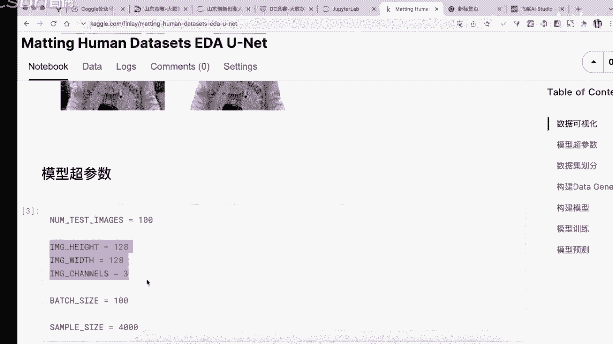

# 人工智能—计算机视觉CV公开课（七月在线出品） - P17：【公开课】语义分割实战：人脸抠图PS——无二维码 - 七月在线-julyedu - BV17z4y167dq

嗯，对，各位同学能看到屏幕吗？如果能看到屏幕的同学，可以扣个一，好不好？然后我们马上开始我们今天的一个直播啊，马上开始。那么大家之前了解过这个与分割的一些任务吗？嗯，如果有了解的话呢。

你可以啊就是说打字啊，让我知道。对，嗯，我们今天的晚上的一个直播呢也是有一个抽奖活动啊，就是我们在今天晚上周播直播呢我们是分三次来进行一个抽奖。

每次抽奖呢就是呃就是说领取我们的一个现实在线的1个VIP月卡，每次都是1实0名同学，实0名同学。对，嗯，然后领取的的同学呢可以直接在7在线的官网兑换相关的一些课程。

然后我们今天的一个直播呢也是有一个具体的优惠啊。就是说嗯如果在今天晚上报名，我们的正式课程呢，也是有具体的一个优惠价格啊，有一个优惠价格。然后如果大家感兴趣啊，如果大家感兴趣呢。

也可以来就是说也可以来进行一个对课程进行了解好。嗯，这个地方呢我们今天所介绍的一个主题呢是语音分割语分割，它是就是说是一个智能视觉里面的一个常见的任务。然后我们嗯是利用这个具体的一个任务呢。

完成我们的一个就是说人脸抠图的一个应用啊，完成我们的一个人脸抠图的应用。然后如果各位同学也想要领取到我们的今天的一个代码和课件的同学呢，都可以啊加一下我们杨老师的微信，加一下我们杨老师的微信啊。

然后我们的杨老师呢，也可以及时的将我们的一些资料发给大家。好。然后我们就继续啊。

嗯，首先呢我们看一看今天所讲的就是说具体的这个内容就是第一部分是深圳学习的一介绍。第二部分是我们的一个就是一分的离想。第三部分呢是人脸PS的一个时段，是用有同学问的是用U吗？是的啊。

我们是使用U来做的来做的。好。我们看一下。首先那我们来介绍一下区月在线啊，就是区月在线呢是一家嗯就是成立2015年的职业教育在线平台，专注于人人工智能时代的人才培养和企业服务。呃。

企业在线呢不仅是面向于个人个人客户啊，就是说我们的就是人面向于普通同学的人才培养，也面向我们具体的一些企业的培养。嗯，就是说培养的客我们的具体的客户呢，不仅仅包括入门的同学、就业同学以及在线提升的同学。

也包括了就是说企业嗯相关的一些培训，比如中国联通、国家电信以及广西集团等等。嗯，我们的具体的公司的一些呃价值观和使命啊，这个地方大致给大家看一下啊。好，然后这是我们公司的网址。

如果都各位同学想要到就是查看我们公司有什么具体的一些课程啊，也可以登录。我们就开始我们的第一部分啊，深度学习的一个介绍。呃，什么是深度学习呢？深度学习呃，这个地方它跟我们的记忆学习有什么区别呢？

这个地方其实是要呃就是说你要把它嗯重点来看的深度学习呢，它是一种具体的一类的一个机忆学习的算法。也就是说深度学习这个地方与机器学习的两者之间的区别啊，两者之间的区别。

这东西呢它是包含了多层的一个神经元的一个网络结构。它是与人的一个大脑神经元是非常类似的。这个地方深度学习呢，它这个地方一句话说明它的一个组成结构啊，或者它的一个特性是类似于这种神经元的这种结构。

那么生下学区它是一种端到端的一个。训练过程啊，端到端呢就是说我们这个地方端到端呢是表明我们的有一个。inputs然后到我们的一个output。这个过程啊input和我们的output这个过程。

这个地方为什么叫端豆端呢？因为我们的模型在这个建模的过程中，它是没有在没有就是说没有其他处理过程的，没有其他处理过程。也就是说中间就只有我们的一个模型。

这种模型它是从我们的一个输入到我们的一个输出的这种映射关系。那么深度学习它在进行建模的过程中呢，你可以将它的一个具体的过呃计算过程呢，把它视为一个有效的一个计算图，有效的一个计算图。

这个地方图的节点表示它的一个具体的计算过程，它的一个每个节点表示它的一个具体的计算过程。好。然后呢，这个地方我们的一个具体的一个操作啊，我们具体的一个操作。

就是我们是可以将一个网络结构呢把它写为如图所示的一种形式啊。如图所示的这种形式。我们是将我们的一个具体的一个网络结构可以把它汇聚成这种有效的啊，有效的在这种带有节点的一个图。

然后呢我们在这个地方有输入层隐含层和我们的输入层输入层隐含层，我们输入层。输入层呢是我们的呃具体的数据的一个输入，它可以支持多维的一个输入，甚至一个矩证的输入。然后呢，我们的一个隐含层呢。

隐含层就是我们的一个中间的计算结果。嗯，有了我们的输入层之后，然后通过我们的一计算，然后得到我们的隐含层。隐含层呢，它就是中间的一个计算节点，中间计算节点输出层呢就是我们最终的结果输出，就是我们的。

在这个地方，我们每个节点，它通过一系列计算完成了对应的输出。这个地方就是我们的一个输入层银行层和我们的输出层啊。这个地方我们的一个具体的一个就是我们的隐含层，它有可能是有多层的。

隐含层是可能是有多层的啊。嗯，我们如图所示的这个图呢其实只有一一层隐含层。但是呢其实在我们的一个具体的一个操作过程中呢，其实是可以啊就是说由多层所组成的啊，由由多层所组成的。然后这个地方我们的每个节点。

每个节点。每个节点呢就是我们的一个具体的一个就是神经元的一个具体神经元的。然后在这个神经元里面呢，我们其实本质需要做一个什么样的操作呢？这个地方它本质就是一个我们的一个全连接的网络，对吧？

我们的一个全连接网络。所以说这个地方我们的每一层呢就是我们的一个全连阶层，就是我们的一个全连阶层。在这个全连阶层里面呢，我们的一个具体的一个呃就是最最重要的啊，就是说它具体在做什么呢？

它就是在我做我们的一个具体的一个。哪个节点哪个数入节点和我们的这个神经源全部连接到一起。大家可以看一下这个边啊。对吧这个地方我们有N个输入，我们所有的N点N个输入和我们的一个神经元全部连接到一起。

那么这个地方我们的这个呃这就是我们的箭头，对吧？它就表明了就是具体的一个数据的一个流向。数据的一个流向。然后呢，我们的每个节点，这个节点就是我们的一个具体的一个就是。计算过程。

这个神经元它接收了我们的一些具体的输入，然后得到我们需完成一个计算啊，得到我们的输出。好，这就是我们的一个具体的计算模式。这个地方的申请人在做什么？这个地方的申请人本质就在做我们的这样一种操作。

这样一种操作呃，它是将我们的一个具体的一个输入啊，它是将我们的一个具体的输入呢，把它转变成我们的一个输出。这个具体的一个计算过程呢是以如下的这种形式来完完成的。如下这种形式来完成的。

我们假如是有我们的7个输入，就是说我们的输入是7个维度的话，输入7个维度的话，我们的每个维度就是说每个数值和我们的每个神经元的一个权重进行相乘。对吧嗯画一下啊，1234567。

然后和我们的一个具体的一个神经元。哪个进行相连。好，然后呢这个地方每个项年的过程中呢，就是说我们传入的数据呢，它有一个对应的权重。对应的选中与和与和它进行相乘，也就是我们的X1乘W1，加上X2乘W2。

加上X3乘以W3一直类推啊，然后进行得到我们的一个中间计算结果。我们的中间建结果呢，其实这个地方你会发现它就是一个行列式的一个乘法，对吧？我们的一个行列式，对吧？我们的一个行线好像一个列线之之间的乘法。

然后得到一个取值。这个取值呢再加上我们的偏值，然后得到我们的输出。这个输出呢，我们再通过一个激活函数F。这个奇函函数对吧？我们可以用sigoid。

或者说我们用re路来做我们的计划函数来增加模型的一个建非线性的建模能力，对吧？所以说这个地方我们就是将我们的整体的一个形式啊，这是一个神经元的一个权重和我们的一个具体的一个输入进行一个计算。

得到一个输出。那么以此类推，如果我们有多个神经元的话，也就是说我们假如说是有具体的一些输入。然后我们有多个神经元的话，那么你会发现啊，这是我们的第一个神经元的一个连接。每个每个连接呢有一个具体的权重。

然后这是我们第二个神经元的连接，每个连接有它对应的权重。以此类推呢，你会发现我们的第二行。这个地方的仍然是有我们的W对吧？7个W和我们的一个输入进行相乘，然后进行相加的话，那其实也是类似的一种形式。

所以说这个比方我们的第二行就是我们的第二个神经元的一个具体的参数啊，我们的第二行就是我们的第二个神经元的具体的参数。好，我们继续。那么这个地方我们有了我们的一个具体的一个输入的数据。

以及我们有了我们的神经元之后，我们就可以将我们的一个神经元的参数和我们的输入数据进行一个举证的一个惩罚，对吧？举阵惩罚。然然后完成我们的一个具体的一个就是我们的一个操作，然后得到一个取值。

每个神经元它的参数和我们的输入进行计算，得到一个取值，每个神经元和我们的输入进行计算，得到一个取值，对吧？以此类推，然后假如说我们这个地方有5个神经元，那么我们的输入是7维。那么我们接下来输出的维度。

就变成了5维的，对吧？所以说这个地方的一个全新接网络，其实它本质就是在做我们的一个就是呃一个很非常典型的一个。嗯，就是维度的一个变化啊，就是说一个非常典型的一个维度的变化。好。

那么有了这样的一个变化之后呢，你会发现我们的一个具体的一个神经元，他就在做我们的一个什么呢？他就在做我们的一个。举证相乘，有了一个矩证啊，有了一个矩证和我们的一个具体的输入，这是一个输入。

假如说我们有不止一个输入的，我们还有一个输入。要么我们就得到了维度就变了，对吧？它的维度就会变化。就以是这个地方就是说假如我们的输入数据是呃，我们输入数据是1个7乘以5。

我们的一个具体的一个参数是我们的一个5乘以7的话，那么进行几聚能相乘，对吧？那么它最后就得到了5乘5的一个。矩阵5乘5的矩阵，这个5乘5是什么呢？我们由最终得到的是5个样本，5个样本。

每个样本呢它的维度变成了5。对，对吧？就是说我们最终呢就可以用矩阵乘法来代替我们的全链阶全链阶层。那么我们在学习一个具体的一个深度学习的时候呢。

也可以将这个学习的过程呢把它转变成我们的一个呃就是说我们的一个嗯就是。我们这个图呢其实所绘制的是一个我们的一个。嗯。😊，网络结构的图。那么我们其实是需要将我们的一个网络结构的图呢。

把它转变成我们的一个具体的一个矩阵的一个计算过程，把它转变成一个矩证的计算过程。这个矩证的一个计算过程呢，它其实本质就是我们的一个。能够将我们的一个聚算过程啊能够进行一个快速优化啊快速优化。快速优化。

然后完成我们的计算过程。好，这个呢就是说我们在学习一个具体的一个嗯网络模型的时候，我们需要知道这个网络结构是怎么样的。然后呢，接下来也需要知道我们的一个具体的一个，就是说它是如何进行一个实现的啊。

如何进行一个实现的。那么我们在学习这个深度学样本那习的时候呢，你千万不要将深度学习与这个。具体的一个嗯非生的学习，也就是记忆学习把它进行一个对立起来。

你需要知道这两者其实是可以进行一个就是说把它汇总到一起啊，把两者汇总到一起的。因为这个地方我们的记忆学习和深度学习，其实两者是呃在很多的一些算法其实是相似的，以及它的一个基础啊都是相似的，都是相似的。

所以说呢大家千万不要把这两者对立起来，两者对立起来。只不过这两这两类模型，它用到的方法是不一样的，用到的方法是不一样的。然后呃如果是初学者的同学呢，就是说你可能啊就是你在学习过程中呢。

你可能的一个学习方法也可能存在一个区别啊。对。那么深度运行它到底有哪些具体的一些案例呢？这个地方深度学行它能够用到的一些具体的场景。比如说这个人脸识别、侧牌识别、动物识别、红绿灯检测。

或者说这个文本翻译以及客服对话机器人，这个是深度预行比较适合用的一些任务。前者呢这个地方是我们的一个输入的数据是一个音。后者呢这个我们输入的数据呢是一个text。对吧这是两类任务啊两类两大类。

两个大领域。呃，一个是CV一个是NRP。然后对于深度学习而言呢，其实我们的一个具体的一个它非常适合解决的任务就是这种我们的一个非结构化的数据啊，非结构化的数据啊，非结构化的数据。然后对于深度学习而言。

它解决这种非结构化的数据啊，它的精度也是比较高的，也是比较高的。好，我们继续。然后呢，我们接下来呢就看一看这个语分割啊，其实呃我们在进行一个具体的一个嗯介绍语分割的时候呢。

你需要知道语分割其实它本质是在做什么，你需要知知道这样一点啊，我们再做一个具体的一个就是嗯。你分割的一个任务的时候。其实它本质就是在做分类，它本质就是在做分类。对。

所以说这个地方我们首先呢你需要知道这个分类在做什么。对于我们的图片分类呢，它的一个输入的数据就是我们的一个图像。然后通过我们的一个具体的一些网络结构。比如说我们的一个卷积层。

以及我们的一个嗯一些相关的层，对吧？我们有了一个输入的一个图像，然后把它转变成一个具体的一个类别。就是我们的一个具体的一个。分类对吧？那么余分割呢，它跟分类不一样，余分割呢它是这样定义的。

当我们输入一个维度为H乘W乘N的一个图像，这个地方H和W是图片的长和宽，N呢是图片的一个通道数。这是我们的输入的数据。然后呢，我们在进行一个建模的时候呢，我们输出的是H乘W乘C的一个矩阵。嗯，啊稍等啊。

喝口水。好。Right。这个地方我们的H和W仍然和我们的数的数据维度是一样的。这样的话我们输入的数据维都是一样的，只不过这个地方我们的通道数是变了。从我们的N转变成我们的C了。N转变成我们的C了。

那么这个地方我们在做什么呢？我们再做一个具体的一个操作，就是说。如果我们在做一个分类的时候。这个地方我们是在做什么呢？它是将我们的一个它是有一个类别，对吧？输出的是一个我们的类别。

但是呢这个地方并不是说直接输出一个类别，它的一个具体输出呢其实是一个概率的一个向量，一个wector。就是说这个we里面假如说有三个取值啊，0。3。0。40。3就如三个取值。

那么这每个取值呢就表明呢是对应于嗯就是说某一个类别的一个概率，某个类别的概率。比如说我们这个地方是我们的第二个类别，它的一个概率值最大。那么我们就认为我们这个地方我们的图像。

它是属于我们的它的它的预测结果啊，是我们的第二个类别，第二个类别。对吧那么在我们的一个具体的建模的过程中呢，我们的输出其实是一个vector，是一个vector啊。

就是说我们的分类网络其实它本质输出的是一个vector。那么在这个地方你会发现我们的一个输入是H乘W乘一个C。啊乘以N，然后我们输出呢是H乘W乘C这个地方的C呢就是我们类别数。类别个数。

这个地方我们的一个每个网络，它在做什么呢？这个网络就是对我们的每个像素。做一个分类，对吧？你你会看到这个地方我们的一个输入的一个数据，输入的数据它就是我们的一个图片，对吧？

假如说是1个256乘以256乘3的一个我们的一个矩阵，我们输出的一个假如说我的类别是10。那么我们的输出的维度就是256乘以256乘以10这样的一个维度。我们在这个地方每个像素它输出的一个维度。

是1乘1乘10。对吧如果我们把这个两个嗯1乘1的一个把它滤掉，那么它本身也是一个w。本身也是对吧？对也是和我们这个地方的嗯是一致的啊，和我们这个地方呢是一致的。也就是我们在进行一个具体的一个建模过程中。

我们这个地方仍然是可以作为我们的一个具体的一个。就是嗯。对我们的一个像素级别啊对我们的一个像素级别做一个具体分类。像素级别做一个分类。好。那么我们在做一个具体的一个语分割的时候。

我们还要回到这些PPT啊，我们的一个具体的一个语分割。我们来看一看我们的一些具体一些任务啊，我们往下看。我们这个地方呢，我们在做一个具体语义分割的时候，他其实在做什么呢？

那其实本质就是说我们有了一个具体的一个输入的数据之后。假如说我们输入一张图片，我们需要将它的一些具体的一些像素。把它进行分隔开，把这像素进行分隔开。这个地方的像素呢，你可以理解。

就是说具体的就是我们的一个。每个像素的取值每个项素取值。然后如果我们是完成一个目标检测的任务呢，我们的一个具体的一标签就是每个物体的一个坐标，每个物体的坐标对吧？如果我们是做一个语分割呢。

我们这个地方的一个区别结果，就是每个像素的一个类别，每个像素它输出一个veact，然后我们把这个wact转变成一个类别。然后可以绘制得到这样一个图像啊，这个呢你可以可看一下。

就是我们的鱼分割它的一个标签，鱼分割的标签。好，语分割的标签。那么我们在进行一个建模的过程中呢，其实啊第一类任务就是我们的目标检测。第二类任务是我们的实呃语分割，对每个项素进行分类。

如果我们是将我们的一个呃目标检测和我们的语分割，把它结合到一起呢，就可以得到这种实力分割实力分割。就是我们在进行一个识别的过程中呢，需要识别出每个人的啊每个人的具体的一个像素的一个类别。

以及我们对应的一个目标的一个框选的位置啊，这是我们的一个具体的一个呃语分割和我们的一个实力分割。那么我们这节课呢其实是讲了一个具体的一个语义分割啊，讲的是语义分割。好。

我们继续这个地方我们已经达成共识了啊，语音分割就是对我们的像素级别，对我们像素级别做一个分类，像素级别做一个分类。好，这个地方我们先嗯给大家做一个第一个提问啊，如果我们的一个输入的图片是1个256。

乘259乘3，我们这个地方有5个类别，5个类别需要做预分割。我们输出的维度是多少呢？输出的维度有多少呢？然后我们大家如果知道答案的同学呢，可以在我们的一个评论区，然后进行打字啊，进行回答。

前1名回答问题的同学呢，可以领取到嗯我们的学在线的一个月卡。对，有没有同学想回答的？有没有同学想回答的？对。有没有同学想回答的？其实这个很简单，对不对？好，在我们的一个具体的一个建模的过程中呢。

假如说我们的一个输入的数据是我们的256乘226乘3，我们的一个具体的一个输出的类别是我们的哦五5类的情况下，我们输出的一个维度就是1个256。乘256乘5对吧？是这样一个维度，这样一个维度啊。

然后我们这个地方呢一语分割呢，它是对我们同类的一个像素啊来视为我们的一类，然后做一个分类的啊。对，黑帽子编程度同学啊，回答正确的啊，然后嗯非常正确啊，256乘256乘5。

然后这位同学你可以加一下我们的杨老师的微信啊，可以领取一份我们有一些在线啊赠送的一个我们的一个具体的一个嗯VIP月啊微信4699同学说说的这个是非常大的一个数值，你是把它展开了吗？

这个展开不是我们想要的，我们想让他原始的啊，我们想要它原始的一个维度。嗯，5个通道QQQQ4422556666669分9同学也回答对了啊，就是也可以加一下我们杨老师的微信啊。对，嗯。

这个这两位同学可以领取到我们的VIP月卡啊，这两位同学可以领取到我们的VIP月考。好。我们继续啊。那么语分割其实他在做一个具体的一个嗯标注的时候，其实是蛮困难的一件事情。因为对于语义分割呢。

我们在标注的时候，其实我们是需要对它的具体的这个每个像素，每个像素做一个标注，每个像素做一个标注啊，我们需要做每个像素的标注。所以说在做语分割的时候，其实我们是需要对。

这个区域就是说我们图片的一个区域啊做一个勾选区域做一个勾选的。如果我们是想要对于我们的语分割做一个标注呢，你可以用label me来做一个标注，或者说用我们的一个就是说模型的一测结果。

然后加上人工修正啊来来做。在于分割里面呢常见的这个数据集就是我们的paOVC。呃，CTspace啊以及ADESK啊这些具体数据集。好嗯，还有同学啊这个。嗯，LHLHQ同学呃，也是回答对的啊。

256乘256乘5啊，这个地方有三位同学啊，这三位同学可以加一下我们杨老师的微信啊，然后领取得到我们的一个有契约性。我们提供的这个VIP月卡啊，VIP月卡。好。

那么我们接下来呢就呃介绍一下un呢它是一个非常典型的一个语音分割的这个模型。它在它在具体做什么呢？un其实它本质在做我们的一个操作的过程中呢。

它是将我们的网络结构呢把它抽象为一个嗯编码器和解码器的这种架构啊，它主要是由我们的一个4次下采样和4次上采样来组成的。这个上采样呢，我们是可以使用转置卷集。

或者说我们的一个up sample这个操作来嗯组成啊，就是说我们直接用这个我们的一个上采样，或者说我们用转制卷集来实现。这个都行，这个都行。好，然后呢我们在做一个具体的建模的过程中呢。

我们的一个具体的一个。网的模型呢其实就是类似于这种U型的一个结构啊，类似于这种U型的结构。然后呢，又在其这个地方，其实你会发现这些有这种s pass。jo pass。对吧我们有这种就是说连接的一个边。

或者说这种跳接边这个地方呢so plus他在做什么呢？这个地方呢s bus其实它本质就是将我们的一个具体的一个。输入的一个数据，再不通过我们的这个中间层的计测算结果，然后直接输出到我们的一个嗯更深层。

这是跟retnet。其实差不多的resnch其实差不多的啊，跟ren其实差不多的。那么这个地方为什么要在我们的一个inage里面使用这个我们的一个s pass呢？其实是这样的，对于un而言呢。

其实他在做一个于分割的一个任务。sgamentation。它其实本质是需要对我们的一个pixel。做一个分类。所以说他在做的时候呢，其实是需要做的非常精细，需要做一个分析精细。

这个地方我们的一个对于我们的一个卷积神经网络而言呢，我们的一个具体的一个比较浅的层，它其实就是能够提取一些非常有效的一些啊就是说局部信息。对吧局部信息。然后如果是更深的层呢。

就是能够提取到就是比较有效的这个语义信息。那么我们可以将这个简层和深层把它组合到一起，然后整体的可以完成我们的一个具体的一个嗯建模过程啊建模过程。

好，然后我们来看一看具体的一些案例啊。呃，这个地方啊已经有很多同学回答对了啊，然后这些回答对的同学呢可以联系一下我们杨老师的呃杨欣欣向杨老师啊，然后就可以领取到我们具体的一些代码啊。

领取到我们的VIP月卡啊。好。😊。

我们首先呢给大家介绍一个案例啊，就是说使用这个un来做一个具体的语域分割。哦，把这个字体改一下啊。Okay。呃，我们首先呢构建一个数据集啊，这个数据集长什么样子呢？就是长这样的一个样子啊长这样一个样子。

我们的具体的数据集呢其实长这样的啊。像这样的，我们在做一个具体的一个建模的过程中呢，我们本质是需要对我们的左边是我们的输入。左边这是我们的输入啊，我们需要对对我们的一个具体的一个数据集呢。

把它做这样一个操作，输入我们的一个灰度啊，输入我们的一个灰度图，然后呢需要你去对我们的一个具体的基于我们的这个灰度图，然后完成一个类别预测啊每个像素它所所处的类别。这个地方我们的一个具体的类别啊。

我们这个地方右边也标注的啊，这是我们的这个红用使用不同颜色标注好的啊，使用不同颜色标注好的。这个我们的红色以及我们的蓝色啊，黄色啊，它代表是不同的一个形状，代是不同形状。

然后呢我们是需要使用我们的一个语分割的一个模型啊，然后完成我们的一个具体的一个啊分割过程啊，右边的右边的是我们的一个具体的一个类别啊，右边的是我们的一个具体的类别。好。然后呢。

我们在做一个具体语分割的时候，其实我们的一个输入的数据和和我们的标签其实都是我们的一个举证啊，我们输入的数据和我们的一个标签都是我们的一个矩证。好，这个地方呢大家要理解一下。

我们的一个具体的输入数据呢是我们的一个输入的举阵。我们输出的。以及我们的标签也都是一个矩阵，也都是一个矩阵。好，这个地方所以说我们的一个mask。其实你你可以理解它就是一个矩阵啊，就是一个矩阵。然后呢。

我们可以看一下我们具体的一些嗯样本啊，我们的样本，这是我们输入的一个数据，这是我们的输入的数据啊，它的一个维度呢是1个192乘192乘3的一个呃数据，这个地方呢我们还是将它加入了一个。嗯。

1212的这个维度12的这个维度是什么意思呢？12的这个维度是我们的一个呃就是b size啊b size它的维度是12b它的维度是12。所以说我们的一个输入的一个数据的一个维度呢。

就是我们的一个12乘3乘192啊，乘192的一个维度。我们的一个输出的维度是12乘6乘192乘192。因为我们这个地方是需要完成我们的啊就是每个项素啊，有类6个类别啊，每个项素有6个类别。

所以我们是做这样一个做这样一个具体一个模啊，做这样一个具体。好，我们继续。然后呢接下来我们首先呢导入我们的一个resnet啊，导入一个resnet。

这个地方的resnet呢就是我们的一个就是已经就是说在我们的一个音频型的池上已经预训练好的啊，或者说我们是只导入它的一个具体的网络结构啊，只导入它的一个具体的网络结构，这个都行。导入完成之后呢。

我们可以基于这个usresonnet嗯来做我们的一个具体的一个建模过程。怎么做的呢？就是我们的一个模型建模过程就在这儿。在这儿啊。我们先看这上面的啊。

这个地方有layer0lay1layer2 layer3啊，我们来看看这些lay在做什么。这个地方的类21620621类23。这些啊0是我们在resson的前三层。

6一呢是我们的ressonign的3到5层。对吧62呢是res的第呃第六层啊，63res第七层啊，一此类推。然后这个地方的62011乘1是这个1乘1的卷积啊，1乘1的卷积。好。

然后这个地方我们定义了这个up sample啊，up sample是做一个上采样的一个操作啊，是做一个上采样的一个操作。好，咱们继续。那么我们看一看这个具体的网络结构是怎么定义的。

首先呢我们的一个输入的一个数据呢，在通过我们的一个lay0做一个维度的降低。然后通过lay一 layer2lay3 layer4啊，这个基本上是在ressoniness里面的层。

然后呢我们对于我们的这个输出结果。这个地方的lay。输出的4啊，就是说通过这我们的五层的一个计算结果的一个输出呢，再通过一个一乘一的卷积，然后进行up sampleble。

然后我们这个地方up三坡之后呢，然后再通过一个一生一的卷积。好，这个地方关键之处在这儿这个地方我们这这些计算的结果和我们的一个具体的列3的一个结果，其实是可以把它拼接到一起的。

这个就我们的一个s pass的一个操作。s pass的一个操作。然后我们也可以把它继续做我们的一个就是说卷积，然后再做我们的呃up sample。这个地方呢我们在做完up sample之后呢。

然后再跟内2的一个初置结果，把它做一个拼接。这个链2是在我们的之前已经做好的一个输出。对吧然后这个地方的X它是通过我们lay2之后，再通过lay3 layer4以及我们的一个异生逆选集。

然后通过up sample得到的。所以说呢这个地方的 layer2和lay我们X呢，其实它也是做一个拼接啊，也是做一个拼接。这个地方你也可以理解是一个s pass一个 pass。好，我们继续。

然后这个地方你你你可以将这个网络结构啊和我们的这个地方其实是可以对应上。它是将我们的一个维度啊，维度直接维在维度上做了一个拼接啊，维度上做了一个评级，维度上做了一个拼接。好，那么这个地方的每个箭头啊。

这个地方的啊我们的四条。我们的一个箭头啊，就是我们的一个conca操作啊，我们的conca操作就是我们的4次的一个软件。4次我们说 fast。然后呢，我们的一个最终的一个输出的维度。

其实是有我们的con这个卷积。这comp是n呢，它是一个卷积，它的卷积呢是在将我们的一个呃具体的一个网络结构的一个维度呢，从我们的一个。就是呃多通道的一个，比如说64通道的。

我们需要把它转变成我们的N class的一个通道数。N class的通道数。这个N class的通道数呢就是我们的它的一个通道数，它是和我们的一个具体的一个嗯类别个数啊，类别个数是相同的。

它就跟我们跟我们的类别个数是相同的。好，那么通过这样的一个网络结构的操作呢，你会发现我们的一个输入的一个维度。我们能看一下这个下面啊。我们的一个输入的维度是。和我们的一个输出的纬度。是能够对上的。

只不过这个地方有一点点小区别，小区别就在于它的一个具体的一个通道数啊，通道数通道数对。这个通道数我们输入的是3，我们这个地方输出的通道数。是我们的6啊是我们的6这个地方由于我们是需要做一个6分那个啊。

需要做一个6分那个。我们继续。然后呢，这个地方我们的一个los function呢，我们怎么构建我们ns function呢？

这个地方的ns function其实可以直接用这个分类的los function啊。呃，这个地方我刷新一下网页啊，它没有显示完全。嗯。有没有tenflow版本的啊，待会有一个tensflow版本的。

待会儿是有一个ten flow版本的。对，大家稍等一下啊。嗯，我们放到下面啊，这是一个pathon系版本的。这个地方的分类损失呢，其实你可以用我们的一个二分类。

对我们的就是说像素级别做一嗯我们的一个输出的一个概率向量和我们的一个嗯就是我们的一个真实标签做一个分类，或者说将我们的一个具体的一个网络结构呢使用这个DICDI做我们的一个分类损失。

就是将我们的一个具体的一个啊，就是我们输出结果的一个输出结果的一个具体的一个区域和我们的一个预测结果的区域呢算一个交叉比啊，算一个交叉比，然后以这个交叉比呢做我们的一个 function。

其实也是可以的也是可以的。好，那么我们在做一个具体的一个建模的过程中呢，其实建这两个los其实是可以把它汇总到一起的啊，可以把它汇总到一起的。好，那么如果是使用这个pat呢，这个代码就是这样写的。

就是说对我们的输入的数据。比如我们的训练集和验证集。如果是我们的一个训练集呢，就是做一个这向传播计算我们的一个los，然后做我们的一个反向的一个传播啊，这是我们的一个就是训练集。如果是我们验证集呢。

就只需要做一个呃智向传播即可啊。如果是我们的一个验证级，就是我们的只需要做一次这向传播即可。好，我们来看一看我们的一个识别的结果。这个地方啊。左边呢是我们输入的图片。右边这一这一列呢是我们的嗯真实标签。

第三列呢是我们的一个预测的结果啊，是我们的一个预测的结果。对，所以说你会发现我们的一个具体的一个模型呢，其实是呃能够做能够识别得到我们的一个就是说就是说嗯这个就是它的标签啊。

我们预学结果整体还是非常相似的，整体还是非常相似的。那么我们继续啊我们继续这个地方是基于我们的一个呃来写的啊，基于我们的一个pat来写的，它是一个具体的一个做我们的六分类的啊。

六分类的一个具体的一个预分割的一个任务，六分类的分割的任务。好，那么我们这个地方呢也给大家准备了一个基于这个Ks的啊，就tenflow2版本的一个具体的代码。我们的一个代码呢就是做一个。

人人脸抠图啊人脸抠图，我们的一个左边是我们的一个原始的一个就是说图像，我们需要把它转变成我们的一个右边的这个图像啊，右边的图像。这个图像这个地方我们相当于是把它的背景啊，把它的背景全部给它剔除掉了啊。

希我把它剔除掉了，只是将与人相关的啊，与人相关的一些像素啊，给它保留下来了。这个地方呢我们是呃你可以理解这个地方就是一个把我们的一个图像把它转变成了一个透明图啊，转变成一个透明图。好。

那么我们这个地方我们的一个输入的数据呢，其实它是一个不规整的一个形式，而且它的尺寸呢可能是非常大的啊。就是说所有图片它的尺寸都是啊就是说不规整的。为了把就是说快速加速我们的训练啊。

我们这个地方呢是将我们的一个具体的一个图像呢，所有的输入和我们的一个输出呢，把它转变成一个相同的一个维度，相同的维度。比如说都把它转变成一个128乘1828的一个维度啊，这样我们的图片需要做一个缩放。

这个地方有一个小小的一个注意地点，就是说如果是对于我们的图片做一个缩放呢，我们的一个标签也需要做一个缩放，也需要做一个缩放。好，我们这个地方第二个问题就是说我们这个地方的一个输入。它的维度是多少呢？

以及我们的输出的维度是多少呢？对，有没有同学嗯知道我们的答案的。如果知道我们的答案呢，也可以在我们的一个评论区打出来啊。然后就是就是我们也送出我们的10个VIP啊，10个VIP有是企业在线提供能。

有没有同学知道的，我们这个地方的一个输入的维度和我们输出的维度。

我给大家3分钟啊，如果有同学知道的话，可以啊打出来这地方我们输入的纬度是多少，以及我们的一个输出的纬度是多少。

好。你们有没有知道的？

输入是3。输出啊，这个地方这位同学说的好，挺好的，输出的维度是128乘128乘2，对吧？可以，这个地方其实我们的一个输入的维度和输出的维度，其实你可以这样想。

你的一个输入的维度其实是嗯可以写成这样的。

它的数的纬度是128乘128乘3。那么我们的输出呢。其实你可以把它写成128乘128。嗯。二。或者说乘2。乘2。这个东西。乘一或者乘2这个都行这个都行的啊。这个地方我们在做一个具体建模的过程中。

这个乘1或者乘2是没有区别的啊。因为我们这个地方其实是做一个二分类啊，做一个二分类，对，做一个二分类。好。

然后我们这个地方就是说你做的就是维度啊。对，这几位同学嗯，就是说回答都挺好的。对。呃，这几位同学都可以加一下我们的杨老师的微信啊，就是领取一下我们7业在线的1个VIP月卡。

领取一下我们的学业在线的1个VIP月卡。所以说大家知道这个类别构成之后，然后就可以嗯做我们的一个具体的一个就是说维度的一个确定啊，维度一个确定。

好，然后呢接下来我们将我们的一个具体的数据集呢，把它转变成转就是说把它转换成我们的一个训练级和我们的一个呃验证集这两部分啊，训练级和我们的一个验证集这两部分。

好，然后呢我们的一个训练级的一个呃样本个数是我们的3400，以及我们的一个验验证级的一个样本个数呢，是我们的600啊，验证级的一个个数呢是600。对。

好，然后呢我们接下来需要构建我们的一个data generator呃，data generator啊这个地方呢data generator呢我们这个地方是这样做的啊，这个是cars的一个写法。

cars写法。我们在做一个具体的一个呃就是说建模的过程中呢，我们是可以将我们的一个具体的具体的一个输入的数据呢呃提前读取到我们的一个内存里面。😊，我们是提前将我们的一个图片，把它做了一个读取。

然后把它做一个resize。然后呢，对于我们的一个musask呢也是把它做一个读取，然后做了一个resizes。这样呢就相当于是我们是将我们的一个图片和我们的一个具体的一个就是标签。

把它规划到一个相同的一个纬度啊，相同的一个输字的维度上面。相等于输入维度上面。好。我们继续。这个地方你会发现这个地方我们选择的一个mask就是单通道的，是一个单通道的啊。

是选择的第三个通道的第三个通道的。好，我们继续。然后呢，我们这个地方由于我们的代码是使用这个tensflow2来写的，使用tensflow2写的。

所以说这个地方我们是需要构建一个具体的一个data generator啊，data generator这个data generator呢就是将我们的一个输入的数据完成一个批量读取的一个操作。

我们的些输入的一个数据呢提完成一个批量读取操作。嗯，我们不管是在这个特这个嗯tenflow啊，以及我们的cas里面啊，都是需要做这样的一个操作的啊，需要做这样一个操作的。好。

然后呢构建我们这个gene之后呢，其实我们的一个输入它的呃就是输入和输出就转变成我们的这种批量的这种形式。批量的一个形式就是我们的一个具体一个输入是我们的100乘以128乘以18乘3啊。

这地方3就是说具体的一个维就是这个顺序啊，具体一个顺序我们其实是可以呃做一些呃修改的。但是整体的一个构思啊，整体构思大家也知道以及我们的输出的维度啊，100乘以18乘以18乘以1。

好。

然后呢，这是我们的一个输入的图片啊。嗯由于我们这个地方是呃就是它的一个颜色空间，不是RGB的啊，不是RGB的。所以说我们这个地方其实是想要把它做一个可视化呢。

其实我们是需要把我们的一个呃呃图片呢把它转变成RGB的啊，然后再做可视化。然后这是我们对应的标签。这是我们的输入的数据啊，这是我们对应的标签，它是1个01的啊01的一个嗯矩证。

然后呢，我们来看一看这个对应的这是批量的一个数据啊。然后这个下面是我们批量的标签。对吧我们标签就是一个灰度图啊，灰度图。好。这是我们的验证级的一个gene单ri，验证级的简单。好。

这是我们的验证级的图像，以及它的一个具体的标签啊。当然这个书已经也是有噪音的啊，也是有噪音的，并不一定是完全都是啊就是说完全都是我们的一个呃O的啊，完全都是O的。好，然后接下来呢我们就是构建我们的模型。

这个地方呢我们是使用这个ten啊2，也就是说使用我们的一个ten2来完成我们的一个具体的一个呃模型的一个搭建过程，模型的一个搭建过程。然后呢，我们在做一个具体的建模的过程中呢，我们其实是将我们的一个。

具体的网络模型呢也是搭建我们的这个U。对吧卷积层。卷积层置换层对吧？我们这个地方C1P1C2P2C3P3C4P4。好，这是我们的一个具体的。你可以理解这前面的就是我们的4个incoder。

四层的一个inco。然后从这儿开始，我们就是具体的一个deder。这个dededer也是我们的四层啊，你可以理解就是四层4个b。我们这个地方转折卷积对吧？

它是没有这个地方我们不是用这个up sample，我们可以用转置卷积来代替我们 sample对吧？然后这个地方也是从这开始，从decode开始，就是我们的一个 pass。把我们的拼接到一起，对吧？

这个地方的C是来自于我们的C5之前的。然后这个地方我们的C3呢来自于我们的U。C6U6C5C4之前的这个一个位置，对吧？就是我们的 pass。好。

这个地方你会发现他的网络结构和我们的PPT里面所示的也基本上是一致的，基本上是一致的。那么我们这个地方的一个训练过程，最终的一个输出的一个维度，通道数啊，它通道数就是我们的一个一单通道的输输出的维度。

就是我们的一个单通道的。好，然后我们这个地方的一个具体的一个算传函入，就是我们的一个banary的块算。banary的一块算。因为我们这个地方就是只需要做我们的一个单通道的单通道的一个输出。

单通道的一个输出。好，那么我们来看一看我们的一个具体的一建模，具体的建模。那么由于定义好了我们的一个具体的输入和我们的输出，以及我们的一个损失函数数了。那么我们接下来就是直接就是完成训练就行了啊。

face generated fish generatedface就是直接由我们的一个输入。我们geneator我们的vi以及我们的co back。这个co back就是我们写好我们的二次啊。

以及我们的一个model checkpoint。然后我们可以看一下我们的一个训练啊。

主要看一下我们验证级的los，验证级的lo从0。55到0。28一直降低啊一直降低。呃，然后这个地方我们是训练的20个Epoke啊，20个Epo呃，我们的训练速度其实是非常快的啊。

每个Epoke只需要有5秒啊，需要5秒。然后我们最后呢看一看我们的一个预测结果。

这个是我们左边的是输输入的图像，这是我们的输出的这是输入的这是我们输出的。

对吧这是我们的输出的这是我们输出的啊，整体来看它是将我们的一个具体的一个模型。这个模型呢它是能够学习到我们的一个有效的信息的对吧？我们的输入和输出。大家来看一下对比一下。然后这个地方你会发现。

其实呃我们的输入的图片，它的一个维度和我们它就不是128的，对吧？这个地方的输入的图片它就很明显是一个不是128的。那么我们怎么做的呢？我们这个地方其实是在这儿。

我们对于我们的输入的图像呢，其实我们是。最开始把它转变成了1个128。然后呢，我们的输出的一个prediction呢也是128乘以128的。但是呢为了最终将我们的一个具体的一个网络结构啊。

我们输出结果和我们的原始的输入的尺寸能对应上。我们再把我们的输出结果再把它resize，就把它扩大到800乘600的一个尺寸。

所以说我们这个地方其实原始的一个输入的一个图像呢是1个800乘600的一个尺寸。我们的一个输出呢是从128乘以128的尺寸，把它缩放到啊。

也相当于是把它你可以理解就是就是图片的一个放大啊差值双线性差值把差值到一个比较大的一个像素，然后再去得到我们的一个具体的一个m结果。

好，这个呢就是说我们通过一个inun来完成一个人脸的一个抠图啊人抠图。对。那么大家对这一部分有什么问题吗？

呃，验证级的主要作用是什么？呃，验证级的主要作用主要是为了看一下我们的一个具体模型是不是过礼盒了。

嗯，Vliation。他主要是看一下模型，看一下模型是不是过滤盒的。电你的这个作用主要是看一下模型是不是过礼盒。对嗯，大家对这部分有什么问题吗？大家对这部分有什么问题吗？如果没有问题，我们就继续啊。

如果没有问题，我们就继续啊。

有同学可能会问到我们学电信的1个VIP月卡能做什么？嗯，就在线的1个VIP月卡呢，它是能够做嗯。看下啊。就得。嗯，假如我点击到一个具体的课程啊，比如我们点击到一个集训营里面。然后这个地方呢1个VIP啊。

他能够做什么呢？VIP月卡是能够学免费学习这么多课程的啊，就是很多嗯几千块钱的课程呢嗯就是说这样如果你是拥有的VIP月可是可以直接看的啊，很多课程都是可以直接看的。好。好。

大家如果想要领取这个呃VIP月卡的同学呢，可以现在在屏幕我们的一个评论区啊输入7微在线。好呃，这几位同学啊M0嗯376同学苏同学AHQ同学Q844同学啊，然后WJ同学黑帽子程同学啊。

这几位同学可以加一下我们杨老师的微信啊，加一下我们杨老师的微信，后微信4699同学，以及我们的nice name同学啊，你可以加一下我们杨老师的微信啊，领取一下我们的VIP月卡。抠图的原理是什么？

我们刚才就在讲抠图啊。

抠图的这个过程其实本质就是将我们的一个前景和背景把它分开呀。我们刚才讲了半天啊，这个地方我们就是说人的人脸的这些像素的一些区域标注就是一其他像素的区域标注就是零。我们做一个语音分割。

就是用语分割的这个任务完成我们的前背景的识别。

这就是人人像抠图啊，它的一个原理。对。

好。

抠通的原因就是语域分割，是语域分割。好，我们继续啊。如果你对这一部分还有问题呢，也可以继续提问啊。

然后呢，我们接下来可呃给各位同学介绍一下，我们现在在学在线正在开设的我们的一门课程，叫做嗯机器学习集器云。嗯机器学习机器营呢它是涵盖了机器学习的重要面试点。就是说包括这个机忆学习原理和深度学习原理。

然后也是提供了一年的一个GPU的云平台，也是非常接地气的一些实训项目。比如说在这个机器学习的原理部分呢，我们主要看讲解了这个具体的一些嗯线息模型以及我们的决策数啊。

以及我们的一些就是节线学习的一些原理啊，这些呢都是在我们的一个就是说机器云的嗯机器学习的原理部分会讲解到。然后呢，我们呢具具体的在集训内部呢，我们也是有一些具体的一些呃就是说培训项目啊，实训项目。

比如说我们的一些项目呢，包括这种嗯自动驾驶的一个车道性检测。就是说对于我们的一个具体的一个像素。这个其实也是一个很典型的一个语一个语分割的任务，也可以使用Ulash来完成。

这个其实也是可以用Ulash来完成的。就是说输入的是一张图片，然后通过我们的Ulash，然后对这个就是车道线做一个识别。这个其实也是可以用lash来完成的。那么在这个执行项目里面。

我们就不仅仅是会讲解到Ulash，也会讲解到其他的一些具体的一些模型。比如说会讲解到这个SCN。SCN以及SDA的一些语域分割的模型。这些语域分割模型就是专门的用在这个车段性检测的任务上面。对，好。

然后呢我们在这个具体的机器营里面呢，还有一些其他的一些项目。比如说这个语分割的一个嗯就是说我们的这种智能问答机器人啊，以及我们的电商平台的这些推荐系统啊，这些呢都是在我们的一个机训营里面都是包含的。

然后呢我们整体的一个课程安排，就是从我们的一个python的一个基础，然后再到机器学习的原理，然后再到这个深度学习的原理。然后再到一些具体一些项目时间。

然后如果大家对我们的机器人感兴趣了呢，现在如果是。今天晚上报名还是有我们的优惠的啊，可以在我们的现在这个价格的基础上呢，再免减1000元，免减1000元。这个地方有两个套餐。

一个套餐呢是100000的一个套餐，它是包含了两年的1个GPU的一个使用权，并赠送大数据集器运营和顺序集器营的这两个集器营。当然你也可以直接报名我们的一个继P机器营。它现在的价格呢是9400啊。

9400我们也可以在我们直播间呢再给大家免减1000元，免减1000元。对，然后大家对我们今天的课程，如果是有什么问题嗯，以及对我们的机器营呢有什么问题的同学呢，都可以去嗯加一下我们的杨老师的微信。

加一下我们的杨老师的微信，然后嗯进行一个具体的提问。对。

好。大家对我们今天的课程问有什么问题吗？或者说对我们的机器嗯，就是说我们有什么问题吗？也可以在这个地方直直接提出来啊。

AI讲师团的录播回放嗯，怎么没有权限看啊啊，你可以加一下我们杨老师的微信，问一下，加一下我们杨老师的微信，上面这个微信和下面这个微信都都可以。

ok。你可以加一下杨老师的微信问一下啊。好。大家对我们的今天所讲的内容还有什么问题吗？

好，如果有问题也可以及时提出来啊。如果对机器云非常感兴趣的同学，可以直接咨询一下我们的杨老师，或者说在我们的课程页面，也就是从其业在线的官网找到机器云。

然后在这个具体的一个页面啊，然后进行相关的一些了解。对。好。如果想要领取我们今天的课件和代码呢，都可以扫码，加一下杨老师的微信啊。好。

大家有什么问题吗？

验证级刚才解释了验证级啊，这个地方不是解释了验证级的作用吗？验证级主要是看一下模型是不是过礼盒呀，然后可以做一个调参。

对，这就是页面器的作用啊。好。大家如果想呃就是说刚才我们练到名字的这十几位同学啊，可以加一下我们杨老师的微信啊，然后领取到我们具体的一个呃VIP的月卡。然后如果是想要于就是说呃。就是说咨询相关的课程。

或者说领取我们的代码和PPT啊，你可以加一下杨老师的微信。验证级与测试机的区别，验证级可以用来调仓，测试机不行。应用机可以用来调参，测试机不能调成。对。好，大家还有问题吗？好，如果没有问题的话。

我们今天的一个直播就到此结束了。

