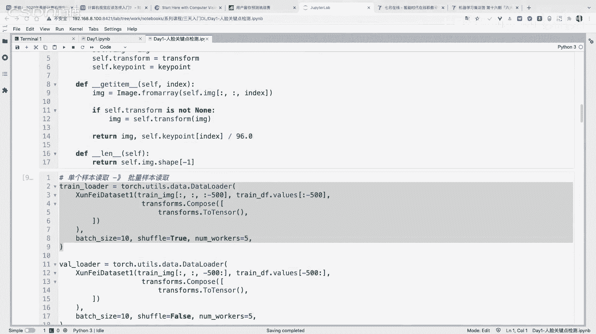
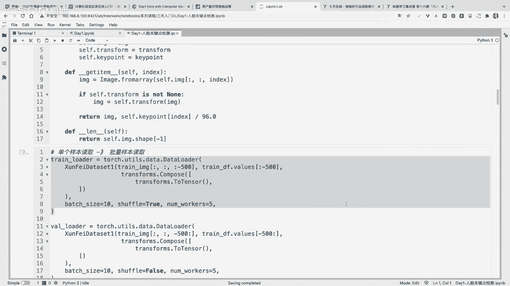
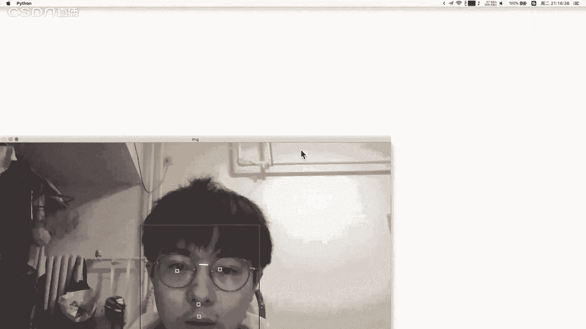
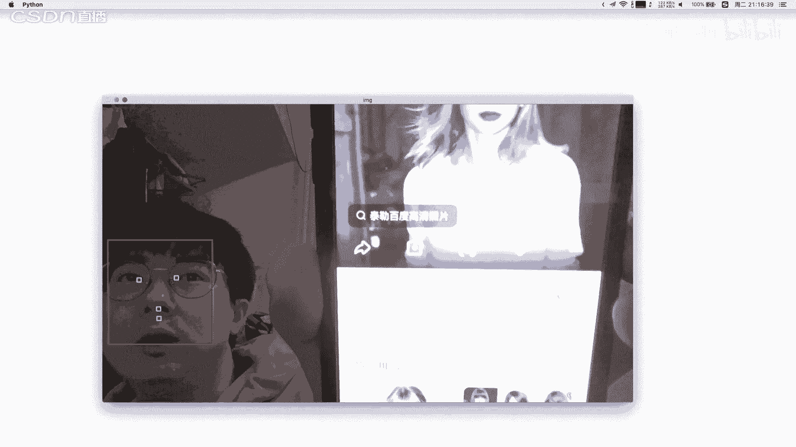
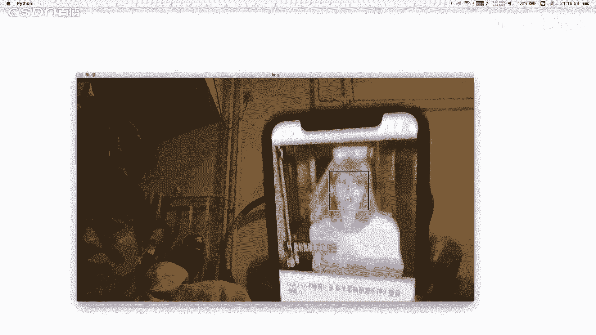
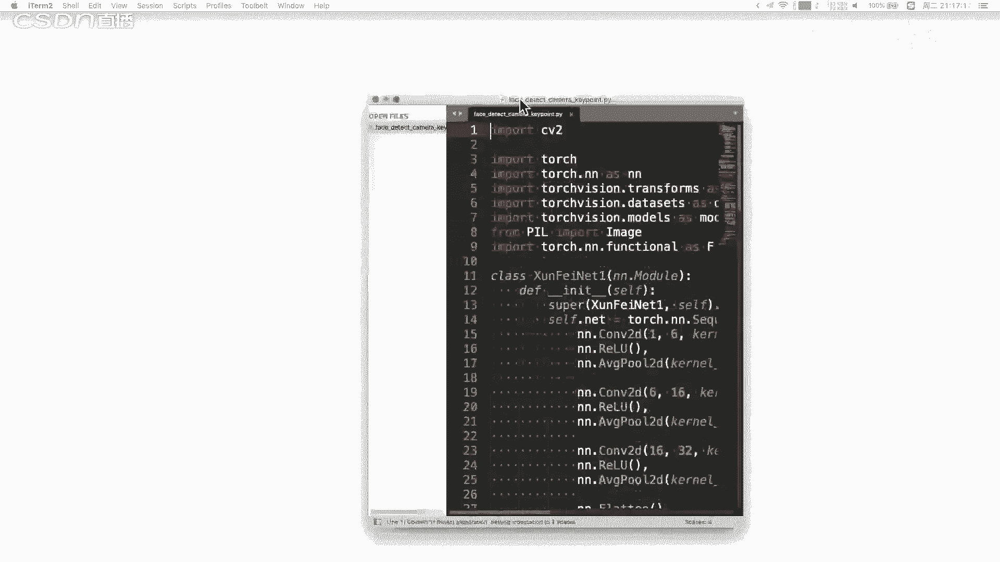
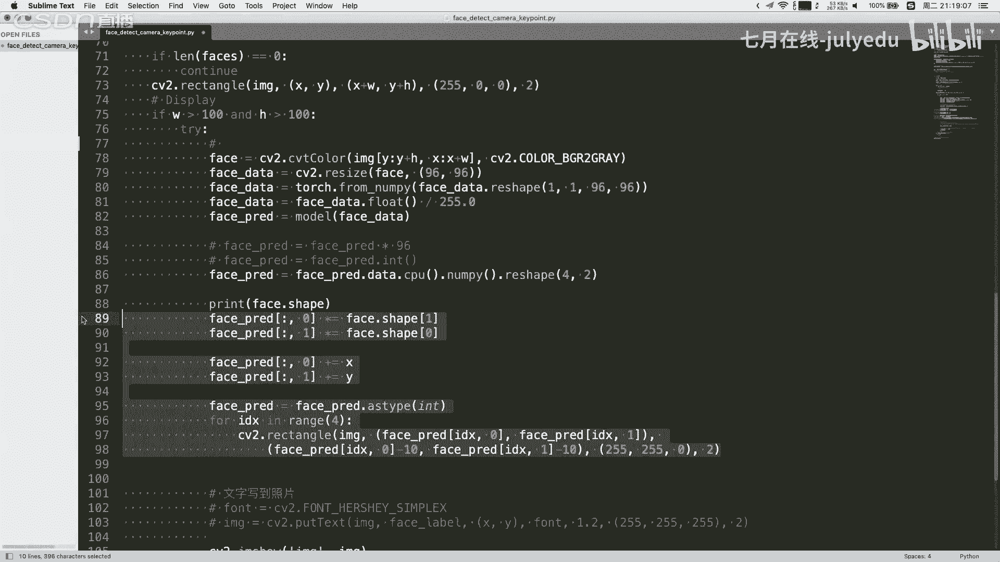
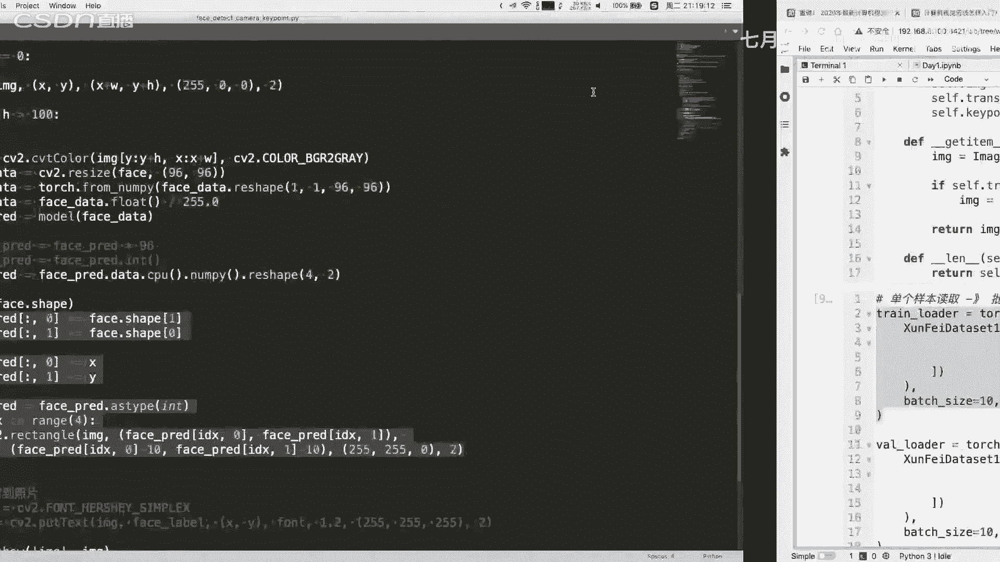
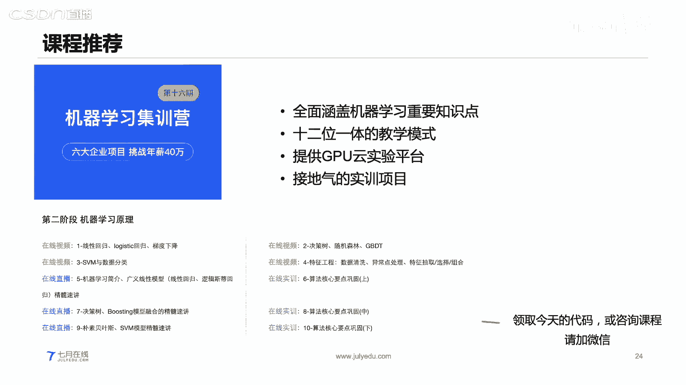

# 人工智能—计算机视觉CV公开课（七月在线出品） - P19：【公开课】从零实现人脸关键点模型的训练和部署——无二维码 - 七月在线-julyedu - BV17z4y167dq

对。大家能听到吗？我们稍等一下啊。对。我们8点钟准时开始。对，大家也可以在我们的一个直播间里面就是说进行提问啊。对，各位同学之前就是学过深度学习吗？如果学过学过深度学习的同学呢，可以扣个一好不好？

然后如果没有学过的话，也可以。嗯，之前有同学说啊学过。其他同学呢学过啊，这个学过肯定是比较好的对吧？肯定是有一定基础了。嗯。沟通对智慧学习哪一部分比较感兴趣呢？对啊。

其实深圳其实也有很多的一些其他的一些啊，就是各方各面的一些应用吧。所以说一方面是这个方向，另一方面我觉得也是看。就写一个应用。其他同学如果想回答的，也可以在我们的一个。就是聊天框里面打字啊，对。

我们就8点钟准时开始啊。嗯我们就稍等一下下啊，然后待会儿8点钟准时开始。我们今天所讲的主题是嗯比较基础的，但是呢我们也会运行一些这些代码给大家讲解一下啊，我们8点钟。开始。对，8点钟开始。好，嗯。

现在各位同学在我们直播间的有多少啊，可以扣个一好不好？然后我们马上就开始我们的一个课程啊。对。好，我们再稍等大家，稍等一分钟啊，一分钟我们就开始。8点啊对，我们8点钟开始的啊，马上就开始马上就开始啊。

好。嗯，那么我们今天所讲的主题呢是这个从零实现人脸观理点模型的训练和部署。我们这个讲解的内容呢仍然是以这个。就是记忆学习和这个深度学习所展开的。

所以说呢我们这个课程呢其实是非常适合嗯如果是想要学习这个积忆学习和想要学习深度学习的同学呢，我们这个课程是其实是非常适合的。那么我们这个今天的课程呢，就是大概是时间是我们的一个一个小时到一个半小时啊。

我们的一个具体的一个时间，是我们的一个小时到一个半小时。然后如果各位同学。在我们的一个学的过程中呢，有什么问题啊啊也可以直接在我们的评论区里面进行一个打字和沟通。然后嗯我是TI在线的刘老师。

然后我们就开始我们今天的一个课程。我们今天那个课程呢是分为四部分的一个知识点，然后再加上相关的一个代码实践进行展开的。我们的一个具体的一个知识点呢，首先会从深度学习的一个介绍开始。

然后再到我们的具体的一个深度学习的模型搭建基础。然后再到我们的一个模型的一个操参数，然后再到我们的一个模型的训练过程，嗯，基本上会讲解到我们的深度学习的一些基础知识，以及深度学习它的一些具体的一些啊。

就是说模型搭建的一些细节。当然我们也有具体的这个代码时践的环节，所以说大家啊千万不要就是说错过我们今天的一个任何一部分的内容。当然我们的一个课程讲解的过程中呢，我们也会也会给大家送出福利啊。

我们今天晚上呢给大家送出的福利，就是我们的一个契约在线的一个VIP的月卡。这个领取的方法呢，就是说大家在我们的一个嗯就是课程中间就是说一1一方面呢是积极发言。另一方面呢就是如果有就是说提问，我们会挑选。

点这个5位同学就是说送我们的1个VIP月卡。对，好，那么我们就开始我们今天的一个课程内容。首先呢我们来看一看深度学习的一个介绍啊，就是说我们其实本质还是需要给大家介绍一下深度学习的深度学习到底是什么？

我们就从这个深度学机这一部分开始啊。深度学习它到底是什么呢？这个很多同学可能在学习我们的深度学习的时候，可能觉得学习的一个路径啊，没有什么就是很好的一个路径。其实我们现在对我们现在而言呢。

就是我们现在的同学而言，其实我们学习这个深度学习，或者说学习我们的一个机极学习，其实都有很多的一些教材啊，D啊就是我们的deep learningM是我们的mer learning对吧？

那么在这个地方其实我们现在学习呃积极学习和学习深度学习呢，其实有很多的一些教材。嗯，当然也可以也有一些具体的一些呃视频啊和教程来学。但但是呢我是觉得嗯你如果是呃就是说完完全全从一些教材来学呢。

可能会呃比较就是说模糊啊，以及这个。学习的一个效果也不会特别好。所以说呢我们今天所讲解的一个嗯这个主线呢，就是首先给大家讲一下深度学习的深度学习具体的一些定义。然后呢，再看一看它的一个模型的一个搭建。

就是说如何从头搭建我们的一个模型，然后再去看它的一个案例。就是说整体而言呢就是分这三步走啊，就是说我们的一个案例。分成三步走。对，我们先看第一步啊，就是深度学习到底是什么。嗯，在我们定义深度学习。

或者说学习深度学习的定义的时候，嗯，你需要注意一点，就是说深度学习它原始的定义是有很多种类啊，有很多种种类种定义。我们这个地方呢是以其中的一种定义来做讲解。

深度学习呢是包含多层神经元的一个结构的一个记忆学习模型。它的整体的结构和人脑神经元的一个结构，有一点类似。深度学习呢它的一个特点是它是包含了多层市内源的这种结构。那么这是它的第一个特点。

第二个特点就是说深度学习其实它是一种积极学习的一个算法模型。我们在后面的一个P就是说这个可以从这个我们的这个维恩图可以看出来，深度学习它跟我们的一个机极学习在这个地方其实是有一个分支的。

最外层是我们的人工智能，里面是我们的记忆学习，再里面是我们的深度学习。这个地方呢你一定要弄清楚，就是我们的深度学习，其实它是一种我们的记忆学习的算法。或者说是一异学习的一个分支，一类分支。在这个地方呢。

就是说我们在学习我们的一个记忆学习的时候，它可能还有一些其他的一些生活模型。比如我们的数模型，我们的一个线性模型，比如逻辑回归，还有我们的SOAM。对吧还有我们的这种无间度的KNN。

还有我们的其他的一些模型。当然这里面还有我们的深度学习模型。这个地方的深度学习模型只是其中的一一种。也就是说在这里面有其他的一些模型。其他怎么写。对吧其他的模型在我们的日常生活中呢，也是非常常见的。

所以说我们在学习深度学习的时候，一方面呢，你要知道它是机器学习的一种分支，是以这种神经元的这种计算的一种特点来，就是说这种分支吧。然后呢，这是第一点。第二点呢。

就是说需要注意一下机器学习人工智能和深度学习的一个具体的范围。这个范围决定了他们各自的一个知识点吧。也就是说人工智能它是包含机器学习的，也包含其他一些分支。

机器学习算法或者机器学习这个领域是包含深度学习的，还有一些其他的一些模型分支。这个范围第一点大家要弄清楚。我们在学习这个记忆学习的时候，你可以去学习一些具体的一些模型。

比如在我们的一些具体的一些记忆学习的教材里面，比如像周志华的一些就是说这种细关书等等的，他会将这个具体的一些每个章节去讲解一个模型，对吧？每个章节去讲解一个模型。

那么深度学习呢可能是其就是说这种记忆学习教材里面的一个章节。所以说呢我们在学习这个嗯深度学习的时候，你可以先去学习一下记忆学习的一个基础。因为记忆学习它跟深度学习在很多知识点上是存在交叉的。

所以说你单独的将记忆学习和深度学习，把它嗯对立起来学习，其实是不对的。这是第一个注意事项。第二个呢就是说记忆学习和深度学习的一个学习方法，它是存在一定的一个差异的。

机器学习呢它可能我们会呃就是说会从这个模型的一个推导的原理它的定义，然后再到它的一个就是说具体收敛的证明这种逻辑来去学习。但是呢深度学习它跟这个不一样。深度学习呢其实它比较适合解决一些飞凸的一些问题。

也就是说很多的一些。就是说一些问题它是存不存在，或者说很难找到我们的一个最优解的这种问题。他可能只能找到我们的一个局部最优解。那么这个地方的一个深度学习和记忆学习的一个学习方法。前者记忆学习。

你可以偏向于理论的学习，后者深度学习呢可能去偏向于实践会更加好一点。对，这是两者记忆学习和深度学习学习的过程中给大家的一些建议。那么我们的深度学习它到底是什么呢？深度学习。它的一个特点是它是端到端的。

这个地方的端到端呢，其实在我们很多的一些具体的一些教材里面都写呃，就是说写写的写的非常非常清楚啊。这个地方的端到端就是我们的一个呃sorry啊，这个地呢方这个地方的端到端呢就是我们的inputs。

然后到我们的一个output的一个过程。这个输入端和我们的输出端。这个地方呢它是一个end to end。end to end的一过程，就是说是一个端到端的过程。从我们的输入到我们输出。

中间呢就直接通过我们的模型来完成一次性的一个计算。好。深度学习呢，它这个地方为什么叫端到端呢？你没同学知道的，也没同学知道这个地方为什么端到端是深度学习的一个特点呢？如果有同学知道的话。

可以把把这个你的一个看法打到我们的一个聊天框，对吧？然后第一个回答的同学也可以领取我们的1个VIP的月卡。这个地方的一个深度学器呢，它是从我们的一个输入端到我们的输出端，直接做一个相关的计算。

这是第一个点。第二点呢就是深度学习，它是一个有效的计算图。我们的每个节点在我们的一个全连接的网络。我们这个地方其实是显示的一个全连接的网络。在这个全连接的网络里面呢。

我们每个节点是一个具体的一个计算的过程。然后呢，这个计算的节点，它通过我们的一个输入。然后通过一个计算得到它的输出。那么这个地方你可以看到节点与节点之间其实是有一个有向的一个数据的一个流向的。

有向的数据的流向的。那么这个地方呢就是深度游体，它其实本质你可以将它的一个计算图把它绘制得到成一个这种可视化以下啊，然后你就可以得到这种有向图。图中的一个节点呢表示它的一个具体的一个计算过程。对。

这样个深度学习里面呢，其实它的一个具体的一个就是有这种输入层隐含层和我们的输出层。输入层呢是我们直接对我们的一个模型进行一个具体的一个输入，然后完成我们的一个就是说从原始的一个模型。

原始的数据输入到我们的节点里面。你可以把输入单独当做一层啊，然后呢隐含层隐含层就是说它是非输入层和我们的非输出层，就是中间层。输出层呢就是我们最终的一个输出结果。最终的输出结果就是我们将。

我们通过一些计算得到我们最终的输出结果。这个输出结果呢，你可以是让它输出我们的一个类别的概率值，以及我们的一个。数值的回归的一个数值结果，这个都可以。

我们这个地方所展示的就是一个典型的一个全连接的一个网络。那么什么是全连接网络呢？嗯，我们这个地方假如说这是我们的第一层，这是我们的第二层，这是第三层。

它的一个具体的一个层与层之间是有了有这个有向的一个数据流向的这是第一点。第二点呢就是说每个节点它的，比如说第二层的节点的一个输出是作为我们第三层节点的整体的一个输入的。对吧所以说这个地方大家可以看清楚。

这个地方我们其实本质是做一个具体的一个。嗯，就是说有一个映射的关系啊，嗯乐毅同学说，从输入间的文字嗯先经过转换成张量，然后到神经网络里面经过自动特征提取到输出的过程，然后分类和预测啊。对的。

对洛毅同学回答的很对啊，这个很很完备啊，很完备。对，可以待会儿呢可以加一下我们的杨老师领取一下我们的一个月卡啊。对，嗯，就是。嗯，待会会给大家。

就是说嗯就是说给出这个如何领取我们的一些福利的一些就是一些渠道啊。对。这个地方的N end呢其实它主要的是跟非深度学习的一些模型相比的。呃，非深度学习的模型呢就是说我们有了一个具体的一个输入。然后呢。

我们需要做一个预处理。嗯，就是说我们需要做一些预处理。比如说我们的一个缩放。或者说我们需要做一些特征工程。这个都是在我们的一个具体的一些非深度学习的模型里面是需要做的。然后呢，接下来再送到我们的模型。

然后再到一个输出。那么深度运行模型呢，它比较呃就是说它比较擅长了一点，就是说它是能够自动的做一个特征工程。嗯，他怎么做的呢？我们来看一看这个全连接的网络，以这个全连接网络举一个例子。

我们这个节点的一个输出是送到我们的下一节点的一个作为下一层节点的一个输入。那么在这个地方，我们的一个具体的一个输入输入的一个呃这个节点的一个输入，它来自于什么地方呢？来自于前面层所有节点的输出。

也就是说层与层之间的节点，它是全部连接到一起的，就是说这一层的节点和下一层的节点是全部连接到一起的，对吧？所以说这个地方它为什么叫全连接网络，就是这个地方其实是很。

就是说很生动形象的描述了他具体的一个节点连接过程。那么我们刚才其实就是说我们刚才所讲的这个全连接网络。其实它可以将我们的网络节点使用某种方法，或者说这个网络模型使用这种可视化的方法把它绘制绘制出来。

对吧其实这个地方其实。他这个是将我们的网络结构给它绘制出来。但是呢我们在进行一个具体的一个呃这个计算的时候，我们在写代码的时候，其实我们本质呢是需要使用一些。嗯。

就是说代码实现或者说使用一定的一些计算方法来表示我们的一个网络模型的。嗯，这个地方呢我们举一个非常简单的一个例子啊，就是我们以这个嗯就是单个神经元的一个输入输出作为举例。

我们这个地方呢假如说我们有三个输入X1X2以及我们的X3，然后对应的我们有3个权重W1W2W3。对吧神经元它怎么做计算的？就是说我们的X1乘以W1加上X2X2乘以W2，加上X3乘以W3，对吧？

然后再加上我们的B，这是我们的中间计算的一个结果，对吧？C然后呢我们最终的一个out是怎么得到的？out是通过一个肌肉函数，对吧？假如说我们的基础函数是用sigoidoid。

那么就对我们的Z通过一个具体的一个结偶函数，这是我们的单个生经元在做的一个具体的计算。其实你会发现它的一个具体的计算在计算什么？

计算就在我们的一个输入的一个向量和我们的一个输入的向量和我们的一个具体的一个权重的向量进行一个线性的一个计算，对吧？这个其实本质你可以很方便通过我们的一些举证乘法来完成，对吧？

那么如果我们想要对我们的一个具体的一个。嗯，我们的一个全程阶层，把它作为展示成或者写为一种积算的方法呢，比较推荐可以写成这种矩证相乘的这种形式。

我们的第一行呢是我们的一个第一个往就是说节点的一个具体的一个这个地方我们有5个神经元，5个神经元。我们具体的一个输入呢是我们的一个7个输入，7个输入。那么这个地方我呃我尝试的把这个图给大家画一下啊。

画一下，大家就能够明白。我们这个地方是有这个我们的一个5个神经元，对吧？12345，然后有7个输入，对吧？相当于是1234567。那么这个地方就是说每个输入是输入到所有的神经元的对吧？

这个地方我就画一个就行了啊。那么这个地方我们在进行一个进行矩阵相乘的时候，其实本质就是W1乘以我们的X1W2乘以X2对吧？以以此类推，这个相乘得到什么位置啊，得到我们这个位置的一个中间计算结果。

是我们的W和X进行相乘的。然后第二个我们的申经元的一个权重和我们的一个输入，以此类推进行计算，得到这个地方，这个就是我们矩证相乘进行得到的对吧？那么再加上我们的一个偏值偏值，对吧？

这个地方其实我们每个神经元一个对应的偏值，然后进行相乘就得到了我们的一个具体的一个输出。对吧具体的一个输出。好，这个呢就是我们的一个全新阶层，它的一个具体的实现。你如果是想要把它完整的所有条线。

你把它绘制一下。其实跟我们的一个计计算过程其实是一致的。我们在讲解这个地方，我想表达的意思就是我们在学习深度学习的时候，一方面你可以学习它的具体的定义。另一方面呢，你可以学习一下它的一个网络模型。

它怎么进行具体实现的。这个具体实现呢可能就会更加深一点。但是呢这个会帮助大家去了解具体的网络模型的一些原理，也会知道它具体的一个计算过程。好，那么在我们做深度学习的时候呢，其实还有一部分呢。

就是你要学习它具体的一些案例。嗯，其实深度学习呢它很能够做很多事情，比如人脸识别啊，车牌呃车辆检测啊，动物动物识别啊、红绿灯检测啊，以及文本翻译啊，客服对客服对话机器啊，对吧？

这个地方呢我们的一个具体的一个深度学习的一些案例，其实它能够完成的很多。这个地方举举的一些例子。前面四个呢是我们的CV方向的一个案例，后面两个呢是我们NRP方向的一个案例两个案例。

那么这这些案例有什么就是特点呢？或者说这6个案例，它有什么相同之处呢？有没有同学知道的？呃，如果有同学知道的话呢，可以就是说打字在我们的一个聊天框。对我看一看大家知不知道啊。我们以其中一个案例来举例啊。

我们的一个车牌识别。车牌识别呢就是说我们将阳。输入一个具体的一个车牌的照片，然后识别出这个车牌里面的具体的一些字符。对吧我们的一个这个是我们的车牌识别，就是说输入我们的一个车牌的一个照片。这个照片呢。

比如说他写的是什么基。A对吧ABC123对吧？是我们的一个照片，然后输出我们的具体的一些字符。那么这个地方呢，其实它输入的是我们的一个image。输出呢是我们的一个具体的文本，对吧？这个插牌识别呢。

你可以视为一种或者把它抽象为一种典型的这种。OCR的任务对吧？OCR的任务来后来完成。有同学说嗯，H乐玉同学说他都有标签。对，其实在这几类任务里面，它都是有标签的。但是我想我想要的答案可能不是这个答案。

我想要的答案其实这个地方深度学析它适合用来做什么？对，我们在学习深度学习的模型的时候，以及在学习机器学习模型的时候，经常会被问到深度学习适合用的什么场景。或者说我遇到一个问题的时候。

我怎么知道选择什么样的模型呢？这个其实是很多同学，特别初学者同学就是说。呃，会问到一个问题，我我问到一个问题，我怎么知道选择什么模型呢？那么我为什么遇到如图就PPT所示的这6个问题。

我就知道用深度学习模型呢？有标签肯定是呃就是说它至少是一个呃这种有监督机学习任务，对吧？当然也有一些无监督机忆学习任务，我们也可以用深度学习。这个地方我为什么在用我为什么在做这个客服对话机器人的时候。

我不能用机学机的算法。对呃，H洛毅同学回答的这个点非常好，就是它是能够自动提取特征的。我们这6个案例，其实它都是一个有监督的一个场景下，且我们很难去做一个特征工程的一个任务。呃。

比如说我们这个客服对话机器人，其实我们也可以通过一些特征去做一个抽象，或者说去提取出我们的一个对话的一些相关特征。但是呢这个特征可能是很难进行提取，或者说提取的过程呢，是需要耗费大量的一个时间的对吧？

在比如说我们的一个车牌识别这个地方它对于我们的一个图片，其实我们是很难提取它的一个图片的一个特征的。深度学习适合做什么呢？深度学习非常适合对做一些对人很简单。对人来说很简单。但是呢对机器来说很难的事情。

对，比如说我们的人来看这个红绿灯，看这个动物的时候，他就会显而易见的下意识的就反映出。对吧或者说得到它的结果。但是呢经济学习的模型其实它是很难做这种事情。所以说呢。

深度学习它比较适合用你在做一些显而易见的任务。但是呢这个任务呢我们很难去提取一些特征。这是深度学期比较适合做的一些场景。好，我们接下来看第二部分啊，这个模型搭建的一个基础。呃。

我们在搭建一个网络模型的时候，我们刚才在前面几页也给大家讲了，搭建一个网络模型。其实我们本质如果是一个深度学习模型的时候，其实我们本质就是由我们的一个具体的一个输入层。

我们的一个隐含层和我们的一个输出层，就是我们的三内层来组成，对吧？那么这个地方呢我们在搭建一个网络模型的时候呢，可能还是需要如果我们搭建是搭建的是一个卷积升经网络，那么我们可能是需要有这些具体的步骤。

首先呢我们确定一下我们的一个输入和输出，也就是说我们确定一下我们具体的网络模型，它的一个输入是什么，以及它对应的一个输出是什么？这个地方可能会确定我们具体的一个输入的维度和我们的一个输出的维度。

第二个我们就需要确定一下隐含层。比如说我们确定隐含层这个地方，假如我们使用的是我们的一个卷积层，那么在卷积层的时候呢，我们可以确定一下我们的卷积层，它的一个通道的一个数量。

以及可以确定一下我们的卷积盒的大小步长和我们填充这些字段，对吧？然后呢，通过这些字段之后呢，我们就可以确定一下我们的具体的一个卷接层的一些维度等等。好。

这是我们的搭建的一个卷积神经网络的一个具体的一些步骤。那么什么是卷积层呢？在我们学习一些具体的一些深度学习的时候，不管你学习任意的一些深度学习的框架，其实本质就在学习我们具体的一些层的使用。

最最基础的就是学习我们的层的使用。比如我们有什么。我们的这个激活函数层对吧？我们的计活函数，比如我们的sigoid。我露。对吧这是我们的计有函数层，这是我们的计础函数层。当然我们还有其他的层。

比如说我们的一个随时函数。BCE binary cross enpy或者说我们的CE对吧？我们的一个多分类的，或者说我们的MSE对吧？回归的。或者说我们的MAE等等等等。这是我们的一个。

就是说你可以理解它是一个我们的一个损失函数，或者说这个损失函数模块。还有一些，比如我们的卷积层。卷积对吧？我们有1D的卷积，2D的卷积，3D的，还有转置卷积对吧？等等。还有其他的。

比如说我们的全连接层对吧？或者说我们的规化的一些层。在我们的一些深度学习的框架里面，其实它都是按照我们的一个层来做我们的一个具体的一个数据。就是说这种。把这些功能啊把它划分到层里面，不同的层呢。

它可能解决的一个任务其实不一样的。那么我们刚才给大家介绍了一下卷积层。那么接下来呢我们啊刚才我们给大家介绍了一个全链阶层啊，那么接下来呢我们就给各位同学介绍一下这个卷积层。卷积层它在做什么呢？

其实卷积层它跟我们的一个数字图像处理里面的一个滤波器，其实本质上是一样的。我们通过一个滤波器，对我们的一个输入的一个二维的数据进行一个滤波，然后可以得到我们的一个输出结果。我们来看一个具体的一个案例。

就是我们。假如输入一个具体的一个7乘7的一个输入，然后我们设置一下我们的一个卷积盒的大小是3乘3，它的一个具体的步长是我们的2，也就是我们的每次滑动往右滑动，以及我们往下滑动的一个像素的一个个数。

那么我们如果是步长为二的情况下，我们输出的结果是3乘3。它的一个滑动就是我们首先在这个位置，然后往右滑动两格，在这个位置。然后又往右滑动两格，在这个位置。滑动完成之后，然后往下滑动两个，以此类推。

那么这是我们的一个步长为二的情况。当然，如果我们设置不长为默认的情况下，那就是默认是一，对吧？那么我们这个地方就是一个网页滑动。不断往有滑动。对吧。好，这是我们的卷积。

卷积呢其实它原始的是在我们的一个就是说原始的这种定义呢，是在我们的一个一维的这种持续数据嘛。就如说定义的。当然我们也可以把它推广到我们的一个二维的数据上，就是我们的二维的卷积。

这个地方呢我们先给大家看一个动态图啊，这个动态图。呃，我们在进行卷积的时候呢，我们可以设置我们的一个卷积盒的一个大小。卷积盒呢就是我们的这个地方的一个灰色的一个就是这个我们做在做一个具体的一个卷积。

在这个区域内将我们的一个对应的一个输入和我们的卷积盒进行一个计算。我们还有我们的一个步长和我们的填充步长呢就是我们在进行一个滑动的时候，在我们进行一个滑动的时候，我们的一个移动的一个像素的个数。

对吧这个地方或者说是移动的像素的一个单位，这个地方我们是移动一个单元格。还有一个是我们的填充，填充呢就是说我们在进行一个。具具体计算之前，我们可以将我们的一个具体的一个输路呢，把它四周填充为一个场数。

比如我们把它填充为一个具体为就是四周填充一圈我们的一个。就是。我们的一个就是说零对吧？这个地方填充为一呢，就是说它周围就是说有一圈单位一的，就是说这个地方周围一圈儿。就是填充了一个单位的一个常数。

常数呢，我们一般情情况下填充我们的零啊填充我们的零。当然我们的补偿如果设置不同的情况下。最终或者最直接的一个效果是什么？最直接效果就是我们的一个输出的维度和我们的输入的维度，它的一个改变。

我们的些输出的维度。对吧。在我们步长V一填充为0的情况下，以及我们步长V2填充为一的情况下，它得到的一个维度，输出的维度是相同的。对吧但是呢它的一个具体的一个计算流程其实是存在我们的一些个差异的。

那么我们就继续。在这个地方呢，我们在进行一个具体的一个计算的时候，非常关键的一个点就是我们能不能根据我们的一个输入的一个维度，然后去以及我们的一个对应对应的一个卷积盒。

以及我们的一个嗯对应的些参数去计算，得到我们的一个输出的一个维度。这个就是我们的一个核心的一个点，就是我们能不能根据我们的一个。就是卷对于卷积申经网络来说啊。

就是我们能不能根据我们的一个对应的输入的一个大小，我们的卷积的一个参数去计算得到我们的输出的大小。它是有一个对应的一个计算的公式的啊，就是我们的一个N。

加上2P减去F除以我们的scribeide加1N是我们的一个输入的一个尺寸。P呢是我们的padding是我们的填充的尺寸。为什么乘2呢？因为它是左右两边都填充了。

减去FF是我们的一个cural size。cur sense就是我们的一个卷积核的大小，卷积核的大小。然后stride是我们的步长，因为我们需要移动多少步，然后加上一这整体而言就是我们的这样一个操作啊。

整确而言就是这样子操作，就是N加上2P减去F除以str加一，这个是我们常见的一些面试题，或者说我们在计算这个卷积核它的一个维度变化的时候，就可以按照此种方法来进行。那么我们这个地方你怎么进行计算呢？

其实我们就给大家计算一下啊，比如这个地方我们的一个输入的一个维度是7乘7，我们的一个卷离核的大小是3乘3，也就是我们这个地方的一个N是我们的一个7。配的是我们的一对吧？2乘1减去FF是3。

除以strstr是一加上一对吧？我们的7加上2减3，再除以1加1，对吧？大家可以看一下它对应的一个输出维度是多少。所以说呢我们在进行学习一个对应的乘的时候，你就可以参考这种形式，把它的具体的一些嗯参数。

它如何去影响我们最终的输出的，可以把它进行一个就是说梳理出来。那么我们刚才所讲的呢，其实是一个二维的一个矩阵。在进行卷积的时候，它的一个对应的一个输出。但是呢在我们的现实生活中。

其实我们的一个具体的一个输入呢，它有可能不是不仅仅是一个二维的。他有些时候呢是我们有可能是我们的一个多维的。🎼是这里一个系的一个。我们的一个输入呢，其实。对于我们的常见的呃彩色图片呢。

它是1个RGB的这种颜色空间。也就是说它是一个三通道的三通道的。我们再进行一个，假如我们有一个图片，它是一个7乘7乘377是我们的一个输入的一个图片的高和宽三呢是它的一个通道数。那么在这个地方。

如果我们对这个输入进行一个卷积操作呢，它就不单纯的是对我们单个通道进行卷积呢，我们就需要对它输就是说多个通道同时进行卷积。我们这个地方这是第一个卷积核，这是第二个卷积核。

那么第一个卷积核它是怎么进行卷积呢？我们这个地方我们的一个输入的一个通道数是3，那么我们对应的这个。卷积核的一个通道数也是3，也就是我们这个地方的一个输入的纬度是7乘7乘3。

我们的卷积核的大小是3乘3乘3。是对应上的，这个是对应上的才是能够对应上啊。我们怎么决醒卷积呢？我们这个通道第第零个通道也就我们第一个通道的一个输入数据和我们的一个。卷积核的第一个通道进行相关的计算。

我们的第二个通道跟我们的卷积核的第二个通道进行计算。卷我们的第三个通道跟我们的卷积核的第三个通道进行计算。这个怎么计算的呢？这个卷积的操作其实本质就是在对它本质就是对我们的一个卷这个位置。

某个位置跟我们的卷积核的一个权重进行相乘，就元素级别的相乘，然后求和，然后直接上我们的偏值。所以说我们的一个具体的一个卷积的操作呢，在我们每次卷积的时候，假如说我们把PPT把它暂停啊。

我们把PPT把它暂停的时候，其实这个地方我们的一个。它是计算得到一个值。它是计算得到一个值，这个地方其实本质是我们的9个数值进行相乘，9个数值进行相乘，9个数值进行相乘，也就是27个数值进行相乘求和。

然后这些上我们的添置得到一个输出。得到一个输出。也就是说我们这个地方其实本质我们的一个7乘7乘3的一个输入。在我们的3乘3的一个卷积的一个3乘3乘3的卷积。卷积完成之后，它得到的是一个3乘3的一个输出。

它最终得到的是一个，就是说我们的一个相当于是一个二维的一个输出。如果我们想要让它得到一个多维的，其实这个地方的多维的是这样的一个含义。这个是我们的一个第一个卷积核。

也就是说我们这个地方的3乘3乘3的卷积核的输出，这个是我们第二个卷积核的得到的输出。这个地方其实本质我们这个地方的步长其实是2，对吧？它其实7乘7乘3的一个输入。在通过3乘3乘3的卷积之后。

其实得到的是一个3乘3的一个输出。如果我们的卷积号能够让它卷两次，对吧？那么我们得到的一个结果就是3乘3乘2。它的这样一个输出。所以说呢大家一定要理清楚我们的一个二维的卷积和我们的一个多维卷积。

多通道的卷集它的具体的过程啊，其实本质上都是类似的，都是类似的。我们刚才给大家讲了具体的一个卷积的一个操作。其实我们在日常生活中呢，我们可能不单纯的会讲，就是说会学到卷积。

我们可能会直接使用到某种类型的一个神经网络。比如说我们会使用到卷积神经网络，对吧？我们刚才在第一部分给大家讲介绍了这个全连接的一个。网络。那么我们这个地方呢再给大家介绍一个卷积神经网络。

卷辑式内网都在做什么呢？卷积升级网络，我们在进行一个具体的一个计算的过程中呢，它其实是。是将我们的一个卷积层和我们的一个全阶层进行一个有效组合得到的。所以说这个地方我们其实是本质是在做什么呢？

我们本质本质呢就是在搭建这个卷积神经网络。卷积神经网络呢，它的一个原理或者说它组成结构呢和我们的一个人的一个视网膜是非常类似的。我们的视网膜细胞呢也是可以它的观察的一个区域也是有限的。

就类似于我们的一个卷积核，它的一个就是说视野区域是有限的。我们的一个具体的这个视网膜细胞呢，它通过一定的一个具体的一些特征提取，然后逐步的汇汇聚到我们的一个神经元里面得到我们进行输出。

那么我们的卷积神经网络其实也是这样的。首先对于我们输入的数据呢，按照一定的一个卷积的操作进行特征提取，然后不断的进行特征提取。这个地方可能中间有一些其他的层，比如说我们的一个池花层。

来得到我们的一个就是对我们的一个数据集进行降维。然后呢，我们把最终呢如果是想要把它完完成我们的一个。嗯，就是说分类任务呢，我们其实本质是需要将它转变成一个一维的一个向量。

这个地方就是说我们在学习这个具体的一个。呃，网络模型的时候呢，你在学习每一层的时候，你需要知道它每一层它能够接受什么。比如我们的一个全年阶层，其实它本质接受到的就是一个向量的一个输。

那么我们这个地方其实卷积层它得到的不是一个向量，卷积层其实得到的是一个二维，或者是一个高维的一个。对应的一个输出。那么这个地方呢，我们如果是想要把它转成向量呢。我们会去会使用到一些方法。

比如直接把它通把它ft，把它展平，把它转变成一个一维，然后再输入到我们的全链阶层里。对吧？这个是我们的一个具体的一个就是卷积生经网络，就是先是卷积，然后再是全链阶层。这个卷积的过程中呢。

我们会以将它的一个池化层和计划函数层呢把它进行一个搭配。对吧所以说我们的一个卷积神经网络convolution neural network对吧？

这个地方呢convolution neural network简称C简称CNN它本质上就是由我们的一个什么由哪些组成呢？就是由我们的一个卷积。基函数这个地方的基偶函数呢，我们一般情况下用redo。

然后我们可以加上这种池化层。他们之间进行组合，然后再加上我们的全链阶层，得到我们的整体的一个分类的网络。这个就是我们的一个整体的一个嗯就是说卷积神经网络的一些组成结构。

当然你可以自己去啊就是随便去搭建这个网络，这个是没有什么限制的。一般情况下，卷积层是在全基层之前。好。我们再来看第三部分。既然我们搭建了这个网络，那么我们接下来就是需要对我们的一个模型进行一个训练。

对吧？所以说这个地方我们是需要知道我们的在训练深度学习的时候，是有哪些参数和哪些超参数的。这个地方我们首先看一下参数和我们的超参数，它有什么一些具体一些区别。参数呢是我们的一个模型。

它能够在我们的一个训练数据集中进行调整的一一个数值。其实这个地方的参数和超参数它本质上就是一些数值。比如说我们的一个W。这个W呢如果他能够从我们的一个数据集里面进行学习进行调整，那么它就是一个参数。

如果他从不能从我们的数据集里面进行调整，那么它就是一个超参数，对吧？那么就是人工进行设置的。所以说呢我们的一个具体的一个生存学习模型，它是怎么得到的呢？数据。再加上超参数。就得到我们最终的一个网络模型。

这个超参数有同学可能会说，老师，你怎么没在这里面写他的网络模型啊怎么样的？其实这个网络模型整体就是一个超参数。网络模型它的到底有多少层啊，每层用到的是什么？这些细节就是我们的超参数。所以说呢我们在进行。

具体的一个训练模型的时候，其实它一方面模型的精度是由数据决定的，另一方面呢也是由我们的超参数的取值所决定的。在我们的深度学习里面呢，比较常见的一些超单数是由这些。比如我们的学习率，损失函数的一些超单数。

们P样本的数量，就是我们的base sizedropboxs，我们的模型的深度卷积号的尺寸，这些都是我们的一个超参数。那么有同学可能就会问到，他说老师有这么多超单数，我怎么去去进行选择，怎么进行学习？

这个地方呢就是你可以去看哪些超单数，它会提高模型的一个建模能力。就是说哪些超参数它是提高模型的建模能力的。他如果提高的是模型的建模能力，那么他可能得到的一个精度就会上升。这是第一点。第二点呢。

就是说你也可以看一看哪些超参数它是能够提高模型的一个就是说过礼盒的这种能力的。所为啊提高模型或者缓解模型过滤盒的这种能力的。也就是说它可能会让你的一个模型呢更。

如就是说强迫模型去学习到这个数据及内在的一个分布。对，所以说呢我们的一个超单出的含义呢，一方面你可以去知道它的原理。另一方面呢，你也可以去知道在什么时候我们去需要调整它的。

这个地方举一个非常简单的例子啊，我们的学习率。这个也是非常非常常见的一个案例。在我们的一个具体的学习率的一个设置的过程中呢，我们可以让就是说它本质上学习率也是一个lening，对吧？它可以设置很多。

比如说0。01。0。1以及我们的0。5对吧？可以设置为很多的取值。那么到底设置哪一个学习率，对吧？是哪一个取值它是比较好的呢？这可能是没有什么就是说理论依据的。可能我们只能说呢它设的设置的不能过大。

也不能过小，对吧？如果是过小是为什么呢？我们在进行一个调整我们的参数的时候呢，这个学习率呢就是确定了我们的每次调整我们的一个模型。参数的时候，它的一个具体一个步长，对吧？如果是区对越小。

相当于是他学的更加精细，走的步子越越小。那么如果我们的一个具体的一个。每次迭代的时候，你的一个参数更新的步置越小的话，那么你就会发现我们是需要走很多步才能得到我们腾到我们的一个比较好的一个位置。

这个地方呢我们是调整我们的一个参数去。得到一个比较好的一个，相当于是目标函数啊，或者说去降低我们的对应的损失。我们的一个具体的一个更新。如果我们学习率设置比较小的情况下。

就相当于是每次调整的一个幅度也比较小，逐步逐步的去降低。当然如果我们设置的比较大的情况下，就是右边这种情况。如果设置的比较大的情况下，它更新的幅度也比较大，对吧？在这个位置。

它的一个更新的幅更新的方向是朝这边，它直接越过了我们的一个目标的位置，对吧？直接越过了。然后呢，如果到这个点的时候，它就方向呢就。朝向这边，那么在再更新的时候，也是直接跳过的我们的一个比较好的一个位置。

那么比较。这个地方的一个比较好的位置呢，我们就可以把它称作一个称作叫做这种局部的，就我们损失函数的一个局部最小值，对吧？局部最小值。我们在设置这个学习率的时候呢，它既不能设置太小太小了。

就是我们相当于是要更新一段很多次，也不能设置太大，太大呢你的模型就找不到或者收敛不到我们的一个局部最小值。所以说呢我们会把它设置的不大也不小，对吧？刚刚好，这个刚刚好呢，首先它走的一个步数不会很长。

也就是说走的一个步数呢不会。就是叠到这次数万不会很多，这是一方面。其其次呢。我们的一个具体的一个迭代的过程呢，它最终也会收敛到我们的一个最小值的位置。如果能够找到我们的一个局部最小值。

所以说我们的学序率的设置啊，它是就是很直观的给大家反映了一下啊，学序率它是一个超参数，它能够影响到我们的模型是不是收敛。然后我们再来看模型的训练过程啊，模型它怎么进行训练呢？

其实对于我们的深度学习模型而言，其实训练起来其实是非常简单的。我们在进行一个具体的一个计算的时候。我们有了一个思路。通过我们的全连阶层计算，得到我们的输出。这是我们的相当于是正向传播，对吧？

相当于是从第一层传到第二层，然后从第二层传到第三层正向传播。在这个传播过程中呢，每一层可能的一个具体的一些计算细节是不一样的。比如有些层是用来做我们的一个全连接层的一个计算。

有些层呢是用来当做我们的一个计划函数，有些层呢也是用来做我们的一个规划，对吧？层与层之间它的一个具体的一个用途是不一样。其次呢。我们的一个具体的层，它可能并不是说是这种。无环的，它有可能是有有环的。

比如说像RN。所以说呢我们在具体的学这个网络层的时候，你可能是需要注意一下这个层它的数据的流向，以它具体的一个计算过程。这是我们的一个正向传播。在正向传播完成之后呢，其实本质就有了一个输出。

一个output这个out boost呢可能是跟我们的一个最终的一个标签相隔的比较近，或者说跟我们的一个。标签相隔的比较远，这个都有可能。那么我们在进行一个模型的训练的过程中。

其实我们本质是需要去衡量我们的一个。模型它的一个性能的，也就是它的一个就是精度。那么我们就通过我们的一个存传函数去比较一下我们的一个。输出结果和我们的一个就是说真实标签的一个差异性。

比如说这个地方我们用这个信息商，或者说我们的1个MNC其中呢衡量一下我们的一个模型的输入结果和我们的一个真实表现的差异些。计算得到这个损失之后，那么我们就可以。通过这个损失去进行调整我们模型的一个参数。

对吧？那么这个地方呢，对于深度原件模型而言，比较常见的方法就是说我们通过这种随机梯度下降。也就是说我们每次呢每个步骤呢去通过。我们的一个计算梯度的过程。然后逐步的去更新我们的一个模型的一个参数。

它是一个迭代的过程。也就是说我们去计算一下我们的一个损失函数和我们的参数的一个偏导。这个偏导呢就是说我们如在朝着哪个方向走，我们的一个损失函数，它能够降低的越快。对吧那么我们再朝着这个方向去走呗。

然后以此去更新我们的模型的一个参数。这个地方的阿尔法就是我们的学习率，这个地方的阿尔法就是我们的学习率。好，这个梯度下降呢，它其实本质就是在求偏导，然后通过这个导数去做一个参数更新的过程。

那么我们用这个图来演示一下，对于我们的一个输入呢，首先我们网络参数呢在这个位置，那么我们的一个输出呢也可以计算得到，通过这种传播可以计算得到。那么我们可以进而呢计算得到当前位置下。

我们的一个损失和我们的一个参数，它的一个对应的一个导数的信息。我们通过这个导数信息呢去更新模型的一个参数。更新完成之后呢，我们也可以再次正向传播。正向传播之后，我们的一个梯度信息发生了改变。在这个位置。

我们又使用新的一个梯度信息，再去更新我们的一个某个模型的参数。分析完善之后再做进行传播，然后计算得到梯度，再次进行更新，逐步到我们的一个相当于是局部最小值。在这个局部最小值的位置，我们的一个损失函数。

它求解得到的一个梯度就是零的，对吧？梯度就是零了。好，那么这个网络模型整体的一个训练过程，就是如如图所示的啊。它其实本质呢是按照我们的这种迭代的过程来进行训练。点亮的过程进行训练。

也就是我们每次呢是需要对我们数据级呢选择一定的一些样本。这个样本呢它是有我们的数据集和我们的标签的。好，那么我们对这个数据集呢。这个地方为什么要选择P个样本呢？K个样本我们为什么不用所有的样本呢？

我们一般情况下就是说会把我们的一个网络模型呢叫做minib。gras就是说mini batchHHGD这个mini batch呢SG呢就是说它其实是一个随机批随机一批一批的。那么为什么要随机一批一批呢？

这个地方我们假如说原始的样本是6000张图片，我们可能会让128个样本作为一批次去训练一次质向传播，一次反向传播。为什么要把它划划分成P呢？我们为什么不直接用6000张，或者说用一张呢？

它其实是有一定的一些原原因？就是说做了一些折中。如果我们用所有的样本完成我们的一个真向传播计团损失，然后更新梯度。那么我们其实是得到了整体的数据级的一个梯度的更新方向。

这个地方其实它可能这个方向是比较准确的对吧？整体的方向是比较准确的，但是它会存在一个缺点，就是说一个是时间复杂度。我们如果是用整所有的数据集来做一次正向传播，这个周期很长。

对吧其次你的一个整体的一个梯录，它虽然很准确，那么它就缺少了它的一个随机性。在深度学习里面，其实随机性是非常重要的。好，这是设为什么不能设置为所有的样本。如果设置为一行不行？如果设置为一呢。

其实也有些大部分情况下也不行。当然有一些场景可能设置唯一可以啊。一般情况下，我们的bech size呢就是我们的一个K样本，K的取值呢是大于一的。比如2啊4啊8，为什么呢？

也就是说这个地方我们假设我们的样本它存在一些错误标签。那么在这个地方，如果base size为一的情况下，那么我们的一个梯度信息呢就完全是错的，对吧？如果是大我们base size大于一的时候。

我们很有可能就是会将我们的一个梯度的一个错误信息进行修正，对吧？这个呢可能会就是说对我们的一精度呢也会比较好。其次呢我们的一个每次从我们的6000张图片里面，假如说筛选32张进行正向传播和反向传播。

那么其实这个地方就有一定的随机性，对吧？那么这个随机性其实对我们的模型精度呢整体也是比较好的。那么我们整体的一个网络模型的一个训练流程呢就是这样的啊，就是这样的。我们对于我们的输入的数据呢。

首先对它进行一个随机，就是说把它进行打散，把它进行打散，随机排序，然后执行我们这里面的一个for的过程，就是这里面的for，就是按照我们的一个数据集，把它进行采样。这个地方采样是一个无放回的采样。

就是说。按照 batchch的一个组合，把它进行一个采样。采样完成之后呢，做一次正向传播，进行损失，进行梯度进行参除更新。这个for其实本质就是对我们的所有数据级进行训练。

这个for假如说所有的数据集是6000个，那么我们训练一就是这个for执行完成之后，它就是对我们的6000个样本都进行了一次训练。然后我们里面的里面的一次是32。

也就说我们的betch batchtch大小的一个样本。对，然后做一个具体的一个主流训练。然后这最外层也有一个for对吧？这最外层也有一个for。这最外层一个fo呢，它是我们的一个epo。

一后就是说我们在进行一个计算的时候，我们需要对我们的数据机迭代多少次，迭代多少次。那么这个呢其实就是一个方双重的一否课件我们待会儿会有领取方法的啊，课件我们待会儿有领取方法的对。好。

我们待会一下等一下啊。我们就这个是我们的一个嗯就是梯度的一个更新的过程。那么我们接下来就看一看我们的一个代码的实践，对吧？你只学了这个理论的话，你没有实实践的话，我们的一个具肯定也是不行的。

那么我们来看一看我们这个地方呢深度学习的一个具体实践呢，我们非常推荐大家可以用pito来进行实践一下。拍to呢是一个非常非常方便的一个深度学习的一个框架。嗯。

它是基在我们这个地方呢是以这个呃python环境下来进行实践的啊。pyto系呢它其实可以从我们的python的一个list数据及创建这个tensor。pyyto的tensor呢就是这个多维的一个矩阵。

就是说不管是二维的。多维的都是在python里面叫做tensor，我们可以从一个list史里面创建我们的tensor，当然也可以从我们的long派里面创建我们的tensor。对，这个都是可以的。

当然我们的一个拍y器的使用呢，跟我们的一个long派使用起来其实是非常类似的。我们也可以创建这种权唯一的一个矩阵，或者说我们的随机矩阵都可以的。好，那么我们的pa断里它还还有一个优点。

就是说它可以很方便的使用我们的1个GPU。我们在呃日常生活中呢，就是说你可以去呃就是说我们的代码呢可以运行在我们的1个CPU上。当然呢也可以运行在我们的1个GPU上。GPU呢它是很就是说很方便。

或者说很直接可以。呃，可以完成一些矩证的一些计算。那么我们刚才也给大家看到，其实本质我们的一些。嗯，就是。这这种全连阶层卷积层，其实本质就是一些线性代数这种举分运算。所以说我们的一个具体的一些排头技能。

它能够使。就是说用到GPU，而且呢将这个GPU一些计算呢，直接假如说你用peto这个底层的计算呢，那么你就不用担心。与tenflow的主要主要区别是什么？呃，和tenflow现在而言没有什么区别。

就是说现在到就是说tenflow2出来之后，基本上没有什么区别。它各自就是说就是侧重点会不一样吧。嗯然后你相当于是一个安卓和IOS就是相当于是两个流派吧，你可以这样理解。

但是呢它整体的一些细节其实整体上都是类似的。拍错型的创建tensor呢，其实我们很方便的，就可以通过这种索引来进行复制，或者说把它进行一个维度的拼接。我们把上面的这个矩阵把它进行拼接。

按照我们的某个维度进行拼接，就可以得到我们的一个新的一个tensor，对吧？这个其实是非常非常方便，以及非常常见的这个操作。好，那么我们继续。在这个地方呢，我们在进行一个具体一个操作的过程中呢。

嗯我们其实是需要对我们的一个具体的一个网络模型，把它进行一个就是说理解的。呃，或者说对我们拍东西的一些一些具体的一些操作来进行理解的。呃，这个地方呢我们就是说你需要理解一下拍to西的这个函数的一个语法。

它的一个参就是说这个函数在做什么。当然，拍头几台一个优点就是说它其实能够自动的帮我们求七度。就是它的一个球这种偏倒啊，其实是很方便的。我们来看一个例子啊。我们X呢等于一个嗯22乘2的一个tensor。

第一行是12，第二行是34，这是X。然后呢，我们对于X把它加上二等于Y，就是我们下面的Y是3456。对Y呢进行Y乘以Y乘3。Y乘Y乘33乘3乘3得2744乘4乘3等于48，以此类推，得到我们的这个Z。

然后对Z求命Z求命，就是说这四个取值对它进行求均值，然后得到64。5。这是我们的Z，对吧？所以说我们的Z是等于就是说它怎么从X转换得到的呢？Z是等于我们的1个0。25乘以X，就是说X加2的平方乘3。

这是我们的Z从X转变的对吧？我们将我们的Z写为X的公式是这样的。那么我们可以求一个对我们的。这种啊这个sorry啊，这个地方是outt，out是写为X的公式就是0。25乘以X平方乘3。

那么如果我们想要对我们的一个Z进行呃对我们的X进行求偏导，我们对我们的out进行back word out进行back word，然后可以打印它的 gradientds。

这个地方打印来的规定就是我们的一个X，它在求偏导之后。就是说这对X球偏倒之后，然后得到了一个具体的记录信息。这个梯度信息呢就是它的一个具体的计算，就会涉及到我们的一个嗯就是高等代数里面的对吧？

这个地方能求偏的，就是0。25乘以3再乘2再乘以X加2。大家可以按照我们这个地方，就是说可以就是求偏到平线，你可以算一下0。25乘3乘以2乘以X加2。对你可以看一下，其实本质上就可以得到我们的一个啊。

这个地方我可你写一下啊。さ。0。5乘3乘2对吧？这个地方是1。1。5对吧？这个前面是1。5乘以X加2X呢是我们的1234，这个地方就是1加2乘以1。5。对吧4。5。12加2乘以15对吧？6。

所以说呢就是说具体的一个求偏导，大家可以下去，这个基基本上就是我们的一个高等代数，以及我们的一个高等数学啊。就是说我们的一个高层数学里面学到一个内容。那么我们就继续我们接下来呢看一看我们的一个理合函数。

理合函数呢就是我们先创建一个这种散点图。这个散点图呢就是说哎它的X轴呢是我们的一个从0到10所产生的一个就是等等差数列。然后呢，我们让我们的一个Y呢等于-3X加上4-3X加上4。

然后呢为了增加我们的一个难度呢，我们加在我们的Y的一个计算过程中呢，让它加入了一个就是说一个噪音加入一个噪音。这个噪音呢是从我们-2到2产生的一个随机的一个整数。好，我们加上去之后。

然后整体的一个数据呢就展就是展示是这样的啊，是一个三点图，我们的XY。对吧那么这个地方我们想要这个是候们一个样本就是X是输入Y是它的输出。我们想要找到一些直线去拟合得到我们的一个就是说去拟合这个趋势。

那么这个地方呢，我们其实本质在进行拟合的时候，我们就需要定义我们的W和B对吧？定义我们WW就是我们的一个在高中这种我们的一个函数里面的K，对吧？就是我们的斜率WB我们首先把它初始化为一。

然后呢将我们的数据集把它从派把它转成tensor。然后呢计就是说计算一下我们的一个MSE这个地方的MSE呢就是我们的预测结果和真实标签的一个差异性。预测结果和真线标签的差异性，就是说我们的就是误差。

然后呢我们可以先做一次真向传播，对于我们的输入数据以及我们的一个W进行相乘，然后再加上我们的B，然后可以得到我们的这个预测结果。预测结果和我们的真实结果进行一个计算MSE计算误差。对吧得到我们的误差。

那么我们可以进行一个迭代。这个迭代呢就是说这样。我们对于我们的一个输入的一个数据呢。把它迭代20次迭代20次，每次呢就是做一次真向传播计算损失，通过损失进行一个反向的一个求梯度。然后呢。

每个具体的一个参数，根据的这个梯度来进行一个参数的更新。这就是我们的一个具体的一个迭代的过程，就是深度学习其实本质就是真向传播计算损失，求梯度进根据这个梯度进行更新模型的一个参数。好。

我们可以帮大家运行一下啊，我们从头运行一下。这个运行的代码呢只需要配置一下嗯python和pythtor系的一个嗯就是说环境即可啊，python和pyto系的环境即可。嗯。这个他现在啊好了，现在好了啊。

我们就从这开始进行啊。先创建我们的数据。然后做一次我们的这项传播。我们的一个误差是21。好，我们首先呢将我们的一个学习率呢，这个地方的5我们把它设置的很小，我们学习率让它设置的很小。我们来看一看。

别个20字。你们来看一看这个损失呢，我们是把它打印出来了，损失不断进行下降。但是呢这个下降的幅度过于小了，对吧？0。000810。0079逐步的在我们的一个万分位上进行一个改变，对吧？

我们些蓄率设置的太小的时候，我们的一个迭代。可能就是说它的一个梯度信息其实计算的准确的。但是呢我们的学序率呢相当于是这个走的一个步子太小了。我们每次这个loss呢，它逐步更改的一个幅度。

或者说这个参数更新的一个幅度呢是太小了，对吧？我们的一个损失也会改变的很小。那么这是我们的学序率比较小的一种场景。而说我们把学序率设置的很大，设置成5的情况下，我们再来看一下。那一个损失是吧。

21149、21149、21、122、148是不是在不断震荡对吧？不断震荡。那么我们的los呢，它也没有，就是说没有找到一个局部的一个比较好的一个值。二十几肯定是不是一个局部最小值啊。

这个lose它取值为二十几，肯定不是一个局部最小值。那么我们把它取值为0。05看看。好，我们取这个0。05的时候，你会发现我们nse呢它是不断进行下降的，然后收敛到我们的1个1。33。

对吧收敛到一个比较小的一个数值。也就是说我们的学习率它不能设置太大，也不能设置太小，对吧？太小走的就是说迭代的一个次数，它会就是说更新的一个不不长会很很小很小，太大呢就会波动，不收敛。

那么我们让这个训练好的一个。就是说。W和B那 one就是说来再来画一条直线，这条直线就是我们的一个所绘制的一个。通过我们的数据，拟盒得到了我们的这个执行。是。

其实跟我们的原始数据及整体的一个分布的规律其实是比较一致的必较一致的对吧？好。那么这是一个非常简单的这种现性现性的一个数字回归啊。对，那么我们待会儿呢也会把这个代码分享给大家。然后呢。

如果我们想要自己去实现一下我们的全连阶层呢，其实也很简单。全链阶阶层其实本质就是有一个矩阵，就我们的W以及我们的一个偏执，做我们的B，对吧？W就是我们的一个输入的维度到输出的维度的一个转变。

那么这个地方我们就可以手动去定义我们的两个全阶层，然后手动的去完成我们的两个全阶层的一个正向传播。对吧那么这个电源传播呢就是我们手动要去计算写一下我们的一个参数，如何跟我们的输入做一个具体的计算。

然后做一个re路计函数，然后得到我们的输出。当然这个地方我们其实是用一个比较大的数据集来进行训练的。所以说它是需要分成拜起的。所以说它的一个dmo其实是有双重的一个复性化。

最外层的是我们的一个epoke，就是对我们的数据集整体迭代了多少次，里面的一个fo呢是我们的bet批量的。批量的对我们的数据集批量的做一次批量的做我们的一个质向传播，计算损失。计算梯度跟参数更新。

这里面的货是对我们的一批一批的样本做的。好，我们继续。那么我们如果是想要对我们的就是说模型进行训练呢，你可以手动去实现我们的全年阶层，这个就是手动实现的啊。就是如果你了解到了，掌握了全年阶层。

它的具体的计算，其实本质就是一个举胜的乘法。当然如果你不想去做的话，就是不想去啊就是了解它的原理。你也可以用这个全阶层比较简洁的实现。就是说在我们的一个。这个深度学习的模模型里面或者深度学习的框架里面。

其实他很多时候都提供了这个全链阶层。在这个地方，我们这个pat的NN点liner就是实现了我们的全连阶层啊全连阶层。好，我们继续。这个呢就是我们的一个全连接的一个网络。

当然我们也可以手动去得到就是说完成我们的一个卷积的一个操作。我们的一个二维的一个输，就是说输入数据，然后通过我们的卷积。这个卷积呢其实本质就是我们的一个滑动窗口滑动窗口。

对我们对于我们输入的X和我们的K，其实本质就是在我们具体的做一个乘法。然后求和。这个计算。对，所以说这个地方如果我们有了多个输入的一个输候。我们的一个输入的一个通道数是多个的时候。

我们的卷积盒也要有多稳，就是说也是多通道的。然后。跟他每个通道对应上，然后进行卷积，然后得到一个输出。这个地方其实大家一定要就是说理解一下我们的一个对应的一个具体的实现。好。

如果我们想要就是说手动去实现一下我们的卷积神经网络，其实本质你就将我们的一个具体的一个卷积的操作，然后实现一下就行了。当然如果你想要在拍特里面去实现一下我们的一个卷积神经网络，其实也是很简单的。

很简单的这个地方在我们的里面呢，我们的一个2D的一个卷积叫NN点DD啊这个地方我们的一个具体的一个计算。它是就是说一个卷积层一个卷积对吧？

常见的这种这种卷积网络里面然后这个flatten flatten就是将这个具体的一个输入的一个数据，它如果是多维的，我们把它转变成一个一维的。这个地方的lineer是我们的一个全阶层。

基础函数全新阶层技础函数全新阶层。那么我们来看一看这个维度的变化，它是怎么进行变化的。我们的一个数位数据是1乘以1乘28乘28，这个地方呢1乘以1乘28乘28，它是什么维度呢？

这个其实也是有一应定的一些说法的啊。这个地方呢我们的说的维度其实是按照这个NCHW来进行组织的N是我们的一个be size。这是我们的一个P样本的个数。C呢是我们的china，就是我们的就是通道数。

H和W呢就是我们输入它的一个维度。这他是按照这样这种维度进行组织的啊。也就是说第一一个样本，一个通道28乘28的一个具体的一个输入的维度。通过我们的第一层的卷积，我们第一层的卷积，这个地方参数是什么？

输入的通道数是一，输出的通道数是6。对吧所以说这个地方其实我们的对应的一个具体的一个。它的一个输出的一个结果，通道数是6对吧？那么这个地方其实我们也可以写一下这个地方我们的一个卷积盒。

这部分它到底有多少个参数呢？它的参数量就是一个它的克勒 size是5对吧？那么它就是5乘5乘1对吧？或者说是1乘以1乘5。啊，1乘5乘51乘5乘5的一个输入。因为它的通道数在对应上。

然后这个地方有66是我们总共有多少个卷积核啊，对吧？就是它这个地方是它的参数。然后还有偏。有这就是我们的这一层，它到底有多少个参数量。就以说如果你能够把我们的参数和一个。就是说输有数据。

它的一个维度的转变过程，以及它的参数量，你能够就是很方便的计算得到的时候。那么你就是真的对这个深度学息就比较熟悉了。对吧这个输入的一个维度，你也可以按照上述的方法来进行一个计算啊。

这是我们的一个卷积神经网络。那么最后一点时间呢，我们给大家讲一个案例啊，就是说我们从头搭建一个就是说用卷积群体网络来实现一个人脸关键点检测的一个案例。人脸关键点呢。

其实它这个地方的一个demo呢是其实是比较简单啊。就是说我们对于输入的一张人脸呢，我们需要识别出它的一个左眼、右眼鼻子和嘴巴的具体的位置。嗯，这个地方的位置呢其实本质是一个坐标的信息。

本质是一个坐标的信息。所以说我们原始输入的数据呢，它的标签是8列。八列。XY每个坐标是由2个XY所确定的。所以说我们的这个任务其实是需要输出我们的一个8列8列。好。那么我们怎么构建我们的网络模型呢？

其实我们来看一看啊，我们就是核心的看到这个地方。这个地方我们对于我们的输入数据，我们先不管它是多少的啊，我们就是输入通道是一，输出通道是6，输入通道是6，输出通道是16，输入通道是16，输出通道是32。

所以说在搭建这个远距神经网络的时候，你一定要将我们的通道数能够能够把它对应上输出的通道是什么？输出。输入的通动是什么？输入输入的通统是什么？然后这个地方呢flatten，它在做什么呢？我们回到这个地方。

Ftten。假如说我们原始的一个输入的维度是1乘以16乘5乘5，这个地方呢每个样本是1个16乘5乘5的一个维度，我们需要把它转转成一维的，怎么转成一维的呢？它就是把它拉平呢，把它从多维。

把它相当于是把它转成个一维的，16乘5乘5就等于400。把它转变成了1个400位的。所以说这个flat呢其实就是相当于是一个拉平的这个操作。然后接下来将我们的拉平之后的一个维度。

把它通过一个全连阶层得到我们最终的输出。对吧这就是我们的一个很典型的一个基非常非常基础的这个卷积神经网络，完成我们的一个就是说。关键点检测这个地方的关键点检测，我们其实直接是由我们全连接才能完成的。好。

那么我们这个地方就是我们的一个定义的模型。那么我们怎么进行训练呢？其实训练的过程其实非常简单。对于我们的输入数据呢，我们就是需要把它做一个小小的转变。对它对应的把它数据级的一个标签。

它标签是呃一个具体的数值，它可能是一个从0到96的一个数值，是一个坐标显性啊。我们需要把它的具体的一个标签呢，把它转变成0到1之间，把它转变成从0到1之间，转变完成之后呢。

然后从partto里面的一个data load，然后把它转变成我们的一个单个样本的读取到我们的多个样本读取的过程。好，然后接下来的过程就是和我们之前是一样的。对于我们的一个data load。

它就是读取批量的样本。对批量的样本做我们的对项传播，计算损失，计算我们的一个梯度进行参数更新。这就是我们非常非常非常直接的。或者说仍然是这种流程啊，仍然是我们的这个流程。对，好。那么我们继续。

那么当我们。当我们就是说运行完成之后呢，我们可以将我们的一个样本来做一个可视化啊，做一个可视化。我们就是说预测一下我们的一个样本，它的关键点识别的准不准啊。我们这个地方用一些案例。

比如说这个地方我们是用这个王冰冰的图像，对吧？然后来做一个预测。这个地方其实我们的一个模型其实是识别的很准的对吧？识别的很准的对。然后我们接下来呢，我就本地。将我们的一个模型呢，我已经是把它部署到了。

就是说我的一个笔记本上面啊，我们这个notebook其实是给大家演示了这个训练过程和我们的验证过程。但是呢没有我们的部署过程，对吧？那么我们能不能把它在我们的一个机器上面部署一下呢？当然可以啊，对吧？

我们来看一看。我们先给大家演示一下这个效果。稍等一下啊。他们跑一下。

对。这个地方啊我卡了。🎼对，大家可以看到吗？这个地方其实就是呃这是我的摄像头啊，它是实时的去检测的个人人。🎼知到我的一个就是眼睛和这个具体的一个坐标信息啊。当然这个地方可能有一点点的误差啊。

有一点点的误差。好，我先把这个关了，然后我再找一张网络的一个图像，然后再试一下。这个就忘了，我先把这个关了啊，再找一个网图，我再来试一下。

稍等一下。嗯，之前我找的一个网图。那稍等我一下啊，找个网图开了斯。

对嗯，这个就。

哎呦，我就不能出镜了，要不然他就识别不到我识别不到这个图片。

对，这个地方大致是识别的很准确的啊。这边可能有一点点误差。这个。有一定误差，这个也能够理解啊。对。哦。我们就把这个程序给暂停了啊，然后讲一讲这个程序怎么怎么。

我这个地方其实是在这个mac上面做部署的。当然如果是想把这个程序把它迁移到其他的一些模型里面，其实啊迁移到其他设备的上面，其实本质上是一样的。首先定义我们的模型，这个模型就是我们刚才训练这个模型。

对吧卷积层卷积层，我们的一个GO我们的一个具体的一个全体阶层。然后呢，我们这个地方其实我们是将我们的一个权重是把它保存下来的。然后呢，这个地方是直接把它进行load，load进来。

就是说这个权重直接把它load进来，把它加载进来的啊。然后这个地方我们是首先怎么进行一个部署呢？我们首先。利用我们的一个open C来做我们的一个人脸的一个检测。

这个地地方我们open C它有一个人脸检测的一个就具体的一个就是啊就是说这个呃模型啊，我们暂且不去追究它的模型是什么。这个地方怎么进行检测的呢？就是说它不断的去捕获我们的摄像头的信号。

对于摄像头的每一张图片，就是每一帧的图片，然后把它进行转变成我们的一个灰度图，然后完成一个检人脸检测的一个过程。对于检测得到的结果呢，不断的就是说进行这个具体的一个关键点检测。

这个关键点检测就是本质是一个正向传播。我们利于我们的输入的一个图片，把它转变成一个我们想要的维度，然后把它做一个正向传播就行。这样同步完成之后呢，然后再将我们的一个检测得到的关键点在我们的原始图片上面。

把它绘制出来，这个就是一个非常简单的一个操作，对吧？我们这个地方就是在我们的一个本地的摄像头完成了一个具体的一个部署啊，这个可能就是一个非常非常简单的一个部署，对吧？

好，那么这个就是我们的今天所给大家讲的那个代码，然后我们继续。虽然说这个代码呢很简单，但是如果大家自己从头写呢，可能是需要一费点时间的。当然大家在待会课后呢。

也可以将我们的代码自己从头拿到之后自己运行一下啊，也都是可以成功运行的。

那么有同学可能就会问到，就是说学习记忆学习哦和学习深度学习是不是就这么简单呢？呃，一方面呢你如果是有一定基础的话呢，可能学的会稍微快一点。呃。

另一方面呢就是说还是建议你按照这个具体的一个就是说应用和一些流程的进行学会比较快一点啊，就是说可能也是需要大家需要大家掌握一些具体的一些工具的一个使用。比如说我们这节课就是使用这个paal型来完成的。

当然你使用tenflow来完成，也可以，这个也是可以的。那么有同学可能假如自己去学习这个深度学习会有一些问题，或者说嗯学的没有人指导啊，或者说没有学习资料。这个地方呢我们给大家推荐一门课程啊。

也是我们技术在线和CSDN嗯就是说联合做的一门课程，就是我们的一个记忆学习集训营。在我们这个集训营里面呢，我们其实是给大会给大家讲解到我们的一个记忆学习的原理。记忆学习的实践。

以及深度学习的原理和深度学习的实践的。而且这个集训营里面呢也会提供这个GPU的一个云平台，可供大家来进行一个学习。而且嗯这个里面呢也会包含一些具体的一些实训项目。就是说大家在学习的过程中呢。

也会嗯就是说收获很多的。那么这个集训营呢，现在也是在我们的一个报名中，报名中啊，就是说现在是开到我们的第1六期的。然后如果大家想要就是说咨询，或者说想要了解我们的集训人的呢。

也可以就是说加一下我们的杨老师的微信。当然领取我们今天的一个课程的资料，以及我们课程代码的这个就是说这个渠道啊，也是加一下我们的杨老师的微信。然后大家对我们今天的课程有什么问题吗？

我们今天其实给大家准备了5个VIP的一个就是说福利啊。这个哎嗨洛伊同学以及我们的阿里巴巴同学，嗯，这两位同学都是就是肯定是能够领取到我们的VIP福利的。你可以呃加一下我们的杨老师吧。对。

然后大家想要领取我们的一个课件啊代码的，都是可以加一下我们的杨老师的。然后这个机器学习机训营呢，其实它现在并不是说只单纯的讲一些原理，也有一些具体一些课程的一些实践项目啊。

比如说呃我们的一些比较实操的一些过程。比如这种嗯行为方向的一个车道性检测，或者说AP方向的这个智能问答机器人，或者说这种推荐系统的一些项目都是比较干货的啊。

就是说也是带着有老师带着家带着大家从头来完成的。所以说呢如果大家想要持续的学习，或者深入学习，跟着案例学，跟着老师学呢都可以嗯就是说报名我们的一个机器学习机训营。对。对。好。嗯。

大家对我们的一个具体的一个就是说课程有什么问题吗？所今天所讲解的一些知识点有什么问题吗？有问题的话可以提供我们还有一些福利VIP对，也是可以送到大家。对。还有同学有问题吗？对我们今天的一个课程内容。

我们送活的呢是我们的7月在线的VIP月卡啊，对，也是非常非常有价值的。可以学要我们的小课和使用我们的一个云平台。对。大家有什么问题吗？好，大家如果想要领取我们的课件代码的。

一定要加一下我们的杨老师的微信啊，或者说想要继续嗯就是深入了解我们的课程的同学呢，也可以加一下我们的杨老师的微信。对。好，我再给大家就是说再嗯给大家几分钟。对，大家如果有问题的话，可以及时提问。好，嗯。

大家如果觉得今天学的内容没什么问题的话，可以扣个一好吗？对。就就是觉得什么大家都懂了，然后就想着拿着代码自己跑一下，对吧？然后大家也可以扣个一，对吧？我也看看大家是不是真的懂的。已经有同学扣到一了。好。

行，那么我们今天的一个直播就到这儿结束啊。然后大家如果要想领取我们的一个代码的同学呢，一定要加一下我们的杨老师的微信。好。那么我们今天的一个直播就到此结束了。

我们的一个机忆学习集训营呢现在正在火火热招生招生中啊，如果大家想要深入学习记忆学习和深度学习的一些知识点，都是可以来报名的。好的，谢谢大家。

