# 人工智能—计算机视觉CV公开课（七月在线出品） - P1：阿水水哥：2小时杀入视觉赛题前10% - 七月在线-julyedu - BV17z4y167dq

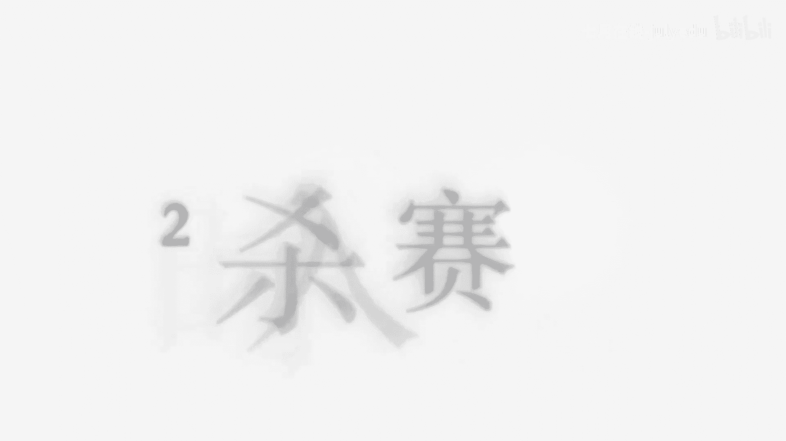

呃，对，大家也可以提前呃预热一下。因为我们这个公开课啊都是讲的比较轻松的一些呃，就是说不会太难的些题目。呃，如果大家就是说有有什么相关的一些疑问啊，或者说嗯大家如果自己之前听过我者讲课呢。

有什么想学习的东西啊，也可以在我们的聊天框里面跟我进行沟通啊。对。对，因为我们的课程啊还是比较轻松的，不会说呃就是说讲的很入嗯很就是说不会讲很多呃深入的，就是说很有难度的东西。

还是会想让在大家在一定的一个时间内，比如说一个小时或两个小时的时间内把一个东西给大家讲清楚。对。声音有点小吗？呃，我声音有点小吗？你可以尝试把音量调调大一点，因为我自己也在听自己的讲的。呃。

其他同学其他同学觉得声音有点小吗？嗯，对对，其他同学也也觉得声音小吗？嗯嗯，这样还行是吧？那我们我稍微声音大一点啊，稍微声音大一点。那么呃那我们就开始啊开始也正式就是说呃快到8点了。

那么我们这次呢是呃7月在线的一次公开课。我们公开课的一个内容呢是开狗，对吧？其实这个其实大家之前可能就已经接触过，现在竞赛很多啊，就是说我们还是以开口的这种竞赛，就是说比较典型的竞赛来给大家讲。

那么我们的一个公开课呢，这个是让大家在2小时以内就是说能够掌握一些知识点。然后我在这个知识点里面呢，我这个地方是只讲视觉赛题的。就是说其实开狗有很多赛题。比如说呃CV的NRP的有结构化的对吧？

还有结构化的。还有这个语音的，但是呢我们就单独挑一个赛题给大家讲。因为呢这样呢可能就是大家嗯掌握的会更加清楚，直白一些。那么我们今天的一个直播的公开课的直播的时长呢是一个半小时啊，就是一个半小时哎呦。

一个半小时到一个半的一个半小时到2个小时。对，然后大家嗯就是说一定要安排一下自己的时间。好的，那么我们就开始今天的一个课程啊。那么我们今天的一个课程呢，主要分为这四部分。嗯。

然后最后第五部分是一个总结与回顾。第一部分呢，我会简单介绍一下凯竞赛，因为还是怕有很的选手呃，也就是说我们的嗯听众啊，有的同学不知道cover的一个竞赛或者竞赛是什么。第二部分呢我我会讲以我的视角。

或者说从竞赛的视角看一看计算机视觉它是如何入门的，或者是它相关的一些知识点。第三个呢我会讲视觉赛题的一个案例啊，比如很典型的是imagineate这个数语集和它相关的比赛。那么在第四部分呢。

我会讲一个就是说几个三个啊，就是我们那个大纲上面写的一个首写呃涂鸦涂鸦识别，一个是孟加拉语的，还有一个谷歌图像检索的这三个比赛。那么总共就是说还是呃主要。

内容还是从第二部分从第二部分到第四部分，这是我们的主要的内容，主要的内容主要的内容。那么我们再看第一部分啊，嗯不知道大家对开go之前认识多少呢？那么大家也可以在那个呃聊天框里面给我呃打字嗯说一下。

你之前知道开过吗？那么其实开go其实也是现在比较流行的，就是说国外的啊，它现在被谷歌说过了。

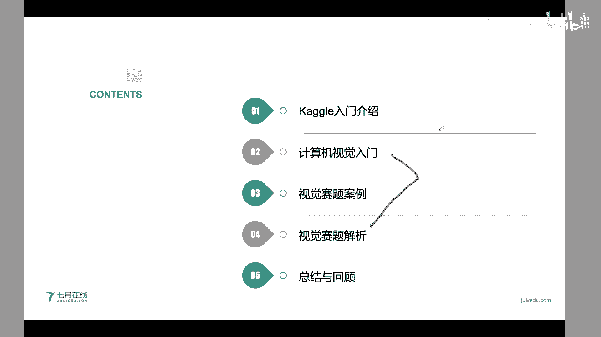

他现在被谷歌收购了这个竞彩平台。那么开go它到底是什么呢？我们嗯对于大家来说，参加的开go有什么意义呢？我在第一部分想要给大家介绍一下这个。

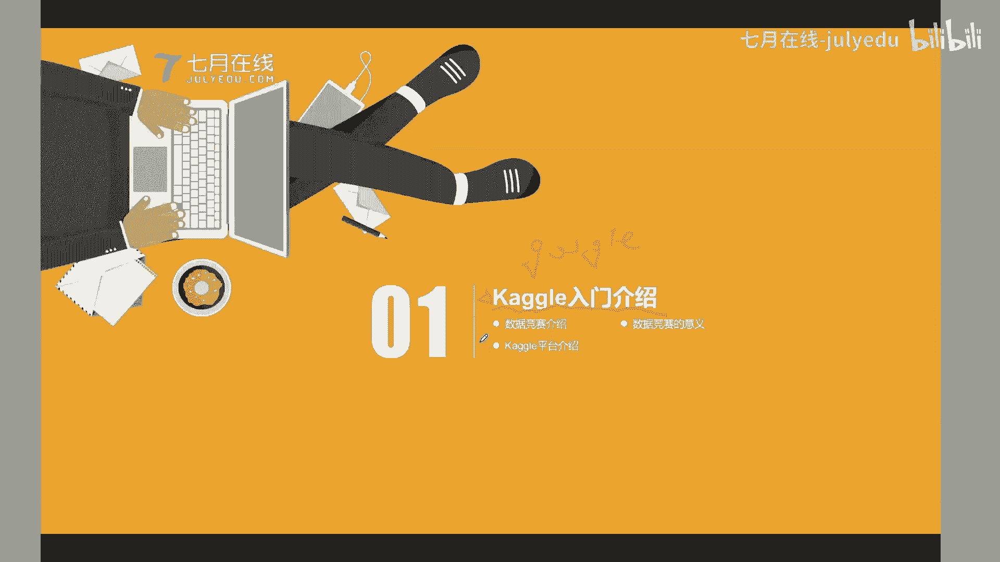

那么其实啊数据竞赛呃可能就是说嗯嗯叫又叫这个datacomp，对吧？也是数据科学的中间的一个竞赛啊，它是以工业学术问题，就是说为导向的。

就是说这个地方它是以问题为导向的聚合广泛跨学科人才的利用数据研发算法模型和探索解决方案的研发模式。那么这个地方嗯这一句有点长啊，其实大家重点关注一下这几个点。第一个点就是说数据竞赛是以问题为导向的。

它是有一个具体的问题，就是说是。具体有一个tsask对吧？这个taskk呢是我们具体是学术的，OK是嗯工业也O。其次呢这个呃竞赛呢它是聚合广泛跨学科人才参与的。就是说这个参与的门槛。

就是所有的人嗯就是说呃这些参与的门槛，就是说你不管是学什么学科的，你只要想参加这些比赛，你都可以进行参加。然后呢这个数据竞赛它和普通的竞赛有什么不同呢？

它是这个数据竞赛是际用数据研发算法模型或探索解决方案的研分模式。那这个是不是就是一种众包，对吧？众包的一种机制，就是说所有人都可以提出它的一个解决方案，然后把这个呃看在一个排行榜上来看一个成绩的优劣。

那么其实啊数据竞赛它是一个很典型的一个众包的竞赛的一种方式啊，就是说呃所有的参赛选手可以在一定的规范时间的，就是规定时间内，同时提交自己的一个算法模型，然后来进行一个评比打分。嗯，一般情况下。

这个对参赛的人员是没有限制的。它这种一般都是面向公开的，就是公开的啊，一般是公开的，一般是公开的。也有一也有一些比赛是现。学生啊，也有一些比赛是限定学生的对，然后大部分的比赛呢开过上面。

大部分比赛呢都是公开的，就是所有的社会人员，社会人员，不管你是社会人员啊，还是呃就是还是在校学生都是可以参加的。而且呢数据竞赛我们刚才也讲了，它是一个具体问题为导向。

而且有明确的业务背景的这个问题背景呢就是我们这个呃我们这个问题它具体是怎么产生的，或他具体的一个呃要解决的一个呃目标或者他的损失函数。那么这个呢其实因为现在现有的一些竞赛都是有强的业务背景或者数据背景。

它不是说这个数据完完全全是随机想到的，它其实是有一个业务背景在里面的。那么这这个地方啊一般的竞赛它有可能都是某个公司比如说这个嗯开上面有很多这种美国的公司，比如说谷歌啊，然后这种嗯格玛这种这种公司啊。

大公司啊，都是在开上面就是说呃举办一些比赛国内的。天池啊都是有这种阿里巴巴，或者说。一些大公司啊，他都都是在这上面有一个具体的业务背景，不是说随随便便的数据都能弄竞赛的。不是的。

是有一个特定的特定的一个业务和特定的数据，然后构定了一个特定的竞赛。所以说呢不同的一个竞赛可能有说嗯有不同的背景，有不同的一个数据。那么与普通的一些竞赛，这个地方我是以在校学生为特定的说的。

就是说与普通的在校的同学他参加的之前参加的一些比赛相比呢。数据竞赛有这些特点。数据竞赛呢和英语竞赛，这种竞赛和数学建模不一样。这个地方可能大家学计算机的可能对数学建模稍微了解一，对吧？

那么数学建模它是呃他是和数据竞赛不太一样的。数学建模他还是强调这个理论，他并不是这个并不是这个呃就是CS的人现在参加的比较少，或者说它也不属于这个data science数据科学里面。但是数据竞赛呢。

它是以一个具体问题和数据为比赛的一个内容，使用定定量和交互式的评分。这个地方有两个点，就是说第一个是定量的，一第二个是交互式的。第一个定量是这样的，就是说所有的这种评分机制它都是一个定量的打分。

不是说定性的，不是说定性的啊，不是说定性，比如说是人工进行打分。有的是作文竞赛，或者说英语竞赛都是有一个人工的打分机制。其次呢这个定令定定量啊，它是能够精确到小数位及多少位的。

比如说我们嗯是一个嗯嗯文本分类比赛。那么我们可以统计这个准确率，统计到最后多少位。对，所以说这个就是说是一个完全定量的打分，就是说完全有一个评分标准。其次呃这种竞赛啊它都是有一个交互式的。什么是交互式？

就是说我们可以就是说提交自己的代码，然后提交自己的模型。这个呢它会提供一个打分。这个交互式一个打分，就是反馈的机制，就是给你一个啊feedback，就是说我们这个模型到底是精度是怎么样。

这个就是说是其他竞赛不不具备的。比如说我在一场竞赛里面可以每天提交几次，对吧？这种比如说在KY比赛里面，我们一般可以每天提交5次。我们每天每提交的次数的时候，我们都可以得到我们每次提交的一个得分的优嗯。

到底有没有提高有没有下降或者具体的得分。这个是其他竞赛所具不具备的对。所以说数据竞赛它可能说在特点就是说在一些特点上或者说特点上都是和传统竞赛不太一样。那么就是说具体来说啊，就是这有这些不一样。

有这些不一样的。第一个是从内容上就是说数据竞赛，它其实是关注于数据挖掘和机器学习算法，或者说相关的数据相关的一些业务背景。那么学科竞赛呢可能是关注学科知识点。对，那么其实数据竞赛它并不限定于学科啊。

它有可能是跨学科的。这个地方嗯你可能这个地方的内容，这个数据竞赛，某一场数据竞赛里面可能是医学的，可能是呃天文的，可能是什么呃嗯NRP的，可能是C位的都有可能。所以说数据竞赛它并不限定一个学科知识点。

其实数据竞赛它的打分机制是一个有反馈的。就是说你每天可以提交打分，比如说一天5次，你这个打分是你可以知道的。但是这种学科竞赛都是一锤子买卖，它是不支持这种打分反馈的。

还有一个呢就是数据竞赛它是定量打分的。就是说具体错在哪，错了多少，它都可以反馈出来。还有一个呢数据竞赛其实是一个交互式的，就是你去提交这个代码提交这个模型，然后去嗯有一个打分的反馈。

这个是以普通的学科竞赛，也是不具备的。所以说数据竞赛是更加符合数据挖掘流程和机器学习的一种嗯就是说建模方式吧。因为你在建模一个数据挖掘或者是机器学习算法的时候，其实本质也要这种这种流程，对吧？

就是说你在构建这个模型的时候，也本质需要这种打分的反馈的。对。那么在嗯国外呢最主要的是kego的平台。那么这个地方截图呢是kego上面的一个呃就是说呃比赛，这个比赛应该是嗯已经结刚结束不久啊。

刚结束不久。就是说在开go上的比赛，它会给出一个比赛的一个名字，这是名称，这是它的一个副标题。然后在这个比赛的页面啊，它会给出比就比如说这个比赛的一个详细的介绍。

数据及notebook discuss你的排行榜和一些规则组队信息。然后这个地方它其实会给出啊会给出一些详细的呃就是说赛题的一些介绍，就是说你能够通过这个赛题的页面，知道这个赛题到底是什么业务背景的。

它到底是呃解决什么问题。比如说在这个截图的这个嗯比嗯这个比赛呢，其实就是讲讲的是呃一个图片的引写的一个就是说嗯识别，就是说有一些隐含的水印，然后藏在这个图片里面。那么在这个kego里面啊。

其实提供的非常完。的一个竞赛机制啊，就是说比如说在这个nbook里面，大家如果用过这个ipad notebook book，或者说Gpy的 notebookbook，对这个应该不陌生。

就是说因为现在开过被谷歌收购了嘛，所以说它的一些语音计存资源还是比较比较就是说友好的。这个呢有CPU有GPU啊。这个它提供了有CPU的免费的CPU或CPU资源。对，所以还是对新手比较友好的。然后呢。

在这个讨论区呢，你可以沟通，就是说。跟嗯跟其他选手沟通一下你这个比赛的一些想法。在这个排行榜呢可以看到嗯所有人的一个排行道的一个打打分。所以说呢开go呢它其实是把一个任务啊，比如说这是一个具体的比赛。

它是单独抽象成的一个页面，然后把这这些具体的业务背景数据notebook排行榜都弄在这个比赛页面里面的。所以说这种啊是嗯开go现在是国内外最成熟的竞赛平台，而且是呃就是说含金量也是最高的一个平台了。

那么其实啊嗯如果大家作了解一个竞赛，可能就是说你可能会问到，那么老师有哪些竞赛呢？其实这个地方啊，我这个地方写按照竞赛其实进一场竞赛可以按照这个竞赛的任务啊，竞赛的数据啊，或者说竞赛的一个反馈啊。

以及它的一个目的啊进行一个具体分类。那么最简单的呢，其实是可以根据这个具体的任务和数据来进行划分的。我们先看任务，其实呢嗯如果按照任务来划分的，这个可能就跟业务背景相关的。比如说在结构化的数据里面。

我们可以把一场竞赛具体把它划分成金融风控消费预测行为预测或者说推荐系统相关的。那么如果是图像类的呢，我们可以把它分成图像分类、图像检索物体识别语音分割，这种人体关系跟检测。如果是文本类型的呢。

我们可以把它分成文本分类、文本呃翻译或者说实体识别。如果语音的呢，也可能是这种语音分类语音识别，对吧？那么这个是具体的任务。那么。其实啊我们还可以根据赛题的数据来划分，就右边这张嗯扇形图。

其实啊在现在的很多的比赛，这是20这是2019年的2018年到2019年的统计数据啊。就是说在2018年到19年的期间呢，其实大部分的竞赛都是结构化的，就是嗯你可能会用到什么是结构化，结构化就是表格。

就是假如这个数据是用表格。存的。那么它就是结构化的数据。那么你也可以把这非表格的数据，我们把它称为非结构化的数据。那么其实啊在2018年到2019年的期间。

大部分的比赛都是应该是百分之接近60%的比赛都是结构化的数据。但是到2019年开始啊，从去年开始，其实现在非结构化的数据，应该是就是说非结构化数据的比赛，嗯，反而占据了60%以上。这个是这样的。

就是说现在有很多结构化的结构化的数据挖掘的比赛，它都可以通过auto美奥这种自动机器学习来进行完成了。所以嗯啊。sorry啊，把它翻翻过来。所以说这种啊就是说结构化的比赛。

现在就是参加的人稍微少了一点稍微少了一点。然后现在这种非结构化的数据啊，比如说计算机视觉的这种比赛反而会更多一点。对，那么其实大家我嗯我们今天讲呢就是这种计算机视觉这个任务下面的比赛。

那么其实这种语音分类或者说自然语言处理下面的比赛呢，现在这个也挺多的对。然后这是对赛题的一个数据，或者说它这些任务来进行划分。那么我们再来看一看嗯这个计算机视觉的入门吧。或者说我们进行一个简单的介绍吧。

因为我们今天还是一个以这种计算机视觉为专场讲一些相应的视觉的比赛。那不知道大家对于计算机视觉有什么了解呢？或者说之前有接触过计算机视觉或者说数字图像处理嘛，啊，其实啊计算机视觉现在是比较火的一个方向。

而且是不管是在啊就是说学术上还是在就业上都是嗯就是说非常火的一个方向，计算机视觉对吧？computerationV那么其实现在很多算法工程师都是说它是搞CV的，对吧？

或者特别嗯特别是说啊我很多深度学习的呃算法工程师都说它是搞CV的。其实那么计算机视觉里面到底怎么进行划分呢，或者说大家如果之前没有学过学习过计算机视觉。大家怎么进行入门呢？对，那么我们今天就来看一下。

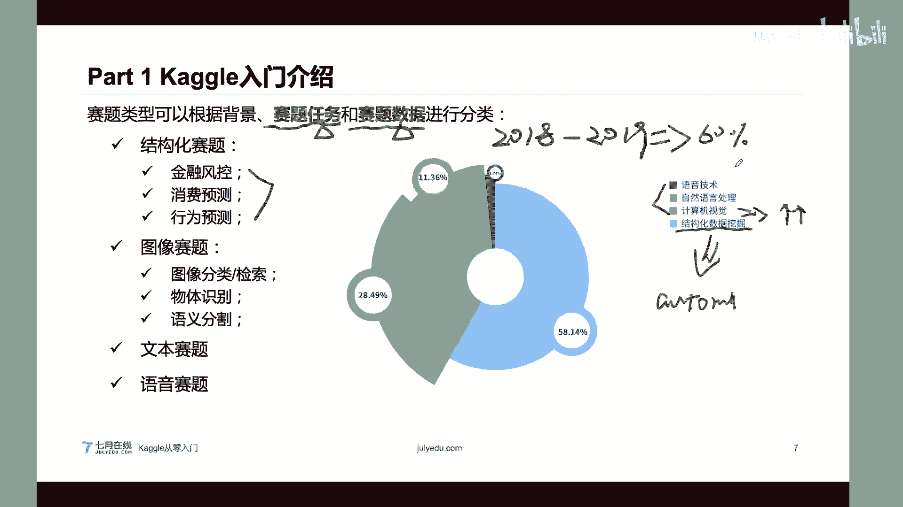

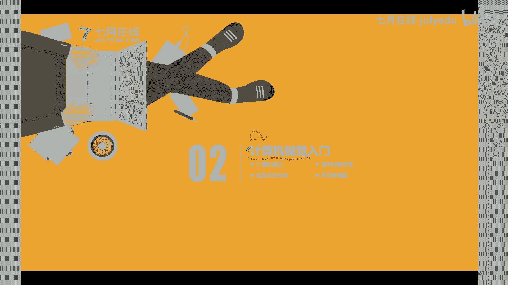

呃，那么计算机视觉啊，它是就是computeration简称CVA啊，它是让机器能够理解并应有看的能力的科学啊，或者说一个学科。那么其实我们本质的一些计算机啊，它都是二进制。

只能处理二进制01的这种图形的这种嗯架构啊，对吧？但是你想让一个计算机去理解一个视觉，或者说理解一张图片，其实是很难的一件事情。因为呢原始的我们输入就是说我们数字图像啊，其实本质就是一个矩阵，对吧？

一个长啊，就是个高乘以宽，还有一个呃还有一个china，就是说这个呃这个通道数，对吧？一般我们三通道的对RGB的图像，对吧？RGB的。

那么其实我们一张图像就是一个H乘W乘C的一个呃三维的一个tensor，对吧？三维的一个矩阵。那么我们对计算机来说啊，对于计算机来说，它其实并不理解这里面每个像素是什么？但是呢人它其实是能够理解这每个像。

是什么含义的，或者说这个图片有什么含义的。因为即使啊这个原始的一个像素啊，就是RGB，它是0到25这个像素值。但是呢人并不是说理解，比如说这个地方有有一个截图，对吧？

人并不是说理解这每个像素值的一个含义，它往往会以某个区域，比如说这个地方有一些文字，对吧？这个地方是一个眼睛，对吧？然后中间还有一些文字，那么其实啊人的一个肉眼并不是完完全全理解这每个像素值的一个取值。

它往往会理解这个这个区域到底是什么语义信息，或者整或者说这个整体是什么含义的。那么这就是一个语义鸿沟线语义鸿沟，就是说人啊它其实没办法去呃它不就是说它理解计算机视觉，它理解图像啊。

并不是说从RGB这个方式开始的。它是从这种人的视觉感知开始的，但是呢计算机它并不具备这种能力。所以说计算机啊它本质就是说只能说我们怎么让从这个。处理让他理解这个图片。那么这就是需要我们让机器拥有这种。

视觉理解的一个技能，或者说有一个信号提取的一个技能。那么这个地方呢需要注意的是，就是说你想让一个呃一一个计算机，或者说想让设计一个算法去理解一个理解一个图像，其实是很难的。

因为我们现实生活中的图片啊千奇百怪的对吧？有可能是呃什么我就以这种艺术画来举例啊，有的是素描的，有的是这种水彩的对吧？有的是泼墨的，那可能就人都在看这种画的时候，其实都要啊犹豫，或者说思考很长时间。

那么你其实让计算机来识别，或者说去理解，其实更加难。因为计算机很难，或者说现在还没有一个通用的呃人工智能的算法出现。所以说你想让计算机拥有这种视觉理解，或者说让想让它有这种视觉的呃语义提取的一个功能啊。

还是非常难的，非常难的对，非常难的。就是说这是一个很难的任务。那么如果我们机器本身不具备理解的技能，那么我们只能让它完成特定的运算啊。

就是说现有的一些计算机视觉的算法都是你可以理解成它都是拆拆分成了一些具体的算法。比如说有一些算法是完完成这种人脸识别的。有一些算法是完成呃这种身份证识别的。有的身算法是完成呃这种车牌识别的。

那么比如说比如说我们现在有一种。嗯，有有有这个这种东西，有一种数据data一。有第二种数据data2。比如说很很多种数据，比如data3，这分别是不同类型的数据。比如说第一种是人脸的。

第二种是这种车牌的，第三种是什么身份证的。那么你想要对着分别建模呢？现在的情况是这样的，它现有的一些深度学习，或者说人工智能技术，它是分别对不同的数据来分别进行建模的。

它不是说构建了一个得到一个通用的一个模型啊。不是的，现在不是的，就是说现在的一些计算机视觉或者说深度学习算法，只能说是完成特定的一个运算，只能说在特定场景下，比如说在一个人脸识别的场景下。

它能够完成人脸识别的一个呃操作。比如说在车牌识别的一个场景下，它能够完成完成车牌识别的一个嗯呃任务啊。所以说现在的一些计算机视觉，还是嗯就是说只能说是领域或者说具体到某个任务啊，某个tsk来用的。

那么如如何让计算机去理解这个视觉数据呢，或者说如何让计算机能够呃理解这个图片里面具体的内容呢。其实是非常难的一件事情。那么我们在嗯签海园的一就是说这个课程呢会讲一些具体的就是说解决流程。

然后嗯就是说看计算机是怎么解决这个呃难点的，或者解决具体的问题的对。那么首先呢给大家看一个例子，就是说现在计算机视觉其实还是有很广泛的应用应用场景的，比较典型的这种是呃安防对吧？

安全防控以及智慧城市和自动驾驶。哦，比如说我们这个地方有一张图啊，这个图呢它里面它有一个算法，它是把人进行标注出来了。就是说它可能够识别行人，然后呢这个图片里面的所有的车也被识别出来了。

比如说这个车到底到底是什么车型的，然后它的颜色对吧？都是识别出来。但是呢其实啊这个其实就是很典型的这种安防，就是说我们有一个摄像头，比如是天网的摄像头，它可以识别在街道上可以识别嗯这种行人。

然后进行抓拍，比如说对这个呃强呃这种超速的啊，或者说闯红灯啊都可以进行抓拍。或者说对我们的一个车辆进行一个呃流量流量的控制。对，那么其实啊大家可以看出来，在这个图片里面还有很多的一些人都是没有被标注的。

他都没有识别出来的对吧？比如说有一些人还有一些人群，他都没有识别出来。为什么呢？其实是这样的，就是说现有的一些计算机视觉算法啊，还是就是说很难进行一个嗯你不能说它很难进行一个落地啊。

它这个精度啊还是达不到百分之百的，还是很难达到百分之百的。因为嗯你就是说这种数据啊还是千奇百怪的。比如说你从这个地方我是从一个摄像头，比如说这个地方有个摄像头。

一个摄像头去看这个就是说一个呃就是说俯瞰这些人，那其实啊其实你在不管是多大多清晰或者分辨率多少分辨率，你的多少分辨率的一个摄像头啊，你人离远了，对吧？人离远呢，就是说离这个摄像头远呢。

他其实就比如这个这个人啊，其实可能就10乘以20这个像素，就是像素很小，就是很小的一个区域。你再让这个摄像头去理解，或者说让计三机器识别这个人啊，其实非常困难的一件事情，其实非常困难的一件事情。

而且呢其实啊这种啊他不可能就是说完完全全把所有的人都识别出来了。有的人可能就穿的，假如有一个人他穿的衣服就跟这个地板，对吧？也是偏灰色的呃，肉灰色的，就跟这个呃地板颜色很近。

那么你摄像头其实也是很难识别的。所以说现现有的一些嗯计算机视觉的算法，还是很难达到这个百分之百精度的，这个是嗯需要指道一点，就是说还是只能说是在特定领域下完成一些特定的任务。对。

而且他这个精度啊还是有一定上限的对，并不是说即使有了也不是说有了深度学习啊，人工智能之后，这种这种问题都能够解决。对。呃，那么如何学习计算机视觉呢？这个地方我是给大家推荐了一个路线。

就是说分别分为五阶段。第一个阶段是学习计算机视觉的基础。第二阶段是学习积极学习与深度学习基础。第三阶段是学习深度学习的一些高阶技巧。第四阶段呢是学习一下目标跟踪和语义嗯啊这个这个地方打错了。

这是语义分割啊，语义分割。语义分割。然后第五阶段呢是这个视觉项目实战啊。呃就是说如果是在按照这个路线来学呢，其实还是比较顺畅的。那么第一阶段呢，我们就是说推荐大家学习一下计算机视觉基础。

比如说你学习一下嗯图字就是说数字图像处理，比如说如何读取一张图片嗯，图片里面的颜色空间是什么？图片它有哪些底层特征，嗯，比如说图片的边缘信息怎么提取的，它的一些关键点怎么提取的。

然后呢还可以做一些进阶的一些知识点掌握。比如说有哪些这种嗯传统的一些图像的特征提取算法，或者说有哪些嗯就是说传统的嗯图像检索算法，就是说在深度学习之前啊。

然后这一部分呢可能会让大家就是说对这种图像的一些数字图像处理有一定基础。然后还有一些就是说计算机视觉里面的，其实计算机视觉和数字图像处理啊，会有一点差别啊，因为计算机视觉它可能会包括的范围会更大一些。

比如说还有这种。维成像，还有这种视频啊，或者说呃这种嗯3D的啊，都可以算作计算机视觉里面的领域范畴。但是如果是呃图像处理呢，可能它的范围会稍微窄一点。你你可以理解图像处理。

它就是只针对于这种单张的2D的图像。那么以这种阶段来学习呢，第一阶段你就是对计算机视觉和数字图像处理的一个基础进行一个了解。第二阶段呢就建议大家学习一下机器学习和深度学习基础。

这个呢就是需要大家掌握一下机器学习的基础和神经网络的一个原理。特别是卷积神经网络的一个原理实战，这个地方就是CNN对吧？考 neural networkCNN。那么为什么要掌握CNN？

为什么我们不掌握深度学习的其他网络呢？也就是说在我们现有的深度学习网嗯，现有的呃计算机视觉任务中啊，还是以这种卷积神经网络，它用到的呃用途比较多。因为它是能够对我们的图像进行一个有效的建模的，对吧？

它也是有就是说提取的方法，就是说它的一个特征提取提取啊还是非常有效的。还有嗯第三点呢就是要学这个嗯机忆学习和于深度学习基础啊。其实啊深度学习还是有一些契节的，并不是说深度学习只是一个黑盒。

它也是有一些具体的嗯，就是说理论知识的。比如说有哪些实践技巧，以哪些就是说网络层啊，哪些学习率啊，或者说哪些优化器啊，这都是在嗯第二阶段要学习的啊，第三阶段呢就要学习一些高阶的技巧。

就是说以第二阶段在第二阶段基础之上嗯，那么就是学习一下网深度学习模型的发展。比如说CNN它到底是以什么脉络发展到现在的它这个发展呢可能就是说也是不是不是很很长那个时间。

比如说从131年的这个alex一直到现在，就是说一直到20年的这个发展的脉络啊，然后呢就以这个为基础呢？就可以掌握一些比较基础应用呢。

比如说大规模这种嗯就是说车辆检索的车辆检索的应用和这种行N从事别的应用，还可以掌握。在物体检测的一些嗯就是说基础，比如说one stagetday，这是第三阶段学习。

那么在第四阶段呢可以掌握一些目标跟踪和这种语义分割。这个呢可以就是说做这种嗯目标跟踪。比如说我们在做无人驾驶的时候，在做一些呃这种人脸的这种视频的追踪的时候，都是有一些很常见应用。嗯，对。

然后呢在第五阶段呢就可以做一些具体的项目，比如说做一些视觉项目的实战，比如说呃强化学习啊或者模型的部署啊部署啊。对，那么这个呢是比较嗯我就是说比较推荐的一个计算机视觉的学习路线啊。

那么正好呢我们现在在7月在线有一个计算机视觉的一个就业班，那么也是下嗯下方的这个链接啊，这个链接呢就是以我们刚才讲解的这个学习路线，就是说为主的，也是非常适合大家嗯就业找工作的一个呃就业课程。

那么如果大大家感兴趣呢，一定不要不不能错过啊，现在就是还是有一些优惠在。这个报名的期间呢，对，还是在报名期间还是有优惠的。如果大家感对这个计算机视觉找工作感兴趣的啊，一定不能错过这个CV的就业班。

那么这个是我们的一个学习的路线。那么其实啊我这个地方其实这一页就是把我们刚才讲的这些呃具体的流程给大家列举出来了。就是说呃首先学一下计算机视觉的基础。接下来是计算机视觉的深度学习基础。

然后是呃深度学习的进阶，然后是目标检测和语分割，然后是视觉技术的实战和落地啊。其实在我们计算机视觉里面，其实有很多的一些应用啊，并不是说只包括我们刚才讲就是说这个地方嗯这些阶段里面的一些。呃。

任务它包括很多的任务，嗯具体包括哪些呢？比如说嗯它包括一个图像分类，呃，物物体检测呃，然后这种实力分割，对吧？其实啊我们现实生活中大或者说大家遇到的很多的一些呃。呃。

任务啊都可以把它抽象成这这些嗯很典型的计算机视觉的任务。比如说这种动物分类，对吧？动物分类、手表分类，或者说这种对这个人脸进行一个分类，其实本质上就是一个分类任务。

然后这种呃这种单目标的单目标的这种物体检测其实也是用到的也比较多，对吧？比如说识别这个呃就是说这个车牌的一个具体的位置，对吧？但是更多的是这种多目标的检测，就是比如说我们同一张图片里面既有多个物体。

那么我们怎么把这多个物体进行识别出来了，其实这个这种object detection物体检测，它可能用到的范围更广一点。比如说在我们的现在行检测，呃，人脸检测，对。

或者说我们的字符检测都是用到这种字符检测呃，物体检测模型。还有一种呢，比如说我们这种嗯嗯就语义分割语义分割呢，它是就是说把这种物体检测和这种呃物体检测。和这种呃嗯。哦。

语义分割把它结合得到这个实力分割inst就是说它能够识别出具体这个图片里面哪，这是第一只狗。dog dogg one这是dog two，就是说它能识别出这个里面到底是多少只狗。

然后每个狗的一个具体的位置，像素啊都能抠出来。这个和前面的一个呃物体检测和这个呃嗯嗯这个语义分割，它是结合起来做的，结合起来做的对，然后你可以基本上理解成一个实例分割。

就是把这个object detection再加上一个嗯语义分割，再加上一个语义分割。也加上语域风割。对，所以说现在这些技术都发展的非常快啊嗯，但是呢现在嗯就是说。一些大家常见的一些计算器视觉的应用啊。

都逃不出这些常见。比如说我们这现有的一些呃行冲检测VID它本质上就是一个图像分类和图像检索的一个任务。比如说我们现在有的这种什么安安检，比如说我们刷脸的时候，有这种呃人脸检测，对吧？

也是这种物体检测的模型。比如说还有这种嗯更高阶更更好看的一点的这种呃就是说呃呃就是说在电影里面放到的，就是说通过一个人来找到什么犯罪的呃凶手啊，这都是可以从这种人脸呃就是说这种技术来实现的。

还有一种比较典型的这种这种红绿灯识别，它其实就是一种物体检测。比如说我们现在自动驾驶里面的很多的一些算法，比如说呃就是这个道路线的识别斑马线识别，或者说这种呃就是说。呃。

道路通行的这种什么交通符号的事别都是用物体检测来做的。其实现在很多的一些场景，大家其实嗯细想一下，都是以我们这些具体的一个算法，就是说呃支撑的为支撑的。只不过再加上特定领域的一些呃就是说具体的操作吧。

对，这是这一部分。那么其实啊嗯深度学习和卷积神经网络是我们学习计算机视学里面必备的一个呃知识点。我们刚才讲的5个学习阶段，其实很多都是在讲嗯深度学习和卷积神经网络很相关的。为什么这么说呢？

因为嗯现有的呃现有的嗯在现有的机忆学习里面啊，深度学习其实是占据了很大一部分应用场景。因为嗯第一个深度学习它的一个精度就是说稍微它会比嗯传统的记忆学习会更高一点。嗯，就是说它的第一个是它的精度高。

就是说它的精度精度会更高一点。其次呢深度学习啊它的。它的一个应用范围会更会更广一点，因为它是非常适合非结构化的数据，就是说非表格的数据。嗯，就是说深度学习是非常适合非非结构化的数据。

这种是嗯就是说传统机器学习所不具备的。其实深度学习还有一种迁移的思路。就是说我们之前在某一个数据集上训年得到的模型可以很方便的迁移到其他的一个新的一个任务上。

这也是呃就是说机就是普通机器学习算法所不具备的。那么深度学习它其实是机器学习的一个分支啊，这个其实是大家需要注意的，就是说呃可能机器学习是一个大圈，但是深度学习只是其中的一个小圈啊。

但是呢这一部分这个是深度学习啊，并不是说呃这这一小部分深度学习和呃就是说呃dep learning对吧？DL和这个 learning它并不是说完完完全把它分隔开了。

其实dep learning和 learning就是说深度学习和机器学习有很多相似之处，也有很多区别之处。呃，比如说他们在这个模型的一个学习的过程，比如说到底是呃过理和。和一个。

模型的阶段以及这个呃这种数据划分方法，或者说嗯机器学习的一些基础概念都是相同的。或者说模型嗯有一些模型的超参数啊，都是在一些其他机器学习算法能够找到的。就是说深度学习只是嗯机忆学习的一个分支。

大家在学习的过程中呢，你可以把它看作成其中的一个发展方向嘛。然后其实嗯其次呢就是深度学习，它其实是一种表征学习。我们给大家举个例子，就是这张图片，其实啊这是一个卷积神经网络，或者说是一个全接网络。

那么当你输入一张图片的时候，其实啊这它有很多这是输入层，这是应就是说输入层对吧？这是input，那么这是黑的 layer，对吧？这是隐含层。那么最终呢这是输出层。其实啊这中间的层啊。

比如说这个这这是第一层第二层第三层其实第二层它的一个输入就是第一层就是说我们输入层，就是input这个层的一个输输入，对吧？那么第三层它的个输入呢就是前面一层的一个输出，大家可以看到。

就是说它它是层一层进行堆叠的。就是说这个呢你可以认为这层一层它有一个相互的表示，或者说机器学习的过程。那么这也是传统机器学习所不具备的深成学习它是一种表征学习，它有表征学习的一种学习思度的里面。

那么还有一点呢，就是说在计算机视卷里面啊，其实呃卷积它其实卷积深经网络CNN其实是用到的最多的一种为什么呢？因为对于对于一张图像来说啊，它如果用卷积来说，如果用卷积核。

它其实是能够有效的提取到这个图像的一些边缘啊，或者说嗯这种关键的。的呃，那么卷积盒呢或者说卷积神经网络呢也是特别的非常适合用于嗯计算机视觉或者图像的一些领域。对，或者说比比如只要跟图像沾边的一些数据。

比如说。嗯，视频。嗯，或者说我们的一些呃连续的呃连续的多帧的这种音频，就是说多帧呃，就是说音频也可以用新来做。因为音频它如果提取一个MFCCC的特征，也最终得到一个矩阵，所以说很多的一些数据啊。

只要它是使用得到一种用用一种矩阵的一种方式表示呢，那么我们就可以用这种卷值神经网络来提取。嗯，它的特征，然后对它进行建模。这是呃计算视觉与卷值神经网络。那么其实嗯深度学习与机器学习啊有很多的一些区别。

但是呃我以这张老图来讲解它们具体的区别。就是对于机器学习来说啊，其实它的一个嗯流程是呃对于我们的输入，它首先做一个特征的提取提取得到一个特征。然后输入到我们的传统的机器学习模型里面，然后得到一个输出。

对吧？也就是说它是把这个特征的提取，和我们的模型其实是分开的。但是呢在我们的现有的深度学习里面，它这个地方是end to end对吧？哦。sorry，又调走了，这个地方是N to，就是说它是端到端的。

端到端的。也就是说它是直接从输入到输出的，他把这个特征提取和这个模型的一个训练过程都在这个网络里面所包含的。为什么这么说呢？呃，因为在我们深度学习的表征的过程中啊，其实它有前层对浅层的。

就是说后面层对前面层的一个数据的表示。所以说呢它会对我们的数据有一个更深层次的一个特征特征表示啊。这个地方你可以理解它是一个特征提取啊，对吧？我们刚才在这种图片里面，其实你在有一些层啊。

其实它是它其实它提取到的一些特征啊，都是对我们原始图片的一个呃比如说提取到一些边缘信息啊，提取到一些具体的一些焦点啊或者形状啊，都都是嗯这都是在嗯越深的层可能提取到的一个信息会越多。那么这种嗯深度学习。

他还会把这种具体的一个机忆学习算法把它包进去。因为深度学习，或者说这种深圳网络其实有很大的学习能力，很强的学习能力。

它会学习到这种嗯比如说我们从input到output这种映射方式或者映射方法它都能学习到。但是呢呃即使是深度学习，它就是说还是嗯非常非常简洁，对吧？只要输入，然后通过一个深度学习模型就得到最终输出。

但是呢深度学习和机忆学习还是有很多的相似之处，或者说深度学习有它独特之处的。首先深度学习它是可以自行提取一些特征，就是说你不需要人工经验知识，它能够帮你提取一些特征。但是呢你是需要设计具体的网络结构的。

这个网络结构可能和具体的任务相关。比如说我们做一个人脸的识别的一个任务和作为一个图像分的内容，它的网络结构就不一样。但是呢这个只是说结构不一样，这个结构，比如说有的结构是呃有。

这种回归层有的结构就只有这种全连阶层。嗯，其次呢深度学习。由于它的网络结构就是说它的学习能力实在是太强了，所以说需要特定的一个数据扩通方法。

d augmentation以及特定的政策化方法来缓解这个过滤盒的。这也是在传统机器学习里面就是说所不具备的。所以说呢嗯在学习深度学习的时候，大家就是说优先看一看，就是深度学习与机器学习有什么相同点。

就说看他们有什么相同点。那们然后看他们有什么不同点，你就是以这两个方面来进行学习啊，就是说会更加。M。就是说精细里。嗯，由于啊我们其实深机器学习啊里面还有很多具体的分支啊。那么如果大家想具体学习呢。

其实也可以。但是你如果就想学计算机视觉，其实没必要再去把嗯机器学习里面的其他的学一下。你就优先把深度学习学一下。然后你如果之后再用到其他的一些机器学计算法。然后你再回过头来学。对。

这是第二部分对于我们的一个计算机视觉的一个基本的介绍，对吧？或者说给大家一个学习的路径。对大家有问题吗？如果有问题呢，可以在我们的讨论的一个聊天框里和我进行沟通哦。对，好的。

那么我们接下来呢就看一个视觉案例啊，imnet，然后看一看这个图像分类的一个流程。有同学问到结构化的数据，用auom如何理解，我有我也做过结构化的数据。比如说用netGBM没见过用auom的嗯。

其实是这样，我其实是这个意思我往前翻一下啊，不好意思呃，其实是这样的，嗯，现有的一些结构化的数据。比如说这种表格数据。

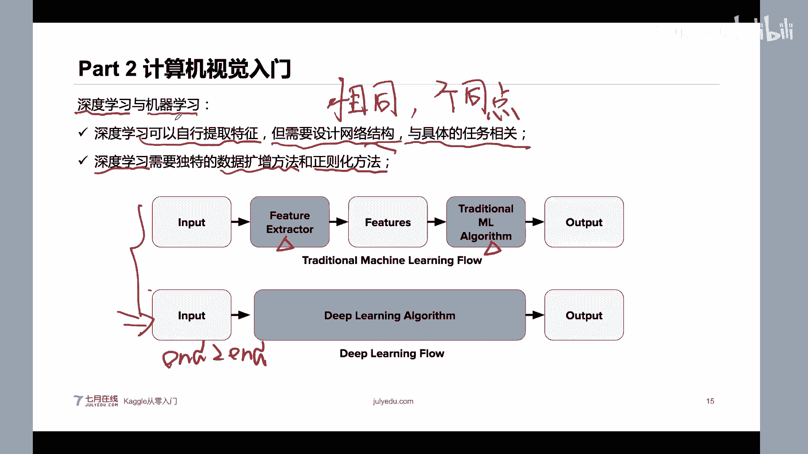

对，表格数据、结构化数据啊都适用于这数模型。比如说。来是GBM或者XG boosts的对吧？嗯，其实也可以，但是现有的呢嗯在很多企业里面就是说自动继续学习啊，就是说已经在一定程度上可以代替人类。

或者说在一小部分可以代替人的。我这个地方举个例子就是说现有的一些结构化的比赛会越来越少。这种非结构化的比赛。比如说图像的啊语音的NRP的比赛会越来越多。因为这也是我统计得到。

就是说现在2019年以及啊就是说从去年到今年来很多的一些比赛。不管你在开过上面找啊，待会也会给大家看。其实现在开过上的一半以上的比赛都是图像的或者NRP的。现在结构化的比赛会越越来越少越来越少的。呃。

就是说因为你人工的一些特工特征工程啊，其实也。也肯定是比奥特美要强的，就是人肯定比机器来做这种机呃，就是人啊肯定是比这种自动机器学机会强的。但是呢现在的一些呃结构化的数据啊，其实。通过一些特定的流程啊。

就是能够解决的差不多了。或者说你用一些比如说现在的现在HGBM或者叉G其实已经可以挺好的解决了了，或者说它一个精度已经挺好的嘛。嗯，然后大家就是说各行各业发现我只直接用这些模型啊。

就是说精度已经okK了，那么我们就不再花一个具体的时间了。那么然后现在呢其实更多的是一种非结构化的数据，非结构化的数据呢，其实它的一个发展前景还是更大一些。

因为现在呃计算机视觉里面还有很多的一些未解的一些问题。呃，auomomy纳s搜索是一一回事吗？呃，其实那s搜索它是搜索一个网络结构，它这个和auomomy其实有一点类似。

但是auomomy它这个nas它是搜索这种深度学习的网络结构，它是搜索深度学习的网络结构。它这种是用在深度学习的auommre，你可以这样理解。但是我这个地方讲的这个auomy呢。

它其实是可以用在这种结构化数据里面的。呃，第二个同第二个还有一个同学，还是这位同学说的呃，自动驾驶发展到什么程度了？目前的技术能实现吗？普普及需要多久啊，其实。啊，喝口水。其实嗯现有的自动驾驶。

你可以看一下，嗯就是说你不要看新闻啊，你不要具体看新闻。你可以关注一下现在的国家政策。其实现在的自动驾驶啊，只能说在特定的场景下是可以的。不能说它在不能说自动驾驶没并不是能上路啊。

现在自动驾驶它是分就是说具体等级有L3L4，对吧？它可能在特定的场景下可以完全的嗯不需要就是说能够实现自动驾驶。但是现有的通用自动驾驶啊，应该短时间没办法实现的。嗯，不知道大家注意到没有？

就是说现有的啊，不管是百度啊还是滴滴啊，其实已经越来越把自动驾驶的业务啊，就是说宣传的越来越少了。其实这个可能就是一个噱头，短时间我看来就是说我个人认为短时间通用的自动驾驶是没办法实现的。

只能说是特定领域的，比如说卡车的自动驾驶，比比如说在这种无人的这种仓储里面的自动驾驶可能会实现的。

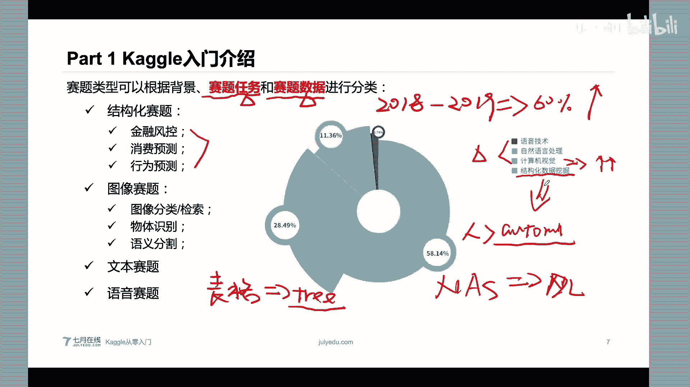

だって。嗯，就是其实嗯前一段时间有那个滴滴，他不是在上海有这种自动驾驶的嗯车嘛，但是他那个自动驾驶的车还是配了一个呃就是说安全员的。那么其实你也可以思考一下，如果我都配了一个安全员呢。

我为什么不用这个人直接开车呢？其实他配的那个安全员啊，可能成本也不低啊。因为它可能需要懂一点技术，又要懂开车。对，所以我我是对自动驾驶，它会比较悲观的啊，这是我个人看法。那么我们接下来就看第三部分。

对就是说我们的一个视觉的案钮，我会以minenet这个呃数据集啊，也就是比较典型的这种图像分类数据集来讲。然后来看一看这种图像分类的一个训练的流程。

呃，首先呢对于一个图像分类，或者说计算机视觉里面很典型的一个任务。图像分类来说呢，它是这样定义的。就是说我们给定一张图片，我们需要识别这里面图片里面嗯的一个类别。比如说在imagine那数据集来说。

它是一个千万级别的一个图像分类数据集，需要对图片的主体物体进行分类。比如说有一些在imagageation里面有很多这是里面的一些截图。比如说有这种B0。嗯，有不同类型的B淇淋啊，还有这种枕头。

枕头有可能是不同类型的枕头啊，比如说什么U型枕，有的是这种抱枕。那么其实imaginenet比较典型的，它是分1000类，对吧？就是说我们常见的imaginenet比赛。

其实啊这个imaginenet它其实是很难的，很难的。在我们这种嗯在深度学习时代之前啊，深度学习时代之前，就是说深度学习嗯前。然后这是深度学习后啊，然后有的深度学习如果是在深度学习之前啊。

这个精度应该呃就是只有70%多吧，75%左右就是top5的一个精度。然后如果是用了深度学习啊，如果是用了深度学习，那么它的一个精度现在应该是到97%呢？top5的，非常非常高了。

现在就是说imagine的数据集，它是呃大家也知道就是说应该是呃李飞菲嗯，教授提出了，对吧？它是极大推动了我们计算机视觉的领域的发展。为什么呢？因为他这个imagine的数据集，它的一个呃总共啊啊。

他的一个任务是非常难的，总共是1K类别。然后就是说如果一个计算机视觉模型，比如说一个图像分类模型，在imagine的数据上在这个数据上能够分类好，就是说它能够识别好，是不是在其他的场景也能够识别好呢。

或者说也能够有一个很好的一个泛化能力呢，其实是这样的。因为啊。其实在嗯这个imagine数据集应该是从201年11年啊，还是到2017年啊，最后一届是2017年。然后这个期间啊其实是深度学习。

就是说发展的早期是很多国内外大公司啊，都在imagine数据集上进行刷榜。对，不管是国外的谷歌啊，还是国内的百度啊嗯滴滴啊，阿里巴巴都去刷这个imagineimagine数据集，刷到什么程度呢？

现在大家都不刷imagine数据集呢？因为这个地方毕竟它已经被刷爆了。然后嗯imagineate数据集呢，它极大推动了计算机世界的发展。因为imagine数据集，它是一个很常见的场景，它里面有动物。

有有人有这种桌子，有汽车。就是说你如果在imagine那个数据上训练得到一个模型啊，其实是能够很轻松的把它迁移到一个新的任务上面。

它嗯就是说你如果一个你在imagine的就是呃数据上训练得到一个pretrain的一个model预训练的模型。就是说在这个我们这个模型在imagineate数据上训练好了，这叫运行的模型。

那么这个运行的模型其实可以很好的把它进行一个微调，或者说通过迁移学习的方法，让它适应到就是说转转到一个新的一个场景上。比如说我们右边这张图。

就是说原始有一个imagine的就在imag上训练的一个CNN的一个同样分类的网络。那么由于呢这个原始的这个imagineimagine数据集啊，这个数据量非常多，千万级别的一一个数据量。

就能够让我们这个模型，它的一些参数啊，学习的非常好。那么其实这个参数啊，比如说浅层的这些卷积啊，它能够很就是学会到比如说提取一些人的这种什么头发，或者说一些皮肤一些边缘信息。

那么这个其实非常有意义的一些参数。这个参数呢，我们其实可以直接把它用在我们一些新的任务上。怎么用呢？我们就是把这个训练好的模型的参数，用来我们作为我们一个。新任务的一个参数的初始化。

比如说我们这个地方是想识别一个呃艺术化里面的呃人，对吧？那么我们就可以以这种训练好的C嗯这个嗯CN的网络的参数作为我们这个下面这个网络的一个呃参数的初始化。大家看一看一下，就是说。

其实这两个网络它的网络结构是不一样的对吧？上面的网络是分类，下面的网络是一个物体检测。其实呃它有一些相同的点，对吧？前面这些C。这些这些层啊这些层就是从从这儿到这儿这些层这些参数都可以进行复用的。

都可以进行复用的，甚至到这种嗯全连阶层啊，这些参数都可以进行复用的。也就是说这些参数啊，我们都可以直接把它就是说在这个新新任务上作为一个参数的初始化。这个初始化之后呢，我们再从这个初始化的这个点。

在嗯继续对我们的参数进行微调，用这个新嗯就是说嗯新tsaskk，就是说我们这个这个嗯新的任务的一个训练方法来对这个参数进行微调。那么这就是迁移学习思路，这就是说用已有的一个训练的模型的参数进行初始化。

然后进行一个微调的。那么迁移学习呢其实也是深度学习，能够嗯广泛发展的一个或者说广泛应用的一个最重要一点嘛。因为它其实呃减少了很多不必要的一些因素，或者减少了很多的成本。首先呢呃如果我们原始就是说从。

训练得到，比如说我们这个地方是对艺术艺术艺术画里面的人体的进行检测。可能你完完完全全训练得到一个很好的模型，你有可能需要。10K比如说是10K的图片，就是1万张。但是你如果。

从imagnet数据集上做一个预训练，就是说做一个牵性学习的，可能你的一个图片的数量呢就只需要2K。就是说这个参数啊，它是一个初始化的过程。它假如你是从头训练的，那么它可能就需要有更多的图片。

就是更多的一个嗯这种艺术照的一些标注数据啊来来训练得到一个参数。那么你如果直接从这个预训练这个参数进行初始化呢，其实是很好的一种方式啊，就是说它已经这些参数啊。

在之前嗯这种imag数据集上已经训练的非常好了。对，就是说它减少了新任务的一个数据的要求，特别是数量，就是说标注数据，特别是标注数据。那么这个标注数据怎么这个标注数据就是钱啊，对吧？你标注的越多。

它本来就成本越大。一般情况下，这种分类的一个标注啊，可能是一毛钱一张这种物体检测，比如说要标框啊，这个可能就是嗯几毛钱4到5毛1张了，这个成本很高的对。其次呢它还减少了我们新兴任务的一个训练时间，对吧？

毕竟我们这个数据量少了，它这个训练时间少了。其次呢这个参数初始化其实是提供了一个很好的一个参数的初始化的位置，其实也是对我们模型的收敛是有帮助的。第三个呢就是说提高了新任务的精度。

因为我们原始的这个imagine的训练好的预训练这个模型啊，其实它的一些参数啊都都是挺有意义的。比如说第一层是能够提取到一些卷积，就是图片的一个呃一些角点啊或者说一些边缘。

后面层能够提取到一些呃物体的形状啊，对吧？我们直接把这些参数在这个地方复用一下，其实是很大程度上嗯就是说让我们模型就是说在这个这个模型在新新任务上，它的精度会更高的，这个是肯定的。嗯。

那么大家就是说也可以对比，就是现在有一些研究，就是说我们如果不做预训练。如果不做预预训练和直接做预训练啊，这个就是说有一些相应的论文，就是有一些相应论文都是可以说明这些点的对。

那么我们刚才讲的是这种图像分类，或者说嗯imaginenet数据集啊。那其实啊图像分类，或者说大家想自己构建一个图像分类的一个呃完成这个步骤呢，其实是需要这几个步骤的。首先呢你要确定一个网络结构。

然后呢确定一个数据扩存方法，啊，这个点我刚才没讲啊，首先这个网络结构呢，你其实就是嗯全卷积层池化层和全连接层，对吧？就可以构建一个网络结构。那么你具体的呢可以把卷积层全池化层进行一个交替，对吧？

比如说我们嗯有卷积层一卷嗯池化层一卷积层2、池化层2，然后最最后得到一个全链阶层。你中间也可以把卷积层和池化层再多放几层都是可以的。这是我们的网络结构。

那么网络结构呢也是计算机视觉里面比较建议大家比较就是着重学习一下了。比如说我们比较典型的有alexnet，对吧？alexnet，然后嗯们还有这种VGG对吧？VGG还有这种参叉网络，对吧？

resonnet。还有比如我们现在的eate，对吧？它都是非常有效的，就是说非常有效的。就是说它这种网络结构的一些改进，不只是这种网络层的一些改进。比如说在一些网络层的连接，有一些跳转啊。

或者说有一些特定的嗯卷集和者这些设计啊都是非常值得学习的。那么学习计算机视觉或者学习深度学习，有很大一部分知识点，就看一下这是网络它的是怎么发展的，怎么逐步逐步发发展到现有的一些比较先进的网络的结构。

啊，那么大家需要注意点，就是说这些网络的发展啊，其实是伴随着我们的一个在imagineate上分类精度越来越高的啊，这些网络结构都是呃在imagineate数据集上进行一个具体验证的。其次呃这是第一点。

就是确定我们的网络模型结构。第二点呢就是确定我们的数据扩存方法。对就是说da datata augmentation，对吧？数据扩方法其实是这样的，就是说嗯比如我们拿这张图片给你啊。

就是说这个地方是一张猫咪的图片。那么其实这样是这样的，就是说呃一张图片呢，对于一张图片来说，我们不管是对张这张猫咪进行一个翻转旋转还是做一些加噪音还是把它进行一个。把它做一个镜像，其实都不影响。

这就是一只11111个猫咪，对吧？比如说我们把这个图片把它抠抠出来，把这随机裁剪一半。比如说把它翻转一下，都不影响它猫咪的一个标签。数据扩增呢就是这个意思，就是说我们如何对这个数据样本进行一个变换。

这种变化呢并不影响这个最重的标签。对，当然啊这种数据扩存方法也是一种正则化方法，也是在深度学习里面必须要有的。其次呢你确定一下我们的训练方法，比如说一般的我们就用这种嗯随机急速下降，对吧？

然后再再加上这种嗯正常传播反向传播就可以嗯进行训练了。那么需要注意的是啊，就是说我们深度学习啊，现有的一些深度学习框架，比如说tenorflow。或者托耳其啊。

其实都是帮我们包装好了这种是前向传播反向传播的一些方法的。就是说这种梯度计算都是帮我们计算好了。那么我们给大家看个例子，就是说当我们输入一张图片的时候，这些嗯卷卷接盒，其实是对我们这些具体的一些。

比如说对这些像素进行操作的。然后最终得到一个输出对吧？这这项传播，那么反向传播这个呢其实是根这个输出，比如假如这个输出就是我们一个类别动物的类别。

这个呢是和具体的就是说我们输出的一个output和最终的一个标签，然后它们之间计算一个损失函数计算一个not function。然后根据这个呃损失函数呢，然后进行一个误差反传，误差反传呢。

它就会就是说根据一个类别，它网络能够学习到哎。就是在这个区域，这个猫咪它是呃嗯就是呃存在的，或者说在这个像素，就是说猫咪是处于这个像素，其实这是能学到的。

这个呢就是一个呃嗯就是说也叫这个嗯gradient这种camera吧。对，或者说叫梯度热力图，就是说它其实反向传播啊，其实也不是说完完全全没办法解释，它都是学习到的有有具体的一些信息的对。

如果如果大家感兴趣呢，大家可以客户查一下，就叫一个CAM吧。CAM你直接搜一下gradient，然后加加1个CAM就可以搜一些相应的论文。呃，有同学说老师建议学哪一个框架。

其实呃现在是tenflow也比较好的，tenflow现在有2。0了，你它现在flow有1。0，还有呃2。0呢。现在就是说呃还有拍型嘛，现在主流就是嗯这两种框架嘛，主流就是两种框架。嗯。

其实这两种都还挺好的，都挺好的，就是用途都挺广泛的。如果你在工业界里面呢，现在可能用tenflow会稍微多一点。如果在学术界呢这个拍al稍微说多一点。对，我是建议大家都掌握一下嘛。其实这两种。

其实现其实现有的一些深度学习框架都比较类似的，都比较类似，你可以嗯稍微了解一下。因为他们一些语法都是各自在各自互相抄袭啊，各自在相互吸收。对嗯，所以他们的一些语法都是现现有都比较类似的对。

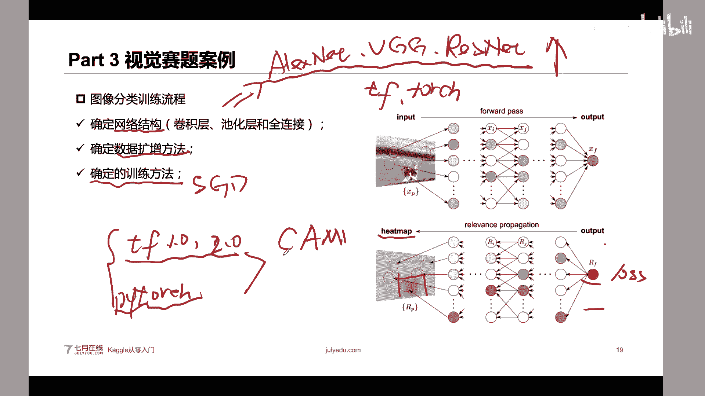

那么这是我们前面的三分三部分，嗯，大家有问题吗？呃，如果有问题呢，可以在我们现在沟通一下啊。对，我们就接下来讲我们第四部分一个一些具体的一些视觉竞赛的一些案例啊。

然后这个地方呢会讲嗯半个小时到一个小时吧。对，大家还有问题吗？嗯，我们稍微休休息休息一会儿啊。休息休息一两分钟，休息两分钟，喝口水。我们休息到呃休息休息两分钟嘛，休息两分钟嘛。休息两分钟啊。嗯。

大家还有问题吗？不管是嗯学习的，或者说我们竞赛相关的都可以啊，都都可以的。都可以问的对呃，其实嗯深度学习的一个发展还是很快的。现在嗯现在国内也有很多的，比如说华为、华为、旷世。呃。

然后百度都有自己的一些深度学习框架，都是挺值得学习的。因为现在嗯毕竟中美关系不太好嘛，所以现在嗯国内的一些很多公司啊都在发展自己的一个深度学习框架，嗯，也是比较值得学习的。都是挺值得学习的。

但是我还是建议你学习一下tenflowow和拍特去吧。这两个可能就是说找工作啊，你你就是以后都会用用这种比较多一些。呃，有同学说啊，老师有关关注过那个黑色肿瘤那个比赛吗？有什么提分建议啊，不好意思啊。

我没我最近没看那个比赛，我是前前一段时间参加那个小麦赛呢，然后没没没看这个黑色肿瘤那个比赛。我前段时间看到个小麦赛去了。黑色肿瘤那个也是物体检测吗？嗯，我没我没我没打开那个比赛。对。不好意思。嗯。

那么我们就继续啊继续然后继续讲的话，大家如果有问题呢也继续提问啊，嗯这个都是okK的啊，那么我们接下来就看我们一些具体的比赛案例的解析啊，这一部分可能是大家比较感兴趣的。

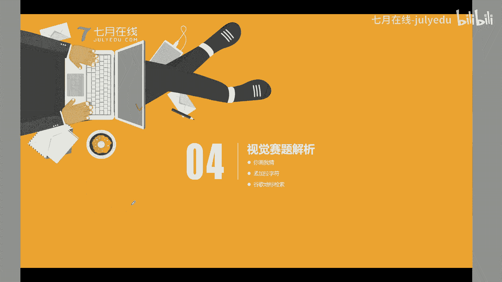

那么首先来看第一个第一场比赛，呃，这场比赛呢也是谷歌提出来的啊，谷歌嗯不知道大家知道我们之前就是说应该这场比赛是在2018年，2018年呢，谷歌弄了一个叫呃手绘的你你画我猜的一个涂鸦呃。

这个涂鸦呢其实本质上是谷歌的一个网页啊，这个谷歌它的网页，然后他就是说让让所有的用户啊，全球的所有的用户，比如说他给出一个蜜蜂。比如说他呃这个网页啊，就是说。给出一个关键字，然后让让所有的用户啊。

全球所有的用户用鼠标绘制出这个密封出来。然后呢，其实这个游戏的规则就是说你想你必须要识就是画出一个让AI能识别出来这个具体是密封的这种图像，就是说你一定要画出嗯这种就是说能够让AI学习的。呃，然后呢。

这个比赛最开始这个游戏就是说看谁画出来的呃就是说最像就是说看谁画的图像啊，就是说能够让AI识别的最多。然后呢，通过这个网页啊，谷歌收集得到了全球5000万张这种嗯用户的涂鸦。呃。

然后呢这个比赛就是说对手绘的涂鸦进行分类。那么这个比赛呢，它这个赛题的数据集是全球嗯几十个国家5000万张啊，这个地方数量级5000万张，总共340类的一个涂鸦的一个呃就是说一个呃数据。

然后需要用就是说所这个也是在ca上的，就是说需要我们的参赛选手，对手绘的涂鸦进行一个分类，也就是说给定一个手绘的，比如说我们这个地方给大家画一个，比如说给定一个手绘的一个图像，给定一个手绘图像。

比如我们画一个效脸，然后呢，你需要构建一个模型识别出这个图像，它到底是哎是不是一个person，对吧？就是说这个地方有很多类别，这个地方有有动物啊，有一些人啊，或者说椅子啊，那么这个赛题的难点是这样。

就是说它的一个数据量实在是太大，这个大到什么程度呢？它比imagineate数据集都大imagineate数据集是1000多万，这个数据集，这个比赛数据集是5000多万。

嗯这个然后呢这个是你如果从头训练，其实这个周期是很长的，周期特别长。因为这个数据集啊实在是太大太大了。当时啊在当时嗯你基本上如果没有4个4块。1080钛基本上玩不转基本上玩不转，就是最低的一个配置。

是4块1080钛。那么这个原始的图像是一个jason格式的，是一个鼠标的一个手绘的轨迹。就是呃他把一些用用户的一个鼠标的一个轨迹，通过一些鼠标点的一个形式存在这个jason里面，然后需要注意的是。

原始的尺寸是512的。唉，这个也是一个点，对吧？我们原始imagine的数据集，它的一个图像尺寸是24乘24的。这个地方它的一个图像尺寸既然比我们这个呃imagineate数据集的一个图像的尺寸更大。

那么这个也会导致它它的一个计算量更大。本来你的图片数量就更多，再接上你的图片尺寸更大。所以说这个比赛应该是很烧机器的一个图像分类的比赛。那么我们呢再来看一看这个比赛的一个具体的。呃。

一个嗯解题流程或者怎么样的啊。首先呢想要跟大家说这样的一个点，就是说大家拿到一个计算机视觉的比赛，或者说任何相关的1个KX比赛，你需要这样想，或者说我推荐你这样想。嗯。

首先呢我们这个谷歌这个手呃这个呃这种涂鸦这个识别比赛，它是一个很典型的一个同样分类的比赛，也就是说输入一张图片，我们需要构建一个CNN模型，然后识别出一个具体的类别，这个类别呢就是从340类里面挑一类。

对吧？那么这个呢你如果是识别就是说你这个流程你都能能理解通，那么很好。那么如果你对这个比赛的一个流程你都理解不通，那么我建议你以这样一个思路来理解。首先呢你是需要弄懂这个比赛的数据是什么？

比如说我们这个比赛的一个数据，原始数据是一个阶层数据，那么你就要弄清楚，哎这个阶算数据是怎么进行读取的，怎么把这个阶算数据转成一个图片的。其次呢这个赛题的数据是如何进行分析的。

并不是说呃并不是说呃非结构化的一些数据，或者说图像的数据就没办法进行分析。碰巧的是，就是在这个比赛啊，数据分析非常有用的，待会儿也给大家讲到啊，待会儿给大家讲一下。其次呢就是赛题数据怎么进行建模的。

我们认用什么模型，对吧？毕竟在imaginenet上有很多域性的模型有几十种，比如比如说当时应该有40多种，40加种。40加个CN模型，我们到底选择哪一个呢？

然后接下来就是说如如果我们训练得得到一个模型，它的精度不高。比如说我们提交的一个分数不是很好，那么我们怎么办呢？假如我们。在训练的过程中发现了我们模型有过拟合的情况，我们怎么怎么办呢？

以及我们怎么构造一些新的特征，或者说如何做进行改进呢？如果你是新手啊，如果你是第第一次或者说嗯参加KO或者说不太熟悉KO，我建议你以这种思路来学习。就是说你把这个赛题的背景数据模型改进方向。

你都想的清清楚楚的。你然后就不断的去尝试。你如果这些这些问题你都没想清楚，其实你就呃还是缺少了一点，或者说呃还是缺认点东西。为什么这么说呢？其实在这个比赛里面有很多细节。

首先呢是就是那原始的一个原始的这个数据是jason的数据。那么首先第一步呢，我们需要把这个jason转成一个图片。那么怎么转成图片呢？其实直接用open CV的一个画图函数就可以啊。

这个是这个是用画的也可以用open画或者都是可以的。那么在这个画图的过程中啊，其实是有一个知识点，就是说大家可看这个图片啊，它的线条是不同颜色的，它中不同颜色着色的，为什么呢？因为这是不同笔画的。

就是有可能比如我们画一张图，我这个地方也是一个手绘笔啊，其实我在画一个笑脸的时候，它是几笔完成了一笔2笔3笔4笔。那么我其实是可以虽然说它原始的图片就是三三个轨迹，你把三个轨迹。

那么其实我可以把这不同的轨迹编辑成，或者说把它绘成不同颜色。这个为什么要把它绘成绘制成不同的颜色呢，其实是这样的，它原始的数据啊就是一个son的数据。

它原始son的数据你如果直接把它画图呢其实是得到一个。12乘512的1个灰度图像，也就是512乘512乘1的这个图像。但是呢大家也知道。我们现有的一些预训练模型，它输入的是什么？它输入的是一个彩色图像。

比如说我们典型的一个imagine的个VGG模型，它其实输入的是24乘24乘3。通道数是三的，不是这一个的对吧？那么我们如何把这个。这个就是说在通道书面上面做一些文章呢，其实我待会儿也会以讲到。

其实一个很简单的一个方法就是说我能不能。在不同的通道数上面，比如说在第一个通道上面，我们画一个大的，比如说我们在第一个通道，我稍微给大家画一下，演示一下。在第一个通道数上面，我们画一个比较大的圆点。

在第二个通道上面，我们稍微小一点，稍微小一点。然后在第三个通道上面，我们去画一个最小的圆理，对吧？我们就是手动实现了一个嗯图像金字塔，对吧？或者说在不同的通道处上面。

我们用不同的颜色来表示不同的这个笔画。那么为什么这么做呢？这个就是我们在输入的空间上做一些文章，让我们的这个输入，其实既能满足我们预计模型的一个三通道的要求。

也能够保证我们这个输入的通道是包含足够的这个信息的。因为它原始的只有单通道，你直接把它进行输入是不够的。这是第一步，就是我们把数数据转成这个图像。第二步是构建我们的图像分类模型，这个又尤为关键的。

因为我们原始的数据集是5000。Wan。乘以512乘以512乘以1。所以它原始的数据机非常大。甚至大到什么程度呢？它是基本上是4个Email内的数据集啊，4个Email内的数据集的一个大小。

也就是说你如果想要做这个比赛，其实你基本上就能训练了4个immail之内的数学器，四个immail之内这模型啊，那么就会导致你在这个地方构建一个突然分类模型的时候，这个模型就尤为重要。

这个模型能不能太复杂。可以复杂。但是如果模型越复杂，你的训练的时间越长。如果这个模型太简单，那么你的模型的精度上限也有有限。所以说这个地方是在一个精度和一个速度上面训练。

特别是一个训练周期和一个精度上面做一个折中。对，做一个折中。那么需要注意的是啊，这个地方其实我这个地方写这几行代码是kis的啊ks就是我们用kis定义了一个呃就是说mobil net。然后这个地方呢。

其实我们先这个地方卖关的。其实这个图像的尺寸啊，其实是可变的。或者说我们在不同的阶段其实是不一样的。然后这个地这个地方想说的一点就是说在构建这个图像分类的模型的时候，并不是说模型越大越好啊。

模型越大过礼盒的可能性越大，需要训练的一个时间越长。但是呢由于我们做比赛其实是时间有限的，也也而且机器有限。那么这是构建我们的分类模型啊，比如说我们直接用cars里面的mobil match。

然后用交叉熵，然后做损略函数，然后就够了。那需要注意的是，你如果在做比赛的过程中啊，我还是建议你加入这个eartop，然后加入这个呃这种学习力的筛选，加入到这里面。

然后这样呢其实是对你的一个呃就是说训练还是有帮助的。因为这种eartop能够有效的停止，就是说防止你的模型进行过拟合。对。而第三步呢，其实啊第四步啊其实是可以就是我刚才前天讲的。

就是说我们还可以加一些数据扩存方法。其实其实啊这个数据扩存方法不不仅仅是对啊啊我们的样本空间做，其实对这个线条都可以做的。比如说我们对这个线条嗯做一些强弱的变化，对吧？我们数据扩存方法呢。

它嗯其实啊在这个比赛里面。在这个比赛里面啊，其实你可以做这种水平翻转啊，可以做这种水平翻转，就是左右翻转，但是不能做垂直翻转啊，一般不不做垂直翻转。因为因为嗯也没有人去把这个车倒着画，对吧？

把这个车轱辘画在上面吧，很少吧。对呃，也就是说不同的数据库的方法啊，需要根据你的任务进行筛选的。在有些场景下，数据扩存方法，比如说水平翻转垂直翻转是都可以用的。但是在有些任务上面，它并不是说都能用的。

有一些任务它就不能用翻转。有一些任务它能用翻转，这个是看具体的一个载题。其次呢你可以在做数据扩增的时候，加入一个笔笔画的强弱的改变，或者说丢失一些线条，对吧？丢失一些线条，或者说加入一些颜色。

不同的笔用不同的一个颜色来代替。其次呢我们可以加入一个旋转，比如说旋转嗯从5到10的一个角度，或者加入一加入一个缩放，随机缩放都是可以的。这是第四步。那么其实完成这四步。

其实都是可以完成一个比较好的分数。但是呢你都是我刚才一直没有回答这个问题，就是我们数据集特别大，我们怎么办？其实是这样的。就看右边这张表，因为我们原始的一个图片的尺寸是512乘以512的。

你如果嗯嗯5125乘以512，你如果直接从512乘512进行一个训练，不管你是就是说呃从从预训练模型加载，然后训练512乘以512的。很很很就说很难很难达到一个on嗯b best fit。

一直是处于这种underfi的一个过程。为什么这么说呢？因为这个图片的尺寸实在是太大了。s尺寸是太太大了。那么我们其实是可以这样的，就是说我们先把这个图片的尺寸缩小到64乘64。先。

把这个模型在这个上面训练。然后如果是嗯在这个上面我还是用这种嗯嗯，比如说我们规定这个CN模型就是嗯resson18。比如我们规定它都resonnet18。都是归运它是18层的残障网。

然后我们先把这个18层的残产网在这个64乘64的图片尺寸上训练好。然后呢，其实在这个在这种图片的尺寸下，它的一个进度啊就是top3的一个进度是0。85。然后这个训练时间只有8小时。然后呢。

我们把这个训练好的这个这个模型啊再放到这儿做一个训练。啊，放到这儿做做一个微调，就是说我们把这个64乘64的一个嗯网络的一个尺寸放到这一步。就是说我们把一个图片的一个尺寸扩大一倍。

然后呢再继续训练我们的呃我们的模型。这个地方呢你有可能会问老师，我们的一个呃网络怎么能够接受不同输入尺寸的一个图片呢？其实你可以改一下，最后就是说全连接层之前的那个铺ing层。

你可以把它改成这个动态池化的。然后就会嗯最终池化得到的一个呃图片的一呃就会维度啊，都是一样的，就就就不会存在这种就就就就是可以容忍不同尺寸的一个图片的输入了。对，这是一个点。嗯，就是。

如果我们把这个图片的尺寸把它放大一倍，然后我们的精度会更升高一些。然后我们的训练时间其实只需要16小时，那么需要注意的是，假如说我们不不不做这个64乘64的一个训练，然后然后把它在这个上面做微调。

可能你这个地方要直接从128乘128训练，这个地方可能要需要220加个小时，24加小时。因为。或者说更长更长或者34加小时。因为你这个地方其实它是在小的一个数据体上做一个很好的礼合。

然后在这个地方做一个。然后我们可以继续做到256乘256，继续到512乘512需要注意的是你图片尺寸越大，精度上限会越高，精度上限越高。但是训练带来的训练周期也会越长，需要注意的是，有同学说。

老师我们不能直接从256乘256训练嘛，可以也可以，但是这在做这个比赛的过程中，一般大部分显什吧，都是逐渐的增加我们图片的尺寸。

这样呢就是嗯就是模型都是不断的过不断的对我们的图片的尺寸得到一个很好的礼盒。然后最终到我们原始的尺寸，这个精度就是最高的。如果老师有同学说老师我们能不能直接从512乘52训练。

其实我可以很负责任的告诉你，你如果就直接从imagine预训练好的一个尺寸 imagineagine预训练好的一个权重，然后把它做一个初始化到512。乘为2这个尺寸来进行一个训练啊。

这个精度肯定是到不了0。95的，可能只有0。92到0。93左右。所以说你如果不做这种情况呢，可能你的模型根本没办法在这个很大的一个图像的尺寸下做。一个训练，因为这个训练周期实在太长。其次。

由于这个图片尺寸太大了，导致你的模型很容易过滤合。很容易过滤好的。对呃，就是说在做这个比赛的时候，们由于这个赛题数据很大，那么我们需要找一些方法，比如说我们逐渐逐次训练，逐渐增加我们图片的尺寸。

这样呢就可以训练得到一个比较好的一个模型。那么top选手的一个解决方案，那其实也是传统的，就是我们训练得到多个模型，也是讲到了。我们也是用到我们刚才讲的，就是说呃逐步扩大我们这个图片的尺寸来做的。

然后呢分步骤训练。然后呢其实在这个比赛里面也可以就是我们刚才讲了需要把这个图片把这个灰度信息啊进行一个很好的一个编码。因为我们这个嗯原始的一个就是说预训练的一些模型啊，都是接受这个RGB空间的一个输入。

所以说你如果只输入其中一个通道啊，还是还是比较浪费。就是说我们的就是说还有一些信息没有提取到。而且你可以在里面加入一些旋转mix up或者 out这种高阶的呃数据库的方法。那么需要注意的是啊。

这个地方有一个tck，就是说做这个比赛的时候，就是嗯啊这个地方应该是应该是这个地方是三这个地方是4对吧？在做这个比赛的时候，其实嗯第一名其实发现了一个trick就是说。嗯，他发现啊那第一名其实很忌贼。

他就是说哎，由于我们这个测试集啊刚好是340。乘以某个倍数，就是说样本刚好是这个。就是说每一类样本的一个数量完完全相同的。就是说这个参赛选手第一名啊正好发现了这个一点。那么他就通过一些类别平均啊。

就是说把我们的预测结果。把它平均到这340类里面的。然么然后呢，这个是很大的提分点。这个呢就是它对于我们的赛T的理解啊，特别是对这个预测数据进行理解之后，然后得到的一个结果。啊。

那么这个链接呢就是我们刚才嗯一直给大家讲的一些解决方案，特别是第四个思度的一个第一名解讯链接啊。如果大家课后感兴趣啊，可以建议阅读一下。呃，这是我们第一个比赛。那么第二个比赛呢。

可能也是前一段时间就是呃疫情期间3月份的一个孟加拉呃语的一个手呃字母识别的一个比赛。那么这个比赛呢是需要构建一个孟加拉字母的识别模型。这个呢虽然说也是一个图像分类的比赛啊。

我们还是以一些典型的图像分类的比赛给大家讲一下。然后呢，这个赛题任务是时间孟加拉那个手写字母，它是需要识别这个呃这个孟加拉手写个字母的这个什么词根词音还是什么就是三个类别，就是说你同一个字同一个字母啊。

有三个标签有三个标签需要进行识别的。然后不同的标签，我们分别把它叫G啊，分别把它叫GVC好吧，嗯，GVC简化一下。然后在G类里面，它其实有168个取值，V类里面有11个取值C类里面有7个取值。

也就是说同一个手写同任意一个任意一个手写字符分别有GVC3个类别，这三个类别是相互呃相互区分的啊，不是说呃嗯就是说它是一个多标签分类的一个问题，就是说有三个标签需要预测。

那么需要注意的是这个就是有一个点，就是说由于我们赛题数据是有三个。类别组成。那么大家可以算一下这个类别空间是多少。类别空间是168乘以11乘以7，对吧？这应该是有。呃，1万多个类别组合。

就是说最终的一个记忆。VC1个组合的，它的组合情况有1万多种，这个是非常非常多的一个类比组合。但是呢其实是这样的，我我们假设这个类别组合就是说这种GVC的组合情况有1500多种。

但是呢只在训练级里面出现了一其中一部分。就是说在训练级里面只出现了其中一部分，这是赛迪方他就是说弄的。然后我待会也会讲一下赛迪方为什么要这么弄。他就是说在1500多种里面，1500多个GVC组合里面。

就是1500多个字符里面啊，1500个多个字符嗯，字符里面，它只在训练级里面出现了1293个，还有200多个，还有207个字符在训练级里面没有出现，也就是导致我们需要用。

一种我们训练级里面的GVC的一个呃排列顺序去去预测一下我们之前训练集里面都没见过的这种顺序，对吧？那么呃这个举办方他非常鸡贼，鸡贼到什么程度呢？它的一个测试级的A榜，开个比赛一般都分分AB榜嘛，对吧？

AB榜A榜就是公开的榜单就是我们提交就有答案的，提交就有答案的。它的A榜正好是1293，就是考和训练级一致的这个类别。B榜就是我们私有榜单是207种，就是说新的一些类别。那么就导这呃很多人就翻车了。

很多人啊就是说由于他的B膀是包含了一些其他的一些字符的，它就是这个举办方就是这样设计的。我设计一个比赛，让大家能够。用一些已知的一些字符去预测一下未知的字符。就是说我们在这个样本空间，就在训拟镜里面啊。

记得所有记的168个取值。所有V的1611个取值，以及所有C的11个取值，你都见过。但是呢我在测试机里面会出现一些新的GVC的这种组合，就会导致你的模型没办法识识别好。这个比赛其实是翻车非常多的。

翻车非常多的。因为为什么这么说呢？因为。呃，我待会儿我也跟他讲，就是说因为我们这种测试集里面只出现了其中一部分，只出现了我们这种GVC这三个类别的一部分的组合。还有很多组合，还有200多这种组合。

其实是在。在我们训练级里面没见过了，但是这个举办方非常鸡贼啊，他在A榜里面就就划分了和训练机一致的这种类别组合，让很多人就误以为哎，是不是B榜里面就没有其他的一些新的GVC的组合。

那么我们怎么解决这个比赛呢？其实解决这个比赛是这样的。它的赛题的一个核心任务，就是说我们如何用有效的或者有限的一个类别样本训练得到一个模型，能够对一些没有见过的一些字符。比如说新的一些GVC的组合。

需要注意的是啊，这个地方不是说你之前的G你没见过没见过之前的V你没见过你之前的C没见过，只不过这个地方是把GVC重新组合了一遍，得到一个新的字符。就是说相当于我们部首偏旁。重新组合得了一个新词。

你就不认识了。但是这些部首啊嗯比如说草字头之前你都见过，但是你把它弄成一个新字，你都没见过。那就是说我们新的，比如说我们训练机里面只有呃1000。1500里面只有1300，你见过。

还有200多个你没见过。那么其实这个比赛就要考考验一下你对这些新的200多个的一个字符，你没有有没有很好的识别能力。对，这个比赛是这样的。那么我们怎么做呢？其实是这样。你如果知道这个赛题是这样的。

那么其实很很显然就是有两种方法。第一种方法，我们把测试集的样本区分为见过的样本和没有见过的样本把它分开来做，就是我们之前在训练级里面的。见过的一些样本send image。

啊s send chart吧恰见过这些字符和ons chart就是我们之前没有见过的字符，把它分开来一做，这个是一种方法。第二种方法是我们通过数据扩的方法来生成训练集里面不存的样本。

这个其实是用到了一个额外的知识。由于这是一个孟加拉嗯手写字体识别。其实一些呃字体啊都是嗯TTEFITTC格式，就是种这种呃电子的字符啊，都是可以用这种字符的一个文件来生成。

就是说它原始的只有1300多个呃字母，但是我们可以这种可以用这种呃比如说某个字体文件，比如说孟加拉语的字体文件，我们可以生成剩余的多个剩余的200多个字符，这是两种方法。

然后我们再来看一看这分别是怎么做的。嗯，第一种方法就是把我们的训练集分成我们见过的样本，还没有见过样本。这是第一种。第一种方法其实它是这样的。呃。第一种方法就是说它首先呢用一个archerface。

它不是用coursese enpy啊，不是用经常熵。它用archer来训练训练得到一个初步的模型。这个模型为什么用archerface呢？就是说它是想让我们。美类的一个。呃。

它的一个feature map或者说每类样本的一个语音空间尽可能进。这样呢它提取得到了我们训练级里面的1300多个字符的一个feature map，就是它的一个最终的一个像素中心吧，或者是距离中心。

直接把它平均得到一个距离中心。这一步呢就是训练得到第一个模型，就是得到我们训练机里面每一个样本，我们已知每个样本的一个距离中心。第二步，对我们待预测就是测试机里面的样本。做这样一个预测。如果我们。

得到一个新的样本，我看一下这个新的样本和我们1300多个字符，它的一个。就是这个图片也通过这个网络计算一个fe map，然后看一下这个图片和1300多个已知字符的个距离。比如说这个距离是大于某个值的。

我们就认为哎，我之前没见过你，对吧？因为你和我们之前见过的一些字符长得不太一样，距离太远了。然后这是就是说我们就可以把它识别成我们一个没有见过的字符。如果我们这个我们新来的一个样本啊。

和我们之前的一些31300多个字符的距离很近，那么我们就认为它是我们之前见过的一个字符。那么我们就把它分成两个模型。那么对于我们已经见过的一个字符，就是我们这个是训练级里面已经见过的一个字符。

那么我们直接用直接就是相当于不管不管这个有没有其他的情况，就直接正常的训练就够了。那么大家比较关注的，就是说哎这两个模型有什么区别啊？其实是这样的。这两个模型本质都是一样的，本质上都是一样的。

只不过这个模型是underfi的，就是欠拟合的。这个模型是欠离合的。在去年级上签名后的，大家思考一下这个就是说我们原始的样本，一个字符不是有GVC吗？😡，不是有GVC3个类别嘛？如果一个模型是欠拟合的。

这个CNN模式是欠拟合的，它其实是同时对GVC做一个独立独立的预测，就是相当于它并没有学习到每个G类V类的一个组合关系。这是这是在欠拟合的阶段。如果我们模型就是说精度已经很高了，或者说它不是欠拟合了。

其实它其实现在已经学习到了GVC3种类别的一个组合关系呢。因为它其实深度学习模型，它的一个能力太强了，所以说它导致它就能学会。哎，比如说这个G取某个值的时候，这个V取什么值。所以。这是两个不同的。

你可以认为它是不同阶段的模型。比如说这个模型嗯对这种没没有见过的，就是未知的一个字符预测的模型，可能这个只是训练了5个一po。这个模型呢就训练了10个，就训练多一会儿，就是说这个模型是一个嵌礼合的。

那么就会尽可能的让这个铅礼盒的模型对这个GVC3个类别分开，就尽可能的做一个独立的预测。这个模型呢，就是把它们做一个组合的预测，然后做一个融合，就是嗯不是做融合吧，就是分分成不同的样本嘛。

然后把它的结果把它拼接起来就够了。然后这是第一种思路。然后第二种思路呢，其实我就是我刚才讲过的。我们通过字体文件生成一个微没有见过的样本。

那么这个呢就是我们现有的一些不管孟加拉语还是它有这种TTF或TTC的这种电子的呃字体啊，其实是可以生成这种字符的。然后呢我们可以比如说我们原始的生成字符，其实和我们的赛题不太一样。

这个原始的赛题其实是一种手写的，其实这种手写的。那么其实还可以加入这种风格牵移的。比如说我们在CVG班里面讲的这种对吧？风格迁移的模型，其实是能够把一个生就是说我们这种。

生成生成的就是说呃这种比如说微微软雅黑的字体，通过这种风格迁移，把它迁移成一种手写的字体。这种手写的字题大家需要注意一下，为什么我们不不直接用这种嗯。呃，这种这种怎么为呃这种电子字体来训练呢？

其实这种电子字体和这个手呃这个手写字体是差的比较大的。因为在这个比赛里面，它其实是对手写孟加拉语做一个识别，所以说还是要做一一些处理的。那么这个风格迁移呢其实也是有现成的模型啊，直接用来用就行了。

然后我们训练得到这个风格迁移之后呢，就可以用这些字体文件生成，我们之前没有见过样本，然后通过风格迁移，得到一些新的样本，然后把这个样本呢加入到我们的训练集里面训练。然后就相当于我们只训练得到一个模型。

这个模型对我们的所有的样本一视同仁。不管你是之前出现过的，还是没有出现过的，我们直接做一个预测就够了。这是。呃，archerface是一个损失函数，嗯，archerface是一个损失函数，呃。

它是最早提提出在人脸识别里面的一个损失函数。嗯，对，嗯，你可以你可以搜搜搜搜索一下吧。因为我们这个地方课程内容比较多，没办法展开讲，它是尽可能的让我们的不同类别就是说距离比较远。

因为soft max它和这个呃步骤一不是提取特征。哦，这是方式。这个是方法2方法二就是和刚才的方法一不太一样，这是方法2。archface它和sof next不太一样。

arrcface它是尽可能的让不同类别，它的一个就是相隔的比较远。然后如果是用阿呃嗯翻翻翻过了啊，如果是用archrcface训练呢。那么就会导呃就会得到你不同类别的一个样本啊。

得到的一个feature map，它距离比较远，就相当于更加分散。对，就是说同类间隔的越近，不同类它们间隔的越远。嗯，对你可以搜索一下archface有相应等等文化公式。最开始是提出在呃人脸识别的。

现在也在一些呃图片分类里面被用到。呃，还有同学说步骤一提取的不是特征。呃，你说的是方法一的步骤一还是方法二的步骤一啊，这样。呃，方法一的步骤一提取的是图片特征嘛，中性特征是什么？嗯，其实这样的。

我们训练集它是总共有20万张图片，总共是1293个，1293个字符，1293个字符。然后我们可以提取一下。每个字符就是说每一类字符，1293类字符的一个特征的中心点。

就是相当于把所有同一类字符的一个feature map，它提取到的特征作为一个平均。就是你说的提取的特征，这个中心特征就是他们提取到的一个特征做一个平均就得到一个中心特征。对，很简单的。

就是说也不需要做聚类。对，是这个意思。啊，就是提取它的1个CNN中间中间层的一个非ature map就行了。嗯，对，那我们继续啊。然后这是这个比赛，然后就是说这个比赛还是挺有意思的，嗯。

就是呃还是挺考验就是说一些具体做的一些细节吧。然后如果你是按照刚才做的那样做的呢，其实这个比赛并不是很难对，并不是很难。那么我们看今天最后一个最后一个比赛比赛啊，最后一个比赛呢可能和前面的比赛不太一样。

那么这个比赛是一个嗯嗯landmark retrieve，就是地标检索，就是图像检索。这个比赛呢它是需要构建一个地标图像检索系统，这个就是一个以图搜图。就是我们用一个图片用图片搜索图片，我么给个例子啊。

输入一张图片，我们需要检索得到和它相同。就是说这个地方是包含相同地标图像。比如说是某个教堂，是某个呃这个地方应该是伦敦塔伦敦桥吧，还是伦敦塔的一个就是说它是需要你对输入一个图片进行一个检索。

这个地方给大家应该用用过或者说相相应的应用，对吧？这个可能是在百度识图或者说谷歌图像检索里面就有这种典典型的对吧？输入一张图片，我们检索得到相似的图片。

但是这个比赛呢可能是大家之前如果我没有做过这种图像检索呢，可能也就有一点难度。其实这个赛题它的一个数据量也是比较大的，总共应该是有100G还是300G的，然后这个数据的标签也比较多。

就是嗯也是一个就是说呃就是有地标有有几万个吧，地标有几万个，也是需要有有效的训练的。那么如果大家不知道这个比赛，其实或者说不知道图像检索，那么就会挺难的。但是呢如果你只知如果你知道图像检索的一些思路。

那么其实这个比赛并不难。对于一个图像检索啊，我们就是提取它一个特征。比如说提取它的一个非ature map。然后对这个图像进行去通过这个fe map进行一个索引。

然后对待检索的图片也提取一个fe map。然后翻算一下这个待检索的query的图像和图像数据库里面图像是不是就是在face map上面，它们之间的一个特征的一个相似度就够了。很简单。

你用这个速度就可以得到一个银牌，就基本上是特到前5%的一个呃成绩的，就基本上没有没有没有什么嗯特殊的技巧。对，然后右边的呢这个是一个前排选手，就是我们出一张图片，通过一个呃网络，然后还有一个赤化层。

这个池化层呢不一定是这个地方是一个广义规异化的石化层墙是嗯对max po进行改进的一个池化层，然后再加一个全连接层，然后再加上1个PCA的一个降维，再加上一个。呃嗯一些嗯检索方面的一些呃索引啊。

最终就可以得到。就基本上你如果做做的很简单，你只需要完成前面三步就可以得到一个透5%的一个成绩，就是一个银牌的成绩。那么很多同学不知道图像检索啊，我这个地方讲的稍微简单一点。就是说对于一张图像。

其实我们本质就是通过一张图像，把它抽取得到它的一个中间的一个特征。那么其实其实这个就是我们抽取一个非cha map。那么这个地方呢还有一些鲜验知识，就是说我们不仅是要抽取得到一个非圈 map啊。

我们还要把它进行一个有效的映射。那么大家也知道啊，在深度学习里面，还有。其他不很多不同的一些ping的方式。比如说max pullingingme pullingingsome pullinging。

那么这些不同的ping，其实呃大家可能在图像分类里面并没有什么区别。比如说用一般用种me pullinging比较多，或者用呃用这种max pullinging也可以。但是呢在图像分类图像检索里面。

这些ping会极大。嗯，有同学有同学问索引和检索是什么方式？呃，其实是这样的。呃，当我们提取完face map之后呢，我由于我们这个比赛的数据啊是非常大的。

就是有可能这个比赛的数据集的一个图像是100万张图片，100万张图片，对吧？然后假如说我们的faceion map是512。那么你的你如果再来一张图片，你其实是1乘512的1个。是1乘以512的1个呃。

总是写错了，512的1个向量，然后再100万的一个数据集来进行检索。这个其实是嗯时间复杂度很高的一个情况。那么我们能不能用一些特征压缩的情况。比如说我们把这个图图像的一个fe map做一个。这种压缩呢。

比如说把它聚首先做一个聚类，我们把它聚成N个类。比如说我们把它聚到呃1000个类里面，比如说聚到1000类里面。然后如果先检索呢，就相当于把也就是K嗯这种K面的方法，就是先在这个类里面先找大类。

再到大类里面找小类，这就是构建一个图片的索引。这个主要是用来做这种检索的加速的，主要做检索的加速的。然，这个是对一个特征索引的一个嗯加速的操作吧，就是做一个检索。嗯，做一个索引。

然后这个检索呢就是我们从一个query，然后具体计算这个过程。然后这个地方索引呢就是为了方便做这个特征的压缩啊和一些加速啊对。呃，那么在图像检索的过程中呢。

其实这个铺oling层对我们的这个检索的精度还是很有。很有影响的，大家可以体会一下啊，就是说不同的池化层，它关注的点不一样。比如说右边的这个图里面是一个最大的ping，就是max pullinging。

我把这个嗯它保留的一个位置把它圈出来。那么其实max pulling它比大家可以体会一下，为什么max pulling。它比这种min pulling更加适合用于，就是说在图像检索里面。

max pulling比min pulling更加适，为什么呢？因为图像检索它想找到的是。一些关键的点关键的点，它并不在意于这个区域整体的信息。它在意的是这个关键的一个位置是不是突出的。

所以说在图像检索里面，这个关用nex pulling，它能够最大程度的把这些关图像的一些关键的一些兴趣的一些点保留下来。嗯，如果用me pulling呢，反而是受到受到这种加权啊。

就最终没有把这种关键的一个信息保留下来。那么在图像检索里面还有很多的一些铺dding方法。比如说some pulling rem还有一种GEM这这些都是一些很就是说越往下是比较高级的一些铺ing方法。

然后也是对我们的检索的精度有一些嗯有一些嗯有一些影响嘛。但是嗯但是这些铺dding方法都很简单啊，都很简单，都不复杂，都不复杂。如果大家感兴趣呢，我会许会在直播群里面发一些链接啊，待会我会把这个比赛的。

把一个前拍的选手的链接发发出来，然后大家课后也可以看一下这个链接上面，其实讲的非常清楚。那么我们刚才讲的就是输入一张图片，我们通过一个网络结构。

然后通过一个这个地方计计算得到的这个feature map，然后在这个地方通过一个铺令层，然后得到一个最终的一个嗯就是比如说我们这个地方把它转成512，那么这个地方你可以用来做索引。

比如说也可以不做索引。如果不做索引呢，就是这种暴力检索用做KNN。然后呢，在图案检索里面呢，还有一些背景知识，或者说能够提分的点。比如我们。把一张输入的图片，比如说这是原始输入的图片，对吧？

我可以把这个输入的图片把它抠成不同的部分，然后进行检索吧，可以吧？这个其实叫。test time organization对吧？就是在测试集做做数据扩增。对吧这个也是可以的。

因为我如果这是做这种数据扩增，我们可以得到三个检索结果。然后最终我们可以把三个检索结果再进行一个嗯把它里面再选个最优的。其次呢我们可以把检索的结果，把它们就是说我们比如检索，比如说从512这个维度。

我们检索得到5张图片，就是5乘以512。对吧分别是5张图片，我们把这个检索得到的这个图像，把它进把它的特征进行一个平均。比如说把它平均到V2，再把这个。检索结果的维度啊，再继续进行查询。

这个操作叫query extension，叫这种扩展查询，或者说查询的这种扩展。就是说我们那种检索结果的平均再检索一次。然后这种呢其实是也是挺有效的，特别是在图像检索里面，其实是特别有效的一种方式。对。

这个也叫TTATTA对，然后呢，这个是在图像检索的一些流程啊，一些流程。然后呢，这是我们的一个三个比赛。那么其实这三个比赛不太一样，对吧？第一个比赛其实呃常嗯也是第一个比赛那个呃涂VR的一个比赛。

可能是需要大家如何解决精度和速度一个问题。第二个比赛是解决这个类别分布不一致的问题，三个比赛可能是需要大家知道这个图像检索的一个具体的一个路径的问题。那么需要注意的是啊，我们。

其实这不同比赛可能需要用到的一些模型都是差不多，毕竟这些些都是一些嗯在imagineation上预训练好的模型。但是呢它可能完成的具体操作是不一样的。我们再来回顾一下啊。

首先呢呃如果大家真的是想学习计算机试卷，其实深度学习基础是完成视觉赛析的必要条件，并不是说深度学习是完全是一个黑盒，它是有很多基础知识点是需要大家掌握的，也是必备的。这是第一个总结的。

第二个呢不同的载题有不同的数数据扩增方法啊，数据扩增方法，data augmentation就不同数据扩增方法，对吧打错了。好，然后呢不同的赛季有不同的训练方法，需要具体问题进行具体分析。

这个地方呢我给大家讲一下这个老图啊，这个老图是文达老师在呃它的一个li lips上的一个嗯workshop上讲的，就是说当我们训练一个模型的时候，我们优先是这样的，就是说当我们训练一个模型的时候。

我们可以看一下模型的在训练级上的一个精度是不是高的。我们如果模型在训练级上的一个精度，它的个损失都很高。那么我们就优先。在这种情况下，一般就是我们的模型都没训练好。那么我们这种更加强大的模型去训练。

如果我们的模型啊在训练级上的一个进度ok了，但是在测试机啊，这个地方是测试级第一位是从训练级里面划分了一部分测试级。但是在我们的啊啊不说错了，这个是验证级啊。

验证级纯DV这个地方从训练级里面划分一部分验证级，就是说我们的模型在训练级上的一个精度很高。但是在验证级上的一个精度不高不OK。那么这种情况下一般是。方差就是你的一个模型啊过滤合了。

那么你就要做一些政策化方法。比如说。嗯，数据扩单啊或者说振动化方法都是可以的。如果我们的模型在训练机上那个进度okK了，在验证级啊验证机上进度也O的。但是在这个地方这个地方啊sorry。

这个地方第一位呢这个地方是A榜的数据，这个地方是B绑的数据。如果你在最终的A榜的数据，你的一个精度不OK。那么在这种情况下，一般都是说你的一个验证级和A榜的数据，或者说你的验证级和最终的一个。哦。

测试级的一个分布不太一致。也就是说一般情况下，这个验证级是从训练级划分的。那么这种情况下，一般都是说训练级测试级的一个分布是不匹配的。那么我们能不能能够就是说找到一种数据库通方法。

或者是说用一种数据合成方法，能够把我们训练级的一个样本，把它调整成测试级呢。如果我们的模型在训练级上的进度OK，验证级上的进度OA版的精度OK，但是B版的精度不OK。

那么就是说明有可能你的模型就是过礼盒的一个验证级或者过礼盒的A榜都是有可能的。你同学说老师嗯，你也没用验证机进行调验证机进行训练，怎么过礼盒验证级呢？因为你在验证级或者A榜有一个打分的反馈。

其实你就有一个调参的过程呢，其实。你就是在过滤盒了。对，这是我们的一个总结啊，也是对大家学习的一个建议啊。那么我们再来展望一下。展望就是说第一个就是说视觉竞赛啊会越来越多，而且是越来越难。

那么这些竞赛也我相信啊也是越来越贴近我们的业务场景的难度会越来越大的，这个是肯定的。其次呢未来的很多的赛题啊，我相信是越来越多的是object detection和呃就物理检测和这种语分割的。

或者说多模态的赛题啊，不嗯这种图像分类的赛题啊会越来越少。因为它的难度会嗯就是说毕竟这个入门的一个人会更加多，这个门槛会降低一些。可能这个视觉赛题它的一个难度会越来越大。这是我们给大家总结的。

那么其实呢其实做开呢，我还是建议大家可以嗯报告班学习一下。在我们嗯7约在线呢，其实在嗯下周也就是呃嗯接下来的一周啊会。开一个开口竞赛实战的第二期这个班。

这个班呢会讲解一些结构化的CV还和NRP的一些比赛。也是我在讲，总共12次课啊，12次直播会讲解呃10多个比赛一些解决方案和它的一些解题的特点。那么这个嗯这个比这个班呢，其实也现在有一些优惠活动。

大家不用不嗯就是说如果想报名的，可以嗯就是说报名一下。嗯，然后这个比这个班呢，其实也是讲就是说想学习啊一些竞赛技巧啊，就是说还是比较不错的。嗯，这是第一个班。

然后第二个班呢就是我们现在就是说比较主推的一个是。呃，CV就业班这个班呢其实特别干火，是非常适合大家就业学习的。这个班呢其实是以一些知识点讲解。我们刚才前面也把这个CV就业班的一些知识点。

就是说学习路线给大家讲的。然后呢，这个班呢还有一些就业项目啊。这个是在我们一般的小班课没有的呃，在CV就业班里面呢，其实很多的一些参加我们CV就业班的同学。

最终在我们的学习完成之后都找到了比较嗯就是说挺好的工作的。这个地方呢，我是直接从这个呃我们课程链接里面截图得到的，就是说。基本上90%或者以上的同学啊都是找到了比他之前工资更高的，甚至高1。

5倍高很多倍的。就是说最高是80万年薪的一个同学，就非常非常值得啊。就是说大家如果有就业需求相关的，就是说一定就是说可以看一下我们这个就业班，现在就业班也有一些优惠活动啊。

有一些优惠活动就是说也是比较不错的。现在嗯如果大家嗯感兴趣呢，就是说可以咨询一下我们群里面的呃这个呃老师啊都是可以的。然后呢，这个就业班他一些优惠呢，就是说只要你买了我们就参加了我们就业班报名呢。

其实我们一年之内的这个GPU啊，都是免费供大家使用的。然后呢，这个就业班里面还有一些具体的实战项目，对吧？这些都是非常干火的。这些项目呢都是一些啊能够具体在工业界里面落地的。

然后有一些具体的一些工业界的一些呃老师啊，工业老师，不管是嗯有一些很多大咖，博士大咖，然后给大家讲这些嗯嗯一些学术上的模型的迭代，一些工业界的模型的什么裁剪一些工业界模型的部署都是讲的非常清楚的。

所以说也是特别欢迎，或者说特别希望大家嗯报名的。嗯，而且我们今天讲的一些内容，其实和我们就业班里面的一些呃知识点都是有重合的。但是我们就业班里面会讲解的更加清楚一些。对。呃，我看一下大家有什么问题啊。

大家有问题也可以呃跟在我们的聊天框里面嗯沟通一下。对，打字一下。我看已经有同学打字了。呃，嗯有同学说一嗯一个一般一个模型训练多少一poke如何界定学习利衰减到第几个一poke衰减，如何确定框架。呃。

框架懂，但是复杂数据加载数据流不知如何操作。比如有两个图就嗯做目标识别。啊，你的问题有点多啊，我就首先回答第一个问题嗯，一个一个回答吧啊，首先一个模型训练多少个一po如何界定界定啊。

这个其实是根据你有验证级。你如果有验证级，你可以通过验证级的一一个精度来做eartop。对我这个地方。嗯。啊，这个地方其实就是说现在的一些深深度学习框架，你可以在这个地方加入一个earlytop。

就是它可以嗯自动的就是说进行一个早停。这是第一个问题。就是说学习率如何衰减，就是现在的一些深度学习框架，它可以自动的帮你进行学习率衰减。它可以比如说在这个地方你可以设置我们最小的学习率是多少？

比如说它在一个一poke没有精度的提升，我们可以把它的学习率把它乘以0。5，就衰衰减一半。这个一般都是一些先验知识，或者说一些试出来的是一个超参数，这是第一个问题的回答。第二个问题嗯，框架懂。

但是复杂数据加载的流不知如何操作。比如有两个图计算目标位置呃有有一两个图分别计算这个位置类别。那你可以看你可以你看一下嗯fasstarCNN的，你应该是想学目标检测对吧？目标检测。

其实你可以着重看一下one stage和t stage它的区别，然后嗯你可以看一下fasstarCN它的一个网络结构嘛，然后其实在就业班里面也讲的很清楚。对就业班里面讲的很清楚。

就是说它的一些网络网络模型结构的一个设计，然后你还讲到的个数据流方法，其实这个不同类型的一个呃任务。比如说呃目标检测的一个数据扩增和这个语义分割的数据扩增肯定不太一样的，这个是需要具体的学习的。

这个是肯定是需要学习的，你要跑一些代码才。知道。呃，嗯第3个CNN怎么用attention以及原理的机制是什么？面试经常问这个看CN它到底是怎么做attenattion呢。

可以做这种这种就是嗯嗯chan层的attion也可以做就是SEresonnet就是嗯就是嗯那个叫什么SSEresonnet，就是那种改进的网络，其实也是加了这种attention的机制的。

然后你如果嗯有了解这种reID就是行人冲检测它这种attention也可以嗯用来识别这种具体的区域位置。我们刚才这个方地方其实那个小猫的那个图啊，小猫的这个图，其实大家注意到没有？

其实这个地方其实它这个位置啊，即使是我们原始输入是没有位置的。其实通过CNN这种镜向传播反应传播，其实它是能够学习到这个猫的一个位置的。这个其实我们在。就是是C0N能够学习的。

那么这个地方我们是不是能够对这个位置做一个attention呢？是不是我们着重关注一下这个位置的一个像素呢？对。嗯，对，然后大家还有问题吗？呃，如果有问题呢，一定要及时提问啊。

然后我们啊这个课件呢之后也会在我们的一个直播群啊，直播群忘记发了，就是在。

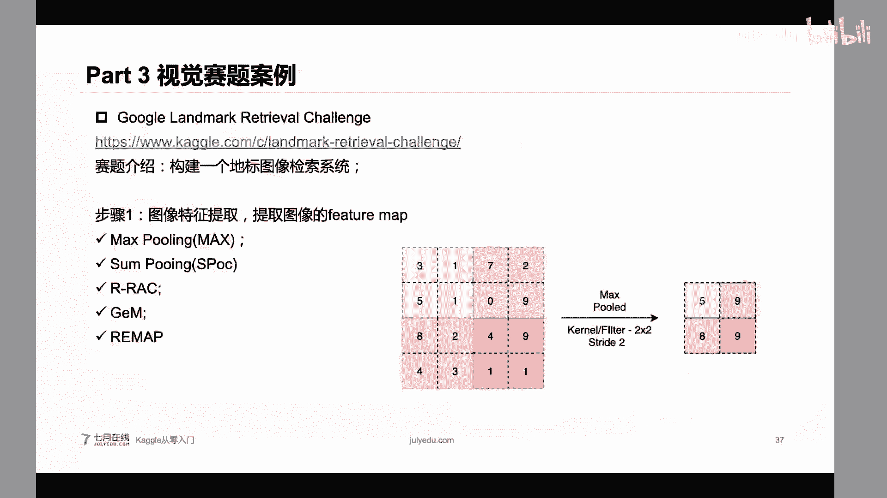

啊，最后面。呃，扫码关注一下啊，然后再嗯就是说嗯就是说有直播权还可以加对。还有同学说呃，如果通道数超过三，是不是数据训练的模型不能用了？不是啊，你超过3，你能不能我能把它截取到三毛。

是不我只用我只比如说它的一个通道数是N个大是4个，我能不能只用里面三个也可以用啊。还有一些视频的，比如说视频它的一个帧数就是大于肯定是大于三的吧。我们也可以用的CNCMN的，也可以用于训练模型。

就是说肯定能用的，我肯定是能用的，看你怎么用得上。嗯，大家还有问题吗？这个看具体的任务啊，看具体任务怎么用呢。比如说很典型的视频分类。肯定它的一个用途，用法肯定和这种呃图像分类的用法就不太一样了。呃。

我们这个今天的一个嗯直课件呢会在我们的直播呃直播群里面。对，然后大家如果没有加群的呢，可以扫码关注一下。然后对。

嗯，大家还有问题吗？呃，其实我们现在的就业班非常有优惠啊非常优惠。已经就是说现在也是呃今年的一个就业季嘛。如果大家感兴趣的话呢，就是说非常建议报名我们的就业班。

现在我们就业班应该是应该是就是说基本上参加我们就业班的，应该是百分之百都能找到很好的工作的对呃，没有基础，可以就业班，你可以咨询一下嘛，你可以咨询一下嘛，就是说我们现在的就业班。

他不是说呃就是我们也可以给大家制定一个学习计划的。不管你是呃想没有想不想参加我们就业班，这个可以都可以问一下我们老师，我们老师可以根据你的基础给你帮你制定一个学习计划。对呃优惠多少。

你可以咨询一下我们的老师啊，你可以登录我们的一个官网，然后点击一下这个报名，然后你可以找到老师，然后有具体的优惠的对。

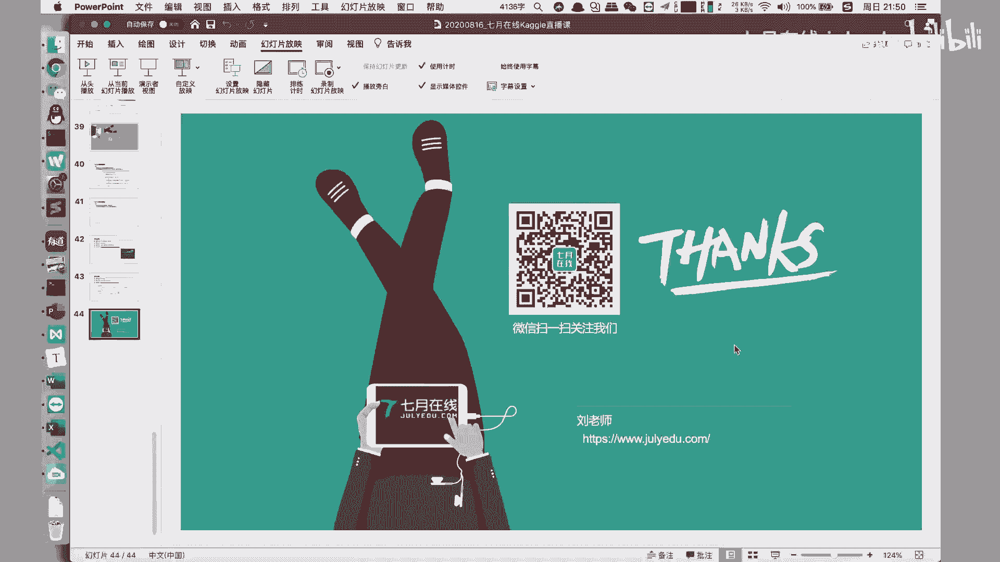

现在都是还有优惠的对，嗯，就是说早报名早消费，然后就是说肯定是优惠的，然后肯定是早报名，你早早点嗯就是说找工作嘛，这个肯定是对大家有好处的对吧？嗯。啊呀嗯然后大家还有问题吗？嗯。

对于我们的一个今天讲解的一个公开课的内容。对。

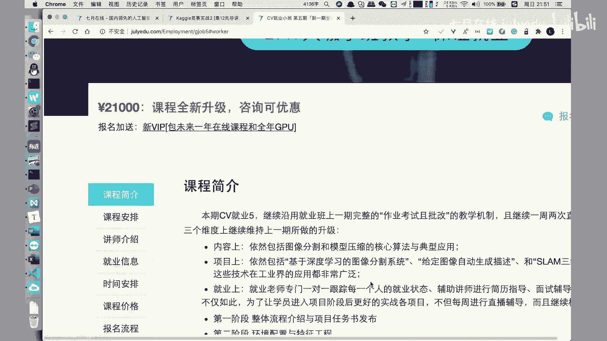

对呃，我们校长也说了呃呃肯定优惠是过千的，具体可以点击我们的报名咨询，然后进行一个咨询，这个肯定是有优惠的。只要大家想报名啊，我们就是绝对就是说会让大家就是说真的是有一些内有内容的价值才是啊分享出来的。

或者说做一些课程啊。对。还有同学说CV和推荐哪一个有前途，很难判断。呃，其实都挺好的都挺好的。只不过呢只不过我觉得是这样的，就是说现在啊现在国内的一些呃CV的公司它的一个岗位可能会稍微偏少一点。

因为现在呃计算机视觉它的一个落地其实任务还是有限的。所以说推荐其实推荐也挺好的，但是推荐也也是在大厂才有啊。所以说这两个啊这两个行这两个方向，其实我是建议你看你的兴趣，看你的兴趣。

其实我觉得呃就是呃嗯就是他们的岗位都差不多。我觉得就是说在数量上是差不多的对，学的肯定能就我们能保证就是你满足我们的要求啊，就是说你肯定是我们也有一些在我们的这个课程中间啊。

在我们的就业班中间也有一些呃筛选机制和一些嗯就是说考试啊，就是说不就我们这个地方肯定是每周都有考试。

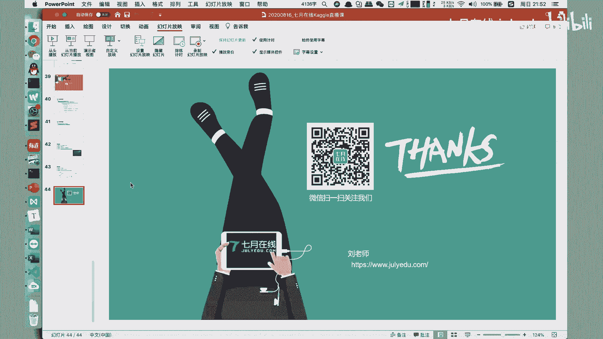

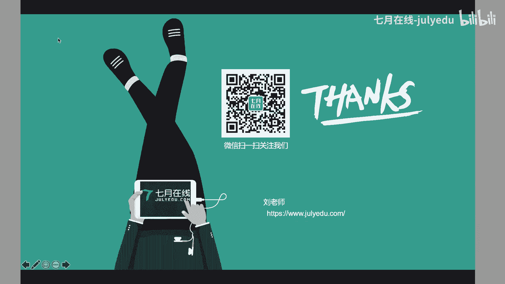

啊肯定是让你就是说真的有啊收获的，肯定是能保证你在学习完成之后，肯定是对你有很大的提升。也是在我们学习之后，也会就是说有一些内部的内推啊，一些机会啊，都能给到给到大家的。对，保就业。我们校长说了。

就业班是需要有一定基础，审核通过才能报名的。一旦通过肯定是可以报名的，而且是保证就业的。对，这个时候你校长保证啊，对大家你肯定是放下心。对。呃，如果大家对我们的就业班想更加深入呢。

大家直接打开我们的深嗯这个呃这个呃不不是深度学业，这个是TV在线的官网啊，然后在我们的这个课这个官网啊这个地方有一个CV工程师保大厂保就业这个页面，你点进去之后，然后点击一下咨询报名咨询啊。

点击一下这个嗯按钮呢，然后你找到具体的老师啊，你可以嗯再进行一个具体咨询啊。对。对，大家还有问题吗？那么嗯如果大家还有问题呢，可以在我们的。这个公开课的直播群里面进行一个提问。啊，好的，呃。

我看大家也没有什么问题吗。那么我们今天的一个直播分享就到此结束了，也特别感谢大家在周末的一个晚上，就是说跟我一起来学习这个内容。如果大家对我们的开go班有感兴趣的话呢。

可以关注一下我们开go嗯嗯竞赛实战班。这个班呢也是我来讲的，在下一下周就开始了。如果大家有就业相关的需求呢，可以关注一下我们的CV的就业嗯班。然后这个现在也有一些优惠活动。好的。

那么我们今天的课程内容就到此结束了。嗯，好的，谢谢大家。

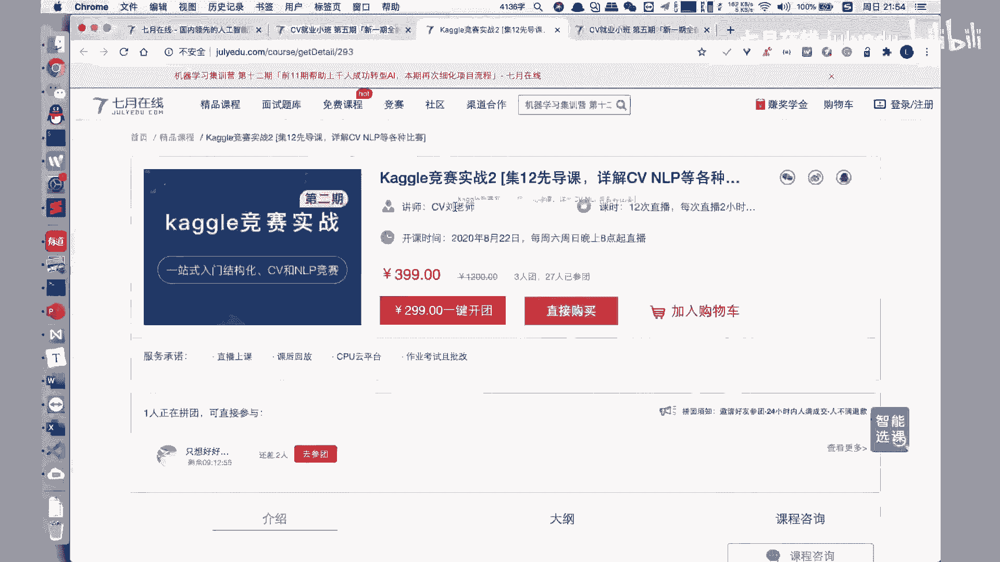

