# 人工智能—计算机视觉CV公开课（七月在线出品） - P5：目标检测这些年的那些事 - 七月在线-julyedu - BV17z4y167dq

hello，大家晚上好。我是你们的老朋友，CV庞老师。今天主要和大家聊一下目标检测在这些年发展的过程里面所遇到的哪些事儿。说白了也是希望给大家呃大概勾勒出一个关于目标检测的一个画卷OK。呃。

在正式纪间开始之前，想和大家呃说一下，呃，就是鉴于7月15号到7月21号是我们7月在线5周年的年庆活动。我们也非常感谢大家一直以来对7月在线的支持与肯定。呃，中年庆期间呢，我们课程会呃有出现时上最低价。

而且即将会出现一分钱买包括好客。而且在今天的课程当中，呃，我们会呃向大家有大礼包放呃，放出，我们会有一些课程的免单券。当然也是看大家的呃踊跃程度。然后我们到时候希望你呃拿到我们的免单券。ok。

O我们今天正式开始。呃，主要讲的是目标检测这些年的那些事儿，呃，基本上讲的是三个话题吧。第一个话题是跟大家聊一下目标检测。呃，在这些年的股价网络的一些演变过程。

然后我们会再跟大家聊一下关于这个目标检测的主要的一些分支和在这些分支当中，我们会呃遇到的哪些比较经典的框架。ok或者经典的网络。在最后的时候我们也会跟大家稍微聊一下这个优乐V4。

因为优乐V4实在是太火了。那么它为什么这么狂呢？我们会跟大家稍微的聊一聊ok我们先开始第一个话题。

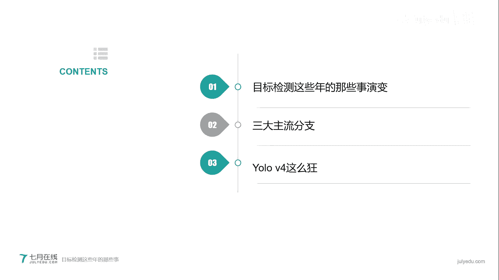

呃，讲到这个目标检测这些年的这种演变过程，我们最开始要跟大家聊，它演变的是股价网络的演变。那么说到股价网络你的演变，其实说直白点，那就是CNN的演变。当然我们这里说的CN不是美国那个新闻CNN啊。

我们说的是卷积神经网络。我们通常用卷积神经网络来作为整个呃目标检测的一个骨架网络，或者是骨干网络。OK那么卷积网络它做是什么问题呢？在这儿我稍微给大家就是呃聊一下最基础的那个卷积神经网络。

我们稍微聊一下。

OK那么卷积神经网络它主要做的是目标识别，而目标识别所解决的问题也是分类问题。O什么是分类问题？比方说我这儿有三台电脑，O大家都属于三台电脑。呃，台式机电脑。笔记本电脑还有平板电脑okK那么我们知道。

这是三台电脑，它可以说是属于一个大类，都是电脑。但是如果仔细观察的话，它又可以说是属于三个小类。那么我们需要把它进行分类的话，那么这就是一个目标识别的问题。对于我们人类来说，我们会。怎样就是区分呢？

当然很简单了，找共同点和不同点嘛，对不对？共同点呢都是电脑，那么不同点有哪些？比方说我们可以看到它的大小不一样，台式机的大小一般都是最大的。平板电脑一般都是最小的。然后它们的形状可能不一样，对吧？

材质不一样，而且便捷性它也确实也不一样。我觉得我们一般不会抱着一个台式机的主机和显示器到处跑。okK那么这些就是它的不同点。通过找到共同点，我们会区问它的一个大类。那么通过找一些不同点。

我们对它进行区分的一个小类。OK。那么计算机是怎么办呢？计算机它是通过找到目标的相关的特征，就是features来对目标进行识别与探究。OK我们所谓的找features。

那么这些feature是哪是具体是什么意思呢？我们给大家举几个例子，第一个颜色特征。在计算机视觉领域，呃，我们会把一张彩色图片来用不同的呃就是手法来表示。比如说最经典的RGBORGB就是红蓝绿。

而且我们会通过一个范围，对每一个呃颜色或者是每一个通道，我们把它定义为，如果是整数的话，就是0到255。如果是浮点数或者小数的话，是0到1，这是一种表示方法。当然我们也可以通过用其他的方式表示。

比如说HSL。就是我们看到的右上角这个等等来表示。okK这我就不给大家展开叙述了。还有一些特征，比如说形状特征，我们拿这张图片来举例。在这张图像当中，我们可以发现。哎，这是一条线，对吧？

那么这儿是一个角。同样这个是个结构，那么这些特征就叫做形状特征。还有一些特征是纹理特征。比如说我们看到的这两张图像，左边这张图像它仿佛是一些。六边形就是正六边形的不同的，就是这个呃叠加。

那么这些特征叫做纹理特征。OK当然计算机视觉还会呃主动的去发现很多很多其他不一样的特征。O。但是所有的特征他们就会组成。就是所有的这些小点，他们都我们都把它归为特征。

而计算机视觉就是说我通过挖掘这些特征来找到不同类的相同点和不同点OK。呃，在这儿我们要提出来一个问题，就是为什么CNN我们会就是用来就是呃探究这个对图像的目标识别呢？O。当然答案其实也很明确了。

比如说我们会在不同的区域呃来发现一些相同的一些特征。给大家举两个例子。在这儿呢我有两张图像，都是鸟类图像。OK大家可以看到这个景身呢都特别浅。那么在这个鸟类图像当中，我们希望找到一些共同的特征。

因为我们仔细看啊这两这两个鸟类属于两个不同的品种，但是大类都是鸟类。但是我们会发现在这个地方就是我们红色框标出来的这个地方，这个地方呢是鸟嘴，对吧？那么这个时候我们就可以用一个神经单位来说。

okK这个是一个鸟嘴的检测器。O。当然我们在第二个图像当中，我们也发现在某一个区域也是有个类似的东西。那么这个我们就把它也用一个神经单元来说，那么它也是找到的鸟嘴OK但是说白了这两个神经单元。

虽然上面找的是我们可以叫做在呃上方会找到一个鸟嘴，然后在第二个图像当中的中部，我们找到一个鸟嘴。但是说句实话，他们俩做的是同样的事情，对吧？同样的事情。呃，在这同样的事情当中。

那么我们就可以用相同的参数来进行呃表示ok或者说我们是对他们进行共养参数等等。OK这张图像是一张比较经典的CAN的就是一个结构图。我们给大家大致说一下。左侧。是一张图像。OK当然我们看到是一张鹿的图像。

然后我们看最右侧，先看最右侧那个紫色框output这个output这块说的就是我们在检测完这张图像当中之后，我们会有一些类，就是我们先预定一些类，比如说我们预定了狗猫鹿和狮子。然后我们在这些类当中。

我们会有每一个类有一个分数得分最高的，我们就认为它是呃针对这个类，它出现的概率。那么得分最高的就属于也就是说概率最大的，那么就极大可能这张图片所对应的就是这个类。ok那么它的中间会出现很多很多的层。

比如说卷积层石化层。还有全连接层等等。在这儿呢我就不给大家展开说了。因为这个毕竟我们不是在聊这个呃CN呃，但是在我们之后的课程当中，我们会给大家学习介绍OK。在这个地方我们一般还会想跟大家说一下。

就是说机器我们总说它是在找特征，找特征。OK那么这个机器到底它在学习什么？比方说我们看这张图像。这张图像我们知道okK它是一个外星人的笔记笔记本电脑。但是对于。图像当呃机器人他检测到这个区域的时候。

就是我们红色框标注这个区域的时候。外星人会不是机器人会想okK当我想象到这个区域的时候，那么这块代表着整个图像，它到底是外星人呢还是笔记本呢？这个时候就很麻烦了，对吧？那么我们来看一下。呃。

机器到底在学习特征的时候，它学习到的是什么？我们拿alexnet来举例。alex因为alexnet是出现最早的，当然也是一个非常成功的一个里程碑式的网络。我们看一下，在alexnet的第一层的时候。

他会看到什么？O。我们仔细看。现在给大家放出的这张图像，就是它第一层当中所呃对应识别出来的一个就是特征的图。我们可以看到呃在这张图的，比如说这上半部分，比如说我们拿左上角来举例吧。

左上角我们能隐约的看到它是类似于1个201饼干，只不过是把夹心儿呃加到了饼干上，OK就是两个白线条对角线线条，然后一个黑色对角线线条。OK那么我们就知道okK在这个区域。

它出现的应该是黑白呃白黑白相间的一个呃特征。如果再往下看，就是最下方的时候，我们可以看到在某一处它会出现某一个色彩的特征。OK那么这个就是在alexide第一层它所学到的特征。当我们如果放眼望去。

在第五层之后。Snet第五层之后，那么这个就是它所表现的特征。在这个时候我们会发现嗯这些图片其实已经很接近就是我们的我们人类的一些直观感受。对吧比说我们已经能看到这是小孩，这是小狗等等。O。😊。

那么这个就是CN它所呃学习在不同层所学习到的知识。当然我们这个时候就可以理解在。比较呃靠前的或者是嗯比较早一点的层述的时候，他学习到那些所谓的feature或是所谓的语义，那么它都是比较低级的语义。

对吧？它可能是线条，可能是颜色等等。但是在呃就是靠后的层数当中，或者是呃比较高级的层数当中，他所学到的是这些语言，是我们认为是比较高级的语言。因为这个时候我们已经可以就是直接观观察到他学习的大概是什么。

就是很符合我们人类的认知。O呃，在2012年的时候。alexand横空出世，当时它只有8层。但是它的不准确率注意我这儿说的是不准确率，它是16。4%。如果是准确率的话，我们就做一个意减，呃。

就是就可以了OK。那么在14年的时候。14年的时候。呃，谷歌出了VGG这个也是一个非常快里程碑式的一个网络。而且现在我们还经常用VGG那么它最高是出到了19层。当然它还有一个版本是16层。

它的不准确率是降低到了7。3%。同年，谷歌又出现了一个。Googlenet。他搭到了22层。O它的不准率去率是6。7%。那么这个时候我们可能就要想。呃，是不是这个层数越深越好？ok是不是层数越深越好？

那么从现在这幅图上来看，貌似是层数越深，那么我的准确率就越高。换句话说，就是我的不准确率一直在降低。那么是不是我们把层数搭的越高越好，甚至是无限高。那么我们最后得出来的结果就是最好的呢？当然这个答案是。

呃，我。呃，在那个时候啊是答案是否定的。当然后来大家也出现了，答家也当然也是有可能是肯定的。为什么这么说呢？因为如果我们不采取一些措施的话。你的层数越深。你可能会导致出现一个灾难性的结果。为什么这么说？

因为我们在搭建CAN的时候，而且我们在正向运算和反向运算来降低它的误差的时候。这个我们用的方法是求导。当你的层数特别深的时候，我们可能会遇到一个问题，就是说。激度消失或者是导数消失。呃。

在这儿这么说的时候，可能会给就是不太了解CEN的同学造成一些困惑。呃，因为呃如果想把这块完全展开的话，我们会在我们之后的课堂上，就正式的课堂上会给大家就是很详细的描述。

OK在这儿呢就是告诉告诉大家一个概念。如果你无限大层数的时候，同时你不采取任何手腕的时候，这个时候会造成肌度消失，也就会导致你最后的结果完全不准确。OK那么如何解决这个问题呢？2016年的时候。

我们出现了一个非常嗯跨里程碑的一个网络，而且现在也会在大量使用的一个网络。就是reson nightOre night。呃。它的不准确率同时也降低到了33。57%。大家注意它的层数达到了152层。

对比googlenet。22层它连呃这个我们叫残插网络，ret stillnet。他连他的零头都不到。Okay。一年之后，17年的时候会出现另外一个网络。叫dancenet，它不可思议的达到了264层。

okK当然在19年的时候，又会出现另外一个一个系列的新的网络叫CSPnet。一会儿我给大家稍微聊一下ok那么我们先看一下。ressonite的结构吧。okresson结构吧。

大家看到现在这张图是一个比较传统的，或者是一个比较经典的，就是呃CN的其的某一个神经元的一个大概结构。okK那么我们看从下往上看啊，最下面这个X的是个输入。O就是神经元的输入。

我们可以把它认为是你的这张图片呢，我们也可以把它。认为是你经过很多层之后的一个featuresOX输入，然后我们通过我们这个虚线框，通过权正权重就是W乘以X呃，然后再经过呃就是layer层。

再做一层非线性变换。就是我们现在看到的这个蓝色的部分OK。呃，做完非线性电变换的时候，然后我们会把我们的输入输入到下一个神经元，这个是一个比较传统的这个呃神经元的一个计算。那么对于resnet来说呢。

或者是参家网络来说呢。他会做一个事情，就是说。我在做非线性变换之前，我把我的输入哎，我在直接。加到我最后说的那个FX上面。那么。我们这么做的目的就是说我们要防止梯度消失。换句话说。

就是说我把X的信息又重新丢到了下一层当中去。这样的话，即便呃你梯度消失已经发生了，但是呢我没有得到之前的一些feature。之前的features。那么这个时候我们就在防止梯土消失。

OK这个是一个ressonnet的一个核心思想。当然了呃在其实在ressonnet当中，它也有一些变种。比如说我们不直接进行加，我们作为一个一乘一的卷节，又或者是我们加了一个铺ing层就等等。

那么但是这些变种呢，它其实都是万变不离其中的，ok它都是利用这个思想。对呀，这就是这己一种特征特征融合的方式，不过只不过是特征融合的手段是不一样的OK。我们看这幅图。

这幅图就是一个resnet的一个框架图。我们在每一层就是我们现在看啊最左面的输入，这是图像。然后最右面我们画一个箭头，就是再继续往后输出ok中间的不同颜色的区块，比如说黄色、红色呃，这个是。呃。

这个是呃青色吧，还有最后的那个呃灰色ok等等。呃，老师对这个颜色的表达可能不是特别准确，因为我不是学美术的，就大家这个大概理解一下。就是说对于这四个不同的颜色，我们认为这四个不同的颜色呢。

就是一个残插block残差块。okK那么每经过一个残渣块，我都会把前面的输入直接丢到后面就是残渣块结束直中去一个特征的融合。呃，有个同学问一乘一的卷积，因为现在变题是怎么操作的？呃。

在我们正式的那个目标检测的课程当中，会给大家具体讲解这个变成是怎么操作的啊。呃稍微给大家讲一个一乘一的卷积，就是我们提一句哈就是这个呃。一乘一的卷积呢，它其实就是呃我们最大的作用就是进行降维。

OK就是进行降维。呃，总结一下USnet它减轻了梯度消失，同时加强了特征的传递。musaskCNN我们一会儿还会给大家就是聊在那个讲那个目标检测当中那个第一阶段ok我第一个分支我会给大家去再聊的。呃。

要给大家提醒一下的是，在ressonnet在这一块呢是我是写的一个java，就是测试融合，我们是会做一个呃像素级别的，直接进行相加。O在17年的时候，就是ressonnet出现。一年之后，17年的时候。

我们出现了另外一个网络是dessnetokdesnet。我们看一下这个dnet这个图，它有点像yesnet。呃，有个同学问我分类任务网络用的最多效果最好。呃，我不能直接就是这么回答。

但是因为这为什么这么说呢？因为你针对不同的项目，注意啊，针对不同的项目，它其实是有就是呃不同的网络，它会有就是更强的一个能力。所以我不能说一个通俗的说它是最好。但是我会给大家说一下。

一般我会采用CSP系列里面的一种。O我们很快就给大家讲到，就假方大给大家讲到，而且优6V4，我印象就是用的drknet53的一个变种CSP darkrknet我一会给大家提啊。呃。呃，那当然了。

很高兴大家就是不停的问我问题，一会儿我会在大家当中，我会抽选一些呃热心提问的同学，然后给贡献出我们的大礼包。OK我们继续。我们看desnet的这个图像。desside这个图像呃。

它其实是不是跟beside有点接近？OK我们回推上一张图像。resnet残插网络，它只是唉我前面的那个输入，我直接会丢掉，就是我画一条线，直接丢掉呃，直接丢到呃我的输出当中。

但是我们仔细看dessnet，它不仅仅是把前面的这些就是我前一层的输入，我直接丢到我我的下一层的输呃呃输出，呃不呃，我这个不能这么说啊。

就是说我把我不仅仅是我把前一前面我的一个输入直接引到我这个block的输出当中，同时我把我前面所有层的输入，我全部拿过来。ok我全部拿过来。那么这样的话，它会有一些好处，我给大家总结一下。

当然最开始它嗯的前两条它是resnet的好处。O毕竟它是在呃残差网络的一个技术上的一个变种嘛，对吧？同时它这么做呢，它会更有效的利用了这个features。而且在一定程度上较少的减少了这个参数的数量。

为什么会减少呢？一会儿给大家就是告诉大家。呃，要给大家提醒一下的是就是。在desna当中，它是不是进行像素级的相加，而是做concation。就是就是大家看到那个绿色的圈C。

它的意思就是说我把我的这些features，然后并排就是并排的放在那里。O并排的放在那里。给大家看一下论文当中的出现的这个图片。OK这个是论文当中出现这个图片，我们大家可以仔细看一下。

每一个颜色就是可以说每一个系列的颜色，比如说最开始的红色系列，最深的那个红色就左上角最深的红色手的输入是一张图像。然后呃紧接下来是类似就是红色系吧。我们把它它是一个呃第一个block，紧接下来的绿色系。

又是一个block。那么我们这有5个dance blockok我直接给大家看一下它的结构。那么在这张图像当中，就是左上这张图像当中，我们可以看到我们所有的输入。

就是前面所有的输入都会引到之后的所有输入上去。OK比如说我们所看到的。呃，我们看一下啊，X1X1这个block的输入，它其实只有一个，因为它是作为最靠前的嘛，它只有一个输入，就是X0给的输入。

但是对于X2这个紫色的这个block呢，它就会有两个输入，一个是X一直接给的输入。另外是我们把X零引过来的输入，同理对于黄色呃这个系列的这个block d block。

X3X3它所引出就是接收到的输入有3个，一个是它前面X2给的输入，一个是我们把X一引过来的输入。同时X0也引过来的输入OK就以此呃以此类推。这个就是大自然的思想ok。呃，如何呃提一下啊。

就是刚才不是有那个同学还问那一乘1的那个卷积，我们还是那句话，1乘一的卷积，我们主要的目目标是降维，减少参数数量O。讲到嗯d nest这个这个的时候，这个是在17年的时候出现的。O17年的时候出现的。

在呃19年的时候，就是两年之后横空出世了一个系列网络OK。恒中是一个系列网络，这个系列网络我们叫CSPnetsok CSPnet。为什么这么说呢？因为这个CSP网络系列呢，它不是一个网络。

OK它是一个思想，它会针对就是我前面所有的比如说残渣网络也好，或者是呃单net网络也好，我们会针对它这个系列来进行一些改变。O我们看一下它是具体怎么变的吧。现在这幅图是呃论文当中出现的图OK。左上角。

A它是达斯net的一个图ok。还这就是我们之前那个思想。嗯，我们不同的颜色，比如说最开始我们的输入是一个。呃，这是什么色儿？我要不我们把它称为淡紫色吧，好吧。呃。

就是左上角最开始的输入是淡紫色的一个block，然后我们会把它引到X一输入。同时我们把呃X一的输入输入和呃之前的输入我们并列起来O再然后我们把输入引到X2，就是下一个dance block当中。

同时我们把前面所有的输入都并列起来。它这个是一个呃比较抽象的图。这个图，它的思想和我们之前看到的这个呃左下角这个图，它是一模一样的。O再看明白这个图当中。

我们就可以给大家去说一下CSP net它是怎么想的。O对于CSP net呢，它的想法其实也很简单，它把我最前面注意啊，他把我最前面我这个X一就是X零吧，就是X一系列的输入，我先一批为2O就是我P成两半。

左面一半右面一半。OK我把左面的那一半，我先留着，我先留着，留着过年。然后我把我右面的那一半我往后传递O那么右面的这一半，它再往下传递的当中，这个其实就是dnet了。O但是我把我左面留下的那一半呢。

我先留着。当我传递完几个就是呃这个CSP的block的时候，然后我再把左面的一半，我直接拉到最后的输出当中去。ok我直接拉到最后的输出当中去。那么这个就是它dnet呃，这个就是CSPnet的一个想法。

他这么做呢。它可以说是我增加了呃记入信息的通道，然后同时也减少了计算量。OK在论文当中他会提到呃，就是除了他就是聊了一下最基本他的一个思想，他同时会提到就是说我把我左面劈开的这一半，我最后我融合的时候。

他大概有三种融合方式，再加上他的一个最开始的不融合。OK他会进行一个比较，具体怎么比较呢？我们会在我们的课堂上。我们会在我们的课堂上给大家就是直接做更清晰的呃讲解。OK就这样给大家推荐。两门课。

第一个是我们的就业小班的第五期。ok呃，第二是我们的关于这个目标检测的一个实战课。呃，有经常有同学在线下的时候问我，哎，老师，你说这个就业班和实战班有什么区别呢？当然除了价格了，那么对于就业班来说。

我们会更多的关注呃同学们的这个呃代码的代码的这个演展示。OK通过这个。呃，手把手教大家一步一步马在马，这是我们就会班的一个特色。但是对于这个实战班呢，实战班是面向就是说我想快速的学习相应的知识。

O那么我们更主更注重的是一个理论的讲解。OK跟大家说个好事儿啊，就是说如果你今晚在我们的直播间报名这个CV就业小班第五期的话，我们会给大家在那个原价的基础上，就是原现有的优惠价的基础上。

我们会再给大家狠狠的打折。O再给大家狠狠的打折。当然了会有没有限制。因为呃不可能全部。我们会有抽奖名额限制。OK关于这个就位小班的那个我就透露到这就透露到这儿。呃。呃，线下怎么报名？呃，课程呃。

先说线下怎么报名吧，我先把这个咨询方式发到评论区，我们会有一些呃很多报名方式OK。呃，这么说，我现在给大家发这个网站是我们的那个客服的官方链接。如果对我7月在线不是很了解的同学。

你可以呃就是打开这个链接，或者是直接在我们的那个主页上面找到我们的客服进行咨询。当然呢我们也会有那个小群，呃，如果在已经在群里的同学哈。你可以只是在群里面直接问咨询一下里面的老师。

老师会直接对你直接告诉你。然后呃书伟直接告诉你，就是这个大概是几折。我在这呢就不跟大家去透露几折了。OK呃，当然你一定要就是跟你的老师我跟他聊，就是说你们是今天晚上听了CV潘老师的那个公开课。

然后我来报名的。那么这个时候呢，你就会呃收到这个恒恒的价，就是恒恒的这个折扣。OK呃，当然了，已经加过，就是在群里加过老师微信了呢，你就不用再重复加了。你就问那些呃。

就是你已经的加到了老师关于那个详细的资料就可以OK。呃，有同学问我那个课程是不是都是老师讲的呢？哎，如果不知道怎么加的话，你在群里面直接问哎，哪个是老师啊，冒个泡，我们聊一聊，OK也可以。呃。

这个呃丛林实战目标检测这个实战课是老师主讲，就是就就是潘老师主讲，我会给大家就是讲的更细一点。有同学问这个呃实战班的价格和讲模型的细节。我们的模型会专门抠细节，就是在理论上专门抠细节。

同时我们也会给大家就是放出这个关于模型的代码，告诉大家怎么运行。呃，同时也大概讲解一下代码，当然不会像就业班讲那么细啊，对，这是有两个班。呃。我们可以看一下。这个是我们实战班，在实战班的前两节。

第一节呢当然是就是给大家打一个那个基础。然后第二个就是第二堂课呢是讲那个骨干网络，这里面会给大家讲的更细。就是把具体的呃比如说参加网络呃dancenet，还有这个CSP系列的每一个细节给大家扣清楚。

ok当然最后也会带大家呃搭建一用拍到搭建一个你自己的。卷机神经网络。okK呃，我们现在呢就已经聊完了第一个话题。

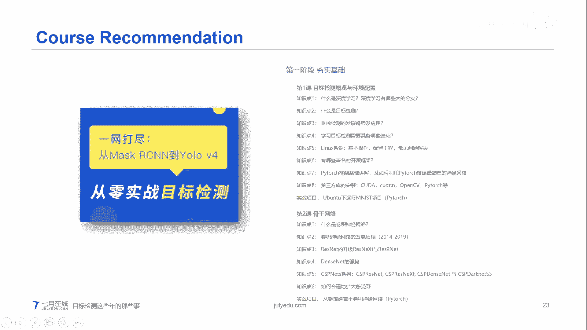

在第一个话题聊完之后，哎，我们这个时候。呃，哎有个同学问我，这两个班有什么区别？

我们回回馈一下，简单的回答一下这个同学的问题啊。我们一个是就业小班第五期，这个我们的目标很明确，就是为了大家的就业。O同时在这个就业小班里面呢，我们的人数少。然后老师呢这样的会有更多的经验来会帮助大家。

而且我们就业小班，更注重大家的是就在理论的基础上更注重的就是大家的实战经验。这个实战经验说白了就是你的录代码经验，老师会手把手的带你录代码从训练你的网络，然后到如何调餐，一步一步教你O对于实战课程呢。

它主要是。实战课程主要是目的就是让你快速的掌握呃这个理论模型细节OK那么这个是实战课程。呃，轻量级的网络我们呃我现在还没有加进去。但是如果有同学感兴趣的话。

我会在课堂上的当中会给大家把轻量级的网络就是加进来。呃，有同学问我想写科研论文的话，报哪个？这个的话呃问的问题比较好啊呃。如果你也想就是做科研的话，我个人认为你首先第一步你需要对模型有一个了解。呃。

那么我建议你如果呃先对模型了解的话，你可以先考虑一下这个目标检测，就是实战课，就是优面几堂课程。呃，右面这堂课程主要是会带你快速的入门。快速的了解这个模型的细节，这是你的第一步嘛。

但是如果你想真正做科研的时候，你需要很强的撸代码能力。那个时候我建议你得考虑一下CV就业小班。但是话说回来，今天晚上如果你报名CV就业小班第五期的话，我们的价格会在优惠的基础上再狠狠的打折。

okK不过名额有限。

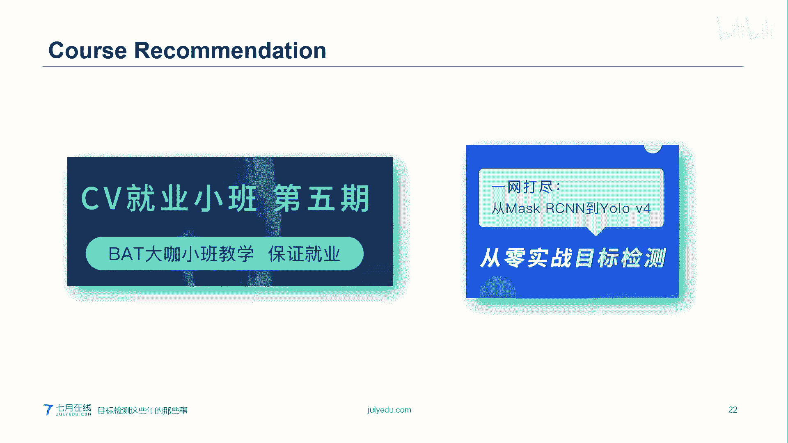

呃。这已经跟大家介绍了一下那个哎我们有交流群。哎，我们的后台老师可以把这个交流群嗯，就是我们。哎，我们呃这样吧，我们让那个后台工作老师把交流群的群号，就是微信群群号发到那个我们的这个评论间。

我跟后台老师说一声哈呃哦对，在这的时候这样吧。我看一下刚才有哪些同学问我呃，这个就是我们提问的非常多呢哈。呃，然后我们送一个大礼包先出去。呃，我回对一下啊。呃，有一个同学叫思考和推演的极致快感。哎呀。

妈呀，你这个你这个名称很好哟。呃，我把你复制一下，复制一下哈。OK思考和推远的及时夸奖这位同学呃，恭喜你，你先拿到我们第一个大礼包。我们这个大礼包呢是呃我们在那个CV课程的呃CV课程的一个免单券。O。

😊，呃，你最后就是结束的时候，你可以呃和那个我们的那个后台老师说一声，然后我们到时候把这个一门课程的免单卷送给你。然后这个免单券是计算机视由特训第四期的免单卷OK。

O我已经和那个后台的老师说了一下我们的群号，一会后台的老师会把我们的这个微信群群号发到直播间。好，我们继续呃，我们现在聊一下我们的第二个话题。第二个话题是。这个话题非常大，我们可能会花很长的时间。

很长篇幅来聊这个话题。这个是我们就是说大概聊描一描述一下目标检测的这个主流的分支。当然我这写了一个是三大主流分支。当然有的人会说它嗯严格意义上讲吧，它可能是两大主流分支也行，一会儿我给大家聊一下。

为什么这么划分。ok我们在第一个。

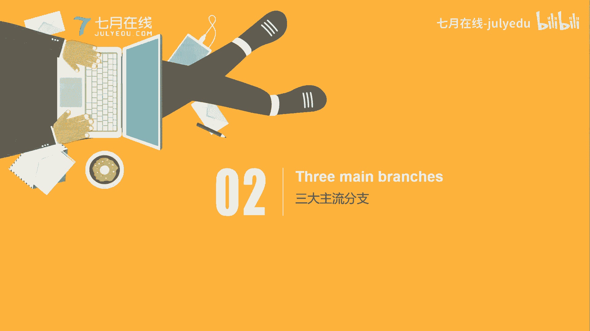

我们在第一个topic里面，我们大概聊了一下，就是说呃这个目标检测是做什么的。呃，刚才有个同学让我做个自我介绍。呃，我讲完这个话题给大再给大家做一个自我介绍，好吧。呃。

我们目标识别我们主要是作为一个分类的问题，对吧？比如说我们找到这个baby，我们找到了杀猫，我们找到了狗的照片。这个是目标识别，它是一个分类的问题？你属于哪一类？但是对于目标检测呢。

我们不光是想一个分类问题。同时比如这张图片，我们知道图片图片是一个狗，一个浴缸和一个小孩，对吧？如果是分类问题呢，我们只能做到这一步了，但是目标检测，我们其实更想要的是一个定位问题。对吧一个定位问题。

那么这个定位问题，换句话说，我们用一个矩型框，我们用一个矩型框，我们把这个我们想找到的这个主体框出来。比如说我拿黑色矩型框框出的是狗。

我在紫色矩型框框注的是babyO那么总结一下目标检测是在目标识别的基础上，再加第二个话题，就是说定位问题。既然为什么我们会要在第一个话题当中跟大家聊一下这个呃骨干网络。O骨干网络。好，我们看一下。

我们拿这张图像来举例。这张图像呢是一个很可爱的狗狗的一个照片OK。如果经过。这个。CNN我们看啊，如果经过一个就是比较传统的一个，或者是随便1个CAN吧，我们最后会得出一个分类，4分类。四个。

比如说第一个是狗，第二个是猫，第三个是小孩儿。大家注意啊，第四个类我们把它称为背景类。但是实际上来说。实际上来说呢，它是三个类狗猫和baby。但通常来说，我们都会在我们已知的呃多少类上面。

我们再加一okK因为我们把它认为是背景类ok。这张图像我们最后找到的是狗，所以我们在狗后面画一个笑脸。那么这个呢就是一个比较呃传统的或者比较经典的CN的话题。然后如果我们想做定位的时候。

一张图片有多个类别的分可以聊一聊吗？O我们一会儿跟大家聊一下，哎，我们的赵老师已经把客服的微信号发给了大家啊，就是大家可以就是想咨询课程的话，直接加赵老师的微信。

然后和大家和赵老师聊关于我们就业小班第五期的狠狠的折扣。O我们继续。大家看现在呢我用一个紫色的框，我把它框到了那个小狗子上面。呃，那个多个类别的话，我一会儿跟大家聊哈，我们先从单个类别来入手。

那么在这个句情框框住之后，我们不能说哎我们把在照片上，我们把它框出来，然后直接丢给就是我们的呃第二就后呃我们丢给我们的下一个工作人员说呃，你自己找吧。你看啊，反正我已经给你框住了。

那么这个时候你下一阶段的工作人员或者是你的计算机器人，他会很懵逼的。我靠，难道我还要再在你的图像当中，我把这个框框出来吗？你你就不能直接给我更详细的东西吗？当然可以。那么所谓的更详细的东西。

其实就是这个矩形框在这个图像当中的坐标。okK在图样当中坐标，我们把这个矩形框呢叫做boning box。然后它的坐标我们看啊，这儿的坐标是BSBYBWBH。

OK那么这个XY就是B是代表bonuning box的意思。XY是代表中心点的意思，就是它的那个我的画两条对角线，那个那个交点就是中心点。然后W和H是这个矩型框的宽和高ok。那么。聊到这儿的时候。

我们看一下我们怎么样得到这个这个矩情框的这个。就是就这四个坐标呢，或者这四个值呢。那么在这个CN的图像当中，其实我们会在它的后几层。注意我们会在它的后几层，我们加一个分支出来。O我们加一个分支出来。

那么这个分支它所得到结果，你也可以把它讲一个四分类的问题。OK你也可以把它叫做一个私分类的问题。呃。这个四分类只不过它分类的是四个值BXBYBW和BH。O。然后对于我们的这个结果，Y注意啊。

我们这个Y呢是那个预测值，就是最后的预测值。对于Y来说呢，我们先回顾一下CNCN的那个YOCN的Y它是我们上面的那个分类的。那个概率值，比如说狗猫baby。注意啊，这个时候只有三类。

O那么我这也就是说我一个Y有三个值啊，不是不能叫三个值吧。这个Y的矢量里面里面含有三个值，这样说的还比较严谨，里面含有这三个值，它所对应的就是最大概率。但是对于目标检测的Y来说，它会有注意看啊。

以这个为例。它会有8个值，第一个值是PC。PC的意思就是说它是哪这就就是说我这个地方。我有没有就有没有我对应的类O这有没有对应的类PC唯一的时候，我们就认为okK你这个类呃这里面有我对应的类。

注意我这有我对应的类，我指的是前面的狗猫和小孩儿。如果PC为0的话，那么我对类也就是背景。O。当我有一的时候，哎，我找到一个就PC为一的时候，那么我们认为这个地方它应该有点东西。

那么我们再研究研究里面的东西具体是什么OK。我们就知道这不是背景，我们再看下面BXYW和H这个对应的就是你的矩型框的那个坐标。然后再往下那个100所对应的就是我们你属于哪一类。比如说我C一对应的是狗。

C2对应的是猫，C3对应的是baby。那么我do是一的时候O。我明白了这个矩形框，它说的类别就是狗。如果你的PC为零的时候，你下面的值是试，我就我就不关心了。

反正你PC等于零的意思就是说我这儿有类的概率为零，或者是我这儿的类为背景，就是background的背景。O。😊，呃，我们再重新捋一下哈，我们这儿有一个输入是一张照片，我们输出是我们的Y值。

Y值的具体也给大家稍微聊了一下。哎，有个同学问的问题好啊，他说那个图像分割呃和目标检测的区别是什么？这个问题问的好呃。图像分割和目标检测呢，它有一个哎先说图像分割吧。图像分割在现在它有两个最主要的分支。

一个是实力分割，一个是语义分割。什么意思呢？比如说在一张图像当中，假如说我有一个草坪上我有5只小狗，ok5只小狗在玩，那么我做图像分割的时候，那么我我会把所有的小狗用一个颜色表示出来。

草坪用另外一个颜色表示出来。那么我就是说注意这个表示呢，它不是用矩形框表示，而是我把你的这个轮廓直接抠出来。ok这个叫语义分割。实力分割呢。他的意思就是说，我这个实力分割。

我是把呃我每一个小狗用不同的颜色来表示出来。即便你的小狗有重叠，我要用不同的颜色表示出来。大家注意啊，那么这个时候我们就可以了了解，对于目标检测来说，我仅仅是把一个框框出来了，对吧？我用个矩型框框出来。

但是对是语义对对于分割来说，我不但要框出来，我还会在你的这个框图当中，我把你的这个轮廓表示出来。换句话说，它的计算量会更大。相相比较而言啊。呃，图样风割是比较精细的目标检测，你可以这么说。

当然你呃我们一般也会说呃针对不同的用处，我们来就是不同的项目，不同的用途，我们来做那个更加精细的就是一个呃网络的选择。关于你这个。图样分割目标里的模型可以混着用。

一会儿我给大家讲一下maCNOK讲maLCN的时候，它也可以做实呃那个呃实际分割。我一会儿我会给大家演示一下那个实际分割，就是这个分割到底是怎么做的。我会用我会用一张呃PPT来给大家进行演示一下。

okK对，他是像素级别的预测哦，对了，呃，思考和推演的及时快感。你记得加一下我们赵老师的那个客服微信哈。然后你跟他领一下免单券。同时也跟他咨询一下呃关于那个呃CV就业小班和那个目标检测班的那个优惠券。

那，当然那只要是今天报名的同学，我们都有很大的优惠哈。OK我们回到我们现在的这个图像呃这个PPT当中。关于这个目标定呃目标检测呢，我们有一个输入就是一张图像，一个输出。哎，就是我们现在看到的Y。

那么我们其不管是目标检测还是目标识别，哪怕你是语义分割。呃，可以说在这个深度学习当中，我们最重要的就是构建我们的呃损失函数，就是lo function损失函数。什么叫做损失函数呢？大家看这个。

看这个公式呢。哎，有个同学问啊，会不会出现多个外盾一个狗会，但是呢我们会用其他方式来解决这个问题，一会儿再讲那个呃。在讲那个毛框的时候，我给大家解释怎么来处理啊。呃，我们继续哈，在那个大家看这个公式。

这个哇这个好复杂啊嘛一看我都说实话，我第一次看的时候，这是我想这什么玩意儿很很难理解呀。但是我们给大家解释一下，你就会发现它其实很简单。

首先我们看这个等号的左边OLL就是这个lo function的意思，就是我们那个或者叫误差，或者也叫损失函数的意思啊，它是个函数，然后函数呢它想做的就是两个一个差值，Y上面加一个帽子。

我们叫它Y hat减去Y。那么这个Y hat就是你的预测出来的值，就是你网络直接计算所得到的值，而你那个Y就是直接那个Y呢，这个是你在训练之前你会做一个人工的一个就是标注的一个过程。那么人工标注的话。

我们也会呃通过人工，我们在图像当中，我们把这个紫色的框标出来。O给出紫色的框，我们也会相应的给出它的这个分值。比如说这个是。后紫色的框的分值就是PC等于一，然后相应紫色框的4个坐标值。

然后C等于1C2C3等于0。那么这个就是Yhead和Y。那么Yhead是我们网络直接输出的一个预测值，它与真实之间的差，就是我们把其中的每一项进行呃相减，同时求平方OK。

那么这个就是比较一个就是lo function，一个比较那个。就是最直白的一个解释。然后那么对于这个最直白的解释当中，注意，如果PC等于一的话，你再这么做。如果PC等于零的话，你千万别再往后求。

就是后面更加细节的那个呃坐标值的校正呀，没有这个必要啊。因为当你PC等于零的话，我们就知道哎，这个地方是背景，我们不关心我们只关心PC的就行。B的误差就可以。OK当你构建好lo function的时候。

那么你的下一步就是想办法把这个误差函数最小化。为什么要最小化呢？说白了就是我想把我的预测出呃，我的是网络预测出来这个值无限的接近于我的真实值。也就是说，我想让我们这个网络呃预测的越像真的越好。

OK这个就是它的核心思想。我们看一下这个一类的这个CNN。呃，我们把它这个C音呢叫做狗狗检测器。最今年的我们拿一个框，然后进行划窗okK然后直接找到。呃，为什么说呢这个划窗呢？

因为这儿想跟大家就是讲一下关于这个IOU的一个概念。因为IOU是会在这个就是不管你是在目标检测当中也好，在我们其他的，比如说关键点检测也好。唉，关于关键点检测，我们也有一门相应的课程，是是我主讲的。

大家有兴趣的话可以去看一下。或者是在这个。营养风格当中也好，这个IOU这个概念比较重要。我们看一下什么是IOU呢？LU的全称叫做。

interction over unitO那么我们的目标是想找到一个窗口，还有最大的IOUOK还有最大IU我们只看一个图吧，拿这张图来举例，绿色的框是我们真实值。

O红色的框是我们的那个预测出来的这个呃就是矩形框。那么IOU的定义就是说。你这个你们这两框的交集除以你们这两框的并级。直观应该解释就是说如果你这两个框就是你的预测框和你真实的那个框。

你们重叠的部分越多或者重叠的部分越大越好。OK很直观，对吧？我们看哈。当然这个时候，你比方说我我预测出来了很多框。哎，这个时候那个可以稍微回答一下这个呃手机用户633460这个同学的一个问题啊。

就是这个时候呢，我们回答出呃我们先看第一个不第一步。我们首先我们设置一个阀值，就是IOU的这个大致。比如说我设置为80%就0。8%，然后我会当我找出了很多的这个预测出来很多的均匀框的时候。

那么我们看一下，如果你这个IOU的值，我们分别计算一下。当你大于那个0。8的时候，我就可以留下小于0。8的时候，我直接丢掉。那么我们最后希望找到一个最接近的或者是呃这个矩形框有最大要用的值。

这是第一种方法。当然它其实还有另外一种方法，就是说呃在即便你设置了0。8，你也可能找出来很多的这个矩形框。那么这个时候我们可以采取一个非极大值预呃非极大值抑制的方法，这个稍后我给大家再聊一下啊。

OK我们的目标呢就是找到一个最大值具具有IOU最大值的这个框。这个就是我们目标检测的。一个核心的想法。okK就不管你目标检测是用的呃任何一种框架，不管你是哪个分支，我们最后想干的事情就是这个事情。呃。

到这儿的时候呢，给大家看一下，就一更直观的看一下这个呃这个目标检测它是就是它的一个应用吧。OK一个实实力的应用。呃，这个是一个网友传到这个youtube上的，他是那个优乐V视的一个结果哈。

我觉得挺搞笑的，就给大家呃就是剖一下。嗯，那个呃我在这个是个视频，我给大家播的时候呢，大家也可以就是加一下那个我们的这个呃老师的一个微信。OK我再把老师的客服微信，再重新给大家发一下。

就是赵老师的客服微信。O。对。🎼。🎼The。いて。呃，okK这个呢就是一个比较直观的一个就是应用呃，这个。挺搞笑的哈，是周星驰的那个喜剧之王那个片段。呃。老师你问老师。

那个优lo的屏幕指标MAP是什么意思啊？这个这个我没给大家放在今天的课堂上PPT里头。呃，这个MAP呢它的全称叫做呃平均呃。M是MEAN的意思，A是average的意思呃，P是呃那个精精确度的意思。

O它的意思就是说我这个基于不同的IOU的值，我会做一个精确度的那个一个计算。然后我把你所有的这个计算，我求平均就是MAP对，就是平均精度。呃，在我们的那个课呃后面的那个实战课和那个小班课程。

我们会给大家具体讲一下那个MAP它是就是怎么样得来的啊。呃，今天这个课就不给大家展开讲，大家有知道这个平均精度是一个量化标准就行了。呃，手机用户622980，你加一下我们的客服赵老师的微信。

然后呃然后那个客服老师会给你送一个呃。特训班第四期的免单券okK这是一个大礼包。

好，我们继续。呃，在这给大家说一个几个应用吧，就是几个常见的应用。第一个最常见的应用呢就是这个。车牌识别。OK车牌识别。

这个呢当然这个车牌识别其实在很多情况下用比较传统的这个计算机数学的方法也能也能计算啊，这个也是比较用的已经非常成熟，同时已经非常牛逼的一个应用，太成熟了。ok就不给大家具体说了。我们再看一下自动驾驶。

自动驾驶呢是现在一个非常火的一个问题。呃，自动驾驶呢这块儿。自动驾驶其实它涵盖的这个领域比较多，因为本身自动驾驶它就是一个很就是一个很大的话题。比如说我们现在有那个L2L4级别的驾驶啊，那么除了这些呢。

自动驾驶还涉及到，比如说目标检测领域。我首先我最基本的就是说我通过我这个摄像头，我需要知道我前面的路况是什么样子的，或者是前面说有障碍物，同时我需要对这个障碍物，我进行一个更加细致的判断。

它前面比如障碍物是行人还是还是那个那叫什么，就是。呃，哥你叫就是阻挡车辆的那个。呃，比比如我们就说一个木桩吧，好吧，等等。忧郁或者是我前面的是不是一个车辆，那么这个车辆是我对我相向而驶，还是相对而驶。

对吧？如果是相向而驶的话，同一个方向是我跟着他就行。如果是相对而驶的话，他向我驶，我是不是得进行避让等等。这个就是一个目标检测的一个话题，同时我会检测到，我前面假如说我是一个我车辆，它离我太近。

我车距过近的话，我是不是应该报警，就是提醒司机，哎，我应该注意呃，前方有那前方有那个车距过近，我需要那个拉杆车距等等。当然我们不光还做这些，我们还能做。比如说目标跟踪哦。

我们7月在线就是也开设了一个关于目标跟踪的一个呃就是课程，呃，也是由我主讲的。呃，也是由我主讲的那个大家感兴趣的话，也可以去也可以去就是看一下。呃，如果你今晚就报名的话，你可以享受一个很大的折扣。对。

目标跟踪。呃，然后你我们可以加一下赵老师的微信，然后就是我们加下赵老师的微信。呃，然后直接问。呃，具体的折扣是什么？好，我们看一下，除了呃这个呃刚才所说的那个应用以外，比如说行程检测这个行程检测呢。

我们一般可以装在那个一方面装在汽车上，同时我们也可以装在我们的这个监控的上头上面。哎，我们可以算一下它的人流量大概是什么？同时我们也可以呃进行那个逃犯追踪等等啊，我希惯用什么框架。

我现在比较钟爱CSP系列。当然这个也是具体问题，具体分析啊。当然我们也可以做一个就是图像的一个识别。这个图像的识别呢，这不是这个叫建筑物识别。这个是呃例子。比如说当我们旅游的时候，我们到一个某一个地方。

我们发现一个地标，但是我们不知道这个地标是什么。而且我们也假如说我们也不知道这个城市是什么。那么我们想找到这个地标的那个具体的详细资料。我们可以拿手拿起手机拍一张照片，然后把这个照片直接发送到呃。

比如说百度上或者是谷歌上面，然后它就会进行图像的搜索，这个时候会告诉你ok你这个对应的资料。呃。说到应用，我们就不得不体这个工业级别的应用啊。比如说呃物流那个物流配送车，也比如说那个机械臂。

因为这个目标检测其实在这两个就是工业级工厂当中，它的应用是非常非常广泛的。因为我们想实现它的所有的自动化，我们就需要首先对那个目标进行定位。有的同学问我多视角下，如何识别不同图片中的物的是同一个问题的。

你这个问题问的非常好。呃，这个这个问题其实是我们那个目标跟踪那门课程当中的一个需要解答的一个呃第一个问，第一个大问题。呃，简单说用一句话简单说一下吧。其实我们就是呃在多视角下找到这两个物体的这个。

找到这样物体的那个呃相似度OK呃，对基术特征，然后找相似度。比如说你可以用CM当中的最小二乘法，然后你也可以用那个呃深度学习当中的那个那叫。那叫相似度匹配网络okK等等。呃，在我们今天所输出的大礼包呢。

呃有那个免单券那一门课程是的t the floor。但是在我我们就是我所开设的这些课程当中，我用的是拍toOK就目标检测是拍to。然后我们的CP剧业小班也是拍took。呃，我就是除了这个哎这个配送车。

我想那个重点描述一下啊，这个配送车呃，在这个就是我们现阶道的这个抗疫的过程当中，它发挥了很大的作用。因为比如说呃在那个我们拿医院来举例吧。医院我们会有那个就是呃样本配送车。因为这些患者的样本呢，呃。

它其实有很大的传染性，如果你直接用手碰的话，哪哪怕你这个防护也特别强，它其实还是有一定的概率呃被占染，虽然这概率比较低。但是为了保护我们的医务工作人员，我们想做到百分之百的安全。

那么这个时候我们就用配送车来进行运送，当然这个配送车它不是一般的配送车。对于所有的样本来说，它需要在恒温恒湿的条件下，那么针对这种情况就会呃我们就是咱们的国家就会造出恒温恒湿的配送车。

O我们通过遥控来就是告诉这个。配动车你需要达到什么样的温度和湿度，然后我告诉他，你给我把目标送到，就是我们这样本送到哪里去。然后这个小车就会直接呃直接就是把样本运送到某一个地方，然后。

运输到到那个地方的时候，那也有一个就是接待的一个机器人，他把他的那个样本直接用机器来这个就是传就是接收，然后可以机器进行直接分析。那么整个这个过程就没有人为的干预。

除了机器上面还有一个就是医学上也有个比较经典的应用。比如说我们在这个CATT图像当中，我们会进行这个搜索，我们找到它所对应的对应的那个有问题的区域等等。okK这些是应用计算机视觉可以识别出来两张相似的。

可以的，可以的，它都是一个先提取，然后再进行下一步的过程，就是刚才老师给大家提了，比如说slam当中的那个所求二乘法，然后深度学习当中有一个叫做相似度匹配网络等等啊。

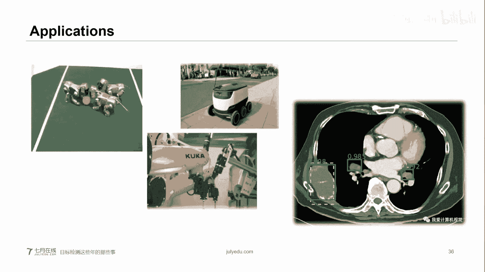

呃，大家现在看到这张图片呢。就是一个我只能说是一个大概的那个就是演变的一个那个呃就是算法框架啊。当然它其实还有很多他也没有写上去。呃，不过我我就是在网上找一个，就是哎比较稍微比较一个全的。

放在放到这儿了。但现在看到那个红色呃，像框出的红色线在框出的是呃公认的一些就是当时是具有化学在里程碑的一些一些那个经典的模块。O。😊，好，说到这儿，我们就可以聊一下这个目标检测的三大分类的。

目标检测三大分类。two stages  one stage和ancle freeok呃，我给大家起了名，注意这个tto stage我我叫了个别人叫二刀斩。当然这个不是人家官方的名称啊。

人家官方就叫t stages，只是我是这么给大家起了一下。拍照者和他跟副料有什么区别？拍到是facebook做的那个它的flow是谷歌做的，但是有什么区别的话，呃，这个可以说仁者见仁智者见智吧。呃。

为什么我们选用了拍到uch呢？是因为拍到时呃它更多的着重于动态的动态图上，而且它我感觉它的那个更易上手啊，更易上手。其实你只要掌握了某一项，比较精通就可以。只不过现在拍套时用的人用户更多嘛。呃，好。

我们继续回来我们的算法流派啊，二刀斩two stages一刀流one stage和空手道aner free，这个是我给大家，我给人家起的别名啊，人家本身不叫这个呃，为什么这么说呢？二刀斩就挥两刀嘛。

因为我需要两个阶段我来进行计算一刀流我只需要一个阶段我直接搞定。然后这个aner free呢是这么说的啊，就是说呃如果说是最就是。最那个。所最科学或者是最精确的表示呢。

算法留掰只有两种就是二招斩和一刀流one stage和呃one stage two stages但是为什么我把aner free单独提拿出来了，因为在很多情况下呃，这个大家都是基于毛光，因为毛光是什么？

一会跟大家聊。呃，基于这个毛光就是an，其实它所做的工作。但是呢在18年之后会出现了另外一种声音，就是说an呢我们放弃 anchor，我们直接不用aner直接进行预测。

就是通过关键点来进行这个目标检测的预测，它不用aner，所以叫做aner free呃，代表做呢也有呃，所以这个时候我们就会提出来，我们我就把它归到了这个第三类，但是话说回来啊。

这个aner free它其实它对应的，比如说有些网络它是to有些网络它是one stage的，所以这个有的人把这个目标检测直接就分成两大类，人家那个也是对的。

而且可以说是更更那个经就是更严谨的一种表述吧。OK。这个是。这个是这个。算法流派的那个主我给大家列一下，就是主要的那个呃一些经典的吧。ok。看看大家的问题啊。好，我们我们唉我再往下。

我就会给大家具体讲一下那个这三大流派当中的他们具体是大概是怎么做的。然后会拿每个流派拿一个网络给大家大概聊一下这个手机用户479376同学问的挺好的。不过你这个问题是关于sam的问题呃，和这个问题呃。

不是特别和我们今天的话题不是特别搭。呃，vislam我我大是是用心话稍微说一下吧哈，传统的就是比较经典的是那个磁带模型。当然现阶段我觉得你可以更加的关注一下深度学习和这个视觉slam的一些结合，好吧。

呃，我们继续呃，我在讲解的时候，因为我记得前面有个同学问我希望老师做一下自我介绍，我在这我给大家大致做一下自我介绍吧。呃，后面我姓庞，大家可以叫我庞老师或者是CV庞老师都可以。

然后我是美国科罗大大学博士毕业。呃，我现在在美国的一所大学，然后做大学讲师。O我主要的研究方向是深度学习当中的计算机视觉方向。O呃，像主攻呃，我会主攻那个目标检测，然后图卷机网络，呃，还有目标识呃。

咱目标学就不说了，还有目标追踪，呃，还有关点检测。呃，我会主攻这些方向，这也是为什么我会在这个。这是为什么我会在这个我们7月在线，然后主讲这些课程，就是主讲这一系列的课程O。呃，关于这个图卷机网络。

我再给大家多提一下图卷机网络呃，它的简写是GNN注意卷积网络，我们是CN图卷机网络是GNN。然后这个是现在这个人工智能的一个拐点，就是在学术界这个GN是其是现在是非常火的。

所以我们也开设了相应的开设了就是针对这个图卷机网络课程。呃，从明天开始，我们会正式开设这就是正式开讲目标时目标检测。哎，有个同学问我们的实战课程是不是去gitthub，然后扒一下代码。

然后修改修改自己跑数据集。首先我首先跟大家说实战检测，我们不是什么实战检测实战课程，我们更多的会呃就是关注到这个模型的各个细节和模型的演变之后如何推理出来的。这个是我们更关心的。

然后对于实战课程当中的代码，我会给大家就是把这个代码就是直接发给大家。然后给大家大概讲一下代码当中的每一块大概是个什么样子的。然后呃告诉大家怎么运行。但是由于实战课程的篇幅有限。

所以我们不会把代码的一一行一行给大家，就是一行一行去那么抠。呃，然后如果大家想对那个代码就是有更多的了解的话，我建议大家去报一下我们的那个CVA的就业小班第五期那个实战课程里面啊，不是那个就业课程里面。

老师会在手把手带着大家1。1点扣代码，然后呃讲解每一行怎么用，同时如何训练，如何调三等等。就是实战呃那就业课程我们会更更多的关注于代码上。因为实战因为就业课程。

我们的目标就是就业实战课程我们更多的是理论上的那个讲解，同时稍微会给大家稍微讲一些代码。呃，我们会更多哦，因为我的那个课程我们是用的是拍。好，我们继续啊。

我们先看那个分之第一分之1两道展two stagesok。

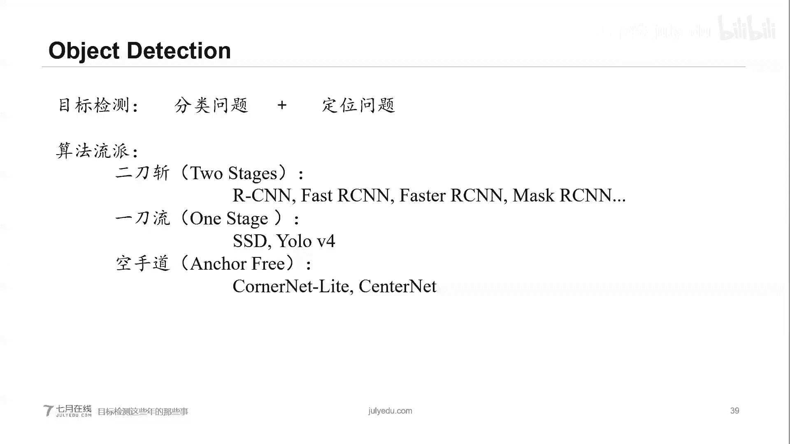

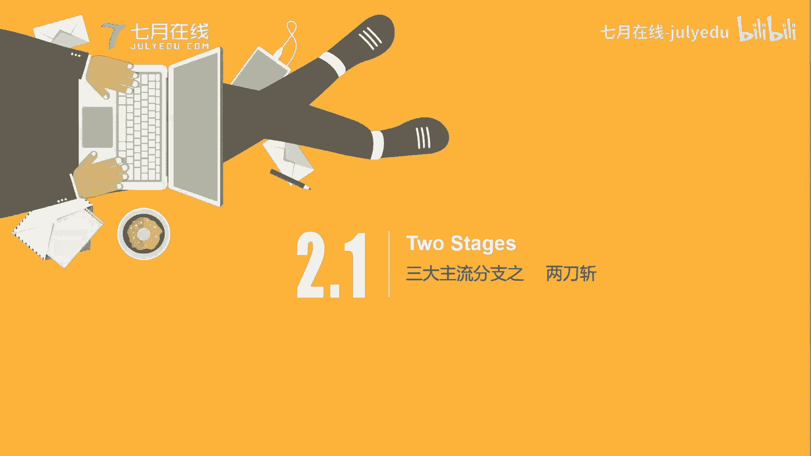

two stages呢在这儿我会给大家说一下那个maCN。实战呃当然会公示论文，而且在实战课程当中，我会给大家就是讲一下如何快速高效的阅读论文ok。两个班代码不一样。好，我我们继续先讲一下今天的内容哈。

呃，fast RCN和maask RN这个是在to stage里面，我给大家去大概聊一下呃。有个同学问去要自己想找那个开源代码，怎么修改相关参数？你需要报哪个班？呃。

如果你这个代码你不是很就是你下载下来不是特别了解的话，我建议你去报那个就业小班OK因为就业小班，我们的老师会更多的帮你就是调餐，还有写搭建自己的代码。ok我建议你去报那个就业小班。

如果是更多想了解这个代码是就是它是为什么这么大，说白就理论呢，我建议你报实战班OK。对我现在在美国跟大家有时差，呃，这个是客服的一个微信，大家可以就是我们赵老师，我们可以跟赵老师聊一下具体的课程。好。

我们回到我们的课今天的公开课当中。我们先说fa斯呃fascarCN吧，这个fascarCN数据说已经非常老了，现在用的人已经比较少了。但是我们是希望通过它来引出我们的ma斯carCN。

okK对于发sCN来说，就是对于两刀斩这种来说，它的主要思路就是说我首先我用那个骨架网络或者是骨干网络，我来提取这个feature，提取图像特征。提取到图像特征之后，我们就开始分支了。

上面那只我们会找到这个。感兴趣区域，所以我们叫感兴趣区感兴趣区域的生成器。就是说什么叫感兴趣区域呢？说白了就是我们先进行一步预筛选，就相当于我们在那个面试当中，这是你的初示。第一轮。

我们先大概进行筛选一下，找到哪些区域有疑似的图像。OK当然这个是很可能就不是很可能肯定是不准的，就叫预筛选。然后我们在第二个阶段当中呢，我们会在你的感兴趣区域的感兴趣区域上，我们在精确的进行一次搜寻。

找一下里面是否有相关的这些。就是相应的我们所要找到的对象。呃。这个就是所有两道涨或to c的它的一个大概的一个模就是模型。这个有有同学问我图像分纷，关于你这个问题，我们最后讲完课我们再聊吧。好吧。

因为这个呃我们今天主要是讲目标检测嘛，好吧。呃。musask和CN我们给大家讲聊一下mask和CN注意啊。maCN它其实不光你可以做目标检测，就是我上面写那一个找人，我写有找。

其实你还可以找任何任何东西啊，我只不过写了个找人，就是目标检测，它同时在目标检测基础上还做了一个实力分割。那么我们在实力分割的基础上，我们还可以再干进一步，就是做关键点检测。关键点检测。

大家可以感兴趣的话，可以看一下我的另外一门课程叫就是关键点检测实战课程。O在这就不多说了。我们看一下这张图像。呃，这张图像我们是左侧是faster RCN。

右侧是maask RRCNOK我们仔细观察一下它的区别。最大的一个区别注意啊，当然它有很多区别，我只是最大的一个区别，就是maCN是在fasster CN基础上，它增加了一个mas branch。

ok增加了一个m branch。那么相应的。相应的这个呃。它我们的los function也会多一个。在发s上面，它的los function主要是计算，一个是回归的los function。

另外一个是分类的los function。这个回归的los function，你可以把它想做是那个就是我们之前找那个bning box的呃lo。那么maCN因为它多一个分支。

所以它又会有一个mask的lo functionok。我们仔细看一下，首先也是CN区域，这个就是我们的股价网络区域，它的目的就是提取feature。在这儿呢我想给大家多聊一下啊。3D实呃检测的话。

我们在那个实战班当中，就是目标检测的实战班当中，我们其实主要还是呃聊那个图像，就是2D的那个呃检测。但3D的那个检测的的话，我们就我们会那个。呃，就是大家提一下，但不会更多的深入讲解。哎。

微信用户442447同学说的好，打基础就实战，想深挖就小班。没错。哎，微信同学呃，不是微信同学，呃，2442447同学请联系下赵老师，然后收一下我们的大礼包，好吧，我们的一个免单券。

这是我们赵老师微信去呃和他领一下我们的呃免单券。O我们继续在这儿我想更多的给大家说一，就说一个东西吧，就是这个FPN叫做金字塔网络。金字塔网络为什么说在这提一下呢？呃。

因为金字塔网络其实是我们在那个呃实战当中，我们会发现它对识别各种的大中小物体会有一个非常好的一个效果。哎，我记得前面好像有一个同学好像问过我一下，关于这个如何识别小物体。呃，在这说一下啊。

金财网络其实它有很多的形式。呃，当然这个是在预测这块有很多的形式。一般我们大概我们可以归为四类。我们今天主要说一个比较经典的一类，这个也是在那个优录V3上，就第三个版本上呃应用的比较广泛的。

okK就是说我把我的这个图像，我们先看最左侧那个图啊，这样吧，我们先看这张图，这张图我们从下往上看。最下面最下面的这个图呢是我们的输入图像，然后我们依次往上我们进行降采样。除非这样来样。

就是我把它这个图像缩小OK。Oh yeah。然后这样的话，我们呃这呃也也不能说图像缩小，就是说我经过我这个卷积层，我经过不同的卷积层之后。

然后我每一层我都会把它就是相应的这个得到这个fishature的这个大小会注意啊，我不是说深度，我只是说大小，它会进行就是一个相当于呃res会降低，就是分辨率会降低。那么随着卷积的层数增加。

但是大家不知道还记不记得我们在讲第一个top的时候，我们说那个呃在那个卷积的层数比较浅的时候，我的语翼是非常比较低的语义。比如说我找一些结构，一些颜色，但是随着卷积层数的加深。

然后这个时候我所得到的语义也是比较丰富的。OK那么随着卷积层数的增加，高级语义信息也会越来越丰富。但是问题是分辨率也会随之降低。O这样就会导致一个问题，就是说。

我在顶层的或者是我在呃深层的转接呃的结果上面，我虽然我会有很多的高级语义。我知道哎这块是猫，那块是狗，但问题是。你忽略了小物体的一些信息，就因为你的分辨率很低。所以如果你在顶层。

就是仅仅在顶层呢提取你的特征，再然后再进行目标预测的。这个的预测效果不是特别好，它会忽略略掉小物体的检测。okK它只能检测出一些大物体。所以这个金字塔级点网络呢。

它的想法就是说我在我不同层上面我都做预测。O那么你的小物体的话，我在我也做一些预测。但是我会在你这个呃就是分辨率比较大的比较浅层的卷型上进行预测。就是我们现在看到的这个图像okK就是这样给大家提一嘴啊。

这个就是FPN。在我们的那个课程。训练时候，如果说你最优的卷机尺寸。我姑且认为你是在问我那个感受也OK在我的那个目标识别的那个。实战课人的第二堂课，我会给大家讲一下这个感受也啊。通常大家用的。

比如说3乘3或者5乘5。当然这个也具体具体的分析啊。或者在实战课程当中，我再给大家回答这个问题。马斯奥西恩的第二部。就是提取feature啊，不是不是说错了呃，不是提取feature。

是找那个感兴趣区域。在这个地方呢，我们这里需要给大家就是聊一下这个anker，就是毛框。我们看一下，以这张图为举例。这张图像当中它的毛框，我们假如设我们随便找一个点。就现在大家看到这个张毅手上拿着头盔。

上面有个红点OK这个红点。红点上面我们就以这个区域为，就是这个中心区域啊，我们找它的毛呃，我们就是呃用毛框来进行判断一些，就是这个物体的。就是这个毛框里面有没有物体，有会有没有我们山想找到的对象。

但是这个毛框如何定义呢？什么叫模型融合呢？你想做那个特征融合吧。就是这个毛方的那个大小怎么定义呢？你比方说我可以哎用这个正方形，不同大小的正方形来定义，我也可以用这些长条形。来定义，对吧？

当然我也可以用数的长效性来定义。那么如何定义这个毛框，它就会出现一个问题。因为你这个毛框我是在你这个图像当中，我会把你分成就是大小不等的这些小的网格或者小的sell，我给小的网格。

然后我针对你每一个网格，我都会把我预定义好这个毛框。哎，我丢进来，我根据这个毛框，我来找里面有没有相应对象。那么这个时候就会出现一个问题啊，那个毛框如何定义？你看一下啊。在那个网络的训练之前。

我们会给毛框有两个值。第一个值是它的那个比例，就是长宽比例。我们比如说我们0。51和2，那么对应出来，就大家现在看到这个样子，同时我们还定义出这个skills。

skills就是说它这个是多少个pelok呃，当然我估计有同学肯定想问我，你这个大小是怎么来的呢？我不知道大家自己就是呃在那个训练网络的时候，有没有更改过这个毛框的这个节节预定义啊，这个毛框的定义。

他的依据是。以coco举例，coco总共有80类，那么它这个80类。coco提供的官方的80类上面，它会同时给你一个annotation，就是标注文件。那么我们可以用剧类的思想，比如KNN思想来。

你把这80类所对的就是所有的那个毛框，就是我们比如说我们呃分成大概就是我三大类。那么这三大类的意思就是说它的按套它的大小和比例来进行划分。那么最后可以。得出就是我们那个对K k music啊。

最后得出这个我们现在这个呃就是resure和这个skills的那个值。O。那么根据这个毛框，同时呢我们也会只是找到就是关于不管是毛框也好，矩形，就是我们就做预测的矩形框也好，我们都会有这个。

对应的4个值，这四个值呢有两种，就是这个表示方法。第一种是。角点X1Y1和X2Y2就是通过左上角的点和右上角的点，我们来找到的最就是这个矩形框的这个具体坐标。呃。

也可以通过中心点和这个矩形框的宽和高来就是找到这个矩形框的精确坐标。O。😊，这个是一个毛框的第一。在那个RPN那个阶段的RPN就是reion network，就是说感兴趣这我们来找个感兴趣区域。

大家看这个图啊，这个是一个比较经典的那个fa那个图。首先看那个网格，这个网格就是我真实图像，就是我把这个真实图像我切割成呃不要切割，就是划分出来多少乘以多少的这个小的网格小的sell。

然后我根据这些小的sell，啊我在它的每一个点上面，我们来精确的就是找到就是按根据这个毛框来，我们来找这个呃具体的里面有没有这个目标，那么这个时候。我们看就是最上方，我们最上方它会有两个分值。

一个是2K Sc。它这个是我们是找分类，为什么找2K score呢？我这个地方我找的是前景还是背景，它说白就是二分类问题。O是前景的话，说明哎里面有我感兴趣的这些目标。如果是背景的话，我直接个忽略ok。

另外，4K coordinateiness我这个做的呢啊是一个回归问题。为什么要回归问题呢？我是为什么叫4K为什么叫4K。因为我想找我这个矩型框的四个坐标值O4个最标值。我们之前虽然有毛框。

就是我们预定出来一些毛框，但有个最大的问题是你所预定的这个毛框，我不管你是K means还是KN等等这个你找到的你的这个各种比例啊，各种大小，我不管你怎么找到的但有个最大的问题是你所预定的毛框。

你和我最终找到的预测的这个矩型框的大小，那根本就不匹配，对不对？那你也可以说哎恰巧它匹配的，那是恰巧的问题，但绝大型多数情况下，你的这个毛框的大小和你的预测出来真实的那个呃目标目标的大小是不一样的。

那么这个时候我们就需要做这个回归问题。目的就是说我把这个微调毛框让它和你所准备的真实值就光数字越接近越好，这就这回归问题O。我们可以对你这个固定大小的毛框进行微调，拉长拉宽变胖变瘦都可以。呃。OK。

我们看一下。总结一下啊，那么他这块一个是呃ma萨CN，他会首先对你各种N多的后远光进行过滤，按照前景呃来那个前景的得分来进行排序，而不是对应该是得分来进行排序。同时对你前6000个高分候选框。

然后配合你的那个回归值。然后我根据你这个高分后仰框，我来记来那个就是筛选。你看这个是七龙珠的一个图像，我想找到是那个龙珠的具体位置。紫色框是我的真实的呃，浅蓝色的框是我的预测你出来那个框。

我的目标就是让浅蓝色的框越来越靠近我的真实的那个紫色的框OK。那么这个时候就我之前有同学问我，就是说。假如说你这个框呃，你发现我们预测出来这个框，你的IOU也很高。

虽然你我取了假如说IOU值我临业值我取了0。9%，就是大于90%的这个分数，我才把它标标注。但也有可能我这个框它左移右移上移下移的一个像素，呃，对吧？那么这个时候你的这个。它的职业也很高。

我不能我怎么办？我们就用极大值抑知，就是说我取里面最完美的就是说分数最高的那个，然后我只取它其中的一个就是我们就NMS在过滤的方法，极大值抑制的方法，我们来找到最后的那个唯一的一个框。呃。

说一下最后那个branch啊，就是mask branchnch。之前有个同学问我这关于这个图像分割的问题。在这儿我给大家看一下这个mask branch，就是maskRC因为它这一块它就是做图像分割。

它做的实力分割。我们看一下它这块具体是怎么做的，和大概是什么样子。呃，这张图像上面它我们现在看看到的这个比较明显的这个区域啊，这个呢就是mask和CN的那个第三个就是多出来的那个分支。

就是msask分支。我们可以看最后一层是28乘28乘80，28乘28是它的fish值大小，这个不用管，为什么说乘以80呢？因为针对coco来说，它有80类。所以我们乘以80。okK我们这有个mask。

我们具体看一下。这一张图像。在这个地方呢，我已经找到了这个穿红衣服的一个人，这是我想找到的那个对象。然后我如果做mat的时候。注意看，这个是我第一次就是我预测出来的28乘28。我以像素级别。

我大概对它的轮廓进行一下抠，就是抠出来。那么下一步我还会再做一些微调，就是精细的微调，使它的边缘，然后就是越来越光滑，越来越柔和。那么这个就是我们所做的那个mask，它的那个具体在干什么。

就是说我要找出这个轮廓的具体的那个样子。现在大家看到就是mask那个大概结果啊。OK说到这儿，还是希望大家啊在今天在这个优惠期间呢，就是今天晚上直播当中呢，呃我就或者直播课结束的时候。

你加一下赵老师的微信。然后如果你报就业班第五期的时候，会有在原来的优惠价的基础上会有一个更大的折扣，具体折扣是多少，请大家咨询一下赵老师，当然这个名额是有限的。另外关于我们实战检测的话呢，我们会。

我们会在第三堂课。呃，跟大家聊一下，就是这个主题网络啊，就是第三堂课会跟大家聊一下这个。to stage具体的问题，我们具体看。

我们再往下看这个关于这个第二个分支，我们叫它一刀流。

一交流呢，这个我会以SSD给大家，就是大概举个例子，它的那个前面第一部分它还是feature instructor。当然它必须得通过CN骨干网活络来进行提取。然后我最后骨干网络，我所提取出来了之后。

我只有一步就是直接进行检测物体。公开课会有回放。会在周一或者周二时候给大家挂到我们的官网上。啊，但是看回放的时候，那个呃这个大折扣和。我们的大礼包就没有了啊。

这个只有今天直播课程当中会就是加赵老师的微信，我们才会出现。呃，我们大概跟大家聊一下SSD的那个结构吧，这个SSD是。三就是三个机构他们所就是推出来的哈。

他们所推出来的SID当时SID推出来其实也引起了一下轰动。嗯，他为什么叫SID呢？叫single short multi box detector？就是我就是我通过一个shot一就是我通过单次。

一阶段我直接得出来结论。我们要给大家就是讲一个比较简单的。其实用一句话给大家概括SSD的思想呢，它其看起来很简单，怎么说呢？一句话概括啊。SSD说白就两步特征提取和检测目标说完了。

当然大家要是这么说的话，感觉哎你这老师怎么就是说的也太简单了吧，你要这么说，我也会讲课了，对吧？我给大家具体讲一下，为什么说白就这两部呢？特征提取和检测目标。我们先看第一步啊，特征提取。😊。

大家看那个图。这个图呢。我们先做第一步测征提取这个图，你看左面这部分，它其实就是VGG16的前几层。注意，就是危机意识的前几层。O。😊，这前几层呢，比如说你现在我给大家抛出来V16啊，它会把。

你的在这个地方就是conmotion4第四个大block的第三个小层，它在这儿进行一个截取ok。那么这个全前面我用VGG16的特征提取，然后我在10个VGG16的第四个block。

第四个卷积block的第三个小层，然后我进行一个提取。然后我下一步就是检测目标。OK我在这儿截取之后，我在这儿的feature进行检测目标。举个例子。呃，拿这张图像进行举例啊嗯。呃。

在这个康路413之后，下一步呢就是进行目标检测。我们看这个图。那么我们的目标就是说我们把你这个输出画成这个以网格的形状来画出。这儿我画了个8乘8的网络啊，其实呢它真实情况是38乘38。

当然我如果画这个38乘38太细了，所以我以8乘8来给大家进行举例。我把它画成了8乘8的这个空间网格，我们把每一个网格叫做sellO就是叫或者单元格。

我们对于每一个单元格SSE都会根据这个毛预预定好的毛光做4个预测。然后我们每一个预测都会有一个矩型框来框注，就是我们现在大家看到的这个，然后我每个进型框可以给21个分数。这个分数代表每一类的概率值。

它所谓的211个分类呢，其实是我做20个分类加一这个20个分类就是我们自己定义好的20个分类。然后加一呢，这个为什么加一呢？一代表背景，就是有一类有一类呢作为零代表背减，也就是说如果有背景的话。

就是说没有被检测目标？所以这个为什么是21，就是20加1。那么在这个呃康入士4杠3这一层呢，我们相当于做了38乘38乘4的一个预测。乘4是因为我们做一个矩型框的一个预测啊。O。呃，四个均光。

所以说四个预测。当然呢可以想象啊，其实你绝大部分预测什么都找不到，对吧？因为你是个背景类。然后我们再看SID呢，我会给不同的类，我们会做一个就是每一个我会做一个分数。okK就是我们看到的。呃。

然后这个分数我给大家具体举具体说一下啊，我们以这个来举例。SSD它没有PN这个区域候弦网络，它没有这一步，因为它是one stage的。那么它会用一个简单的方法来就是取而代之。

就是说我SSD计算的位置和类的时候呢，我用的是小卷积的这个filter。在特征提取之后，我在每一个cel上，我用33这种小的卷积来进行预测。我深度为25，为什么是二手呢？21加4。O。

21给大家解释了这个四就是做一个4个距离方的预测。呃，但是呢。刚才说的是比较简单，但是其实SSD上面它不光光只做了一次预测，我也不光光只做了一次预测。呃。

刚才我们讲的是在VGG16的con4-3后面做预测，但实际的应用人家还会在后面再接我的这个呃CN的后面后面那一部分。

然后我对每一块我也进行一次预测O大家还记不记得我们之前讲那个FPN的时候给大家提了一下，随着你这个卷卷积网络的这个层数的加深越深的层数，我高级语义越高。但是同时对应的分辨率越低。

那么这个时候所以说呃SIT它做一个非常滑头的事，就是说我对你每一个最后CN的每一个那个卷积块，我都做一次预测。我用你的高分辨率，我来检测小物体低分辨率，那么我来检测大物体O。

这个是一个它最后那个总的结构图。3乘3预测和 anchorker是啥关系？3乘3跟3是那个我们的那个卷积的那个卷积盒，我是用它来我进行就是呃划窗式的。我找里面有没有目标。anker呢是我们就是之前讲的。

我如何确定我的感兴趣需求，或者是我如何来根据每excel，我来找那个我来进行预测，我是根据那 anchorker值。ok我是根据那个 anchorker值。这个不是特种融合啊这个不是特种融合。

这个就是我针对每一个每一处我所得到的这个特征，我来进行那个进行预测，它不是融合。当然在那个unlo上面，它会有一个融合的过程，但这个地方它不是融合。我们看一下。

这个是他那个最后的那个大概的那个呃完整的那个结果。但是我想说是啥呢？就是说如果我把所有的这些就是我在每一块我都进行预测呢，它的这个精度会高，但是呢速度代价的速度会放慢。O在这个论文当中。

它会说如果我全部加上之后呢，我的速度会比完全不加。减速20%OK减速20%。呃，要提醒大家的时候，在某一处它会做一个6次预矩形框的预测。O。呃，在那个我们的目标检测的课程的第三堂课。

我们会给大家更多的就是讲一下呃全链接。呃，我们会给大家更多的讲一下那个就是它的具体的那个过程。呃，今天毕竟是公开课就给大家大致介绍一下O。又到了我们送大礼包的环节了。

我看一下前半有哪个同学呃特别爱提问哈哦，我大概扫了一眼哇，这好多手机用户这个尾号老是有点那个嗯，看着有点懵逼。那好吧，那个我是我就看一眼这个手机用户呃，4598849问老师能不能给个，那那就拿拿走一个。

我们拿走一个大礼包，好吧。呃，然后请同学加那个我们的那个客服微信哈，就是479376同学加一下我们赵老师的微信，问老师要一下呃。

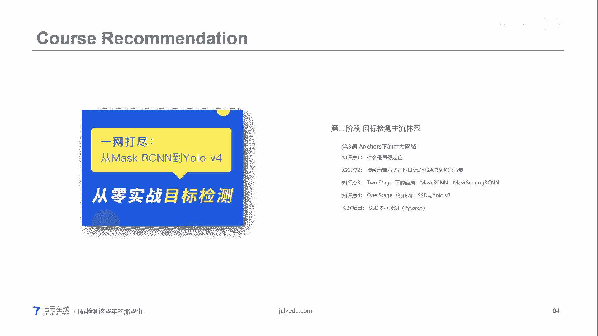

再往下聊一下啊，今天聊时间比也比较长，时间也很久，我们快速先我们快速先把这个呃分主要的分支聊完。然后第三个分支呢确实是控手到aner free。当然讲这个时候我还给大家听一下。

它这个有的人呃就是并不承认这是一个大的分支。因为更严谨的来讲来说，我们其实只有两个分支，一个是one stage，一个to stage，只不过是为什么提出了第三个分支呢，第三个分支。

其实它主要是说我前两个分支主要的思想都是利用anker，利用毛框来进行一个预训练。呃，然后对于那个呃第三种分析是我完全我不通过我毛框来进行检测，我通过关键点来进行一个预测。但是呃针对不同的网络。

就是针对这个分下不同的网络，它其实有的也是一个run stage，有的也是tto stages。所以有的人也会把它归进去。

OK这是这么说。呃，给大家是，比如说呃对，讲这个之前，我给大家说一下那个。沙漏网络模型，因为这个他们都是。不管是connet或者是conconnet light或者是sernnet。

它主要都是第一步它提取模型就提取特征，它用的都会是那个沙漏模型。我给大家大概聊聊一下大家看啊这个沙漏模型，那个CN，我们先说CN啊，CN它所造成的这个features。

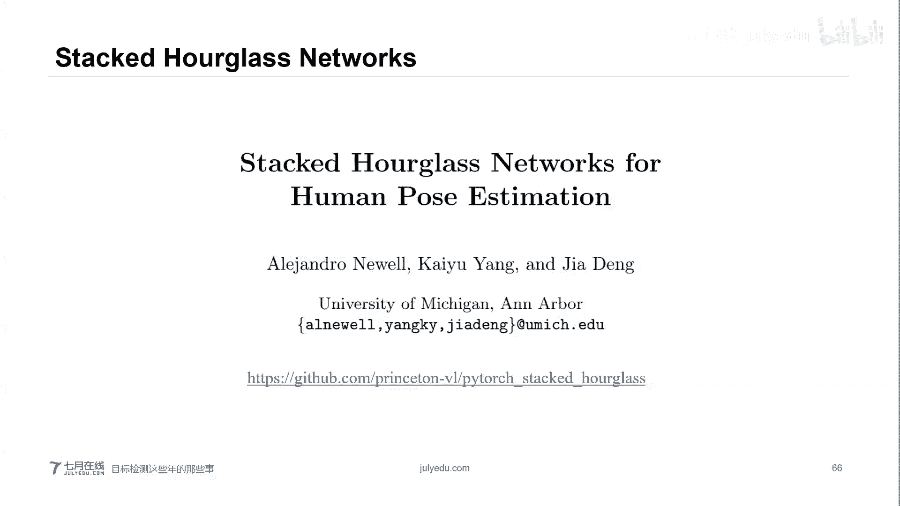

呃，它所造成的features。它大概是这给大家列一下，大概是这个样子的。我们可以看到在那个第一层的时候，哇，这个雨衣真的是太太低级了。然后在是很高级的时候会出现，比如说人脸的一些模型。

我给人脸的一些模型。

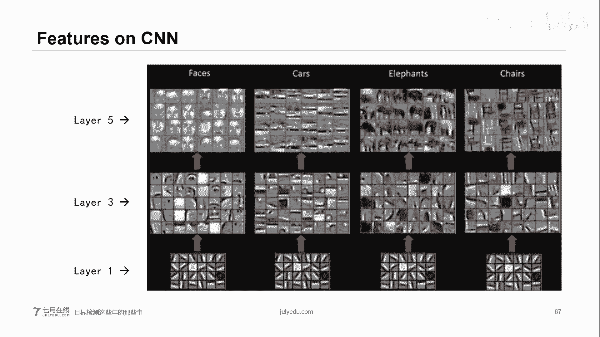

呃。那么我们就认为在这个CN当中。CNN当中，比如说我在某一处，我可能以人来举例啊，我找到了是这个人体的这个胳膊。因为人体的胳膊其实它这个还是比较好找的。它的信息不是相对比而言不是特别丰富。

我们假设啊注意这里只是假设在浅层的某一某一处呢，他找到的是这个一个胳膊，然后在深层的某一处，他发现的是人脸。OK他家发现的是人脸。那么呃去沙漏网络呢，它主要的贡献就是在于利用多尺度特征来识别姿态。

OK识别这就是识别我们这个目标。呃，像我们以前的这种就是估计姿态的这个网络结构，就普通的CAN，它一般会用最后一层的卷积特征，这样会造成信息的丢失。但事实上呢，对于姿态估计这种关联性的任务。呃。

我们一般最好是在不同的呃就是在featuresfeatures之之上，我们同时不是不就是我们找一下这个呃识别精度ok。那么这个就是沙漏网络的一个大概模型。为什么叫沙漏网络？

你看这个长得是不是非常像那个横过来的沙漏O。那么像比如说我们想理解人的姿态好，就拿这来举例。对于一些高级的任务，比如说行为识别来说就比较重要，而且这个行为识别也是这个人机交互的基础，对吧？呃。

像这个我们做这个所谓的沙漏，我们会把图像进行下载样分析，然后上载样分析，然后再进行，这是第一个沙漏模型，然后再进行呃下载样分析和上载样。针对它不同的分辨率。我们可以做不同的文章。

这个是一个大概的那个沙lo模型的一个就是结构图。这沙布模块结构图沙漠模块的那个。呃，设计初衷就是为了捕捉每个信息尺度下的信息，比如说图捕捉脸和手这些部分的时候需要局部特征。最后对人体姿态进行预测的时候。

又需要整体的信息啊就等等。啊。具体的那个我们会在我们的那个目标检测上面给大家就是讲的更细。这样给大家大概提一下，另外给大家提一下就是。呃。这个关于he map。呃，鬼魔同学问这个跟resnet有啥区别。

这个好像跟啊我明白了。你是看到这个地方是问我这个跟ressonnet是不是是不是长得很像，对吧？你注意啊，resnet它只是一个思想，它的思想就是说我为了防止梯度消失。呃。

然后我把我前面的一个feature，我直接引到后面你要看字你要猛的一看这个模型，它确实跟ressonnet很像，但你注意它这个插作模型，它更重要的是就是说我下面这个分值，我下面这个分支。

我更重要的是什么呢？我就是说下采样再进行上采样，但是这个上下采样的方式有很多种啊，比如说直接采样，你也可以用p的方式进行降维。要等等那个resite它没有这一步。

reite就是直接就是进行1个CN的那个卷基层就过去了啊。再再给大家说一下这个headt map。因为在不管是你关键点检测也好，在安ual free的这个思想里面也好，它重要其实是找一个点。而这个点呢。

它我们会总提出headt map或者热力图。那么什么是热力图呢？我先喝口水。什么是热力图呢？这个热力图其实说白了就是那个高斯概率图。他你你比方说我现在这个人拿最后一张照片来举例吧，就是最右面的照片。

这个是人的这个右脚踝。okK那么你可以看到右脚踝的部分，它会有一个非常发光的那个点，非常亮的那个点。看起来像热力的意思。

它这个点的意思就是说在这个地方出现角踝的概率是最大的OK所以热力图它其实就是一个高斯的这个概率分布图，就是在某一处，那就是在整个这张图上。呃。

来每一个每个上素点都代表你出现我们想找个对应的这个点的概率值。OK蓝色区域就是代表着这基本上这个概率很小，可以忽略。然后最亮的那个红色区域。红色区域啊就代表哎这个地方出现的概率是最高的O。

给大家聊一下colnet。col net是第一次提出aner free思想。我印象是在2018年吧。好像是2018年。呃，他出现了一个就是第一次说X free啊。

他的想法就是说哎我在你这个我不找你的个目标框了，我我因为我没有毛框的设置，我直接去找点，我找你的左两个焦点，一该是左上面这个角点和右上面这个焦点。我用这两个角点，我来代替你的bonningbox。

就我直接找点。OK这个图就是他那个cornet第一次2018出现的第一次出现的那个大概的一个结构图。OK在2019年的时候，cornnet的原作者。

他提出了那个cornet改进版叫cornet light。一会给大家稍微提一下。我们先看cornet啊，这个是它那个结构图。我们可以看出最左面输入一张图像，经过call呃，经过卷积层，它会有两个分支。

注注意啊，这两个分就不是两个tage啊，它不是它它是一个tage。一个t呃，它会有两个分支。第一个分支就是说我找我左上角那个点，我下面那个分支是我找右下角那个点，然后我找点的时候，我会找两个东西。

一个是找我的he map，刚才给大家解释过了，就是说我所找相应的点在图中出现的概率值。那么它同时还出现了另外一个东西叫做embedding嵌入 embedding它的意思就是说我你这个点所在这个位置。

我从过 map不找到了吗？然后我inbedding就是说我在这个位置上面，它的这个特征属性，我把它按这个向量的形式给它列下来。那么这个就是inbedding。那么大家可以想一下。当我不停的找到这个时候。

由于你看我这个头像上我有两个人，那么这个时候我就至少能找到两个左上角的点和两个右下角的点。那么我如何来判别哪一个左上角的点对应哪一个右下角的点呢？就说白就是我如果组队，那么他的想法就是说我。

我通过直接计算inbody的相似度，就是说我通过计算你属性的相似度，我们认为相似度越高，那么这两个点越可能成为一组点。OK这就是框业的核心思想。呃。

在那个当然它其实还有一个东西就是offsetoffset就是进行微调，就是进行修正。因为我可能找偏了进行修正。然后我们呃再跟大家多聊一下这个cor pullinging。因为在那个提出来之后。

qua pullinging的思想呢是呃它一个非常新颖的思想。corn pullingdding就是说是作者在connet提中的一个新的使法方式，在之前都没有。呃。它这个呃方式呢它比较巧妙。

ok我们看一下啊。这个是以那个左上角的点为举例。OK但对于第一组的那个feature map呢，它会按从左向右就是横向我从左向右的这个顺序。我选择已经划过的范围的最大值。

对于第二组的fishsure map，我会由从下到上我的顺序选择这个已划动的范围的最大值。OK它的动机就是说我们为了更好的适应co的检测。估计大家听到这有点懵，老师你在讲什么呢？

我们给大家看一个更细的例子啊。这个更细的例子。这个例子呢就是coum pullinging的就是一个想法。我们先看先看上面上面那一行，上面那一行呢我是从右到左，我找一下，因为我找左上角的点。

我就是从右到左。呃，同时我的第二个先第二个好像我要从从下到上，这样我们能定位到左上角这个点。如果你想找右下角那个点方向是反的啊，跟大家提一下，方向是反的。这个是左上角的点为例。首先我从右到左。

那么我依次找我相应的最大值。比如说我的像素是21302，那么我从右到左找的时候，我这个先从二开始找ok我的最大值是2找到0，那么我的最大值还是2，然后再往下找找到是三像素3。

那么这个时候我的最大值由二变成了3，再往前依次依次找。再然后我是从下往上找，是一个意思。当我找完之后，我进行相加，那么我就可以找到每在对应的像素点的最大的那个ping。

就是coin pullinging那个值是多少？这个就是conin pulling的一个呃就是想法。当然他这个connnet它当年在呃。提出来的时候，它的是一个缺点，就是速度比较慢okK速度比较慢。呃。

有这个速度慢的时候呢。呃呃，所以在19年4月18号的时候，connet出现了它的一个新的一个。就是一个升级版吧。这个升级版呢呃就会。解决速度慢的问题。大家想一下速度慢，我可以怎么样解决呢？

其实第一个解决方案就是说我减少处理像素数量。那么第二个想法就是说我不减少像素数量，我减少你每一个像素的处理量。okK那么针对这两种思想。conlonect它出现了两个变种。

一个叫做呃conect second，一个叫做squeeze。O。然后second呢，它可以是比较适用于离线处理。它可以在呃它将corronnet在co上的效率呃提高了6倍。同时AP值也提高了1%。

另外一个squize会用于实时检测，会用于实时检测，它可以提高目前主流的实时检测。呃，且当然啊它是跟优乐V3相比啊。呃，就是相比一个是进行实时，一个是进行那个提高检测效率，一个是提高检测的准确度ok。

这个就是conronnet light的一个大概的思想。给大家稍微聊聊一下，因为时间也不早了。稍微聊一下这个框带呢，首先从右上角开始往下看啊，它找下先降怎样，它在降怎样的地方呢。

我通过这个就是刚才我们聊的沙漏网络。我在不同的地方就不同的那个阶段，我找到了不同针对不同的那个呃分辨率、小物体、大物体，还有中等物体。然后它比较一个强妙思想是，它引入了attention maps哦。

对了，在我们的那个目标检测第四节课，我会给大家聊一下那个tion就是attention这块是具体怎么怎么做的啊。maps呢它就会我对不同的物体，我会进行那个不同的注意力的区分。然后我在当你找到这些之后。

我根据那个注意力比较大的呃注意力就是注意力的那个相互程度，我会找到一些候选区域。那么这个候选区域这个大概那个位置，然后我会选择前比就是排名比较高的那个K，我来再进行第二次的我仔细看。

那么当我找到排名比较高的这个前K的那个区域呢，我这个时候我还在我的将怎样的那个图像上，我这个就很难区分。那么这个时候呢，我会返回到原图，我进行一次切割，就是把原图上面呃高分辨率的图像，我切割下来。

然后我再经过一个那个沙拉网络，然后我再具体的看出来它里面到底对应的是什么样的目标。这个就是con个思想。当然connet它在connet基础上，除了这个想法之外。它还有很多就是其他的小的技巧。

在公文课我们就不再给大家具体聊了。到时候就是在去正式的实战课程当中再给大家具体讲解。还有一个是centernnet啊， centerernnet是在特别特别逗。colnet在18年提出之后。

在19年的4月18号它进行了改版。第二天，sternet横空出世，sernnet他会说他说的是让我针对connernet，他提出的一些问题和一些解决方案。但是没想到一天之后。呃，不是呃。

没想到一天前就是他正式发表一天前connet已经做了该版。但是这个centernnet它这个思想也是比较强妙的。什么叫centernnet呢？顾名思义，我就是找那个最中间的那个点。

为什么他为什么这么说呢？他认为corronnet我找两个角点，这两个角点呢，它会因为它不是很代表这个目标的这个语义。大家可以想想你这个角点这两个点其实都没有落在你这个主体目标身上。

所以你这个feature找起来，容易去找那个图像当中边缘的点，这个就是corronnet就是第一个版本，它会出现的一个问题。紫色框是我的真实真实框。给波同学说的好，一个外国名字都看不到。跟大家说啊。

在我们人工智能领域，如果这篇论文没有中国人的名字或者是华裔的名字，这篇论文基本不用看了。咱们中文就这么有自信。ok。我们回回到回到这个地方看啊。Sternet呃。呃，这个图紫色是我真实的，我想找到的。

红色是我找是预测出来，找它是找偏了的啊。就是因为呃刚才我们说说的，基于关键点的one stage的时候我直接找角点，它无法感知内部的具体信息。所以我这个就它会更多的对那个边缘处，它感兴趣就会出现了偏差。

我也就是出现了偏差。所以说三net还要提出来一个理论，就是说我干脆我就直接找我这个中心点吧。因为中心点一般来说，如果中心点它是落在物体上，我通过它非者分析落在物体上，那么说明我这个框是找对了，对吧？

如果说我这个中心点落在物体之外，哎，那么我们就说明这个框是找错了，它其实就是这个思想。

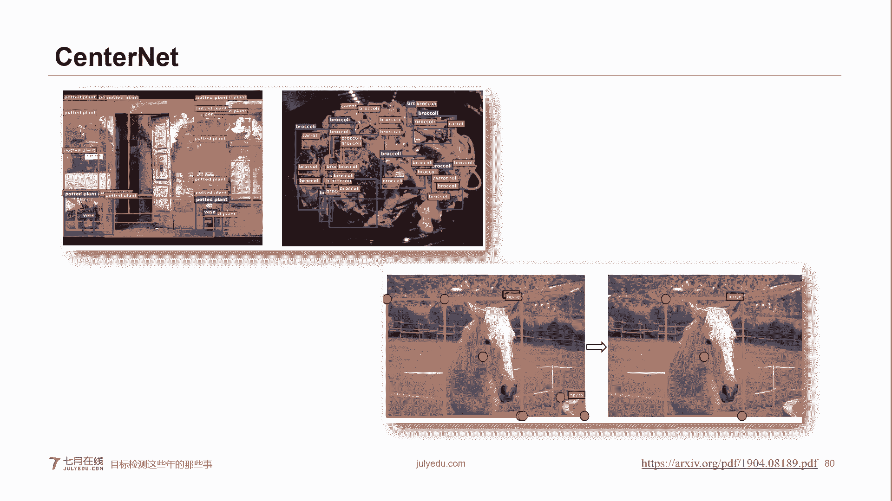

这个是它的一个大概的样子。你看它把one stage的。connet变成了toth stage。okK为什么to stage呢？它是多加了一个啊，多加了一个，就是说我上面是上面那个stage是找小点。

下面那个stage，我是找中心点。O我是预测中心点，说白了sernnet就是corronnet加中心点预测。这是三ter铺in三ter铺in的他的想法呢。它其实是跟cor站非常接近。

它就是说我不光你这个呃找那个cornet同时，我在你我水平方向求最大值的同时呢，我再算一个从头到左的这个3net。然后再把你水平和垂直相加的这个结果，我直接找到三net这个时间也不早了。

这个三ternet子那个就想法，我们具体在那个课程当中再给大家讲。在那个我们小班就是小班上面呃和那个实战目标检测上面，我们都会给大家具体说一下。在实战的那个课程当中。

第四堂课会给大家具体讲一下他是怎如何改进的okK。又到了送那个免单券的时间了。呃，从上次送免单券到这次送免单券，鬼魔同学，你去呃，我你哎鬼魔同学，你问我们的那个赵老师呃拿一下免单券，好吧。

关于课程咨询的。哎呦，这突然突然出现两个同学啊。啊，没问题，那现在时间也不早了，也感谢大家陪跟老师聊了这么久那个。😊，哎呀，手机尾号太长了，这383同学。376同学437同学多问老师要一个，好吧。

这是老师的微信。大家记一下，给老师发送过去。好，我们现在接着聊，大家不着急啊，我们还有一个话题。

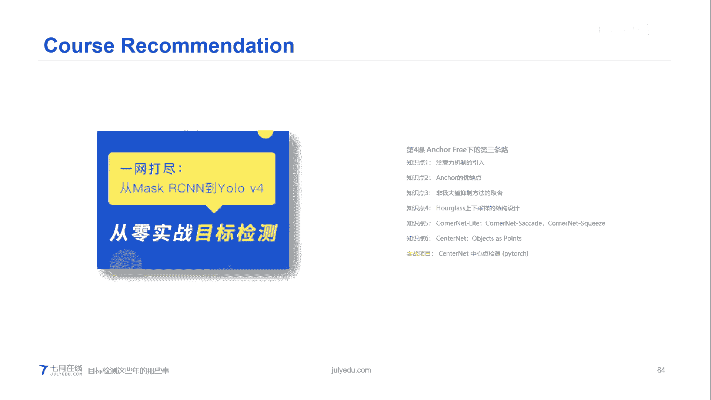

呃，是讲那个英乐V4的，呃，讲完这个之后呢，呃就是我们再给大家具体聊一下ok我们还会给大家送礼包，大家先别急。

优乐V4凭什么这么狂呢？呃，先跟大家说一下哈，市面上出现了一个优乐V5，但是在科学界我们不承认优乐V5，它应该叫这个名字，它是一个投机取巧的。优乐V4在呃西安系统约有你呃。那个呃说到哪了？

在就是在科学界，我们只承认优lo到最经典的版本是UloV4。为什么这么说呢？因为大家可以看一下那个之前的那个优lo版本。我不管是UoV1还是UoV4，它都会出现了一个就是呃很大篇幅的一个进行改进。

就是结构的改进结构的变化。尤其是前三个。呃，U乐V5科文也不是很认同啊。呃，优乐呃，这个是优乐之父叫Joy，这哥们儿非常厉害。

但是由于那个呃他认为美国就是国家就是他利用那个呃他的成果进行一些军事上的一些就是应用。所以他愤然退出了计算机视觉圈O愤然退出了计算机视觉圈。呃，但是呢U了V4是呃这个是一个俄国人和两个台湾人。

他们呃就是。中国台湾省人每次看到他们就是写这些台湾都让我很生气。他们应该写台湾后面的逗号china才对OK我们接下这聊啊，就是一个俄罗斯人，他是一座嘛，他把这个就是做出来优V4。但是呢虽然这个优乐之父。

他并没有参与，但是优乐之父也对他这个第四个版本给予了高度的一个评价。他是比较认可的。所以我们也把这个优乐V4呢，就是认为是优lo到目前为止的一个最新的版本。至于优乐V5那个说句实话。

那个有点那个背离了优乐精神啊，呃，那个我们并不承认他是第五个版本。那这时候也可以是我一家之言啊，呃，如果就是当然有的人我就认为是第五个版本，那当然也可以啊，仅代表我个人观点。哎，手机用户缴了。

同学说错了呃，是是说是说对了，说对了是说对了。我正想说这个优乐V4可以说是认为是目标检测算法的发展概况，也可以或者是算法调和手册。你说的很对啊。其实到这儿，我们基本上。已经聊了两个小时了。

坚持到现在同学都是真的勇士。呃，我们也为了现在已经10点半了，让大家早点休息哈，大概稍微聊一下吧。为什么这么讲呢？U6V4它在前期它讲的主要两个东西，一个叫做backag of freebie BOF。

一个叫做backag of specials。你要执译过来，一个叫做赠品，一一个叫做主餐。我第一次看到那时候其实很懵逼，是啥意思呀？怎么跟吃也挂上勾了？其实呃这个赠品和主餐呢，它都是用乐V斯。

他大概讲了一下，就是说我他首先他做了一个总结啊，就是总结。比如说BOF里面数据增管的方法有哪些呃，网络智动化的方法有哪些，或者是就等等我就不给大家一一读了。同时在那个第2个BOS里面。

他也就是给大家总结了一下。就是说我这些比如如森的感受也的方法。就是等等呃，就是呃他会有这些的东西，他做了一个列举，然后用。呃，很简短的几句话。大概概括了一下。

就是这个BOS呃就就是就这些呃各种小的这个cherickcks的一些方法。在我们的课堂当中，第五次课我们也就会给大家讲一下这些具体的这些方法。它的是什么意思。它如果实现就是在那个目标检测实战班第五次课。

在那个就业小班第五期里面，呃，在那个代码的就手把手教大家，就是写的时候，那个会直接就是给大家就是也会给大家应用到这些小的方法。最小的方法在这儿我就不给大家一一讲了。我一旦讲开，今天晚上我们就可以通宵了。

呃，看一下优6V4，直接给大家总结一下啊，它的组成部分就有就3个。一个是呃backbone，它股价网络使用的是乐V3，但是的那大概在53，但是他用了CSP的思想。

这是为什么在第一第一个top里面要给大家聊一下CSP它的那个nck部分是用的SPP和PN部分也是用的乐V3里head呃，具体我会在实战课中给大家讲，然后在它的那些改进方法当中。

我给大家用那个红红色的表标示出来，这个红色就是它所采用的方法，那给它所采用的方法。了V4它是用了各种各样的方法，然后给总结出来，就是说这些方法是最香的。这些方法是最小的O。最响的太香了。我再回到这儿啊。

所以说呃就这么说吧，好像是在那个。学术上面创新不像呃前三个版本那么来的呃幅度大，但是呢最难能可贵的是它的落地感特别强。就是说白它特别它的工程，它能够实际落到工程上面。因为它也经帮你设了很多很多种情况。

然后最后告诉你，哎，这些情况是最好的，所以说它实际上它是非常香的。嗯。在我们的第四堂课呃第五堂课当中会给大家讲一下具体的。呃，会给大家讲一下具体的那个就是方法。在第六堂课当中，除了讲优乐V4。

还会给大家讲一下那个以facenet。因为以facenet个人认为是到目前为止最准的一个网络。优乐V4是最快也是比较香的一个网络O。实战班有折扣，在今天的话请咨询我们的老师。哎，对我跟大家说一下啊。

去领优惠券的时候呢，呃去去加一下赵老师的微信。如果说是要呃咨询课程的话，请就是直接就是找我们的客服，然后或者是直接就是在那个微信群里面加那个群的那个呃你相应的那个咨询老师。呃。

相应的就是我们7月3天的一些老师直接问他，就是跟大家说，就是我们今天想报班，不管实战班还有就业班，我们都会在现有的优惠折成功上，还有大的折扣。但是那个名额是有限的。呃，就是希望大家就是赶紧去问一下。

OK具体折扣力度呢，我们呃是那个老师会给大家就是做出解答。有的同学问学西安证数业要看哪些初论文。an free，我给大家推荐三个论文。O第一个论文cononnet cornernet系列。

一个是connet18年的，你需要大概了解一下，然后再看connet light。同时你看一下sernnet，呃，特别搞笑的是，在那个sternet推出的同时。

还推出了另一个版本的sernnet也是中文人做的。他们叫呃。object呃 special我我大家记不清了，你搜三net，你会搜出来两个版本。另外一个版本就是呃就是呃就是同时同时推出的另外一个三net。

它俩其实思相很接近的。当然了，你也可以就是说直接就是来报名我们的那个目标检测实战班。然后因为具体我个会议大家直接讲解页免去了大家看这些论文的痛苦。细密度图像分类不是老师主要做的。

在这儿就不给不给大家接着具体聊了，好吧。那个在那个十呃小班课程当中，有一个老师专门做这个细腻度图像分类的，你可以找他咨询。

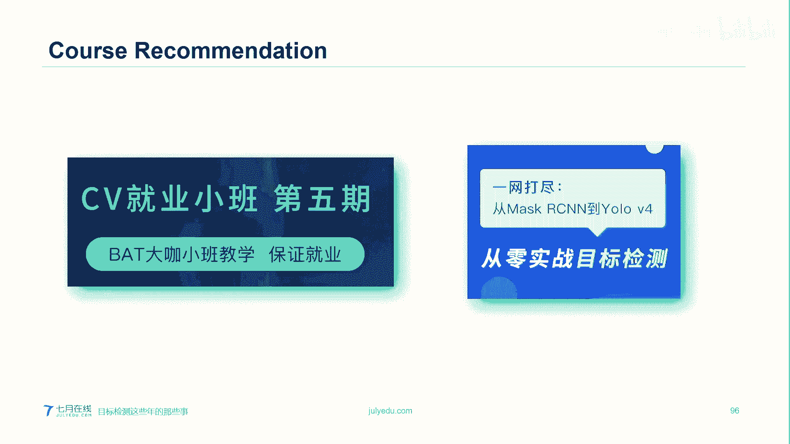

okK今天就是。我们主要聊的。关键点检测定位人脸检测哪些推荐的？我已经给大家回答问题啊，那个关键你的关键点定位呢。呃，他这我我们首先我们有一个课程，就是我我庞老师主讲的那个观点定位这门课程。

上面会给大家讲那个呃骨骼点定位，人脸的定位，还有那个。呃，还有那个物体的关点定位。进度最高，我们应用efficientnet。呃，我说哪儿了？关键定位这个其实就涉涉及到你具体需要哪个关点定位？呃。

就是就是哪种类型的观点定位啊，你比方说。那个国眼定位自顶而下，还有那个不是自底向上和自顶向下，就是它有两个分值，像maCN就可以做。然后open po比较经典，不过那比较早了。

然后现在还有那个CPN还有CPN的变种MSPN这些都是做关点定位的都非常效果比较不错。HRnet它也可以做，只不过是它那个资源销量太大。看论文好痛苦，是是好痛苦。在那个课程当中。在我们的实战课程当中。

我会给大家讲一下，就是如何快速阅读英文文献。因为老师是在美国任教嘛。所以说最一开始我也经历过这个过程。我记得我最一开始看看完第一段，看第二段，看完第二段的时候，第一段我基本上忘的已经很干净了。

就根本就我有一个自动过滤的功能，就基本上全忘了，就是我在早期的时候看论文。但是慢慢的时候经过一种课意的训练。呃，我现在看论文速度比较快。呃，基本上就最慢，我也会在20分钟之内把这个论文。

大概就是能给能就是有个比较呃清晰的了解和定位。呃，这个我会在那个课实战课程当中给大家就是介绍一下你如何快速精准的去读论文。O在这儿就不跟大家说了。有个同学问啊还同样同学哈。😊。

这个为什么许多模型的数差不在24乘24，那是因为。那是因为你太大的模型进去，你接动量太大了，所以我们一般都会去压缩模型。而且我印象2424好像我不大确定啊，好像是在那个是imnet呃。

就就是有一就是那个图像那个数据网站，比如说coco啊一接带的好像是他们最开始的图像是定位在24乘24。还是那个PAS我我都我大大记不清，就是就是很早了那个这个玩意说来话长，是在历史原因。那最早的时候。

因为那个呃你分辨率太高的话，你会导致我的这个呃计算量太大，所以他们都会压缩图像电到24。呃，有个同学问的好，目标检测不要。不不不需要不需要什么alexnet，因为Alexnet现在已经没人用了，太早了。

真的不需要啊。那个目标检测的话。这样吧，这个同学我建议你去跟一下我们这个目标检测的实战课程。嗯，你我你会跟着我们的课程走，你会呃就是大概了解一下，就是不是大概了也。

就很详细的了解一下每一个模型的那个呃是怎么设计的。我不建议你从最开始的论文开始看，因为这个一是浪费太多的时间和精力的。而且第二个问题是很多这个已经就是现在已经不用，就早期的已经不用了。

我所以我们就更更多的关于那个比较呃有这个里程碑的，就是呃这些网络ok因为这些有里程碑嘛。比如说ma，虽然出现的也比较早。但是它现在在应用的范围生意很广。ok然后就是看一下当现在就是比较特别流行。

同时呃效果特别好的一些主流网络。我们送个大礼包吧。😡，往回看一下，看看哪位同学呃老问我问题哈。QQ用户45003，恭喜你拿到我们大礼包了。这个3D好多都是从图像中加深度图。这个图像呃对啊。

他那个你想3D嘛，3D就是1个2D，再加一个ds。人脸检测和目标检测主要差在哪儿？目标检测这么说吧，目标检测的再往下做可以做关键点检测。人脸检测是关键点检测的一个分支，它是直接对点进行定位。哎。

98一同学。今天下午的赵老师，我把赵老师的微信号给你。OK981同学和QQ同学，然后请联系下我们的老师，然后我们会送你一个大礼包。同时今天晚上联系我们老师，呃，不管是呃就业班，还有第五期就业班。

还是我们的目标检测的班级。呃，目外的实战班都会在原始的基础基础上有一个比较大的优惠。呃，请联系下我们的老师。目标跟踪的实战课我们已经开设了，也是由我主讲。在我们的官网上可以看到呃。

那个之后我们也会再做一个目标跟踪类的一个大概的公开课。好，161同学是用16同学连一下我们赵老师，我们收一个大礼包。然后今天时间也不早了，我们送大礼包活动也就到现在截止，好吧。

再发一下了赵老师的这个微信号。然后收到大礼包的同学，请联系一下我们的老师。然后呃今天我们的课程就到这里了，大家时间也不早了，也感谢大家就是一直陪伴我们到这么晚。嗯，大家早好休息O嗯。

拿到阿里巴同学去用免单券，然后那个给自看一下我们的第四期的课程。然后其他同学如果今天在我们就是报我们就业小班或者是呃呃实战班呢，我们会有一个很大的优折上折的优惠。OK那么我们今天就呃先聊到这里。

