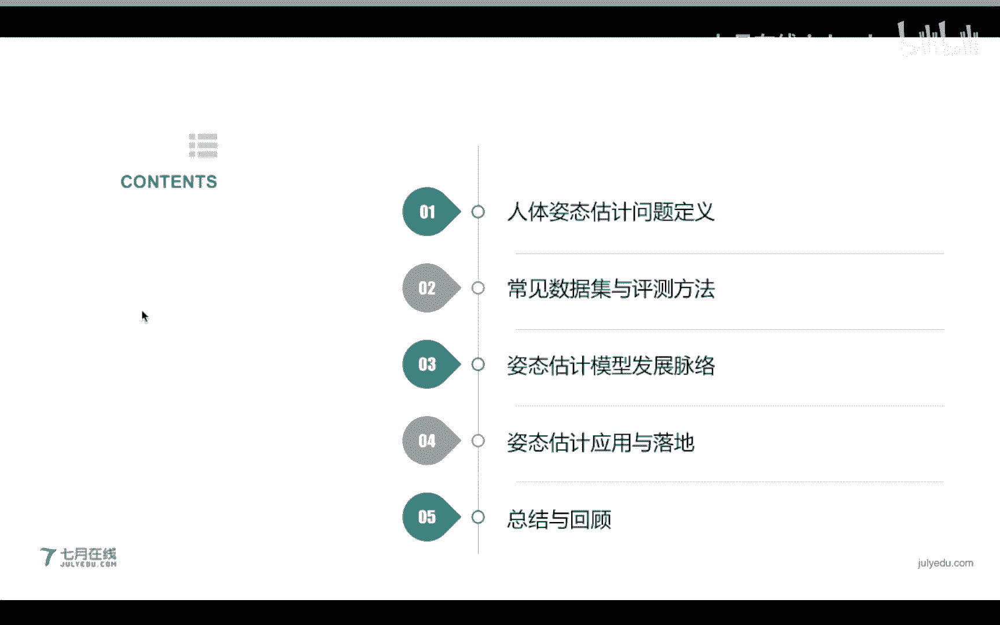
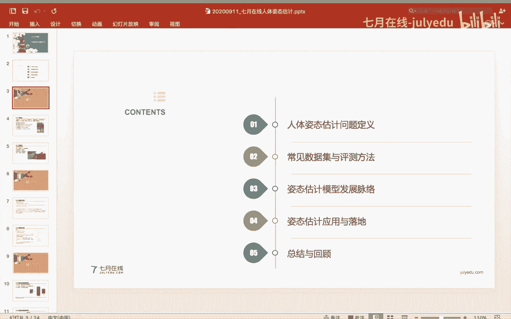
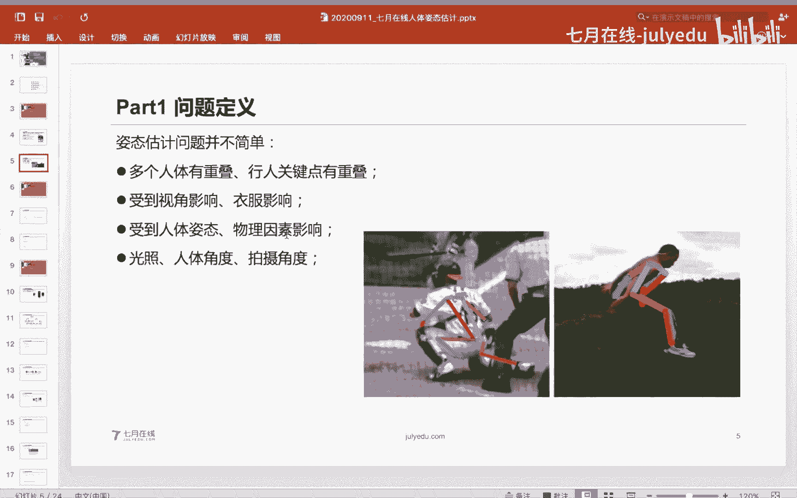
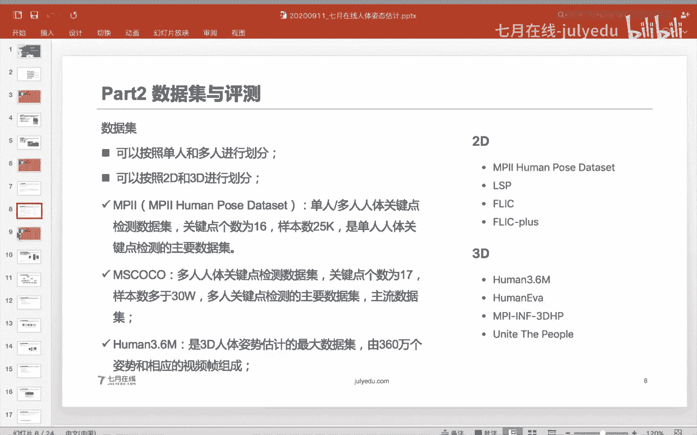
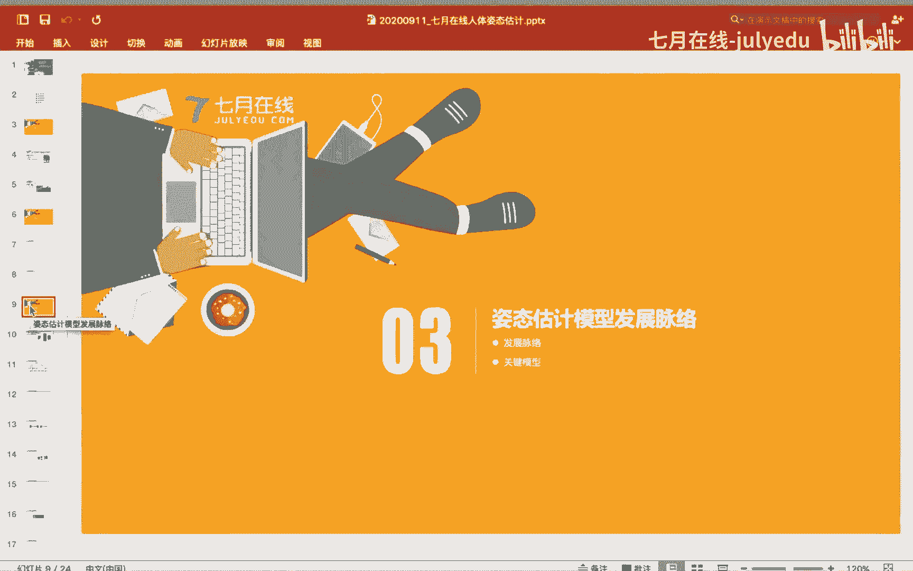
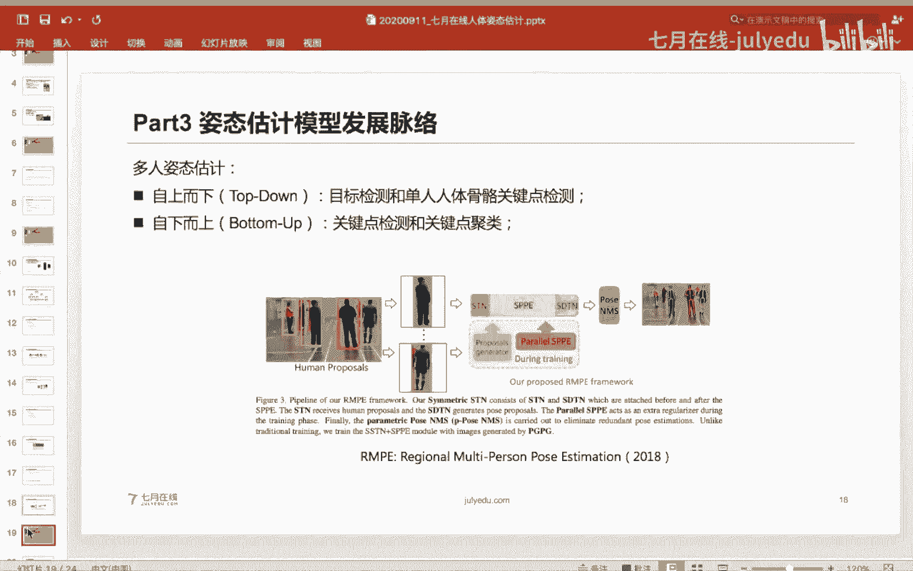
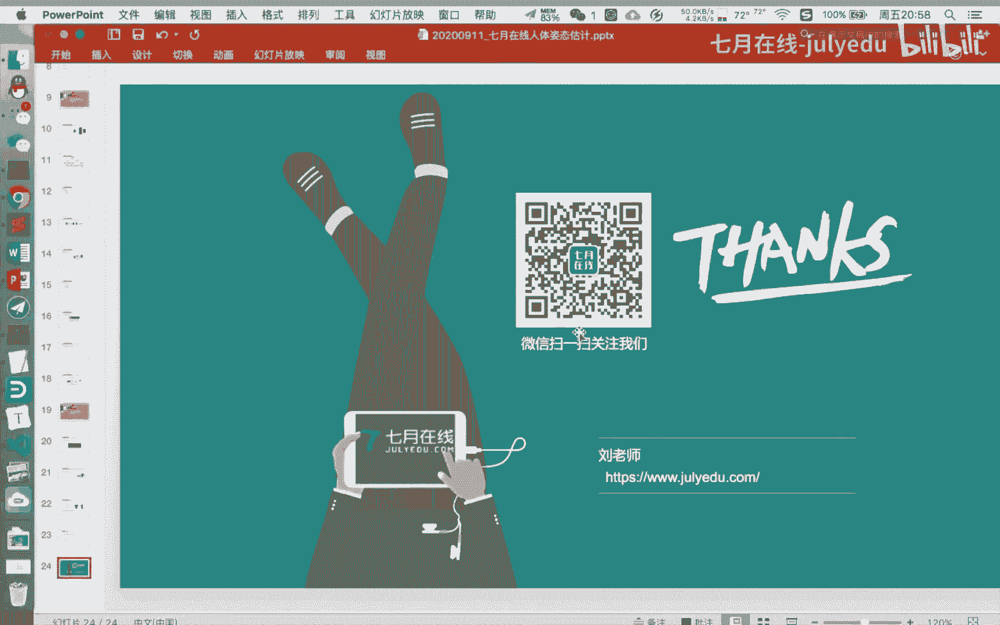

# 人工智能—计算机视觉CV公开课（七月在线出品） - P6：人体姿态估计的前世今生 - 七月在线-julyedu - BV17z4y167dq

好，呃，那么我们就今天开始的我们的内容啊。呃我们今天的一个主题呢是人体姿态的一个呃前世今生。那么呃对于人体姿态估计呢，可能大家了解的并不多。那么今天呢我们就想一大给大家40分钟到一个小时左右的一个时间。

让大家尽可能了解我们具体的一个相关的内容。那么人体姿态估计呢，其实是应用非常广泛，或者说落地很强的一个点啊，其实是在计算机视觉方面。那么我们今天的一个讲解的一个知识呃内容呢，就。

呃，这个那么我们今天的一个讲解的内容就主要包括呃呃四四大部分，就是人理姿态的一个问题的定义，常见的问数据及以及评测方法以及姿态估计的模型的发展脉络以及姿态估计的落应用和落地啊。

以及我们的最终的一个总结和回顾啊。呃，由于我这个鼠标好像突然出现了一点bug啊。所以我现在每一张PPT啊都要贴出去啊，都要切出去。

都寄出去啊。我就这样这样给大家讲吧，我就这样给大家讲吧，不好意思啊，因为我这个鼠标突然出了有点毛病。对。呃，首先呢是看我们人体姿态的一个问题的定义啊。首先我要弄懂我们这个问题是什么。

人体姿态估计呢其实是我们在就是说在计算机事界里面非常基基础的一个问题啊，从名字来看，你就可以理解出来这个人体姿态估计它是对我们人体的一个呃，就是说是一个姿态的一个呃识别，当然这个地方为什么这种估计呢。

其实嗯它这个esttimation，对吧？它和这个我们的分类和检测它不太一样。这个地方是估计到我们这个点就是说我们的关键点在什么位置，其实大家看可以从右边这个图可以看出来这个人体的一个定呃。

就是说我们这个地方是一个人的一个骨骼的点，对吧？这个地方其实人的这个骨骼这些点啊其实并不是完全呃，就是说符合我们的逻辑的，对吧？比如说这个呃运动员的这个右边对吧？这个关键点。

其实定义的这个关键点其实定义很模糊的，或者很难定义的，难。

所以说呃如果是很精细的做人体姿态估计呢，其实是很难的一件事情。那么人体字态估计呢，其实如果是按照这个具体的数据来划分啊，就是说如果按照数据来划分可能会更加直接一点。

就是说是单人的姿态估计多人的姿态估计以及人体的姿态追踪以及3D的人体人体字态估计啊，那么我们现实生活中呢，一般常见的是2D的，就是说我们2D的，主要是这种呃单人的或者多人的，如果是视频呢。

可能就是说是呃姿态跟踪了。如果呃更高级的可能还有3D的。那么其实我们现实生活中这种呃人体姿态估计其实已经有很常见的应用啊，最常见的应用，比如说大家肯定会用到的一个应用就是我们的抖音。哦。

不知道大家就是玩过抖音面，抖音里面有这种跳舞的。呃，就是那种特效，就是用来拍一档舞蹈，然后嗯给你进行个打分，或者说你。看不到吗？有同学看不到视频吗？你如果看不到视频，是不是flash要启动flash啊？

这个就是说我们的直播课是要启动，是需要启动flash的。呃，其他的同学应该看得到吧。嗯，对我我我自己也在看直播，应该是能看到的。你如果看看不到视频啊，可以在你的浏览器里面，你就是说允许flash执行。

或者说在我们的APP里面观看。对。啊，那么这个字态估计其实比如说你玩抖音，你假如说你拍了一段视频，他让你做出一些，比如说做出一些动作，做出一些表情。其实这个地方不管是表情式比如说字态估计啊。

都是这种关键点的一个视别。那么其实应用非常广泛。呃，我个人认为啊，姿态估计也是在计算机视觉里面应用最为广泛的一个呃就是说。一个嗯技术吧。对，那么我们今天主要给大家讲解的是就是说自台机估计。

比如说单人自台估计的它常见的一些方法。对呃，这个650821同原因你如果还看不到，就就看一下你是不是你flash没有启动啊。那么比如说这个人呃字态估计呢，还可以把它扩展到这种2D的姿态估计呢。

还可以把它扩展到我们具体的一个视频的自态估计。比如说给定视频帧来，就是说多段多张图片，我们追踪这个视频里面的这个人体的姿态，那么还有这种3D的，比如说我们嗯这种对于给定一张图片呢。

我们对这个人人体的关键点做自态估计呢，可能只是输出它具体的一个关键点的位置。那么比如说我们三假如说是3D的呢，那么我们就可以输出这个人体的3个XYZ的一个空间的位置，空间的位置，对吧？

那么这个可能是对于我们这种游戏的游戏的一些玩家可能比较感兴，对吧？这个其实就是对一些3D建模，嗯，ARVR其实也是用到的非常多啊。那么所以说人体现代估计不仅是在计算机试卷领域啊，嗯。

还是在一些呃就是我们的工业的领域，还是在游戏领域啊，都是应用的非常广泛的。呃，那么人体资态估计呢，其实这个问题或者说这个呃问题并不是很简单的一个问题。

人体资态估计你可以我这个地方有几张嗯这个hard example，对吧？你可以看一下人力资态估计它主要的难点是什么？第一个呃，我们的多张多个人体啊，其实是有这种关键点的重叠。

或者说这个地方你很清楚的看来这个。这个人的腿对吧？盖过了这个应该是这个棒球队员的腿，对吧？那么你如果让计算机的模型来识别这个呃具体的关键点的时候，其实你就很难去识别这个具体的关键点。

就是说这个人体之间他们的关键点会有重叠。那么这个重叠成会有什么程度呢？大家可以设想一下自己在拍一个毕业照的时候，你如果在拍毕业照的时候，你每个人每个同学只是露出一个头来，对吧？你露出一个头来。

如果是让一个人体自带过去的模型去预估。一个鼻业照的。这个照片那么你可以设想一下，其实这个模型还是很难做的啊。比如说前排的这些老师啊，他可能把这个姿态能预估出来。但是后排的同学他只看到了这个头，对吧？

身子可能看不到。那么这个呃不管是人体还是形象，它的关键点可能也会有重叠的这是第二个点。就是说这个地方你看他这样一个人才在跳起来，对吧？那么你就是说这个地方我们是从侧面看它，从侧面看呢，你会可能他两只脚。

两只脚它的就重叠在一起了，以及就是说肩膀都重叠在一起了。那么我们怎么做一个姿态估计呢？其实也是很难的。而且呢这个姿态其实很容人的姿态它这个地方呃忘记介绍。

就是我们做自态估计呢一般都会以这个呃骨骼的关键点给它进行一个输出。比如说我们常见呢有呃17个呃关键点或者14个关键点都是有的啊，都是有的。那么这种姿态估计，我们其实就是对这些关键点嘛。

比如说AP数据集是14个关键点FLIC数据集是9个关键点MMPI是16个关键点。然后这个coco数据集是17个关键点，不同的。嗯，就是说我们这些姿态估计，它可能都是定位到我们这个手腕，手臂，我们的脚踝。

我们的呃胯骨臀。对，那么就是说这个姿态估计你可以想象人的姿态其实是一个三维的过程，是一个三维空间的一个动作。你想让在让这个机器啊在一个二维的模型。

二维通过一通过一个画面来识别一个三维的空间在一个二维的映射其实是很难的其实很难的。即使是呃就是人的视角还是就是说人就是呃机器就是说这个画面的视角啊还是很多变的。比如说一个人他坐着的躺着的。

我们仰视的俯视的它的角度都不太一样啊，都不太一样。所以说你这个地方视角会影响的，而且这个衣服也会影响很多。比如说我们这个地方其实它就没识别。对对吧？这个肩膀没识别这个衣服啊。

就是我们现实生活中的一些衣服啊，其实呃就是人穿的一个衣服啊，肯定会和我们的背景有一定重叠。就不。在他们的颜色上，在屋顶上很肯定会有些重叠。就是说也会影响我们这个模型的判断。

而且会受到我们人体姿态物理因素的影响。这比如说嗯。就是你只看到了这个人的一一半的胳膊，对吧？那么你怎么做一个人姿态估计呢？还有一些关键年龄检测不出来怎么办呢？对吧？那么这个字态估计它毕竟是一个图像的。

或者说是一个数字信号的一个输入。那么它肯定会受到一个光照的呃人体角度的以及拍摄角度的影响。所以说人人姿态估计啊，其实一个很难的问题啊，很难弄力。那么其实现实生活中我们长的字态估计啊，都是呃很规整的。

就是我们还是以一个呃就是说我们。相相当于是一个切呃正对着我们的一个角度，对吧？相当于我们把这个摄像头手机的摄像头打开的自态模式，那样看我们每个人。但是现实生活中可能不是这样的。

就是我们每个人它的一个角度啊，可能是多种多样的。那么接下来呢我就给大家介绍一下常见的数据集和拼则方法。呃，那么既然人体姿态估计啊，它现在是计算机视觉里面的重要的部分。

那么自态估计其实现在也是主要的非常非常依赖于数据集啊，依赖于数据集，呃，不知道大家对深度学习有没有了解，其实深度学习它毕竟是一个很依赖于数据集的一个领域，对吧？那么数据级的一个数据量的多少。

其实很影响模型的一个精度啊，其实现在的一些呃比较大的一些数据集，比如说coco啊，或者说MPI啊，它其实的数据量都非常大。那么这些数据量的大小呢，其实是对姿态估计呃的精度啊提升很有帮助，提升很有帮助。

那么。

我们现实生活中呢也有很多这才估计的一些呃评价指标。评价指标比如说常见的有OKS嗯嗯PC我们讲PPPT里面的列举的PCK以及M嗯，这个M就是说大家如果知道这个物体检测的。

比如说这个paC或者coco上面的这个。呃，MAP啊这个应该不会陌生。那么对于这个PCK呢，它是就是说呃它是这样定义的，就是说正确估计出我们关键点的比例。

那么这个PCK呢是一个比较早的一个人体估计的指标啊，一般是在2017年或者说之前那些论文比较嗯广泛使用啊，现在已经不使用这个指标了。那么这个PCK呢其实它嗯在定义的时候其实非常简单。

如果是在做工程项目啊，或者说直接用来衡量，就是说这个模型这个就是说这个人体磁态估计模型啊，它的呃好坏啊，用PCK还是很方便的。那么它就是用呃就是对比一下我们真实的关键点和预测关键点的一个欧式距离。

然后计算它们之间的呃就是说通过一个欧式距离，然后通过一个阈值来计算的一个PCK那么PCK呢也是比较老啊比较老的一个指标。那么就是现在如果是直接用它当做一个衡量啊衡量的指标，衡量精度的指标还可以。

那么M呢，其实它是现在比较用的比较多的一个指标。那么M呢，现在它嗯也是我们发论文或者说做实验，主要看这个M那么这个地方M呢它可能的一个计算方式啊，在对于单人的M可能和多人的多人的M还不太一样。

就是我们人体。估计他还分单人和多人，就如果是单人自的估计，就是这张图只有一个人，多人的自在估计里面就有两个人啊，就有两个人。对那么对于单人估计呢，我们是针只针对一个行人进行进行估计。

然后此时我们一张图片里面的就为一个人。然后呢，我们通过这个呃真实的关键点，真实人人的关键点和我们预估的行人的关键点，然后算一个相似度这个相似度我们用这个OS指标。对，然后计算1个AP然后如果是多人的呢。

我们就把多个人找出来，然后算一算多个人的AP然后这个AP呢，我们如果就是算的单张的图片的AP呢，然后接下来我们就可以呃根据我们的一个呃具体的人工的预值卡域值得到多个AP的指标，对吧？

然后做接下来对多个AP的指标进行一个做平均然后得到得到一个对吧？那么这个地方需要注意的是，就是大家现在看到的一些内容可能都是以作为评价指标的。呃，其实人体自带估计的一个发展呢，其实离不开数据集啊。

离不开数据集。呃，数据集呢其实现在的人体自带的数据集呢也是呃就是说根据我们这个呃。就是这个图的一个类型划分的方法比较多吧，或者说主要的是以这个图的类型，或者说这个人的个数类型。

比如说比较典型的是这个单人的，或者说是多人的呃，单人的刚才已经解释了，就是说这个图片里面只有一个人多人的这个图片里面有多个人。那么右边的呢是我们还还可以进行划分。

就是说我们这个地方我们还可以按照这个图啊，我可以把它划分成2D或者3D的呃，比如2D呢就是说我们这个是2D图片的3D呢可能我们会给出就是这个3D这台估计的一个坐标信息。

那么我们现在现在常见的呃这个呃人力资源估计的数据集呢，比如说有PI这个口co数据集以及这个human3。6以及 track对以及我在PPT里面就列举的这些都是非常常用到的。

较长的单人的字态估计呢是这个MP嗯去这个呃这个数据集呢其实现在已经被刷爆了啊，这个数据集现在已经被刷爆了，它的精度已经嗯到90%多了到90%多。对嗯P呢它其实是一个单人或者多人的关键点嗯检测数据集啊。

嗯这个检测点的一个数会16个。那么样本数呢应该是接近这个25000。对，是单人人体关键点的一个呃就是说主要的数据集对是单人人嗯就是说人体关键点的一个主要数据。

然后呢这个coco呢这个coco其实和我们的一个物体检测那个micsoft的coco其实那个数据集也是比较类似的数据也比较类似。但是这个地方的coco呢它嗯就是说标注不太一样，标注它是多人的。

主要是用来评测多人人体关键点检测数据。它的关键点的个数是17个。样本量呢应该是大于30万的，是主流的多人关键点属于机啊。然后。你是主流的一个数据集。然后在嗯提到这个数据集呢。

提到这些嗯人体关键点数据集呢，就不得不提到一个竞赛叫AIchger。嗯，AI challenge呢这个我们要写在这个PPT上。

因为这个这个比赛已经现在已经不举办了AI challenge呢应该是在2017年2018年由李开复创新工厂举办的一系列比赛。那么因为当时A就是说AI刚开始很火嘛。

然后AIchger举办了一两场嗯就是说年度的人体关键点检测的比赛。那时候他的一个比赛的数据集也也是非常非常经典的。因为AIchenger那个比赛的数据集应该是样本量大约是38万。

甚至比coco的一个数据集的量级都大啊，但是他的一个关键点的个数是14个。那么这个human3。嗯3。6呢，这个数据集33。6万啊3。6，这个3点应该是3。60百呃33。600万，也就是360万。

那么这个这个数据集呢其实是这个3D人体四界估计的最大的数据集啊，嗯，一它是由360万个姿势和相应的视频帧组成。然后呢这个呃human这个数据集呢，它是包含了11个演员从4个摄像头。

然后具体是15天的一个采集的过程啊，数据集的大小应该是非常大的。具体呃，应该是呃就是大几十G吧，对，应该是大几十G，就是说一般的就是说我们的这个呃检测的数据集，检测数据集。

前面两前面两个就是用到的比较多，前面两个用到的比较多。比如。对，然后如果大家就是说刚开始呢可以尝试着看一看这个MPII这个数据集，就是它呃现在就是呃刷的，应该是刷应该是被刷爆了。

所以说这个数据集是嗯也是比较适合入门吧，比较适合入门。对。

那么接下来呢我们就看一看人体自态估计的模型的发展脉络啊，人体自态模估计模型的发展脉络。其实人体自态估计模型也是和物体分类或者说嗯这个物体检测的一个发展，有一点类似，就是说人体自态估计模型。

也可以按照呃深度学习前深度学习后的一个发展。对，然后呢如果大家知道啊就是或者了解一个深度学习的发展的话呢，你就知道人体自态估计或者说这个深度学习其实是改变了很多计算机视觉的领域啊，改变了很多计算机视。

比如说分类啊检测啊相关的。那么如果是在深度学习之前呢，我们处理这个人体自态估计呢，其实我们还就是说在深度学习之前啊，一般是做单人的人体自态估计问题。比如说我们把这个呃人把它求一些shift的特征。

或者画过这特征，然后把它把它转成一个浅层的一个feature，然后利用。

用这个关键呃人体资态的关键点呢做一些空间的相量关系，相当于相当于是做一些简单的模型啊。这个简单的模型其实在深度学习的前时代，或者说前深度学习时代也是非常非常有效的。那么其实呃如果是有深度学习的这种。

新人子识点限制。😔，嗯。姿态估计呃呃，这个主流的叫法应该叫姿态估计。嗯，这个姿态估计啊啊。呃，这个呃就是如果是有深度学习呢，其实它是在对于自态估计应该是嗯刷的很高的，刷的很高的。应该是从2014年开始。

2014年开始就有开始就有这种姿态估计相应的尝试啊，相应的尝试呃嗯行为识别和这个还不太一样嗯，就是行为识别可能是有这种。activity嗯这个呃action那种识别可这个字态估计还不单样。

行为识别你可以查一下资料，可能我刚才表达的有误啊，对不起呃，就是行为识别可能就是它跟具体的一个事件相关的。嗯，姿态估计可能是具体就是估计估计到我们这个人这个人体的这个关键点，骨骼关键点。

我就之后就就以这个姿态估计啊，就是姿态估计就是啊就说一下，刚才就是说啊忘记了啊嗯对于自态估计来说呢，如果是有嗯深度学习来说呢，它可能的一个进度会高很多。那么大家也知道这个深度学习在imag上刷榜啊。

就是说在imag上起作用，应该是在2013年到2014年，那么其实在201514年开始啊，就有很多或者道一直到2015年就有很多相关的自态估计都是可以用这种呃CNN的模型。

其实呃2014年就是这个MMPI这个数据集就是被引入了。那么很多时候这个数据集它是推动了我们这个行业或者说这个技术的发展的。大家也知道就是说如果没有imag数据集其实深度学习也发就是说不会发展这么快。

对吧？那么这个MPI数据集呢也是推动了这个。呃，人嗯人体自带估计的一个发展。因为在MPI数据机之前，这个数据大部分数据集都是呃就是数据量比较少，没有数据量没有这么多。那么MIMPI数据集呢。

直接把这个数据量提高到万级别，就是2。52。5万的呃这张图片。所以说就是说对我们的一个自带估计的发展，有提供了一个数据上的一个支持。那么就是说从2014年或者开始吧，就是说有很多自带估计的一个发展。

那么这个地方你可以划分成一些具体的时间节点，就是说从深度学习开始到2015年之前，就是主要的一些方法都是对一个自带估计。就是人体的关键点做一个呃回归，对这个坐标点做一个回归。

然后接下来就是2015年到2017年就是做一个呃有关键点回归的坐标回归，再加上一个呃这个关键点的一个热力图m做一个测的过程。那么从2018年开始，就是说前面这两个可能都是做单人的自台估计。

那么下面呢呢就是主流的一些学术，都是做一些呃多人的自台估计。呃，有同学看不到的，可以切换一下啊，就是说我们在浏览器里面允许允许一下设置一下flash允许啊，因为因为我们的直播是经通过flash插件的。

如果还有同学看不到呢，可以就是说用我们的呃7的手机APP啊。那么现在如果大家去看一些最新的论文，其实这在过计主流的还是就是说现在的一些方法都是用这种呃。多人的已经是多人的属悉了。

那么这个地方我提到了一个坐标点回归以及这个h map。那么其实这个地方其实是这样的，就是说对于一个h map，就是说我们通过对对于一个人体自态估计的一个呃就是说我们的一个坐标的一个定位。

或者说我们的一个ground的构建，其实是可以通过两种方式，一种是通过一个具体的一个坐标，比如coco coordinate对吧？还有一个是 map。那么这个关一个坐标呢。

它其实就是把我们具体的关键点的嗯，就是说我们的谷骼关键的一个坐标作为我们网络最终需要回归的一个目标。那么在这种情况下呢，我们的网络直接通过啊，就。翻到这一页啊。就是说假如说这个比较典型的。

我刚才讲的这个坐标点回归呢，就是说比较典型的这个deeppos。这个模型呢就是它是第一个使用这个CNN做自台估计的这个方法。它是使用关键点回归的方法。

就是说它把这个具体的关键点作我们最终需要识别的这个位置，然后以它来以它来作为回归。这个大家看到就是我们最终的一个礼盒的，或者说它需要完成的就是一个回归的问题，对吧？当然这个CNN它可以做分类。

也可以做回归啊，也可以嗯可以做分类，也可以做回归啊。嗯，然后这个当然大家应该清楚。然后如果是还有就是说我们如果做这种就是说我们这个人体的这个骨骼关键呢。

其实呃用具体坐标点也可以也可以做它的 ground数。就是它最终就是正确的表，也可以用这个H map。那么这个Hm呢，它是将一类坐标中一个概率图，或者说是一个像素位置的这个概率值。那么这个地方它。呃。

就是说如果是用这种h mapap的方法呢，它其实是相当于更加平滑了，对吧？你比如说我们如果是给就是说需要这个网络对这个谷歌的关键点做一个预测，其实你网络肯定就是说是对一个数值做一个回归。

如果是想让这个网络学习到一个就是说具体的一个概率值的一个h mapap的分布。那么它学到的一个可能性，就是说可能会更快一点。

那么如现在也是就是说hmap它的一个就是它的一个如果是用hmap这种嗯就是说构建一个模型啊，它的一个收敛的速度啊，其实是更快的。因为它是对呃我们这个整体的概率值啊。

就就是说对整体的这个谷歌关键点的这个区域啊做了一个概率值的呃，就是说预测。那么其实这个嗯大家可以嗯设想一下，就是说这个地方。H成本不它是有一点像嗯我们。这个图片分图片分类里面的一个soft label。

对吧？这个地方我们预测的不是一个呃具体的一个值，而是预测的一个分布。其实呢而而且这可 map呢，由于它这个地方是它预测的最终呢是一个分布呢，其实也会加快我们的模型的收敛。对。

那么这个地方hm它其实它的提出的时间啊，这个提出的时间应该是在2017年。那么我们截取的这个论啊也是谷歌公司提出的这个呃以h map再加上offset，就是我们预就是说。

哦嗯这个hm在上off这个off呢就是我们具体的一个呃偏值，或者说然后就是说这两个值呃呃来进行一个就是说统一的这个建模。这个这个off它和单纯的hm有一点区别，就是说这个地方off。

它是给进了这个HHm的一个范围。就是说如果是预测到了这个呃h map。以及有这个区域范围内的，我们就把它这个说就是认为它预测正确。如果是就是说超过了这个范围呢，我们就认为它预测就是有一点偏差。

那么这个地方就需要知道我们这个其实呃这个人体自态估计这个嗯就是我们具体的不仅仅需要大家这个这个人体自态估计，它有就是说有多少个骨骼关键点，对吧？

我们刚才介绍就是每种数据级可能可能它的一个标注的一个标准不一样。其次呢，它这个具体的一个就是标注数据啊也有也有一定差异。那么其实现在的人体自态估计的一个模型的发展呢也是发展的非常快速，非常快速。

那么这个地方我是截取了呃CSDN某个网友的博客，他是这样划分的。就是说对于人体自态估计的一个发展呢，我们主要的啊这个地方截取的是2D的，就是我们通过一张图片来进行一个人体自代估计的这种领域呢？

那么它主要分为单人的人体自代估计以及多人的人体自代估计这个地方呃如果是单人的人体自代估计常见的方法就有CPMPM以及CPM后续的发展比较典型。

就是非常非常出名的open pose以及这个然后如果是多人的呢，它这个地方你分支又可以具体划分到底是从上至下的，以及从下至上的。那么从上至下是什么区它是什么意思呢？就是从上至下它是先识别到哪个人。

然就是相当于拆分到每个人从上至下，然后再到这个人里面完成单人的人体代估计。如果是从下至上的，相当于它。先识别所有的人体骨骼关键点，然后再把这个关键点组合成单个的人。所以说这是两个思路啊，两个思路。

那么由于时间原因呢，以及就是说由于我们今天讲的这个基础，那么我们就以这个单人的人体自来估计啊，单人的人体的在估计主主要给大家讲一讲。对，那么如果是多人的呢，其实你也可以把它转成单人的问题。

那么其实人体自带估计呢，其实在单人的人体自带估计的问题，它还已经嗯研究了很久了。从深度学习前世代一直到现在，主主要的方法如果是在用传的方法。

就是用这种DPM如果用深度学习的方法又可以划分成这个直接回归坐标，比如po或者说这种热力图加回归坐标的对然后就是CPM的那么这个地方其实这都是有一些改进的。这个我没有展开讲啊，没有展开讲，没有展开讲。

就是说这个地方应该是在这就是说我们这个地方嗯每个这个是每个就是说呃这下面呢都是对我们的dpo的一些改进啊。比如说原始po是直接对我们的一个骨骼的关键点做一个回归的测。

那么我们能不能把它改进成这种多阶段的，我们能不能把它改成多阶段回归的对那么类似的其实在这种热力图回归的坐标的这种就是说发展慢度啊，也可以有一些相应的改进啊。比如说。整个讲啊，到时候就整个讲。

这个deppos应该大家都都就这个思路非常简单，对吧？我们直接预测这个具体关键点做一个回归就行了。但是它是非常这个这个作者也非常有名啊，这个作者应该是就是这个。呃，如果我没有记错。

就是fa斯CN其中的那个RRGB里面的一个人。对，也是就是说开创性的一个就是说用。那么刚才的depo就是直接对一个回归，就是对有个坐标进行回归。那么也有一些相关的一些问题啊。

其实呃就是说如果大家用啊就是说如果大家用这个CNN去完成一个回归的任务啊，你就会发现。会有一些问题会肯定会有一些问题。因为CNN它它的一个输出的结构啊，它本身就是如我们现在如果把它嗯很常规的。

就是说我们如果最后的一个是soid或者s next，它输出的就是概率值。那么我们怎么能够让一个模型，让它输出一个具体的坐标位置，对吧？我们比如说这个坐标，这个不管它是嗯什么谷歌关键点的坐标。

那么对于一个。网络来说，它不可能输出一个数值，对吧？或者说我们一般情况下不不让他输出一个数值。那么其实。有嗯这个我刚才讲的呃表达也表达的有有点有误啊。可能说有同学说老师。

我能不能直接让它回归这个具体的坐标的值？可以的，比如说这个坐标的值是5050，你直接让这个模型回归率这个坐标的值。比如说像素值是可以的，这种是可以的。但是它这个模型肯定会有误差，为什么呢？

因为我们CN它的一个输出空间，它经过了多次的这个呃激活函数，然后就会导致你如果是让这个模型去最终的输出是一个比较大的值。这个比较大的值就是说它是一个。比如说50100。

那么这个CNN其实它那个就是它的置信度不会特别高。那么在这种情况下，我们一般的做法就是把这个。具体坐标，比如说这个关键点的一个坐标把它映射到我们具体的，就相对于整张图它的一个相对的位置。呃。

有同学说自态估计对人体的定位进嗯嗯有同学说自态估计对人体的定位问题，借助自态，然后识别行为。是的嗯，对，这个是具体的一个对，当当然这个呃这个行为识别也有一些其他的就是说行为识别可能。就是在呃怎么说呢？

也不能是单纯是对人来对人的啊，也有可能看具体数据集，看具体数据集。有一些数据集就是呃根据人的行为的话有一些数据集可能是对一些视频对，或者说对于一些呃比如说嗯比如大家如果参加过呃近年天池的一个比赛。

就是他的一个视频行为的识别呢，就是识别一个电视剧里面的，有哪些片段是在打电话，哪些片段是在对白，哪些片段是在呃就是在一个室外的场景，哪些片段在一个室类的场景。

所以这个行为识别可能还跟你具体的应任务就是说定义相关啊。我们今天的一个课程呢是一个人体自在估计啊，人体自在估计。嗯，那么我们刚才也讲到，就是如果让一个模型直接回归我们的一个呃坐标点呢。

其实会有很多的问题的，其实会有很多的问题的。那么其实现接下来呢就会一些改进。比如说我们能不能让这个网络模型学习到多阶段的反馈呢，其实也是可以的。当然可以，那么我们就可以迭代误差来反馈我们模型。

那么如能同样的，我们也可以让我们的模型有更多现验知识。比如说让我们模型知道我们的关键点那关键点的分布规律，知道我们这个关键点的一个大小。就是说具体的一个呃位置比也就是说他们之间的关系。对。

然后这个地方我比嗯给举个例子，就是说我们其实是可以通过我们具体的一个关键点。比如说这个地方我可以把一个图把它切分成多个，这个地方就是双原生N的论文的截图啊，就是我们可以把一个图把它切分多个。

比如说不能区域把它切分开来，然后输入到我们模型。然后根据我们的区域呢，以及他们的关键点的位置呢来做一个精细的一个预测。所以说大家也可以看到，就是说对于姿态估计啊。

可能它是一个也是一个end to end的一个就是端到端的一个呃解决的思路。但是它有一些具体的解决方法是值得我们去学习的。那么如果是把我们的一个热力图加入到我们的这种解决方案，那怎么做呢？

就是说它就是需要我们用这个CPM比较典型的这个CPM模型。CPM呢就是就是这个convolutionpo machines就是一个序呃这个po machine呢就是一个呃序列化的预测框架。

它可以就是说学习到一个信息丰富的一个空间性模型嘛。那么这个CPM呢其实是将呃这个卷积神经网络整合到我们的po machine里面。然后呢呃就是将这个呃。就是说能够更好的学习到我们这个人体的一个姿态吧。

那么个CPM其实也是我们现在学习人体姿态估际里面必学的一个论文啊。那么CPM后续也有发展，就是说也是CPM相关的作者就是发表了这个open poseopen pose也是非常非常就是说经典的那么CPM呢其实这个条节解释了。

就是说CPM呢它是由全卷辑网络虚拟化组成。然后就是说在训练的过程中呢反复输出每个关键点的个2D的执信致信图。这个置信图呢，它这个致信图是这个中间层就是中间网络层的一个h对。

那么这个执线图呢为后面的一个阶段提供了每个关键点，在空间的一个不确定的一个编码。然后通过CPM呢，它其实可以就是CPM其实可以学习到这个丰富的一个空间的模型。

对你如果直接让这个模型就是说端到端的去学习这个具体的位置，可能还学的会不是特别精细。那么这个地方我就相当于手动把它分成了不同的阶段，手动把它分成了不同阶段，降低了我们这个呃就是呃不确定性。然后呢。

这个CPM它不同day的一个设计的启发点，就是说它是在呃图像同一张图里面或就是说获取到不同大小的一个感受也。那么这个感受也呢就也会改善我们模型的一个精度。那么CPM也是非常非常经典的论文。

但是也发展的就是发表的也不是呃不是特别晚了，不是特，也在2016年2016。那么CPM在这个tage one的时候，它的一个关键点嗯和在tage two的关键点啊是不太一样的是不太一样的。

如果大家感兴趣呢，可以向后客户呢阅读一下我们CPM的论文啊。对，现在在网网络上也有很多的CPM的一个解读的博客的。因为这个这个论文啊实在是非常经典非常经典啊非常经典。那么CPM它的一个整体流程。

就是说计算我们不同尺度下的一个各个关键点的一个相应的一个h。然后对于相同的部件呢，我们每家所有尺度的这个h得到一个总的响应图。然后呢再找到最大化的一个激活点来确定到具体的一个关键点的一个位置。

所以说你可以认为这个地方这个CPM它是有一点那个在我们现有的论文可能这个就原始论文这个CPM它是四个阶段四个阶段的对不同的阶段可能这个图片的一个尺寸。

就是输入到这个就是输入到不同t的这个feature featureature map的一个size吧，就不一样的对，不一样的。所以说它其实让我们的模型有一点像那种头像金字塔的意味，对吧？

那么这种CPM呢，其实它也是就是说它比这个 deeppo以及对这个坐标回归的这种模型相比呢，它是更进一步是对这个HH map这种来进行一个学习的。所以说它的精度也会更高一些。

那么其实如果是用h map以及它的个offet来进行一个学习呢，也有一些相应的呃缺点，或者说有相应的改进。比如说人的尺度是不一样的。在一个同一个图片里面，人的尺度不一样，他们以及他就是人的大小不一样。

以及人的这个关键点的一个位置信期，我们如何让我们模型知道呢？对吧？以及这个人与人之间的关系，我们怎么得到的对吧？其实这都是有一些具体的一个。呃，就是说解决方案，比如说人的尺度不一样。

我们都会可以通过CNN加图像金字塔，或者人的关键点有这个具体联系。我们可以就是说用1个CNN加一个树状建模的模型。对，所以说现在的一些前沿的发展都是基于这个思路的，基于这个思路。

那么这个链接呢就是呃这个人力资态估计现有的一个发展啊。对我这个地方不方便打开。如果大家感兴趣呢，也可以看一看，就是对我们现在就是说现在的一些人体资态估计啊，其实发展的也非常非常成熟了。

发展的非常成成熟了。那么现在的比如呃比如说这个open pose啊，或者说多多人，就是说多呃多人姿态嗯，就是说嗯这个。呃，CPF啊就是那个cascade的嗯predictionion那些模型。

其实对这个人体自代构计啊都是就是说刷分刷的很高的。比如说这个MPI数籍上很多论文啊都是刷到了93%以上的，基本上是。就是说人单人的人体自带估计啊，利用我们这种方式啊都是可以很好的解决。

都是就是特别是利用这种热力度回归的模型，都是解决的比较完好的。那么如果是把它拆分成多人或者说转成这种多人的自带估计呢。我们怎么做呢？就是说这也有两个路子啊，就是两种发展的路线。第一种呢就是自上而下。

就是先分成人，然后再到检测每个人的一个骨骼关键点，还有一个是自下而上自下而上呢就是是先进行一个关键点的检测，然后进行一个关键点的聚类啊，那么现有的可能性现有的呢可能是这个自上而下的这种方法。

就是先检测人再检测骨骼关键点这种思路会更多一点。这种相关点就会更多一点。比如说我这个PPT里面展示的是这个2018年MPE这个论文，就是说reing person嗯，这个论文它提出的。

然后这个论文其实也是非常经典的非常经典，它是呃也是提出比较早的它的一个考虑就是说我们是就是说人体关键点就是说人体这个姿态估计啊，其实就是本质对这个关键点进行一个检测。那么其实也是。呃，就是这个关键点呢。

它也会提就是说有一种proposal，就是物体检测里面的这种带呃物体带显框的这种感觉。那么我们能不能。就是说在训练引体自在估计的时候，也加入这种人体的。呃，就是说相当于你这个地方你你会你你你相当于你。

其实他是提出了我们就是说也改进了一些方，改进就是说比我们呃传统的这个物体检测的这种思路啊，就是说不不单单是这种传统的物体检测思路啊，也改进了相应的一个呃一些点啊，比如说对这个人体的一个不同裁剪区域。嗯。

然后进行个变化。比如说大部分人体就是位于我们财政区域的正中央，然后这个proposal，它最终和我们这个关键点那个位置有什么联系，都是有相应的就是说一些相关的。

那么这个但是这个RMP它其实是发展也是发展。在现在来看发展的也有点早。2018年，但是RMP其实它的一个精度啊并不低。呃，RP后续的还有一些这个由菲斯佳佳提出的这个CPM。

或者说这个呃face斯佳佳提出的这个。叫瑞ky嗯也是2019年拿下客户冠军的一些教军论啊，都是非常经典的都是非常经典的。那么大家也可能关心我们学的人体自态估计对于我们就业有什么帮助，对吧？

我们接下来就看一下学的人体自态估计，其实对我们的就业也是有很大帮助的。呃，首先呢人体自态估计我个人认为是在对于呃在计算机视觉领域啊，是落地比较大的一个或者落地。

非非常容易落地的一个领域。为什么呢？这么说呢？我这样给个具体的案例，你看，就是说自带估计有非常非常重呃多的落地啊，可能我就是说除了分类之外。

呃，人体自态估计它的一个落地的场景就最多的。那么自态估计呢它有这种行人的就是说可以检测行人的呃姿态，就是说人体的关键点，当然也可以检测动物的关键点啊，也可以检测衣服的关键点。大家注意一下。

就是说它不可以不仅可以检测人，也可以检测动物，也可以检测衣服，就是俯视也可以检测这种物体啊，这个比如说这个箱子，只要你有关键点的信息，对吧？就像只要你有标注信息，我们就可以用这个姿态估计来做来做。

那么呃姿态估计也有非常非常多的一些应用啊，呃，就是说比如说检嗯检测到一个人的行人的姿态，运动员的姿态，然后呢，比如说我们可以对一个运动员的一个跳舞动作进行打分，对个人的一个具体的一个动作进分。

比如说它到底是跳起来啦，在行走啊，还是蹲下来了，对吧？那么这个地方大家可以拿，其实这个地方就是第三点，对吧？其实姿态估计对这个安防啊，安防领域。非常非常就是用到的地方非常非常多。比如在安防里面。

我识别这个打架。对吧危险动作打架摔倒，对吧？大家可以看看，其实这个地方人姿态估计非常非常有用，对吧？这个在暗防领域现在已经成熟落地了很多。对，成熟落地了很多。那么在游戏领域啊，姿态估计。

比如说预测就是说根据一个玩就是我们游戏玩家的一个呃姿态来就是说相当于我们这个嗯游戏里面的人物啊，跟着我们这个现实生活的人人啊一起动。比如说这个VR的游戏联动舞蹈机舞蹈打分都是通过这种姿态估计的应用。

所以说姿态估计它其实是。落地性非常强的一个应用，而且是我比较建议大家学一下，为什么呢？你单纯学分类啊，图像分类啊，可能学不到这种关键点检测，对吧？就是相当于学不到关键点检测的问题。

也不学不到物体检测的问题。你如果想学想学一个具体落地的嗯点呢，其实这台估计可能是比较好的点。而且这台估计呢其实学起来也比较有趣，对吧？你可以学了之后就可以看看你把自己的摄像头打开，对吧？

你看看自己的模型能不能识别识别自己的这个就是说动作啊，对，所以说现在这台估计已经是在国内的这些摄像头啊，比较大的城市啊，应该是已经有部署了，已经有部署了。

但嗯就是说这台估计它肯定是我个人认为这台估计是比这个物传统的物体检测啊，它是呃应用的范围还会更广一些。那么这台估计虽然说已经在。单人的自带估计啊，你可以认为它已经解决的很好了。

但是在多人的自带估计啊解决的还是有一些呃还是有点欠缺的。那么自带估计我们如何进行一个扩展应用呢？其实。这个地方我们如果在国内做的话，其实你要考虑它一个具体的应用场景。比如说我们如何判断一个用户。

就是两个人到底是在握手还是在打架。对吧其实打架一般都是这个拳头来拳头去或者搅来搅去，对吧？其实也是有点像这种握手或者说跳舞，对吧？你如何识别两个人是不是在握手还是在打架，对吧？这大家可以考虑一下。

其实这个。也很有意思，对吧？在安防领域肯定要落地的。那么如何识别呢？我们是不是通过这个。用户的一个关键点，再结合他这个时间的信息，对吧？如果是在打架的话，那肯定不会像在握手那么呃。

就是说这个关键点他们的交叉会这么。呃，来的快，对吧？如果是打架，肯定这个关键点的一个接触会更加多一点。那么这是第一个，就是说我们如何把这个关就是说自态估计呃具体的一应用，对吧？

你比如说这个地方你们不要再打了，对吧？这个具体在打架呢，还是在跳舞呢？我们怎么。把它定赢了对。然后呢，自态估计如何做数据扩增呢？其实大家在学习深度学习，或者说学习任何计算机视觉的一个呃任务的时候。

你就必须要考虑到数据扩增方法。因为数据扩增其实是非常影响到我们模型的一个精度的，对吧？你的一个数据，我们比如说一个型人的一个姿态，我们把它数据扩增旋转呃平移缩放，我们可以把它转成多个多张图片，对吧？

其实对我们的精度影响非常大。那么对于自态估计它能不能做翻转呢。哎，这个是不是大家需要考虑到的？如果一个图片翻转之后，他们的这个姿态的标注是不是有改变呢？对，如果一个图片，假如说他你通过平移之后。

这个人只有上半身的人，他就是说下半身的一些关键点他都看不到我们。我们这个再怎么做呢？是吧？这都是一些具体的细节，就是如何做数据构增。那么还有一个点，就是说有同学会问到。

自态估计和这个人脸关键点有什么区别。其实人脸关键点现有的一些都是以这个坐标回归的。人脸关键点现在都是用做不了回归的，嗯，大部分都是用做表回归的。但是这在估计他可能会更进一步。为什么呢？

因为呃人脸的关键点啊，它都就是说聚的比较。密集就是都是在一张脸上。而且呢人脸啊大家可以设想，就是人的这张脸，其实不管在任何摄像头里面。

其实这个尺度就是不同关键点啊都是距离就是他们之间距离啊都是比较近或者比较远的。它不会像这种人体字态，有的就是胳膊之间隔得比较近，有的胳膊和腿啊就隔的比较远。

所以说自在估计可能比这个人脸关键点会更难一些点。那么自态估计也是现在有一些交叉的。比如说这个与行人冲检测ID的一些任务啊，都可以结合一起来，所以说也是发展发展非常快快的啊，发展非常快的。

那么这个地方我举一个具体的案例，现在这个案例已经是在呃在不管是在淘宝啊，还是在京东啊，在电商领域已经是被广泛利用到了一个。就是说时尚的关键点的检测。时尚的关键点的检测就是说我们不仅是可以。

做这种人体的姿态估计，还可以做这个时尚服饰的关键点啊，大家也可以考虑一下。其实这个人做完之后就可以把这个技术用到其他的。比如说作为做到一个服饰的关键点，比这个服饰的关键点非常非常有效啊，用途非常大。

我给大家举个例子。比如说这个地方给出的是一个。上半身的短袖。以及我们的一个全身的装，对吧？全身装以及一个呃裤子以及这个。然后上衣对吧？那么通过这个关键点啊。

大大家需要注意的这个服饰的关键点和这个人体的关键点是不是相差的不一样，对吧？一张就是说一个短袖可能我们定义这个这么多关键点。那么一一条裤子可能定义这么多关键点。那么也就是说在不同的任务啊。

可能我们这个关键点数量都不一样啊，这个这个是一这个是需要注意的，就是说对在时尚领域，不同的衣服，它的关键点可能。就不太一样，对对吧？比如说这个连衣裙、裙子和这个裤子以及上衣，它的关键点的个数肯定不一样。

那么这个姿态估计，或者说这种时尚关键点呢用处非常大。我给个例子啊，比如说大家如果用用到淘宝的一个拍照过，它里面肯定就有这个时尚关键点，服饰关键点的定位，它会定位到一个具体的服衣服的一个具体的关键点。

他呃有同学跟我说，老师他会不会用到这个服饰的一个物体检测，有可能用物体检测。但是这个关键的颜色会比这个物体检色就是说框选会更加精细。大家可以设想一下，因为我们这个关键点它会检测到这个具体的衣服的衣领。

大家知道这个衣服的衣领有很多种分类，对吧？有圆领的V领的。如果是西装的话，肯定分类更多。如果是用这种关键点，我们这个电商的一个这种啊它的一个就是说模型的一个识别的力度啊，还更加精细。

它会识别到具体的就是说一个比如袖子袖口，我们的呃就是说衣领以及我们的裙摆，对，就识别的会更加具体。那么我们这个给出的例子呢，是这个也是就是在天池上嗯，就是说现在已经有现成的。就是说数据级或者是比赛的。

现在这个在去年的CVPR上也有类似的比赛。就是说做一个服饰的关键能检测，现在就是这个也是应应用非常非常多的一个领域，不仅是可以做人啊，也可以做衣服啊。当然你可以做。宠物啊不仅是可以做人啊。

我这个地方不是说人体自在估计只能用到人啊，你可以用到动物。😡，比如说猫的狗的，当然啊，只要你有标注，你就可以训练啊，只要你有标注，你就会把我们现在的模型把它转换起来。所以说现在的情况是呃。

技术或者模型并没有这个数据来的重要啊，就是数据其实它的一个重要性肯定会比我们的技术会更重要。对。嗯，那么接下来呢是对我们的一个就业班进行一个介绍啊。大有同学已经说了啊老师。

我们接下来有没有具体的自态估计的一个呃班课啊，当然有当然有。那么在哪里呢？就是在我们的一个呃计算机视就是视觉的一个就业班里面会有我们具体的自态估计的一个项目啊项目。然后这个就业班呢。

其实如果大家不知道呢，我们可以给大家介绍一下啊，呃找一下，就在这个地方实战项目2，实战项目二这个地方就是具体的给大家做一个人体关键点的一个提取的。然后这个是很实战的啊。

就相当于从头到尾把这个代码以及原理都会给你讲通。那么这个CV的就业班呢，它不仅仅是讲一个项目啊，这个地方有一个两个三个4个5个6个，对吧？会讲6个实战项目。然后呢。

也是基本上涵盖了计算机视觉常见的一些分支。比如说这种图像的语分割自动驾驶的语义分割人体关键点，大规模。的行人同识别以及snaamp三维重建，以及这个这个叫imagic，对吧？根据图片看图说画。

以这个自监督的图像表征。所以说呃这个呃呃CV的这个就业班呢，其实是非常靠近我们具体的一个工业界的一些学术任务，工业任务或者学术任务。所以说如果大家有就业需求的呢。

就是说非常建议大家可以报一下我们的CV的就业小班。然后大家就是如果是今天想报名，或者说通过我们今天的公开课报名啊，都是有一些相应的优惠的。那么优惠呢可以呃点击一下我们的立即报名啊，立即报名。

然后就是可以到我们具体的不管是联系到我们具体的一个老师，或者说嗯联系到我们的微信上面的一些班主任啊，你都可以跟他说，就是说通过我们的直播课报名的，都会有都是有一些优惠的。

那么这个呃就业班不是说呃你报的名就一定保证你就业肯定是有一定的呃筛选机制。那么大部分的我们的就是说往期的一些学员，就是他的一个用户画像，就是他的一个就业信息还是非常好的，非常好的。

就是说大部分的学员都是应该是上一期呃一个就业学员，上一期的一个就业学员，按照统计应该是97%还是93%的同学都已经顺利就业了。所以说如果大家对我们的想学习计算机视学，或者说。已经有计算机视觉基础。

但是想找计算机视觉的工作，或者找不到计算机视觉工作的同学呢，可以报名一下我们的1个CV的就业小班。然后呢，其实嗯就是我们已有的一些课程啊，他的就是我们的同学已经是大部分都是就是说进入了我们比较好的公司。

对，比较好的公司。嗯，那么我们的时呃这个嗯单课的一个时间安排呢，大家也就是也可以注意一下，就是我们是10月18号开班。对，10月18号开开班。对，然后这个价格大家就是是可是可以是有优惠的。

可以优有优惠的。你可以点击一下立即报名，嗯，就是咨询一下。然后呢，这个班课不是说呃就是报名，就是也一一定审核机制的审核机制就是需要大家填写一个申请表，然后发到我们的邮箱。然后这个就是我们今天那个内容。

那么其实呃这个CVA的就业班，它其实讲的内容不仅仅是项目啊，也会讲解我们具体一些嗯就是CV的知识点。比如说。图像数字处理的基础呃，图像处理的进阶以及计算机视觉的基础。

传统的这种嗯计算机视觉以及这种比如说传统计算机视觉里面，就这个可能在其他的课程里面，你不会见到比如说shiftft它的一个具体的原理，通过shiftft完成一个图像拼接，通就是说hog图像特征。

可能这些特征，你只是呃你如果现在学计算机视觉可能都不会学这种传统的计算机视觉的方法，对吧？但是这个其实是非常非常有用的，或者说呃用途非常大的对。那么在我们的课程里面也会给大家讲也会给大家讲。

然后呢还会讲这个tentenflow的基础。然后呢机忆学习技术深度学习的基础，然后还会讲到这种卷积神经网络的调参，对吧？然后这个地方它不仅仅是根据一个就是说讲解一个具体的知识点啊。

它还会讲解一个具体的一个我们的一个这个知识点，怎么做一个落地的应用，比如说做一个根据我们的知识点做一个。呃，就是说比如这个地方我们嗯带着大家做一个车辆检索，或者说是一个行冲识别的项目。

那么在这个项目里面，你会深入知道我们这不同老师他们之间的区别，他们之间怎么调餐的，他们对应于什么学术任务的对，所以说也是非常干货的，非常干货的，不是说只是带着大家学习知识啊。

不是说只着带着带着大家学习知识。对，嗯，然后如果大家对我们班课感兴趣的呢，可以点击一下我们立即报名啊，点击一下我们立即报名。对。然后大家对我们的今天的内容有问题吗？或者说有相关问题吗？呃，需要注意的是。

刚才帮我讲了一下，就是我们今天的一个课程的课件呢会发到我们的微信的直播群啊，微信的直播群就是发到我们的老师，你可以随便咨询一下我们任意就是任意一个我们的老师啊，就是说就可以呃拿到我们今天的PPT。

当然我也欢迎大家关注一下我们7月在线的一个微信公众号的二维码啊。对，那么我们这后续的一些公开课呢，也会优先的在我们的呃呃公众号上面进行一个通知。对。

嗯，大家对我们今天那个课程有问题吗？对，ZZ987，如果你觉得学的还不够尽线，你可以参加一下我们的一个呃CV的就业班。然后个就业班现在已经开了是第第六期了，第六期了。呃，大家有问题吗？对我们课真相关的。

呃，那么如果没有问题，我们今天的一个内容就到此结束了。对，呃，那么我们后续的1个PPT呢也会发给我们的老师，呃，发给我们的助教。然后如果大家想获取了呢，也可以嗯咨询一下他们。好的，谢谢大家。

