# 人工智能—计算机视觉CV公开课（七月在线出品） - P9：图像搜索与分类 - 七月在线-julyedu - BV17z4y167dq

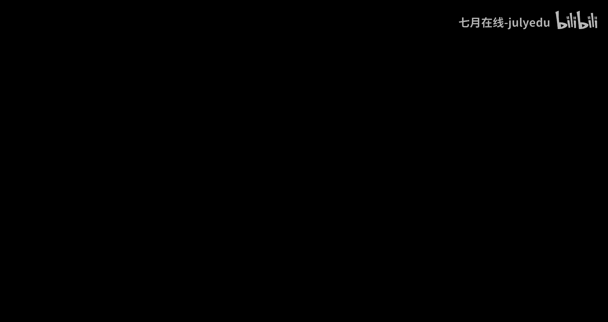

🎼。

OKOK那我们现在抓紧时间开始。呃，今天的直播课呃主要是讲一下图像搜索与分类。呃，那么我现在会把我的屏幕最大化。你这样的话我会挡住我的呃就是对话框。所以呃就是在讲述的时候可能看不到。

然后在呃每一章结束的时候，我会呃会呃打重新打开对话框，来看一下大家的留言，并且解答一下大家的问题。OK那么我们现在开始。

Okay。呃，首先做一下自我介绍吧。嗯，今天我们主要讲的是图像搜索与分类的一个公开课。那么今天我们会从嗯四个top屏入手。

诶。今天4个topic。首先第一个是我会给大家介绍一下什么是卷积神经网络和卷积神经网络主要是干什么的。可以说第一个topic它是呃深度学习在计算机图像视觉分类的一个最基础的部门。

那么在第一步的基础就是在第一步的基础上，我们会在延伸出一个目标检测与定位的一个问题。ok。呃，第三个topic是关于变分自编码器，这个主要是一个生成图像的一个话题。第四个topic是车辆的重识别问题。

车辆的重识别问题主要的意思就是说在一片区域里面找到呃某一个特定的车。那么今天我们会从这四个话题里面跟大家详细的探讨一下OK。呃，我本人做的是深度学习计算机方向。呃，在计算机视觉方向。那么在7月在线。

我主要负责授课的内容也是呃相关的一些呃话题。呃，本人主要是呃在呃美国一所大学里面做讲师是CO丹呃，全称叫呃古拉多 universityrsuniveity of古罗拉多丹佛同时也在MSU丹做大学讲师OK自我介绍到这里。

然后我们开始我们的第一个课题。

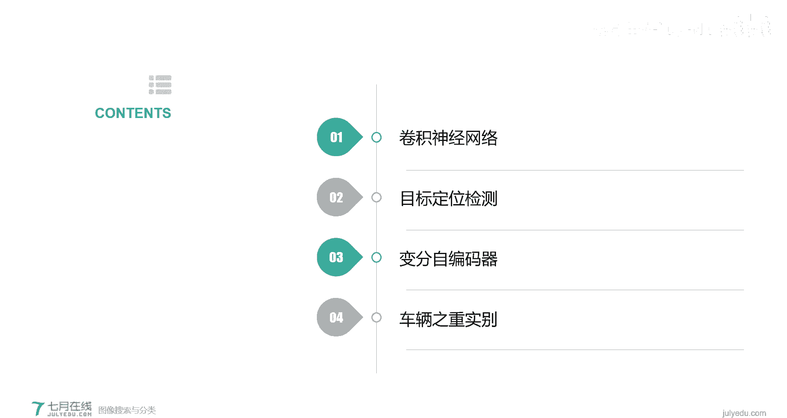

第一个话题。卷积神经网络，它的英文简写叫CNN呃，卷积神经网络可以说是呃图像的一个深度根基，也可以说是深度学习当中嗯。在计算机视觉方向的一个入门。那么卷积神经网络到底是解决一个什么样的问题？

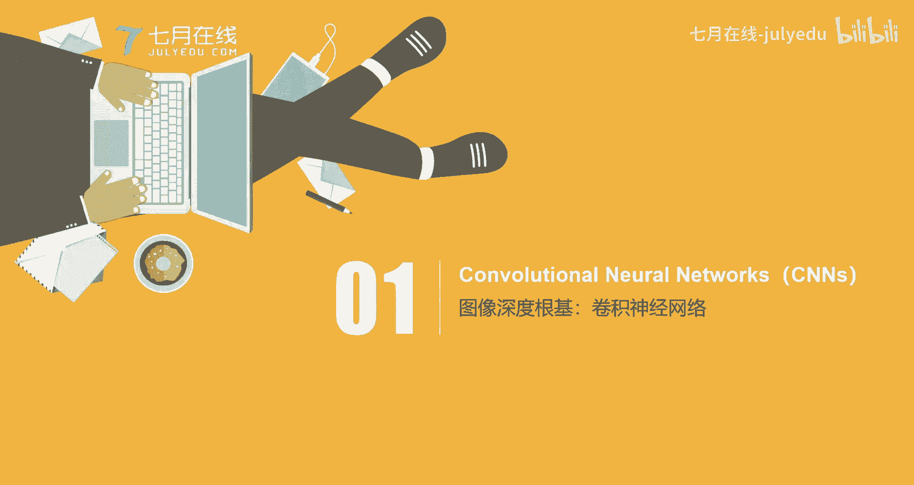

全新神经网络主要是解决的目标识别的问题。什么是目标识别。比方说当我看到一个照片的时候，那么我应该知道这个照片的主体是什么。当然我不 care细节，我主要管它的主体是什么。比如说照片里是一只猫还是一只狗。

或者是是一所建筑还是人。那么这个问题我们统称为分类问题。给大家举一个比较详细的例子吧。这里有3张图片。OK3张图片呃，我们知道这三张图片都是电脑，那么。当计呃我们或者是计算机看到这三张图片之后。

我们想区分出来它到底是什么样的电脑。比方说它是笔记本电脑、台式机、电脑还是平板电脑。那么这个就是一个分类的问题。OK呃，对于人类来说，我们很轻松的就能找到呃。这三呃这呃这三种图片或者是这三个电脑的归属。

比方说最右上角这个是台式机，呃，这个是外星人电脑台式机。那么左面这张图片是笔记本电脑啊，我播了一张华为的笔记本，呃，右下角是呃。平板电脑okK那么对于人类来说，我们是如何对这三种电脑进行分类的。

我想我们首先是找它的相同点，同时再找出它的不同点。从相同点，我们可以知道三个图片都是电脑。那么从不同点，我们可以呃细细的区分它到底是哪一个电脑。找它的不同点，我们比方说我们可以找出来它的大小。

一般来说笔记本电脑大小比较大。然后其次是笔记本呃，sorry一般来说台式机的电脑比较大体积，然后是笔记本电脑。那么最小的可能是嗯平板电脑，关于便携性来说呢，可能是呃平板电脑排第一，然后是笔记本电脑。

一般大家会报着一个台式机电脑到处走，对吧？另外就是说它的形状，它们的形状，我们一下人能看着它不一样，嗯，还有包括它们的材质呃等等吧。那么人类是通过这些显著的特征来找出它们的相同点和不同点。那么问题来了。

对于机器来说，嗯，机器它无法得知它的形状、材料甚至便携性，对吧？那么机器首先机器当用它用摄像头捕捉到这些图片的时候，它是怎么样进行区分的呢？那么我们就要提一个东西了。机器靠的是找特征。

这个特征在英文翻里面找feature，有哪些对于机器来说有哪些feature呢？比方说第一个颜色特征。呃，对于颜色来说，呃，我们眼睛看到的是一个颜六色的器载世界。呃，在计算机视觉的角度来说，呃。

人们会把这个各种颜色进行分类，用数值表示。呃，比方说我可以分成RGBRGB的意思是R是red红色，G是green，B是 blueue。就是说红绿蓝通过这三种红绿蓝来组成各种各样的颜色。

那么还有一些其他的分类方法，比方说通过呃像右图的这种嗯像饱和度饱和度的值，还有色素等等。他们通过另外一种方法来分类。那么这个就是颜色特征呃。一般来说。这个分类就对颜色来分类，不管是用什么样的方法来分类。

它主要一般来说都是三维的OK这是第一个特征。那么第二个计算机视觉方面特征，我们比方说有形状特征。举一个例子，这是一张建筑的图片。在这个图片上，我们可以找出来哪些形状？比如说这是一条线。这儿存在着一个角。

那么这一块是一个嗯可以说是不规则的西形吧，我们统一把它称为结构。那么这些东西它就违规为形状特征。好，还有一些特征，比方说纹理特征，纹理特征像这个事例呃，左面和右面是一个不同的纹理，它们在大量的重复。

这个也是呃计算机视觉方面的一个特征。当然还有其他很多很多的特征。那么机器它通过摄像头捕捉到的图片，在这个图片上找到这些不各式各样的特征，通过低维特征，然后组组装到高级特征。

那么这个过程就是计算机呃来呃对图片进行分类的一个嗯过程。OK。OK那么话说到这儿，那么我们知道了卷积神经网络或者是CN它主要的作用就是目标识别，或者是可以叫做呃目标分类OK而且我们也知道。

CNN主要是通过捕捉到一些计算机图像之后，然后分析图案上的特征来进行判别。我们现在看到的这张图片，它其实是有两部分组成呃，左面。红色框圈出来的是一个呃CN的一个最基本的结构。呃，右边的那一部分。

它其实和左边的部分基本一样，只不过是一个是2D。我们看的是2D。另外的右边呢是我们是画成一个立体的。其实它俩是一样的。我们看一下它里面具体想做什么。好，那么对于一个CN来说。

它主要有三部分构成输入端输出端。那么我们把中间的那部分叫做隐藏隐藏层叫 hiddenden layer。对于输入来说，我们可以认为输入一张图片，然后输出呢输出这块是决定我们有多少个小的分类。

比方说我如果呃拿之前的例子例子来讲，三种电脑。那么我们就可以认为它的输出有3个笔记本电脑台式机电脑和平板电脑。OK这就是输入端和输出端，在输入端和输出端中间的部分，我们统称为隐藏层。

隐藏层的层数可以是由人为来定义的。好，那么。隐藏层到底是做什么的？隐藏层它主要的目标就是找出各式各样的teacher，就是找出各式各样的特征。呃，越靠近输入端的那一侧，我们就称它为找出来的特征。

称它为是低级的特征。越往后靠近输出端的特征，我们可以称为它为高级特征。

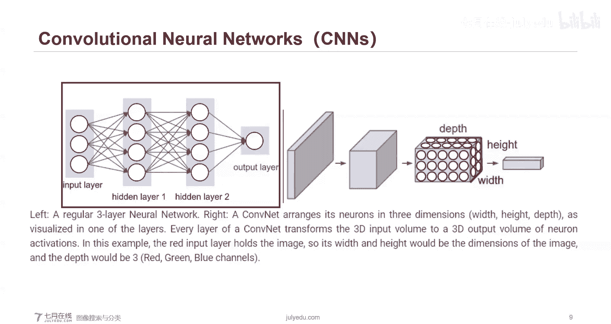

我们看这张图，在这张图里面，从左往右看，最左面是一张轿车的图片。那么轿车的图片那就作为一张输入，最右面呃，我们可以看到就是有5类，也就是说输出端它有它可以有5个输出。第一个输出。

我是来判别是不是轿车的第二个输出我判别是是否是卡车。第三个判别是否是飞机。第四个轮船，第五个是判断是否是马。那么在这张图片的输出，我们可以看到呃，卡就就是car轿车所占到的那个绿色的那个比例是最大的。

那么这个面积就绿色的面积，我们认为是它的一个概率，它的面积最大。那么我们就认为这张图片是轿车的呃，概率是最大的。OK那么这张图片给它一个标签，就说。这张图片是轿车。

那么这个就是输入端和输入端中间的那些部分，我们可以看到，就是上面当然也显示了，比如说count呃卷积层热落的一些激乎函数，包括布等等这些东西，我们我们把它统称为是隐藏层。那么从第一遍到最后一遍。

我们可以看到这些所输出的就是它的每一层上可以找到的特征。OK那么。隐藏层中间具体的com原路或破，它到底是什么意思呢？呃，我们接下来会一一给大家演示。那么现在我们从输入层呃输入层入手。

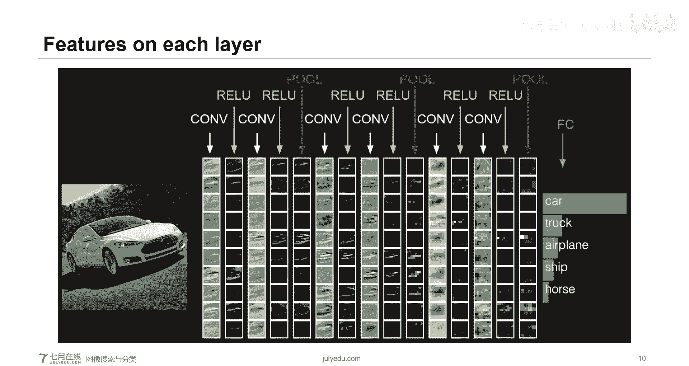

对于任何一张图片来说，我们可以把它考虑成为是一个三维的数据，或者是三个通道。一般来说我们拿红绿蓝来说吧。对于一张图片，它其实是有三层组成的，第一层是红色的考量，第二层是润绿色，第三层是蓝色。

那么对于每一层它会有一个数值，这个数值会分布在如果是整数的话，会分在0到255之间。如果是小数的话，会分布在0到1之间。当这只是分就是区分的不一样。其实它的道理是这样的。那么我们现在考虑从整数来分。

从0到2255。嗯，每一层的每一个小小的格我们称为一像素。那么对于每一个像素来说，它都是占一个值，当三层的三个值加起来就是该像素的所代表的颜色，它到底是红色还是其他什色。如果是纯红色的话。

那么我们认为它的这个像素点是2550和0，这两个零意味着在绿色上面是是没有颜色，在蓝色上面也认为没有颜色，所以最后的个颜色合起来只有一。255哦，这是举的一个例子。那么我们现在已经明白了一张彩色图片。

它是由三层组成的OK。对一张彩色图片三层组成，我们就认为这三层就是一个三维矩证，就是我们可以认为是W乘以H乘以3W的意思是宽H是高。那么三就是我这个三层三通道。那么对于呃CN来说。

它最重要的就是我们叫和就卷积核。什么是卷基核。卷积盒的意思就是说呃换一种说法，就是说呃它是一个。过滤器OK是一个filter，是一个过滤器。在这里我们可以看到我有两个filter。

那么左面的呃filter它也是三层的。我们就认为这个呃filter的层数是三层filter，就是三层过滤器。呃，它是一个3乘3的过滤器，因为长是3，宽也是3，然后它的合数也是3。嗯，在这个过滤器上。

我们可以看到呃，它的对角线全是一，其他地方是-一。那么我们就可以说这个过滤器主要找的是在一个3乘3的一个小区里面，我找一条斜线。OK这个就是第一个过滤器。那么我们看第二个过滤器。

第二个过滤器也是3乘3乘3的，它最左面的一列和最右面的一列是-一，中间的一列是一。那么我们就可以想象这个过滤器主要想找的是中间有没么有一条竖线OK那现在大家应该明白了。

就是卷接盒的作用就是我在一张图片上，我就是搜我有没有我指定的东西，我可以指定找一条斜线，对角线斜线也可以找一条直线，甚至我可以找一个角，找一个圆等等。那么使用不同的过滤器。在一张图像上。

我从左到右再从高到低全部扫一遍。那么我就可以把。整张图片上面的各个的特征先找到，大家注意啊，这个找到的那个特征是我预先定义好的。从哪定义呢？是从过滤器来定义的OK。我们以这个图像为例。

它图过滤器可以是W乘以H乘以DD的意思就是dap就有多少层。当然在这个例子上是30呃，过滤器3乘3乘3。那么对于每一层，我有每一个不一样的过滤器，在不一样的过滤器，我对它进行做卷积。

OK卷积的意思就是说我对应比方说呃，我们拿中间这个来举例吧。中间这个蓝色的区域，它可就浅蓝色区域，它可以是就是图片上的一些像素值。那么我拿一个过滤器，这是个绿色的过滤器。就是说我扫一遍。

然后每一个对应的像素相加，然后会出一个值。这样的话我就找到了绿色的这个过滤器在某一个区域的一个对应的值。同样红色过滤器扫一遍，蓝色过滤器扫一遍。那么我在每一个小的区域我都有一个值。

我把这个值全部放在一个新的矩阵当中。大家可以看最右下角一个output输出，这是新的一个呃举阵。那么对于新的矩阵就是我最后转机所做出来的呃一个结果的一个值。那么嗯看到这里我们呃想说两个东西。

第一个东西叫做padding就是填充。第二个意呃东西叫做stride，就是步长。具体是什么意思呢？我们还是以这三张图片为。OK我们拿这次拿红色的来举例吧，我们可以看到红色的正在从左往右滑。

然后它滑的时候有一部分是有数值的。比如说156、153甚至1148、158等等。那么这些有数值的都是真实的图片上像素值。那么在这个的最左面和最上面它都是零。大家注意啊，这个零。

它并不是本身图片所有的像素，可以说它已经超出了图像的范围。但是我们仅仅是把它做一个填充，填充的目的就是说呃我想从头到脚全部把图像扫一遍，不放过每一个像素值。大家可以想象。

如果没有最外面就是扩充扩充出去那一层。那么他找到的第一个，它其实是从第二列或者是第二行来找到的，这样的话就会漏掉了最外面那一圈的像素值。所以说这是填充的一页，那么步长。我们看一下吧。还是拿这个例子来说。

这个更直观OK填充在这个例子当中，填充是一步长是一填充等于一的意思就是说我在这个蓝色区域，就是我正式图像的外围有扩出去一个像素值横的扩出一个像素呃，纵轴再扩出一个像素，所以这叫填充为一。

那么步长为一的意思，就是说我每一次大家可以看到我有一个呃这应该算阴一个阴影处吧。我在这张蓝色图像上，我一直在扫。那么我每次扫我只扫一个像素值。那么我就认为步长为一，当然我们也可以做到把步长设置为二。

就是说我的这个过滤器就是阴影部分，我每次走两个像素值，它的一个好处就是说我可以加快我的这个扫描的就是进度，就就是一个加速的过程。呃，当然他如果你把步长设置的特别大的话，它有一个问题，当你的步长特别大。

你容易忽略到一些细节。所以一般来说需要平衡好步长。嗯，的这个数值。ok。讲到这里，我们明白了什么是填充和什么是布场。那么我们下一个问题就是说。经过卷积层以后，我仅仅得到了就是图上的。

大家可以看到这个绿色的区域。那么得到它之后，我要经过怎么样处理的？在这个。CIN的一些科研上，大家会把这下面这一层叫做池化场孤林类池化者，它是什么意思？就是说当我通过卷积核在我的图像上扫描一遍之后。

得到了这些数值，我要进行一些呃区分。大家可以看到橙色的区域。呃，是我原始的图像。橙色区域上有一个阴影部分，这就是我的卷积盒。然后大家看到的绿色的区域。绿色的区域就是说我通过这个卷积核之后。

我得到的一些数值。那么得到的一些数值。大家可以看到绿色区域上还有一个阴影部分。当然这个阴影部分所对应的就是我最后呃我的那个橙色真实图像上阴影得的所做过卷积以后得到的值。

OK那么在我得到绿色阴影部分的时候，我我一般来说我们会再做一步，就是说找到这个。某一小片区域里面的一个我想要的东西。比方说大家可以看到右边。这是1个4乘4的一个矩阵，这个4乘4的矩阵。

就是我们通过卷积之后所得到的一个矩阵。那么在这个矩阵当中，我分别呃我把这个矩阵分成了4块，我对每一块，我可以找它的最大值，我也可以找它的最小值，对吧？那么找到最大值意思就是说我可以去到一些细节。

我我不care，我只找到它最突出的那一部分。那么比如说最大值呃23、112、30sorry最大值在红色图像上，就是红色区域中就是左上角它的最大值12820和12，最大值是20，那么我把它记录下来。

再往旁边，黄色的那个区域当中最大值30。第4，我找到了4个最大值。那么我首先我把这个呃我的运算量我减小了。我从44乘4我减少到了2乘2。同时我也找到了在减少过之后的那个所要的细节。

这就是混理层所要做的事情。那么我们可以把呃前面的卷积层和紧接下来的磁化层可以统分为第一层隐藏层。然后继续往下，我们可以重复好几次隐藏层。那么在每一次隐藏层结束之后，我们都会找到一些它的图样的特征。

说到这里，大家可能在想嗯，我经过这么多步的处理，其实得到的仅仅是一些数值。那么它这些数值我知道它是像素，那么它到底代表什么，或者是我们能看到它是什么的。好，我现在告诉大家答案。

大家可以看到这个是201应该是2012年吧，2012年他们就是科学家所做出来的呃一个神经网络。这个当时的效果是最好的，它的神经网络叫做alexn。呃，在这个网络当中。

我们现在看到的这张图片就是在第一层隐藏层之后的一个一个可以看到的一个结果。那么我们可以看到，在最左上角，它好像是找到了一条斜线，但这个斜线是一条深色斜线，在它的两边是两个浅色的斜线。嗯，在。

我们也可以看到，在最右下角，我们右下角往上，它有一个呃这个叫。这个颜色应该叫。我们可以叫它呃，比如说二红色或者是不好意思啊，我也不知道这个美妆叫什么色。就是说我们找到了这种颜色，就等等。

我们可以看到这是第一层第一层所找到的都是一些比较低级的一些特征。那么好。经过五好几层的重复之后，大家注意每一层的这个呃filter或者是过滤器，它的那个都可以是不一样的。大家千万别要走。

当然你也可以设成一样的。但是一般来说我们都是让电脑随机生成的。我们可以看一下，经过5层之后，feature是什么样子。在这张图片这张图片同样是alexnet呃卷积网络所做的。那么在经过5层之后。

可以看到第五层，我们已经可以很明显的看到它已经具备了很多图像的特征。比方说对左上角嗯很明显的是一个小孩，然后我们也可以看到在。呃，第二行的最右面这是一只狗等等。那么这个CNN这就是我每一层输出。

我想要得到什么？OK呃，这个主要就是CNN的feature。我们总结一下。在卷积神经网络，它主要有哪些东西？首先我有输入最左面输入呃，这个输入。呃，是可以设一张图片，然后最右面是输出。

输出是分的分的类别，你有几类，我们就可以设置成几个输出，五类就是5个输出。OK中间的这块我们统一称作为隐藏层。那么隐藏层，我们看第二个吧，就是第二列。第二列卷基层。

然后紧接下来是它的石化层O池化层之后呃又有两个，我们可以看到是两个就是竖的那个好像以圆圈表示的。第一列是588乘以一，就代表着95588个，呃，可以说这是应该算一为向量吧，然后紧接着是20乘以1。

我们把这些统称为呃全连接层，就是什么意思呢？就是说我把前面的所给我的输入，然后它可能是一个三维矩阵，那么我把它全部呃展开，就是拉平，所以它这有时候大家也知道我们叫flatten。

就是使它呃就是拉平拉成一条线。O我们把它拉成一条线，就是说比如说前面是14乘以14乘以3，我把它全部展开变成588乘以1，然后再往下展开，变成右边又缩小到了20乘以，最后我可以做成到5乘以1。

因为我们用5类，所以我们变成5乘以1，然。然后我们可以训练这个神经网络。训练的神经网络的意思是说，我有一张输入。同时我知道注意啊，我已知它的输出是什么。比方说我这张照片是猫。

那么OK我最后知道class one是猫，那么它的概率应该是一，其他的概率应该是零，或者说class one猫的概率非常大，其他的那的概率非常之小。那么我们经过不同的训练，不同的训练嗯，就不停的训练。

使得最后我的网络牢牢的记住了，我给一张图片，是猫的图片，那么我的输出就是一给狗的图片，我输出就是2。那么这个过程我们要训练过程。当训练结束之后，我们拿我们把输入去掉。因为注意我输入的时候。

我是已知道我的这张图片是猫的。当我测试的时候，我拿一张其他的我从来没有见过的一张陌生的图片。那么我们把陌生的图片丢到这个神经网络当中，还是做同样的输入。那么它只计算一遍。如果我们的网络训练的比较好的话。

那么它可以知道这张图片的分类，它应该是猫是狗还是其他的动物OK。另外大家要注意，在卷积神经网络当中，我的呃测试的时候，如果想得到准确的东西，就准确的分类，那么我们必须得是让。就是已知类，你训练了猫。

你才可以进行猫的分类，你训练了狗曾经行狗的分类，对吧？我们不能说我训练了一只猫呃，猫的分类，然后让计算机去看一张计算机一个鼠标的图片。那这下的话，这个实际网络就凉了。当然这是CN的一个呃缺点吧。

科学家针对此也做出了其他的一些呃就是改进。比方说ze short learning零度学习零度学习，它主要就是说我看一张图片图片，然后我通过分析得到它的一些特征，可能这张图片我从来没有见过。

那么我通过一些已知的我曾经见过的一些类。那么我把它归到一个新的类，就比方说斑马是怎么来的，它可以是呃斑马线加上一只正常的马，就是斑马，这就是零度学习。O在这个地方呢，我们扯远了。

我们还是回来看卷积神经网络。我们看一下比较几个非常著名的卷基神经网络吧。第一个是2012年的卷积神经网络，它总共有8层，它的名字叫alexn。它的识别率可以达到就是错误识别率可以达到16。4%。

它仅有8层，在两年之后，谷歌出现了VGGVGG也是转机神经网络的一个名字。它最高可以到19层，这个时候它的误差率进一步降低，降到了7。3%。呃，同年2014年。

谷歌又做了另外一个手经网络叫做googlenet。呃，它可以达到22层，它的误差率也在一步减小。降到了6。7%。15年的时候，科学家做出了1个152层，这是一个自的飞跃。

它从之前的呃很就是大概时候看一下啊，就是8层19层、22层一下飞跃到了152层。但是它里面有很多的窍门的。这个时候它的误差率也降到了3。57%。在最近的是17年17年的时候。

科学家做出了一个dancen。它可以达到惊年的264层OK当然它的误差率也在进营无下。嗯，是否是层数越高，又或是层数越深，那么它的效果越好。所以答然是并不一定。在14年到15年的时候。

虽然有一次质的飞跃，但在做出这个之前，科学家发现在不采取一些其他方法的时候，层数非常深的时候，可能我们根本就训什么都训练不出来。大家注意想知道到底是就是增加了什么样的方法呢？大家可以有兴趣的话。

可以查阅一下，就是什么是呃15年这个残插网络，大家都可以也从那个里面知道是如何用残插网络的方式来克服的。主要是因为这个并不在我们今天的投论范围之内，所以我就不给大家过多的展开了O。呃。

到这里大家可能有一个问题。呃，这么深的神经网络，比方说264层的神经网络让我来写，那么我需要一层一层的去写，或者是里面的所有的过滤器，我一个一个来写嘛。呃，答案当然是说你可以这么做呃。

这么做的好处是你会把所有的底层了解的非常清楚。当然一般一般人不会这么做，因为太费事了。在现阶段有很多比较著名的开源的深度学习的框架，方说sorflow最火的，我个人认为啊最火的有or floor呃。

当然还有一些其他的比如说呃trainer微软的CNTK等等。这些东西都是已经搭好的框架。那么我们所用的就是说把调这些库O by the way就是这些库全部是基于thon来的。就是说如果想学好深度学习。

那么第一步也你需要就是掌握一些最基础的。就是呃python它的应用非常广，那么也导致它的分支非常多。你比方说我们可以做爬虫，我们可以做呃文档的一些处理等等。所以说在此我只想说。

大家只要具备最基本的python知识即可。呃，然后根据自己的兴趣，然后慢慢的再走一些python的高级编编程O。那么有了这些框察之后，我们仅仅每次只需要呃调它起这些库里面的每一层。比如说转移层。

它就叫com呃，石化层就叫铺。我们只要调过来以后，对于里面的所有的呃过滤器，没有必要自己一个一个亲自去定义。你所做的主要是告诉我呃，告诉我这个系统，你想要多少过滤器，然后你过滤器的呃大小大概是多少。

大小就是几层几，那概大概是多少。然后这个然后系统会自动帮大家生成一些随机的过滤器，然后再不停的去找OK。好，讲到这里以后，我们给大家聊一些比较好玩的事情吧。我们看一下，这是我的一张照片。

这是很正常的一张照片，有风景，有人。然后我还有另外一张照片，这是梵高的一幅画，然后这幅画就比较抽象了。那么我现在想干的事情就是说我想在我自己照片的基础上做出梵高的效果。O我们看一下最终结果。

这就是最终结果，呃，首先我们依然能大概的分辨出这是有风景有人。同时我们也能知道，呃，这里好像有梵高的那个艺术的感觉在里边，我们把这个称为deep dream深入梦。我们看一下他大概是怎么样实现的吧。

还是那句话用CNN来做，就是转基神经网络来做给我一张图片，然后我可以把这张图片改造成一个呃有着就是非常著名的一幅画的那个特征的图像。我们看一下它怎么去实现的，左面是一个正常的照片，右面是梵高的图像。

那么我这个时候会有两个卷积神奇网络。通过这两个卷积神经网络，左面的需要学习的是照片里面的内容，右面需要学习的是这张油画的一些风格。大家注意啊，学习东西不一样。但是不管是内容还是风格。

它都是它都是一些呃特征。当我学习到以后，我会输入到一个新的卷神经网络当中，把呃的呃内容和风格相统一结合起来，最终输出一张具有梵高风格的我的一张照片。哦，这个是一个非常好玩的。

再次也就是印证了CNN它有一大特性，就是说我们可以通过CNN的一些藏来学习到样的一些特征。CNN在到底它还有什么样的应用呢？毕竟这个生成一副带有油画风格，自己的照片是一个比较怎么说呀？

就是一个很娱乐的一个东西。那么我们看一下呃CNN就或者是深度学习在计算机视觉方面一些主要的应用。第一个应用是。呃，目标识别大家可以看到，这个是上班打卡或者是上飞机打卡工作的朋友应该知道。

以前我们可能是呃签到之后，我们就变成了刷指纹，就刷指纹其实挺麻烦的。而且每次都进入这个指纹机，手里搞得很脏。那么。呃，头像识别的话，我完全不必要接触，我只往他面前一站即可。

包括大家手机上的那个faceID呃，解锁，它道理是一样的，这是第一个应用。第二个应用目标检测。大家可以看到，在高速路口当中，我们架一个摄像头，在摄像头我们可以捕捉到的画面里面。

我们找到了呃有些找到首先找到一些汽车，偶尔会发现有人出现，同时对于这个汽车来说，我们知道哪些车在运动，我们就绘制出来它一条运动轨迹，哪些车一直在动，这个时候我们就能明白OK这个地方应该是出车祸了。

因为有些车一直停在那里，就是趴窝了。如果突然出现人的话，也可以意识到这个地方有问题。高速路口怎么能突然突然出现行人呢？这个就是目标检测的一个应用。

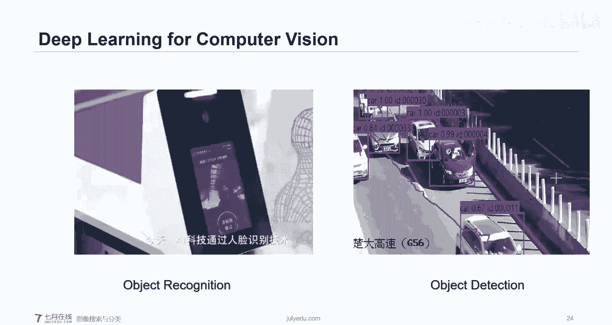

呃，第三个应用，这个是面部识别，面部识别现在应用也很广，尤其是在这次抗击呃肺炎的战役中，嗯，在机场或者是地铁站等一些人流密集的地方。然后呃科学家可以架设一些设备。通过不接触。

同时快速筛选的方式来很快的定位到哪一位乘客，他的体温过高。注意啊，这个是不接触的。同时而且是快速的。曾经的传统的检测方式是拿一个温控枪，让就是扫一下呃被拍摄者的额头，然后得到分。这样的话。

在大密集的人群当速度非常慢。但是深度学习可以做到就是说我仅仅一个摄像头架在高空，我扫一遍人群，我就能快速定位到这个患者在哪里。还有一些应用，比方说人体自带估计，这个我给大家播了一个。呃。

体育上的一个应用吧，这个是板球。然后我可以快速的精准的定位到板球运动员的主要的一些关节点。比如说他头头手，他的肘、膝盖等等，通过分析他们的呃这些关节就是关键点。

然后我们就可以知道这些呃板球运动员他的姿势呃规范如何呀，或者是输赢呀或者球在哪里呀等等一些信息吧。呃，关于人脸的检测和。呃，人体骨骼点的检测，我们可以把它统称为呃关键点检测呃。

key point detection。在5月9号的时候，就是个星期六吧，就是从5月9号开始，7月在线会单独开设一门课程的个关检检测。它包括了一些主流的一些算法。

这个如果大家就是具备一些python的基本的概利技能，如果你对此感兴趣的话，欢迎大家到时候来关注ok现在这个广告还没有铺出去，不过很快就铺出去了。我们再看下一个应用。这个是生成一些图像。

那么生成图像的时候。呃，这是奥巴马和普欣在说话。大家注意啊，这个并不是真实他们在说话，而仅仅是用深度学习的方法来呃模拟出来的。当然我们看的时候，他们非常像真人在讲话。下面一个应用比较非常有名啊。

这就是无人车。也是通过一些雷达或者是摄像头，我们来判断我们现在车辆的周周边的信息来执行下一步命令。我是该左转右转减速还是加速等等。

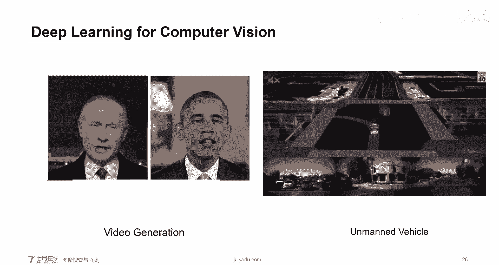

这个应用叫做去马赛克啊，去马赛克的话就是说有图像有马赛克这的，然后把将它去掉。这个应用是图像翻译。呃，如果有手机的话，我们当遇在国外遇到一个路牌，我们拿摄像头去照一下这个路盘。

那么呃手机会直接把路盘上的意思，比如说英文它翻译成汉语，或者是把呃德语翻译成汉语等等，这个也是一个非常方便的应用，它不需要你再打开，比如说有道词典呀，或者是金山词典，然后手写输入，然后再在那个得出翻译。

那么这些东西就是呃很便利的。OK这个就是我们第一个话题所要聊的。我现在退出一下我的这个换文篇，然后我看一下大家有什么问题。

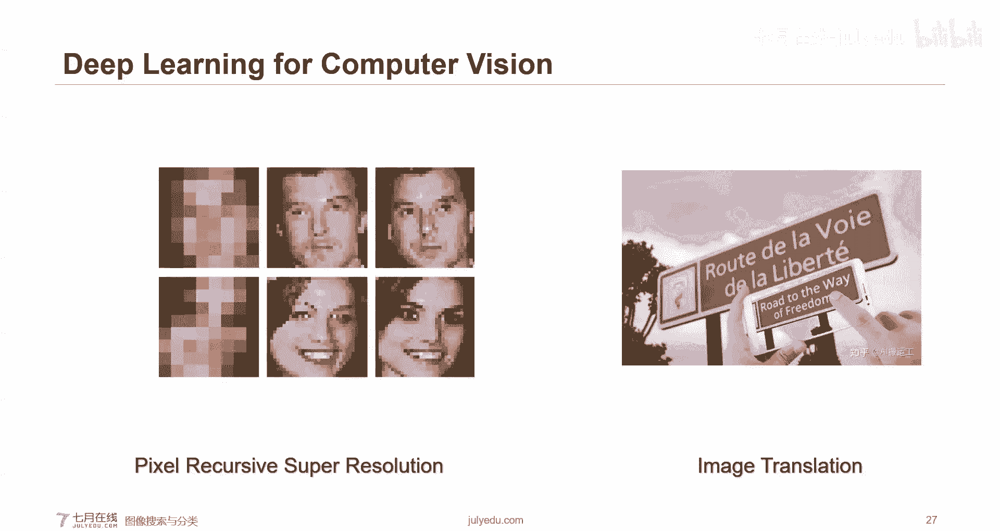

呃，从低级特征到高级特征是否是因为感受也变大呃，这个并不是啊就是这个感受也变大。可以就是认为就是说先说一下什么感受野吧。可能有的同学呃感受也不是特别呃特别明白感受也，你就可以简单的想。

你就可以是认为这个卷积核的大小，然后感受也变大，它并并不影响次否从低级到高级。大家注意从低级到高级，我们的说法的意思，就是说呃从第一层第二层第三层随着层度的增加。

我们就可以看到在初始那些层是一些非常低的特征。比如说要直线一个拐弯，一个圆圈，然后再过渡到下一个下一层，下一层可能是通过直线或者圆圈组成的。一直到最后比如说五层六层7层，他们所得出来的。

我们看到的可能是一个轮胎一个方向盘就等等吧。这些就是这个叫高级特征，就是。层数越升，特征越高级。这门课代码有拍套这个版本吗？呃，拍套的话对呃。居然那个叫关键点检测，我们会专门针对拍到式来就是进行训练。

我们到时候会有呃7个实战项目。那么每一个实战项目我们都主要是针对拍套式，当然你也可以用其他的一些框架，这个都是可以的。deep dream和syle transfer是一样的，还是说法不一样。呃。

风格迁徙和deep dream它有就是共同的东西，它也有不一样的东西。呃，如果大家去搜索这个deep dream的网站，其就只比如说直接在百度或者主播上敲deep dream。

它你就可以在他的网站上上传一张图片syle transfer就它的意思就是说我学比如说我先学了一个图像的呃梵高的一些特征。然后我在学习比加索的一些特点，它这个主要是reyle。

而deep dream它是既学习一张图像上的一些呃就是内容，同时又学习另外的一块的一些风格，然后将其组合起来。我给大家还有其他什么问题吗？没有问题的话啊。canf和拍值选择哪个比较好啊。对。

其实最开始我们也经常面对这个问题。canther floor是呃google做的，然后拍到时facebook做的。呃，不能说哪个比较好吧。呃只能说哪个更适合于就是那个项目，但家要注意啊。

就是你选择不同的框架，选择不同的框架，然后你会发现你训练的时候，它会有些微小的差异，拍到时的出现比canf晚。呃后拍到现在特别的火，真的特别的火。呃，一般对于我来说，我虽然不能说它哪个更好。

但是我可以告诉大家就是说一般我会选选择拍到时来就是呃解决我的项目。ok。还有其他问题吗？OK没有其他问题的话，我们继续我们的课件，我们进入第二部分。

嗯。第二部分主要讲的是object detection，就是目标检测，也可以叫目标定位检测。我们先看一下，从目标识别来说，因为目标检测它是基于目标识别的，在深度学习领域上的呃往前走了进一步。目标识别。

它主要是找一个分类问题。比方说我在这张照片当中，我想找到它是什么？OK我们知道它可能是狗唯可能是小孩。那么我们目标 detect就object detection目标检测它在分类目问题的基础上。

它同时在做一个定位问题。

比方说在一张图片上。我把我所找到的对象，我用嗯矩形框我圈认出来。那么我知道左面黑色的框，它指的是一只狗，然后右面紫色的框，它指的是一个小婴儿。那么这个就是目标检测所要做的事情。

分类加定位OK这也是为什么我们说目标检测是在目标识别上又往前进了一步。

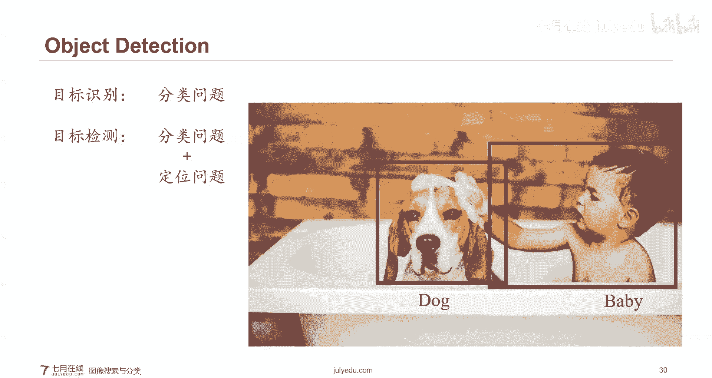

我们看一下呃以这个例子来举例吧。这个例子它本身是一个主拍的建筑物，在建筑物蓝色的那片是一个游泳池。那么当我想找到游泳池的时候，我拿一个绿色的框把它圈住，这个就叫做目标检测。而目标分类是我只能区分出来。

这是一个建筑的图像清楚。在传统的就在深度学习没火之前，传统的方法找到这个游泳游泳池。它主要是我在这张图像上，我拿一个固定大小的划窗，就是那个绿色区域，我从左到右从上到下我全部划那么一遍。

然后我每次划一遍，我就我都用比如说分类的方法，我找一下里面是不是有游泳池，这个就会带来一个很大的问题。我们的被找的对象，游泳池，它的大小不确定。那么你的滑窗可能过大，也可能过小，对吧？

而且这个速度非常的慢，因为游泳池只出现在图像的某一个角落，但是传统的滑窗它会把整个图片都找不遍，这样会浪费时间。那么我们看一下现在的奥布加迪达的目标检测，它有哪些方法。

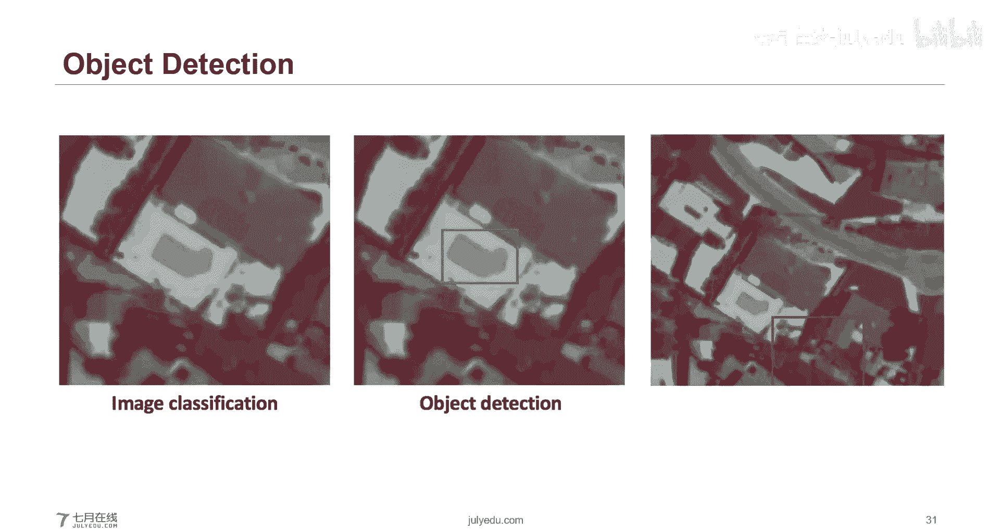

で。现在主要的就是目标检测，它会有两个流派吧。它这个两个轮换是根据它我们叫做呃stage，就是呃阶段的数量来定位。比如说two stages或者是one stage，我直接把它翻译成了一刀流。

就是one stage，wo stage就要两道。当然这个是我的个人翻译啊呃。那么我们看一下在不同的流派里面，它主要流行的一些算法，我给大家做了一个是就是列了一下。

从呃咱们先说to stages吧从最开始的CN一直过渡到现在的ma可以说这个是CN加族CN就是说R的意思是gion区域后面就是CN转神经网络。然后从最开始的区域转神经网络到快速，然后再到更快。

然后现在到mus然后E到它所一些主要的一些算法。比如说SSD意思就是说我只查一次呃sing short现在已经到了第三个版本的意思是你只看一次由 only那注意啊，我给大家说一个八卦。

这个Ulo的这个发明者。优乐之父吧，他前一段时间就宣布他要退出计算机机要这个领域的。原因是因为美国政府他利用这个计算机图像，他总是把他这个方法用入到军事上和孕育到就是安全上。

所以他就奋上而然的退出了这个计算机视觉啊这八卦了。我们再回来。呃，最新的一个也是我非常喜欢的一个呃one stage的一个方法叫做concon。它主要就是我找两个点，嗯，然后就来定位这个区域。

当然这个呃具体的一些算法，我们会在就是之后开一些开设一些课程来给大家告诉大家看里面的细节是什么？同时怎么实现。在今天的公开课的最后我也会告诉大家有哪些课程比较适合大家OK那么说到这里。

大家可能可能会问同样是目标检测，我为什么要分成，按照它的阶段来分这个阶段到底是什么意思。OK我们先举一个例子吧。这个就是我们先拿第一个就是二呃二刀展，就是说两个阶两个阶段，它所谓的两个阶段。

我们拿faN这个来举例。首先大家注意啊，两个阶段其实我这有三个阶段。当然这三个阶段为什么我们老去掉第一个阶段。第一个阶段它就是输入一张图像，然后通过呃一个卷积神经网络来得到它的那个feature。

大家注意这一个阶段，它不管是呃任何的呃呃faN就是to stages还是说one stage的算法，它都要经过这一个步骤，所以这个并没有什么好说的，而且这个就是卷积神经网络。

后面的wo stages会再加两个阶段one stage再加一个阶段。那么我们这也是为什么我们说目标检测是目标识别的一个再往前进，我们看一下to stages是哪两个阶段。第一个阶段，它我们把它甚叫做。

它的意思就是说会找到一些候选区域。然后第二个阶段就是最后一个阶段，我会在这个候选区域上面嗯，什么是候选区呢，可以说我感兴趣区域，就是说在这些区域当中疑次存在我们的目标。

拿前面这张建筑物来说我在这些框框之中有一次可能存在游泳池。当然也可能是物检测，但是不重要，通过候选框，我们就可以缩小缩索范围。那么最后一个阶段就是第二个阶段就是大家看到这个绿色区域，在我这些候选区域。

就候选框当中，我再进行一次精确的分类，把游泳框就游泳池找到。那么这个就是fa达这尿错了。诶。这一个是它的一个基本的框架构成，我们也可以看到。首先第一步红色箭头指示给一个一张图片。那么我们经过。

我们经过一个卷积层，就是卷积神经网络，然后得到它的feature。然后第二阶段从嗯这一块我们找到它的候选区域，就是我疑次在这些区域当中有着呃被检测被检测目标的区域。第三阶段就是最上面的这一部分。

在这些也候选方当中候选区域当中，我找到我需要的东西。那么这个就是。two stage的过程。那one stage呢。one stage首先它还有个最开始的，我们可以叫做第零个stage吧。

也是一张图片进来，通过一个转机实经网络找到它当中的一些呃特征。然后对就我们只有一个区域叫做det generator，就是我直接我就把最终的那个我的目标定位找到。那么大家想一想。

two stage和one stage的方法主要的一些区别是。to的方法，比如说刚才我们说的那个RCNN的这种系列，它主要思路就是先我先通过一个转机神经网络产生一系列候选框。

然后再对这些候选框进行分类和回归。OK那么to的方法，它的优势就是它我的准确度一般来是比较高。那我们在想到那个one stage的方法，比如说刚才提到的o或者是SSD。

那么这些方法它主要的思路就是说呃我不不再去浪费时间找这些互选框的。我直接均匀的在图片的不同的位置，我进行密集的抽样。大家注意啊，这个抽样并不是呃并不是随机的。我抽样的时候。

我会提前就是设置一些我这个抽样框的一些我的尺度，或者是我个长宽比，它可能是1比2，这是一个矩型，也可以也可以是1比1一个正方形等等。嗯，然后通过然后利用CN提取特征之后，我直接进行分类回归。

那么这个过程只需要一步。那么在这里。我们又可以找到了one stage，它的最大的优势是速度非常的快，它的速度会可以说是完虐这个to stage的方法。但它也有一个问题。

就是说你这个均匀密集采样的一个重要缺点，就是训练时比较累，呃，主要是因为正样本，副样本不经营不均衡。什么是正样本，正样本就是我们的想找到的呃那个目标副样本。比方说这是个背景，对吧？呃。

所以一般来说注意啊，一般来说，one stage的准确度稍微低一点，tto stage的准确度稍微高一点，但是one stage的速度非常的快。当然现在也会出现就一些新的情网。

它会就是结合了one stage和to stage的所有的一些优势。然后它的速度也快，准确度也高。呃，我们看一下呃一个效果吧，我给大家播一个就是优loV3的个效果。

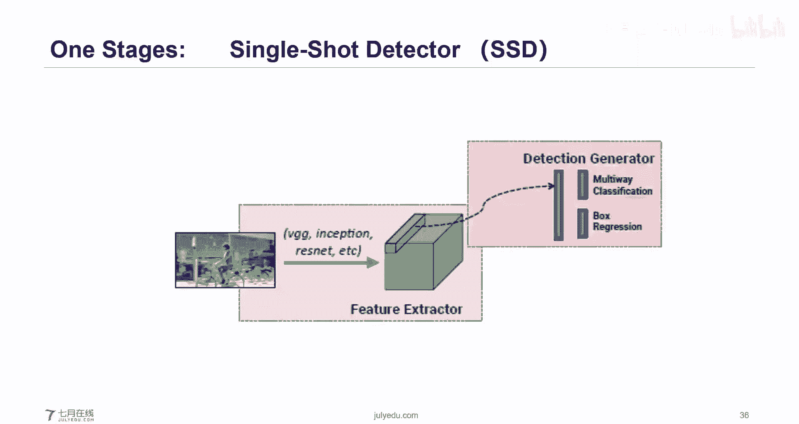

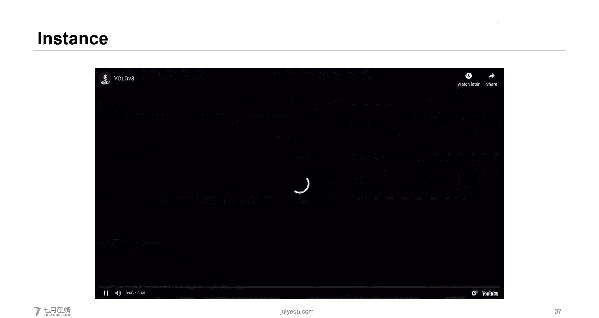

Yeah。

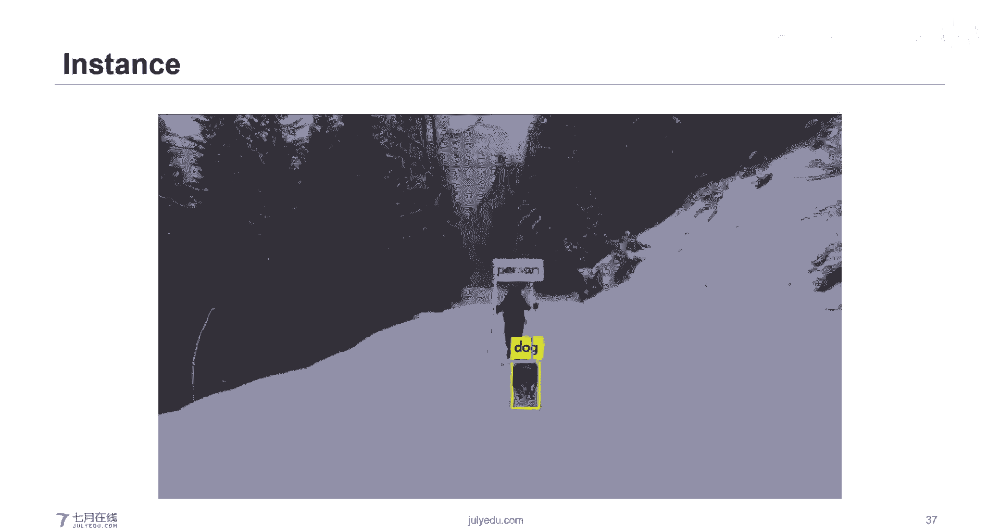

く。

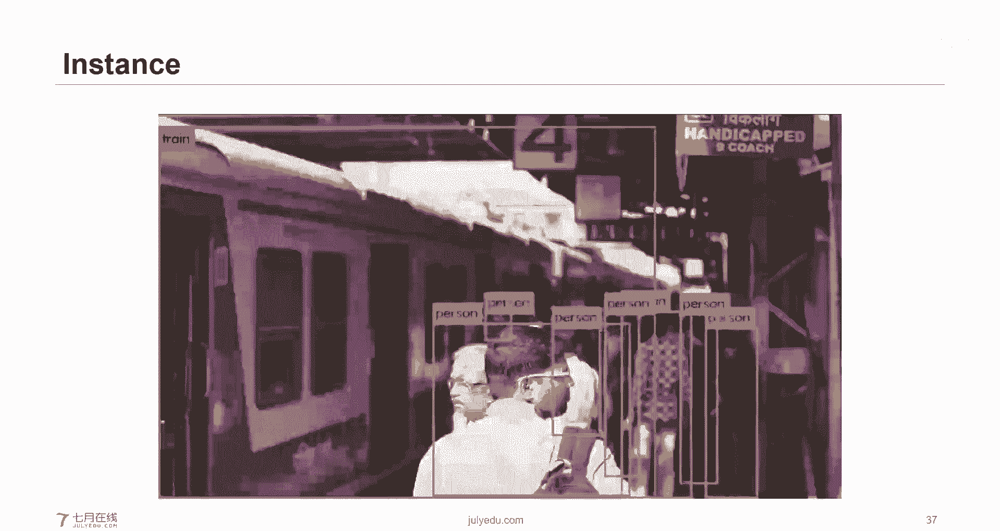

，🎼，Okay。🎼，我后就能放。Oh。🎼用你也放轻狂的散，多么期。😊，我是要兄你。😊。

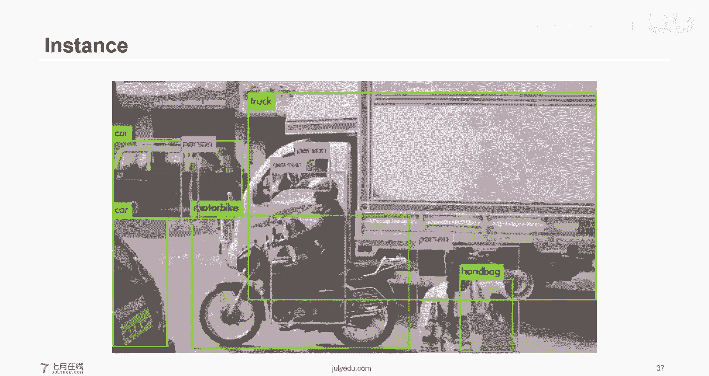

Oh。你。おち？🎼给了谁的我们。😊，🎼多少回。那成为了我。😊，这你。老啊。Yeah。こいと。こと？🎼某个爱你小会，我们就会。😊，🎼你我的。お？での？啥时好。あ。🎼爱你的爱好。😊。

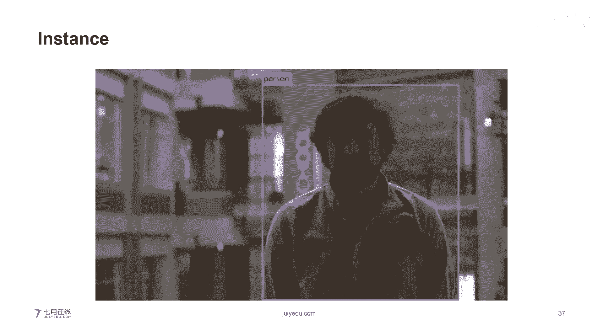

Oh。🎼爱是不爱你我你还是我的爱手。😊，我爱你。

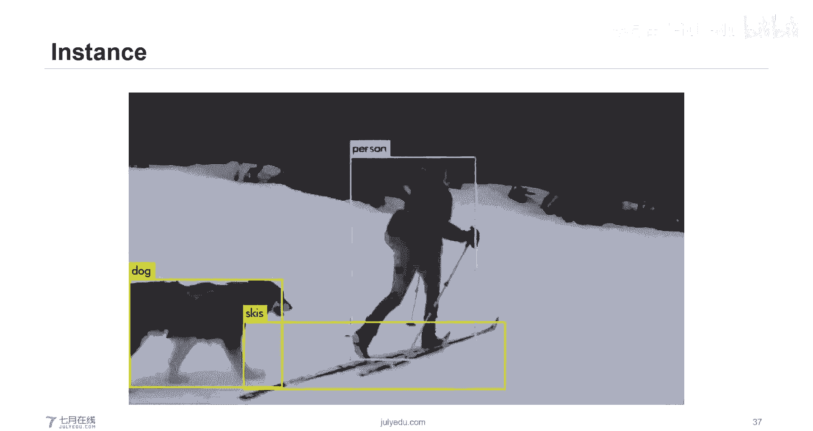

🎼我心不就忘成自己，我 can却在多。😊，🎼。あ。我不能。🎼或许给了心，或是愿意给总是松在。😊，🎼是两个从。都是回忆。😊，🎼心掉的所话。🎼打天之梦。🎼原不是那天。😊。

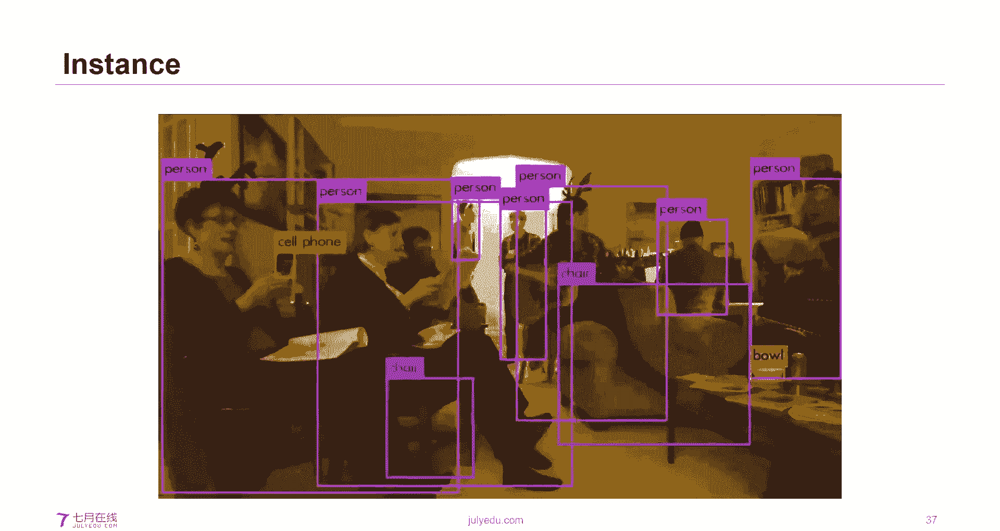

🎼只么是别你讲。😊，Yeah。🎼爱你。把丢は。想不我我就不。😊。

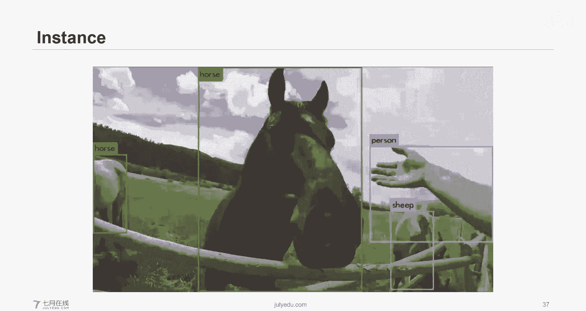

あし。你。🎼这样天我们不说。😊，🎼对。Oh。🎼这的的我不。😊，Yeah。🎼我爱你。😊。

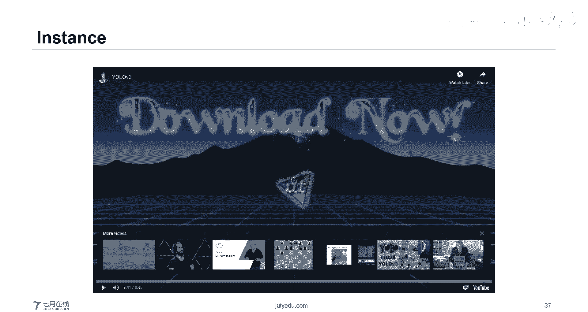

OK这是大家看到的一些就是呃它的应用。那么我们再看一下，就是说还有哪些其他应用呢？就是目标检测这块。首先第一个应用，比如说车牌号识别，车牌号，那这个就很明显了。当过来一辆汽车的时候。

摄像头首先在这张图片当中准确的找到了车牌号的位置并进行截取，然后通过一些可以说是通过一些图标数理的方法，也可以通过计算机就是卷机网络的方法来得到最终的车牌号的数值。说到车辆，目标检测。

还有一些其他的比如说应用，拿这个来说，我们可以得到汽车的轨迹。比方说这个是右上角的那幅图片。我们可以得到这些汽车的轨迹来预判这个车流到底是它是否正确的行行在自己正确的道路上，还是在叉车就是叫。

加三或者什么的。然后当然也可以进行就是前方的一些安全预警。比方说突然检测到前方的车辆紧急刹车指得距离过近。那么当检测到之后，我们就需要做出一些相应的判断，我们是刹车还是赶紧变道。

当前或者是检测到有前面有行人通辆穿过的话，我汽车应该做下一步的那个工作来预防就是撞上去。这个是行人检测，呃，这个是这个刚才也说过了。然后再往下我们可以看到。

就是这个的例子就是说当旅客在旅游的时候遇到一个新的建筑物，我并不知道这是什么。然后我拿起手机拍了一张，同时把这张照片传到网上，这时呃这个叫图像搜索就可以找到okK这个建筑是什么，它的地址呃。

在哪里或者是等等吧。这个叫图像搜索。更多的应用，比方说在就是机器人领域，呃，左上角这个是机器狗，当然这个是一个小竞赛了。呃，这个机器狗，比方说呃我机器狗的眼睛就是我的摄像头不知道这个球在哪里，然。

后对友在哪里，该怎么调。呃，右面右上角这张图片是现在比较火的一个无人车的物流配送。呃，大家注意不知道大家注意没？就是经过这次肺炎的疫情，呃，然后就是国家会大力在机器人这个领域。

或者是工业机器研这个领域进行大量投资，像呃用一些就是无人车来进行配送，这样会减少人的在公共场合出现。也就是说减少了人得病的一些可能性。嗯，还有就是机械臂在工业自动化当中，机械臂它需要准确的定位。

就是物体在哪里。同时当我拿起抓取到这个物体的时候，我下一步要把它怎么操作，我放在哪里，需要一个精准的定位，这个都是目标识别的一些特性。除了在工业上有应用。在医学上目标检测，也有的就是很广泛的应用。

这张是一个呃应该叫CD图吧，呃，当然我本身不是做医学的啊，呃，可能说错，这个我能一个医学图像。然后在医学图像当中，我们可以训练神经网络找出一些异常点的地方，那么异常点的地方。

我们再把这张有问题图像再呈现给医生来看，就医生就可以得是ok呃，这个患者他就是有有哪些病变，然后怎么样治疗，这是下一步过程。呃，当为什么要这么做呢？因为其实医生的时间是很保贵的。

当有大量的医学都药摆在面前的时候，如果你让医生一个一个去干。首先医生他会累，当他累的时候，他看到之后，他可能就是有一个疏忽等等。计算机不会，他看呈现上一张照片，他也能准确的帮你找到一次区域。

所以也就是说可以缩短时间，大家注意没有？就是这次疫情呃，在生产疫苗的时候。就是人工智能会帮助这个加速疫苗的延禁。大家注意啊，人工智能并不能去研究疫苗，研制疫苗，但是它会加速这个过程。

那么这个应用就是说也是一个就像你视觉方向的一个比较深的应用和影响吧。OK这就是我们的第二个top个我们所要聊的。我现在推出我的全屏，我看一下大家的一些聊天。

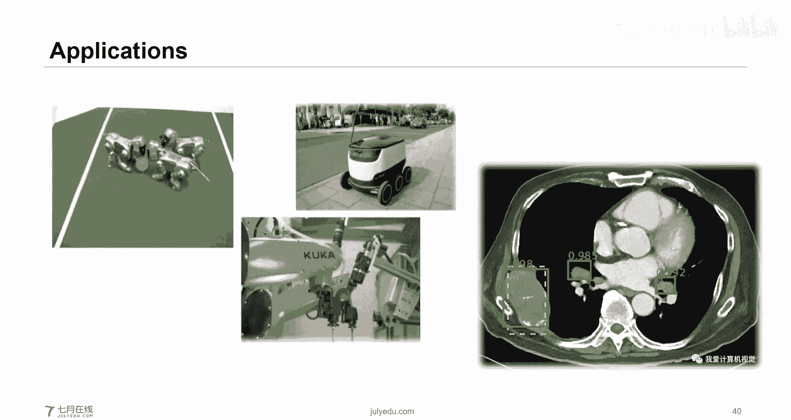

啊，迁一学习吧，这个我做过迁一学习其实挺好的，它可以大大减上我这样过程。迁一学习的意思就是说呃我本身有一个就是比如说我训练了一个网络，我这个网络主要是区分狗的照片。然后我想做这个呃同样的网络。

不我再做一个网络，我想它区分狼的照片。大家注意啊，这个狗和狼，它主要是比较接近的。那么我已经有了训练好这个狗的一个网络，我没必要再重新从零开始训练一个狼的一个网络。

因我完完全全可以就是说我把我狗的训练狗的网络，我的一部分，我拿过来。因为大家注意在很多地级特征它们是非常像。比如那狗耳朵，就哈士奇的狗耳朵，和狼的那个耳朵非常像，就是那个体型非常像。

就是说我先利用一些前面那个网络特征。嗯，然后我在新的网络，我将其就是大概会缩短我这个需要时间。课件可以分享，视频也可以分享。最后大家可以就是我我的这个课件和视频都会最后哦就是发到7月在线的网上。

大家可以就是联系，就联系那个小七嗯，或者是直接到那个网站上啊，就是问大家要这个都会给大家分享。水下物体检测你带什么东西比较好？水下物体检测的话。嗯。这个其实怎么说呢？对对。

前期学期确实还有其他的OK我们看水下物理检测什么模型比较好。其实我个人认为呃。做水下模型的话，如果你要是不图快的话，你可以考虑一下那个musaskCN。当然你要是图块的话。

像拥有V3或者是最新的那个connet，我是个人比较喜欢那con light。呃，conline它有有有两种形式，呃，有一个就是效果非常的好。我给大家打一下吧。

就这个connet light这个大家可以呃去看一下，这个非常好。做CV必须得有GPU的支持。对，一般来说，当然你没有CGPU用CPU也可以，理论上是可以啊。这个理论上可以。

大家注意你这个理论上可以是呃你的实际训练速度非常的慢。所以一般来说我们会用GPU来测。这个有个同学提问就是CV需要那个图像呃传统的图像处理学那个这么说吧，传统的图像处理你只要知道非常基础的东西就行。

学本身学深度学习不需要去那个特别了解传统那块。你像传那传统的那些那块好多已经不用的。跟说，就是学了，你深度学了，这个挺好的。但是完全可以就是直接用深度学习的学习。车牌识别主要什么方法，这个东西就知了。

机于或野外环境特征比较少，适合哪种做法？哎，这个问题问的非常好。呃，其实在那个车辆重序别最后一章的时候，我们也会讲到，就是说当特征比较少的时候会就是怎么用。这个特征比较少的话，我个人建议你就是啥了。

你用你的光 truth光 truth就是说你原本的一些图像，然后你再结合那个比如说conroncon这种这种算法，然后你进行一种比对，就是算它那个相似值，然后呃算相需要算相似值来。

你得到一些就是更显著一些特。这个一会儿我讲到那个第四项的时候，会给大家再提一下。车牌识别呃，这么说吧，其实嗯在传统的计算机游戏的图像处理上，车牌识别已经比较成熟了。

open那不知道大家听过open c没一般来说，如果做深度学习呃，做图像处理的话，都会用到这个。欧CP你接调它的库就可以，完全就是进行车牌实验。然后CN也可以做车牌实验。okK大家还有其他什么样的问题？

没有的话，我们就。哦，什么net，我重新给大家打一下啊。这个corner net light这个东西大家注意啊，它之前是有一个叫corner net。net它是他第一次提出来，它这个的速度非常快。

而且总确率也非常高。因为它我不需要就是找一些anker， anchorker的意思就是说锚点。我个人认为cor，然后大我再继续说啊，corner map light是它的第二个版更新版本。

它的更新版本里面，然后它的那个效果确实是比优o V3的效果更好。呃，上一讲中需要设计多个滤波器，对输入数据进卷积器服复制。呃，还是那句话，这个滤波器不需要你自己去设计。呃，我们可以截调那些库。

然后你只要告诉那个呃系统，你对于每一层当中，你想放多少个滤波器，注意要基行数量，然后对于每个滤波器，你的大小。比如说你可以设置33或者是5乘5呃，仅此而已就可以了。然同时你在需要告诉你的呃系统。

你对于每一个比如说卷积层来说，你是否需要填充或者是是否需要把你的这个步长默认步长是一，你也可以把步长拉大就等等。你只需要微调这些，我们把这个叫做调参，呃，你不需要专门去写那个滤波器。

只需要运用那些库就就可以了。OK大家还有其他问题吗？没有的话，我们进入第三个呃话题。第三个话题是变分自编码器。变分自编码器主要是生成图样，挺有意思的。

OK那么我们先继续第三章。然后在第三章的结尾，我依然会推出来，就是大家就是聊一些呃呃解答一下大家的问题吧。OK变分自编码器它的简写叫做VAE。从这个名字上，我们就可以知道，所谓的变分自编码器。

它其实是有两步，第一是自编码器，第二在做变分。那么具体什么意思呢？我们先从这个自编码器auto en来看始。

。诶。autoencoder自动编码。我们看一下什么叫做编码。这儿有一张就是示例图，我们还是从左看到右。最左面我是有一串矢量，就是大家对这个矢量词全部都是一。

然后最右面我是想让它从这个最左面的输入全是一的一个矢量。然后最后我想生成一张猫咪的图片，大家注意啊，我每次只能输出同样的猫咪图片。因为你要训验。然后我们看到中间的这两个。这叫粉色的块，这个叫做呃。

反卷基层反卷机层，它就是把卷积层逆过去来一遍就行了，同样不需要自己设线，只需要调库。呃，至于怎么调库，我们将来会提到。OK那么我们通过大家注意啊，我如果是从右往左的话，一张图片，然后经过卷积。

再经过卷积，复制卷积和1化层之后，我们可以得到一串那个分类，你可以把这个分类就是说认为就是说呃它是一或者零。那么我们反过来的话，我们在初始的时候，我们把所有的这个类，我们全写成一，然后一步一步反卷积。

最后来生成一个呃固定的图像。当我训练的时候，我必须得训练出出生成平方图像。这个叫做编码。那么大家可以想象，我最初始的时候，我这个矢量全是一，其实这个很什么呀很bug。就是说呃它的解释性非常的差。

而且来说你这个数量特别的少。那么科学家就想，我下一步我可不可以把我的全是一，我改成一个方阵就本来是一个矢量，我改成一个方阵，这个方阵叫做one horse vector，呃，什么这个什么意思呢？

我给大家举个例子啊，one horse或者one factor。然后呃我举个例子，我现在有一个类，这个类叫做body就是身体，然后这给写错了，应该是叫animal。然后对于这个这一类来说。

如果我是用前面的算法，我会写成全是一的话，比如说我第一类代表猫，第二行，我代表狗，然后是狐狸和狼，那么我把它变成one vector方法，就是说我把它变成一个方阵，O就是因为我有四类，所以是四。

字的方正对角线上为接代表代表这个值应该是对应的它的哪一类OK。那么这个时候我的信息量就从一个N变成了N乘N，我的信息量变大了。但是大家呃它还有一个问题，它最大的问题就是说这个矩阵太稀疏了。

你仅仅是零和一表示呃，虽然你的是变成N乘N量大，但是你的信息并不变大。而且只有零和一，这个数值代表的就是是不是信息量特别少。那么下一步如何更改呢？

我们就把one how one how vector变成一个纯粹的一个 vector矩阵。我们还是给大家举例，看一下怎么变。通过one ho呃举证它全是零或一，而且注意就对角线上反7，我把它变成一串。

小数。大家可以看啊，我第一列原本是10001000代表着okK我在第一列的第一行的第一个A11是一，其他都是0。那么我就认为它是第一类猫。但是我变过之后，我在第一列，我们全部变成小数，一也变成小数。

零也变成小数。那么我们这样的话，我的信息量就会极大的增加，对吧？这个小数可以是正也可以是负，变成极大的增加。那么对于这个来说，我的信息量非常的大。OK但是大家注意这个时候我们没不有办法再仅仅区分类来呃。

就是区分那个类来表示到底是什么样的动物。那么这个时候我们怎么样做呢？我这个比如说我的 cat猫，我有4个数就是四组数字，然后每一个数字每一行代表一个特征。

可以我可以说这个比如说第一行它可以是一个耳朵的意思，就是代表耳朵不同的数值代表不同的耳朵的特征。那么第二行我比如说代表脚，我们再看第一行，如果我的第一行的数值是3。3，那么它可以是落在猫的这个特征上。

然后呃如果是3。4，唉，有稍微的变化，可落在了狗的特征上。比如说猫的耳朵是圆圆的，我的耳朵是尖尖的，我我举个例子啊，当然可能不准确。然后比如说我最后一行我可以是尾巴的一个特征。我本来是呃如果是6。

2这块的，我可以认为尾巴是蓬松的，而且永远是下垂，那么我就可以把它体向一只狼尾巴的。然后我如果变成了呃一个呃数字变成9。8，唉，它会变成一个细不留长的尾巴。然后那个毛呢也很紧凑，呃。

而且可以随时随时打弯。这个特别像猫的尾巴OK那么我针对你不同的行代表着不同的一些特征，我就可以组组成一个呃我的这个呃一个动物的类。那么这个我们就要做编码，就从一个vector。

然后也最后生成到一只一张固定的图片。OK到此为止，我们已经知道什么是wer。那么我们再看一下什么是deder编码器，对应的解码器和嗯自动自编码器，就是自动编码器。在outto当中。

auto en本身的意思就是outto是自动的嘛，这它自动编码，就是说我加入一个编码器，我再家里有同时我还有个解码器，我从最左边我输入这张猫的图像，然后让它进行编码，通过我这个网络呃卷积网络。

然后我最后生成一串矢量。然后这个矢量。然后我再反着走，通过我的der解码器，解码器它主要是那个反向的一个叫嗯卷积网络。然后我再最后生成到我原先的猫的图像当中，这点我要强调一下。

这个时候我的这个凹 enr，它的输入图像输出图像必须是就最终的训练结果必须是越接近越好。可以说是一模一样。ok。呃，标准编码器现在就是我们已经获得了一个有实际用处的网络了。

而且我们可以训练呃任意读的图片。你想训练猫各种各不有不一样的猫没问题。然后当训练好以后，我们可以把这些图片的编码向量存下来。然后呃之后我只要通过读这些编码向量，然后我就可以生成我们所对应的图像。

我们把这个称为标准字编码器。这个时候他有一个问题。它这个标准字编码器，它产生的图片和你输有图片是一模一样的。我们就可以认为标准词编码器就是一个图样的保存过程，只不过是我我保存的不是一张完整的图片。

而是我保存的是它的一个编码下的节省空间。但这个并不是我们最终想要的。我们想要的一个产生式模型。什么叫产生式模型呢？他的意思就是说，我通过一个一系列代码回来让它自动生成一些图像。

这个生成图像它并不是我训练的时候，我的输的一模一样的图像。比如说我让他看到了很多猫的图片，我不光想让我的网络判断出来这是猫是不是猫。同时我也想让它画出一些猫的样子。O。诶。在标准自编码器。

它不能产生任何位置的东西，主要是因为我们不能随意产生合理的潜在变量。然后那么我们该怎么做呢？这就是我们下一步要说的变分自编码器VAE变分自编码器，它主要是在标准自编自编码器的基础上增加了三步。

第一步是增加约束。强迫这个编码器来生成一些不从单位，就是高斯分布的潜在面量。为什么是高斯分布呢？因为在这个现实社会当中吧，我感觉很多事物都符合这个高斯分布。比方说一个班里的学习的成绩，或者是一个猫的。

比如说猫那个眼睛那个大眼它这个分布，从特别小意量特别大，它都是符合高斯分布的这也是就是为什么我们要让它服从高斯分母，或者其他的分布。第二步是在从呃高斯分布上进行采样，然后再丢给解码器，可以生成新的图像。

那么最后一步就是说你你生成新的图像的时候，它你肯定是有一些偏差的吧，就是我要调它的精确度呃，并且要符合这个高斯分布，你不能说呃在两头我的图像特别的多，这个部母际起点中间特别少，这个很奇怪。

所以我要把它材品拉回来，让那符合高斯分布同时让它精确度变高。我们看一下它的网络图是什么样子。我们可以看到在这个网络图上，它的这个和标准标准编码器的区分。就是我在中间我多了一个蓝色的柱子和黄色的柱子。

蓝色的柱子是叫min vector，就是说我求它的那个平均平均量，平均矢量。黄色的柱子是我求它的平均平方误差。那么我们就是让网助自己去权衡这种平衡。就是一方面我研究它的那个图片的重构误差。

我们用平均平方误差来表示，另一方面我们用一个呃我们这个地方叫做KL散度KL散也是算一个两图样当中它的区别的。就我们用这个来度量我们前列变量的分布和这个高斯分布的差异。大家看到上面的三个公式。

上面三个公式，我们先看第一个公式。第一个公式它是算一个los，这个los我们翻译过来叫呃叫误误差函数或者是损失函数。那么这个所谓的这个误差或者是损失函数，它的意思就是说呃我的网络生成一张新的图像。

那么在这个新的图像和我真实的图像，它的一个差异。我们当然是想让生成的这个图像和真实图像的差异越小越好。那么也就是说在我训量网络的过程中。

我的一个最核心的目的就是说我降低我的los函数的值使得这个差异越来越小，意思就是说我生成图像越来越接近我真实的图像，这是这是第一个就是我生成那个los。然后第二个就是我潜在的一个lo。

现在lo就是说我它可能不是很符合这个高斯分布，我把它拉回来。呃，同时我调一下它的一个精确度，这个los呃。加上之前的生成的lo，我们把它合成为一个总的一个损失函数。那么我有两个los。

同时把它就是家使它的呃这个los的值越小越好。那么最终我达到的目的就是说呃我想让我的这个生成的图像越来越接近我真识图像。那么这个就是VAE的，就是一个基本的原理。OK我现在再退出退出来，我退出全屏。

我看一下大家有什么问题。

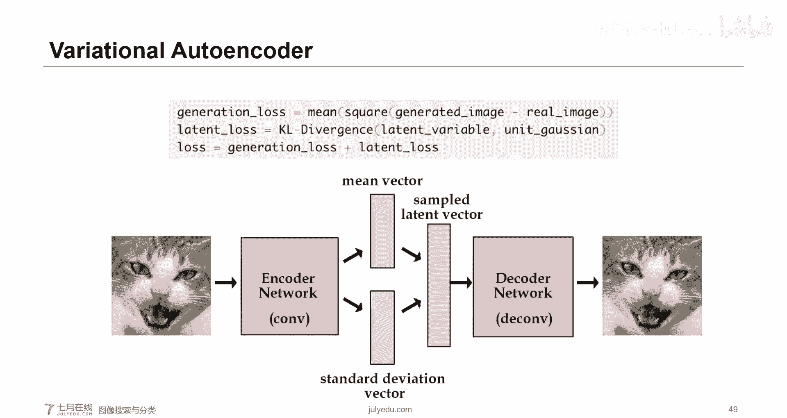

哎，有一个呃朋友把这个code扑上来了，就是框架做的非常好，这是普林斯顿大学做的。呃，二阶段的话大家会经常看到一个是mus和CN。呃，这个它的效果，它是在faN基础上，它增加了一层解码。呃。

这个我们因为它这个本身不是我们今天公开课讨论的话题。呃，如果感兴趣的朋友的话，你可以搜一下这个。然后在我将来那个新的课程当中会，最后要给大家推荐的课程当中的，会就是看到一些就是具体讲解一下maC产解。

但是大家注意啊，musask和CNN它其实也是有一些问题的。然后现在会出现一个新的叫做。askCN呃，它是在maCN基础上进行的演化。呃，我给大家说一下mCN一个很大的一个问题吧。它的问题就是说。

我每次预测出来，我找到一个我找到了我这个目标，但是我找到目标之后，我会进行实力分割。是他的意思就是说我找到的目标我是有用一个矩型框来框。我只知道ok在这个区域之内，然后我实力分割，假如区域里面是人。

那么我就把人的轮廓来画出来。这个就是做的事情。但问题是它的损失函数是我只要我看到我这个区域里面我把人框住了，那么我就把它分达的很高。至于我实力分割的精准不精准，我不管反正我里面有人。

而且我这个呃范围也很小的。那么我就认为分这其实也是有问题的。所以mus就是在他的基础上它会在做进一步是你不光光把你的这个人圈住了，就这个框圈的很准。同时你实力分割就是把人的轮廓要很准。

然后这只有把人的轮廓也很准的时候，我们才认为你这个。就是找到的很准，否则的话我给你的打分非常低，就得重新学习。这个是m scoring前做的事情。大家还有其他什么问题吗？没有的话，我们会过渡到下一章。

下一章主要讲的是呃车辆的。呃，这样的重构呃重识别。

OK那我们先继续。第四章，车样重识别。呃，简写叫VEI。呃，vi re andification，我们看一下具体车辆从里面到底是什么意思呢。难道是重新让我认识一辆车辆吗？😡。

我们看一下啊具体的意思就一句话可以表达出来。就是已知在某一点那某一时刻，我有一个我想找一辆车，而且我这个时候我知道你的车在某处，当然你也可以说我这个车不知道在某处，我大概的位置可以知道。

那么经过一段时间之后，我想重新定位，并且跟踪到这个目标车辆。OK这个就是车辆同时别的问题。我们看一下一般来说它会怎么做吧。第一步。聚立假设空间。

意思就是说我现在既然知道了这个某一时刻车像在某处或者是它的大概区域。那么我按照车的最大速度，我找到一个圆形区域，一个合理的速度嘛。比如说我这个车在哎北京朝阳的一个小区，那么经过一个小时。

我完全没有必要去扩到到天津去找，对吧？我给大家举个例子啊，呃就等等，所以我先确定假设空间，那么第二步。当我确定假设空间之后，我需要缩小假设空间。因为在一个地图上，我们知道车辆指定沿着道路走。

或者是停到那个呃比如我停到那个停车库，或者是停到那个路边，我不可能我直接把车我开到比如湖里或者是学校里，我我当然我是是非停车场的地方。就是说我配上地图，我去到不是道路的地方，这样我会极大的减少工作量。

那么下一步就是说我筛选可用数据，在那个公路上会有很多摄像头嘛。就是说我在一比如一个呃多个摄像头数据，我把这些他所拍到的车辆，我都拿回来，我召回所有可能的就是候选。然后我最后一步我在这些候选的车辆当中。

我最后确定可疑的车辆，我可以参考车牌的信息，如果没有车牌信息，我需要参考车辆的其他一些特征的信息，来最终定位它的可能的位置。OK它主要是四步。那么这四步。其实我给大家总结一下啊。就总结一下就是两大块吧。

第一块是时空信息，我需要确列车辆的大致范围。第2块是我的地理信息，我要去过滤，不我去掉非道的地方。大家可以看到这是一张交通图。那么这这个交通图呃，我首先我是已经确定好这个车在哪我是10分钟的啊。

我确定好这个车在哪，我根据它这个路线，我对每一处的那个摄像头，所以我大概会有一个时间的记录，我就可以知道OK那么这个车大概的活动范围是啥分等。我们看一下就是他如何做的吧。

比如说如何搜索搜缩小搜搜索空间呢。呃。粗略的话可以根据一些外观的特征。比方说它的呃颜色、形状、类型，比如红色的车，那我们就只要找红色的车就可以了。检一车辆嘛。如果是比如说我是轿车，那我是轿车的话。

我就没有必要选公交车，就是直接大概的先粗粗的先搜一遍，包括它呃它的就是其他的一些呃主要的特征吧。外观特征。确精准定位。精准定位大家注意啊，精准定位其实最好的一项就是说我有车牌没？如果有车牌的话。

那么我搜一下你的车牌，就看一下通过这个呃是呃深度学习的一些技术，或者是计算机视觉的技术。我把这个车牌车牌号我定位出来，我识别出来。那么我就知道你这个车牌是否就是车辆是否在哪一个地方。但是最后有一个问题。

当你的车流速度就是车辆速度特别快的时候，很可能我抓拍到非常模糊。那么非常模糊的情况下。我如何精准的定位出来呢？你像比如说我第一张，说句实话，我第一呃第一行的那个图片，我大概能看出来它是TH080。

当然我要找的是TH090。那么我可能就知道，ok这个肯定不是。那么第大家看最后一行第三行，这个的车辆非常的模糊，因为它称度过快了，非常的模糊。那么我如何定位出来它是是不是TH090。

或者是它如果不是的话，那么它大概的范围是070还是080？这个怎么做呢？我一会儿给大家解释，那么就现在的车辆重启，它会有一些挑战。比如说第一个挑战。同一个车辆的不同角度的观测照片，它是不一致的。

哪怕你用同一个上头拍，你拍正面，你拍侧面，你拍后面，甚至你俯视图它都不一样。当然对于人类来说，我们看一眼就知道okK这肯定是同一辆车，但是如何让计算机知道这个问题，这是第一挑战。第二个挑战。不同摄像机。

哪怕你拍摄像的同同样是正面的，你同样确实它是有差别的。包括它的这个摄像这个摄像机的分辨率等等。嗯，或者是因为那个天气的情况，因为那个车辆是流动的嘛，它根据时间在流动等等，它就会拍到图样有差别。

下一个挑战。有车牌的话，那那很好说，把我读车牌就行了。那如果车牌被遮挡，或者是压根就没有车牌怎么办？这是一个非常重要的挑战。我一会儿给大家具体解释一下如何这个做就是去掉这个挑战。3。还有一个挑战是。

就是说你这个时空场景有时候难以确定，因为你想找这个嫌疑车辆，它这个嫌疑车辆并不是我们自己来控制的。它会根据其他一些很多的因素，比如说现在的交通是否拥堵，然后它是否改变了既定的路线，或者是天气。

就天气下雨，它突然把这个车停到了路边就等等，会改变车辆的路线。所以这个时空场景那里去。那么对于这四个挑战来说呢，呃，它是如何解决的呢？我们会开设一个课叫图像搜索与分类。

这是张老师他讲的那个斯蒂even老师讲的，那么他会在这个课程当中给大家具体介绍如何处理这个挑战。我在这里给大家介绍一下呃，这个处理一些挑战大致流程啊。大家可以看到这个图。呃，我们先从左往右看吧。

左面我是想知道我在某一个时刻，比如说下午4点1730秒，我在我第16个摄像头当中拍到了一个车辆。那么我想在知道经过很陈久之后，比如说一个小时之后，那么这个车辆大概在我是哪一个位置。OK。通过第一张图片。

我们已经可以知道了，嫌疑车辆大概应该是一辆SUVOK它的车牌号一次是AT8251次啊，大家对这也不清楚。但是我们可以知道它至少有车牌。同时通过我的摄像头的编号和时间，我就大概知道了，在几点的时候。

这么这个车辆所处的位置。那么最后的输出是什么？大家可以看最后的输出，首先右上角它是各从就是各种不一样的车，但是就是很接近的车辆嗯的一个数据库。

这个就是我们这个摄像头所呃所有的摄像头抓拍到的一个数据库的后载车辆。那么同时我也可以由我自己的数据库。呃，最后我还有一张地图，我在地图上头想确列让确立这个车辆的大致的行进路线和它现在的图的大致的范围。

那么怎么做到的呢？我们看一下中间这块。那么中间这块它其实是一个渐进的过程。首先第一步，它是基于外观的一个大概的过滤。比如说我可以基于外观的模型过滤到有不同颜色啊，像这是黑车嘛，我就需要白车，对吧？

需要红色车辆，就我过滤到不同颜色，还有纹理形状或者类型的大多数车辆嗯。大家可以看啊，我绿色的这块就是我第一行绿色的框代表着这些车辆嗯是比较接近的。然后红红色框圈出来的时候。

这些车辆在呃外形呀或者颜色等等。就很不像。那么我就没有必要在你这些红色框所圈住的这些项当中浪费时间，这是第一步。那么呃第二步是基于车辆的基于车牌的一个精细搜索。大致。

我们第一步就我们最重要的还是要基于车牌，因为车牌给的信息是非常准确的OK。呃，基于车牌的话，我们可以看一下，当我捕捉到这些就是在第一步的基础上一些的备选一些车辆之后，我们大概扫一下这个车牌。

如果说车牌能精准识别出来的话，那么我们就认为呃就大概的一些哪些车辆又可以进行备选。如果说是呃无法就是精准识别的话，就是如果有精准识别。你直接找到车了，找不到的话，我们可以呃基于它这个那个你近距离的原理。

呃，就是呃通过那个呃叫做。呃，翻译过来叫就是聂罗猫神经网络，它其实就是主要是计算这个呃。就是两张不同图片，它的那个相似度的。就是说我通过测量就是检查。嫌疑车辆和被搜索车辆车牌的大概相似。

然后我找到最相近的那一批车辆。OK最后一步就是说第三步啊，基于你近距的原理，我利用时空作性对车辆进行重新排序，然后进一步改善这个车辆的搜索过程。那么排序最高的。那么就是嫌疑车辆最大的你看一下这个车辆。

那么这个就是主要的三步。呃，当然三步，它其实实现起来也挺挺挺有意思的。在我们那个呃图像归类与搜有的课程中会给大家具体介绍。我在这儿主要给大家说一下。第二步，那个如果你车牌有精准的。

就是很清晰一下精准定位出来识别出来，这个不然好，如果它比较模糊，那这样我们怎么办？我们看一下。其实。在很多就是识别的时候，我们没必要去精准的那个识别这个车牌是不是它的数字到底是什么，然后去匹配。

因为有时候它比较模糊吧。其实我们只要验证车这两个板是否相互就行。注意啊，我说的是这两个车车牌的这个板，而不是说这个车牌的号，这是两个概念，我只验这两个板说下，首先我呃通过目标检测，我把这个板框出来。

然后我把这个框出来的两个板进行一个比对，这个只译过来叫聂罗猫神仙或者聂罗网络CM。然后这个神经网络，大家去看一下，我们我把这两个牌子输进来。

O我们先看那个label onelabel等于onelabel的意思就是我标签，当label等于one的思，就是说这个。呃，他的意思就是说我这个两个非常接近。呃，当li等于零的话。

我就认为这两个呃非常就是差异度非常大，就是压根不一样。那就甭看这辆车了。我们看一下右边这个列个神经网络，首先我的输入就是我这两个车法，然后我经过上下这两个分支的呃卷积层，就卷积神经网络，最后对啊。

这两个卷积神经网络，它的结构是一模一样的，包括它的所有的权重，所有的参数完全一样。你可以把它认为这压根就是同一个神经网络，以及训练好的同一个神经网络。OK通过这个神经呃就是两个神经网络。

但是什么都一样的神经网络，最后然后会输出一个输出就是一串编码，这一串编码，呃，就非常像我刚才给大家就是讲那个变分字编码器，它的那一一。那么我们把这些编码进行一个相似度的匹配，这个相似度的匹配。

比方说我可以呃通过当然有很多公式，比如说我利用预旋公式或者是我最哪怕你就是利用那个距离公式等等。嗯，就是来我计算一下相似度，相似度越接近。

那么就说明这两个车牌在很多外观上都非常像相似度越小呃越就是越呃越小，就以说会离地越远。那么就说明这两个车牌非常。它就是呃这个就是说我只需要验证两个车牌这个把的相相似度就可以。

没必要去今准的识别这个呃车牌号。O。呃，最后我给大家推荐两个课程吧，呃先看右面节课程，右面课程图像分类与图像搜索。它这个注意啊，这个课程它主要就是讲解的就是我今天所有的这个top的所有更多的细节。呃。

因为毕竟呃公开课嘛，时间有限。而且我们在短短的不到两个小时的时间里给大家聊了这么多话题。嗯基本上也不可能就是把所的细节聊的面慢俱道。所以说在这个课程当中，这个是我们网课了。呃，在其月在线推出一个网课。

大家进去以后可以就是呃报名学习。如果感兴趣的话。呃，这个呃网课它仅仅是讲的就是呃转移乘经网络呃变更自约呃就那个或者是VAE啊车还有车辆识别等等这些问题。如果大家对其他更感兴趣的话。

那么左边的这个班叫CV就业小班第四期。现在你经到第四期的这个是专门针对就业的，就是说嗯就是呃本科或者研究生毕业的时候，如果大家想进大展就做鹅场，就是腾讯或者是华为等等。如果你想从事计算机视觉这块的话。

那么我建议大家去参加一下这个CV就业小班第四期，他会有老师手把手的从最开始的基础，一直到最后来教会大家关于计算机同样视觉在深度学习这块的所有的主要的一些算法。然后帮助大家啊又找一个高薪的工作。

最后他会也就是帮大家有推荐内推。大家注意啊，在AI这个领域内推真的非常非常的重要。呃，同时也会就是帮大家改一下简义，就是我他不光对知识的一个详细的解示和介绍，同时还帮助大家找一个很好的工作。呃。

这个链接如果你点开的话。就是呃关于CV就业小班的一个呃介绍。

现在退出来给大家看一下。

OK这个就是CV就业小班第四期的介绍。然后大家可以看到在这个里面呃如何进的？一个是可以问那个管理员要一下，就是这个的呃PPT也可以就是直接搜7月在线。O搜7月在线。

然后进7月在线里面找到CV就业小团第四期呃，这里有一些课程去看这里介绍一些包括如果大家喜欢的话，感兴趣的话，你也可以就是来这看一下。

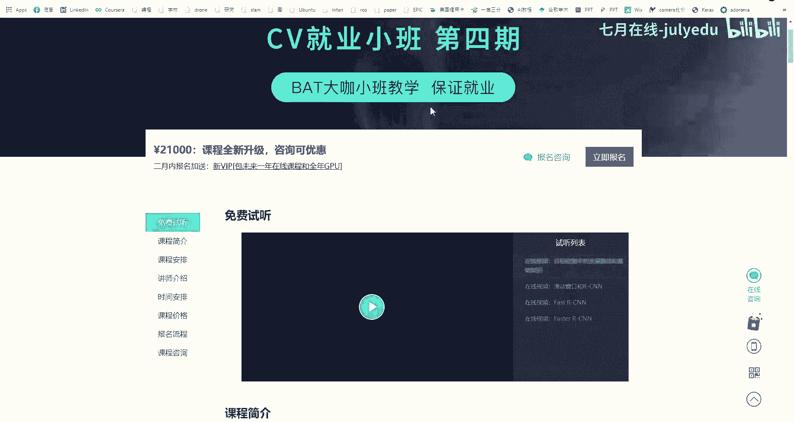

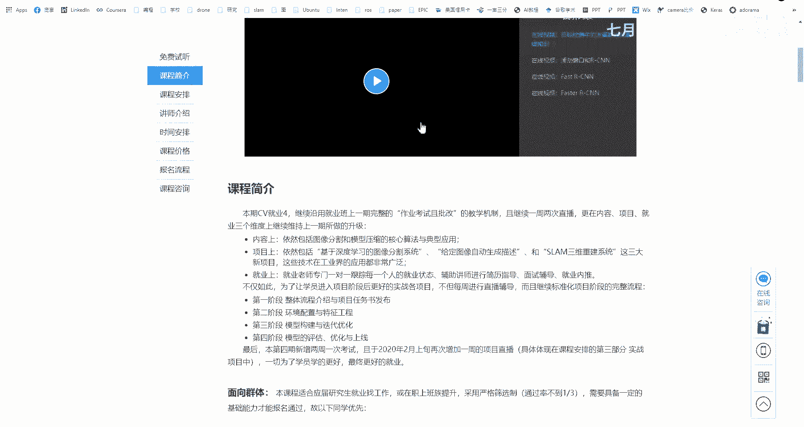

那关掉。呃，faRCN的一些基本原理。呃，这里有课程简介会给大家就是解释一下，就是最基本的它分成四个阶段吧。

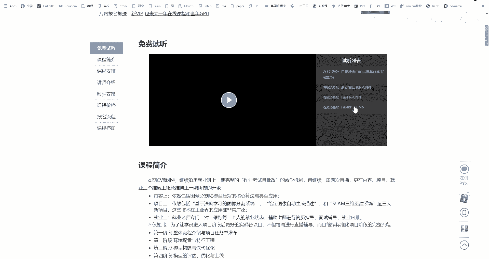

没有。呃，如何报名的话，大家可以在这个网站上就是填写申请表，然后会有专门的工作人员负台工作人员呃，给您打电话呃，就是聊一下这个呃跟您聊一下，看看您现在的基础是什么。然后针对您的基础。

然后再进行一些呃更是就是在课前的一些的去安排。O。呃，然后预习阶段会讲一些就是呃最基本的一阶段。比如说如用open CVV呀呃或者是最基本的这大家注讲。

就是前面这些预习的阶段基本上都是些传统的计算机视觉呃，打个基础。然后紧接着第一阶段嗯，然后会给大家讲解很多这个。开go这个是一个比赛，参加过这个比赛的话，呃，对大家的就业非常有帮助。嗯。

然后第二阶段的话是掌握一些深度学习的高级技巧。比方说这里讲了一些呃tto stage的物体检测，还有one stage的物体检测，具体怎么样做的。第三阶段会讲一些跟踪和语分割上面的问题嗯，然后再往下。

呃，第四阶段就是讲一些呃，现在如果你是本科生的或者是硕士生的话，如果你想参加计算机这些网络的竞赛的话，比比如说开口竞赛的话，他会就是教大家一些如何呃一些经验吧。呃。

最后一部分第三部分第三部分非常重要是我最极力推荐的，它是一些实战项目。就是说我不光给大家介绍一些呃理论，它如何实现的原理。同时我还会给大家就是讲一下呃它的代码就是带着大家一写代码，这个呢我觉得非常重要。

这是一些实战项目，它这个呃就是涉及到的一些就是还是比较全面的，涉及到领域。最后一部分第四部分的呃啊这个不是第四部分的是就是面试这块。呃，毕竟大家就是交钱报名学习，最终的目的还是想找一份高薪的工作嘛。

7月在线的所有的讲师基本上是在各个领域，就是各个领域当中的一些佼佼者。然后有些是在学校，比如说像我是在学校，有些会是在公司大厂的公司，他们会就是根对自己多年的经验来为大家就是总结一下面试当中。

你如何讲解，如何把自己最优秀的那一面展示给HR，就是第四个部分，这个会是面对面的帮你。第五部分就是。呃，在虽然在课程结束之后，但是其实大家也依然想跟大家做一个朋友，然后有问题的话也可以联系你的你的老师。

或者是你的助教。然后大家会嗯就是在后续的过程当中，你有任何问题也可以向我们私下里提问，嗯，为大家访加互啊，这是第五部分。然后这是讲师的一些介绍。呃，OK这是一些学员的一些评价。呃，总而言之。

这门课程是我极力向大家推荐的一门课程。呃，这是CV就业小班第四期，如果仅仅是对我今天的就是。

呃，讲的话也就感兴趣的话，大家可以就是呃看一下。

看一下图像分类，就是大家可以看到吧？就是这个这门小课程这门小课程。O。呃，最后这个是我们7月在线的官网。呃，如果大家想就是看我的领音主要的话，右面这个是有领音大吧。OK我看看一下大家有什么问题。

啊，论文这块。

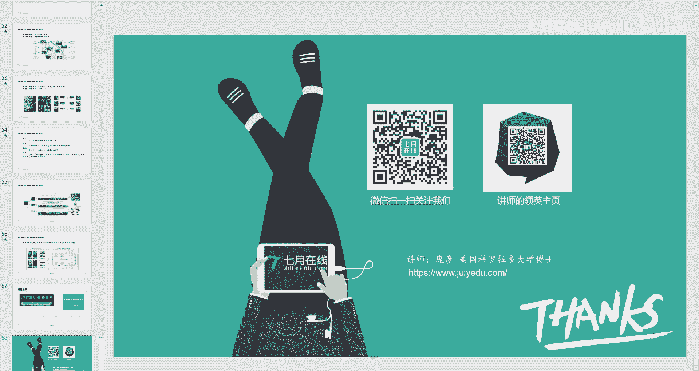

论文是就是首先读论文和复线论文都都是必须的。你比方说在这些实战项目当中。读论文我就不给大家做过多解释。因为在课程当中本身就会给大家介绍啊这个论文的很多细节。那么在实实战项目当，比如说这些都是实战项目。

实战项目当中，嗯就会首先是基于当下的就是论文当中的算法，先给大家讲解，然后进行复现，从开始如何进行建模，然后到最后如何训练训练之后如何测试。呃，那么在测试当中发现一些问题。

如何精确就是微调你的呃训练的这些参数等等，发现你的参数，这个是必须的。改进改进模型的话，这个呃就为针对就是不同。

大家比方说刚才那个我给大家叫那个m RRCN我又提到了m spoilingRCN但是m spoilingRC大家注意啊，它也是有一些小问题的。那么在我的课上，我会给大家教就是教速一些。

就是你现在论文上看不到一些东西，就是说如何调这个如果更精调。那么它为什么有问题，怎么样解决。呃，就是呃一些比较新的一些东西吧。准确率0。4，说句实话不是特别的高。呃，如果你。

就这位用户如果就是比较想更多的了解这块的话，我建议你可以看一下。呃，你稍我打开一下啊。这样我把它进到首页。大家可以看到首页往下拉，首页往下拉的话，那么这个就是图像分类与图像搜索。

就是我今天主要就是涉及到我今天公开课所的那个课程。然后大家进来的话，这个在这个地方就会给大家介绍一下呃，就是如何这个解决，这个可以1元秒，我觉得还不错的1块钱吧，对吧？1块钱的话。

大家进来以后可以看到呃一个第一课第二课讲这些。然后同时迁机学习这个地方以后给大家聊一下迁机学习，并且如何翻去。最后呢智慧交通这块呃，包括什么是智慧交通。然后如何呃就是重定位呃。

同时再讲一下如何就是充市比。刚才我提到那些挑战在这门课程当中都会给大家呃一一的进行个详细的解答。如果对项目还有什么就是更多的想了解的话，那大家可以呃私信我，就是进我的领域。

也可以就是联系我们的管理员负责的老师。O。最后再多说一点吧。在那个5月9号的时候，我们会开一门新的课。Okay。5月9日，我们会开一个关于呃关键点检测的一个课程。这个是由我来主讲。

大家也可以感兴趣的话可以就是来看一下。在开课之前，我们也会给大家就是讲解一下，做一个公开开课。然后给大家说一下关于点检测有哪些，呃，还有它的趋势，包括它的就业。O。这个CVG小报第四期大家可以看一下。

在我们主页的呃，大概是在精品课程的中间。就是第四期。当然呃7月在线还有其他很多更多的课程。大家如果感兴趣的话，可以在这里面搜索呃呃搜索，然后。它并不局限于深度学习，包括很多机器学习大数据，呃。

哪怕是最基础的python的基本的标准，这应面都有OK。呃，感兴趣的话，大家可以搜一搜，然后进入你选喜欢的过程。然后看一下。呃，还有其他什么问题吗？如果没有问题的话。

那么我们今天的直播也就呃在这个时间点告一段落了。也感谢大家今天来到我们的直播间，嗯，听我跟大家呃聊一聊一聊关于头像搜索和分类的一些知识。呃，当然也感谢大家关注7月在线。呃。

7月在线的终旨就是说在这个大人工智能的大趋势下。

希望能帮更多的帮助大家找到一个高薪的工作，也为咱们国家的人工智能做一些微武足高要的工作。OK谢谢大家。那么今天的直播就到这里，拜拜。😊。

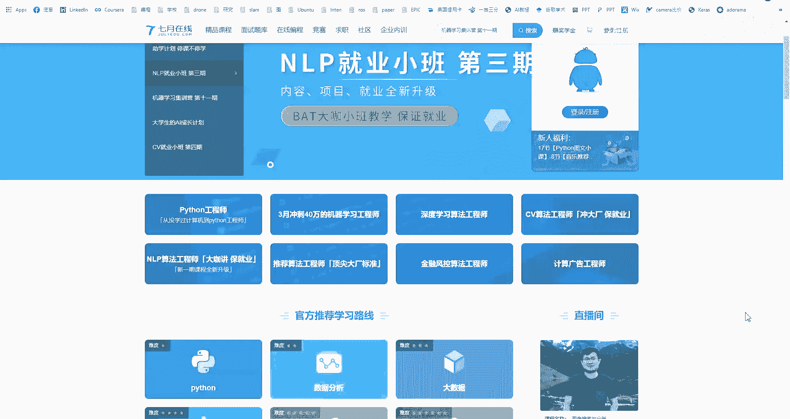

