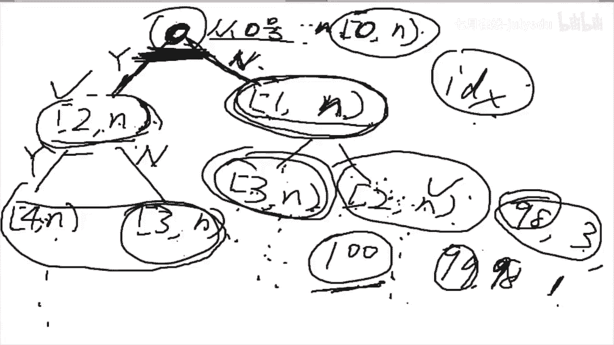
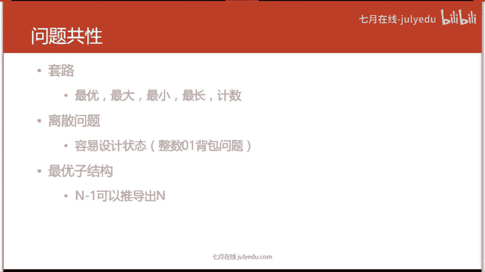

# 人工智能—面试求职公开课（七月在线出品） - P13：半小时掌握DP的基本套路 - 七月在线-julyedu - BV1Xf4y1r74s

嗯，今天要讲动态规划。大家在大学的时候算法课上，大家回忆一下，大学的时候算法课上老师有讲过动态规划这一章吗？我想做个调查吧，小调查。有人有听大学老师讲过动态规划这一章吗？或者你们在考试里有考过。

算法课的考试里。对的。就是我们也没有，大家觉得会不会觉得很奇怪，就是大学不讲。你平时也接接触不到，但是。公司面试的时候却考，大家不觉得这很奇怪吗？对不对？当然这不是老师没搞懂的问题啊。

老师想讲肯定是能搞得懂的这东西不难。我觉得动态规划真的是一件不难的东西。那为什么？老师不讲。考试也不考，但是公司面试的时候却要考你呢。其实。我觉得是。是这样的，就是说动态规划是一个。挺简单的东西。

但是呢公司为什么要考你呢？就是因为动态规划它的精髓是加缓存，动态规划的精髓真的就是加缓存。加缓存是我们在工作中经常碰到的东西，特别是你做线上的服务，或者你做大规模的一些服务的话。

大规模流量大大流量一些服务的话，缓存是必备的。就说没有缓存，你这个系统动动不了。所以其实动态规划的精髓就是加缓存。公司考你动态规划就是想考你会不会加缓存。

好。那大家有一个加缓存的概念之后，我们就来上今天的课。今天的课有一个前导技能，什么叫前导技能？前导技能就是说你必须会递归。这个课上周有老师讲过，不知道大家。呃，学的怎么样？就是一个是递归。

另一个就是基本的深度优先，就是那种回溯法、暴力搜索啊，这是必须会的。不会，今天的课听起来就会比较难过一些。当然这些东西也很简单嘛，所以必知必会的东西大家还是要掌握一下。那什么叫动态规划呢？

动态规划它又叫DP。是那个dynamicna programming。但是这个动态规划这个名字我从小我我很很早就开始学动态规划，当时就。没有想太明白，你想贪心法对吧？这个很直观，就是贪心搜索法，哎。

那就是搜索。回溯法，那它就是一个深度优优先，广度优先搜索bra叭一一堆的算法，包括比如说比较复杂的各种数。他就是树。各种图它就是图，比如说网络流，那它就是一个网络上面有流。

但是唯一一个名字最奇怪的就是动态规划。这动态规划的因为这个是历史原因啊，动态规划的来源它比较的。奇怪，然后发明的人也是随便起了一个名字，所以大家不要虽然叫他动态规划，但是不要特别的去在意他的名字。

因为这个名字真的不是特别的直观，跟其他的算法名字来比。我觉得他名字是没有意义的。虽然在这个应筹学里面好像也叫动态规划吧。那我们今天上课的目的。其实目的就是让大家可以。写出动态规划的代码。上完今天的课。

大家一定要能写得出动态规划的代码。无论这个代码优不优美。就必须能写的出来。ACAC指的是那个accept，就是在大家在li code上，如果通过了一道题，这道题通过了，它会返回给你一个提示。

叫accept。那跟AC相关的，还有什么呃WA啊，对吧？还有TRE啊这种大家要知道这些缩写。我们课程开始从呃198开始。就是li code198。呃，这题我是做过的。我看一下啊，我做的。把它删掉吧。

不要删全部就删就行。这个啥。我不知道大家都做了lead code的题目没有啊，我这边再讲一遍lea code上的一些注意事项。首先它会给你一个，我如果用的是java，假设我用的java，它会给你一个类。

然后类里面会有个方法。这个方法就是它传入数据的一个方法。比如说这道题它传入一个数组。就是一个这样的一个。function选，但是呢它有一个返回值，返回值就是你所需要的答案啊。

返回值就是他所需要你提供的答案。大家要注意它这个数组很有可能是0，啊，基本上每一个数据点里面都会有一个0。所以大家要特特别的判断说如果为零的话，你要返回零。然后如果不是零的话，我们就开始。

执行我们的解答过程。好。还看这道题。这道题的意思就是说。我题目大家就不要去读了，不要不要不要去读了，我跟直接跟大家说吧。我在一个一条街区上，一条街区上有N户人家。有恩护人家。

每户人家家里都有一定量的现金。然后呢，这个现金我是给你的，数量是给你的。然后有一个小偷沿接挨个偷。当最好的办法就是把所有人人家都偷一遍，对吧？所有人家都偷一遍。那。为什么不能这么做呢？是因为。

是因为它有个规则，就是说如果你连续偷两家，连续偷两家。那就会触发警报，他就不能再偷了，他就偷偷着这个任务就失败了，所以他不能连续投两家，你可以隔加偷。你也可以隔两家头。隔三架投都可以。

但是你就不能连续投两家。就问你小偷怎么偷才能偷到最最多的钱？大家对这个题目的题目意思有不理解的吗？这题目意思就非常的。非常的简单。这道题不算特别难啊，这道题的难度是ea性。我拿它当立题。

就是因为题目简单并且容易实现。那这道题。大家这后其他。😊，我今天讲动态规划的课，这道题可能用动态规划来写，但是。我想说的是，大家碰到这样的题目。你能第一反应是动态规划吗？因为面试官考你问题的时候。

或者大家在问遇到实际问题的时候，没有人会告诉你说，哎，这题就是用动态规划，你用动态规划给我解解一下，那这也太傻了，对吧？那这道题大家分析一下题目意思啊，一开始分析一下题目意思，题目意思是是什么呢？

就是我们要有一个策略，就是要输出一个策略。这个策略的含义就是。哪些家被偷了对吧？哪些家被偷了。然后有一个限制约束条件，这个约束条件就是。不能连着偷。这就是这道题。抽象以后就是我们要把题进行一个抽象。

抽象以后问你的一些东西。那。其实这个约束条件倒是无所谓的，为什么这么说呢？这个约束条件有可能他说隔两家不能投，那有可能下一回再考，你说呃，连连着只有连着三家不能投，连着两家还让你投，对吧？

这个都是随便问的那其实最重要的是什么？最重要的就是。你最后选择了偷哪几家？就是根据约束条件，你学最终选择了投哪哪几家。那。这不就是一个集合。一到N的一个集合，它的子集呢？对吧自己。

这道题在前面讲递归的时候应该有讲过，包括深度优先的时候也是讲过的。求一个集合的所有子集。用什么什么办法？有人回答一下吗？求一个集合的所有字己用的是什么办法？对，DFS。

所以这道题大家的第一个反应应该是DFS才才对。如果你跟我说，你第一反应这个动态规划，我真的是没话说。你是个老司机。那我们就用DF来做一下这道题。大家看啊DFS第一步是什么？定义你的搜索过程。

我们的搜索过程，我喜欢把它叫robot，为什么呢？这个。这个之前。我不知道之前递归是。哦，之前有老师讲过递归嘛。递归的含义不就是造一个比较小的自己，让他去帮自己干活嘛。干完活之后，我再去收割它的。

这个工作结果工作成果，那不就是你机器一个机器人，我造两个比较小的机器人或者三个比较小的机器人帮我干活。干完活之后，我再把这些呃结果给组装起来。做是呃完成我自己要干的活，这就是robot。

或者叫包包工头的一种行为。啊，地归其实就是这样一种行为。包工头对吧？我把这个活拆一拆。包给几个施施工队，那施工队的领导再把这个活拆一拆，包给几个小弟，最后这个活就干完了。这是。最简单的办法。

大家看一下DFS。DFS里边的返回结果很显然就是说要多少，最多能偷到多少钱作为它的返回结果。那DFS里边的参数应该是哪些呢？那这些参数。其实我们会把它叫做状态。那些参数怎么定非常的重要。

其实参数的定法跟你你返回结果的定法。更比你防回结果定法更重要。为什么呢？参数它决定了你整个的搜索。的过程。决定了你这个问题，你会怎么拆。假设你的是一个包包工头，你怎么把这个工程怎么拆怎么拆分分下去？

这个是。要看什么呢？要看你拿到的项目是什么样的项目吧，对吧？那这个。括号里的就是你拿到的项目。那我们看一下这个项目应该怎么来定。在习惯上在习惯上我们会用。一种数的方式来表示整个项目拆解的过程。

为什么用树呢？因为。因为他不可能有还啊。拆解过程不可能拆着拆的问题越差越大吧，只能问题越拆越小。所以一张。比如说一张流程图，它又没有还，那它其实就是个数了。好，我们用这个第一个节点来表示。

🎼来表示总的一个流程。总的一个流程是什么呢？我要从哎0家开始投0号0号开始投。对吧一直偷到N号总的过程。那我们用一个括号来表示吧。0N。对吧好。那现在怎么拆？那我总得选一家偷吧，就是我面对一个问题。

我面对0到N一家都没有被偷过的一个问题，我可能要选一家偷啊。那我选哪一家土呢？一般来说，我们会选第一家开始投。那你非要说我从中间一家开始投，那这个我也拦拦不住你，但是你写程序上就很麻烦嘛。

对吧我们一般来说从DD0加开开始头。所以。从零号我们就表示他从零号开始投。那有两种。决策一种是偷，一种是不偷，我偷用外表示，不偷用no表示。假如这个人他偷了这一这一家。那有人问有人回答一下吗？这个区间。

它下一次偷的区间会变成什么？哎，大家要跟上下次偷的区间会变成什么？下头的区间是1到N吗？再想想看。下次偷的区间。A，对，有同学回答是二道的。因为你偷了0号之后是不能偷一号的，连续两家是不能同时偷的。好。

我们就是2到N。假如这家不偷。假如这他不偷。我们会得到一个什么样的结果呢？就是刚才大家所说的1到N。好。哎，大家看这个时候。我们就把一个任务拆成了两个了。对吧假如一个人帮我把这个问题解决掉。

另一个人帮我把这个问题解决掉。那这个问题大家能解决吗？这个问题就是总问题大家能解决吗？这一步一定要想清楚啊，就是说有些人想不清楚地归。真的很多人想不清楚递归或者写不出来。其实就是这一步没有讲清楚。

你把这棵树画出来。大家看什么流程图，其实它就是一棵数啊，你把这棵树或者叫流程数把它画出来。画出来之后你发现哎。我把这个。工程承包给两个人，他们做完了，我这工程也就做完了。你能想到这一步。

你代码分分钟写写出来，对吧？然后我们再看这个人。这个人怎么怎么包？来，有人说说一下吗？填一下这这个。填下这个。来有人来来个人填一下这个。这这里的区间是什么？好吃。这里呢三恩了。这也是一样的。

我们就不不去画了。问题到这个地方，其实这个问题已经解决了嘛。对吧。就差写写代码，写代码真的是一分钟就写好了。这个问题的变量是什么？大家看我们画一个。我们画一个。这样的一个图之后。

我们发现每个节点之间的区别是什么？我们发现每一个节点之间的区别是是什么？大家看每个节点之间的区别是是什么？区别就是说对有人说偷到第几家，或者说从哪一家开始偷都可以，区别就是从哪一家开始偷。

所以他们的区别。每一个点的区别，每一个状态的区别。就是。就每一个节点它的区别，每一个工程上工程项目，他们的区别就是我们要对它的。对它这个括号里所需要填入的东西。括号里所需要填入的东东西。就是说。

你给别人包一个项目出去，你总得告诉他这个项目是什么吧。重复的项目你包给两个人是没有意义的东西。所以我们一定要有一个身份来表示说这个项目。它的T是什么？它的key在这道题里，这个项目的key。就是。

他的从哪一家开始偷，所以这道题很明显了，它的输入是。要有一个index。然后我们再写一个这个。为什么要再写一个这个东东西？再写一个这个东西，它的含义其实并没有什么含义。

含义就是说我们得把这个东西告诉他吧，你必须把每一家的钱，这个是已知的，必须告诉他吧。这玩意儿是不会变的，所以这个东西它如果是个全局变量，你就不用写在这个地方了。这东西只是说附带的写写一下而已。

大家就不用看这个对吧？我们就看前面这一个。好的。那。地归地归大家有说过地归第一个最重要是什么？递归第一行。第个第一行是什么？递归大家写递归的话。低国的第一行是啥？有人回答一下吗？你如果写递归的话。

第一行是什么？有很有很多说法，但是我们一般叫做边界条件。边界条件。边界条件一定要写，比如说这个偷完了呀。没有人在给你没有东西再给你偷了，这叫边界条件。当然，边界条件里边的。怎么return的？

边界条件就是到边界了，我要返回了，不能再往前了。怎么return的，大家不要着急，这里可以不着急写不着急啊，不着急不着急，但是边界条件一定要写。你先把边界条件写出来了，知道地位的边界在哪里了。

保证这个地归不会死掉，不会站一出，对吧？这是最重要的。好，这个到东这个地方不着急。那我们再看一下。我们刚才所谓的把任务拆成两个，对吧？拆成两个。那肯定是一个任务是A，一个任务是B了。拆成两个。

还记不记得第一个。左边那个是什么？是偷。偷就是我把这个都钱给拿了。😡，右边那个是布头，对吧？右边那个布头，我们这里其实就是个零了。我们把左边那个钱拿了之后，下一家就不能偷了，我们只能偷后面两家。

如果我们不拿这个钱的话，下一家就还可以投，我们就投。后呃下下一家就行了。然后返回值是什么呢？返回值其实就是它们之间的最大值。这个递归就写结束了。就这么简单，几乎所有的递归大家不要认为很难。

几乎所有的递归都是这么写的。大家看。所谓的所有地位都是这么写，其实非常简单。把每一个标识能标识这个状态，能标识这个工程。能标识这个任务。的信息全都放在括号里。什么叫人标识这个任务的信息？

就是说假设两个任务之间不一样，会有哪些东西不一样，会有哪些东西不一样。你就把所有会体现它的不一样不一致性的东西都放在里边。记得大家记住是所有啊所有。然后。这样之后。我们就可以。很轻松的写出递归来。

因为返回值就一个嘛，返回值就一个嘛，很轻松的写写出写出递归来。好，我们再看一下。这里的边界条件是什么？大家看边界条件是什么？因为我们这里是一个int。所以边界肯定是return一个int。

有人回答我一下吗？编界条件是是什么？这个程序已经快写完了，编缘条件是啥？好，变条件return0，为什么return0呢？你没没得偷了呀，你之后没得偷了呀。😡，说就是零嘛，没有的偷去0。好。

我们测试一下，测试就点右边一个装code。他可以测试帮你测试一下样例，这题并没有给样例，所以它的样例就是空的，这题没有给样例啊。那我们直接提交来看看。对不对？好，超时了，很明显，这个这题是对的。

为什么这么说呢？大家看我超时的这个点啊，超时的这个点数据量很大。也就是说在它之前，我已经通过了很多数据量小的点。所以这道题的问题不不是它的正确性问题，而是说它的时间复杂度的问题。好。

我们再来看刚才那张图。大家看。假设我们继续写继续写这个地方。继续写。这里是什么？这里说是这里是多少？来，大家。跟上如果继续写，这里是多少？32。这个地方呢这个地方是多多多少？右边右边是多少？RN。好。

还可以继续玩往下写。写到这里，大家就会发现。八蛋。这玩意儿和这玩意儿是不是重复的？这玩意儿和这玩意儿是不是重重复的？在往后的数据计算过程中，再往后的数据，假设你如果往后写会有更多的东西是重复的。

我刚才说了。两个任务我们其实已经把假设它不一样，我们已经把它不一样的标不一样的标记都放在。它的输入里了，就是那个括号里了，这个就是它的括括号，这个就是它的括号。这里就是它括号的内容嘛，一个index嘛。

我们会发现。我们已经放进去了，但是在搜索过程中。这两个任务其实是一样的。对吧因为他们没有。index上没有任何不一样，其实他们的两个任务就是一样的。两个任务是一样的，我们做了两遍，两个任务做一样的。

我们就做了两遍。那这个任务还有很多的子任务，我们也会做两遍。所以说我们有N个任务，我们就会把很多任务不停的做两遍就变成指数级别的了。那其实这题就简单了。有人说用过vicctor保存。那其实大家想一想。

你们在工作中加缓存，用rector加吗？有人跟我说加缓存用re来加吗？这个不太对吧。我们其实最直接的加缓存的方式是用map来加。就是你不要想它是一套动态规划，你如果一直想它是一套动态规划，那。

这个你碰到很难的题目，就是其实这题是很简单了。如果你碰到很难的题目，你怎怎么办呢？你老是想它是动态规划，那他要是不是呢？对吧。map哦，我们在这边加个c吧。开取的初始化的时候。

一定要clear一下这题这个没没毛病。然后在哪家开。在哪家开学？大家看。我们加ca的地方，首先我们不是说加ca啊，我们不是说去调用cach，而是c应该在什么地方被存进去。你先存才能取嘛，你存都没存。

你怎么取呢？所以说我们先看一下我们应该在哪存。一般来说，开你要存，那肯定是在返回答案的地方存吧。返回答案的地方走。那就在这个地方把cash存进去。对吧。该返回的还是要返返回。那存完之后就是取。

取是在什么地方取呢？取是在。可以在边界条件里去。去可我觉得一般来说是跟在边界条件的后面。因为你先判断它这个问题是不是超过边界了，超过边界了你就不需要做了嘛。然后在你实现递归之前。你就和边界之间。

你有一个取缓存的一个过程。那怎么取呢？Oh。是这样写对吧？空开 key。你看这个就是唉判断它有没有有的话。可以看看。我不太记得这个名字了，可能会编译错误。不太记得这个。函数的名字可可能是这个。

我们先提交一下哦，没错，编译没问题。好，再三。好，过了过了过了，其实就是这么简单。哎，我我点我我点错了。这题就是这么简单。然后呢，有人觉得哎。这个。加缓存对吧？好。飞我们先做到这里啊，等一下还会回回来。

其实它本质就是一个加黄色。递归的本质就是加缓存。大家记住这句话，这句话一定是对对的。啊，不是不是递归本，动态规划本质是递归。然后应该是递归加上缓存，这就是动态规划的本质。好的。那我们还要再说一遍。

递归是什么呢？递归是把一个原问题拆成子问题，再组装成原问题，把一个工程包给几个施工队。施工队做完之后，你验收一下，过了，你再去跟你的领导。对吧拿回扣不就是这种事事情吗？拿回扣的精髓不就是这个吗？

那所谓的最优子结构，哎，大家都看看就行了。最优子结构是什么呢？子问题的最优决策可以找出原问题最优决策。午后小息。那什么叫子问题最后决策呢？这就是子问题。也就是说你把一个工程外包给几个施工队。

这个施工队做完之后。你不需要再去返工了，你不需要再去再找一个施工队再来做了，这就叫做。最优子结构或者叫做无后效性。如果说你把这个工程包给几个施工队，施工队做完之后，你觉得不满意，你还要再去返工。

你要再找一批施工队来，那这就有有问题了，那这就有问题了。这道题就有。可能你搜索都做不了。大家要注意啊，一定要留心这个过程。其次是重叠子问题，重叠子问题也很简单，对吧？这里和这里。

比如说这个三和这个三重叠了。大家看为什么要有重叠子问题的前提啊。大家看为什么所谓动态规划要定义这么多什么最优子结构重叠子问题。为什么？有人说一下吗？为什么弄态话要定义这么复杂？哎，其实很简单嘛。哎。

对对对，这这个这个同学说的太好了。就是不然你缓存往哪加呢？不然你缓存往哪里加。如果说没有重叠子问题的话，你缓存完大家，这就体现不出动态图画的精髓来了，对吧？没有动合规划精髓，那他考你考什么呢？

不是就没没考点了吗？所以说一定要有重叠子问题。然后。充电子问题。那它就是冗余啊，所谓的重叠子问题就是冗余嘛。无论在什么算法里。那冗鱼我们就要把它去掉，去掉冗余有很多种方法，其中一种方法。

就是所谓的空间换时间。空间化时间就是加缓存嘛？空间化时间这么。看上去很很有逼格的画，其实就是加房子。那加缓存你不能加太多啊，你不能把机器给加爆了呀。

所以说我们还是要注意分析一下它的时间复杂度和空间复杂度。要划算嘛。对呀对呀，其实就是递归去重复，就是动态规划了。你会写递归会加缓存。哎，动态规划的，我觉得80%的体会你都能做得出来。好的。

我们看一下动策规划的一些套路啊，今天就讲主要讲套路。套路就是说有一个问题。然后让你求。求什么呢？要求最优。求最大求最小求最长，求技数或者求概率。一般的合都在规划。那刚刚有同学问我，为什么说你会加缓存。

只能解决80%，剩下20%怎么办呢？现在20%就是高级套路。就是套路也有分低级套路和高高高级套路。那高级套路就是大家后面要学的一些内容。好，首先它是。这些套路大家记住啊，反正题目里有这些字眼的。

有可能都是动态规划。然后他一定是个离散的问题。什么叫离散的问题呢？就是说大家看。我们刚才。我们刚才去区别这些状态任状态的时候，我们都是用一个in index来区别的。大家注意到没有？

intex index是一个整数。index是一个整数，它是有范围的，就是0到N。那如果index是个实数呢，当然index不会是个实数啊，不会有小数。那假如。两个状态之间区别。就是一个实数呢。

这个区别就很难去区别了，为什么很难去区别？你你可以估量。一个。0到N的范围内有多少个整数，对吧？这个很好估计。那0到N的范围内有多少个实数，你能估计得出来吗？估计不出来实数的数量是无从多个的。所以。

我们一般解的问题都是离散的问题，不是一个连续的问题，连续的问题很难弄。所谓的容易设计状态，哎，其实就是。那个in indexex啊inex就是状态。状态机不是动态规划，状态机是另一个东西。

状态机一般会跟自动机关联在一起。那离散的问题最经典的就是01背包问题，就是整数01背包问问题。什么叫临异背包问题呢？就是说。呃。差不多就是跟我们今天做的那个。偷小小偷偷东西。

差差不多就是小偷偷东西的时候，哎，他的背包有一个上限。就是他最多只能偷多少钱。当然是为为什么说我们加个上限这道题就不一样了。假设。他的上限是100，对吧？他最多只能投100块钱。

他今天偷到100块钱就偷满了。那你偷到99和98。这是有区别的，我当然希望投到99了。但是有一户人家。只有98块钱，另一户人家只有3块钱。海户人家是1块钱。你不可能说哎，我拖完98之后。

今天偷的差差不多，我就不投了。98之后，我要跳过3块钱的人家，我再去偷1块钱的人家凑到999。这就是所谓的背包问题。对吧我现在又随便出了一一道题，就是真的是随随便出了一道题。这也是一道题哦。

本来这道题的难度比背包问题更难一些。你看相邻的两个不能偷，对吧？相邻的两个不能偷，哎呀，我就随随意随口就出了出了一道题。

那问题的共性还有一个共性是什么？最优子结构所谓的N减一可以推导到推导出N。这里这个这句话其实是个废话，为什么呢？我们说了。动态规划一定是能用递归来写的。那地归。之前的老师也说过，递归最经典的事情是什么？

N减一可以对导出N来，这就是递归里面最经典的一件事情。如果不满足这个的话，那就不能用地柜来做。那这只有最后你看。套路对吧？这个没没什么好说，离散问题在家面对的一般都是离散的问题。

最有子结构就是它可以用递归来写，这就是它的问题的共享。再往下说。那基本步骤是什么呢？哦，对，这里的N减一不一定是N减1，A股可能是NN减2了。刚才不是这道题题里面的图，不就是有一个N呃。

我看一下这道题里不就是有一个对吧？加2吗？加2。加二的规模就小了2嘛，我这里的意思只是说简写简写的意思就是说子问题是可以推导出原问题的解的。N减一代表的是子问题。就像古文里边对吧？三个不一定就是三个。

三个指的是多个。一个也不一定是一个，一个指的是多多个若干个。

